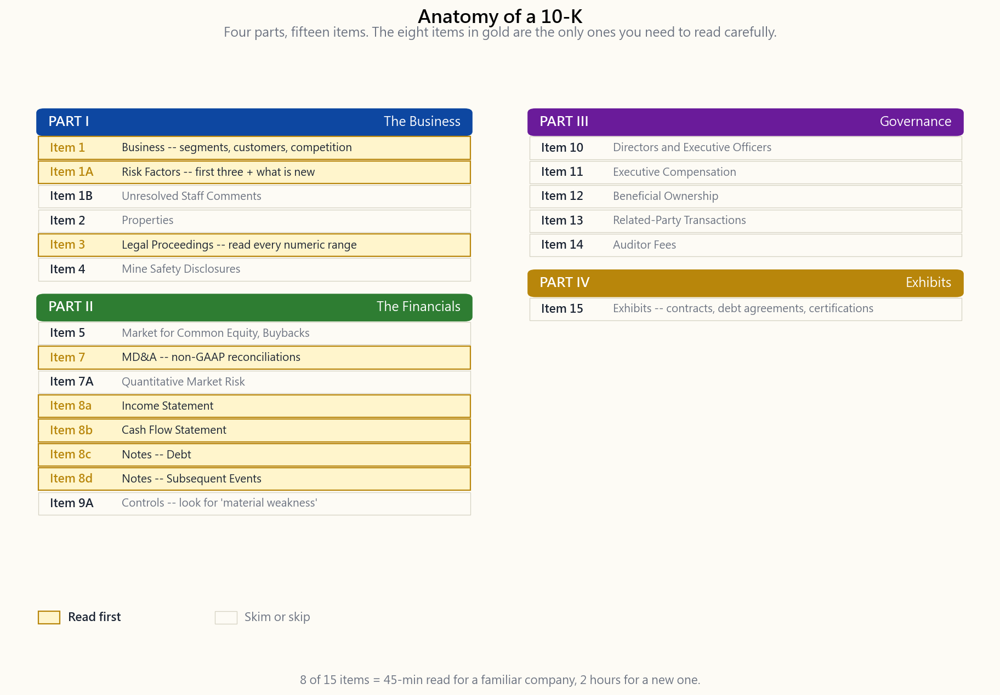

# Side Lesson 02: How to Read a 10-K

---

## Part 1: Reading Section

---

### 1. Why This Is Important

The 10-K is the single document where the SEC requires a public company
to tell the truth, in writing, signed by its CEO and CFO under personal
criminal liability. It is the closest thing in capital markets to a
sworn deposition — and unlike the glossy annual report mailed to
shareholders, every word in the 10-K has been re-read by lawyers,
auditors, and plaintiffs' counsel hunting for the next class action.

Four reasons every retail investor should know how to read one:

1. **The information is identical to what hedge funds get.** The
   $400/seat Bloomberg analyst and the $0/seat retail investor are
   reading the same PDF. Whatever edge a professional has comes from
   *interpretation*, not from access. Week 8 already taught the three
   statements; this lesson teaches the wrapper around them — the parts
   most retail readers skip and most professionals read first.
2. **It is the only place where the bad news lives.** Press releases
   curate. Earnings calls spin. The 10-K's Risk Factors and Legal
   Proceedings sections are written by lawyers whose job is to disclose
   *enough* that a future plaintiff can't claim the company hid
   anything. If something is going to blow up — a regulatory probe, a
   patent expiration, a customer concentration — it appears here first.
3. **It is searchable.** SEC EDGAR full-text search lets you query
   every 10-K ever filed for a phrase. Find every company that
   mentioned "going concern" last quarter. Find every filer with a
   "material weakness" in internal controls. This is institutional-
   grade screening for free, and almost no retail investor uses it.
4. **It rewards skill, not speed.** A 10-K is 100-300 pages. Reading it
   linearly takes a full weekend. Reading it like a professional takes
   45 minutes — because you know the eight items that matter, you
   `Ctrl-F` for the four phrases that signal trouble, and you skip the
   85% that is boilerplate. This lesson is that 45-minute discipline.

The deeper point is that alpha is rare: what little *does* exist for
a retail investor mostly lives in *reading the filings nobody else
reads*. Not in clever models. Not in faster data. In the unglamorous
discipline of opening EDGAR and using `Ctrl-F`.

---

### 2. What You Need to Know

#### 2.1 10-K, 10-Q, 8-K — the three filings that matter

The SEC requires public companies to file three core periodic
disclosures. The 10-K is annual, the 10-Q is quarterly (filed three
times a year — the fourth quarter is folded into the 10-K), and the
8-K is event-driven, filed within four business days whenever
something *material* happens between the periodic filings.

A 10-Q is a 10-K's lighter cousin: unaudited financials, abbreviated
MD&A, and updates to the risk factors only if something has changed.
You read 10-Qs to track quarter-on-quarter trends; you read 10-Ks to
*understand the business*. The 10-Q is the heart-rate monitor; the
10-K is the annual physical.

The 8-K is the surprise. Items 1.01 (material agreement), 2.02
(results of operations — earnings releases live here), 4.01/4.02
(auditor change, non-reliance on prior financials), 5.02 (departure
of officer), and 8.01 (other material events) are the ones with
trading consequences. A 4.02 8-K — "the previously issued financial
statements should no longer be relied upon" — is the single worst
filing a company can make. It almost always precedes a stock-price
collapse and frequently a delisting.

Filing deadlines are tiered by company size. Large accelerated filers
(public float above $700M) file the 10-K within 60 days of fiscal
year-end and the 10-Q within 40 days. Accelerated filers ($75M-$700M)
get 75 and 40. Non-accelerated filers get 90 and 45. A company that
misses its deadline files a Form NT (notification of late filing)
requesting a 15-day extension. *A late filing is itself a signal.*
When a company can't close its books on time, something is wrong with
the books, the people closing them, or both.

A note on fiscal years: not every company runs January–December.
Apple's fiscal 2024 ended September 28, 2024. Microsoft's ends June
30. Walmart's ends late January (after the holiday-return cycle).
Always read the cover page first — the fiscal-year-end date sits in
the upper right and changes how you interpret seasonality.

#### 2.2 The standard four-part structure

Every 10-K follows the same regulation-mandated skeleton. Once you
have the map, navigation is mechanical.

**Part I — the business.** Item 1 (Business) describes what the
company does, its segments, its customers, its competitors. Item 1A
(Risk Factors) is the lawyers' confessional — every non-trivial thing
that could go wrong, in descending order of severity. Item 1B
(Unresolved Staff Comments) flags any open questions from the SEC
review staff; usually empty, but if populated it means the SEC is
still arguing with management about disclosure. Item 2 (Properties),
Item 3 (Legal Proceedings), and Item 4 (Mine Safety) round out the
descriptive section.

**Part II — the financials.** Item 5 (Market for Registrant's Common
Equity) covers buybacks and dividend history. Item 7 (Management's
Discussion and Analysis — MD&A) is management's narrative explanation
of the financial results, including non-GAAP reconciliations. Item 7A
(Quantitative and Qualitative Disclosures About Market Risk) covers
interest-rate, FX, and commodity exposures. Item 8 (Financial
Statements and Supplementary Data) is the audited Income Statement,
Balance Sheet, Cash Flow Statement, and Notes — the ground truth Week
8 taught. Item 9A (Controls and Procedures) contains the internal-
controls assertion; if you see "material weakness" here, stop and
read carefully.

**Part III — governance.** Items 10–14 cover directors, executive
compensation, ownership, related-party transactions, and auditor
fees. Most of this content is incorporated by reference to the
DEF 14A (proxy statement) filed separately about a month after the
10-K. The compensation tables and the related-party-transaction
disclosure are the highest-value items in this part.

**Part IV — exhibits.** Item 15 lists every contract, debt agreement,
and certification. The exhibit index is dry but useful: this is where
you find the actual loan covenants, the customer contracts that were
material enough to file, and the CEO/CFO Section 302 certifications.

#### 2.3 The eight items that actually matter

Reading a 10-K cover-to-cover is for new analysts and lawyers. For
investing, focus on these eight:

1. **Business segments (Item 1).** What is the revenue mix and how is
   it changing? A company that "makes phones" but really makes
   services-attached-to-phones is a different investment than a
   pure-hardware story. Apple's Services segment going from 12% of
   revenue in FY15 to 25% in FY24 is the single most important
   sentence in any Apple analyst's deck — and it is in Item 1.
2. **Risk Factors (Item 1A).** Read the *first three only*. They are
   ordered by severity. New risk factors year-over-year are the most
   important — diff this section against last year's 10-K and the
   delta tells you what management is newly worried about.
3. **Legal Proceedings (Item 3).** Read every named lawsuit. Pay
   attention to the disclosed "loss contingency" — companies must
   disclose a numeric range when loss is probable and estimable.
   Numeric ranges in Item 3 are real money; vague language is usually
   nuisance.
4. **MD&A non-GAAP reconciliations (Item 7).** Every adjusted EPS,
   adjusted EBITDA, or organic-growth figure must reconcile back to
   the GAAP number. Read what is being added back. "Stock-based
   compensation" added back to adjusted EPS is a red flag — it is a
   real recurring expense paid in shares.
5. **Income Statement (Item 8).** Revenue, cost of revenue,
   operating expenses, operating income, net income. Two-year and
   three-year columns are required, so you can see the trend
   immediately.
6. **Cash Flow Statement (Item 8).** Operating, investing, financing.
   Week 20's lesson: net income can be manufactured; cash flow from
   operations is harder. The CFO line minus capex is free cash flow,
   the number that pays buybacks, dividends, and debt.
7. **Notes on Debt (Item 8 notes).** The debt note lists every
   tranche, its maturity, its interest rate, and its covenants. The
   maturity wall is in this note. So is the language "in the event of
   default, the lenders may accelerate." Always check.
8. **Subsequent Events (Item 8 notes, last note).** Anything that
   happened between fiscal year-end and the filing date that is
   material. Acquisitions, lawsuits, debt issuances, executive
   departures. This is where companies disclose the things that
   happened *during* the audit window.

#### 2.4 Power tools: EDGAR full-text search and four `Ctrl-F` strings

Two free tools transform how you read filings.

The first is EDGAR full-text search at `efts.sec.gov/LATEST/search-
index?q=...`. You can search every filing of every public US company
for any phrase across any time window. Try `"going concern"` filed in
the last 90 days — you will find every company whose auditor has
expressed doubt about its ability to survive twelve more months.
That is a screen no retail tool builds because it is too useful to
give away for free, except the SEC already gives it away for free.

The second is `Ctrl-F`. When you open a 10-K, search for these four
phrases before reading anything else:

- **"going concern"** — the auditor has flagged solvency risk
- **"material weakness"** — internal controls have failed
- **"restate"** / **"restatement"** — prior financials were wrong
- **"subpoena"** / **"investigation"** — a regulator is involved

If any of these phrases appears, read the surrounding paragraph
carefully. If none of them appears, you have just done in 30 seconds
what would otherwise take three hours of reading.

A worked example: Apple's FY2024 10-K (fiscal year ended September
28, 2024). Total revenue $391.0B, up 2% from FY23. The five reportable
segments are iPhone $201.2B (up 0.3%), Services $96.2B (up 13%), Mac
$30.0B (up 2%), Wearables/Home/Accessories $37.0B (down 7%), and
iPad $26.7B (up 5%). The single number that matters most in that
list is the *delta*: Services growing double digits while iPhone is
flat is the entire story of Apple as an investment in 2024. That
sentence comes from Item 1; the segment table comes from Note 12
(Segment Information). Two pages of the 10-K, total reading time
five minutes, and you have the thesis.

---

### 3. Common Misconceptions

1. **"The 10-K is too long to read."** It is, if you read it
   linearly. The eight-item triage above takes 45 minutes for a
   company you already know and 2 hours for a new one.
2. **"The annual report and the 10-K are the same thing."** They are
   not. The annual report is marketing. The 10-K is sworn legal
   disclosure. Always read the 10-K version.
3. **"Risk factors are boilerplate, you can skip them."** The first
   three are usually company-specific and updated yearly. The
   *delta* between this year and last year is the highest-value
   reading in the entire document.
4. **"Adjusted earnings is the right number to use."** Adjusted
   numbers are useful for trend analysis only when you understand
   exactly what management is excluding. GAAP is the contract.
5. **"If the auditor signed off, the financials are correct."**
   Auditors give a *reasonable assurance* opinion. Material
   misstatements have slipped past every Big Four firm. "Material
   weakness in internal controls" is the auditor admitting they are
   not confident.
6. **"Subsequent events are minor footnotes."** Sometimes. But the
   biggest M&A announcements, debt-covenant amendments, and
   regulatory settlements live in the Subsequent Events note
   precisely because they happened after fiscal year-end but had to
   be disclosed.
7. **"EDGAR is hard to use."** EDGAR's UI is dated, but full-text
   search at efts.sec.gov works perfectly and is free.
8. **"International filings are equivalent."** They are not. A
   foreign private issuer files a 20-F, which is annual but less
   detailed and less timely than a 10-K. Defaulting to US-listed
   names is part of why the disclosure regime is what it is.

---

### 4. Q&A Section

**Q1. How long does it take to file a 10-K after fiscal year-end?**
60 days for large accelerated filers (public float above $700M),
75 days for accelerated filers, 90 days for non-accelerated filers.
Companies that miss file Form NT 10-K asking for a 15-day extension.

**Q2. What is the difference between a 10-K and an annual report?**
The annual report is the marketing document mailed to shareholders.
The 10-K is the legally binding SEC filing. Increasingly, large
companies print the 10-K *as* their annual report (Berkshire,
JPMorgan), but smaller companies still issue glossy versions
separately. Always read the 10-K.

**Q3. Are 10-Ks audited?** Yes. The financial statements (Item 8)
are audited by an independent registered public accounting firm. The
rest of the 10-K is *reviewed* by the auditor for consistency with
the financials but not separately audited.

**Q4. What does "material weakness" actually mean?** It means the
company's internal financial controls have a deficiency severe
enough that it could result in a material misstatement of the
financial statements, undetected. It is the auditor's strongest
public negative signal short of refusing to sign.

**Q5. Where exactly do I find segment data?** Item 1 (Business) gives
the qualitative segment description. The quantitative segment
revenue/operating-income table lives in the Notes to Financial
Statements, usually titled "Segment Information" — typically Note 11,
12, or 13 depending on the company.

**Q6. What is "going concern" language?** Under PCAOB AS 2415, the
auditor must add an emphasis paragraph if there is *substantial doubt
about the entity's ability to continue as a going concern* for the
next twelve months. It is the auditor warning the market that the
company may not survive a year. Almost every 10-K that contains those
two words is followed by either bankruptcy, dilutive equity raise, or
distressed debt restructuring within 18 months.

**Q7. How do I diff this year's 10-K against last year's?** The
SEC's EDGAR Online Inline XBRL viewer at sec.gov shows side-by-side
comparison automatically. Free third-party tools like Last10K or
DiffWords (paid) handle the rest. For free, copy-paste both Risk
Factors sections into a text diff tool.

**Q8. What are XBRL exhibits?** Every 10-K filed since 2009 must be
tagged in eXtensible Business Reporting Language — a machine-readable
markup that lets any tool extract any line item programmatically.
This is what powers every "stock data" service you use.

**Q9. Should I read all of Item 1A Risk Factors?** No. Read the first
three (ordered by severity by SEC convention) and the *new ones added
since last year*. The remaining 30-50 risk factors are mostly
boilerplate copied from peer-company filings and Latham & Watkins
templates.

**Q10. What about 10-Ks from foreign companies listed in the US?**
Foreign private issuers file 20-F instead of 10-K. The 20-F is
annual, contains similar information, but is filed less promptly
(four months after fiscal year-end vs. 60 days) and uses IFRS or
home-country GAAP rather than US GAAP. ADRs of TSMC, ASML, Toyota,
Novo Nordisk all file 20-Fs.

**Q11. How do I find a company's most recent 10-K?** Go to
sec.gov/edgar, type the ticker into the search box, click Filings,
filter by Form Type "10-K". Most recent is at the top. Or use the
direct URL pattern: `sec.gov/cgi-bin/browse-edgar?action=getcompany&
CIK=<ticker>&type=10-K&dateb=&owner=include&count=40`.

**Q12. Do I need to read the proxy (DEF 14A) too?** For positions you
plan to hold longer than a year — yes. The proxy is where executive
pay, related-party transactions, and the actual voting items sit. The
ratio of CEO comp to median-employee comp, the auditor-fee table, and
the change-of-control golden-parachute disclosures are all in the
proxy and almost nowhere else.

---

## Part 2: YouTube Script

---

**VIDEO TITLE:** How to Read a 10-K in 45 Minutes — The Eight Items
That Actually Matter
**RUNTIME TARGET:** ~11 minutes
**HOSTS:** Horace, Stella

---

**[INTRO — 0:00]**

**HORACE:** Welcome back. Side lesson today — we're going to look at
the document that contains every important fact about a public US
company. The 10-K filing.

**STELLA:** And the goal here, very specific: by the end of this
video, you should be able to download Apple's 10-K and pull out the
investment thesis in less than an hour.

**HORACE:** Forty-five minutes if you've done it before. Two hours
the first time. Worth every minute, because this is the document
that hedge fund analysts and the retail investor on a Sunday morning
are reading from the *exact same source*.

**STELLA:** No edge in access. Edge is in interpretation.

**[SECTION 1 — WHAT IS A 10-K — 0:55]**

**HORACE:** A 10-K is the annual report a US public company files
with the SEC. Required by section 13 of the Exchange Act. Signed by
the CEO and CFO under personal criminal liability. That last part
matters.

**STELLA:** So this is different from the glossy annual report that
arrives in the mail.

**HORACE:** Completely different. The annual report is marketing.
The 10-K is sworn disclosure. They look similar, but every word in
the 10-K has been re-read by lawyers worried about getting sued.

**STELLA:** And there are sister filings — the 10-Q and the 8-K.

**HORACE:** Right. 10-Q is quarterly, lighter, unaudited. Filed three
times a year. The fourth quarter rolls into the 10-K so you don't
get a Q4 10-Q. Then the 8-K — that's the surprise filing. Material
event happens, company has four business days to disclose it.

**STELLA:** Four business days. That's where earnings releases live —
Item 2.02 of the 8-K.

**HORACE:** And it's where the worst filing in capital markets lives
— Item 4.02. "Non-reliance on previously issued financial
statements." When you see that, it means the company is telling the
market the old numbers were wrong. That filing almost always
precedes a stock-price collapse.

**[SECTION 2 — THE FOUR-PART SKELETON — 2:20]**

**STELLA:** OK so let's open one. Walk me through the structure.

**HORACE:** Every 10-K has four parts, mandated by SEC Form 10-K
itself. Part I is *the business*. Part II is *the financials*. Part
III is *governance*. Part IV is *exhibits*.

[VISUAL: image/side02_10k_anatomy.png]

**STELLA:** And inside each part there are numbered items.

**HORACE:** Yes. Part I has Items 1 through 4. Part II has Items 5
through 9. Part III has 10 through 14. Part IV has Item 15. The
numbering is the same across every 10-K of every company, every
year. So once you know where Item 1A lives, you know where it lives
in every 10-K you'll ever read.

**STELLA:** That is the entire point of the SEC mandating the form.
Comparability.

**HORACE:** Now this image — those eight items in gold — those are
the ones I open first. Item 1, 1A, 3, 7, and 8. Plus inside Item 8,
the income statement, the cash flow statement, the debt note, and
the subsequent-events note.

**STELLA:** Eight items out of fifteen.

**HORACE:** And that's the trick. You're not reading 250 pages.
You're reading maybe forty.

**[SECTION 3 — THE EIGHT THINGS YOU READ — 3:55]**

**STELLA:** Walk me through them. What am I looking for in each one?

**HORACE:** Item 1, Business — segment mix and how it's changing.
Item 1A, Risk Factors — first three only, plus new ones since last
year. Item 3, Legal Proceedings — every named lawsuit, especially
ones with a numeric loss range. Item 7, MD&A — read the non-GAAP
reconciliations. What is management adding back to get to "adjusted
EPS"? If they're adding back stock-based compensation, that's a real
expense being hidden.

**STELLA:** Then financials.

**HORACE:** Item 8 is income statement, balance sheet, cash flow,
and notes. Within the notes, two specific ones — the debt note,
which lists every tranche and its maturity and its covenants, and
the subsequent-events note, which discloses everything material that
happened between fiscal year-end and the filing date.

**STELLA:** Those subsequent events. People skip them.

**HORACE:** They shouldn't. Acquisitions get announced there. Debt
covenant amendments get announced there. Sometimes lawsuits. The
subsequent-events note is where the *recent* news lives, in a
document that is otherwise about a fiscal year that ended months
ago.

**[SECTION 4 — APPLE FY2024 WORKED EXAMPLE — 5:50]**

**STELLA:** Let's do an actual one. Apple FY2024.

**HORACE:** Fiscal year ended September 28, 2024. Filed November 1,
2024. Total revenue $391 billion, up 2% from FY23.

[VISUAL: image/side02_aapl_segments.png]

**STELLA:** And the segment mix is on this chart.

**HORACE:** Five segments. iPhone $201 billion, up 0.3%. Services
$96 billion, up 13%. Mac $30 billion, up 2%. Wearables, Home, and
Accessories — that's AirPods, Apple Watch, HomePod — $37 billion,
*down* 7%. iPad $27 billion, up 5%.

**STELLA:** And the number that matters most is which one?

**HORACE:** The Services growth rate. Apple is being repriced from
a hardware company to a software-and-services company. Services have
60-plus percent gross margins versus 35-ish for iPhone. Every dollar
of Services growth flows through to the bottom line at almost double
the rate of an iPhone dollar.

**STELLA:** And that whole sentence — that whole investment thesis —
came from one segment table.

**HORACE:** From Note 12 in Apple's 10-K. Two pages. Five minutes of
reading, if you know exactly where to go.

**[SECTION 5 — POWER TOOLS — 7:30]**

**HORACE:** Two free tools that nobody talks about and that
transform how you read these.

**STELLA:** First one.

**HORACE:** EDGAR full-text search. The SEC has indexed every word
of every filing. You can go to efts.sec.gov, type a phrase, and find
every company that ever used it.

**STELLA:** Give me a useful query.

**HORACE:** Search "going concern" filed in the last 90 days. You
will get a list of every public US company whose auditor has
expressed doubt about their ability to survive twelve months.
Hedge funds pay screening services thousands of dollars a month for
that exact list. The SEC gives it to you for free.

**STELLA:** And the second tool.

**HORACE:** Ctrl-F. Open the 10-K, search for four strings *before*
you read anything. "Going concern." "Material weakness."
"Restatement." "Subpoena" or "investigation." Any one of those four
phrases appearing in a 10-K is a stop-everything signal. If none of
them appear, you've eliminated 90% of the trouble cases in 30
seconds.

**STELLA:** That's a checklist.

**HORACE:** It is. Most retail investors don't have one. That alone
is an edge.

**[SECTION 6 — THE INTERACTIVE TOOL — 8:50]**

**STELLA:** And we have a lab on the website for this.

**HORACE:** Yes. The 10-K Navigator. You pick a ticker — Apple,
Microsoft, Coke, JPMorgan, Ford, Meta, Nvidia. It pulls up the most
recent 10-K from EDGAR. It shows the segment chart embedded right
on the page. And it summarizes the top three risk factors — the
ones you'd read first if you opened the actual filing.

[VISUAL: interactive — interactive/side02_10k_navigator.html]

**STELLA:** So you can use it as a triage tool before you go read
the actual document.

**HORACE:** Or to compare. Pick Ford and pick Apple. Look at the top
risk factor for each. Ford's first risk factor mentions cyclicality
and supply-chain disruption. Apple's first risk factor mentions
competitive intensity and dependence on a small number of products.
Reading those side by side tells you what kind of business each one
is in *one paragraph*.

**[OUTRO — 9:55]**

**STELLA:** Bottom line.

**HORACE:** Three things. One, the 10-K is the document. Not the
annual report, not the press release, not the analyst note. The 10-K
is the sworn disclosure and that's where the truth lives.

**STELLA:** Two.

**HORACE:** Eight items. Item 1, 1A, 3, 7, 8 — and inside Item 8,
the income statement, cash flow, debt note, subsequent events. That's
the read. Forty-five minutes for a familiar company, two hours for a
new one.

**STELLA:** Three.

**HORACE:** Four phrases. Going concern. Material weakness.
Restatement. Investigation. Ctrl-F before you read. If any of them
hit, slow down. If none of them hit, you've ruled out the worst
trouble cases in less than a minute.

**STELLA:** And alpha is rare. The unglamorous version of alpha is
sitting on a Sunday morning reading a filing that nobody else read.

**HORACE:** That's the lesson. Filings are free. Reading is a skill.
See you next side lesson.

**[END]**
