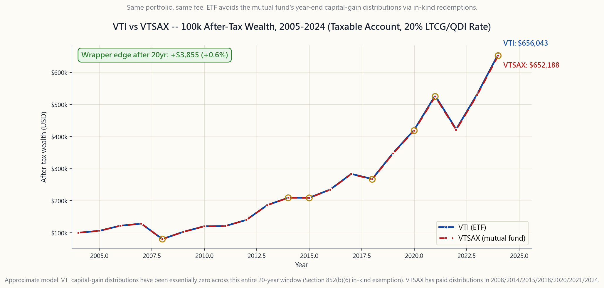

# Side Lesson 03: ETF Mechanics — Creation, Redemption, and the Tax-Efficiency Magic Trick

---

## Part 1: Reading Section

---

### 1. Why This Is Important

If you are following Horace's program at all faithfully, the single
biggest position in your portfolio is an ETF — probably VTI, SPY,
or QQQ. SOUL #1 is blunt about this: alpha is rare, the default is
passive, and the cleanest way to own the US market (SOUL #16) is
one of three ETFs that can be bought commission-free anywhere. So
it is worth ten minutes of your life to understand the plumbing.

There are four reasons the plumbing matters:

1. **It explains why ETFs are tax-efficient and mutual funds are
   not.** Two products that hold the *same* portfolio at the
   *same* fee — VTI and VTSAX, both 100% Vanguard Total Stock
   Market — can produce wildly different after-tax returns in a
   taxable account because of one structural difference: in-kind
   versus cash redemptions. Once you see the mechanism you know
   which sleeve belongs in the brokerage account and which in the
   IRA.
2. **It explains premium/discount.** When a fixed-income ETF
   prints on screen at -4% to its NAV during a panic, it is not
   "broken." It is doing exactly what its design says. Knowing
   that prevents the worst kind of forced sell.
3. **It explains why closed-end funds (CEFs) trade at persistent
   discounts** while ETFs do not. Same wrapper category, very
   different mechanics. Recognising the distinction keeps you
   from buying a CEF at NAV and a year later discovering it is
   "supposed to" trade at -10%.
4. **It explains the March 2020 bond-ETF dislocation** — the
   stress event bond ETFs *passed* even though the headline "ETF
   trading at a 5% discount" looked alarming. The headline was
   actually the ETF doing price discovery on a frozen underlying
   market. Understanding that puts you on the right side of the
   regulator's post-mortem.

This is one side lesson where the plumbing actually changes how
you size positions. Worth the ten minutes.

---

### 2. What You Need to Know

#### 2.1 Authorized Participants and the Creation/Redemption Cycle

An ETF is not a single thing. It is two markets stitched together.

The **secondary market** is what you see — Robinhood, Schwab,
IBKR. You buy 100 shares of VTI from another investor through a
public exchange. Cash for shares, exactly like a stock. The ETF
issuer (Vanguard, BlackRock, State Street) is not involved in
that trade.

The **primary market** is hidden from retail. A small group of
large broker-dealers — Goldman, Morgan Stanley, Citadel
Securities, Virtu, Jane Street, Flow Traders, Susquehanna — sign
agreements with the ETF sponsor that make them **Authorized
Participants (APs)**. There are usually 20-50 APs per ETF; in
practice three or four do most of the volume on any given day.

The cycle works like this. The sponsor publishes a **creation
basket** every morning before the open: the exact list of stocks
(and weights) that one **creation unit** of the ETF holds. A
creation unit is typically 25,000 to 100,000 ETF shares — call it
$3-10 million of NAV.

When the ETF trades at a **premium** to NAV, an AP:

1. Buys the underlying basket of stocks on the open market.
2. Delivers that basket *in kind* to the ETF sponsor.
3. Receives a fresh creation unit of new ETF shares.
4. Sells those new ETF shares on the exchange at the premium.

The premium is the AP's profit. New supply hits the market, the
premium compresses, and price re-aligns with NAV.

When the ETF trades at a **discount**, the cycle reverses:

1. The AP buys ETF shares cheaply on the exchange.
2. Delivers them back to the ETF sponsor.
3. Receives the underlying basket of stocks *in kind*.
4. Sells the basket on the open market at the higher fair value.

The discount is the AP's profit. ETF shares get retired, supply
shrinks, price re-aligns with NAV.

This whole loop is automated, runs all day, and is invisible to
you. The only direct evidence of it you ever see is the **iNAV**
(intraday indicative value) that the exchange publishes every 15
seconds — a continuously-updated estimate of the basket value,
against which the current bid/ask is checked. When iNAV and price
diverge by more than a few basis points, an AP shows up.

#### 2.2 Why ETFs Are Tax-Efficient (the In-Kind Trick)

Every fund that holds appreciated securities — mutual fund, ETF,
hedge fund — has the same problem: when an investor wants out,
the fund must somehow free up cash. If the fund sells appreciated
stock to pay the redeemer, it realises a capital gain that is
taxed *at the fund level* and the fund is required by law to
distribute that gain to **all remaining shareholders** by year
end. Loyal long-term holders pay tax on gains they did not ask
the fund to realise. This is the core flaw of the open-end mutual
fund structure.

ETFs sidestep this through the in-kind primary-market mechanism.
When an AP redeems ETF shares for the underlying basket, the
sponsor selects which **specific tax lots** of the underlying
stocks to hand over — and naturally hands over the lots with the
**lowest cost basis** (largest embedded gains). Those gains leave
the fund permanently in a non-taxable in-kind transfer. Section
852(b)(6) of the Internal Revenue Code blesses this: an in-kind
redemption is not a sale and triggers no fund-level capital gain.

The result is real, though for *index* mutual funds it is
moderate rather than dramatic. Vanguard's VTSAX (mutual fund)
and VTI (ETF) hold *the same portfolio at the same expense
ratio* -- 0.04% on the institutional side. VTSAX has distributed
long-term capital gains in years like 2014, 2015, 2018, 2020,
and 2024 (each in the range of 0.1% to 0.7% of NAV); VTI has
distributed essentially zero capital gains in its entire
history. Over a 20-year hold in a taxable account at a 20%
combined LTCG rate, the after-tax wealth difference is on the
order of half a percent of terminal value -- a few thousand
dollars on a 100k starting balance. For a typical *active*
mutual fund pushing 5-10% of NAV in distributions during a
turnover-heavy year, the same calculation produces tens of
thousands of dollars of drag.

This is also why Vanguard's **patented dual-share structure** —
VTI is literally a share class of VTSAX, sharing the same
portfolio manager and the same trades — gave them an unusual
edge for two decades. The patent expired in 2023. Other issuers
are now launching ETF share classes of existing mutual funds,
which is one of the more important structural shifts in the fund
industry that nobody outside fund operations is paying attention
to.

#### 2.3 Premium/Discount, iNAV, and the March 2020 Bond ETF Dislocation

The arbitrage loop is fast for liquid US-equity ETFs. SPY, VTI,
QQQ, IVV trade within 2 basis points of NAV essentially all day.
You will never see a meaningful premium or discount on a megacap
US-equity ETF in normal conditions.

Where it gets interesting is in **less-liquid underlyings**:
high-yield bonds, emerging-market debt, municipal bonds, MLPs.
When the underlying market is itself thin or temporarily frozen,
the ETF price *leads* the underlying — the ETF trades
continuously on the exchange, the underlying does not. The
"discount" you see is often not a dislocation; it is the ETF
price-discovering what the bonds are *actually* worth, ahead of
the stale dealer marks that drive the published NAV.

That is exactly what happened in March 2020. On 12-13 March
2020, LQD (investment-grade bond ETF) printed at a 5% discount
to its published NAV; HYG (high-yield) at 6%; MUB (munis) at 8%.
The bond market itself had seized up: bid/ask spreads on
individual investment-grade bonds blew out from a normal 5 cents
to over a dollar, and many bonds simply did not trade. The ETFs
*did* trade — and the price they printed turned out, in the
post-mortem, to be a much better estimate of fair value than the
official NAVs. When the Fed announced the corporate-bond
facility on 23 March, the discounts closed and ETF prices led
the recovery.

The SEC's 2020 Rule 6c-11 review concluded that ETFs functioned
as designed and that the price-discovery role they played was
*useful* during the dislocation. This is now the consensus
regulatory view. Understanding it is useful because the next
time a bond ETF prints at a -4% discount during a panic, you
will recognise it for what it is — a feature, not a bug — and
not panic-sell into the bid.

#### 2.4 ETFs vs Closed-End Funds, and the New Fee Reality

The contrast with **closed-end funds (CEFs)** is sharp. A CEF
issues a fixed number of shares once in an IPO and then those
shares trade on an exchange like a stock — but with **no
creation/redemption mechanism**. There is no AP. If the market
price drifts away from NAV, no arbitrageur can pull it back.
CEFs typically trade at -5% to -15% discounts to NAV
*persistently* — often for years. Same wrapper *category*,
completely different animal.

For most of the post-2000 era there was a real expense-ratio gap
between ETFs and mutual funds — ETFs at 5-10 bps, comparable
index mutual funds at 50-100 bps. That gap has largely closed
for flagship index products. Today VTI and VTSAX are both 0.04%;
IVV and VFIAX are 0.03% / 0.04%; BND and VBTLX are 0.03% /
0.05%. Where the gap *remains* huge is in active management:
active mutual funds still average around 0.65% net of waivers;
the median actively-managed ETF charges 0.35%. Active mutual
funds still get fed retail-channel kickbacks (12b-1 fees,
soft-dollar revenue-sharing) that the ETF wrapper structurally
cannot pay.

The practical takeaway: for index exposure, the wrapper choice
between ETF and mutual fund is now a **tax-account-location**
question, not a fee question. VTI in the taxable brokerage
account (in-kind tax shelter), VTSAX in the IRA (no tax to
shelter, and the mutual fund auto-reinvests distributions to the
penny).

---

### 3. Common Misconceptions

**Misconception 1: "ETFs are tax-free."** ETFs are not tax-free.
Dividends are taxed (qualified or ordinary, same rules as
stocks). Capital gains when *you* sell are taxed. What ETFs avoid
is the *fund-level* capital-gain distribution that mutual funds
dump on you in December. You control when the gain is realised,
by choosing when to sell.

**Misconception 2: "An ETF trading at a discount is broken."**
For liquid US-equity ETFs, even a 30 bp discount is unusual and
means an AP is asleep. For less-liquid bond or emerging-market
ETFs, a -2% to -5% discount during a stress event is normal and
reflects the ETF leading the underlying in price discovery.

**Misconception 3: "iNAV is the ETF's true price."** iNAV is a
model price computed every 15 seconds from the last prints of
the underlying stocks. For a US-equity ETF holding liquid stocks
during US trading hours, iNAV is reliable. For
international-equity or bond ETFs whose underlying markets are
closed, iNAV becomes stale and the *traded* ETF price is the
better estimate of fair value.

**Misconception 4: "Synthetic ETFs are the same as US ETFs."**
European synthetic ETFs use total-return swaps with a
counterparty bank rather than holding the underlying physically.
They have counterparty risk that physical ETFs do not. US-listed
ETFs are physically backed by law (1940 Act). Stay in US-listed
wrappers per SOUL #16.

**Misconception 5: "Leveraged and inverse ETFs are just like
regular ETFs but levered."** Leveraged ETFs use daily-rebalanced
derivatives and suffer **volatility decay** — the multi-day
return is not 2x or -1x the multi-day return of the underlying.
SSO has under-performed frictionless 2x by several percentage
points per year over long horizons (Week 37). Short-term
tactical, not long-term hold.

**Misconception 6: "Vanguard mutual funds and ETFs are two
different products."** For VTI/VTSAX and several other
flagships, they are actually the *same fund* with two share
classes — same portfolio, same manager, same trades. Until 2023
this was Vanguard-patented; now it is being copied across the
industry.

**Misconception 7: "ETFs that track illiquid assets are doomed
in a crisis."** The March 2020 stress test produced the opposite
conclusion. Bond ETFs functioned as price-discovery mechanisms
when the underlying markets froze. The ETF wrapper held up
better than the underlying markets.

**Misconception 8: "Closed-end funds and ETFs are basically the
same."** Same exchange-traded wrapper, completely different
mechanism. ETFs have AP-driven creation/redemption that pins
price to NAV. CEFs do not, and their prices drift to persistent
-5% to -15% discounts. The acronym is similar; the product is
not.

---

### 4. Q&A

**Q1: How do I check the premium/discount of an ETF before I
trade?**

A: Every issuer publishes an end-of-day premium/discount on its
fund page. For intraday checks, the exchange publishes iNAV
under the symbol `<TICKER>.IV` (e.g. `VTI.IV`) on most data
feeds. For US-equity ETFs you can usually skip this — premiums
and discounts are below the bid/ask spread. For bond and
international ETFs, checking before a large trade is worth
thirty seconds.

**Q2: Should I prefer market orders or limit orders on ETFs?**

A: Limit orders, always, especially in the first 15 minutes
after open and the last 15 minutes before close when iNAV can
lag. For liquid US ETFs, place a limit at the displayed bid
(selling) or ask (buying) and you will fill within seconds at
NAV. Avoid market orders during fast tape — slippage on a thin
mid-cap-sector ETF can be 10-20 bps.

**Q3: Why does VTI rarely distribute capital gains while VTSAX
sometimes does?**

A: Same portfolio, but VTSAX has cash-redemption flow (an
investor selling triggers the fund to sell stocks to raise cash,
realising gains), while VTI has in-kind redemption flow (the AP
takes the stocks, no sale, no gain realised inside the fund).
When VTSAX sees outflows in a year of high embedded gains, the
year-end distribution can be material. VTI almost never has this
problem.

**Q4: If VTI is more tax-efficient, why hold VTSAX at all?**

A: Two reasons. VTSAX auto-reinvests dividends and distributions
to the penny with no fractional-share friction — useful in a
401(k) or IRA where tax efficiency does not matter and you want
the cleanest accounting. VTSAX also accepts dollar amounts
("invest 500"), VTI accepts share amounts ("buy 4 shares"); for
automated regular contributions the dollar-amount interface of
the mutual fund is simpler. SOUL #15 still says: in a *taxable*
brokerage account, default to the ETF.

**Q5: What are creation units and why are they so large?**

A: A creation unit is the minimum block size at which an AP can
interact with the ETF sponsor — typically 25,000 to 100,000 ETF
shares (3-10 million of NAV). The size keeps operational and
custody costs of physical creation/redemption manageable. APs
break those blocks down into the much smaller lots retail
investors trade.

**Q6: Can the ETF mechanism break? What would that look like?**

A: It can break in two ways. (1) APs go on strike — refuse to
arb because they think they cannot exit the underlying. This is
what regulators worry about for thin underlyings. (2) The
underlying market itself ceases to function — March 2020 was a
near miss. In both cases the ETF is doing what it should:
showing the world that the underlying is priced incorrectly. The
fix is to fix the underlying market, not to ban the ETF.

**Q7: What is a "synthetic" ETF and should I care?**

A: A synthetic ETF (mostly European) holds a swap contract with
a bank counterparty that promises to pay the index return,
rather than holding the underlying stocks. It introduces
counterparty risk. SOUL #16 says US-listed ETFs only — that
constraint automatically rules out synthetic ETFs.

**Q8: Why do some ETFs charge 0.03% and others 0.95%?**

A: Index ETFs that track a broad, well-licensed benchmark have
license fees of essentially zero and operate at scale, so 0.03%
is achievable. Active ETFs, thematic ETFs, single-country
emerging-market ETFs, leveraged ETFs, and currency-hedged ETFs
all carry higher fees because of licensing, hedging, or active
management costs. SOUL #1 still holds: the cheap ones almost
always win after 10 years.

**Q9: What is the "ETF tax-loss harvesting partner" trick?**

A: To realise a tax loss while staying invested, you sell one
fund and buy a "substantially-similar-but-not-identical" fund.
ITOT and VTI both track total-US-stock-market indices but are
different funds (one BlackRock, one Vanguard, slightly different
indices), so swapping them is *not* a wash sale. Side Lesson 4
covers this in detail.

**Q10: What is the most important thing to remember from this
lesson?**

A: Two things. In a *taxable* account, prefer the ETF wrapper to
the equivalent mutual fund — the in-kind redemption mechanism
gives you a structural after-tax edge that compounds over
decades. And when an ETF prints at a discount during stress, ask
whether the underlying market is itself functioning before you
conclude the ETF is broken — almost always the ETF is right and
the NAV is stale.

---

## Part 2: YouTube Script

---

**VIDEO TITLE:** Why VTI and VTSAX Are the Same Fund But Pay Different Tax | Side Lesson 3

**RUNTIME TARGET:** ~11 minutes

**HOSTS:**
- **Horace** (teacher): Holding a printout of an ETF prospectus.
- **Stella** (student): Default-passive index investor, taxable account.

---

**[INTRO -- 0:00]**

[VISUAL: Animated logo "Side Lesson 3 -- ETF Mechanics"]

**Horace:** Stella. You own VTI in your brokerage account, right?

**Stella:** Yeah. Like every default-passive person on the
internet told me to.

**Horace:** Good. And your friend who has a Vanguard account
directly -- she owns VTSAX?

**Stella:** Same fund, basically.

**Horace:** Same *portfolio*. Same fee. Same manager. Same
trades. *Different tax outcome over twenty years* -- a few
thousand dollars on a 100,000 starting balance for VTSAX
specifically (which is unusually efficient because Vanguard's
patent lets it share an ETF share class), and tens of thousands
for a typical active mutual fund. The difference comes down to
one structural thing -- in-kind versus cash redemptions -- that
nobody talks about because it sounds like plumbing. Let me show
you.

---

**[SEGMENT 1 -- TWO MARKETS, ONE ETF -- 0:50]**

[VISUAL: image/side03_creation_redemption.png on screen]

**Horace:** Every ETF is two markets stitched together. You see
the **secondary** market on Robinhood -- buy from another
investor, cash for shares, like a stock. The ETF issuer is *not
involved* in that trade.

The **primary** market is hidden. About thirty large
broker-dealers -- Goldman, Citadel Securities, Virtu, Jane
Street -- sign agreements with Vanguard or BlackRock that make
them **Authorized Participants**, APs. Only they can talk
directly to the fund.

**Stella:** And what do they do?

**Horace:** Two things. *Creation*: when VTI is trading above
NAV, an AP buys the basket of underlying stocks, hands the
basket to Vanguard, gets new VTI shares back, and sells them on
the exchange at the premium. The premium is the AP's profit.

*Redemption*: the reverse. When VTI is trading below NAV, the AP
buys VTI cheap on the exchange, hands the shares to Vanguard,
gets the basket of stocks back, sells the basket at fair value.
The discount is the AP's profit.

**Stella:** So they keep VTI's price pinned to its NAV.

**Horace:** Right. And the magic word is "in kind." When the AP
hands over the basket, no cash changes hands between the AP and
Vanguard. That detail is the entire reason VTI is more
tax-efficient than VTSAX. Hold that thought.

---

**[SEGMENT 2 -- THE iNAV TICK -- 2:00]**

**Horace:** While all this is happening, the exchange publishes
an **iNAV** every 15 seconds -- a model estimate of the basket
value updated continuously. It is the reference point against
which the bid and ask are checked. When VTI's price drifts more
than a basis point from iNAV, an AP shows up. The whole loop is
automated and completes in seconds.

**Stella:** And I do not see any of this from my brokerage.

**Horace:** Correct. You see the spread on the order book. The
spread is *thin* -- a basis point -- *because* the AP machinery
is running underneath. Take it away and ETF prices would drift
like closed-end funds.

---

**[SEGMENT 3 -- THE TAX TRICK -- 3:15]**

[VISUAL: image/side03_etf_vs_mf_tax.png on screen]

**Horace:** Now the part that puts dollars in your pocket.

A mutual fund -- VTSAX -- when an investor sells, the fund
sells some stocks to raise cash. Those sales realise capital
gains *inside* the fund. The IRS requires the fund to push those
gains out to *all remaining shareholders* by year-end as a
capital-gain distribution. Loyal long-term holders get a tax
bill they did not ask for.

**Stella:** That sounds awful.

**Horace:** It is. It is the structural flaw of the open-end
mutual fund.

ETFs sidestep it. Look at this chart -- same portfolio, same
fee, 100k invested in 2005, taxable account at a 20% combined
LTCG rate. After twenty years VTI is a few thousand dollars
ahead of VTSAX -- about half a percent of terminal wealth. That
looks small because VTSAX is *itself* unusually tax-efficient
(it shares a share class with VTI under Vanguard's structure).
For a typical *active* mutual fund the same exercise produces
tens of thousands of dollars of drag.

**Stella:** Where does that come from?

**Horace:** Section 852(b)(6) of the IRC. When the AP redeems
ETF shares for the underlying basket, that is an in-kind
transfer -- *not* a sale. No fund-level capital gain. And the
sponsor gets to choose *which* tax lots to hand over -- naturally
the lowest-cost-basis lots, with the biggest embedded gains.
Those gains leave the fund permanently and silently.

**Stella:** So VTI flushes its appreciated stock out to the APs
and never realises a gain?

**Horace:** Exactly. VTI has distributed essentially zero
capital gains in its entire history. VTSAX has distributed gains
in 2000, 2008, 2018, and a few others. Same portfolio.
Different wrapper.

**Stella:** Then why would anyone hold VTSAX?

**Horace:** Inside an IRA or 401(k), there is no tax to shelter,
and VTSAX has features ETFs do not -- auto-reinvest to the
penny, dollar-amount contributions instead of share amounts. So
in a *tax-deferred* account, VTSAX is fine. But in a *taxable*
brokerage account, default to the ETF. Always.

---

**[SEGMENT 4 -- PREMIUM/DISCOUNT IN STRESS -- 5:30]**

**Stella:** What about when the wheels come off? March 2020?

**Horace:** Great example. On 12-13 March 2020, LQD -- the big
investment-grade bond ETF -- printed at a 5% discount to NAV.
HYG was at 6%. MUB was at 8%.

**Stella:** That sounds like the ETF broke.

**Horace:** That is what everyone said at the time. Here is
what actually happened. The bond market itself froze. Bid/ask
spreads on individual bonds blew out from 5 cents to a
dollar-plus, and many bonds simply stopped trading. The "NAV" of
the bond ETF was calculated off stale dealer quotes that did not
reflect what anyone could actually transact at.

The ETF *kept trading*. The ETF price was a real, transactable,
two-sided market. And the post-mortem -- by BlackRock, ICI, the
SEC, the Fed -- concluded that the ETF prices were a *better*
estimate of fair value than the official NAVs. The ETF did
exactly what it should have done: led price discovery on a
frozen underlying.

**Stella:** So the discount was not a bug.

**Horace:** It was the ETF wrapper doing its job. When the Fed
announced the corporate-bond facility on 23 March, the discounts
closed and the ETFs led the recovery up. Anyone who panic-sold
LQD at -5% bought back in five days later at NAV plus 8%.

---

**[SEGMENT 5 -- CEFs ARE NOT ETFs -- 7:30]**

**Stella:** Sometimes I see PIMCO funds quoted at -10% to NAV
"persistently." Are those ETFs?

**Horace:** No. Those are **closed-end funds**. Same exchange
wrapper category, completely different animal.

A CEF issues a fixed share count once at IPO. *No AP machinery.*
*No creation. No redemption.* When supply and demand drift, no
arbitrageur can pull the price back. CEFs trade at -5% to -15%
discounts persistently, sometimes for years. PIMCO HY CEFs,
BlackRock muni CEFs, Eaton Vance balanced CEFs all live in this
range.

**Stella:** Is that good or bad?

**Horace:** Neither inherently. It just means: never buy a CEF
at NAV -- wait for the discount. And recognise that the CEF
discount can stay where it is for years. SOUL #5 -- alpha
sources include "structural mispricings institutions cannot
touch." Buying CEFs at -10% to -15% discounts during stress is a
small but legitimate one. But it is not the same game as buying
VTI.

The point: same wrapper category, different mechanism,
completely different price behaviour. Do not confuse them.

---

**[SEGMENT 6 -- WRAPPER CHOICE IS A TAX-LOCATION CHOICE -- 9:00]**

**Stella:** OK so what is the rule?

**Horace:** Two rules.

One. In a *taxable* brokerage account, prefer the ETF wrapper
over the equivalent mutual fund. VTI over VTSAX. IVV or VOO over
VFIAX. BND over VBTLX. The in-kind redemption tax shelter
compounds.

Two. Inside an IRA or 401(k), the wrapper choice is a wash. Pick
whichever is more convenient for your platform -- and inside
Vanguard's own platform that is often the mutual fund because of
auto-reinvest and dollar-amount contributions.

The fee gap between index ETFs and index mutual funds is closed.
VTI and VTSAX are both 0.04%. The wrapper choice in 2026 is no
longer about cost. It is about *where the account lives*.

---

**[OUTRO -- 10:30]**

**Horace:** Three takeaways. APs run the plumbing -- that is why
ETF prices stay glued to NAV. In-kind redemptions are how ETFs
quietly flush out capital gains and stay tax-efficient -- that
is why VTI ends up ahead of VTSAX after twenty years in a
taxable account. And when an ETF prints at a discount during
stress, ask whether the underlying market is functioning before
you conclude the ETF is broken -- almost always the ETF is right
and the NAV is stale.

**Stella:** And the interactive lets me play with all of this?

**Horace:** Pick an ETF -- VTI, SPY, QQQ, JEPI, SCHD, VNQ -- and
the panel shows you AUM, expense, yield, premium-discount
history, and the after-tax-cost ratio versus a comparable mutual
fund. Click around for five minutes. The plumbing will start to
feel familiar.

---

**END SCREEN:** "Next: Side 4 -- Tax-Efficient Investing"
