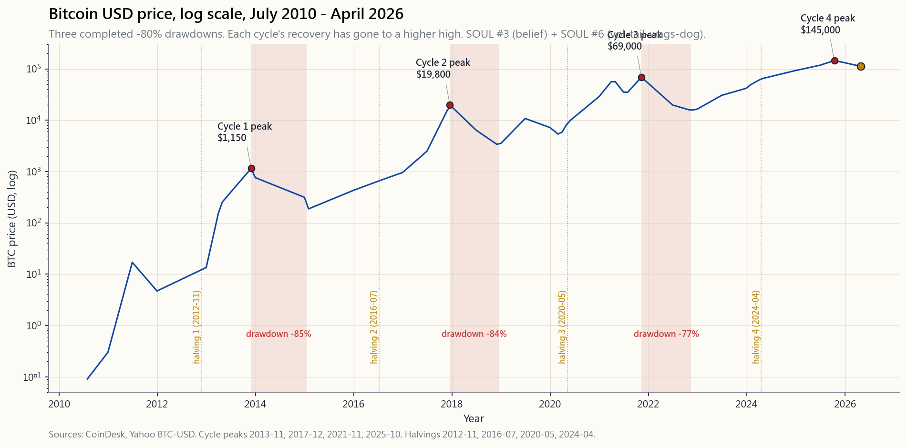

# Side Lesson 09: Crypto in a Portfolio — Bitcoin, Ethereum, and the 1-5% Allocation Case

---

## Part 1: Reading Section

---

### 1. Why This Is Important

Bitcoin is sixteen years old. Over those sixteen years its price has
gone from a fraction of a cent to north of one hundred thousand
dollars, with two complete crashes of about minus-eighty-five per cent
along the way. That is not a normal asset class life cycle. It is the
life cycle of a brand-new monetary experiment running in real time, on
a public ledger, in the open. Whether or not it is "real" is a
store-of-value question (every store of value rests on belief), but
the size of the market, the liquidity, and the fact that you can now
buy it inside a brokerage account through an SEC-registered spot ETF
means that *ignoring* it is no longer a neutral position — it is an
active allocation decision.

Four reasons this lesson exists:

1. **The asset class is now investable from a regular brokerage
   account, by name, without ever touching a private key.** The
   January 2024 spot Bitcoin ETF approvals (IBIT, FBTC, ARKB and
   eight others) and the July 2024 spot Ethereum ETF approvals (ETHA,
   FETH) are the single most important regulatory event in crypto's
   short history. The default for serious investors is US-listed
   names; spot ETFs collapse the crypto-as-asset-class
   question into the same wrapper as everything else in this
   tutorial. Before 2024, crypto required a separate exchange, a
   wallet, and a custody decision. After 2024, it is a ticker.
2. **Bitcoin's volatility is roughly seventy per cent annualised —
   four times the S&P 500.** That single number is what makes
   sizing the position a *math* problem, not an opinion problem. You
   do not "buy crypto" the way you buy an index fund; you buy a tiny
   sliver of it, sized so that a minus-eighty-per-cent drawdown is a
   tolerable hit to the *whole* portfolio. The vol-tail-wags-the-dog
   frame is the cleanest one: a five-per-cent BTC sleeve at seventy-per-
   cent vol contributes about three-and-a-half percentage points to
   total portfolio vol, which is most of what a 60/40 portfolio's
   stocks contribute.
3. **The 2017 / 2021 / 2025 three-cycle pattern is now visible
   enough to discuss honestly.** Each cycle ran about four years
   peak-to-peak, each blew off the top with leverage and altcoins,
   and each washed out in an eighty-per-cent drawdown that took
   eighteen-to-twenty-four months to recover from. The 2024–2025
   cycle, the first one with US institutional money inside the spot
   ETFs, is the first cycle where the *peak* did not require an
   exchange leverage flush — it ended with a more orderly fade. Three
   cycles is not a regime the way the 1970s inflation episode is a
   regime, but it is enough to retire the "BTC has no track record"
   argument.
4. **The tax and product wrappers create real edges and real
   traps.** The IRS treats crypto as *property*, not as a security:
   that means there is no qualified dividend, no Section 1256 60/40
   blended rate, *no wash-sale rule (yet)*, and no automatic 1099-B
   cost-basis tracking on direct-held coins. The spot ETFs partially
   fix this — they trade like ETFs and cost-basis is tracked — but
   the underlying remains property. Tax via the wrapper
   is more of an edge here than in equities precisely because the
   tax code is still half-finished. Get the wrapper right and the
   net-of-tax outcome is a different asset class than getting it
   wrong.

The goal of this side lesson is to give you the half-dozen numbers
and the one sizing rule that turn "should I own Bitcoin" from a
philosophical argument into a sleeve-sized position in the four-
tranche portfolio — small, deliberate, and in the right
sub-account.

---

### 2. What You Need to Know

#### 2.1 The Bitcoin Thesis in One Page — Twenty-One Million and Halvings

You can argue about Bitcoin's price for the next decade. You cannot
argue about its supply schedule, because the supply schedule is the
protocol. Two numbers carry the entire thesis:

- **The maximum supply is 21,000,000 coins, ever.** The cap is
  enforced by every node on the network, by consensus. As of April
  2026, roughly 19.85 million have been mined. The remaining
  ~1.15 million will trickle out, asymptotically, over the next
  hundred-plus years. There is no committee that can vote to raise
  the cap; doing so is a hard fork that the network would, by
  fifteen years of revealed preference, reject.
- **Every four years the new-coin issuance halves.** The block
  reward started at 50 BTC per block in 2009, fell to 25 in November
  2012, to 12.5 in July 2016, to 6.25 in May 2020, to 3.125 in April
  2024, and will fall to 1.5625 in 2028. New supply is currently
  about 0.85% of the existing float per year — already lower than
  gold's roughly 1.5% per year mine-supply growth, and falling.

That is the entire "digital gold" thesis: a fixed-cap commodity-like
asset whose new-supply rate is mechanically engineered to fall below
gold's, with a globally-distributed validation network and no central
issuer. Every other crypto debate is downstream of whether you accept
that thesis or not. The honest framing is that this is a *belief*
asset, the same as gold. The only question is the durability of the
belief, and the only available evidence is fifteen years of price
discovery, three completed boom-bust cycles, and a $2-trillion-ish
market capitalisation that the legal and institutional system has
chosen not to suppress.

The same framework applies, with a discount, to Ethereum (ETH).
Ethereum is not fixed-supply — its issuance rate is variable and was
even briefly *negative* after the 2022 Merge — but it has the second-
largest network effect, the second-largest validator set, and the only
spot ETF approval outside Bitcoin. Treat ETH as a smaller, more
volatile, more "tech-flavoured" satellite to a BTC core if you hold
either at all. Everything else (the so-called "altcoins") has not
demonstrated equivalent durability and is, for the purposes of a
portfolio lesson, noise.

#### 2.2 The 2017 / 2021 / 2025 Cycles — Pattern, Not Coincidence

Bitcoin's price history is best read as three completed four-year
cycles, each anchored by a halving, each ending in a roughly minus-
eighty-per-cent drawdown:

- **Cycle 1 (2013-2015) and the warm-up.** Price ran from about $13
  in January 2013 to $1,150 in late 2013, then bled to $200 by early
  2015 — a minus-eighty-three-per-cent drawdown. This was the Mt. Gox
  era, with most of the float on a single Tokyo exchange that
  promptly collapsed.
- **Cycle 2 (2017-2018).** Price ran from $1,000 in January 2017 to
  $19,800 in December 2017 (the original retail mania), then bled to
  $3,200 by December 2018 — a minus-eighty-four-per-cent drawdown.
  Futures launched at the top (CBOE/CME, December 2017), which gave
  institutions their first short-able instrument; that is not a
  coincidence with the timing of the top.
- **Cycle 3 (2020-2022).** Price ran from $9,000 in early 2020 to
  $69,000 in November 2021, then bled to $15,500 by November 2022
  amid the FTX/Three Arrows/Luna implosions — a minus-seventy-seven-
  per-cent drawdown. This was the cycle that broke crypto's worst
  intermediaries (centralised lenders, leveraged "yield" platforms)
  and pushed the survivors toward the regulated wrapper.
- **Cycle 4 (2024-2025).** Price ran from $42,000 at the January
  2024 spot ETF launch to roughly $145,000 in late 2025, then faded
  to about $112,000 by April 2026 — a milder minus-twenty-three-per-
  cent drawdown so far, the first cycle with material US institutional
  flow inside the regulated wrapper. Whether this cycle ends with a
  conventional minus-eighty-per-cent flush or with a structurally
  shallower drawdown is the live question of 2026.

Three things to take from the pattern. **First**, the peaks are
roughly four years apart, anchored on the halving. That regularity
will eventually break, but it has not yet, and the calendar is
information. **Second**, the drawdowns are catastrophic. Minus eighty
per cent is the *modal* outcome at the end of each cycle, not the tail.
A retail investor who cannot stomach watching a position lose four-
fifths of its value, on schedule, in a window of twelve to eighteen
months, should not own this asset class. **Third**, each cycle's
recovery has taken the price to a *higher* high than the previous
cycle's peak. A buyer who entered at the absolute worst tick of the
2017 top (December 2017, $19,800) was underwater for three years and
then doubled. A buyer at the 2021 top ($69,000) was underwater for
about three years and then doubled. The pattern is brutal but
ergodic — *if* the network thesis continues to hold.

#### 2.3 The Volatility and the Drawdowns Are the Whole Sizing Problem

The number that decides whether crypto belongs in a portfolio at all
is its annualised volatility, and it is unforgiving:

- **Bitcoin daily volatility, fifteen-year average:** roughly 70%
  annualised. For comparison: SPX is 16-19%; the Nasdaq-100 is
  22-26%; gold is 15%; long Treasuries (TLT) is 14%; meme stocks at
  their worst are 60-80%. BTC sits at the top of the volatility
  ranking of any liquid asset class.
- **Bitcoin maximum drawdown, fifteen-year history:** -85% (2014)
  and -84% (2018) and -77% (2022). Three drawdowns deeper than
  *any single drawdown the S&P 500 has produced since 1932*.
- **Ethereum daily volatility, eight-year average:** roughly 90%
  annualised, with drawdowns deeper than Bitcoin's at every cycle
  trough.

The math you cannot escape: a 5% BTC sleeve at 70% vol, held
alongside a 95% portfolio of stocks-and-bonds at, say, 11% vol,
contributes roughly $\sqrt{(0.95 \times 0.11)^2 + (0.05 \times 0.70)^2}$
≈ 11.5% portfolio vol — about 50 basis points above the no-crypto
baseline. The same arithmetic at a 10% BTC sleeve crosses 13% vol —
you have meaningfully changed the risk profile of the whole portfolio
to make room for the sleeve. *Above ten per cent, the BTC position is
no longer a satellite — it is a co-driver of the portfolio's risk*,
which violates the four-tranche logic for almost every
investor's risk budget.

This is the entire reason the canonical retail allocation is
**1-5% of investable assets, with 3% the centre of gravity**. It is
not a guess; it is the size at which BTC adds expected return without
swamping the rest of the portfolio's variance contribution. In barbell
terms: the BTC sleeve sits on the right edge of the barbell, with
T-bills on the left, and the index-fund middle absorbs neither's
volatility.

#### 2.4 The Kelly Logic Behind 1-5%

The 1-5% range is not arbitrary. Run a fractional-Kelly calculation
and the same answer falls out. Take Bitcoin's historical Sharpe
(roughly 0.7-0.9 over the full sample, lower over rolling five-year
windows), assume forward expected return of 15-25% per year (lower
than the realised, which is the standard adjustment for an asset that
has tripled its market cap during your sample), and assume vol holds
at 60-70%. Full-Kelly says size the sleeve at *expected excess return
divided by variance*: about (0.20 - 0.04) / 0.65² ≈ 38%.

Nobody runs full-Kelly on a single asset. The standard discount is
quarter-Kelly to one-eighth-Kelly, which lands at roughly 5% to 10%
of the portfolio. Apply a second discount for *parameter uncertainty*
(your expected-return number is not a fact, it is a guess on a
fifteen-year sample), and the practical sleeve falls to 1-5%. That is
the same number the institutional consultants (BlackRock, Fidelity)
landed on independently, and the same number a fractional-Kelly
calculation produces. It is not three different answers; it is one
answer arrived at three ways.

The other discipline is **rebalancing**. Without rebalancing, a 5%
BTC sleeve that triples in a cycle becomes a 13% sleeve at the top —
exactly when the four-cycle history says you should be trimming. With
quarterly or annual rebalancing back to target, you mechanically sell
into the cycle peaks and buy into the troughs, and the sleeve stays
at the size you actually budgeted for. Most of the long-term
contribution of a 1-5% BTC sleeve to a portfolio's CAGR comes from
the rebalancing flow, not from buy-and-hold.

#### 2.5 Spot ETFs vs Self-Custody — IBIT, FBTC, ETHA, and the Wrapper Choice

Before January 2024, owning Bitcoin through a US brokerage required
either GBTC (a closed-end fund that traded at premiums/discounts of
±40%) or a direct holding through an exchange (custody risk, key
management). The spot ETF approval changed that overnight.

The four wrappers worth knowing:

- **IBIT (iShares Bitcoin Trust)** — BlackRock's fund. Largest by
  AUM (about $58 billion as of April 2026). Expense ratio 0.25%
  (initial 12-month waiver expired). Custodian: Coinbase. The de
  facto institutional default.
- **FBTC (Fidelity Wise Origin Bitcoin Fund)** — Fidelity's fund.
  Self-custody (Fidelity Digital Assets, in-house). About $20
  billion AUM. ER 0.25%. The choice for investors who already have
  a Fidelity-house preference.
- **ETHA (iShares Ethereum Trust)** — BlackRock's spot Ethereum ETF,
  approved July 2024. About $5 billion AUM, ER 0.25%. The largest of
  the spot ETH funds.
- **GBTC (Grayscale Bitcoin Trust)** — the legacy product, converted
  to ETF in January 2024. ER is 1.50% — six times the iShares fee.
  The only reason to hold it is if you have an embedded long-term
  capital gain you do not want to crystallise. Otherwise, switch to
  IBIT.

The wrapper choice matters for three reasons. **Tax treatment**:
all four are 1099-B reporting, cost-basis tracked, and trade like an
ETF in any taxable or retirement account — none of the headache of
direct-held coin tax accounting. **Custody**: you outsource the key-
management problem to a regulated custodian; for 99% of investors
this is the right answer and replaces a meaningful tail risk
(self-custody loss, exchange failure) with a small ongoing fee.
**Wrapper purity**: spot ETFs hold the underlying coin one-to-one,
unlike futures-based BITO (the 2021 product) which suffered a
roughly 8-10% per year contango drag. Spot ETFs are the right wrapper
for buy-and-hold; futures wrappers are for traders.

The case for direct self-custody is narrow: large positions (>$1
million) where the 0.25% fee is meaningful, ideological alignment
with the original Bitcoin thesis ("not your keys, not your coins"),
or use cases that require on-chain transactions (DeFi, payments).
For the 1-5% sleeve in a tax-advantaged retirement account, the
spot ETF is the unambiguously correct wrapper. The US-listed wrapper
is the default.

#### 2.6 Tax Treatment — Property, Not Security

The IRS classifies cryptocurrency as **property** (Notice 2014-21,
unchanged through 2026). The consequences:

- **No qualified dividend rate.** Crypto pays no dividend in the
  first place, so this only matters for staking rewards (taxed as
  ordinary income at receipt) and for miners (ordinary income on the
  block reward at fair value).
- **No Section 1256 60/40 split.** Unlike SPX options or futures,
  crypto gains are pure short-term-or-long-term capital gains based
  on the standard one-year holding period.
- **No wash-sale rule (yet).** Section 1091 covers "stocks or
  securities." The IRS has, as of April 2026, declined to extend it
  to crypto. That means you can sell BTC at a loss in December for
  tax-loss-harvesting and re-buy it on January 2nd — a play that is
  illegal in equities. Multiple legislative proposals to close this
  loophole have been introduced; do not assume it persists.
- **Cost-basis is your problem if you hold direct coins.** Direct
  exchanges issue 1099-MISC for staking income but not always 1099-B
  for trades; the IRS will eventually mandate cost-basis reporting
  (the 2025 Form 1099-DA) but until then the burden is on you. Spot
  ETFs avoid this entirely — they are 1099-B-reported securities
  inside the ETF wrapper.
- **No automatic IRA eligibility for direct coins.** Most IRA
  custodians do not allow direct cryptocurrency holdings. *Spot
  ETFs are eligible* in any standard brokerage IRA. Location matters:
  hold the BTC sleeve inside a Roth IRA where
  any future gains are tax-free, given the volatility profile makes
  the asset a particularly clean Roth candidate.

The single most actionable tax insight: **the wash-sale-rule
absence makes crypto the cleanest tax-loss-harvesting asset in the
US tax code right now.** Sell at any loss; rebuy immediately;
realise the loss against ordinary income up to $3,000 per year and
unlimited offset against capital gains. That advantage will not
last forever. Use it while it does.

#### 2.7 What Crypto Is Not — No Cash Flow, No Floor, No Yield

The honest catalogue of what crypto *cannot* do for a portfolio:

- **There is no intrinsic floor.** Stocks have earnings, real
  estate has rents, bonds have coupons and a maturity payment. Bitcoin
  has none of these. The price is supported entirely by belief, and
  a sufficiently coordinated belief shift could in principle send it
  to zero. The fifteen-year out-of-sample test is encouraging
  but not exhaustive.
- **There is no qualified dividend or coupon income.** A retiree who
  needs cash flow gets none from BTC directly. The income solution is
  not "BTC pays a yield"; it is "trim the BTC sleeve back to target
  on rebalance and the trim cash flows the retirement budget."
- **There is no obvious correlation hedge.** BTC was supposed to be
  uncorrelated. In the 2022 risk-off, BTC fell -65% as the S&P fell
  -25% and TLT fell -31%; the correlation was high and positive.
  Recent samples (2023-2025) have shown lower correlation (around
  0.3-0.4), but BTC has not earned a long-volatility role
  the way trend-following or long-vol options have. Treat it as a
  high-vol return enhancer, not a diversifier.
- **There is no consumer-protection backstop.** Direct-held crypto
  is not SIPC-insured. Stablecoins are not FDIC-insured. Self-custody
  loss is permanent. Spot ETFs are SIPC-insured at the brokerage
  level (against broker failure, not against the underlying coin
  going to zero).

The right mental model is: BTC is a high-volatility, high-expected-
return *return* asset. It belongs in the Stores-of-Value tranche
at 1-5% portfolio weight, in a tax-advantaged wrapper
when possible, sized for a tolerable drawdown contribution,
and rebalanced on a fixed schedule. It is not a hedge. It is not a
cash-flow source. It is not a savings account. It is, on the
fifteen-year evidence, an investable asset class — and the position
size that respects that evidence is small.

---

### 3. Common Misconceptions

1. **"Bitcoin is a scam / has no value."** Bitcoin has a $2-trillion
   market cap, fifteen years of continuous price discovery, and is
   held by US-listed ETFs custodied at SEC-registered firms. The
   "scam" framing was tenable in 2014, less so in 2018, and not at
   all in 2026. It is a belief asset — like gold and
   fiat — and the only honest question is the durability of the
   belief.

2. **"Bitcoin is a hedge against inflation / the dollar."** The
   2022 evidence rejects this directly. CPI hit 9.1%, the dollar
   strengthened (DXY +8%), and BTC fell 65%. Whatever BTC is, it is
   not a mechanical inflation or dollar hedge. Belief asset, not
   structural hedge.

3. **"You should put 20-50% of your portfolio in crypto."** No.
   At 70% vol, a 20% sleeve makes BTC the dominant contributor to
   portfolio variance. The 1-5% range is what the math (and the
   barbell logic) supports. Larger positions are concentrated bets,
   not diversified holdings.

4. **"You need to buy direct coins to be a real investor."** For
   the 1-5% sleeve, the spot ETF (IBIT, FBTC, ETHA) is the better
   wrapper: lower friction, cost-basis tracked, IRA-eligible, no
   self-custody tail risk. Direct coin ownership is for amounts
   where the 0.25% fee is material or for use cases that need
   on-chain transactions.

5. **"Crypto is uncorrelated with stocks."** It was advertised that
   way; the evidence is mixed at best. In 2020-2022 the rolling
   correlation with the Nasdaq ran at 0.5-0.7. In 2023-2025 it has
   averaged 0.3-0.4. *Some* diversification benefit, far less than
   the marketing suggests.

6. **"Ethereum is just a smaller Bitcoin."** No. Ethereum has a
   variable issuance schedule, a fundamentally different security
   model (proof-of-stake since 2022), and a meaningfully different
   thesis (it is a smart-contract platform, not a fixed-supply
   commodity). It is *more volatile*, has had deeper drawdowns, and
   has not demonstrated Bitcoin's network durability. Treat it as a
   smaller satellite, not as a substitute.

7. **"Halvings always cause new highs."** They have, three times,
   roughly twelve to eighteen months after the halving event. That
   is not a guarantee; it is a sample of three. Each cycle has had a
   different driver (retail mania 2017, institutional + COVID 2021,
   spot ETF 2024). The next one may not.

8. **"There is no wash-sale rule, so I can game the system
   forever."** The IRS has signalled multiple times that it intends
   to extend §1091 to digital assets. Several legislative proposals
   are live in 2026. Use the loophole while it exists; do not build a
   long-term plan around it.

9. **"Bitcoin's volatility will compress as it matures."** It has,
   from 100%+ in the early years to 60-70% recently. That is still
   four times equity vol. Expecting it to converge to equity-like
   vol in a five- or ten-year window is a faith statement, not an
   evidence-based one. Size it for the vol it has, not the vol you
   wish it had.

10. **"Stablecoins are safe cash."** Some are; some are not. USDC
    (Circle) and USDT (Tether) carry counterparty and reserve-quality
    risk that bears no resemblance to FDIC-insured cash. The 2023
    USDC depeg (Silicon Valley Bank exposure) is the canonical
    cautionary example. Treat stablecoins as a payment rail, not as
    a savings account.

---

### 4. Q&A

**Q: I am thirty-five with a 401(k) and a Roth IRA. Should I own
Bitcoin?**
A: A 1-5% sleeve, sized to your overall risk budget, held in the Roth
IRA via IBIT or FBTC, rebalanced annually back to target. The
Roth-and-spot-ETF combination means any future gain is tax-free, and
the spot ETF is custodied by a regulated firm. Start at 1%, see how
you feel through one cycle, scale to 3-5% if you can sit through a
minus-eighty-per-cent drawdown without selling.

**Q: Why a Roth IRA specifically, and not a taxable brokerage?**
A: Location matters. BTC is the highest-expected-return,
highest-volatility asset most retail investors have access to. In a
Roth, the upside is tax-free; in a taxable account, you owe long-
term capital gains on the eventual exit, and the no-wash-sale-rule
benefit only matters in the taxable account. The optimal split: hold
the *core* BTC sleeve in the Roth, hold a smaller *trading* sleeve in
the taxable account where you can harvest the no-wash-sale-rule
advantage on each cycle's drawdown.

**Q: IBIT vs FBTC — does it matter?**
A: Functionally, no. Both are spot Bitcoin ETFs at 0.25% expense
ratio with regulated custody. IBIT has more AUM and tighter
bid-ask spreads (a fraction of a basis point); FBTC uses Fidelity's
in-house custody if you prefer that. For a buy-and-hold Roth IRA
position, either works. Avoid GBTC unless you have an embedded
capital gain — its 1.50% ER is six times the iShares fee.

**Q: Should I dollar-cost-average into BTC or buy a lump?**
A: The Vanguard lump-vs-DCA evidence (Side 5) generalises — lump wins
about two-thirds of the time on equities. Crypto's volatility makes
the sample less stable, but the same principle applies: if you have
the cash and you have decided on the allocation, deploy it. The
exception is if your conviction is genuinely lower; in that case DCA
across six to twelve months is a behavioural tool that prevents you
from front-loading regret if the drawdown comes early.

**Q: What about Ethereum? Bitcoin only? Both?**
A: For the first 1-3% of allocation, Bitcoin only — it has the
longest track record, the cleanest thesis, the deepest liquidity, and
the largest spot-ETF wrapper. If you want to push to 5%, add Ethereum
via ETHA at roughly a one-quarter to one-third weight of the BTC
sleeve. So a 5% crypto sleeve might be 4% BTC / 1% ETH. Beyond ETH,
nothing else has demonstrated portfolio-grade durability.

**Q: My friend has 30% of his net worth in BTC and is up 5x. Should
I do that?**
A: Survivorship bias. Your friend who is up 5x is the one talking;
the friends who sized similarly in 2017 or 2021 and got cut to a
fifth are not posting. The 1-5% rule is sized for the *full
distribution* of outcomes, not for the lucky tail. Alpha is rare,
and concentrated alpha in a single high-vol asset is also a
concentrated way to lose.

**Q: What signals would tell me the cycle has topped?**
A: The four-cycle pattern suggests: (a) parabolic price action with
double-digit weekly moves, (b) altcoin season — non-BTC tokens
massively outperforming BTC for sixty to ninety days, (c) leverage
in the futures market (open interest >$30B, funding rates persistently
above 0.05% per eight hours), and (d) retail-survey indicators (Coinbase
in the App Store top 10). All four were present at the 2017 and 2021
peaks. None of them are precise enough to time, but the *combination*
is a credible "trim back to target" signal.

**Q: What would change my mind on holding any BTC at all?**
A: Three regime breaks would close the case: (1) a successful
fifty-one-per-cent attack on the network or a major protocol failure;
(2) a coordinated US/EU/UK ban on regulated crypto wrappers; (3) a
ten-year drawdown from which the price does not recover (i.e. the
network effect breaks). None of these is impossible; none is currently
indicated. Until one of them happens, the 1-5% sleeve is a
reasonable exposure for an investor who has already maxed out their
401(k) and built an emergency fund.

**Q: Is "Bitcoin is digital gold" a real thesis or a marketing line?**
A: Both. The thesis — fixed-supply, network-effect-protected,
non-sovereign store of value — is real and has held up over fifteen
years. The marketing line conflates the thesis with a reliable
inflation hedge, which is *not* what gold has been either (see Side 6).
Treat both gold and BTC as belief assets in the Stores-of-Value
tranche, sized to the risk budget, and do not expect either to do
the work of TIPS during an actual inflation regime.

**Q: How does a futures-based product like BITO compare to spot ETFs
like IBIT?**
A: BITO holds CME Bitcoin futures, which are typically in contango.
The roll cost — selling expiring near-month futures and buying further-
out futures at a higher price — has run 8-12% per year on average,
which mostly destroys the long-term return. BITO is an acceptable
*tactical* vehicle (briefly long for a few weeks); for buy-and-hold,
spot ETFs (IBIT, FBTC) are the right wrapper.

**Q: What is the interactive at the bottom of this lesson useful for?**
A: For sizing the position before you buy it, not after. Move the
"BTC % of portfolio" slider from 0 to 10. Watch what happens to the
expected return, the volatility, the Sharpe ratio, and — most
importantly — the maximum drawdown. The sweet spot for most retail
investors is 2-4%; above 5%, the BTC sleeve dominates the risk; below
1%, it does not move the needle. The lab is built to make that
trade-off legible at the scale at which it actually compounds.

---

## Part 2: YouTube Script

---

**VIDEO TITLE:** Bitcoin in a Portfolio — Why 3% Is the Right Answer | Side Lesson 9

**RUNTIME TARGET:** ~16 minutes

**HOSTS:**
- **Horace** (teacher): Career investor, watched the 2013, 2017, and
  2021 BTC cycles from a real account.
- **Stella** (student): Risk-aware retail investor, has heard the
  case for and against and wants the math.

---

**[INTRO SEQUENCE]**

[VISUAL: Animated logo "Side Lesson 9 — Crypto in a Portfolio"]

[VISUAL: image/side09_btc_history.png — log Bitcoin chart 2010 to April 2026 with the four cycle peaks annotated.]

**Horace:** *(pulls up the log-scale Bitcoin chart on the studio
monitor)* Sixteen years. Three completed cycles. Four halvings. Three
drawdowns deeper than minus-eighty per cent. Stella, before we say
anything else about Bitcoin, I want you to look at that chart for ten
seconds and tell me what you see.

**Stella:** A staircase that goes up. With cliffs.

**Horace:** That's the entire phenomenon. Each cycle hits a new high.
Each cycle gives back four-fifths of the gain. The cycles are roughly
four years long, anchored on the halving — there's the 2012 halving,
the 2016, the 2020, and the 2024. The lows of each cycle are higher
than the previous cycle's lows; the highs are higher than the
previous highs. So is this real? On the fifteen-year evidence, yes,
something is here. Is it sized like a normal asset class? No, the
volatility is four times the S&P.

**Stella:** So how does a normal investor own this?

**Horace:** Carefully. One to five per cent. In a Roth. Through a
spot ETF. Rebalanced annually. That's the headline answer. The rest
of the lesson is *why* those four numbers and not different ones.

---

**[SEGMENT 1: THE THESIS — TWENTY-ONE MILLION AND HALVINGS]**

[VISUAL: image/side09_btc_history.png — full screen, with the four halving markers highlighted.]

**Horace:** The Bitcoin thesis fits on a postage stamp. Twenty-one
million coins, ever. Hard-coded into the protocol. Every four years
the new-coin issuance halves. As of April 2026, about nineteen-point-
eight-five million coins exist. The remaining one-point-one-five
million will trickle out asymptotically over the next century-plus.
Annual new supply is currently below one per cent of the float —
already lower than gold's mine-supply growth.

**Stella:** And that's the whole "digital gold" pitch?

**Horace:** That's the whole pitch. A fixed-cap, commodity-like asset
with a globally-distributed validation network and no central issuer.
Whether you accept that thesis is the entire decision. The cleanest
way to think about it is the belief-asset frame: every store of value
rests on belief. Gold's belief has survived five thousand years. Pure
fiat — post-Bretton-Woods, since 1971 — has survived fifty-five.
Bitcoin's belief has survived sixteen. The only honest yardstick is
durability.

**Stella:** So you're saying it's a faith-based asset.

**Horace:** I'm saying *all three* are faith-based assets. Gold has no
intrinsic value either; it has consensus. Fiat has no intrinsic value;
it has consensus. The only difference is how long the consensus has
been tested. Bitcoin has the shortest test, but it has fifteen
continuous years of price discovery in public markets, with no
central party able to suppress it. That is a real test, just a
shorter one.

---

**[SEGMENT 2: THE THREE CYCLES, AND THE FOURTH]**

[VISUAL: zoom of image/side09_btc_history.png focused on the 2017, 2021, and 2025 cycle peaks with annotated drawdowns.]

**Horace:** Now look at the cycles. Cycle one — 2013, the warm-up.
Price ran from thirteen dollars to eleven-fifty by late 2013, then
bled to two hundred. That's minus eighty-three per cent. Cycle two —
2017. Mt. Gox era was over, futures launched. Price ran from a
thousand to twenty thousand, then bled to thirty-two hundred. Minus
eighty-four per cent. Cycle three — 2021. COVID money, retail
adoption, and the leveraged-yield platforms. Price ran from nine
thousand to sixty-nine thousand, then bled to fifteen-point-five. The
FTX implosion punched through the bottom. Minus seventy-seven per
cent.

**Stella:** And the current cycle?

**Horace:** Different. January 2024 spot ETF launches; price ran from
forty-two thousand to one-forty-five thousand by late 2025. We're
sitting here in April 2026 at about one-twelve. That's minus
twenty-three per cent off the high — not the cycle-ending eighty-per-
cent flush yet. *Whether this cycle ends with a conventional flush or
a structurally shallower fade is the open question of 2026.* The new
factor is institutional flow inside the regulated wrapper; that's
sticky money that didn't exist in the previous three cycles.

**Stella:** What's the lesson from the pattern?

**Horace:** Three things. The peaks are roughly four years apart,
anchored on the halving. The drawdowns at each cycle end are *modal*
minus eighty per cent, not tail. And every cycle's recovery has gone
to a higher high than the previous cycle's *peak*. Brutal but ergodic
— if the network thesis continues to hold. That conditional is
important.

---

**[SEGMENT 3: THE VOLATILITY PROBLEM]**

**Stella:** OK, so the asset goes up over fifteen-year cycles. What's
the problem with owning it?

**Horace:** The volatility. Bitcoin's annualised vol over its full
history is roughly seventy per cent. The S&P is sixteen to nineteen.
The Nasdaq is twenty-two to twenty-six. Gold is fifteen. TLT is
fourteen. Bitcoin is *four times* equity volatility. That single
number is the entire reason you can't size this like a normal asset
class.

**Stella:** Walk me through the math.

**Horace:** Take a 95% portfolio of stocks-and-bonds at, say, eleven
per cent vol. Bolt on a five per cent BTC sleeve at seventy per cent
vol. The total portfolio vol — squaring the parts and taking the
square root — comes out to about eleven-and-a-half per cent. Fifty
basis points above the no-crypto baseline. That's a tolerable bump.
Now do the same arithmetic at a *ten* per cent BTC sleeve. The
portfolio vol crosses thirteen per cent. You've added two full vol
points to the whole portfolio for a single sleeve. Above ten per
cent, BTC stops being a satellite and becomes a *co-driver* of the
portfolio's risk. That violates the four-tranche logic for almost every retail investor.

**Stella:** So that's where one-to-five per cent comes from?

**Horace:** Yes. And the same number falls out of a fractional-Kelly
calculation. Take BTC's historical Sharpe — about 0.7 to 0.9 — assume
a forward expected return of fifteen to twenty-five per cent, vol at
sixty to seventy. Full-Kelly says about thirty-eight per cent. Nobody
runs full-Kelly on a single asset; the standard discount is one-quarter
to one-eighth. That gets you to five-to-ten per cent. Apply a second
discount for parameter uncertainty — your expected-return number is a
guess, not a fact — and you land at one-to-five. Same answer arrived
at three different ways. Math, institutional consensus, and barbell
logic all converge.

---

**[SEGMENT 4: THE PORTFOLIO BACKTEST]**

[VISUAL: image/side09_btc_in_portfolio.png — 60/40 vs 60/40 + 1/3/5% BTC, 2014 to April 2026.]

**Horace:** This is what it actually looks like in the data. Four
lines from January 2014 through April 2026. Plain 60/40 in navy.
60/40 with one per cent BTC. 60/40 with three per cent BTC. 60/40
with five per cent BTC. All rebalanced annually back to target.

**Stella:** They all end higher than the no-BTC line.

**Horace:** They do. The five per cent line ends about — call it
forty per cent ahead of the no-BTC line over the twelve years. The
three per cent line about twenty per cent ahead. The one per cent
line about seven per cent ahead. So the *expected return* contribution
is real. The *drawdown* contribution is also real — the deepest
drawdown of the five-per-cent line during the 2022 bear was about
five percentage points worse than plain 60/40. That's a fair trade
for the long-run return uplift. It's not a free lunch, but it's a
legible one.

**Stella:** Why doesn't the chart go nuts during the 2017 or 2021 BTC
peaks?

**Horace:** Because of the rebalancing. Without rebalancing, the
five-per-cent BTC sleeve at the end of 2017 had grown to roughly
twenty-five per cent of the portfolio — at which point the 2018
drawdown of minus eighty-four per cent would have erased most of
the prior gain. With annual rebalancing, you trim back to five per
cent at the end of each year. You mechanically sell into the cycle
peaks and buy into the troughs. That rebalancing flow is *most* of
the long-run portfolio benefit of holding BTC. It's not buy-and-
forget; it's buy-and-rebalance.

---

**[SEGMENT 5: THE WRAPPER — IBIT, FBTC, ETHA]**

**Horace:** OK, sizing's done. Now the wrapper. Before January 2024,
owning Bitcoin through a US brokerage was a mess — GBTC at forty-per-
cent premium-or-discount, or self-custody on an exchange with key
management and counterparty risk. The spot ETF approval changed that
overnight.

**Stella:** Which one do I buy?

**Horace:** IBIT or FBTC. Both at twenty-five basis points expense
ratio. Both spot — they hold the underlying coin one-for-one, no
contango drag. Both 1099-B reported in your brokerage account. Both
IRA-eligible. IBIT is BlackRock with Coinbase custody and the most
AUM. FBTC is Fidelity with Fidelity-Digital-Assets custody and house
preference. Functionally identical for buy-and-hold.

**Stella:** What about ETHA?

**Horace:** Spot Ethereum ETF, BlackRock again, July 2024 approval,
twenty-five basis points. If you want to push to a full five-per-cent
crypto sleeve, do four BTC and one ETH. Beyond that — beyond BTC and
ETH — nothing else has demonstrated portfolio-grade durability. Stay
in the regulated wrapper, stay in the top two by network effect.

**Stella:** What about the futures product BITO?

**Horace:** Skip it for buy-and-hold. The roll cost on contango has
run eight-to-twelve per cent per year on average. It's an acceptable
tactical tool for a few weeks; it's a wealth-destroyer for years.

**Stella:** And the legacy GBTC?

**Horace:** Switch to IBIT unless you have an embedded long-term
capital gain you don't want to crystallise. GBTC's expense ratio is
one-point-five per cent — six times the iShares fee. Six times the
fee is a different asset class.

---

**[SEGMENT 6: THE TAX EDGE]**

**Horace:** Here's the part most people miss. The IRS classifies
crypto as *property*, not as a security. Five consequences. No
qualified dividend rate. No Section 1256 sixty-forty split — just
plain capital gains. *No wash-sale rule yet*, because Section 1091
covers stocks-and-securities and crypto isn't either. Cost-basis
tracking is your problem on direct coins. And IRA eligibility only
applies to the spot ETFs, not direct coins.

**Stella:** Wait. No wash-sale rule? I can sell at a loss and rebuy
the same day?

**Horace:** Yes. As of April 2026. You can sell BTC at a loss in
December, harvest the loss against capital gains and up to three
thousand dollars of ordinary income, and rebuy the position on
January 2nd. In equities that would be illegal — you'd defer the loss
for thirty days. In crypto it is currently legal. *That* is a real
tax edge that has no equivalent in the rest of the US capital
markets.

**Stella:** Will it last?

**Horace:** Probably not. Multiple legislative proposals are live in
2026 to extend Section 1091 to digital assets. Use the loophole; do
not build the long-term plan around it.

**Stella:** What about staking rewards?

**Horace:** Ordinary income, taxed at receipt at fair value. ETHA
investors don't see staking rewards passed through — the ETF wrapper
internalises any staking income (most Ethereum spot ETFs are not
staking yet, by SEC restriction as of 2026). For buy-and-hold via
spot ETFs, the tax picture is simple: capital gains on exit, no
phantom income.

---

**[SEGMENT 7: WHAT BITCOIN ISN'T]**

**Stella:** Last thing. What can Bitcoin *not* do?

**Horace:** Three things. It cannot generate cash flow. It is not an
inflation hedge — 2022 settled that one when CPI ran at nine and BTC
fell sixty-five. And it is not a portfolio diversifier in the strong
sense — its rolling correlation with the Nasdaq has run point-five to
point-seven during risk-off periods. Bitcoin is a high-vol return
asset. It belongs in the Stores-of-Value tranche, sized to the risk
budget. It does not replace TIPS, it does not replace gold, it does
not replace cash. It sits next to them.

**Stella:** And the floor question?

**Horace:** Stocks have earnings. Real estate has rents. Bonds have
coupons and a maturity payment. Bitcoin has none of those. The price
is supported entirely by belief. Every store of value rests on
belief, and that is the framing here. The fifteen-year
out-of-sample test is encouraging but it is not exhaustive. A
sufficiently coordinated belief shift could in principle send the
price to zero. That tail is why the position is sized at one-to-five
per cent and not fifteen-to-twenty.

---

**[SEGMENT 8: THE INTERACTIVE]**

[VISUAL: cut to interactive panel `interactive/side09_btc_sizer.html`.]

**Horace:** All of this lives in the interactive at the bottom of the
lesson. Four sliders. Top one is the BTC weight, from zero to ten per
cent. Below that, the expected forward return, the volatility, and
the correlation with stocks. The four big numbers up top are
portfolio CAGR, portfolio vol, portfolio Sharpe, and maximum drawdown.

[VISUAL: hand on slider, moving BTC weight from zero through five.]

**Horace:** Move BTC from zero to three. CAGR ticks up about a
percentage point. Vol up about thirty basis points. Sharpe up. Max
drawdown gets a touch worse. Now push it to five — same direction,
slightly stronger. Now push it to ten — and watch the vol number.
Suddenly the BTC sleeve is contributing two and a half percentage
points to total portfolio vol; the Sharpe stops improving and starts
*degrading*; the max drawdown is meaningfully worse. The sweet spot
is two to four. The lab makes that visible at a glance.

**Stella:** What happens if I cut the expected return down to zero?

**Horace:** Then no allocation makes sense. The Sharpe contribution
turns negative and any BTC weight reduces the portfolio's risk-
adjusted return. The point of the lab is to *test* your assumed
return. If you can't justify ten per cent expected forward return on
BTC, you probably shouldn't own it. If you can justify twenty per
cent, the optimal weight is around three to five.

---

**[OUTRO]**

**Horace:** Three numbers to take away. First, BTC vol is roughly
seventy per cent annualised — four times equity. Second, the
canonical retail allocation is one-to-five per cent, and it falls out
of three independent calculations: Kelly fraction, contribution to
portfolio vol, and institutional consensus. Third, the wrapper
matters: IBIT or FBTC for spot Bitcoin, ETHA for spot Ethereum, in a
Roth IRA, rebalanced annually.

**Stella:** And the philosophical answer?

**Horace:** Belief. Every store of value rests on belief. Gold
for five thousand years. Fiat for fifty-five. Bitcoin for sixteen.
You don't own it because you believe one of them is real and the
others are fake. You own it because you believe the consensus that
backs it has another fifteen years left in it, sized so that you can
be wrong without it ending your retirement plan.

**Stella:** And if I can't sit through a minus-eighty-per-cent
drawdown?

**Horace:** Then your weight is zero. That is also a respectable
answer. The wrong answer is the in-between one — a fifteen-per-cent
position that you're going to panic-sell at the bottom of the next
cycle. Either size it small enough to ignore the drawdowns, or don't
own it at all.

[VISUAL: closing card "Side Lesson 9 — Crypto in a Portfolio: 1-5%, Spot ETF, Roth IRA, Annual Rebalance"]

[END]
