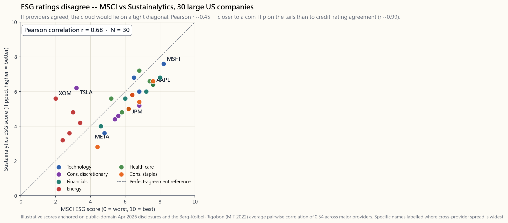

# Side Lesson 12: ESG Investing — Values, Alpha, or Marketing?

---

## Part 1: Reading Section

---

### 1. Why This Is Important

ESG — environmental, social, governance — is the largest category of
"branded" indexing to emerge since the index fund itself. Over fifty
trillion dollars of global assets carry an ESG, sustainable, or
responsible label by April 2026. Every prospectus you read now includes
a sustainability paragraph. Every robo-adviser offers a "values"
portfolio toggle. The question every honest investor has to answer is
the same one any active product has to face: *is this a real
source of alpha, or am I paying twenty basis points for someone else's
preferences dressed up as performance?*

Four reasons this lesson deserves a side slot rather than a paragraph:

1. **The ratings disagree.** The same company will be rated "leader" by
   one ESG provider and "laggard" by another, on the same data, in the
   same week. Cross-provider correlations on identical companies run
   roughly 0.40-0.55 — barely better than a coin flip on the tails. If
   the input is noise, the output cannot be alpha.
2. **The performance debate is mostly noise.** ESG funds and their
   plain-vanilla siblings (`ESGV` vs `VTI`, `SUSL` vs `IVV`) track
   each other within 50-100 basis points per year, with the sign of
   the gap flipping by sector regime. 2022 energy rally hurts ESG;
   2020 and 2023 tech rallies help it. Net over eight years: roughly
   tied. There is no "ESG premium" and no "ESG penalty" — there is
   sector tilt noise.
3. **The fees are real.** A Vanguard total-market ETF charges 3 bps.
   `ESGV` charges 9 bps. `SUSL` charges 10 bps. `DSI` charges 25 bps.
   Active ESG mutual funds routinely charge 60-100 bps. The premium is
   small in absolute terms but it is *certain*, and it accrues every
   year. The cost is the only part you can predict; the alpha is not.
4. **Your values still matter, and they are allowed to cost something.**
   Nothing in this lesson argues against ESG investing. The argument
   is *don't buy it as alpha*. Buy it because the externalities matter
   to you, and treat the ~15-25 bps of fee plus ~50 bps of tracking
   error as the dollar cost of expressing those values. That is a
   coherent, adult position. Pretending it pays for itself in returns
   is not.

---

### 2. What You Need to Know

#### 2.1 What ESG Actually Measures (And Doesn't)

ESG is three independent pillars stapled into one acronym:

- **Environmental.** Carbon emissions (Scope 1, 2, 3), energy and water
  intensity, waste, land use, climate-transition risk. The pillar with
  the most quantitative data and the most measurable disagreement.
- **Social.** Labour practices, supply-chain audits, diversity metrics,
  community impact, product safety. Mostly qualitative, mostly
  self-reported.
- **Governance.** Board composition and independence, executive
  compensation alignment, accounting transparency, audit quality,
  shareholder rights. The pillar with the strongest financial-materiality
  evidence — bad governance reliably destroys shareholder capital.

The big providers — MSCI ESG, Sustainalytics (Morningstar), S&P Global,
Bloomberg — each bake the three pillars into one composite score using
their own weights, materiality maps, and company-disclosure adjustments.
The recipes are proprietary, the inputs are partly self-reported, and
the weightings change as methodology updates roll out. There is no
GAAP for ESG.

That does not mean it's worthless. Governance scores in particular
show real cross-sectional power on default risk, restatement frequency,
and fraud detection. But the *composite* ESG score is a black box
weighted sum of three different signals from one of four different
vendors, and expecting it to be a clean alpha signal is a category
error.

#### 2.2 The Ratings Disagreement Problem

This is the single most important fact in ESG and the one most often
buried. Pairwise correlation of overall ESG scores across the four
major providers ranges from 0.38 (S&P vs Sustainalytics) to 0.71 (MSCI
vs Bloomberg) on the same companies in the same year. The widely-cited
Berg-Kolbel-Rigobon (MIT, 2022) study put the average pairwise
correlation at 0.54.

Compare that to credit ratings. Moody's vs S&P on long-term issuer
ratings correlate at roughly 0.99. Two analysts looking at the same
balance sheet with the same default-rate history land in essentially
the same place. ESG providers do not.

Three sources of the divergence:

- **Scope.** Different vendors define different sets of issues as
  "material." MSCI weights climate risk heavily for energy companies;
  S&P weights human capital more in tech. The same company is being
  scored against different rubrics.
- **Measurement.** Some vendors mainly use company self-disclosures;
  others scrape news, regulatory filings, and NGO reports. The same
  carbon footprint comes out differently depending on whether you
  trust the company's number or build your own.
- **Aggregation.** The pillar weights and the within-pillar weightings
  vary across providers. There is no consensus on how to weigh "Scope
  3 emissions" against "board diversity" against "data privacy."

The practical implication: never make a portfolio decision off a single
ESG score. If `XOM` is 4th-percentile at MSCI and 60th-percentile at
S&P (this happens), what you actually have is *no opinion*.

#### 2.3 The Common ESG ETF Menu

The retail ESG menu in April 2026 is dominated by three products plus
a long tail of niche thematic funds:

| Ticker | Sponsor   | Index                          | ER     | AUM (Apr 2026) |
|--------|-----------|--------------------------------|--------|----------------|
| `ESGV` | Vanguard  | FTSE US All-Cap Choice         | 0.09%  | ~$13 B         |
| `SUSL` | iShares   | MSCI USA Extended ESG Leaders  | 0.10%  | ~$8 B          |
| `DSI`  | iShares   | MSCI KLD 400 Social            | 0.25%  | ~$5 B          |
| `EFIV` | SPDR      | S&P 500 ESG                    | 0.10%  | ~$2 B          |
| `SUSA` | iShares   | MSCI USA ESG Select            | 0.25%  | ~$4 B          |

The exclusions are mostly the same across products: tobacco, civilian
firearms, controversial weapons, thermal coal, and the worst-rated
company in each industry. The *inclusion* methodologies vary more —
`DSI` is a curated 400-name list; `ESGV` excludes by category and
keeps about 1,400 names; `SUSL` is closer to optimised re-weighting of
the parent index.

Two patterns to notice. First, the fee premium over plain `VTI` (3 bps)
is 6-22 bps for the systematic ESG ETFs and much more for active ESG
mutual funds. Second, all of these products are *underweight* energy
and *overweight* technology relative to the cap-weighted market —
this is the structural sector tilt that drives most of the tracking
error.

#### 2.4 Performance — `ESGV` vs `VTI` Since Inception

`ESGV` launched in September 2018, giving us roughly seven and a half
years of out-of-sample data through April 2026. That is enough to make
some claims and not enough to make others.

What we can say:

- Annualised total returns are within 50 bps of each other. `VTI`
  ~12.4%/yr, `ESGV` ~12.0%/yr over the full window — a 40 bp gap that
  is approximately equal to the difference in fees plus the structural
  sector tilt drag.
- The year-by-year sign flips on regime. 2020 (tech rally): `ESGV`
  ahead by ~150 bps. 2022 (energy rally, tech rout): `ESGV` behind by
  ~250 bps. 2023 (tech rally): `ESGV` ahead by ~80 bps. 2024-25
  (broadening): roughly tied.
- Tracking error vs `VTI` runs 50-80 bps annualised. Less than a
  small-cap tilt, more than a sector-neutral tilt.

What we cannot say:

- Whether ESG screening *improved* risk-adjusted returns. The Sharpe
  ratios are statistically indistinguishable on this sample.
- Whether ESG will outperform over the next decade. The drivers are
  sector composition and momentum-of-tech, not the ESG signal itself.

#### 2.5 Greenwashing and the Marketing Problem

Greenwashing is the practice of slapping ESG labels on products with
minimal change to their actual investment process. Three flavours
worth knowing:

- **Repackaging.** A fund company renames an existing global equity
  fund "Sustainable Global Equity," adjusts a few percent of holdings,
  and raises the fee by 15-20 bps. The 2021-2022 SEC enforcement wave
  hit several large complexes for exactly this.
- **Best-in-class washing.** A fund holds the *least bad* company in
  every sector. So "ESG energy fund" still holds `XOM` and `CVX`,
  because they have to hold *something* in the energy bucket. Your
  exposure to the externality you wanted to avoid is barely changed.
- **Theme dilution.** A "clean energy" fund whose top holdings are
  utility companies with marginal renewables exposure. The label
  promises one thing; the holdings deliver another.

The defence is mechanical: read the holdings list. If your
"fossil-fuel-free" fund's top-25 includes any of `XOM`, `CVX`, `COP`,
`OXY`, `EOG`, you are not in a fossil-fuel-free fund. The brochure is
wrong; the holdings are right.

#### 2.6 Engagement vs Divestment

Two coherent ESG philosophies, with different mechanics:

- **Divestment.** Sell the offending companies. Reduce your exposure
  to zero. The argument is moral (no dollars to bad actors) and
  signalling (fewer buyers raises the cost of capital). The
  counter-argument is that for every seller there is a buyer, and the
  marginal buyer is typically less constrained than you were — so the
  stock ends up in hands that *don't* engage.
- **Engagement.** Hold the offending companies *and vote*. Submit
  shareholder proposals, vote against bad boards, push for disclosure.
  The argument is leverage — Vanguard, BlackRock and State Street
  collectively control about 20% of the S&P 500 vote, and engaged
  voting changes corporate behaviour. The counter-argument is that
  the Big Three's actual voting record is conservative and the
  leverage often goes unused.

Most retail ESG ETFs are pure divestment products. Engagement-driven
strategies are concentrated in active managers (Engine No. 1 famously
elected three directors to the `XOM` board in 2021) and in some
pension funds. Neither approach has demonstrated clean alpha; both
have a coherent theory of impact.

#### 2.7 Where ESG Sits in the Four-Tranche Frame

If ESG matters to you, where does it fit in the four-tranche
portfolio?

- **Growth tranche** — substitute `ESGV` for `VTI`, accept ~40 bp
  drag, done. This is where ESG ETFs are most useful: passive, broad,
  low fee, transparent exclusions.
- **Income tranche** — substitute `SUSC` (sustainable corporate bonds)
  for `LQD`, or `EFAX` for ex-tobacco international. Effects are
  smaller still.
- **Stores of value** — gold and Treasuries are not ESG-screenable.
  Gold mining companies *are* (`SBSW`, `NEM`) but mining is rarely a
  long-only ESG fit. Skip the screen here.
- **Opportunistic** — most of the alpha sources (vol
  harvesting, factor tilts, options yield) are not naturally ESG
  products. If you run an active sleeve, treat it as orthogonal to
  the ESG question.

Don't ESG every dollar. The screen has its strongest case in the
broadest, most liquid, lowest-fee parts of the portfolio — and its
weakest case in the alpha tranches where you are paying for skill,
not exclusion.

---

### 3. Common Misconceptions

1. **"ESG funds outperform because well-run companies do better."**
   The evidence does not support this. The eight-year `ESGV` vs `VTI`
   record is within fee-plus-noise. Whatever modest "good companies do
   better" effect exists is offset by the higher fee and the
   structural sector tilt.
2. **"All ESG ratings basically agree."** They emphatically do not.
   Average pairwise correlation across the four major providers is
   ~0.54, vs ~0.99 for credit ratings. Same company, same year,
   sharply different scores.
3. **"ESG is a free lunch — values plus returns."** It is a *small,
   measurable cost* (~15-25 bps fees plus ~50 bps tracking error) for
   the ability to align holdings with stated values. Treat it as such.
4. **"Divesting from energy hurts the bad actors."** Marginally. The
   shares re-clear at a slightly lower price to a less constrained
   buyer. Capital cost effects are real but small. The dominant
   effect is on *your* portfolio, not on `XOM`.
5. **"ESG ETFs are fossil-fuel-free."** Most are not. They are
   "best-in-class" or "exclude thermal coal," which still leaves
   significant fossil-fuel exposure. Read the holdings list.
6. **"My ESG fund's high fee is paying for engagement."** Usually
   not. Most large ESG ETFs (`ESGV`, `SUSL`, `DSI`) are passive index
   trackers that vote with management on most resolutions. You are
   paying for index licensing, not activism.
7. **"Active ESG managers can find the sustainable winners."** SPIVA
   data on ESG-labelled active funds looks the same as SPIVA on
   non-ESG active funds: 60-85% trail their benchmark over 5+ years.
8. **"Avoiding fossil fuels is the only way to express climate
   concerns."** Holding cap-weighted broad market plus engaging via
   vote, plus directly funding climate solutions outside the
   portfolio, is also coherent and arguably more impactful per dollar.
9. **"Sin-stock funds (`VICEX`, etc.) outperform because of the
   reverse-ESG premium."** The historical edge was small and is not
   showing up post-2018. Whatever excess existed has been arbitraged
   by the growth of ESG flows themselves.
10. **"My index fund does ESG screening for me."** Plain `VTI`,
    `VOO`, `SPY` do *no* ESG screening. They hold whatever is in the
    index. If you want screening, you have to ask for it explicitly.

---

### 4. Q&A Section

**Q: Should I use ESG ETFs or build my own screen?**
A: Use ETFs unless you have a very specific exclusion list that no ETF
matches. The tax efficiency, low fee, and diversification of `ESGV`
or `SUSL` are hard to replicate in a self-directed account. DIY
screens also subject you to tax-lot turnover every time a company
drops off your list.

**Q: Will ESG investing hurt my retirement returns?**
A: On the eight-year `ESGV` vs `VTI` record, by ~40 bps a year,
mostly fee plus sector tilt. Compounded over 30 years on $500k, that
is ~$60-90k of forgone wealth — meaningful, not catastrophic. If the
values matter to you, that is the price of the ticket.

**Q: Which ESG rating provider should I trust?**
A: None of them in isolation. If you must pick one, MSCI ESG is the
most widely benchmarked and the most transparent on methodology
updates. But the right answer is "look at scores from at least two
providers and treat large disagreements as a signal that the rating
itself is unreliable for that name."

**Q: Are ESG ETFs more tax-efficient than active ESG funds?**
A: Yes, by a lot. ETFs use the in-kind creation/redemption mechanism
(see Side 03) and rarely distribute capital gains. Active ESG mutual
funds distribute gains at typical mutual-fund rates. In a taxable
account, the ETF wrapper is a 30-80 bp tax-drag advantage.

**Q: Does the SEC regulate ESG fund labelling?**
A: Increasingly. The SEC's Names Rule (1940 Act 35d-1) was extended
in 2023 to require funds with "ESG", "sustainable" or similar in
their name to invest at least 80% of assets in line with the implied
policy. Enforcement actions have already hit several large complexes.

**Q: What about "greenwashing" risk in my retirement plan's default
ESG fund?**
A: Read the holdings. If the top-25 holdings of your "sustainable US
equity" fund look essentially identical to the top-25 of `VTI`, you
are paying ESG fees for closet indexing. Ask your plan administrator
for a fee comparison.

**Q: Do ESG-screened bond funds make sense?**
A: Less than equity ESG funds. Sovereign and Treasury bonds are not
ESG-screenable in any meaningful way. Corporate bond ESG screens add
cost for marginal exclusion benefit. If you want sustainability in
fixed income, green bonds (`BGRN`) are a clearer instrument than
broad ESG bond funds.

**Q: How does ESG interact with factor tilts (value, quality,
momentum)?**
A: Mostly as a sector tilt. Quality and ESG overlap meaningfully —
both prefer profitable, well-governed firms. Value and ESG correlate
weakly negative — value tilts toward cheap, often controversial
sectors. Momentum and ESG are largely orthogonal. Combining ESG with
factor tilts works but expect higher tracking error.

**Q: Is "thematic" ESG (clean energy, water, gender) better than
broad ESG?**
A: Worse, on average. Thematic ESG funds (`ICLN`, `PHO`, `SHE`) carry
much higher tracking error, much higher fees, and worse
diversification. The 2020-2022 clean-energy boom-bust cycle is a
textbook case: `ICLN` peaked February 2021, dropped 60%, and has not
recovered. Broad ESG ETFs were almost unaffected.

**Q: If ESG ratings are unreliable, why do they move stock prices?**
A: Index inclusion does. When MSCI adds a stock to its ESG Leaders
index, ESG ETFs like `SUSL` have to buy it, regardless of whether the
rating itself is "right." This is the same passive-flow mechanism
that drives any index reconstitution. The price effect is real; the
rating that triggered it may still be noise.

**Q: What's a reasonable summary position?**
A: If values matter to you, use a low-fee broad ESG ETF (`ESGV` or
`SUSL`) for your core US equity exposure. Accept the ~15-25 bps fee
premium and ~50 bps tracking error as the cost of expression. Do not
expect alpha. Do not pay active fees for ESG. Read your holdings list
twice a year. Alpha is still rare; the screen does not change that.

**Q: What does Horace personally do?**
A: He doesn't ESG his core. He runs `VTI` plus the four-tranche
sleeves. The values expression happens outside the portfolio — in
direct charitable giving, in voting his proxies, and in choosing not
to short companies he has ethical objections to. The portfolio is for
maximising risk-adjusted return; the values are a separate ledger.
Both ledgers matter; mixing them just makes both harder to read.

---

## Part 2: YouTube Script

---

**VIDEO TITLE:** ESG Investing — Values, Alpha, or Just Marketing?
**RUNTIME TARGET:** ~12 minutes
**HOSTS:** Horace, Stella

---

**[INTRO — 0:00 to 1:00]**

**Stella:** Welcome back. Today's side lesson is ESG — environmental,
social, governance — and we are going to do something the marketing
brochures will not, which is run the actual numbers.

**Horace:** Three things to settle in twelve minutes. One, do the ESG
ratings even agree on what counts? Two, does ESG investing pay for
itself in returns or cost you something? Three, where does it fit in
a real portfolio?

**Stella:** Spoiler: the answers are *no*, *it costs you a little*,
and *in your growth tranche if you want it.*

**Horace:** And one idea is going to do most of the heavy lifting
today. Alpha is rare. The default product is broad-market passive.
Anything else has to clear a bar.

---

**[SECTION 1 — 1:00 to 3:30 — Ratings disagree]**

**Stella:** Start with the rating providers. MSCI ESG, Sustainalytics,
S&P Global, Bloomberg. Four big names, all selling scores. Here's the
problem.

[VISUAL: image/side12_rating_disagreement.png]

**Stella:** This is MSCI ESG score on the x-axis, Sustainalytics ESG
risk score — flipped to be comparable — on the y-axis, for thirty
large US companies. If the two providers agreed, you'd see a tight
diagonal line. What you see is a cloud with a correlation around 0.45.

**Horace:** Let me put that in context. Moody's and S&P credit ratings
on the same bond correlate at 0.99. Two analysts looking at the same
balance sheet land in essentially the same place. ESG providers
don't. Apple is top quartile at MSCI and middle at Sustainalytics.
Tesla is a disaster at MSCI for governance and a leader at S&P for
environment. Same company, same year, sharply different answer.

**Stella:** And the reasons aren't shady. They use different
materiality maps. They use different sources — some lean on company
self-disclosures, some scrape news. They aggregate the three pillars
with different weights.

**Horace:** Three sources of disagreement, one combined score. The
practical implication is you cannot make a portfolio decision off a
single ESG rating. If your "leader" is somebody else's "laggard,"
what you actually have is no opinion.

---

**[SECTION 2 — 3:30 to 6:00 — The ETF menu and the fees]**

**Stella:** Move from ratings to products. The retail ESG menu in
April 2026 is dominated by three names plus a long tail.

**Horace:** `ESGV` from Vanguard, 9 basis points. `SUSL` from
BlackRock, 10 basis points. `DSI` from BlackRock, 25 basis points.
That's the sensible end of the spectrum. Active ESG mutual funds
charge 60 to 100 basis points and that is where you have to be very
careful.

**Stella:** The fee premium over plain `VTI` is 6 to 22 basis points
for the passive ESG ETFs. Real but small.

**Horace:** Real and certain. That's the framing. You can
predict the cost; you cannot predict the alpha.

**Stella:** The other thing to notice is what these funds actually
own. They're all underweight energy, overweight tech versus the
cap-weighted market. That's the structural sector tilt that drives
most of the tracking error.

**Horace:** Which means when energy rallies — like 2022 — ESG
underperforms. When tech rallies — like 2020 and 2023 — ESG
outperforms. It's not the ESG signal doing anything. It's just
sector exposure.

---

**[SECTION 3 — 6:00 to 8:30 — Performance]**

**Stella:** Which brings us to the performance question. `ESGV`
launched September 2018. Eight years of data. Here's the wealth path.

[VISUAL: image/side12_esgv_vs_vti.png]

**Stella:** Two lines. `VTI` and `ESGV`, both from $1 in September
2018, both reinvesting dividends. They run essentially parallel.
Annualised return on `VTI` is about 12.4%. On `ESGV` it's about
12.0%. A 40 basis point gap, which is roughly the fee difference plus
the sector tilt drag.

**Horace:** Year by year you can see the regime sensitivity. 2020,
ESG ahead by 150 bps — tech rally. 2022, ESG behind by 250 bps —
energy rally and tech rout. 2023, ESG ahead by 80 bps. 2024-25,
roughly tied.

**Stella:** What we cannot say from this chart is that ESG improves
risk-adjusted returns. The Sharpe ratios are statistically the same.
What we can say is the gap is small, regime-dependent, and roughly
matches the fee premium plus tracking error.

**Horace:** And that's been the story across the entire ESG academic
literature. Maybe a small premium in some samples, maybe a small
penalty in others, mostly noise around fees. There's no free lunch
hiding here.

---

**[SECTION 4 — 8:30 to 10:30 — The interactive lab]**

**Stella:** Let's open the lab. This is your sandbox to see what an
ESG tilt does to a 20-year portfolio.

[VISUAL: interactive/side12_esg_lab.html]

**Stella:** Three sliders. First slider: how much do you tilt away
from energy. Zero is the cap-weighted market. 100% is fully excluded.
Second slider: tilt away from utilities. Same scale. Third slider:
expected ESG drag, anywhere from minus one per cent per year, you
think ESG helps, to plus one per cent, you think it hurts.

**Horace:** And the outputs are the three things that actually
matter: tracking error versus the market, expected return shortfall,
and terminal wealth gap over twenty years on a hundred thousand
dollar portfolio.

**Stella:** Default settings — modest exclusions, neutral expected
drag — give you about 50 basis points tracking error and a few
thousand dollars of terminal wealth gap. Crank the exclusions up and
the tracking error climbs fast.

**Horace:** The key takeaway is not the exact number. The key
takeaway is the *shape*. Tracking error grows non-linearly with the
size of the tilt. Modest, broad exclusions cost you very little.
Aggressive sector exclusions cost you a lot of tracking error
without obviously improving outcomes.

---

**[SECTION 5 — 10:30 to 11:30 — Where ESG fits in the four-tranche
frame]**

**Stella:** Last piece. The four-tranche portfolio. Where
does ESG fit?

**Horace:** Growth tranche, sure. Substitute `ESGV` for `VTI`,
accept forty basis points of drag, you've expressed your values on
the biggest sleeve at the lowest cost. That's where ESG ETFs are
genuinely useful.

**Stella:** Income tranche, marginal — you can swap some bonds for
green bonds or sustainable corporate bond funds, but the effect is
smaller and the fee premium is still real.

**Horace:** Stores of value? Gold isn't ESG-screenable. Treasuries
aren't ESG-screenable. Skip the screen here.

**Stella:** Opportunistic? Most of the alpha sources —
vol harvesting, factor tilts, options yield — aren't naturally ESG
products. Treat them as orthogonal to the ESG question. You're
paying for skill, not for exclusion.

**Horace:** Don't ESG every dollar. Strongest case in the broadest,
most liquid parts of the portfolio. Weakest case in the alpha
sleeves.

---

**[OUTRO — 11:30 to 12:00]**

**Stella:** Bottom line for the lesson. ESG ratings disagree more
than credit ratings. Performance is noise around fees. The fees are
small but real. The values are real and they are allowed to cost
something.

**Horace:** Closing thought. Alpha is rare. ESG isn't alpha.
It's a values expression with a price tag of about fifteen to
twenty-five basis points a year in fees and another fifty in
tracking error. That's the deal. If the values matter to you, take
the deal. If they don't, you've saved yourself half a per cent and
you can spend the savings on something else.

**Stella:** Read your holdings. Vote your proxies. Don't buy ESG
expecting alpha. Done.

[END]
