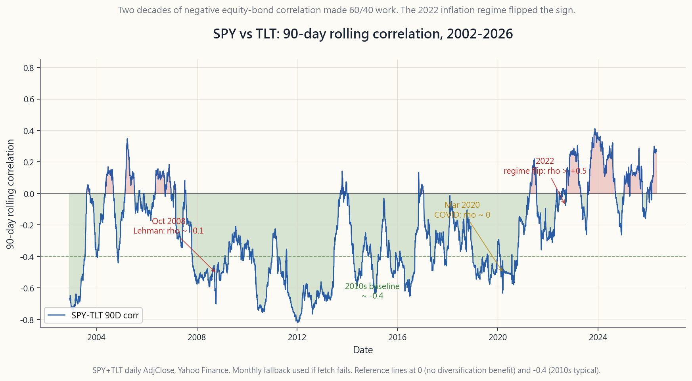

# Side Lesson 19: Correlation Math — What Diversification Actually Does (and When It Stops)

---

## Part 1: Reading Section

---

### 1. Why This Is Important

Diversification is the closest thing to a free lunch in finance, but
the lunch is mathematical and the menu has limits. Most retail
investors carry a fuzzy version of "don't put all your eggs in one
basket" without ever working through the actual algebra of how risk
combines. This lesson fixes that. Once you can write down the
portfolio-variance formula, four things stop being mysterious.

1. **Owning more tickers does not equal diversification.** Fifty US
   large-cap stocks held simultaneously do *not* deliver fifty assets'
   worth of risk reduction. They deliver something closer to two and a
   half — because the pairwise correlation between them is roughly
   0.6, and that one number puts a hard floor on portfolio
   volatility no matter how many names you stack on top.
2. **The covariance matrix is the input that matters.** Mean-variance
   optimisation, risk parity, the L4 Fortress in Week 52 — all of
   them are, mechanically, sorting through the off-diagonal entries of
   the covariance matrix. If you do not have a feel for those
   numbers, every "optimised" allocation you read about is a black
   box.
3. **Correlations are not stable — they spike in crashes.** The most
   uncomfortable fact in portfolio mathematics is that the
   diversification you measured in calm markets is not the
   diversification you receive in stressed ones. October 2008, March
   2020, and the 2022 inflation regime are three separate
   demonstrations of the same arithmetic: when the market needs a
   diversifier, correlations of 0.2 in calm times converge toward 1.
4. **A 40-year regime can flip in one quarter.** Equity-bond
   correlation ran around -0.4 from 2000 through 2021. In 2022 it
   flipped to +0.3, and 60/40 lost 17% in one year. The flip was
   detectable in advance through rolling correlation; the math gives
   you a number to watch, not just a feeling.

The interactive panel lets you push two sliders — number of assets
and pairwise correlation — and watch portfolio volatility, the
diversification ratio, and effective N change live. The static images
ground you in the historical data: the 2002-2026 SPY/TLT rolling
correlation chart, and the diversification curve that shows why
pairwise correlation, not asset count, is the binding constraint.

---

### 2. What You Need to Know

#### 2.1 The Portfolio Variance Formula — sigma_p^2 = w'Sigma w

Every portfolio risk calculation in finance reduces to one identity.
For a portfolio with weights $w$ on $N$ assets and a covariance matrix
$\Sigma$, the portfolio variance is:

$$ \sigma_p^2 = w' \Sigma w = \sum_{i=1}^{N} \sum_{j=1}^{N} w_i w_j \sigma_i \sigma_j \rho_{ij} $$

The double sum looks intimidating but the structure is simple:

- The **diagonal** terms ($i = j$) give $w_i^2 \sigma_i^2$. These are
  the contributions of each asset's own volatility, and they shrink
  as you spread weight across more assets — for $N$ equal-weighted
  assets at vol $\sigma$, the diagonal contribution is $\sigma^2 / N$.
- The **off-diagonal** terms ($i \ne j$) give $2 w_i w_j \sigma_i
  \sigma_j \rho_{ij}$. There are $N(N-1)$ of these, and they do
  *not* shrink with $N$ unless the correlations $\rho_{ij}$ are
  small.

That is the whole story of diversification compressed into one
sentence: **diversification benefit comes entirely from the
off-diagonal terms, and it stops working when the off-diagonals are
big.**

For the simplest case — $N$ equal-weighted assets, all with vol
$\sigma$, all with the same pairwise correlation $\rho$ — the formula
collapses to:

$$ \sigma_p = \sigma \cdot \sqrt{\frac{1}{N} + \left(1 - \frac{1}{N}\right) \rho} $$

That single equation is what the diversification-curve chart plots.

#### 2.2 The Diversification Floor — Why More Names Stop Helping

Take the limit of the formula above as $N \to \infty$. The first term
goes to zero. The second term goes to $\rho$. So:

$$ \lim_{N \to \infty} \sigma_p = \sigma \cdot \sqrt{\rho} $$

Read that out loud. **The lowest portfolio volatility you can
achieve, no matter how many assets you own, is sigma times sqrt(rho).**
At $\sigma = 16\%$ (typical US large-cap):

| Pairwise correlation | Floor vol (large N) |
|---|---|
| 0.0  | 0%  (in theory, never in practice) |
| 0.1  | 5.1% |
| 0.3  | 8.8% |
| 0.5  | 11.3% |
| 0.7  | 13.4% |
| 0.9  | 15.2% |

US large-cap stocks have an average pairwise correlation of roughly
0.6 in calm regimes. That puts the floor at about 12.4% — and you
hit 90% of the way there with about 25-30 names. Stacking names 31
through 500 buys you essentially no incremental risk reduction.

The implication for retail investors: a portfolio of "fifty different
US tech stocks" is not fifty assets. It is, for risk purposes,
roughly two-and-a-half assets at $\rho \approx 0.7$.

#### 2.3 Correlation Is Not Stable — The Crisis Convergence

The deeper problem is that the $\rho$ in the formula is *empirical*,
not constant. Pairwise correlations are themselves random variables
that drift over time, and the drift is not random — it is regime-
dependent in a particularly cruel way.

In normal markets, equity-equity correlations cluster around 0.4-0.6,
equity-bond correlations were near -0.4 from 2000 through 2021, and
international diversification gave you somewhere between 0.7 and 0.85
on developed-market correlations. In crises, all of those numbers
move toward +1.

- **2008 (Lehman / GFC).** US-international equity correlation, calm
  baseline ~0.80, peaked at 0.95 in October 2008. Investment-grade
  credit, calm correlation with stocks ~0.20, hit 0.85 in the four
  weeks after Lehman.
- **2020 (March COVID crash).** Almost everything except cash and
  long Treasuries traded in lockstep. The S&P 500 / EM equity
  correlation, normally 0.7, hit 0.97 over the 5-week sell-off. Even
  gold sold off briefly with stocks on the worst day (March 16) as
  margin calls forced liquidation of liquid assets.
- **2022 (inflation regime).** Long-duration Treasuries, the
  textbook equity hedge for two decades, *fell with* stocks for the
  first time since 1969. The 90-day SPY/TLT rolling correlation
  flipped from -0.40 to +0.30 in eight weeks and stayed positive
  through year-end.

The pattern has a name in academic literature: *correlation
breakdown* (or, more accurately, *correlation convergence under
stress*). The technical mechanism is that during a forced
deleveraging, every leveraged book sells what is liquid, not what is
expensive. That makes asset prices move together because they are all
being moved by the same flow, not by their underlying fundamentals.

#### 2.4 Rolling Correlation — The Risk Metric to Watch

Static historical correlation is a long-run average. The number that
matters for portfolio construction is the *current* correlation, and
the standard way to estimate it is with a rolling window:

$$ \rho_t^{(90)} = \mathrm{corr}\big(r_{t-90:t}^{A}, r_{t-90:t}^{B}\big) $$

A 90-day window on daily returns is the institutional default — long
enough to be statistically stable, short enough to detect regime
shifts within a quarter. Shorter (30-day) windows are noisier; longer
(252-day) windows lag actual regime changes by months.

The SPY/TLT rolling correlation is the canonical example. From 2002
through 2021 it averaged -0.30 to -0.45, with brief excursions to
zero around 2013 (taper tantrum) and 2018 (Q4 hike scare). Then in
Q1 2022 it crossed zero, peaked above +0.50 in mid-2022, and has
oscillated in the range -0.10 to +0.30 ever since. The Apr 2026
print is roughly +0.10 — meaningfully different from the 2010s baseline
of -0.40.

The practical use of this chart: if you are running a 60/40
portfolio, the rolling correlation tells you how much
diversification benefit you are *currently* receiving. A
correlation of -0.4 means your bonds are doing real work. A
correlation of +0.3 means they are mostly just adding duration risk
on top of equity risk.

#### 2.5 Monte Carlo Intuition — 10 Assets, Two Correlation Regimes

The cleanest way to feel the formula is to simulate. Take 10 assets,
each with 16% annual volatility (the long-run number for US large-cap),
equal weights of 10% each. Run two scenarios:

- **Independent assets** ($\rho = 0$): portfolio vol = $\sigma /
  \sqrt{N} = 16\% / \sqrt{10} \approx 5.1\%$. A 3x reduction.
- **Correlated assets** ($\rho = 0.5$): portfolio vol = $\sigma
  \sqrt{1/10 + 0.9 \cdot 0.5} = 16\% \cdot \sqrt{0.55} \approx
  11.9\%$. A 1.3x reduction.

The 50%-correlated portfolio gets *one quarter* of the diversification
benefit of the uncorrelated portfolio. In the limit of large N:

- Independent assets: vol $\to 0$.
- $\rho = 0.5$ assets: vol $\to \sigma \sqrt{0.5} = 11.3\%$.

If the menu of "assets" is "fifty US large-cap stocks," your effective
correlation is closer to 0.6, your floor is about 12.4%, and stacking
more names past about 25 is decoration.

If the menu is genuinely orthogonal — equities, long Treasuries,
short Treasuries, gold, managed futures, options-based defensive
strategies — you are using SOUL #14 (the barbell) and SOUL #13 (four
tranches) to get correlations across the *categories* down toward
zero, even if within each tranche the correlations are high.

#### 2.6 Two Practical Implications

First, **the case for cross-asset-class diversification is much
stronger than the case for cross-stock diversification.** Adding the
50th US large-cap stock to a 49-stock portfolio reduces vol by about
0.05 percentage points. Adding 20% in long Treasuries to a
100%-equity portfolio reduces vol by 3-4 percentage points in normal
regimes. The covariance matrix says you should spend your
diversification budget on asset classes, not on names.

Second, **stress-test your correlations before you rely on them.**
The textbook rule is: assume correlations rise toward 0.7-0.8 in any
serious crisis. If your portfolio's diversification only works at
calm correlations, you do not have a diversified portfolio — you have
a leveraged bet on the calm regime continuing. The 60/40 portfolio
in 2022 lost 17% precisely because investors were running it at
implied correlations of -0.4 when the true crisis correlation was
+0.3.

This is the formal version of Horace's recurring point that the
*tail of the distribution wags the dog* (SOUL #6). Diversification
that fails in the tail is not diversification — it is a fee paid in
calm markets for nothing in return.

---

### 3. Common Misconceptions

**Misconception 1: "Owning a lot of stocks is diversification."**
For a single asset class with average pairwise correlation around 0.6,
you reach 90% of the achievable risk reduction with about 25 names.
Beyond that the marginal benefit is rounding error. True diversification
requires *different asset classes*, not more names.

**Misconception 2: "Zero correlation means assets cancel out."**
Zero correlation only means the assets are linearly independent in
*expectation*. On any individual day they can both fall, and
historically gold and stocks (long-run correlation near zero) have had
plenty of joint down days. Zero correlation reduces *expected* portfolio
variance; it does not produce a hedge.

**Misconception 3: "Negative correlation is always good."**
A perfectly negatively correlated asset would let you build a
zero-volatility portfolio. Real negative-correlation assets (long
Treasuries vs equities, in 2000-2021) only hold that property in
specific regimes, and they generally have lower expected returns. The
"hedge" is paid for in lower CAGR.

**Misconception 4: "Historical correlation is a constant."**
Correlation is a moving statistical estimate, not a physical constant.
The SPY/TLT rolling 90-day correlation has ranged from -0.7 to +0.6
just since 2002. Treating any single number as "the" correlation will
mis-size your portfolio at the worst time.

**Misconception 5: "International stocks add a lot of diversification."**
The US-international developed correlation has been around 0.85 since
2010, up from 0.70 in the 1990s. The benefit is real but small.
International stocks are mostly the same asset class — global equity
beta — denominated in different currencies.

**Misconception 6: "If two assets are uncorrelated they have low joint risk."**
Uncorrelated does not mean independent. Two assets can have zero
correlation and still have catastrophic joint left-tail risk —
correlation only measures the *linear* relationship of the marginal
distributions. This is one reason copula-based methods replaced linear
correlation in serious risk management.

**Misconception 7: "Correlation breakdown is a recent phenomenon."**
1987, 1998 (LTCM), 2001, 2008, 2011 (US debt ceiling), 2020, 2022 —
every serious market dislocation in the past 40 years has produced a
visible spike in cross-asset correlation. The pattern is the modal
behaviour of crises, not an exception.

**Misconception 8: "I can diversify away crash risk."**
You can diversify away *idiosyncratic* risk — the risk that a single
firm or sector blows up. You cannot diversify away *systemic* risk —
the risk that the entire financial system deleverages at once. The
covariance matrix in a crisis is dominated by a single common factor,
and there is no portfolio of risky assets that escapes it. Cash, short
Treasuries, and tail-hedge strategies are the only escape.

**Misconception 9: "Effective N is just the number of assets."**
Effective N is $1 / \sum w_i^2$, which equals $N$ only for equal
weights. A 50%/50% two-asset portfolio has effective N = 2. A
99%/1% portfolio has effective N = 1.02 — almost no diversification
despite holding two assets. Concentration in a single position destroys
the math regardless of how many names appear on the statement.

**Misconception 10: "Risk parity is correlation-aware diversification."**
Risk parity weights $w_i \propto 1/\sigma_i$, which is correlation-
*ignorant*. True correlation-aware portfolios use the full covariance
matrix in a mean-variance optimisation. Risk parity got crushed in
2022 partly because its bond allocation assumed the historic
equity-bond correlation, which had just flipped.

---

### 4. Q&A

**Q1: I own SPY plus 30 individual US large-caps. How much
diversification benefit am I getting from the 30 stocks?**
Almost none. Single-name US large-caps have correlation ~0.95 with
SPY. The 30 stocks are essentially a noisier version of SPY at higher
turnover and tax cost. If the 30 stocks have implicit beta tilts (small
caps, value, momentum), those *might* add factor exposure, but the
diversification component is rounding error. Sell the 30 names and buy
more SPY, or replace them with a different asset class.

**Q2: What pairwise correlation do I need to assume for stress
scenarios?**
Use 0.8 across all risky assets as a working assumption. That is
roughly what 2008 and 2020 produced for risky-asset pairs, and it is a
realistic worst case for forward planning. If your portfolio only
diversifies at $\rho = 0.4$, it is fragile. If it still helps at $\rho =
0.8$, it is robust.

**Q3: How long a rolling window should I use for correlation?**
90 trading days (one quarter) is the institutional default for
detecting regime changes. 252 days (one year) is more stable but lags.
30 days is too noisy for portfolio construction but useful for
diagnosing real-time stress events. The interactive does not let you
change the window, but the chart was rendered at 90 days.

**Q4: My portfolio's actual volatility was lower than the formula
predicted. Why?**
Either your assets had lower correlation than you assumed, or you got
lucky on the realised path. Single-period vol estimates from 5 or 10
years of monthly data have wide confidence intervals — the standard
error of an annualised vol estimate from 60 monthly observations is
roughly 9% relative. Your 12% predicted, 11% realised difference is
not statistically meaningful.

**Q5: Does adding gold reduce portfolio risk?**
Yes, modestly. Gold's correlation with US equities has been near zero
over multi-decade windows, and slightly negative in inflation-stress
regimes. A 10% gold sleeve in a 60/40 reduces vol by roughly 0.5
percentage points and improves the equity-bond crash response. It is
not a hedge in the way puts are; it is a low-correlation diversifier.

**Q6: Is risk parity the right way to handle correlations?**
Risk parity weights by inverse volatility, which is *not*
correlation-aware. It works in regimes where correlations are stable
and asset volatilities are the only thing changing. It fails when
correlations move (like 2022). True correlation-aware allocation needs
the full covariance matrix, which is why mean-variance and Black-
Litterman frameworks dominate institutional portfolios.

**Q7: How does a 50% correlation actually feel in a 10-asset
portfolio?**
At 16% per-asset vol and equal weights, $\rho = 0.5$ gives portfolio
vol of 11.9%. Compare to $\rho = 0$ at 5.1%. You are getting roughly
26% of the diversification benefit you would get from independent
assets. If the assets were 30 instead of 10, the $\rho = 0.5$ vol
falls only to 11.4% — almost no improvement past 10. This is the
correlation floor in action.

**Q8: Can the 2022 equity-bond correlation flip happen again?**
Yes — it is the historical base case in inflation regimes. Equity-bond
correlation was *positive* on average from 1965 through 1998, then
*negative* from 2000 through 2021. The driver is whether inflation or
growth is the dominant risk: when inflation is the worry, both
equities and bonds get hurt by rate hikes; when growth is the worry,
bonds rally as a flight-to-quality. The post-2021 inflation regime
brought back the 1965-98 behaviour.

**Q9: What's the right number of asset classes for a retail
portfolio?**
Five is enough: US equities, international equities, US Treasuries
(short and long together count as one), gold or commodities, and one
defensive overlay (managed futures, tail hedging, cash). Each
additional class adds vanishing benefit, each requires monitoring and
rebalancing, and the SOUL framework (#13 four tranches + cash) is
basically this list.

**Q10: How do I actually compute portfolio variance from real data?**
Take monthly returns for each asset over 5-10 years. Compute the
sample covariance matrix (`pandas` `.cov()` does it). Multiply
$w' \Sigma w$ for your weight vector. Take the square root. Annualise
by multiplying by $\sqrt{12}$. The single biggest pitfall is using
arithmetic means and arithmetic vols on monthly data and then
annualising — that overstates vol by ignoring serial correlation.
Better to compute vol on monthly *log* returns and annualise.

---

## Part 2: YouTube Script

---

**VIDEO TITLE:** Side 19 — Correlation Math: What Diversification Actually Does
**RUNTIME TARGET:** ~14 minutes
**HOSTS:** Horace, Stella

---

**[INTRO — 0:00 to 1:00]**

**Stella:** Welcome back to the side-lesson series. Today we are going
to do something that sounds boring but is actually one of the most
important things in this whole tutorial: we are going to look at the
math of diversification. The actual math, not the slogan.

**Horace:** Everybody knows the slogan. Don't put all your eggs in
one basket. The interesting question is: how much risk does the
basket actually reduce, and when does it stop reducing it? Both of
those have very precise answers, and most retail investors I meet
are wrong about both of them.

**Stella:** So today we will work through three things. First, the
portfolio variance formula — written down once and you'll never
forget it. Second, the diversification floor — why owning more names
in the same asset class stops helping past a certain point. And
third, the historical record on correlation breakdown, because the
worst feature of correlations is that they're not constant — they
spike in crashes.

---

**[SEGMENT 1 — THE FORMULA — 1:00 to 4:00]**

**Horace:** Let me start with the formula. Sigma-p squared equals w
prime Sigma w. That's it. That's portfolio variance.

**Stella:** Translation, please.

**Horace:** Sigma is the covariance matrix — it has every asset's
volatility on the diagonal, and every pair's covariance off the
diagonal. The diagonal terms are individual-asset risk. The
off-diagonal terms are how the assets co-move. When you write out the
double sum, the diagonal terms shrink with N, but the off-diagonals
do not. That's the entire mechanism.

**Stella:** And in the special case where all the assets have the
same vol and all pairs have the same correlation rho?

**Horace:** Then it collapses to one line. Portfolio vol equals
single-asset vol times the square root of one-over-N plus
one-minus-one-over-N times rho. Take that limit as N goes to
infinity, and you get sigma times square-root of rho. That number is
the diversification floor.

**[VISUAL: image/side19_diversification_curve.png]**

**Stella:** This chart on screen shows the formula plotted for four
correlation regimes. Rho equals zero, 0.3, 0.5, and 0.7. Each curve
starts at sixteen percent — that's our single-asset vol — and falls
as we add assets.

**Horace:** Look where they level off. Rho equals zero, you can in
principle get to zero vol with infinite assets. Rho equals 0.5, you
cannot get below 11.3% no matter how many assets you stack. Rho
equals 0.7, you cannot get below 13.4%. Pairwise correlation, not
asset count, is the binding constraint.

**Stella:** So why does retail keep adding more single-name US
large-caps to "diversify"?

**Horace:** Because they're confusing two things. The right model
for "fifty different US large-cap stocks" is rho around 0.6. That
puts the floor at about 12.4% vol, which you hit with about 25
names. Stacking names 31 through 500 buys you nothing.

**Stella:** The covariance matrix says: spend your diversification
budget on different asset classes, not on different names.

**Horace:** Exactly. That's why SOUL principle 13 — four tranches —
matters more than picking thirty stocks. Each tranche is a different
asset-class beta, and the cross-tranche correlations are where the
real risk reduction lives.

---

**[SEGMENT 2 — ROLLING CORRELATION AND THE 2022 FLIP — 4:00 to 8:00]**

**Stella:** OK, so far we've assumed rho is a constant. It is not.

**Horace:** Right. Rho is an empirical estimate, and it moves. The
standard way to track it is a rolling correlation — typically over
a 90-day window of daily returns. That's the institutional default.
Long enough to be stable, short enough to catch regime changes
within a quarter.

**[VISUAL: image/side19_rolling_corr.png]**

**Stella:** This is SPY versus TLT — US large-cap stocks versus long
Treasuries — 90-day rolling correlation from 2002 to April 2026.

**Horace:** What you see is two regimes. From 2002 through 2021, the
correlation runs roughly minus 0.3 to minus 0.5. That negative number
is what made 60/40 work for two decades. When stocks fell, bonds
rallied as a flight to quality. The diversification was real and it
was big.

**Stella:** And then 2022.

**Horace:** And then 2022. In Q1 2022, the rolling correlation
crossed zero. By June 2022 it was above plus 0.5. The whole year, the
S&P fell 18% and TLT fell 31%. 60/40 lost 17%. The diversifier turned
into a duration accelerant.

**Stella:** Why did it flip?

**Horace:** Because the dominant risk changed. From 2000 to 2021 the
dominant macro worry was growth. Bonds rallied when growth scares
hit. From 2022 onwards the dominant worry is inflation. Bonds and
stocks both get hurt by rate hikes. So the cross-asset correlation
flips sign. This isn't unprecedented — equity-bond correlation was
positive on average from 1965 through 1998. It's a regime feature,
not an anomaly.

**Stella:** And the SOUL principle hiding underneath this is number
two — that the post-1980 regime of disinflation and falling rates,
which made passive 60/40 work, is the regime that flipped.

**Horace:** Right. And the rolling correlation chart is the early-
warning indicator. By Q1 2022 the correlation had already crossed
zero — that was the bell. Anyone running a 60/40 should have seen
the chart and reduced their TLT exposure before the worst of the
year.

---

**[SEGMENT 3 — CRISIS CONVERGENCE — 8:00 to 11:00]**

**Stella:** Beyond the slow regime shift, there's the faster
phenomenon — correlation breakdown in crashes.

**Horace:** Yes. The pattern is consistent. October 2008,
international-equity correlation with the S&P went from 0.80 to 0.95.
Investment-grade credit went from 0.20 with stocks to 0.85. March
2020 was even worse — almost everything except cash and short
Treasuries hit 0.97 correlation with stocks for five weeks. Even gold
sold off briefly on March 16 2020.

**Stella:** Why?

**Horace:** Forced deleveraging. When a leveraged book gets a margin
call, it sells what is liquid, not what is expensive. Every leveraged
book at the same time sells the same liquid stuff. That makes the
prices move together — not because of fundamentals, because of flow.
That's why correlations converge under stress.

**Stella:** The practical implication?

**Horace:** Stress-test your portfolio at rho equals 0.8 across all
risky assets. If it still works at that correlation, you have a
diversified portfolio. If it only works at calm-regime correlations,
you have a leveraged bet on the calm regime continuing. Most
"diversified" retail portfolios I see fall into the second category.

**Stella:** This is also why the barbell — SOUL principle 14 —
matters. The fortress side has to be in instruments that do not
participate in deleveraging. Cash. Short Treasuries. Tail hedges that
pay out *because* of the deleveraging.

**Horace:** Exactly. The fortress isn't there to diversify in calm
markets. It's there to be uncorrelated in the moment when everything
else converges.

---

**[SEGMENT 4 — INTERACTIVE WALKTHROUGH — 11:00 to 13:00]**

**Stella:** Pull up the interactive. Two sliders: number of assets,
and pairwise correlation. The big-numbers up top show portfolio
vol, the diversification ratio, and effective N.

**Horace:** Set N to 10 and rho to zero. Portfolio vol is 5.1%.
Diversification ratio — single-asset vol divided by portfolio vol —
is 3.16, which is the square root of 10. That's the no-correlation
benchmark.

**Stella:** Now move rho to 0.5.

**Horace:** Portfolio vol jumps from 5.1% to 11.9%. Diversification
ratio collapses from 3.16 to 1.34. We just got one quarter of the
benefit.

**Stella:** Now push N from 10 to 50, keeping rho at 0.5.

**Horace:** Vol falls from 11.9% to about 11.4%. Forty extra assets
bought us half a percentage point of vol reduction. That is the
diversification floor in action. Once correlation is meaningful, more
assets stop helping.

**Stella:** And the chart on the right shows the curve we just
walked along.

**Horace:** Right. You can see the four reference curves for rho
equals zero, 0.3, 0.5, 0.7, and the big dot is your current N and
rho. Move the sliders and you watch the dot slide along the curve.
That's the geometry of diversification on one screen.

---

**[OUTRO — 13:00 to 14:00]**

**Stella:** Three things to take away. One — the formula. Sigma-p
squared equals w prime Sigma w. Diagonal terms shrink with N,
off-diagonals don't. Two — the floor. At realistic correlations of
0.5 to 0.7, owning more names in the same asset class stops helping
past about 25-30 positions. Three — correlations are not stable.
They drift, they spike, and the spike happens in the worst possible
moment.

**Horace:** And the fix is structural. Diversify across asset
classes, not within them. Stress-test at rho equals 0.8. Watch the
rolling correlation between your major sleeves. And accept that the
portfolio that looked diversified last quarter may not be diversified
this quarter. The math gives you the early-warning signal — if you
care to look.

**Stella:** That's correlation math. Next side lesson, we'll talk
about something completely different. See you then.

---
