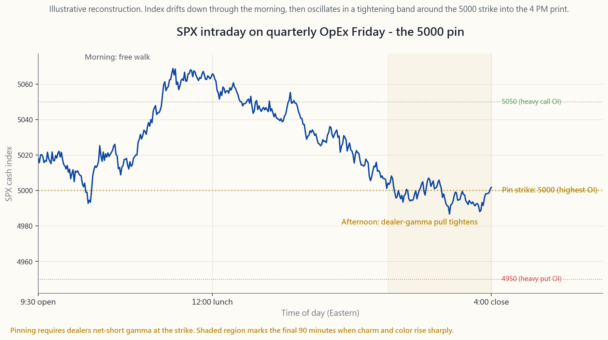

# Side Lesson 20: Greeks Deep Dive — Vanna, Charm, Color, and Second-Order Surprises

---

## Part 1: Reading Section

---

### 1. Why This Is Important

Week 29 introduced the five **first-order Greeks** — delta, gamma,
theta, vega, and rho — as the partial derivatives of an option's
price with respect to the inputs that matter (spot, time, volatility,
rates). For 95% of retail option positions, those five are everything
you need. Size your covered call by delta, watch your theta, glance at
vega before earnings, and you are done.

But options live on a non-linear surface, and the first-order numbers
are only the local slope. Once a portfolio is large enough — or
once you start hedging dynamically, or running 0DTE flow — the
**second-order Greeks** start to matter:

1. **Delta itself moves when volatility moves (vanna).** This is why a
   sharp VIX spike during a sell-off does not hurt your puts as much
   as you would have predicted from delta alone.
2. **Delta drifts as time passes even when the stock does not move
   (charm).** Your weekend hedges are wrong by Monday open. ATM
   options' delta plus charm explains why pin risk is real.
3. **Gamma changes as expiration approaches (color).** That smooth
   gamma profile from week 29 turns into a needle on expiration day.
   Color is what describes the steepening.
4. **Vega itself has convexity (volga / vomma).** A 1-point move in
   IV does not change vega linearly. Volga is why deep OTM "lottery
   tickets" can quintuple in a single VIX-66 day.

There is a fifth, broader reason this lesson exists: **dealer
positioning has become a first-order driver of intraday SPX behavior
since 2022.** The explosion of zero-DTE (0DTE) flow on the index
options has flipped the sign on aggregate market-maker gamma multiple
times per week. June and December quarterly OpEx weeks now show clear
**pin** patterns where SPX hugs a round-number strike like a magnet
into the 4 PM print. None of that flow is visible if you only know
delta. Knowing where the second-order Greeks are concentrated is how
you read it.

The honest framing for retail, though — and this lesson hammers it
in three places — is that **unless you have more than ~5% of your net
worth in options, second-order Greeks are interesting, not actionable.**
Read this lesson the way you would read a book on engine internals:
you will be a better driver, but you do not have to rebuild your
carburetor.

---

### 2. What You Need to Know

#### 2.1 First-Order Greeks — One-Line Refresher

For a European call priced via Black-Scholes with spot $S$, strike
$K$, time-to-expiry $T$, volatility $\sigma$, and risk-free rate $r$:

- **Delta** $\Delta = \partial C / \partial S = \Phi(d_1)$ — the
  hedge ratio. 0 to 1 for calls, 0 to -1 for puts. Quoted per
  $1 of spot move.
- **Gamma** $\Gamma = \partial^2 C / \partial S^2 = \phi(d_1) /
  (S \sigma \sqrt{T})$ — the curvature. Always positive for long
  options. Bell-shaped, peaks at-the-money.
- **Theta** $\Theta = \partial C / \partial t$ — the daily decay,
  negative for long options. Most negative at-the-money, accelerates
  into expiry as $1/\sqrt{T}$.
- **Vega** $\nu = \partial C / \partial \sigma = S \phi(d_1) \sqrt{T}$
  — the IV sensitivity. Quoted per 1 vol-point. Peaks at-the-money,
  rises with $\sqrt{T}$.
- **Rho** $\rho = \partial C / \partial r = K T e^{-rT} \Phi(d_2)$ —
  the rate sensitivity. Negligible for short-dated options, matters
  for LEAPS (week 38).

That is the table you can read off any broker platform. Everything
below this section is the **derivatives of those derivatives.**

#### 2.2 Vanna — When IV Moves, Delta Moves

**Vanna** is the cross-derivative

$$ \text{vanna} = \frac{\partial \Delta}{\partial \sigma} = \frac{\partial \nu}{\partial S} = -\phi(d_1) \frac{d_2}{\sigma} $$

In words: how much your delta changes per 1 vol-point change in IV.

The classic case: you are long a -25-delta SPY put as a tail hedge.
The market sells off 4%, but at the same time VIX jumps from 14 to
24. Your put's **delta has shifted from -0.25 to roughly -0.42**
even before you account for the spot move, because vanna for a put
of that strike is positive (-d2 is positive when the put is OTM, and
the negative sign in the formula flips). The hedge works *better
than the static delta would suggest* — that is the vol-tail-wags-dog
mechanic, expressed in a Greek.

Same mechanic, opposite direction: a covered-call seller above the
money sees their short-call delta **rise** when IV pops, meaning
their effective long stock exposure shrinks faster than expected.
That is a vanna assignment risk.

**Where vanna concentrates:** OTM options, both calls and puts.
At-the-money, $d_2$ is near zero, so vanna is near zero too. The
sign rules of thumb (call vanna > 0 for OTM, < 0 for ITM; puts
mirror) come straight from the sign of $d_2$.

The top-right panel of the image above shows vanna's S-curve:
peaks of opposite sign on either side of the money, zero at ATM.
This is why dealers obsessing over their book's vanna exposure
focus their attention on the 25-delta and 10-delta wings, not on
the 50-delta strike.

#### 2.3 Charm — When Time Passes, Delta Moves

**Charm** (also called *delta decay*) is

$$ \text{charm} = \frac{\partial \Delta}{\partial t} = -\frac{\partial \Delta}{\partial T} $$

For a call with $r=q=0$ this simplifies to a clean

$$ \text{charm}_{\text{call}} = -\phi(d_1) \cdot \frac{d_2}{2 T} $$

What that means in trading terms: **even if SPY does not move at
all, your delta drifts overnight.** A 60-day, -30 delta put on SPY
with 30% IV picks up about +0.0035 of delta per day from charm
alone. Stack a Friday-to-Monday weekend in there and the position
has shifted ~0.01 of delta before the open Monday — just from time
elapsing.

**Practical implications:**

1. **Weekend gap risk is partly charm risk.** If you delta-hedged
   Friday at 4 PM, you will be off-hedge on Monday at 9:30 AM by
   roughly $\text{charm} \times 3$ days, even if futures opened
   unchanged. Delta-neutral books rebalance for charm into Friday's
   close.
2. **Pin risk on expiration day is charm pushed to the limit.** ATM
   options with hours to expiry have $|d_2|$ close to zero but $T$
   in the denominator collapsing — charm explodes. That is what
   makes it impossible to know whether you are going to be assigned
   on a Friday $K = S$ short call until the print.
3. **Calendar spreads have charm exposure by construction.** The
   short leg's delta drifts faster than the long leg's. If you buy
   a calendar at zero net delta, you are long charm — your delta
   will swing one way or the other as time passes.

#### 2.4 Color — When Time Passes, Gamma Moves

**Color** (or *gamma decay*) is

$$ \text{color} = \frac{\partial \Gamma}{\partial t} $$

Where charm describes how delta drifts with time, color describes
how gamma drifts with time. This is the Greek that gets quoted in
dealer-positioning reports under names like *"gamma roll-off"* or
*"gamma re-loading."*

**The shape:** gamma is a bell. As $T \to 0$, the bell **gets taller
and narrower**. Color is the rate at which that narrowing happens.
The center of the bell (ATM) sees gamma rise toward infinity in the
last hours; the wings see gamma collapse to zero.

A trading-floor way to phrase it: *"this morning my book is short
$5M of gamma at 4980 strike; if SPX stays here through close, color
makes it $7M short by Wednesday."* The position has not moved, the
underlying has not moved, but the risk has grown.

#### 2.5 Volga (Vomma) — Vega's Own Convexity

**Volga** is the second derivative of price with respect to vol:

$$ \text{volga} = \frac{\partial \nu}{\partial \sigma} = \nu \cdot \frac{d_1 d_2}{\sigma} $$

It tells you whether your vega exposure itself accelerates or
decelerates as IV moves. The sign is positive when $d_1 d_2 > 0$,
which means **deep OTM and deep ITM options have positive volga**
while ATM options have volga near zero (because $d_2 \approx 0$
there).

**Why this matters:** "lottery ticket" deep-OTM puts during a vol
spike. A 10-delta SPY put bought at IV 18% is worth $0.40. The
market sells off 6%, IV pumps to 38%, and the put — even ignoring
the move in spot — multiplies because **vega itself rose** as the
strike moved closer to the money in vol-distance terms. Volga is
why short-vol traders famously blow up on tail events: their vega
got shorter faster than they could hedge it.

#### 2.6 Dealer Positioning, Gamma Walls, and 0DTE

This subsection is the one that has changed the most since 2022.

**Pre-2022:** the bulk of SPX option open interest was monthly
expirations, with quarterly OpEx (the third Friday of March, June,
September, December) being the largest. Dealers' aggregate gamma
sat predominantly at round-number strikes (5000, 5100, 4900). On
expiration week — Wednesday especially, when index gamma starts
to roll off — SPX often "pinned" near a major strike because the
dealers who were short gamma at that strike had to keep buying the
dip and selling the rip to stay delta-neutral.

**Post-2022:** the 0DTE explosion. Daily expiries on SPX/SPY went
from a niche product to ~45% of total SPX option volume by mid-2024.
Dealers' net gamma can flip from long to short multiple times per
day. The pinning patterns are now both more frequent (because expiry
is every day) and more violent (because charm and color are
extreme on a same-day option).

The image above is an illustrative reconstruction of an SPX cash
session on a recent quarterly OpEx Friday, with the index drifting
through the morning, snapping toward 5000 by lunch, and effectively
oscillating in a 0.15% band around that level for the final two
hours. The dotted horizontal lines mark the three highest-OI strikes
into the print. None of that is mechanical destiny — but it is now
common enough that desk research at every prime broker tracks it.

**The retail takeaway:** if you are short an iron condor whose short
leg is a major round-number strike during quarterly OpEx week, **do
not chase price action** if SPX seems "magnetized" to that strike
on Wednesday-Thursday-Friday. The behavior is explained, not magic;
it is also reversible the moment options expire and dealers
re-hedge. Your edge is patience.

#### 2.7 The Retail Filter — When Second-Order Greeks Actually Matter

Here is the rule, repeated because it is important:

**Unless options are more than ~5% of your investable net worth, do
not optimize for second-order Greeks.** The first-order ones, plus
basic position sizing, will dominate any difference. The marginal
edge from understanding charm is real but small for someone with a
single covered-call program or a quarterly tail hedge.

The exceptions where it does start to matter:

1. **You run a delta-hedged position.** The moment you start
   re-hedging dynamically, you are making the second-order Greeks
   into your P&L drivers. Vanna and charm move your delta between
   re-hedges; volga and color move your gamma exposure.
2. **You hold options through the last week of expiry.** Charm,
   color, and theta acceleration interact non-trivially. If you
   are still in the position at T<7d, you need the full picture.
3. **You write spreads against earnings.** Volga is the Greek that
   blows up short-strangles when "implied move" is breached.
4. **You concentrate in 0DTE.** Every Greek in this lesson is
   first-order on a same-day option.

Outside of those four cases, the lesson lives in your peripheral
vision: useful context, not a hedging instruction.

---

### 3. Common Misconceptions

1. **"Higher-order Greeks are just academic."** They were a footnote
   pre-2022. Post-2022, with 0DTE and large quarterly OpEx, vanna
   and charm flows are observable in intraday SPX data. They are
   academic only if you ignore the index that 70% of US retail
   equity is benchmarked to.

2. **"Vanna is always positive for long options."** Vanna's sign
   depends on moneyness. Long OTM calls have positive vanna; long
   ITM calls have negative. The mistake comes from confusing vanna
   (cross-derivative) with vega (which is always positive for long
   options).

3. **"Charm is just theta."** No — theta is the decay of the *option
   price*; charm is the decay of *delta*. A position can have negative
   theta and positive charm simultaneously (a long OTM call burns
   premium daily but its delta drifts toward zero in absolute value
   on the same time axis).

4. **"Gamma is constant on expiration day."** It is the opposite —
   gamma is least stable on expiration day. Color (the rate at which
   gamma changes per unit time) is largest near expiry, and gamma
   itself can spike toward infinity at exactly $S = K$, $T = 0$.

5. **"Dealers always pin SPX to round strikes."** The pinning
   mechanic requires dealers to be net-short gamma at the strike. If
   they are net-long gamma (because customer flow has been buying
   options instead of selling), the same setup produces *anti-pinning*
   — magnification of moves, not damping.

6. **"0DTE is just a faster casino."** The 0DTE flow has changed the
   structure of intraday SPX volatility. Vanna and charm flows on
   0DTE can produce identifiable intraday patterns (morning chop,
   afternoon trend) that did not exist five years ago. It is a real
   structural change, not a fad.

7. **"Volga only matters during VIX spikes."** Volga matters during
   any large vol move. The asymmetry — vol can rise faster than it
   falls — is what creates a positive expected return for being
   long volga in a tail-hedge construct.

8. **"Once you understand the formulas, you can hedge them out."**
   Hedging vanna requires options at different strikes; hedging
   color requires options at different expiries. Each hedge adds
   transaction cost, and each adds residual risk in the Greek you
   used as a hedging instrument. Institutional desks accept residuals
   in third-order Greeks.

9. **"Higher-order Greeks always make positions worse."** Long-vega
   structures often have positive volga, which is convexity working
   *for* you during a vol expansion. The question is what you paid
   for it (theta) versus how much vol-of-vol you actually got.

10. **"All these Greeks scale linearly with size."** They scale
    linearly per contract, but the underlying spot and IV processes
    do not scale linearly. A 100-contract position behaves
    differently from 10 ten-contract positions across different
    strikes — diversification across the smile changes the
    aggregate Greek profile.

---

### 4. Q&A Section

**Q1: If charm changes my delta overnight, why doesn't my broker
re-hedge for me?**

It does not, because it does not know your hedging policy. Brokers
report your portfolio Greeks (delta, gamma, theta, vega) but do not
auto-rebalance hedges. If you run a delta-neutral book, you place
the rebalance order yourself based on the morning's portfolio delta.
Charm is one of the inputs your hedging algorithm should account
for; weekend charm is the most common one missed.

**Q2: Can I observe vanna flows on a public chart somewhere?**

Indirectly. Several research desks (SqueezeMetrics, SpotGamma,
Cboe research) publish daily estimates of dealer gamma exposure
("GEX") and vanna exposure. The numbers are estimates because
dealer books are not public. The quality is "directionally useful"
not "tradeable on its own." Treat them like sentiment indicators.

**Q3: What's the simplest strategy whose primary Greek is volga?**

A short ATM straddle is short volga (you lose convex amounts when
IV expands). Conversely, a long strangle, especially deep OTM, is
long volga. The volatility risk premium (week 49) is essentially
the market paying a premium to insure the negative-volga seller
against tail-vol expansions.

**Q4: Why do option books often "pin" near round strikes specifically?**

Two reasons. First, customer flow tends to cluster at psychologically
round strikes (5000, 5100), so open interest is highest there.
Second, those round strikes attract index-arb hedging from ETF
market-makers and SPX/SPY converters. The combined effect is more
gamma sitting at the round number than at, say, 4983, which means
dealers' gamma-induced rebalancing pressure peaks there.

**Q5: Does color really matter to a covered-call seller?**

Marginally. If you write a 30-day covered call, color tells you
that the position's gamma profile narrows over the 30 days — by
day 25, your call's gamma is concentrated in a narrow band around
the strike. This affects assignment probability if the stock starts
the final week near the strike. Most retail covered-call writers do
not care, but it is the technical reason "rolling at 21 DTE" is the
common rule: that is the date by which the gamma re-concentration
becomes meaningful.

**Q6: Is vanna positive or negative for puts?**

Same formula, opposite sign convention. For a put, vanna $= -\phi(d_1)
\cdot d_2 / \sigma$ as well. The interpretation flips: when you are
long an OTM put and IV rises, your delta becomes more negative
(closer to -0.5 from -0.3), which actually makes you *more bearish-
hedged*. That is the structural reason vol spikes during equity
sell-offs make tail hedges more effective than they "should" be.

**Q7: Are there third-order Greeks?**

Yes — speed (∂Γ/∂S), zomma (∂Γ/∂σ), ultima (∂Volga/∂σ). They are
relevant to specialist desks running large variance-swap books or
exotic structures. For US-listed vanilla options, third-order
Greeks are noise-level.

**Q8: How do retail platforms display these?**

Inconsistently. ThinkorSwim and Interactive Brokers expose Vanna,
Charm, and Volga in their analytics tabs but bury them. Fidelity,
Schwab, Robinhood do not display them at all. If you want them,
you compute them yourself from the BSM closed-form (the interactive
on this page does it live).

**Q9: How does this connect to week 40 and week 49?**

Week 40 (VIX) explained that VIX itself is the expected variance
of SPX. Week 49 (vol arbitrage) explained the volatility risk
premium. **The second-order Greeks are how those macro vol stories
land on individual option positions.** The dealer flows that drive
VIX and the VRP are the same flows you're seeing in vanna / charm
/ color exposure. Same physics, different aggregation level.

**Q10: Should I add a "vanna trade" to my portfolio?**

Almost certainly not. Vanna trades — long/short combinations
designed to isolate vanna exposure — require liquid options across
the surface, low transaction costs, and real-time risk management.
For retail, the pure-second-order trade is a dead-end. Use second-
order Greeks as **explanation tools** for what your existing
positions are doing, not as a strategy menu.

**Q11: What's the underlying lesson here?**

Vol-tail-wags-dog. Vanna and charm are the mechanism by
which vol expansions and time decay rearrange equity exposure
without anyone trading the underlying. Barbell sizing and
options-tax discipline matter too, but the central idea is the vol
tail.

**Q12: If I only remember one thing from this lesson?**

"Greeks beyond the first five matter when you are running options
as a *system*, not as a position." A single tail hedge once a
quarter? First-order is enough. A daily-rebalanced 0DTE book? You
need the whole stack — and you should not be running that book
alone.

---

## Part 2: YouTube Script

---

**VIDEO TITLE:** "The Greeks Beyond the Greeks — Vanna, Charm, Color, and Why Dealers Pin SPX"

**RUNTIME TARGET:** ~12 minutes

**HOSTS:** Horace, Stella

---

**[INTRO — 0:00]**

**Horace:** *(seated, leaning into camera)* Two months ago we did
Week 29, the five Greeks. Delta, gamma, theta, vega, rho. We told
you that was 95 percent of what retail needs. And we still mean it.

**Stella:** *(off-camera, dryly)* So what's the other five percent?

**Horace:** The other five percent is what professional options
desks call the **higher-order Greeks**. Vanna. Charm. Color. Volga.
And the reason they have started mattering more — even for retail
who just look at the SPX chart — is because of the 0DTE explosion
since 2022. So today's lesson does two things. One, it teaches you
the math. Two, it shows you how dealer positioning around quarterly
OpEx now visibly moves the index. Most of this is going to be
context, not action items. The retail filter at the end is a
straight-up "if you have less than 5 percent of net worth in
options, watch this for fun."

**Stella:** Fun. Got it.

**[VISUAL: image/side20_second_order.png — full screen, 5 sec]**

**Horace:** That's our reference image — four panels of the
second-order Greeks on a 30-day at-the-money SPY-style call. Don't
memorize it. Recognize the shapes.

---

**[1:15 — RECAP THE FIRST FIVE]**

**Horace:** Quick recap. Delta, slope of the option-price curve.
Gamma, the curvature. Theta, the daily decay. Vega, sensitivity to
implied volatility. Rho, sensitivity to interest rates. That is
Week 29. If any of those words feel new, pause and watch that one
first.

**Stella:** What is a higher-order Greek?

**Horace:** It is a **derivative of a derivative.** Delta is how
much the option price moves per dollar of spot. *Vanna* is how
much delta moves per vol-point of IV. *Charm* is how much delta
moves per day of time elapsed. They are cross-partials.

---

**[2:30 — VANNA]**

**Horace:** Let's do vanna first because it is the one that
explains something most retail traders have already noticed without
being able to name. You are long an out-of-the-money put. The
market sells off. VIX spikes. And your put has *gone up more than
your delta predicted*. Not just because spot moved, not just
because vega — the delta itself shifted.

**Stella:** Because vanna.

**Horace:** Because vanna. The math is that vanna equals minus phi
of d1 times d2 over sigma. Don't memorize that. Memorize this: when
IV rises, OTM option deltas walk back toward the money in absolute
value. Your minus-25 put becomes a minus-40-ish put just from the
IV move.

**[VISUAL: image/side20_second_order.png, top-right panel zoomed]**

**Horace:** Top-right panel. That sine-wave-looking thing. Zero at
the money, peaks of opposite sign on either wing. That is vanna's
shape. Dealers running tail-hedge books obsess over the wing
exposure — the 10-delta and the 25-delta — exactly because that
is where vanna lives.

---

**[4:30 — CHARM]**

**Horace:** Charm is the same mechanic but with time instead of
vol. How much does my delta shift just from a day passing — even
if the underlying does not move at all?

**Stella:** *(skeptical)* Surely that is tiny.

**Horace:** It is tiny per-day. The number is in the third decimal.
Multiply it by a weekend, multiply it by a 100-lot, and you have
several hundred shares of effective stock exposure that has
silently appeared between Friday close and Monday open. Delta-
hedging desks rebalance for charm into Friday's print. We don't —
we just need to know it exists, because it is why **pin risk on
expiration Friday is real.** The closer you get to expiry, the
more violently delta drifts with no spot move.

**[VISUAL: image/side20_second_order.png, top-left panel]**

---

**[6:00 — COLOR]**

**Stella:** And color?

**Horace:** Color is gamma's version of charm. Just as charm is
how delta drifts with time, color is how *gamma* drifts with time.
Gamma is a bell. As you approach expiry, that bell gets taller and
narrower at the at-the-money strike. Color is the rate of that
narrowing. Bottom-left of the image.

**Stella:** And so on for volga.

**Horace:** Volga is the convexity of vega. Vega is not constant
in IV — when IV rises, vega itself rises for OTM strikes. That is
why deep-OTM puts can quintuple on a vol spike. Bottom-right.

---

**[7:30 — DEALER PINNING]**

**Horace:** OK, here is the part that is actually visible to retail.

**[VISUAL: image/side20_dealer_pinning.png — full screen, 5 sec]**

**Horace:** Illustrative SPX intraday on a quarterly OpEx Friday.
The index drifts in the morning, then around lunch starts
oscillating in a tighter and tighter band around the round-number
strike. By the close, it is doing 0.15-percent jiggles around 5000
like it is glued there.

**Stella:** Why does that happen?

**Horace:** Aggregate dealer gamma. Open interest at round strikes
is huge — 5000, 5100, 4900 on SPX. If dealers as a group are short
that gamma — meaning customers bought the options — then every
time the index ticks up, dealers have to sell to stay delta-neutral.
Every time it ticks down, they buy. They mechanically dampen moves.
The result is the pin.

**Stella:** Always a pin?

**Horace:** Not always. If dealers are net-long gamma — customers
sold the options instead — same setup produces the *opposite*:
moves get amplified. That is what happens on Powell-day FOMCs
sometimes. You don't need to predict it; you need to know which
regime you are in. Squeezemetrics, SpotGamma, and a couple of others
publish dealer-gamma estimates daily.

---

**[9:30 — INTERACTIVE WALKTHROUGH]**

**Horace:** The interactive on the page lets you sweep all five
first-order Greeks plus the four second-order ones for any
contract.

**[VISUAL: course/interactive/side20_greeks_explorer.html]**

**Horace:** Set spot 100, strike 100, 30 days, 20 percent vol. Look
at the nine numbers in the top row. Then below, you have a
sensitivity heat map — you can pick any one of the nine Greeks and
see how it changes as you move spot and DTE. Pick **vanna**. Notice
the diagonal stripe pattern — vanna is biggest at the wings and at
medium DTE. Now pick **color**. The whole surface concentrates near
ATM in the last 7 days. That is the gamma narrowing we just talked
about, visualized.

**Stella:** And charm?

**Horace:** Charm shows the largest absolute values right next to
expiration on the wings. Hovering near the money? Charm is small.
Already deep ITM or OTM, with 5 days left? Charm is huge.

---

**[10:45 — RETAIL FILTER]**

**Horace:** Three rules to take home.

**Stella:** *(counting)* One.

**Horace:** Less than 5 percent of net worth in options? You don't
need this. Read it once for context. Use the first-order Greeks for
sizing.

**Stella:** Two.

**Horace:** Running a delta-hedged book, holding through expiry
week, or doing 0DTE? You need this. Vanna and charm are doing your
P&L while you are not looking.

**Stella:** Three.

**Horace:** Watch quarterly OpEx weeks — March, June, September,
December. The pinning pattern is real, dealer-gamma estimates are
published, and the play is "do not chase intraday SPX action that
looks magnetized to a round strike." It is not magic. It is flow.

---

**[OUTRO — 11:45]**

**Horace:** That is Side 20. Next up, Side 21 will be — *(beat)* —
Stella, what is next?

**Stella:** *(reading off-screen)* Tax-loss harvesting deep dive.

**Horace:** Yeah. Less exotic, more money.

**Stella:** Always more money.

**[END]**
