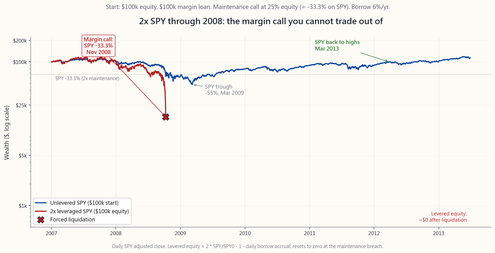
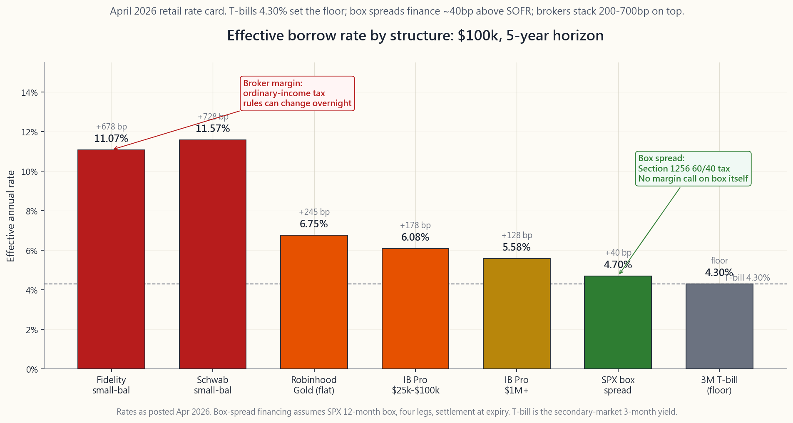

# Side Lesson 21: Margin and Leverage — Reg T, Portfolio Margin, and How Not to Blow Up

---

## Part 1: Reading Section

---

### 1. Why This Is Important

Leverage is the single fastest way to convert a correct view into a
permanent loss. Get the direction right, get the size right, get the
financing right, and leverage rewards you. Get any one of those three
wrong on a long enough horizon and you stop being a participant in
the market — the margin clerk participates for you, on terms you do
not control.

This lesson is not a sales pitch for margin. It is a working manual
for the margin system you will encounter the moment you sign a
brokerage agreement, plus the math that explains why "responsible
leverage" is a lot harder than the brochures suggest.

1. **Every retail brokerage account is a margin account by default.**
   Schwab, Fidelity, Interactive Brokers, ETrade, Robinhood — when
   you open a standard account, you are signing a margin agreement
   unless you specifically request a cash account. That signature
   gives the broker the right to lend your shares to short sellers,
   to liquidate your positions without your consent, and to change
   the rules at any time. You should know what you signed.
2. **The 2008 and 2020 drawdowns broke the levered, not the
   long-only.** A 100% equity investor who froze in March 2009 was
   underwater for ~12 months and back to all-time highs by Mar 2013.
   A 2x levered S&P 500 investor with the same conviction got
   margin-called below SPX 800 and never participated in the
   recovery. The story repeats every cycle. The market can
   stay irrational longer than you can stay solvent.
3. **Borrow rates are not what you think.** Interactive Brokers,
   widely advertised as the cheapest, charges roughly 6.6% on the
   first $100k in April 2026 and only drops to ~5.4% above $1M.
   Fidelity and Schwab are 11-13% on small balances. The "cheap
   leverage" story is a large-account story. On a $50k account, a
   2x portfolio costs 6.6% on the second $50k — about $3,300 a year,
   or 6.6% drag on equity, before you have made a single trade.
4. **Box spreads and portfolio margin exist for a reason.** SPX box
   spreads finance at the SOFR + 30-50bp range, ~150 bp below the
   broker's small-account margin desk. Portfolio margin replaces the
   crude Reg T 50% rule with a stress test that gives spread traders
   3-5x more buying power on the same capital. Both tools require
   reading the manual; both reward investors who do.

The honest framing is simple: vol-tail-wags-dog. Leverage does
not change your average return very much; it changes the shape of
the distribution — fattening the left tail until a 3-sigma event
becomes terminal. Use it consciously or do not use it at all.

---

### 2. What You Need to Know

#### 2.1 The Two Account Types and What You Sign Away

Every retail broker offers two account types. Most people pick the
default without reading the difference.

**Cash account.** You can buy what your settled cash will cover. You
cannot short, you cannot trade options beyond cash-secured puts and
covered calls, and you face the T+1 settlement rule (changed from
T+2 in May 2024). No margin call ever happens — the worst case is
that your stocks go to zero and you have lost what you put in.

**Margin account.** You can borrow up to 50% of the purchase price
of marginable securities (Reg T initial requirement), short stock,
trade options of all kinds, and use spread strategies that require
short legs. In exchange you grant the broker, via the margin
agreement, three powers most retail clients never read carefully:

1. **Securities lending.** Your fully-paid shares can be loaned to
   short sellers. You do not get the lending revenue (the broker
   keeps it). Dividends arrive as "payments in lieu" — taxed as
   ordinary income, not as qualified dividends. That tax mismatch matters.
2. **Forced liquidation.** If you fail to meet a margin call, the
   broker may sell any position in any size at any price without
   your consent and without notice. Most agreements explicitly
   waive the requirement to call you first.
3. **Unilateral rule changes.** The broker may raise house margin
   requirements on any security at any time. In a fast-moving
   market this often happens after the market has fallen — the
   stocks that just dropped 30% are precisely the ones the broker
   marks "100% margin required" overnight, forcing additional
   sales when prices are already low.

If you do not need the leverage, the short-selling, or the option
strategies, the cash account is the structurally safer choice. Most
investors are surprised to learn they have a margin account at all
until the day it matters.

#### 2.2 Regulation T — The 50/25 Rule

Federal Reserve Regulation T, in force since 1934, governs initial
margin on US-listed equities. The number is **50%**: when you open
a new long position, you must put up at least half the purchase
price in equity. The other half is the broker's loan.

| Item | Amount |
|---|---|
| Stock purchase | $100,000 |
| Reg T initial margin (50%) | $50,000 of your equity |
| Margin loan | $50,000 |
| Initial leverage | 2.0x |
| Initial equity % | 50% |

FINRA Rule 4210 sets the maintenance margin: equity must remain at
least **25%** of the position value. Below that, you get a margin
call.

The arithmetic of when the call triggers is worth memorising. For a
single-name long position bought 2x at price $P_0$, the maintenance
threshold is the price $P_M$ at which equity has fallen to 25% of
position value:

$$ P_M = P_0 \cdot \frac{1 - 0.50}{1 - 0.25} = P_0 \cdot 0.667 $$

Translation: a 2x long position takes a margin call after a **33.3%
decline** in the underlying. The 2008 S&P fell 56.8% peak-to-trough.
The 2020 COVID drop hit -33.9% in 23 trading days. The 2022 NDX
drop hit -35%. Every recent significant drawdown has crossed the
2x maintenance threshold.

Most brokers impose house requirements stricter than FINRA's 25%
floor — typically 30-35% on individual stocks, 50% or 100% on
volatile names, and 100% (no margin) on stocks under $5 or after
they have just dropped sharply. The house rule almost always
triggers the margin call before the regulatory minimum does.

#### 2.3 The Margin Call Mechanic — Forced Selling at the Worst Time

A margin call is not a phone call. It is an automated notice (email
or app push) saying you have N business days — usually 2 to 4 — to
either deposit cash, deposit marginable securities, or close
positions to bring equity back above the maintenance threshold.

If you do not act, the broker acts for you. The order is:

1. **Most volatile names first.** Single stocks before ETFs.
2. **Highest-margin-requirement positions next.** The same names
   the broker just marked "house special" overnight.
3. **Auctioned at market**, often in pre-market or the open
   auction when liquidity is worst and spreads are widest. Your
   fill price is whatever clears at that moment, not the print
   you see on the chart.

The economics of forced liquidation are catastrophic in two ways.
First, you sell at the bottom by definition — the call only fires
because prices have already fallen. Second, you eliminate the
recovery: the shares the broker liquidates are not yours to ride
back up. The 2008 S&P 500 round-trip was -57% then +400% in 13
years; the levered investor who got called at -33% participated in
the loss but not the recovery.

The 2022 crypto-margin liquidation cascade is the modern textbook
example. Celsius, Voyager, BlockFi, and 3AC ran roughly 3-5x
leverage on stablecoin loans collateralised by ETH and BTC. As ETH
fell from $4,800 in November 2021 to $880 in June 2022, each
maintenance call triggered automated liquidations into a thinning
order book, which fell further, which triggered the next call.
ETH margin debt at the institutional level went from ~$28 billion
to under $4 billion in eight weeks. None of it would have failed
if the participants had been unlevered. Vol-tail-wags-dog.

#### 2.4 Portfolio Margin — The Stress-Test Alternative

Portfolio margin (PM) replaces Reg T's flat 50/25 rule with a
risk-based calculation. The broker stress-tests your full portfolio
against a set of standardised scenarios — typically a +/-15% move
on the broad market with +/-3% interest rate and +/-9% volatility
shocks — and requires equity equal to the worst-case loss in that
grid.

For a long-only equity portfolio, PM does not help much: the worst
case is "down 15%," and a 15% requirement means ~6.7x leverage
which most investors should not use. Where PM transforms the math
is defined-risk option positions:

- An iron condor on SPX with $50 wing width has a maximum loss of
  $50 per spread regardless of where SPX goes. Reg T requires the
  short-put-spread and short-call-spread margin separately —
  often $100 per condor. PM requires the actual maximum loss —
  $50 per condor. Effective margin halved.
- A short straddle on a stock with a defined hedge has a stress
  loss far below the Reg T strangle margin (the Reg T calculation
  ignores the hedge). PM nets the position.
- A long-stock + short-call (covered call) plus a long-put
  (collar) has a defined floor. PM treats the full structure;
  Reg T does not.

The cost of admission is real: PM requires a $100k minimum equity,
options-trading approval at the appropriate level, and a brokerage
that supports it (Interactive Brokers, TastyTrade, TD Ameritrade
legacy, Schwab pro). It also requires understanding the stress
test — if you concentrate the portfolio in a single name, PM
correctly identifies the concentration risk and demands more, not
less, margin than Reg T would.

PM is the right tool for the spread trader who runs a defined-risk
options book. It is the wrong tool for the leveraged stock buyer
who just wants to control more shares. Match the structure to the
strategy, not the slogan.

#### 2.5 Broker Borrow Rates — The Cost That Kills the Carry

The advertised low margin rates are for large balances. Here is the
April 2026 retail picture for the standard "buy stock on margin"
borrow:

| Broker | $25k loan | $100k loan | $1M loan |
|---|---|---|---|
| Interactive Brokers (Pro) | 6.58% | 6.08% | 5.58% |
| Fidelity | 12.575% | 11.075% | 8.575% |
| Schwab | 12.575% | 11.575% | 9.075% |
| Robinhood Gold | 6.75% | 6.75% | 6.75% |
| ETrade | 13.20% | 11.70% | 8.45% |

Reference: Fed funds 4.25-4.50%, 3M T-bill ~4.30%.

Two facts jump off the table.

**First: the spread above T-bills.** Even Interactive Brokers
charges T-bills + 175-225 bp on small balances. Fidelity and
Schwab charge T-bills + 700-800 bp. The broker is not lending you
money; the broker is using your shares as collateral to borrow at
SOFR and re-lending the same money to you at SOFR + 5%. You are
paying the spread.

**Second: there is no historical-return-based case for retail
2x.** Damodaran's 1928-2024 series shows the S&P 500 averaging
9.9% nominal CAGR. A naive 2x is 19.8% — minus borrow on the
second 100%. At Interactive Brokers small-balance rates that is
19.8 - 6.6 = 13.2%, plus another -1 to -2% for vol drag. At
Fidelity small-balance rates it is 19.8 - 11 = 8.8%, worse than
unlevered. The "leverage long-term equities" trade does not work
at retail prices.

For investors with the size to qualify, the cheaper alternatives
are real:

- **SPX box spread** financing on Interactive Brokers / TastyTrade
  / Schwab. SOFR + 30-50bp typical, 4.7-4.9% in April 2026. The
  trade locks in a synthetic loan via four SPX options legs. Tax
  treatment: Section 1256 (60% LTCG / 40% short-term), not
  ordinary income. The tax wrapper matters here. Capital efficient: $100k box spread
  takes ~$1k of buying power under PM.
- **Treasury repo / box of T-bills** for institutional accounts.
  4.30% in April 2026, virtually risk-free. Retail does not have
  access; this is here for completeness.
- **Futures on indexes (week 39).** /MES at $5/pt, $26k notional,
  ~$2k margin. Implicit financing ~SOFR + 30bp, embedded in the
  basis. Section 1256 again. Best leverage tool for a retail
  account, period.

#### 2.6 The Leverage Doesn't Add Long-Term Return Argument

Here is the calculation that should kill most leveraged-equity
sales pitches.

Let $\mu$ be the unlevered arithmetic return on equities, $\sigma$
the unlevered volatility, $b$ the borrow cost, and $L$ the
leverage. The geometric return on the levered position is:

$$ g_L \approx L \mu - (L-1) b - \tfrac{1}{2} L^2 \sigma^2 $$

Plug in $\mu = 9.9\%$, $\sigma = 16\%$, $b = 6\%$ (IB small balance):

- $L = 1$: $g = 9.9 - 0 - 0.5 \cdot 1 \cdot 0.0256 = 8.6\%$
- $L = 1.5$: $g = 14.85 - 3 - 0.5 \cdot 2.25 \cdot 0.0256 = 8.97\%$
- $L = 2$: $g = 19.8 - 6 - 0.5 \cdot 4 \cdot 0.0256 = 8.68\%$
- $L = 3$: $g = 29.7 - 12 - 0.5 \cdot 9 \cdot 0.0256 = 6.35\%$

The geometric return is **flat** across reasonable leverage and
**falls** beyond 2x. What rises monotonically with $L$ is variance.
You are taking three to four times the volatility for the same
expected wealth. That is not a trade; that is a tax.

Where the equation flips is when borrow drops below the equity
risk premium. At $b = 4\%$ (box spread, large balance, or
futures-implied), $L = 1.5$ delivers ~9.7% — modestly better than
unlevered, with proportionally more risk. At $b = 8\%$ (Robinhood
Gold or Fidelity small balance), even $L = 1.25$ is worse than
$L = 1$.

The conclusion is not "never lever." The conclusion is: **leverage
is an alpha source for institutions with cheap financing and a real
edge; it is a beta amplifier for retail with broker-rate financing
and no edge.** Alpha is rare; cheap leverage on no edge
just rents you variance.

#### 2.7 Sizing Rules When You Decide to Use Margin

If after all of the above you still want leverage in your toolkit,
the sizing rules are non-negotiable.

1. **Cap leverage at the level a 30% drawdown won't kill.** For a
   2x book, that means a 30% market drop costs you 60% of equity
   plus borrow drag. You should be able to cover that loss
   psychologically and financially. Most retail investors cannot.
   Cap at 1.25x to 1.5x if you are honest about your behaviour.
2. **Match financing to the trade horizon.** A 90-day options
   trade can use broker margin (the rate * 0.25 year is small). A
   5-year structural lever should use a box spread or
   futures-implied financing, not the broker's 11% small-balance
   margin rate.
3. **Pre-stage the cash for the call you don't think will come.**
   Keep 5-10% of the levered notional in T-bills outside the
   margin account. When the call comes — and it will — that cash
   is the difference between you choosing what to sell and the
   broker choosing for you.
4. **Recompute leverage every Friday close, not just at trade
   entry.** Markets compound; your equity moves. A 1.5x position
   that is up 30% is now 1.31x. A 1.5x position that is down 20%
   is now 1.875x. Re-mark and re-size.
5. **Treat the margin agreement as a contract you re-read
   annually.** Brokers change house requirements, securities-
   lending terms, and forced-liquidation policies. The version
   you signed in 2018 is not the version that will close your
   position in 2028. Read the current one.

The interactive lab below lets you tune account size, leverage,
market move, and borrow rate, and shows the resulting equity, the
distance to the call, and the after-cost annualised return in real
time. Run a few scenarios where the move is negative — that is
where the lessons live.

---

### 3. Common Misconceptions

**Misconception 1: "I have a cash account because I never use
margin."** Most retail brokers open standard margin accounts by
default. You have to specifically request a cash account. Your
broker can lend your shares right now if you have not opted out.

**Misconception 2: "Margin calls give me time to react."** The
agreement says 2-4 business days. The reality is that brokers can
liquidate immediately if equity falls below the house threshold,
which is typically tighter than the regulatory threshold. In
March 2020, automated liquidation engines fired within hours, not
days, on volatile names.

**Misconception 3: "Portfolio margin is just more leverage."** PM
is more leverage for defined-risk option books. For a long-only
stock portfolio, PM offers ~6.7x maximum, which no sensible
investor should use. PM is a structure-aware capital tool, not a
leverage upgrade.

**Misconception 4: "2x ETFs (SSO, QLD) are the same as 2x on
margin."** They are not. 2x ETFs reset daily, which produces
volatility decay over time (week 37). On a smooth uptrend they
roughly track 2x; on choppy markets they underperform 2x by 1-3%
per year. Margin tracks the underlying linearly until the call.

**Misconception 5: "Box spreads are exotic and risky."** A box
spread is four SPX options legs that net to a defined loan with a
known maturity and zero credit risk to the lender. It is the most
plain-vanilla financing in the listed-options market. The "exotic"
label is a marketing fiction protecting broker margin revenue.

**Misconception 6: "I'll just stop out before the margin call
hits."** In a fast tape — March 2020, August 2024 yen-carry
unwind, individual-name earnings gaps — the gap between your stop
and the next print can exceed the 33% threshold. Stops are not
guaranteed; margin calls are.

**Misconception 7: "My broker won't margin-call me — I have a
relationship."** The margin clerk does not have a relationship.
The clerk has a queue of accounts below the threshold and a
liquidation algorithm. The "relationship" account, if it exists at
all, is for the very few prime-brokerage clients with $50M+; it
does not exist for the retail tier.

**Misconception 8: "Borrow rates are about prevailing interest
rates."** Borrow rates are about spreads the broker chooses to
charge above their own funding cost. Fidelity's small-balance
margin rate moves up much faster when SOFR rises than it moves
down when SOFR falls. The spread is policy, not math.

**Misconception 9: "Leveraged ETFs are safer than margin because
there's no margin call."** True that there is no margin call —
but a 2x ETF can decay to zero through volatility drag without
the underlying ever going to zero (TVIX, VXX). Different failure
mode, equally permanent loss.

**Misconception 10: "Long-term backtests show 2x equities beat
1x."** They do — if you ignore borrow costs, ignore the path risk
through 1929, 1973, 2000, 2008, 2020, and assume you would have
rebalanced every day. Real-world 2x with broker financing, real
path risk, and real human behaviour underperforms 1x on ~70% of
historical 30-year windows.

---

### 4. Q&A Section

**Q1: What is the difference between Reg T and FINRA maintenance
margin?**

Reg T is the initial requirement set by the Federal Reserve: 50%
equity to open a long position, 150% for a short. FINRA Rule 4210
is the maintenance requirement set by the self-regulatory
organisation: 25% equity to keep a long position, 30% for a
short. Reg T governs entry; FINRA governs continued holding.
Brokers may apply stricter house rules on top of either.

**Q2: Can the broker lend my shares without my permission?**

In a margin account, yes — the margin agreement explicitly
authorises securities lending. In a cash account, generally no
(some brokers offer opt-in fully-paid lending programs that pay
you a portion of the lending revenue). If you do not want your
shares loaned, use a cash account or opt out where available.

**Q3: How fast can a margin call happen?**

In a slow-moving market: 2-4 business days notice before forced
liquidation. In a fast-moving market or on a volatile single
name: minutes to hours, especially under house intra-day margin
rules that some brokers enforce. The agreement reserves the right
to act without notice in any case.

**Q4: What happens to my margin loan if the broker goes
bankrupt?**

SIPC protects up to $500k of securities (including $250k cash) in
a brokerage failure, but the margin loan itself is a senior claim
against your collateral. If the broker fails, your account is
typically transferred to a successor broker with the loan intact.
The broker's other creditors do not get your shares; the SIPC
trustee unwinds the loan against your collateral as part of the
transfer.

**Q5: Does margin interest qualify as deductible investment
interest expense?**

For US taxpayers who itemise: investment interest expense is
deductible against investment income (qualified dividends taxed
at LTCG rates and net long-term gains can be elected in, but
generally the deductible offsets ordinary investment income
only). Most retail investors take the standard deduction and get
no tax benefit from margin interest. Box spreads, by contrast,
are Section 1256 and the financing cost is embedded in 60/40
LTCG treatment — a structurally better tax outcome on the same
trade. The tax-wrapper edge here is real.

**Q6: What is portfolio margin, in one sentence, for someone who
has never traded options?**

PM replaces the broker's flat 50/25 percentage rule with a
stress-test on your whole portfolio that gives you more buying
power if your positions hedge each other and less buying power if
they concentrate risk. It is built for option spread traders and
is unhelpful for plain stock buyers.

**Q7: Should I get a margin account just to short stocks
occasionally?**

If "occasionally" means once or twice a year on a single name,
options puts are the better tool — defined risk, no margin call,
and depending on structure, Section 1256 or LTCG tax treatment.
Margin shorting is for traders who short systematically and need
the linear payoff and the rebate on hard-to-borrow names.

**Q8: Is Robinhood Gold's flat 6.75% a good deal?**

Compared to Fidelity small-balance (11%) yes; compared to
Interactive Brokers Pro (5.5-6.5%) no. The flat structure means
small accounts get a better deal than tiered brokers and large
accounts get a worse one. Crossover is around $250k of borrow.

**Q9: Why does my 2x ETF underperform when the S&P is flat?**

Because 2x ETFs reset their leverage every day. In an up-down-up
sequence the underlying ends flat but the ETF compounds 2 *
return - return^2 each day, which has a negative-sigma-squared
term that accumulates. Choppy markets eat 1-3% per year of 2x
ETF performance even when the underlying is fine. Week 37 covers
this in detail.

**Q10: What is the realistic maximum leverage for a retail
investor who actually wants to come out ahead?**

For most: 1.0x. For an investor with a documented edge, IB Pro
financing, the discipline to remark weekly, and the cash reserves
to cover a 30% drawdown: 1.25x to 1.5x as a structural position.
Above 1.5x is institutional territory and almost always destroys
retail accounts on a 10-year horizon. Irrational markets plus fat-tailed vol
combine to make leverage the dominant cause of permanent
capital loss in retail.

**Q11: What is the safest way to use leverage if I am set on
using some?**

Section 1256 instruments: index futures (week 39), SPX box
spreads, and SPX options. Borrow is implicit in the basis or the
box, sized to be 50-150bp above SOFR rather than 200-700bp above.
Tax is 60/40 not ordinary. There is no margin call on the
underlying position when you box-spread-finance — the box itself
is fully cash-settled at maturity.

**Q12: Did anyone use leverage successfully through 2008?**

Yes — managed-futures CTAs that were long volatility via trend
following on inverse positions (week 51). They had the right
direction, the right size relative to vol, and the right
financing. The vast majority of long-equity leveraged accounts
did not survive in their original form. The lesson is not "no
leverage"; the lesson is "the kind of leverage that survives the
tail is not the kind being sold to you." Barbell sizing matters.

---

## Part 2: YouTube Script

---

**VIDEO TITLE:** Margin and Leverage — Reg T, Portfolio Margin, and How Not to Blow Up | Side Lesson 21

**RUNTIME TARGET:** ~13 minutes

**HOSTS:**
- **Horace** (teacher): Retail investor with a portfolio-margin account he uses for spreads, not for stock leverage.
- **Stella** (student): Has a Schwab account, just realised it's a margin account.

---

**[INTRO]**

[VISUAL: Title card "Side Lesson 21 — Margin and Leverage"]

**Horace:** Stella. Open your brokerage app. Look at the account
type. Tell me what it says.

**Stella:** *(looking)* It says... "margin account."

**Horace:** Right. You did not pick that. The default account type
at every major US retail broker is a margin account, and you
signed the agreement when you onboarded. So today we are going to
read what you signed, and then talk about whether you should use
the leverage or not — because the answer is mostly not, but it's
a useful not once you understand the math.

**Stella:** What did I sign?

**Horace:** Three things, mainly. The broker can lend your shares
to short sellers. The broker can liquidate your positions without
calling you first. And the broker can change house margin rules
on any stock at any time. None of those matter while you are
unlevered. All of them matter the day after you lever up.

---

**[SEGMENT 1: REG T AND THE 33% RULE]**

[VISUAL: Title card "Reg T: 50% Initial / 25% Maintenance"]

**Horace:** The Federal Reserve sets the initial margin at 50%.
You put up half, the broker lends you the other half. FINRA sets
the maintenance margin at 25% — your equity must stay at least a
quarter of the position value, or you get a call. Brokers stack
their own rules on top, usually 30 to 35%.

**Stella:** OK. So if I buy 2x, when do I get called?

**Horace:** Do the algebra. 2x means 50% equity at entry. Drop to
25% equity and you call. The price level where that happens is
two-thirds of the entry price.

[VISUAL: image/side21_margin_call_path.png]

**Horace:** This chart shows a 2x SPY position riding through
2008. The unlevered SPY was awful — down 38% — but it recovered.
The 2x line crossed the maintenance threshold at minus 33%, was
forced to liquidate at the bottom, and never participated in the
recovery. That is the structural problem with retail leverage:
you eat the loss but not the rebound.

**Stella:** Why didn't they just hold through it?

**Horace:** They didn't get to choose. The broker chose. The market
can stay irrational longer than you can stay
solvent. Leverage cuts your "longer than" in half.

---

**[SEGMENT 2: THE 2022 CRYPTO LIQUIDATION CASCADE]**

**Horace:** The recent textbook case is crypto, 2022. Celsius,
Voyager, BlockFi, 3AC — all running 3 to 5x on stablecoin loans
collateralised by ETH and BTC. ETH went from $4,800 in November
2021 to $880 in June 2022. Each margin call on the way down
forced selling into a thinning order book. The selling pushed the
price lower. The lower price triggered the next call. Eight weeks.
$24 billion of margin debt unwound. Vol-tail-wags-dog.
None of those firms would have failed unlevered.

**Stella:** And this could happen with stocks?

**Horace:** It does happen with stocks. March 2020, August 2024
yen carry unwind, every individual-name earnings disaster.
Different products, same mechanic.

---

**[SEGMENT 3: THE BORROW-RATE TABLE NOBODY ADVERTISES]**

[VISUAL: image/side21_box_vs_broker.png]

**Horace:** Now look at the price tag. Treasury bills are paying
4.3%. The risk-free rate. Interactive Brokers Pro on a small
account: 6.6%. Fidelity small account: 11%. Schwab small account:
12%. The broker is not lending you anything; the broker is
borrowing at SOFR and re-lending the same dollar to you at SOFR
plus five.

**Stella:** Why is anyone paying 11%?

**Horace:** Because they don't read the table. And because the
alternatives — box spreads, portfolio margin, futures — require a
$100k account, options approval, and reading the manual. The
brokers count on that friction.

**Horace:** A box spread on SPX, today, finances at SOFR plus 30
to 50 basis points — about 4.7%. Two hundred basis points cheaper
than IB's small-account margin desk. Four hundred basis points
cheaper than Fidelity. Same dollar, same loan, completely
different price.

---

**[SEGMENT 4: THE MATH THAT KILLS THE LEVERAGE PITCH]**

[VISUAL: Title card "Geometric return = L mu minus (L-1) b minus 0.5 L^2 sigma^2"]

**Horace:** Here is the calculation that kills most leveraged-
equity sales pitches. Equity returns historically: about 10% a
year. Equity vol: about 16%. Borrow at IB small-balance: 6%.
Plug into the geometric return formula.

**Horace:** Unlevered: 8.6%. 1.5x: 9.0%. 2x: 8.7%. 3x: 6.3%.

**Stella:** They're all... almost the same?

**Horace:** That's the point. The expected geometric return is
flat across reasonable leverage. What changes monotonically with
leverage is volatility — three to four times the unlevered
amount. You are taking quadruple the variance for the same
expected wealth. That is not a trade. That is a tax. Alpha is rare.
Cheap leverage on no edge just rents you variance.

---

**[SEGMENT 5: THE INTERACTIVE LAB]**

**Horace:** The lab on the website lets you tune four things —
account size, leverage, market move, and borrow rate — and watch
the equity, the distance to the call, and the after-cost
annualised return move in real time.

[VISUAL: cut to interactive/side21_margin_lab.html]

**Horace:** Default: $100k account, 2x leverage, market down 20%,
IB small-balance 6.6% borrow. Equity: $60k. Distance to call:
minus 13 percentage points — you have already been called.
After-cost return: minus 46.6%.

**Horace:** Slide leverage to 1.25x with the same minus 20% move.
Equity: $73k. Distance to call: still alive, 14 percentage points
of buffer. After-cost return: minus 26.7% — bad, but recoverable.

**Stella:** And if I go to 3x?

**Horace:** *(slides to 3x)* You are wiped. 3x with a minus 20%
move means minus 60% of equity plus borrow drag. The call fired
at minus 17%; you don't get to participate in the recovery.
Permanent loss of capital.

---

**[SEGMENT 6: WHEN LEVERAGE ACTUALLY WORKS]**

**Horace:** Leverage is not always wrong. Two cases where it
makes sense at retail:

One: defined-risk options spreads under portfolio margin. An
iron condor on SPX (week 30) has a known maximum loss; PM
margins it correctly; you get five times the buying power
without the path risk. The barbell.

Two: index futures (week 39). /MES at $5 a point, $26k notional,
$2k margin, financing implicit in the basis at SOFR plus 30.
Section 1256 60/40 tax. Best leverage tool retail has. The tax wrapper matters.

**Horace:** Both have a defined dollar risk per position. Both
finance near risk-free. Neither requires the broker to call you
on a Tuesday morning.

---

**[OUTRO]**

**Horace:** The summary in three sentences. Default brokerage
accounts are margin accounts and the agreement is not written to
protect you. Reg T plus FINRA plus house rules will force-
liquidate a 2x retail position on roughly every 10-year drawdown.
The expected geometric return on levered equity is flat to
negative once you pay the broker's spread, while the variance
quadruples — so the only intelligent retail leverage is
defined-risk options or index futures, not stock on margin.

**Stella:** I'm going to set up a cash account.

**Horace:** That is the conservative answer and it is the right
answer for most people. The lab is here when you change your
mind on a specific spread trade.

---

**END SCREEN:** "Next: Side 22 — Behavioural Audits and Pre-Mortems"
