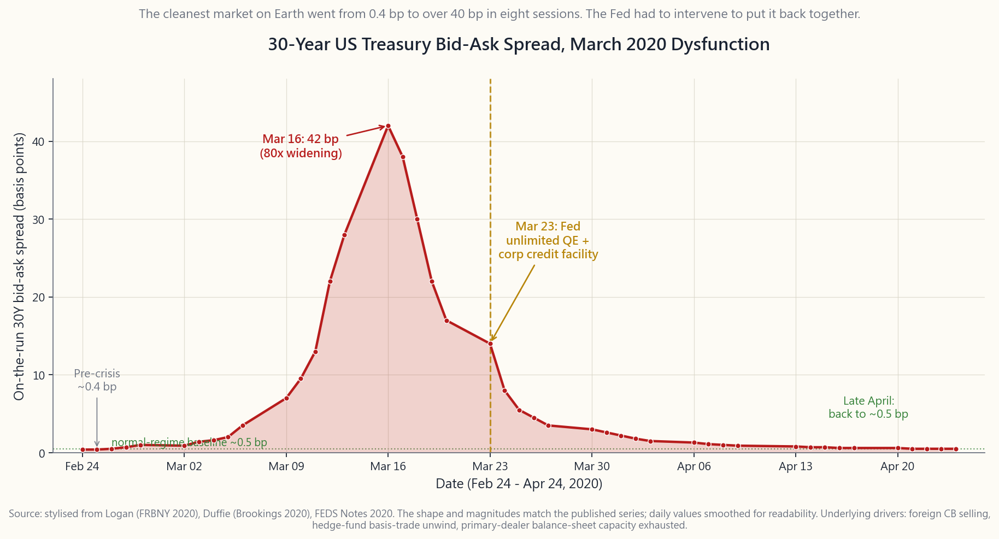

# Side Lesson 26: Market Liquidity — Depth, Spread, and What Really Happens in a Crisis

---

## Part 1: Reading Section

---

### 1. Why This Is Important

Liquidity is the single most under-appreciated risk in retail portfolios.
Returns get all the headlines; liquidity gets all the obituaries. Every
major blow-up in the last forty years — 1987, 1998, 2008, 2010, 2020,
2022 — had a liquidity component bolted onto whatever fundamental
trigger started it. Vol-tail-wags-dog is really a liquidity
statement: when volatility doubles, the cost of getting out of a
position quintuples, and it is that *second* leg that does the damage.

There are four reasons a retail investor needs a working model of
liquidity.

1. **Implicit cost compounds.** A 2 bp average round-trip on AAPL is
   noise. A 50 bp round-trip on a $300M small-cap, paid four times a
   year through rebalancing, eats 200 bps off your return — bigger
   than most factor premia (week50). You cannot decide what to own
   until you can price the cost of getting in and out.
2. **Crises are liquidity events first, fundamental events second.**
   In March 2020 the *cleanest, deepest market on Earth* — the 30-year
   on-the-run US Treasury — went from a half-basis-point bid-ask to
   *forty* basis points in eight trading days, and the Fed had to
   intervene to put it back together. If that can happen to the
   benchmark risk-free asset, your small-cap value sleeve is not
   special.
3. **Asset-allocation matches liability liquidity, or it punishes
   you.** A 401(k) that you cannot draw for thirty years can hold
   illiquid private credit or non-traded REITs (side14). A taxable
   account that funds tuition in two years cannot. The four-tranche
   framework is, at heart, a liquidity tiering exercise.
4. **The Fed's playbook is a liquidity script.** PDCF, MMLF, BCFP,
   BTFP — every emergency facility named in the last two cycles is a
   targeted plug into a specific drained pool. Knowing which facility
   addresses which pool tells you who is solvent and who is not when
   the next round comes.

This side lesson installs the vocabulary, the proxies, the historical
case studies, and a working calculator so that "is this thing liquid?"
becomes a question you can answer with numbers, not adjectives.

---

### 2. What You Need to Know

#### 2.1 The Three Dimensions of Liquidity — Tightness, Depth, Resilience

Academics divide liquidity into three dimensions that are usually
correlated but can decouple violently in stress.

**Tightness** is the bid-ask spread — the round-trip cost of trading a
single share at the touch. On AAPL during a normal session you will see
$0.01 on a $200 stock — half a basis point. On a $5 micro-cap you might
see $0.05 — 100 basis points. Tightness is what you see; it is the most
visible dimension and the only one most retail traders track.

**Depth** is the size resting at the touch. AAPL might show 50,000
shares offered at the inside. A small-cap might show 200. Depth tells
you how big you can trade before you start *walking the book* — eating
through successively worse-priced limit orders. The Almgren-Chriss
square-root impact model (week44) says cost in bps grows like the
square root of trade-size-as-percent-of-ADV: a 1%-of-ADV order is about
10 bps of impact in normal vol, a 10% order is about 32 bps, a 100%
order is about 100 bps.

**Resilience** is how fast the book replenishes after you trade. A
deep, resilient market lets a market-maker walk back to within 1 bp of
the prior mid in seconds. A fragile market — one where the displayed
depth is *spoofed* by HFTs that vanish when stress hits — gaps and
stays gapped. The classic resilience failure was the May 6, 2010 flash
crash, when bona-fide market-makers withdrew quotes and SP500 e-minis
fell 9% in five minutes against a thin book that took twenty minutes
to rebuild.

#### 2.2 Liquidity Proxies — What to Measure When You Can't See the Book

You will rarely have direct access to the limit order book outside of
exchange-paid data feeds. Four proxies that approximate the three
dimensions, all available in any retail data package:

1. **Quoted spread.** Bid-ask divided by mid, in bps. Direct measure
   of tightness. Apr 2026 typical print: SPY 0.5 bps, AAPL 1 bp,
   median S&P 500 name 4 bps, median Russell 2000 name 25 bps,
   median micro-cap 150 bps.
2. **Average daily volume (ADV).** Dollar volume per session. Direct
   measure of capacity. Apr 2026: SPY $30B/day, AAPL $14B, median
   S&P 500 name $400M, median Russell 2000 name $25M, median micro-cap
   under $500k.
3. **Amihud illiquidity ratio** = mean of |daily return| / dollar
   volume. Higher = more price reaction per dollar traded =
   illiquid. Empirically the cleanest single-number cross-sectional
   liquidity score.
4. **Turnover** = ADV / market cap, annualised. Mega-caps run
   100-200% turnover; micro-caps often under 20%. Low turnover
   means a name is *available* but not *flowing* — a thin holder
   base that does not absorb a forced seller without price impact.

For ETFs there is a fifth proxy worth a paragraph on its own: the
**creation/redemption arbitrage** keeps the ETF's premium-to-NAV tight
because authorised participants (APs) profit from any meaningful gap
(side03). For SPY, premium rarely strays more than 2 bps from NAV
during a normal session. But the AP arbitrage is a *capacity-limited*
mechanic — when underlying basket liquidity dries up, AP balance sheets
can't absorb creation flow, and the ETF can detach from NAV by 100+ bps
(March 2020 LQD: NAV-discount of 5%).

#### 2.3 The Stylised Liquidity Curve — Why Small-Caps Cost 50x More

Across the US-listed universe, bid-ask spreads scale roughly with the
inverse square root of market cap, with a sharp non-linear blow-out
below $1B.

| Bucket | Cap range | Typical spread | Typical ADV | Round-trip cost |
|---|---|---|---|---|
| Mega | > $500B | 1 bp | $5-30B | <5 bps |
| Large | $10B - $500B | 2-5 bps | $200M-$5B | 5-10 bps |
| Mid | $2B - $10B | 5-15 bps | $30-200M | 15-40 bps |
| Small | $300M - $2B | 25-60 bps | $3-30M | 50-150 bps |
| Micro | < $300M | 100-300 bps | < $3M | 200-600 bps |

Round-trip cost includes spread plus square-root impact for a 1% ADV
order. A retail investor who buys AAPL pays ~5 bps to get in and out.
A retail investor who tries to build a $50,000 position in a $200M
micro-cap pays 400-600 bps in *one direction* — and may not be able to
exit at all in stress.

#### 2.4 ETFs vs Underlying Basket Liquidity — The AP Backstop

The standard argument for owning fixed-income via ETF (LQD, HYG, MUB,
TLT) rather than the underlying bonds is that the *ETF wrapper* trades
1000x more liquidly than the basket. LQD averages $2-3B/day in
on-screen volume; the median bond inside it changes hands on TRACE
maybe twice a week. The wrapper *is* the liquidity.

This works in normal regimes because APs arbitrage any wrapper-vs-NAV
gap. It can break in stress. March 2020 LQD: ETF traded at NAV-minus-
4.6% on March 12; HYG hit NAV-minus-7.0%. The Fed's announcement of
SMCCF/PMCCF (corporate-credit facilities) on March 23 closed those
discounts inside 48 hours and they have not reopened. The lesson is
not "don't own bond ETFs" — they are the only practical way for a
retail investor to hold credit. The lesson is that *during a once-a-
decade liquidity event the wrapper can detach by 5%, and you should
not need to sell it that day.*

#### 2.5 Liquidity Vanishes When Needed — The Three Canonical Crises

Three case studies, each illustrating how liquidity disappears in
exactly the regime when an investor most wants to use it. They are the
empirical foundation for the vol-tail-wags-dog observation.

**March 2020: Treasury market dysfunction.** The on-the-run 30-year US
Treasury — the deepest, most liquid asset on the planet — saw bid-ask
spreads explode from sub-1 bp to over 40 bps between March 9 and March
17, 2020. Off-the-run spreads were worse. Cause: foreign central banks
selling Treasuries to fund USD redemptions; hedge funds unwinding
relative-value Treasury basis trades amid margin calls; primary dealer
balance sheets full from Treasury issuance and unable to absorb more.
The Fed responded with $1.5T in repo operations on March 12, then
unlimited QE on March 23, restoring spreads to near-normal by April.

**May 2010: Flash crash.** On May 6 at 14:42 ET, a single $4.1B
e-mini S&P sell algorithm executed without price/time discretion.
Liquidity providers withdrew. The S&P fell 9% in five minutes.
Hundreds of stocks printed at "stub quotes" of $0.01. Recovery took
20 minutes. Cause: a thin order book at lunch, fragmented routing
across 13 exchanges, and HFTs whose quotes were not obligated to
provide depth. SEC response: limit-up/limit-down (LULD) bands,
single-stock circuit breakers, and the IEX 350μs speed bump
(week44).

**August 2007: The quant unwind.** Long-short equity-market-neutral
funds running similar value/momentum factor portfolios suffered
simultaneous losses August 6-9, 2007. The mechanism: one or two
levered shops were forced to reduce exposure (subprime margin calls
elsewhere); their selling moved factor returns; everyone running the
same factors saw losses; the strongest funds also had to delever; the
selling fed itself for three days. Renaissance lost ~6% in 48 hours.
Goldman's Global Equity Opportunities lost 30% over a week. By the
end of the second week, factors fully recovered. The lesson: in
crowded *low-vol* strategies, liquidity withdrawal manifests as a
correlation spike — every "uncorrelated" trade becomes the same
trade for as long as the unwind takes.

#### 2.6 Fed Liquidity Toolkit — The Modern Backstop

Since 2008 the Fed has assembled a menu of liquidity facilities, each
sized to a specific failure mode. They map directly onto the case
studies above.

- **Discount window** (always-on): banks borrow against collateral.
  Stigmatised, low usage.
- **PDCF — Primary Dealer Credit Facility** (2008, 2020, 2023): repo
  for non-bank primary dealers. Plugs broker-dealer balance sheets.
- **MMLF — Money Market Mutual Fund Liquidity Facility** (2008,
  2020): backstop for MMF redemption runs.
- **CPFF — Commercial Paper Funding Facility** (2008, 2020):
  buys CP from corporate issuers when private buyers vanish.
- **BCFP / SMCCF / PMCCF — Corporate Credit Facilities** (2020): Fed
  buys IG corporate bonds and ETFs. Closed the LQD/HYG NAV
  discount in 48 hours.
- **BTFP — Bank Term Funding Program** (2023): one-year loans against
  Treasuries at par (not market value), specifically designed to
  prevent forced sales of underwater long bonds during the SVB run.

The market lesson from 2008/2020/2023: the Fed will eventually
restore liquidity to systemic markets, but the announcement effect
matters more than the dollar size. Investors who waited for the
*announcement* (March 23 in 2020) caught most of the recovery;
investors who tried to time the *bottom* before the policy response
mostly missed it. The market can stay irrational longer than you can stay solvent — but the Fed
*can* keep you solvent if you survive long enough for the facility to
arrive.

---

### 3. Common Misconceptions

1. **"If a stock has a quote, it's liquid."** A quote is a one-share
   indicative price. Depth at the touch can be $200 even when the
   spread is $0.01.
2. **"Bid-ask is the only cost."** Spread is half the cost of trading;
   market impact is the other half. For 1%-of-ADV orders they are
   roughly equal. For larger orders, impact dominates.
3. **"ETFs are always more liquid than their underlying."** True in
   normal regimes via the AP arbitrage. False in stress when AP
   balance sheets are full — see LQD March 2020.
4. **"Trading volume = liquidity."** Volume is *demonstrated*
   activity. It does not tell you what the next million shares costs.
   A name can have $50M average volume and still cost 200 bps to move
   $5M in five minutes.
5. **"Treasuries are always liquid."** They are *almost* always the
   most liquid market on Earth. They were not in March 2020. The Fed
   had to intervene to make it true again.
6. **"The flash crash was an HFT problem."** The proximate cause was
   a single sell algorithm without price discretion. HFTs *amplified*
   the move by withdrawing liquidity, but they did not cause it. The
   policy fix (LULD, circuit breakers) targeted the amplification.
7. **"Big-name index funds can absorb anything."** SPY can. A $400M
   thematic ARK product cannot. Fund AUM and underlying basket
   liquidity must be separately checked.
8. **"Liquidity premia are arbitrage-free returns."** No. They are
   compensation for *being illiquid in stress*. The premium is real
   but you are paid to *not be able to sell when everyone else is*.

---

### 4. Q&A Section

**Q1: How do I check the bid-ask spread on a stock I'm considering?**
A: Any retail platform shows top-of-book. Look at the displayed bid
and ask, take the spread, divide by the midpoint, multiply by 10000
to get bps. Do this *during regular hours* — pre-market and after-
hours spreads can be 5-10x wider. For meaningful comparison use the
3 PM ET print, when both market-makers and institutional order flow
are most active.

**Q2: What's the smallest market cap I should consider holding?**
A: For taxable accounts with rebalancing pressure, $2B is a reasonable
floor — that's the small-cap line. Below $300M (micro-cap) the
combined spread + impact + occasional gap risk usually exceeds the
expected alpha. The Russell 2000 itself is ~$3B median; most retail
factor ETFs (AVUV, VBR) screen out the bottom 10-20% of micro-caps
explicitly.

**Q3: Is bond ETF liquidity real or fake?**
A: Both. The wrapper liquidity is real and tradeable in any normal
market. But it is *backstopped* by AP arbitrage on the underlying
basket, and the basket itself trades by appointment. In March 2020
LQD detached from NAV by 4.6% and HYG by 7%. Owning bond ETFs is
fine — sizing them as if they have stock-grade liquidity in a crisis
is not.

**Q4: Why does the bid-ask spread widen in volatile markets?**
A: Market makers price spread as compensation for adverse-selection
risk plus inventory risk. Both rise with volatility. Empirically
spreads are roughly proportional to realised volatility — VIX 30
implies spreads 2-3x the calm-market level; VIX 60 implies 5-10x.
Crisis = spread 10x. This is *deterministic*, not surprising.

**Q5: What is the "liquidity premium" I see in academic papers?**
A: The empirical compensation for holding illiquid assets, ~1-3%/yr
across studies. It is real but it is not free money. You earn it by
*being unable to sell* during the worst quarters — exactly when most
investors most want to. Lock-up funds (PE, VC) capture it
mechanically. Daily-priced retail products (small-cap value ETFs)
capture maybe a third of it because the daily liquidity erodes the
illiquidity advantage.

**Q6: Can I use the Amihud ratio at home?**
A: Yes. Take 60 days of (|daily return|, daily dollar volume). Compute
mean of |return|/$volume. Multiply by 10^6 to get a usable scale.
Lower = more liquid. SPY scores ~0.001; a typical small-cap scores
1-10; a micro-cap can score 100+. It is a one-number proxy that
ranks names well across a peer group.

**Q7: How do I size a position in an illiquid name?**
A: Work backwards from the cost of exit. Pick a stress regime — say,
3x normal spread + 30% of ADV in one day (forced sell by Friday).
Compute the round-trip cost. If it exceeds your one-year expected
return, the name is too illiquid for the position size. If you cannot
exit in five days at 2x normal spread, halve the size.

**Q8: What was the market lesson from August 2007?**
A: Crowded trades are the same trade. Five "uncorrelated" hedge funds
running similar value/momentum/quality factors all sold the same
positions at the same time. Diversification across managers does not
help when the managers diversify across the same factors. Quant
shops now run capacity dashboards explicitly tracking how much of a
factor's ADV they own.

**Q9: Should I trust the displayed depth at the touch?**
A: Partly. About 60-70% of displayed shares actually fill at the
quoted price; the rest is *fading liquidity* — quotes that vanish
faster than your order can hit them. In stress that ratio can fall
below 30%. Treat displayed depth as an upper bound, not a
contract.

**Q10: When the Fed announces a new facility, should I buy?**
A: Empirically, yes — but only the systemic targets. After March 23,
2020 (announcement of unlimited QE + corporate credit facility), LQD
returned 14% by year-end and SP500 returned 67% from the low. The
trade was: announcement = bottom on the *liquidity-stressed* assets.
But the Fed only backstops things it considers systemic. SVB (2023)
backstopped Treasury collateral but left equity holders to zero.
Read the press release.

---

## Part 2: YouTube Script

---

**VIDEO TITLE:** Market Liquidity — How Spreads, Depth, and Crises Actually Work
**RUNTIME TARGET:** ~12 minutes
**HOSTS:** Horace, Stella

---

**[INTRO — 0:00]**

**HORACE:** Welcome back. Today is a side lesson on liquidity, and
it's the lesson that nine out of ten retail investors skip until it
costs them. I'm not going to start with a definition. I'm going to
start with a fact.

**STELLA:** On March 12, 2020, the bid-ask spread on the 30-year
US Treasury — the cleanest, deepest, most liquid security on
Earth — went from under half a basis point to over forty basis
points. That's an eighty-fold blow-out in eight trading days.

**HORACE:** And the Federal Reserve had to put $1.5 trillion of repo
into the market that same week to put it back together. If that can
happen to the 30-year on-the-run, it can happen to whatever you own.
Today we're going to install the vocabulary, the math, and the
historical case studies so you can price liquidity *before* you need
it.

**[VISUAL: image/side26_liquidity_by_size.png]**

---

**[§1 — THREE DIMENSIONS — 1:30]**

**STELLA:** Liquidity has three dimensions. Tightness, depth,
resilience. Tightness is the bid-ask spread. Depth is how much
size is resting at that spread. Resilience is how fast the book
rebuilds after you trade.

**HORACE:** Most retail investors only see tightness — the spread
on their trade ticket. That's like judging a car by its colour. The
deeper questions are: *if I had to sell five times my displayed
size, what price do I get?* — that's depth — and *how long until the
quote comes back?* — that's resilience.

**STELLA:** A normal day, the three move together. A crisis, they
decouple. The spread might still print 2 bps but the depth at that
spread is one share. The first real seller takes the price 10%
lower.

---

**[§2 — THE SIZE-LIQUIDITY CURVE — 3:30]**

**HORACE:** Bid-ask spreads scale with the inverse square root of
market cap. AAPL — a $4 trillion stock — costs you a single basis
point round-trip. A $500 million small-cap costs 50 to 100 basis
points. A $200 million micro-cap can cost 300 basis points just on
the spread, before any market impact.

**STELLA:** That's a 100x to 300x liquidity tax. If two stocks have
the same expected return, the small one needs to outperform the
large one by 200 bps a year just to pay the rebalancing cost.

**[VISUAL: image/side26_liquidity_by_size.png]**

**HORACE:** Look at the chart. Mega-caps cluster at 1 bp.
Large-caps at 3 to 5. The cliff starts at the small-cap line —
$2 billion. Below that the spread is no longer a line; it's a
distribution with a long right tail and a non-trivial mass above
100 bps.

---

**[§3 — ETFs AND THE AP BACKSTOP — 5:00]**

**STELLA:** ETFs are the great liquidity hack. The wrapper trades
1000x more liquidly than the underlying bonds inside it. LQD —
the IG corporate bond ETF — trades two to three billion dollars a
day on screen. The median bond it owns trades on TRACE maybe twice
a week.

**HORACE:** That works because authorised participants — usually
big bank prop desks — arbitrage any gap between the ETF price and
the basket NAV. Buy the cheap leg, sell the rich leg, deliver the
basket for redemption. The arbitrage keeps premium and discount
inside a few basis points.

**STELLA:** Until it doesn't. March 2020. LQD detached from NAV
by 4.6%. HYG by 7%. The AP balance sheets were full — every prop
desk was already long credit, every hedge fund was deleveraging,
nobody had room to take on more inventory.

**HORACE:** The Fed's announcement on March 23 of corporate credit
facilities — SMCCF and PMCCF — closed those discounts in 48 hours.
The Fed barely had to *spend* anything. The announcement was the
backstop. Owning bond ETFs is fine, but don't size them as if they
have stock-grade liquidity in a crisis.

---

**[§4 — THE THREE CANONICAL CRISES — 6:30]**

**STELLA:** Three case studies. Each shows liquidity disappearing
in exactly the regime when investors most needed it.

**HORACE:** August 2007 — the quant unwind. Five long-short equity
hedge funds running similar value and momentum factors all started
selling at the same time. Renaissance lost 6% in 48 hours. Goldman
Global Equity Opportunities lost 30% over a week.

**STELLA:** Nobody's "fundamentals" had changed. The market hadn't
moved much. It was pure liquidity withdrawal in a crowded trade.
The lesson: when you pick factors, you're sharing the trade with
every other quant who picked the same factors.

**HORACE:** May 2010 — the flash crash. A single $4 billion sell
algorithm hit the e-mini S&P at 2:42 PM Eastern. No price
discretion. Liquidity providers — including bona-fide
market-makers — withdrew. The S&P fell 9% in five minutes.

**[VISUAL: image/side26_2020_treasury.png]**

**STELLA:** And March 2020 — the chart on screen. The 30-year
Treasury, the bedrock of the global risk-free curve, with a
40-basis-point bid-ask. Foreign central banks dumping bonds,
hedge funds unwinding basis trades, primary dealer balance sheets
full. The Fed had to put unlimited QE on the table on March 23.

**HORACE:** Three different triggers. Same mechanism. Liquidity
withdraws in a regime that already has too many sellers.
*Vol-tail-wags-dog* is a liquidity statement.
When vol doubles, exit cost quintuples, and it's that second leg
that does the damage.

---

**[§5 — THE FED LIQUIDITY MENU — 9:30]**

**STELLA:** The Fed has built a liquidity toolkit since 2008.
PDCF for primary dealers. MMLF for money market funds. CPFF for
commercial paper. SMCCF and PMCCF for corporate credit. BTFP for
banks holding underwater Treasuries.

**HORACE:** Each facility maps to a specific drained pool. When a
new one is announced, it tells you which pool the Fed is willing
to backstop and which it isn't. In 2023 the BTFP backstopped the
Treasury collateral that was crushing SVB — but the Fed left SVB
equity holders to go to zero. Read the press release.

**STELLA:** And empirically the announcement *is* the bottom on the
liquidity-stressed asset. From March 23, 2020 to year-end LQD
returned 14% and the S&P returned 67% from the March low.

---

**[§6 — INTERACTIVE WALKTHROUGH — 10:30]**

**HORACE:** The interactive lab on the website lets you set three
dials — your order size, your market-cap bucket, and the
volatility regime — and it returns three numbers: effective spread,
market impact, and liquidity-adjusted return.

**STELLA:** Try a $50,000 order in a small-cap during a crisis vol
regime. The lab will show you a 250-basis-point round-trip cost,
which is 2.5% of the trade gone before any view of the underlying.
That's the cost of being wrong about liquidity.

**HORACE:** Now try the same order in SPY at calm vol. Five basis
points. That's the liquidity premium — in reverse. You don't pay it
when you don't need it; you pay it ten-fold when you do.

---

**[OUTRO — 11:30]**

**STELLA:** Three takeaways. One — liquidity is three things, not
one. Spread, depth, resilience. Two — it scales with size:
mega-caps are 100x cheaper to trade than micro-caps and that
matters for any rebalancing strategy. Three — it disappears in
crises, including in markets you would bet your life are immune.

**HORACE:** The four-tranche framework exists for
exactly this reason. You match liability liquidity to asset
liquidity. The cash you need next month sits in T-bills. The
cash you need in twenty years can sit in private credit. Get
that match wrong and the most expensive number on your statement
is the one you didn't see — the spread you paid to exit at the
wrong time.

**STELLA:** Next side lesson, we look at currency hedging. See
you there.
