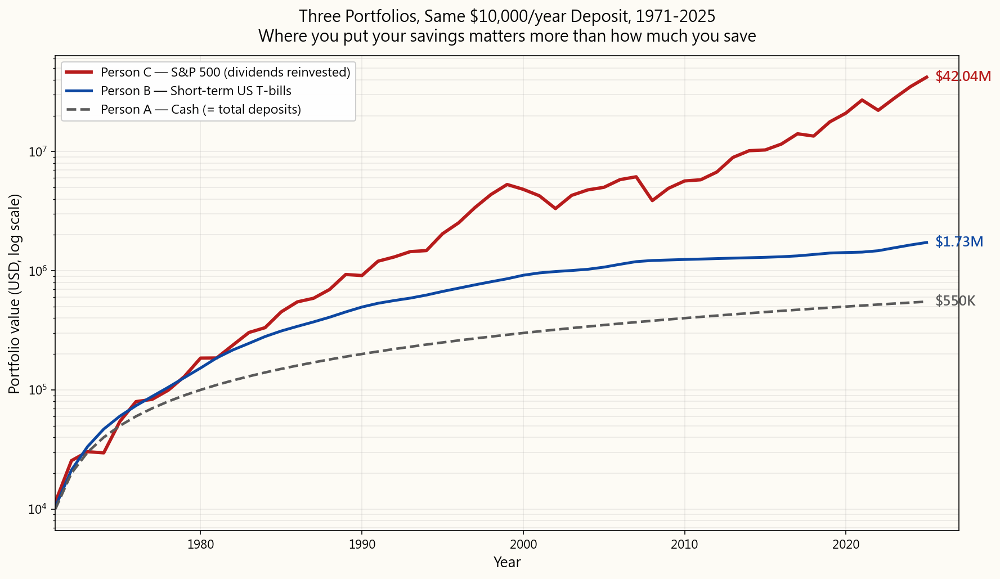
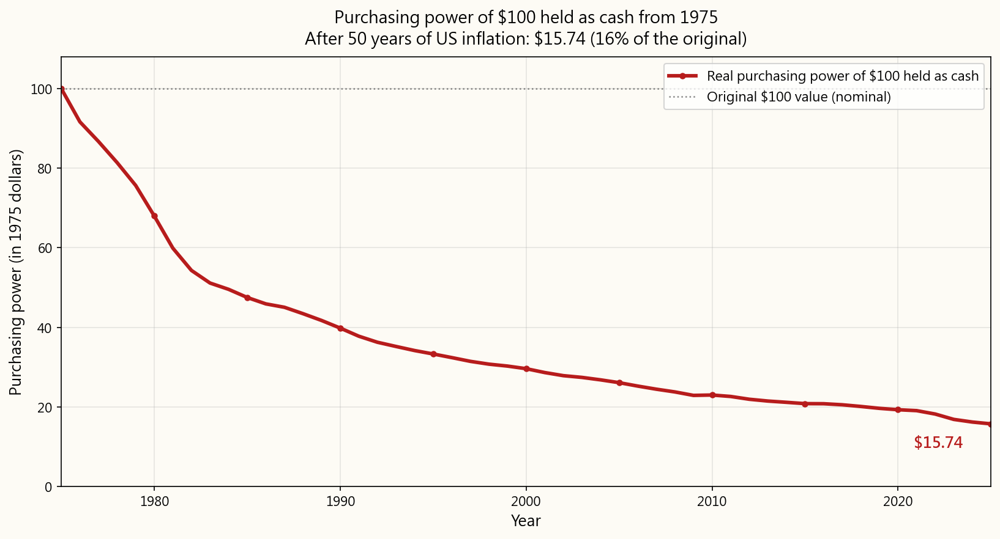
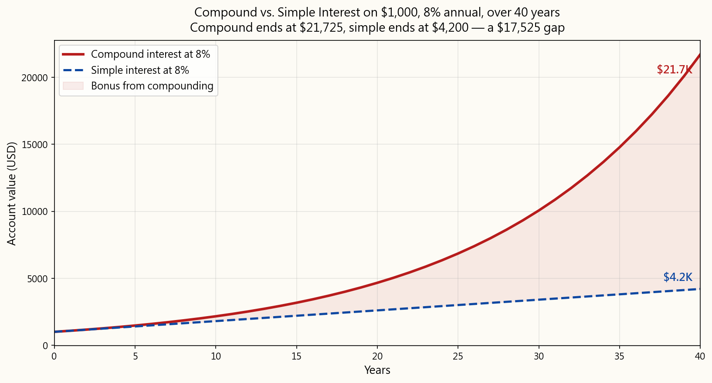
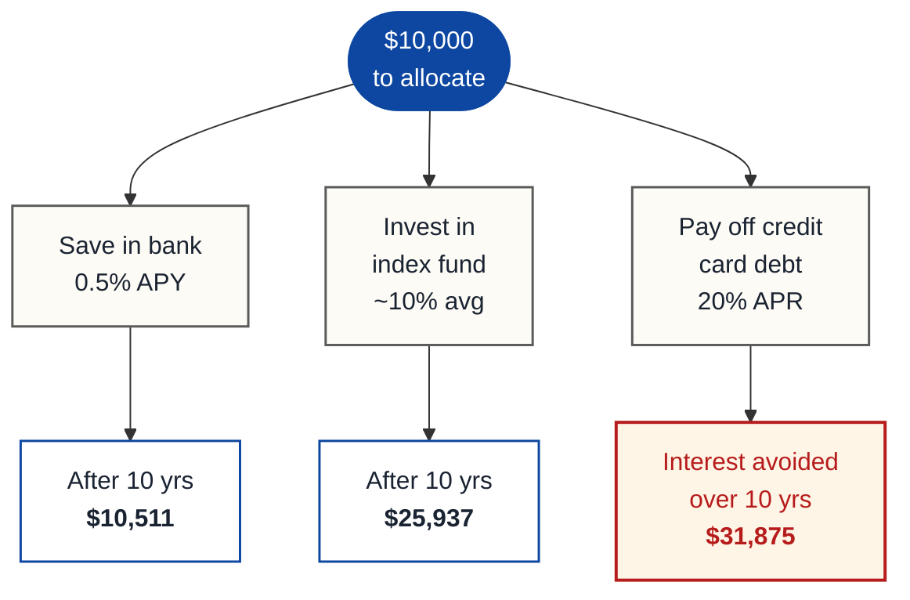

# Week 1: Why Invest? The Time Value of Money

---

## Part 1: Reading Section

---

### 1. Why This Is Important

Money sitting idle is money losing value. Every single day, inflation chips away at
the purchasing power of cash stuffed under a mattress or parked in a zero-interest
checking account. Understanding *why* you need to invest is not just a financial
skill -- it is a survival skill in a modern economy.

Consider this: in 1990, a cup of coffee cost about $0.75. By 2025, that same cup
costs $5.00 or more. The coffee did not become six times better. Your dollar became
six times weaker. That is inflation at work, and it never stops.

The time value of money (TVM) is the foundational principle of all finance. It states
that a dollar today is worth more than a dollar tomorrow. This is true for three
reasons:

1. **Inflation** -- prices rise over time, so future dollars buy less.
2. **Opportunity cost** -- money available now can be invested to earn returns.
3. **Risk** -- a promised future payment may never arrive.

If you understand TVM, you understand why investing is not optional. It is the only
way to ensure your wealth grows faster than the economy erodes it.

Take the last 55 years and run a thought experiment with three savers. Starting in
1971, each one deposits exactly $10,000 a year — the same nominal amount, every
year, no exception. The only thing that differs is *where* they put it.

- **Person A** keeps it in cash. No bank, no interest. Pure currency, sitting in a
  drawer.
- **Person B** parks it in short-term US Treasury bills, the safest interest-bearing
  vehicle there is.
- **Person C** puts it in the S&P 500 with all dividends reinvested.

Same discipline, same dollars, three completely different outcomes:

After 55 years, each person has deposited the same **$550,000** of their own money.
But the end balances are not in the same league:

| Vehicle | Annualized return (CAGR) | End value (nominal) | End value in 1971 dollars |
|---|---|---|---|
| **Person C — S&P 500** | **11.24% / yr** | **$42,041,000** | **$5,079,000** |
| **Person B — T-bills** | 4.38% / yr | $1,725,000 | $208,000 |
| **Person A — Cash** | 0.00% / yr | $550,000 | $66,000 |

The "annualized return" column is the **compound annual growth rate (CAGR)** — the
single constant rate that, compounded over the same 55 years, would produce the
same growth factor as the actual year-by-year path of the underlying asset. It is
the right number to quote, because the simple arithmetic average of annual returns
overstates real compound performance. For reference, US CPI averaged **3.92% per
year** over the same window — so anything below that line is a real-purchasing-power
loss before you even talk about taxes.

Person C ends with **24×** the nominal wealth of Person B and **76×** the nominal
wealth of Person A, despite contributing the identical $10,000 a year. And look
closer at Person A: the $550,000 cash pile, after 55 years of accumulated US
inflation, has the *real* purchasing power of only about **$66,000 in 1971 dollars**.
Person A did not just fail to grow their wealth — inflation actively shrank it while
they were dutifully saving.

The difference is entirely due to the time value of money and compound growth,
applied across decades. Compounding rewards capital that earns a return; it
punishes capital that sits.

This week's lesson gives you the conceptual foundation for everything that follows
in this course. Master these ideas, and every future topic will make more sense.

---

### 2. What You Need to Know

#### 2.1 Inflation: The Silent Wealth Destroyer

Inflation is the general increase in prices over time. Central banks (like the
Federal Reserve in the US) target about 2% annual inflation, but actual inflation
can vary widely.

Don't trust the textbook example with a smooth assumed rate — let's use real
US CPI data. Imagine you stuffed a crisp $100 bill under the mattress on
January 1, 1970, and never touched it. Here is what its purchasing power has
been at the start of every five years since:

| Year | Years elapsed | Purchasing power | % of original |
|------|--------------:|-----------------:|--------------:|
| 1970 | 0 | $100.00 | 100.0% |
| 1975 | 5 | $74.49 | 74.5% |
| 1980 | 10 | $50.65 | 50.6% |
| 1985 | 15 | $35.39 | 35.4% |
| 1990 | 20 | $29.66 | 29.7% |
| 1995 | 25 | $24.81 | 24.8% |
| 2000 | 30 | $22.06 | 22.1% |
| 2005 | 35 | $19.44 | 19.4% |
| 2010 | 40 | $17.13 | 17.1% |
| 2015 | 45 | $15.51 | 15.5% |
| 2020 | 50 | $14.37 | 14.4% |
| 2025 | 55 | $11.73 | 11.7% |

That $100 from 1970 has the purchasing power of just **$11.73 today** —
inflation has eaten **88.3% of its real value in a single working lifetime**.
The 1970s stagflation alone cut its value almost in half by 1980 (down to
$50.65), and even the relatively benign 25 years that followed (1980 to
2005) shaved off another two-thirds. Even within your own lifetime, the
last 25 years tell the same story — **$100 from January 2000 is worth only
$53.16 today, a 46.8% loss of purchasing power in just one generation**.
And the post-2020 acceleration alone shaved roughly **18% off the dollar in
five years**.

This is the "real" value of money — what it can actually buy, as opposed to
the "nominal" value (the number printed on the bill). Cash is not safe.
Cash that earns nothing is a steady, almost imperceptible loss. The
slowness of the loss is exactly what makes it so dangerous: people who
"protect" their money by leaving it in a checking account are making one
of the most aggressive bets on the chart above — and losing it.

**How inflation is measured:**

- **CPI (Consumer Price Index)** — tracks the cost of a "basket" of goods
  and services that a typical household purchases (food, housing,
  transportation, etc.).
- **PCE (Personal Consumption Expenditures)** — the Federal Reserve's
  preferred measure; broader than CPI.
- **Core inflation** — excludes volatile food and energy prices to show
  underlying trends.

**Historical US inflation rates (decade averages):**

| Period | Avg annual CPI |
|---|---:|
| 1930–1940 | −2.0% |
| 1940–1950 | +5.6% |
| 1950–1970 | +2.3% |
| 1970–1980 | +7.8% |
| 1980–2000 | +3.8% |
| 2000–2020 | +2.1% |
| 2020–2025 | +4.8% |

Notice how inflation spiked in the 1970s (oil crises) and again in the early
2020s (pandemic supply shocks). These spikes can devastate purchasing power
rapidly.

#### 2.2 Compound Interest: The Eighth Wonder of the World

Compound interest means you earn interest on your interest. It is the single most
powerful force in personal finance.

**The compound interest formula:**

\[ FV = PV \cdot (1 + r)^n \]

Where:

- \(FV\) = Future Value (what your money grows to)
- \(PV\) = Present Value (what you start with)
- \(r\) = interest rate per period (as a decimal)
- \(n\) = number of periods

**Example: $1,000 at 8% annual return**

| Year | Starting balance | Interest earned | Ending balance |
|---:|---:|---:|---:|
| 1 | $1,000.00 | $80.00 | $1,080.00 |
| 2 | $1,080.00 | $86.40 | $1,166.40 |
| 3 | $1,166.40 | $93.31 | $1,259.71 |
| 5 | $1,360.49 | $108.84 | $1,469.33 |
| 10 | $1,999.00 | $159.92 | $2,158.92 |
| 20 | $4,315.70 | $345.26 | $4,660.96 |
| 30 | $9,317.27 | $745.38 | $10,062.66 |
| 40 | $20,106.85 | $1,608.55 | $21,715.40 |

Notice how the interest earned in year 40 ($1,608) is more than the original
investment ($1,000). That is compounding at work.

**Visualizing compound vs. simple interest:**

With simple interest, you earn 8% of the original $1,000 every year ($80/year).
With compound interest, you earn 8% of the *current* balance, which grows each year.
Over long periods, the gap becomes enormous — the example above ends with
**$21,725 (compound) vs. $4,200 (simple)**, a five-fold difference earned
entirely by leaving the prior interest in the account instead of taking it out.

**The compounding frequency matters too.**
Same $10,000 at the same 12% annual rate for 10 years, only the compounding
frequency varies:

| Compounding | Final value |
|---|---:|
| Annually | $31,058.48 |
| Semi-annually | $32,071.35 |
| Quarterly | $32,620.38 |
| Monthly | $33,003.87 |
| Daily | $33,194.62 |
| Continuously | $33,201.17 |

More frequent compounding produces higher returns, but the marginal benefit
shrinks fast. The jump from annual to monthly is significant; the jump from
daily to continuous is essentially zero.

#### 2.3 The Rule of 72

The Rule of 72 is a mental shortcut for estimating how long it takes to double
your money at a given annual rate:

$$ \text{Years to double} \approx \frac{72}{r} \quad \text{(where } r \text{ is the annual rate in percent)} $$

| Annual return | Years to double |
|---:|---|
| 2% | \(72 / 2 = 36\) years |
| 4% | \(72 / 4 = 18\) years |
| 6% | \(72 / 6 = 12\) years |
| 8% | \(72 / 8 = 9\) years |
| 10% | \(72 / 10 = 7.2\) years |
| 12% | \(72 / 12 = 6\) years |

**Why does this work?** It is a mathematical approximation derived from the
natural logarithm. The exact formula is

$$ t = \frac{\ln 2}{\ln(1 + r)} $$

but 72 is close enough for mental math and has the practical advantage of being
divisible by 2, 3, 4, 6, 8, 9, and 12 — most of the rates you actually care about.

**The Rule of 72 in reverse — inflation halves your purchasing power on the same
clock.** Replace "annual return" with "annual inflation rate" and "years to
double" becomes "years until your dollar buys half as much":

| Inflation rate | Years until purchasing power halves |
|---:|---|
| 3% | \(72 / 3 = 24\) years |
| 4% | \(72 / 4 = 18\) years |
| 6% | \(72 / 6 = 12\) years |
| 9% | \(72 / 9 \approx 8\) years |

This makes inflation tangible. If inflation averages 4%, every 18 years your money
buys only half as much. This is why "safe" savings accounts that earn 1-2% are
actually losing you money in real terms.

#### 2.4 Opportunity Cost

Opportunity cost is the value of the next best alternative you give up when making
a decision. In investing, it means every dollar has competing uses, and choosing
one means forgoing another.

**Decision tree — what to do with $10,000:**

In this example, paying off high-interest credit card debt has the highest
"return" because you are eliminating a 20% annual cost. This is why financial
advisors often recommend paying off high-interest debt before investing.

**Key insight:** Opportunity cost applies to time as well as money. Every year you
delay investing has a measurable cost, because you lose that year of compounding
forever.

**The cost of waiting — $5,000/year at a 10% average return, ending at age 65:**

| Start age | Years invested | Total contributed | Final value at 65 |
|---:|---:|---:|---:|
| 20 | 45 | $225,000 | $3,616,635 |
| 25 | 40 | $200,000 | $2,212,963 |
| 30 | 35 | $175,000 | $1,355,122 |
| 35 | 30 | $150,000 | $822,470 |
| 40 | 25 | $125,000 | $491,735 |
| 45 | 20 | $100,000 | $286,375 |

Starting at 20 instead of 30 means investing only $50,000 more, but ending up
with $2.26 million more. The early years of compounding are disproportionately
valuable.

#### 2.5 Real vs. Nominal Returns

**Nominal return** is the raw percentage gain on an investment, not adjusted for
inflation. **Real return** is the nominal return minus inflation, representing
actual purchasing power gained.

A quick approximation:

$$ r_{\text{real}} \approx r_{\text{nominal}} - i $$

The exact relationship (the **Fisher equation**) is:

$$ r_{\text{real}} = \frac{1 + r_{\text{nominal}}}{1 + i} - 1 $$

Example — 10% nominal return with 3% inflation:

$$ \begin{aligned}
r_{\text{real, approx}} &= 10\% - 3\% = 7\% \\
r_{\text{real, exact}}  &= \frac{1.10}{1.03} - 1 = 6.80\%
\end{aligned} $$

The approximation is close enough for mental math at low inflation; at high inflation
or high return, you want the exact form.

**Historical real returns by asset class (US, approximate):**

| Asset class | Nominal | Inflation | Real |
|---|---:|---:|---:|
| US Stocks (S&P 500) | ~10.0% | ~3.0% | ~7.0% |
| US Bonds (10-yr) | ~5.0% | ~3.0% | ~2.0% |
| Gold | ~7.0% | ~3.0% | ~4.0% |
| Savings Account | ~2.0% | ~3.0% | ~−1.0% |
| Cash (mattress) | 0.0% | ~3.0% | ~−3.0% |

**Critical takeaway:** A savings account earning 2% in a 3% inflation environment
is *losing* 1% of purchasing power per year. Cash under the mattress is losing 3%
per year. Only assets that earn above the inflation rate grow your real wealth.

#### 2.6 Future Value and Present Value

These are the two core TVM calculations.

**Future Value (FV):** What a sum of money today will be worth in the future.

\[ FV = PV \cdot (1 + r)^n \]

Example — what will $5,000 be worth in 20 years at 8%?

\[ \begin{aligned}
FV &= 5{,}000 \cdot (1.08)^{20} \\
   &= 5{,}000 \cdot 4.6610 \\
   &= \$23{,}305
\end{aligned} \]

**Present Value (PV):** What a future sum of money is worth today.

\[ PV = \frac{FV}{(1 + r)^n} \]

Example — what is $50,000 in 15 years worth today at 7%?

\[ \begin{aligned}
PV &= \frac{50{,}000}{(1.07)^{15}} \\
   &= \frac{50{,}000}{2.7590} \\
   &= \$18{,}126
\end{aligned} \]

**This means:** If someone offers you $50,000 in 15 years, and you could earn 7%
on your money, that offer is only worth $18,126 to you today. If they also offer
you $20,000 right now, the $20,000 today is the better deal.

**Future Value of an Annuity (regular contributions):**

\[ FV = PMT \cdot \frac{(1 + r)^n - 1}{r} \]

where \(PMT\) = regular payment amount.

Example — $500/month for 30 years at 8% annual (0.667% monthly):

\[ \begin{aligned}
FV &= 500 \cdot \frac{(1.00667)^{360} - 1}{0.00667} \\
   &= 500 \cdot 1{,}491.57 \\
   &= \$745{,}785
\end{aligned} \]

Total contributed: \(500 \times 360 = \$180{,}000\). Total growth: \(\$745{,}785 - \$180{,}000 = \$565{,}785\).

Your investment growth ($565,785) is more than triple what you actually put in
($180,000). That is the power of consistent investing combined with compounding.

**Discounting a stream of future cash flows.** Five $100 payments, one at the end
of each of the next five years, discounted at 7%:

$$ PV = \sum_{t=1}^{5} \frac{\$100}{(1.07)^t} $$

| Year | Future payment | Discount factor | Present value |
|---:|---:|---:|---:|
| 1 | $100 | \(1 / 1.07^{1} = 0.9346\) | $93.46 |
| 2 | $100 | \(1 / 1.07^{2} = 0.8734\) | $87.34 |
| 3 | $100 | \(1 / 1.07^{3} = 0.8163\) | $81.63 |
| 4 | $100 | \(1 / 1.07^{4} = 0.7629\) | $76.29 |
| 5 | $100 | \(1 / 1.07^{5} = 0.7130\) | $71.30 |
| | | **Total PV** | **$410.02** |

Each future $100 is worth less today because of the time value of money. The
further in the future a payment is, the less it is worth today — the year-5 $100
is worth only $71.30 today, while the year-1 $100 is worth $93.46.

#### 2.7 Putting It All Together: The Investing Imperative

**Three paths over 30 years** ($10,000 starting, $5,000/year added):

| Metric | Do nothing (0%) | Savings account (1.5%) | Invest in S&P (10%) |
|---|---:|---:|---:|
| Total contributed | $160,000 | $160,000 | $160,000 |
| Final nominal value | $160,000 | $192,760 | $987,174 |
| Real value (3% infl.) | $65,890 | $79,379 | $406,392 |
| Purchasing power | **Lost 59%** | **Lost 50%** | **Gained 154%** |

Only the investor actually grows their wealth in real terms. The saver barely
keeps up. The person who does nothing loses more than half their purchasing power.

---

### 3. Common Misconceptions

**Misconception 1: "Investing is gambling."**

Gambling has a negative expected return (the house always wins). Investing in
diversified assets has a historically positive expected return. The S&P 500 has
returned roughly 10% annually over the past century, including the Great Depression,
World War II, the 2008 financial crisis, and COVID-19. Short-term speculation on
individual stocks can resemble gambling, but disciplined long-term investing in
diversified funds is fundamentally different.

**Misconception 2: "I need a lot of money to start investing."**

Many brokerages now offer $0 minimums and fractional shares. You can buy $10 worth
of an S&P 500 index fund. The most important factor is not how much you start with,
but how early you start and how consistently you contribute. Even $50 per month
invested from age 22 grows to over $350,000 by age 65 at 10% average returns.

**Misconception 3: "Saving is the same as investing."**

Saving means putting money aside. Investing means putting money to work. A savings
account earning 0.5% while inflation runs at 3% means you are losing 2.5% of
purchasing power annually. Saving is important for emergency funds and short-term
goals, but for long-term wealth building, investing is essential.

**Misconception 4: "I should wait for the 'right time' to invest."**

Market timing is extraordinarily difficult. Studies consistently show that "time in
the market" beats "timing the market." A Schwab study found that even someone who
invested at the worst possible time each year (the market peak) still significantly
outperformed someone who kept their money in cash waiting for a better entry point.

**Misconception 5: "Compound interest only matters for large sums."**

The percentage works the same regardless of the amount. $100 growing at 10% for
40 years becomes $4,526. The multiplier (45x) is identical whether you start with
$100 or $100,000. The key is the growth rate and the time horizon.

**Misconception 6: "Inflation is always around 2-3%."**

While central banks target 2%, actual inflation can be much higher. The US
experienced 13.5% inflation in 1980. Argentina has seen 100%+ inflation in recent
years. Even in stable economies, inflation can spike due to supply shocks, monetary
policy changes, or geopolitical events. Your investment strategy needs to account
for variable inflation scenarios.

**Misconception 7: "A 10% gain followed by a 10% loss gets you back to even."**

This is mathematically incorrect. $100 + 10% = $110. Then $110 - 10% = $99. You
are actually down 1%. Losses hurt more than equivalent gains help, which is why
managing downside risk matters in investing. A 50% loss requires a 100% gain just
to break even.

**Loss/gain asymmetry — what it takes to get back to even after a drawdown:**

| Loss | Gain needed to recover |
|---:|---:|
| −10% | +11.1% |
| −20% | +25.0% |
| −30% | +42.9% |
| −40% | +66.7% |
| −50% | +100.0% |
| −75% | +300.0% |
| −90% | +900.0% |

Mathematically, after a loss of \(L\), the recovery gain needed is
\(G = \frac{L}{1 - L}\) — which grows much faster than \(L\) once \(L\) gets large.

**Misconception 8: "The Rule of 72 is exact."**

It is an approximation. It works best for interest rates between 6% and 10%.
At very low or very high rates, it becomes less accurate. For 2%, the actual
doubling time is 35.0 years (Rule of 72 says 36). For 20%, the actual time is
3.8 years (Rule of 72 says 3.6). Close enough for quick mental math, but do not
use it for precise financial planning.

---

### 4. Q&A

**Q1: What is the time value of money in simple terms?**

A: A dollar today is worth more than a dollar in the future because (1) inflation
reduces what that future dollar can buy, (2) you could invest today's dollar and
earn a return, and (3) there is always some risk that a promised future payment will
not materialize. This is why lenders charge interest and why investors demand returns
-- they are being compensated for giving up the use of their money now.

**Q2: How does compound interest differ from simple interest?**

A: Simple interest is calculated only on the original principal. If you invest $1,000
at 5% simple interest, you earn $50 every year, regardless of how much has
accumulated. Compound interest is calculated on the principal plus all accumulated
interest. So in year 2, you earn interest on $1,050, not just $1,000. Over long
periods, this difference becomes dramatic. After 30 years, $1,000 at 5% simple
interest becomes $2,500. At 5% compound interest, it becomes $4,322.

**Q3: Why does the Rule of 72 work?**

A: It is derived from the mathematical relationship ln(2) / ln(1 + r), where ln is
the natural logarithm and r is the interest rate. For rates near 8%, 72/r closely
approximates this formula. The number 72 was chosen because it is easily divisible
by 2, 3, 4, 6, 8, 9, and 12, making mental math convenient. Some people use the
"Rule of 70" for lower rates or the "Rule of 69.3" for continuous compounding,
but 72 is the most practical for everyday use.

**Q4: What is the difference between nominal and real returns?**

A: Nominal return is the headline number -- "the stock market returned 10% this
year." Real return adjusts for inflation to show your actual increase in purchasing
power. If the market returned 10% but inflation was 4%, your real return was
approximately 6%. Always think in real terms when evaluating long-term investment
performance, because nominal returns can be misleading in high-inflation environments.

**Q5: How do I calculate the present value of a future sum?**

A: Use the formula PV = FV / (1 + r)^n. Decide on an appropriate discount rate (r)
-- this is typically the return you could earn on alternative investments. For example,
if someone promises you $10,000 in 10 years and you could earn 7% elsewhere:
PV = $10,000 / (1.07)^10 = $10,000 / 1.9672 = $5,083. That future $10,000 is only
worth about $5,083 to you today.

**Q6: What is a good annual return to expect from investing?**

A: The US stock market (S&P 500) has historically returned about 10% per year
nominally, or about 7% after inflation. However, returns vary enormously year to
year. In any given year, the market might return +30% or -30%. The 10% average only
emerges over long time horizons (20+ years). Bond returns have historically been
about 5% nominal (2% real). A balanced portfolio might target 7-8% nominal. Never
assume any specific return is guaranteed.

**Q7: Should I pay off debt or invest?**

A: Compare the interest rate on your debt to the expected return on your investments.
If your debt charges 20% interest (credit cards), paying it off is like earning a
guaranteed 20% return -- better than any investment. If your debt is at 4% (mortgage),
and you expect 10% from investments, investing may be more profitable, though debt
payoff is a guaranteed "return" while investment returns are not. A common strategy:
pay off all debt above 6-7% interest, then invest the rest.

**Q8: Does inflation affect all goods equally?**

A: No. Different categories inflate at different rates. Over the past 20 years in the
US, healthcare and education costs have risen much faster than the overall CPI, while
technology and clothing have often gotten cheaper. The CPI is an average across a
basket of goods, so your personal inflation rate depends on what you actually spend
money on. Retirees, for instance, often face higher effective inflation because
healthcare is a larger share of their spending.

**Q9: What happens if I invest a lump sum vs. regular monthly contributions?**

A: Statistically, lump-sum investing beats dollar-cost averaging (regular
contributions) about two-thirds of the time, because markets tend to go up. However,
dollar-cost averaging reduces the risk of investing everything at a market peak, and
it is more practical for most people who earn a regular paycheck. The best strategy
is usually: invest each paycheck as you receive it. Do not hold cash waiting for a
"better time."

**Q10: Can compound interest work against me?**

A: Absolutely. Compound interest on debt is the mirror image of compound interest on
investments. A $5,000 credit card balance at 24% APR, if unpaid, grows to $14,615 in
just 5 years. This is why high-interest debt is a financial emergency. The same
mathematical force that builds wealth through investing destroys wealth through
unpaid debt.

---

## Part 2: YouTube Script

---

**VIDEO TITLE:** Why Invest? The Time Value of Money | Investment Course Week 1

**RUNTIME TARGET:** ~25 minutes

**HOSTS:**
- **Horace** (teacher): Experienced retail trader, explains concepts from years of market experience
- **Stella** (student): Recent college graduate learning to invest her savings, asks the questions viewers are thinking

---

**[INTRO SEQUENCE]**

[VISUAL: Animated logo with text "Investment Fundamentals - Week 1"]

[ANIMATION: A clock ticking while dollar bills slowly shrink in size]

**Horace:** Welcome to Week 1 of our investment fundamentals course. I am Horace, and
this is the lesson that changes how you think about money forever.

**Stella:** And I am Stella. I will be asking all the beginner questions, so do not worry
if you are brand new to this. I am right there with you.

**Horace:** Today we are answering one of the most important financial questions you
will ever face: Why should you invest at all?

**Stella:** Right, because honestly, investing feels risky. Why not just save money in
a bank account where it is safe?

**Horace:** That is exactly where we are going to start. Because the surprising truth
is that keeping your money "safe" in a bank account is one of the riskiest things
you can do with it.

**Stella:** Wait, how is that possible?

[VISUAL: Title card -- "Part 1: The Invisible Thief -- Inflation"]

---

**[SEGMENT 1: INFLATION]**

**Horace:** Let me tell you about the invisible thief that is robbing you right now.
It is called inflation.

[ANIMATION: A basket of groceries. The price tag starts at $50 and slowly ticks
up to $75, then $100, while the basket stays the same size. Reference:
animation/week01_compound_growth.py -- inflation_scene()]

**Stella:** Inflation. I have heard the word, but what does it actually mean for my
wallet?

**Horace:** Inflation means prices go up over time. Not because products get better,
but because the currency loses value. In 1995, a movie ticket cost about four
dollars. Today, it costs fifteen. Same movie experience. But your dollar buys
less.

**Stella:** So my money is getting weaker even if I do not spend it?

**Horace:** Exactly. And here is what makes it dangerous.

[VISUAL: Split screen showing two jars. Left jar labeled "$10,000 in 2005."
Right jar labeled "$10,000 in 2025." The right jar shows items being removed
one by one to represent lost purchasing power.]

**Horace:** If you had put ten thousand dollars under your mattress in 2005 and
pulled it out in 2025, you would still have ten thousand dollars. But that ten
thousand dollars would only buy what about six thousand dollars bought in 2005.
You lost roughly forty percent of your purchasing power by doing absolutely
nothing.

**Stella:** Forty percent? That is huge. But banks pay interest, right? Does that
help?

**Horace:** Let me show you the math.

[ANIMATION: Bar chart comparing "Savings Account Rate: 0.5%" vs
"Inflation Rate: 3%" with a gap labeled "Real Loss: -2.5% per year"]

**Horace:** The average savings account in the US has paid about half a percent
interest in recent years. Meanwhile, inflation has averaged around three percent.
That means every year, your savings account loses about two and a half percent
in real purchasing power.

**Stella:** So I am actually losing money by saving it?

**Horace:** In real terms, yes. And that brings us to the most important concept in
all of finance.

[VISUAL: Title card -- "Part 2: The Time Value of Money"]

---

**[SEGMENT 2: TIME VALUE OF MONEY]**

**Horace:** The Time Value of Money -- TVM for short -- is the idea that a dollar
today is worth more than a dollar tomorrow.

**Stella:** Why? A dollar is a dollar, right?

**Horace:** Think of it this way. If I offer you a thousand dollars right now or a
thousand dollars one year from now, which would you take?

**Stella:** Right now, obviously.

**Horace:** Why?

**Stella:** Because... I could use it now? And who knows what happens in a year?

**Horace:** You just named two of the three reasons.

[VISUAL: Three pillars graphic:
Pillar 1 -- "Opportunity: Invest it now, earn returns"
Pillar 2 -- "Inflation: Future dollars buy less"
Pillar 3 -- "Risk: Future payment might not come"]

**Horace:** First, opportunity. If you have the money now, you can invest it and
earn a return. Second, inflation. That future dollar will buy less than today's
dollar. Third, risk. The person promising you money in the future might not
follow through.

**Stella:** So time literally makes money less valuable?

**Horace:** Unless you put it to work. And that is where investing comes in. Investing
is how you fight the time value of money. Instead of letting time erode your
wealth, you harness time to grow it.

**Stella:** How?

**Horace:** Two words: compound interest.

[VISUAL: Title card -- "Part 3: Compound Interest -- The Eighth Wonder"]

---

**[SEGMENT 3: COMPOUND INTEREST]**

[ANIMATION: Reference animation/week01_compound_growth.py -- compound_scene().
Starting with a single coin, it duplicates. Then each duplicate duplicates.
The pile grows slowly at first, then explosively.]

**Horace:** Albert Einstein reportedly called compound interest the eighth wonder
of the world. Whether he actually said it or not, the math backs it up.

**Stella:** What makes compound interest different from regular interest?

**Horace:** Great question. Simple interest means you earn a fixed percentage on your
original amount every year. Compound interest means you earn interest on your
interest.

[ANIMATION: Side-by-side comparison.
Left side: "Simple Interest" -- $1,000 grows by exactly $80 each year, shown
as equal-sized blocks stacking up.
Right side: "Compound Interest" -- $1,000 grows by increasing amounts each
year, blocks get larger as they stack.]

**Horace:** Let us say you invest one thousand dollars at eight percent. With simple
interest, you earn eighty dollars every year. After ten years, you have one
thousand eight hundred dollars.

**Stella:** That seems fine.

**Horace:** Now with compound interest, in year one you still earn eighty dollars.
But in year two, you earn eight percent of one thousand eighty dollars, which
is eighty-six dollars and forty cents. In year three, you earn eight percent of
one thousand one hundred sixty-six dollars and forty cents.

**Stella:** So each year the interest payment gets bigger?

**Horace:** Exactly. And after ten years, instead of one thousand eight hundred
dollars, you have two thousand one hundred fifty-nine dollars.

[VISUAL: Table on screen:
Simple: $1,000 -> $1,800 after 10 years
Compound: $1,000 -> $2,159 after 10 years
Difference: $359]

**Stella:** Three hundred and fifty-nine dollars more. That is nice but not exactly
life-changing.

**Horace:** You are right. After ten years, it is a nice bonus. But here is where
it gets wild. Let us extend the timeline.

[ANIMATION: Graph showing both curves extending to 40 years. The compound curve
begins to separate dramatically from the simple interest line around year 20,
and by year 40, it is far above.]

**Horace:** After twenty years, the compound interest total is four thousand six
hundred sixty-one dollars versus two thousand six hundred dollars for simple.
After thirty years, it is ten thousand sixty-three versus three thousand four
hundred. And after forty years...

**Stella:** Let me guess -- it gets crazy?

**Horace:** Twenty-one thousand seven hundred fifteen dollars. Compared to four
thousand two hundred for simple interest. Your money has grown to over twenty-one
times what you started with.

**Stella:** From just one thousand dollars?

**Horace:** From just one thousand dollars. And that is without adding a single extra
penny. Just letting compound interest do its thing for forty years.

[VISUAL: Final comparison graphic:
$1,000 at 8% for 40 years:
Simple Interest: $4,200
Compound Interest: $21,715]

**Stella:** Okay, that is genuinely impressive. But who has forty years?

**Horace:** Anyone who starts in their twenties and retires in their sixties. And most
people are not investing just a one-time lump sum. They are adding money regularly.
Let me show you what happens when you combine regular contributions with compound
interest.

[ANIMATION: A piggy bank receiving coins monthly. A growth meter next to it
accelerates upward. Numbers tick from $0 to $500,000 to $1,000,000.]

**Horace:** If you invest five hundred dollars a month starting at age twenty-five,
at an average return of ten percent per year, by age sixty-five you will have
approximately two million six hundred thousand dollars.

**Stella:** Two point six million? From five hundred a month?

**Horace:** Your total contributions would be two hundred forty thousand dollars. The
remaining two point three six million is pure compound growth.

**Stella:** That is ninety percent growth and only ten percent contributions. That is
unbelievable.

**Horace:** That is the power of time plus compounding. And this is exactly why
starting early matters so much.

**Stella:** That is the math. But does it actually work like that in the real world?

**Horace:** Funny you should ask. Let me show you the same idea using real US
market history -- not a theoretical ten percent, but the actual returns from
1971 to 2025.

[VISUAL: Three Portfolios chart -- image/week01_three_portfolios.png. Three
lines climbing on a log-scale chart from 1971 to 2025: cash growing
linearly to $550K (which is just the running sum of deposits), T-bills
curving up to $1.73M, S&P 500 exploding to $42M.]

**Horace:** Three savers. Each one puts ten thousand dollars away every single
year for fifty-five years. The only thing that differs is where they put it.
Person A keeps it in cash, no interest, just sitting in a drawer. Person B
goes into short-term Treasury bills -- the safest interest-bearing vehicle
there is. Person C puts it in the S&P 500 with dividends reinvested.

**Stella:** Same money going in. So same money coming out, right?

**Horace:** Person A, the cash saver, ends up with exactly five hundred fifty
thousand dollars -- the sum of fifty-five deposits, no growth. Person B, the
T-bill saver, ends up with about one point seven three million. Person C, the
stock market investor, ends up with forty-two million.

**Stella:** Forty-two MILLION? From the same ten thousand a year?

**Horace:** From the same ten thousand a year. Person C ends up with twenty-four
times the wealth of the T-bill saver, and seventy-six times the wealth of the
cash saver. Same discipline, same dollars in, totally different outcomes. And
it gets worse for Person A -- once you adjust for fifty-five years of US
inflation, that five hundred fifty thousand of cash has the purchasing power of
only about sixty-six thousand dollars in 1971 money.

**Stella:** So the cash saver actively lost ground?

**Horace:** Saving without investing is not safe. It is just a slower way to
lose. That is the whole reason this course exists.

[VISUAL: Title card -- "Part 4: The Cost of Waiting"]

---

**[SEGMENT 4: THE COST OF WAITING]**

[ANIMATION: Two characters walking side by side. "Early Emma" starts at age 25.
"Waiting Will" starts at age 35. Both walk toward age 65. Emma's wealth bar
grows much taller than Will's.]

**Horace:** Let me introduce you to two hypothetical investors. Early Emma starts
investing five thousand dollars per year at age twenty-five. Waiting Will starts
the same amount at age thirty-five. Both invest until age sixty-five, both earn
ten percent per year on average.

**Stella:** So Emma invests for forty years and Will for thirty years?

**Horace:** Right. Emma invests a total of two hundred thousand dollars. Will invests
a total of one hundred fifty thousand dollars. So Emma puts in fifty thousand
more. But look at the results.

[VISUAL: Comparison bars:
Emma (starts at 25): Invested $200,000 -> Final value $2,212,963
Will (starts at 35): Invested $150,000 -> Final value $822,470]

**Stella:** Emma has almost three times as much money? From only fifty thousand dollars
more in contributions?

**Horace:** One point four million dollars more in final value from fifty thousand
more in contributions. That is a twenty-eight to one ratio. Every dollar Emma
invested in those first ten years multiplied enormously over the next thirty years.

**Stella:** So the early years are the most valuable?

**Horace:** By far. The first dollars you invest have the longest time to compound.
A dollar invested at age twenty-five has forty years to grow. A dollar invested
at age fifty-five only has ten years. The twenty-five-year-old dollar could grow
to forty-five dollars. The fifty-five-year-old dollar only grows to about two
dollars and sixty cents.

[VISUAL: Title card -- "Part 5: The Rule of 72"]

---

**[SEGMENT 5: RULE OF 72]**

**Stella:** This is all great, but doing compound interest math in my head sounds
impossible.

**Horace:** It would be, except there is a beautiful shortcut called the Rule of 72.

[VISUAL: Large "72" on screen with a division sign]

**Horace:** To estimate how many years it takes to double your money, just divide
seventy-two by the annual return rate.

**Stella:** That is it?

**Horace:** That is it. At six percent, your money doubles in twelve years. At eight
percent, nine years. At twelve percent, just six years.

[ANIMATION: A $1 bill doubling into $2, then $4, then $8, then $16, with
timestamps showing the years at 8% return: 0, 9, 18, 27, 36 years]

**Stella:** So at eight percent, one dollar becomes two in nine years, four in
eighteen years, eight in twenty-seven years, and sixteen in thirty-six years?

**Horace:** Exactly. Four doublings in thirty-six years. And here is a great use of
this rule in reverse. You can estimate how fast inflation destroys your money.

**Stella:** How?

**Horace:** At three percent inflation, seventy-two divided by three is twenty-four.
Your money loses half its value every twenty-four years.

**Stella:** So if I am thirty years old and retirement is thirty-five years away, my
money could lose more than half its value if I just hold cash?

**Horace:** More than half. At three percent inflation over thirty-five years, a
dollar is worth about thirty-five cents. You would lose about sixty-five percent
of your purchasing power.

[VISUAL: Dollar bill with 65% of it shaded out/faded, labeled "Lost to Inflation
Over 35 Years (3% annual)"]

**Stella:** That is terrifying.

**Horace:** It should be motivating. Because once you understand this, you understand
that not investing is the real risk.

[VISUAL: Title card -- "Part 6: Real vs. Nominal Returns"]

---

**[SEGMENT 6: REAL VS. NOMINAL RETURNS]**

**Horace:** Before we wrap up, I want to clarify something that trips up a lot of
people. When you hear that the stock market returns ten percent per year, that
is the nominal return.

**Stella:** Nominal meaning the headline number?

**Horace:** Right. The actual number before adjusting for inflation. But what matters
for your purchasing power is the real return -- the nominal return minus inflation.

[ANIMATION: A thermometer-style graphic. "Nominal Return" shows 10%.
"Inflation" shows 3% being subtracted. "Real Return" shows 7%.]

**Horace:** If the stock market returns ten percent and inflation is three percent,
your real return is about seven percent. That seven percent represents your
actual increase in purchasing power -- the additional goods and services you can
now afford.

**Stella:** So I should always think about returns after inflation?

**Horace:** For long-term planning, absolutely. And here is why it matters. Look at
this comparison.

[VISUAL: Table on screen:
Asset           | Nominal Return | After 3% Inflation | Real Return
Stocks          |     10%        |                     |    7%
Bonds           |      5%        |                     |    2%
Savings Account |      2%        |                     |   -1%
Cash            |      0%        |                     |   -3%]

**Horace:** A savings account with a two percent return seems like it is growing your
money. But after three percent inflation, you are actually losing one percent per
year. Cash under the mattress is losing three percent per year.

**Stella:** So stocks are really the only option that significantly grows your wealth?

**Horace:** Over long periods, stocks have been the strongest wealth-building tool
available to ordinary investors. Bonds play an important role too, and we will
cover asset allocation later in the course. But yes, for long-term growth, equities
are the primary engine.

[VISUAL: Title card -- "Part 7: Future Value and Present Value"]

---

**[SEGMENT 7: FV AND PV]**

**Horace:** Let me give you two formulas that will come up again and again.

[VISUAL: Two formula cards side by side:
Left: "Future Value: FV = PV x (1 + r)^n"
Right: "Present Value: PV = FV / (1 + r)^n"]

**Horace:** Future value answers the question: "If I invest this money now, how much
will I have later?" Present value answers the reverse: "What is a future payment
worth to me today?"

**Stella:** Can you give me a real example?

**Horace:** Sure. Say you have ten thousand dollars and you can earn eight percent per
year for twenty-five years. The future value is ten thousand times one point oh
eight to the power of twenty-five. That equals sixty-eight thousand four hundred
eighty-five dollars.

[ANIMATION: $10,000 growing in a bar chart over 25 years, reaching $68,485.
Key milestones highlighted: $21,589 at year 10, $46,610 at year 20.]

**Stella:** Almost seven times the original amount. Nice.

**Horace:** Now the reverse. Your company offers you a bonus of one hundred thousand
dollars payable in twenty years. What is that worth today, assuming you could earn
eight percent investing on your own?

**Stella:** Let me think. One hundred thousand divided by one point oh eight to the
twentieth power...

**Horace:** Which equals...

**Stella:** I have no idea how to calculate that in my head.

**Horace:** It is twenty-one thousand four hundred fifty-five dollars. That future
hundred thousand is only worth about twenty-one thousand today.

[VISUAL: $100,000 shrinking backward through time to $21,455]

**Stella:** So if someone offered me twenty-five thousand dollars right now instead, I
should take the cash?

**Horace:** From a pure time-value-of-money perspective, yes. Twenty-five thousand
now is worth more than one hundred thousand in twenty years, if you can earn eight
percent.

**Stella:** This completely changes how I think about money.

**Horace:** And that is exactly the point of this lesson.

[VISUAL: Title card -- "Key Takeaways"]

---

**[SEGMENT 8: RECAP AND TAKEAWAYS]**

[ANIMATION: Summary slide building point by point]

**Horace:** Let us recap what we learned today.

[VISUAL: Bullet points appearing one by one]

**Horace:** Number one: Inflation silently destroys your purchasing power. At three
percent inflation, money loses half its value in about twenty-four years.

**Stella:** The invisible thief.

**Horace:** Number two: Compound interest is the most powerful force in building
wealth. You earn interest on your interest, and over decades, this creates
exponential growth.

**Stella:** The eighth wonder.

**Horace:** Number three: The Rule of 72. Divide seventy-two by your return rate to
estimate doubling time. Quick, easy, and surprisingly accurate.

**Stella:** Seventy-two divided by the rate. Got it.

**Horace:** Number four: Starting early is more important than investing large amounts.
The first dollars you invest have the most time to compound and create the most
wealth.

**Stella:** Early Emma beat Waiting Will by a mile.

**Horace:** Number five: Always think in real returns, not nominal. What matters is
your purchasing power after inflation, not the raw number in your account.

**Stella:** Ten percent minus three percent inflation equals seven percent real growth.

**Horace:** And number six: Future value and present value are the foundational tools
for evaluating any financial decision. Every investment, every loan, every financial
offer can be evaluated using these concepts.

[VISUAL: Animated graphic showing a timeline from "Today" to "Future" with arrows
showing FV going forward and PV coming back]

**Stella:** So what should someone do right now, today, after watching this video?

**Horace:** Three things. First, check what your savings account is paying. If it is
less than inflation, understand that you are losing money. Second, open an
investment account if you do not have one. Many brokerages have zero minimums and
zero commissions. Third, start investing, even if it is just fifty dollars a month.
The amount matters less than the habit.

**Stella:** Because time is the most important ingredient.

**Horace:** Exactly. Every day you wait is a day of compounding you will never get
back.

[VISUAL: End card with course logo]

**Horace:** Next week, we are going to talk about the easiest, most proven way for
beginners to invest: index funds and ETFs. You will learn why most professional
fund managers cannot beat a simple index fund, and how you can get started with
one for practically nothing.

**Stella:** That sounds great. See you all next week.

**Horace:** Thanks for watching. If you found this helpful, subscribe and hit the
notification bell so you do not miss Week 2. See you then.

[ANIMATION: Outro animation with subscribe button graphic and "Next Week:
Index Funds and ETFs" preview card]

**[END]**

---

*Animation reference for this episode: `animation/week01_compound_growth.py`*
*Next lesson: `course/week02_index_funds_etfs.md`*
