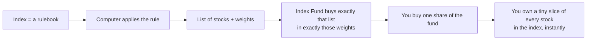
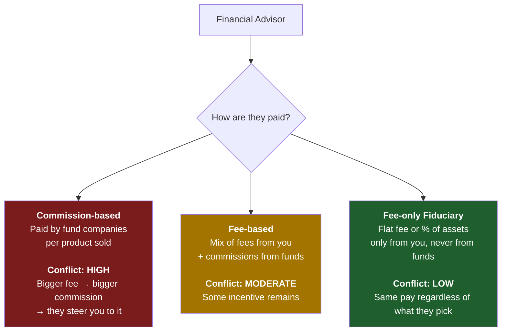
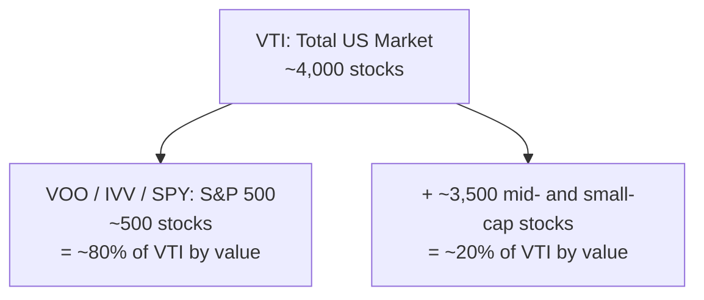
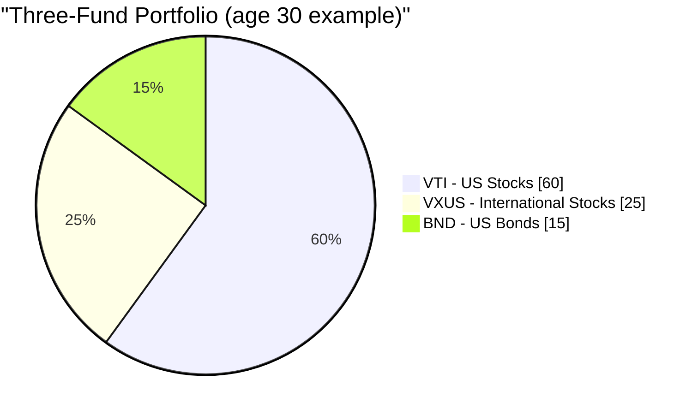

# Week 2: Index Funds and ETFs

Animation reference: `animation/week02_active_vs_passive.py`

---

## Part 1: Reading Section

---

### 1. Why This Is Important

Last week we established the brutal truth: **inflation is gravity, and not investing is the most expensive thing you can do.** Now the question is *how*. And here is the answer that took the investment industry forty years to admit: for almost everybody, the right answer is **a low-cost index fund or ETF.** Not stock-picking. Not your bank's "wealth manager." Not your brother-in-law's hot tip. Not the structured note your insurance agent is desperate to sell you.

This is the most important lesson in the whole course, and it is genuinely simple. If you stop reading after Week 2, set up automatic monthly purchases of a broad-market index ETF, and never read another finance book in your life, **you will outperform the vast majority of investors on this planet — including the professionals being paid millions to manage other people's money.**

That is not a sales pitch. It is a measured statement of what the data has shown for four decades:

- **Roughly 90% of actively managed US large-cap funds underperform the S&P 500 over a 20-year window** — published every year by the SPIVA scorecard from S&P Dow Jones Indices.
- **The single best predictor of future fund performance is the expense ratio.** Not the manager's pedigree, not the brand, not the past returns. The fee. Lower fee → higher future return, on average. (Morningstar has confirmed this in study after study.)
- **Warren Buffett — the most famous active investor in history — instructed in his will that his wife's inheritance be invested in "a very low-cost S&P 500 index fund."** If the greatest stock-picker alive tells his own widow to skip stock-picking, that is a tell.

So we will spend this week on three things. First, what an index fund actually is and the slightly heretical history of how it came to exist. Second, the four big ways the financial industry separates retail investors from their money — high-fee active funds, commission-driven advisors, insurance-based "investment" products, and the slow-bleed legacy mutual fund — and how to walk past every one of them. Third, the few specific tickers you actually need.

And one honest cliffhanger at the end: **the index-fund consensus has worked for forty years. It is not guaranteed to work forever.** When and how it can break, and what you do about it, is a topic we come back to in much later weeks. For now, we plant the foundation. The advanced moves come later — *on top of* this foundation, not instead of it.

> *"Investing is a must. Every other tool in this course is a nice-to-have."*

---

### 2. What You Need to Know

#### 2.1 What Is an Index?

An **index** is a list of stocks (or other assets) that follows a set of rules. Nobody "manages" the index — it just is what its rules say it is. The S&P 500 is "the 500 largest US companies that meet certain liquidity, profitability, and listing criteria, weighted by market value." That is the entire definition. A computer can apply it.

When the news says *"the market was up 2% today,"* they almost always mean the S&P 500 was up 2%.

The major indices you will hear about:

| Index | What It Tracks | # Holdings |
| --- | --- | --- |
| **S&P 500** | 500 largest US companies | ~500 |
| **CRSP US Total Market** | Entire US stock market | ~4,000 |
| **Dow Jones (DJIA)** | 30 large US companies (price-weighted, an antique) | 30 |
| **NASDAQ Composite** | All stocks on NASDAQ | ~3,000 |
| **NASDAQ-100** | 100 largest non-financial NASDAQ stocks (tech-heavy) | 100 |
| **Russell 2000** | 2,000 small US companies | ~2,000 |
| **MSCI EAFE** | Developed markets ex-US/Canada | ~800 |
| **MSCI Emerging Markets** | Emerging-market countries | ~1,400 |
| **FTSE 100** | 100 largest UK companies | 100 |

**Most major indices are market-cap weighted.** That means a company's weight in the index is proportional to its total market value. Apple at ~$3 trillion gets a ~7% weight in the S&P 500; the smallest constituent at ~$10 billion gets ~0.02%. The top 10 companies routinely make up **30–35% of the entire index.** When you "buy the S&P 500," you are buying *much* more concentrated mega-cap exposure than the name "500 stocks" suggests.

That is the entire mechanism. There is no genius in it. That is precisely why it works.

---

#### 2.2 Index Funds — Bogle's Heretical Idea

The index fund did not exist until 1976. Before that, every mutual fund in America was actively managed: smart people in suits picking stocks and charging 1–2% per year for the privilege. The math was the same then as now — most of them lost to the market average — but the academic finding had not yet hardened into a product.

**The man who turned the math into a product was Jack Bogle.** Bogle had been ousted from Wellington Management in 1974. In 1975 he founded a strange new mutual-fund company called **Vanguard**, structured as a mutual — owned by its own shareholders, with no outside profit motive. In 1976 Vanguard launched the **First Index Investment Trust**, the first retail index fund: it would simply buy all 500 stocks in the S&P 500 in their index weights and charge an extremely low fee.

The industry mocked it. The press called it **"Bogle's Folly."** Brokers refused to sell it (no commission to be earned). The fund raised only $11 million in its IPO — a fraction of the $150 million Bogle had targeted. Competitors called the idea **"un-American"** and **"a recipe for guaranteed mediocrity."**

The competitors were right that it was guaranteed mediocrity — *if mediocrity means "the market average minus a few basis points of fee."* They missed the part where the market average minus a few basis points beats roughly 90% of the professionals over 20 years.

Today Vanguard manages over **$8 trillion** and the index-fund-and-ETF category collectively manages **over $20 trillion** worldwide. Bogle's "folly" became the dominant form of retail equity investing on the planet. The man himself died in 2019, and he never enriched himself the way every other founder of an $8T asset manager would have — Vanguard's mutual structure meant the savings flowed back to fundholders, not to him personally. He is one of the very few people in finance who deserves the word *hero* without quotation marks.

> "Don't look for the needle in the haystack. Just buy the haystack." — John C. Bogle

---

#### 2.3 Mutual Funds vs. ETFs — Why Mutual Funds Still Exist (and Why You Should Mostly Use ETFs)

An **index fund** is a *strategy* — "track the index." That strategy can be packaged in two different *wrappers*:

- A **mutual fund**, which prices and trades once per day at the closing NAV.
- An **ETF (Exchange-Traded Fund)**, which trades on an exchange in real time, like a stock.

| Feature | Mutual Fund | ETF |
| --- | --- | --- |
| When it trades | **Once a day** at end-of-day NAV | **All day**, like a stock |
| Minimum investment | Often **$1,000–$3,000** | **Price of one share** (or fractional) |
| Tax efficiency (taxable accounts) | **Worse** — capital-gains distributions forced on all holders | **Better** — in-kind redemption mechanism shields holders |
| Commissions | $0 at the fund's own brokerage | $0 at most brokers |
| Easy auto-invest | **Yes** (dollar amount, any day) | Sometimes harder (need whole shares unless fractional supported) |

**ETFs win on almost every dimension that matters in 2026** — lower minimums, real-time pricing, dramatically better tax efficiency, lower expense ratios on average. The only categories where a mutual fund still has a real edge are:

1. **401(k) and other employer retirement plans.** Most US 401(k) menus are still built around mutual funds. The plan administrator hasn't switched over yet, and you usually can't bring your own ETF into the plan. In a 401(k), the mutual-fund tax issue largely doesn't matter (the account is tax-sheltered), so the wrapper choice is forced and harmless.
2. **Set-and-forget auto-investing in a fixed dollar amount.** Vanguard mutual funds let you say "invest $500 on the 1st of every month" and they will do it to the penny, including buying fractional units. ETF auto-invest exists but is brokerage-dependent.

**That is basically the list.** In a regular taxable brokerage account in 2026, an ETF version of the same index will beat the mutual-fund version on cost and on after-tax return for almost every retail investor. **Default to the ETF.** If your only access is through a 401(k), the mutual fund is fine — pick the cheapest broad-market index option in the menu and move on.

The reason mutual funds still exist in such enormous quantities is not because they are *better*. It is because **trillions of dollars of legacy money is sitting in 401(k)s, IRAs, and old brokerage statements** where switching out of the mutual fund would crystallise a taxable gain. Inertia, not merit. The new dollar should almost always go into an ETF.

---

#### 2.4 Active vs. Passive — The 90% Statistic

**Active investing** means a fund manager (or you) tries to pick winning stocks and avoid losing ones. Research, analysis, frequent trading, conviction calls. That is what every actively managed mutual fund and hedge fund does, and it is what they charge you for.

**Passive investing** means buying the whole index and accepting the average. No prediction, no conviction call, no charisma.

The orthodox question is *"can the active manager beat the index?"* The orthodox answer, repeated annually for more than two decades by the SPIVA scorecard from S&P Dow Jones Indices, is **mostly no.** The longer the time horizon, the worse it gets:

| Category (US) | 5-year underperform | 10-year underperform | 20-year underperform |
| --- | --- | --- | --- |
| **US Large-Cap** | 78% | 85% | **90%** |
| **US Mid-Cap** | 74% | 83% | 89% |
| **US Small-Cap** | 68% | 79% | 88% |
| **International** | 71% | 82% | 87% |
| **Emerging Markets** | 69% | 80% | 85% |
| **US Investment-Grade Bond** | 72% | 81% | 86% |

*(Approximate figures from recent SPIVA reports; the exact numbers wobble year to year, the qualitative pattern does not.)*

> Translation: of every 100 US large-cap fund managers, **90 lose to a computer running a simple list of 500 names** over a 20-year window.

And here is the killer follow-up: **the 10 who won are not the same 10 next decade.** S&P's persistence studies repeatedly show that funds in the top quartile over five years drop out of the top quartile over the next five years more often than not. Past outperformance does not predict future outperformance — that warning at the bottom of every fund prospectus is true, and most investors ignore it.

There are five reasons active managers, in aggregate, can't beat the index:

1. **Fees.** Active funds charge 0.5–1.5% per year. The index ETF charges 0.03%. The manager has to outperform the index by **more than a full percent** every single year just to break even with the cheap option.
2. **Trading costs.** Every buy and sell has friction — bid-ask spread, market impact, commissions on the institutional side. High-turnover strategies bleed.
3. **Taxes.** High turnover triggers capital-gains distributions in mutual funds, taxed in the year they are paid regardless of whether you sold.
4. **Mostly-efficient market.** Tens of thousands of pros are reading the same 10-Ks, the same conference calls, the same satellite data. Real edge is rare.
5. **Survivorship bias.** Funds that perform badly get quietly killed or merged into other funds. The remaining "active fund" universe looks better than it actually is, because the worst losers have been buried.

---

#### 2.5 Expense Ratios — The Single Biggest Lever You Control

The **expense ratio** is the annual fee a fund charges, deducted automatically from the fund's assets every day. You never see the bill. It just shows up as a slightly lower return.

That invisibility is the entire point of why it works as a wealth-extraction mechanism. **A 1% fee sounds like nothing. Over thirty years it eats roughly 25–30% of your terminal wealth.** Compounding cuts both ways: it grows your money and it grows the fee.

$100,000 invested for 30 years at a 10% gross return:

| Fund Type | Expense Ratio | Net Return | Value at Year 30 | Lost to fees vs. index |
| --- | --- | --- | --- | --- |
| **Index ETF** (e.g. VOO) | **0.03%** | 9.97% | **$1,721,686** | — |
| Cheap Active | 0.50% | 9.50% | $1,526,688 | **−$194,998** |
| Average Active | 1.00% | 9.00% | $1,326,768 | **−$394,918** |
| Expensive Active | 1.50% | 8.50% | $1,152,309 | **−$569,377** |
| Insurance-product wrapper | 2.00% | 8.00% | $1,006,266 | **−$715,420** |

Read the bottom row again. **A 2% wrapper costs you over $700,000 on a $100,000 investment.** That is not a fee. That is a house. Possibly two houses, depending on the city. It goes from your retirement to the fund company's payroll, marketing budget, office lease, and CEO compensation.

**The fee compounds through every market environment.** In the year the market drops 30%, you still pay it. In the year the manager beats the index by 0.4%, you still owe it 1.0%. The fee is the only number on a fund prospectus that is guaranteed.

Two more facts that the industry would prefer you not internalise:

- **Within any fund category, lower-fee funds beat higher-fee funds on average.** This is the most replicated finding in fund research — Morningstar has shown it across asset classes and across decades. The cheapest fund in a category is, on average, the best fund in the category.
- **A fee is a *guaranteed* drag. A manager's outperformance is a *hoped-for* offset.** Trading certainty for hope is, in every other domain, recognised as a bad deal.

---

#### 2.6 The Financial Advisor Trap

If active funds are this bad, why does every bank, brokerage, and "wealth management" branch keep selling them? Because **the financial advisor's compensation is structured to make selling them rational for the advisor**, even when it is irrational for you.

There are three compensation models you will encounter:

**The single most important question to ask any advisor: *"Are you a fiduciary, and are you fee-only?"*** A fiduciary is *legally* required to act in your best interest. A non-fiduciary salesperson is required only to recommend something "suitable" — a much lower bar that has historically allowed the sale of high-fee garbage to anyone old enough to sign.

The reason your bank's "private wealth manager" is so eager to put you into a 1.5% expense ratio active fund with a 5% front-load is that the bank gets paid both ways: it earns the load up front *and* a slice of the ongoing 12b-1 marketing fee for as long as you hold it. **You are not their client; you are their product.** The fund company is paying them to deliver you.

The cleanest response to a non-fiduciary advisor pushing an active fund is: *"Show me, in writing, the all-in cost — expense ratio, sales loads, 12b-1 fees, advisory fee, account fees — for me to hold this fund for ten years. And show me your firm's compensation from that fund family."* If they refuse or stall, you have your answer.

> **Default rule:** if you don't already have several million dollars and a genuinely complex tax situation, you almost certainly do not need a financial advisor. You need an ETF and an automatic monthly transfer.

---

#### 2.7 Insurance "Investments" Are Almost All Scams

I want to be unusually direct here. **Variable universal life, indexed universal life, whole life sold as an "investment," equity-linked savings products, structured annuities marketed to retail savers — these are, with very rare exception, predatory products designed to extract fees from people who do not realise they are being charged.**

The pitch is always some combination of:

- *"Tax-advantaged growth."*
- *"Principal protection."*
- *"Stock-market upside without the downside."*
- *"Forced savings discipline."*

The reality is almost always:

- **5–10% surrender charges** if you exit in the first 5–10 years.
- **2–4% all-in annual fees** wrapped in opaque language ("mortality and expense charge," "rider fee," "administrative charge," "fund management fee," all stacking on top of each other).
- **A return profile that, after fees, lags a basic ETF by enormous margins** — often delivering 2–4% net when the underlying market gave 8–10%.
- **Commissions to the agent that can equal 80–100% of your first year's premium**, which is precisely why they are pushed so hard.

The rule of thumb that protects you for life:

> **Insurance is for risk transfer. Investing is for wealth creation. Never mix them.**

If you have dependents who would be financially harmed by your death, **buy term life insurance** — pure, cheap, fixed-period coverage with no investment component. A healthy 30-year-old can buy a 20-year, $1 million term policy for roughly $25–35 per month. Then take the difference between the term policy and what an agent would have charged you for whole life, and **put that difference into an index ETF.** This is the textbook strategy: **"buy term and invest the difference."** Over any 20-year window, this beats a whole-life policy on after-cost net worth by orders of magnitude — and you keep full control of and full liquidity in the investment side.

The agent will tell you whole life "forces you to save." So does an automatic monthly transfer to your brokerage account, and that one doesn't pay them an 80% commission.

---

#### 2.8 The Honest Counter-Examples — Active Funds That Actually Worked

I have spent the last several sections beating up on active management. To stay intellectually honest, I have to say plainly: **a small number of active managers have beaten the index, decisively and over decades.** Not many — but enough to matter.

The notable ones:

- **Berkshire Hathaway under Warren Buffett and Charlie Munger.** From 1965 through the early 2020s, Berkshire compounded book value at roughly **20% per year** versus the S&P 500's ~10% — the most impressive long-run track record in modern finance. Buffett is the textbook proof that *some* active management works. He is also the same Buffett who told his widow to put her inheritance in an S&P 500 index fund. He is the exception telling you that you are not the exception.
- **Peter Lynch / Fidelity Magellan, 1977–1990.** Lynch ran Magellan for 13 years and delivered roughly **29% per year**, beating the S&P 500 in 11 of those 13 years — arguably the greatest mutual-fund track record on record. He retired at 46. Magellan after Lynch went back to roughly tracking the index.
- **Renaissance Technologies' Medallion Fund, ~1988 onward.** A high-frequency, high-math, employee-only quant fund that has reportedly delivered **~40% per year *after* its 5-and-44 fee structure** for over three decades. The Medallion Fund is closed to outside investors and has been since 1993, and Renaissance's *outside-investor* funds (RIEF, RIDA) have done dramatically less well — sometimes losing money when Medallion was up 70%. **Medallion is the existence proof of real, durable alpha. It is also the proof that real alpha gets walled off and never reaches you.**
- **Seth Klarman's Baupost Group.** Decades of equity-like returns with structurally less volatility than the market, by sticking to a deep-value framework and holding extraordinarily large cash balances when nothing met the criteria. Klarman's book *Margin of Safety* sells used for $1,000+ because he refuses to reprint it.
- **Joel Greenblatt at Gotham Capital, 1985–1994.** ~50% per year for ten years on a small special-situations book before returning outside capital. Greenblatt subsequently published the playbook in *You Can Be a Stock Market Genius* and *The Little Book That Beats the Market* — explicitly betting that the strategy was *too small-cap, too uncomfortable, and too patient* for most readers to actually run.

Notice the pattern. The funds that have demonstrably beaten the index over decades are either **closed to new money** (Medallion), **closed periodically** (Magellan during its peak), **a single holding company that is its own thing** (Berkshire), **explicitly small enough that scaling it would kill the edge** (Greenblatt's early years), or **deeply concentrated and require holding through multi-year drawdowns most investors cannot stomach** (Klarman).

The lesson is not *"active never works."* The lesson is **the active strategies that genuinely work are rarely the ones you can buy from your bank's product menu.** And the active funds you *can* buy from your bank's product menu are, in aggregate, the 90% the SPIVA scorecard tracks losing to the index.

If you have the time, the temperament, and a real durable edge in a specific corner of the market, by all means concentrate there. Most readers don't. **Most readers should index the bulk and spend their time elsewhere.**

---

#### 2.9 The Funds You Actually Need

You do not need to memorise the thousands of ETFs that exist. You need this short list:

| Ticker | Fund | Expense Ratio | What It Tracks |
| --- | --- | --- | --- |
| **VOO** | Vanguard S&P 500 ETF | **0.03%** | 500 largest US companies |
| **VTI** | Vanguard Total US Stock Market | **0.03%** | Entire US market (~4,000 stocks) |
| **IVV** | iShares Core S&P 500 | 0.03% | S&P 500 (BlackRock equivalent of VOO) |
| **SPY** | SPDR S&P 500 | 0.09% | S&P 500 (older, expensive, traders' favourite) |
| **VXUS** | Vanguard Total International | 0.07% | All non-US developed + emerging |
| **VT** | Vanguard Total World Stock | 0.07% | Entire world (US + ex-US in one ETF) |
| **BND** | Vanguard Total US Bond | 0.03% | US investment-grade bonds |
| **QQQ** | Invesco NASDAQ-100 | 0.20% | 100 largest non-financial NASDAQ (tech-heavy) |

**VOO vs. VTI vs. SPY** is the single most-asked question. The short version:

- **VOO** and **IVV** track the same index (S&P 500) at the same cost (0.03%). Either is fine.
- **SPY** also tracks the S&P 500 but charges **3× the fee** (0.09%). It exists because it was the *first* US ETF (1993), so it has the deepest liquidity — institutional traders care about that, long-term investors do not. **Don't pay 3× the fee for liquidity you don't need.**
- **VTI** owns the entire US market (~4,000 names) instead of just the 500 largest. In practice, VOO and VTI return almost identically because the S&P 500 *is* roughly 80% of US market cap. If you want one fund and slightly more diversification, pick VTI. If you want one fund and the cleanest index everyone references, pick VOO. **There is no wrong answer between these two.**

---

#### 2.10 How to Actually Buy One

This is the entire procedure, and it takes 15 minutes:

1. **Open a brokerage account.** US-resident: Fidelity, Schwab, or Vanguard — all three are free, all three have sane platforms. HK/TW/SG-resident: Interactive Brokers is the standard cross-border choice for buying US-listed ETFs cheaply.
2. **Link your bank account and transfer money.** ACH transfer takes 1–3 business days.
3. **Search for the ticker.** Type *"VOO"*. The fund profile pops up.
4. **Place a buy order.** Market order = buy at current price. Enter share count or dollar amount (most brokers support fractional shares now).
5. **Set up automatic monthly investing.** Schedule, say, $500 on the 1st of every month. Forget it exists.

That's it. **Five steps. Fifteen minutes. You now own a slice of the 500 largest companies in America.** No CNBC. No watching your portfolio. No stock-picking anxiety.

The most important thing you can do after pressing buy is **close the app and stop looking.** The market goes up and down constantly. Watching the daily moves is the single biggest cause of bad investor behaviour — selling in panic, buying in euphoria. Every dollar of long-term return in the SPIVA-beating index ETF strategy comes from *holding through* the noise, not trading around it.

---

#### 2.11 The Three-Fund Portfolio

For most readers, a **three-fund portfolio** in the style Bogle popularised is genuinely the entire portfolio:

| Fund | Ticker | Suggested allocation (age 30) |
| --- | --- | --- |
| Total US stock market | **VTI** | 60% |
| Total international stock | **VXUS** | 25% |
| Total US bond market | **BND** | 15% |

The rough **traditional rule of thumb** on the bond slice: **bond % ≈ your age − 20**, more or less. A 30-year-old runs ~10–15% bonds. A 65-year-old runs ~45–55% bonds. The textbook logic is that bonds are *ballast*: they zig when stocks zag, they reduce portfolio volatility, and they protect you from a 50% equity drawdown in the years close to retirement when you can't wait a decade for it to recover.

> **A heads-up that I owe you upfront, even in the foundation lesson:** that traditional logic was built for a world that no longer exists.
>
> The "bonds as ballast" framework assumes (a) bonds pay a real yield above inflation, and (b) bonds rally when stocks fall. **Both of those broke in the 2020s.** With governments running enormous deficits financed by money printing (Week 1, §2.2), and with central banks suppressing real yields below inflation as a matter of policy ("financial repression"), holding a long-bond fund through an inflationary cycle is not ballast — it is a slow loss of purchasing power. And in 2022, stocks and bonds *both* fell roughly 20% together, which is exactly the scenario the 60/40-with-bonds shape is supposed to protect you from.
>
> So treat the bond slice in the table above as **the textbook starting point that the rest of the course will challenge.** We come back to what actually plays the ballast role in a money-printing world later:
>
> - **Week 5 (Bonds)** dissects what bonds actually are, why the historical hedge worked when it worked, and the conditions under which it stops working.
> - **Week 6 (Gold and Commodities)** introduces the alternative inflation-hedge — gold has been the store of value across every monetary regime humans have ever run, and the 2020s case for it is much stronger than for long-duration bonds.
> - **Week 47 (Tail Risk Hedging)** and **Level 5 generally** rebuild the safety side of the portfolio properly, using a mix of cash/short-duration Treasuries, gold, and long-volatility option structures rather than the traditional long-duration bond bucket.
>
> For the foundation portfolio you build today, the three-fund template is fine and is dramatically better than not investing. **Just understand that the bond slice is the part of this portfolio with the shortest shelf life, and we will be coming back to replace it.**

Total blended expense ratio for this entire portfolio: **roughly 0.04% per year.** That is *four dollars* per year on $10,000. For a globally diversified portfolio touching every major asset class.

---

#### 2.12 Until It Stops Working — A Cliffhanger

I have spent this whole chapter telling you that index ETFs are the answer. I want to close with the qualifier that makes me an honest teacher rather than a salesman.

**The buy-and-hold passive index strategy has worked extraordinarily well for the last 40 years — since roughly the early 1980s.** It worked because of a specific combination of conditions: a working-age population larger than the retired population mechanically buying every payroll cycle, falling interest rates, dollar reserve status, globalisation, and (since 2008) a Federal Reserve that consistently steps in when financial conditions tighten too far.

**None of those tailwinds is guaranteed to keep blowing.**

When the demographic flip arrives — when the boomer generation moves from net buyers (accumulation) to net sellers (decumulation) — the same mechanical pipe that has bid the index up for 40 years can run in reverse. Passive funds are not autonomous; they react to whether their end-investor is contributing or withdrawing. A market dominated by price-insensitive flow on the way up is a market vulnerable to price-insensitive flow on the way down.

**This is not a prediction that the index will stop working tomorrow. It is an honest acknowledgement that "it has worked for 40 years" is not the same as "it will work forever."**

For *you*, today, building your first portfolio: **the index ETF is the right answer.** Build the foundation. Get the automatic monthly transfer running. Let it compound for the next several years while you go through the rest of the course.

The detailed treatment of when and how the index can stop working — and what you migrate toward when it does — is what we build over the rest of this course:

- **Week 23 (Factor Investing)** introduces the first set of alternatives to plain market-cap-weighted indexing — value, momentum, quality, low-volatility tilts that have historically captured returns the cap-weighted index leaves on the table.
- **Week 43 (Active Portfolio Management)** is the deeper dive into when active management *does* earn its fee, and when it doesn't.
- **Level 5 (Weeks 47–52)** is where we actually build the "barbell" portfolio shape — high-conviction safety on one end, asymmetric speculation on the other, with the broad market-cap-weighted core deliberately *removed*. That is the advanced shape, and it is built on top of everything we cover in Weeks 2–46.

For now: **investing is a must. The ETF is the foundation. Everything else in this course is a nice-to-have, layered on top.** If you can't beat the index — and most people, most of the time, can't — then don't waste your life trying to. Let the index do the work, and spend your hours on something that compounds in your life rather than your spreadsheet.

But understand that *"buy and hold the index"* is a regime-conditional strategy that has worked for a specific 40-year window. We will come back to what happens after that window closes. For now, the foundation is enough.

---

### 3. Common Misconceptions

**Misconception 1: "Index funds are just for beginners."**

Index funds and ETFs are used by sovereign wealth funds, university endowments, pension funds, and billionaires. CalPERS — one of the largest pension funds on the planet — runs huge index-fund mandates. Warren Buffett, *the* most famous active investor in history, won a $1M public bet in 2008–2017 that an S&P 500 index fund would beat a hand-picked basket of hedge funds, and won decisively. Indexing is not the beginner option; it is the rationally-chosen option that happens to also be the easiest.

**Misconception 2: "You get what you pay for — higher fees mean better management."**

In almost every other consumer category, this is true. In investing, **the relationship is reversed.** Morningstar has shown across asset classes and decades that **expense ratio is the single best predictor of future fund performance** — better than past returns, better than star ratings, better than manager tenure. Higher fee → lower expected future return. The cheap fund is, on average, the better fund.

**Misconception 3: "But my financial advisor recommended an active fund."**

Many financial advisors are paid commissions for selling specific funds — sometimes openly, often in opaque revenue-sharing arrangements you will never see on a statement. Their incentive is to recommend the product that pays *them* the most, not the product that compounds *you* the most. **Always ask: "Are you a fee-only fiduciary, and what is your full compensation from anything you recommend?"** If they aren't, or if they can't or won't answer in writing, walk away.

**Misconception 4: "Index funds can't protect you in a downturn."**

Correct — they can't. They are also not supposed to. The index drops when the market drops. The relevant comparison is *not* "index vs. cash" but "index vs. active fund." In 2008 the S&P 500 fell ~37%; the average actively managed US stock fund fell ~39%. Active managers did not protect you in the crash; they made it slightly worse, on average. **The protection in a downturn comes from your *asset allocation* (how much stock vs. bond vs. cash) and your behaviour (don't panic-sell), not from your fund choice.**

**Misconception 5: "I should pick the fund with the best 5-year track record."**

This is the single most common and most expensive mistake retail investors make. **Top-performing funds revert to the mean.** S&P's persistence studies, repeated decade after decade, show that fewer than 1 in 10 top-quartile funds remain top-quartile five years later. Past performance does not predict future performance; that warning at the bottom of every fund prospectus is not legal boilerplate, it is a true statement that everyone ignores. Chasing past winners is, in expectation, *worse* than picking randomly.

**Misconception 6: "SPY and VOO track the same thing, so it doesn't matter which I buy."**

They track the same index. They do not have the same fee. SPY charges 0.09%; VOO charges 0.03%. On a $500,000 portfolio held for 30 years, that 0.06% gap compounds to roughly **$25,000+ of foregone wealth.** SPY's only structural advantage is its trading liquidity, which matters only if you are an institution moving size or a day trader — not a buy-and-hold investor. **For long-term holders, VOO or IVV beats SPY on cost. Always.**

**Misconception 7: "I need to diversify across many different index funds."**

A single total-market fund like VTI already holds about 4,000 stocks. Adding VXUS gives you another ~7,000 international stocks. **Two ETFs is roughly 11,000 stocks across every major economy on earth — there is nothing left to diversify into at the equity level.** Owning 10+ index ETFs typically just creates overlap (the same Apple, Microsoft, and Nvidia showing up in multiple funds at different weights) and a false sense of diversification. Two or three funds is enough. More than five is usually a sign of confusion, not sophistication.

**Misconception 8: "Index funds are dangerous because you can't avoid the bad companies."**

An index fund does hold companies that go bankrupt. When Enron collapsed in 2001, it was about 0.7% of the S&P 500 — painful in the abstract, irrelevant to a portfolio. The other 499 companies kept compounding. **Diversification *within* the index — hundreds or thousands of names, none meaningfully large enough alone to wreck you — is the protection.** A concentrated stock-picker who happened to be heavy in Enron lost everything in that name. The index investor lost 0.7%.

**Misconception 9: "Whole life insurance is a good investment because it builds cash value tax-free."**

It is not, and the cash value pitch is precisely how the product is sold. Real returns on whole-life cash value, after the agent's commission, the surrender charge schedule, and the layered annual fees, typically come out to **2–4% net** versus the 7–10% you would have made in an index ETF over the same window. **Buy term life insurance for the actual death-benefit need, and put the difference between the term premium and what the whole-life policy would have cost into an index ETF.** This is the textbook *"buy term and invest the difference"* strategy. It wins the comparison in essentially every realistic scenario; the agent's commission is exactly why they will never recommend it.

---

### 4. Q&A

**Q1: What exactly is an ETF, and how is it different from a stock?**

An **ETF** (Exchange-Traded Fund) is a basket of securities packaged into a single instrument that trades on an exchange just like a stock. Buying one share of VOO buys you a tiny proportional slice of all 500 companies in the S&P 500. **A stock represents one company; an ETF represents a defined basket.** Same trading mechanics — ticker symbol, real-time price, buy and sell during market hours — but you get instant diversification.

**Q2: VOO, VTI, or SPY — which one?**

For long-term buy-and-hold: **VOO or VTI**, both at 0.03%. VOO = the S&P 500 (~500 names); VTI = the entire US market (~4,000 names). They perform almost identically because the S&P 500 *is* ~80% of the US market by value. Either is fine. **SPY is for traders, not investors** — same exposure as VOO at 3× the fee.

**Q3: How much of my portfolio should be in index ETFs?**

For most readers building their first portfolio in their 20s–40s: **80–100% of the equity sleeve** in broad-market index ETFs. The exact split between stocks and "safe assets" depends on age and risk tolerance:

| Age | Stock % | Safe-asset % |
| --- | --- | --- |
| 20–35 | 80–90% | 10–20% |
| 35–50 | 70–80% | 20–30% |
| 50–65 | 50–70% | 30–50% |
| Retirement | 30–50% | 50–70% |

**Note on "safe asset" instead of "bond":** the textbook ballast for the stock sleeve has historically been the bond allocation, on the assumption that bonds zig when stocks zag. As flagged in §2.11, that assumption broke in the 2020s — stocks and bonds fell together in 2022, and bonds no longer pay a real yield above inflation under financial repression. **The "safe-asset" sleeve should therefore be read as a basket of assets uncorrelated (or negatively correlated) with the stock market, not just bonds.** The traditional bond allocation is one component, but the modern sleeve also includes short-duration Treasuries and cash equivalents, gold and other monetary metals (Week 6), and — at the more advanced end — long-volatility option structures and tail-hedge overlays (Week 47, Level 5). For your first portfolio today, a broad bond ETF like BND is a reasonable starting point; the rest of the course is how you replace and supplement it as you progress.

Within the stock allocation, a typical split is ~70% US (VTI) and ~30% international (VXUS).

**Q4: Expense ratio vs. sales load — what's the difference?**

The **expense ratio** is the annual fee, deducted from fund assets daily. 0.03% on $10K = $3/year. The **sales load** is a one-time commission charged when you buy (front-load) or sell (back-load). A 5% front-load on a $10,000 buy means $500 vanishes immediately and only $9,500 actually gets invested. **Modern index ETFs have zero sales loads.** Any fund you are looking at that *does* charge a load is, almost without exception, not worth buying.

**Q5: If 90% of active managers lose, why do active funds even still exist?**

Because they are **enormously profitable for the fund company.** A $10B fund at a 1% expense ratio earns $100M per year in fees, regardless of performance. The investor losing to the index is a bad deal for the investor, but a fantastic recurring-revenue business for the fund company. Add in the marketing budget that buys CNBC airtime, the bank branch network that distributes them, the financial advisors paid to sell them, and investor psychology that wants to believe the manager with the silver tongue can beat the average — **the active fund industry persists because it pays everyone in the value chain except you.**

**Q6: Can an index fund go to zero?**

Theoretically only if every single company in the index simultaneously went bankrupt — which would mean the entire US economy had collapsed, in which case the value of any financial asset is academic. In practice, the worst broad-index drawdowns in history (1929–32, 2007–09, 2020 COVID flash crash) bottomed at 50–80% peak-to-trough and recovered to new all-time highs within a decade. **An individual stock can absolutely go to zero, and many have. A broad index practically cannot.** That asymmetry is the entire reason diversification works.

**Q7: International index funds — should I own those too?**

Most reasonable allocations include some international exposure. The US is roughly 60% of the global stock market by capitalisation; the other 40% sits in Europe, Japan, emerging markets, and elsewhere. International diversification can reduce portfolio volatility because regional markets do not move in perfect sync. **VXUS** (Vanguard Total International Stock) at 0.07% covers ~7,000 stocks across developed and emerging markets in one ETF. A common rough split is **70% US (VTI), 30% international (VXUS)**.

**Q8: What is dollar-cost averaging, and should I do it with index ETFs?**

**Dollar-cost averaging (DCA)** = investing a fixed dollar amount at regular intervals regardless of price. $500 every month, every month, no matter what the market is doing. When prices are low, $500 buys more shares. When prices are high, $500 buys fewer. The result is an average cost slightly below the simple average market price over the period, plus the much more important behavioural benefit: **you keep investing through the scary months instead of waiting for "the right time" that never feels right.** For anyone investing out of paycheck income, DCA happens automatically. For anyone with a lump sum, the academic literature is mixed — historically, lump-summing has slightly outperformed DCA on average (because markets go up most of the time), but DCA is psychologically much easier to live with.

**Q9: Do index funds pay dividends?**

Yes. The companies inside the index pay dividends to the fund, the fund collects them, and the fund passes them through to shareholders quarterly. VOO's current dividend yield is roughly 1.3–1.5%. Most brokers let you turn on **DRIP (Dividend Reinvestment Plan)**, which automatically uses each dividend to buy more shares of the same fund. Over decades, **reinvested dividends are responsible for a substantial fraction of total equity returns** — leave DRIP on by default.

**Q10: I've heard about "smart beta" or "factor" ETFs — are those the same as index funds?**

Not quite. Traditional index funds use **market-cap weighting** (bigger company = bigger index weight). **Smart-beta** or **factor** ETFs are still rules-based and rebalanced systematically — so they're index-like — but they weight by some factor *other* than market cap: value (cheap fundamentals), momentum (recent winners), quality (clean balance sheets), low volatility (boring stocks), small size, and so on. Expense ratios are higher than plain index funds (typically 0.10–0.40%) because the rebalancing rules are more involved, but they are still dramatically cheaper than active funds. **Factor investing is a meaningful topic, and we cover it in depth in Week 23.** For your first portfolio, though, plain market-cap-weighted index ETFs are the right starting point.

**Q11: Should I buy individual stocks alongside my index ETFs?**

If you genuinely have a durable edge in a specific company or sector — domain expertise from your day job, a structural insight about an industry you live in — then **a small "satellite" sleeve of individual names alongside an index core can make sense.** A common shape is 80–90% in broad-market index ETFs, 10–20% in individual conviction names. **What you should not do** is buy individual stocks because you saw a stock-tip on social media, because the brand is familiar, or because it just had a good month. The 90% SPIVA statistic applies to retail stock-pickers far more brutally than it applies to professional fund managers — most retail individual-stock portfolios materially *underperform* the index they could have just bought. If you can't articulate, in one sentence, exactly why a stock is mispriced relative to its fundamentals, you don't have an edge — you have an opinion. There is nothing wrong with opinions; just don't size them as if they were edges.

**Q12: I keep hearing that the index is "concentrated in mega-cap tech" — is this a problem?**

It is a real observation. In 2026 the top 10 holdings of the S&P 500 (mostly the mega-cap tech names — Apple, Microsoft, Nvidia, Alphabet, Amazon, Meta, etc.) account for roughly **30–35% of the entire index by weight.** Buying VOO is much more concentrated mega-cap-tech exposure than the name "500 stocks" implies. Whether this is a *problem* depends on your view of those companies. The broader-market VTI is somewhat less concentrated (because it dilutes the top 10 across ~4,000 names), and an explicit equal-weight S&P 500 ETF (RSP, expense ratio ~0.20%) takes the other extreme — same 500 names, equal weights. **For now, a cap-weighted index is still the simplest and historically best-performing default.** This concentration question, and what it implies about risk, is exactly the kind of regime-aware thinking we develop further in Weeks 23 and beyond.

---

## Part 2: YouTube Script

---

**VIDEO TITLE:** The One ETF That Beats 90% of Wall Street | Week 2

**RUNTIME TARGET:** ~30 minutes

**HOSTS:**
- **Horace** (teacher): Experienced retail investor, speaks in the first person from decades of running his own portfolio
- **Stella** (student): Recent college graduate learning to invest her savings, asks the questions viewers are thinking

---

**[INTRO / SEGMENT 0: THE PROMISE]**

[VISUAL: Cold-open title card -- "$700,000. That's what your fees cost you."]

[ANIMATION: Hundreds of stock tickers swirling chaotically, then being swept into
a single basket labeled "ONE ETF". A subtitle fades in: "And it beats 90% of
the pros."]

**Horace:** If you watch this one video and do absolutely nothing else with your
financial life — no books, no podcasts, no stock-picking apps — you will still
beat almost every professional fund manager on Wall Street.

**Stella:** That is a big claim.

**Horace:** It is not my claim. It is what the data has said for forty years. The
answer is a low-cost broad-market index ETF. Not your bank's wealth manager.
Not your brother-in-law's hot tip. Not the structured product an insurance
agent is desperate to sell you.

**Stella:** And yet almost nobody actually does this.

**Horace:** Because there is a multi-trillion-dollar industry whose paychecks
depend on you not doing it. Today I want to show you the foundation of my own
portfolio — and then, at the very end, I will tell you the one honest thing
nobody else in this category will admit: this strategy has worked for forty
years, and it is not guaranteed to work forever.

**Stella:** Cliffhanger noted. Let us start with the basics.

[VISUAL: Title card -- "1. What Is an Index?"]

---

**[SEGMENT 1: WHAT IS AN INDEX?]**

**Horace:** Before we talk about the fund, we have to define the index. An index is
just a list of stocks that follows a set of rules. Nobody manages it. The S&P 500
is "the 500 largest US companies that meet certain liquidity and listing rules,
weighted by market value." That is the entire definition. A computer can run it.

**Stella:** When the news says "the market is up two percent," they mean the S&P 500.

**Horace:** Almost always. The S&P 500 is the headline index in the US, and it
represents roughly eighty percent of the total US market value.

[VISUAL: Quick table flashes the major indices -- S&P 500, CRSP US Total Market,
Dow Jones (30 names, price-weighted, "an antique"), Nasdaq Composite, NASDAQ-100,
Russell 2000, MSCI EAFE, MSCI Emerging Markets, FTSE 100.]

**Stella:** Are all five hundred companies weighted equally?

**Horace:** No, and this is the part most people miss. The S&P 500 is weighted by
market capitalisation. Apple at three trillion dollars gets about a seven percent
weight. The smallest constituent at ten billion gets about two hundredths of one
percent.

[ANIMATION: Bar chart, top of week02_active_vs_passive.py -- Apple ~7%,
Microsoft ~6.5%, descending to a tiny sliver at the right end.]

**Horace:** And the top ten companies -- Apple, Microsoft, Nvidia, Alphabet, Amazon,
Meta, and a few others -- together make up roughly thirty to thirty-five percent
of the entire index.

**Stella:** So when I "buy the S&P 500," I am really buying a concentrated mega-cap
position.

**Horace:** A much more concentrated mega-cap-tech position than the name "500 stocks"
suggests. Remember that. We will come back to it later in the course.

[VISUAL: Title card -- "2. Bogle's Heretical Idea"]

---

**[SEGMENT 2: BOGLE'S HERETICAL IDEA]**

**Horace:** The index fund did not exist until 1976. Before that, every mutual fund in
America was actively managed -- smart people in suits picking stocks and charging
one to two percent per year. The math was the same then as now: most of them lost
to the market average. The academic finding was there, but nobody had wrapped it
in a product yet.

**Stella:** Until somebody did.

**Horace:** A man named Jack Bogle. Bogle had been ousted from Wellington Management in
1974. In 1975 he founded a strange new fund company called Vanguard, structured as
a mutual -- owned by its own shareholders, no outside profit motive. In 1976
Vanguard launched the First Index Investment Trust. It would buy all five hundred
S&P 500 names in their index weights and charge an extremely low fee.

**Stella:** How did Wall Street take it?

**Horace:** Wall Street mocked it. The press called it "Bogle's Folly." Brokers
refused to sell it because there was no commission to earn. The IPO raised
eleven million dollars -- a fraction of the one hundred fifty million Bogle had
targeted. Competitors called it "un-American" and "a recipe for guaranteed
mediocrity."

**Stella:** And today?

[VISUAL: Bold text card -- "Vanguard today: $8 trillion. Index ETF category:
$20 trillion." Photo of Bogle, dates 1929-2019.]

**Horace:** Vanguard manages over eight trillion dollars. The index-fund-and-ETF
category is over twenty trillion globally. Bogle's "folly" became the dominant
form of retail equity investing on the planet. And here is what makes him a hero
of mine: because Vanguard is mutually owned, the savings flowed back to fund-
holders, not to him personally. Every other founder of an eight-trillion-dollar
asset manager would be on the Forbes list. Bogle wasn't. He died in 2019.

**Stella:** A finance hero who didn't enrich himself. That is a short list.

**Horace:** It is a list of one. His own line was the best summary: *"Don't look for
the needle in the haystack. Just buy the haystack."*

[VISUAL: Title card -- "3. Mutual Fund vs ETF"]

---

**[SEGMENT 3: MUTUAL FUND VS ETF]**

**Horace:** Quick wrapper distinction, because people get confused. An index fund is a
*strategy* -- track the index. That strategy can be sold in two different
*wrappers*: a mutual fund, which prices and trades once per day at the closing
NAV, or an ETF, which trades on an exchange in real time, like a stock.

[VISUAL: Side-by-side comparison table -- Mutual Fund vs ETF on five rows:
trading hours, minimum investment, tax efficiency, commissions, auto-invest.]

**Stella:** Which one wins?

**Horace:** In a regular taxable brokerage account in 2026, the ETF wins on almost
every dimension that matters -- lower minimums, real-time pricing, dramatically
better tax efficiency from the in-kind redemption mechanism, lower expense
ratios on average. The only places a mutual fund still beats the ETF are inside
a 401(k), where the menu is forced and the tax issue doesn't matter, and for
set-and-forget auto-investing in a fixed dollar amount, which Vanguard's mutual
funds do beautifully.

**Stella:** Then why are mutual funds still everywhere?

**Horace:** Inertia. Trillions of dollars of legacy money is sitting in 401(k)s,
IRAs, and old brokerage statements where switching out would crystallise a big
taxable gain. They linger because moving them costs money, not because they are
better. **The new dollar should almost always go into an ETF.**

[VISUAL: Title card -- "4. Active vs Passive -- The 90% Statistic"]

---

**[SEGMENT 4: ACTIVE VS PASSIVE -- THE 90% STATISTIC]**

**Horace:** Here is the central data point. Every year, S&P Dow Jones Indices
publishes the SPIVA scorecard -- S&P Indices Versus Active. Over a twenty-year
window, **roughly ninety percent of US large-cap fund managers underperform the
S&P 500.**

[ANIMATION: image/week02_spiva.png animated in -- bars climb from 78% over
five years, to 85% over ten, to 90% over twenty. Categories tick across the
bottom: US large-cap, mid-cap, small-cap, international, EM, investment-grade
bond.]

**Stella:** Ninety out of one hundred. With teams of analysts and PhDs in finance.
Losing to a list.

**Horace:** And the killer follow-up: the ten who won are not the same ten next
decade. S&P's persistence studies show top-quartile funds drop out of the top
quartile over the next five-year window more often than not. Past performance
does not predict future performance. That warning at the bottom of every fund
prospectus is true.

**Stella:** So why can't they win? They are obviously smart.

**Horace:** Five reasons, and they are structural -- not a matter of effort.

[VISUAL: Five cards stack on screen as Horace lists them.]

**Horace:** One -- fees. Active funds charge half a percent to one and a half
percent. Index ETF charges three hundredths. The active manager has to beat the
index by *more than a full percent every year* just to break even with the cheap
option. Two -- trading costs. Bid-ask, market impact, commissions. High turnover
bleeds. Three -- taxes. Turnover triggers capital-gains distributions in mutual
funds, taxed in the year they are paid. Four -- the market is mostly efficient.
Tens of thousands of pros are reading the same 10-Ks and the same satellite data.
Real edge is rare. Five -- survivorship bias. Funds that perform badly get
quietly killed or merged away. The remaining "active fund" universe looks better
than it actually is, because the worst losers have been buried.

**Stella:** Translation: of every hundred professional stock-pickers, ninety lose to a
computer running a list of five hundred names.

**Horace:** Over twenty years. Yes.

[VISUAL: Title card -- "5. Expense Ratios -- The $700,000 Card"]

---

**[SEGMENT 5: EXPENSE RATIOS -- THE $700,000 CARD]**

**Horace:** Now I want to make the fee point unmissable. Imagine you put one hundred
thousand dollars in at age thirty. You earn ten percent gross every year for
thirty years. The only thing that changes is the fee.

[ANIMATION: image/week02_expense_drag.png animated in -- five wealth curves
diverging over thirty years. Index ETF at 0.03% on top, then 0.50%, 1.00%,
1.50%, and the insurance-product wrapper at 2.00% on the bottom.]

[VISUAL: Final value cards stamp onto the screen one by one:
0.03% -> $1,721,686
0.50% -> $1,526,688
1.00% -> $1,326,768
1.50% -> $1,152,309
2.00% -> $1,006,266
"-$715,420" highlighted in red against the bottom row.]

**Horace:** Look at the bottom row. **A two percent wrapper costs you over seven
hundred thousand dollars on a hundred-thousand-dollar investment.** That is not
a fee. That is a house. Possibly two houses, depending on the city.

**Stella:** And that money goes to --

**Horace:** The fund company's payroll. The marketing budget. The office lease. The
CEO's compensation package. It is your retirement, transferred.

**Stella:** What about the years the market drops?

**Horace:** You still pay the fee. The year the market is down thirty percent, you
pay it. The year the manager beats the index by half a percent, you still owe
the full one or two. **The fee is the only number on a fund prospectus that is
guaranteed.**

**Stella:** And the data on lower-fee funds?

**Horace:** Morningstar has confirmed it across asset classes and decades. Within any
fund category, **the cheapest fund is, on average, the best fund in the
category.** Lower fee, higher expected future return. That is the most replicated
finding in fund research. Most consumer instinct says "you get what you pay
for." In funds, the relationship is reversed.

[VISUAL: Title card -- "6. The Financial Advisor Trap"]

---

**[SEGMENT 6: THE FINANCIAL ADVISOR TRAP]**

**Horace:** If active funds are this bad, why does every bank, every brokerage, every
"wealth management" branch keep selling them? Because the advisor's compensation
is structured to make selling them rational *for the advisor* -- even when it is
irrational for you.

[ANIMATION: Three boxes appearing -- Commission-based (red), Fee-based (amber),
Fee-only Fiduciary (green).]

**Horace:** Three compensation models. Commission-based -- the advisor gets paid by
the fund company for every product sold. Conflict: high. Bigger fee, bigger
commission, the more they steer you to it. Fee-based -- a mix of fees from you
plus commissions from funds. Conflict: moderate. Fee-only fiduciary -- flat fee
or a percentage of your assets, paid only by you, never by the fund. Conflict:
low. Same pay regardless of what they pick.

**Stella:** So there is one question that cuts through everything?

**Horace:** **One question. Memorise it. Ask every advisor who ever sits across from
you: "Are you a fiduciary, and are you fee-only?"** A fiduciary is *legally*
required to act in your best interest. A non-fiduciary salesperson is required
only to recommend something "suitable" -- a much lower bar that has historically
allowed the sale of high-fee garbage to anyone old enough to sign.

**Stella:** And the bank's "private wealth manager"?

**Horace:** Gets paid both ways. The bank earns the front-end load when you buy *and*
a slice of the ongoing 12b-1 marketing fee for as long as you hold it. **You
are not their client. You are their product.** The fund company is paying them
to deliver you.

**Stella:** What if I really want to push back on one of those advisors?

**Horace:** Say this, in writing: *"Show me the all-in cost -- expense ratio, sales
loads, 12b-1 fees, advisory fee, account fees -- for me to hold this fund for
ten years. And show me your firm's compensation from that fund family."* If
they refuse or stall, you have your answer.

**Stella:** And the default rule for the rest of us?

**Horace:** Unless you have several million dollars and a genuinely complex tax
situation, you do not need a financial advisor. **You need an ETF and an
automatic monthly transfer.**

[VISUAL: Title card -- "7. Insurance 'Investments' Are Almost All Scams"]

---

**[SEGMENT 7: INSURANCE 'INVESTMENTS' ARE ALMOST ALL SCAMS]**

**Horace:** I want to be unusually direct here. Variable universal life. Indexed
universal life. Whole life sold as an "investment." Equity-linked savings
products. Structured annuities marketed to retail savers. **With very rare
exception, these are predatory products designed to extract fees from people
who do not realise they are being charged.**

**Stella:** That is a strong line.

**Horace:** It is a true line. The pitch is always the same -- tax-advantaged growth,
principal protection, stock-market upside without the downside, forced savings
discipline. The reality is also always the same.

[VISUAL: Four red bullet cards stamping on screen.]

**Horace:** Five to ten percent surrender charges if you exit in the first five to
ten years. Two to four percent all-in annual fees, hidden inside opaque language
-- "mortality and expense charge," "rider fee," "administrative charge," "fund
management fee," all stacking. Net returns that lag a basic ETF by enormous
margins -- often delivering two to four percent net when the underlying market
gave eight to ten. And -- this is the kicker -- agent commissions that can
equal **eighty to one hundred percent of your first year's premium.** That is
exactly why they are pushed so hard.

**Stella:** So what is the rule?

**Horace:** One sentence, write it on the wall: **"Insurance is for risk transfer.
Investing is for wealth creation. Never mix them."**

**Stella:** What about people who genuinely need life insurance?

**Horace:** If you have dependents who would be financially harmed by your death,
**buy term life.** Pure, cheap, fixed-period coverage with no investment
component. A healthy thirty-year-old can buy a twenty-year, one-million-dollar
term policy for about twenty-five to thirty-five dollars a month.

[ANIMATION: image/week02_buy_term_invest_difference.png -- two wealth curves
over 20 years. Whole-life policy cash value crawling along the bottom. "Term +
ETF" curve climbing many multiples higher.]

**Horace:** Then take the difference between the term premium and what an agent
would have charged you for whole life -- and put that difference into an index
ETF. **This is the textbook strategy: buy term and invest the difference.**
Over any twenty-year window it beats whole life on after-cost net worth by
orders of magnitude.

**Stella:** And the agent's response is always --

**Horace:** "Whole life forces you to save." So does an automatic monthly transfer to
your brokerage account. And that one doesn't pay them an eighty percent
commission.

[VISUAL: Title card -- "8. The Honest Counter-Examples"]

---

**[SEGMENT 8: THE HONEST COUNTER-EXAMPLES -- ACTIVE FUNDS THAT WORKED]**

**Horace:** I have spent the last several segments beating up on active management.
To stay intellectually honest I have to say plainly: **a small number of active
managers have beaten the index, decisively, over decades.** Not many. But
enough to matter.

[VISUAL: Five name cards animate in as Horace speaks them.]

**Horace:** Berkshire Hathaway under Buffett and Munger -- roughly twenty percent per
year compounded from 1965 to the early 2020s, against the S&P's ten. The
textbook proof that *some* active management works. The same Buffett, by the
way, who instructed in his will that his wife's inheritance go into a low-cost
S&P 500 index fund. He is the exception telling you that you are not the
exception.

**Horace:** Peter Lynch at Fidelity Magellan, 1977 to 1990 -- about twenty-nine
percent per year for thirteen years. He retired at forty-six. After Lynch,
Magellan reverted to roughly tracking the index.

**Horace:** Renaissance Technologies' Medallion Fund -- reportedly forty percent per
year, *after* a five-and-forty-four fee structure, for over three decades. And
-- **Medallion has been closed to outside investors since 1993.** Renaissance's
public funds, the ones you and I could actually buy, sometimes lost money in
years when Medallion was up seventy. Medallion is the existence proof of real,
durable alpha. It is also the existence proof that real alpha gets walled off
and never reaches you.

**Horace:** Seth Klarman at Baupost -- equity-like returns with structurally less
volatility, by sticking to deep value and holding huge cash piles when nothing
qualified. His book *Margin of Safety* sells used for over a thousand dollars
because he refuses to reprint it.

**Horace:** And Joel Greenblatt at Gotham Capital, 1985 to 1994 -- about fifty
percent per year for ten years on a small special-situations book. Then he gave
outside capital back. Greenblatt later published his playbook in two books,
explicitly betting that the strategy was *too small-cap, too uncomfortable, and
too patient* for most readers to actually run.

**Stella:** Is there a pattern?

**Horace:** A clear one. The funds that beat the index over decades are either
closed to new money, like Medallion. Or closed periodically at their peak, like
Magellan. Or a single holding company that is its own thing, like Berkshire.
Or deliberately small, like Greenblatt's early years. Or so concentrated and so
patient that retail investors cannot hold them through the drawdowns, like
Klarman.

**Stella:** So the lesson is not "active never works."

**Horace:** The lesson is: **the active strategies that genuinely work are rarely
the ones you can buy from your bank's product menu.** And the active funds you
*can* buy from your bank's product menu are, in aggregate, the ninety percent
the SPIVA scorecard tracks losing to the index.

[VISUAL: Title card -- "9. The Funds You Actually Need"]

---

**[SEGMENT 9: THE FUNDS YOU ACTUALLY NEED]**

**Horace:** You do not need to memorise the thousands of ETFs that exist. You need
this short list.

[VISUAL: Clean ticker table -- VOO, VTI, IVV, SPY, VXUS, VT, BND, QQQ -- with
expense ratios and one-line descriptions.]

**Horace:** US large-cap: VOO and IVV both track the S&P 500 at three hundredths of
a percent. Either is fine -- VOO is Vanguard, IVV is BlackRock. **SPY also
tracks the S&P 500 but charges nine hundredths -- three times the fee, for the
same exposure.** SPY exists because it was the first US ETF, launched in 1993,
so it has the deepest liquidity. Institutional traders care about that. Long-
term investors do not. **Don't pay three times the fee for liquidity you don't
need.**

**Stella:** And VTI?

**Horace:** VTI owns the entire US market -- about four thousand names -- instead of
just the largest five hundred. In practice, VOO and VTI return almost
identically because the S&P 500 *is* roughly eighty percent of US market cap by
value. If you want one fund and slightly more diversification, pick VTI. If you
want one fund and the cleanest index everyone references, pick VOO. **There is
no wrong answer between these two.**

**Stella:** And the others on the list?

**Horace:** VXUS gets you all of non-US -- developed markets *and* emerging -- for
seven hundredths. VT is the entire world in one ETF, also seven hundredths. BND
is the total US bond market. QQQ is the NASDAQ-100 -- tech-heavy, twenty
hundredths, more concentrated, useful as a tilt but not a core holding.

[VISUAL: Title card -- "10. How to Actually Buy One"]

---

**[SEGMENT 10: HOW TO ACTUALLY BUY ONE]**

**Horace:** Five steps. Fifteen minutes. Then you close the app.

[ANIMATION: A countdown bar across the bottom -- 15:00 -- ticking down as
Horace walks through each step, with screenshots of a brokerage app for each
beat.]

**Horace:** Step one -- open a brokerage account. US-resident: Fidelity, Schwab, or
Vanguard. All three are free, all three have sane platforms. HK, TW, or
Singapore-resident: Interactive Brokers is the standard cross-border choice for
buying US-listed ETFs cheaply.

**Horace:** Step two -- link your bank account and transfer money. ACH transfer is
one to three business days.

**Horace:** Step three -- search for the ticker. Type V-O-O. The fund profile pops
up.

**Horace:** Step four -- place a buy order. Market order means buy at the current
price. Enter a share count or a dollar amount. Most brokers support fractional
shares now, so you can put in any amount you want.

**Horace:** Step five -- set up automatic monthly investing. Five hundred dollars on
the first of every month. Forget it exists.

**Stella:** That is it?

**Horace:** That is it. You now own a slice of the five hundred largest companies in
America. No CNBC. No watching your portfolio. No stock-picking anxiety.

**Stella:** And what comes after I press buy?

**Horace:** **The most important thing you can do after pressing buy is close the
app and stop looking.** The market goes up and down constantly. Watching the
daily moves is the single biggest cause of bad investor behaviour -- selling
in panic, buying in euphoria. Every dollar of long-term return in the SPIVA-
beating index strategy comes from *holding through* the noise, not trading
around it.

[VISUAL: Title card -- "11. The Three-Fund Portfolio"]

---

**[SEGMENT 11: THE THREE-FUND PORTFOLIO -- AND WHY THE BOND SLICE HAS A SHELF LIFE]**

**Horace:** For most readers, a three-fund portfolio in Bogle's style is genuinely
the entire portfolio.

[ANIMATION: Pie chart fills in: VTI 60%, VXUS 25%, BND 15% -- with the BND
slice flagged in amber.]

**Horace:** Total US stock market -- VTI -- about sixty percent. Total international
stock -- VXUS -- about twenty-five percent. Total US bond market -- BND -- about
fifteen percent for a thirty-year-old. Traditional rule of thumb: bond
percentage roughly equals your age minus twenty. Total blended expense ratio for
the whole portfolio? About four hundredths of a percent. **Four dollars per
year on ten thousand.** Globally diversified.

**Stella:** That is the answer for everybody?

**Horace:** It is the *traditional* answer, and it is dramatically better than not
investing. But I owe you a heads-up, even in the foundation lesson, because I
am not in the business of selling you a shape that is already cracking.

**Stella:** Go ahead.

**Horace:** **The "bonds as ballast" framework was built for a world that no longer
exists.** It assumes two things: that bonds pay a real yield above inflation,
and that bonds rally when stocks fall. **Both broke in the 2020s.** Governments
are running enormous deficits financed by money printing. Central banks have
been suppressing real yields below inflation as a matter of policy -- that is
called financial repression. Holding a long-bond fund through an inflationary
cycle is not ballast. It is a slow loss of purchasing power.

**Stella:** And 2022 --

**Horace:** Stocks and bonds *both* fell roughly twenty percent together. That is
exactly the scenario the 60/40-with-bonds shape is supposed to protect you
from. It didn't.

**Stella:** So how do you treat the BND slice?

**Horace:** **As the textbook starting point that the rest of this course will
challenge.** Week 5 dissects what bonds actually are and when the historical
hedge worked. Week 6 introduces gold as the alternative inflation hedge -- gold
has been the store of value across every monetary regime humans have ever run.
Week 47 and Level 5 rebuild the safety side of the portfolio properly, using a
mix of cash, short-duration Treasuries, gold, and long-volatility option
structures rather than the traditional long-duration bond bucket.

**Stella:** For today, though --

**Horace:** For the foundation portfolio you build today, the three-fund template is
fine. Just understand that **the bond slice is the part with the shortest shelf
life, and we will be coming back to replace it.**

[VISUAL: Title card -- "12. Until It Stops Working"]

---

**[SEGMENT 12 / OUTRO: UNTIL IT STOPS WORKING -- THE CLIFFHANGER]**

**Horace:** I have spent this whole episode telling you index ETFs are the answer.
I want to close with the one qualifier that makes me an honest teacher rather
than a salesman.

[ANIMATION: A long timeline rolls across the screen -- 1980 to 2025 -- with an
upward index curve. A vertical "DEMOGRAPHIC FLIP" line appears around the
near-future end. The curve dips into a question mark beyond it.]

**Horace:** **The buy-and-hold passive index strategy has worked extraordinarily
well for forty years -- since roughly the early 1980s.** It worked because of a
specific combination of conditions: a working-age population larger than the
retired population mechanically buying every payroll cycle. Falling interest
rates. Dollar reserve status. Globalisation. And, since 2008, a Federal Reserve
that consistently steps in when financial conditions tighten too far.

**Stella:** And none of that is guaranteed forever.

**Horace:** None of it. When the demographic flip arrives -- when the boomer
generation moves from net buyers in accumulation to net sellers in
decumulation -- the same mechanical pipe that has bid the index up for forty
years can run in reverse. Passive funds are not autonomous. They react to
whether their end-investor is contributing or withdrawing. A market dominated
by price-insensitive flow on the way up is a market vulnerable to price-
insensitive flow on the way down.

**Stella:** So is this a prediction?

**Horace:** **No. This is not a prediction that the index will stop working
tomorrow. It is an honest acknowledgement that "it has worked for forty years"
is not the same as "it will work forever."** And the people on YouTube telling
you to put one hundred percent of your net worth into VOO and never think about
it again are not being honest with you about regime risk.

**Stella:** What does that mean for someone watching this today?

**Horace:** **For you, today, building your first portfolio: the index ETF is the
right answer.** Build the foundation. Get the automatic monthly transfer
running. Let it compound for the next several years while you go through the
rest of the course. The advanced shape -- Week 23 on factor investing, Week 43
on when active management *does* earn its fee, Level 5 on the barbell portfolio
with the broad-market core deliberately *removed* -- that is what we build *on
top of* this foundation. Not instead of it.

**Stella:** Quick recap, Horace.

**Horace:** Six things. **One:** an index is a list of stocks; an index ETF buys all
of them, in their weights, for almost no fee. **Two:** ninety percent of
professional fund managers lose to that list over twenty years. **Three:** fees
are the single biggest lever you control -- a two percent wrapper costs you
over seven hundred thousand dollars on a hundred-thousand-dollar investment
over thirty years. **Four:** if your advisor is not a fee-only fiduciary, they
are a salesperson. **Five:** insurance investments are almost all scams; buy
term and invest the difference. **Six:** VOO or VTI plus VXUS plus, for now,
BND -- that is the whole foundation portfolio for most people.

**Stella:** And the cliffhanger?

**Horace:** **The index works until it doesn't.** Demographics, the loss of price
discovery from passive's own dominance, a Fed put that eventually fails --
those are real, and the rest of this course is how we build a portfolio that
survives *after* the forty-year passive consensus closes. Build the foundation
now. We will build the upper floors together.

**Stella:** What is next?

**Horace:** **Next week is Week 3 -- Risk and Return.** The index ETF you just
bought moves around a lot. Sometimes thirty, forty, fifty percent down. We are
going to define risk precisely, separate the kind of risk that pays you from
the kind that doesn't, and start building the framework that lets you stay in
your seat when the foundation portfolio is down a third and the headlines are
screaming.

**Stella:** Subscribe so you do not miss it. Drop your questions in the comments --
we read every one.

**Horace:** See you next week.

[ANIMATION: Outro -- "Next Week: Risk and Return" preview card, subscribe
button, and the line "Investing is a must. Everything else is a nice-to-have."
holding on screen for a beat.]

**[END]**

---

*Animation reference for this episode: `animation/week02_active_vs_passive.py`*
*Previous lesson: `course/week01_why_invest.md`*
*Next lesson: `course/week03_risk_and_return.md`*
