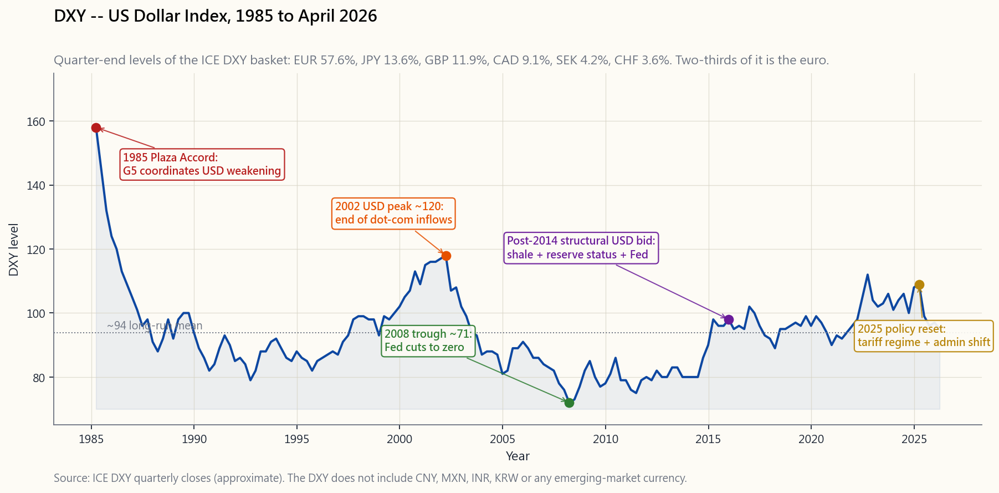
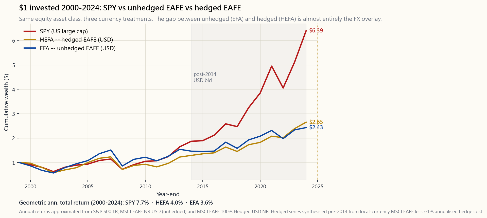

# Week 22: Currency and International Diversification — DXY, FX Hedging, and Why Most US Investors Should Stay Home

---

## Part 1: Reading Section

---

### 1. Why This Is Important

The textbook chapter on international investing reads like a travel brochure. Lower correlations! Untapped growth! Cheaper valuations! Diversify or perish! All of it is academically defensible and operationally misleading for a US-based retail investor in April 2026. The honest version of this lesson, which the textbook will not give you, is that **owning international equities is a position on a foreign currency stapled to a position on foreign equities, and the currency leg routinely overwhelms the equity leg over any horizon you actually care about**.

There are four reasons this lesson exists in spite of the conclusion it lands on.

1. **The DXY is news.** The US dollar index moves the price of everything you own that is denominated in or competes with the dollar — emerging-market debt, gold, oil, Apple's overseas revenue, Treasury demand. You cannot read the financial press without bumping into "dollar strength" and "dollar weakness" headlines, and you should know what they actually measure. The DXY is not "the dollar versus the world"; it is a fixed-weight basket of EUR (57.6%), JPY (13.6%), GBP (11.9%), CAD (9.1%), SEK (4.2%), and CHF (3.6%) — six developed-market currencies, locked at their 1973 weights, untouched since the euro's 1999 retrofit. Two-thirds of it is *Europe*. There is no Chinese yuan, no Mexican peso, no Indian rupee. Knowing that is the first defence against confused commentary.

2. **The currency arithmetic is brutal and asymmetric.** When you buy an unhedged international ETF and the dollar rallies 10% over your holding period, you eat a roughly 10% headwind on top of whatever the foreign equity market did. A flat year for European stocks in euro terms is a -10% year in your USD brokerage statement. Most retail investors have never explicitly priced this overlay, which is why every multi-year USD bull cycle ends with the same blog posts asking why "international" disappointed.

3. **There is a hedged version, and it is not free.** ETFs like HEFA (iShares MSCI EAFE Hedged) and DBEF (Xtrackers MSCI EAFE Hedged) systematically remove the currency overlay using rolling forward contracts. The cost of the hedge is approximately the **interest-rate differential** between the US and the foreign country, plus a small operational drag. With Fed funds at 4.5% and ECB at 2.5% in April 2026, hedging EUR exposure costs you roughly 2% per year before you have earned a single basis point on the equity. Over decades, those hedge costs compound into a real handicap.

4. **The conclusion is contrarian to the textbook.** The world's best-in-class businesses — chip design, hyperscale cloud, payments, biotech, defence majors — are disproportionately US-listed. The S&P 500 already has roughly 40% of its revenue coming from outside the US, so you are buying global earnings via American legal protection and dollar settlement. Adding broad EXUS (ex-US) exposure layers a currency overlay and a governance discount on top of earnings you largely already own. For most US-based retail readers, the right size for international exposure is **5-15% of equity**, **hedged**, used as a small diversifier rather than a strategic pillar. This week will walk you through *why* that is the conclusion, not just hand it to you.

The travel brochure argues for a 30-40% international weight. The plumbing argues for closer to zero. This lesson lands in between, with the bias toward zero.

---

### 2. What You Need to Know

#### 2.1 The DXY Basket — Six Currencies, Frozen Weights

The US Dollar Index (ticker DXY, futures symbol DX) is published by ICE Futures and goes back to March 1973, when it was set at 100 against a basket of ten currencies. After the euro absorbed the German mark, French franc, Italian lira, Dutch guilder, and Belgian franc in 1999, the index was reduced to the six survivors. The weights have not been updated since:

- **EUR — 57.6%.** The combined euro replaced five of the original ten currencies and inherited their summed weight. Two-thirds of the DXY is, effectively, "the euro relative to the dollar."
- **JPY — 13.6%.** Japan was the second-largest US trading partner in 1973, and the weight has stuck.
- **GBP — 11.9%.** The pound's weight reflects pre-euro London-as-financial-centre, not current trade.
- **CAD — 9.1%.** Canada is by far the US's largest goods trading partner today, but the DXY only gives it 9%.
- **SEK — 4.2%.** Sweden, in 2026, has roughly the trade footprint of New Jersey.
- **CHF — 3.6%.** Swiss franc, the safe-haven satellite.

The chart in `image/week22_dxy_decade.png` plots DXY from 1985 through April 2026, with five regime markers: the **1985 Plaza Accord** that orchestrated the post-1985 dollar decline; the **2002 dollar peak** at ~120 ahead of the dot-com unwind; the **2008 trough near 71** during the financial crisis as the Fed slashed rates; the **post-2014 structural USD bid** that has dominated the last decade; and the **2025 policy-driven reset** as the new administration's tariff regime forced the dollar lower against the basket.

The honest health-warning on the DXY is that **it is not a measure of the dollar**. It is a measure of the dollar against a 1973-frozen basket dominated by Europe. The Fed publishes a properly weighted, trade-broad alternative (the Trade-Weighted US Dollar Index, FRED series `DTWEXBGS`) that includes the Chinese yuan, Mexican peso, Korean won, and other actual trading partners. The broad index moves differently from DXY in any given quarter, and the gap matters when you are sizing FX risk against your actual dollar liabilities. For most retail commentary, however, DXY *is* the dollar — because that is what the screen shows.

#### 2.2 The Currency Overlay — Why Your International ETF Is Two Bets

When you buy `EFA` (iShares MSCI EAFE, the developed-international benchmark), you are taking on two distinct exposures simultaneously:

1. The price action of foreign equities in their **local** currencies (euros, yen, pounds, Swiss francs, etc.).
2. The price action of those currencies versus the **dollar**.

The total USD return for a single year is approximately:

$$ R_{\text{USD}} \approx (1 + R_{\text{local}}) \times (1 + R_{\text{FX}}) - 1 $$

where $R_{\text{FX}}$ is the foreign currency's appreciation versus the dollar. The two effects compound rather than add, but for small-to-moderate moves the simple sum is a fine approximation: a foreign equity market that rises 8% in local currency, in a year when the foreign currency strengthens 5% against the dollar, returns roughly **+13% in USD**. The same equity market, in a year when the foreign currency *weakens* 10%, returns roughly **-2% in USD** — flat equities turned into a loss by the FX leg.

This is not a side effect; it is the dominant story in many years. From 2014 through 2024, US equities (SPY) compounded at roughly 12.5% annualised. Unhedged developed-international (EFA) compounded at roughly 5%. Hedged developed-international (HEFA, MSCI EAFE Hedged) compounded at roughly 8%. The ~3 percentage points per year between EFA and HEFA over that decade was *almost entirely* the dollar overlay — the equities themselves did similar things in their own currencies. Investors who held EFA spent ten years funding a structural short euro / short yen position they did not realise they had. The chart in `image/week22_us_vs_intl.png` makes the picture concrete.

There is one caveat that matters and will not be obvious from the picture. Over a single decade, the FX overlay can be the entire return story. Over very long horizons (30+ years), purchasing-power parity *roughly* anchors major currencies, and the FX overlay's net contribution shrinks toward zero. The investor still has to *survive* the multi-year deviations, which routinely run to ±30% from PPP and last for a decade. "Wash out over decades" is small consolation if the unhedged drag costs you 30% during the years you actually wanted to retire on.

#### 2.3 FX Hedging — How HEFA Works and What It Costs

A currency-hedged ETF removes the FX overlay using **rolling currency forwards**. The fund manager calculates the dollar value of each foreign-currency position, then sells that currency forward (typically one month at a time) and rolls the contract at expiry. The forwards are priced by **covered interest parity**, which says the forward rate equals the spot rate adjusted for the interest-rate differential between the two currencies:

$$ F = S \times \frac{1 + r_{\text{foreign}}}{1 + r_{\text{US}}} $$

When US rates are higher than foreign rates (the typical post-2022 regime), the forward sells the foreign currency at a *lower* implied rate than spot — the hedger earns the rate differential. When US rates are lower than foreign rates (less common; emerging markets often invert this), hedging *costs* the differential. In April 2026:

- **EUR hedge cost:** ~2.0% per year (Fed 4.5% vs ECB 2.5%; the hedger is *paid* the differential, but operational + spread drag offsets most of it; net cost is small but positive).
- **JPY hedge cost:** ~3.5% per year favourable, because Japan still has near-zero rates while the Fed sits at 4.5%. Hedging yen is one of the cheaper hedges in the developed world.
- **GBP hedge cost:** ~0.5% per year, because BoE and Fed have converged.
- **EM currency hedges:** ~5-15% per year *cost*, because EM rates run well above US rates. Hedging EM is almost never worth it; the hedge eats the equity return.

The practical rule: **hedge developed-market FX, do not hedge emerging-market FX**. HEFA and DBEF are the two large developed-international hedged options. For emerging markets, you hold VWO unhedged and accept the currency risk as part of the asset class — there is no clean way to strip it out.

#### 2.4 Japan's Lost Decade vs US Tech — A Cautionary Tale Both Ways

The Nikkei 225 peaked at 38,915 on December 29, 1989. It did not regain that level until February 2024 — a **34-year round trip to flat**. For Western textbook writers, Japan is the standard cautionary tale that "stocks for the long run" can fail in a single market, and the mandatory lesson is to diversify internationally. The conclusion is reasonable. The implementation is harder than the textbook admits.

A US-based investor who bought Japanese equities at the 1989 peak in *yen* terms is still close to break-even over 35 years. The same investor who bought via an unhedged dollar-denominated vehicle had a meaningfully worse experience because the yen weakened roughly 30% against the dollar over the same period. The investor who hedged the yen exposure had a slightly better experience but still spent 25 years underwater. Diversifying *out of* Japan into US equities in 1989 would have produced one of the best 30-year stretches in market history — but only if you had identified Japan as the bubble *at the time*, which the consensus emphatically did not.

The mirror image applies looking forward from April 2026. The S&P 500 has compounded at roughly 13% annualised for the past 15 years, driven by a small handful of US tech megacaps. CAPE sits in the most expensive decile of US-stock-market history (Week 21). It is entirely possible — not predicted, but possible — that the next 15 years for US equities look more like 1990s Japan than the 2010s. The honest defence against that scenario is a small allocation to non-US developed (hedged), a small allocation to emerging (unhedged, sized for ruin), and the four-tranche framework. **Diversification is insurance, not arbitrage.** It costs a little in expected return for a little less variance in possible outcomes. Buying EXUS because "Japan once happened" is a reasonable insurance trade. Buying it because "international should outperform" is a story you cannot defend with the data.

#### 2.5 The Post-2010 Structural Dollar Bid

Something changed around 2011-2014. The DXY broke out of a 30-year range, and despite the Fed cutting to zero, the dollar climbed and stayed there. The structural drivers are not mysterious:

- **The Fed's relative tightness.** Even at zero, US real rates ran higher than European or Japanese real rates because the Eurozone tipped into outright deflation and Japan never escaped it. Capital flows toward the higher real rate.
- **Shale.** The US shale revolution turned the country from the world's largest oil importer into the world's largest producer. The persistent current-account drag from energy imports vanished, removing a chronic supply of dollars from foreign exchange markets.
- **Reserve status.** The 2008 crisis demonstrated that, paradoxically, a US-originated financial crisis still produced a flight *into* dollars rather than out of them. The dollar's reserve role strengthened, not weakened, when its issuer was at the centre of the storm.
- **Big-tech earnings.** US companies repatriated foreign earnings during the 2017 tax reform window and have continued to dominate global capital expenditure. The dollar capex cycle has been disproportionately a US capex cycle.

The 2025 administration's tariff and dollar-policy shift was the first serious challenge to the structural bid in over a decade. The DXY fell ~12% from its early-2025 peak through April 2026. Whether that is the start of a multi-year reset or a tactical retracement inside the longer-term bid is not knowable from the chart alone. What it does mean: **the dollar's direction over the next decade is more uncertain than at any point since the Plaza Accord**. That uncertainty is itself an argument for hedging — both directions of FX surprise hurt, and removing the variable lets you hold international equities for the equity reasons.

#### 2.6 The Honest Conclusion

The four constraints stack on top of each other:

1. **Capital controls and governance** make most emerging-market direct exposure operationally hostile (China, Russia post-2022, India for most US retail accounts, etc.). What is left of EM you mostly hold via VWO, accepting both the equity and currency risk.
2. **The hedge cost** on developed-market international is small but real (~1-2% per year), and over decades that compound into materially less wealth.
3. **Your liabilities are USD-denominated.** Rent, groceries, healthcare, retirement spending — all settle in dollars. Holding unhedged international equity is a structural short on your own home currency, which is the wrong direction of FX bet for someone whose bills are in dollars.
4. **The S&P 500 is already global.** Roughly 40% of S&P revenue comes from outside the US. You are not missing global earnings by holding US-listed stocks; you are accessing them through American legal protection.

The developed-market equity book a serious retail investor should hold is **US-listed companies as the default**, with a small (5-15%) international sleeve held in **hedged form** as a diversifier. Emerging markets, if held at all, sit in a tranche-4 exploration sleeve sized for total loss. The travel-brochure 40% international weight does not survive the four constraints above. The plumbing wins.

The interactive lab `interactive/week22_fx_lab.html` lets you crank the two underlying levers — annual USD strengthening and foreign equity local return — and watch the unhedged versus hedged USD totals diverge in real time, with one-click presets for the 1985 Plaza, 2002 EUR creation, 2014 USD bid, and 2025 reset regimes. Spend ten minutes there before deciding what your international weight should be.

---

### 3. Common Misconceptions

1. **"The DXY measures the dollar against the world."** No — it measures the dollar against six currencies, two-thirds of it the euro, with weights frozen since 1973. There is no yuan, peso, or rupee in it.
2. **"Unhedged international gives me real diversification."** It gives you a foreign equity bet plus a foreign currency bet. The currency leg often dominates the equity leg over any horizon under a decade.
3. **"International is cheap, US is expensive, so international should outperform."** Valuation gaps between regions can persist for 15-25 years (Japan post-1989, Europe post-2010). Cheap can stay cheap, and the FX overlay can swallow the valuation re-rating.
4. **"FX hedging is a free lunch — it just removes risk."** The hedge costs the interest-rate differential. Over a decade of US rates above Eurozone rates, hedging EUR is small drag; over a decade of EM hedging it would be most of your return.
5. **"Emerging markets have higher expected returns."** That is the textbook claim. The realised returns on the MSCI Emerging Markets index from 2008 through 2024 have been miserable (roughly 2% annualised in USD), well below US large-cap and below developed-international.
6. **"The S&P 500 is purely a US bet."** It is 40-45% global by revenue. A weak dollar already helps S&P earnings translation; a strong dollar hurts. You already have currency exposure through US large-caps; adding more via EXUS doubles up.
7. **"I should match my portfolio to global market-cap weights."** This is the classic "global passive" argument. It ignores the four constraints above (governance, hedge cost, USD liabilities, embedded global exposure). The cap-weighted global portfolio is a textbook construct, not an investable plan for a US retail investor.
8. **"Hedging defeats the purpose of international investing."** It defeats one purpose (currency diversification) and preserves another (equity diversification across countries, sectors, central banks). Most of the diversification benefit literature was written before low-cost hedged ETFs existed; updated studies favour hedged.
9. **"PPP says the dollar is overvalued, so EXUS will outperform."** PPP is a 5-15-year anchor at best, and currencies routinely run 30%+ from PPP for a decade. As Keynes put it, the market can stay irrational longer than you can stay solvent — and that is doubly true in FX.
10. **"ADRs are the same as buying the foreign stock."** ADRs trade in USD on US exchanges, but they still carry the underlying currency exposure (the ADR price moves with both the home-market price and the FX rate). They are convenient access; they are not a hedge.

---

### 4. Q&A Section

**Q: How much international should I actually hold?**
A: For most US-based retail readers in April 2026, 5-15% of equity in hedged developed-international (HEFA or DBEF) and 0-5% in emerging (VWO, unhedged), with the remaining 80-95% in US-listed names. The exact number depends on age, liability profile, and whether you can stomach a multi-year underperformance versus pure US. Zero international is a defensible choice. Forty percent international is not, given the constraints in §2.6.

**Q: HEFA or DBEF — which hedged international ETF?**
A: Functionally near-identical. HEFA (iShares, 0.35% expense ratio) is larger and more liquid; DBEF (Xtrackers, 0.36%) is the older product. Pick based on liquidity in your account size. The tracking difference is rounding error.

**Q: Should I hedge emerging markets too?**
A: Almost never. EM hedge costs run 5-15% per year because EM short rates are well above US short rates. The hedge eats the equity return. Hold VWO unhedged and accept that the currency exposure is part of the asset class — or do not hold EM at all.

**Q: What about the yuan? Will it ever be in DXY?**
A: Not in the foreseeable future. ICE has shown no interest in re-weighting DXY, and the contract has $20 billion+ of derivatives priced off the legacy basket. The Fed's broad trade-weighted index (FRED `DTWEXBGS`) does include CNY at ~16% — use that index if you want a dollar measure with the yuan in it. DXY is what the financial press will keep quoting.

**Q: Why did EFA underperform SPY so badly from 2010 to 2024?**
A: Roughly half the gap was the equity itself (US tech compounded faster than European industrials and Japanese financials), and roughly half was the dollar overlay (the dollar rose ~25% against the euro and ~50% against the yen over that window). HEFA cut the gap roughly in half — better, but still well behind SPY. The structural dollar bid was the dominant factor, not stock-picking.

**Q: Is direct foreign-stock ownership different from ETF ownership?**
A: Mechanically the same currency exposure, but with extra friction. Buying Toyota directly on the Tokyo exchange requires a JPY brokerage account, JPY funding, withholding tax forms, and worse spreads than the TM ADR. For a retail investor, ADR (TM, NSRGY, SHEL, etc.) or hedged ETF (HEFA) is essentially always the right choice — direct foreign-exchange ownership pays no extra premium for the extra paperwork.

**Q: The DXY chart shows a 12% drop from early 2025 — does that mean unhedged international is now the trade?**
A: It means unhedged international has *already* outperformed hedged international over the last twelve months. Whether that continues depends on whether the 2025 reset is the start of a multi-year dollar bear or a tactical retracement inside the longer-term bid. Trying to time which it is, is exactly the sort of macro call you cannot reliably win — the market can stay irrational longer than you can stay solvent. The honest answer: hold the hedged base position, and add a small unhedged sleeve only if you have a specific FX thesis you can defend.

**Q: What about the European Stoxx 600 vs MSCI EAFE? Are they interchangeable?**
A: Stoxx 600 is Europe-only; EAFE includes Japan, Australia, and Hong Kong (with all the usual caveats on HK governance and capital controls). For a US investor wanting one developed-international exposure, EAFE-based ETFs (EFA / HEFA / IEFA) are the more diversified default. Pure-Europe ETFs (FEZ, IEUR) make sense only if you have a specific Europe-only thesis.

**Q: Does the post-2008 quantitative-easing regime change the international diversification math?**
A: Yes, materially. Coordinated central-bank action (Fed, ECB, BoJ all easing or tightening together) has driven equity correlations across developed markets above 0.8 — much higher than the pre-2008 ~0.6 the textbook studies were built on. You get less diversification benefit from EXUS in the QE-era than the academic literature suggests, which is another reason to size the international sleeve small.

**Q: Should I use ACWI as a one-fund global solution?**
A: ACWI (iShares MSCI ACWI, ~0.32% expense ratio) holds ~3,000 global names cap-weighted. It is roughly 60% US, 30% developed-international (unhedged), and 10% emerging. For a reader who wants a *single* equity ETF and refuses to think about geographic weights, ACWI is defensible. For anyone willing to think about it for ten minutes, the right shape is "VOO + small HEFA + tiny VWO" with explicit weights — same exposure with hedged developed and lower expense ratios.

**Q: What FX-related signals actually matter for portfolio decisions?**
A: Three: (1) the **interest-rate differential** between the US and the foreign country (predicts hedge cost over the next year), (2) the **PPP gap** (5-15-year mean-reversion anchor), and (3) the **direction of the broad trade-weighted dollar** (DTWEXBGS, not DXY) over the past 12 months (momentum signal — every market has a momentum reading and a mean-reversion reading, and you choose your playbook by regime). DXY itself is a news-watch instrument, not a decision input.

---

## Part 2: YouTube Script

---

**VIDEO TITLE:** Why Most US Investors Should Stay Home — DXY, FX Hedging, and the Honest International Allocation
**RUNTIME TARGET:** ~18 minutes
**HOSTS:** Horace, Stella

---

**[INTRO — cold open, 0:00-0:45]**

**STELLA:** The investing textbook tells you that international diversification is a free lunch. Lower correlations, broader opportunity set, cheaper valuations.

**HORACE:** And then you go look at the actual returns of EFA versus SPY since 2010, and you realise the textbook left out a couple of things.

**STELLA:** Today we are going to walk through what was left out. The DXY index — what it actually measures, which is mostly the euro. The FX overlay that sits on top of every unhedged international ETF. The hedged version, and what it costs.

**HORACE:** And we land on a number. For most US-based retail investors in April 2026, the right international weight is 5 to 15 percent, hedged. Not the 30 to 40 percent the textbook gives you.

**[VISUAL: title card, week 22 banner]**

---

**[SECTION 1 — DXY, 0:45-3:30]**

**HORACE:** Let's start with what the DXY actually is, because most people get this wrong.

**STELLA:** DXY. US Dollar Index. The number you see on financial TV when they say "the dollar was up half a percent."

**HORACE:** Right. And it is *not* the dollar against the world. It is the dollar against six currencies, with weights that were frozen in 1973 and adjusted exactly once when the euro absorbed five of the original ten currencies in 1999. Since then — nothing.

**STELLA:** Walk us through the basket.

**HORACE:** Euro, fifty-seven point six percent. Yen, thirteen point six. Pound, eleven point nine. Canadian dollar, nine point one. Swedish krona, four point two. Swiss franc, three point six. Add them up — a hundred percent — and you'll notice what is missing.

**STELLA:** Yuan. Peso. Rupee.

**HORACE:** None of them. The DXY does not include China, does not include Mexico, does not include India. It is, structurally, a measure of the dollar against developed Europe plus Japan, with a frozen 1973 trade pattern.

**STELLA:** So when commentators say "the dollar is strong" or "the dollar is weak" based on the DXY —

**HORACE:** — they mostly mean "the dollar is strong against Europe." Which is a fine sentence to say. It is just not the same sentence as "the dollar is strong."

**[VISUAL: image/week22_dxy_decade.png]**

**HORACE:** Here is the DXY from 1985 through April 2026. Five regime markers. Far left — 1985 — the Plaza Accord. The G5 finance ministers meet at the Plaza Hotel in New York and coordinate to weaken the dollar, which had run up to 165 on the basket in early 1985. The dollar sells off for the next eight years.

**STELLA:** The 2002 peak.

**HORACE:** Around 120, late 2001 into early 2002. End of the dot-com boom, US capital inflows finally exhaust themselves, dollar rolls over for six years.

**STELLA:** 2008 trough.

**HORACE:** Seventy-one. Lowest the DXY has been in our lifetime. Fed cuts to zero, balance sheet quadruples, dollar gets crushed. Then —

**STELLA:** Post-2014.

**HORACE:** This is the structural shift. From 2014 forward, the DXY breaks out of its long-term range and stays there for a decade. We will come back to why.

**STELLA:** And the recent move.

**HORACE:** 2025. The new administration's tariff and dollar-policy shift. DXY drops twelve percent from its early-2025 peak through April 2026. First serious challenge to the post-2014 bid.

---

**[SECTION 2 — the FX overlay, 3:30-7:00]**

**STELLA:** OK. So we know what the DXY is. Now let's talk about why it matters to a portfolio.

**HORACE:** When you buy EFA — the iShares MSCI EAFE ETF, the standard developed-international vehicle — you are taking on two distinct exposures.

**STELLA:** One: the foreign equity itself, in its local currency.

**HORACE:** Two: the foreign currency itself, against the dollar. Both have to go up for your USD return to look good. Either one going down is enough to ruin the year.

**STELLA:** Give us the arithmetic.

**HORACE:** Suppose you buy a European equity fund. European stocks, in euro terms, return plus eight percent that year. Good year. Meanwhile the euro strengthens five percent against the dollar. Your total USD return — multiplying through, one-point-zero-eight times one-point-zero-five minus one — is about thirteen point four percent. The currency added five points to your equity return.

**STELLA:** And the bad version.

**HORACE:** Same eight percent in euros. But this time the euro *weakens* ten percent against the dollar. One-point-zero-eight times zero-point-nine, minus one — minus two-point-eight percent. Eight percent of equity return turned into a small loss by the FX leg.

**STELLA:** Show us what this looks like in practice.

**[VISUAL: image/week22_us_vs_intl.png]**

**HORACE:** This is one dollar, invested in three things, from January 2000 through December 2024. SPY — US large cap. EFA — unhedged developed-international. HEFA — hedged developed-international. The first decade — 2000 through 2009 — EFA actually beats SPY. The dollar was weakening, the FX overlay added returns, and US stocks went through the dot-com bust. The textbook diversification story works.

**STELLA:** Then 2010.

**HORACE:** Look at what happens after 2014. SPY goes vertical. EFA — unhedged — basically goes sideways. HEFA — hedged — does meaningfully better than EFA, but still well below SPY. The gap between EFA and HEFA is the cost of holding the unhedged dollar overlay during a decade of rising dollar.

**STELLA:** That's not a small number.

**HORACE:** Roughly three percentage points of compound return per year, for a decade. Ending wealth gap of fifty-plus percent between the two international flavours. And almost all of it was FX — the equities themselves did similar things in their own currencies.

---

**[SECTION 3 — hedging, 7:00-10:00]**

**STELLA:** OK so HEFA exists. How does it actually work? What does the hedge cost?

**HORACE:** The fund manager calculates the dollar value of every foreign-currency position, then sells that currency forward — typically one month at a time — and rolls the contract at expiry. The forward rate is set by covered interest parity.

**STELLA:** Plain English.

**HORACE:** The forward price is the spot price adjusted for the interest rate differential. If US rates are higher than Eurozone rates, when you sell euros forward you sell them at a *lower* implied rate than spot. Which means — and here is the key point — when US rates are above foreign rates, the hedge actually pays you a small carry. It is not free, because there are operational costs and bid-ask, but it is much closer to free than people think.

**STELLA:** So in April 2026 —

**HORACE:** Fed at four-point-five, ECB at two-point-five. The EUR hedge mechanically earns you two points of differential, minus maybe one and a half points of operational drag and tracking error, net cost something like half a percent per year. Yen hedge — Japan still near zero, Fed at four-five — actually earns you carry. Hedging yen in 2026 is *cheaper* than holding it unhedged.

**STELLA:** What about emerging markets?

**HORACE:** Almost the opposite. EM short rates run five to fifteen points above the Fed in most years. To hedge a Brazilian real position you would have to *pay* the real-dollar differential, which can be ten percent a year. The hedge eats the equity return. Rule of thumb: hedge developed, do not hedge emerging.

---

**[SECTION 4 — Japan and the cautionary tale, 10:00-12:30]**

**STELLA:** Let's do the textbook example everyone trots out. Japan.

**HORACE:** Nikkei peaks December 1989 at thirty-eight thousand nine hundred and fifteen. Doesn't get back to that level until February 2024. Thirty-four years to break even on the local index.

**STELLA:** And the textbook says diversification away from Japan into something like the S&P would have rescued you.

**HORACE:** It would have. Best 30-year stretch in S&P history. Buying Japan in 1989 was the worst trade of the late twentieth century.

**STELLA:** What is the catch.

**HORACE:** You had to *know*, in 1989, that Japan was the bubble. The consensus at the time — Western finance ministers were studying MITI as the model for industrial policy. The Nikkei had compounded at twenty-plus percent for a decade. Diversifying out of Japan in 1989 was a contrarian, bordering-on-heretical, call.

**STELLA:** And you're telling me the same thing applies to US tech today.

**HORACE:** I am not predicting the next thirty years for US large-cap looks like Japan. I am telling you the *possibility* that it does is non-trivial, and the honest defence against that scenario is a small allocation to something else. Hedged developed-international is the cleanest "something else" available to a US retail investor. The four-tranche framework has the small international sleeve sitting in tranche two or three, sized for diversification, not sized to win.

---

**[SECTION 5 — interactive, 12:30-15:00]**

**STELLA:** We built an interactive lab for this week. Walk me through it.

**[VISUAL: interactive/week22_fx_lab.html]**

**HORACE:** Two sliders. Top one — USD strengthening per year, minus ten to plus ten percent. Bottom one — foreign equity local-currency return, minus twenty to plus thirty percent. The output panel shows three numbers: USD-equivalent unhedged return, hedged return after a one percent annualised hedge cost, and the difference.

**STELLA:** Below that —

**HORACE:** Bar chart, side by side, of the unhedged and hedged USD totals. And four scenario buttons across the top — 1985 Plaza, 2002 EUR creation, 2014 USD bid, 2025 reset — that snap the sliders to historically representative values.

**STELLA:** What's the takeaway.

**HORACE:** Move the USD slider toward plus ten percent — strong dollar — and watch the unhedged bar collapse while the hedged bar holds its ground. Move it toward minus ten — weak dollar — and the unhedged bar runs ahead while the hedged bar plods along. The 2014-USD-bid preset shows you the decade most US investors actually lived through; the 2025-reset preset shows you what an unhedged regime change looks like.

---

**[SECTION 6 — the conclusion, 15:00-17:00]**

**STELLA:** Bring it home. What weight should I hold?

**HORACE:** The constraints stack up, and they are all pointing the same direction.

One. Capital controls and governance — China is uninvestable for our purposes, India is operationally hostile for most US retail accounts, Russia is closed. Most of EM is gated.

Two. Hedge cost — small but real on developed, prohibitive on emerging.

Three. Your liabilities are USD. Rent, groceries, retirement — all in dollars. Holding unhedged international is structurally short your own home currency, which is the wrong direction of FX bet for someone whose bills are denominated in dollars.

Four. The S&P 500 is already forty percent global by revenue. You are not missing global earnings; you are accessing them through American legal protection.

**STELLA:** So the number is —

**HORACE:** Five to fifteen percent of equity in hedged developed-international, zero to five in emerging if at all, and the rest in US-listed names. The US market *is* the global market for a serious retail investor in 2026. EXUS is a small diversifier, not a strategic pillar.

**STELLA:** That is the opposite of what the textbook says.

**HORACE:** The textbook was written before the post-2014 dollar bid, before 0.03 percent expense ratios on SPY, before the Mag-7 earnings concentration. The world is different. The honest allocation is different.

---

**[OUTRO — 17:00-18:00]**

**STELLA:** Recap. DXY is six currencies, two-thirds euro, frozen 1973 weights. Unhedged international is two bets — equity plus FX — and the FX leg dominates over horizons under a decade. Hedged international removes most of the FX overlay at a small annualised cost. Five to fifteen percent EXUS, hedged, is the honest number for most US retail readers.

**HORACE:** Next week — Week 23 — we move to the bond side and rebuild duration, convexity, and the yield-curve shapes that drive everything from your mortgage to the regional-bank crisis.

**STELLA:** See you then.

**[VISUAL: end card]**
