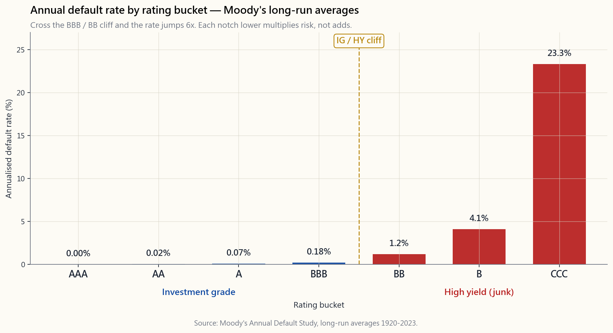
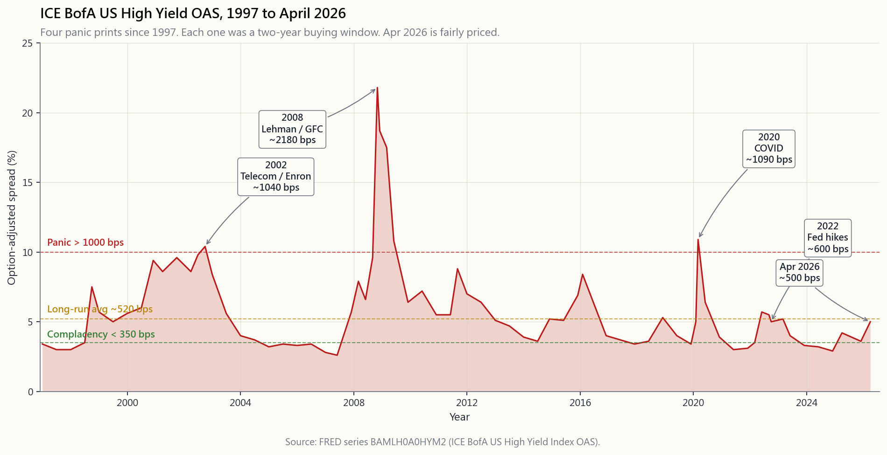

# Week 33: Credit Analysis — Investment Grade, High Yield, and the Spread

---

## Part 1: Reading Section

---

### 1. Why This Is Important

Week 5 introduced the bond contract and the price-yield curve. Week 8 looked
at the income statement that funds the coupons. This week we put those two
together and ask the only question that matters in corporate credit: **will
the borrower actually pay you back, and what is fair compensation for the
chance that they won't?**

Credit is the part of fixed income where the math stops being arithmetic and
starts being probability. A 10-year Treasury at 4.4% is — in nominal dollars
— a riskless cash flow. A 10-year BB-rated bond at 4.4% + 320 bps = 7.6% is
a *distribution* of cash flows, where the right tail is "you collect every
coupon and your face back" and the left tail is "the issuer files Chapter 11
in year 4 and you recover 40 cents on the dollar in restructuring." The
320 bps spread is the market's price for that distribution.

Four reasons this lesson earns its place.

1. **Spreads are the bond market's volatility index.** Equity vol gets the
   headlines (the VIX), but the high-yield option-adjusted spread —
   `BAMLH0A0HYM2` on FRED — is arguably a better leading indicator. It blew
   through 2,000 bps in November 2008, well before equities bottomed in
   March 2009. It hit 1,100 bps in March 2020, days before the equity low.
   The volatility tail wags the dog: when the credit tail is screaming,
   the equity dog is about to follow.
2. **The investment-grade / high-yield boundary is not a gradient — it is a
   cliff.** A bond rated BBB- is held by every pension fund, mutual fund,
   and insurance company on earth, often by mandate. Cut it one notch to
   BB+ and a wave of forced sellers hits. The rating-agency boundary
   (Baa3/BBB-) is the most important price discontinuity in fixed income.
3. **High yield is an alpha source, not just a coupon stream.** The real
   alpha sources — information, structure, time horizon, illiquidity, and
   behavioural — all show up here. HY bonds compensate you for *all five* —
   under-researched, structurally avoided by IG-only mandates, illiquid
   through stress, and behaviourally dumped at the worst time. Buying HY at
   1,000 bps is one of the few asymmetric trades a retail investor can find
   without leverage.
4. **You will not understand any "balanced" portfolio without knowing where
   its bond sleeve sits on the rating curve.** Most "core bond" funds (AGG,
   BND) are 100% IG. Most "income" funds (HYG, JNK) are 100% HY. The risk
   profile of those two sleeves under a recession is not even close.
   Confusing them — buying yield without seeing the rating — is how
   retirees blow up in year 1.

---

### 2. What You Need to Know

#### 2.1 The Rating Ladder

Three agencies — Moody's, S&P, and Fitch — publish letter ratings that slot
every issuer into one of about twenty buckets. The buckets that matter for
a US investor are:

| Tier               | S&P / Fitch       | Moody's          | Plain-English meaning                                         |
|--------------------|-------------------|------------------|---------------------------------------------------------------|
| Investment grade   | AAA, AA, A, BBB   | Aaa, Aa, A, Baa  | Default unlikely in normal times. Pension-fund eligible.      |
| High yield ("junk") | BB, B, CCC       | Ba, B, Caa       | Default is a real probability. Speculative.                   |
| Distressed         | CC, C, D          | Ca, C, D         | Default imminent or already happened.                         |

The line between BBB- and BB+ is the **investment-grade / high-yield
divide**. Index providers and most regulated investors treat that line as a
binary cliff. A Friday-afternoon downgrade across that line can blow out a
bond's spread by 100-300 bps in a single session — not because the business
changed but because the *holder base* has to change.

For the rest of the lesson we collapse the ladder to seven buckets (AAA,
AA, A, BBB, BB, B, CCC) — the granularity that actually shows up in default
statistics.

#### 2.2 What the Rating Predicts: Annual Default Rates

Moody's publishes an annual study of historical default rates by rating
bucket, going back to 1920. The long-run averages are striking:

A AAA-rated bond defaults roughly **never** in any one year. A BBB-rated
bond — the lowest IG bucket — defaults at about 0.18% per year, less than
one in five hundred. Cross the cliff into BB and the rate jumps to about
1.16%, then to 4.1% at single-B, and to 23.3% at CCC. **The progression is
non-linear** — each notch down doesn't just add risk, it multiplies it.

Three caveats. First, these are *long-run averages*. In a recession year,
BB defaults can hit 4-6% and CCC can hit 35-45%. Tails dominate. Second, the averages assume cycles repeat — they include
1932 and 2008. Use them as a base rate, not a forecast. Third, default ≠
total loss. Recovery is the second leg.

#### 2.3 Recovery Rates and Expected Loss

When an issuer defaults, bondholders don't go to zero. They go through
restructuring (Chapter 11 in the US) and recover some fraction of par based
on **seniority** in the capital stack:

- Secured debt:        ~65-70% recovery
- Senior unsecured:    ~38-42% recovery (the canonical "40%")
- Subordinated:        ~25-30% recovery
- Preferred / equity:   0-10% recovery

The math an analyst actually does is the **expected loss (EL)** per year:

$$ EL = PD \times LGD = PD \times (1 - R) $$

where $PD$ is annualised default probability and $R$ is recovery rate. For
a senior unsecured single-B bond:

$$ EL = 4.1\% \times (1 - 40\%) = 4.1\% \times 0.60 = 2.46\% \text{ per year}. $$

That 2.46% is the *credit-loss tax* on the bond's stated yield. If the
B-rated bond yields Treasury + 425 bps, the **expected** excess return is
425 - 246 = 179 bps. The remaining 179 bps is the liquidity premium plus
the risk premium — your compensation for *bearing* the default distribution
rather than just paying out its mean.

#### 2.4 The Anatomy of a Spread

Putting it together, the spread of a corporate bond over a maturity-matched
Treasury decomposes into three components:

$$ \text{Spread} = \underbrace{PD \cdot (1-R)}_{\text{expected loss}} + \underbrace{\pi_{\text{liq}}}_{\text{liquidity}} + \underbrace{\pi_{\text{risk}}}_{\text{risk premium}}. $$

For investment grade, expected loss is tiny (<10 bps for AA, ~30 bps for
BBB) and the bulk of the spread is liquidity + risk premium. A BBB bond
trading at 130 bps over Treasuries is paying you ~25 bps of expected-loss
compensation and ~105 bps of "I had to hold this through 2008 without
forced selling" premium.

For high yield, the expected-loss component is the *majority* of the spread
in normal times. A B-rated bond at 425 bps is split roughly 250 bps loss /
175 bps premium. In recessions the proportions invert: the spread blows out
to 800-1,500 bps but the realised loss only doubles, so the risk premium
dominates and forward returns are spectacular for those buying the panic.

#### 2.5 The BAA and HY Series: Reading the Tape

Two FRED series give you a real-time read on the credit cycle:

- **`BAA10Y`** — the spread of Moody's BAA (lowest IG) corporate yield over
  the 10-year Treasury. Long-run average ~190 bps. Below 150 bps is "credit
  complacency"; above 350 bps is recession pricing.
- **`BAMLH0A0HYM2`** — the ICE BofA US High Yield Index option-adjusted
  spread. Long-run average ~520 bps. Below 350 bps is "reach for yield";
  above 1,000 bps is genuine panic.

Below is the high-yield series since 1997. Notice the four spike events:

- **2002**, ~1,000 bps. Telecom and accounting-fraud collapse (WorldCom,
  Enron). HY had been issued aggressively to telecom and energy through
  1998-2001; the implosion forced the market to mark to reality.
- **2008**, ~2,180 bps at the November peak. Lehman, money-market freeze,
  no bid for risk. The all-time wide on this series.
- **2020**, ~1,100 bps in mid-March. COVID lockdowns; spreads round-tripped
  in 90 days as the Fed announced it would buy IG and HY ETFs.
- **2022 Q4**, ~600 bps. The fastest Fed hiking cycle in 40 years dragged
  HY duration losses on top of widening spreads — the rare "rates and
  credit lose together" tape.

Apr 2026 reading: HY OAS is back near its long-run average — neither the
1,000-bps "buy with both hands" tape of 2020 nor the 350-bps "reach for
yield" tape of 2007 or 2021. A boring, fairly-priced credit market.

#### 2.6 What This Means for the Retail Investor

Three practical takeaways.

1. **Don't buy HY at sub-400 bps spreads.** That's the "complacency" zone —
   you're being paid less than the historical expected loss for B-rated
   paper. The barbell answer: when HY is rich, the right move is
   Treasuries on one side and equity beta on the other, not stretching for
   50 bps in junk.
2. **Do buy HY at 800+ bps spreads, with size.** Every 800-bps wide print
   since 1997 has been a 2-year buying opportunity. Behavioural alpha is
   real; HY-at-panic is the cleanest expression of it that doesn't require
   options or shorting.
3. **Use ETFs, not single names.** Default risk on a single B-rated bond is
   binary; on an index of 1,500 of them it's a smooth statistical process.
   HYG and JNK are the canonical high-yield ETFs; LQD is the canonical IG
   ETF. Stick to US-listed instruments — those are the ones a retail
   investor can actually use.

The interactive lets you turn each of the levers — maturity, coupon,
Treasury yield, spread, default probability, recovery rate — and watch
implied price, credit-adjusted YTM, expected return, and breakeven default
rate move. Try the 2008 preset: 10y, 6% coupon, 4% Treasury, 1,800 bps
spread, 6% PD, 40% recovery. The expected return is still +9% per year.
That's what panic looks like in the math.

[Open the interactive credit pricer →](interactive/week33_credit_pricer.html)

---

### 3. Common Misconceptions

1. **"Investment grade is safe."** IG defaults are rare but recoveries are
   not 100%. Lehman was A-rated 18 months before it went to zero. IG
   protects you against default *frequency*, not default *severity*.
2. **"High yield is always overpaid for the risk."** Long-run, HY has
   delivered ~200-300 bps per year over Treasuries net of defaults. Not
   spectacular, but real, and uncorrelated to the equity premium in a
   useful way.
3. **"BBB and BB are basically the same."** BBB is in every pension bucket;
   BB is in none of them. The cliff is institutional, not credit-fundamental,
   but it dictates the trading dynamics.
4. **"Credit spreads predict recessions."** They predict *credit stress*.
   Sometimes that's a recession (2008), sometimes a sector blow-up (2002),
   sometimes a vol shock (March 2020). Treat them as stress indicators, not
   GDP forecasts.
5. **"40% recovery is a constant."** It's a long-run mean. Recoveries were
   ~25% in 2008-2009 (too many bonds in restructuring at once) and ~55% in
   2003-2007 (light default flow, recoveries clear faster).
6. **"Higher yield means higher return."** Higher *gross* yield. After the
   expected-loss tax, a CCC bond at 1,500 bps over Treasuries may have a
   *lower* expected return than a BB at 350 bps — because the 25% PD eats
   more than the spread compensates.
7. **"Treasuries have no credit risk so they have no risk."** Duration risk
   is not credit risk. 2022 Treasuries lost 17% in price terms. The risks
   are different but neither is zero.
8. **"HY ETFs always recover."** The ETF wrapper does, the underlying bonds
   usually do — but holders who sell at the panic print do not. The market
   can stay irrational longer than you can stay solvent — size your HY
   position for the path, not the endpoint.

---

### 4. Q&A

**Q1. What's the difference between a credit spread and a yield spread?**
A. They're the same number expressed two ways. "Spread" usually means the
bond's option-adjusted yield minus the matched-maturity Treasury, quoted in
basis points. "Yield spread" sometimes means the difference between two
corporate yields (e.g., HY minus IG). Read the legend.

**Q2. Why does the BAA spread bottom around 150 bps even when defaults are
zero?**
A. Liquidity premium and risk premium don't go to zero. Even a perfectly
safe corporate has to compensate you for being less liquid than a Treasury
and for the fact you can't refinance it instantly. 150 bps is roughly the
floor across cycles since 1980.

**Q3. Should I prefer individual bonds or a bond ETF?**
A. For Treasuries it doesn't matter much (no credit risk, deep liquidity).
For corporates, retail investors should use an ETF. Single bonds have wide
bid-ask, lumpy default risk, and a knowledge edge that favours the dealer.
Alpha is rare — single-name credit alpha is one of the rarest forms.

**Q4. What's the biggest risk holding HYG through a recession?**
A. Forced selling at the spread peak. The fund itself is fine (it can hold
defaulted bonds through restructuring), but if you panic-sell at 1,500 bps
wide, you crystallise the loss before the recovery. Size for the tape, not
the average.

**Q5. Are credit ratings reliable?**
A. Reasonably, with three caveats. (1) They lag — rating changes follow
market spreads, not lead them. (2) Structured products were mis-rated in
2007. (3) Sovereign ratings have a political bias. For plain-vanilla US
corporates, the rating is a useful starting point.

**Q6. What does "fallen angel" mean?**
A. A bond that was IG at issue and got downgraded to HY. The interesting
thing is the technical cliff: the IG-only fund universe must sell it, the
HY universe is just absorbing it. Spreads usually overshoot on the way
down — there's a structural alpha source here for patient buyers.

**Q7. How do I decompose a 320-bps spread?**
A. Look up the rating bucket's annualised default rate (e.g., BB ~1.2%),
multiply by (1 - 40%) for senior unsecured = 72 bps of expected loss. The
remaining 248 bps is liquidity + risk premium. If the bond is secured,
expected loss is ~36 bps and the premium grows.

**Q8. Why are HY spreads measured option-adjusted?**
A. Most HY bonds are callable. The issuer's call option reduces what the
holder will earn if rates fall, so a naive yield-to-maturity overstates
expected return. Option-adjusted spread (OAS) strips the call option's
value out so you can compare bonds on a like-for-like basis. Both
`BAMLH0A0HYM2` and modern IG indices are quoted OAS.

**Q9. What's the right HY weight in a portfolio?**
A. Think of the portfolio as four tranches. HY belongs in the "yield" tranche
alongside BBB IG, REITs, and option-income strategies — not in the Treasury
sleeve. A 5-15% HY weight is reasonable for a moderate portfolio; size up
only when spreads are above 800 bps.

**Q10. Did 2022's HY drawdown follow the script?**
A. No. Spreads only widened to ~600 bps but rates rose 4%, so duration and
spread losses compounded. Realised default losses stayed near long-run
averages (~3% in 2023). The lesson: HY is short rate duration too — the
2022 tape isolated the rate leg from the credit leg in a way the textbook
doesn't always emphasise.

**Q11. Are leveraged loans a substitute for HY?**
A. Similar credit risk (mostly B-rated borrowers), but floating-rate
coupons. They've outperformed when rates rose (2022) and underperformed
when rates fell (2020 Q1). Different rate-duration profile, same
credit-duration profile. BKLN is the retail vehicle.

**Q12. When credit spreads tighten and equity vol rises, what does that
mean?**
A. Usually a bullish signal in disguise. Credit leads equity vol — if HY is
unfazed, the equity vol shock is probably positioning, not fundamentals.
The opposite divergence (credit widening, equity calm) is the red flag —
that was July 2007 in real time.

---

## Part 2: YouTube Script

---

**VIDEO TITLE:** Investment Grade vs Junk — Reading the Credit Curve | Week 33
**RUNTIME TARGET:** ~18 minutes
**HOSTS:** Horace, Stella

---

### INTRO (0:00 - 1:40)

[VISUAL: title card "Week 33 — Credit Analysis"]

**HORACE:** Welcome back. Stella, last week we broke down corporate
finance — capital structure, WACC, why a CFO chooses debt over equity.
This week is the other side of that handshake. The lender's side.

**STELLA:** Right. If a CFO issues a bond at Treasury plus three hundred
basis points, *somebody* has to buy it. What is that buyer actually paying
for? That's the whole topic this week.

**HORACE:** Three things. The rating ladder — AAA down to CCC. The default
rates that come with each rung. And the spread — the compensation you
receive for sitting on top of those default rates.

**STELLA:** And then the tape. We'll look at the high-yield spread since
1997. Four panics, and exactly what each one paid you to step in.

[VISUAL: image/week33_default_rates.png — fade in]

---

### SEGMENT 1 — THE LADDER (1:40 - 4:30)

**HORACE:** Let me start with the cliff. Investment grade ends at BBB
minus. Below that — BB plus and lower — is high yield, junk, speculative
grade, whatever you want to call it. Same bond.

**STELLA:** And the cliff is institutional. Pension funds, most insurance
mandates, lots of mutual funds — they can only hold IG. So when a bond
crosses the line down, half its holder base has to sell.

**HORACE:** That's right. It's not credit fundamentals creating the cliff,
it's holder mandates. But the price effect is real — a downgrade across
that line can blow a bond's spread out by a hundred to three hundred basis
points in a session. Fallen angels are a structural alpha source for that
exact reason — the IG universe is forced to sell, the HY universe is
calmly absorbing.

[VISUAL: image/week33_default_rates.png — full screen]

**STELLA:** Look at the chart. AAA, basically zero. AA, two basis points.
A, seven. BBB, eighteen. Then we cross the line — BB jumps to one hundred
sixteen. B, four hundred ten. CCC, two thousand three hundred thirty.

**HORACE:** Each notch isn't adding risk, it's multiplying it. CCC is not
"a bit worse than B." It's six times worse. And those are long-run
averages. In 2008-2009 CCC defaults hit forty-five percent in a single
year.

---

### SEGMENT 2 — RECOVERY AND EXPECTED LOSS (4:30 - 7:30)

**STELLA:** Default isn't zero, though. Where do bondholders end up after
Chapter 11?

**HORACE:** Senior unsecured — the big bucket of corporate debt — recovers
about forty cents on the dollar on average. Secured debt recovers
sixty-five to seventy. Subordinated, twenty-five. Equity, zero.

**STELLA:** So the math an analyst actually does is — probability of
default times one minus recovery — which gives expected loss per year.

**HORACE:** Right. Single B bond. Default probability four-point-one
percent. Recovery forty percent. Loss given default is sixty percent.
Multiply: two-point-five percent expected loss per year.

**STELLA:** And the bond yields, what — Treasury plus four-twenty-five?

**HORACE:** Roughly. So your *expected* excess return after the credit
loss tax is one-eighty basis points. Not four-twenty-five. The other
two-fifty is paying for losses you actually expect to take in a rolling
sample. The one-eighty is the actual reward for bearing the distribution.
That distinction is everything.

---

### SEGMENT 3 — DECOMPOSING THE SPREAD (7:30 - 10:00)

**STELLA:** So when I look at a corporate bond at "two hundred basis points
over treasuries," what fraction is actually compensation?

**HORACE:** Three pieces. Expected loss — that's the credit math.
Liquidity premium — you can't sell this in five seconds like a Treasury.
And risk premium — you have to live through the path, which includes 2008
prints.

**STELLA:** So a BBB at one-thirty over —

**HORACE:** Expected loss is maybe twenty-five basis points. The other
hundred and five is liquidity plus risk premium. Mostly risk premium —
holding through stress with no forced selling.

**STELLA:** And a single B at four-twenty-five?

**HORACE:** About two-fifty expected loss, one-seventy-five premium. HY's
premium is smaller as a fraction. You're being paid more in absolute terms
but less in relative terms.

**STELLA:** Until panic.

**HORACE:** Until panic. Then everything inverts.

---

### SEGMENT 4 — THE TAPE (10:00 - 13:30)

[VISUAL: image/week33_hy_spread_history.png]

**HORACE:** This is the ICE BofA US High Yield index option-adjusted
spread, FRED ticker BAMLH0A0HYM2. Daily, since 1997. It's the credit
market's vol index.

**STELLA:** Long-run average around five-twenty. Below three-fifty is
"reach for yield." Above one thousand is real panic.

**HORACE:** Four panics on this chart. 2002 — telecom and accounting
fraud, WorldCom, Enron. Spread to one thousand. 2008 — Lehman, money
market freeze, no bid. Spread to twenty-one-eighty in November. The
all-time wide. 2020 — COVID. Spread to eleven hundred in mid-March,
round-tripped in ninety days when the Fed said they'd buy ETFs. 2022 Q4 —
fastest Fed hiking cycle in forty years, six hundred wide.

**STELLA:** Each one of those was a buying opportunity.

**HORACE:** Every single one. Behavioural alpha at work. And the
volatility tail wags the dog — when credit is screaming, equities are
about to follow. The 2008 spread peak was November 2008. Equities
bottomed March 2009. Credit led by four months.

**STELLA:** And April 2026?

**HORACE:** Right around five hundred. Boring. Fairly priced. Neither
buy-with-both-hands nor reach-for-yield. Wait.

---

### SEGMENT 5 — THE INTERACTIVE (13:30 - 16:30)

[VISUAL: interactive/week33_credit_pricer.html]

**STELLA:** Open the credit pricer. Six sliders — maturity, coupon,
Treasury yield, credit spread in basis points, default probability, and
recovery rate.

**HORACE:** Let's load the 2008 panic preset. Ten-year. Six percent coupon.
Four percent Treasury. Eighteen-hundred-bps spread. Six percent default
probability. Forty percent recovery.

**STELLA:** Implied price — about sixty-eight cents on the dollar.
Credit-adjusted YTM — twelve percent. Expected return after default losses
— still about nine percent per year.

**HORACE:** Nine percent per year for ten years, on a portfolio that's
down thirty cents on entry. That's what panic prints. The *forward*
expected return is enormous. But you have to be holding already, or
willing to step in when nobody else will.

**STELLA:** Now slide spread back to four hundred. Default probability
back to two percent. Recovery up to forty-five.

**HORACE:** Implied price about ninety-seven. Credit-adjusted YTM six
point six percent. Expected return after losses about five point four.
Boring. April 2026. Run the barbell — don't stretch for fifty basis points
in junk when the curve isn't paying you.

**STELLA:** And the breakeven default rate?

**HORACE:** That's the killer feature. It tells you what default rate
you'd need for the bond to *just* break even versus Treasuries. If
breakeven is double the historical rate, you're being well paid. If it's
at the historical rate, you're getting fair odds. If it's below, you're
paying for credit risk and not being compensated. Use that one metric as
your filter.

---

### OUTRO (16:30 - 18:00)

**STELLA:** Recap. Rating ladder, AAA to CCC. Default rates non-linear,
zero at the top, twenty-three percent at the bottom. Recovery forty
percent for senior unsecured. Spread equals expected loss plus liquidity
plus risk premium. And the high-yield tape since 1997 is the cleanest
behavioural-alpha tape in the bond market.

**HORACE:** Three takeaways. One, never buy HY under four hundred bps.
That's complacency. Two, always buy HY over eight hundred bps with size —
every panic since 1997 has been a two-year trade. Three, use ETFs, not
single names. Alpha is rare; single-name credit alpha is the rarest form,
dealers eat retail in that game. Use HYG, JNK, LQD. The ETF wrapper is
your edge.

**STELLA:** Next week we move from credit risk to liquidity risk. Same
family of questions, different lens.

**HORACE:** See you next week.

[VISUAL: end card with week 33 / 34 thumbnails]
