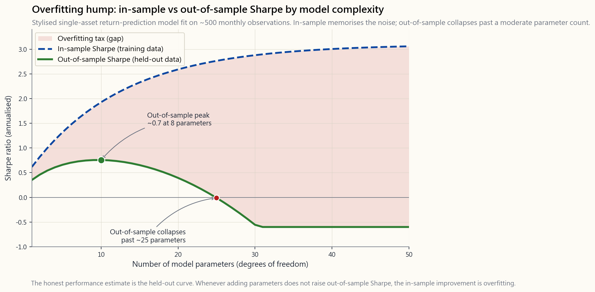

# Week 45: Quantitative Methods for Investors — Regression, Time Series, ML Signals

---

## Part 1: Reading Section

---

### 1. Why This Is Important

This is the week where the toolkit gets real. For forty-three weeks
we have leaned on intuition, history, and a handful of identities —
duration, the dividend-discount equation, the four-tranche sketch,
the barbell. From here on, anyone you meet who is *paid* to find
alpha — the fund manager you might fire, the quant shop pitching you
a sleeve, the LinkedIn-posting "AI signal" guy — is going to wave
some combination of regression coefficients, t-stats, R-squared,
walk-forward validation curves, and machine-learning out-of-sample
charts in your face. Quantitative methods are the language. If you
do not speak the language at a passable level, every claim of skill
sounds equally credible, and you will end up paying 1.5% per year
for a regression a junior analyst could have run in an afternoon.

This matters for four reasons.

1. **It separates structural exposure from genuine skill.** The
   single most important sentence in modern empirical finance is
   *"alpha is what is left over after a regression on the right
   factors."* A manager who beats the S&P by 3% per year is, until
   you regress their returns on MKT/SMB/HML/UMD/RMW, indistinguishable
   from one who simply tilted small-value-momentum and rode the
   well-known premia. Two-thirds of the post-1990 mutual-fund alpha
   anomaly literature evaporated the moment the right benchmarks
   went into the regression. Of the structural sources of alpha, an
   information edge is the hardest to come by; the regression is the
   test that tells you whether anyone has it.

2. **It is the dividing line between data and superstition.**
   Investors are pattern-recognition machines, and markets generate
   roughly 10 million testable patterns a year. The "January effect,"
   the "Super Bowl indicator," "sell in May," the dozens of
   "presidential cycle" charts — every one of them looks like a real
   signal because, in any large enough dataset, *something* will look
   like a real signal. The multiple-testing correction (Bonferroni,
   Benjamini-Hochberg, Lopez de Prado's deflated Sharpe) is the
   mathematical statement of "if you tested 100 strategies at p<0.05,
   you should expect roughly 5 false positives." Without that frame,
   every backtest is a confession of survivorship bias.

3. **It tells you which strategies a price series can support.** A
   pure random walk admits no momentum strategy, no mean-reversion
   strategy, and no forecasting model better than the unconditional
   mean. A trending series with positive autocorrelation rewards
   momentum; a mean-reverting series rewards spread trading. The
   tests for stationarity, autocorrelation, and cointegration are
   not academic exercises — they answer the question *can I extract
   anything from this data, in principle?* before you spend a year
   tuning a signal that the underlying process never had.

4. **It is the only honest defense against the ML-alpha pitch.**
   The most dangerous sentence in 2026 finance is "we use machine
   learning to find non-linear patterns in market data." Most ML
   alpha pitches are 80% feature engineering, 15% labelling, and 5%
   model. If you understand train/validation/test splits, walk-forward
   evaluation, and the difference between in-sample and out-of-sample
   Sharpe, you can ask the three questions that pop the bubble:
   *what was the holdout window? how was it chosen? what is the
   strategy's Sharpe on data after the model was last retrained?*
   The answers, more often than not, kill the pitch.

---

### 2. What You Need to Know

#### 2.1 Linear regression as the alpha-attribution machine

The single-factor CAPM regression is the simplest version of the
machine. You take a portfolio's monthly excess return $R_p - R_f$
and the market's excess return $R_m - R_f$, fit the line

$$R_p - R_f = \alpha + \beta \cdot (R_m - R_f) + \varepsilon,$$

and read off two numbers. $\beta$ is the slope: a one-percent move
in the market produces, on average, a $\beta$-percent move in the
portfolio. $\alpha$ is the intercept: the portfolio's average
excess return *after* you strip out everything its market exposure
already explained. The residual $\varepsilon$ is the part the model
gives up — what is left after $\beta$ has done its work.

The chart in §2.1 shows what this looks like in practice on five
years of monthly data calibrated to a portfolio with $\alpha = 2\%$
per year and $\beta = 0.85$. The dots scatter, the line slopes up,
and the intercept reads about 17 basis points per month — exactly
the 2%-annualised alpha we baked in. The cloud of dots above and
below the line is $\varepsilon$: the part this single factor cannot
explain, which is where multi-factor regressions go to work.

The Fama-French extension simply adds more right-hand-side terms:

$$R_p - R_f = \alpha + \beta_1 \cdot \text{MKT} + \beta_2 \cdot \text{SMB} + \beta_3 \cdot \text{HML} + \beta_4 \cdot \text{UMD} + \varepsilon.$$

Run this regression on a small-cap value fund and you will discover
that its "alpha" from the one-factor model — say 4% per year — was
actually a $\beta_2$ loading of 0.40 on size and a $\beta_3$ loading
of 0.30 on value, multiplied by the 1963-2024 SMB and HML premia we
catalogued in Week 23. Subtract those and the residual alpha is
near zero, and not statistically distinguishable from it. Three
percent of the four was *factor compensation*, not skill. That is
the same finding S&P SPIVA prints every year; the regression is
just the mathematical statement of why.

#### 2.2 Residuals as the working definition of alpha

The intercept is alpha-on-paper; the residuals are alpha-in-process.
A skilled manager generates not just a positive intercept but a
residual series whose *t-statistic* survives the noise. If a fund
has alpha of 0.20% per month with a residual standard deviation of
2% per month over 60 months, the t-stat is

$$t = \frac{0.20\%}{2\%/\sqrt{60}} = \frac{0.20\%}{0.258\%} \approx 0.78.$$

That is *not* statistically significant — there is no way to
distinguish that intercept from zero with sixty data points and that
much noise. You need either a longer window, a higher alpha, or a
lower residual vol — typically all three — for the t-stat to clear
the conventional 2.0 threshold. Alpha is rare, and the t-stat is the
arithmetic of how rare. A 2% alpha at 5% residual vol
needs roughly 25 years of monthly data before its t-stat trips 2.0.
Twenty-five years. That is how long it takes to *prove* skill at
that magnitude — not detect it, prove it. Most managers have not
been managing money for twenty-five years.

#### 2.3 Cross-sectional regression for stock picking

The CAPM regression is *time-series*: one fund, T monthly returns,
one slope. The other family is *cross-sectional*: one date, N
stocks, fit returns against current-snapshot characteristics.

$$r_{i,t+1} = \gamma_0 + \gamma_1 \cdot \text{B/M}_{i,t} + \gamma_2 \cdot \text{Size}_{i,t} + \gamma_3 \cdot \text{Mom}_{i,t} + u_{i,t+1}.$$

You run this for every month, collect the time series of
$\gamma_1, \gamma_2, \gamma_3$ slopes, and average them. The
average $\gamma_j$ is the realised premium per unit of factor
exposure, and its t-stat tells you whether the factor pays. This
is the Fama-MacBeth procedure (1973), and it is still the
workhorse of academic factor research half a century later. Every
"barra-style risk model" you have ever seen on a sell-side desk is
some flavour of cross-sectional regression.

The retail use-case is signal building. You take a universe of
500 stocks, score each on (book-to-market, profitability, 12-month
momentum), regress *next-month* returns against those scores,
form the long-short portfolio implied by the slopes, and rebalance.
That is the inside of every smart-beta ETF.

#### 2.4 Time series: AR, MA, ARMA, and the random walk benchmark

For pricing series, the unconditional first question is: is this a
random walk, or is there persistence? An AR(1) model

$$r_t = \phi \cdot r_{t-1} + \epsilon_t$$

estimates the autocorrelation $\phi$ at lag one. If $\phi > 0$,
returns trend (this week's move predicts next week's). If $\phi < 0$,
returns mean-revert. For US monthly equity returns the realised
$\phi$ is about $+0.10$ — barely distinguishable from zero, which is
why monthly stock returns are essentially impossible to forecast
from their own history. For *daily* equity returns $\phi$ is mildly
*negative* (microstructure mean-reversion); for cross-sectional
relative returns at the *6 to 12-month* horizon $\phi$ is mildly
*positive* (Jegadeesh-Titman momentum, the cross-sectional momentum
effect). Where $\phi$ is
zero, no model that takes only past prices as input can win.

MA(q) and ARMA(p,q) models layer in moving-average residual terms
to capture the news-arrival shock structure. In practice, for
liquid equity returns, the best ARMA fits beat the
zero-mean-random-walk benchmark by a few basis points of monthly
RMSE — economically irrelevant after costs. For *volatility*
series, on the other hand, AR-style models are wildly successful:
volatility is highly persistent ($\phi \approx 0.95$ on daily VIX),
which is why GARCH and HAR-RV models genuinely forecast tomorrow's
volatility from today's. The volatility tail wags the return dog,
and a lot of that asymmetry shows up here. You
return dog — gets a lot of its leverage from this asymmetry. You
cannot forecast next month's return; you absolutely can forecast
next month's variance.

#### 2.5 Rolling vs expanding windows, and the parameter-stability problem

Once you commit to fitting a model on history, the next choice is
whether to use *all* of history (expanding window: at month $t$,
fit on data from inception through $t-1$) or only the recent past
(rolling window: at month $t$, fit on the last 60 months).
Expanding windows have more data and therefore tighter estimates,
*if* the underlying parameter is stable. Rolling windows adapt when
the parameter changes, *if* the regime change is real and not noise.

There is no theoretically correct answer; there is only a
parameter-stability test. For a CAPM beta on a megacap stock,
expanding-window estimates from 1990-2024 give a roughly fixed
beta — the parameter is stable and rolling adds noise. For the
HML factor's market beta, on the other hand, expanding-window
estimates are nonsense — the factor's beta on the market shifted
sign in 2007. There the rolling window is mandatory. The
practical default is a rolling 36-60 month window for monthly
data, with a Chow break test for whether the parameter has shifted.

#### 2.6 Train/validation/test, and the walk-forward defence

Every machine-learning pitch you will ever hear in finance involves
the same vulnerability: the model was tuned on the same data its
out-of-sample performance is reported against. The standard
defense is a three-way split.

- **Train** (e.g. 1990-2010): fit model parameters.
- **Validation** (e.g. 2011-2017): tune hyperparameters — number of
  features, regularisation strength, depth of tree, etc. The model
  is *re-fit* with each hyperparameter setting on train, scored on
  validation, and the best hyperparameter chosen.
- **Test** (e.g. 2018-2024): the model is evaluated *exactly once*
  with its frozen hyperparameters. No re-tuning.

The brutal fact is that the test set, in an honest pipeline, is
used once and then discarded. You cannot iterate on a strategy
against the test set without it becoming a second validation set.
*Walk-forward validation* generalises this: at every point in time
$t$, the model is fit on data through $t-1$, used to predict $t$,
and the next $t$ is appended to the training set. The realised
out-of-sample performance is the only honest performance estimate.

The danger is the opposite of what most retail investors think.
Overfitting does not look like a slightly-too-good in-sample
result; it looks like a *spectacularly good* in-sample result that
collapses to nothing — or worse, to *negative* — on the test set.
The chart in §2.7 shows the canonical hump.

#### 2.7 Overfitting, multiple testing, and the false-alpha mill

The classical curve has in-sample Sharpe rising monotonically with
model complexity (more parameters, deeper trees, more features) —
because with enough free parameters you can memorise the noise.
Out-of-sample Sharpe rises briefly, peaks at some moderate
complexity, and then *collapses*. The gap between the two curves
is the overfitting tax. It is the single most reproducible
phenomenon in empirical machine learning, and it is universal: it
shows up in equity prediction, options pricing, credit scoring,
and ad-click models alike.

The financial twist on top of this is *multiple testing*. Every
researcher who tries a strategy and abandons it without publishing
contributes to the survivorship of the strategies that happened to
look good. If a hundred quants each try fifty signal variants on
the same dataset, the combined family-wise error rate at $p < 0.05$
is essentially one. Marcos Lopez de Prado's *Deflated Sharpe Ratio*
formalises this: the Sharpe at which a strategy must come in to
beat the noise of having tried *N* alternatives is roughly
$\sqrt{2 \log N}$ standard deviations of the null. Try a thousand
strategies and the bar is roughly $\sqrt{2 \log 1000} \approx 3.7$
standard deviations of the unconditional Sharpe-noise — which on
a 5-year backtest is a Sharpe of about 1.6 just to clear the bar
of having looked. Most published anomalies do not clear it.

#### 2.8 Why most ML alpha is feature engineering

Lopez de Prado's *Advances in Financial Machine Learning* (2018)
makes the point in two slogans. *"The model is the easy part."*
*"Most of the work is in labelling the target and engineering the
features."* The reason is that financial data has a vanishingly
low signal-to-noise ratio (about 0.05 R-squared per month for the
best-fit linear model on equity returns), severe non-stationarity
(the signal you found in 2010 may not work in 2020), and a
labelling problem (was that price move a regime change, or
microstructure noise?). The model — random forest, XGBoost,
neural network — is largely a commoditised step. The differentiation
sits in the features (which transformations of price/volume/order
flow you fed in) and the labels (whether a 1% move counts as
"+1" or you weighted by triple-barrier exits).

For the retail investor, the consequence is uncomfortable: the
serious money in quant alpha is almost never made by training
yet another XGBoost on yet another OHLCV dataset. It is made by
sourcing or constructing features no one else has — alternative
data, satellite imagery, credit-card panels, supply-chain text
embeddings. The information lane of alpha is real but expensive.
expensive. The "structural" lanes (liquidity, factor compression,
vol-tail mispricing) remain the cheaper and more durable game for
a single account.

---

### 3. Common Misconceptions

1. **"R-squared 0.9 means the model is good."** R-squared measures
   variance explained, not predictive power. A regression of fund
   returns on the S&P with R-squared = 0.95 just means the fund is
   correlated with the market. It tells you nothing about whether
   the fund's alpha is real or whether you can *forecast* either
   series from anything.

2. **"My backtest Sharpe is 2.5 in-sample, so the strategy works."**
   In-sample Sharpe is, on average, optimistically biased by roughly
   $\sqrt{N}$ standard deviations where N is the number of variants
   you tried. A 2.5 in-sample Sharpe routinely walks forward to 0.3.

3. **"P-value below 0.05 means the result is real."** A p-value below
   0.05 means the probability of observing this result *given the null
   is true* is below 5%. With a thousand simultaneous tests, the
   expected number of false positives at p < 0.05 is fifty. Without
   a multiple-testing correction, "p<0.05" is barely an anchor.

4. **"More data is always better."** More data is better only if the
   underlying data-generating process is stable. Adding 1990s data
   to your TIPS-breakeven model when TIPS did not exist before 1997
   is not "more data," it is contamination.

5. **"Out-of-sample Sharpe of 1.0 = great."** Out-of-sample Sharpe of
   1.0 net of transaction cost on a strategy whose features were
   chosen in 2010 and tested through 2024 is great. Out-of-sample
   Sharpe of 1.0 *gross* of cost on a six-month holdout that the
   researcher iterated against forty times is meaningless.

6. **"Machine learning finds patterns humans miss."** Machine
   learning fits flexible functions to whatever you feed it. With
   N parameters, an unregularised model can fit any pattern in
   N-1 data points — including the noise. Whether the *pattern*
   it found is real is a question the model itself cannot answer.

7. **"Cross-validation eliminates overfitting."** K-fold cross
   validation does not work for time series — it leaks future
   information into the training fold. The only valid CV for
   financial data is walk-forward with embargo (Lopez de Prado
   §7), and even then the test set is consumed once.

8. **"Beta is constant."** Beta is a regression slope on a finite
   window. It is *estimated* with error and changes through time.
   Famously, the beta of value stocks against the market shifted
   from positive to roughly zero around 2007.

9. **"My factor exposure regression has alpha. I have skill."**
   Statistically-significant alpha in a five-factor regression on a
   60-month window is not, on its own, a skill demonstration. You
   need the t-stat, the residual diagnostics, and ideally a separate
   holdout. Twenty-five years of data, if not more.

10. **"Quant models replaced traders."** In aggregate, quant equity
    market share has been about 30-40% of US dollar volume for the
    past decade. The remainder is humans, and a great deal of the
    quant share is execution, not signal generation. The interesting
    money is split.

---

### 4. Q&A Section

**Q1. If a regression gives my fund alpha = 1.5% per year and t-stat
= 1.4, what should I conclude?**
Nothing. T-stat 1.4 corresponds to a one-tailed p-value of about 8%,
two-tailed about 16%. You cannot reject the null that the true alpha
is zero. The estimate is consistent with skill *and* consistent with
luck. You need more data, a higher alpha, or both before you can
draw any conclusion.

**Q2. How long do I need to evaluate a manager?**
Roughly 25 years for monthly data if the alpha is 2% per year and
the residual vol is 5% per year — at which point the t-stat just
clears 2.0. If the residual vol is higher (a typical hedge fund),
multiply. The implication is uncomfortable: most "great" track
records are not statistically distinguishable from luck.

**Q3. What R-squared should I expect on a single-factor CAPM regression
of a US large-cap fund versus the S&P 500?**
0.85 to 0.95 is normal. An R-squared of 0.99 means the fund is a
closet indexer (you should pay nothing). An R-squared of 0.50 means
the fund is taking large factor or sector bets and you should run a
multi-factor regression to see what they are.

**Q4. Why is autocorrelation of monthly equity returns near zero?**
Because if it were materially positive, momentum strategies would
arbitrage it away to zero, and if it were materially negative,
mean-reversion strategies would do the same. The residual
near-zero is the equilibrium. It survives at the *cross-sectional*
level (relative momentum across stocks at 6-12-month horizons)
where the arbitrageable shape is messier and slower.

**Q5. What is "look-ahead bias" in practice?**
Using information you would not have had at the moment you traded.
Common examples: backtesting a "buy when P/E < 15" rule using the
P/E based on full-year reported earnings (which were only known
months later), using GDP-revision data (revised down years after
the fact) as if it were the print, or using reconstructed index
constituents that exclude companies that went bankrupt
mid-history. Survivorship bias is a special case.

**Q6. What is the difference between in-sample, validation, and
out-of-sample?**
In-sample: data the model was fit on. The fit is, mechanically,
good. Validation: data used to choose hyperparameters. Independent
of training but consumed in the tuning step. Out-of-sample / test:
data the model has never seen. A correctly-built pipeline runs the
test set exactly once, after the entire model — including
hyperparameters — is frozen.

**Q7. How many parameters can I use before overfitting?**
The rule of thumb on linear models is 10-20 observations per
parameter as a *minimum*. For non-linear models with many degrees
of freedom (random forests, neural nets) the answer depends on
regularisation; the empirical defense is walk-forward Sharpe — if
adding parameters does not improve walk-forward Sharpe, the
in-sample improvement is overfitting.

**Q8. Should I use ML or linear regression for stock prediction?**
Linear regression first, always. If a linear model on
well-engineered features cannot find a signal, an ML model on the
same features will not find one either; it will just overfit
faster and feel like skill. ML earns its keep when the underlying
relationship is actually non-linear, *and* you have enough data
to estimate the non-linearity, *and* you have a feature set that
the linear model cannot exploit. That is a small intersection.

**Q9. What is "data mining" and what is wrong with it?**
Data mining is searching a large space of strategies for what
fits past data. Mathematically it is fine; what is wrong is
*reporting the best one as if it had been the only one tried*.
Without a multiple-testing correction, the reported Sharpe is
biased upward by the size of the search. Lopez de Prado's deflated
Sharpe is the standard fix.

**Q10. Why is feature engineering more important than the model?**
Because financial data is low signal-to-noise and the marginal
return on model complexity is sharply diminishing. Two competing
shops with the same features and different ML models tend to
converge to similar Sharpe ratios; two shops with the same ML
model but materially different feature sets diverge sharply. The
features are where the information sits.

**Q11. Can I run these regressions myself?**
Yes. Python's `statsmodels` or `scikit-learn`, or R's `lm()`, run
a five-factor regression in two lines. Kenneth French's data
library publishes the FF5 + UMD monthly factor returns for free,
1963 to present. Subscript the time series, regress, read off
alpha and t-stat. The week's interactive lab does the basic
single-factor version inline.

**Q12. What is the single most important habit?**
Always reserve a holdout. Always. Whatever fraction of your data
you can spare — 20%, 30%, the last three years — reserve it before
you do anything else, and do not look at it. When the strategy is
final, *exactly once*, score it on the holdout. The number you get
is the only honest number you will have. "Alpha is rare" stops being
a slogan and becomes intuitive the first time you watch a strategy's
in-sample Sharpe of 2.5 walk forward to 0.4.

---

## Part 2: YouTube Script

---

**VIDEO TITLE:** Quantitative Methods for Investors — How to Tell Real Alpha from a Lucky Backtest
**RUNTIME TARGET:** ~18 minutes
**HOSTS:** Horace, Stella

---

**[INTRO — 0:00-1:30]**

**Horace:** Welcome back. This week's lesson is the one where, if I
do my job, you walk away able to call BS on roughly half the
"performance" pitches you'll ever see.

**Stella:** Strong claim, Horace.

**Horace:** It's a defensible one. Quantitative methods — regression,
time-series models, ML pipelines — are the language people use to
*claim* skill. If you can read the language at a passable level, you
can ask the three questions that pop the bubble: what's the holdout,
how was it picked, and what's the t-stat?

**Stella:** And if they can't answer those?

**Horace:** Then you've just saved yourself 1.5% per year for the
next decade.

**Stella:** Set the agenda.

**Horace:** Three pieces. First, regression as the
alpha-attribution machine — what alpha means after you regress on
the right factors. Second, time series — what AR/MA/ARMA can and
can't do. Third, the ML pitch — train/validation/test, walk-forward,
and why most ML alpha is actually feature engineering.

**Stella:** And the principles?

**Horace:** Information edge is the hardest of the structural alpha
lanes — it sits right on top of all of this. The companion idea —
alpha is rare — is what the math will keep proving.

---

**[PART 1 — REGRESSION — 1:30-7:00]**

**Stella:** Single-factor first.

**Horace:** Yep. The line is

$$R_p - R_f = \alpha + \beta \cdot (R_m - R_f) + \varepsilon.$$

Two numbers come out: the slope, beta, and the intercept, alpha.
Alpha is the average return your portfolio produced *after* you
subtract what its market exposure already explained.

[VISUAL: image/week45_regression_alpha.png]

**Stella:** Talk us through this picture.

**Horace:** Sixty months of made-up data calibrated to alpha 2% per
year, beta 0.85. You can see the slope is gentler than 1 — that's
the 0.85 — and the line crosses the y-axis at about 17 basis
points per month. Annualised, 17 bps × 12 ≈ 2%. The dots scatter
around the line; that scatter is epsilon, the residual. The t-stat
on the alpha tells you whether 17 bps per month is distinguishable
from zero.

**Stella:** Punchline?

**Horace:** Yes. With 60 months and that residual vol, the t-stat
on a 2% alpha is barely 2.0. To *prove* skill at that magnitude you
need closer to twenty-five years.

**Stella:** Twenty-five years.

**Horace:** Twenty-five years. Alpha is rare — that's the math, not a
slogan.

**Stella:** Now multi-factor.

**Horace:** Same machine, more right-hand-side terms.

$$R_p - R_f = \alpha + \beta_1 \text{MKT} + \beta_2 \text{SMB} + \beta_3 \text{HML} + \beta_4 \text{UMD} + \varepsilon.$$

You take a small-cap value fund whose one-factor alpha was 4% per
year, run the five-factor regression, and almost always — almost
always — most of that alpha was a positive loading on SMB and HML
times the realised premia we catalogued in Week 23. The residual
alpha collapses to near zero.

**Stella:** That's the SPIVA result in equation form.

**Horace:** Exactly. The chart is the SPIVA report's mathematical
backbone.

---

**[PART 2 — TIME SERIES — 7:00-11:00]**

**Stella:** Time series.

**Horace:** Three building blocks: AR, MA, ARMA. The AR(1) model
asks one question: does this period's return predict next period's?

$$r_t = \phi \cdot r_{t-1} + \epsilon_t.$$

If phi is positive, returns trend. If negative, they mean-revert.
For US monthly equity returns, phi is about +0.10 — not zero, but
not big. For *daily* returns it's slightly negative. For *6-12
month relative cross-sectional* returns, phi is positive — that's
the Jegadeesh-Titman momentum effect.

**Stella:** And volatility?

**Horace:** Volatility is *highly* persistent. Phi on daily VIX is
about 0.95. Today's volatility tells you almost everything about
tomorrow's. That's why GARCH models genuinely forecast variance.

**Stella:** You said something important last week — the vol tail
wags the return dog.

**Horace:** Vol-tail-wags-dog. Returns are basically unforecastable
month-to-month. Variance is highly forecastable. So a lot of what
looks like "alpha" in option-selling, vol-targeting, or risk-parity
strategies is actually exploiting *that* asymmetry.

**Stella:** Rolling versus expanding window?

**Horace:** Expanding window if the parameter is stable. Rolling if
it's drifting. Megacap beta is roughly stable since 1990 — use
expanding. The HML factor's market beta flipped sign around 2007 —
use rolling. There's no universal answer; there's a stability test.

---

**[PART 3 — THE ML PITCH — 11:00-15:30]**

**Stella:** Now the ML conversation.

**Horace:** Train, validation, test. Three separate slices. Train
fits the model. Validation tunes the hyperparameters. Test is used
*exactly once* to score the frozen model.

**Stella:** What goes wrong?

**Horace:** Two things. One, people iterate against the test set
until it becomes a second validation set. Two, people don't apply
multiple-testing corrections, so a strategy that looks impressive
in isolation is just the survivor of a hundred siblings that didn't.

[VISUAL: image/week45_overfit_curve.png]

**Stella:** This is the overfitting hump.

**Horace:** Classic shape. In-sample Sharpe rises monotonically
with model complexity — more parameters, deeper tree, more
features. Out-of-sample Sharpe rises briefly, peaks at some
moderate complexity, and then collapses. The gap between the two
curves is the overfitting tax.

**Stella:** And the multiple-testing correction?

**Horace:** Lopez de Prado's deflated Sharpe formalises it. The
short version: if you tried N variants, the Sharpe needed to clear
noise scales like the square root of two log N. Try a thousand
strategies, your bar is roughly 3.7 standard deviations of the
unconditional null — which on a five-year backtest is a Sharpe of
about 1.6 just to *justify having looked*. Most published anomalies
don't clear that bar.

**Stella:** Why is feature engineering so important?

**Horace:** Because financial data has a brutal signal-to-noise
ratio. The marginal value of model complexity is sharply
diminishing. Two shops with the same features and different ML
models converge to similar Sharpes. Two shops with the same model
and different feature sets diverge sharply. The features are where
the information sits.

**Stella:** And for the retail investor?

**Horace:** For us, the consequence is humbling. The serious money
in quant alpha is rarely made by yet another XGBoost on yet
another OHLCV dataset. It's made by sourcing features no one else
has — alternative data, satellites, credit-card panels. The
information lane of alpha is real but expensive. The
structural lanes — factor compression, liquidity, vol-tail
mispricing — remain the cheaper and more durable retail game.

---

**[PART 4 — THE LAB — 15:30-17:00]**

**Stella:** Show the lab.

**Horace:** Open `interactive/week45_regression_lab.html`. You
control four sliders: number of points, true alpha in basis points,
true beta, and noise volatility. The page generates synthetic data
inline using a deterministic LCG, runs ordinary least squares, and
draws the scatter plus the regression line plus a 95% confidence
band.

**Stella:** What should viewers play with first?

**Horace:** Set true alpha to 200 bps and noise vol to 4% — that's
the canonical "low-noise skilled manager" case. The estimated alpha
will land within about 30 bps of 200 with 60 points. Now drop
points to 24 — two years of data — and watch the confidence band
double in width. With 24 points you can't reject zero alpha at the
2 standard-error level.

**Stella:** And the deeper lesson?

**Horace:** The width of the alpha confidence band is the size of
your "I don't know." It's not a number to round to zero — it's the
honest measure of how much of your apparent alpha is the data
talking and how much is the noise. Most managers operate inside
that band their whole careers.

---

**[OUTRO — 17:00-18:00]**

**Stella:** What's next week?

**Horace:** Week 46 — we use this toolkit to dissect a real
hedge-fund track record. Take published returns, run the
five-factor regression, and we'll see what the residual alpha
actually is.

**Stella:** Practical homework?

**Horace:** Three things. One: pick a fund you own. Find five
years of monthly returns. Run a five-factor regression — Kenneth
French publishes the data free. Read the alpha and t-stat. Two:
go play with the lab — push noise vol up and watch the
confidence band swallow the alpha. Three: write down, in one
sentence, the difference between "I have alpha" and "I have
statistically-significant alpha." If you can't say it, the next
sales pitch will sound credible. After this week, it shouldn't.

**Stella:** Stay sceptical.

**Horace:** Stay sceptical. See you next week.

[END]
