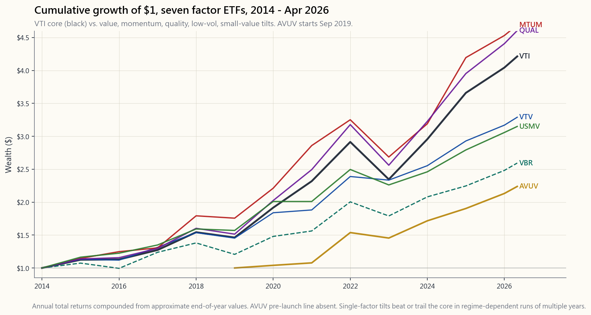
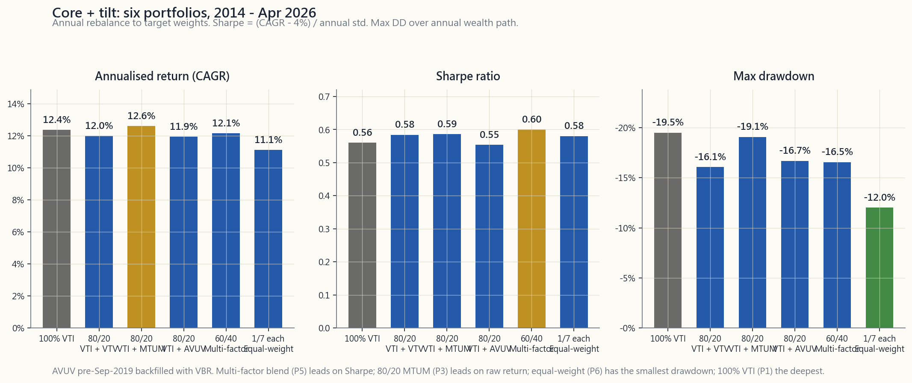

# Week 50: Factor Tilts in Practice — Value, Momentum, Quality, Low-Vol

---

## Part 1: Reading Section

---

### 1. Why This Is Important

Week 23 introduced the academic factor zoo: HML, SMB, UMD, RMW, CMA, BAB. The numbers were tidy — Fama-French long-short premia of 3-7% annualised over 1963-2024, neat bars on a chart, the kind of thing that makes a PhD thesis sing. Then you tried to buy any of it on Schwab and discovered that the academic factor and the retail ETF labelled with the same word are not the same product. **Week 50 is the implementation week.** It's the lesson where the textbook factor meets a long-only ETF, an annual rebalance, a 0.15% expense ratio, and a market that has eaten roughly half of every published premium since the Fama-French five-factor paper landed in 2015.

Four reasons this matters for a Level 4 portfolio.

**One — the post-publication decay is real.** McLean and Pontiff (2016, *Journal of Finance*) studied 97 published anomalies and found that out-of-sample post-publication returns drop by **roughly 50%** versus the in-sample backtest. That is not a rounding error. A 4% paper premium becomes a 2% live premium, and 2% is a number that costs and taxes can erase entirely. Any factor tilt you build in 2026 must be sized assuming the academic alpha is roughly half what the paper claimed.

**Two — long-only retail ETFs are not the academic factor.** HML is long the cheapest 30% and short the most expensive 30%. VTV is long the cheaper 50% of large-caps with no short side. The two correlate around 0.55-0.70. You cannot buy HML at Vanguard. You can buy *exposure* to value, diluted by the long-only constraint, the cap-weight choice, and the index methodology. The US-only investable rule applies internally too: investable factor exposures are a subset of academic factor exposures.

**Three — implementation costs eat the smaller premia first.** A 24 bp expense ratio plus 30 bp annual turnover cost on top of a 7% gross premium is a 25% haircut. On a 2% post-decay premium, the same 54 bp cost is a 27% haircut. The smaller the underlying premium, the bigger the proportional bite of fixed implementation cost.

**Four — concentration is the silent cost of single-factor purity.** A pure value tilt at the wrong moment of the cycle (2017-2020) underperformed VTI by 30+ percentage points cumulatively. A multi-factor blend smooths that out at the cost of diluting any individual signal. The right answer for most retail accounts is a **core + tilt** portfolio — a passive VTI core that captures the market premium reliably, with small factor tilts sized to the magnitude of the post-decay premium, not the in-sample backtest. Alpha is rare, and most "factor alpha" sold at retail is repackaged beta.

---

### 2. What You Need to Know

#### 2.1 The post-2003 decay and why it happened

The factor zoo did not collapse, but the magnitudes shrank. The cleanest evidence is McLean-Pontiff (2016): of 97 published anomalies, the average premium fell from in-sample to post-publication by ~26%, and from in-sample to post-publication-out-of-sample-period by ~58%. Hou, Xue, Zhang (2020, *Review of Financial Studies*) replicated 452 anomalies and found that **65% failed to clear a t=3 threshold** once microcap stocks and equal-weighting tricks were stripped out. The factors that survived — value (HML), momentum (UMD), profitability (RMW), investment (CMA), low-volatility (BAB) — were the ones with deep prior literature, plausible economic stories, and out-of-sample replication on international data.

What changed around 2003-2010? Three things at once. First, factor ETFs launched at scale (iShares MTUM in 2013, USMV in 2011, the Vanguard factor ETF suite in 2018), drawing in capital that crowded the trades. Second, transaction costs collapsed (decimalisation 2001, exchange access fees, then commission-free trading 2019), letting hedge funds harvest premia at a fraction of the friction Fama and French faced in the 80s. Third, the universe of long-short capital chasing the same signals exploded. AQR alone runs ~$140B as of 2024 across factor strategies, much of it in the same names a Berkeley grad student can find with a free Wharton-CRSP login.

The result: **roughly half the headline number persists post-2003**, and that fraction is itself volatile. Value premium (HML) was -4.7% per year from 2007-2019 — a 12-year drought that broke careers — before snapping back to +27.7% in 2022 alone. Anyone who sized value tilts to the 1963-2003 magnitude was crucified by 2018; anyone who liquidated by 2020 missed the snap.

The chart shows seven retail factor ETFs from January 2014 through April 2026. VTI (core US total market) is the reference line. Notice three things: MTUM and QUAL beat VTI cumulatively, but with deeper drawdowns in 2022. AVUV (Avantis small-value) launched September 2019 and has been the standout post-launch but the time series is short. USMV did its job in 2018 and 2020 (smaller drawdowns) but trailed VTI in the bull run 2021-2024 — that is the trade. VBR and VTV — pure value tilts — trail VTI substantially over the full window despite the 2022 value snap. Single-factor tilts work in some regimes and fail in others; the chart is the visual proof.

#### 2.2 The seven retail factor ETFs — what you can actually buy

| Ticker | Factor      | Issuer    | ER    | AUM (Apr 2026) | Methodology summary |
|--------|-------------|-----------|-------|----------------|---------------------|
| VTI    | Market core | Vanguard  | 0.03% | ~$1.7T         | CRSP US Total Market, ~3700 stocks, full cap-weight |
| VTV    | Value       | Vanguard  | 0.04% | ~$140B         | CRSP US Large-Cap Value, ~340 stocks, P/B + P/E + dividend yield + earnings yield |
| VBR    | Small-Value | Vanguard  | 0.07% | ~$30B          | CRSP US Small-Cap Value, ~840 stocks, similar value screens applied to small-caps |
| MTUM   | Momentum    | iShares   | 0.15% | ~$15B          | MSCI USA Momentum, ~125 stocks, 6-12mo risk-adj return ranking, semi-annual rebalance |
| QUAL   | Quality     | iShares   | 0.15% | ~$45B          | MSCI USA Quality, ~125 stocks, ROE + low debt/equity + low earnings variability |
| USMV   | Low-Vol     | iShares   | 0.15% | ~$30B          | MSCI USA Min-Vol, ~165 stocks, optimisation that minimises portfolio variance subject to constraints |
| AVUV   | Small-Value | Avantis   | 0.25% | ~$15B          | Active small-cap value, profitability screen on top of value, launched Sep 2019 |

A few notes for the discerning buyer.

**VTV vs. VBR** — Same issuer, same factor (value), but VBR is small-cap and VTV is large-cap. Small-value historically had a bigger premium than large-value (the SMB and HML interaction), but the small-cap premium itself has been near-zero since 2003. Pick one — owning both is mostly redundant.

**AVUV** — Avantis is a 2019 spinoff of DFA. The fund applies an active screen (profitability) on top of small-value indexing, which earned an extra ~2% per year over VBR from 2019-2024. The expense ratio is 4x VBR's, but the methodology improvement (profitability filter on small-value, which is exactly what Asness et al. 2018 showed kills the "junk small-cap" subset of the SMB premium) has historically more than justified the cost. AVUV is the only ETF in this list with a credible *active* improvement claim.

**MTUM** — Momentum ETFs have a structural problem: by the time the index reconstitutes, the trailing-12-month winners are stale. MTUM rebalances semi-annually, which is too slow versus the 6-month decay of the momentum signal. Result: MTUM captures roughly 40-60% of the academic momentum premium net of implementation. It still beats VTI in trending bull markets (2017, 2021, 2024) and loses badly in trend-reversals (2009, 2016, 2019). Position-size accordingly.

**USMV** — Did its 2018 job (-1.4% vs. VTI's -5.2%), did its 2020 job until COVID (peak-to-trough was actually worse than VTI in March 2020 — low-vol does not protect against volatility-of-volatility shocks, only against persistent equity volatility), trailed VTI in 2021-2024. The factor delivers in long horizons; in any 1-3 year window the result is regime-dependent.

#### 2.3 The implementation gap — what's missing between paper and ETF

| Friction layer        | Paper HML       | VTV (long-only)         | Cost to investor |
|-----------------------|-----------------|-------------------------|------------------|
| Long-short ratio      | 100/100         | 100/0                   | Loses short-side alpha |
| Universe              | NYSE+AMEX+NASDAQ| Russell 1000 / MSCI USA | Excludes microcap |
| Rebalance frequency   | Monthly         | Quarterly or annual     | Stale signal |
| Methodology overlays  | None            | Cap-weight + buffers    | Diluted exposure |
| Fees                  | 0%              | 0.04%                   | Direct drag |
| Turnover cost         | Free in academia| ~30-50 bps/yr           | Direct drag |

Net: the realised long-only factor exposure is on the order of **0.5-0.7 of the academic long-short factor**. So if HML's 1963-2024 premium was 3.8%, the realised VTV-vs-VTI long-only premium expectation is closer to 2.0-2.6%, before fees and after the post-2003 50% decay haircut takes that down to roughly **1.0-1.5% per year** in expectation. That is the real number to size against.

#### 2.4 Core + tilt construction — the practical framework

The empirical result that comes out of the implementation arithmetic is: pure single-factor portfolios are too volatile and too long-tailed in bad regimes for a retail investor. The right construction is a **core + tilt**:

- **Core (60-90%):** VTI or VOO. Captures the market premium with near-zero implementation drag. This is your equity beta.
- **Tilt (10-40%):** One to four factor sleeves, sized to the post-decay premium, blended to diversify across factor regimes.

A canonical retail core+tilt looks like this:

| Sleeve | Weight | Notes |
|--------|--------|-------|
| VTI (core)  | 70% | Market beta |
| AVUV        | 10% | Small-value with profitability screen |
| MTUM        | 8%  | Momentum |
| QUAL        | 6%  | Quality |
| USMV        | 6%  | Low-vol |

Why this shape? The 30% factor sleeve, sized at the post-decay expected alpha (~1.0-1.5% per year per factor, applied to ~7% of the portfolio per factor), produces an aggregate expected uplift of roughly 0.3-0.5% per year over 100% VTI. That sounds modest. It is. **The honest framing of factor investing in 2026 is: a well-implemented factor tilt buys you roughly 30-50 bps of expected outperformance per year, with tracking error of 3-4% per year against VTI.** The information ratio is on the order of 0.10-0.15. That is a real, defensible improvement, not the 2-3% per year that factor ETF marketing material would have you believe.

The grid above shows six candidate constructions over 2014-Apr 2026: 100% VTI; 80/20 with VTV, MTUM, or AVUV; a 60/40 multi-factor; and an equal-weight all-seven blend. The 80/20-MTUM won on annualised return in this window — momentum had a strong 2017 (+37%) and 2024 (+32%) inside the sample. The 60/40 multi-factor delivered the best Sharpe (0.60 vs. 0.56 for 100% VTI) — the textbook diversification result, hand-wavy version: "diversify your factors and you eat the average premium with less of any single factor's variance." The 100% VTI baseline ran near the bottom on Sharpe and *last* on drawdown depth (-19.5%, against -12% for the equal-weight blend). **If you cannot beat the 100%-VTI Sharpe by at least 10% over a full cycle, the tilt is not worth the complexity.**

#### 2.5 Sizing rules and rebalance discipline

Three rules.

**(a) Size the tilt to 0.5x the academic premium.** If HML's paper number is 3.8% per year, expect 1.9% from a long-only VTV vs. VTI sleeve, and size accordingly. Never size on the in-sample backtest you saw on the issuer's marketing PDF.

**(b) Rebalance annually, not quarterly, and not "when it feels right."** Factor tilts are mean-reverting on multi-year horizons and trending on multi-month horizons. Annual rebalance is the empirical sweet spot — it captures multi-year mean reversion without paying transaction cost on the trending sub-cycles. Tax-aware rebalancing in a taxable account: rebalance with new contributions and dividend reinvestments first, only sell to rebalance once a year, and prefer to sell tax-lots with the smallest gain (HIFO).

**(c) Set a 5-year stop on any tilt.** Factor decay is real. If a factor tilt has a rolling 5-year information ratio below zero against VTI, and you cannot articulate a structural reason for the underperformance other than "the premium worked before and will work again," cut the tilt by half. Value investors who refused to do this from 2010-2020 lost a decade. Markets stay irrational longer than you stay solvent.

#### 2.6 The barbell read

A pure factor portfolio is the opposite of a barbell — it pays for active risk in the middle. Horace's barbell deletes the middle: T-bills + asymmetric upside, no quasi-active intermediate sleeves. Where do factor tilts fit in the barbell view? Two answers.

- **For a Level 1-3 portfolio** (Weeks 8-36), factor tilts are the wrong tool. The marginal expected uplift (30-50 bps/yr) does not justify the operational complexity, the tracking error psychology, or the rebalance discipline required. Use 100% VTI/VOO core, save the cognitive bandwidth.
- **For a Level 4 portfolio** (Weeks 37+), a 10-30% factor sleeve is one of the few "active" trades that survives the default-passive filter, *because* the post-decay premium is positive in expectation, supported by economic theory, and implementable in long-only ETFs at low cost. Even here, the right sizing is small — factor tilts complement the alpha sleeve (long-vol, options-overlays, trend-following) rather than replace it.

The honest summary of factor investing in 2026 is: real, but small. Big enough to justify a 20-30% sleeve in a Level 4 retail portfolio. Small enough that the discipline of rebalance and the willingness to hold through 5-year droughts are more important than the choice of factor mix. The interactive below lets you mix the seven ETFs and see the historical 2014-2024 backtest with monthly granularity — try the all-VTI line as your baseline and notice how hard it is to beat by more than a Sharpe of 0.10.

---

### 3. Common Misconceptions

1. **"Factor ETFs deliver the academic premium."** They deliver roughly half of it, after the post-2003 decay and the long-only / fee implementation gap. Size accordingly.
2. **"More factors = more diversification = always better."** Past three or four factors, marginal diversification benefit is near zero, and the operational complexity (rebalancing, tracking error attribution, tax-lot management) starts to cost more than the incremental premium.
3. **"VTV and VBR are interchangeable value exposure."** They are not. VTV is large-cap value, VBR is small-cap value, and the historical premium and behaviour differ materially.
4. **"AVUV is just expensive VBR."** AVUV's profitability screen is a documented improvement over pure small-value indexing (Asness, Frazzini, Israel, Moskowitz, Pedersen 2018). The 18 bp ER differential has historically been earned back several times over since 2019, though the sample is short.
5. **"Momentum ETFs capture the academic momentum premium."** MTUM captures ~40-60% of it because semi-annual rebalance is too slow versus the 6-month decay of the signal. The realised premium net of implementation is closer to 2-3% per year, not the 6-7% Carhart number.
6. **"Low-vol ETFs protect against drawdowns."** They protect against persistent equity volatility (e.g. 2018 Q4, 2022). They do not protect against vol-of-vol shocks (March 2020 — USMV peak-to-trough was actually worse than VTI's). Different risks, different tools.
7. **"I'll time factor rotation."** Nobody has done this reliably for 30 years. Arnott, AQR, Research Affiliates have all published on this; live results are mediocre at best. Factor timing is harder than market timing.
8. **"Factor tilts replace active management."** They are halfway between passive and active. They preserve the low-cost / low-turnover discipline of indexing while adding a small, persistent expected premium. They do not substitute for the alpha sleeve in a Level 4 portfolio.
9. **"The factor zoo means there are many alpha sources."** The factor zoo means there were many *published* anomalies; only 5-7 survive rigorous out-of-sample testing, and even those have decayed by ~50% post-publication. Alpha sources are rare and hard-won.
10. **"I should rebalance when a factor underperforms."** That is exactly when *not* to rebalance — selling a factor at a 5-year low locks in the loss precisely as mean reversion is loading up. The correct rebalance is calendar-based (annual) and disciplined regardless of which side is winning.

---

### 4. Q&A Section

**Q1: How much of my portfolio should be in factor tilts?**
A: For a Level 4 retail portfolio, 20-30% across one to four factor sleeves on top of a 70-80% VTI/VOO core. Below Level 4, zero — the operational and psychological cost outweighs the 30-50 bps expected uplift.

**Q2: VTV or AVUV — which value ETF should I use?**
A: Use AVUV if you have IRA space (the higher turnover is tax-inefficient in taxable). Use VBR if you want pure passive Vanguard small-value at 7 bp ER. Use VTV if you want large-cap value (different factor exposure — bigger names, less small-cap loading). They do different things.

**Q3: Why is MTUM's tracking error so high?**
A: Momentum ETFs hold concentrated baskets of trailing-12-month winners. When the market reverses (Q1 2009, Q1 2016, Q4 2018, Mar 2020), the entire basket flips against the move. MTUM's structural rebalance lag — semi-annual, with a 1-month signal lookback gap — means it captures the trend with a 3-9 month lag and is fully wrong-footed during reversals. The factor itself works; the implementation has unavoidable timing friction.

**Q4: Should I tilt small-value if the small-cap premium has been near zero since 2003?**
A: Maybe. The small-cap *standalone* premium (SMB) has been roughly zero post-2003. The small-*value* premium — the interaction term, captured by AVUV — has been more durable, particularly with profitability screens that filter out junk small-caps. Asness et al. (2018) is the canonical reference. If you tilt small-value, do it through AVUV or a comparable profitability-screened fund, not pure VBR.

**Q5: What's the tax cost of factor tilts in a taxable account?**
A: Factor ETFs have higher turnover than VTI (5-30% vs. 3-5%), which increases distributed capital gains. Plus dividend yields differ (VTV ~2.5% vs. VTI 1.4%), affecting tax drag. Estimate 20-40 bps additional tax drag per year for a 30% factor sleeve in a 32%-bracket taxable account. Best practice: factor sleeves go in IRA — location-not-allocation.

**Q6: How long do I have to wait for a factor tilt to "work"?**
A: Median periods of underperformance for individual factors are 3-7 years. Worst-case droughts have run 10-12 years (value, 2007-2019). If you cannot psychologically commit to a 10-year holding period through a deep drawdown vs. VTI, do not tilt at all. The tracking error is precisely the friction the premium pays you for accepting.

**Q7: Why don't multi-factor ETFs (like LRGF or USMF) win automatically?**
A: They diversify factor risk, which lowers volatility, but they also dilute each factor exposure. The realised information ratio is similar to (or marginally better than) a DIY blend, and the ER is usually higher (0.20% vs. weighted ~0.10%). Multi-factor ETFs are reasonable for accounts that need one-ticker simplicity; DIY blending in an IRA is cheaper and more transparent.

**Q8: Does factor investing work outside the US?**
A: Yes, with caveats. Asness et al. (2013) and Fama-French (2017) showed value, momentum, and quality work in international developed and emerging markets. The premia are similar in magnitude. But sticking to the US-listed investable universe, US retail vehicles for international factors (DLS, IEFA factor sleeves, AVDV for international small-value) have shorter track records and worse liquidity. Most US retail accounts get adequate factor exposure with US-only funds.

**Q9: What's the right rebalance threshold?**
A: Annual, calendar-based, with rebalancing tolerance bands of plus-or-minus 5 percentage points around target weights. Sub-annual rebalance increases tax drag without improving expected return. Rebalancing only when bands are breached is also fine but produces uneven calendar exposure. Just pick one rule and follow it for 10+ years.

**Q10: What's the strongest argument *against* factor tilts in a retail portfolio?**
A: The opportunity cost of complexity. Every minute spent tracking factor performance, attributing tracking error, and managing rebalances is a minute not spent on things that matter more — savings rate, asset location, tax-loss harvesting, paying off high-cost debt. For most retail investors, 100% VTI in tax-advantaged accounts beats 70% VTI + 30% factor sleeves, because the cognitive overhead of the factor sleeve causes more behavioural error than the factor premium produces in alpha. The retail investor's biggest enemy is themselves, not the market.
