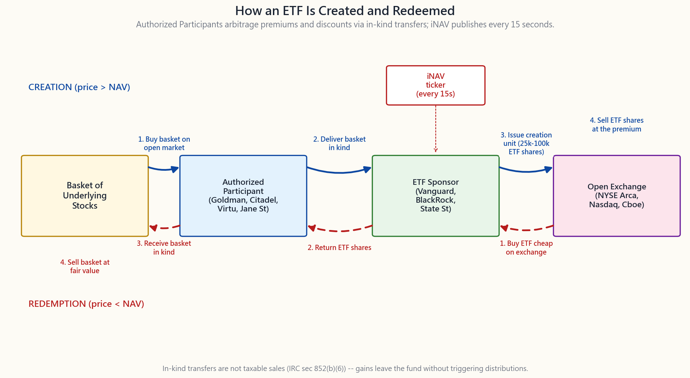

# 补充课程 03：交易所交易基金运作机制——创建、赎回与税务效率的魔法

---

## 第一部分：阅读材料

---

### 1. 为什么这很重要

如果你认真跟随陳馬的课程，你的投资组合中占比最大的单一持仓应该是一只交易所交易基金——大概率是 VTI、SPY 或 QQQ。理由直截了当：阿尔法稀缺，被动投资才是默认选项，而持有美国市场最干净的方式就是这三只可以在任何平台免佣购买的交易所交易基金。所以花十分钟搞懂它的底层机制是值得的。

这套机制之所以重要，有四个原因：

1. **它解释了为什么交易所交易基金税务效率高，而共同基金则不然。** 两只持有*相同*投资组合、收取*相同*费用的产品——VTI 和 VTSAX，均为 100% 的先锋全股票市场——在应税账户中的税后收益可能天差地别，原因只有一个结构性差异：实物交割与现金赎回的区别。一旦你理解了这套机制，你就知道哪个产品该放入普通券商账户，哪个该放入个人退休账户。
2. **它解释了溢价/折价现象。** 当一只固定收益类交易所交易基金在恐慌行情中以低于净值 4% 的价格成交时，它并没有"出故障"，它的表现完全符合其设计逻辑。理解这一点可以让你避免最糟糕的被迫抛售。
3. **它解释了为什么封闭式基金会持续折价交易**，而交易所交易基金则不会。同属一个产品类别，机制却截然不同。认清这一区别，可以避免你以净值买入封闭式基金，一年后才发现它"本应该"以 -10% 折价交易。
4. **它解释了2020年3月的债券类交易所交易基金错位事件**——那场压力测试，债券类交易所交易基金安然度过，尽管"交易所交易基金以 5% 折价交易"的标题看起来触目惊心。那个标题实际上是交易所交易基金在底层市场冻结时发挥价格发现功能的体现。理解这一点，能让你站在监管机构事后审查报告所站的那一边。

这是一堂底层机制会真正影响你仓位配置决策的补充课。值得花十分钟。

---

### 2. 你需要掌握的内容

#### 2.1 授权参与者与创建/赎回循环

交易所交易基金并不是单一的东西。它是两个市场拼接在一起的产物。

**二级市场**是你所见到的——Robinhood、嘉信理财、盈透证券。你从另一位投资者手中在公开交易所买入 100 股 VTI，以现金换股份，和买卖股票完全一样。基金发行人（先锋、贝莱德、道富）根本不参与这笔交易。

**一级市场**对散户来说是隐形的。一小群大型券商——高盛、摩根士丹利、城堡证券、Virtu、Jane Street、Flow Traders、Susquehanna——与基金发行商签订协议，成为**授权参与者（APs）**。每只交易所交易基金通常有 20 至 50 个授权参与者，但在实际操作中，任意一天大部分交易量都由其中三四家完成。

循环的运作方式如下。发行商每天开市前公布一份**创建篮子**：一个**创建单位**的交易所交易基金所持有的股票及其权重的完整列表。一个创建单位通常相当于 25,000 至 100,000 股交易所交易基金份额——大约折合 300 万至 1,000 万美元的净值。

当交易所交易基金以高于净值的**溢价**交易时，授权参与者会：

1. 在公开市场买入底层一篮子股票。
2. 将该篮子实物交割给基金发行商。
3. 换取一个创建单位的全新交易所交易基金份额。
4. 在交易所以溢价卖出这些新份额。

溢价即授权参与者的利润。新供给进入市场，溢价收窄，价格重新与净值对齐。

当交易所交易基金以**折价**交易时，循环反转：

1. 授权参与者在交易所以低价买入交易所交易基金份额。
2. 将其交还给基金发行商。
3. 换取底层一篮子股票的实物交割。
4. 在公开市场以更高的公允价值卖出该篮子。

折价即授权参与者的利润。交易所交易基金份额被注销，供给减少，价格重新与净值对齐。

这整个循环是自动化的，全天运行，对你而言是不可见的。你唯一能直接观察到它的证据，是交易所每 15 秒发布一次的 **iNAV**（盘中参考净值）——一个持续更新的篮子价值估算值，当前买卖价格会与之对比。当 iNAV 与市价偏离超过几个基点时，授权参与者就会出现。

#### 2.2 为什么交易所交易基金税务效率高（实物交割的妙招）

每一只持有升值证券的基金——共同基金、交易所交易基金、对冲基金——都面临同样的问题：当投资者要赎回时，基金必须以某种方式筹集现金。如果基金卖出升值的股票来支付赎回款，就会在**基金层面**实现资本利得，并按法律要求在年末将该利得**分配给所有剩余持有人**。忠实的长期持有者为他们从未要求基金实现的利得缴税。这是开放式共同基金结构的核心缺陷。

交易所交易基金通过一级市场的实物交割机制绕过了这一问题。当授权参与者用交易所交易基金份额换取底层篮子时，发行商可以选择交付哪些**具体税务批次**的股票——自然会选择**成本基础最低**（内含浮盈最大）的那些批次。这些浮盈以免税的实物交割方式永久离开基金。美国《国内税收法典》第 852(b)(6) 条为此提供了法律依据：实物赎回不构成出售，不触发基金层面的资本利得。

这一效果是真实存在的，尽管对于*指数型*共同基金而言，差距是适度的而非戏剧性的。先锋的 VTSAX（共同基金）和 VTI（交易所交易基金）持有*完全相同的投资组合，费用率完全相同*——机构端均为 0.04%。VTSAX 在 2014、2015、2018、2020 和 2024 年均分配了长期资本利得（各年均在净值的 0.1% 至 0.7% 之间）；而 VTI 在其整个历史上分配的资本利得几乎为零。在应税账户中，以 20% 的综合长期资本利得税率持有 20 年，税后财富差异约为期末资产价值的半个百分点——以 10 万美元初始投资计算，差距约为数千美元。对于一只在高换手年份分配净值 5%-10% 的典型*主动管理型*共同基金，同样的计算则会产生数万美元的拖累。

这也是先锋**专利双份额结构**——VTI 实际上是 VTSAX 的一个份额类别，共享同一位基金经理和同样的交易——能在二十年间为其提供独特优势的原因。该专利已于 2023 年到期。其他发行商目前正在为现有共同基金推出交易所交易基金份额类别，这是基金行业最重要的结构性转变之一，但基金运营圈子之外几乎无人关注。

#### 2.3 溢价/折价、iNAV 与 2020 年 3 月债券类交易所交易基金错位事件

对于流动性强的美国股票类交易所交易基金，套利循环运转迅速。SPY、VTI、QQQ、IVV 在正常交易日几乎全天与净值保持 2 个基点以内的偏差。在正常情况下，你永远不会在大市值美国股票类交易所交易基金上看到明显的溢价或折价。

真正有趣的地方在于**流动性较差的底层资产**：高收益债券、新兴市场债务、市政债券、主有限合伙企业。当底层市场本身流动性枯竭或暂时冻结时，交易所交易基金的价格会*领先于*底层资产——交易所交易基金在交易所持续成交，底层资产则不然。你所看到的"折价"往往并非价格错位，而是交易所交易基金在反映债券的*真实*价值，领先于驱动已公布净值的陈旧做市商报价。

这正是 2020 年 3 月所发生的事。2020 年 3 月 12 日至 13 日，LQD（投资级债券交易所交易基金）以低于其公布净值 5% 的价格成交；HYG（高收益）折价 6%；MUB（市政债券）折价 8%。债券市场本身已经停摆：单只投资级债券的买卖价差从正常的 5 美分扩大至超过 1 美元，许多债券根本无人成交。交易所交易基金*仍在成交*——事后复盘证明，它们打出的价格远比官方净值更能准确估计公允价值。当美联储于 3 月 23 日宣布公司债券购买计划时，折价迅速收窄，交易所交易基金价格引领了此后的反弹。

美国证券交易委员会 2020 年的 Rule 6c-11 审查报告得出结论：交易所交易基金的表现符合其设计初衷，其在错位期间发挥的价格发现功能是*有益的*。这已成为监管机构的主流观点。理解这一点很有价值，因为下次债券类交易所交易基金在恐慌中以 -4% 折价交易时，你会认清它的本质——这是一个特性，而非缺陷——而不会恐慌性地以卖价抛售。

#### 2.4 交易所交易基金与封闭式基金，以及新的费用现实

与**封闭式基金**的对比是鲜明的。封闭式基金在首次公开发行时发行固定数量的份额，此后这些份额像股票一样在交易所交易——但**没有创建/赎回机制**。没有授权参与者。如果市价偏离净值，没有套利者能将其拉回。封闭式基金通常*持续性地*以低于净值 5% 至 15% 的折价交易——往往长达数年。同属一个产品类别，却是完全不同的动物。

在 2000 年后的大部分时间里，交易所交易基金和共同基金之间存在真实的费用率差距——交易所交易基金为 5-10 个基点，同类指数型共同基金则为 50-100 个基点。对于旗舰指数产品而言，这一差距已基本消除。如今 VTI 和 VTSAX 均为 0.04%；IVV 和 VFIAX 分别为 0.03% 和 0.04%；BND 和 VBTLX 分别为 0.03% 和 0.05%。差距*依然巨大*的地方在于主动管理：主动型共同基金在免除费用豁免后平均仍约为 0.65%；主动型交易所交易基金的中位费率为 0.35%。主动型共同基金还通过零售渠道获得佣金回扣（12b-1 费、软美元分成），而交易所交易基金的结构性特点使其无法支付此类费用。

实际结论：对于指数型敞口而言，交易所交易基金与共同基金之间的结构选择，现在是一个**账户税务位置**的问题，而非费用问题。应税券商账户选 VTI（实物交割税务保护），个人退休账户选 VTSAX（无需税务保护，且共同基金能精确地自动再投资分配）。

---

### 3. 常见误区

**误区一："交易所交易基金免税。"** 交易所交易基金并不免税。股息需要缴税（符合条件的股息或普通股息，规则与股票相同）。*你*卖出时的资本利得同样需要缴税。交易所交易基金所避免的，是共同基金每年 12 月强加给你的*基金层面*资本利得分配。你可以自主选择何时卖出，从而掌控何时实现利得。

**误区二："交易所交易基金折价交易意味着出故障了。"** 对于流动性强的美国股票类交易所交易基金，哪怕 30 个基点的折价都不寻常，说明某个授权参与者"打了瞌睡"。对于流动性较差的债券类或新兴市场类交易所交易基金，压力事件期间 -2% 至 -5% 的折价是正常的，反映的是交易所交易基金在底层资产价格发现上的领先作用。

**误区三："iNAV 是交易所交易基金的真实价格。"** iNAV 是每 15 秒根据底层股票最新成交价计算出的模型价格。对于在美国交易时间持有流动性良好的美国股票的交易所交易基金，iNAV 是可靠的。但对于底层市场已收盘的国际股票类或债券类交易所交易基金，iNAV 会变得陈旧，*实际成交*的交易所交易基金价格才是更好的公允价值估算。

**误区四："合成型交易所交易基金与美国交易所交易基金相同。"** 欧洲的合成型交易所交易基金使用与对手方银行签订的总收益互换，而非实际持有底层资产。它们存在实物型交易所交易基金所没有的对手方风险。美国上市的交易所交易基金依法（1940 年《投资公司法》）须以实物资产支持。请坚持选择美国上市的产品。

**误区五："杠杆型和反向交易所交易基金与普通交易所交易基金只是加了杠杆而已。"** 杠杆型交易所交易基金使用每日再平衡的衍生品，会遭受**波动性损耗**——多日累计收益并不等于底层资产多日累计收益的 2 倍或 -1 倍。SSO 在长期持有的情况下，每年比无摩擦的 2 倍收益落后数个百分点（第 37 周）。适合短期战术操作，不适合长期持有。

**误区六："先锋共同基金和交易所交易基金是两种不同的产品。"** 对于 VTI/VTSAX 及其他几只旗舰产品而言，它们实际上是*同一只基金*的两个份额类别——同一个投资组合，同一位基金经理，同样的交易操作。2023 年前，这受先锋专利保护；现在这一结构正被行业广泛复制。

**误区七："跟踪非流动性资产的交易所交易基金在危机中注定崩溃。"** 2020 年 3 月的压力测试得出了相反的结论。当底层市场冻结时，债券类交易所交易基金发挥了价格发现的功能。交易所交易基金产品结构的表现优于底层市场本身。

**误区八："封闭式基金和交易所交易基金基本上一样。"** 同属场内交易产品类别，但机制截然不同。交易所交易基金有授权参与者驱动的创建/赎回机制，将价格锁定在净值附近。封闭式基金没有，其价格会持续偏向 -5% 至 -15% 的折价区间。名称相近，产品迥异。

---

### 4. 问答

**问题一：如何在交易前查询交易所交易基金的溢价/折价？**

答：每家发行商都会在其基金页面公布日终溢价/折价数据。盘中查询方面，交易所会以`<代码>.IV`的格式（例如`VTI.IV`）在大多数数据平台上发布 iNAV。对于美国股票类交易所交易基金，这一步通常可以省略——溢价和折价都低于买卖价差。对于债券类和国际型交易所交易基金，在大额交易前花三十秒查一下是值得的。

**问题二：买卖交易所交易基金应该用市价单还是限价单？**

答：始终用限价单，尤其是开盘后 15 分钟和收盘前 15 分钟——这两个时段 iNAV 可能滞后。对于流动性好的美国交易所交易基金，以显示的卖价（买入时）或买价（卖出时）挂限价单，通常在数秒内以接近净值的价格成交。避免在行情快速波动时使用市价单——在一只流动性较差的中盘股行业交易所交易基金上，滑点可能高达 10-20 个基点。

**问题三：为什么 VTI 几乎不分配资本利得，而 VTSAX 有时会？**

答：底层投资组合相同，但 VTSAX 面临现金赎回流——投资者卖出时，基金须出售股票以筹集现金，从而在基金内部实现利得；而 VTI 面临的是实物赎回流——授权参与者直接取走股票，无需出售，基金内部不实现利得。当 VTSAX 在内含浮盈较高的年份遭遇净赎回时，年末分配可能相当可观。VTI 几乎不存在这一问题。

**问题四：如果 VTI 税务效率更高，为什么还要持有 VTSAX？**

答：两个原因。VTSAX 能以零零整整地自动再投资股息和分配，无零碎股份摩擦——在税务效率无关紧要的 401(k) 或个人退休账户中非常实用，也能保持账务清晰。此外，VTSAX 接受以金额下单（"投入 500 美元"），VTI 接受以股数下单（"买入 4 股"）；对于自动定期定额投资而言，共同基金的金额界面更为简便。税务规则依然不变：在*应税*券商账户中，优先选择交易所交易基金。

**问题五：什么是创建单位，为什么规模这么大？**

答：创建单位是授权参与者与基金发行商进行交互的最小批量——通常为 25,000 至 100,000 股交易所交易基金份额（净值约 300 万至 1,000 万美元）。这一规模是为了将实物创建/赎回的运营和托管成本控制在合理范围内。授权参与者再将这些大批量拆分为散户投资者所交易的小量。

**问题六：交易所交易基金的机制会失灵吗？会是什么样子？**

答：有两种失灵方式。（1）授权参与者罢工——因认为无法退出底层资产而拒绝套利。这是监管机构对流动性差的底层资产的主要担忧。（2）底层市场本身停止运转——2020 年 3 月险些如此。在这两种情况下，交易所交易基金都在做它应该做的事：向市场揭示底层资产定价有误。解决方案是修复底层市场，而不是禁止交易所交易基金。

**问题七：什么是"合成型"交易所交易基金，我需要担心吗？**

答：合成型交易所交易基金（主要在欧洲）持有与银行对手方签订的互换合约，由对手方承诺支付指数收益，而非实际持有底层股票。这引入了实物型交易所交易基金所没有的对手方风险。默认规则是只选美国上市的交易所交易基金——这一约束会自动排除合成型产品。

**问题八：为什么有些交易所交易基金收 0.03%，有些收 0.95%？**

答：跟踪宽基、授权费用极低的知名指数的指数型交易所交易基金，凭借规模效应可以将费用率压低至 0.03%。主动管理型交易所交易基金、主题型交易所交易基金、单一国家新兴市场交易所交易基金、杠杆型交易所交易基金以及货币对冲型交易所交易基金，都因为授权、对冲或主动管理成本而收取更高的费用。规律依然成立：阿尔法稀缺，10 年后几乎总是低费率产品胜出。

**问题九：什么是"交易所交易基金税务亏损收割替代品"技巧？**

答：为了在保持仓位的同时实现税务亏损，你可以卖出一只基金，同时买入一只"高度相似但并不相同"的基金。ITOT 和 VTI 均跟踪全美股票市场指数，但属于不同的基金（一只贝莱德，一只先锋，所跟踪的指数略有不同），因此互换并不构成"洗售"。补充课程 4 将详细讲解这一内容。

**问题十：本课最重要的一个结论是什么？**

答：两点。在*应税*账户中，优先选择交易所交易基金产品结构而非同类共同基金——实物赎回机制赋予你一种结构性的税后优势，随着时间复利累积。此外，当交易所交易基金在压力期间以折价成交时，先判断底层市场是否正常运转，再得出"交易所交易基金出故障了"的结论——几乎每次都是交易所交易基金是对的，而净值数据是滞后的。

---

## 第二部分：YouTube 脚本

---

**视频标题：** 为什么 VTI 和 VTSAX 是同一只基金，税单却不一样 | 补充课程 3

**目标时长：** 约 11 分钟

**主持人：**
- **陳馬**（讲师）：手持一份交易所交易基金招募说明书的打印版。
- **小魚**（学生）：被动指数投资者，持有应税账户。

---

**[片头 -- 0:00]**

[VISUAL: Animated logo "Side Lesson 3 -- ETF Mechanics"]

**陳馬：** 小魚，你在券商账户里持有 VTI 对吧？

**小魚：** 对啊，网上那些说要做被动投资的人，基本上都推荐这个。

**陳馬：** 不错。那你有没有朋友是直接在先锋开户的，持有的是 VTSAX？

**小魚：** 基本上是同一只基金嘛。

**陳馬：** 底层*投资组合*一样。费率一样。基金经理一样。交易操作一样。但*二十年后的税后结果不同*——对于 VTSAX 来说差距是数千美元（因为先锋专利让它共享交易所交易基金份额类别，所以 VTSAX 本身已经异常高效），对于典型的主动型共同基金来说同样计算则会产生数万美元的拖累。差异归根结底是一件事——实物交割还是现金赎回——但没人讲，因为听起来像在说下水管道。来，我给你演示一下。

---

**[第一段 -- 两个市场，一只交易所交易基金 -- 0:50]**

[VISUAL: image/side03_creation_redemption.png on screen]

**陳馬：** 每一只交易所交易基金都是两个市场拼接在一起的产物。你在 Robinhood 上看到的是**二级**市场——从另一个投资者手里买入，以现金换股份，和买股票一模一样。基金发行商根本*不参与*这笔交易。

**一级**市场是隐形的。大约三十家大型券商——高盛、城堡证券、Virtu、Jane Street——与先锋或贝莱德签订协议，成为**授权参与者（APs）**。只有他们能直接跟基金"说话"。

**小魚：** 那他们具体做什么？

**陳馬：** 两件事。*创建*：当 VTI 的交易价格高于净值时，授权参与者买入一篮子底层股票，交给先锋，换回新的 VTI 份额，再在交易所以溢价卖出。溢价就是授权参与者的利润。

*赎回*：反向操作。当 VTI 以低于净值的价格交易时，授权参与者在交易所低价买入 VTI，交给先锋，换回一篮子股票，再以公允价值卖出。折价就是授权参与者的利润。

**小魚：** 所以他们把 VTI 的价格锁定在净值附近。

**陳馬：** 对。而关键词是"实物"。授权参与者交割篮子时，他们和先锋之间不产生现金交换。正是这个细节，让 VTI 的税务效率高于 VTSAX。这个先记住，稍后展开讲。

---

**[第二段 -- iNAV 的节拍 -- 2:00]**

**陳馬：** 在这一切运转的同时，交易所每 15 秒发布一次 **iNAV**——一个持续更新的篮子价值模型估算值。这是检验当前买卖报价的参考基准。当 VTI 的价格偏离 iNAV 超过一个基点时，授权参与者就会出现。整个循环是自动化的，几秒内完成。

**小魚：** 我从自己的券商账户完全看不到这些。

**陳馬：** 对。你看到的是订单簿上的买卖价差。价差很窄——一个基点——*正是因为*授权参与者的机制在底层运转。一旦没有这套机制，交易所交易基金的价格就会像封闭式基金一样漂移。

---

**[第三段 -- 税务妙招 -- 3:15]**

[VISUAL: image/side03_etf_vs_mf_tax.png on screen]

**陳馬：** 好，现在说能让你口袋里多一些钱的部分。

共同基金——VTSAX——当某个投资者赎回时，基金要卖掉一些股票来筹现金。这些出售在基金*内部*实现了资本利得。美国国税局要求基金在年末将这些利得推送给*所有剩余持有人*，作为资本利得分配。忠实的长期持有者收到了一张他们从未要求基金实现的税单。

**小魚：** 这听起来太糟糕了。

**陳馬：** 确实。这是开放式共同基金结构的核心缺陷。

交易所交易基金绕开了这一点。看这张图——相同的投资组合，相同的费率，2005 年投入 10 万美元，应税账户，综合长期资本利得税率 20%。二十年后，VTI 比 VTSAX 多出数千美元——约为期末财富的半个百分点。看起来差距不大，是因为 VTSAX 本身*税务效率就异常高*（它在先锋的结构下共享了交易所交易基金的份额类别）。对于典型的*主动管理型*共同基金，同样的计算则会产生数万美元的拖累。

**小魚：** 这是怎么来的？

**陳馬：** 美国《国内税收法典》第 852(b)(6) 条。当授权参与者用交易所交易基金份额换取底层篮子时，这是一笔实物交割——*不*构成出售。不产生基金层面的资本利得。而且发行商可以选择交付*哪些*税务批次——自然会选成本基础最低、内含浮盈最大的那些。这些浮盈永久且无声地离开了基金。

**小魚：** 所以 VTI 把升值的股票实物交给授权参与者，自己从不实现利得？

**陳馬：** 正是。VTI 在其整个历史上分配的资本利得几乎为零。VTSAX 在 2000 年、2008 年、2018 年及其他几年都分配过。底层投资组合完全相同，只是产品结构不同。

**小魚：** 那还有谁会持有 VTSAX？

**陳馬：** 在个人退休账户或 401(k) 里，没有税务需要保护，而且 VTSAX 有交易所交易基金没有的功能——精确地自动再投资分配、以金额而非份数下单。所以在*递延税款*账户里，VTSAX 完全没问题。但在*应税*券商账户里，默认选交易所交易基金。永远如此。

---

**[第四段 -- 压力情景下的溢价/折价 -- 5:30]**

**小魚：** 那如果出事了呢？比如 2020 年 3 月？

**陳馬：** 好例子。2020 年 3 月 12 日至 13 日，LQD——那只大型投资级债券交易所交易基金——以低于净值 5% 的价格成交。HYG 折价 6%，MUB 折价 8%。

**小魚：** 听起来像是交易所交易基金出故障了。

**陳馬：** 那是当时所有人的第一反应。但实际发生的是这样的：债券市场本身冻结了。单只债券的买卖价差从 5 美分扩大到一美元以上，很多债券根本无人成交。债券交易所交易基金的"净值"是根据陈旧的做市商报价计算出来的，根本不反映任何人实际能够成交的价格。

而交易所交易基金*继续在成交*。交易所交易基金的价格是真实的、双向的市场价格。贝莱德、ICI、美国证券交易委员会和美联储的事后复盘都得出结论：交易所交易基金的价格是比官方净值*更好*的公允价值估算。交易所交易基金做了它应该做的事：在底层市场冻结时引领价格发现。

**小魚：** 所以折价不是 bug。

**陳馬：** 它是交易所交易基金结构在正常运转。当美联储于 3 月 23 日宣布公司债券购买计划时，折价迅速收窄，交易所交易基金领涨。那些在 LQD 折价 5% 时恐慌抛售的人，五天后以净值加 8% 的价格买了回来。

---

**[第五段 -- 封闭式基金不是交易所交易基金 -- 7:30]**

**小魚：** 我有时看到一些 PIMCO 基金"持续折价 10%"。那些是交易所交易基金吗？

**陳馬：** 不是。那些是**封闭式基金**。同属场内交易产品类别，但完全是两种动物。

封闭式基金在首次公开发行时发行固定数量的份额。*没有授权参与者机制。没有创建，没有赎回。* 当供需失衡时，没有套利者能把价格拉回来。封闭式基金持续以 -5% 至 -15% 的折价交易，有时长达数年。PIMCO 的高收益封闭式基金、贝莱德的市政债券封闭式基金、依顿万斯的均衡型封闭式基金，都在这个区间。

**小魚：** 这是好事还是坏事？

**陳馬：** 本身无所谓好坏，了解它就行。这意味着：永远不要以净值买封闭式基金——等折价出现再进。同时要认清，封闭式基金的折价可能持续多年。一个合理的超额收益来源，是"机构无法触及的结构性错误定价"。在压力期间以 -10% 至 -15% 的折价买入封闭式基金，是一个小而合理的机会。但这和买 VTI 完全是两码事。

要点：同属产品类别，机制不同，价格行为截然不同。不要混淆。

---

**[第六段 -- 产品结构选择是税务账户位置选择 -- 9:00]**

**小魚：** 好，那规则是什么？

**陳馬：** 两条规则。

第一，在*应税*券商账户中，优先选择交易所交易基金产品结构而非同类共同基金。选 VTI 而非 VTSAX，选 IVV 或 VOO 而非 VFIAX，选 BND 而非 VBTLX。实物赎回的税务保护效应会随时间复利累积。

第二，在个人退休账户或 401(k) 里，产品结构选哪个差别不大。选最适合你所在平台的那个——在先锋自己的平台上，往往是共同基金，因为它支持自动再投资和以金额下单。

指数型交易所交易基金和指数型共同基金之间的费用差距已基本消除。VTI 和 VTSAX 都是 0.04%。2026 年，产品结构选择不再是成本问题，而是*账户所在位置*的问题。

---

**[结尾 -- 10:30]**

**陳馬：** 三个要点。授权参与者负责底层运转——这是交易所交易基金价格紧贴净值的原因。实物赎回是交易所交易基金悄悄排出资本利得、保持税务效率的方式——这是为什么 VTI 在应税账户持有二十年后会领先于 VTSAX。以及，当交易所交易基金在压力期间以折价成交时，先判断底层市场是否正常运转，再得出交易所交易基金出故障的结论——几乎每次都是交易所交易基金是对的，净值数据滞后了。

**小魚：** 互动练习可以让我把这些都操作一遍？

**陳馬：** 选一只交易所交易基金——VTI、SPY、QQQ、JEPI、SCHD、VNQ——面板会显示资产管理规模、费用率、收益率、溢价/折价历史，以及与同类共同基金对比的税后费用比率。点击浏览五分钟，这些底层机制就会开始变得熟悉。

---

**片尾：** "下一期：补充课程 4——税务高效投资"