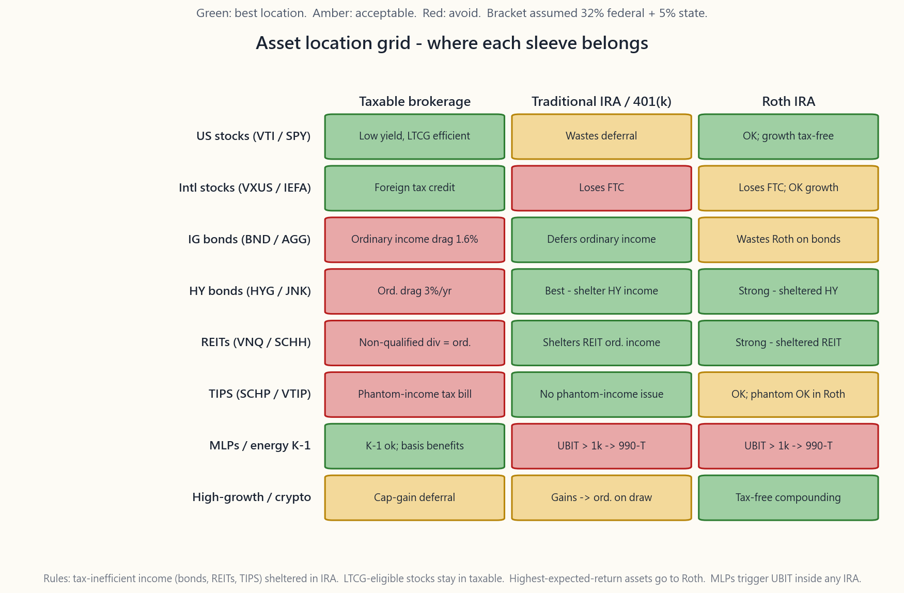
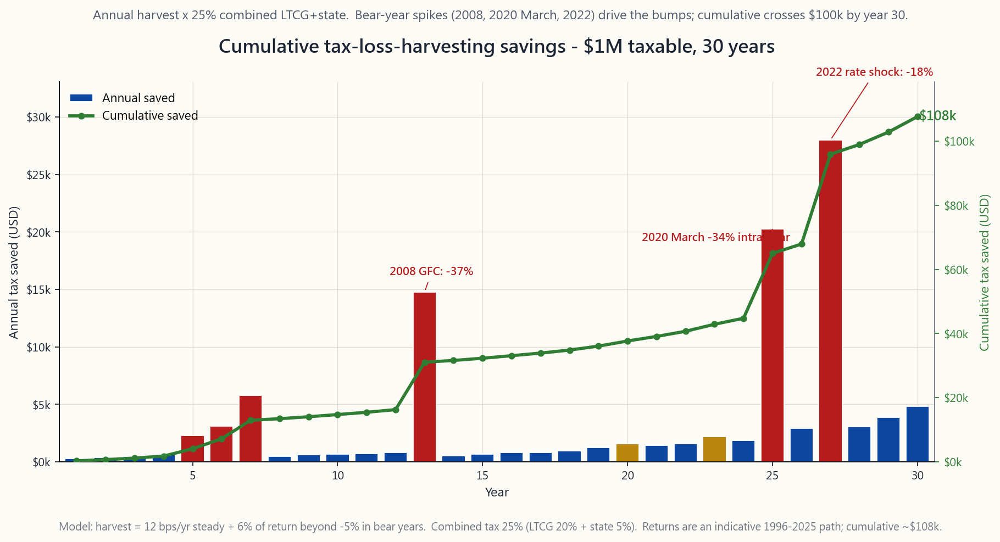

# 补充课程 04：税务效率——资产配置、税务亏损收割与 IRA/401(k) 账户组合

---

## 第一部分：阅读材料

---

### 1. 为什么这很重要

对于年收入约在 20 万至 75 万美元之间的美国家庭而言，**税务几乎永远是终身投资成本清单上最大的一项支出**。它超过基金费用、顾问费用和交易成本的总和——而且差距高达一个数量级。在 32% 的联邦税率加上典型的 5% 州税率下，一个均衡的应税投资组合每年会在不知不觉中损失 1.0% 至 1.7% 的税务拖累，因为券商账单上显示的是税前数字。以 7% 的实际收益率复利计算三十年，**税后**终值比电子表格上粗略估算的数字低 25%至 40%。

好消息是，相关规则是公开的，税率也是白纸黑字写明的，而且大部分可用的效率优化都是机械性操作。前 80% 的工作不需要税务律师，只需四个步骤，按顺序执行：

1. **了解税率表。** 长期资本利得和合格股息适用单独的、更低的税率档位，而非与工资相同的税率档位。弄清楚自己所处的档位，会影响投资组合中哪类资产应放在哪个账户。
2. **将正确的资产放在正确的账户中。** 一笔 10 万美元的 BND 仓位在任何账户中产生的税前利息都相同。放在普通券商账户中，每年 4 月需向美国国税局缴纳 32% 以上的利息税；放在传统 IRA 中，提取前无需缴税。资产本身完全相同，**账户位置**却改变了税后收益曲线。
3. **系统性地进行税务亏损收割。** 当某个持仓处于浮亏状态时，卖出并重新建立类似敞口，可将账面亏损变现，用于抵消投资组合其他地方的资本利得。大多数散户投资者之所以白白放弃这笔钱，是因为洗售规则看起来比实际上更复杂。
4. **以正确的顺序填满各账户。** Roth、传统 IRA、HSA、401(k)、应税券商账户——每种账户在资金流入、持有期间和提取时的税务处理方式各不相同。填充顺序错误，退休时可能损失数十万美元。

本课程是上述四个步骤的操作手册。更深层的规则——"最大的隐性费用是税务；利用期权和杠杆来管理它"——放在整个体系的最末端。一旦先把容易实现的结构性优势拿到手，边际税务效率的提升就来自于**如何持有**仓位（LTCG 持有期、第 1256 条款的 60/40 分拆、将期权作为递延收入），而不是你买了哪只基金。

---

### 2. 你需要掌握的知识

#### 2.1 2026 年税率表——必须牢记的数字

美国有三张独立的税率表用于管理投资收入。请将 2026 年的数字（TCJA 延期后）牢记于心：

**长期资本利得与合格股息**——持有超过 12 个月。

| 税率档位 | 已婚合并申报（MFJ）应税收入（2026） | 单身申报应税收入 |
|---|---|---|
| 0% | 不超过 96,700 美元 | 不超过 48,350 美元 |
| 15% | 96,701 至 600,050 美元 | 48,351 至 533,400 美元 |
| 20% | 超过 600,050 美元 | 超过 533,400 美元 |

在此基础上，**3.8% 的净投资收入税（NIIT）**适用于 MFJ 调整后总收入（MAGI）超过 25 万美元（单身超过 20 万美元）的情形。它适用于利息、股息、资本利得、特许权使用费、租金及大多数被动收入。对于 AGI 为 30 万美元的典型专业夫妻而言，*实际*长期资本利得税率因此为 15% + 3.8% = **18.8%**，而非 15%。超过 60 万美元时，联邦最高税率为 20% + 3.8% = **23.8%**。

**短期资本利得**（持有不超过 12 个月）和**非合格股息**（房地产投资信托、大多数 BDC、许多外国股票）——按**普通收入**税率征税，适用你的边际工资税档位：22% / 24% / 32% / 35% / 37%。NIIT 在此基础上同样适用。

**国债利息**——联邦普通收入，**免征州税**。加利福尼亚州一笔收益率 4.2% 的 10 年期国债，等效应税收益率约为 4.4%；在免税州，4.2% 的名义利率即为实际税后利率。

**市政债券利息**——免征联邦税；本州发行的市政债券同样免征州税。根据发行情况，通常也免征替代性最低税（AMT）。

最重要的一个结论是**税率差距**：在 32% 的联邦税档加 5% 的州税下，普通税率收入每一美元损失 37%（32% 联邦 + 5% 州），而合格股息收入每一美元只损失 20%（15% LTCG + 5% 州）。差距高达 **17 个百分点的税后收益率**，针对的是同一笔总收入。这就是资产配置所发挥的杠杆效应。

#### 2.2 资产配置——免费的午餐

原则只有一句话：**将税务效率低的资产放在税收递延账户中，将税务效率高的资产放在应税账户中。** 这是机械操作，无需技巧。以下是八类标准资产的摘要：

1. **美国宽基股票指数（VTI / SPY）。** 收益率约 1.4%，主要为合格股息，资本利得只有在*你*卖出时才会实现。在普通券商账户中的税务拖累约为每年 0.3%-0.4%。**最佳位置：应税账户。**（Roth 也可接受，但浪费了稀缺的 LTCG 优势。）
2. **宽基国际股票（VXUS / IEFA）。** 收益率结构相同，另有**境外税收抵免**，约占海外已付股息的 7%-9%——这项抵免只有在*应税*账户中持有时才能申请。将 VXUS 放入 IRA，会白白放弃这项抵免。**最佳位置：应税账户。**
3. **投资级及全债市 ETF（BND / AGG / VTEB）。** 利息收益率约 4%-5%，全部按普通收入在联邦加州税率下征税。32% 联邦加 5% 州税下，4.5% 收益率债券基金在普通券商账户中的税务拖累约为每年 1.6%。**最佳位置：传统 IRA / 401(k)。**
4. **高收益公司债（HYG / JNK）。** 问题与投资级债相同，但收益率为 7%-8%，拖累相应更大（约每年 3.0%）。**最佳位置：传统 IRA。**
5. **房地产投资信托（VNQ / SCHH）。** 分配款为*非合格普通股息*。第 199A 条款 20% 的穿透扣除将税负软化至边际税率的约 80%，但仍远差于 LTCG。**最佳位置：传统 IRA**，Roth 紧随其后。
6. **通胀保值债券 TIPS（SCHP / VTIP）。** 通胀增值部分每年均被视为*应计*普通收入，即使尚未以现金形式收到（"幻影收入"）。在普通券商账户中持有 TIPS，意味着每年都要为尚未到手的钱缴税。**最佳位置：传统 IRA / I 债券（I 债券版本会自动递延）。**
7. **MLP 及能源合伙企业（EPD, MPLX, ET）。** 分配款部分属于资本返还（在应税账户中有利），但会产生 K-1 表格。在 IRA 内，超过 1,000 美元的 K-1 收入会触发 UBIT——*无关业务收入税*——按信托税率征收，最高达 37%，且 IRA 本身需单独申报。**最佳位置：应税账户。最差位置：任何 IRA。**
8. **高成长资产和加密货币（小盘股、BTC ETF、单一股票投机）。** 收益主要来自资本利得，在普通券商账户中可无限期递延。但由于*预期复合收益率最高*，每一笔增值在免税环境中的价值最大。**最佳位置：Roth。** 一笔在 Roth 中持有的 BTC IBIT 或投机性单一股票仓位，复利增长 30 年后在 65 岁提取，是散户投资者所能进行的最强单一税务操作。

本课程顶部的图片是这一内容的可视化摘要。绿色单元格表示该资产的正确位置；红色表示错误；琥珀色表示可接受。

#### 2.3 税务亏损收割与洗售规则

税务亏损收割（TLH）是机械操作：任何当前交易价格低于持仓成本的仓位，均可卖出以将账面亏损变现，从而抵消投资组合其他地方的已实现资本利得，以及每年最多 3,000 美元的普通收入。未使用的亏损可无限期结转。对于典型的 100 万美元应税投资组合，在波动性正常的年份，每年可节省约 3,000-5,000 美元，如下图所示，**在 30 年时间跨度内，节省的税额累计约达 10 万美元**。

**洗售规则（IRC §1091）**是唯一真正的限制条件。如果你以亏损卖出一只证券，在该次卖出前后 **30 天内**，你不能在你控制的任何账户（包括 IRA 和配偶账户）中购买"实质上相同"的证券，否则亏损将被否认，并计入替代资产的成本基础。

实践中三条经过检验的操作原则：

1. **配对相似但非完全相同的 ETF。** VTI ↔ ITOT（不同发行商，追踪不同指数），VOO ↔ IVV，BND ↔ AGG。即便两只指数 ETF 追踪的指数有 95% 以上的重叠，美国国税局从未就两者之间的互换提出质疑。
2. **持有替代资产至少 31 天。** 第 31 天之后，如你偏好原来的证券，可以换回。大多数 TLH 平台（Wealthfront、Betterment、Schwab Tax-Loss Harvesting）会将这一来回操作自动化。
3. **在窗口期内不要在 IRA 中购买相同证券。** 这是最昂贵的意外洗售：大多数散户投资者没有意识到该规则跨账户适用，甚至延伸至配偶的 IRA。

从*总量*层面看，这项收割是"免费"的。但从*净额*层面看，你降低了替代资产的成本基础，因此节省的税款实际上是*递延*税款。复利带来的收益是真实的（你保有更多资金、投资时间更长），但你并非真正消除了税务负债——你是在推迟它，最好推到你能掌控税率档位的年份（提前退休、收入空档年、慈善转让，或身故时享受成本基础重置）。

#### 2.4 Roth 转换与超级后门 Roth

两项在职业生涯中能带来巨大复利效应的高级操作。

**Roth 转换。** 你将资金从传统 IRA 或 401(k) 转入 Roth IRA。转换金额在转换当年按普通收入纳税。此后 Roth 账户永久免税增长，且不受 RMD（72 岁起强制最低提款，SECURE 2.0 法案下当前年龄为 75 岁）约束。只要**你*当前*的边际税率低于同一笔钱*未来*的边际税率**，这笔算术就对你有利。

典型案例：一位 60 岁的退休者拥有 150 万美元的传统 IRA，等到 75 岁时 RMD 强制要求每年提款约 6 万美元，叠加社会保障金后适用 22% 以上的税率档位。相反，如果这位退休者在 60 至 70 岁的*低收入空档年*每年转换 5 万美元，以 12%-22% 的税率入账，提取时税率为零。生命周期税负在转换金额上降低 5 至 10 个百分点。

**超级后门 Roth。** 约半数的 401(k) 计划允许在常规 23,500 美元员工上限之外额外缴纳*税后*（非 Roth）资金，直至合并年度上限 70,000 美元（2026 年）。这些税后资金可立即滚入 Roth 状态——在计划内转换或转至 Roth IRA——每年可额外注入最多 **46,500 美元的 Roth 资金**。注意事项：仅约 50% 的计划支持计划内转换，具体规则是向 HR 部门询问的问题，而非税务律师的工作。如果你的计划支持，这是美国税务体系中杠杆最高的单一税务操作。

#### 2.5 HSA——三重税务优惠账户

健康储蓄账户（HSA）是美国唯一**流入时免税、增长免税、流出时免税**（前提是提款用于合格医疗支出）的账户。2026 年缴款上限：单身 4,400 美元 / 家庭 8,750 美元。HSA 仅面向加入合格高自付额健康保险（HDHP）的人群开放。

高杠杆操作是：**为 HSA 注资，将其投资于全市场指数基金，并自费支付当期医疗账单**——同时保留好收据。经过 30 年复利增长，HSA 可超过 30 万美元，你可以随时以*旧有*医疗收据报销——全程免税。这实际上将一个看似是医疗账户的工具，转变为无收入限制、缴款上限与工资无关、无强制提取年龄的隐形 Roth IRA（65 岁后用于非医疗目的的 HSA 提款按普通收入征税——与传统 IRA 相同——因此最坏的情形不过是"传统 IRA"待遇）。

对于任何可以使用 HSA 的投资者，它是缴款优先级中的**第一个美元**，甚至在 401(k) 雇主匹配之前。

#### 2.6 账户填充顺序

2026 年，每一新增储蓄美元的完整优先级顺序：

1. **401(k) 缴款至雇主匹配上限。** 第一天获得 100% 回报，毫无商量余地。
2. **HSA 缴款至上限（如符合条件）。** 三重税务优惠。
3. **401(k) 缴款至 23,500 美元员工上限。** 根据税率档位选择传统或 Roth——若当前税率低于预期未来税率则选 Roth，反之选传统。
4. **后门 Roth IRA，7,000 美元。** 面向收入超过直接 Roth 收入限制的高收入人群（2026 年单身 MAGI > 165,000 美元，MFJ > 246,000 美元）。
5. **超级后门 Roth，如计划支持，最高 46,500 美元。**
6. **应税券商账户。** 一旦税收优惠账户上限用尽，剩余资金进入应税账户——资产配置与 TLH 的纪律正是在这里发挥作用。
7. **529 教育储蓄计划**，与步骤 1-6 同步进行，适用于有大学费用需求的被抚养人——上限因州而异，但每位受益人 10,000-15,000 美元是典型的甜蜜点。

#### 2.7 提款顺序——分配侧税务规划

积累阶段的顺序在分配侧有其镜像。标准退休提款顺序：

1. **首先满足强制最低提款（RMD）**（传统 IRA 75 岁起，继承 IRA）。
2. **其次提取应税账户。** 从应税账户卖出的资产可受益于你积累的成本基础（以及你已收割的亏损）。资本利得变现是有意为之的——你可以选择高成本批次，若应税收入低于门槛，将留在 0% LTCG 税率档位。
3. **第三步提取传统 IRA / 401(k)。** 提款为普通收入；通过将年度提款控制在下一档位边界以内来管理税率档位。
4. **最后动用 Roth。** Roth 账户免税增长，无 RMD，提取免税。最后动用可最大化免税复利，并将其留给晚年支出、慈善转让或遗产传承（继承人在 SECURE 2.0 法案下可享有 10 年免税期）。

一个微妙而强大的变体：在退休与 75 岁（或更早领取社会保障金）之间的空档年，保持低普通收入，利用这些年份将**传统 IRA → Roth**转换（参见第 2.4 节），同时从应税账户提取生活费用。这是提前退休者可以采取的最有效的终身税务管理操作。

#### 2.8 通过期权和杠杆实现税务优化

一旦第 2.2-2.7 节的步骤成为机械操作，税务效率边际提升的空间便来自于**如何持有**仓位。有四项仓位级别的操作：

- **使用第 1256 条款合约（SPX / NDX 指数期权、/ES 期货、/MES、/MNQ）。** 这些合约*无论持有期长短*，均按 60% LTCG / 40% STCG 征税——混合最高税率约 26.8%，而短期股票期权为 37%。对于活跃期权卖方，这意味着全面降低约 10 个百分点的税率。
- **用备兑代替卖出。** 若某只股票有 20 万美元的内嵌利得，不要卖出来减少敞口——而是叠加一个空头看涨期权（备兑看涨期权）或领式期权（多头看跌期权 + 空头看涨期权）。你收取期权费或支出甚少，三角值（delta）下降，内嵌利得保持未实现状态。
- **用合成多头替换实际股份。** 同一行权价的多头看涨期权加空头看跌期权，可复制 100 股的风险敞口，但使用的资本约少 10 倍。在持有合成仓位的同时卖出标的股票，若处于浮亏状态，可*变现税务亏损*（需考虑合成仓位的洗售问题——建议请税务专业人士审核这一结构），并释放资本用于其他用途。
- **箱式价差与投资组合保证金贷款。** 以低于国债利率的成本抵押投资组合借款，使用现金，永不卖出。仓位持续免税复利增长，直到你最终卖出，或在身故时享受成本基础重置。

这些操作将"优秀"与"卓越"的税后收益区分开来，在 30 年时间跨度内尤为明显。它们对于获取 80% 可用效率并非必要——第 2.2-2.7 节的体系已经覆盖这部分——但它们是弥合最后 20% 差距的方式。

---

### 3. 常见误区

**1. "所有股息的征税方式相同。"** 错误。持有超过 60 天的美国 C 类公司合格股息按 LTCG 税率征税。房地产投资信托分配款、BDC 分配款、MLP 有保障支付款及大多数外国股息属于*非合格*股息，按普通收入税率征税。

**2. "我可以将全部投资亏损抵扣收入。"** 每年最多仅能抵扣 3,000 美元普通收入（已婚分开申报为 1,500 美元）。超额亏损首先抵消已实现资本利得，剩余部分无限期结转，抵消未来资本利得。

**3. "债券放入 Roth 很聪明，因为它们'安全'。"** 恰恰相反。债券产生普通收入，享受最差的税务待遇。将债券放入 Roth，是用 Roth 的免税增长优势去庇护投资组合中*预期收益率最低*的资产。债券应放在传统 IRA，让利息收入递延到低税率的退休年份。

**4. "TIPS 和 I 债券是同一种东西。"** 并非如此。在普通券商账户中持有的 TIPS，每年均会产生通胀增值的幻影收入税单。I 债券将税务递延至赎回时。TIPS 仅应在 IRA 中持有；I 债券放在任何账户均可。

**5. "卖出后我需要等待 30 天*之后*才能买回相同证券。"** 窗口期是卖出前 30 天*和*卖出后 30 天——以卖出为中心的 61 天完整窗口。而且涵盖 IRA、配偶的 IRA 以及任何联名账户。

**6. "Roth 永远优于传统 IRA。"** 错误。当你*当前*的边际税率*低于*退休时的边际税率时，Roth 才胜出。大多数处于职业巅峰期的高收入人群税率在 32%-37% 之间；传统 IRA 缴款以该税率抵扣，而退休后提款通常适用 22%-24%。在这种情况下，传统 IRA 更优。

**7. "MLP 放入 IRA 没问题，因为 IRA 不缴税。"** 它们会触发 UBIT——无关业务收入税——按信托税率征收，这是税法中最高的税率。如果你的 MLP K-1 申报超过 1,000 美元的 UBTI，你的 IRA 本身需申报 990-T 表格并缴税。将 MLP 排除在所有税收优惠账户之外。

**8. "税务亏损收割永久消除了税务负债。"** 它只是递延了负债。替代资产的成本基础降低，等于原始成本减去已收割亏损。当你最终卖出替代资产时，资本利得会因你此前收割的金额而相应增加。收益在于已递延税款的货币的时间价值，以及在低税率年份（或通过身故时成本基础重置而永不）实现的期权价值。

**9. "如果我未来的税率档位更低，Roth 转换毫无意义。"** 是的——这正是你*不应该*转换的情形。每年运行一次税率档位比较。在当前档位低于未来档位的年份转换；在未来档位低于或等于当前档位的年份按兵不动。

**10. "HSA 是医疗账户，与我的投资无关。"** HSA 是美国税务体系中最强大的税收优惠*投资*账户。"健康"的标签是历史遗留问题。如果你的 HSA 资金存放在年利率 0.05% 的储蓄账户中，你正在白白放弃三重税务优惠。

---

### 4. 问答

**Q1：我今年 35 岁，处于 24% 税率档位，拥有 40 万美元应税账户、15 万美元传统 IRA 和 5 万美元 Roth IRA。新增缴款应该怎么分配？**

A：按优先级顺序：401(k) 至雇主匹配上限 → HSA 至上限 → 传统 IRA 401(k) 至上限（24% 抵扣力度不错）→ 后门 Roth IRA → 超级后门（如计划支持）→ 应税账户。在现有余额方面，将债券和所有房地产投资信托仓位从应税账户转移至传统 IRA，并将宽基指数基金和国际股票留在应税账户。Roth 账户用于承载任何投机性高成长敞口（小盘股、加密货币 ETF、成长型单一股票）。

**Q2：税务亏损收割能带来多少实际超额收益？**

A：根据经验数据，在 32% 联邦 + 5% 州税率下，对均衡股票投资组合每年可产生 30-60 个基点的税后超额收益。随着投资组合成本基础的提高（经历漫长牛市后可收割的空间减少），收益会下降；而在 2008 年和 2020 年 3 月等高波动年份，单一税务年度内在 100 万美元账面上可产生逾 15,000 美元的节税。30 年累计：基于 100 万美元起始余额（具体取决于路径），节税约 10 万美元。

**Q3：我超过了 Roth IRA 的收入限制。我还能缴款吗？**

A：可以，通过**后门 Roth IRA**：向传统 IRA 缴纳 7,000 美元不可抵扣资金，然后立即转换为 Roth。若你没有其他税前传统 IRA 余额，转换免税（*按比例规则*是唯一的陷阱——如果你唯一的传统 IRA 余额就是你刚刚注入的那笔，则该规则不适用）。对于超过 23,500 美元员工上限的 401(k)，超级后门 Roth 是对应的操作。

**Q4：Roth 转换的数学何时成立？**

A：每年运行一次比较。若转换金额*当前*适用的边际税率低于同一笔钱*预期退休时*适用的边际税率（计入社会保障金、养老金和 RMD 后），则执行转换。若更高，则不转换。最可靠的转换年份是提前退休的空档年（60-70 岁），这期间普通收入较低，可以以较低成本填满 12%/22% 的税率档位。

**Q5：在应税账户中，市政债券是否总是优于国债？**

A：比较**税收等效收益率**：市政债券收益率 ÷（1 - 联邦税率 - 州税率（如为州内发行）。在 32% 联邦 + 5% 州税率下，一笔 3.5% 收益率的州内市政债券的税收等效收益率为 3.5% ÷（1 - 0.37）= **5.55%**。一笔 4.2% 收益率的国债的税收等效收益率为 4.2% ÷（1 - 0.32）= **6.18%**（已计入州税豁免）。在此情形下，国债更优。通常在 35%-37% 的联邦税率档位才会出现临界点。

**Q6：我可以在 IRA 中进行税务亏损收割吗？**

A：不能——IRA 内部不涉及税务，因此没有亏损可以收割。更糟糕的是，IRA 内购买实质上相同的证券，可能会*触发*对应税账户中亏损卖出的洗售，永久否认该抵扣（成本基础调整无法应用于 IRA 内的仓位）。

**Q7：州所得税是否会影响资产配置决策？**

A：是的，影响显著。国债免征州税，因此在高税率州（加州 13.3%、纽约州 10.9%、夏威夷州 11%），在*应税账户*中持有国债的理由更充分，因为你可以节省 IRA 不额外减免的州税。在 0% 税率州，超过 35% 的联邦税率档位时市政债券优于国债；在高税率州，超过 32% 的联邦税率档位时市政债券便已更具吸引力。

**Q8：TIPS 的"幻影收入"是什么，为何重要？**

A：TIPS 的本金每月随 CPI 通胀调整。美国国税局将该调整视为当年应税普通收入，即使你在到期前实际并未收到现金。在普通券商账户中，你每年需为应计收入缴税；在 IRA 中，这种调整无关紧要，因为 IRA 内部的任何收益在提取前均不征税。TIPS 应放在 IRA 中。

**Q9：我在 AAPL 上有 20 万美元的内嵌利得，卖出的税务成本超过 4 万美元。如何在不卖出的情况下降低敞口？**

A：三个方案。**备兑看涨期权**——卖出一个 30 delta、60 DTE 的看涨期权，收取 1%-2% 期权费，保持利得未实现，放弃部分上涨空间（第 27 周）。**领式期权**——买入一个 25 delta 看跌期权 + 卖出一个 25 delta 看涨期权，由看涨期权的期权费抵消成本，在不实现利得的情况下锁定一个价格区间（第 30 周）。**合成空头叠加**——做空等量指数期货以对冲市场贝塔风险；AAPL 的非系统性风险敞口得以保留。每种方案均能降低敞口而不触发税务事件。这就是通过期权实现税务优化。

**Q10：我应该优先选择 Roth 还是 HSA 缴款？**

A：HSA 优先——三重税务优惠（流入可抵扣、免税增长、用于医疗支出免税提取），优于 Roth 或传统 IRA。然后是 401(k) 至雇主匹配上限。之后根据税率档位数学选择 Roth 或 Roth 401(k)。HSA 唯一的注意事项是：65 岁前用于非医疗目的的提款须缴纳 20% 罚款加普通收入税——65 岁后罚款豁免，最坏情形等同于"传统 IRA"待遇。

**Q11：3.8% 的净投资收入税在实际中如何运作？**

A：它适用于以下两者中的*较小值*：（a）净投资收入，或（b）MAGI 超过门槛的部分（MFJ 25 万美元 / 单身 20 万美元）。以 MAGI 30 万美元、4 万美元投资收入为例，应缴 3.8% × min(4 万, 5 万) = 1,520 美元。应对方法与应对任何税务问题相同：降低投资收入（资产配置）、降低 MAGI（传统 401(k) 缴款），或两者并举。实际效果是将受影响家庭的*实际* LTCG 税率推至 18.8% / 23.8%。

**Q12：本课程中的税务优化工具实际能做什么？**

A：输入你的联邦税率档位、州税率、应税账户 / 传统 IRA / Roth IRA 余额以及当前年龄，它将计算：（1）八类标准资产的最优资产配置位置；（2）在合理增长假设下，各账户类型在 65 岁时的预计税后财富；（3）基于你的应税账户余额和假设股票波动性，建议的年度税务亏损收割目标金额；（4）建议的年度 Roth 转换金额，以填满当前边际税率档位而不跨越下一临界点为目标。这不是税务建议——它是本课程所述操作的一个粗略估算检验工具。
