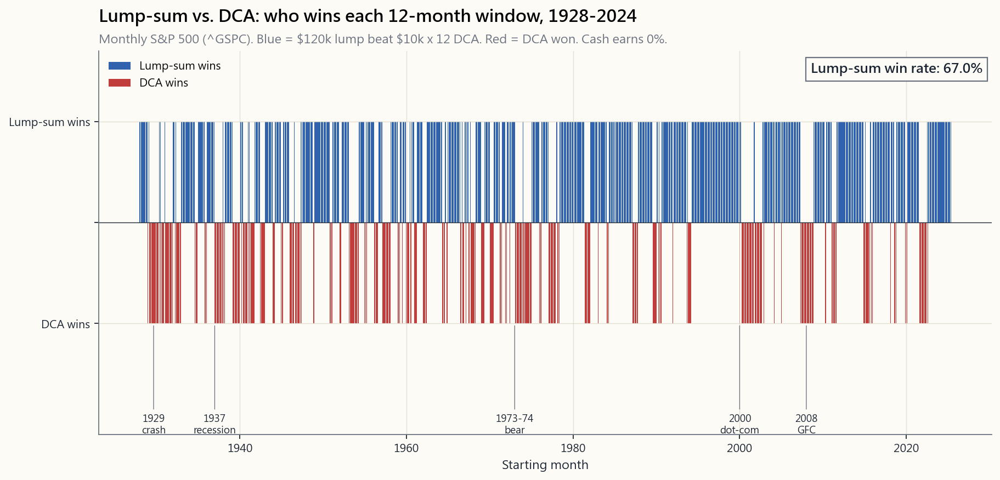
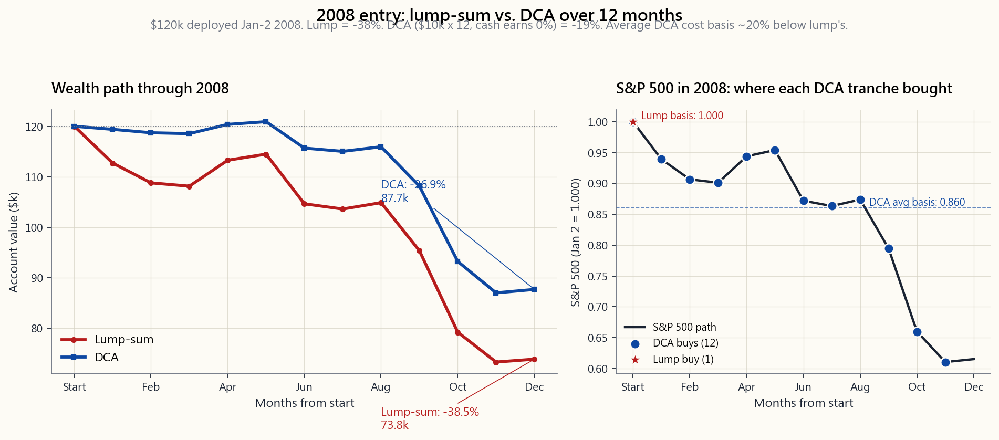

# 附加课程 05：定投 vs. 一次性投入——数学、行为与各自胜出的时机

---

## 第一部分：阅读材料

---

### 1. 为何重要

每位投资者迟早都会盯着一笔现金，问自己同一个问题：*一次性全部投入，还是分批买入？* 继承了遗产，发了年终奖，卖了房子，或者把 401(k) 转了账。现金趴在货币市场基金里赚着 4.2% 的利息，每个周一早上这个问题都会变得更加尖锐。

这是投资领域为数不多的几个角落之一，教科书的答案与人类的直觉真正产生分歧。数学上毫无歧义：**一次性投入在随后十二个月内约三分之二的时间里胜出**，且长期*预期*期末财富更高。行为学方面同样清晰：定投入市可以降低后悔的波动性，减少在高点买入的概率，而且最重要的是——它能让资金真正*得到投资*，而不是再在场外坐等三年，等一个"更好的时机"。

本课程入选的四个理由：

1. **大多数散户的认知框架是错的。** 如果你是一名领薪水的上班族，每张工资单都会自动供款，那你本来就是被动定投——这是你唯一的选择。一次性投入 vs. 定投的问题，真正适用于*意外所得*。
2. **"等跌了再买"是最糟糕的第三条路。** 场外持有现金不是第三种策略，而是在第一和第二之间*拒绝选择*。
3. **定投胜出的 33% 时间，恰好包含那些让投资者终身难忘的至暗时刻**——2000-2002 年和 2008 年。正是这种对噩梦情景的偏差，决定了行为学故事的重要性。
4. **先保持存活，再谈正确**——理性上正确但在底部恐慌卖出的投资者，早已满盘皆输。定投是理性的行为对冲，能让不那么理性的你继续留在市场里。

---

### 2. 你需要了解的内容

#### 2.1 清晰定义两种策略

**一次性投入（LSI）。** 你收到 12 万美元。第一天，按目标配置全仓买入。第二天起，什么都不做。

**定投（DCA）。** 你收到 12 万美元。将其拆分为等额份额——标准做法是每月 1 万美元，共十二个月——按固定计划逐批买入目标配置。尚未投入的现金放在货币市场基金赚取收益（2026 年 4 月，国债利率约为 4.2%）。

**定投*不是*什么。** 每张工资单往 401(k) 或个人退休账户里存 1000 美元，是*系统性投资*，不是定投。你没有一笔现成的资金需要部署；你有的是持续流入的新收入。一次性投入 vs. 定投的问题对此根本不适用。把工资供款称为"定投"，是共同基金行业的营销话术——当作销售口号有用，用来做决策毫无价值。顺便说一句：401(k) 的月供，也是最有力的证明——根本不存在真正的被动收入——*输入*，也就是你在讨论时机之前就从工资里省出来的那部分，才是做一切事情的前提。计划是自动的；储蓄不是。

本课程要解决的问题很具体：

> *我现在手里有一笔已准备好按目标配置投资的资金。我应该周一全部买入，还是把购买分散到 N 个月？*

#### 2.2 数学：一次性投入在期望值上胜出

如果你对目标配置的预期收益为正——它必须为正，否则你为什么要投资——那么一次性投入的期末财富期望值**严格高于**定投的期望值。证明只需一行：

$$
\mathbb{E}[\text{LSI}] = P (1 + \mu)^N \quad > \quad \mathbb{E}[\text{DCA}] = \frac{P}{N} \sum_{k=1}^{N} (1 + \mu)^{N-k+1}
$$

在 $\mu$ 为正的情况下，越早部署的每一美元复利时间越长。定投在部署窗口内平均有一半资金持有现金；这一半赚的是现金利率，而非股票回报率。股票预期收益率（约 7-9% 名义收益）与现金利率（约 4%）之间的利差，就是定投在平均结果上付出的*代价*。

这个代价用美元算有多大？将 12 万美元分十二个月部署进一个 60/40 投资组合（相对现金的预期收益约 6.5%），定投在期望值上损失大约 **0.5-0.7% 的期末财富**，即 12 万美元的 600-850 美元。绝对值不大，但会永久复利——这个差距永远不会弥合。

#### 2.3 历史数据：约 67% 的时间一次性投入胜出

先锋集团 2012 年研究（Shtekhman、Tasopoulos 和 Wimmer）在三个市场——美国（1926-2011）、英国和澳大利亚——模拟了这一交易，发现在所有滚动 12 个月窗口中，一次性投入大约在**三分之二**的时间内胜过 12 个月定投。具体数字因资产配置而异：

| 配置 | 一次性投入胜率 | 平均跑赢幅度 |
|---|---|---|
| 100% 股票 | 66% | +2.4% |
| 60/40 | 67% | +2.3% |
| 100% 债券 | 70% | +1.6% |

2023 年先锋集团更新研究（Aliaga-Diaz 等，*Cost Averaging: An Analysis...*）使用 1976-2022 年数据，确认了同一区间。这一结论在债券主导的 1980 年代、股票繁荣的 1990 年代、2000 年代失去的十年以及 2010 年后的牛市中均保持稳健。它不会消失。

胜率不是 100%，原因显而易见：市场历史上有三分之一的 12 个月窗口是*下跌的*，而在下跌市场中，定投——因为持有现金时间更长——亏损更少。这正是期望值论点的镜像。一次性投入有更高的*均值*结果，是因为它有更高的结果*方差*。定投通过持有现金截断了左侧尾部；作为交换，它也截断了右侧尾部。

#### 2.4 定投胜出的 33%：噩梦日历

定投胜出的三分之一时间并非随机分布，而是紧密聚集于市场历史上最糟糕的入场点：

- **1929-1932 年。** 1929 年 10 月一次性投入：一年末期末财富约为 -68%；定投将亏损分散于崩溃过程中，最终下跌幅度远小于此。
- **1937-1938 年。** 罗斯福经济衰退；一次性投入 12 个月内下跌 -38%。
- **1973-1974 年。** 滞胀熊市；一次性投入 -42%，定投 -22%。
- **2000-2002 年。** 互联网泡沫瓦解；2000 年初一次性入场，十二个月后下跌 -25%。
- **2008 年。** 这是投资者最刻骨铭心的一年。**2008 年 1 月一次性投入 = -38%**，年末收盘。**2008 年 1 月定投 = -27%**，年末收盘（现金收益为零；若闲置现金按先锋原版研究假设赚取国债利率，则接近 -19%）。

数学很直接：按十二等份分批买入，定投投资者在 2008 年 12 月以较 1 月起始价格低约 40% 的价格买入最后一笔 1 万美元。他们的平均成本比一次性投入者低约 20%。2009 年 3 月反弹开始时，定投投资者更快回到盈亏平衡点。

话虽如此：即便是 2008 年的定投，也很痛苦。定投投资者在账面上仍在 2008 年底亏损了约 19%（闲置现金赚国债利率）至 27%（现金零利率）之间。两种策略均在 2012-2013 年前后以名义值回本（实际值则更久）。两种策略都没有*躲过*熊市，只是程度不同。

#### 2.5 定投的行为学理由——后悔方差

纯粹的预期效用理论说一次性投入更优。而行为金融学——它真正建模的是人类*体验*结果的方式——补充了教科书遗漏的两个因素：

1. **后悔厌恶。** 在高点买入后眼看持仓跌去 30% 的痛苦，感受是不对称的——远比在低点买入后涨了 30% 的快感强烈得多。损失厌恶被测量为大约 2:1——卡尼曼与特沃斯基的数字——意味着犯错的感受代价是做对的感受收益的两倍。
2. **持续焦虑。** 一次性投入者眼看 12 万美元在三个月内缩水到 9 万，很多情况下会*卖出*——在定投者还在持续买入时锁定亏损。行为失败的根源不是策略本身，而是在最糟糕的时刻*放弃*策略。

定投是针对*你自己不理性一面*的理性对冲。付出 0.5-0.7% 期末财富的期望值代价，换来的是 2009 年 3 月那个版本的你仍然还在市场里。再说一遍：不理性但有偿付能力，好过理性却已破产。

如果你*诚实地*认为自己是那种不会因一次性投入 30% 的账面回撤而恐慌的投资者——第 11 周有实际数据，告诉你真正通过这道测试的人有多少——那就选一次性投入。如果你有任何怀疑，定投 0.6% 的期望值代价，是为自己未来行为买的一份廉价保险。

#### 2.6 真正的反模式：现金趴在场外

真正严重的失误不是一次性投入 vs. 定投之争，而是*两者都不选*。拿到一笔意外之财的散户，大多数并不会一次性投入，也不会定投——他们把现金放着 18-36 个月，等一个"更好的入场点"。然后市场在等待期间又涨了 30%。然后他们觉得市场"太高了"。然后继续等。

先锋集团 2012 年的研究把这一点用一个数字说清楚了：在滚动 12 个月窗口内，现金的表现劣于 60/40 投资组合的概率约为 **67%**——和一次性投入 vs. 定投的数字相同——但离散程度更大。持有现金一年等待回调，期望值上损失约 4% 的期末财富，而这一代价在你拖延的过程中持续复利。

关于*投什么*的说明。对于本课程的目标读者——第一个投资组合，学徒阶段——一次性投入的接收端是 SPY（或同类宽基美股指数交易所交易基金），而非现金、黄金和期权结构组成的杠铃。杠铃组合是我今天运行的配置，但它只有在你内化了宏观体制逻辑、搭建好投机端所需工具箱之后才能发挥作用。跳过学徒阶段，你一边丢掉了指数核心，另一边持有的是你根本不会操作的仓位。先一次性投入到指数，完成学徒期，*再*考虑调整配置形态——按这个顺序来。

决策框架如下：

1. **你要把这笔钱投出去**——这是先验前提，时机问题在此之后才谈。
2. **如果你能承受波动性，就选一次性投入。** 数学告诉你，三分之二的时间你会更富有，且在期望值上始终更优。
3. **如果你不能承受，就选 6-12 个月定投。** 付出少量期望值代价，换取行为稳定性。从第一天就设好计划，不要因市场涨跌而调整。
4. **永远不要等。** 把现金放在货币市场基金里"等市场稳定"不是策略。那是用理财顾问的外壳包装的拖延症。

#### 2.7 实操规则——如果你要定投，就做对它

如果你选择定投，三条规则让它真正起作用：

1. **提前确定部署窗口并*自动化*。** 每月第一个工作日买入 N 元，共 N 个月。设成自动划转。不要允许自己在价格看起来高时"跳过"某个月，或在价格低时"加倍买入"——那是披着定投外衣的择时，历史记录比任何一种纯粹策略都更糟糕。
2. **六到十二个月是最佳窗口。** 超过 12 个月，现金拖累占主导——你基本上是在持有现金。短于 3 个月，不如干脆一次性投入。
3. **本页的互动工具让你重演 1928 年至 2024 年任意起始年**，部署窗口从 3 个月到 24 个月可选。试试那些糟糕的年份——1973 年 1 月、1987 年 10 月、2000 年 1 月、2008 年 1 月。再试试那些好年份——1995 年 1 月、2009 年 1 月、2020 年 1 月。规律和数学说的完全一致：一次性投入通常胜出，定投在灾难中胜出，而灾难是集群分布的。

互动面板提供完整回测。上方两张静态图用压缩形式讲了同一个故事：跨越百年月度起始点的历史胜率，以及定投行为价值得到体现的标志性 2008 年案例。

---

### 3. 常见误区

**1. "定投能降低风险。"** 它只降低*部署窗口期内*的风险。一旦第 12 个月全部部署完毕，你持有的风险与一次性投入者完全相同。定投是一种过渡策略，不是投资组合策略。

**2. "定投能让你获得更低的平均成本。"** 只在下跌市场里才对。在上涨市场——即所有 12 个月窗口中的三分之二——定投给你的平均成本*高于*从一开始就全仓买入的成本。

**3. "把购买分散到全年能平滑波动性。"** 在 12 个月末，你期末财富的波动性在定投下确实更低，但大约只低 30%。它不是零。该策略是更平缓的，不是绝缘的。

**4. "我一半一次性投入，一半定投。"** 这是合理的折衷方案，以一半的期望代价获得定投大部分的行为收益。先锋集团数据显示，50/50 混合方案在期望收益和后悔程度上，大致落在两种纯策略的中间位置。

**5. "定投有效，是因为低价时能买到更多份额。"** 这是标准的销售话术，只有当部署窗口内的平均价格低于起始价格时才成立——即在下跌市场中。这不是什么神奇属性；这只是低价买入的算术。

**6. "我应该对工资供款做定投。"** 你的工资供款*已经是*定投了——必须如此，因为收入是分批到账的。你不是在选择定投；你根本没有一笔现金可以部署。一次性投入 vs. 定投的问题，对系统性 401(k) 供款真的不适用。

**7. "等一个更好的入场点，和定投是一回事。"** 不是的。定投是提前确定、机械执行的固定计划。等待回调是主观择时——在所有滚动窗口研究中，它是迄今为止三种方法里表现最差的。

**8. "既然一次性投入在期望值上更优，我就应该总是一次性投入。"** 只有当你确信*行为上的自己*在回撤时不会放弃策略时，这个逻辑才成立。这个门槛比大多数投资者意识到的要高得多。定投 0.6% 的期望值代价买到的是行为保险——有时值得，有时不值。

---

### 4. 问答

**Q1：一次性投入 vs. 定投的精确胜率是多少？**

在 1928-2024 年美国数据的滚动 12 个月窗口中，无论投入 100% 股票还是 60/40 投资组合，胜率约为 **67%**。先锋集团 2012 年研究报告在美国/英国/澳大利亚显示为 66-67%；2023 年更新研究使用 1976-2022 年数据，再次证实了这一区间。

**Q2：一次性投入平均跑赢多少？**

在 60/40 投资组合下，12 个月部署窗口内，期末财富约跑赢 **2.3%**。换算成美元，10 万美元对应约 2300 美元，且永久体现为账户余额的水平位移。

**Q3：一次性投入最糟糕的情况是什么？**

1929 年 1 月一次性入场：经历 1929 年底的股灾，第一年末期末财富约为起始资金的 *-68%*。即便分成 12 个月也不能让你完全幸免——那是 30% 的亏损，而不是 60%。1929 年更大的教训在于杠杆与集中持仓，而非一次性投入 vs. 定投。

**Q4：如果我的意外所得非常大，比如 500 万美元，怎么办？**

数学在任何规模下都是一样的。行为层面的顾虑更严重——500 万美元缩水 30%，*感受*与 5 万美元缩水 30% 截然不同。对于大额意外所得，更长的定投窗口（18-24 个月）纯粹作为行为保险更有说服力，即便期望值代价更高。大多数私人银行出于同样原因，默认采用 6-12 个月的部署计划。

**Q5：我应该用成交量加权平均价格（VWAP）还是固定日期计划？**

固定日期。每月第一个工作日是标准做法。VWAP 式的"价格感知"部署，实际上是把定投变成了择时——而这正是定投本来要保护你免受的东西。

**Q6：从市场中撤出资金时呢——应该一次性卖出还是分批卖出？**

数学是对称的：一次性卖出有更高的期望值（你持有的股权平均而言比现金赚得多），分批卖出有更低的后悔方差。但行为逻辑是反过来的，因为默认状态（持有）在你试图降低风险时才是*高风险*状态。大多数退休人士选择分批撤出，原因和其他人选择分批买入如出一辙。

**Q7：国际股票或债券的答案会变吗？**

一次性投入仍在期望值上胜出，因为预期收益为正。对于相对现金预期收益较低的资产，胜率略低——先锋集团数据显示 100% 债券约为 70%，100% 股票约为 66%。高收益资产股票收益率与现金之间的利差更大，因此一次性投入胜出的*幅度*也更大。

**Q8：这和税务有什么关系？**

一次性投入让整个头寸的持有期计时提前了 12 个月，更早满足长期资本利得的条件。对于应税账户而言，这很重要：如果你在第 13 个月卖出，一次性投入的盈利全部适用长期资本利得税率；定投则有大约一半的仓位仍按短期税率计征。长期资本利得税率是美国税法中最便宜的免费午餐，而一次性投入更早拿到它。

**Q9："把之前一直在等的现金拿来做定投"，这是一种选择吗？**

这正是大多数人*实际*的做法，完全没问题。这只是迟到的定投。代价是你在启动部署计划之前趴在现金里的那几个月。现在开始计划，执行它，停止"等更好入场点"的循环。

**Q10：互动工具能告诉我什么？**

输入金额、定投窗口（3 / 6 / 12 / 24 个月）和起始年份（1928 至 2024 年）。工具使用源自 Damodaran 年度数据集的月度收益运行回测，输出四个数字：一次性投入期末财富、定投期末财富、美元差额，以及部署窗口*期间*出现的最大回撤。选择本课程提到的灾难年份——1929、1973、2000、2008——你会看到定投真正胜出的时刻，与教科书的预测一一吻合。
