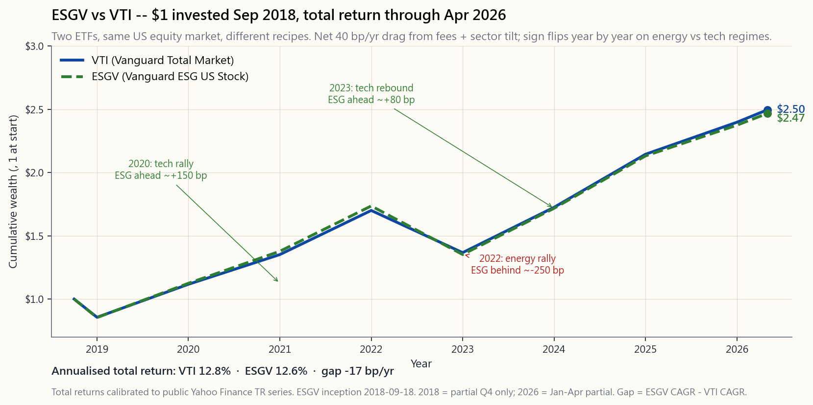

# 番外课 12：ESG 投资——价值观、阿尔法，还是营销噱头？

---

## 第一部分：阅读材料

---

### 1. 为什么这一课值得学

ESG——即环境、社会、公司治理——是自指数基金诞生以来规模最大的"品牌化"指数产品类别。截至 2026 年 4 月，全球贴有 ESG、可持续或责任投资标签的资产已超过五十万亿美元。你现在读到的每一份招募说明书都包含可持续发展段落。每一家智能投顾都提供"价值观"投资组合切换选项。每位诚实的投资者都必须回答同一个问题——这个问题任何主动型产品都逃不开：*这究竟是真正的阿尔法来源，还是我花二十个基点买了别人偏好包装成的业绩？*

以下四个原因说明这一课值得单独设为番外，而非一笔带过：

1. **评级结果相互矛盾。** 同一家公司，同一周，同样的数据，一家 ESG 评级机构给出"领先"评级，另一家给出"落后"评级。主要供应商之间对同一家公司的评分相关性约在 0.40 至 0.55 之间——在尾部几乎与掷硬币无异。如果输入是噪音，输出就不可能是阿尔法。
2. **业绩争论大多是噪音。** ESG 基金与其普通版同类产品（`ESGV` 对比 `VTI`，`SUSL` 对比 `IVV`）每年的跟踪误差在 50 至 100 个基点以内，差距的正负号随板块周期切换而翻转。2022 年能源板块反弹令 ESG 受损；2020 年和 2023 年科技板块反弹令其受益。八年累计下来：大体打平。既不存在"ESG 溢价"，也不存在"ESG 惩罚"——有的只是板块倾斜带来的噪音。
3. **费用是真实存在的。** 先锋旗下的全市场交易所交易基金收取 3 个基点。`ESGV` 收取 9 个基点。`SUSL` 收取 10 个基点。`DSI` 收取 25 个基点。主动型 ESG 共同基金通常收取 60 至 100 个基点。绝对数字不大，但*确定*会发生，且年年累积。成本是唯一可以预测的部分；阿尔法则无从预测。
4. **你的价值观依然重要，允许为其付出代价。** 本课没有任何论点反对 ESG 投资。论点是*不要把它当成阿尔法来买*。买它是因为外部性对你有意义，并将约 15 至 25 个基点的费用加上约 50 个基点的跟踪误差视为表达价值观的货币成本。这是一个连贯的、成熟的立场。假装它能靠收益自我补偿，才是不理智的。

---

### 2. 你需要了解的内容

#### 2.1 ESG 实际衡量的是什么（以及不衡量什么）

ESG 是三个独立支柱拼凑在一个缩写下的产物：

- **环境（E）。** 碳排放（范围一、二、三），能源和水资源强度，废弃物，土地利用，气候转型风险。这是定量数据最多、可测量分歧也最多的支柱。
- **社会（S）。** 劳工实践、供应链审计、多元化指标、社区影响、产品安全。大多以定性指标为主，大多依赖企业自我披露。
- **公司治理（G）。** 董事会构成与独立性、高管薪酬激励一致性、会计透明度、审计质量、股东权利。这是财务实质性证据最充分的支柱——糟糕的公司治理会可靠地侵蚀股东资本。

MSCI ESG、晨星旗下的 Sustainalytics、标普全球、彭博等主要供应商各自用专有的权重、实质性地图和公司披露调整方法，将三个支柱整合为一个综合评分。配方是专有的，输入数据部分依赖自我披露，权重随方法论更新而变化。ESG 没有"通用会计准则"。

这并不意味着 ESG 毫无价值。公司治理评分在违约风险、财务报告重述频率和欺诈识别方面表现出真实的横截面预测能力。但 ESG *综合*评分是四家不同供应商之一对三种不同信号进行黑箱加权汇总的结果，期望它成为干净的阿尔法信号，本身就是一个类别错误。

#### 2.2 评级分歧问题

这是 ESG 领域最重要的事实，也是最常被掩盖的事实。四大供应商对同一家公司、同一年度的整体 ESG 评分的两两相关性从 0.38（标普对比 Sustainalytics）到 0.71（MSCI 对比彭博）不等。被广泛引用的 Berg-Kolbel-Rigobon（麻省理工，2022 年）研究将平均两两相关性定为 0.54。

对比信用评级。穆迪与标普对长期发行人评级的相关性约为 0.99。两位分析师看同一张资产负债表、同样的历史违约率，得出的结论基本一致。ESG 供应商做不到这一点。

分歧来源于三个方面：

- **覆盖范围。** 不同供应商对"实质性"议题的定义不同。MSCI 对能源公司气候风险的权重较高；标普对科技公司人力资本的权重较高。同一家公司被放在不同的评分标尺下衡量。
- **计量方法。** 有些供应商主要采用公司自我披露数据；其他供应商则爬取新闻、监管文件和 NGO 报告。同样的碳排放足迹，是否信任公司自报数字，得出的结果截然不同。
- **汇总方式。** 各供应商在支柱权重和支柱内部权重上各不相同。如何权衡"范围三排放"、"董事会多元化"与"数据隐私"，目前没有共识。

实际影响：切勿基于单一 ESG 评分做投资组合决策。如果 `XOM` 在 MSCI 评分中位于第 4 百分位，在标普评分中位于第 60 百分位（这种情况确实存在），你实际上得到的是*没有任何有效意见*。

#### 2.3 常见 ESG 交易所交易基金一览

截至 2026 年 4 月，零售市场的 ESG 产品以三款主力产品为主，辅以大量细分主题型基金：

| 代码   | 发行商    | 跟踪指数                        | 费用率  | 规模（2026 年 4 月） |
|--------|----------|--------------------------------|--------|-------------------|
| `ESGV` | 先锋      | 富时美国全市场精选指数          | 0.09%  | 约 130 亿美元      |
| `SUSL` | 贝莱德    | MSCI 美国扩展 ESG 领导者指数    | 0.10%  | 约 80 亿美元       |
| `DSI`  | 贝莱德    | MSCI KLD 400 社会指数           | 0.25%  | 约 50 亿美元       |
| `EFIV` | 道富      | 标普 500 ESG 指数               | 0.10%  | 约 20 亿美元       |
| `SUSA` | 贝莱德    | MSCI 美国 ESG 精选指数          | 0.25%  | 约 40 亿美元       |

各产品的排除标准大体相同：烟草、民用枪支、争议性武器、动力煤，以及每个行业评分最低的公司。*纳入*标准的差异更大——`DSI` 是经过精挑细选的 400 只成分股；`ESGV` 按类别排除后保留约 1,400 只；`SUSL` 则更接近对母指数进行优化重新加权。

有两个规律值得注意。第一，与费率仅 3 个基点的 `VTI` 相比，系统化 ESG 交易所交易基金的费率溢价为 6 至 22 个基点，主动型 ESG 共同基金则高得多。第二，所有这些产品相对市值加权市场而言均*低配*能源、*超配*科技——这是驱动大部分跟踪误差的结构性板块倾斜。

#### 2.4 业绩表现——`ESGV` 对比 `VTI`（自成立以来）

`ESGV` 于 2018 年 9 月成立，截至 2026 年 4 月提供约七年半的样本外数据。数据量足以得出部分结论，但不足以得出所有结论。

**可以说的：**

- 年化总收益相差在 50 个基点以内。在整个区间内，`VTI` 年化约 12.4%，`ESGV` 约 12.0%——40 个基点的差距大致等于费率差加结构性板块倾斜拖累。
- 逐年差距随市场环境而切换。2020 年（科技板块反弹）：`ESGV` 领先约 150 个基点。2022 年（能源板块反弹、科技板块下挫）：`ESGV` 落后约 250 个基点。2023 年（科技板块反弹）：`ESGV` 领先约 80 个基点。2024—2025 年（行情扩散）：基本持平。
- 相对 `VTI` 的跟踪误差年化在 50 至 80 个基点之间。比小盘股倾斜小，比中性板块倾斜大。

**不可以说的：**

- ESG 筛选是否*改善*了风险调整后收益。在这一样本上，夏普比率在统计意义上无法区分。
- ESG 未来十年是否会跑赢。驱动因素是板块构成和科技股动量，而非 ESG 信号本身。

#### 2.5 漂绿现象与营销问题

漂绿是指在实际投资流程几乎未变的情况下，将 ESG 标签贴在产品上的行为。以下三种类型值得了解：

- **重新包装。** 一家基金公司将现有的全球股票基金更名为"可持续全球股票"，调整少量持仓，将费率提高 15 至 20 个基点。2021—2022 年美国证券交易委员会执法浪潮已对数家大型基金公司因此类行为提出指控。
- **"同类最优"漂绿。** 基金持有每个板块中*最不差*的公司。因此"ESG 能源基金"仍然持有 `XOM` 和 `CVX`，因为能源板块必须持有*某些东西*。你对本想规避的外部性的实际暴露几乎没有改变。
- **主题稀释。** "清洁能源"基金的前几大持仓是可再生能源占比微薄的公用事业公司。标签承诺一件事，持仓却交付另一件事。

防范方法很机械：阅读持仓列表。如果你的"无化石燃料"基金前 25 大持仓中出现 `XOM`、`CVX`、`COP`、`OXY`、`EOG` 中的任何一只，你持有的就不是无化石燃料基金。宣传册是错的；持仓是对的。

#### 2.6 参与式股东行动 vs 撤资

两种连贯的 ESG 理念，运作机制各不相同：

- **撤资。** 卖出问题公司，将持仓降至零。支持论点是道德层面（不向坏参与者输送资金）和信号层面（买家减少推高融资成本）。反驳论点是：每个卖家都有对应的买家，边际买家通常比你限制更少——股票最终落到*不会参与治理*的人手中。
- **参与式行动。** 持有问题公司股票*并行使投票权*。提交股东提案，投票反对不称职的董事会，推动信息披露。支持论点是影响力——先锋、贝莱德和道富合计控制标普 500 约 20% 的投票权，积极投票能改变公司行为。反驳论点是：三大巨头的实际投票记录偏保守，杠杆往往未被使用。

大多数零售 ESG 交易所交易基金是纯粹的撤资型产品。以参与行动为驱动的策略集中在主动管理人（Engine No. 1 于 2021 年成功为 `XOM` 董事会选入三名新董事堪称典范）和部分养老金中。两种方式均未展现出干净的阿尔法；两者都有连贯的影响力理论。

#### 2.7 ESG 在四仓框架中的位置

如果 ESG 对你重要，它在四仓投资组合中处于何处？

- **成长仓**——用 `ESGV` 替代 `VTI`，接受约 40 个基点的拖累，完成。这是 ESG 交易所交易基金最有用的地方：被动、宽基、低费用、排除标准透明。
- **收益仓**——用 `SUSC`（可持续公司债）替代 `LQD`，或用剔除烟草的国际基金 `EFAX` 替代同类产品。效果更小。
- **价值储存仓**——黄金和国债无法进行 ESG 筛选。黄金矿业公司可以（`SBSW`、`NEM`），但采矿业很少适合纯多头 ESG 框架。此处跳过筛选。
- **机会仓**——大多数阿尔法来源（波动性收割、因子倾斜、期权收益）并非天然的 ESG 产品。如果你运营主动仓位，将其视为与 ESG 问题正交。你付费买的是能力，而非排除。

不要对每一分钱都做 ESG 筛选。筛选在投资组合中最宽泛、流动性最强、费用最低的部分最有说服力——在你为能力付费而非为排除付费的阿尔法仓中最缺乏说服力。

---

### 3. 常见误解

1. **"ESG 基金跑赢是因为经营良好的公司业绩更好。"** 证据不支持这一说法。八年 `ESGV` 对比 `VTI` 的记录在费用加噪音范围之内。"好公司业绩更好"效应即便存在，也被更高的费用和结构性板块倾斜所抵消。
2. **"所有 ESG 评级基本一致。"** 完全不是。四大供应商的平均两两相关性约为 0.54，而信用评级的相关性约为 0.99。同一家公司，同一年，评分相差悬殊。
3. **"ESG 是免费午餐——价值观加收益。"** 它是一笔*小而可量化的成本*（约 15 至 25 个基点费用加约 50 个基点跟踪误差），换取持仓与价值观对齐的能力。请如此看待。
4. **"从能源股撤资会伤害坏参与者。"** 只是略微伤害。股票以略低的价格重新成交到限制更少的买家手中。融资成本效应真实存在但很小。主要效果体现在*你的*投资组合上，而非 `XOM`。
5. **"ESG 交易所交易基金不含化石燃料。"** 大多数并非如此。它们是"同类最优"或"剔除动力煤"，仍然保留了相当可观的化石燃料敞口。阅读持仓列表。
6. **"我的 ESG 基金收取高费用是为了参与式行动。"** 通常不是。大多数大型 ESG 交易所交易基金（`ESGV`、`SUSL`、`DSI`）是被动指数跟踪基金，在大多数决议上随管理层投票。你付的是指数授权费，而非股东行动费。
7. **"主动型 ESG 基金经理能找到可持续赢家。"** SPIVA 针对 ESG 标签主动基金的数据与非 ESG 主动基金相同：60% 至 85% 在 5 年以上区间内跑输基准。
8. **"规避化石燃料是表达气候关切的唯一方式。"** 持有市值加权宽基市场、积极行使投票权，同时在投资组合之外直接资助气候解决方案，同样连贯，且每一分钱的影响力可能更大。
9. **"罪恶股基金（如 `VICEX`）因逆 ESG 溢价而跑赢。"** 历史上的优势微弱，且在 2018 年后未见延续。即便曾存在超额收益，也已被 ESG 资金流入本身所套利。
10. **"我的指数基金已经为我做了 ESG 筛选。"** 普通 `VTI`、`VOO`、`SPY` *不做任何* ESG 筛选。它们持有指数内所有成分股。如果你想要筛选，必须明确提出要求。

---

### 4. 问答环节

**问：我应该用 ESG 交易所交易基金，还是自己构建筛选体系？**
答：使用交易所交易基金，除非你有一份明确的排除清单且没有任何交易所交易基金能够匹配。`ESGV` 或 `SUSL` 的税务效率、低费用和分散投资很难在自行管理的账户中复制。自建筛选体系还会在每次公司从名单中移除时产生税务批次更替问题。

**问：ESG 投资会影响我的退休收益吗？**
答：根据八年 `ESGV` 对比 `VTI` 的记录，每年约差 40 个基点，主要来自费用和板块倾斜。以 50 万美元本金复利 30 年，差距约为 6 至 9 万美元——有意义，但不是灾难性的。如果这些价值观对你重要，这就是门票的价格。

**问：我应该信任哪家 ESG 评级供应商？**
答：不应单独信任任何一家。如果必须选一家，MSCI ESG 是被最广泛用于基准的，方法论更新最透明。但正确答案是"至少参考两家供应商的评分，将大幅分歧视为该名称的评级本身不可靠的信号"。

**问：ESG 交易所交易基金比主动型 ESG 基金更节税吗？**
答：是的，差距很大。交易所交易基金使用实物申购赎回机制（见番外课 03），几乎不分配资本利得。主动型 ESG 共同基金按典型共同基金税率分配收益。在应税账户中，交易所交易基金包装有 30 至 80 个基点的税务拖累优势。

**问：美国证券交易委员会是否监管 ESG 基金的标签使用？**
答：监管力度正在加强。美国证券交易委员会于 2023 年扩展了《投资公司法》35d-1 条款下的名称规则，要求名称中含有"ESG"、"可持续"或类似词汇的基金将至少 80% 的资产按照所隐含的政策投资。已有多家大型基金公司遭到执法处罚。

**问：我退休计划中默认 ESG 基金的漂绿风险如何？**
答：阅读持仓列表。如果你的"可持续美国股票"基金前 25 大持仓与 `VTI` 前 25 大持仓基本相同，你正在为指数增强型产品支付 ESG 费用。请向计划管理员索取费用对比。

**问：ESG 筛选债券基金有意义吗？**
答：意义不如股票 ESG 基金。主权债和国债在实际意义上无法进行 ESG 筛选。公司债 ESG 筛选在增加成本的同时，排除效益很有限。如果你想在固定收益中体现可持续理念，绿色债券（`BGRN`）是比宽泛 ESG 债券基金更清晰的工具。

**问：ESG 如何与因子倾斜（价值、质量、动量）互动？**
答：主要表现为板块倾斜。质量因子与 ESG 有较大重叠——两者都偏好盈利能力强、公司治理良好的企业。价值因子与 ESG 相关性弱负——价值倾斜偏向低估值、通常争议较多的板块。动量与 ESG 基本正交。将 ESG 与因子倾斜结合可行，但须预期更高的跟踪误差。

**问："主题型"ESG（清洁能源、水资源、性别平等）比宽基 ESG 更好吗？**
答：平均而言更差。主题型 ESG 基金（`ICLN`、`PHO`、`SHE`）跟踪误差高得多、费用高得多、分散投资更差。2020—2022 年清洁能源的繁荣与崩溃是典型案例：`ICLN` 于 2021 年 2 月见顶，随后下跌 60%，至今未能收复失地。宽基 ESG 交易所交易基金几乎未受影响。

**问：如果 ESG 评级不可靠，为何它仍能推动股价？**
答：指数纳入会推动股价。当 MSCI 将一只股票纳入 ESG 领导者指数时，`SUSL` 等 ESG 交易所交易基金就必须买入，无论评级本身是否"正确"。这与任何指数调仓都会产生的被动资金流动机制相同。价格影响是真实的；触发它的评级本身仍可能是噪音。

**问：有没有一个合理的总结性立场？**
答：如果价值观对你重要，就用低费用的宽基 ESG 交易所交易基金（`ESGV` 或 `SUSL`）作为核心美国股票敞口。接受约 15 至 25 个基点的费率溢价和约 50 个基点的跟踪误差作为表达成本。不要期待阿尔法。不要为 ESG 支付主动管理费。每年读两次持仓列表。阿尔法依然稀缺；筛选不会改变这一点。

**问：陳馬本人怎么做？**
答：他的核心仓位不做 ESG 筛选。他运营 `VTI` 加四仓结构。价值观的表达在投资组合之外——直接慈善捐赠、行使投票权，以及选择不做空他有道德异议的公司。投资组合是为了最大化风险调整后收益；价值观是单独的一本账。两本账都重要；混在一起只会让两本账都更难看清楚。
