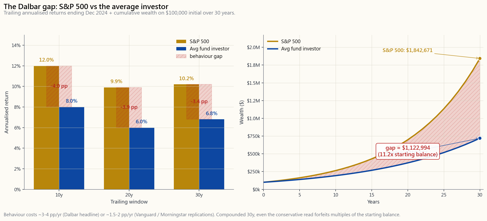
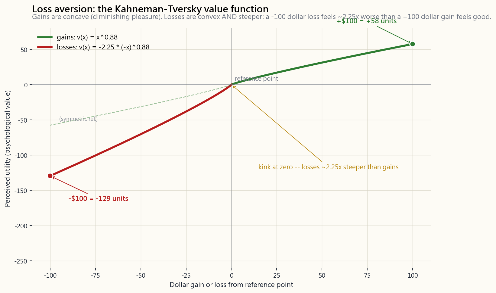

# 补充课15：交易心理学——七大亏钱偏误

---

## 第一部分：阅读材料

---

### 1. 为何此课至关重要

你可以运用本课程中的每一张电子表格，可以报出每个因子的夏普比率，可以背诵达摩达兰最新发布的股权风险溢价数据——但你依然可能亏钱。根本原因在于：敲击键盘的是一个经过漫长进化的生物大脑，它的使命是让灵长类动物在草原上活下去，而非在三十年的跨度内承担现金流折现法风险。交易心理学的意义，在于识别大脑的默认模式，并用规则加以覆盖。以下四点，值得认真对待：

1. **行为差距是真实存在的，尽管具体数字尚存争议。**
   达尔巴（Dalbar）的《投资者行为量化分析》报告连续三十年显示：普通股票型基金投资者每年获得的收益，比其持有基金的实际收益低3至5个百分点。该报告的研究方法受到了广泛批评——先锋（Vanguard）、晨星（Morningstar）及学术界均有质疑——但即便采用修正后的保守估算，因买卖时机不当造成的拖累仍有每年1.5至2个百分点。以10万美元初始本金计算，在30年投资周期内，每年3个百分点的差距，会将约100万美元的终值压缩至约40万美元。这笔差额，足够给别人买一套度假别墅。
2. **偏误在实时交易中是隐形的。** 确认偏误不会主动宣告自己的存在。你感受不到自己被买入价锚定；你感受到的，是自己在理性思考。行为金融学的核心难题在于：大脑的缺陷，感觉上与大脑的正常运作毫无差异。唯一有效的防御是结构性的——预先承诺、书面计划、自动化执行——因为偏误恰恰在你最需要冷静判断的当下，让你无法信任自己。
3. **损失造成的伤害是不对称的复利。** 根据卡尼曼-特沃斯基的前景理论，损失100美元的痛苦感，约是获得100美元的快感的两倍（损失厌恶系数λ约为2.0至2.25）。这种不对称性扭曲了每一个决策：你过早卖出盈利仓位以锁定快感，却死守亏损仓位因为认亏太痛苦。最终，你的投资组合将充斥着亏损的股票——这便是"处置效应"，也是散户经纪数据中记录最为详尽的偏误。
4. **市场是一场选美比赛。** 市场维持非理性状态的时间，可能比你维持偿付能力的时间更长。每一种让个人爆仓的偏误，在加了杠杆、面临追加保证金通知或有截止期限的情况下，都会以更惨烈的方式爆发。行为纪律不是软技能；它是实现复利增长的前提条件。

补充课15将梳理危害最大的七种偏误，提供经过验证的应对措施，并通过真实标普500数据，展示情绪化买卖与长期坚守所产生的累积财富差距。

网站上的互动实验室将带你经历三个情景决策——*股票下跌30%——卖还是持有？*、*股票上涨50%——卖还是持有？*、*错过反弹——追涨还是等待？*——并将理性答案与典型行为答案并排呈现，供你对比参考。

---

### 2. 核心知识要点

#### 2.1 损失厌恶——2:1的不对称性

丹尼尔·卡尼曼与阿莫斯·特沃斯基于1979年发表的前景理论论文，以及1992年的累积版修正，确立了经验性的*价值函数*：

$$ v(x) = \begin{cases} x^{0.88} & x \geq 0 \\ -\lambda \, (-x)^{0.88} & x < 0 \end{cases} $$

该函数的两段，几乎解释了投资者行为的全部逻辑：

- **收益区间呈凹形。** 从1,000美元增至2,000美元的快感，大于从10,000美元增至11,000美元的快感，尽管美元收益完全相同。这是边际效用递减规律。
- **损失区间呈凸形，且斜率更陡。** 损失100美元的痛苦，*约为*获得100美元快感的两倍（在大多数复现研究中，λ约为2.0至2.25）。零点处的拐折，正是市场发生崩盘的根本原因——没有人愿意认亏，直到所有人同时决定认亏。

损失厌恶在实践中会产生三种可预见的错误：持有亏损仓位过久（因为认亏太痛苦）、过早卖出盈利仓位（即"处置效应"），以及在回撤后对仓位规模过于保守。解决之道不是感受更少的痛苦——你做不到——而是在损失发生*之前*就预先设定好卖出规则。

#### 2.2 近期偏误与追涨杀跌

近期偏误是大脑将过去12个月的经历当作永恒未来的习惯。经历了2023年（标普+26%）或2009年（标普+27%）这样的年份后，散户资金大量涌入美国大盘股。经历了2008年（-37%）或2022年（-18%）之后，资金便纷纷撤离。晨星的资金流数据和投资公司协会的时间序列均呈现相同规律：在宏观层面上，买高卖低。

从数学角度看，近期偏误的代价是惨重的。一个简单的粗略测算：若你在大涨20%之后从现金转向股票，又在大跌20%之后重返现金，你便系统性地错过了两个极端之后的均值回归。达摩达兰1928年至2024年的数据集显示，历年大跌20%之后的五年，年均回报约+14%；历年大涨30%之后的五年，年均回报仅+6%。受近期偏误驱动的投资者，总是接住每个分布的错误尾巴。

#### 2.3 确认偏误与过度自信

确认偏误是指倾向于寻找并过度重视支持自身既有立场的信息，同时忽视或强行解释反驳性证据。你在400美元时买入特斯拉，股价跌至200美元，你却能找到五篇文章解释这是绝佳买入机会，却找不到一篇文章质疑你的逻辑。大脑的过滤机制在尽职尽责——维持现有认知模型的稳定——而代价由投资组合来承担。

过度自信是确认偏误的近亲，且在连续盈利后会进一步恶化。布拉德·巴伯与特伦斯·奥迪恩2001年的研究（*Boys Will Be Boys*）显示，男性的交易频率比女性高45%，年化表现低约1.4个百分点；这一差距主要源于连续盈利后的过度自信。在连赢几次之后，大脑会将盈利归因于能力，将亏损归因于运气——即便实际上恰好相反。应对之法：**交易前记录**（在按下确认键之前，写下投资逻辑、买入点、止损位和持有周期），让事后的合理化叙事有一份书面记录来反驳。

#### 2.4 锚定效应、处置效应与FOMO

三种密切相关的偏误，共同扭曲了*退出*决策：

- **锚定于买入价。** 你的买入价，除了在税单上，对任何人都没有任何经济意义。市场不知道你的成本。但你的大脑将"我在80美元买的"当作一条神奇的基准线——高于80美元是绿色，低于80美元是红色。真正的参考基准应该是*从当前价格出发的远期预期收益*，而不是"我回本了吗"。如果今天有人把这个仓位免费赠送给你、没有任何成本，你愿意持有吗？如果不愿意，就卖。
- **处置效应。** 由赫什·谢夫林与梅尔·斯塔特曼于1985年记录的实证规律，并在此后每一份散户经纪数据集中得到复现：投资者实现盈利的频率，约是实现等额亏损频率的1.5倍。结果是，投资组合平均而言是一堆*买入以来价格下跌*的股票——这是最糟糕的选股机制。
- **FOMO与报复性交易。** FOMO（错失恐惧）是披着机会外衣的近期偏误：市场在你场外观望时三个月涨了30%，你追进去，反弹见顶，你承受回撤。*报复性交易*是双重受损的变体——在亏损后立即加大仓位想"扳回来"，将一个可控的回撤变成灾难性的崩溃。换句话说：你无法与市场谈判。

#### 2.5 锚定效应的近亲：赌徒谬误

赌徒谬误是相信独立事件"应该"趋向平衡——连续五次轮盘赌出现红色，"必然"下一次是黑色。在投资中，表现为："标普500已经连涨五年，该崩了。"市场不欠你一次崩盘，而且历年回报的自相关性在1928年至2024年的年度数据中，统计上与零无异。长周期确实存在均值回归（10年远期收益与10年历史收益的相关系数约为-0.4），但1年期不存在。基于"该到了"来调整仓位，不过是把掷硬币包装成了分析。

#### 2.6 真正有效的行为应对措施

研究结论清晰明确：依靠当下的意志力毫无用处，但*结构*有效。以下六种应对措施按影响力大小排序：

1. **书面预先承诺。** 交易前，写下投资逻辑、买入价、止损位、仓位规模和复盘日期，签名并注明日期。行为学文献（阿里埃利、塞勒、桑斯坦）的结论一致：在冷静状态下做出的承诺，能在情绪激动时约束你。有效格式：一段话阐述逻辑，一个数字表示规模，一个数字表示止损。
2. **自动化执行。** 每次发薪自动划拨资金至IRA和401(k)。按日历计划（每季度或每年）或偏离阈值触发（任一资产类别偏离目标超过5个百分点时）自动执行再平衡。自动化消除了决策的时刻，而决策的时刻，正是你犯错的时刻。
3. **检查清单。** 一份包含6项的交易前检查清单（投资逻辑是否已书面记录？仓位是否低于投资组合的5%？与现有仓位的相关性是否低于0.7？是否理解期权被行权的情形？是否确定了税务批次？是否已设定止损？）能拦截80%的冲动交易。参考阿图尔·葛文德或航空业的清单格式——其循证基础与外科手术相同。
4. **熔断机制。** 设定最大日内亏损（如账户的2%）和最大周度亏损（如账户的5%）。触发后，清空主动交易仓位，离开屏幕24小时。熔断机制之所以有效，正因为它是二元的、预先承诺的——不需要在情绪已经失控时再做任何判断。
5. **24小时冷静期规则。** 对于任何超过投资组合2%的新建仓位，今天写下投资逻辑，明天再下单。24小时足以让大多数FOMO冲动消退。如果第二天逻辑依然成立，这笔交易大概率是真实的。如果逻辑站不住脚，你为自己避免了一笔糟糕的交易。
6. **仓位规模规则。** 单笔仓位成本不超过5%，单一板块不超过25%，全组合杠杆不超过2.0倍。这些是防止单次爆雷终结整个投资生涯的底线约束。来自凯利公式的启示：即便你的优势是真实的，半凯利仓位在实证上也是最优的，因为大脑对概率的估计存在系统性高估。

#### 2.7 行为差距的复利代价

取学术研究的保守估算：每年2个百分点的行为拖累，初始本金10万美元，持有30年，基准为年化8%的买入持有策略。数学如下：

$$ \text{买入持有：} \$100{,}000 \cdot 1.08^{30} = \$1{,}006{,}266 $$

$$ \text{行为投资者：} \$100{,}000 \cdot 1.06^{30} = \$574{,}349 $$

差距为43.2万美元——超过初始本金的四倍，是因行为拖累造成的终值损失，而这种拖累*在逐年感知上几乎是隐形的*。若按达尔巴报告的3至5个百分点计算，差距将更为惨烈（4个百分点时：100万美元对比约33万美元）。行为差距是散户投资中单项可修复成本里最大的一项——超过费用率，超过税务拖累（补充课4），也超过基金选择的影响。先修复它，再优化其他一切。

---

### 3. 常见误解

1. **"我足够理性，这些偏误不会影响我。"** 研究文献说：并非如此。实验室实验发现，*更有经验*的投资者往往对过度自信*更易感*，因为他们的既有判断更为根深蒂固。应对之道是结构性的，而非智识上的。
2. **"达尔巴数据是假的——我看过对其研究方法的批评。"** 3至5个百分点的头条数字对*中位数*投资者而言确实是夸大的，经不起推敲。但每一个诚实的复现研究（先锋的《量化顾问的价值》、晨星年度《关注差距》研究）都发现了每年1.0至1.7个百分点的时机选择拖累。这一数字是真实存在的，只是比达尔巴报告的要小。即便每年仅1个百分点，30年下来仍意味着10万美元初始本金损失约20万美元。
3. **"损失厌恶只是说明我偏保守。"** 并非如此。损失厌恶让你在亏损仓位上变得*更激进*（你拒绝止损，甚至加仓摊平），同时在盈利仓位上变得*更保守*（你急于兑现获得快感）。它对两端的扭曲都是不对称的。
4. **"如果我了解得更多，偏误就会消失。"** 教育可以减轻某些偏误（赌徒谬误、基率忽视），但会*加剧*另一些偏误（过度自信、确认偏误）。知道自己存在某种偏误，并不能保护你在实时交易中不受其驱动。预先承诺可以。
5. **"定投不过是行为上的自我安慰——数学证明一次性投入更优。"** 定投是在*有意识地*以每年0.5至0.7个百分点的预期收益（根据先锋2012年及2023年的研究）换取*有保障的*遗憾风险消除。如果另一个选项是"盯着那笔钱，恐慌，永远无法入场"，定投的预期收益损失远小于什么都不做的预期收益损失。行为保险是有代价的。
6. **"止损是交易员用的，投资者用不上。"** 对*个股*设置止损是有帮助的，前提是设在2至3倍ATR（远离日常噪音）的位置。对*指数基金*设置止损是有破坏性的，因为指数具有均值回归特性。对指数敞口的正确工具是*仓位规模控制*，而非止损——将指数仓位控制在足够小的比例，使你能在50%的回撤中坚持持有而不崩溃。
7. **"报复性交易只是纪律差，算不上真正的偏误。"** 它确实是真正的偏误。脑成像研究显示，金钱损失信号激活的大脑区域与感受身体疼痛的区域相同，边缘系统的反应会偏向立即的风险追逐行为。大脑天生就会追亏；将其归结为纪律问题，就好比把战斗或逃跑反应归结为纪律问题。应对之道是熔断机制，而不是意志力。
8. **"反弹是真实的时候，FOMO没问题。"** FOMO的问题不在于反弹是假的——有时候反弹确实是真实的。问题在于，你*确定仓位规模*时依据的是情绪的强烈程度，而不是证据的充分程度。真实的反弹加上过大的仓位，变成的是下一场回撤灾难。
9. **"冥想/记录/呼吸练习不会对结果产生实质影响。"** 自我报告与经纪账户配对的研究不认同这一说法。坚持书面交易记录的投资者，在后续跟踪数据中呈现出明显更小的行为差距。其机制不在于记录本身——而在于记录*迫使*交易前的预先承诺。
10. **"行为差距只影响主动交易者——指数基金投资者不受影响。"** 错误。达尔巴报告的差距在*主动型*基金资金流中最为显著，但同一研究显示，在回撤期间恐慌赎回的指数基金投资者同样存在每年1至2个百分点的差距。工具本身不是保护；*行为*才是。

---

### 4. 问答环节

**Q1. 如果损失厌恶是写进基因的，了解它又有什么意义？**
你无法关闭它，但可以绕过它。预先承诺（入场前写好止损）、自动化（按计划再平衡，而非凭感觉）和仓位规模控制（小到足以让亏损不构成生存威胁）这三项，都是在不要求你感受更少痛苦的前提下，攻克损失厌恶后果的手段。大脑依然有缺陷；投资组合却可以完好无损。

**Q2. 行为差距换算成金额有多大？**
保守估算（每年1.5个百分点）：初始本金10万美元，30年，8%基准——终值约100万对比约65万，损失约35万。激进估算（达尔巴的每年4个百分点）：终值约100万对比约33万，损失约67万。无论哪种，都是散户投资中所有可修复成本里最大的一项。

**Q3. 最有效的单一行为应对措施是什么？**
自动化——具体而言，是每次发薪自动划拨至IRA/401(k)账户。这彻底消除了决策的时刻。其他所有应对措施（检查清单、记录、熔断）都是增量改进；自动化才是结构性变革。

**Q4. 我应该减少查看投资组合的频率吗？**
是的。行为金融学文献普遍发现，查看投资组合频率越高，因损失厌恶触发的痛苦越多，糟糕的交易也越多。对大多数散户投资者而言，每季度查看一次已经足够。每天查看会带来实质性的伤害。

**Q5. 达尔巴数据存疑——我是否应该忽视行为差距？**
不应该。4至5个百分点的数字值得怀疑；1至2个百分点的数字则经得起检验。即便取保守估算，30年的复利代价也是初始本金的数倍。无论精确数字是多少，应对措施都是一样的。

**Q6. 一只股票跌了30%，我认为逻辑依然成立，该怎么办？**
重新阅读当初写下的投资逻辑（你写过的——见第2.6节）。如果逻辑完整且仓位低于投资组合的5%，持有。如果逻辑已经破裂（公司盈利不及预期、催化剂消失、未曾预判的风险浮出水面），就卖——即便已经亏损30%。买入价是无关信息；远期预期收益才是一切。

**Q7. 坚定信念与确认偏误之间的区别是什么？**
坚定信念是指你持有一个仓位，同时*主动寻找反驳性证据*，并根据所发现的信息调整仓位规模。确认偏误是指你持有一个仓位，同时*过滤掉反驳性证据*。测试标准：你能否书面写出一个具体的数据点，使你决定卖出？如果能，那是信念。如果不能，那是偏误。

**Q8. 熔断机制对散户投资者现实可行吗？**
可行——但在允许预设的券商处更易操作（盈透证券、ThinkOrSwim）。手动熔断机制需要更多自律（"如果本周账户亏损超过5%，我在周一早上平掉所有主动仓位"），但即便如此，仍比没有机制要好。书面预先承诺，每周复盘。

**Q9. "市场维持非理性的时间比你维持偿付能力更长"这条元规则与上述内容有何关联？**
这条元规则说明：每一种行为偏误，都会被杠杆和截止期限成倍放大。如果你的投资周期是30年且没有杠杆，你的大脑造成的伤害是可以承受的。如果你使用3:1杠杆且面临保证金时钟，大脑的偏误会在逻辑被验证之前就将你逼入强制平仓。严格的仓位规模控制，是你能购买的最廉价的行为保险。

**Q10. 冥想和呼吸练习能起到什么作用？**
效果边际但非零。其有效机制在于降低面对损失时边缘系统反应的幅度——使熔断机制在报复性交易冲动之前触发。它是结构性应对措施的补充，而非替代。如果必须二选一：先写下投资逻辑，再做呼吸练习。

**Q11. 我能否通过委托他人管理来规避这些偏误？**
部分可以。收费0.5至1.0%每年的纯收费（fee-only）受托责任顾问，购买的是*一项*应对措施——即在交易前必须打电话给他们造成的摩擦成本。对某些人而言物有所值，对另一些人则不然。收费0.25%每年的智能投顾，购买的是自动化（最有效的应对措施），没有人工摩擦。两者都优于在没有任何结构支撑的情况下自行管理。

**Q12. 明天我应该做的一件事是什么？**
以你能负担的最高金额，设置发薪自动划拨至IRA/401(k)，并设为每年自动再平衡。这一结构性改变的效果，超过本课所有其他内容的总和。将贡献自动化；这是你永远不会在错误时机做出的那笔交易。

---

## 第二部分：YouTube 脚本

---

**视频标题：**《七大亏钱偏误——交易心理学，补充课15》
**目标时长：** 约12分钟
**主持人：** 陳馬、小魚

---

**[00:00 — 冷启动]**

**陳馬：** 小魚，有个数字值得让你认真想一想。普通股票型基金投资者每年获得的收益，比他们持有的基金实际收益低3到5个百分点。每年如此，持续三十年。

**小魚：** 这就是达尔巴的数字，对吧？

**陳馬：** 对，这就是达尔巴的数字。研究方法有批评者，差距的大小也存在争议，但每一个诚实的复现研究——先锋、晨星、学术界——都发现至少每年1到2个百分点的纯行为拖累。以10万美元初始本金计算，30年下来，这个差距会把买入持有策略的百万终值压缩到大约一半。我们今天就来聊聊为什么会这样。

**小魚：** 以及如何避免。

**陳馬：** 以及如何避免。

**[00:50 — 开场]**

**陳馬：** 补充课15。交易心理学。七大亏钱偏误，以及真正有效的应对措施。我们将围绕行为金融学文献中最重要的一项实证结果展开——卡尼曼与特沃斯基的前景理论。

[VISUAL: image/side15_loss_aversion.png]

**小魚：** 这就是价值函数。收益区间呈凹形——从1000美元涨到2000美元的感受，好过从10000美元涨到11000美元，尽管美元金额相同。边际效用递减，经典经济学对此没有异议。

**陳馬：** 对。偏离经典经济学的地方在于损失那一侧。看这个斜率。损失100美元的痛苦，约为获得100美元快感的两倍。在卡尼曼-特沃斯基最初的论文中，λ等于2.25。大多数复现研究的结果在2.0到2.5之间。

**小魚：** 所以如果你给我看一个公平的硬币游戏——正面赢100美元，反面输100美元——大多数人会拒绝。

**陳馬：** 大多数人会拒绝。预期价值是零，行为价值是负数。要让普通人愿意赌这一把，正面赢的金额需要达到大约200美元，才能对抗输100美元的痛苦。这就是损失厌恶系数。

**[02:30 — 偏误一：损失厌恶与处置效应]**

**陳馬：** 偏误一是损失厌恶，它衍生出所谓的处置效应。谢夫林与斯塔特曼于1985年记录在案，此后在每一份散户经纪数据集中均得到复现。投资者实现盈利的频率，约是实现等额亏损频率的1.5倍。

**小魚：** 翻译成白话就是：你卖掉盈利的，你守住亏损的。

**陳馬：** 正是。经过足够长的时间，你的投资组合平均而言，就是一堆自买入以来*价格下跌*的股票。这是最糟糕的选股机制。

**小魚：** 怎么解决？

**陳馬：** 预先承诺。在建仓之前，写下你的卖出价格，两个方向都写。正确的参考基准是*从当前价位出发的远期预期收益*，而不是"我回本了吗"。

**[04:00 — 偏误二：近期偏误；偏误三：确认偏误；偏误四：过度自信]**

**小魚：** 偏误二——近期偏误。

**陳馬：** 近期偏误就是大脑把过去12个月当作永恒未来。2023年标普大涨26%之后，资金蜂拥而入。2008年标普重挫37%之后，资金纷纷撤离。晨星的资金流数据、投资公司协会的数据，每个数据库都在说同一个故事。

**小魚：** 买高卖低。

**陳馬：** 在宏观层面上如此。而残忍之处在于，数学会均值回归。达摩达兰的数据，1928年至2024年——*历年大跌20%之后*的五年，平均年化收益是正14%。*历年大涨30%之后*的五年，平均年化收益是正6%。

**小魚：** 受近期偏误驱动的投资者，每次都在分布的错误尾巴上。

**陳馬：** 偏误三——确认偏误。你在400美元买入特斯拉，股价跌至200美元，你的信息流却神奇地只给你推送解释为何这是绝佳买入机会的文章。大脑的过滤机制在尽职尽责——维持现有认知模型的稳定。代价由投资组合来承担。

**小魚：** 偏误四——过度自信。在连续盈利之后尤为明显。

**陳馬：** 布拉德·巴伯与特伦斯·奥迪恩，*Boys Will Be Boys*，2001年。男性的交易频率比女性高45%，年化表现低1.4个百分点。差距来自过度自信。连赢几次之后，大脑将盈利归因于能力，将亏损归因于运气。即便实际情况恰恰相反。

**[06:30 — 偏误五：锚定效应；偏误六：FOMO；偏误七：赌徒谬误]**

**陳馬：** 偏误五——锚定效应。锚定在买入价上。市场不知道你的成本。税单知道，其他人都不在乎。

**小魚：** 但大脑把"我在80美元买的"当作一条神奇的基准线。

**陳馬：** 高于是绿色，低于是红色。解药是*馈赠测试*。如果今天有人把这个仓位免费送给你、没有任何成本，你愿意持有吗？如果不愿意，就卖。你曾经付了多少，无关紧要。

**小魚：** 偏误六——FOMO与报复性交易。

**陳馬：** FOMO是披着机会外衣的近期偏误。市场在你场外观望时三个月涨了30%，你追进去，反弹见顶，你承受回撤。报复性交易是双重受损的变体——在亏损之后立即加大仓位想"扳回来"，将可控的回撤变成灾难性的崩溃。

**小魚：** 偏误七——赌徒谬误。

**陳馬：** 标普500已经连涨五年，"该崩了"。这在两个层面上都是错误的。第一，历年回报的自相关性近乎为零。第二，市场不欠你一次崩盘。它想崩的时候自然会崩。

**[09:00 — 应对措施]**

**小魚：** 好，偏误梳理完了。应对措施。

**陳馬：** 按影响力从大到小排列。第一——书面预先承诺。交易前，写下投资逻辑、买入点、止损位、仓位规模和复盘日期，签名注日期。第二——自动化。每次发薪自动划拨至IRA账户。每季度自动再平衡。自动化消除了决策的时刻，而决策的时刻，正是偏误触发的时刻。

**小魚：** 第三——检查清单。

**陳馬：** 一份6项的交易前检查清单能拦截80%的冲动交易。参考阿图尔·葛文德或航空业的清单格式，循证基础是一样的。

**小魚：** 第四——熔断机制。

**陳馬：** 设定最大日内亏损，比如账户的2%。最大周度亏损，比如账户的5%。触发后，清空主动交易仓位，离开屏幕24小时。预先承诺，二元执行，不需要在情绪已经失控时做任何判断。

**小魚：** 第五——24小时冷静期规则。

**陳馬：** 对于任何超过投资组合2%的新建仓位，今天写下逻辑，明天再下单。24小时足以让大多数FOMO冲动消退。

**小魚：** 第六——仓位规模控制。

**陳馬：** 单笔仓位成本不超过5%。单一板块不超过25%。全组合杠杆不超过2.0倍。这是底线约束。你能购买的最廉价的行为保险，就是将每个仓位控制在足够小的规模，让单次爆雷无法终结整个投资生涯。

**[11:00 — 达尔巴数据与复利代价]**

[VISUAL: image/side15_dalbar_gap.png]

**陳馬：** 用真实数字来看这个差距。截至2024年12月的三个滚动周期——10年、20年、30年。每组的高柱是标普500，低柱是普通投资者持有这些基金所获得的实际收益。按达尔巴报告的头条数字，差距约每年4个百分点；按保守复现估算，约1.5至2个百分点。

**小魚：** 累积的财富差距有多大？

**陳馬：** 以10万美元初始本金、30年计算，标普500以年化10.2%运行，终值超过180万美元。平均投资者以年化6.8%计算，终值约72万美元。差距超过100万美元——初始本金的十倍，是因行为拖累而损失的终值财富，而这种拖累在逐年感知上*几乎是隐形的*。

**[VISUAL: interactive/side15_bias_lab.html]**

**小魚：** 网站上我们设计了一个情景实验室。三个选择——股票跌30%卖还是持有，股票涨50%卖还是持有，错过反弹追涨还是等待。每一个情景都会呈现理性选择、典型行为选择和典型实际结果。

**陳馬：** 先通读一遍。然后在现实中即将做这个决策的时候，再通读一遍。

**[12:00 — 结语]**

**陳馬：** 最后一点。市场维持非理性的时间，可能比你维持偿付能力的时间更长。今天清单上的每一种偏误，都会被杠杆和截止期限成倍放大。这些偏误是写进基因的；它们不会消失。应对之道是结构性的——预先承诺、自动化、检查清单、熔断机制、仓位规模控制。

**小魚：** 明天先做一件事：设置发薪自动划拨至IRA账户，以及每季度自动再平衡。

**陳馬：** 这一个改变，效果超过本课其他所有内容的总和。结构先搭好，其余的叠加在上面。

**小魚：** 补充课16见。

**[结束。]**