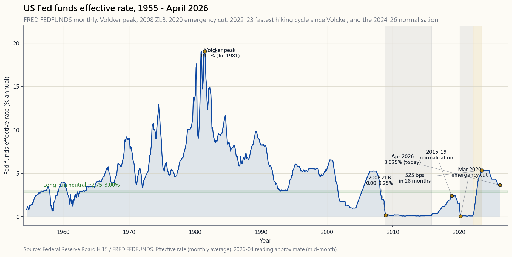
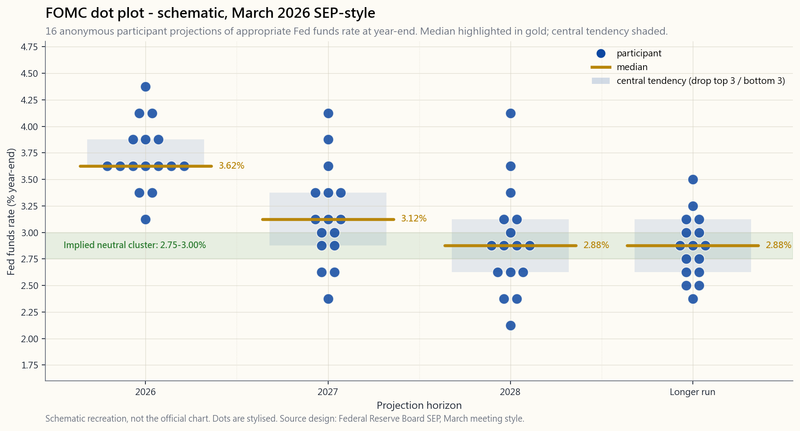

# 附课17：美联储——双重使命、点阵图与对你投资组合的连锁影响

---

## 第一部分：阅读材料

---

### 1. 为什么这一课至关重要

美联储为全球最大储备货币设定资金价格。全球体系中的一切其他收益率——2年期国债、10年期国债、30年期按揭贷款、BBB级公司债，乃至戈登增长模型中的折现率——都建立在这一价格之上。美联储每一次行动，都会引发每一份账户报告上每一类资产的重新定价。大多数散户投资者把美联储联邦公开市场委员会（FOMC）会议周视为背景噪音，这是一个错误。

这节附课之所以独占一个完整席位，而非仅是债券章节的一段文字，原因有以下四点：

1. **一个长达四十年的利率周期已在你的视野中终结。** 从1981年8月沃尔克时代的利率峰值（联邦基金利率19%）到2022年3月的加息启动，每一轮紧缩周期的终端利率都低于上一轮。这长达四十年的债券牛市如今已画上句号。2022至2023年的加息周期在十八个月内累计加息525个基点——自沃尔克以来最快的节奏——而2024年后的货币政策正常化正将"中性利率"锚定在接近3%的水平，而非2008年后那一代人所熟悉的0%。任何利率认知体系形成于2009年至2021年之间的投资者，都存在严重的校准偏差。
2. **传导机制是机械性的，而非魔法。** 美联储设定一个利率，该利率传导至SOFR（隔夜，一对一传导），再传导至2年期国债（约0.85的传导系数），再到10年期国债（包含期限溢价的斜率），再到30年期按揭贷款（10年期国债加约175个基点的一级市场与二级市场利差），最终传导至每一个股票估值倍数内部的折现率。整条传导链每天被数以千计的交易台研究、回归分析并定价。你也可以使用同样的数学工具。
3. **点阵图是市场上最响亮的前瞻性指引信号。** FOMC每年四次发布经济预测摘要（SEP）——十六个匿名点位，每位委员一个，标示其对未来三年及"长期"联邦基金利率年末水平的预判。市场会在数秒内依据这些点位进行交易。如果你读不懂点阵图，那你在全年最剧烈波动的四周内等同于盲目交易。
4. **资产负债表政策是新的政策工具，而几乎没有散户屏幕在追踪它。** 当美联储缩减国债和抵押贷款支持证券（MBS）持仓（缩表，QT）时，即便不调整政策利率也在实质性紧缩。反之，当其买入（量化宽松，QE）时，即便不降息也在实质性宽松。2008至2014年的资产负债表扩张（从8700亿美元扩张至4.5万亿美元）、2020年的激增（从4.2万亿美元扩张至9.0万亿美元），以及2022至2026年的缩减（从9.0万亿美元回落至6.5万亿美元），都独立于FOMC的新闻稿推动了资产价格的变化。波动率尾部效应在资产负债表上同样在悄然发挥作用：久期资产的边际买家至关重要。

这是一套工作工具，而非公民教育课。学完本课，你将清楚每一项美联储政策工具的作用、从哪里读取信号，以及如何将由此产生的市场变动合理地纳入你的四档投资组合框架。

---

### 2. 你需要掌握的内容

#### 2.1 双重使命——两个目标，一个旋钮

国会在1977年的《联邦储备改革法案》中写入了两个目标："最大化就业"与"稳定物价"，这就是双重使命。两个目标，一个主要工具（联邦基金利率），这意味着当两个目标相互冲突时，美联储必须做出选择。2022年，美联储选择了物价优先于就业——鲍威尔在杰克逊霍尔会议上的"经历些痛苦"讲话——在劳动力市场仍每月新增40万个就业岗位的情况下坚持紧缩。2008年，美联储选择了就业优先于物价，在CPI仍高达5%时将利率砍至零。

"稳定物价"被具体化为**核心PCE 2%的目标**，自2012年伯南克声明以来沿用至今，并在2020年的灵活平均通胀目标（FAIT）框架下得到重申。"最大化就业"没有具体数字——美联储估算非加速通胀失业率（NAIRU，目前约4.0%），并力图避免实际失业率在不引发通胀的情况下持续低于这一水平。

投资要点：**将双重使命解读为一个政策周期指标。** 当美联储对抗通胀时，预期收益率曲线趋平乃至倒挂、实际利率上升、长久期资产（成长股、房地产投资信托、长期债券）承压。当美联储对抗失业时，预期曲线陡化、实际利率下行、久期资产受到追捧。附课06涵盖了通胀的一半内容；本课聚焦政策工具本身。

#### 2.2 FOMC、SEP与点阵图

联邦公开市场委员会由十二名有投票权的委员组成：美联储委员会的七位理事、纽约联储行长（永久成员），以及其余十一家地区联储行长中轮值的四位。FOMC每年召开八次会议，其中四次——3月、6月、9月、12月——同步发布**经济预测摘要（SEP）**：每位与会者提交对未来三年及"长期"GDP增速、失业率、PCE通胀、核心PCE，以及最关键的——年末联邦基金利率适当水平的预测。

这些利率预测的点阵图便是**点阵图**。十六或十七个点位，每位参与者一个（含有投票权及无投票权委员），匿名排列，以25个基点为刻度纵向分布。市场从中解读三件事：中位数、中心趋势（去掉最高的三个和最低的三个），以及离散程度（点位紧密意味着委员会达成共识，点位分散意味着内部分歧较大、因此政策选择余地更大）。

两条解读规则。第一，**中位数影响市场，尾部不影响**。2027年那个处于5.5%的孤点，不过是某位在委员会中寸步不让的鹰派委员的立场。市场对此一概折价处理。第二，**长期点位是对"中性利率"的隐性估算**。2026年4月，长期点位的集中区间落在2.75%至3.00%，高于2010年代大部分时间所沿用的2.5%估算。这仅仅25个基点的上移，却是整份文件中最重要的数字——这就是本课一直追踪的政策周期切换。

#### 2.3 政策工具——联邦基金利率目标、IORB、ON-RRP与资产负债表

2008年以前，美联储只有一个工具：通过交易国债回购，将隔夜联邦基金利率维持在单一目标值附近。2008年后，政策工具箱变得更加复杂。

**联邦基金目标区间。** 自2008年12月起，FOMC宣布的是一个25个基点的区间，而非单点目标（例如"3.50%至3.75%"）。有效利率在该区间内浮动，由形成上下限的两个管理利率约束。

**准备金余额利率（IORB/IOER）。** 这是美联储向银行存放于美联储的准备金支付的利率。银行不会以低于该利率的价格进行隔夜贷款，因此它构成联邦基金利率的软性*下限*。2026年4月，IORB为3.65%。

**隔夜逆回购（ON-RRP）。** 这是美联储向更广泛的交易对手——货币市场基金、政府支持企业——支付的隔夜停泊现金利率。它比IORB低5个基点，构成*硬性下限*：凡有资格使用该工具的机构，绝不会以更低利率出借资金。ON-RRP工具规模从零一路膨胀至2022年峰值时的2.4万亿美元，彼时货币市场现金无处可去。截至2026年4月，规模已回落至约2000亿美元——这是流动性正常化的重要信号。

**贴现窗口**是最后贷款人利率，设定在目标区间上限以上25个基点。供遭受市场污名化的银行在危机中使用。

**资产负债表（QE/QT）。** 当2008年和2020年常规利率触及零下限时，美联储直接购买国债和机构MBS，以压低长端收益率，迫使投资者将资金从债券转向风险更高的资产。2022年8月，资产负债表规模峰值达8.97万亿美元（占GDP的35%）。自2022年6月起，美联储以设定上限的节奏让到期证券自然滚出——最初为每月950亿美元，近期已放缓至450亿美元——国债与MBS合并计算。截至2026年4月，资产负债表规模约为6.5万亿美元（占GDP的24%）。据美联储工作人员估算，每缩减1万亿美元约等效于25个基点的常规紧缩效果。这正是为什么点阵图与资产负债表计划必须合并解读。

#### 2.4 传导机制——25个基点的降息如何传导至你的投资组合

美联储设定一个隔夜利率，资产价格却依附于收益率曲线的长端。从前者到后者的路径，便是**传导机制**。共分五步，每一步均有实证数据可量化。

1. **联邦基金利率 → SOFR（隔夜）**。有担保隔夜融资利率以国债为抵押品；它比联邦基金目标区间上限低5至10个基点，传导系数接近一对一。美联储一旦行动，SOFR次日早晨即随之联动。
2. **SOFR → 2年期国债**。2年期国债本质上是"市场对未来八个季度平均短期利率的预期"。实证传导系数约为0.85：预期联邦基金利率100个基点的变动，带动2年期国债约85个基点的移动，其余15个基点被不确定性折价所吸收。
3. **2年期 → 10年期国债（斜率）**。10年期与2年期的利差在经济扩张期平均约+110个基点，周期末段趋近于0，在经济衰退前出现倒挂。2026年4月，10年期与2年期之差在持续倒挂十八个月后重新回正至+40个基点。短端利率对长端的传导系数仅约0.5：期限溢价和增长预期吸收了剩余部分。
4. **10年期 → 30年期按揭贷款**。一级市场与二级市场利差平均约175个基点；在压力时期可扩大至250至300个基点（2020年3月、2022年10月）。以2026年4月10年期国债利率4.20%计算，30年期按揭平均利率约为6.0%，这就是借款人实际面对的水平。
5. **10年期 → 股票折现率 → 市盈率**。戈登模型表明$P/E = 1/(k - g)$，其中$k$为股票折现率（实际10年期利率+股权风险溢价），$g$为盈利的长期实际增长率。假设股权风险溢价为5%、实际增长率为2%、实际10年期利率为1.5%，得出合理市盈率约为22倍。10年期利率每变动100个基点，市盈率约移动4倍。

第18周（`week18_rate_cascade.md`）将第1至4步绘制为一张综合图表；第31周（`week31_yield_curves.md`）深入分析2年期/10年期利率斜率动态。本课位于更高层级：*美联储*如何推动第1步的变化。

#### 2.5 近期历史——二十五年中的三个政策周期

2000年后的历史是三个截然不同的政策周期，每一个周期都塑造了不同代投资者对美联储的预期。

**2000至2007年——常规政策周期。** 格林斯潘/伯南克。联邦基金利率从6.5%降至1.0%，再升至5.25%。资产负债表保持在8700亿美元的平稳水平。这是教科书所描述的世界，也是在2008年终结的世界。

**2008至2021年——零利率下限时代。** 雷曼兄弟破产，2008年12月降至0至0.25%。维持至2015年12月。第一次正常化的峰值为2018年12月的2.25%至2.50%。2019年的中期调整降息三次。此后是新冠疫情，2020年3月：在两周内紧急降至0至0.25%，三个月内实施2.3万亿美元的量化宽松。维持零利率直至2022年3月。**这十四年中有十三年联邦基金利率低于1%。** 2010年入行的交易员直到2023年才有了正实际联邦基金利率的第一手经验。

**2022至2026年——快速加息与正常化。** 2022年3月开启加息。十八个月累计加息525个基点：沃尔克以来最快节奏。2023年7月终端利率区间触及5.25%至5.50%，维持十五个月，2024年9月开启首次降息。截至2026年4月，联邦基金利率为3.50%至3.75%，点阵图显示2027年底将降至约3.0%，长期中性利率约在2.75%至3.00%附近。本轮加息周期已结束，新的均衡正在逐步确立。

投资解读：**不要再假设美联储总会出手救援久期资产**。2008至2021年形成的肌肉记忆是：每一次10%的回撤都会换来一次降息。2022至2023年的周期证明，一个致力于对抗通胀的美联储，可以在股票最大回撤25%、债券最大回撤30%的情况下毫不动摇。构建你的杠铃策略时，应假定美联储保护性降息的触发点比过去低了20%，而不是5%。

---

### 3. 常见误区

1. **"美联储在印钱。"** 美联储用自己创造的准备金购买金融资产。准备金存放在商业银行于美联储开设的账户中；只有当银行将这些准备金贷放出去，它们才会变成流通中的货币。从2008年到2014年，准备金增加了3万亿美元，而M2增幅远小于此，CPI平均仅为1.5%。2020至2022年的情况有所不同，因为财政转移支付（发放支票）直接进入居民账户，这才是真正的流通货币——引发通胀的正是这一财政支出，而非量化宽松本身。
2. **"美联储决定按揭利率。"** 美联储只设定一个隔夜利率。30年期按揭利率由债券市场、提前还款期权溢价以及一级市场与二级市场利差共同决定。美联储对按揭利率的影响系数约为50%——联邦基金利率每变动100个基点，按揭利率约变动50个基点，远非一对一传导。
3. **"点阵图就是承诺。"** 点阵图只是每位参与者在*其预测成真前提下*对适当利率水平的快照判断。鲍威尔多次重申"点位并非委员会的承诺"。数据变化时，点位随之改变。把点阵图当作远期利率曲线来交易已经让很多人亏了大钱。
4. **"独立性意味着不涉政治。"** 独立性意味着美联储不需要白宫批准才能做出政策决定，而不是说美联储不受政治影响——美联储主席由总统任命连任，理事会成员须经参议院确认，每年两次的汉弗莱-霍金斯国会证词本身就是政治秀。将政治因素纳入对数据与政策行动之间滞后的分析之中。
5. **"量化宽松制造通胀。"** 准备金不是货币。2010至2019年量化宽松规模达4万亿美元，而同期CPI年均仅1.5%。2020至2022年的通胀源于财政转移支付叠加供应链中断；量化宽松是推手之一，而非根本原因。不要把周期性数据中的相关性混同为因果关系。
6. **"美联储盯住10年期收益率。"** 日本央行实施收益率曲线控制政策，以长端收益率为目标。美联储明确拒绝这样做，尽管曾多次受到呼吁。它只盯住一个隔夜利率，三个月以外的一切都交由市场决定。
7. **"收益率曲线走平意味着经济衰退将至。"** *倒挂*的曲线有着强烈的预测纪录（第10周）。走平的曲线意味着市场存在不确定性。两者并不相同。
8. **"美联储希望股市下跌。"** 美联储的目标是物价和就业。股价变动只在影响金融条件、进而反馈至物价和就业时才与美联储相关。被广泛引用的"美联储看跌期权"在很大程度上是2010年代政策周期的产物；2022年，美联储*乐见*股市下跌，因为这免费替它收紧了金融条件。
9. **"前瞻性指引只是口头表态，不是政策行动。"** 2011至2014年的"日历式指引"和2020年的"结果导向式指引"，都仅凭文字就将2年期国债收益率移动了30至40个基点——没有进行任何一次公开市场操作。当预期被改变时，文字*就是*政策。
10. **"我没办法交易FOMC会议。"** 你无法可靠地预测决策结果，但你可以可靠地*布局*一个政策周期。持有廉价安全资产加上有限损失彩票资产的杠铃组合。FOMC公告前后波动率尾部效应剧烈——在会议*期间*卖出短期波动率，而非会后。

---

### 4. 问答环节

**问：联邦基金利率每降息25个基点，会推动标普500指数上涨多少？**

答：在公告当日，预期内的25个基点降息对指数的影响约为零——价格已经提前消化。*出乎预料的* 25个基点降息将推动指数上涨约1%。而当市场已定价降息却意外维持不变（"鹰派按兵不动"）时，影响约为-1.5%。这一波动幅度远小于点阵图和新闻发布会带来的冲击。

**问：联邦基金利率和SOFR有什么区别？**

答：联邦基金利率是银行间无担保隔夜拆借利率；SOFR是以国债为抵押的有担保隔夜回购利率。2018年以后，SOFR取代LIBOR，成为200万亿美元衍生品的参考利率。SOFR比联邦基金目标区间上限低5至10个基点，两者走势几乎完全同步。

**问：点阵图有十六或十七个点位，但只有十二人有投票权，为什么不一致？**

答：全部七位委员会理事加上全部十二位地区联储行长（满员时共十九人，目前因职位空缺实为十六或十七人），均须提交预测，无论当年是否有投票权。无投票权的地区联储行长仍会在会议中影响共识的形成。

**问：什么是"中性利率"，为什么它很重要？**

答：中性利率（也称r-star或自然利率）是既不刺激也不抑制经济的实际联邦基金利率水平。美联储的估算从1990年代的约3%实际利率（2%通胀下约5%名义利率），下降至2010年代的约0.5%实际利率（约2.5%名义利率），目前正回升至约1%实际利率（约3.0%名义利率）。中性利率的高低是长期股票估值最关键的单一变量：市盈率的高低取决于（实际利率+股权风险溢价）的倒数。

**问：我应该认真追踪美联储主席的新闻发布会吗？**

答：应该——并且要逐字对比当次与上次的准备声明，跟踪措辞的变化。2018年"耐心"一词消失，是2019年政策转向的信号。2022年"经历些痛苦"一词出现，是加速加息的信号。发布会答问环节与声明内容产生矛盾的概率约为10%，只有同时阅读两份材料才能捕捉到。

**问：在FOMC会议周如何交易而不被反复扫止损？**

答：在FOMC会议前后七十二小时内，不要加大持仓规模。波动率尾部效应在此期间极为剧烈。当日隐含波动率通常比已实现波动率高出30%至40%；大规模卖出这一波动率，是较为清晰的短期交易策略之一。如果必须做方向性交易，等到新闻发布会结束、收益率曲线稳定后再行动。

**问：美联储独立吗？**

答：操作层面是的——FOMC无需白宫批准即可制定政策。政治层面只是部分独立——委员会理事须经国会确认，主席由总统任命连任，而每年两次的汉弗莱-霍金斯证词本身就是政治剧场。1951年的财政部-美联储协议奠定了操作独立性的基础；这一框架历经八位总统，其中两位（尼克松、特朗普）曾公开向美联储施压，至今仍然成立。

**问：缩表是什么？为什么没什么人谈论它？**

答：缩表即量化紧缩——美联储通过不再将到期证券所得资金进行再投资，逐步压缩资产负债表规模。自2022年6月起，美联储已从9万亿美元的峰值减少了约2.5万亿美元。每缩减1万亿美元约等效于25个基点的紧缩，因此这一项目相当于在常规加息周期之外额外施加了约60个基点的紧缩。它之所以鲜少被讨论，是因为FOMC新闻稿以晦涩的"每月X亿美元"注脚形式描述，而非以醒目的标题数字呈现。

**问：美联储降息时，所有资产都会上涨吗？**

答：长久期资产（长期债券、房地产投资信托、成长股、黄金）获得最强的即时提振。短久期资产（价值股、短期债券）所受影响较小。*如果*降息是衰退预警信号（就业使命主导），信用利差将扩大，即便国债上涨，高收益债券和周期性股票也可能下跌。解读的重点是降息的*原因*，而非降息行为本身。

**问：点阵图如何与SEP的通胀预测相互关联？**

答：它们是同一份文件的两个组成部分。若2026年PCE中位预测为2.4%，2026年联邦基金利率中位预测为3.5%，则隐含实际利率为+1.1%，属于紧缩性立场。若这两个数字分别变为2.0%和3.0%，隐含实际利率为+1.0%，紧缩程度大致相当。始终用扣除通胀预测后的实际利率来解读点阵图，而非名义利率。

**问：美联储开始降息时，我应该买入长期债券吗？**

答：从历史经验看，10年期国债收益率*触底*的时间通常在首次降息前约三个月，并在整个降息周期中呈现震荡走势。所谓"在美联储降息前买入债券"的教科书式交易，在过去六次周期中有四次有效（1989年、2001年、2008年、2019年），有两次失效（1995年、2024年部分失效）。四档投资组合框架的建议是保持一个稳定的战略性久期配置；不要试图精准捕捉周期时点。

**问：美联储掌握了哪些我不知道的信息？**

答：没有任何关于未来的特别信息。美联储与你拥有相同的数据，外加对银行压力和劳动力市场细节（职位空缺及劳动力流动情况调查JOLTS、每周就业数据）更及时的读取。它没有水晶球。2007年的FOMC会议记录显示，就在贝尔斯登崩溃前十一周，工作人员仍在预测软着陆。交易的是美联储的*反应函数*，而非其预测。

互动**美联储实验室**允许你输入对2026年底和2027年底联邦基金利率及资产负债表缩减节奏的个人假设，并将其代入交易台所使用的传导系数，输出隐含的2年期/10年期/30年期按揭/标普500市盈率结果。将你的假设与委员会的中位预测进行比对。若你的数字与委员会的预测相差超过50个基点，你就是在进行一次预测性押注——应当按押注方式管理：稀少出手、规模有限、损失可控。
