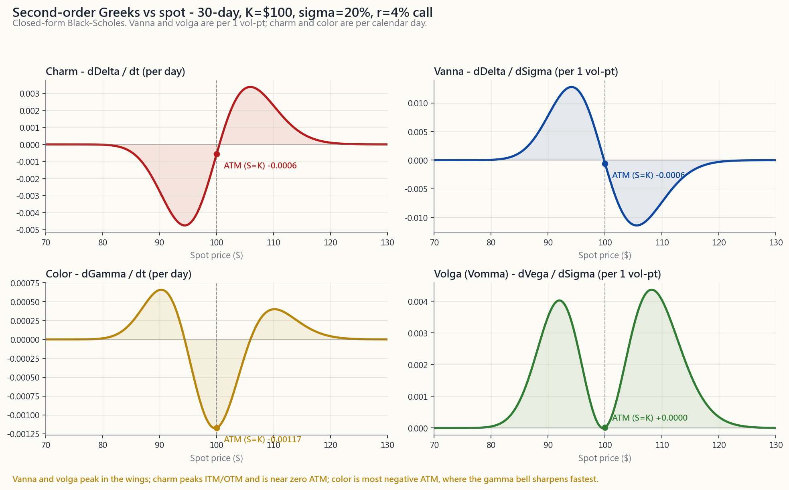

# 附加课20：希腊字母深度解析 — Vanna、Charm、Color与二阶惊喜

---

## 第一部分：阅读材料

---

### 1. 为何此课至关重要

第29周介绍了五个**一阶希腊字母** — delta、gamma、theta、vega与rho — 即期权价格相对于关键输入变量（现货价、时间、波动性、利率）的偏导数。对于95%的散户期权头寸而言，这五个就够用了。用delta来给备兑看涨期权定规模，盯着theta，在财报前瞄一眼vega，如此就算完成。

但期权存在于一个非线性曲面上，一阶数值不过是局部斜率。一旦投资组合规模足够大 — 或者开始动态对冲，或者运营0DTE流量 — **二阶希腊字母**就开始发挥作用：

1. **delta本身会随波动性变动而移动（vanna）。** 这就是为什么大跌时VIX急涨，你的看跌期权所受损伤不如单纯用delta预测的那么大。
2. **即便标的不动，delta也会随时间流逝而漂移（charm）。** 你的周末对冲到了周一开盘就已错位。平值期权的delta加上charm，解释了为何钉针风险真实存在。
3. **gamma随到期日临近而变化（color）。** 第29周那条平滑的gamma曲线，在到期日变成一根尖针。color正是用来描述这种陡化过程的。
4. **vega本身具有凸性（volga / vomma）。** 隐含波动率每变动1个点，不会线性地改变vega。volga正是深度虚值"彩票票"在VIX飙至66的单日内能五倍上涨的原因。

本节课存在的第五个更宏观的理由是：**自2022年以来，做市商持仓已成为标普500指数日内走势的一阶驱动因素。** 指数期权中零DTE（0DTE）流量的爆炸式增长，每周数次翻转了做市商的总体市场gamma的正负。六月与十二月的季度到期日（OpEx）周，如今清晰呈现出**钉针**规律 — 标普500像被磁铁吸住一样，在下午4点收盘前紧贴整数点位。如果只懂delta，这些流量根本无从看见。了解二阶希腊字母集中在哪里，才是解读这一现象的方法。

不过，对散户而言，本课诚实的框架 — 且在三处反复强调 — 是：**除非期权超过你净资产的~5%，否则二阶希腊字母只是有趣的知识，而非可执行的操作指南。** 读这节课就像读一本发动机原理书：你会成为更好的驾驶员，但不必自己重建化油器。

---

### 2. 你需要掌握的内容

#### 2.1 一阶希腊字母 — 一行回顾

对于以Black-Scholes定价的欧式看涨期权，现货价为$S$，行权价为$K$，到期时间为$T$，波动性为$\sigma$，无风险利率为$r$：

- **Delta** $\Delta = \partial C / \partial S = \Phi(d_1)$ — 对冲比率。看涨期权为0至1，看跌期权为0至-1。以每$1现货变动为计量单位。
- **Gamma** $\Gamma = \partial^2 C / \partial S^2 = \phi(d_1) / (S \sigma \sqrt{T})$ — 曲率。多头期权始终为正。呈钟形，峰值在平值处。
- **Theta** $\Theta = \partial C / \partial t$ — 每日时间损耗，多头期权为负值。平值处最负，随到期临近按$1/\sqrt{T}$加速。
- **Vega** $\nu = \partial C / \partial \sigma = S \phi(d_1) \sqrt{T}$ — 隐含波动率敏感性。以每1个波动率点为计量单位。峰值在平值处，随$\sqrt{T}$上升。
- **Rho** $\rho = \partial C / \partial r = K T e^{-rT} \Phi(d_2)$ — 利率敏感性。对短期期权可忽略不计，对长期期权（第38周）影响较大。

以上是你可以在任何券商平台上读取的数据表。本节后续内容均为**这些导数的导数。**

#### 2.2 Vanna — 当隐含波动率变动时，Delta随之移动

**Vanna** 是交叉偏导数：

$$ \text{vanna} = \frac{\partial \Delta}{\partial \sigma} = \frac{\partial \nu}{\partial S} = -\phi(d_1) \frac{d_2}{\sigma} $$

简单来说：你的delta每变动1个隐含波动率点所发生的变化量。

典型案例：你持有一张delta为-0.25的SPY看跌期权作为尾部对冲。市场下跌4%，与此同时VIX从14跳升至24。你的看跌期权的**delta已从-0.25移动至约-0.42**，这甚至还未计入现货价格变动的效果 — 这是因为该行权价对应的看跌期权vanna为正（当看跌期权虚值时，-d2为正，公式中的负号发生翻转）。对冲效果比静态delta所预示的*更好* — 这正是"波动性尾巴摇动狗身"机制，以希腊字母的方式表达。

相同机制，方向相反：溢价行权价的备兑看涨期权卖家，当隐含波动率跳升时，其卖出的看涨期权delta**上升**，意味着其有效多头股票敞口缩减得比预期更快。这就是vanna带来的被动行权风险。

**Vanna集中的位置：** 虚值期权，无论看涨还是看跌。在平值处，$d_2$接近零，因此vanna也接近零。符号规律（虚值看涨期权vanna > 0，实值看涨期权vanna < 0；看跌期权方向相反）直接来源于$d_2$的符号。

上图右上方面板展示了vanna的S形曲线：在平价两侧出现符号相反的峰值，平值处为零。这正是为什么关注持仓vanna敞口的做市商，将注意力集中在25-delta和10-delta的期权翼部，而非50-delta的行权价。

#### 2.3 Charm — 当时间流逝时，Delta随之移动

**Charm**（亦称*delta衰减*）为：

$$ \text{charm} = \frac{\partial \Delta}{\partial t} = -\frac{\partial \Delta}{\partial T} $$

对于$r=q=0$的看涨期权，可简化为：

$$ \text{charm}_{\text{call}} = -\phi(d_1) \cdot \frac{d_2}{2 T} $$

交易语言来说：**即便SPY纹丝不动，你的delta也会在隔夜悄悄漂移。** 一张60天、隐含波动率30%、delta为-0.30的SPY看跌期权，仅靠charm每天就会获得约+0.0035的delta。再叠加一个周五至周一的三天周末，该头寸在周一开盘前已移动了~0.01的delta — 纯粹来自时间流逝。

**实际意涵：**

1. **周末跳空风险在一定程度上是charm风险。** 如果你在周五4点做了delta对冲，即便期货开盘不变，周一9:30开盘时你已偏离对冲，偏差量约为$\text{charm} \times 3$天。delta中性账本会在周五收盘前就针对charm进行再平衡。
2. **到期日的钉针风险，是charm被推向极限的体现。** 距到期仅剩数小时的平值期权，$|d_2|$接近零，但分母中的$T$正在崩塌 — charm急剧放大。这正是为什么很难在周五收盘前判断你是否会被行权一张$K = S$的空头看涨期权。
3. **日历价差从结构上就存在charm敞口。** 空头端的delta漂移速度快于多头端。若你以净delta为零建立日历价差，则你是在做多charm — 随时间流逝，你的delta将向某一方向摆动。

#### 2.4 Color — 当时间流逝时，Gamma随之移动

**Color**（或*gamma衰减*）为：

$$ \text{color} = \frac{\partial \Gamma}{\partial t} $$

charm描述delta随时间的漂移，color则描述gamma随时间的漂移。在做市商持仓报告中，这个希腊字母常以*"gamma滚降"*或*"gamma重新积累"*等名称出现。

**形态：** gamma是一口钟。随着$T \to 0$，这口钟**变得更高更窄**。color是这种收窄过程的速率。钟的中心（平值处）的gamma在最后几小时趋向无穷大；两翼的gamma则归零。

交易室的表达方式：*"今早我在4980行权价上持有500万美元的空头gamma；如果标普500维持此处直到收盘，color将使其到周三变成700万美元的空头。"* 头寸没有变动，标的没有变动，但风险已然增大。

#### 2.5 Volga（Vomma）— Vega自身的凸性

**Volga** 是价格对波动性的二阶导数：

$$ \text{volga} = \frac{\partial \nu}{\partial \sigma} = \nu \cdot \frac{d_1 d_2}{\sigma} $$

它告诉你，随着隐含波动率变动，你的vega敞口本身是加速还是减速。当$d_1 d_2 > 0$时符号为正，这意味着**深度虚值和深度实值期权的volga为正**，而平值期权的volga接近零（因为此时$d_2 \approx 0$）。

**为何重要：** 波动率急涨时，深度虚值看跌期权就是"彩票"。一张在隐含波动率18%时买入的10-delta SPY看跌期权价值0.40美元。市场下跌6%，隐含波动率飙升至38%，该看跌期权 — 甚至不计入现货价格变动 — 也会成倍增值，因为**vega本身随着行权价在波动率距离维度上更接近平值而上升**。这就是为什么做空波动率的交易者在尾部风险事件中著名地爆仓：他们的vega变空速度快过其对冲速度。

#### 2.6 做市商持仓、Gamma墙与0DTE

本节是自2022年以来变化最大的部分。

**2022年前：** 标普500指数期权未平仓合约的大部分集中于月度到期，季度OpEx（3月、6月、9月、12月的第三个周五）规模最大。做市商的总体gamma主要集中于整数点位行权价（5000、5100、4900）。在到期周 — 尤其是周三，指数gamma开始滚降时 — 标普500往往"钉"在主要行权价附近，因为在该行权价上空头gamma的做市商必须不断在下跌时买入、在上涨时卖出，以维持delta中性。

**2022年后：** 0DTE爆炸式增长。标普500/SPY的每日到期期权，到2024年中期已占标普500期权总成交量的约45%。做市商净gamma可在一天之内多次从多头翻转为空头。钉针规律如今既更为频繁（因为每天都有到期），也更为剧烈（因为当日期权的charm和color极度放大）。

上图是某次近期季度OpEx周五标普500现货盘中走势的示意重建图 — 指数早盘漂移，午盘前后向5000点靠拢，随后在最后两小时于该点位0.15%的波动区间内震荡。虚线水平标记着收盘前未平仓合约最大的三个行权价。这并非机械宿命 — 但如今已足够普遍，以至于每家主要券商的自营研究团队都在追踪。

**散户的启示：** 如果你持有一个铁鹰策略，其空头腿恰好在季度OpEx周的主要整数点位行权价，**当标普500似乎在周三至周五被"磁铁"吸住该行权价时，不要追逐价格波动。** 这种行为有迹可循，并非魔法；而且一旦期权到期、做市商重新对冲，它就会立即逆转。你的优势在于耐心。

#### 2.7 散户过滤器 — 二阶希腊字母真正重要的时刻

以下规则值得反复强调：

**除非期权超过你可投资净资产的~5%，否则不要为二阶希腊字母优化。** 一阶希腊字母加上基本的头寸规模管理，将主导任何微小差异。对于只做一个备兑看涨期权计划或季度尾部对冲的人来说，理解charm带来的边际优势是真实的，但微乎其微。

以下例外情况确实开始重要：

1. **你运行的是delta对冲头寸。** 一旦开始动态再对冲，二阶希腊字母就成了你盈亏的驱动因素。Vanna和charm在两次再对冲之间移动你的delta；volga和color则移动你的gamma敞口。
2. **你持有期权进入到期前最后一周。** Charm、color与theta加速之间存在非线性交互。如果你在T<7天时仍持有头寸，就需要完整的图景。
3. **你在财报期间卖出价差组合。** Volga是当"隐含波动幅度"被突破时，炸毁做空宽跨式策略的希腊字母。
4. **你集中交易0DTE。** 本课所有希腊字母，在当日到期期权上均为一阶重要性。

在上述四种情况之外，这节课存在于你的余光之中：是有用的背景知识，而非对冲操作指南。

---

### 3. 常见误解

1. **"高阶希腊字母只是学术概念。"** 2022年前，它们确实不过是注脚。2022年后，随着0DTE和大规模季度OpEx，vanna和charm流量在标普500日内数据中清晰可见。只有当你忽视那个70%美国散户股票以之为基准的指数时，它们才算学术。

2. **"Vanna对多头期权来说总是正的。"** Vanna的符号取决于价值状态。虚值看涨期权多头的vanna为正；实值看涨期权多头的vanna为负。这个错误源于将vanna（交叉偏导数）与vega（多头期权永远为正）混淆。

3. **"Charm只是theta换了个说法。"** 并非如此 — theta是*期权价格*的衰减；charm是*delta*的衰减。一个头寸可以同时具有负theta和正charm（一张虚值看涨期权多头每天消耗权利金，但其delta的绝对值在同一时间轴上向零漂移）。

4. **"Gamma在到期日是稳定的。"** 恰恰相反 — gamma在到期日是最不稳定的。Color（gamma每单位时间的变化速率）在临近到期时最大，gamma本身在恰好$S = K$、$T = 0$时可飙升至无穷大。

5. **"做市商总是把标普500钉在整数行权价。"** 钉针机制要求做市商在该行权价上持有净空头gamma。若他们持有净多头gamma（因为客户购入而非卖出期权），同样的情形反而产生*反钉针效应* — 放大波动，而非抑制。

6. **"0DTE不过是个更快节奏的赌场。"** 0DTE流量已改变标普500日内波动率的结构。0DTE上的vanna和charm流量能够产生可识别的日内规律（早盘震荡、下午趋势），这是五年前不存在的。这是真实的结构性变化，而非一时风潮。

7. **"Volga只在VIX急涨时才重要。"** Volga在任何大幅波动率变动时都重要。不对称性 — 波动率上涨速度快于下跌 — 正是在尾部对冲构建中做多volga能产生正预期收益的原因。

8. **"理解了公式，就可以全部对冲掉。"** 对冲vanna需要不同行权价的期权；对冲color需要不同到期日的期权。每一次对冲都增加交易成本，并在用作对冲工具的希腊字母上增添残余风险。机构交易台在三阶希腊字母上接受残余敞口。

9. **"高阶希腊字母总是让头寸变差。"** 多头vega结构通常具有正volga，这意味着在波动率扩张时，凸性正在*为你*工作。问题在于你为此支付了多少（theta）对比你实际获得的vol-of-vol。

10. **"所有这些希腊字母都随规模线性扩展。"** 每张合约线性扩展，但现货价和隐含波动率的过程并不线性扩展。跨越不同行权价的100张合约头寸，与10个各10张合约的头寸表现不同 — 跨越波动率曲面的分散投资会改变总体希腊字母配置。

---

### 4. 问答环节

**Q1：如果charm在隔夜改变我的delta，为什么券商不替我再对冲？**

不会，因为它不了解你的对冲策略。券商报告你的投资组合希腊字母（delta、gamma、theta、vega），但不会自动再平衡对冲。如果你运行的是delta中性账本，需要根据当天早上的投资组合delta自行下达再平衡委托。Charm是你的对冲算法应当纳入的输入之一；周末charm是最常被忽视的一个。

**Q2：我能在公开图表上观察到vanna流量吗？**

间接可以。多家研究机构（SqueezeMetrics、SpotGamma、芝商所研究部门）每日发布做市商gamma敞口（"GEX"）和vanna敞口的估算值。这些数字是估算，因为做市商账本不公开。质量属于"方向性有参考价值"而非"可独立交易"级别。将其视为情绪指标。

**Q3：最简单的以volga为主要希腊字母的策略是什么？**

做空平值跨式策略属于空头volga（隐含波动率扩张时你会损失凸性倍增的金额）。相反，做多宽跨式策略，尤其是深度虚值，属于多头volga。波动率风险溢价（第49周）本质上就是市场向负volga的卖方支付溢价，以对冲尾部波动率扩张风险。

**Q4：为什么期权账本特别倾向于在整数行权价附近钉针？**

两个原因。第一，客户流量倾向于集中在心理整数行权价（5000、5100），因此未平仓合约在此最多。第二，这些整数行权价吸引来自ETF做市商和标普500/SPY套利者的指数套利对冲。综合效应是，整数点位集中的gamma远多于例如4983，这意味着做市商因gamma引发的再平衡压力在该点位达到峰值。

**Q5：Color对备兑看涨期权卖家真的重要吗？**

影响有限。如果你卖出一张30天的备兑看涨期权，color告诉你，该头寸的gamma分布在30天内逐渐收窄 — 到第25天，你的看涨期权gamma已集中在行权价附近一个狭窄的区间。如果股价在最后一周开始接近行权价，这会影响被行权的概率。大多数散户备兑看涨期权卖家不在意这一点，但它是"在21天到期时滚仓"这条惯例规则背后的技术原因：正是从那天起，gamma的重新集中变得显著。

**Q6：看跌期权的vanna是正还是负？**

公式相同，符号约定相反。对于看跌期权，vanna同样等于$-\phi(d_1) \cdot d_2 / \sigma$。解读发生翻转：当你持有虚值看跌期权多头且隐含波动率上升时，你的delta变得更负（从-0.3接近-0.5），实际上让你**获得更强的空头对冲**。这是在股市下跌时波动率急涨会使尾部对冲效果优于"预期"的结构性原因。

**Q7：存在三阶希腊字母吗？**

存在 — speed（∂Γ/∂S）、zomma（∂Γ/∂σ）、ultima（∂Volga/∂σ）。它们与运营大型方差互换账本或奇异结构化产品的专业交易台相关。对于美国上市的标准期权，三阶希腊字母属于噪声级别。

**Q8：散户平台如何显示这些数据？**

不统一。ThinkorSwim和盈透证券在其分析标签中提供Vanna、Charm和Volga，但埋得很深。富达、嘉信理财、Robinhood则完全不显示。如需这些数据，你需要自行根据BSM封闭解析式计算（本页面的互动工具可实时完成计算）。

**Q9：这与第40周和第49周有何关联？**

第40周（波动率指数）解释了VIX本身是标普500的预期方差。第49周（波动率套利）解释了波动率风险溢价。**二阶希腊字母是那些宏观波动率叙事落地到单个期权头寸的方式。** 驱动VIX和波动率风险溢价的做市商流量，与你在vanna / charm / color敞口中看到的流量是同一回事。物理机制相同，只是聚合层次不同。

**Q10：我应该在投资组合中加入"vanna交易"吗？**

几乎肯定不应该。Vanna交易 — 旨在单独隔离vanna敞口的多空组合 — 需要跨越整个波动率曲面的流动性期权、低廉的交易成本以及实时风险管理。对散户而言，纯粹的二阶希腊字母交易是一条死胡同。将二阶希腊字母用作**解释工具**，用来理解现有头寸正在发生什么，而非用作策略菜单。

**Q11：这节课的核心思想是什么？**

波动性尾巴摇动狗身。Vanna和charm是波动率扩张与时间衰减在不动用标的资产交易的情况下重新排列股票敞口的机制。杠铃式仓位管理和期权税务纪律同样重要，但核心思想是波动率尾巴。

**Q12：如果我只记住这节课的一件事？**

"五个一阶希腊字母之外的希腊字母，当你将期权作为*系统*运营而非单一头寸时才真正重要。" 每季度做一次尾部对冲？一阶希腊字母足够。每日再平衡的0DTE账本？你需要全套工具 — 而且不应该独自运营这样的账本。

---

## 第二部分：YouTube脚本

---

**视频标题：**"希腊字母之外的希腊字母 — Vanna、Charm、Color，以及做市商为何钉住标普500"

**目标时长：** 约12分钟

**主持人：** 陳馬、小魚

---

**[开场 — 0:00]**

**陳馬：** *(坐着，身体前倾对着镜头)* 两个月前我们做了第29周，五个希腊字母。Delta、gamma、theta、vega、rho。我们说那是散户需要的95%。我们现在仍然这么认为。

**小魚：** *(画外音，语气干练)* 那另外5%是什么？

**陳馬：** 另外5%，就是专业期权交易台所说的**高阶希腊字母**。Vanna。Charm。Color。Volga。而它们开始变得越来越重要的原因 — 即便对于只看标普500走势图的散户来说 — 是因为2022年以来0DTE的爆炸式增长。所以今天的课要做两件事。第一，教你数学。第二，展示做市商在季度OpEx前后的持仓如何显著影响指数走势。今天大部分内容是背景知识，不是操作指南。最后的散户过滤器会直接告诉你，"如果期权占你净资产不到5%，看这个纯属娱乐。"

**小魚：** 娱乐，明白了。

**[VISUAL: image/side20_second_order.png — 全屏，5秒]**

**陳馬：** 这是我们的参考图 — 一张类SPY风格的30天平值看涨期权，四个面板展示四个二阶希腊字母。不用死记。认识这些形状就够了。

---

**[1:15 — 回顾五个一阶希腊字母]**

**陳馬：** 快速回顾。Delta，期权价格曲线的斜率。Gamma，曲率。Theta，每日衰减。Vega，对隐含波动率的敏感性。Rho，对利率的敏感性。这是第29周的内容。如果这些词听起来还陌生，先暂停去看那一期。

**小魚：** 高阶希腊字母是什么？

**陳馬：** 是**导数的导数。** Delta是期权价格每变动一美元现货的变动量。*Vanna*是delta每变动一个隐含波动率点的变动量。*Charm*是delta每过一天时间的变动量。它们是交叉偏导数。

---

**[2:30 — Vanna]**

**陳馬：** 我们先讲vanna，因为它能解释大多数散户已经注意到但说不清楚的一个现象。你持有一张虚值看跌期权。市场下跌。VIX急涨。然后你的看跌期权涨幅*远超你的delta预测*。不只是因为现货价格移动，不只是因为vega — delta本身也移动了。

**小魚：** 因为vanna。

**陳馬：** 因为vanna。数学上，vanna等于负的d1的标准正态密度乘以d2除以sigma。不用记这个。记住这个：当隐含波动率上升时，虚值期权的delta绝对值向平值方向移动。你那张-0.25的看跌期权，仅因为隐含波动率的变动，就变成了约-0.40的看跌期权。

**[VISUAL: image/side20_second_order.png，右上方面板放大]**

**陳馬：** 右上方面板。那条像正弦波的曲线。平值处为零，两翼出现符号相反的峰值。这就是vanna的形状。运营尾部对冲账本的做市商对翼部敞口 — 10-delta和25-delta — 极为关注，正是因为vanna集中在那里。

---

**[4:30 — Charm]**

**陳馬：** Charm是相同的机制，但驱动力换成了时间，而非波动率。我的delta仅仅因为过了一天 — 哪怕标的完全没动 — 会移动多少？

**小魚：** *(半信半疑)* 那肯定很小吧。

**陳馬：** 单日来看确实很小。数字在小数点后第三位。乘以一个周末，乘以100张合约，你就有了几百股有效股票敞口，在周五收盘到周一开盘之间悄悄出现，什么都没发生。Delta对冲的交易台会在周五收盘前就针对charm进行再平衡。我们不这么做 — 但我们需要知道它存在，因为这正是**到期日周五钉针风险真实存在的原因。** 越接近到期，delta在没有现货波动的情况下漂移得越剧烈。

**[VISUAL: image/side20_second_order.png，左上方面板]**

---

**[6:00 — Color]**

**小魚：** 那color呢？

**陳馬：** Color是gamma版本的charm。正如charm是delta随时间的漂移，color是*gamma*随时间的漂移。Gamma是一口钟。随着到期临近，这口钟在平值行权价处变得更高更窄。Color就是这种收窄过程的速率。图的左下方。

**小魚：** 以此类推，volga就是……

**陳馬：** Volga是vega的凸性。Vega在隐含波动率方向上并非恒定 — 当隐含波动率上升时，虚值行权价的vega本身也上升。这就是为什么深度虚值看跌期权在波动率急涨时能五倍增值。右下方。

---

**[7:30 — 做市商钉针效应]**

**陳馬：** 好，现在讲那个散户实际上能看到的部分。

**[VISUAL: image/side20_dealer_pinning.png — 全屏，5秒]**

**陳馬：** 某次近期季度OpEx周五，标普500现货盘中走势的示意图。指数早盘漂移，午盘前后开始在整数行权价附近越来越小幅震荡。到收盘时，它以0.15%的幅度上下抖动，像是被粘在5000点上。

**小魚：** 为什么会这样？

**陳馬：** 做市商总体gamma。标普500整数行权价的未平仓合约巨大 — 5000、5100、4900。如果做市商整体上在该行权价持有空头gamma — 也就是说客户买入了期权 — 那么每次指数上涨，做市商就必须卖出以保持delta中性。每次下跌，他们就买入。他们机械地抑制波动。结果就是钉针效应。

**小魚：** 总是会钉针吗？

**陳馬：** 不总是。如果做市商持有净多头gamma — 客户是卖出而非买入期权 — 同样的情形产生*相反*的效果：波动被放大。这就是有时在鲍威尔发言的美联储议息日会发生的事。你不需要预测它；你需要知道你处于哪种状态。Squeezemetrics、SpotGamma和其他几家每日发布做市商gamma敞口估算值。

---

**[9:30 — 互动工具演示]**

**陳馬：** 页面上的互动工具让你可以对任意合约扫描全部五个一阶希腊字母和四个二阶希腊字母。

**[VISUAL: interactive/side20_greeks_explorer.html]**

**陳馬：** 设置现货价100，行权价100，30天，波动率20%。看顶行的九个数字。下方是敏感性热力图 — 你可以选择九个希腊字母中的任意一个，看它随现货价和到期天数变化的情况。选**vanna**。注意那个对角条纹规律 — vanna在翼部和中等到期天数时最大。再选**color**。整个曲面在最后7天集中于平值附近。这就是我们刚才讲的gamma收窄，以可视化的方式呈现。

**小魚：** Charm呢？

**陳馬：** Charm显示最大绝对值出现在临近到期的翼部。在平值附近徘徊？Charm很小。已经深度实值或深度虚值，还剩5天？Charm非常大。

---

**[10:45 — 散户过滤器]**

**陳馬：** 带走三条规则。

**小魚：** *(数数)* 第一条。

**陳馬：** 期权占净资产不到5%？不需要这些。看一遍作为背景知识。用一阶希腊字母来定规模。

**小魚：** 第二条。

**陳馬：** 你运行delta对冲账本、持仓进入到期周，或者做0DTE？需要这些。Vanna和charm在你不注意的时候驱动着你的盈亏。

**小魚：** 第三条。

**陳馬：** 关注季度OpEx周 — 3月、6月、9月、12月。钉针规律是真实的，做市商gamma估算值是公开发布的，操作要领是"当标普500日内走势看似被某整数行权价磁铁吸住时，不要追逐价格波动"。不是魔法。是资金流量。

---

**[结尾 — 11:45]**

**陳馬：** 附加课20到此结束。下一期，附加课21是 — *(停顿)* — 小魚，下一期是什么？

**小魚：** *(看屏幕外读到)* 税务亏损收割深度解析。

**陳馬：** 对。没那么玄，但更赚钱。

**小魚：** 永远都是更赚钱。

**[结束]**