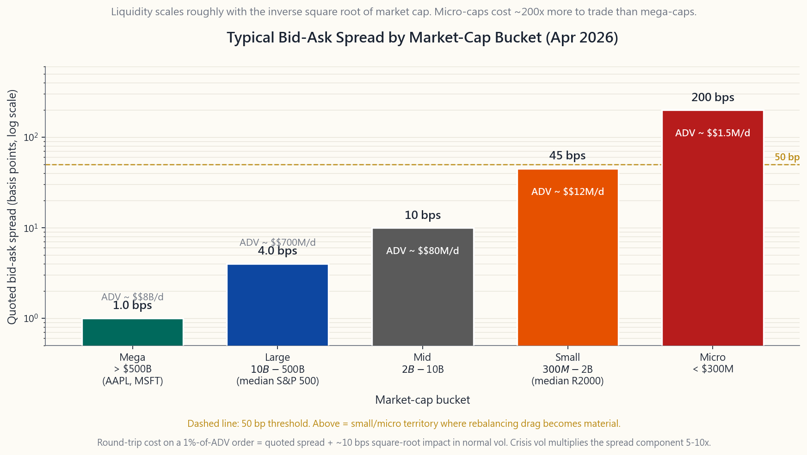

# 补充课26：市场流动性——深度、价差与危机中的真实情况

---

## 第一部分：阅读材料

---

### 1. 为何重要

流动性是散户投资组合中最容易被忽视的单一风险。
收益率抢占所有头条；流动性收割所有讣告。过去四十年每一次重大崩盘——1987年、1998年、2000年、2008年、2010年、2020年、2022年——都在某种基本面导火索之上叠加了流动性因素。所谓"波动性尾部反噬主体"本质上是一句流动性判断：当波动性翻倍，平仓成本就变为五倍，而正是这*第二阶段*造成了真正的伤害。

散户投资者需要建立流动性工作模型，原因有四。

1. **隐性成本会复利积累。** 苹果公司股票2个基点的平均双边成本是噪音。一只市值3亿美元的小盘股50个基点的双边成本，每年通过再平衡支付四次，将吞噬200个基点的收益——比大多数因子溢价还多（第50周）。在搞清楚进出成本之前，你无法决定该持有什么。
2. **危机首先是流动性事件，其次才是基本面事件。** 2020年3月，*地球上最纯粹、最深厚的市场*——30年期在途美国国债——在八个交易日内买卖价差从半个基点飙升至*四十*个基点，美联储不得不出手干预才将其恢复正常。如果这种情况能发生在基准无风险资产上，你的小盘价值股仓位并不特殊。
3. **资产配置必须匹配负债的流动性，否则会让你付出代价。** 三十年内无法动用的401(k)账户可以持有非流动私人信贷或非上市房地产投资信托（补充课14）。两年后用于缴纳学费的应税账户则不能。四档资金框架，本质上就是一次流动性分层练习。
4. **美联储的操作手册就是一份流动性脚本。** PDCF、MMLF、BCFP、BTFP——过去两轮危机中启用的每一项紧急工具，都是针对特定枯竭资金池的定向补给。了解每项工具对应哪个资金池，当下一轮危机来临时，你就能判断谁有偿付能力、谁没有。

本补充课将建立词汇体系、代理指标、历史案例研究和一套实用计算工具，让"这个东西流动性够吗？"成为一个可以用数字而非形容词来回答的问题。

---

### 2. 核心知识

#### 2.1 流动性的三个维度——紧度、深度、韧性

学术界将流动性划分为三个维度，通常相互关联，但在压力下可能剧烈背离。

**紧度**是买卖价差——以最优报价成交单笔股票的双边成本。苹果公司在正常交易时段，200美元的股票买卖差价为0.01美元——半个基点。5美元的微型股差价可能达到0.05美元——100个基点。紧度是可见的；它是最直观的维度，也是大多数散户交易者唯一追踪的维度。

**深度**是最优报价档位的挂单量。苹果公司内盘卖单可能显示5万股。一只小盘股可能只有200股。深度告诉你，在开始*吃穿订单簿*——逐级消化价格更差的限价单——之前，你能交易多大的规模。Almgren-Chriss平方根冲击模型（第44周）指出，以订单规模占日均成交量（ADV）百分比计算，正常波动率下冲击成本（基点）约等于其平方根乘以10：占ADV 1%的订单约产生10个基点冲击，10%约产生32个基点，100%约产生100个基点。

**韧性**是成交后订单簿的补充速度。深度高且韧性强的市场能让做市商在几秒内将报价恢复至前中间价1个基点以内。脆弱的市场——挂单深度被高频交易者*虚假显示*，一遇压力便消失——会跳空并持续低迷。典型的韧性失灵案例是2010年5月6日的闪崩：真实做市商撤回报价，标普500 E-Mini期货在五分钟内暴跌9%，对抗一个薄弱的订单簿，用了二十分钟才重建。

#### 2.2 流动性代理指标——当看不到订单簿时该衡量什么

在交易所付费数据流之外，你很少能直接获取限价订单簿。以下四个代理指标近似反映三个维度，在任何散户数据包中均可获取：

1. **报价价差。** 买卖价差除以中间价，单位为基点。直接衡量紧度。2026年4月典型数据：SPY约0.5个基点，苹果约1个基点，标普500中位个股约4个基点，罗素2000中位个股约25个基点，微型股中位约150个基点。
2. **日均成交量（ADV）。** 每交易日美元成交量。直接衡量容量。2026年4月：SPY日均约300亿美元，苹果约140亿美元，标普500中位个股约4亿美元，罗素2000中位个股约2500万美元，微型股中位不足50万美元。
3. **Amihud非流动性比率** = |日收益率|/美元成交量的均值。数值越高，每美元成交量引发的价格反应越大，即越不流动。实证上这是最简洁的截面流动性单一评分。
4. **换手率** = ADV / 市值，年化。超大市值股换手率在100%-200%；微型股通常不足20%。低换手率意味着一只股票*可以购买*，但并不*活跃流通*——持有者基础稀薄，遇到被迫卖家时难以不产生价格冲击地承接。

对于交易所交易基金，还有第五个值得单独说明的代理指标：**申购/赎回套利**机制使交易所交易基金相对净值的溢价保持紧密，因为授权参与者（AP）会从任何有意义的偏差中获利（补充课03）。正常交易时段，SPY溢价很少偏离净值超过2个基点。但AP套利是一种*容量受限*机制——当底层篮子流动性枯竭，AP资产负债表无法承接申购流量，交易所交易基金可能偏离净值超过100个基点（2020年3月LQD：净值折价5%）。

#### 2.3 流动性的风格化曲线——为什么小盘股成本是大盘股的50倍

在美国上市股票全集中，买卖价差大致随市值的反平方根缩放，在1000亿美元以下出现急剧的非线性扩张。

| 类别 | 市值区间 | 典型价差 | 典型ADV | 双边成本 |
|---|---|---|---|---|
| 超大盘 | > 5000亿美元 | 1个基点 | 50亿-300亿美元 | <5个基点 |
| 大盘 | 100亿-5000亿美元 | 2-5个基点 | 2亿-50亿美元 | 5-10个基点 |
| 中盘 | 20亿-100亿美元 | 5-15个基点 | 3000万-2亿美元 | 15-40个基点 |
| 小盘 | 3亿-20亿美元 | 25-60个基点 | 300万-3000万美元 | 50-150个基点 |
| 微型 | < 3亿美元 | 100-300个基点 | < 300万美元 | 200-600个基点 |

双边成本包含价差加上占ADV 1%订单的平方根冲击。买入苹果的散户投资者进出成本约5个基点。试图在一只2亿美元微型股中建立5万美元仓位的散户，*单方向*成本就高达400-600个基点——而且在压力下可能根本无法退出。

#### 2.4 交易所交易基金与底层篮子流动性——授权参与者的兜底

通过交易所交易基金（LQD、HYG、MUB、TLT）而非直接持有底层债券的标准理由是：*交易所交易基金的封装形式*比篮子本身的流动性强1000倍。LQD每日场内成交量平均20-30亿美元；其内部的中位债券在TRACE平台上每周可能只成交两次。封装本身*就是*流动性。

这种机制在正常环境中有效，因为AP套利任何封装价格与净值之间的偏差。但在压力下可能失效。2020年3月LQD：3月12日交易所交易基金以净值打折4.6%成交；HYG折价达7.0%。美联储3月23日宣布SMCCF/PMCCF（公司信贷工具）在48小时内消除了这些折价，此后未再重现。教训不是"不要持有债券交易所交易基金"——它们是散户投资者持有信用资产的唯一实用方式。教训是：*在十年一遇的流动性事件中，封装价格可能偏离净值5%，而你不应该在那一天被迫卖出。*

#### 2.5 流动性在最需要时消失——三个典型危机案例

以下三个案例研究，每一个都展示了流动性在投资者最希望用到它的市场状态下如何消失。它们是"波动性尾部反噬主体"这一判断的实证基础。

**2020年3月：国债市场功能失调。** 在途30年期美国国债——地球上最深厚、流动性最强的资产——的买卖价差在2020年3月9日至17日之间从不足1个基点爆升至超过40个基点。非在途国债价差更糟。原因：外国央行出售国债以筹集美元用于赎回；对冲基金在追加保证金压力下平仓相对价值国债基差交易；一级交易商资产负债表因国债发行已满，无法再吸纳更多供给。美联储于3月12日投入1.5万亿美元回购操作，3月23日宣布无限量量化宽松，到4月价差恢复至接近正常水平。

**2010年5月：闪崩。** 5月6日美东时间14:42，单笔41亿美元的E-Mini标普500卖出算法在没有价格/时间约束的情况下执行。流动性提供者撤回报价。标普500在五分钟内下跌9%。数百只股票以"存根报价"0.01美元成交。恢复用时20分钟。原因：午间订单簿稀薄，13个交易所之间的碎片化路由，以及高频交易者的报价无强制提供深度的义务。美国证券交易委员会的回应：涨跌停限制（LULD）机制、单股熔断机制，以及IEX 350微秒速度减缓器（第44周）。

**2007年8月：量化基金平仓。** 运行相似价值/动量因子策略的多空股票市场中性基金在2007年8月6日至9日期间同步遭受损失。机制：一两家高杠杆机构被迫缩减敞口（因别处的次贷追加保证金）；其卖出影响了因子收益；所有运行相同因子的基金都出现亏损；实力较强的基金也不得不去杠杆；卖出自我强化持续了三天。文艺复兴科技48小时内亏损约6%。高盛全球股票机遇基金一周内亏损30%。但到第二周末，各因子完全收复失地。教训：在拥挤的*低波动*策略中，流动性撤出表现为相关性骤升——每一笔"不相关"的交易在平仓期间都变成了同一笔交易。

#### 2.6 美联储流动性工具箱——现代兜底机制

自2008年以来，美联储组建了一套流动性工具菜单，每一项都针对特定的失灵模式。它们与上述案例研究直接对应。

- **贴现窗口**（常设）：银行以抵押品借款。因污名化效应，使用率低。
- **PDCF——一级交易商信贷工具**（2008年、2020年、2023年）：为非银行一级交易商提供回购融资。填补券商资产负债表缺口。
- **MMLF——货币市场共同基金流动性工具**（2008年、2020年）：为货币市场共同基金赎回挤兑提供兜底。
- **CPFF——商业票据融资工具**（2008年、2020年）：在私人买家消失时向企业发行人购买商业票据。
- **BCFP/SMCCF/PMCCF——公司信贷工具**（2020年）：美联储购买投资级公司债券和交易所交易基金。在48小时内消除了LQD/HYG的净值折价。
- **BTFP——银行定期融资计划**（2023年）：以国债面值（而非市场价值）为抵押提供一年期贷款，专门设计用于防止在硅谷银行挤兑期间被迫出售水下长期债券。

2008年/2020年/2023年的市场教训：美联储最终会恢复系统性市场的流动性，但公告效果比实际投入金额更重要。等待*公告*（2020年3月23日）的投资者捕获了大部分反弹；试图在政策回应之前判断*底部*的投资者大多踏空。市场非理性持续的时间可以超出你的承受能力——但美联储*可以*让你保持偿付能力，只要你能撑到工具到位。

---

### 3. 常见误解

1. **"有报价的股票就是流动的。"** 报价是单股指示价格。最优报价档位的深度可能只有200美元，即便价差只有0.01美元。
2. **"买卖价差是唯一成本。"** 价差只是交易成本的一半；市场冲击是另一半。对于占ADV 1%的订单，两者大致相当。订单越大，冲击越占主导。
3. **"交易所交易基金始终比底层资产更流动。"** 在正常环境中，凭借AP套利机制确实如此。在压力下，当AP资产负债表满载时则不然——见2020年3月的LQD。
4. **"成交量等于流动性。"** 成交量是*已发生*的活动。它不告诉你下一百万股的成本是多少。一只股票日均成交量可达5000万美元，仍可能在五分钟内移动500万美元时付出200个基点的代价。
5. **"国债始终是流动的。"** 它们*几乎*始终是地球上流动性最强的市场。但在2020年3月并非如此。美联储不得不出手干预才使之恢复。
6. **"闪崩是高频交易的问题。"** 近端原因是单一无价格约束的卖出算法。高频交易者通过撤回流动性*放大*了跌幅，但并非始作俑者。政策修复（LULD、熔断机制）针对的是放大效应。
7. **"知名指数基金能承接一切。"** SPY可以。一只4亿美元规模的主题型ARK产品则不能。基金规模和底层篮子流动性必须分别核查。
8. **"流动性溢价是无套利的自由收益。"** 不是。它是对*在压力下持有非流动资产*的补偿。溢价是真实的，但你是被支付来*在所有人都想卖时无法卖出*的。溢价是真实的，但你是在最糟糕的时候*被迫持有*来赚取它的。

---

### 4. 问答环节

**问题1：如何查看我考虑买入的股票的买卖价差？**
答：任何散户平台都显示盘口最优报价。查看显示的买价和卖价，取价差，除以中间价，乘以10000得出基点数。请在*正常交易时段*进行——盘前和盘后价差可能是正常时段的5-10倍。如需有意义的比较，使用美东时间下午3点的数据，此时做市商和机构订单流最为活跃。

**问题2：我应该考虑的最低市值门槛是多少？**
答：对于有再平衡压力的应税账户，20亿美元是合理下限——这是小盘股的分界线。低于3亿美元（微型股），价差加冲击加偶发跳空风险的综合成本通常超过预期超额收益。罗素2000指数本身的中位市值约为30亿美元；大多数散户因子交易所交易基金（AVUV、VBR）明确剔除了最底部10%-20%的微型股。

**问题3：债券交易所交易基金的流动性是真实的还是虚假的？**
答：两者都有。封装流动性在任何正常市场中是真实的、可交易的。但它是由底层篮子AP套利支撑的，而篮子本身的交易是按预约进行的。2020年3月，LQD相对净值折价4.6%，HYG折价7%。持有债券交易所交易基金是可以的——但将其在危机中的流动性定性为等同于股票级别的流动性则不可取。

**问题4：为什么市场波动加剧时买卖价差会扩大？**
答：做市商将价差定价为逆向选择风险加库存风险的补偿。两者都随波动性上升。实证上，价差大致与已实现波动性成正比——波动率指数达30意味着价差是平静市场的2-3倍；波动率指数达60意味着5-10倍。危机期间价差扩大10倍。这是*确定性规律*，并不令人意外。

**问题5：学术论文中的"流动性溢价"是什么？**
答：持有非流动资产的实证补偿，跨研究约为每年1%-3%。它是真实的，但不是免费的钱。你通过*在最糟糕的季度无法卖出*来赚取它——恰好是大多数投资者最想卖出的时候。锁定期基金（私募股权、风险投资）以机制性方式捕获这一溢价。每日定价的散户产品（小盘价值交易所交易基金）可能只捕获其三分之一，因为每日流动性削弱了非流动性优势。

**问题6：我能在家计算Amihud比率吗？**
答：可以。取60天的（|日收益率|、日美元成交量）数据。计算|收益率|/成交量的均值。乘以10的6次方得到可用的数量级。数值越低，流动性越强。SPY得分约为0.001；典型小盘股得分1-10；微型股得分可达100以上。作为单一代理指标，它对同类资产的排名效果良好。

**问题7：如何为非流动标的确定仓位规模？**
答：从退出成本反推。选择一个压力情景——比如3倍正常价差加当日占ADV 30%的仓位（周五前被迫卖出）。计算双边成本。如果超过你一年的预期收益，则该标的对这个仓位规模而言流动性不足。如果五天内以2倍正常价差仍无法退出，将仓位减半。

**问题8：2007年8月的市场教训是什么？**
答：拥挤交易就是同一笔交易。五家运行相似价值/动量/质量因子的"不相关"对冲基金，在同一时间卖出了相同的持仓。跨管理人的分散投资在管理人都分散至相同因子时毫无帮助。量化机构现在明确运行容量仪表盘，追踪自己持有某因子ADV的占比。

**问题9：我应该信任盘口显示的深度吗？**
答：部分信任。约60%-70%的显示股数实际上以报价价格成交；其余是*消退流动性*——报价消失的速度比你的订单抵达的速度更快。在压力下这一比例可能降至30%以下。将显示深度视为上限，而非合同保证。

**问题10：美联储宣布新工具时我应该买入吗？**
答：实证上，是的——但仅限于系统性目标资产。2020年3月23日（无限量量化宽松加公司信贷工具公告）之后，LQD到年底回报14%，标普500从低点回报67%。交易逻辑是：公告=*流动性压力资产*的底部。但美联储只托底其认为具有系统重要性的资产。硅谷银行（2023年）托底了国债抵押品，但将股权持有人清零。仔细阅读新闻稿。

---

## 第二部分：YouTube脚本

---

**视频标题：** 市场流动性——价差、深度与危机的真实运作方式
**目标时长：** 约12分钟
**主持人：** 陳馬、小魚

---

**[开场白——0:00]**

**陳馬：** 欢迎回来。今天是一节关于流动性的补充课，也是十个散户投资者中有九个会跳过的课，直到它让他们付出代价。我不打算从定义开始讲。我要从一个事实开始。

**小魚：** 2020年3月12日，30年期美国国债的买卖价差——地球上最纯粹、最深厚、流动性最强的证券——从不足半个基点飙升至超过四十个基点。八个交易日，扩大了八十倍。

**陳馬：** 美联储那一周不得不向市场注入1.5万亿美元的回购资金才将其拉回来。如果这种情况能发生在30年期在途国债上，那它就能发生在你持有的任何东西上。今天我们来建立词汇体系、数学框架和历史案例，这样你就能在需要流动性之前，提前给它定价。

**[VISUAL: image/side26_liquidity_by_size.png]**

---

**[第一节——三个维度——1:30]**

**小魚：** 流动性有三个维度：紧度、深度、韧性。紧度是买卖价差。深度是该价差档位上有多少挂单量。韧性是成交后订单簿的补充速度。

**陳馬：** 大多数散户只看到紧度——交易单上的价差。这就像凭颜色判断一辆车。更深层的问题是：*如果我要卖出五倍于显示规模的量，我能拿到什么价格？*——那是深度——以及*要多久报价才能回来？*——那是韧性。

**小魚：** 正常交易日，三者同向运动。危机时，它们脱钩。价差可能依然显示2个基点，但该价差档位的深度只有一股。第一个真实卖家就能把价格打下去10%。

---

**[第二节——规模与流动性曲线——3:30]**

**陳馬：** 买卖价差大致随市值的反平方根缩放。苹果——一只4万亿美元的股票——双边成本只有一个基点。一只5亿美元的小盘股要50到100个基点。一只2亿美元的微型股，仅价差就可能高达300个基点，还不包括任何市场冲击。

**小魚：** 这是100到300倍的流动性税。如果两只股票预期收益相同，小的那只每年需要跑赢大的200个基点，才能抵消再平衡成本。

**[VISUAL: image/side26_liquidity_by_size.png]**

**陳馬：** 看图表。超大市值股聚集在1个基点。大市值股在3到5个基点。悬崖从小盘股分界线——20亿美元——开始。低于这条线，价差不再是一条线，而是一个分布，有很长的右尾，100个基点以上有相当可观的概率质量。

---

**[第三节——交易所交易基金与授权参与者兜底——5:00]**

**小魚：** 交易所交易基金是伟大的流动性黑科技。封装形式的交易流动性是底层债券的1000倍。LQD——投资级公司债交易所交易基金——每日场内成交量20至30亿美元。它持有的中位债券在TRACE平台上每周可能只成交两次。

**陳馬：** 这之所以有效，是因为授权参与者——通常是大型银行自营交易台——套利交易所交易基金价格与篮子净值之间的任何偏差。买入便宜的一边，卖出贵的一边，交付篮子进行赎回。套利机制将溢价和折价维持在几个基点以内。

**小魚：** 直到失效。2020年3月，LQD相对净值折价4.6%。HYG折价7%。AP资产负债表满载——每家自营交易台已经持有大量信用资产，每家对冲基金都在去杠杆，没有人有空间再承接更多库存。

**陳馬：** 美联储3月23日宣布公司信贷工具——SMCCF和PMCCF——在48小时内消除了这些折价。美联储几乎不需要*真正动用*多少资金。公告本身就是兜底。持有债券交易所交易基金没问题，但不要把它们定性为在危机中具有股票级别流动性来确定仓位规模。

---

**[第四节——三个典型危机案例——6:30]**

**小魚：** 三个案例研究。每一个都展示了流动性在投资者最需要它的市场状态下如何消失。

**陳馬：** 2007年8月——量化基金平仓。五家运行相似价值和动量因子的多空股票对冲基金同时开始卖出。文艺复兴科技48小时内亏损6%。高盛全球股票机遇基金一周内亏损30%。

**小魚：** 没有任何人的"基本面"发生了变化。市场整体也没怎么动。纯粹是拥挤交易中的流动性撤出。教训是：当你选择因子，你就在和所有选了同样因子的其他量化机构共享同一笔交易。

**陳馬：** 2010年5月——闪崩。单笔40亿美元的卖出算法在美东时间下午2:42砸向E-Mini标普500。没有价格约束。包括真实做市商在内的流动性提供者撤回报价。标普500五分钟内暴跌9%。

**[VISUAL: image/side26_2020_treasury.png]**

**小魚：** 还有2020年3月——屏幕上的图表。30年期美国国债，全球无风险收益率曲线的基石，买卖价差达40个基点。外国央行抛售国债、对冲基金平仓基差交易、一级交易商资产负债表满载。美联储不得不在3月23日宣布无限量量化宽松。

**陳馬：** 三个不同的触发因素。相同的机制。流动性在已经有太多卖家的市场状态下撤退。*波动性尾部反噬主体*是一句流动性判断。当波动性翻倍，退出成本变为五倍，而这第二阶段才是真正造成伤害的。

---

**[第五节——美联储流动性菜单——9:30]**

**小魚：** 美联储自2008年以来构建了一套流动性工具箱。PDCF针对一级交易商。MMLF针对货币市场共同基金。CPFF针对商业票据。SMCCF和PMCCF针对公司信贷。BTFP针对持有水下国债的银行。

**陳馬：** 每项工具对应一个特定的枯竭资金池。当一项新工具宣布时，它告诉你美联储愿意托底哪个资金池、不托底哪个。2023年，BTFP托底了压垮硅谷银行的国债抵押品——但美联储让硅谷银行的股权持有人清零了。仔细阅读新闻稿。

**小魚：** 实证上，*公告就是*流动性压力资产的底部。从2020年3月23日到年底，LQD回报14%，标普500从3月低点回报67%。

---

**[第六节——互动演示——10:30]**

**陳馬：** 网站上的互动实验室让你调整三个参数——你的订单规模、市值区间和波动率状态——并返回三个数字：有效价差、市场冲击，以及经流动性调整后的收益。

**小魚：** 试试在危机波动率状态下，对一只小盘股下一笔5万美元的订单。实验室会显示250个基点的双边成本，也就是在对底层资产有任何判断之前，2.5%就已经没了。这就是看错流动性的代价。

**陳馬：** 再用平静波动率在SPY下同样的订单。五个基点。这就是流动性溢价的另一面。你在不需要它的时候不用付出；在最需要的时候，你要付出十倍的代价。

---

**[结束语——11:30]**

**小魚：** 三点总结。第一——流动性是三件事，不是一件：价差、深度、韧性。第二——它随规模缩放：超大市值股的交易成本比微型股便宜100倍，这对任何再平衡策略都至关重要。第三——它在危机中消失，包括在你赌上性命认为无懈可击的市场中。

**陳馬：** 四档资金框架的存在，正是为了这个原因。你将负债的流动性与资产的流动性相匹配。下个月要用的钱放在短期国债里。二十年后才需要的钱可以放在私人信贷里。匹配出错，你账单上最贵的数字，就是那个你从未看到的数字——在错误的时机、以错误的价差被迫退出时付出的代价。

**小魚：** 下一节补充课，我们来看汇率对冲。下次见。