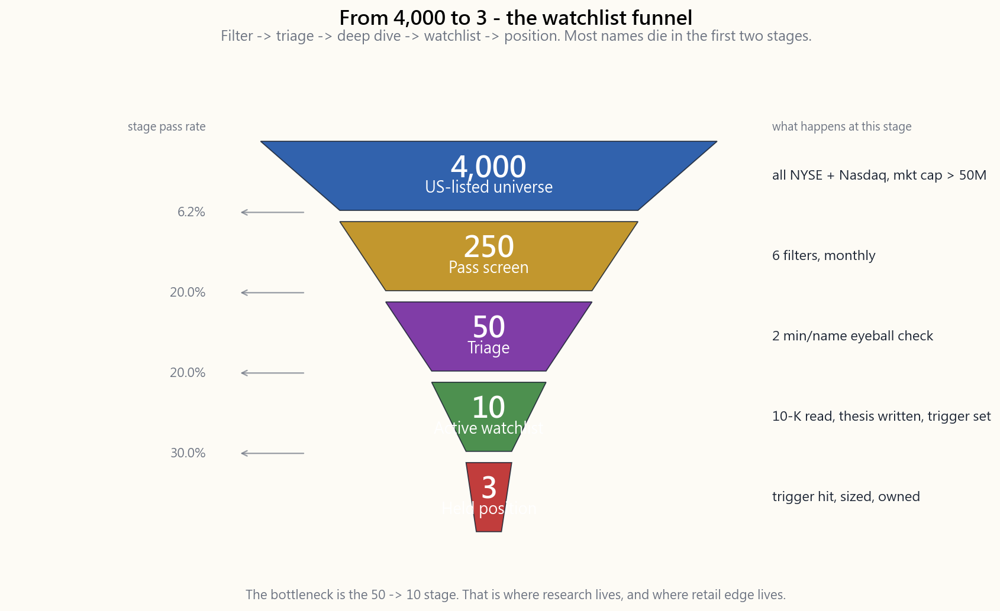
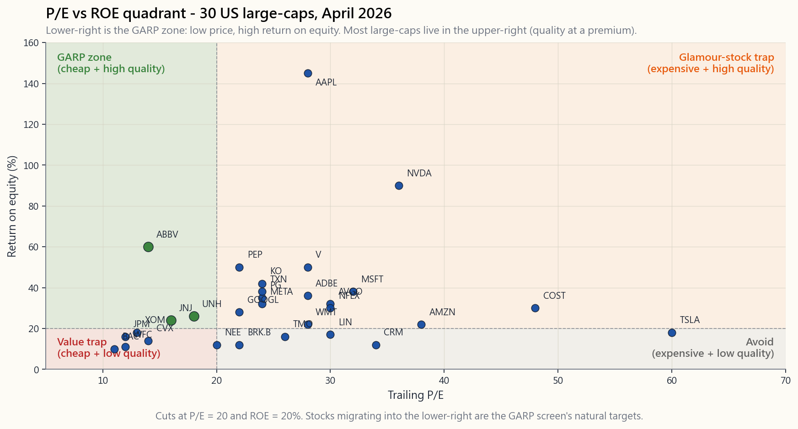

# 附加课程 27：构建自选股列表——筛选优质价值股的方法

---

## 第一部分：阅读材料

---

### 1. 为什么这很重要

美国主要交易所（纽交所 + 纳斯达克，不含美国存托凭证、市值低于5000万美元的微盘股及场外交易市场）上市的股票约有**4000只**。没有任何散户投资者——甚至极少数机构投资者——能够每年对每一只股票都逐一阅读10-K年报和财报电话会议记录。你真正能以充分信心持有的股票数量，不是4000只，而是介于5到20只之间。

筛选器的作用，就是替你完成这个漏斗式筛选过程。你从4000只股票出发，用三四个数值过滤器剔除95%，将剩余的候选股交由你的眼睛和电子表格进一步研究，最终得到一份**你真正理解的10至15只股票的自选股列表**，以及一份更精简的**3至7只当前持仓的买入清单**。不用筛选器做这件事，就像试图走遍第五大道上的每一家店去挑婚纱；而用筛选器，就像让销售顾问只给你拿白色丝质6号礼服。

认真对待筛选有四个理由：

1. **过滤纪律胜过选股纪律。** 阿尔法难得一遇。你所能做出的单一杠杆效应最高的决策，是*哪30只股票进入你的尽职调查队列*，而不是你最终从这30只中选了哪一只。一份糟糕的候选清单会让优质的筛选无从发挥；一份优质的候选清单则能让平庸的筛选也盈利。

2. **它将巴菲特的"能力圈"机制化。** 每个筛选条件背后都嵌入了一套投资逻辑。GARP筛选条件嵌入的逻辑是：*我相信，在资本成本以上的投入资本回报率、以低于1.2倍市盈率相对盈利增长比率买入，能实现复利增长*。深度价值筛选条件嵌入的逻辑是：*我相信，财务稳健企业的统计性低估会均值回归*。书写筛选条件的过程，就是书写投资逻辑的过程。

3. **市值承担了繁重的工作。** 在美国上市的股票附带经过审计的美国通用会计准则财务报告、充裕的二级市场流动性，以及美国证监会EDGAR系统所提供的数据基础设施。在深圳B股指数上运行同样的流程，数据层就会崩溃。GARP筛选中设定的20亿美元市值下限并非统计上的方便之举——这是陳馬的"禁止仙股"原则，只是给出了一个具体数字：市值低于10亿美元的股票属于赌场级别（附加课程14对此有详细论证——价差宽、流通盘可被操控、信息披露不透明、参与者并非真正的投资者），自选股流程在设计上就有意运行于这条线以上，而非偶然为之。

4. **它抵御叙事陷阱。** 对抗"凯茜在CNBC上说了这只股票"的最佳工具不是意志力，而是一个数值上的绊线，明确说明*市盈率相对盈利增长比率 > 1.5 → 不作进一步研究*。预先设定的过滤条件将冲动型买入转化为流程型买入。（市场保持非理性的时间，可以比你保持偿付能力的时间更长——也可以比你的持仓信念更长。）

上图的漏斗呈现的是标准流程：**筛选 -> 尽职调查 -> 自选股列表 -> 建仓**。具体数字未必与你的情况完全吻合，但*形状*应当如此——大多数股票在前两个阶段就会被淘汰。

---

### 2. 你需要了解的内容

#### 2.1 工具体系——免费版、券商版与付费版

筛选器分为三个层级。差异不在于"功能数量"，而在于**数据深度、历史数据长度以及横截面数据的严谨性。**

**免费层级（足以满足90%散户投资者的需求）。**

- **Finviz**（`finviz.com`）——网页端最快的筛选器。八十余个基本面与技术面过滤条件、延迟实时报价、板块热力图。免费版限制保存20个筛选方案；**Finviz Elite** 每月39.5美元，新增盘中数据、回测及邮件提醒功能。
- **Yahoo Finance 筛选器**——过滤条件较少，但完全免费，有广告支持，与Yahoo数据层集成。适合快速单次查询。
- **TradingView**——如果你同时画图，这是最佳选择。内置筛选器，可调用TradingView的技术指标及90余个基本面字段。免费版每次只能保存一个筛选方案。
- **Schwab StreetSmart Edge / Fidelity Active Trader Pro**——你的券商已免费提供筛选器。Schwab涵盖约60个基本面指标；Fidelity额外提供专有的"股票综合评分"合成指数。

**付费层级（如果你每周运行筛选方案或持有超过20只股票，值得考虑）。**

- **Stock Rover**（每月28至40美元，Essentials年费79美元）——600余个指标，包含10年基本面数据、行业基准、自定义公式及GICS分类排名。散户投资者基本面研究的黄金标准。
- **TIKR.com**（每月24至30美元）——机构级数据源（背后为标普全球市场情报），25年财务历史数据、财报记录、全球覆盖。如果你同时阅读10-K年报，这是最佳选择。
- **Roic.ai**（每月14美元）——以投入资本回报率为核心的简洁界面，适合质量筛选；回测功能较弱。
- **YCharts / Koyfin**（免费版 + 每月39美元付费层）——以图表为主；Koyfin是现有最接近彭博终端的免费加付费墙类产品。

你不需要把这些全部用上。**选一个免费版加一个付费版**，就此打住。花在学习第三个平台上的时间，不如用来读一份10-K年报。

#### 2.2 筛选方案一——GARP（以合理价格买入成长股）

GARP是彼得·林奇的筛选体系，已被正式系统化。其投资逻辑是：*为高投入资本回报率的企业支付的自由现金流增长溢价，不超过1倍市盈率相对盈利增长比率*。这是第一梯队（长期复利增长股）的主力筛选方案。

| 过滤条件 | 阈值 | 原因 |
|---|---|---|
| 市值 | > 20亿美元 | 流动性 + 四大会计师事务所审计账目 |
| 市盈率相对盈利增长比率（前瞻） | < 1.2 | 成长性尚未完全被定价 |
| 自由现金流增速（5年） | > 10% | 印证投资逻辑的现金流动态 |
| 投入资本回报率（近12个月） | > 15% | 高于约10%资本成本的超额收益 |
| 债务权益比 | < 1.0 | 能够度过信用周期 |
| 毛利率 | > 40% | 定价能力的最低门槛 |

2026年4月在标普1500指数上运行GARP筛选，约能返回**80至120只股票**。当前典型命中股票（仅供参考，并非买入清单）：微软、谷歌、Visa、万事达、Adobe、ServiceNow、直觉软件、德州仪器、穆迪、MSCI、博通、林德、Arista Networks、铿腾电子。并非所有股票现在都便宜——筛选只是*入场过滤器*，而非买入决策。2026年，市盈率相对盈利增长比率低于1.0的情况较为罕见，因为指数的前瞻市盈率为22倍，而长期均值为16倍。将阈值放宽至1.5，你能得到200余只股票；收紧至0.8，你只剩15只——这才是深度研究队列的合适数量。

#### 2.3 筛选方案二——深度价值（统计性低估，财务稳健）

深度价值是格雷厄姆的筛选体系，也是学术界的账面市值比因子、博格尔"均值回归"理论的实践版本。其投资逻辑是：*市场过度折价那些枯燥、增长缓慢或暂时受损的企业，持有一篮子此类企业，均值回归将带来回报。*

| 过滤条件 | 阈值 | 原因 |
|---|---|---|
| 市值 | > 5亿美元 | 可交易，已审计 |
| 市盈率（近12个月） | < 12 | 后五分之一分位 |
| 市净率 | < 1.5 | 资产负债表保护 |
| 流动比率 | > 2.0 | 无需再融资即可存续12个月 |
| 自由现金流（近12个月） | > 0 | 排除价值陷阱 |
| 债务/息税折旧摊销前利润 | < 3 | 能够抵御利率周期 |

深度价值是你*在*市场恐慌中运行的筛选方案，而不是市场恐慌退去后才运行的。2026年4月处于周期中段，筛选结果稀少——能源中盘股（DVN、MRO、OVV）、部分区域性银行（FNB、RF、CFR）以及少数消费必需品股票（KMB、K、GIS）。2020年3月，同一筛选方案返回了600余只股票。筛选条件不变，变化的是市场。

#### 2.4 筛选方案三——优质复利增长股（10年业绩记录）

芒格式筛选方案。其投资逻辑是：*以合理价格买入伟大的企业，胜过以低廉价格买入普通的企业*。这是你在后台持续运行、每季度刷新一次的筛选方案。

| 过滤条件 | 阈值 | 原因 |
|---|---|---|
| 净资产收益率 | 过去5年**每年**均 > 20% | 稳定，而非靠杠杆堆砌 |
| 毛利率 | > 40% | 护城河指标 |
| 营业利润率 | > 15% | 将营收转化为现金的能力 |
| 自由现金流为正 | 10年中有8年 | 经历完整周期后得到验证 |
| 债务权益比 | < 0.8 | 保留机动空间，而非倚重杠杆 |
| 回购多于增发 | 股份数量净减少 | 管理层利益一致 |

这是四个筛选方案中要求最严苛的——在任何合理的市场环境下，约能返回**40只股票**。2026年4月命中股票包括苹果、微软、Visa、万事达、好市多、ULTA、穆迪、MSCI、Rollins、Paychex、AutoZone、T. Rowe Price、Fastenal。**此处有意不设市盈率相对盈利增长比率/市盈率过滤条件。** 这个筛选方案锁定的是候选股票的宇宙；估值判断在自选股列表阶段才介入。你等待这40只股票中的某只跌破其5年中位数企业价值/息税折旧摊销前利润的25%至35%，然后再出手。

#### 2.5 筛选方案四——复苏型（52周低点附近的优质股票）

逆向思维筛选方案。其投资逻辑是：*优质企业偶尔会因与长期基本面无关的原因，在52周低点附近交易。在市场重新定价之前捕捉这类机会。*

| 过滤条件 | 阈值 | 原因 |
|---|---|---|
| 股价 | 处于52周低点10%以内 | 被市场情绪厌弃 |
| 毛利率 | > 25% | 排除大宗商品行业的破坏性压力 |
| 营运资金 | > 0 | 能够存续未来12个月 |
| 净债务/息税折旧摊销前利润 | < 4 | 资产负债表问题可以解决 |
| 内部人士净买入（90天内） | > 0 | 管理层认同基本面 |
| 做空比例 | < 流通股的8% | 并非知名做空标的 |

复苏型筛选是最容易操作失误的（"刀刃下接飞刀"问题），但操作正确时回报最为丰厚。内部人士买入和做空比例过滤条件是质量把关门槛。2026年4月的候选股票：少数区域性银行（经历2024年存款流失后）、几只错过一季度业绩的消费可选类中盘股，以及一两只因关税噪音受冲击的医疗保健股票。仓位规模限制在投资组合的0.5%至1%——这些属于第四梯队（机会型），而非第一梯队。

上方散点图是视觉框架。落在右下象限的均为候选股票；左上象限的是"热门股陷阱"（高市盈率、平庸的净资产收益率）。2026年4月，多数美国大盘股位于右上象限——优质但溢价。GARP筛选在几何意义上，就是*找出正向右下方迁移的股票*。

#### 2.6 自选股流程——从筛选到建仓

筛选是五步漏斗的第一步：

1. **筛选**（4000 -> 250）。每月运行四个筛选方案，取命中股票的并集。
2. **初步筛查**（250 -> 50）。每只股票花两分钟快速浏览。剔除任何存在财务报表重述、持续经营质疑意见、美国证监会调查，或日均美元交易量低于2亿美元的股票。
3. **深度研究**（50 -> 10）。阅读最新一份10-K年报（对于复利增长股，阅读近三份），最近一期财报电话会议记录，以及如果存在的话，一份做空报告。撰写一页纸投资逻辑，涵盖五个要点：*他们做什么、如何盈利、什么能摧毁它、内在价值是多少、当前交易价格是多少*。（参见 `side02_reading_10k.md`。）
4. **自选股列表**（10 -> 3至7）。加入追踪自选股列表，并设定*价格触发点*——你愿意买入的价格，而非你希望当初买入的价格。没有触发点的自选股列表不过是一场白日梦。
5. **建仓**（触发后买入）。采用三分之一-三分之一-三分之一分批入场策略：在触发价买入三分之一，若再下跌10%买入三分之一，若再下跌10%且无任何推翻投资逻辑的负面消息时买入最后三分之一。杠铃原则告诉你，你有时会判断失误；分批入场策略让你为判断失误的时机付出代价。

买入触发价是最被低估的纪律。在书桌前、光线充足、10-K年报打开而CNBC关掉的时候，决定好价格。等到价格真正到来时，市场会告诉你不要买。

#### 2.7 避免筛选中的常见陷阱

三类陷阱蚕食了80%的筛选收益：

**陷阱一——对回测结果过度优化。** 不断添加过滤条件，直到筛选方案在历史上"全部命中赢家"的诱惑难以抵制，也是致命的。每增加一个过滤条件，都会缩小样本空间，并增加样本内偏差。上限是6个过滤条件，永远如此。（参见 week46_backtest_validator.html。）

**陷阱二——混淆筛选结果与研究结果。** 筛选方案告诉你哪50只股票*值得研究*，并不告诉你是否应该*持有*它们。真正的优势藏在从50只缩减至10只的阶段。

**陷阱三——不对自己运行筛选方案。** 每年一次，将你当前的持仓作为输入，运行四个筛选方案。如果某个持仓在四个筛选方案中均未出现，你是靠惰性在持有它，而非靠投资逻辑。要么从头重新论证持有理由，要么卖出。

---

### 3. 常见误区

1. **"过滤条件越多，筛选方案越好。"** 超过6个过滤条件后，你是在对噪音进行曲线拟合。边际过滤条件通常剔除的未来赢家，多于未来输家。

2. **"同一筛选方案应该始终能返回股票。"** 深度价值筛选方案在市场狂热时期返回0至10只股票，这是*正常现象*。筛选结果为空是市场状态信号，而非工具失灵。

3. **"免费筛选器不够专业。"** 对于被动型纯多头投资组合，Finviz加上你的券商筛选器，能达到Stock Rover约90%的效果。只有当你花费的时间成本超过金钱成本时，才值得付费升级。

4. **"市盈率相对盈利增长比率 < 1意味着便宜。"** 市盈率相对盈利增长比率使用的是分析师一致预期增速，平均而言是错的，在拐点时尤其错误。将其视为初步筛查过滤器，而非估值结论。

5. **"净资产收益率 > 20%意味着质量优秀。"** 如果这是由杠杆驱动的，则未必如此。一家权益乘数15倍、资产收益率1.5%的银行，净资产收益率为22%，但并不是优质复利增长型企业。务必同时检验投入资本回报率。

6. **"筛选出200只股票太嘈杂，无法使用。"** 这恰恰是进行*初步筛查*的合适数量。筛选的问题是命中数量太少，而非太多。

7. **"内部人士卖出是卖出信号。"** 内部人士卖出的原因有百余种（税务、离婚、分散投资、10b5-1计划等）。内部人士*买入*，尤其是公开市场买入且不在财报窗口期内，才是具有不对称价值的信号。

8. **"筛选应当自动化。"** 筛选方案应当被保存并可重复运行。*解读*必须保持人工操作。当你将"买入所有筛选通过的股票"自动化的那一天，就是你以8倍市盈率买入下一个安然公司的那一天。

9. **"我的自选股列表满了，工作就完成了。"** 自选股列表是一个等待队列，而非博物馆。其中每一只股票都应有价格触发点和复查日期。两者皆无的条目是无效占位。

10. **"经过10年验证的回测筛选方案将持续有效。"** 宏观经济状态每30至40年变换一次。1995至2020年有效的筛选方案（廉价优质股），在2025至2040年可能失效（利率更高，廉价优质股重新定价更快）。每年重新验证一次。

---

### 4. 问答环节

**问：我应该多久运行一次筛选方案？**
答：机构默认为每月一次。对于散户，每季度一次即可。每天运行是过度劳动——通过5个过滤条件筛选的股票，不会每天都发生变化。

**问：GARP筛选给了我60只股票，如何缩减到10只？**
答：首先，剔除你不理解的行业。其次，淘汰任何你无法用一句话描述的股票。然后，将剩余股票按投入资本回报率从高到低排列，取前十分之一。你会得到6至8只股票。

**问：我可以直接买一只替我做筛选的交易所交易基金吗？**
答：可以。AVUV（小盘价值股）、QUAL（质量因子）、MTUM（动量因子）、COWZ（现金流收益率）是将筛选方案一至三机械化的因子类交易所交易基金。如果你时间有限，这是个完全合理的替代选择。（参见 `week50_factor_tilts.md`。）

**问：筛选与因子投资有何不同？**
答：因子类交易所交易基金持有通过单一因子过滤条件的全部100至500只股票。股票筛选是一个创意生成步骤，之后需要进行*集中型*人工研究。因子投资胜在分散投资；股票筛选胜在单一股票的持仓信念。

**问：我的深度价值筛选每个月都命中同样几只能源中盘股。我应该直接买入吗？**
答：不应该。一只股票连续36个月都便宜，本身就说明了它为何便宜（结构性衰退、公司治理问题、大宗商品周期）。改为对这个股票池运行*复苏型*筛选方案；同时通过深度价值筛选和复苏型筛选的股票，才具备真正的不对称机会。

**问：如何筛选护城河？**
答：无法直接筛选。代理指标如下：5年毛利率 > 40%且保持稳定；整个完整周期内投入资本回报率 > 15%；过去10年市场份额持续增长。先筛选财务指纹，再定性验证护城河。

**问：做空筛选方案怎么做？**
答：使用相同的引擎，将阈值反转：市盈率 > 80、市净率 > 8、连续3年自由现金流 < 0、债务/息税折旧摊销前利润 > 6、应计项目占资产比例 > 10%。做空阿尔法确实存在，但借券成本、股息转付费用及持仓成本极为沉重——大多数散户投资者应让因子做空类交易所交易基金代劳。

**问：整个流程每周需要多少时间？**
答：稳定运转后，每周2至3小时：30分钟运行筛选方案，90分钟深度研究1至2只股票，30分钟更新现有投资逻辑页面。第一个月时间成本较高（每周5至8小时），因为你需要搭建基础设施。

**问：如果我用的筛选方案和别人一样怎么办？**
答：你会和别人一样。优势不在于过滤条件——而在于从50只缩减至10只的阶段，那取决于你的*判断力*。市盈率相对盈利增长比率 < 1.2加上投入资本回报率 > 15%，对所有人返回的是同样的100只股票。从这100只中挑出正确的5只，才是阿尔法所在。（阿尔法来源是稳定的，但每个来源都需要在买入决策时进行人工判断。）

**问：这些筛选方案只能用于税收优惠账户吗？**
答：复苏型和深度价值筛选方案的换手率较高——更适合在个人退休账户中使用。GARP和优质复利增长股在两类账户中均可操作；优质复利增长股尤其适合在应税账户中持有，因为持有期往往在第二年进入长期资本利得的适用范围。（税收配置的计算详见 `side04`。）

---

## 第二部分：YouTube 视频脚本

---

**视频标题：** 从4000只到5只：构建支撑未来十年的自选股列表

**目标时长：** 约12分钟

**主持人：** 陳馬、小魚

---

**[片头 — 0:00至1:00]**

**陳馬：** 纽约证券交易所和纳斯达克上市的股票，大约有4000只。先不谈全球，不谈场外交易，就是美国这一个市场——我们唯一持仓的市场——就有4000只。而决定你炒股能否赚钱的问题，不是*你买哪只*，而是*你愿意花时间研究的那30只是哪些*。

**小魚：** 今天我们来走一遍这个漏斗。四个筛选方案，每个有六个过滤条件。4000只 -> 250只 -> 50只 -> 10只 -> 3只。同样的漏斗，机构分析师在用，我们今天把它简化成散户投资者能在周末用Finviz完成的版本。

**陳馬：** 还有一件事，我们要诚实说——投资媒体从来不告诉你：在2026年4月，我们将展示的四个筛选方案中，有三个*几乎返回不了几只股票*。这是一个优点，不是缺陷。

---

**[第一幕 — 工具体系 — 1:00至2:30]**

**小魚：** 三个层级的筛选器。免费的——Finviz、Yahoo、TradingView、你的券商。付费的——Stock Rover每月28美元、TIKR每月24美元，还有其他几个。

**陳馬：** 选一个免费的，选一个付费的，到此为止。大家都有收集平台的冲动，别这样。多学一个平台的时间，不如拿去读一份10-K年报。

**小魚：** 对于90%的散户投资者，Finviz加上券商的筛选器就够了。

[VISUAL: image/side27_screener_funnel.png]

**陳馬：** 这就是那个漏斗。4000只上市股票，250只通过筛选，50只进入初步筛查，10只列入活跃自选股列表，3只是当前持仓。这个漏斗的形状——这就是整个游戏的全部。

---

**[第二幕 — 四个筛选方案 — 2:30至7:30]**

**陳馬：** 四个筛选方案，每个背后一套逻辑。

**小魚：** **筛选方案一，GARP——以合理价格买入成长股。** 六个过滤条件：市值超过20亿美元，市盈率相对盈利增长比率低于1.2，自由现金流增速超过10%，投入资本回报率超过15%，债务权益比低于1，毛利率超过40%。

**陳馬：** 彼得·林奇的筛选方案。逻辑是：*我愿意为优质企业付溢价，但不超过成长性所能支撑的价格。* 20亿美元的市值下限不是随意设的——那是我的"禁止仙股"原则加了一个具体数字。市值低于10亿美元的股票属于赌场级别；附加课程14专门讲了原因。自选股流程在设计上就有意运行于这条线以上。如果一只股票的市值不达标，筛选方案直接略过。2026年4月，这个筛选方案约返回80只股票。把市盈率相对盈利增长比率的阈值收紧至0.8，你只剩15只——这才是深度研究队列的合适体量。

**小魚：** **筛选方案二，深度价值。** 市盈率低于12，市净率低于1.5，流动比率超过2，自由现金流为正，债务/息税折旧摊销前利润低于3。

**陳馬：** 格雷厄姆的筛选方案，也是博格尔的筛选方案，账面市值比因子的具体化。现在处于周期中段，这个筛选方案约返回30只股票——主要是能源中盘股和区域性银行。要*在*恐慌中运行它，不是在恐慌退去后。

**小魚：** **筛选方案三，优质复利增长股。** 过去5年净资产收益率每年均超过20%，毛利率超过40%，营业利润率超过15%，近10年中有8年自由现金流为正，债务权益比低于0.8，净回购为正。

**陳馬：** 这是芒格式筛选方案。有意不设估值过滤条件。筛选方案锁定的是那个*能够*实现复利增长的约四十只企业的宇宙。然后你等待其中某只股票跌至其5年中位数企业价值/息税折旧摊销前利润以下25%至35%，再出手。

**小魚：** **筛选方案四，复苏型。** 股价在52周低点10%以内，毛利率超过25%，营运资金为正，净债务/息税折旧摊销前利润低于4，过去90天内部人士净买入为正，做空比例低于流通股的8%。

**陳馬：** 逆向思维筛选方案，不对称性最强的方案，也是最难执行的——刀刃下接飞刀的问题。内部人士买入过滤条件和做空比例过滤条件，是把你拦在真正破败的企业之外的质量门槛。

[VISUAL: image/side27_garp_quadrant.png]

**小魚：** 这张散点图是视觉框架。横轴是市盈率，纵轴是净资产收益率。图中是截至2026年4月的30只美国知名上市股票。

**陳馬：** 右下方是GARP区域——低市盈率、高净资产收益率，就是那片绿色标注的区域。右上方是*优质但溢价*——标普500指数的大多数股票目前都在这里。左上方是热门股陷阱。左下方是价值陷阱区域。

**小魚：** 从几何意义上说，这些筛选方案都在问同一个问题：*找出正向右下方迁移的股票。*

[VISUAL: interactive/side27_screener.html]

**陳馬：** 我们还为你做了一个实时互动版。拖动四个滑块——最高市盈率、最低净资产收益率、最低营收增速、最高债务权益比——右侧面板会实时显示这30只股票中有哪些通过了你的过滤条件。

**小魚：** 这不是一份买入清单，而是一份初步筛查清单。筛选方案的任务是给你一个50只股票的研究队列，你的任务是完成下一个阶段。

---

**[第三幕 — 流程 — 7:30至10:30]**

**陳馬：** 从筛选到建仓，五个阶段。

**小魚：** **第一阶段——筛选。** 4000只到250只，完成。

**小魚：** **第二阶段——初步筛查。** 250只到50只。每只股票两分钟。剔除存在财务报表重述、持续经营质疑意见、美国证监会调查，或日均美元交易量低于2亿美元的股票。

**小魚：** **第三阶段——深度研究。** 50只到10只。读10-K年报，读最新财报电话会议记录，撰写一页纸投资逻辑。五个要点：他们做什么、如何盈利、什么能摧毁它、内在价值是多少、当前交易价格是多少。

**陳馬：** 附加课程02讲的是如何阅读10-K年报，还没看过的同学可以回去看看。

**小魚：** **第四阶段——自选股列表。** 10只到3至7只。加入追踪列表，设定*价格触发点*——你愿意买入的价格，不是"我会留意一下"。是一个具体的数字。

**陳馬：** 没有触发点的自选股列表，不过是一场白日梦。触发点是将列表转化为决策的唯一要素。

**小魚：** **第五阶段——建仓。** 触发后买入。在触发价买入三分之一，下跌10%后再买入三分之一，再下跌10%且无推翻投资逻辑的负面消息时买入最后三分之一。

**陳馬：** 杠铃原则。你对时机的判断，错误的频率超乎你的想象。三分之一分批入场策略，让你为判断失误的时机付出代价。

---

**[第四幕 — 陷阱 — 10:30至11:30]**

**陳馬：** 三个陷阱。

**小魚：** **陷阱一——过滤条件蔓延。** 上限是六个过滤条件，永远如此。超过这个数，你是在对样本内噪音进行曲线拟合。

**小魚：** **陷阱二——混淆筛选结果与研究结果。** 筛选方案不告诉你持有什么，它告诉你研究什么。

**小魚：** **陷阱三——不对自己运行筛选方案。** 每年一次，对你自己的持仓运行筛选。如果某个持仓无法通过四个筛选方案中的任何一个，你是靠惰性持有它。要么从头重新论证，要么卖出。

**陳馬：** 最后这个最难做到，也最有价值。大多数投资者从来不把自己的纪律用于自己的投资组合。

---

**[结尾 — 11:30至12:00]**

**小魚：** 筛选方案是散户投资者手中杠杆效应最高的工具。五个过滤条件加一个每月40美元的订阅，替代了过去需要整个分析师团队才能完成的工作。

**陳馬：** 阿尔法难得一遇。你不可能在研究深度上超越买方机构。但你完全可以通过一个简单的改变，大幅超越普通自主型投资者的平均选股水平——用"它通过了五个数值过滤条件，我读了10-K年报"，替代"我朋友提到了这只股票"。

**小魚：** 搭建漏斗，每月运行，用网站上的互动工具。我们下期见。

---