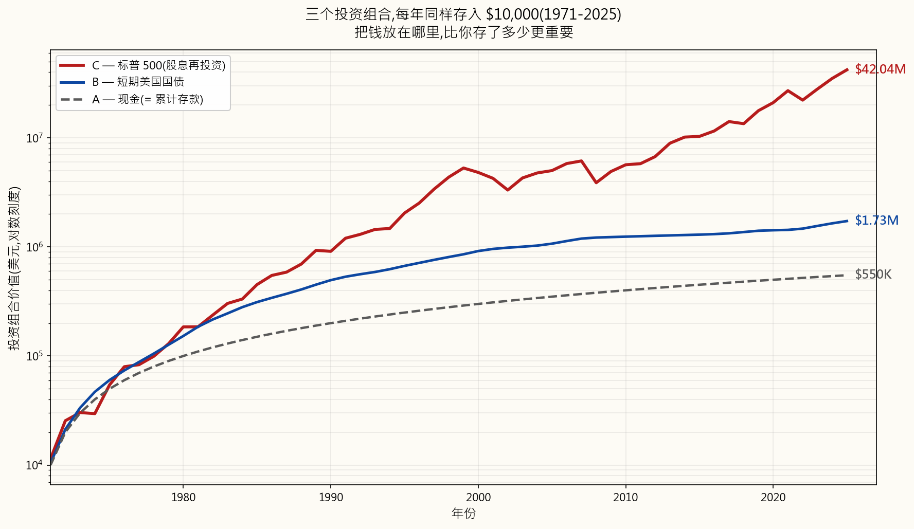
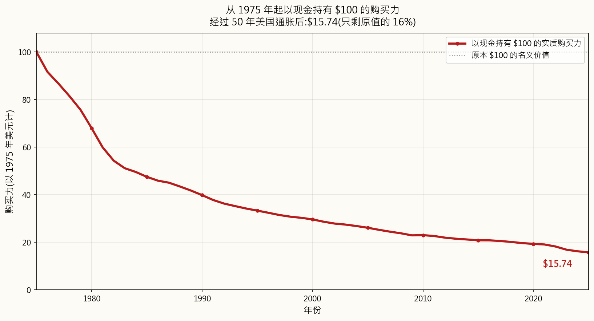
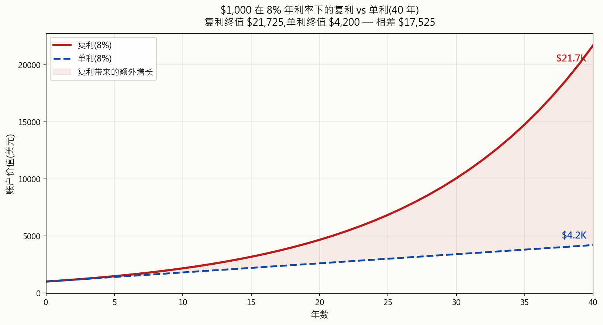
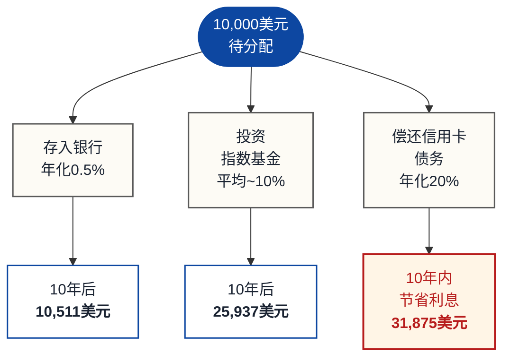

# 第一周：为什么要投资？货币的时间价值

---

## 第一部分：阅读材料

---

### a) 为什么这很重要

闲置的钱就是在贬值的钱。每一天，通胀都在悄悄侵蚀塞在床垫下、或存在零利率活期账户里的现金购买力。理解*为什么*你需要投资，不仅仅是一种理财技能——在现代经济中，它更是一种生存技能。

想想看：1990年，一杯咖啡大约要0.75美元。到2025年，同一杯咖啡要5.00美元甚至更多。咖啡并没有变好六倍，是你的美元变弱了六倍。这就是通胀在起作用，而且它从未停止。

货币的时间价值（TVM）是所有金融学的基础原则。它指出，今天的一美元比明天的一美元更值钱。这有三个原因：

1. **通胀** —— 物价随时间上涨，因此未来的美元购买力更弱。
2. **机会成本** —— 现在可用的钱可以用于投资以获取收益。
3. **风险** —— 承诺的未来付款可能永远不会兑现。

如果你理解了货币的时间价值，你就明白了为什么投资并非可选项。它是确保你的财富增速快于经济侵蚀速度的唯一途径。

回顾过去55年，做一个思维实验，假设有三位储蓄者。从1971年开始，每人每年恰好存入1万美元——同样的名义金额，每年如此，毫无例外。唯一的区别在于*放在哪里*。

- **A君** 持有现金。没有银行，没有利息。纯粹的货币，放在抽屉里。
- **B君** 存入短期美国国债，即最安全的生息工具。
- **C君** 投入标普500指数，并将所有股息再投资。

同样的纪律，同样的投入，三种截然不同的结果：

55年后，每人投入了同样的**55万美元**。但最终余额相差悬殊：

| 投资工具 | 年化收益率（CAGR） | 名义终值 | 以1971年美元计算的终值 |
|---|---|---|---|
| **C君 — 标普500** | **11.24% / 年** | **4,204万美元** | **507.9万美元** |
| **B君 — 国债** | 4.38% / 年 | 172.5万美元 | 20.8万美元 |
| **A君 — 现金** | 0.00% / 年 | 55万美元 | 6.6万美元 |

"年化收益率"一列即**复合年均增长率（CAGR）**——它是一个单一的固定利率，经过同样55年的复利计算，能产生与实际逐年资产走势相同的增长倍数。这是最应该引用的数字，因为年度收益率的简单算术平均值会高估真实的复利表现。作为参照，同期美国CPI年均涨幅为**3.92%**——任何低于这条线的收益，在未考虑税收之前就已是实际购买力的损失。

C君最终拥有的名义财富是B君的**24倍**，是A君的**76倍**，尽管每年投入的都是同样的1万美元。再仔细看看A君：经过55年美国通胀的侵蚀，那55万美元现金的*实际*购买力，仅相当于**1971年的约6.6万美元**。A君不仅没能实现财富增值——在他勤勤恳恳储蓄的同时，通胀正在主动缩水他的财富。

这种差距完全源于货币的时间价值和复利增长在数十年间的叠加效应。复利奖励能产生回报的资本，惩罚停滞不动的资本。

本周课程将为本课程后续所有内容奠定概念基础。掌握这些理念，未来每一个话题都会迎刃而解。

---

### b) 你需要掌握的知识

#### 1. 通胀：无声的财富杀手

通胀是物价随时间普遍上涨的现象。中央银行（如美国的美联储）的目标通胀率约为每年2%，但实际通胀率可能大幅波动。

不要轻信教科书中假设平滑利率的例子——我们直接使用真实的美国CPI数据。想象你在1970年1月1日把一张崭新的100美元钞票塞进床垫下，从此再没动过它。以下是从那以后每五年初它的实际购买力：

| 年份 | 已过年数 | 购买力 | 占原始金额百分比 |
|------|--------------:|-----------------:|--------------:|
| 1970 | 0 | 100.00美元 | 100.0% |
| 1975 | 5 | 74.49美元 | 74.5% |
| 1980 | 10 | 50.65美元 | 50.6% |
| 1985 | 15 | 35.39美元 | 35.4% |
| 1990 | 20 | 29.66美元 | 29.7% |
| 1995 | 25 | 24.81美元 | 24.8% |
| 2000 | 30 | 22.06美元 | 22.1% |
| 2005 | 35 | 19.44美元 | 19.4% |
| 2010 | 40 | 17.13美元 | 17.1% |
| 2015 | 45 | 15.51美元 | 15.5% |
| 2020 | 50 | 14.37美元 | 14.4% |
| 2025 | 55 | 11.73美元 | 11.7% |

1970年的那100美元，如今的购买力仅剩**11.73美元**——通胀在一个工作寿命内已吞噬了其**88.3%的实际价值**。仅1970年代的滞胀，就在1980年之前将其价值几乎腰斩（跌至50.65美元），而随后相对温和的25年（1980年至2005年）又蒸发掉了三分之二。即便在你自己的有生之年，过去25年也在讲述同样的故事——**2000年1月价值100美元的购买力，如今仅剩53.16美元，短短一代人的时间购买力损失了46.8%**。而2020年之后的加速通胀，**五年内就让美元贬值了约18%**。

这就是货币的"实际"价值——它实际上能买到什么，与"名义"价值（钞票上印的数字）截然不同。现金并不安全。什么都赚不到的现金，是一种持续、几乎难以察觉的损失。损失的缓慢性恰恰是它最危险之处：那些把钱留在活期账户里以"保护"资产的人，正在对上面图表做出最激进的押注——而且在输。

**通胀的衡量方式：**

- **CPI（居民消费价格指数）** —— 跟踪典型家庭购买的一篮子商品和服务的成本（食品、住房、交通等）。
- **PCE（个人消费支出）** —— 美联储偏好的衡量指标，比CPI覆盖范围更广。
- **核心通胀** —— 剔除波动较大的食品和能源价格，以呈现潜在趋势。

**美国历史通胀率（十年平均值）：**

| 时期 | CPI年均涨幅 |
|---|---:|
| 1930–1940 | −2.0% |
| 1940–1950 | +5.6% |
| 1950–1970 | +2.3% |
| 1970–1980 | +7.8% |
| 1980–2000 | +3.8% |
| 2000–2020 | +2.1% |
| 2020–2025 | +4.8% |

注意通胀在1970年代（石油危机）和2020年代初（疫情供应冲击）如何大幅飙升。这些飙升能迅速摧毁购买力。

#### 2. 复利：世界第八大奇迹

复利意味着你在利息上再赚取利息。它是个人理财中最强大的力量。

**复利公式：**

\[ FV = PV \cdot (1 + r)^n \]

其中：

- \(FV\) = 终值（你的钱最终增长到多少）
- \(PV\) = 现值（你的起始金额）
- \(r\) = 每期利率（以小数表示）
- \(n\) = 期数

**示例：1,000美元以8%年化收益率增长**

| 年份 | 期初余额 | 当期利息 | 期末余额 |
|---:|---:|---:|---:|
| 1 | 1,000.00美元 | 80.00美元 | 1,080.00美元 |
| 2 | 1,080.00美元 | 86.40美元 | 1,166.40美元 |
| 3 | 1,166.40美元 | 93.31美元 | 1,259.71美元 |
| 5 | 1,360.49美元 | 108.84美元 | 1,469.33美元 |
| 10 | 1,999.00美元 | 159.92美元 | 2,158.92美元 |
| 20 | 4,315.70美元 | 345.26美元 | 4,660.96美元 |
| 30 | 9,317.27美元 | 745.38美元 | 10,062.66美元 |
| 40 | 20,106.85美元 | 1,608.55美元 | 21,715.40美元 |

注意第40年赚取的利息（1,608美元）已超过最初的投资本金（1,000美元）。这就是复利的效果。

**复利与单利的可视化对比：**

单利情况下，每年赚取原始1,000美元的8%（每年80美元）。复利情况下，你赚取的是*当前余额*的8%，而余额每年都在增长。长期来看，差距将变得极为巨大——上面的例子最终结果是**21,725美元（复利）对比4,200美元（单利）**，五倍的差距完全来自于将此前利息留在账户中而非取出。

**复利频率同样重要。**
同样的10,000美元，同样的12%年化利率，投资10年，仅复利频率不同：

| 复利频率 | 最终价值 |
|---|---:|
| 每年 | 31,058.48美元 |
| 每半年 | 32,071.35美元 |
| 每季度 | 32,620.38美元 |
| 每月 | 33,003.87美元 |
| 每日 | 33,194.62美元 |
| 连续 | 33,201.17美元 |

复利频率越高，收益越高，但边际收益递减很快。从每年到每月的跨越相当显著；从每日到连续的差异则几乎可以忽略不计。

#### 3. 72法则

72法则是估算在给定年化收益率下资金翻倍所需时间的心算捷径：

$$ \text{翻倍所需年数} \approx \frac{72}{r} \quad \text{（其中 } r \text{ 为年化收益率百分比）} $$

| 年化收益率 | 翻倍所需年数 |
|---:|---|
| 2% | \(72 / 2 = 36\) 年 |
| 4% | \(72 / 4 = 18\) 年 |
| 6% | \(72 / 6 = 12\) 年 |
| 8% | \(72 / 8 = 9\) 年 |
| 10% | \(72 / 10 = 7.2\) 年 |
| 12% | \(72 / 12 = 6\) 年 |

**为什么这个法则有效？** 它是一个基于自然对数推导出的数学近似。精确公式为

$$ t = \frac{\ln 2}{\ln(1 + r)} $$

但72对于心算来说足够精确，而且实际上72可以被2、3、4、6、8、9和12整除——几乎涵盖了你实际关心的所有利率。

**72法则的反向应用——通胀按同样的时钟侵蚀你的购买力。** 将"年化收益率"替换为"年通胀率"，"翻倍所需年数"就变成了"购买力减半所需年数"：

| 通胀率 | 购买力减半所需年数 |
|---:|---|
| 3% | \(72 / 3 = 24\) 年 |
| 4% | \(72 / 4 = 18\) 年 |
| 6% | \(72 / 6 = 12\) 年 |
| 9% | \(72 / 9 \approx 8\) 年 |

这让通胀变得触手可及。如果通胀平均为4%，每隔18年你的钱只能买到之前一半的东西。这就是为什么利率仅为1%-2%的"安全"储蓄账户实际上在亏损你的实际资金。

#### 4. 机会成本

机会成本是你在做决策时放弃的次优选择的价值。在投资中，它意味着每一块钱都有竞争用途，选择其中一种就意味着放弃另一种。

**决策树——如何处理10,000美元：**

在这个例子中，偿还高息信用卡债务的"收益率"最高，因为你正在消除20%的年成本。这就是为什么理财顾问通常建议在投资之前先还清高息债务。

**关键洞察：** 机会成本同样适用于时间，而不仅仅是金钱。你每延迟投资一年，就会产生可量化的成本，因为那一年的复利增长将永远失去。

**等待的代价——每年投入5,000美元，平均年化收益率10%，目标65岁退休：**

| 开始年龄 | 投资年数 | 累计投入 | 65岁时的终值 |
|---:|---:|---:|---:|
| 20 | 45 | 225,000美元 | 3,616,635美元 |
| 25 | 40 | 200,000美元 | 2,212,963美元 |
| 30 | 35 | 175,000美元 | 1,355,122美元 |
| 35 | 30 | 150,000美元 | 822,470美元 |
| 40 | 25 | 125,000美元 | 491,735美元 |
| 45 | 20 | 100,000美元 | 286,375美元 |

从20岁而非30岁开始，仅多投入50,000美元，最终却多了226万美元。复利的早期岁月价值不成比例地高。

#### 5. 实际收益率与名义收益率

**名义收益率**是投资的原始百分比收益，未经通胀调整。**实际收益率**是名义收益率减去通胀，代表实际获得的购买力增长。

快速近似公式：

$$ r_{\text{实际}} \approx r_{\text{名义}} - i $$

精确关系（**费雪方程**）为：

$$ r_{\text{实际}} = \frac{1 + r_{\text{名义}}}{1 + i} - 1 $$

示例——名义收益率10%，通胀率3%：

$$ \begin{aligned}
r_{\text{实际（近似）}} &= 10\% - 3\% = 7\% \\
r_{\text{实际（精确）}} &= \frac{1.10}{1.03} - 1 = 6.80\%
\end{aligned} $$

在低通胀时，近似公式足以应付心算；在高通胀或高收益的情况下，建议使用精确公式。

**各资产类别历史实际收益率（美国，近似值）：**

| 资产类别 | 名义收益率 | 通胀率 | 实际收益率 |
|---|---:|---:|---:|
| 美国股票（标普500） | ~10.0% | ~3.0% | ~7.0% |
| 美国债券（10年期） | ~5.0% | ~3.0% | ~2.0% |
| 黄金 | ~7.0% | ~3.0% | ~4.0% |
| 储蓄账户 | ~2.0% | ~3.0% | ~−1.0% |
| 现金（床垫） | 0.0% | ~3.0% | ~−3.0% |

**关键结论：** 在3%通胀环境下，利率为2%的储蓄账户每年*损失*1%的购买力。床垫下的现金每年损失3%。只有收益率高于通胀率的资产，才能真正增加你的实际财富。

#### 6. 终值与现值

这是货币时间价值的两个核心计算工具。

**终值（FV）：** 今天的一笔钱在未来将价值几何。

\[ FV = PV \cdot (1 + r)^n \]

示例——5,000美元以8%收益率增长20年后的终值？

\[ \begin{aligned}
FV &= 5{,}000 \cdot (1.08)^{20} \\
   &= 5{,}000 \cdot 4.6610 \\
   &= 23{,}305\text{美元}
\end{aligned} \]

**现值（PV）：** 未来一笔钱今天的价值是多少。

\[ PV = \frac{FV}{(1 + r)^n} \]

示例——以7%折现率计算，15年后的50,000美元今天值多少？

\[ \begin{aligned}
PV &= \frac{50{,}000}{(1.07)^{15}} \\
   &= \frac{50{,}000}{2.7590} \\
   &= 18{,}126\text{美元}
\end{aligned} \]

**这意味着：** 如果有人向你承诺15年后给你50,000美元，而你自己能赚到7%的收益率，那这个承诺今天对你来说只值18,126美元。如果他们同时提出现在给你20,000美元，现在的20,000美元才是更划算的选择。

**年金终值（定期定额投入）：**

\[ FV = PMT \cdot \frac{(1 + r)^n - 1}{r} \]

其中 \(PMT\) = 定期投入金额。

示例——每月投入500美元，持续30年，年化8%（月化0.667%）：

\[ \begin{aligned}
FV &= 500 \cdot \frac{(1.00667)^{360} - 1}{0.00667} \\
   &= 500 \cdot 1{,}491.57 \\
   &= 745{,}785\text{美元}
\end{aligned} \]

累计投入：\(500 \times 360 = 180{,}000\text{美元}\)。总增长：\(745{,}785 - 180{,}000 = 565{,}785\text{美元}\)。

投资增长部分（565,785美元）是实际投入金额（180,000美元）的三倍多。这就是坚持定期投资叠加复利的力量。

**对未来现金流序列进行折现。** 未来五年每年末各支付100美元，以7%折现率计算：

$$ PV = \sum_{t=1}^{5} \frac{100\text{美元}}{(1.07)^t} $$

| 年份 | 未来付款 | 折现因子 | 现值 |
|---:|---:|---:|---:|
| 1 | 100美元 | \(1 / 1.07^{1} = 0.9346\) | 93.46美元 |
| 2 | 100美元 | \(1 / 1.07^{2} = 0.8734\) | 87.34美元 |
| 3 | 100美元 | \(1 / 1.07^{3} = 0.8163\) | 81.63美元 |
| 4 | 100美元 | \(1 / 1.07^{4} = 0.7629\) | 76.29美元 |
| 5 | 100美元 | \(1 / 1.07^{5} = 0.7130\) | 71.30美元 |
| | | **现值合计** | **410.02美元** |

每笔未来的100美元，今天的价值都更低，因为货币具有时间价值。未来付款越晚，今天的价值越低——第5年的100美元今天只值71.30美元，而第1年的100美元今天还值93.46美元。

#### 7. 融会贯通：投资的必要性

**三条路径对比，30年期间**（起始10,000美元，每年追加5,000美元）：

| 指标 | 什么都不做（0%） | 储蓄账户（1.5%） | 投资标普500（10%） |
|---|---:|---:|---:|
| 累计投入 | 160,000美元 | 160,000美元 | 160,000美元 |
| 名义终值 | 160,000美元 | 192,760美元 | 987,174美元 |
| 实际价值（3%通胀） | 65,890美元 | 79,379美元 | 406,392美元 |
| 购买力变化 | **损失59%** | **损失50%** | **增加154%** |

只有投资者才能真正实现实际财富的增长。储蓄者勉强持平。什么都不做的人损失了超过一半的购买力。

---

### c) 常见误区

**误区一："投资就是赌博。"**

赌博的预期收益为负（庄家永远赢）。投资于多元化资产的历史预期收益为正。标普500在过去一个世纪的年化收益率约为10%，期间经历了大萧条、第二次世界大战、2008年金融危机和新冠疫情。对个股的短线投机可能类似赌博，但有纪律地长期投资于多元化基金，在本质上截然不同。

**误区二："我需要很多钱才能开始投资。"**

许多券商现在提供零门槛、零佣金服务。你可以用10美元买入标普500指数基金。最重要的因素不是起始金额，而是何时开始、是否持续定投。即便每月只投50美元，从22岁开始，以平均10%的收益率，到65岁时也能增长到超过35万美元。

**误区三："储蓄和投资是一回事。"**

储蓄是把钱留起来。投资是让钱去赚钱。储蓄账户利率0.5%，通胀3%，意味着你每年损失2.5%的购买力。储蓄对于应急资金和短期目标很重要，但对于长期财富积累，投资不可或缺。

**误区四："我应该等待'合适时机'再投资。"**

择时投资极为困难。研究一再表明，"留在市场中的时间"胜过"择时进入市场"。一项嘉信理财的研究发现，即便每年都在最糟糕的时机（市场峰值）入场，其表现仍显著优于持有现金等待更好入场点的人。

**误区五："复利只对大额资金才有意义。"**

百分比对任何金额的作用都一样。100美元以10%增长40年，变成4,526美元。这个倍数（45倍）无论起始是100美元还是10万美元都完全相同。关键在于增长率和时间跨度。

**误区六："通胀通常在2%-3%左右。"**

尽管中央银行的目标是2%，但实际通胀可能高得多。美国1980年曾出现13.5%的通胀。阿根廷近年来通胀率超过100%。即便在稳定经济体中，通胀也可能因供给冲击、货币政策变化或地缘政治事件而急剧飙升。你的投资策略需要考虑通胀变动的各种情景。

**误区七："涨10%再跌10%，就回到原点了。"**

这在数学上是错误的。100美元 + 10% = 110美元。然后110美元 - 10% = 99美元。实际上你还亏了1%。损失的伤害大于等幅盈利带来的收益，这就是为什么管理下行风险在投资中至关重要。亏损50%需要盈利100%才能回本。

**损益不对称——从回撤中恢复所需的涨幅：**

| 亏损幅度 | 回本所需涨幅 |
|---:|---:|
| −10% | +11.1% |
| −20% | +25.0% |
| −30% | +42.9% |
| −40% | +66.7% |
| −50% | +100.0% |
| −75% | +300.0% |
| −90% | +900.0% |

从数学上看，亏损 \(L\) 后，回本所需涨幅为 \(G = \frac{L}{1 - L}\)——当 \(L\) 变大时，\(G\) 的增速远超 \(L\)。

**误区八："72法则是精确的。"**

它只是一个近似值。它在利率6%至10%之间最为准确。在极低或极高利率下，精确度会下降。对于2%，实际翻倍时间为35.0年（72法则给出36年）。对于20%，实际时间为3.8年（72法则给出3.6年）。足以用于快速心算，但不要用于精确的财务规划。

---

### d) 问答

**Q1：用简单的话来说，货币的时间价值是什么？**

A：今天的一美元比未来的一美元更值钱，原因有三：（1）通胀会降低那笔未来资金的购买力；（2）你可以用今天的钱去投资并赚取收益；（3）承诺的未来付款始终存在无法兑现的风险。这就是为什么贷款方收取利息，投资者要求回报——他们在为放弃现在使用资金的权利而得到补偿。

**Q2：复利与单利有何不同？**

A：单利只按原始本金计算。如果你以5%单利投资1,000美元，无论累积了多少，每年赚取50美元。复利按本金加所有累积利息计算。所以在第二年，你赚取的是1,050美元的利息，而非仅仅1,000美元。长期来看，这个差距将变得极为显著。30年后，1,000美元以5%单利变成2,500美元；以5%复利则变成4,322美元。

**Q3：72法则为何有效？**

A：它源自数学关系 ln(2) / ln(1 + r)，其中 ln 为自然对数，r 为利率。对于接近8%的利率，72/r 与这个公式高度吻合。之所以选择72，是因为它可以被2、3、4、6、8、9和12整除，方便心算。有些人对低利率使用"70法则"，对连续复利使用"69.3法则"，但72是日常使用中最实用的。

**Q4：名义收益率与实际收益率有何区别？**

A：名义收益率是标题数字——"股市今年涨了10%。"实际收益率经通胀调整后，反映你购买力的实际增幅。如果股市涨了10%但通胀是4%，你的实际收益率约为6%。在评估长期投资表现时，始终要以实际收益率为准，因为在高通胀环境下，名义收益率可能具有误导性。

**Q5：如何计算未来一笔钱的现值？**

A：使用公式 PV = FV / (1 + r)^n。确定合适的折现率（r）——这通常是你在其他投资中能赚到的收益率。例如，如果有人承诺10年后给你10,000美元，而你自己能赚到7%：PV = 10,000 / (1.07)^10 = 10,000 / 1.9672 = 5,083美元。那笔未来的10,000美元今天对你来说只值约5,083美元。

**Q6：投资的合理预期年化收益率是多少？**

A：美国股市（标普500）历史上名义年化收益率约为10%，扣除通胀后约为7%。但逐年收益率差异极大。任何给定年份，市场可能涨30%也可能跌30%。10%的平均值只在长期（20年以上）才会显现。债券的历史名义收益率约为5%（实际约2%）。均衡配置的投资组合可将名义收益率目标设为7%-8%。永远不要假设任何具体收益率是有保障的。

**Q7：应该还债还是投资？**

A：比较你的债务利率与预期投资收益率。如果你的债务利率是20%（信用卡），还清债务相当于赚取有保障的20%回报——优于任何投资。如果你的债务利率是4%（房贷），而你预期投资能赚10%，投资可能更合算，但还债是"有保障的回报"，而投资收益并不确定。一个常见策略是：还清所有利率高于6%-7%的债务，再用剩余资金投资。

**Q8：通胀对所有商品的影响一样吗？**

A：不一样。不同类别的通胀速度不同。过去20年在美国，医疗和教育成本的涨幅远超整体CPI，而科技产品和服装往往越来越便宜。CPI是一篮子商品的平均值，因此你个人的实际通胀率取决于你实际的消费结构。例如，退休人员通常面临更高的实际通胀，因为医疗保健在其支出中占比更大。

**Q9：一次性投入与每月定投，哪种更好？**

A：从统计上看，一次性投入大约有三分之二的时间优于定投，因为市场长期趋势向上。但定投降低了在市场高点全仓买入的风险，而且对大多数靠薪资生活的人来说更加实际。最佳策略通常是：随每份薪资到手即时投入，不要持有现金等待"更好的时机"。

**Q10：复利也会对我不利吗？**

A：绝对会。债务上的复利正是投资复利的镜像。5,000美元信用卡余额，年化利率24%，若不偿还，仅5年就会滚至14,615美元。这就是为什么高息债务是一场财务紧急状态。同样的数学力量，在投资中积累财富，在未偿债务中则摧毁财富。

---

## 第二部分：YouTube脚本

---

**视频标题：** 为什么要投资？货币的时间价值 | 投资课程第一周

**目标时长：** 约25分钟

**主持人：**
- **陳馬**（讲师）：经验丰富的零售投资者，凭借多年市场经验讲解概念
- **小魚**（学员）：刚毕业的大学生，正在学习如何投资她的积蓄，提出观众心中所想的问题

---

**[片头序列]**

[VISUAL: Animated logo with text "Investment Fundamentals - Week 1"]

[ANIMATION: A clock ticking while dollar bills slowly shrink in size]

**陳馬：** 欢迎来到投资基础课程第一周。我是陳馬，这节课将彻底改变你对金钱的认知。

**小魚：** 我是小魚。我会提各种初学者会问的问题，所以如果你也是新手，完全不用担心，我和你一样在起点。

**陳馬：** 今天我们要回答你这辈子将面临的最重要的理财问题之一：为什么要投资？

**小魚：** 对，因为说实话，投资感觉很有风险。为什么不把钱存在银行里，那样不是更安全吗？

**陳馬：** 这正是我们要从这里切入的原因。因为令人意外的真相是，把钱"安全地"存在银行账户里，可能是你对它做的最危险的事情之一。

**小魚：** 等等，这怎么可能呢？

[VISUAL: Title card -- "第一节：无形的小偷——通胀"]

---

**[第一节：通胀]**

**陳馬：** 让我来告诉你一个正在悄悄抢劫你的无形小偷。它的名字叫通胀。

[ANIMATION: A basket of groceries. The price tag starts at $50 and slowly ticks
up to $75, then $100, while the basket stays the same size. Reference:
animation/week01_compound_growth.py -- inflation_scene()]

**小魚：** 通胀。我听过这个词，但它对我钱包的实际影响是什么？

**陳馬：** 通胀的意思是物价随时间上涨。不是因为产品变好了，而是货币在贬值。1995年，一张电影票大概要四美元。现在要十五美元。同样的观影体验，但你的美元买到的越来越少了。

**小魚：** 所以即使我不花钱，我的钱也在变弱？

**陳馬：** 没错。而这正是它危险的原因所在。

[VISUAL: Split screen showing two jars. Left jar labeled "2005年的10,000美元。"
Right jar labeled "2025年的10,000美元。" The right jar shows items being removed
one by one to represent lost purchasing power.]

**陳馬：** 如果你在2005年把一万美元塞进床垫下，到2025年拿出来，你还是有一万美元。但这一万美元在2005年能买到的东西，现在大约要花六千美元。你什么都没做，却损失了大约四成的购买力。

**小魚：** 四成？那可不是小数目。但银行有利息，对吧？那有没有帮助？

**陳馬：** 让我给你看看这个数字。

[ANIMATION: Bar chart comparing "储蓄账户利率：0.5%" vs
"通胀率：3%" with a gap labeled "实际损失：每年-2.5%"]

**陳馬：** 近年来，美国普通储蓄账户的利率约为0.5%。与此同时，通胀率平均约为3%。这意味着每一年，你储蓄账户的实际购买力都在损失约2.5%。

**小魚：** 所以存钱反而是在亏钱？

**陳馬：** 从实际角度来说，是的。这就引出了金融学中最重要的概念。

[VISUAL: Title card -- "第二节：货币的时间价值"]

---

**[第二节：货币的时间价值]**

**陳馬：** 货币的时间价值——简称TVM——是指今天的一美元比明天的一美元更值钱这个道理。

**小魚：** 为什么呢？一美元就是一美元，不是吗？

**陳馬：** 这样想。如果我现在给你一千美元，或者一年后给你一千美元，你选哪个？

**小魚：** 当然是现在要。

**陳馬：** 为什么？

**小魚：** 因为……我现在就能用？而且谁知道一年后会发生什么？

**陳馬：** 你刚才说出了三个原因中的两个。

[VISUAL: Three pillars graphic:
支柱1——"机会：现在就可以投资，赚取收益"
支柱2——"通胀：未来的美元购买力更弱"
支柱3——"风险：未来的付款可能落空"]

**陳馬：** 第一，机会。如果你现在有这笔钱，你可以用它投资并赚取收益。第二，通胀。那笔未来的钱能买到的东西，会比今天的少。第三，风险。向你承诺未来付款的人，可能无法兑现。

**小魚：** 所以时间真的会让钱变得不值钱？

**陳馬：** 除非你让它去工作。这就是投资存在的意义。投资是你对抗货币时间价值的方式。它不是让时间侵蚀你的财富，而是让你驾驭时间来增值财富。

**小魚：** 怎么做？

**陳馬：** 两个字：复利。

[VISUAL: Title card -- "第三节：复利——世界第八大奇迹"]

---

**[第三节：复利]**

[ANIMATION: Reference animation/week01_compound_growth.py -- compound_scene().
Starting with a single coin, it duplicates. Then each duplicate duplicates.
The pile grows slowly at first, then explosively.]

**陳馬：** 据说爱因斯坦称复利为世界第八大奇迹。不管他是否真的说过这句话，数学证明了这一点。

**小魚：** 复利和普通利息有什么区别？

**陳馬：** 好问题。单利是每年按固定百分比计算你的原始金额。复利是在利息上再赚利息。

[ANIMATION: Side-by-side comparison.
Left side: "单利"——1,000美元每年增加固定的80美元，以等高的方块叠加呈现。
Right side: "复利"——1,000美元每年增加的金额越来越多，方块随叠加越来越高。]

**陳馬：** 假设你以8%投资一千美元。用单利，每年赚八十美元。十年后，你有一千八百美元。

**小魚：** 听起来还不错。

**陳馬：** 用复利，第一年你同样赚八十美元。但第二年，你赚的是一千零八十美元的8%，也就是八十六元四角。第三年，你赚的是一千一百六十六元四角的8%。

**小魚：** 所以每年的利息金额都会增加？

**陳馬：** 没错。十年后，你不是有一千八百美元，而是两千一百五十九美元。

[VISUAL: Table on screen:
单利：1,000美元 -> 十年后1,800美元
复利：1,000美元 -> 十年后2,159美元
差额：359美元]

**小魚：** 多了三百五十九美元。还不错，但说不上改变人生。

**陳馬：** 你说得对。十年后，这是个不错的加分项。但当我们把时间线拉长，就不一样了。

[ANIMATION: Graph showing both curves extending to 40 years. The compound curve
begins to separate dramatically from the simple interest line around year 20,
and by year 40, it is far above.]

**陳馬：** 二十年后，复利总额是四千六百六十一美元，单利是两千六百美元。三十年后，是一万零六十三对三千四百。四十年后……

**小魚：** 让我猜猜——要疯了？

**陳馬：** 两万一千七百一十五美元。对比单利的四千两百美元。你的钱增长到起始金额的二十一倍还多。

**小魚：** 就从一千美元开始？

**陳馬：** 就从一千美元开始。而且一分钱额外都没有追加。就让复利自己运作了四十年。

[VISUAL: Final comparison graphic:
1,000美元以8%投资40年：
单利：4,200美元
复利：21,715美元]

**小魚：** 好，这真的很令人印象深刻。但谁有四十年呢？

**陳馬：** 任何二十多岁开始、六十多岁退休的人都有。而且大多数人投资的不只是一次性投入，他们是在持续定期追加投入。让我给你看，当定投叠加复利之后会发生什么。

[ANIMATION: A piggy bank receiving coins monthly. A growth meter next to it
accelerates upward. Numbers tick from $0 to $500,000 to $1,000,000.]

**陳馬：** 如果你从二十五岁开始，每月投入五百美元，平均年化收益率10%，到六十五岁时，你将拥有大约两百六十万美元。

**小魚：** 两百六十万？每月才五百美元？

**陳馬：** 你的累计投入将是二十四万美元。剩余的两百三十六万美元，是纯粹的复利增长。

**小魚：** 那是九成来自增长，只有一成是本金。太不可思议了。

**陳馬：** 这就是时间加复利的力量。而这也正是为什么尽早开始如此重要。

**小魚：** 这是数学推导。但在现实世界中真的是这样运作的吗？

**陳馬：** 问得好。让我用真实的美国市场历史数据给你看——不是理论上的10%，而是1971年到2025年的实际收益。

[VISUAL: Three Portfolios chart -- image/week01_three_portfolios.png. Three
lines climbing on a log-scale chart from 1971 to 2025: cash growing
linearly to $550K (which is just the running sum of deposits), T-bills
curving up to $1.73M, S&P 500 exploding to $42M.]

**陳馬：** 三位储蓄者。每人每年存入一万美元，坚持五十五年。唯一的区别是放在哪里。A君持有现金，没有利息，就放在抽屉里。B君存入短期国债——这是最安全的生息工具。C君投入标普500并将股息再投资。

**小魚：** 投入一样，那结果也一样吧？

**陳馬：** A君，也就是持有现金的人，最终拥有恰好五十五万美元——五十五笔存款之和，没有任何增长。B君，国债储蓄者，最终约有一百七十三万美元。C君，股市投资者，最终拥有四千两百万美元。

**小魚：** 四千两百万？！从同样的每年一万美元？

**陳馬：** 从同样的每年一万美元。C君最终拥有的财富是国债储蓄者的二十四倍，是现金持有者的七十六倍。同样的纪律，同样的投入，结果天壤之别。而且A君的情况更糟——一旦你把五十五年的美国通胀考虑进去，那五十五万美元现金的购买力，只相当于1971年的约六万六千美元。

**小魚：** 所以持有现金的人实际上是在倒退？

**陳馬：** 不投资的储蓄并不安全。它只是一种更缓慢的亏损方式。这正是这门课程存在的全部原因。

[VISUAL: Title card -- "第四节：等待的代价"]

---

**[第四节：等待的代价]**

[ANIMATION: Two characters walking side by side. "早起的小李" starts at age 25.
"等待的老王" starts at age 35. Both walk toward age 65. 小李's wealth bar
grows much taller than 老王's.]

**陳馬：** 让我介绍两位假想的投资者。早起的小李从二十五岁开始，每年投入五千美元。等待的老王从三十五岁才开始同样的金额。两人都投资到六十五岁，平均年化收益率都是10%。

**小魚：** 所以小李投资四十年，老王投资三十年？

**陳馬：** 对。小李总共投入了二十万美元，老王总共投入了十五万美元。所以小李多投了五万美元。但看看结果。

[VISUAL: Comparison bars:
小李（25岁开始）：投入200,000美元 -> 终值2,212,963美元
老王（35岁开始）：投入150,000美元 -> 终值822,470美元]

**小魚：** 小李的钱将近老王的三倍？就因为多投了五万美元？

**陳馬：** 多出的五万美元投入，换来了终值上多出一百四十万美元的差距。这是28比1的比例。小李在最初那十年里投入的每一块钱，在随后的三十年里都得到了大幅增值。

**小魚：** 所以最早的那几年是最宝贵的？

**陳馬：** 远不止于此。你最早投入的那些钱，拥有最长的复利时间。二十五岁投入的一美元，有四十年的时间增值。五十五岁投入的一美元，只有十年。二十五岁投入的那一美元，可能增长到四十五美元。五十五岁投入的那一美元，只能增长到大约两美元六角。

[VISUAL: Title card -- "第五节：72法则"]

---

**[第五节：72法则]**

**小魚：** 这一切都很精彩，但在脑子里做复利计算听起来不太可能。

**陳馬：** 确实很难，但幸好有一个绝妙的捷径，叫做72法则。

[VISUAL: Large "72" on screen with a division sign]

**陳馬：** 要估算资金翻倍所需的年数，只需将七十二除以年化收益率。

**小魚：** 就这样？

**陳馬：** 就这样。6%的收益率，十二年翻倍。8%的收益率，九年翻倍。12%的收益率，只需六年。

[ANIMATION: A $1 bill doubling into $2, then $4, then $8, then $16, with
timestamps showing the years at 8% return: 0, 9, 18, 27, 36 years]

**小魚：** 所以在8%的收益率下，一美元九年变两美元，十八年变四美元，二十七年变八美元，三十六年变十六美元？

**陳馬：** 完全正确。三十六年内翻四番。这个法则还有一个很棒的反向应用——你可以估算通胀摧毁你购买力的速度。

**小魚：** 怎么用呢？

**陳馬：** 在3%通胀率下，七十二除以三等于二十四。你的钱每二十四年损失一半购买力。

**小魚：** 所以如果我三十岁，距离退休还有三十五年，如果只是持有现金，我的钱可能损失超过一半的价值？

**陳馬：** 超过一半。在3%通胀率下，三十五年后，一美元只值三十五美分。你将损失约六十五%的购买力。

[VISUAL: Dollar bill with 65% of it shaded out/faded, labeled "35年内（年化3%）因通胀损失的购买力"]

**小魚：** 这太可怕了。

**陳馬：** 这应该激励你行动。因为一旦你明白这一点，你就明白了不投资才是真正的风险。

[VISUAL: Title card -- "第六节：实际收益率与名义收益率"]

---

**[第六节：实际收益率与名义收益率]**

**陳馬：** 在结束之前，我想澄清一个让很多人栽跟头的概念。当你听说股市每年回报10%时，那是名义收益率。

**小魚：** 名义收益率，就是标题数字的意思？

**陳馬：** 对。是未经通胀调整的原始数字。但真正影响你购买力的，是实际收益率——名义收益率减去通胀。

[ANIMATION: A thermometer-style graphic. "名义收益率" shows 10%.
"通胀" shows 3% being subtracted. "实际收益率" shows 7%.]

**陳馬：** 如果股市涨了10%，通胀是3%，你的实际收益率约为7%。这7%代表你购买力的真实提升——你现在能多买到的商品和服务。

**小魚：** 所以我应该始终考虑扣除通胀后的收益率？

**陳馬：** 对于长期规划，绝对是。这就是为什么它很重要，看看这个对比。

[VISUAL: Table on screen:
资产类别     | 名义收益率 | 扣除3%通胀后 | 实际收益率
股票         |    10%     |              |    7%
债券         |     5%     |              |    2%
储蓄账户     |     2%     |              |   -1%
现金         |     0%     |              |   -3%]

**陳馬：** 利率2%的储蓄账户看起来是在帮你的钱增值。但在3%通胀之下，你实际上每年损失1%。床垫下的现金每年损失3%。

**小魚：** 所以股票才是真正能大幅增值财富的唯一选择？

**陳馬：** 长期来看，股票是普通投资者最强大的财富积累工具。债券也扮演着重要角色，我们在课程后面会讲到资产配置。但是，对于长期增值而言，权益资产是主引擎。

[VISUAL: Title card -- "第七节：终值与现值"]

---

**[第七节：终值与现值]**

**陳馬：** 让我给你介绍两个会反复出现的公式。

[VISUAL: Two formula cards side by side:
左：「终值：FV = PV x (1 + r)^n」
右：「现值：PV = FV / (1 + r)^n」]

**陳馬：** 终值回答的问题是："如果我现在投资这笔钱，将来会有多少？"现值回答的是反向问题："未来一笔付款今天对我来说值多少？"

**小魚：** 能给我一个实际的例子吗？

**陳馬：** 当然。假设你有一万美元，年化收益率8%，投资二十五年。终值是一万乘以1.08的二十五次方。等于六万八千四百八十五美元。

[ANIMATION: $10,000 growing in a bar chart over 25 years, reaching $68,485.
Key milestones highlighted: 第10年$21,589，第20年$46,610。]

**小魚：** 将近原始金额的七倍。不错。

**陳馬：** 现在反过来。你的公司提出给你一笔奖金，二十年后支付十万美元。如果你自己投资能赚到8%，这笔钱今天值多少？

**小魚：** 让我想想。十万美元除以1.08的二十次方……

**陳馬：** 等于多少？

**小魚：** 我没法在脑子里算出来。

**陳馬：** 等于两万一千四百五十五美元。那笔未来的十万美元，今天只值约两万一千美元。

[VISUAL: $100,000 shrinking backward through time to $21,455]

**小魚：** 所以如果有人现在提出给我两万五千美元，我应该要现金？

**陳馬：** 从纯粹的货币时间价值角度来说，是的。如果你能赚到8%，现在的两万五千美元比二十年后的十万美元更值钱。

**小魚：** 这彻底改变了我对金钱的思考方式。

**陳馬：** 这正是这节课的意义所在。

[VISUAL: Title card -- "核心要点"]

---

**[第八节：回顾与总结]**

[ANIMATION: Summary slide building point by point]

**陳馬：** 让我们回顾今天学到的内容。

[VISUAL: Bullet points appearing one by one]

**陳馬：** 第一点：通胀在悄悄摧毁你的购买力。在3%通胀率下，钱约每二十四年损失一半的价值。

**小魚：** 无形的小偷。

**陳馬：** 第二点：复利是积累财富最强大的力量。你在利息上再赚利息，数十年下来，这会产生指数级增长。

**小魚：** 世界第八大奇迹。

**陳馬：** 第三点：72法则。用七十二除以你的收益率，估算翻倍所需时间。快速、简单，而且出奇地准确。

**小魚：** 七十二除以收益率。记住了。

**陳馬：** 第四点：尽早开始比投入大额资金更重要。你最早投入的钱拥有最长的复利时间，也创造出最多的财富。

**小魚：** 早起的小李把等待的老王甩开了好大一截。

**陳馬：** 第五点：始终从实际收益率而非名义收益率思考问题。重要的是通胀后的购买力，而不是账户里的原始数字。

**小魚：** 10%名义收益率减去3%通胀，等于7%实际增长。

**陳馬：** 第六点：终值和现值是评估任何财务决策的基础工具。每一项投资、每一笔贷款、每一个财务提案，都可以用这两个概念来评估。

[VISUAL: Animated graphic showing a timeline from "今天" to "未来" with arrows
showing FV going forward and PV coming back]

**小魚：** 那么，看完这个视频之后，人们现在、立刻应该做什么？

**陳馬：** 三件事。第一，查看你储蓄账户的利率。如果低于通胀，明白你正在亏钱。第二，如果你还没有投资账户，去开一个。很多券商零门槛、零佣金。第三，开始投资，哪怕每个月只有五十美元。金额没有习惯重要。

**小魚：** 因为时间才是最重要的成分。

**陳馬：** 没错。你每等一天，就永远失去了一天的复利增长。

[VISUAL: End card with course logo]

**陳馬：** 下周，我们将聊聊最简单、经过最充分验证的初学者投资方式：指数基金和交易所交易基金。你将了解为什么大多数专业基金经理都跑不赢一只简单的指数基金，以及如何以几乎为零的成本入门。

**小魚：** 听起来很棒。下周见。

**陳馬：** 感谢观看。如果你觉得有帮助，请订阅并点击小铃铛，这样你就不会错过第二周的内容。回头见。

[ANIMATION: Outro animation with subscribe button graphic and "下周：指数基金与交易所交易基金" preview card]

**[结束]**

---

*本集动画参考文件：`animation/week01_compound_growth.py`*
*下一课：`course/week02_index_funds_etfs.md`*