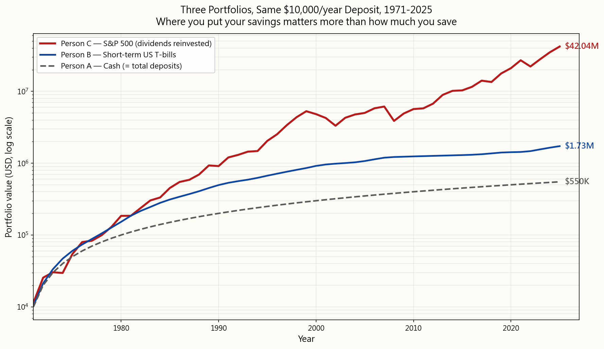
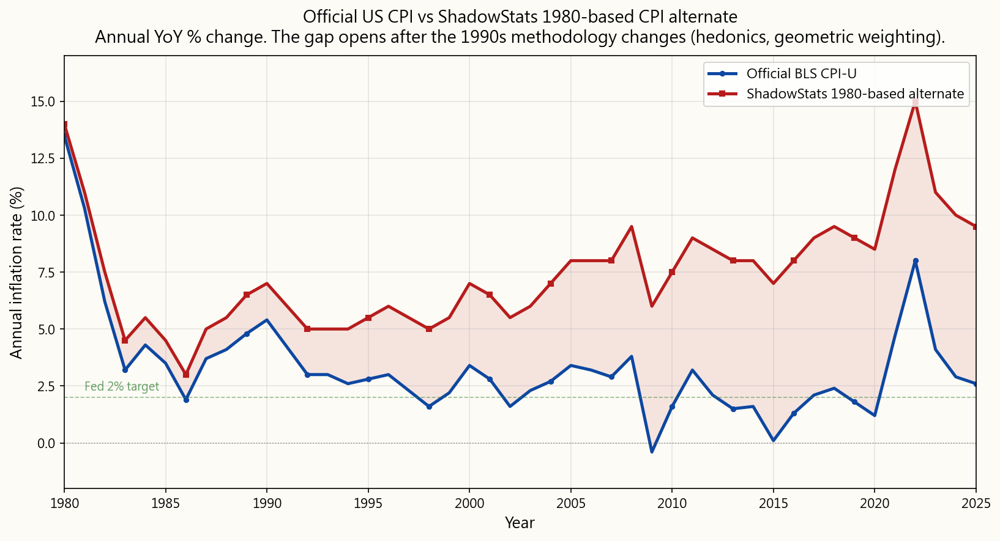
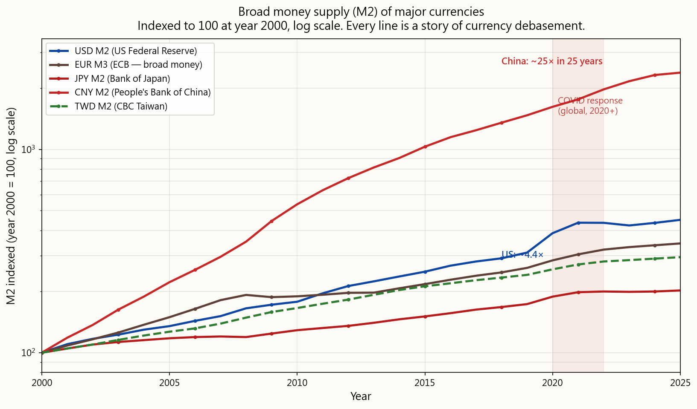
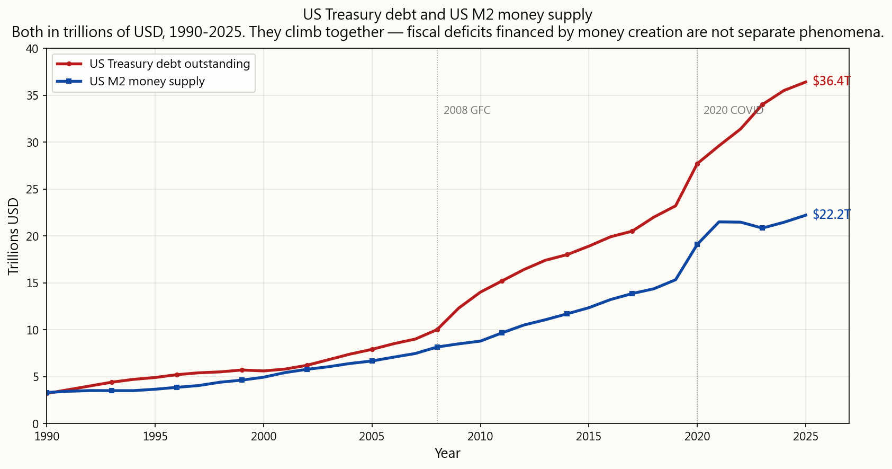

# 第一周：为什么要投资？战胜通胀才是核心

---

## 第一部分：阅读材料

---

### 1. 为什么这很重要

打开任何一本入门金融教材，你都会看到同一张图表：一条平滑的曲线，标注着"10,000美元以每年8%的速度增长"。三十年后，你成了百万富翁。四十年后，你便富甲一方。复利在为你默默耕耘。

**那张图表是个童话。** 在2026年，你去哪里找到稳定、无风险、每年8%的收益？根本找不到。2008年后的大部分时间里，短期国债的收益率大约只有半个百分点。投资级公司债在2022年遭遇重创。即便是标普500指数，*平均*每年约有10%的涨幅，但实现这一点靠的是年涨30%、年跌40%，以及整整十年的横盘震荡——从来都不是一条平滑的曲线。教材上的那张图，画成直线，是为了把投资包装成一道有保证答案的数学题。事实并非如此。根本不存在无风险的8%收益，从来都没有。

**72法则**也是同样的道理——"以8%的速度，你的钱每九年翻一倍。"毫无意义。稳定的8%并不存在，一旦你用实际逐年的收益序列来替换这个常数，这个规则就彻底失效了。这个"法则"不过是个小把戏，只有在教材已经为你画好的那条虚构增长路径上才管用。

那么，为什么还要费心投资呢？因为不投资的代价更高。**你已经身处一场你并未主动选择的赌局之中**——赌你银行账户里的现金能保住购买力。然而它保不住。通胀是每一位投资者不得不与之抗争、哪怕只是原地踏步也不得不面对的引力。问题从来都不是"我是否应该承担风险？"——无论你采取什么行动，你都已经在承担通胀风险了。真正的问题是：**哪种风险会为你承担它而支付报酬？**

本课程的存在，就是为了诚实地回答这个问题。以下是简短的结论，本课后续内容将会详细展开：

- **你必须跑赢通胀，否则即便账户里的数字在增长，你的实际购买力也在缩水。**
- **股票（以及黄金、有产出的实物房产等少数实物资产）是唯一被证明能可靠做到这一点的东西。**
- **债券*曾经*跑赢过通胀，在1982年至大约2020年的去通胀环境中确实如此。但如今不再——这背后是货币超发、以及政府压低利率以维持自身债务可持续性的故事。我们将在§2.3中回到这个话题。**

为了使这一点更加具体，让我们取过去55年的数据，做一个思维实验，设想三位储蓄者。从1971年开始，每人每年恰好存入10,000美元——相同的名义金额，年年如此，毫无例外。唯一的区别在于*把钱放在哪里*。

- **甲**把钱存成现金。不存银行，不计利息。纯粹的货币，放在抽屉里。
- **乙**把钱存入美国短期国债，这是最安全的付息工具。
- **丙**把钱投入标普500指数，所有股息全部再投资。

相同的纪律，相同的金额，却是三种截然不同的结局：

55年后，每个人存入的金额都是相同的**55万美元**。但最终余额却不可同日而语：

- **丙——标普500**：名义价值4,204.1万美元，**以1971年美元计约507.9万美元**——实际购买力大幅增长。
- **乙——短期国债**：名义价值172.5万美元，**以1971年美元计约20.8万美元**——扣除通胀后勉强为正。而这还包括了1980年代短期国债利率高达两位数的年份。剔除那些年份，情况要糟糕得多——而那正是我们当前所处的环境。
- **甲——现金**：名义价值55万美元，**以1971年美元计约6.6万美元**——勤勤恳恳储蓄了55年，最终拥有的实际购买力大约相当于六年半的存款总额。现金不是没有增长；而是在甲兢兢业业攒钱的同时，通胀在主动蚕食它的价值。

这张图是你在整个课程中都应该铭记于心的。丙之所以胜出，并不是因为标普500支付了神奇的、平滑的10%——它从来没有，那条路上经历过1973-74年的熊市、1987年的崩盘、2000-02年的互联网泡沫破裂、2008年的全球金融危机，以及2020年的新冠疫情崩盘——而是因为**股票是三者之中唯一一个能够可靠地跑赢货币贬值的资产**，而货币贬值正是三者共同面对的挑战。这场赛跑的对手不是零，而是通胀。赢得这场比赛，复利便会替你完成剩下的工作。输掉它，再多的"纪律"或"储蓄"都救不了你。

---

### 2. 你需要了解的知识

#### 2.1 通胀：你在新闻里看到的数字，并不是你实际支付的代价

你在电视上看到的那个数字——"本月CPI为2.6%"——是美国劳工统计局（BLS）公布的**消费者价格指数**（CPI）。美联储将其年度目标设定在约2%。养老金生活成本调整、社会保障涨幅、税率档次调整，以及通胀挂钩债券（TIPS）——都以此为基准。

问题在于：**CPI的编制方法已经被多次修改，而每一次修改都系统性地压低了公布的数字。** 以下三种具体手法值得了解。

**手法一：享乐调整（"新款iPhone功能更多"）。** 劳工统计局的逻辑是：如果新款iPhone与去年的价格相同，但摄像头更好，那就是*通缩*——你花同样的钱买到了更多的产品。汽车（更多安全配置）、冰箱（更大容量）、笔记本电脑（更快的处理器）也是同样道理。劳工统计局会在CPI中下调价格，以体现这种"额外价值"。这被称为**享乐调整**，自1990年代末起开始采用。

问题在于，**消费者买的不是iPhone功能，而是一部iPhone。** 一辆车就是一辆车，不管它有没有车道保持辅助系统。一台新笔记本就是一台新笔记本，不管芯片快了多少。你仍然需要那件东西，而你实际支付的价格，就是货架上的标价——而不是什么经过"功能调整"后的虚构低价。通过将质量提升视为价格下降，享乐调整系统性地使公布的CPI低于你在收银台实际经历的价格。博斯金委员会1996年自己的估计是，享乐调整和替代效应加在一起，每年使公布的CPI降低**0.5至1.0个百分点**——年年如此，复利叠加。

目前没有任何广泛公布的美国CPI数据系列单独剔除享乐调整的影响。最接近的主流替代方案是约翰·威廉姆斯的**ShadowStats**"基于1980年方法的CPI替代指数"——这是一项尝试，用1980年以前的劳工统计局方法重建CPI，其中包含了享乐调整以及其他后来的若干修改。ShadowStats通常比官方数字高出5到7个百分点。主流经济学家批评该数据系列基本上是在加一个近似固定的偏差量，而非从原始数据重新计算商品篮子，这一批评有其合理之处。但即便采取保守立场——认为ShadowStats高估了若干个百分点——方向性的判断依然成立：**你在新闻里看到的数字，明显低于一个家庭实际感受到的通胀**，而劳工统计局对此已知晓长达30年。

**手法二：核心通胀（"忽略食品和能源"）。** 美联储偏好的通胀衡量指标是**核心PCE**——个人消费支出，*剔除了食品和能源*，理由是这两个类别"波动性较大"。且不说食品和能源可以说是一个家庭*最重要*的支出项目，剔除它们的结构性效果与享乐调整如出一辙：公布的数字低于人们的实际感受。由于商品篮子权重的差异，PCE本身就比CPI平均低约0.3个百分点，而核心PCE在此之上又叠加了一层压低效果。美联储依据这一指标制定货币政策。

**手法三：替代效应（"牛肉贵了，你会改买鸡肉"）。** 当某项商品相对价格上涨时，现行CPI假设家庭会转向更便宜的替代品——并相应降低昂贵商品在商品篮子中的权重。从数学上看：你越来越买不起的东西，在通胀衡量指标中所占的权重*越来越低*，恰恰是因为它变贵了。这被称为**几何加权**，于1990年代末引入。1980年以前的方法使用算术权重，不会因为你被价格挤出而惩罚你。

**为什么这对你的实际财富有影响：**

- 你的**养老金**生活成本调整、**社会保障**涨幅、**税率档次**调整——都以人为压低的官方CPI为基准。如果政府在20年内每年少计2%的通胀，这对任何收入与CPI挂钩的人来说，意味着*累计约49%的实际减薪*。
- **通胀保护债券（TIPS）**的收益率与同样被低估的CPI挂钩。它们所宣传的"实际收益率"，只有在你信任这个平减指数的前提下才是真实的。
- **薪资谈判**以官方CPI为锚点。在整个职业生涯中，官方CPI与实际经历的通胀之间的差距，会复利叠加成一笔相当可观的隐性减薪。
- **美联储的利率决策**基于核心PCE。当美联储说"通胀已达目标"时，他们指的是*经过调整的指标*已达目标。在真实通胀率为6%的世界里，储蓄账户只给你0.5%的利息，这是那个测量差距造成的，而非偶然。

对你作为投资者的实际影响很简单：**不要将你的门槛收益率锚定于官方CPI**。无论你认为自己需要赚多少才能"跑赢通胀"，都应该诚实地再加几个百分点。如果官方CPI是2.5%，那就计划至少需要4.5%至5%的实际收益率，才能真正保住购买力。本课开头的图表已经显示了*现金*在一个工作生涯中的表现——而真实情况比那还要糟糕。

#### 2.2 通胀从何而来：货币超发

教科书对通胀的解释——"过多的钱追逐过少的商品"——在技术上是正确的，但丝毫没有告诉你*为什么*钱会过多。诚实的答案是：**中央银行创造了它，政府花掉了它。** 现代通胀，归根结底是一种货币现象。

看一看过去四分之一世纪主要货币的广义货币供应量（M2），以2000年为基准，将各货币起点统一设为100：

每一种主要货币都在这段时期内经历了贬值。**2020年后的垂直飙升**在每一条线上都清晰可辨——新冠疫情的应对措施触发了全球同步的货币扩张，这是现代历史上和平时期规模最大的一次。注意，图表使用的是**M2**（流通货币+活期存款+储蓄存款+小额定期存款+零售货币市场基金），而非M1。M1低估了这一图景；M2是"实际在经济中运转的货币"更接近的代理指标。

故事的另一半是**政府债务**。当政府出现财政赤字（支出超过税收收入）# 第一周：为什么要投资？跑赢通胀才是核心命题

---

## 第一部分：阅读材料

---

### 1. 为什么这很重要

打开任何一本入门级金融教材，你都会看到同一张图：一条标注着"一万美元按每年8%增长"的平滑曲线。三十年后，你成了百万富翁。四十年后，你家财万贯。复利在帮你打工。

**那张图是童话。** 在2026年，你去哪里找稳定的、无风险的每年8%收益？找不到。在2008年后的大部分时间里，国债收益率大约只有半个百分点。投资级公司债在2022年遭受重创。就连标普500指数，其*平均*年收益率大约是10%，但那是靠一年涨30%、一年跌40%、再加上平淡无为的整个十年堆出来的——从来不是一条平滑的线。教材里那条直线，是为了把投资包装成一道有保证答案的数学题来售卖的。投资不是这样的。不存在无风险的8%。从来都不存在。

**72法则**也一样——"按8%计算，你的钱每九年翻一倍。"毫无用处。稳定的8%根本不存在，而一旦你用实际的逐年收益序列替换那个常数，法则就失灵了。这条"法则"是一个魔术把戏，只在教材已经帮你画好的那条虚构增长路径上才管用。

那为什么还要投资？因为另一条路更糟。**你已经身处一场你没有选择的赌局之中**——赌你银行账户里的现金能保住购买力。它保不住。通胀是每一个投资者都必须对抗的引力，只有这样才能原地踏步。问题从来不是"我该不该承担风险？"——不管你做不做任何事，你都在承担通胀风险。问题是：**哪种风险会付给你回报？**

这门课程的存在，就是为了诚实地回答这个问题。简短版本如下，本节课的其余内容将进一步展开：

- **你必须跑赢通胀，否则即便账户上的数字在增长，你的实际购买力也在缩水。**
- **股票（以及黄金和有产出的不动产等少数实物资产）是唯一被证明能可靠做到这一点的东西。**
- **债券*曾经*能跑赢通胀，那是在1982年至大约2020年的去通胀周期里。它们现在已经不能了**——这背后是货币超发和政府压低利率以维持自身债务可控的故事。我们将在§2.3回头讨论这个问题。

为了具体说明，让我们取过去55年，用三位储蓄者做一个思维实验。从1971年开始，每人每年恰好存入10,000美元——同样的名义金额，每年如此，一次不落。唯一的区别是*钱放在哪里*。

- **甲**把钱放在现金里。不存银行，不计利息。纯粹的货币，放在抽屉里。
- **乙**把钱存入短期美国国债，那是最安全的计息工具。
- **丙**把钱投入标普500指数，所有股息全部再投入。

同样的纪律，同样的金额，三种截然不同的结果：

55年后，每个人存入了同样的**55万美元**。但最终余额不在同一个档次：

- **丙——标普500**：名义金额4,204万美元，**以1971年美元计约507万美元**——实际购买力有实质增长。
- **乙——国债**：名义金额172.5万美元，**以1971年美元计约20.8万美元**——通胀后几乎刚好持平。而这还包括了1980年代国债支付两位数收益率的年份。剔除那些年份，图景要糟得多——而那正是我们现在所处的格局。
- **甲——现金**：名义金额55万美元，**以1971年美元计约6.6万美元**——辛辛苦苦储蓄55年，最终实际购买力相当于大约六年半的存款总额。现金不是没有增长；通胀在甲尽职储蓄的同时，积极地将其蚕食殆尽。

这张图应该深深印在你脑海里，贯穿整门课程。丙之所以胜出，不是因为标普500支付了神奇的、平滑的10%——它没有，那条路包含了1973-74年的熊市、1987年的崩盘、2000-02年的互联网泡沫破灭、2008年的全球金融危机和2020年的新冠崩盘——而是因为**股票是三者之中唯一一个能可靠跑在货币贬值前面的资产**，而他们三人都在对抗货币贬值。这场比赛不是对阵零点。是对阵通胀。赢了，复利就会接管剩余的工作。输了，无论多少"纪律"或"储蓄"都救不了你。

---

### 2. 你需要了解的知识

#### 2.1 通胀：你在新闻里看到的数字，不是你实际支付的数字

你在电视上看到的那个标题数字——"本月CPI为2.6%"——是美国劳工统计局公布的**消费者价格指数**（CPI）。美联储的目标是每年大约2%。养老金的生活成本调整、社会保障金的增加、税级调整以及通胀挂钩债券（TIPS）全都与之挂钩。

问题在于，**CPI背后的统计方法已经被多次修改，且每次修改都系统性地压低了公布数字。** 以下三个具体手法值得了解。

**手法一：享乐主义调整（"新款iPhone功能更多了"）。** 劳工统计局的逻辑是，如果一款新iPhone价格和去年一样，但摄像头更好，那这就是*通缩*——你用同样的价格买到了更多产品。汽车（安全功能更多）、冰箱（容量更大）、笔记本电脑（CPU更快）同理。劳工统计局在CPI中向下调整价格，以反映这种"额外价值"。这被称为**享乐主义调整**，自1990年代末起开始应用。

问题在于，**消费者买的不是iPhone的功能，而是一部iPhone。** 不管有没有车道保持辅助功能，一辆车就是一辆车。不管芯片快了30%，一台新笔记本就是一台新笔记本。你依然需要买那件东西，而你实际付出的价格，是货架上的标价——不是某个想象中"按功能调整后"的更低数字。通过将质量提升视为价格下降，享乐主义调整系统性地使公布的CPI低于你在收银台实际经历的价格。博斯金委员会1996年自己的估算是，享乐主义调整和替代调整合计每年使报告CPI**降低0.5至1.0个百分点**——每年如此，复利积累。

目前没有广泛发布的美国CPI系列数据单独剔除享乐主义调整。最接近的流行替代方案是约翰·威廉姆斯的**ShadowStats**"基于1980年的CPI替代"——一次用1980年前劳工统计局方法论重建CPI的尝试，该方法将享乐主义调整与若干其他后期变化捆绑在一起。ShadowStats的读数通常比官方数字高出5到7个百分点。主流经济学家批评该系列本质上只是在近乎恒定的偏移量上做加法，而不是从原始数据完整重新计算篮子，这个批评有其道理。但即使采取保守解读——即ShadowStats高估了几个百分点——方向性结论依然成立：**你在新闻上看到的数字，明显低于一个家庭实际经历的通胀**，劳工统计局对此知情已有30年。

**手法二：核心通胀（"忽略食品和能源"）。** 美联储偏好的通胀指标是**核心PCE**——个人消费支出，*剔除了食品和能源*，理由是这两类价格"波动较大"。暂且不论食品和能源很可能是一个家庭支付的*最重要*价格，剔除它们的结构性效果与享乐主义手法相同：公布数字低于人们的实际感受。PCE本身因篮子权重差异，平均比CPI低约0.3个百分点。核心PCE则在此基础上又加了一层。美联储就是根据这个指标来制定货币政策的。

**手法三：替代效应（"牛肉涨价了，你会去买鸡肉"）。** 当篮子中某类商品价格相对更高时，现代CPI假设家庭会转向更便宜的替代品——并降低那类昂贵商品在篮子中的权重。从数学上来说：你越来越买不起的东西，在通胀指标中占的权重*越来越小*，恰恰是因为它们变贵了。这被称为**几何加权**，于1990年代末引入。1980年前的方法论使用算术权重，不会因为你买不起而这样惩罚你。

**为什么这对你的实际资金很重要：**

- 你的**养老金**生活成本调整、你的**社会保障**增加、你的**税级**调整——全都与人为压低的官方CPI挂钩。如果政府连续20年低估通胀2个百分点，对于任何收入与CPI挂钩的人而言，这相当于*累计实际削减49%*。
- **通胀保值债券（TIPS）**支付的收益率与同样被低估的CPI挂钩。它们宣传的"实际收益率"仅在*你信任该平减指数*的情况下才是真实的。
- **工资谈判**以官方CPI为锚。在一个职业生涯中，报告CPI与实际经历通胀之间的差距，会复利积累成一笔非常巨大的隐性减薪。
- **美联储的利率决策**基于核心PCE。当美联储说"通胀在目标水平"时，它的意思是*经过调整的指标*在目标水平。在6%实际通胀环境下，给你0.5%利息的储蓄账户是这种测量差距带来的结果，而不是什么缺陷。

对你这个投资者而言，实际含义很简单：**不要把你的最低收益率目标锚定在官方CPI上**。无论你认为自己需要赚多少才算"跑赢通胀"，都要再加几个百分点以示诚实。如果官方CPI是2.5%，那就计划至少需要4.5%–5%的实际收益率，才能真正保住购买力。本节课开头的那张图展示了*现金*在一个职业生涯中的表现——即使按官方CPI计算——真实情况只会更糟。

#### 2.2 通胀从何而来：货币超发

教科书对通胀的解释——"过多的钱追逐过少的商品"——技术上是正确的，但对于为什么会有过多的钱，什么都没说。诚实的答案是：**中央银行创造了它，政府花掉了它。** 现代通胀，归根结底，是一种货币现象。

看看过去四分之一世纪主要货币的广义货币供应量（M2），以2000年为基期指数化，令各线均从100开始：

每种主要货币在此期间都已贬值。每条线上**2020年后的垂直跳升**清晰可辨——新冠时代的应对措施是一次全球同步的货币扩张，是现代史上和平时期规模最大的一次。注意，该图使用**M2**（流通货币+活期存款+储蓄存款+小额定期存款+零售货币市场基金），而非M1。M1低估了问题的严重性；M2是"实际在经济中发挥作用的货币"更接近的代理指标。

故事的另一半是**政府债务**。当政府出现财政赤字（支出超过税收收入）时，它会发行债券。当中央银行用新创造的储备金购买这些债券——这正是2008年以来量化宽松的本质——那就是**债务货币化**：今天花钱，明天用印出来的钱偿还。美国国家债务和美国M2几乎是步调一致地共同增长，因为它们是同一货币行为的两个面向：

这就是当前格局，它对你能投资什么有直接影响：

1. **政府无法允许实际利率大幅上升**，因为这样做会使其自身的债务偿还成本爆炸式增长。以36万亿美元的联邦未偿债务计算，平均收益率每上升1%，大约增加3,600亿美元的年度利息支出——大约是整个美国国防预算的60%。将名义利率人为压低（包括通过中央银行购买债券）的政治动机是巨大的。
2. **债券因此不再是可靠的通胀对冲工具。** 当政府既有手段（受控的中央银行）又有动机（债务偿还的数学逻辑）将名义利率维持在真实通胀率以下时，债券的*实际*收益率就会系统性地变为负值。这被称为**金融抑制**，这正是使1982年至2020年运行良好的"六四开股债"投资组合在结构上令人存疑的原因。
3. **实物资产——有产出的股权、黄金、不动产、大宗商品——成为剩余的价值储存手段**，因为它们以*实物*计价，而非以政府正在贬值的货币计价。本课程将花大量篇幅讲解如何持有这些资产，以及在什么价格值得持有。

复利，作为一个实际的数学概念，是真实且重要的——利滚利确实会指数级增长，代数运算是正确的。*不*真实的是教科书里那幅平滑的、无风险的8%曲线。那条线所基于的货币正在以每年7%–15%的速度被创造出来。不存在教科书反复引用的那种水平的无风险实际收益率。真正的问题是：哪些资产能跟上印钞机的速度，在什么价格值得持有？

#### 2.3 实际收益与名义收益：唯一诚实的衡量标准

**名义收益**是标题数字——"标普500去年涨了26%。"**实际收益**是名义收益减去通胀——你实际获得的购买力增长。

一个快速近似公式：

$$ r_{\text{实际}} \approx r_{\text{名义}} - i $$

精确关系（**费雪方程**）为：

$$ r_{\text{实际}} = \frac{1 + r_{\text{名义}}}{1 + i} - 1 $$

在低通胀时，近似公式足以用于心算；在高通胀或高收益率情况下，精确公式才有意义。在名义收益率26%、通胀率7%时，近似公式给出19%；精确答案是17.8%。在正常通胀水平下差距很小，但差距会随两者数值增大而扩大。

**诚实的表格——美国各资产类别历史实际收益率（扣除通胀后）：**

| 资产类别 | 名义（长期平均） | 实际（扣除通胀后） | 能否跑赢通胀？ |
|---|---:|---:|---|
| 美国股票（标普500，股息再投入） | ~10% | ~7% | **是，可靠地** |
| 黄金 | ~7% | ~3–4% | 是，在长周期内（1971年后） |
| 不动产（广义，含租金） | ~9% | ~3–4% | 是，在长周期内 |
| 美国债券（10年期国债，长期平均） | ~5% | ~1–2% | 勉强——**2010年代和2020年代不行** |
| 美国国债（现金等价物） | ~3.5% | ~0% | **否，2008年后** |
| 储蓄账户 | ~1–2% | ~−2至−5% | **否** |
| 现金（放床垫下） | 0% | ~−3至−7% | **否** |

表头写着"长期平均"，而"长期"在这张表里承担了大量分量。债券在完整历史记录中*平均*取得了正实际收益率，但这个平均值是被1982–2020年去通胀债券牛市拉高的——那是一段40年的利率下行期，将债券变成了总收益引擎。**在2020年代，10年期国债的实际收益率深度为负；债券牛市已经结束，产生它的那个格局（见§2.2）已经逆转。**

因此，对于*当今*格局，这张表诚实地读完后，会缩短为一个更短的清单，列出能可靠跑赢通胀的东西：

- **股票**（广义上，包括通过指数基金或直接持有的有产出企业）
- **黄金及其他货币金属**
- **有产出的不动产**（有现金流的，不是裸地）
- **部分大宗商品**（在周期的正确阶段）

**其他一切，在实际价值层面，都是亏本买卖。** 在6%实际通胀的环境下，支付4%利息的"高收益"储蓄账户仍然每年亏损2%。同样环境下5%收益率的国债亏损1%。账户数字在增长这件事，与你的购买力无关。唯一重要的问题是：**我有没有跑赢印钞机？**

这是本课程其余内容的基础纪律。我们考察的每一种资产、我们讲授的每一种策略，都将针对这个单一测试进行评估。名义收益是表演。实际收益才是唯一能支付你未来食品账单的东西。

---

### 3. 常见误区

**误区一："我应该把钱存在储蓄账户里，这样才安全。"**

在5%以上实际通胀的环境中，支付1%–2%利息的储蓄账户是你能持有的回撤幅度最大的负实际收益仓位之一。它感觉安全，因为*名义*数字不会下降。但它并不安全——它是一种缓慢的、几乎无法察觉的放血。缓慢恰恰是它危险的地方：那些"谨慎保守"的人，在意识到游戏规则是被操控的之前，已经失去了数十年的购买力。

**误区二："教科书里8%复利的图展示了我投资之后会发生的事。"**

它展示的是，如果8%的无风险实际收益率存在，会发生什么。它们不存在。2008年后的大部分时间里，国债的实际收益率约为0%。标普500的名义收益率*平均*大约10%，但那是一条由涨30%的年份、跌40%的年份和死气沉沉的整个十年拼凑而成的路径——从来不是平滑的直线。教科书里那条线画成直线，是为了让复利看起来像数学；而现实中它是一条充满噪声和回撤的攀升之路，需要在回撤中坚持买入的*心理*能力。这才是真正的难点，而教科书图表把它藏起来了。

**误区三："债券是我投资组合中用于对冲通胀的安全部分。"**

在1982–2020年的去通胀格局中，债券*曾经是*通胀对冲工具——那是历史上最长的债券牛市。那个格局已经结束。在中央银行受制于政府债务偿还数学逻辑的情况下（§2.2），高等级债券的实际收益率在2010年代和2020年代的大部分时间里都是负值。"债券保安全"的法则是对一个已不再适用的格局的近期偏差。如今的债券是一种久期赌注，而非通胀对冲。

**误区四："新闻上的CPI数字就是真实的通胀。"**

CPI是一种测量选择，不是事实。它使用享乐主义调整（功能更好的新款iPhone被视为价格*下降*），替代权重（你越来越买不起的东西在篮子里权重越来越小，因为你已经被高价挤出），以及在美联储偏好的核心PCE指标中剔除食品和能源。这三种方法论选择，都在把公布数字压低到低于家庭实际经历的通胀水平。把你的投资最低收益率目标锚定在*实际经历*的通胀率上，而不是政治性的数字上。

**误区五："72法则告诉我钱翻倍需要多长时间。"**

它告诉你的是，*固定*收益率使钱翻倍需要多长时间。固定收益率在教科书章节例题之外并不存在。实际收益率是有波动性、回撤和格局变化的序列；法则中"8%下9年翻倍"的估算，对于序列中间夹着一个2008年这种情况，什么都说不了。这条法则是一个只在教科书已经帮你画好的那个虚构世界里才成立的精巧心算技巧。

**误区六："涨10%再跌10%，我就回到原点了。"**

这在数学上是错误的。100美元涨10%等于110美元。然后110美元跌10%等于99美元。你亏损了1%。亏损的伤害比等量盈利的帮助更大，因为在亏损后，盈利的百分比作用于更小的基数。亏损50%需要盈利100%才能回本。亏损90%需要盈利900%才能回本。

| 亏损 | 回本所需盈利 |
|---:|---:|
| −10% | +11.1% |
| −20% | +25.0% |
| −30% | +42.9% |
| −50% | +100.0% |
| −75% | +300.0% |
| −90% | +900.0% |

从数学上来说，亏损幅度为 \(L\) 后，所需回本盈利为：

$$ G = \frac{L}{1 - L} $$

一旦 \(L\) 变大，这个值的增长速度远超 \(L\) 本身。这就是为什么管理下行风险比最大化上行收益更重要，也是为什么从心理角度看，那条从未发生50%回撤的"安全"国债路径，并不严格地劣于股票路径——即便股票路径在长期实际收益上获胜。

**误区七："投资就是赌博。"**

赌博的预期收益是*负的*——庄家总是赢，数学期望就是让你亏损。投资于有产出的资产（代表对真实企业真实现金流的索取权的股票）的历史预期收益是*正的*——你因提供资本和承担风险而获得补偿。对个股的短期投机可能类似赌博。对有产出股权的长期分散投资在本质上是不同的，数学反映了这一点。

**误区八："我需要很多钱才能开始投资。"**

不需要。大多数券商提供零门槛和分拆股份交易。真正的制约因素很少是第一笔存款的大小；而是**在不可避免的回撤期间坚持继续存入的纪律**。一个从25岁起每月往宽基指数基金存入100美元的人——并且在接下来四十年每次30%熊市期间都坚持这样做——最终的成就会远超一个25岁时一次性存入50,000美元、在第一次回撤时恐慌离场、此后再未重新入市的人。行为决定成败。

---

### 4. 问答

**Q1：如果教科书里8%的图是童话，我实际上应该期待怎样的收益率？**

A：两个诚实的答案，都有用：

- **对于美国宽基股票（标普500，股息再投入），长期名义平均收益约为10%，扣除官方CPI后的长期实际平均收益约为7%。** 如果你认同影子CPI的批评，则将实际数字向下调整1–2%，大约在5%–6%实际收益率。
- **路径不是平滑的。** 任何特定年份，市场可能涨30%或跌30%。这10%的平均值只在长时间跨度（20年以上）后才会显现，即使那些长周期也包含了多年平坦甚至负收益的阶段（2000年代的"失去的十年"以实际价值计低于起点）。为平均值做计划，为波动性调整仓位。

对于债券、国债和储蓄账户：在当前格局中假设实际收益率为零或负值。任何比这更好的都是意外之喜。

**Q2：你为什么说72法则没用？它在数学上是正确的。**

A：对*固定收益率*而言，数学是正确的。问题在于固定收益率不存在——它们是教科书的抽象概念。在现实世界中，收益率是有顺序、有波动性和有格局变化的序列，而*顺序*很重要：序列早期的一次−40%比晚期的−40%造成的伤害大得多，因为早期有更多资本可以损失。72法则对顺序风险没有任何说明，而顺序风险才是你实际承担的风险。作为对所引用平均收益率的合理性检验，这条法则是可以的。作为规划工具，它具有误导性。

**Q3：为什么我不能相信官方CPI？**

A：三种方法论选择，都是逐步引入的，都在压低公布数字：

- **享乐主义调整**（功能更多的新产品被视为价格下降，尽管你仍然支付了全额标价）；
- **替代/几何加权**（你越来越买不起的商品在篮子中权重越来越低，理论依据是你会减少购买）；
- **核心通胀**（在美联储偏好的PCE指标中剔除食品和能源——即对家庭打击最大的价格从政策相关指标中被移除）。

博斯金委员会（1996年）估计，这些合在一起每年使报告CPI降低约0.5–1.0个百分点。ShadowStats的基于1980年CPI系列估计差距更大——通常为5–7个百分点。真相可能介于两者之间，但方向毫无疑义：现实生活中的通胀实质上高于标题数字，而且差距在复利积累。

**Q4：如果债券不再跑赢通胀，为什么券商还在推荐它们？**

A：两个原因。首先，这种推荐是1982–2020年格局的产物——那时债券确实大幅跑赢通胀——券商培训、理财规划模型和整套六四开投资组合正统理论都是在那个格局中建立的，还没有完全更新。其次，债券仍然有一件事做得好：降低投资组合的*短期波动性*。它们是波动性对冲工具，而非通胀对冲工具。如果你对回撤的心理承受力是制约你投资行为的关键因素，债券或许仍然能赢得一席之地——只是不要在当前格局中误把它当成通胀对冲工具。

**Q5："印钞"和政府财政赤字支出有什么区别？**

A：它们现在几乎是同一回事。当政府出现赤字时，它发行债券。历史上，这些债券被出售给私人投资者——养老基金、外国中央银行、储蓄者——他们用已有的钱为支出融资。那*不是*印钞。然而，自2008年以来，各中央银行（美联储、欧洲央行、日本央行）已常规性地用新创储备金购买大批新发行的政府债券。那**才是**印钞——赤字是用新印的钱而非现有储蓄来融资的。这一区别很重要：以债券融资的赤字不会直接使货币贬值；以中央银行融资的赤字则会。现代赤字绝大多数属于后者。

**Q6：通胀对所有人的影响是一样的吗？**

A：不一样。官方CPI是基于代表性篮子的全国平均值；你的*个人*通胀率取决于你实际的消费支出结构。三类群体感受到的通胀高于官方数字：

- **租房者**（住房通胀在大多数周期中高于CPI）；
- **退休人员和慢性病患者**（医疗和处方药通胀远高于CPI）；
- **有孩子就读私立学校或美国大学的家庭**（教育通胀在过去二十年大约是CPI的两倍）。

相反，电子产品和服装在名义价格上往往*出现通缩*，这对在这些类别上支出占收入比例较高的中低收入家庭有利——而这也恰恰是享乐主义调整对压低报告CPI影响最大的领域。你的投资组合应该根据*你自己的*消费篮子来校准，而不是全国平均水平。

**Q7：我应该先还债再投资吗？**

A：比较债务的税后利率与预期实际投资收益率。信用卡债务利率20%以上，是财务紧急情况——还清它是有保证的20%回报，比任何股权投资都好。在6%实际通胀环境中，4%–5%的房贷利率是*负实际利率*——通胀正在帮你还债，激进地提前还款是次优选择。常见法则：先还清利率在约7%以上的所有债务，然后再投资。（另外，检查债务是否可以抵税——在某些司法辖区，房贷利息可以抵税，这会进一步降低实际利率。）

**Q8：复利会对我不利吗？**

A：会，而且这是不借还高利率债务最被低估的理由。5,000美元的信用卡余额，年利率24%，若不还款，五年后增长到14,615美元。复利不在乎它往哪个方向运转；那种通过长期股权持有积累财富的数学力量，同样会通过未偿债务毁灭财富。消除高息债务是大多数人可以获得的最高回报"投资"，而且没有风险。

**Q9：如果只有股票能可靠跑赢通胀，为什么还要持有其他任何东西？**

A：因为*路径*和目的地一样重要。纯粹100%股票的投资组合，在某个十年里将会给你一次50%以上的最大回撤。如果你在底部卖出——大多数人确实会这样做，因为他们夜不能寐——你就失去了首先促使你持有股票的那种长期实际收益优势。对黄金、现金以及（对某些投资者在某些格局中）债券的一定配置是*行为保险*：它减少了你必须经历的回撤幅度，使你能在最关键的时刻坚守股票仓位。资产配置是我们在本课程后续几周将深入探讨的内容。目前，标题结论是：**股票是收益引擎；其他一切都是平滑函数**。

**Q10：黄金不支付任何收益率。它怎么能跑赢通胀？**

A：黄金不是靠*收益率*跑赢通胀——它没有收益率。黄金靠的是**在被贬值的货币计价下的价格升值**。自1971年美国放弃金本位以来，黄金从约35美元/盎司升值至今天的2,500美元以上/盎司——以名义价格计约70倍，以55年实际（经通胀调整后）价格计约4–5倍。黄金实际上是一个做多货币贬值的多头头寸：美联储每创造一美元新货币，最终都需要找到一个归宿，而在历史上有相当一部分最终流入货币金属。我们将在本课程中多次回到黄金和价值储存资产这一话题。
