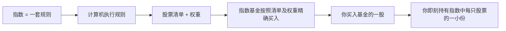
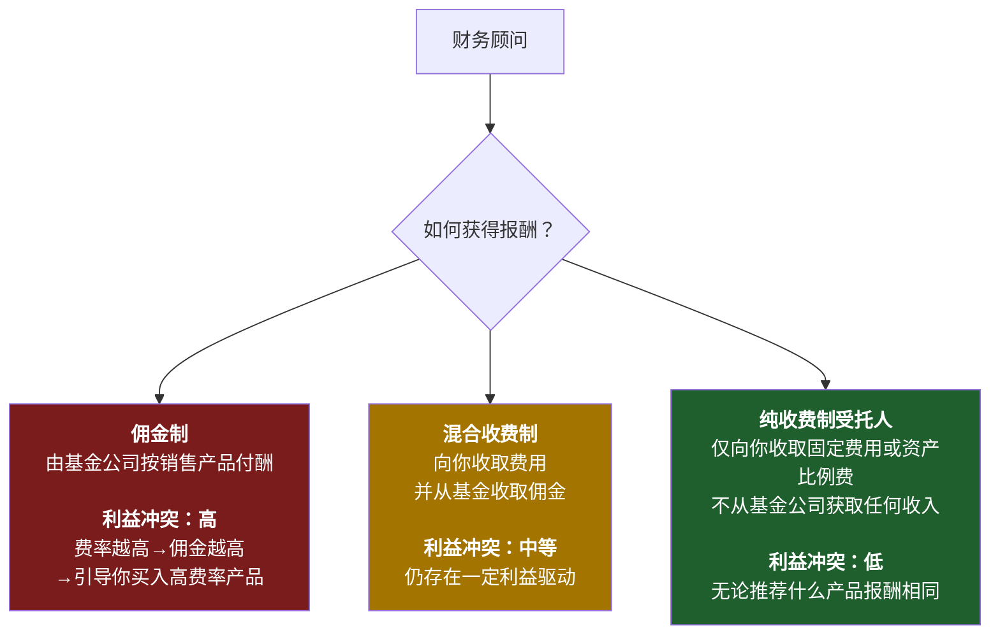
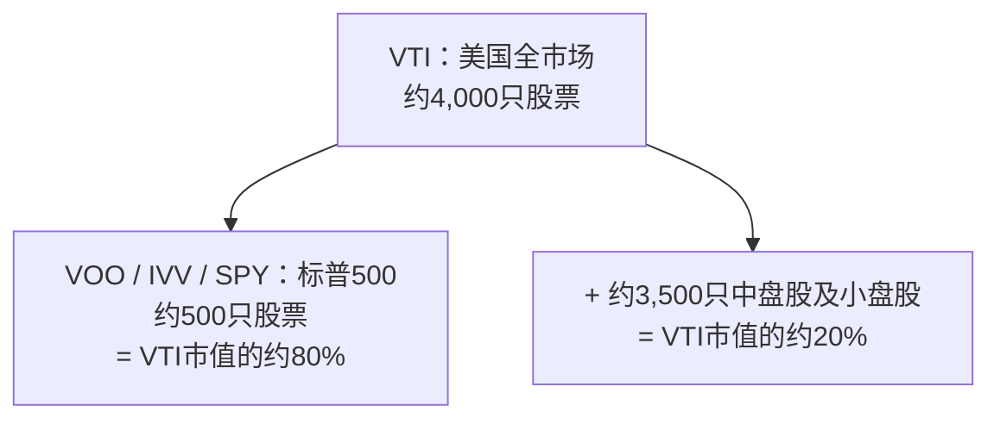
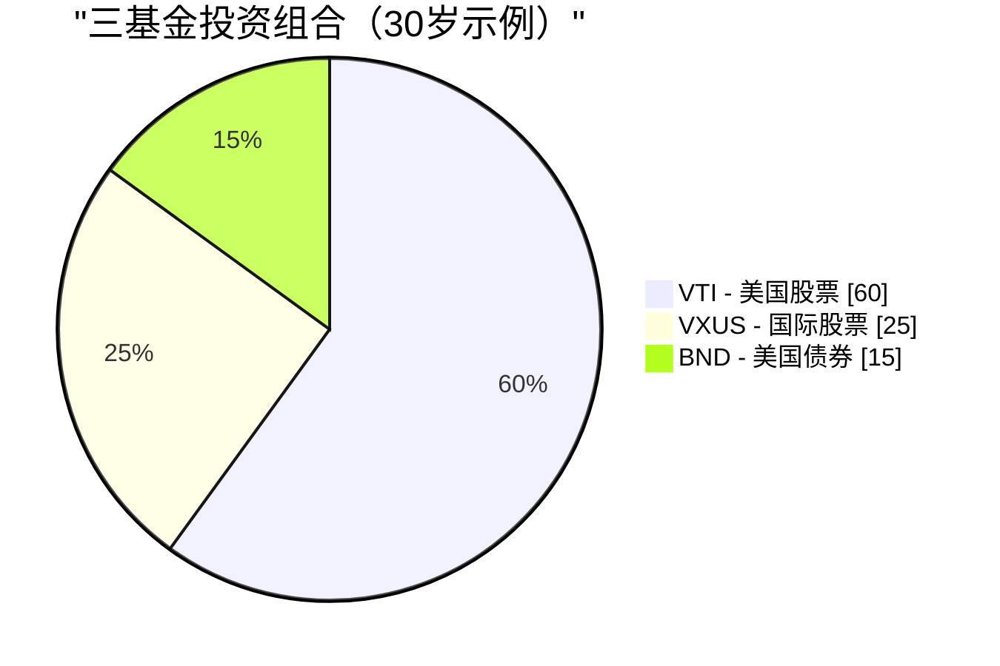

# 第二周：指数基金与交易所交易基金

动画参考：`animation/week02_active_vs_passive.py`

---

## 第一部分：阅读章节

---

### 1. 为什么这很重要

上周我们揭示了一个残酷的真相：**通胀是引力，不投资是你能做的最昂贵的事。** 现在的问题是*如何*投资。而这个问题的答案，投资行业花了四十年才肯承认：对几乎所有人而言，正确答案是**低费率指数基金或交易所交易基金。** 不是选股。不是你银行的"财富顾问"。不是你小舅子的内幕消息。不是你保险代理人急着向你兜售的结构化产品。

这是整门课程中最重要的一课，而且它真的很简单。如果你读完第二周就停下，设置每月自动定投一只宽基市场指数交易所交易基金，此后再也不读一本金融书，**你的投资表现将超越这个星球上绝大多数投资者——包括那些拿着数百万年薪管理别人钱的专业人士。**

这不是推销话术，而是四十年来数据所呈现的实证结论：

- **在20年的时间窗口内，约90%的主动管理型美国大盘股基金跑输标普500** ——这一数据每年由标普道琼斯指数公布的SPIVA报告所记录。
- **预测基金未来业绩的最佳单一指标是费用率。** 不是基金经理的背景，不是品牌，不是历史收益，而是费用。费用越低→未来平均收益越高。（晨星在一项又一项研究中都证实了这一点。）
- **沃伦·巴菲特——史上最著名的主动投资者——在遗嘱中指示将妻子的遗产投入"一只费率极低的标普500指数基金"。** 如果史上最伟大的选股人告诉自己的遗孀不必选股，这本身就是一个信号。

因此本周我们将围绕三件事展开。第一，指数基金究竟是什么，以及它略带异端色彩的诞生历史。第二，金融行业从散户投资者口袋里捞钱的四种主要方式——高费率主动基金、佣金驱动的顾问、以保险为包装的"投资"产品，以及慢慢侵蚀财富的传统共同基金——以及如何绕过它们。第三，你真正需要的几个具体代码。

最后还有一个诚实的悬念：**指数基金的主流共识已经有效运转了四十年，但并不能保证永远有效。** 它何时以及如何可能失效，届时该怎么办，这是我们在后续章节会回头探讨的话题。现在，我们先打好地基。进阶操作之后再说——是建立在这个地基*之上*，而不是取而代之。

> *"投资是必须。本课程中的其他所有工具，都只是锦上添花。"*

---

### 2. 你需要了解的内容

#### 2.1 什么是指数？

**指数**是一张依据一套规则筛选股票（或其他资产）的清单。没有人在"管理"这个指数——它就是规则本身所规定的内容。标普500就是"满足特定流动性、盈利能力和上市标准的500家最大美国公司，按市值加权"。这就是全部定义，计算机完全可以执行。

当新闻说*"今天市场涨了2%"*，几乎毫无例外地意味着标普500涨了2%。

你会经常听到的主要指数：

| 指数 | 跟踪对象 | 成分股数量 |
| --- | --- | --- |
| **标普500** | 美国最大的500家公司 | 约500只 |
| **CRSP美国全市场指数** | 整个美国股票市场 | 约4,000只 |
| **道琼斯工业平均指数（DJIA）** | 30家大型美国公司（价格加权，较为古老） | 30只 |
| **纳斯达克综合指数** | 纳斯达克全部股票 | 约3,000只 |
| **纳斯达克100指数** | 纳斯达克规模最大的100家非金融类股票（科技权重较高） | 100只 |
| **罗素2000指数** | 2,000家美国小盘公司 | 约2,000只 |
| **MSCI欧澳远东指数** | 除美国/加拿大以外的发达市场 | 约800只 |
| **MSCI新兴市场指数** | 新兴市场国家 | 约1,400只 |
| **富时100指数** | 英国最大的100家公司 | 100只 |

**大多数主要指数采用市值加权。** 这意味着某公司在指数中的权重与其总市值成正比。苹果公司市值约3万亿美元，在标普500中占约7%的权重；规模最小的成分股市值约100亿美元，权重约为0.02%。排名前10的公司通常占**整个指数权重的30%至35%。** 当你"买入标普500"时，你实际上买入的大盘股集中度，远比"500只股票"这个名字所暗示的要高。

这就是整个运作机制。其中没有任何天才之处。而这正是它有效的原因。

---

#### 2.2 指数基金——博格尔的异端创想

指数基金直到1976年才诞生。在此之前，美国每一只共同基金都是主动管理的：穿着西装的聪明人选股，每年收取1%至2%的服务费。当时的数学逻辑与今天完全相同——他们中的大多数跑输市场平均水平——但这一学术发现尚未转化为具体产品。

**将这一逻辑转化为产品的人是杰克·博格尔。** 博格尔于1974年被威灵顿管理公司驱逐。1975年，他创立了一家构架独特的新型共同基金公司——**先锋集团（Vanguard）**，采用互助制结构，由旗下基金持有人共同拥有，没有外部盈利动机。1976年，先锋推出了**第一指数投资信托**，即第一只零售指数基金：它只需按照指数权重买入标普500全部500只股票，并收取极低的费用。

业界对此嘲笑不已。媒体称之为**"博格尔的蠢事"。** 券商拒绝代销（因为无佣金可赚）。该基金在首次公开发行时仅募集了1100万美元，远低于博格尔1.5亿美元的目标。竞争对手称这个想法**"不符合美国精神"**，是**"平庸的保证"。**

竞争对手说得没错，这确实是有保证的平庸——*如果平庸意味着"市场平均水平减去几个基点的费用"的话。* 他们忽视的是，市场平均水平减去几个基点，在20年内能打败约90%的专业人士。

如今，先锋集团管理着超过**8万亿美元**的资产，指数基金和交易所交易基金合计在全球管理**超过20万亿美元**。博格尔的"蠢事"成为全球零售股票投资的主流形态。博格尔本人于2019年辞世，他从未像其他管理8万亿美元资产公司的创始人那样中饱私囊——先锋的互助制结构意味着节省的费用流回基金持有人手中，而非流入他的口袋。他是金融界极少数真正当得起"英雄"二字、无需加引号的人。

> "别在干草堆里找针了，把整个干草堆买下来就行。" —— 约翰·C·博格尔

---

#### 2.3 共同基金 vs. 交易所交易基金——为何共同基金仍然存在（以及为何你大多数情况下应选择交易所交易基金）

**指数基金**是一种*策略*——"跟踪指数"。这一策略可以包装在两种不同的*载体*中：

- **共同基金**，每日按收盘净值定价并交易一次。
- **交易所交易基金（ETF）**，在交易所实时交易，与股票相同。

| 特征 | 共同基金 | 交易所交易基金 |
| --- | --- | --- |
| 交易时间 | **每天一次**，按收盘净值 | **全天**，与股票相同 |
| 最低投资额 | 通常为**1,000至3,000美元** | **一股的价格**（或碎股） |
| 税务效率（应税账户） | **较差**——资本利得分配强制传导给所有持有人 | **较好**——实物赎回机制保护持有人 |
| 佣金 | 在基金自有券商处为0 | 在大多数券商处为0 |
| 便捷自动定投 | **支持**（按金额，任意日期） | 有时较麻烦（需整股，除非支持碎股） |

**交易所交易基金在2026年几乎所有重要维度上都占优**——更低的投资门槛、实时定价、显著更高的税务效率、平均更低的费用率。共同基金仍具真正优势的场景仅有：

1. **401(k)及其他雇主退休计划。** 大多数美国401(k)菜单仍以共同基金为主。计划管理员尚未完成迁移，通常也无法在计划中自带交易所交易基金。在401(k)中，共同基金的税务劣势基本不存在（账户本身享受税收优惠），因此载体的选择是被动的，也无伤大雅。
2. **按固定金额自动定投。** 先锋旗下共同基金支持你设置"每月1日投入500美元"，精确执行，包括购买分数单位。交易所交易基金的自动定投功能也有，但因券商不同而存在差异。

**这基本上就是全部了。** 在2026年的普通应税券商账户中，跟踪相同指数的交易所交易基金版本，在成本和税后收益上几乎都优于共同基金版本。**默认选择交易所交易基金。** 如果你只能通过401(k)投资，共同基金也没问题——在菜单中挑选费率最低的宽基市场指数选项即可。

共同基金之所以仍以庞大规模存在，并非因为它们*更好*，而是因为**数万亿美元的存量资金沉淀在401(k)、IRA和老旧的券商账户中**，赎出共同基金将触发应税资本利得。是惯性使然，而非价值所在。新增资金几乎应始终流向交易所交易基金。

---

#### 2.4 主动 vs. 被动——那个90%的数据

**主动投资**意味着基金经理（或你自己）试图挑选赢家股票、回避输家。研究、分析、频繁交易、重仓押注——这是所有主动管理型共同基金和对冲基金所做的事，也是他们收费的理由。

**被动投资**意味着买入整个指数，接受平均水平。无需预测，无需押注，无需魅力。

核心问题是*"主动基金经理能否跑赢指数？"* 标普道琼斯指数SPIVA报告二十余年来每年给出的标准答案是**大多数情况下不能。** 时间越长，情况越糟糕：

| 类别（美国） | 5年跑输比例 | 10年跑输比例 | 20年跑输比例 |
| --- | --- | --- | --- |
| **美国大盘股** | 78% | 85% | **90%** |
| **美国中盘股** | 74% | 83% | 89% |
| **美国小盘股** | 68% | 79% | 88% |
| **国际股票** | 71% | 82% | 87% |
| **新兴市场** | 69% | 80% | 85% |
| **美国投资级债券** | 72% | 81% | 86% |

*（数据来源于近期SPIVA报告的近似数字；具体数值每年略有波动，定性规律并未改变。）*

> 换言之：每100位美国大盘股基金经理中，**有90位在20年内输给了一台运行着500只股票简单清单的计算机。**

更致命的后续数据是：**这10位赢家下一个十年往往不再是同一批人。** 标普的业绩持续性研究反复表明，五年内排名前四分之一的基金，在接下来五年大多会跌出前四分之一。过去的超额收益无法预测未来的超额收益——每份基金招募说明书底部的那句警示语是真的，而大多数投资者对此视而不见。

主动基金经理整体上无法跑赢指数，有五个原因：

1. **费用。** 主动基金每年收取0.5%至1.5%。指数交易所交易基金收取0.03%。基金经理每年必须跑赢指数**超过整整一个百分点**，才能与低费率选项打平。
2. **交易成本。** 每一次买卖都有摩擦——买卖价差、市场冲击、机构层面的佣金。高换手率策略持续失血。
3. **税务。** 高换手率在共同基金中触发资本利得分配，无论你是否卖出，均须在当年纳税。
4. **市场基本有效。** 数以万计的专业人士在阅读同样的年报、聆听同样的电话会议、查阅同样的卫星数据。真正的信息优势极为罕见。
5. **幸存者偏差。** 业绩糟糕的基金会悄悄被清盘或并入其他基金。留存下来的"主动基金"宇宙看起来比实际要好，因为最差的输家已被埋葬。

---

#### 2.5 费用率——你能掌控的最大杠杆

**费用率**是基金每年收取的管理费，每天从基金资产中自动扣除。你永远看不到这张账单，它只是以略低的收益形式悄然显现。

这种隐蔽性，正是它作为财富提取机制如此有效的全部原因。**1%的费用听起来微不足道。但三十年后，它大约会侵蚀你最终财富的25%至30%。** 复利是双刃剑：它既让你的钱增长，也让费用增长。

10万美元以10%毛收益率投资30年：

| 基金类型 | 费用率 | 净收益率 | 第30年末价值 | 相对指数基金损失 |
| --- | --- | --- | --- | --- |
| **指数交易所交易基金**（如VOO） | **0.03%** | 9.97% | **1,721,686美元** | — |
| 低费率主动基金 | 0.50% | 9.50% | 1,526,688美元 | **−194,998美元** |
| 平均水平主动基金 | 1.00% | 9.00% | 1,326,768美元 | **−394,918美元** |
| 高费率主动基金 | 1.50% | 8.50% | 1,152,309美元 | **−569,377美元** |
| 保险产品包装 | 2.00% | 8.00% | 1,006,266美元 | **−715,420美元** |

再读一遍最后一行。**2%的包装费在10万美元的投资上让你损失逾70万美元。** 这不是费用，这是一套房子，在某些城市甚至是两套。这些钱从你的退休储蓄流向了基金公司的薪资、营销预算、办公室租金和高管薪酬。

**费用在任何市场环境下都在复利累积。** 市场下跌30%那年，你仍要支付。基金经理跑赢指数0.4%那年，你仍欠他们1.0%。费用是基金招募说明书上唯一有保证的数字。

还有两个事实，行业宁愿你不去深究：

- **在任何基金类别内，费率越低的基金平均业绩越好。** 这是基金研究中重复验证次数最多的发现——晨星在各资产类别和各个年代都证明了这一点。一个类别中费率最低的基金，平均而言就是该类别中最好的基金。
- **费用是*有保证的*拖累，基金经理的超额收益是*期待中的*补偿。** 以确定性换取希望，在其他任何领域都被认为是坏买卖。

---

#### 2.6 财务顾问的陷阱

如果主动基金如此糟糕，为何每家银行、券商和"财富管理"部门仍在持续销售它们？因为**财务顾问的薪酬结构使得向你推销这些产品对顾问而言是理性的**，即便对你而言是非理性的。

你会遇到三种薪酬模式：

**向任何顾问提问的最重要一句话：*"您是受托人吗？您是纯收费制吗？"*** 受托人在*法律上*必须以你的最大利益行事。非受托人销售人员只需推荐"适合"你的产品——这是一个宽松得多的标准，历史上允许向任何有能力签名的人销售高费率垃圾产品。

你的银行"私人财富顾问"之所以热衷于将你安排进一只费用率1.5%、前端申购费5%的主动基金，是因为银行两头都能赚：既赚到前端申购费，又通过12b-1营销费在你持有期间持续分成。**你不是他们的客户，你是他们的产品。** 基金公司付钱给他们，是为了让他们把你送上门去。

面对一位非受托人顾问推销主动基金时，最直接的回应是：*"请以书面形式告诉我，持有这只基金十年的全口径成本——费用率、申购费、12b-1费用、顾问费、账户费——以及贵公司从该基金家族获得的报酬。"* 如果对方拒绝或拖延，你已经得到了答案。

> **默认原则：** 除非你已经拥有数百万美元资产且有真正复杂的税务情况，否则你几乎肯定不需要财务顾问。你需要的是一只交易所交易基金和一笔每月自动转账。

---

#### 2.7 保险"投资"几乎都是骗局

我想在这里说得格外直接。**变额万能寿险、指数型万能寿险、以"投资"为卖点的终身寿险、权益挂钩储蓄产品、面向散户销售的结构性年金——这些产品极少有例外，是专门设计来向不知情者收取高额费用的掠夺性产品。**

推销话术总是以下几种组合：

- *"免税增长。"*
- *"本金保护。"*
- *"享受股市上涨，规避下跌风险。"*
- *"强制储蓄纪律。"*

现实几乎总是：

- **退保费高达5%至10%**，适用于持有后5至10年内提前退出的情况。
- **综合年费2%至4%**，以晦涩语言包装（"死亡保障费用"、"附加条款费"、"行政管理费"、"基金管理费"，各项叠加）。
- **扣除费用后的收益率远落后于普通交易所交易基金**——底层市场给出8%至10%时，实际到手往往只有2%至4%。
- **给代理人的佣金可高达首年保费的80%至100%**，这正是它们被大力推销的根本原因。

保护你终身的经验法则：

> **保险用于风险转移，投资用于财富创造。永远不要将两者混为一谈。**

如果你有需要抚养的家属，且他们的财务状况将因你离世而受损，**购买定期寿险**——纯粹、低价、固定期限的保障，不含任何投资成分。一位健康的30岁人士，每月大约只需25至35美元，即可购买一份20年、保额100万美元的定期寿险保单。然后将定期寿险保费与代理人向你收取的终身寿险保费之差，**全部投入指数交易所交易基金。** 这就是经典策略：**"买定期，投差价。"** 在任何20年的时间窗口内，这一策略在税后净资产上都比终身寿险保单高出数倍——而且你对投资部分保有完全的控制权和完全的流动性。

代理人会告诉你，终身寿险能"强制你储蓄"。一笔每月自动转账到你券商账户的指令同样能做到这一点，而且不会给他们付80%的佣金。

---

#### 2.8 诚实的反例——真正有效的主动基金

过去几个章节我一直在抨击主动管理。为了保持理智上的诚实，我必须坦率地说：**少数主动基金经理确实跑赢了指数，而且是决定性地、长达数十年地跑赢。** 数量不多，但足以令人正视。

值得关注的案例：

- **沃伦·巴菲特与查理·芒格领导下的伯克希尔·哈撒韦。** 从1965年到2020年代初，伯克希尔的账面价值以每年约**20%**的速度复利增长，而标普500约为10%——这是现代金融史上最令人印象深刻的长期业绩记录。巴菲特是教科书级别的主动管理成功案例，也是同一个巴菲特告诉遗孀将遗产投入标普500指数基金的人。他是那个例外，也是在告诉你：你不是那个例外。
- **彼得·林奇 / 富达麦哲伦基金，1977—1990年。** 林奇执掌麦哲伦基金13年，年均回报约**29%**，在13年中有11年跑赢标普500——堪称有史以来最佳的共同基金业绩记录。他在46岁时退休。林奇离任后，麦哲伦基金的表现回归到大致跟踪指数的水平。
- **文艺复兴科技公司的大奖章基金，约1988年至今。** 一只高频、高数学含量、仅限内部员工参与的量化基金，据报道在其5%管理费和44%绩效费结构*之后*，三十余年来年均回报约**40%。** 大奖章基金自1993年起对外部投资者关闭，而文艺复兴面向*外部投资者*的基金（RIEF、RIDA）表现则差得多——有时在大奖章大涨70%的年份亏损。**大奖章是真实、持久阿尔法存在的证据，同时也证明：真正的阿尔法被筑起高墙，从不流向你。**
- **赛斯·卡拉曼的包赛集团。** 数十年来以结构性低于市场的波动性实现股票级别回报，依靠坚守深度价值框架、在无符合标准的机会时持有异常大量的现金。卡拉曼所著《安全边际》一书二手价格超过1000美元，原因是他拒绝重印。
- **乔尔·格林布拉特在高谭资本，1985—1994年。** 在一本小型特殊情况投资账簿上，十年年均回报约50%，随后向外部投资者返还资金。格林布拉特此后在《你可以成为股市天才》和《战胜市场的小书》中公开了这套打法——他坚信该策略因*市值太小、过于令人不适、需要极大耐心*，大多数读者根本无法坚持执行。

请注意这个规律。数十年来确实跑赢指数的基金，要么**对新资金关闭**（大奖章），要么**在巅峰期定期关闭**（麦哲伦鼎盛时期），要么**是一家自成一体的持股公司**（伯克希尔），要么**明确规模太小、一旦扩张就会消灭优势**（格林布拉特早年），要么**高度集中且需要承受大多数投资者无法忍受的多年回撤**（卡拉曼）。

结论不是*"主动管理从不奏效。"* 结论是**真正有效的主动策略，极少是你能从银行产品菜单上买到的那种。** 而你*能*从银行产品菜单上买到的主动基金，整体而言正是SPIVA报告所追踪的那90%跑输指数的基金。

如果你有时间、有心态，在市场某个特定角落拥有真正持久的优势，那尽管去集中押注。但大多数读者没有。**大多数读者应该把大部分资金做指数化配置，把精力花在别处。**

---

#### 2.9 你真正需要的基金

你不需要记住市场上存在的数千种交易所交易基金。你需要的只是这份简短清单：

| 代码 | 基金 | 费用率 | 跟踪标的 |
| --- | --- | --- | --- |
| **VOO** | 先锋标普500交易所交易基金 | **0.03%** | 美国500家最大公司 |
| **VTI** | 先锋美国全市场交易所交易基金 | **0.03%** | 整个美国市场（约4,000只股票） |
| **IVV** | iShares核心标普500 | 0.03% | 标普500（贝莱德旗下相当于VOO的产品） |
| **SPY** | SPDR标普500 | 0.09% | 标普500（历史最悠久，费用较高，交易员最爱） |
| **VXUS** | 先锋全球（美国以外）交易所交易基金 | 0.07% | 所有非美国发达市场及新兴市场 |
| **VT** | 先锋全球股票交易所交易基金 | 0.07% | 全球市场（一只交易所交易基金涵盖美国及美国以外） |
| **BND** | 先锋美国全债券市场交易所交易基金 | 0.03% | 美国投资级债券 |
| **QQQ** | 景顺纳斯达克100 | 0.20% | 纳斯达克100家最大非金融类股票（科技权重高） |

**VOO vs. VTI vs. SPY** 是被问到最多的一个问题。简短回答如下：

- **VOO** 和 **IVV** 跟踪同一指数（标普500），费用相同（0.03%）。选哪个都行。
- **SPY** 同样跟踪标普500，但**费用是前两者的3倍**（0.09%）。它的存在是因为它是*第一只*美国交易所交易基金（1993年），因此流动性最深——机构交易员在乎这一点，长期投资者则不需要在意。**不要为你用不到的流动性多付3倍的费用。**
- **VTI** 持有整个美国市场（约4,000只股票），而不仅仅是最大的500只。实际上，VOO和VTI的收益几乎完全相同，因为标普500占美国市值的约80%。如果你想选一只基金、同时希望分散投资略广一些，选VTI。如果你想选一只基金、且偏好大家都在引用的最主流指数，选VOO。**这两者之间没有错误答案。**

---

#### 2.10 如何实际买入

整个操作流程如下，大约需要15分钟：

1. **开立券商账户。** 美国居民：富达、嘉信理财或先锋——三者均免费，平台都正常好用。香港/台湾/新加坡居民：盈透证券是跨境买入美国上市交易所交易基金的标准选择，费用低廉。
2. **绑定银行账户并转入资金。** ACH转账需要1至3个工作日。
3. **搜索代码。** 输入 *"VOO"*，基金简介随即弹出。
4. **下买入单。** 市价单 = 以当前价格买入。输入股份数量或金额（大多数券商现已支持零股买入）。
5. **设置每月自动定投。** 比如每月1日自动投入500美元，然后就不用管它了。

就这些。**五步操作，十五分钟，你就拥有了美国500家最大公司的一小份股权。** 不需要看CNBC，不需要盯盘，不需要为选股焦虑。

按下买入键之后，最重要的事就是**关掉App，不要再看。** 市场每天都在涨涨跌跌。盯着每日波动是导致投资者行为失当的最大单一原因——恐慌时割肉，狂热时追涨。在跑赢SPIVA统计数据的指数交易所交易基金策略中，每一分长期收益都来自*穿越*噪音坚持持有，而不是来回交易。

---

#### 2.11 三基金投资组合

对大多数读者而言，一个博格尔所倡导风格的**三基金投资组合**，完全可以作为整个投资组合：

| 基金 | 代码 | 建议配置比例（30岁参考） |
| --- | --- | --- |
| 美国全市场股票 | **VTI** | 60% |
| 全球（美国以外）股票 | **VXUS** | 25% |
| 美国全债券市场 | **BND** | 15% |

关于债券比例，有一条大致的**传统经验法则**：**债券占比 ≈ 你的年龄减去20**，大致如此。30岁持有约10–15%的债券；65岁持有约45–55%的债券。教科书的逻辑是：债券是*压舱石*——股票跌时债券涨，可以降低投资组合的波动性，并在你接近退休时保护你免受50%股票回撤之苦，因为那时你已等不起十年的恢复周期。

> **有一点我必须提前坦诚告知你，即使是在基础课程中：** 这套传统逻辑是为一个已经不复存在的世界所建立的。
>
> "债券作为压舱石"的框架有两个前提：(a) 债券能提供高于通胀的实际收益率；(b) 股票下跌时债券上涨。**这两点在2020年代都已失效。** 在各国政府以印钞方式大规模赤字融资（第1周§2.2）、中央银行蓄意将实际收益率压低至通胀以下（"金融抑制"）的背景下，在通胀周期中持有长期债券基金并不是压舱石——而是一种缓慢的购买力损耗。更何况在2022年，股票和债券*同时*下跌了约20%，而这恰恰是60/40含债组合本应保护你免遭的情形。
>
> 因此，请将上表中的债券配置视为**教科书的起点，课程的后续内容将对此提出挑战。** 关于在印钞时代真正承担压舱石角色的资产，我们稍后将回头讨论：
>
> - **第5周（债券）** 深入剖析债券的本质、历史对冲功能为何有效，以及在什么条件下它会失效。
> - **第6周（黄金与大宗商品）** 介绍另一种抗通胀手段——黄金在人类经历过的每一种货币制度下都是价值储藏工具，其在2020年代的投资理由远比长久期债券充分。
> - **第47周（尾部风险对冲）** 以及**第5阶段整体内容** 将从根本上重建投资组合的安全端配置，采用现金/短久期国债、黄金，以及长波动性期权结构的组合，而非传统的长久期债券仓位。
>
> 对于你今天构建的基础投资组合而言，三基金模板完全够用，且远好于不投资。**只需明白：债券部分是这个投资组合中"保质期"最短的一环，我们以后会回来替换它。**

这整个投资组合的混合总费用率：**大约每年0.04%。** 即每投资1万美元每年仅需支付*4美元*。而你获得的是一个触及全球所有主要资产类别的全球分散投资组合。

---

#### 2.12 直到它失灵——一个悬念

本章我一直在告诉你指数交易所交易基金是答案。我想在结尾加上一个说明，正是这个说明让我成为一个诚实的老师，而不是一个推销员。

**买入持有被动指数策略在过去40年表现极为出色——大约从1980年代初开始。** 它之所以奏效，是因为一组特定条件的叠加：劳动年龄人口多于退休人口，每个发薪日机械式持续买入；利率持续下行；美元储备货币地位；全球化；以及2008年以来美联储在金融条件过度收紧时始终出手干预。

**这些顺风没有一个是永远有保障的。**

当人口结构翻转到来——当婴儿潮一代从净买入者（积累期）转变为净卖出者（提取期）——这条40年来持续推高指数的机械管道，可能会反向运转。被动基金并非自动运作，它们取决于终端投资者是在持续投入还是持续提取。一个在上涨途中被价格不敏感资金流主导的市场，同样容易受到下跌途中价格不敏感资金流的冲击。

**这不是预测指数明天就会失灵。这是一个诚实的承认："它已经有效运作了40年"并不等同于"它将永远有效。"**

对于*你*，今天，构建你的第一个投资组合：**指数交易所交易基金是正确答案。** 先打好基础，建立每月自动转账机制，让它在你学习课程其余内容的几年里持续复利增长。

关于指数何时以及如何可能失灵的详细分析——以及届时你应向何处迁移——正是我们在课程其余部分逐步建立的内容：

- **第23周（因子投资）** 介绍相对于简单市值加权指数化的第一批替代方案——价值、动量、质量、低波动性倾斜，这些历史上都曾捕获到市值加权指数遗留在桌上的收益。
- **第43周（主动管理）** 深入探讨主动管理*何时*真正物有所值，以及何时并非如此。
- **第5阶段（第47–52周）** 是我们实际构建"杠铃"投资组合形态的地方——一端是高确信度的安全资产，另一端是非对称投机，中间部分刻意*移除*市值加权的宽基持仓。那是高级形态，建立在第2–46周所有内容的基础之上。

现在先记住：**投资是必须的。交易所交易基金是基础。本课程中的其他一切都是锦上添花，是在基础之上叠加的层次。** 如果你跑不赢指数——大多数人在大多数时候都跑不赢——那就不要浪费一生去尝试。让指数替你干活，把你的时间花在那些能让你的*人生*复利增长的事情上，而不是你的电子表格。

但请理解，*"买入持有指数"* 是一种依赖特定市场环境的策略，它在一个特定的40年窗口内有效。我们之后会回头讨论这个窗口关闭之后会发生什么。目前，打好基础已经足够。

---

### 3. 常见误解

**误解1："指数基金只是新手用的。"**

指数基金和交易所交易基金被主权财富基金、大学捐赠基金、养老金基金和亿万富翁广泛使用。加州公务员退休系统（CalPERS）——全球最大的养老金之一——运营着大规模的指数基金授权。沃伦·巴菲特，*有史以来*最著名的主动投资者，在2008至2017年公开打赌一百万美元，赌一只标普500指数基金能跑赢一篮子精选对冲基金，并取得了压倒性胜利。指数化投资不是初学者的选择，而是在理性权衡后作出的选择，恰好也是最简单的选择。

**误解2："一分钱一分货——费用越高，管理越好。"**

在几乎所有其他消费品类中，这是真的。但在投资领域，**这一关系恰好相反。** 晨星公司跨资产类别、跨数十年的研究表明，**费用率是预测基金未来表现的最佳单一指标**——比历史收益更准、比星级评定更准、比基金经理任职年限更准。费用越高→预期未来收益越低。便宜的基金，平均而言，就是更好的基金。

**误解3："但我的理财顾问推荐了一只主动基金。"**

许多理财顾问通过销售特定基金收取佣金——有时公开，往往隐藏在你在账单上永远看不到的不透明分润安排中。他们的激励在于推荐对*他们*回报最高的产品，而不是让*你*复利最快的产品。**务必直接问："你是纯收费的受托人吗？你从任何推荐产品中获得的全部报酬是什么？"** 如果他们不是，或者无法或不愿以书面形式回答，请直接离开。

**误解4："指数基金在下跌时无法保护你。"**

没错——它们本来就不应该保护你。市场下跌时指数也跟着下跌。关键的比较对象不是"指数vs.现金"，而是"指数vs.主动基金"。2008年标普500下跌约37%；美国主动管理股票基金的平均跌幅约为39%。主动管理人在股灾中并没有保护你，平均而言反而让你亏得更多。**下跌时的保护来自你的*资产配置*（股票vs.债券vs.现金各占多少）以及你的行为（不要恐慌性抛售），而不是来自你的基金选择。**

**误解5："我应该选过去5年业绩最好的基金。"**

这是散户投资者最常见、代价最惨重的错误。**业绩领先的基金会向均值回归。** 标普公司多年来反复进行的业绩持续性研究表明，排名前四分之一的基金中，5年后仍保持前四分之一的不足十分之一。过去的表现不能预测未来的表现；每份基金招募说明书底部的那句警示语不是法律套话，而是一句被所有人忽视的真话。追逐过去的赢家，在预期上*比随机选择还差*。

**误解6："SPY和VOO跟踪同一标的，买哪个都无所谓。"**

它们跟踪同一指数，但费用不同。SPY收取0.09%；VOO收取0.03%。一个50万美元的投资组合持有30年，这0.06%的费用差距会因复利效应积累为**超过25,000美元的财富损耗。** SPY唯一的结构性优势是交易流动性，这只对需要大规模移仓的机构或日内交易者有意义——而不是买入持有型投资者。**对于长期持有者，VOO或IVV在费用上始终优于SPY。**

**误解7："我需要分散买入多只不同的指数基金。"**

像VTI这样的全市场基金本身就持有约4,000只股票。再加上VXUS，又获得约7,000只国际股票。**两只交易所交易基金涵盖全球所有主要经济体约11,000只股票——在股票层面已经没有什么可以继续分散的了。** 持有超过10只指数交易所交易基金通常只会造成重叠（苹果、微软、英伟达以不同权重反复出现在多只基金中），以及一种虚假的分散感。两三只基金就足够了。超过五只通常是困惑的表现，而非老练的体现。

**误解8："指数基金很危险，因为你无法回避其中的烂公司。"**

指数基金确实持有会破产的公司。2001年安然倒闭时，它在标普500中的权重约为0.7%——听起来令人痛惜，但对整个投资组合而言微不足道。其他499家公司继续复利增长。**指数内部的分散投资——数百乃至数千只股票，没有任何一只单独能让你倾家荡产——才是保护所在。** 一个重仓安然的集中选股者在这只股票上损失惨重。指数投资者只损失了0.7%。

**误解9："终身寿险是好的投资，因为它能免税积累现金价值。"**

它不是好的投资，而现金价值的卖点恰恰是该产品的销售话术。终身寿险现金价值的实际收益，扣除代理人佣金、退保费用表和逐层叠加的年费后，通常只有**净收益2–4%**，而同期指数交易所交易基金的收益为7–10%。**购买定期寿险以满足真实的身故保障需求，并将定期险保费与终身险保费之间的差额投入指数交易所交易基金。** 这就是经典的*"买定期、投差价"*策略。在几乎所有现实场景下，这一策略都胜出；代理人的佣金，正是他们永远不会主动推荐它的原因。

---

### 4. 问答

**Q1：交易所交易基金到底是什么，它和股票有什么区别？**

**交易所交易基金**（ETF）是将一篮子证券打包成单一工具，像股票一样在交易所上市交易。买入一股VOO，就等于买入了标普500全部500家公司的微小比例权益。**股票代表一家公司；交易所交易基金代表一个定义明确的一篮子资产。** 交易机制完全相同——有代码、有实时价格、可在交易时间内随时买卖——但你获得了即时的分散投资。

**Q2：VOO、VTI还是SPY——选哪个？**

对于长期买入持有：**VOO或VTI**，两者费用率均为0.03%。VOO = 标普500（约500只股票）；VTI = 美国全市场（约4,000只股票）。由于标普500按市值计算占美国市场约80%，两者表现几乎完全一致。选哪个都行。**SPY是为交易员准备的，不是为投资者准备的**——与VOO相同的敞口，费用却是3倍。

**Q3：我的投资组合应有多大比例配置指数交易所交易基金？**

对于大多数正在构建第一个投资组合的20至40岁读者：将**股票仓位的80–100%** 配置于宽基市场指数交易所交易基金。股票与"安全资产"之间的具体比例取决于年龄和风险承受能力：

| 年龄 | 股票占比 | 安全资产占比 |
| --- | --- | --- |
| 20–35岁 | 80–90% | 10–20% |
| 35–50岁 | 70–80% | 20–30% |
| 50–65岁 | 50–70% | 30–50% |
| 退休后 | 30–50% | 50–70% |

**关于"安全资产"而非"债券"的说明：** 教科书中股票仓位的传统压舱石一直是债券配置，其前提是债券与股票走势相反。如§2.11所述，这一假设在2020年代已经失效——2022年股票和债券同步下跌，且在金融抑制之下债券已无法提供高于通胀的实际收益率。**因此，"安全资产"仓位应理解为一篮子与股票市场不相关（或负相关）的资产，而不仅仅是债券。** 传统债券配置是其中一个组成部分，但现代安全资产仓位还应包括短久期国债和现金等价物、黄金及其他货币金属（第6周），以及在进阶阶段的长波动性期权结构和尾部对冲叠加策略（第47周，第5阶段）。对于今天的第一个投资组合，像BND这样的宽基债券交易所交易基金是合理的起点；课程的其余部分将告诉你如何随着学习深入替换和补充它。

在股票配置内部，典型的划分是约70%美国市场（VTI）加约30%国际市场（VXUS）。

**Q4：费用率与销售佣金——有什么区别？**

**费用率**是每年从基金资产中每日扣除的费用。0.03%对应1万美元 = 每年3美元。**销售佣金**是买入时（前端佣金）或卖出时（后端佣金）收取的一次性手续费。一笔1万美元的买入若含5%前端佣金，则500美元立即消失，实际投入的只有9,500美元。**现代指数交易所交易基金零销售佣金。** 凡是你正在考虑的基金若收取销售佣金，几乎无一例外不值得买入。

**Q5：如果90%的主动管理人跑输指数，主动基金为何还能存在？**

因为它们对基金公司而言**极为有利可图。** 一只100亿美元规模的基金，按1%费用率，每年可稳收1亿美元，无论业绩好坏。投资者跑输指数是投资者自己的亏损，对基金公司而言却是一门出色的经常性收入生意。再加上购买CNBC黄金时段广告的营销预算、分销渠道中的银行网点、被付费推销产品的理财顾问，以及投资者相信那位能言善道的基金经理可以跑赢均值的心理——**主动基金行业之所以长盛不衰，是因为它给价值链上除你以外的所有人都付了钱。**

**Q6：指数基金会归零吗？**

理论上，只有当指数中所有公司同时破产才会发生——而那意味着整个美国经济已经崩溃，届时任何金融资产的价值都将失去意义。实际上，历史上最惨烈的宽基指数回撤（1929–32年、2007–09年、2020年新冠疫情闪崩）最大峰谷跌幅在50–80%之间，且均在十年内恢复至历史新高。**个股绝对可以归零，许多公司也确实归零了。宽基指数实际上不可能。** 这种不对称性正是分散投资有效的根本原因。

**Q7：国际指数基金——我需要持有吗？**

大多数合理的资产配置都包含一定的国际敞口。按市值计算，美国约占全球股票市场的60%；其余40%分布在欧洲、日本、新兴市场及其他地区。国际分散投资可以降低投资组合波动性，因为各地区市场并不完全同步运动。**VXUS**（先锋全球（美国以外）股票交易所交易基金），费用率0.07%，一只基金覆盖发达市场和新兴市场约7,000只股票。一种常见的粗略划分是**70%美国（VTI），30%国际（VXUS）**。

**Q8：什么是定投，我应该用定投方式买入指数交易所交易基金吗？**

**定投（DCA）** = 无论市场行情如何，定期投入固定金额。每月500美元，风雨无阻。价格低时，500美元能买到更多份额；价格高时，500美元买到的份额更少。结果是整个投资期间的平均成本略低于市场的简单平均价格，更重要的是行为层面的益处：**你在那些令人恐慌的月份依然坚持投入，而不是等待一个永远不会感觉"正确"的时机。** 对于用工资收入持续投资的人而言，定投是自然而然的。对于拥有一笔钱的人，学术文献的结论并不一致——历史上，一次性投入的平均表现略优于定投（因为市场大多数时候处于上涨趋势），但定投在心理上更容易坚持。

**Q9：指数基金派发股息吗？**

会。指数中的公司向基金支付股息，基金收集后每季度分配给持有人。VOO目前的股息收益率约为1.3–1.5%。大多数券商支持开启**DRIP（股息再投资计划）**，自动将每次股息用于购买同一基金的更多份额。数十年下来，**再投资的股息在股票总收益中占相当大的比例**——默认开启DRIP。

**Q10：我听说过"智能贝塔"或"因子"交易所交易基金——它们和指数基金一样吗？**

不完全一样。传统指数基金采用**市值加权**（公司越大，指数权重越高）。**智能贝塔**或**因子**交易所交易基金仍然基于规则、系统性再平衡——因此与指数类似——但权重依据的是市值以外的某个因子：价值（估值低廉）、动量（近期领涨）、质量（资产负债表健康）、低波动性（走势平稳的股票）、小市值等。由于再平衡规则更为复杂，费用率高于普通指数基金（通常为0.10–0.40%），但仍远低于主动基金。**因子投资是一个有深度的话题，我们将在第23周详细讲解。** 但对于你的第一个投资组合，普通市值加权指数交易所交易基金是正确的起点。

**Q11：我应该在指数交易所交易基金之外持有个股吗？**

如果你在某家特定公司或某个行业中确实拥有持久的边际优势——来自本职工作的专业知识、对你所身处行业的结构性洞察——那么**在指数核心之外保留一小部分"卫星"个股仓位是合理的。** 一种常见的形态是80–90%配置宽基指数交易所交易基金，10–20%配置有把握的个股。**不应该做的**，是因为在社交媒体上看到荐股信息、因为品牌熟悉，或者仅仅因为它上个月涨得好就去买个股。90%的SPIVA统计数据对散户选股者的杀伤力远比对专业基金经理更残酷——大多数散户个股投资组合的表现大幅*落后于*他们本可直接买入的指数。如果你无法用一句话清楚说明为什么一只股票相对于其基本面被错误定价，那你没有优势——你只有一个判断。判断本身没有问题，只是不要把它当作优势来定仓。

**Q12：我不断听到指数"集中在超级大盘科技股"——这是个问题吗？**

这是一个真实存在的现象。2026年，标普500前10大持仓（主要是超级大盘科技股——苹果、微软、英伟达、Alphabet、亚马逊、Meta等）按权重计算占整个指数的约**30–35%。** 买入VOO其实比"500只股票"这个名称所暗示的要集中得多，实质上是高度暴露于超级大盘科技股。这是否是*问题*，取决于你对这些公司的看法。更宽基的VTI集中度略低（因为前10大持仓的权重被稀释到约4,000只股票中），而明确的等权重标普500交易所交易基金（RSP，费用率约0.20%）走向另一个极端——同样500只股票，等权重持有。**就目前而言，市值加权指数仍是最简单、历史表现最佳的默认选择。** 关于这种集中性及其风险含义，正是我们在第23周及此后深入探讨的那种具备市场环境意识的思维方式。

---

## 第二部分：YouTube 脚本

---

**视频标题：** 这一只交易所交易基金胜过华尔街九成基金经理 | 第二周

**时长目标：** 约30分钟

**主持人：**
- **陳馬**（导师）：经验丰富的散户投资者，以第一人称讲述数十年自主管理投资组合的经历
- **小魚**（学员）：刚毕业的大学生，正在学习如何投资她的积蓄，提出观众心中所想的问题

---

**[开场 / 第0段：承诺]**

[VISUAL: Cold-open title card -- "$700,000. That's what your fees cost you."]

[ANIMATION: Hundreds of stock tickers swirling chaotically, then being swept into
a single basket labeled "ONE ETF". A subtitle fades in: "And it beats 90% of
the pros."]

**陳馬：** 如果你只看这一个视频，其他什么都不做——不读书、不听播客、不用选股软件——你仍然能跑赢华尔街几乎所有的专业基金经理。

**小魚：** 这个说法可不小。

**陳馬：** 这不是我的说法。这是数据四十年来一直在说的事实。答案是一只低费率的宽基市场指数交易所交易基金。不是你银行的财富经理，不是你连襟的内幕消息，也不是某个保险代理人拼命向你推销的结构化产品。

**小魚：** 可几乎没有人真的这么做。

**陳馬：** 因为有一个价值数十万亿美元的行业，它的薪水就靠你不这么做来维持。今天我想给你看我自己投资组合的基础——然后，在最后，我会告诉你一件这个领域其他人都不愿承认的实话：这个策略已经有效运行了四十年，但它并不保证永远有效。

**小魚：** 悬念已记下。我们从基础开始讲。

[VISUAL: Title card -- "1. What Is an Index?"]

---

**[第1段：什么是指数？]**

**陳馬：** 在谈基金之前，我们得先定义指数。指数只是一份遵循一套规则的股票清单，没有人主动管理它。标普500指数就是"满足特定流动性和上市规则、按市值加权的美国最大500家公司"。这就是全部的定义。一台电脑就能运行它。

**小魚：** 新闻说"市场上涨了两个百分点"，指的就是标普500。

**陳馬：** 几乎总是如此。标普500是美国的头条股票指数，代表了美国总市值的大约八成。

[VISUAL: Quick table flashes the major indices -- S&P 500, CRSP US Total Market,
Dow Jones (30 names, price-weighted, "an antique"), Nasdaq Composite, NASDAQ-100,
Russell 2000, MSCI EAFE, MSCI Emerging Markets, FTSE 100.]

**小魚：** 五百家公司是平均加权的吗？

**陳馬：** 不是，而这正是大多数人忽略的地方。标普500按市值加权。苹果公司市值三万亿美元，权重约为七个百分点。最小的成分股市值一百亿，权重约为零点零二个百分点。

[ANIMATION: Bar chart, top of week02_active_vs_passive.py -- Apple ~7%,
Microsoft ~6.5%, descending to a tiny sliver at the right end.]

**陳馬：** 而排名前十的公司——苹果、微软、英伟达、谷歌、亚马逊、Meta等——合计占整个指数大约三成到三成五。

**小魚：** 所以我"买入标普500"，其实是买入了一个高度集中的超大盘股头寸。

**陳馬：** 比"500只股票"这个名字所暗示的，更集中于超大盘科技股。记住这一点，我们在课程后面会再回来讲。

[VISUAL: Title card -- "2. Bogle's Heretical Idea"]

---

**[第2段：博格尔的异端思想]**

**陳馬：** 指数基金直到1976年才出现。在此之前，美国每一只共同基金都是主动管理的——穿着西装的聪明人选股，每年收取百分之一到百分之二的费用。当时的数学和现在一样：他们中的大多数都跑输了市场平均水平。学术界早已有这个发现，但还没有人把它包装成一个产品。

**小魚：** 直到有人做了这件事。

**陳馬：** 这个人叫杰克·博格尔。博格尔在1974年被威灵顿管理公司赶走。1975年，他创立了一家奇特的新基金公司——先锋集团，采用共同所有制结构，由其基金持有人共同拥有，没有外部盈利动机。1976年，先锋推出了第一只指数投资信托基金，按照成分股权重买入标普500全部五百只股票，并收取极低的费用。

**小魚：** 华尔街怎么看？

**陳馬：** 华尔街嘲笑它。媒体称之为"博格尔的蠢事"。券商拒绝销售，因为没有佣金可赚。这只基金首次公开发行只募集了一千一百万美元——远不及博格尔目标的一亿五千万。竞争对手称其"不符合美国精神"，是"有保证的平庸方案"。

**小魚：** 而今天呢？

[VISUAL: Bold text card -- "Vanguard today: $8 trillion. Index ETF category:
$20 trillion." Photo of Bogle, dates 1929-2019.]

**陳馬：** 先锋集团管理着超过八万亿美元的资产。指数基金与交易所交易基金这一品类在全球超过二十万亿美元。博格尔的"蠢事"成为了全球散户股票投资的主流形式。而让他成为我心中英雄的原因在于：因为先锋采用共同所有制，这些节省下来的钱流回了基金持有人，而不是他个人。其他任何一位管理着八万亿美元资产管理公司的创始人都会在福布斯富豪榜上。博格尔没有。他于2019年辞世。

**小魚：** 一位没有让自己致富的金融英雄。这样的名单很短。

**陳馬：** 这份名单只有一个人。他自己那句话是最好的总结：*"不要在草垛里找针。直接买下整个草垛。"*

[VISUAL: Title card -- "3. Mutual Fund vs ETF"]

---

**[第3段：共同基金与交易所交易基金的比较]**

**陳馬：** 简单说一下两种形式的区别，因为人们常常搞混。指数基金是一种*策略*——追踪指数。这种策略可以用两种不同的*形式*来销售：共同基金，每天收盘时按净值定价交易一次；或者交易所交易基金，像股票一样在交易所实时交易。

[VISUAL: Side-by-side comparison table -- Mutual Fund vs ETF on five rows:
trading hours, minimum investment, tax efficiency, commissions, auto-invest.]

**小魚：** 哪个更好？

**陳馬：** 在2026年的普通应税券商账户中，交易所交易基金在几乎所有重要维度上都胜出——最低投资额更低、实时定价、通过实物赎回机制实现显著更高的税务效率、平均费用率更低。共同基金仍然胜出的场景只有两个：在401(k)退休账户内，选项是固定的，税务问题也不重要；以及定额自动投资，先锋的共同基金在这方面做得非常好。

**小魚：** 那为什么共同基金还是随处可见？

**陳馬：** 惯性。数万亿美元的旧有资金躺在401(k)、个人退休账户和老旧的券商账单里，赎回会触发巨额应税资本利得。它们之所以还在，是因为移出去要花钱，而不是因为它们更好。**新增资金几乎总应该流入交易所交易基金。**

[VISUAL: Title card -- "4. Active vs Passive -- The 90% Statistic"]

---

**[第4段：主动管理与被动管理——九成这个数据]**

**陳馬：** 现在说核心数据。每年，标普道琼斯指数都会发布SPIVA报告——标普指数对比主动管理基金。在二十年的时间窗口内，**约九成美国大盘股基金经理跑输标普500。**

[ANIMATION: image/week02_spiva.png animated in -- bars climb from 78% over
five years, to 85% over ten, to 90% over twenty. Categories tick across the
bottom: US large-cap, mid-cap, small-cap, international, EM, investment-grade
bond.]

**小魚：** 一百个人里九十个。带着分析师团队和金融学博士学位。输给了一份清单。

**陳馬：** 而最致命的后续发现是：这赢了的十个人，下一个十年不是同一批人。标普的持续性研究表明，前四分位的基金在接下来五年的窗口期内，更多情况下会跌出前四分位。过去的业绩不能预测未来的表现。每份基金招募说明书底部的那行警示语是真的。

**小魚：** 那他们为什么赢不了？他们明明很聪明。

**陳馬：** 五个原因，都是结构性的——跟努力程度无关。

[VISUAL: Five cards stack on screen as Horace lists them.]

**陳馬：** 第一——费用。主动管理基金收取百分之零点五到百分之一点五。指数交易所交易基金收取零点零三。主动基金经理每年必须跑赢指数**超过整整一个百分点**，才能与低成本选项打平。第二——交易成本。买卖价差、市场冲击成本、佣金。高换手率不断消耗。第三——税务。换手率在共同基金中触发资本利得分配，在发放当年须纳税。第四——市场大体上是有效的。数以万计的专业人士在读同样的10-K年报和同样的卫星数据。真正的优势极为罕见。第五——幸存者偏差。业绩差的基金被悄悄清盘或合并。剩余的"主动基金"宇宙看起来比实际更好，因为最差的输家已经被埋葬了。

**小魚：** 总结一下：每一百个专业选股人里，九十个输给了一台运行着五百个名字清单的电脑。

**陳馬：** 二十年维度上。是的。

[VISUAL: Title card -- "5. Expense Ratios -- The $700,000 Card"]

---

**[第5段：费用率——那七十万美元]**

**陳馬：** 现在我想把费用这个问题说得无法忽视。假设你三十岁时投入十万美元，每年总收益率十个百分点，持续三十年。唯一变化的是费用。

[ANIMATION: image/week02_expense_drag.png animated in -- five wealth curves
diverging over thirty years. Index ETF at 0.03% on top, then 0.50%, 1.00%,
1.50%, and the insurance-product wrapper at 2.00% on the bottom.]

[VISUAL: Final value cards stamp onto the screen one by one:
0.03% -> $1,721,686
0.50% -> $1,526,688
1.00% -> $1,326,768
1.50% -> $1,152,309
2.00% -> $1,006,266
"-$715,420" highlighted in red against the bottom row.]

**陳馬：** 看最后一行。**一个百分之二的产品包装，让你在十万美元的投资上损失了超过七十万美元。** 那不是一笔费用，那是一套房子。取决于城市，可能是两套。

**小魚：** 而那笔钱流向了——

**陳馬：** 基金公司的工资单。营销预算。办公室租金。CEO的薪酬方案。那是你的退休金，被转移走了。

**小魚：** 市场下跌的年份怎么办？

**陳馬：** 你照样付费用。市场下跌三成的那一年，你付。基金经理跑赢指数半个百分点的那一年，你还是欠全额的百分之一或百分之二。**费用是基金招募说明书上唯一有保证的数字。**

**小魚：** 那低费用基金的数据呢？

**陳馬：** 晨星已在各资产类别和数十年间证实了这一点。在任何基金类别内，**最便宜的基金平均而言是该类别中表现最好的基金。** 费用越低，预期未来收益越高。这是基金研究中被复现次数最多的发现。大多数消费者的直觉是"一分钱一分货"。在基金领域，这个关系是反的。

[VISUAL: Title card -- "6. The Financial Advisor Trap"]

---

**[第6段：理财顾问的陷阱]**

**陳馬：** 如果主动管理基金这么差，为什么每家银行、每家券商、每个"财富管理"部门还在卖它们？因为顾问的薪酬结构使得销售这些产品对*顾问而言*是理性的——即便对你来说是非理性的。

[ANIMATION: Three boxes appearing -- Commission-based (red), Fee-based (amber),
Fee-only Fiduciary (green).]

**陳馬：** 三种薪酬模式。佣金制——顾问每销售一个产品就从基金公司获得报酬。利益冲突：高。费用越高，佣金越高，他们越会把你引向高费用产品。混合收费制——从你这里收取费用，同时从基金那里拿佣金。利益冲突：中等。纯收费受托制——向你收取固定费用或按资产比例收费，资金来源仅为你，绝不来自基金。利益冲突：低。无论他们为你选什么，报酬都一样。

**小魚：** 所以有一个问题可以切中要害？

**陳馬：** **一个问题。记住它。每次有顾问坐在你对面时都问：「您是受托人吗？您是纯收费制吗？」** 受托人在*法律上*被要求以你的最大利益行事。非受托人的销售人员只被要求推荐"合适"的产品——这是一个宽松得多的标准，历史上允许向任何有能力签字的人销售高费率垃圾产品。

**小魚：** 银行的"私人财富经理"呢？

**陳馬：** 两头都拿钱。银行在你买入时赚取前端销售佣金，在你持有期间还持续拿一部分12b-1营销费用。**你不是他们的客户，你是他们的产品。** 基金公司付钱给他们，是为了把你送过去。

**小魚：** 如果我真的想跟其中一位顾问正面交锋呢？

**陳馬：** 把这句话写下来发给他们：*「请向我展示持有这只基金十年的全部费用——费用率、销售佣金、12b-1费用、顾问费、账户费——以及贵公司从这个基金家族获得的全部报酬。」* 如果他们拒绝或拖延，你就有了答案。

**小魚：** 对我们其余人来说，默认规则是什么？

**陳馬：** 除非你有几百万美元且面临真正复杂的税务情况，否则你不需要理财顾问。**你需要一只交易所交易基金和一个每月自动转账设置。**

[VISUAL: Title card -- "7. Insurance 'Investments' Are Almost All Scams"]

---

**[第7段：保险"投资"几乎全是骗局]**

**陳馬：** 我想在这里特别直接。变额万能寿险。指数万能寿险。以"投资"名义销售的终身寿险。挂钩股票的储蓄产品。向散户推销的结构化年金。**极少数例外情况之外，这些都是掠夺性产品，专门用来从不知道自己正在被收费的人身上抽取费用。**

**小魚：** 这话说得很重。

**陳馬：** 但这是实话。推销话术永远是一样的——享受税收优惠的增长、本金保护、股市上涨收益而没有下行风险、强制储蓄纪律。现实也永远是一样的。

[VISUAL: Four red bullet cards stamping on screen.]

**陳馬：** 前五到十年内退出要支付百分之五到百分之十的退保费。隐藏在晦涩语言中的每年百分之二到百分之四的综合费用——"死亡及费用风险费"、"附加险费用"、"行政管理费"、"基金管理费"，层层叠加。扣费后的净收益远远落后于基础交易所交易基金——在市场给出百分之八到百分之十收益时，往往只能交付百分之二到百分之四的净收益。而最关键的一点——代理人佣金可以达到**你第一年保费的百分之八十到一百。** 这正是它们被如此卖力推销的原因。

**小魚：** 那规则是什么？

**陳馬：** 一句话，写在墙上：**"保险是用来转移风险的，投资是用来创造财富的。永远不要把两者混在一起。"**

**小魚：** 那真正需要寿险的人怎么办？

**陳馬：** 如果你有需要抚养的人，他们的财务状况会因你去世而受到影响，**就买定期寿险。** 纯粹、低廉、固定期限的保障，没有投资成分。一个健康的三十岁人，每月约二十五到三十五美元就能买到二十年期、一百万美元保额的定期寿险。

[ANIMATION: image/week02_buy_term_invest_difference.png -- two wealth curves
over 20 years. Whole-life policy cash value crawling along the bottom. "Term +
ETF" curve climbing many multiples higher.]

**陳馬：** 然后把定期寿险保费与代理人本来要向你收取的终身寿险保费之间的差价——投入一只指数交易所交易基金。**这就是教科书式策略：买定期险，投资差价。** 在任何二十年的时间窗口内，它的税后净资产表现都以数量级优势胜过终身寿险。

**小魚：** 代理人的回应永远是——

**陳馬：** "终身寿险强迫你储蓄。"向你的券商账户设置每月自动转账也一样能做到。而那个不会给他们支付百分之八十的佣金。

[VISUAL: Title card -- "8. The Honest Counter-Examples"]

---

**[第8段：诚实的反例——那些有效的主动管理基金]**

**陳馬：** 我在过去几段里一直在猛烈抨击主动管理。为了保持思维诚实，我必须坦然说出：**确有少数主动基金经理在数十年间决定性地跑赢了指数。** 不多，但足够值得一说。

[VISUAL: Five name cards animate in as Horace speaks them.]

**陳馬：** 巴菲特与芒格领导下的伯克希尔哈撒韦——从1965年到2020年代初，每年复利约百分之二十，而标普500约百分之十。这是*某些*主动管理有效的教科书级证明。顺便说一句，就是这位巴菲特，在遗嘱中指示将他妻子的遗产投入一只低成本的标普500指数基金。他是那个例外，告诉你，你不是那个例外。

**陳馬：** 彼得·林奇在富达麦哲伦基金，1977年到1990年——十三年间每年约百分之二十九。他四十六岁退休。林奇之后，麦哲伦基金基本回归追踪指数的表现。

**陳馬：** 文艺复兴科技的大奖章基金——据报道，在扣除"五成管理费加四成四绩效费"的费用结构后，三十多年里每年收益约百分之四十。而且——**大奖章基金自1993年起就对外部投资者关闭了。** 文艺复兴面向公众的基金，也就是你我实际能买到的那些，在大奖章基金盈利七成的年份有时反而亏损。大奖章是真实、持久的阿尔法存在的证明，也是真实阿尔法被封锁、永远不会流到你手中的证明。

**陳馬：** 鲍波斯特集团的塞思·卡拉曼——坚守深度价值投资并在没有合适标的时持有大量现金，获得了接近股票的收益，同时波动性结构性地更低。他的著作《安全边际》二手售价超过一千美元，因为他拒绝再版。

**陳馬：** 还有哥谭资本的乔尔·格林布拉特，1985年到1994年——在一本小型特殊情境投资账簿上，十年间每年约百分之五十。然后他把外部资本还了回去。格林布拉特后来在两本书中公开了他的操作手册，并明确打赌这个策略*太偏小盘股、太令人不适、也太需要耐心*，大多数读者实际上无法执行。

**小魚：** 这里面有规律吗？

**陳馬：** 规律非常清晰。那些在数十年间跑赢指数的基金，要么对新资金关闭，比如大奖章基金；要么在顶峰时期定期关闭，比如麦哲伦基金；要么是一家自成一体的控股公司，比如伯克希尔；要么刻意保持规模较小，比如格林布拉特的早期岁月；要么集中度极高、需要极大耐心，散户投资者在回撤期根本拿不住，比如卡拉曼。

**小魚：** 所以结论不是"主动管理从来不起作用"。

**陳馬：** 结论是：**真正有效的主动策略，很少是你能从银行产品菜单上买到的那些。** 而你*能*从银行产品菜单上买到的主动基金，在总体上，正是SPIVA报告所追踪的那九成输给指数的基金。

[VISUAL: Title card -- "9. The Funds You Actually Need"]

---

**[第9段：你真正需要的基金]**

**陳馬：** 你不需要记住市面上成千上万只交易所交易基金。你只需要这份简短的清单。

[VISUAL: Clean ticker table -- VOO, VTI, IVV, SPY, VXUS, VT, BND, QQQ -- with
expense ratios and one-line descriptions.]

**陳馬：** 美国大盘股：VOO和IVV都以零点零三个百分点的费用率追踪标普500。两者皆可——VOO是先锋的，IVV是贝莱德的。**SPY同样追踪标普500，但收取零点零九的费用——同样的敞口，收费是前者的三倍。** SPY之所以存在，是因为它是美国第一只交易所交易基金，1993年上市，因此流动性最深。机构交易者在意这一点。长期投资者不在意。**不要为你不需要的流动性多付三倍费用。**

**小魚：** VTI呢？

**陳馬：** VTI持有整个美国市场——约四千只股票——而不仅仅是最大的五百家。实际上，VOO和VTI的收益几乎完全相同，因为标普500按市值计算大约占美国市场总市值的八成。如果你想要一只基金同时获得稍多的分散投资，选VTI；如果你想要一只基金并使用人人都参照的最简洁指数，选VOO。**这两者之间没有错误答案。**

**小魚：** 清单上的其他基金呢？

**陳馬：** VXUS以零点零七的费用率覆盖全部非美国市场——包括发达市场*和*新兴市场。VT是一只涵盖全球的交易所交易基金，同样是零点零七。BND是美国总债券市场。QQQ是纳斯达克100指数——科技股权重高，费用率零点二，集中度更高，适合作为倾斜配置，但不适合作为核心持仓。

[VISUAL: Title card -- "10. How to Actually Buy One"]

---

**[第10段：如何真正买入一只]**

**陳馬：** 五个步骤。十五分钟。然后关掉软件。

[ANIMATION: A countdown bar across the bottom -- 15:00 -- ticking down as
Horace walks through each step, with screenshots of a brokerage app for each
beat.]

**陳馬：** 第一步——开立券商账户。美国居民：富达、嘉信理财或先锋。三家都免费，平台都靠谱。香港、台湾或新加坡居民：盈透证券是跨境购买美国上市交易所交易基金的标准低成本选择。

**陳馬：** 第二步——绑定银行账户并转入资金。ACH转账需要一到三个工作日。

**陳馬：** 第三步——搜索代码。输入V-O-O。基金页面弹出。

**陳馬：** 第四步——下达买入订单。市价单意味着以当前价格买入。输入股份数量或金额。大多数券商现在支持碎股，因此你可以输入任意金额。

**陳馬：** 第五步——设置每月自动投资。每月一日五百美元。忘掉它的存在。

**小魚：** 就这些？

**陳馬：** 就这些。你现在持有了美国五百家最大公司的一部分。不用看CNBC，不用盯着你的投资组合，不用为选股焦虑。

**小魚：** 按下买入之后应该做什么？

**陳馬：** **按下买入之后最重要的事就是关掉软件，停止看它。** 市场每天上下波动。盯着日内涨跌是导致糟糕投资者行为的最大单一原因——恐慌卖出，狂热买入。SPIVA报告所揭示的、被指数策略跑赢的那些长期收益，全都来自*穿越*噪音持有，而不是围绕噪音交易。

[VISUAL: Title card -- "11. The Three-Fund Portfolio"]

---

**[第11段：三基金投资组合——以及为何债券配置有保质期]**

**陳馬：** 对于大多数读者来说，博格尔风格的三基金投资组合确实就是整个投资组合的全部。

[ANIMATION: Pie chart fills in: VTI 60%, VXUS 25%, BND 15% -- with the BND
slice flagged in amber.]

**陳馬：** 美国全市场股票——VTI——约百分之六十。全球国际股票——VXUS——约百分之二十五。美国总债券市场——BND——对于三十岁的人约百分之十五。传统经验法则：债券占比大约等于你的年龄减去二十。整个投资组合的混合费用率？约零点零四个百分点。**一万美元每年四美元。** 全球分散投资。

**小魚：** 这对所有人都是答案吗？

**陳馬：** 这是*传统*答案，而且远比不投资要好得多。但我欠你一个提醒，哪怕是在基础课这一节，因为我不是那种向你销售一个已经开始崩裂的框架的人。

**小魚：** 说吧。

**陳馬：** **"债券作为压舱石"这个框架，是为一个已经不复存在的世界而建立的。** 它依赖两个假设：债券提供高于通胀的真实收益率，以及股市下跌时债券上涨。**这两个假设都在2020年代失效了。** 各国政府正在以货币超发来为巨额财政赤字融资。中央银行一直在将真实收益率压制在通胀以下，这是一种政策选择——这叫做金融抑制。在通胀周期中持有长期债券基金不是压舱石，而是购买力的缓慢流失。

**小魚：** 2022年——

**陳馬：** 股票和债券*同时*下跌了约百分之二十。这恰恰是"含债券的六四组合"本来应该保护你免受的场景。它没有做到。

**小魚：** 所以你怎么看待BND这部分配置？

**陳馬：** **把它视为教科书的起点，课程的其余部分将对其发起挑战。** 第五周会深入剖析债券究竟是什么，以及历史上对冲效果在什么时候有效。第六周介绍黄金作为替代通胀对冲工具——黄金是人类历史上每一种货币体制下的价值储藏手段。第四十七周和第五阶段将对投资组合中的安全侧进行合理重建，采用现金、短久期国债、黄金和长波动性期权结构的组合，而不是传统的长久期债券篮子。

**小魚：** 但就今天而言——

**陳馬：** 就今天你构建的基础投资组合而言，三基金模板没问题。只需明白**债券配置部分的保质期最短，我们之后还会回来替换它。**

[VISUAL: Title card -- "12. Until It Stops Working"]

---

**[第12段 / 结尾：直到它不再有效——悬念留下]**

**陳馬：** 我整集都在告诉你指数交易所交易基金是答案。我想用一个限定语来收尾，这让我成为一个诚实的老师，而不是一个推销员。

[ANIMATION: A long timeline rolls across the screen -- 1980 to 2025 -- with an
upward index curve. A vertical "DEMOGRAPHIC FLIP" line appears around the
near-future end. The curve dips into a question mark beyond it.]

**陳馬：** **买入持有的被动指数策略在过去四十年里运作得极为出色——大约从1980年代初开始。** 它之所以有效，是因为一组特定条件：处于工作年龄的人口规模大于退休人口，每个发薪周期都在机械地买入；利率持续下降；美元储备货币地位；全球化；以及自2008年以来，每当金融条件收紧过度，美联储都会持续介入。

**小魚：** 而这些都不是永久保证的。

**陳馬：** 一个都不是。当人口结构翻转到来——当婴儿潮一代从积累期的净买入者转变为去积累期的净卖出者——四十年来机械性推高指数的那条管道可以反向运转。被动基金不是自主运作的。它们对其终端投资者究竟是在缴款还是在提款做出反应。一个在上行途中由价格不敏感资金流主导的市场，同样容易受到下行途中价格不敏感资金流的冲击。

**小魚：** 所以这是一个预测吗？

**陳馬：** **不。这不是预测指数明天就会停止运作。这是一个诚实的承认："它已经有效运作了四十年"和"它将永远有效"是两回事。** 那些在YouTube上告诉你把全部净资产的百分之百放进VOO然后永远不用再想的人，并没有对你诚实地谈论体制风险。

**小魚：** 那对今天正在看这个视频的人来说，这意味着什么？

**陳馬：** **对你来说，在今天构建你的第一个投资组合时：指数交易所交易基金是正确答案。** 建好这个基础，把每月自动转账设置好，让它在你学习完课程其余部分的接下来几年里复利增长。进阶版框架——第二十三周讲因子投资，第四十三周讲主动管理什么时候*确实*能挣到它的费用，第五阶段讲把宽基市场核心配置*故意去除*的杠铃投资组合——那些是我们*在*这个基础*之上*构建的，而不是代替它。

**小魚：** 快速总结一下，陳馬。

**陳馬：** 六件事。**第一：** 指数是一份股票清单；指数交易所交易基金几乎不收任何费用，按权重买入所有成分股。**第二：** 九成专业基金经理在二十年内输给了那份清单。**第三：** 费用是你能控制的最大杠杆——一个百分之二的产品包装，会让你在三十年内一笔十万美元的投资上损失超过七十万美元。**第四：** 如果你的顾问不是纯收费制受托人，他就是个销售人员。**第五：** 保险投资几乎全是骗局；买定期险，投资差价。**第六：** VOO或VTI，加上VXUS，加上目前的BND——这就是大多数人的整套基础投资组合。

**小魚：** 悬念呢？

**陳馬：** **指数有效，直到它不再有效。** 人口结构变化、被动投资自身主导地位导致的价格发现失灵、美联储兜底最终失效——这些都是真实存在的，而课程的其余部分，讲的就是我们如何构建一个能在四十年被动共识终结*之后*依然存活的投资组合。现在先把基础建好，我们再一起建上层。

**小魚：** 下周是什么？

**陳馬：** **下周是第三周——风险与收益。** 你刚买入的指数交易所交易基金波动幅度很大。有时会下跌百分之三十、四十、五十。我们将精确定义风险，区分那种会给你带来回报的风险和那种不会的风险，并开始建立一个框架，让你在基础投资组合跌去三分之一、媒体铺天盖地喊危机的时候，仍然能稳坐不动。

**小魚：** 订阅，不要错过。把你的问题留在评论区——我们每条都会读。

**陳馬：** 下周见。

[ANIMATION: Outro -- "Next Week: Risk and Return" preview card, subscribe
button, and the line "Investing is a must. Everything else is a nice-to-have."
holding on screen for a beat.]

**[完]**

---

*本集动画参考文件：`animation/week02_active_vs_passive.py`*
*上一课：`course/week01_why_invest.md`*
*下一课：`course/week03_risk_and_return.md`*