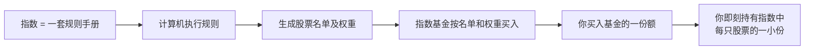
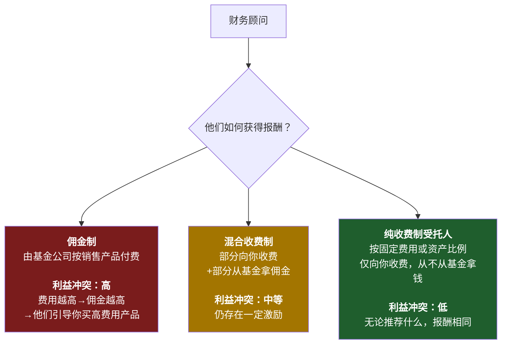
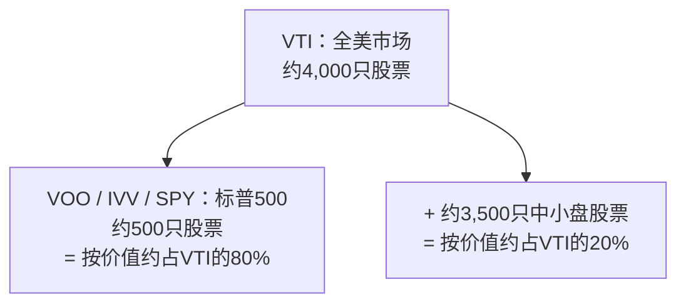
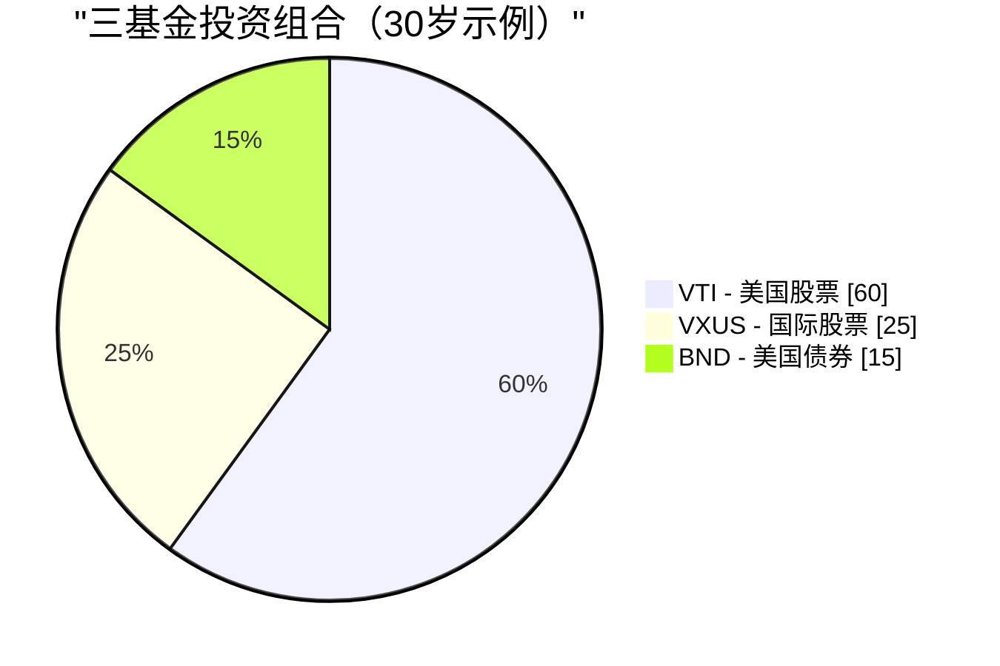

# 第二周：指数基金与交易所交易基金

动画参考：`animation/week02_active_vs_passive.py`

---

## 第一部分：阅读材料

---

### 1. 为什么这一课至关重要

上周我们揭示了一个残酷的真相：**通胀是重力，不投资才是最昂贵的选择。** 现在的问题是*怎么做*。而这个答案，投资行业花了四十年才肯承认：对几乎所有人来说，正确答案是**低成本指数基金或交易所交易基金。** 不是选股。不是你银行的"财富管理人"。不是你大舅哥的热门股票。不是保险代理人拼命向你兜售的结构化产品。

这是整门课程中最重要的一课，而且它真的很简单。如果你读完第二周就停下来，设置好每月自动定投一只宽基市场指数交易所交易基金，这辈子再也不读一本金融书，**你的投资回报依然会超过这个星球上绝大多数投资者——包括那些拿着百万薪酬管理他人资产的专业人士。**

这不是推销话术，而是过去四十年数据所揭示的事实：

- **在20年的时间跨度内，约90%的主动管理型美国大盘股基金跑输标普500** ——这一数据每年由标普道琼斯指数的SPIVA记分卡公布。
- **预测基金未来表现的最佳单一指标是费用率。** 不是基金经理的资历，不是品牌，不是过往业绩，而是费用。费用越低，平均而言未来收益越高。（晨星已在一项又一项研究中证实了这一点。）
- **沃伦·巴菲特——史上最著名的主动投资者——在遗嘱中指示，将妻子的遗产投入"一只极低成本的标普500指数基金"。** 如果在世最伟大的选股者都告诉自己的遗孀不要选股，这本身就是最大的信号。

因此本周我们将聚焦三件事。第一，指数基金究竟是什么，以及它如何诞生的那段近乎异端的历史。第二，金融行业将散户投资者与其财富分离的四种主要方式——高费用主动基金、佣金驱动的顾问、以保险包装的"投资"产品，以及缓慢吸血的传统共同基金——以及如何绕开每一道陷阱。第三，你真正需要的几个具体基金代码。

最后我还要留一个诚实的悬念：**指数基金的共识已经有效运行了四十年，但它并不是永久的保证。** 这一模式何时以及如何可能失效，以及届时你该怎么做，是我们在后续课程中要回来讨论的话题。现在，我们先打牢地基。进阶操作会在之后到来——是建立在这个地基*之上*，而不是取而代之。

> *"投资是必须的。本课程中的其他一切工具都只是锦上添花。"*

---

### 2. 核心知识

#### 2.1 什么是指数？

**指数**是一份按照特定规则筛选出来的股票（或其他资产）名单。没有人"管理"这份名单——它就是规则所规定的那个样子。标普500的定义是"满足特定流动性、盈利能力和上市标准、并按市值加权的500家最大美国公司"。这就是全部定义，一台电脑就能执行。

当新闻说*"今天市场涨了2%"*，他们几乎总是指标普500上涨了2%。

你将会听到的主要指数：

| 指数 | 跟踪对象 | 成分股数量 |
| --- | --- | --- |
| **标普500** | 500家最大美国公司 | 约500只 |
| **CRSP美国全市场指数** | 整个美国股票市场 | 约4,000只 |
| **道琼斯工业平均指数（DJIA）** | 30家大型美国公司（按股价加权，已属老古董） | 30只 |
| **纳斯达克综合指数** | 纳斯达克上市的所有股票 | 约3,000只 |
| **纳斯达克100指数** | 纳斯达克100家最大非金融股（科技股比重高） | 100只 |
| **罗素2000指数** | 2,000家美国小型公司 | 约2,000只 |
| **MSCI欧澳远东指数** | 美国和加拿大以外的发达市场 | 约800只 |
| **MSCI新兴市场指数** | 新兴市场国家 | 约1,400只 |
| **富时100指数** | 100家最大英国公司 | 100只 |

**大多数主要指数按市值加权。** 这意味着一家公司在指数中的权重与其总市值成正比。苹果公司约3万亿美元市值，在标普500中占约7%的权重；市值最小的成分股约100亿美元，占约0.02%。前10大公司通常占**整个指数的30%至35%。** 当你"买入标普500"时，你所获得的巨型股集中度，远比"500只股票"这个名字所暗示的要高得多。

这就是整个运作机制。它没有任何天才成分，这正是它有效的原因。

---

#### 2.2 指数基金——博格的异端思想

指数基金直到1976年才诞生。在此之前，美国所有共同基金都是主动管理型的：西装革履的聪明人选股，每年收取1%至2%的费用。当时的数学逻辑与今天相同——大多数基金经理跑输市场平均水平——但学术发现尚未转化为产品。

**将数学转化为产品的人是杰克·博格。** 博格于1974年被惠灵顿资产管理公司赶出门外。1975年，他创立了一家奇特的新基金公司，名叫**先锋集团（Vanguard）**，以互助制运营——由其自身的基金持有人所有，没有外部盈利动机。1976年，先锋推出了**第一指数投资信托**，即第一只面向散户的指数基金：它将按指数权重购入标普500中的全部500只股票，并收取极低的费用。

业界对此嗤之以鼻。媒体称之为**"博格的蠢事"**。券商拒绝销售（因为没有佣金可赚）。该基金首次公开发行时仅募集了1,100万美元——远低于博格原定的1.5亿美元目标。竞争对手称这个想法**"有悖美国精神"**，是**"平庸的保证书"**。

竞争对手说得对，这确实是平庸的保证——*如果平庸的定义是"市场平均水平减去几个基点的费用"的话。* 他们忽略的是，这个市场平均水平减去几个基点，在20年后能跑赢约90%的专业人士。

如今，先锋管理着超过**8万亿美元**的资产，指数基金与交易所交易基金合计在全球管理**逾20万亿美元**。博格的"蠢事"已成为全球散户股权投资的主流方式。博格本人于2019年辞世，而他从未像其他任何一家8万亿资产管理公司的创始人那样中饱私囊——先锋的互助制结构意味着节省下来的费用流回了基金持有人手中，而非流向他个人。在金融界，他是极少数真正当得起"英雄"二字（且无需加引号）的人。

> "不要去大海捞针，直接把整片海域买下来就好。" ——约翰·C·博格

---

#### 2.3 共同基金与交易所交易基金——为何共同基金仍然存在（以及为何你大多应该选择交易所交易基金）

**指数基金**是一种*策略*——跟踪指数。这种策略可以打包在两种不同的*形式*中：

- **共同基金**：每天按收盘净值定价和交易一次。
- **交易所交易基金（ETF）**：像股票一样在交易所实时交易。

| 特点 | 共同基金 | 交易所交易基金 |
| --- | --- | --- |
| 交易时间 | **每天仅一次**，按收盘净值 | **全天交易**，像股票一样 |
| 最低投资额 | 通常**1,000至3,000美元** | **一股的价格**（或碎股） |
| 税务效率（应税账户） | **较差**——资本利得分配强制摊派给所有持有人 | **较好**——实物赎回机制保护持有人 |
| 佣金 | 在基金自家券商处为$0 | 在大多数券商处为$0 |
| 便于自动定投 | **是**（可按金额、任意日期） | 有时较难（需整股，除非支持碎股） |

**在2026年，交易所交易基金在几乎所有重要维度上均优于共同基金**——更低的起投门槛、实时定价、大幅更优的税务效率、平均更低的费用率。以下两种情形共同基金仍有真实优势：

1. **401(k)及其他雇主养老金计划。** 大多数美国401(k)产品菜单仍以共同基金为主。计划管理员尚未完成切换，而你通常无法将自己选的交易所交易基金带入计划。在401(k)中，共同基金的税务问题基本不存在（账户本身享有税收优惠），因此这种形式的选择是被迫的，也无伤大雅。
2. **固定金额的自动定投。** 先锋共同基金允许你设置"每月1日投入500美元"，他们会精确执行，包括购买碎股。交易所交易基金的自动定投也存在，但取决于具体券商的支持程度。

**基本就这些了。** 在2026年的普通应税证券账户中，相同指数的交易所交易基金版本在成本和税后收益上，对几乎所有散户投资者而言都优于共同基金版本。**默认选交易所交易基金。** 如果你只能通过401(k)投资，共同基金也完全没问题——在菜单中选择成本最低的宽基指数基金，然后继续前进就好。

共同基金之所以仍然以如此巨大的规模存在，并不是因为它们*更好*，而是因为**数以万亿计的旧钱正躺在401(k)、IRA和旧证券账户里**，将其赎回会产生应税资本利得。是惰性在维系它们，而非优势。新投入的钱，几乎总应流向交易所交易基金。

---

#### 2.4 主动投资与被动投资——那个90%的统计数据

**主动投资**是指基金经理（或你自己）试图挑选出赢家股票，回避输家股票。研究、分析、频繁交易、押注判断。这是所有主动管理型共同基金和对冲基金的做法，也是他们向你收费的理由。

**被动投资**是指买入整个指数，接受平均水平。不做预测，不押注，不靠魅力。

正统的问题是*"主动基金经理能否跑赢指数？"* 标普道琼斯指数的SPIVA记分卡在过去二十多年里每年重复给出的正统答案是：**大多数情况下不能。** 时间跨度越长，结果越糟：

| 类别（美国） | 5年跑输比例 | 10年跑输比例 | 20年跑输比例 |
| --- | --- | --- | --- |
| **美国大盘股** | 78% | 85% | **90%** |
| **美国中盘股** | 74% | 83% | 89% |
| **美国小盘股** | 68% | 79% | 88% |
| **国际股票** | 71% | 82% | 87% |
| **新兴市场** | 69% | 80% | 85% |
| **美国投资级债券** | 72% | 81% | 86% |

*（数字来自近期SPIVA报告的近似值；具体数字每年略有波动，但定性规律始终如一。）*

> 换言之：每100位美国大盘股基金经理中，**90位在20年内输给了一台运行500只股票名单的电脑。**

更具杀伤力的后续：**赢了的那10位，下一个十年里并非还是同一批人。** 标普的持续性研究一再显示，五年内位于前四分之一的基金，在接下来五年里跌出前四分之一的概率远超留在其中。过去的超额收益并不预示未来的超额收益——每份基金招募说明书底部的那行警告是真实的，而大多数投资者视而不见。

主动基金经理整体上无法跑赢指数，有五个原因：

1. **费用。** 主动基金每年收取0.5%至1.5%。指数交易所交易基金收取0.03%。基金经理必须每年跑赢指数**超过整整一个百分点**，才能和低成本选项打平。
2. **交易成本。** 每一笔买卖都有摩擦——买卖价差、市场冲击、机构层面的佣金。高换手率策略不断失血。
3. **税务。** 高换手率在共同基金中引发资本利得分配，无论你是否卖出，当年均须纳税。
4. **市场基本有效。** 数以万计的专业人士在阅读同样的年报、同样的业绩说明会记录、同样的卫星数据。真正的信息优势极为罕见。
5. **幸存者偏差。** 业绩糟糕的基金会被悄悄关闭或并入其他基金。现存的"主动基金"全集看起来比实际要好，因为最惨的输家已被掩埋。

---

#### 2.5 费用率——你能掌控的最大杠杆

**费用率**是基金每年收取的管理费，每天从基金资产中自动扣除。你永远看不到账单，它只是悄悄体现为略低一点的收益率。

这种隐蔽性正是它作为财富榨取机制如此有效的关键所在。**1%的费用听起来微不足道，但三十年下来，它会吃掉你最终财富的约25%至30%。** 复利是双向的：它让你的钱增长，也让费用增长。

10万美元投资30年，假设年毛收益率为10%：

| 基金类型 | 费用率 | 净收益率 | 第30年末价值 | 相对指数基金损失 |
| --- | --- | --- | --- | --- |
| **指数交易所交易基金**（如VOO） | **0.03%** | 9.97% | **$1,721,686** | — |
| 低成本主动基金 | 0.50% | 9.50% | $1,526,688 | **−$194,998** |
| 平均水平主动基金 | 1.00% | 9.00% | $1,326,768 | **−$394,918** |
| 高成本主动基金 | 1.50% | 8.50% | $1,152,309 | **−$569,377** |
| 保险产品包装 | 2.00% | 8.00% | $1,006,266 | **−$715,420** |

请再读一遍最后一行。**2%的包装费，在10万美元的投资上，30年内让你损失逾70万美元。** 这不是一笔费用，这是一套房子——甚至可能是两套，取决于城市。这笔钱从你的退休储蓄流向了基金公司的薪资支出、营销预算、办公室租金和CEO薪酬。

**费用在每一种市场环境中都在复利累计。** 市场下跌30%的那一年，你仍须支付。基金经理跑赢指数0.4%的那一年，你仍欠它1.0%。费用是基金招募说明书上唯一有保障的数字。

还有两个行业宁愿你不去内化的事实：

- **在任何基金类别中，费用较低的基金平均优于费用较高的基金。** 这是基金研究中重复次数最多的发现——晨星已在各资产类别和各个十年中证实了这一点。某一类别中费用最低的基金，平均而言就是该类别中表现最好的基金。
- **费用是*有保障的*拖累，基金经理的超额表现是*寄予希望的*补偿。** 以确定性换取希望，在其他任何领域都被认为是一笔糟糕的交易。

---

#### 2.6 财务顾问陷阱

如果主动基金这么糟糕，为什么每家银行、每家券商、每个"财富管理"部门还在不断销售它们？因为**财务顾问的薪酬结构使得销售主动基金对顾问而言是理性的**，即便对你而言并非如此。

你会遇到三种薪酬模式：

**向任何顾问提出的最重要问题：*"你是受托人吗？你是纯收费制吗？"*** 受托人在*法律上*须以你的最大利益行事。非受托人销售人员只须推荐"合适"的产品——这是一个低得多的标准，在历史上允许了向任何有能力签字的人销售高费用垃圾产品。

你的银行"私人财富管理人"之所以如此热切地要把你塞进一只费用率1.5%、前端收费5%的主动基金，是因为银行两头都能拿钱：买入时收一笔前端费用，*并且*只要你持有，就能从持续的12b-1营销费用中抽成。**你不是他们的客户，你是他们的产品。** 基金公司付钱给他们，就是为了让你走进来。

对非受托顾问推销主动基金最直接的回应是：*"请以书面形式列明——费用率、销售费用、12b-1费用、顾问费、账户费——我持有这只基金十年的全部成本。同时列明贵公司从该基金家族获得的所有报酬。"* 如果他们拒绝或拖延，你就有了答案。

> **默认原则：** 除非你已拥有数百万美元资产且税务状况真正复杂，否则你几乎肯定不需要财务顾问。你需要的是一只交易所交易基金和一笔每月自动转账。

---

#### 2.7 保险"投资"几乎全是骗局

我想在这里说得异常直白。**变额万能寿险、指数型万能寿险、以"投资"名义销售的终身寿险、与股票挂钩的储蓄产品、面向散户销售的结构化年金——这些产品几乎无一例外，都是为了从不知情者身上榨取费用而设计的掠夺性产品。**

推销话术永远是以下几种组合：

- *"享受税收优惠的增值。"*
- *"本金保护。"*
- *"享受股市上涨，规避下跌风险。"*
- *"强制储蓄纪律。"*

而现实几乎总是：

- 前5至10年内退出，须支付**5%至10%的退保手续费**。
- **每年2%至4%的综合费用**，隐藏在晦涩的语言中（"身故及费用风险费"、"附加险费用"、"行政管理费"、"基金管理费"，层层叠加）。
- **扣费后的收益大幅落后于基本的交易所交易基金**——在市场给出8%至10%的情况下，实际净回报往往只有2%至4%。
- **代理人的佣金可高达你第一年缴费金额的80%至100%**，这正是这类产品被如此卖力推销的原因。

一条可以保护你一生的经验法则：

> **保险是为了转移风险，投资是为了创造财富。永远不要将二者混为一谈。**

如果你有抚养人，其经济状况会因你的去世受到严重影响，那么**请购买定期寿险**——纯粹、低价、固定期限的保障，不含任何投资成分。一名健康的30岁人士，购买一份20年、保额100万美元的定期寿险，每月保费大约只需25至35美元。然后将定期寿险保费与你原本打算购买的终身寿险保费之间的差额，**全部投入指数交易所交易基金。** 这是教科书级别的策略：**"购买定期险，投资差价。"** 在任何20年的时间跨度内，这种方式在扣除所有成本后的净资产积累上，都以数量级的差距胜过终身寿险保单——而且你对投资部分拥有完全的控制权和完全的流动性。

代理人会告诉你终身寿险"强制你储蓄"。你的证券账户自动每月定投也能做到同样的事，而那个方案不会给他们支付80%的佣金。

---

#### 2.8 诚实的反例——那些确实有效的主动基金

过去几节我一直在猛烈抨击主动管理。为了保持知识上的诚实，我必须明确说明：**确实有少数主动基金经理跑赢了指数，而且是决定性地、持续数十年地跑赢。** 数量不多，但足以值得一提。

值得关注的案例：

- **沃伦·巴菲特与查理·芒格掌舵下的伯克希尔·哈撒韦。** 从1965年至2020年代初，伯克希尔的账面价值复利增长率约为**每年20%**，而同期标普500约为10%——这是现代金融史上最令人印象深刻的长期记录。巴菲特是*某些*主动管理确实有效的教科书级证明。然而正是这位巴菲特，在遗嘱中指示妻子将遗产放入标普500指数基金。他是告诉你"你不是那个例外"的那个例外。
- **彼得·林奇 / 富达麦哲伦基金，1977至1990年。** 林奇执掌麦哲伦基金13年，年均回报约**29%**，在13年中的11年跑赢了标普500——这或许是有史以来最出色的共同基金业绩记录。他46岁退休。林奇离开后，麦哲伦基金的表现基本回落至跟踪指数的水平。
- **文艺复兴科技的大奖章基金，约1988年至今。** 一只高频量化、仅限员工参与的基金，据报道在三十余年里**在扣除5%管理费和44%业绩提成后**，仍实现了约40%的年化收益。大奖章基金自1993年起不再对外开放，而文艺复兴面向外部投资者的基金（RIEF、RIDA）表现则大相径庭——有时在大奖章盈利70%的年份亏损。**大奖章是真实、持久阿尔法存在的证明，同时也证明了：真正的阿尔法会被围墙圈起，永远不会流到你这里来。**
- **塞斯·卡拉曼的包浦集团。** 凭借坚守深度价值框架，并在没有符合标准的标的时持有极高比例的现金头寸，实现了数十年媲美股票的回报，同时结构性地低于市场波动性。卡拉曼的著作《安全边际》二手书售价逾1,000美元，因为他拒绝重印。
- **乔尔·格林布拉特在哥谭资本，1985至1994年。** 在一个规模较小的特殊情况投资组合上，十年内年均回报约50%，之后将外部资金返还。格林布拉特随后在《股市天才》和《股市稳赚》中公开了他的投资手册——他赌的是这套策略*规模太小、过程太难受、需要太有耐心*，以至于大多数读者根本无法真正执行。

请注意这个规律。过去数十年真正跑赢指数的基金，要么**对新资金关闭**（大奖章），要么**在巅峰期阶段性关闭**（麦哲伦），要么**本身就是独立运营的控股公司**（伯克希尔），要么**规模小到一旦扩张就会磨灭优势**（格林布拉特早年），要么**过度集中且需要承受多年回撤，而大多数投资者根本撑不住**（卡拉曼）。

这一教训不是*"主动管理永远无效"*，而是：**真正有效的主动投资策略，很少是你能从银行产品菜单上买到的那种。** 而你*能*从银行产品菜单上买到的主动基金，整体上正是SPIVA记分卡所追踪的、跑输指数的那90%。

如果你有时间、有心态，并且在市场某个特定角落拥有真正持久的信息优势，那尽管集中投入。大多数读者没有这些。**大多数读者应该用核心仓位做指数，把时间花在别处。**

---

#### 2.9 你真正需要的基金

你不需要背熟成千上万只交易所交易基金。你只需要这份简短的名单：

| 代码 | 基金 | 费用率 | 跟踪对象 |
| --- | --- | --- | --- |
| **VOO** | 先锋标普500交易所交易基金 | **0.03%** | 500家最大美国公司 |
| **VTI** | 先锋全美股票市场交易所交易基金 | **0.03%** | 整个美国市场（约4,000只股票） |
| **IVV** | iShares核心标普500交易所交易基金 | 0.03% | 标普500（贝莱德版的VOO） |
| **SPY** | 道富标普500交易所交易基金 | 0.09% | 标普500（历史更悠久，费用更高，交易员最爱） |
| **VXUS** | 先锋全球国际股票交易所交易基金 | 0.07% | 所有非美国发达市场+新兴市场 |
| **VT** | 先锋全球股票交易所交易基金 | 0.07% | 全球整体（美国+非美合二为一） |
| **BND** | 先锋全美债券市场交易所交易基金 | 0.03% | 美国投资级债券 |
| **QQQ** | 景顺纳斯达克100交易所交易基金 | 0.20% | 100家最大非金融纳斯达克股票（科技股偏重） |

**VOO vs VTI vs SPY** 是被问得最多的问题。简短回答：

- **VOO** 与 **IVV** 跟踪同一指数（标普500），费用相同（0.03%）。选哪个都行。
- **SPY** 同样跟踪标普500，但费率**是前者的3倍**（0.09%）。它的存在是因为它是美国第一只交易所交易基金（1993年），所以流动性最深——机构交易员在意这一点，长期投资者则不需要。**不要为你用不到的流动性多付3倍的费用。**
- **VTI** 持有整个美国市场（约4,000只股票），而非只是最大的500只。实际上，VOO和VTI的回报几乎完全相同，因为标普500*本就*约占美国总市值的80%。如果你想要一只基金且分散程度略高，选VTI；如果你想要一只基金且对应所有人都在讨论的那个指数，选VOO。**这两者之间没有错误答案。**

---

#### 2.10 如何实际买入

整个操作流程如下，只需15分钟：

1. **开立证券账户。** 美国居民：富达、嘉信理财或先锋——三家都免费，平台都靠谱。港澳台/新加坡居民：盈透证券（Interactive Brokers）是跨境购买美国挂牌交易所交易基金的标准低成本选择。
2. **关联银行账户并转账。** ACH转账需1至3个工作日。
3. **搜索代码。** 输入*"VOO"*，基金资料页面即出现。
4. **下达买入订单。** 市价单=按当前价格买入。输入股数或金额（大多数券商现在支持碎股）。
5. **设置每月自动定投。** 比如每月1日投入500美元，然后忘掉它。

就这些。**五步，十五分钟。你现在持有了美国500家最大公司的一小份。** 不需要看CNBC，不需要盯着持仓，不需要选股焦虑。

买入后你能做的最重要的事就是**关掉软件，别再盯着它。** 市场时刻在涨涨跌跌。每天关注价格波动是导致投资者行为失误的最大单一原因——恐慌抛售，狂热追涨。指数交易所交易基金策略中跑赢SPIVA的每一分钱，都来自*穿越*噪音的坚守，而非围绕它的反复交易。

---

#### 2.11 三基金投资组合

对大多数读者来说，博格风格的**三基金投资组合**就是完整的投资组合：

| 基金 | 代码 | 建议配置（30岁） |
| --- | --- | --- |
| 全美股票市场 | **VTI** | 60% |
| 全球国际股票 | **VXUS** | 25% |
| 全美债券市场 | **BND** | 15% |

债券仓位的大致**传统经验法则**：**债券比例 ≈ 你的年龄减20**，大致如此。30岁时债券约占10%至15%；65岁时约占45%至55%。教科书中的逻辑是：债券是*压舱石*——股票跌时它涨，降低投资组合波动性，并在你临近退休、无法等待十年恢复的阶段保护你免遭股票50%回撤的冲击。

> **有一个警示我必须提前告知你，即便是在这节基础课里：** 这套传统逻辑是建立在一个已经不复存在的世界之上的。
>
> "债券作为压舱石"的框架有两个假设：（a）债券提供高于通胀的实际收益率；（b）债券在股市下跌时上涨。**这两点在2020年代都已失效。** 在各国政府依赖货币印刷为巨额赤字融资（第一周第2.2节）、央行将实际利率长期压低于通胀率作为政策工具（"金融抑制"）的背景下，在通胀周期中持有长期债券基金并非压舱石——而是购买力的缓慢流失。2022年，股票和债券*同时*下跌约20%，这恰恰是含债券的60/40配置本应防范的情景。
>
> 因此，请将上表中的债券仓位视为**教科书式的起点，本课程的后续内容将对其发起挑战**。我们将在后面的课程中回到这一问题，探讨在货币大量印发的世界里，真正能充当压舱石的资产：
>
> - **第五周（债券）** 将深入解析债券的本质，以及历史上的对冲逻辑何时有效、何时失效。
> - **第六周（黄金与大宗商品）** 将介绍替代性的通胀对冲工具——黄金在人类历经的每一种货币制度中都是价值储存手段，2020年代的理由远比长期债券更充分。
> - **第四十七周（尾部风险对冲）** 与**第五阶段整体内容**将正式重建投资组合的安全侧，使用现金/短久期国债、黄金及其他货币金属，以及做多波动性期权结构的组合，而非传统的长久期债券配置。
>
> 对于你今天建立的基础投资组合而言，三基金模板完全没问题，远比不投资要好得多。**只需了解：债券仓位是这个投资组合中有效期最短的部分，我们会回来替换它。**

整个投资组合的综合加权费用率：**约每年0.04%。** 这意味着10,000元资产每年仅需支付约4元。涵盖全球主要资产类别，分散于全球。

---

#### 2.12 直到它失效——一个悬念

本章我一直在告诉你，指数交易所交易基金就是答案。最后，我想用一个让我成为诚实的老师而非推销员的前提来收尾。

**买入并持有被动指数的策略，在过去四十年——大约自1980年代初以来——表现极为出色。** 它之所以有效，是因为一系列特定条件同时存在：劳动年龄人口多于退休人口，每个发薪日机械式地买入；利率持续下行；美元储备货币地位；全球化；以及2008年以来，每当金融条件收紧过度，美联储都会持续出手干预。

**这些顺风没有一个是有保障能永远吹下去的。**

当人口结构转变到来——当婴儿潮一代从净买入者（积累期）转变为净卖出者（提取期）——同样驱动指数在过去四十年持续上涨的机械管道，可能会反向运转。被动基金并非自主运作，它们会对终端投资者究竟是在存入还是在取出做出反应。一个在上涨期由价格不敏感的资金流主导的市场，在下行期同样容易遭受价格不敏感的资金流冲击。

**这不是预测指数明天就会失效，而是诚实地承认：'它有效运行了四十年'并不等于'它会永远有效'。**

对于*你*，今天，正在建立第一个投资组合：**指数交易所交易基金就是正确答案。** 打好地基，开启每月自动定投，让它在你学完本课程其他内容的这几年里慢慢复利。

关于指数何时以及如何可能失效、以及届时你该向何处迁移的深入探讨，正是本课程余下内容所要构建的：

- **第二十三周（因子投资）** 介绍对纯市值加权指数的第一批替代方案——价值、动量、质量、低波动性等因子倾斜，这些在历史上捕捉了市值加权指数未能体现的收益。
- **第四十三周（主动投资组合管理）** 是对主动管理*何时*确实物有所值、何时并非如此的深度探讨。
- **第五阶段（第四十七至五十二周）** 将正式构建"杠铃型"投资组合——一端是高确信度的安全资产，另一端是不对称的投机敞口，广泛市值加权的核心被*有意移除*。这是进阶形态，建立在第二至四十六周所有内容之上。

现在：**投资是必须的，交易所交易基金是地基，本课程中的其他一切都是建立在此之上的锦上添花。** 如果你跑不赢指数——大多数人在大多数时候都做不到——那么不要浪费生命去尝试。让指数完成工作，把你的时间用在能在你生命中而非电子表格中复利增长的事情上。

但请明白，"买入并持有指数"是一种依赖特定时代背景的策略，它在特定的四十年窗口期内有效运行。我们会回来探讨那个窗口关闭之后的应对之道。就目前而言，地基已经足够。

---

### 3. 常见误解

**误解一："指数基金只是初学者用的。"**

主权财富基金、大学捐赠基金、养老金基金和亿万富翁都在使用指数基金和交易所交易基金。CalPERS——全球最大的养老金基金之一——运行着庞大的指数基金委托。沃伦·巴菲特，这位*史上最著名的*主动投资者，于2008至2017年公开打赌100万美元，豪赌一只标普500指数基金能跑赢一篮子精选对冲基金，并以决定性优势赢得了赌局。指数化不是初学者的选项，而是经过理性选择、恰好也是最简单的那个选项。

**误解二："一分钱一分货——费用越高代表管理水平越高。"**

在几乎所有其他消费领域，这条规律是成立的。但在投资领域，**这种关系恰好相反。** 晨星已在各资产类别和各个十年中证明，**费用率是预测基金未来表现的最佳单一指标**——优于过往业绩、优于星级评定、优于基金经理任职年限。费用越高，预期未来收益越低。费用最低的基金，平均而言就是表现最好的基金。

**误解三："但我的财务顾问推荐了一只主动基金。"**

许多财务顾问销售特定基金是有佣金的——有时是明摆着的，更多时候则藏在你永远看不到的不透明分成安排中。他们的激励机制是推荐*对他们*支付最高的产品，而非*让你*复利增长最快的产品。**务必发问："你是纯收费制受托人吗？你从任何推荐产品中获得的全部报酬是什么？"** 如果答案是否定的，或者他们无法或不愿以书面形式回答，请离开。

**误解四："指数基金无法在市场下跌时保护你。"**

是的，无法。它们本来就不应该做到这一点。指数在市场下跌时同步下跌。相关的比较不是"指数vs现金"，而是"指数vs主动基金"。2008年，标普500下跌约37%；同期平均主动管理型美国股票基金下跌约39%。主动基金经理没有在下跌中保护你，他们平均而言让情况略微更糟。**在市场下跌中的保护来自你的*资产配置*（股票、债券、现金各占多少比例）和你的行为（不要恐慌抛售），而不是来自基金的选择。**

**误解五："我应该选过去五年表现最好的基金。"**

这是散户投资者最常犯、代价最惨重的错误。**表现出色的基金会回归均值。** 标普的持续性研究已在十年又十年的数据中反复表明，排在前四分之一的基金，在接下来五年内继续留在前四分之一的概率不足十分之一。过去业绩不预测未来业绩；每份基金招募说明书底部的那条警示不是法律套话，而是真实的陈述，只是每个人都在无视它。追逐过去的赢家，在预期上甚至*比随机选择还要糟糕*。

**误解六："SPY和VOO跟踪同一个指数，买哪个无所谓。"**

它们跟踪同一指数，但费用不同。SPY收取0.09%，VOO收取0.03%。对一个持有50万美元、持有30年的投资者来说，这0.06%的差距复利下来约等于**逾25,000美元的损失财富。** SPY唯一的结构性优势在于其交易流动性，这仅对移动大额资金的机构或日内交易者有意义——对买入持有的投资者没有任何意义。**对长期持有者而言，VOO或IVV在成本上始终优于SPY。**

**误解七："我需要配置很多不同的指数基金来分散投资。"**

像VTI这样的全市场基金已经持有约4,000只股票。加上VXUS，又增加了约7,000只国际股票。**两只交易所交易基金，约1.1万只股票，覆盖全球所有主要经济体——在股票层面已无更多分散的余地。** 持有10只以上的指数交易所交易基金，通常只是造成重叠（同一个苹果、微软和英伟达以不同权重出现在多只基金中）以及对分散投资的虚假感知。两到三只基金已经足够，超过五只通常是困惑的表现，而非复杂的体现。

**误解八："指数基金很危险，因为你无法回避烂公司。"**

指数基金确实持有最终破产的公司。2001年安然公司崩塌时，它在标普500中占约0.7%的权重——抽象来看很痛，但对投资组合而言无关痛痒。其他499家公司继续复利增长。**指数内部的分散——数百甚至数千只股票，没有一只单独大到足以毁掉你——才是保护。** 一个碰巧重仓安然的集中型选股者，在那只股票上损失了一切。持有指数的投资者损失了0.7%。

**误解九："终身寿险是好的投资，因为现金价值增值可以免税。"**

并不是，而现金价值的推销话术恰恰是这类产品的销售逻辑所在。终身寿险现金价值的真实收益，在扣除代理人佣金、退保手续费时间表和层层叠加的年度费用后，通常只有**净收益2%至4%**，而同期指数交易所交易基金会带来7%至10%。**为真正需要的死亡保障购买定期寿险，然后将定期保险保费与终身寿险保费之间的差额投入指数交易所交易基金。** 这就是教科书式的"购买定期险、投资差价"策略。它在几乎所有现实情景中都赢得了这场比较；代理人之所以绝口不提，正是因为他们无法从中拿到佣金。

---

### 4. 问答

**Q1：交易所交易基金究竟是什么，它和股票有什么区别？**

**交易所交易基金（ETF）** 是将一篮子证券打包成一种工具，像股票一样在交易所上市交易。买入VOO的一份额，就意味着你按比例持有了标普500中所有500家公司的一小份。**股票代表一家公司；交易所交易基金代表一个定义好的篮子。** 交易机制相同——股票代码、实时价格、在交易时段内买卖——但你获得了即时的分散投资。

**Q2：VOO、VTI还是SPY——选哪个？**

用于长期买入持有：**VOO或VTI**，费用均为0.03%。VOO=标普500（约500只股票）；VTI=整个美国市场（约4,000只股票）。由于标普500按价值约占美国市场的80%，两者表现几乎相同。选哪个都行。**SPY是给交易员的，不是给投资者的**——与VOO相同的敞口，费用是VOO的3倍。

**Q3：我的投资组合中应该有多少比例配置指数交易所交易基金？**

对于大多数20至40岁正在建立第一个投资组合的读者：**股票仓位的80%至100%** 配置于宽基指数交易所交易基金。股票与"安全资产"的具体比例取决于年龄和风险承受能力：

| 年龄 | 股票比例 | 安全资产比例 |
| --- | --- | --- |
| 20–35岁 | 80–90% | 10–20% |
| 35–50岁 | 70–80% | 20–30% |
| 50–65岁 | 50–70% | 30–50% |
| 退休后 | 30–50% | 50–70% |

**关于"安全资产"而非"债券"的说明：** 历史上股票仓位的压舱石是债券配置，这建立在债券与股市呈负相关的假设之上。如第2.11节所指出，该假设在2020年代已经失效——2022年股票和债券同步下跌，债券在金融抑制下也不再提供高于通胀的实际收益率。**因此"安全资产"仓位应理解为一篮子与股市不相关（或负相关）的资产，而不仅仅是债券。** 传统债券配置是其中一部分，但现代安全资产篮子还包括：短久期国债和现金等价物、黄金及其他货币金属（第六周），以及在更进阶阶段——做多波动性期权结构和尾部对冲覆盖（第四十七周，第五阶段）。对于你今天建立的第一个投资组合，像BND这样的宽基债券交易所交易基金是合理的起点；本课程余下的内容，就是引导你如何随着学习深入而替换和补充它。

在股票配置内部，常见的大致比例是约70%美国股票（VTI）和约30%国际股票（VXUS）。

**Q4：费用率与销售费用有什么区别？**

**费用率**是每年收取的管理费，每天从基金资产中扣除。10,000元的0.03%=3元/年。**销售费用**是买入时（前端收费）或卖出时（后端收费）一次性收取的佣金。5%的前端收费意味着在10,000元的买入中，500元立即消失，只有9,500元真正得到投资。**现代指数交易所交易基金的销售费用为零。** 任何你正在考虑的、确实收取销售费用的基金，几乎无一例外不值得购买。

**Q5：如果90%的主动基金经理跑输指数，为何主动基金仍然存在？**

因为它们对基金公司而言**利润极为丰厚。** 一只100亿美元的基金，收取1%的费用率，每年稳稳赚进1亿美元的管理费，与业绩无关。投资者跑输指数对投资者而言是糟糕的交易，但对基金公司而言是出色的经常性收益业务。再加上购买CNBC播出时段的营销预算、分销基金的银行网点、拿钱销售的财务顾问，以及相信那个能言善道的基金经理可以跑赢平均水平的投资者心理——**主动基金行业之所以长盛不衰，是因为它让价值链上的每一个人都赚到了钱，除了你。**

**Q6：指数基金能归零吗？**

理论上，只有当指数中的每一家公司同时破产才会发生——而那意味着整个美国经济已经崩溃，届时任何金融资产的价值都是次要问题。实际上，历史上最严重的宽基指数回撤（1929至1932年、2007至2009年、2020年新冠疫情闪崩）从峰值到谷底下跌了50%至80%，并在十年内恢复并创下历史新高。**一只个股绝对可以归零，也确实有很多已经归零了。宽基指数在实践中几乎不可能归零。** 这种不对称性正是分散投资有效的全部原因。

**Q7：我也应该持有国际指数基金吗？**

大多数合理的资产配置都包含一定的国际敞口。按市值计算，美国约占全球股票市场的60%；其余40%分布在欧洲、日本、新兴市场及其他地区。国际分散投资能降低投资组合波动性，因为不同地区的市场并不完全同步运动。**VXUS**（先锋全球国际股票交易所交易基金）费用率0.07%，涵盖发达市场和新兴市场约7,000只股票。常见的大致比例是**70%美国（VTI），30%国际（VXUS）**。

**Q8：什么是定投，我应该用定投的方式买入指数交易所交易基金吗？**

**定投（DCA）** = 无论价格如何，定期投入固定金额。每月500元，每月定投，不管市场怎么走。当价格低时，500元买入更多份额；当价格高时，500元买入更少份额。结果是在此期间平均成本略低于简单的市场平均价格，更重要的是获得了行为上的好处：**你会在那些令人恐惧的月份继续投入，而不是等待一个感觉永远不会"对"的最佳时机。** 对于用工资收入投资的人，定投自然而然地发生。对于持有一笔闲置资金的人，学术文献结论不一——历史上一次性投入平均略优于定投（因为市场大多数时候在上涨），但定投在心理上更容易坚持。

**Q9：指数基金发放股息吗？**

是的。指数中的公司向基金支付股息，基金收集后每季度转付给股东。VOO目前的股息收益率约为1.3%至1.5%。大多数券商允许你开启**股息再投资计划（DRIP）**，自动将每次股息用于购买同一基金的更多份额。数十年下来，**再投资的股息在股票总收益中贡献了相当大的比例**——默认开启股息再投资计划。

**Q10：我听说过"聪明贝塔"或"因子"交易所交易基金——它们和指数基金一样吗？**

不完全一样。传统指数基金采用**按市值加权**（公司越大，指数权重越大）。**聪明贝塔**或**因子**交易所交易基金仍然基于规则、系统性再平衡——因此类似于指数基金——但它们按除市值以外的某种因子加权：价值（基本面便宜）、动量（近期强势股）、质量（资产负债表干净）、低波动性（走势平稳的股票）、小盘规模等。费用率高于普通指数基金（通常为0.10%至0.40%），因为再平衡规则更复杂，但仍比主动基金便宜得多。**因子投资是一个实质性的话题，我们将在第二十三周深入探讨。** 但对于你的第一个投资组合，纯市值加权指数交易所交易基金是正确的起点。

**Q11：我应该在指数交易所交易基金之外持有个股吗？**

如果你在某家公司或某个行业确实拥有持久的信息优势——来自本职工作的专业知识、对你所处行业的结构性洞察——那么**在宽基指数核心之外配置一小部分个股是合理的。** 常见的形态是80%至90%的资产配置宽基指数交易所交易基金，10%至20%配置高确信度的个股。**你不应该做的是**：因为在社交媒体上看到一条股票消息、因为品牌熟悉、或因为它刚刚涨了一个月而去买个股。SPIVA的90%统计数据在散户个股投资者身上的打击远比在专业基金经理身上更为残酷——大多数散户个股投资组合都明显*跑输*他们本可以直接买入的那个指数。如果你无法用一句话说清楚为什么某只股票相对其基本面被低估了，你就没有信息优势——你只有一个观点。持有观点本身没有任何问题，只是不要把它当成优势来定仓。

**Q12：我一直听说指数"过度集中于科技巨头"——这是个问题吗？**

这是一个真实的现象。2026年，标普500前10大持仓（主要是巨型科技股——苹果、微软、英伟达、谷歌母公司Alphabet、亚马逊、Meta等）约占整个指数按价值计算的**30%至35%。** 购买VOO的集中度，远比"500只股票"这个名字所暗示的要高。这是否构成*问题*，取决于你对这些公司的判断。持仓更分散的VTI集中度略低（因为它将前10大持仓稀释在约4,000只股票中），而明确等权重的标普500交易所交易基金（RSP，费用率约0.20%）则走向另一个极端——同样500只股票，但均等权重。**目前，市值加权指数仍然是最简单、历史上表现最佳的默认选项。** 这一集中度问题及其风险含义，正是我们在第二十三周及之后的内容中要培养的那种具备时代判断力的思维方式。

---

## 第二部分：YouTube视频脚本

---

**视频标题：** 这一只交易所交易基金跑赢华尔街90%的人 | 第二周

**目标时长：** 约30分钟

**主持人：**
- **陳馬**（导师）：经验丰富的散户投资者，以第一人称分享数十年自主管理投资组合的经验
- **小魚**（学生）：刚毕业的大学生，正在学习如何投资自己的积蓄，代替观众提问

---

**[片头 / 第0段：承诺]**

[VISUAL: Cold-open title card -- "70万美元。这是你的费用让你损失的钱。"]

[ANIMATION: Hundreds of stock tickers swirling chaotically, then being swept into
a single basket labeled "一只交易所交易基金". A subtitle fades in: "它跑赢了
90%的专业人士。"]

**陳馬：** 如果你看完这一个视频，这辈子在财务方面什么其他事都不做——不读书、不听播客、不用任何选股软件——你的投资回报依然会超过华尔街几乎所有的专业基金经理。

**小魚：** 这话说得挺大的。

**陳馬：** 这不是我的说法，而是四十年来数据所揭示的事实。答案是一只低成本宽基市场指数交易所交易基金。不是你银行的财富管理人，不是你大舅哥的热门股票，不是保险代理人拼命向你推销的结构化产品。

**小魚：** 然而几乎没有人真的这样做。

**陳馬：** 因为有一个规模达数十万亿美元的行业，它的薪水来自于你*不*这样做。今天我要向你展示我自己投资组合的地基——然后，在最后，我会告诉你一件诚实的事，这是这个领域里没有其他人愿意承认的：这套策略有效运行了四十年，它并不是永久的保证。

**小魚：** 悬念留下了。那我们从基础开始。

[VISUAL: Title card -- "1. 什么是指数？"]

---

**[第1段：什么是指数？]**

**陳馬：** 在讲基金之前，我们必须先定义指数。指数就是一份按照一套规则筛选出来的股票名单，没有人来管理它。标普500的定义是"满足特定流动性和上市规则、按市值加权的500家最大美国公司"，这就是全部定义，一台电脑就能执行。

**小魚：** 当新闻说"市场今天涨了2%"，他们说的就是标普500。

**陳馬：** 几乎总是如此。标普500是美国的头条指数，代表着美国总市值的约80%。

[VISUAL: Quick table flashes the major indices -- 标普500, CRSP美国全市场指数,
道琼斯工业平均指数（30只成分股，按股价加权，"已属老古董"），纳斯达克综合指数，纳斯达克100指数，
罗素2000指数, MSCI欧澳远东指数, MSCI新兴市场指数, 富时100指数.]

**小魚：** 这五百只股票的权重是相等的吗？

**陳馬：** 不是，而这正是大多数人忽略的关键。标普500按市值加权。苹果公司市值约3万亿美元，在指数中占约7%的权重；市值最小的成分股约100亿美元，占约0.02%。

[ANIMATION: Bar chart, top of week02_active_vs_passive.py -- 苹果 ~7%,
微软 ~6.5%, descending to a tiny sliver at the right end.]

**陳馬：** 而前10大公司——苹果、微软、英伟达、Alphabet、亚马逊、Meta等——合计占据整个指数约30%至35%的权重。

**小魚：** 所以当我"买入标普500"，我其实是在买一个集中的巨型股仓位。

**陳馬：** 远比"500只股票"这个名字暗示的要集中得多。记住这一点，我们后面的课程会回到它。

[VISUAL: Title card -- "2. 博格的异端思想"]

---

**[第2段：博格的异端思想]**

**陳馬：** 指数基金直到1976年才诞生。在那之前，美国所有共同基金都是主动管理的——西装革履的聪明人选股，每年收取1%至2%的费用。当时的数学逻辑和今天一样：大多数人跑输市场平均水平。学术发现早就有了，但还没有人把它包装成产品。

**小魚：** 直到有人做到了。

**陳馬：** 这个人叫杰克·博格。博格于1974年被惠灵顿资产管理公司扫地出门。1975年，他创立了一家奇特的新基金公司，名叫先锋集团，以互助制运营——由基金持有人本身所有，没有外部盈利动机。1976年，先锋推出了第一指数投资信托——它将按指数权重持有全部500只标普500成分股，并收取极低的费用。

**小魚：** 华尔街是什么反应？

**陳馬：** 华尔街嗤之以鼻。媒体称之为"博格的蠢事"。券商拒绝销售，因为没有佣金可赚。这只基金在首次公开发行时仅募集了1,100万美元——远低于博格设定的1.5亿美元目标。竞争对手称这个想法"有悖美国精神"，是"平庸的保证书"。

**小魚：** 而今天呢？

[VISUAL: Bold text card -- "先锋集团今日：8万亿美元。指数交易所交易基金合计：20万亿美元。"
博格照片，生卒年1929-2019。]

**陳馬：** 先锋管理着超过8万亿美元的资产。指数基金与交易所交易基金合计超过20万亿美元，遍布全球。博格的"蠢事"已成为全球散户股权投资的主流方式。而让他成为我心目中英雄的正是这件事：由于先锋的互助制结构，节省下来的钱流回了基金持有人手中，而非流向他本人。其他任何一家规模达8万亿美元的资产管理公司创始人早已跻身福布斯富豪榜。博格没有，他于2019年辞世。

**小魚：** 一个没有靠金融中饱私囊的金融英雄，这份名单很短。

**陳馬：** 短到只有一个人。他自己说得最好：*"不要去大海捞针，直接把整片海域买下来就好。"*

[VISUAL: Title card -- "3. 共同基金 vs 交易所交易基金"]

---

**[第3段：共同基金 vs 交易所交易基金]**

**陳馬：** 快速区分一下形式，因为很多人容易搞混。指数基金是一种*策略*——跟踪指数。这种策略可以打包在两种不同的*形式*中：共同基金，每天按收盘净值定价和交易一次；或者交易所交易基金，像股票一样在交易所实时交易。

[VISUAL: Side-by-side comparison table -- 共同基金 vs 交易所交易基金，比较五个维度：
交易时间、最低投资额、税务效率、佣金、自动定投。]

**小魚：** 哪个赢？

**陳馬：** 在2026年的普通应税证券账户中，交易所交易基金在几乎所有重要维度上都胜出——更低的起投门槛、实时定价、由实物赎回机制带来的大幅更优的税务效率、平均更低的费用率。共同基金真正胜出的地方只有两个：一是在401(k)里，产品菜单是强制的，税务问题基本不存在；二是固定金额的自动定投，先锋共同基金在这方面做得很好。

**小魚：** 那为什么共同基金还到处都是？

**陳馬：** 惰性。数以万亿计的旧钱躺在401(k)、IRA和旧证券账户里，赎回会产生巨额应税资本利得。它们持续存在，是因为转出代价高昂，而不是因为它们更好。**新投入的钱，几乎总应流向交易所交易基金。**

[VISUAL: Title card -- "4. 主动 vs 被动——那个90%的统计数据"]

---

**[第4段：主动 vs 被动——那个90%的统计数据]**

**陳馬：** 核心数据来了。标普道琼斯指数每年发布SPIVA记分卡。在20年的时间跨度内，**约90%的美国大盘股基金经理跑输了标普500。**

[ANIMATION: image/week02_spiva.png animated in -- 柱形图逐渐升高，5年78%，
10年85%，20年90%。底部类别依次滚动：美国大盘股、中盘股、小盘股、国际、新兴市场、投资级债券。]

**小魚：** 100人里90人。带着分析师团队和金融学博士学位。输给了一份名单。

**陳馬：** 而更具杀伤力的后续是：赢了的那10人，下一个十年并非还是同一批人。标普的持续性研究一再表明，在五年内排在前四分之一的基金，在接下来五年里跌出前四分之一的概率远超留在其中。过去业绩不预测未来业绩，每份基金招募说明书底部的那条警告是真实的。

**小魚：** 那为什么他们赢不了？他们显然很聪明。

**陳馬：** 五个原因，而且是结构性的——与努力程度无关。

[VISUAL: 五张卡片逐一堆叠出现，随陳馬逐一列举。]

**陳馬：** 第一——费用。主动基金每年收取0.5%至1.5%。指数交易所交易基金收取0.03%。基金经理必须每年跑赢指数超过整整一个百分点，才能和低成本选项打平。第二——交易成本。买卖价差、市场冲击、机构佣金，高换手率策略不断失血。第三——税务。高换手率在共同基金中引发资本利得分配，无论你是否卖出都须当年纳税。第四——市场基本有效。数以万计的专业人士在阅读同样的年报、同样的业绩说明会记录、同样的卫星数据，真正的信息优势极为罕见。第五——幸存者偏差。业绩糟糕的基金会被悄悄关闭或并入其他基金，现存的"主动基金"全集看起来比实际要好，因为最惨的输家已经被掩埋了。

**小魚：** 换言之：每100位专业选股手，20年内90人输给了一台运行500只股票名单的电脑。

**陳馬：** 对，20年内。

[VISUAL: Title card -- "5. 费用率——那张70万美元的账单"]

---

**[第5段：费用率——那张70万美元的账单]**

**陳馬：** 现在我要让费用这个问题变得无法忽视。设想你在30岁时投入10万美元，每年毛收益率10%，持续30年。唯一变化的是费用。

[ANIMATION: image/week02_expense_drag.png animated in -- 五条财富曲线在30年间逐渐分叉。
费用率0.03%的指数交易所交易基金在最上方，然后依次是0.50%、1.00%、1.50%，
保险产品包装的2.00%在最下方。]

[VISUAL: 最终价值卡片逐一砸入屏幕：
0.03% -> $1,721,686
0.50% -> $1,526,688
1.00% -> $1,326,768
1.50% -> $1,152,309
2.00% -> $1,006,266
"-$715,420" 在最后一行用红色高亮显示。]

**陳馬：** 看最后一行。**2%的包装费，在10万美元的投资上，30年内让你损失逾70万美元。** 这不是一笔费用，这是一套房子，甚至可能是两套，取决于城市。

**小魚：** 那笔钱流向了——

**陳馬：** 基金公司的薪资支出、营销预算、办公室租金、CEO薪酬包。这是从你的退休储蓄里转走的钱。

**小魚：** 那市场下跌的年份呢？

**陳馬：** 你仍须支付。市场下跌30%的那年，你照付。基金经理跑赢指数0.5%的那年，你仍欠它1%或2%。**费用是基金招募说明书上唯一有保障的数字。**

**小魚：** 那低费用基金的数据呢？

**陳馬：** 晨星已在各资产类别和各个十年中证实了这一点。在任何基金类别中，**费用最低的基金，平均而言就是该类别中表现最好的基金。** 费用越低，预期未来收益越高。这是基金研究中被重复次数最多的发现。大多数消费者的本能是"一分钱一分货"，但在基金领域，这个关系恰好是反的。

[VISUAL: Title card -- "6. 财务顾问陷阱"]

---

**[第6段：财务顾问陷阱]**

**陳馬：** 如果主动基金这么糟糕，为什么每家银行、每家券商、每个"财富管理"部门还在不断销售它们？因为顾问的薪酬结构使得销售主动基金对*顾问*而言是理性的——即便对你而言并非如此。

[ANIMATION: 三个方框依次出现——佣金制（红色）、混合收费制（橙色）、纯收费制受托人（绿色）。]

**陳馬：** 三种薪酬模式。佣金制——顾问按销售的每款产品从基金公司获得报酬，利益冲突：高。费用越高，佣金越高，他们就越会引导你买高费用产品。混合收费制——部分向你收费，部分从基金拿佣金，利益冲突：中等。纯收费制受托人——按固定费用或资产比例，仅从你这里收费，从不从基金公司拿钱，利益冲突：低，无论推荐什么产品，报酬相同。

**小魚：** 那么有一个问题可以一剑穿心？

**陳馬：** **一个问题，背下来，向每一个坐在你对面的顾问提问："你是受托人吗？你是纯收费制吗？"** 受托人在*法律上*须以你的最大利益行事。非受托人销售人员只须推荐"合适"的产品——这是一个低得多的标准，在历史上允许了向任何有能力签字的人销售高费用垃圾产品。

**小魚：** 那银行的"私人财富管理人"呢？

**陳馬：** 两头都拿钱。银行在你买入时收一笔前端费用，*并且*只要你持有，就从持续的12b-1营销费用中抽成。**你不是他们的客户，你是他们的产品。** 基金公司付钱给他们，就是为了把你引进来。

**小魚：** 如果我真的想对那些顾问说不，该怎么做？

**陳馬：** 这样说，要求以书面形式回应：*"请列明我持有这只基金十年的全部成本——费用率、销售费用、12b-1费用、顾问费、账户费，一分不差。同时请列明贵公司从该基金家族获得的所有报酬。"* 如果他们拒绝或拖延，你就有了答案。

**小魚：** 那对我们普通人来说，默认原则是什么？

**陳馬：** 除非你已经拥有数百万元资产且税务状况真正复杂，否则你几乎肯定不需要财务顾问。**你需要的是一只交易所交易基金和一笔每月自动转账。**

[VISUAL: Title card -- "7. 保险'投资'几乎全是骗局"]

---

**[第7段：保险"投资"几乎全是骗局]**

**陳馬：** 我想在这里说得异常直白。变额万能寿险、指数型万能寿险、以"投资"名义销售的终身寿险、与股票挂钩的储蓄产品、面向散户销售的结构化年金。**几乎无一例外，这些都是为了从不知情者身上榨取费用而设计的掠夺性产品。**

**小魚：** 这话说得很重。

**陳馬：** 但这是真话。推销话术永远是那几种组合——税收优惠增值、本金保护、享受股市上涨规避下跌、强制储蓄纪律。现实也永远是那几种组合。

[VISUAL: 四张红色子弹卡片逐一砸入屏幕。]

**陳馬：** 前5到10年退出，须支付5%至10%的退保手续费。每年2%至4%的综合费用，藏在晦涩的语言中——"身故及费用风险费"、"附加险费用"、"行政管理费"、"基金管理费"，层层叠加。扣费后的净回报远落后于基本的交易所交易基金——在市场给出8%至10%的情况下，往往只剩2%至4%。而且——这才是关键——代理人佣金可高达**你第一年缴费金额的80%至100%**，这正是这类产品被如此卖力推销的原因。

**小魚：** 那原则是什么？

**陳馬：** 一句话，贴在墙上：**"保险是为了转移风险，投资是为了创造财富，永远不要将二者混为一谈。"**

**小魚：** 那真的需要寿险保障的人怎么办？

**陳馬：** 如果你有抚养人，其经济状况会因你的离世受到严重影响，那么**买定期寿险。** 纯粹、低价、固定期限的保障，不含任何投资成分。一名健康的30岁人士，购买一份20年、保额100万美元的定期寿险，每月保费大约只需25至35美元。

[ANIMATION: image/week02_buy_term_invest_difference.png -- 20年内两条财富曲线。
终身寿险现金价值爬行于底部。"定期险+交易所交易基金"曲线高出数倍。]

**陳馬：** 然后将定期保险保费与终身寿险保费之间的差额，全部投入指数交易所交易基金。**这是教科书级别的策略：购买定期险，投资差价。** 在任何20年时间跨度内，它在扣除所有成本后的净资产积累上，都以数量级的差距胜过终身寿险保单。

**小魚：** 代理人的回应永远是——

**陳馬：** "终身寿险强制你储蓄。"你证券账户的每月自动定投同样能做到，而且那个方案不会给他们支付80%的佣金。

[VISUAL: Title card -- "8. 诚实的反例"]

---

**[第8段：诚实的反例——那些确实有效的主动基金]**

**陳馬：** 过去几段我一直在猛烈批评主动管理。为了保持知识上的诚实，我必须明确说明：**确实有少数主动基金经理跑赢了指数，而且是决定性地、持续数十年地跑赢。** 数量不多，但足以值得一提。

[VISUAL: 随陳馬讲述，五张人名卡片逐一出现。]

**陳馬：** 巴菲特与芒格掌舵下的伯克希尔·哈撒韦——从1965年至2020年代初，年复合增长率约20%，相比标普500的约10%。这是*某些*主动管理确实有效的教科书级证明。但同样是这位巴菲特，在遗嘱中指示妻子将遗产放入低成本标普500指数基金。他是告诉你"你不是那个例外"的那个例外。

**陳馬：** 彼得·林奇在富达麦哲伦基金，1977至1990年——约29%的年均回报，持续13年。46岁退休。林奇离开后，麦哲伦基本回落至跟踪指数的水平。

**陳馬：** 文艺复兴科技的大奖章基金——据报道，在**扣除5%管理费和44%业绩提成后**，三十余年来年化收益约40%。而且——**大奖章基金自1993年起已停止接受外部投资者。** 文艺复兴面向外部投资者的基金，有时在大奖章盈利70%的年份亏损。大奖章是真实阿尔法存在的证明，同时也证明了：真正的阿尔法会被围墙圈起，永远不会流到你这里来。

**陳馬：** 塞斯·卡拉曼的包浦集团——凭借坚守深度价值、在没有合适标的时持有巨额现金，实现了数十年媲美股票的回报，同时结构性地波动更低。他的著作《安全边际》二手书售价逾1,000美元，因为他拒绝重印。

**陳馬：** 乔尔·格林布拉特的哥谭资本，1985至1994年——在规模较小的特殊情况投资组合上，十年年均回报约50%，然后将外部资金返还。格林布拉特后来在两本书中公开了他的投资手册，赌的是这套策略*规模太小、过程太难受、需要太有耐心*，以至于大多数读者根本无法真正执行。

**小魚：** 有什么规律？

**陳馬：** 很清晰的规律。数十年来真正跑赢指数的基金，要么对新资金关闭（大奖章），要么在巅峰期阶段性关闭（麦哲伦），要么本身就是独立运营的控股公司（伯克希尔），要么规模小到一旦扩张就会磨灭优势（格林布拉特早年），要么过度集中、需要熬过散户根本撑不住的漫长回撤（卡拉曼）。

**小魚：** 所以教训不是"主动管理永远无效"。

**陳馬：** 教训是：**真正有效的主动投资策略，很少是你能从银行产品菜单上买到的那种。** 而你*能*从银行产品菜单上买到的主动基金，整体上正是SPIVA记分卡所追踪的、跑输指数的那90%。

[VISUAL: Title card -- "9. 你真正需要的基金"]

---

**[第9段：你真正需要的基金]**

**陳馬：** 你不需要背熟成千上万只交易所交易基金，你只需要这份简短的名单。

[VISUAL: 简洁的代码表格 -- VOO、VTI、IVV、SPY、VXUS、VT、BND、QQQ，
附费用率和一行简介。]

**陳馬：** 美国大盘股：VOO和IVV都跟踪标普500，费用率均为0.03%。选哪个都行——VOO是先锋的，IVV是贝莱德的。**SPY同样跟踪标普500，但收取0.09%——同样的敞口，费用是它们的3倍。** SPY的存在是因为它是1993年推出的美国第一只交易所交易基金，流动性最深。机构交易员在意这一点，长期持有的投资者则不需要。**不要为你用不到的流动性多付3倍的费用。**

**小魚：** 那VTI呢？

**陳馬：** VTI持有整个美国市场——约4,000只股票——而非只是最大的500只。实际上，VOO和VTI的回报几乎完全相同，因为标普500按价值约占美国市场的80%。如果你想要一只基金且分散程度略高，选VTI；如果你想要一只基金且对应所有人都在谈论的那个指数，选VOO。**这两者之间没有错误答案。**

**小魚：** 名单上的其他几只呢？

**陳馬：** VXUS用0.07%的费用覆盖所有非美国市场——发达市场*加*新兴市场。VT则是全世界合二为一，同样0.07%。BND是全美债券市场。QQQ是纳斯达克100——科技股偏重，0.20%，比较集中，可作为倾斜配置，但不宜作为核心持仓。

[VISUAL: Title card -- "10. 如何实际买入"]

---

**[第10段：如何实际买入]**

**陳馬：** 五步，十五分钟，然后关掉软件。

[ANIMATION: 底部倒计时条 -- 15:00 -- 随着陳馬逐步讲解而倒数，
每个步骤配有券商App的截图。]

**陳馬：** 第一步——开立证券账户。美国居民：富达、嘉信理财或先锋，三家都免费，平台都靠谱。港澳台或新加坡居民：盈透证券（Interactive Brokers）是跨境低成本购买美国挂牌交易所交易基金的标准选择。

**陳馬：** 第二步——关联银行账户并转账，ACH转账需1至3个工作日。

**陳馬：** 第三步——搜索代码，输入V-O-O，基金资料页面即出现。

**陳馬：** 第四步——下达买入订单。市价单意味着按当前价格买入，输入股数或金额，大多数券商现在支持碎股，你可以投入任何金额。

**陳馬：** 第五步——设置每月自动定投，比如每月1日投入500元，然后忘掉它。

**小魚：** 就这些？

**陳馬：** 就这些。你现在持有了美国500家最大公司的一小份。不需要看财经新闻，不需要盯着持仓，不需要选股焦虑。

**小魚：** 按下买入之后，最重要的事是什么？

**陳馬：** **按下买入之后，最重要的事就是关掉软件，别再盯着它。** 市场时刻在涨涨跌跌，每天关注价格波动是导致投资者行为失误的最大单一原因——恐慌抛售，狂热追涨。指数交易所交易基金策略中跑赢SPIVA的每一分钱，都来自穿越噪音的坚守，而不是围绕它的反复交易。

[VISUAL: Title card -- "11. 三基金投资组合"]

---

**[第11段：三基金投资组合——以及为何债券仓位有有效期]**

**陳馬：** 对大多数人来说，博格风格的三基金投资组合，就是完整的投资组合。

[ANIMATION: 饼图逐步填入：VTI 60%，VXUS 25%，BND 15%——BND那一块以橙色标注。]

**陳馬：** 全美股票市场VTI，约60%；全球国际股票VXUS，约25%；全美债券市场BND，对于30岁的人约15%。传统经验法则：债券比例大约等于年龄减20。整个投资组合的综合加权费用率约为0.04%。**10,000元每年只需约4元。** 覆盖全球，分散于全球。

**小魚：** 这就是所有人的答案？

**陳馬：** 这是*传统*答案，远比不投资要好得多。但即便是在基础课里，我也欠你一个提醒，因为我不想向你兜售一个已经开始出现裂缝的形态。

**小魚：** 说吧。

**陳馬：** **"债券作为压舱石"的框架是建立在一个已经不复存在的世界之上的。** 它有两个假设：债券提供高于通胀的实际收益率，以及债券在股市下跌时上涨。**这两点在2020年代都已失效。** 各国政府依赖货币印刷为巨额赤字融资，央行将实际利率长期压低于通胀率作为政策工具——这叫金融抑制。在通胀周期中持有长期债券基金，不是压舱石，而是购买力的缓慢流失。

**小魚：** 而2022年——

**陳馬：** 股票和债券*同时*下跌了约20%，这恰恰是含债券的60/40配置本应防范的情景，但它没有做到。

**小魚：** 那BND仓位该怎么处理？

**陳馬：** **视之为本课程后续内容将要挑战的教科书式起点。** 第五周深入解析债券的本质，以及历史上的对冲逻辑何时有效。第六周介绍黄金作为替代性通胀对冲工具——黄金在人类历经的每一种货币制度中都是价值储存手段。第四十七周和第五阶段将正式重建投资组合的安全侧，使用现金、短久期国债、黄金以及做多波动性期权结构的组合，而非传统的长久期债券配置。

**小魚：** 那现在——

**陳馬：** 对于你今天建立的基础投资组合，三基金模板完全没问题。只需明白，**债券仓位是这个投资组合中有效期最短的部分，我们会回来替换它。**

[VISUAL: Title card -- "12. 直到它失效"]

---

**[第12段 / 结尾：直到它失效——留一个悬念]**

**陳馬：** 我用这整集告诉你指数交易所交易基金就是答案。最后，我想用一个让我成为诚实的老师而非推销员的前提来收尾。

[ANIMATION: 一条长长的时间轴横跨屏幕——1980年至2025年——附一条向上的指数曲线。
一条竖线标注"人口结构转变"，出现在靠近近期的位置。曲线在其右侧延伸进入一个问号。]

**陳馬：** **买入并持有被动指数的策略，在过去四十年——大约自1980年代初以来——表现极为出色。** 它之所以有效，是因为一系列特定条件同时存在：劳动年龄人口多于退休人口，每个发薪日机械式地买入；利率持续下行；美元储备货币地位；全球化；以及2008年以来，每当金融条件收紧过度，美联储都会持续出手干预。

**小魚：** 而这些没有一个是永久保证的。

**陳馬：** 没有一个。当人口结构转变到来——当婴儿潮一代从积累期的净买入者转变为提取期的净卖出者——同样在过去四十年驱动指数持续上涨的机械管道，可能会反向运转。被动基金并非自主运作，它们会对终端投资者是在存入还是在取出做出反应。一个在上涨期由价格不敏感的资金流主导的市场，在下行期同样容易遭受价格不敏感的资金流冲击。

**小魚：** 那这是一个预测吗？

**陳馬：** **不是。这不是预测指数明天就会失效，而是诚实地承认："它有效运行了四十年"并不等于"它会永远有效"。** 而那些在YouTube上告诉你把100%净资产放进VOO、再也不用想的人，没有对你诚实地讲清楚时代风险。

**小魚：** 那对今天正在看这个视频的人，这意味着什么？

**陳馬：** **对于你，今天，正在建立第一个投资组合：指数交易所交易基金就是正确答案。** 打好地基，开启每月自动定投，让它在你学完本课程其他内容的这几年里慢慢复利。进阶形态——第二十三周的因子投资、第四十三周关于主动管理何时物有所值、第五阶段有意移除宽基核心的杠铃型投资组合——都是建立在这个地基*之上*的，而不是取而代之的。

**小魚：** 快速总结一下，陳馬。

**陳馬：** 六件事。**第一：** 指数是一份股票名单；指数交易所交易基金以几乎为零的费用买入全部名单并持有。**第二：** 90%的专业基金经理在20年内输给了这份名单。**第三：** 费用率是你能掌控的最大杠杆——2%的包装费在10万美元的投资上，30年内让你损失逾70万美元。**第四：** 如果你的顾问不是纯收费制受托人，他就是一个销售人员。**第五：** 保险投资几乎全是骗局；购买定期险，投资差价。**第六：** VOO或VTI加VXUS，再加上暂时的BND——这就是大多数人完整的基础投资组合。

**小魚：** 悬念呢？

**陳馬：** **指数有效运行，直到它失效。** 人口结构、被动投资主导导致价格发现功能弱化、最终无力托底的美联储看跌期权——这些都是真实存在的风险，而本课程余下的内容，正是如何构建一个能在四十年被动共识结束之后依然存续的投资组合。现在先打好地基，我们一起建上层结构。

**小魚：** 下周是什么内容？

**陳馬：** **下周是第三周——风险与收益。** 你刚刚买入的那只指数交易所交易基金，价格会大幅波动，有时下跌30%、40%甚至50%。我们将精确定义风险，区分能给你带来回报的风险和不能的那种风险，并开始建立一个框架——让你在基础投资组合下跌三分之一、新闻标题满天飞的时候，依然坐得住。

**小魚：** 订阅，不要错过。把你的问题留在评论区，我们每条都会看。

**陳馬：** 下周见。

[ANIMATION: 片尾 -- "下周：风险与收益"预告卡片，订阅按钮，
以及"投资是必须的，其他一切都只是锦上添花。"
这行字在屏幕上停留片刻。]

**[结束]**

---

*本集动画参考：`animation/week02_active_vs_passive.py`*
*上一课：`course/week01_why_invest.md`*
*下一课：`course/week03_risk_and_return.md`*