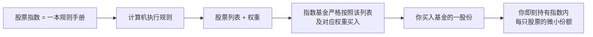
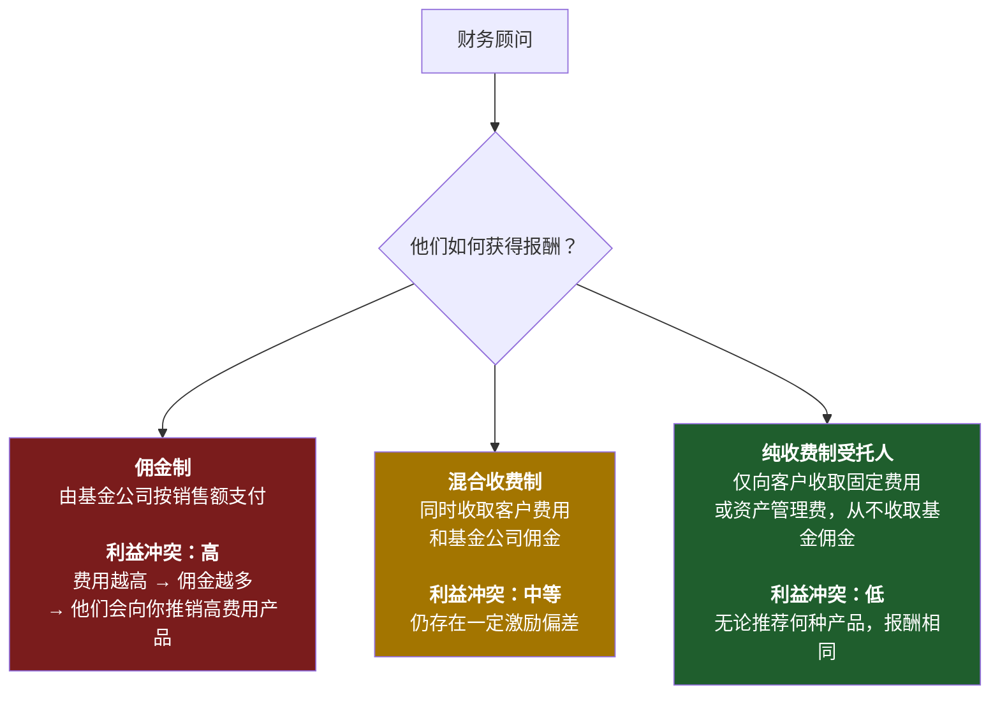
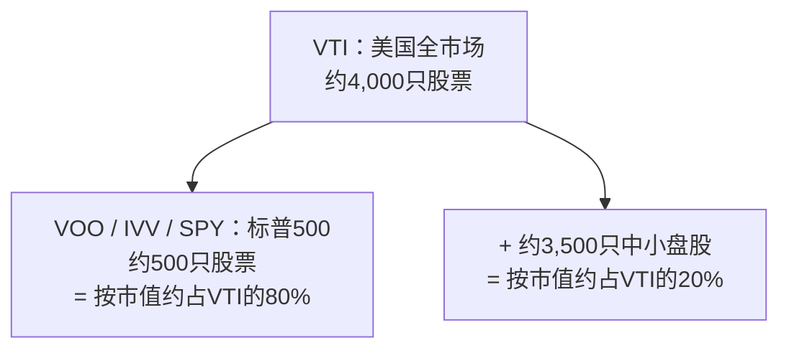
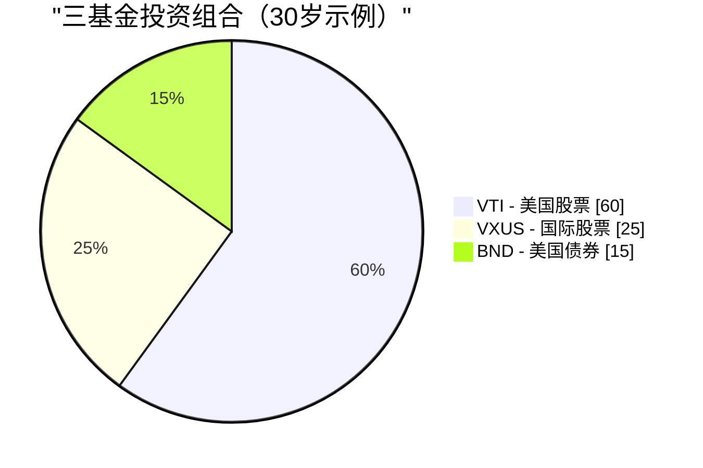

# 第二周：指数基金与交易所交易基金

动画参考：`animation/week02_active_vs_passive.py`

---

## 第一部分：阅读材料

---

### 1. 为什么这很重要

上周我们确立了一个残酷的事实：**通胀是重力，不投资才是你能做的最昂贵的事。** 现在的问题是*如何*投资。以下这个答案，投资行业花了四十年才终于承认：对于几乎所有人来说，正确答案是**一只低成本指数基金或交易所交易基金。** 不是选股。不是你银行的"财富管理顾问"。不是你姐夫的内部消息。不是你保险代理人急着向你推销的结构化产品。

这是整门课程中最重要的一课，而且它真的很简单。如果你在第二周读完后就停下来，设置每月定投一只宽基市场指数交易所交易基金，然后这辈子再也不读任何一本金融书籍，**你的投资表现仍将超越这个星球上绝大多数投资者——包括那些拿着数百万薪酬来管理他人资金的专业人士。**

这不是推销话术。这是数据在过去四十年里反复证明的一个客观陈述：

- **在20年的时间窗口内，约90%主动管理的美国大盘股基金跑输标普500指数**——这一数据由标普道琼斯指数公司通过SPIVA记分卡每年发布。
- **预测基金未来表现的最佳指标是费用率。** 不是基金经理的学历背景，不是品牌名气，不是过去的收益率。是费用。费用越低→未来平均收益越高。（晨星公司已通过一项又一项研究证实了这一点。）
- **沃伦·巴菲特——有史以来最著名的主动投资者——在遗嘱中指示，他妻子的遗产应投入"一只极低成本的标普500指数基金"。** 如果连有史以来最伟大的选股人都告诉自己的遗孀放弃选股，这本身就说明了一切。

因此，本周我们将围绕三件事展开。第一，指数基金究竟是什么，以及它那段颇具颠覆性的历史。第二，金融行业从散户手中攫取财富的四种主要方式——高费用主动基金、佣金驱动型顾问、保险型"投资"产品，以及慢性失血的传统共同基金——以及如何一一绕过它们。第三，你实际需要的几个具体代码。

最后，我要留一个诚实的悬念：**指数基金的主流共识已运行四十年。但它并不保证永远有效。** 它何时以及如何可能失灵，以及届时你该怎么做，这是一个我们在之后几周会重新探讨的话题。眼下，我们先打好基础。进阶操作会在之后到来——是建立在这个基础*之上*，而不是取而代之。

> *"投资是必须的。这门课里的其他一切工具都是锦上添花。"*

---

### 2. 你需要掌握的知识

#### 2.1 什么是股票指数？

**股票指数**是一份遵循特定规则的股票（或其他资产）列表。没有人去"管理"这个指数——它只是按照规则呈现其本来面目。标普500就是"满足特定流动性、盈利能力和上市标准的500家最大美国公司，按市值加权"。这是它的完整定义。计算机就能执行这个规则。

当新闻说*"市场今天上涨了2%"*，他们几乎总是指标普500上涨了2%。

你会经常听到的主要股票指数：

| 指数 | 追踪范围 | 成份股数量 |
| --- | --- | --- |
| **标普500** | 500家最大美国公司 | 约500只 |
| **CRSP美国全市场** | 整个美国股市 | 约4,000只 |
| **道琼斯工业平均指数** | 30家大型美国公司（价格加权，一种古老方式） | 30只 |
| **纳斯达克综合指数** | 纳斯达克上市的所有股票 | 约3,000只 |
| **纳斯达克100指数** | 纳斯达克100只最大非金融股（科技股偏重） | 100只 |
| **罗素2000** | 2,000家美国小型公司 | 约2,000只 |
| **MSCI欧澳远东指数** | 不含美国/加拿大的发达市场 | 约800只 |
| **MSCI新兴市场指数** | 新兴市场国家 | 约1,400只 |
| **富时100** | 100家最大英国公司 | 100只 |

**大多数主要股票指数采用市值加权。** 这意味着一家公司在指数中的权重与其总市值成正比。市值约3万亿美元的苹果公司在标普500中约占7%权重；市值约100亿美元的最小成份股约占0.02%。前10大公司通常占据**整个指数30%至35%**的权重。当你"买入标普500"时，你实际上买入的是比"500只股票"这个名字所暗示的更为集中的超大盘股敞口。

这就是整个运作机制。其中没有任何天才成分。这恰恰是它有效的原因。

---

#### 2.2 指数基金——博格尔的异端想法

指数基金直到1976年才出现。在此之前，美国每一只共同基金都是主动管理的：西装革履的聪明人挑选股票，每年收取1%至2%的费用。那时的数学逻辑与现在相同——大多数人跑输市场平均水平——但这一学术发现尚未落地为产品。

**将这一数学逻辑转化为产品的人，是杰克·博格尔。** 博格尔于1974年被威灵顿管理公司解雇。1975年，他创立了一家奇特的新型共同基金公司——**先锋集团**，采用互助所有制结构——由基金持有人自己拥有，没有外部盈利动机。1976年，先锋推出了**第一指数投资信托**，即第一只面向散户的指数基金：它只需按照指数权重买入标普500的全部500只股票，并收取极低的费用。

整个行业对此冷嘲热讽。媒体称之为**"博格尔的蠢事"**。券商拒绝销售它（因为没有佣金可赚）。这只基金在首次公开发行时仅募集到1,100万美元——远低于博格尔1.5亿美元的目标。竞争对手称这个想法**"有悖美国精神"**，是**"保证平庸的配方"**。

竞争对手说得没错，它确实保证了平庸——*如果平庸的定义是"市场平均收益减去几个基点的费用"的话。* 他们忽视的是：市场平均收益减去几个基点的费用，在20年里击败了约90%的专业人士。

时至今日，先锋集团管理着超过**8万亿美元**的资产，指数基金和交易所交易基金这一类别在全球管理的资产总额超过**20万亿美元**。博格尔的"蠢事"成为了这个星球上散户股票投资的主流形式。他本人于2019年辞世，从未以任何其他8万亿美元资产管理公司创始人的方式让自己致富——先锋的互助结构意味着节省下来的费用回流给了基金持有人，而不是流入他的口袋。他是金融界极少数配得上**英雄**这个词、且无需打引号的人之一。

> "不要在干草堆里寻找那根针。直接买下整个干草堆。" ——约翰·C·博格尔

---

#### 2.3 共同基金与交易所交易基金——为何共同基金仍然存在（以及为何你应主要使用交易所交易基金）

**指数基金**是一种*策略*——"追踪指数"。这种策略可以包装在两种不同的*外壳*中：

- **共同基金**：每天收市时按收盘净值定价并交易一次。
- **交易所交易基金**：在交易所实时交易，就像一只股票一样。

| 特征 | 共同基金 | 交易所交易基金 |
| --- | --- | --- |
| 交易时间 | 每天**收市后一次**，按当日净值 | **全天交易**，如同股票 |
| 最低投资额 | 通常**1,000至3,000美元** | **一股的价格**（或碎股） |
| 税务效率（应税账户） | **较差**——强制向所有持有人分配资本利得 | **较好**——实物申赎机制保护持有人 |
| 佣金 | 在基金本身的券商处为0 | 在大多数券商处为0 |
| 轻松定投 | **支持**（按金额，任意日期） | 有时较难（需整股，除非支持碎股） |

**2026年，交易所交易基金在几乎所有重要维度上都胜出**——最低投资额更低、实时定价、税务效率大幅领先、平均费用率更低。共同基金真正具有优势的领域只有以下几类：

1. **401(k)及其他雇主退休计划。** 大多数美国401(k)菜单仍以共同基金为主。计划管理方尚未完成切换，你通常也无法将自选的交易所交易基金引入计划。在401(k)中，共同基金的税务劣势基本不成问题（账户本身享受税收优惠），因此外壳选择是被迫的，也无伤大雅。
2. **按固定金额设置自动定投。** 先锋共同基金允许你设置"每月1日投入500美元"，他们会精确执行，包括购买零散份额。交易所交易基金的自动定投功能已存在，但依赖于具体券商的支持。

**基本就是这两点。** 在2026年的普通应税券商账户中，同一指数的交易所交易基金版本，在成本和税后收益上，对几乎所有散户投资者来说都优于共同基金版本。**默认选择交易所交易基金。** 如果你只能通过401(k)获取，共同基金也完全没问题——在菜单中选最便宜的宽基市场指数选项，继续前进。

共同基金之所以仍以庞大规模存在，不是因为它们*更好*。而是因为**数以万亿美元计的历史遗留资金滞留在401(k)、个人退休账户和旧版券商账单中**，若要换出则会触发应税资本利得。是惰性，而非优势，在维系着它们。新增资金几乎总应流入交易所交易基金。

---

#### 2.4 主动管理与被动管理——那个90%的数据

**主动投资**意味着基金经理（或你本人）试图挑选出赢家股票并规避输家。研究、分析、频繁交易、重仓押注。这是每一只主动管理共同基金和对冲基金所做的事，也是他们向你收费的原因。

**被动投资**意味着买入整个指数，接受平均水平。无需预测，无需押注，无需魅力。

正统的问题是*"主动基金经理能否跑赢指数？"* 标普道琼斯指数公司的SPIVA记分卡二十余年来逐年重复着这个正统答案：**大多数情况下，不能。** 时间越长，结果越糟：

| 类别（美国） | 5年跑输比例 | 10年跑输比例 | 20年跑输比例 |
| --- | --- | --- | --- |
| **美国大盘股** | 78% | 85% | **90%** |
| **美国中盘股** | 74% | 83% | 89% |
| **美国小盘股** | 68% | 79% | 88% |
| **国际股票** | 71% | 82% | 87% |
| **新兴市场** | 69% | 80% | 85% |
| **美国投资级债券** | 72% | 81% | 86% |

*（数据来自近期SPIVA报告的近似值；具体数字每年略有波动，但定性规律始终如一。）*

> 换句话说：在100位美国大盘股基金经理中，**90位在20年的时间窗口内，败给了一台运行着500个名字的简单列表的计算机。**

更致命的后续发现是：**这胜出的10位，在下一个十年里不会是同样的10位。** 标普的持续性研究反复表明，在过去五年位居前四分之一的基金，在接下来五年中大概率会跌出前四分之一。过去的超额表现无法预测未来的表现——每份基金招募说明书底部那句警示语是真的，只是大多数投资者选择忽视它。

主动基金经理在整体上无法跑赢指数，有五个原因：

1. **费用。** 主动基金每年收取0.5%至1.5%。指数交易所交易基金收取0.03%。基金经理每年必须跑赢指数**超过整整一个百分点**，才能与低成本选项打平。
2. **交易成本。** 每一次买卖都有摩擦——买卖价差、市场冲击、机构层面的佣金。高换手率策略会持续失血。
3. **税务。** 高换手率在共同基金中会触发资本利得分配，无论你是否卖出，均在当年纳税。
4. **市场基本有效。** 数以万计的专业人士在阅读同样的年报、参加同样的电话会议、使用同样的卫星数据。真正的信息优势极为罕见。
5. **幸存者偏差。** 业绩差劲的基金被悄悄清算或合并进其他基金。现存的"主动基金"全集，看起来比实际情况更好看，因为表现最差的那些已被掩埋。

---

#### 2.5 费用率——你能掌控的最大杠杆

**费用率**是基金每年收取的费用，每天自动从基金资产中扣除。你永远看不到账单。它只是悄无声息地体现为略低的收益率。

这种看不见的特性，正是它作为财富提取机制得以奏效的核心所在。**1%的费用听起来微不足道。但三十年下来，它大约会吞噬你最终财富的25%至30%。** 复利是把双刃剑：它在增长你的资金，也在增长费用的侵蚀。

以10万美元为初始投入，持有30年，毛收益率10%：

| 基金类型 | 费用率 | 净收益率 | 第30年末价值 | 相比指数基金的损失 |
| --- | --- | --- | --- | --- |
| **指数交易所交易基金**（如VOO） | **0.03%** | 9.97% | **$1,721,686** | — |
| 低费用主动基金 | 0.50% | 9.50% | $1,526,688 | **−$194,998** |
| 普通主动基金 | 1.00% | 9.00% | $1,326,768 | **−$394,918** |
| 高费用主动基金 | 1.50% | 8.50% | $1,152,309 | **−$569,377** |
| 保险产品包装 | 2.00% | 8.00% | $1,006,266 | **−$715,420** |

再看一遍最后一行。**一个2%的包装，会让一笔10万美元的投资损失超过70万美元。** 那不是一笔费用。那是一套房子。某些城市甚至是两套。它从你的退休储蓄流向了基金公司的薪酬、营销预算、办公室租金和CEO的薪酬包。

**在任何市场环境下，费用都在复利侵蚀。** 市场下跌30%的那一年，你仍须支付。基金经理跑赢指数0.4%的那一年，你仍须缴纳完整的1%。费用是基金招募说明书上唯一有保证的数字。

还有两个事实，是行业不希望你内化的：

- **在任何基金类别中，费用率更低的基金平均表现优于费用率更高的基金。** 这是基金研究领域被重复验证次数最多的发现——晨星公司已在跨越资产类别、跨越数十年的研究中反复证实。某一类别中最便宜的基金，平均而言就是该类别中最好的基金。
- **费用是*有保证的*拖累；基金经理的超额表现是*被期待的*抵消。** 在任何其他领域，用确定性换取希望，都被认为是一笔糟糕的交易。

---

#### 2.6 财务顾问的陷阱

如果主动基金表现如此糟糕，为何每家银行、每家券商、每个"财富管理"部门仍在持续推销？因为**财务顾问的薪酬结构使得推销这些产品对顾问本人来说是理性的**，哪怕对你来说是非理性的。

你会遇到三种薪酬模式：

**询问任何顾问最重要的一个问题：*"您是受托人吗？您是纯收费制的吗？"*** 受托人在*法律上*被要求以你的最大利益行事。非受托人的销售人员只须保证推荐产品"适合"你——这是一个低得多的门槛，历史上允许了向任何有能力签字的人销售高费用垃圾产品。

你的银行"私人财富经理"之所以急于将你引入一只费用率1.5%、前端收费5%的主动基金，是因为银行两头获益：买入时赚取前端申购费，持有期间又从持续的12b-1营销费中提取分成。**你不是他们的客户；你是他们的产品。** 基金公司付钱给他们，是为了让他们把你带过来。

面对推销主动基金的非受托顾问，最有效的应对是：*"请以书面形式列明持有这只基金十年的全部成本——费用率、申购费、12b-1费用、顾问费、账户费——并列明您的公司从该基金家族获得的全部报酬。"* 如果他们拒绝或拖延，你已经得到了答案。

> **默认原则：** 如果你尚未积累数百万美元、且没有真正复杂的税务情况，你几乎可以肯定不需要财务顾问。你需要的是一只交易所交易基金和一笔自动月度转账。

---

#### 2.7 保险"投资"几乎都是骗局

在此，我想说得异常直接。**变额万能险、指数型万能险、作为"投资"销售的终身寿险、股票挂钩储蓄产品、面向散户销售的结构化年金——这些产品在极少数例外情况以外，几乎无一例外都是以攫取费用为目的的掠夺性产品，而受害者往往意识不到自己被收了多少费。**

推销话术永远是以下内容的某种组合：

- *"税务优惠增长。"*
- *"本金保护。"*
- *"享受股市上行，规避下行风险。"*
- *"强制储蓄纪律。"*

现实几乎总是：

- **若在头5至10年内退出，需支付5%至10%的退保费。**
- **每年2%至4%的综合费用**，隐藏在晦涩的术语中（"死亡与费用风险收费""附加条款费""行政管理费""基金管理费"，全部叠加在一起）。
- **扣费后的收益率大幅落后于基础市场，往往在底层市场给出8%至10%时，净收益率仅有2%至4%。**
- **代理人佣金可高达首年保费的80%至100%**，这正是这类产品被如此卖力推销的原因。

保护你一生的经验法则：

> **保险是为了转移风险。投资是为了创造财富。永远不要将两者混为一谈。**

如果你有受抚养人，其经济状况会因你的离世而受到严重影响，**请购买定期寿险**——纯粹、廉价、固定期限的保障，不含任何投资成分。一位健康的30岁人士，购买20年、保额100万美元的定期寿险，每月保费约为25至35美元。然后将你在定期寿险和代理人推荐的终身寿险之间的费用差额，**全部投入指数交易所交易基金。** 这就是教科书式策略：**"购买定期寿险，投资差额。"** 在任何20年的时间窗口内，这一策略在扣费后净资产上对终身寿险的胜出幅度都是数量级的差距——而且投资部分的控制权和流动性完全在你手中。

代理人会告诉你终身寿险"迫使你储蓄"。你的券商账户里设置一笔每月自动转账同样能做到这一点，而且那笔钱不会给他们支付80%的佣金。

---

#### 2.8 诚实的反例——真正奏效的主动基金

过去几个部分，我一直在猛烈抨击主动管理。为了保持学术上的诚实，我必须坦率地说：**少数主动基金经理确实在数十年间决定性地跑赢了指数。** 数量不多——但足以值得一提。

值得关注的案例：

- **沃伦·巴菲特和查理·芒格领导下的伯克希尔·哈撒韦。** 从1965年到2020年代初期，伯克希尔的账面价值年复合增长率约为**20%**，而标普500约为10%——这是现代金融史上最令人印象深刻的长期业绩记录。巴菲特是主动管理确实有效的教科书式证明。他同样是那个告诉遗孀把遗产放进标普500指数基金的巴菲特。他是那个例外，他在告诉你：你不是那个例外。
- **彼得·林奇执掌富达麦哲伦基金，1977年至1990年。** 林奇管理麦哲伦基金长达13年，年均收益率约为**29%**，在13年中有11年跑赢标普500——这或许是有记录以来最出色的共同基金业绩。他在46岁退休。林奇之后，麦哲伦基金重新回到了大致追踪指数的状态。
- **文艺复兴科技的大奖章基金，约从1988年起。** 一只高频、高数学含量、仅限员工参与的量化基金，据报道在扣除其5%管理费和44%业绩提成后，**三十余年来年化收益率约为40%**。大奖章基金自1993年起即对外部投资者关闭，而文艺复兴面向外部投资者的基金（RIEF、RIDA）表现则差得多——有时在大奖章上涨70%的年份里反而亏损。**大奖章是真实、持久阿尔法存在的证明，也是真实阿尔法会被封闭、永远无法触及你的证明。**
- **赛斯·卡拉曼的鲍波斯特集团。** 数十年来在结构性低于市场波动性的情况下获得了股票级别的收益，方法是坚守深度价值框架，在找不到合格标的时持有极大比例的现金。卡拉曼的著作《安全边际》因他拒绝重印，二手价格已超过1,000美元。
- **乔尔·格林布拉特的哥谭资本，1985年至1994年。** 在一个规模较小的特殊情况投资组合上，连续10年实现约50%的年化收益率，随后向外部投资者退还了资金。格林布拉特后来在《股市天才》和《股市小书》中公开了他的操作手册——他明确打赌，这一策略因为*市值太小、过于难以坚守、需要太大耐心*，大多数读者实际上无法执行。

注意其中的规律。这些在数十年间确实跑赢指数的基金，要么**对新资金关闭**（大奖章），要么**在巅峰时期定期关闭**（麦哲伦全盛期），要么**是一家独一无二的控股公司**（伯克希尔），要么**刻意保持小规模**（格林布拉特的早期阶段），要么**极度集中且需要在多年回撤中坚守，而大多数投资者根本做不到**（卡拉曼）。

教训不是*"主动管理从不奏效"*。教训是：**真正有效的主动策略，鲜少是你能从银行产品菜单上买到的那种。** 而你*能*从银行产品菜单上买到的主动基金，整体上正是SPIVA记分卡追踪到的那90%跑输指数的基金。

如果你在某个特定市场领域拥有时间、心态和真实持久的信息优势，当然可以在那里重仓。大多数读者做不到。**大多数读者应该将大部分资金配置于指数，把时间花在别处。**

---

#### 2.9 你真正需要的基金

你不需要记住现有的数千只交易所交易基金。你只需要这份简短的清单：

| 代码 | 基金 | 费用率 | 追踪标的 |
| --- | --- | --- | --- |
| **VOO** | 先锋标普500交易所交易基金 | **0.03%** | 500家最大美国公司 |
| **VTI** | 先锋美国全市场交易所交易基金 | **0.03%** | 整个美国市场（约4,000只股票） |
| **IVV** | iShares核心标普500交易所交易基金 | 0.03% | 标普500（贝莱德的VOO等价产品） |
| **SPY** | SPDR标普500交易所交易基金 | 0.09% | 标普500（历史最久、费用偏高、交易员最爱） |
| **VXUS** | 先锋全球（除美国）股票交易所交易基金 | 0.07% | 所有非美国发达+新兴市场 |
| **VT** | 先锋全球股票交易所交易基金 | 0.07% | 全球所有市场（美国+非美国合一） |
| **BND** | 先锋美国全债市交易所交易基金 | 0.03% | 美国投资级债券 |
| **QQQ** | 景顺纳斯达克100交易所交易基金 | 0.20% | 100只最大非金融纳斯达克股票（科技偏重） |

**VOO vs. VTI vs. SPY** 是被问得最多的问题。简短答案：

- **VOO** 和 **IVV** 追踪同一指数（标普500），收取相同费用（0.03%）。两者均可。
- **SPY** 同样追踪标普500，但费用高出**3倍**（0.09%）。它的存在是因为它是美国第一只交易所交易基金（1993年），拥有最深的流动性——机构交易者在意这一点，长期投资者不必在意。**不要为你不需要的流动性多付3倍的费用。**
- **VTI** 持有整个美国市场（约4,000只股票），而非仅限于最大的500只。实际上，VOO和VTI的收益率几乎相同，因为标普500约占美国市值的80%。如果你想要一只基金、同时希望分散投资程度略高一些，选VTI。如果你想要一只基金、同时希望追踪所有人都引用的最干净的指数，选VOO。**在这两者之间，没有错误答案。**

---

#### 2.10 如何实际买入

这是完整的操作流程，全程只需15分钟：

1. **开立券商账户。** 美国居民：富达、嘉信理财或先锋——三家均免费，平台均靠谱。香港/台湾/新加坡居民：盈透证券是跨境购买美国上市交易所交易基金的标准之选，费用低廉。
2. **绑定银行账户并转账。** ACH转账需1至3个工作日。
3. **搜索代码。** 输入"VOO"。基金详情页随即弹出。
4. **下单买入。** 市价单=按当前价格买入。输入股数或金额（大多数券商现已支持碎股）。
5. **设置每月自动定投。** 例如，每月1日自动投入500美元。然后忘记它的存在。

就这样。**五个步骤。十五分钟。你现在持有美国500家最大公司的一小份股权。** 不需要看财经频道。不需要盯着你的投资组合。不需要选股焦虑。

买入后最重要的事，就是**关掉App，不再查看。** 市场每天起伏不定。盯着每日涨跌，是导致投资者行为失误的最大原因——恐慌时卖出，亢奋时买入。指数交易所交易基金策略中每一分长期收益，都来自于*穿越*噪音坚守，而不是围绕噪音频繁交易。

---

#### 2.11 三基金投资组合

对大多数读者而言，博格尔推广的**三基金投资组合**，确实就是整个投资组合的全部：

| 基金 | 代码 | 建议配置比例（30岁） |
| --- | --- | --- |
| 美国全市场股票 | **VTI** | 60% |
| 全球（除美国）股票 | **VXUS** | 25% |
| 美国全债市 | **BND** | 15% |

关于债券份额，粗略的**传统经验法则**是：**债券比例 ≈ 你的年龄 - 20**，大致如此。30岁持有约10%至15%的债券。65岁持有约45%至55%的债券。教科书逻辑是：债券是*压舱石*——股票涨时债券跌，股票跌时债券涨；它们降低投资组合波动性，并在临近退休、无法等待十年复苏的关键时刻，保护你免受50%股票回撤之苦。

> **一个我有义务在基础课中提前告知你的提示：** 这一传统逻辑是为一个已不再存在的世界构建的。
>
> "债券作为压舱石"的框架建立在两个假设之上：（a）债券的实际收益率高于通胀；（b）债券在股票下跌时上涨。**这两个假设在2020年代双双失效。** 随着各国政府通过货币超发为庞大赤字融资（第一周，第2.2节），以及各央行将实际收益率作为政策手段压制在通胀以下（即"金融抑制"），在通胀周期中持有长期债券基金，不是压舱石——而是购买力的缓慢流失。而在2022年，股票和债券*同步*下跌了约20%，这恰恰是60/40债券配置理应防范的场景。
>
> 因此，请将上表中的债券份额理解为**本课程余下内容将持续挑战的教科书起点。** 我们将在以后回归，探讨在货币超发时代真正扮演压舱石角色的资产：
>
> - **第五周（债券）** 将深入解析债券的本质、历史对冲逻辑为何奏效，以及它在何种条件下失效。
> - **第六周（黄金与大宗商品）** 将引入另一种抗通胀资产——黄金是人类历史上经历过的每一种货币体制中最被认可的价值储存手段，在2020年代的投资逻辑远比长期债券更为充分。
> - **第四十七周（尾部风险对冲）** 以及**第五级别整体内容**，将使用现金/短久期国债、黄金及其他货币金属、以及多头波动性期权结构的组合，对投资组合的安全端进行正式重建，而非依赖传统的长久期债券配置。
>
> 就你今天建立的基础组合而言，三基金模板完全没问题，远好于不投资。**只需理解，债券份额是这个组合中有效期最短的部分，我们将会回来替换它。**

这个投资组合整体混合后的费用率约为**每年0.04%**。即每万元人民币每年约四元人民币。换来的是覆盖所有主要资产类别的全球多元化投资组合。

---

#### 2.12 直到它失效——一个悬念

这一整章，我一直在告诉你指数交易所交易基金是答案。我想以一个限定条件作结，这让我成为一个诚实的老师，而不是一个推销员。

**买入持有被动指数策略在过去40年里表现极为出色——大约从1980年代初期开始。** 它之所以有效，源于一组特定条件的共同支撑：工作年龄人口多于退休人口，每个发薪周期机械性地持续买入；利率持续下行；美元储备货币地位；全球化；以及2008年以来，美联储每当金融条件收紧过度时的持续介入。

**这些顺风没有一个是永久保证的。**

当人口结构翻转到来——当婴儿潮一代从净买入方（积累期）转为净卖出方（变现期）——过去40年推动指数上行的同一套机械管道，可以反向运转。被动基金并非自主运作；它们对最终投资者是在买入还是赎回做出反应。一个在上涨过程中被价格不敏感的资金流主导的市场，在下跌过程中同样容易受到价格不敏感的资金流冲击。

**这不是预测指数明天就会失效。这是诚实地承认，"它有效运行了40年"与"它将永远有效"并不是同一回事。**

对于*你*，今天，正在建立第一个投资组合的你：**指数交易所交易基金是正确答案。** 打好基础。让自动月度转账运转起来。在你完成课程余下内容的这几年里，让它持续复利。

关于指数何时以及如何可能失效、以及届时你向何处迁移的详细阐述，正是本课程其余内容所构建的：

- **第二十三周（因子投资）** 将介绍简单市值加权指数化的第一批替代方案——价值、动量、质量、低波动率等因子，这些因子历史上捕捉到了市值加权指数遗漏的收益。
- **第四十三周（主动投资组合管理）** 是对主动管理*何时确实*物有所值、何时并非如此的深度剖析。
- **第五级别（第四十七至五十二周）** 是我们真正构建"杠铃"投资组合形态的地方——一端是高确信度的安全资产，另一端是非对称的博弈性资产，中间的宽基市值加权核心被刻意移除。那是进阶形态，建立在第二至四十六周所有内容的基础之上。

眼下：**投资是必须的。交易所交易基金是基础。这门课里的其他一切都是锦上添花，叠加在基础之上。** 如果你无法跑赢指数——大多数人在大多数时候做不到——那就不要浪费你的一生去尝试。让指数为你工作，把你的时间花在生命中真正能复利的事情上，而不是你的电子表格。

但请理解，"买入持有指数"是一种依赖特定环境的策略，在特定的40年窗口内被证明有效。我们将回来探讨那个窗口关闭之后会发生什么。眼下，基础已经足够。

---

### 3. 常见误解

**误解一："指数基金只适合初学者。"**

主权财富基金、大学捐赠基金、养老金和亿万富翁都在使用指数基金和交易所交易基金。加州公务员退休基金——全球最大的养老金之一——设有庞大的指数基金授权。沃伦·巴菲特，*最著名的*主动投资者，在2008年至2017年公开打赌标普500指数基金将跑赢一篮子精挑细选的对冲基金，并取得了决定性的胜利。指数化投资不是初学者的选项；它是理性选择后的选项，而这个选项恰好也是最简单的。

**误解二："一分钱一分货——费用越高，管理越好。"**

在几乎所有其他消费品类中，这是对的。在投资领域，**这一关系恰好相反。** 晨星公司已在跨越资产类别和数十年的研究中证明，**费用率是预测基金未来表现最佳的单一指标**——比过去收益率、比星级评分、比基金经理任期都更好。费用越高→预期未来收益越低。最便宜的基金，平均而言就是最好的基金。

**误解三："但我的财务顾问推荐了一只主动基金。"**

许多财务顾问从销售特定基金中获得佣金——有时是公开的，通常则藏匿于你永远无法在对账单上看到的不透明分成协议中。他们的激励是推荐对*他们*报酬最丰厚的产品，而不是对*你*复利最有利的产品。**永远追问："您是纯收费制受托人吗？您推荐的任何产品中，您的全部报酬是什么？"** 如果不是，或者他们无法或不愿以书面形式作答，请离开。

**误解四："指数基金在市场下跌时无法保护你。"**

正确——它们做不到。它们本来也不该做到。指数在市场下跌时同步下跌。相关的比较不是"指数 vs. 现金"，而是"指数 vs. 主动基金"。2008年标普500下跌约37%；美国主动管理股票基金平均下跌约39%。主动基金经理在崩盘中没有保护你；平均而言，他们反而略微加剧了损失。**在市场下跌时的保护，来自你的*资产配置*（股票、债券、现金各占多少比例）和你的行为（不要恐慌性抛售），而不是来自基金选择。**

**误解五："我应该选过去5年业绩最好的基金。"**

这是散户投资者最常犯、也最代价高昂的错误。**表现优秀的基金会回归均值。** 标普的持续性研究，在一个又一个十年里反复表明，排名前四分之一的基金，在接下来五年内仍能维持前四分之一的比例不足十分之一。过去表现无法预测未来表现；每份基金招募说明书底部那条警示语不是法律套话，而是一句被所有人忽视的真相。追逐历史赢家，从预期值来看，甚至比随机选择*更糟糕*。

**误解六："SPY和VOO追踪相同的指数，选哪个都无所谓。"**

追踪的是同一指数。但费用不同。SPY收取0.09%；VOO收取0.03%。持有50万美元的投资组合30年，这0.06%的差距复利后大约相当于**超过25,000美元的财富损失。** SPY唯一的结构性优势是交易流动性，这只对移动大额资金的机构或日内交易者有意义——对买入持有的投资者毫无意义。**对于长期持有者，VOO或IVV在成本上始终优于SPY。**

**误解七："我需要通过买入多只不同的指数基金来分散投资。"**

一只VTI这样的全市场基金已经持有约4,000只股票。加上VXUS，你还持有另外约7,000只国际股票。**两只交易所交易基金，覆盖了全球所有主要经济体约11,000只股票——在股票层面已经没有任何可分散的余地。** 持有10只以上的指数交易所交易基金，通常只会制造重叠（同一家苹果、微软、英伟达以不同权重出现在多只基金中），以及一种虚假的多元化感。两到三只基金就足够了。超过五只，通常是困惑的标志，而非复杂度的体现。

**误解八："指数基金很危险，因为你无法规避烂公司。"**

指数基金确实会持有破产的公司。2001年安然倒闭时，它约占标普500的0.7%——抽象来看令人痛苦，对投资组合来说微不足道。另外499家公司照常复利。**指数内部的多元化——数百乃至数千个名字，没有一个单独足以毁掉你的比例——才是真正的保护。** 一个恰好重仓安然的集中选股者在那个标的上血本无归。指数投资者损失了0.7%。

**误解九："终身寿险是好的投资，因为其现金价值可以免税增长。"**

它不是，而现金价值恰恰是这类产品的销售话术核心。终身寿险现金价值在扣除代理人佣金、退保费率和层层叠加的年度费用后，实际收益率通常只有**2%至4%的净值**，而同期指数交易所交易基金能带来7%至10%。**为真正的身故保障需求购买定期寿险，将定期寿险保费与终身寿险保费的差额投入指数交易所交易基金。** 这正是"购买定期寿险并投资差额"的教科书策略。在几乎所有现实情景中，它都胜出；代理人不会推荐它，正是因为他们收不到80%的佣金。

---

### 4. 问答

**问题一：交易所交易基金究竟是什么？它与股票有何不同？**

**交易所交易基金**是将一篮子证券打包成单一工具、在交易所像股票一样交易的产品。买入一股VOO，你就按比例购入了标普500所有500家公司的微小份额。**股票代表一家公司；交易所交易基金代表一个定义好的篮子。** 交易机制相同——代码、实时价格、在交易时段买卖——但你获得了即时的多元化。

**问题二：VOO、VTI还是SPY——选哪个？**

对于长期买入持有：**VOO或VTI**，费用率均为0.03%。VOO = 标普500（约500只股票）；VTI = 美国全市场（约4,000只股票）。两者收益率几乎相同，因为标普500按市值约占美国市场的80%。两者均可。**SPY适合交易者，不适合投资者**——与VOO相同的敞口，费用却是3倍。

**问题三：我的投资组合中应有多少配置于指数交易所交易基金？**

对于大多数20至40岁、正在建立第一个投资组合的读者：**股票仓位的80%至100%** 配置于宽基市场指数交易所交易基金。股票与"安全资产"的具体分配取决于年龄和风险承受能力：

| 年龄 | 股票比例 | 安全资产比例 |
| --- | --- | --- |
| 20–35岁 | 80–90% | 10–20% |
| 35–50岁 | 70–80% | 20–30% |
| 50–65岁 | 50–70% | 30–50% |
| 退休后 | 30–50% | 50–70% |

**关于"安全资产"而非"债券"的说明：** 历史上股票仓位的传统压舱石是债券配置，前提是债券在股票下跌时上涨。正如第2.11节所指出的，这一假设在2020年代已经失效——股票和债券在2022年同步下跌，而在金融抑制下债券已无法提供高于通胀的实际收益率。**"安全资产"仓位因此应理解为一篮子与股市不相关（或负相关）的资产，而非单纯的债券。** 传统债券配置是其中一个组成部分，但现代该仓位还包括短久期国债和现金等价物、黄金及其他货币金属（第六周），以及在更进阶层面的多头波动性期权结构和尾部对冲叠加策略（第四十七周，第五级别）。对于你今天建立的第一个投资组合，BND这样的宽基债券交易所交易基金是合理的起点；课程其余内容教你在进阶后如何替换和补充它。

在股票配置内部，通常的分配约为70%美国（VTI）、30%国际（VXUS）。

**问题四：费用率与申购费——有什么区别？**

**费用率**是每年收取的费用，每天从基金资产中扣除。1万元基金、0.03%费用率 = 每年3元。**申购费**是买入（前端费）或卖出（后端费）时一次性收取的佣金。一笔1万元投资若收取5%前端费，则有500元立即消失，实际只有9,500元被投入市场。**现代指数交易所交易基金没有申购费。** 任何你考虑中的收取申购费的基金，几乎无一例外都不值得购买。

**问题五：如果90%的主动基金经理跑输指数，为什么主动基金依然存在？**

因为它们对基金公司来说**利润极其丰厚。** 一只100亿美元的基金，以1%的费用率，每年不论业绩如何都能赚取1亿美元的费用。投资者跑输指数对投资者来说是坏事，但对基金公司来说是一门极佳的经常性收入业务。再加上购买财经媒体播出时间的营销预算、分销它们的银行网点、被激励销售它们的财务顾问，以及相信那位能说会道的基金经理能跑赢市场均值的投资者心理——**主动基金行业之所以延续，是因为它在价值链上的每一个人都得到了好处，唯独你除外。**

**问题六：指数基金会归零吗？**

理论上，只有当指数中的每一家公司同时破产——这意味着整个美国经济崩溃，届时任何金融资产的价值都是学术问题。实际上，历史上最大幅度的宽基指数跌幅（1929年至1932年、2007年至2009年、2020年新冠闪崩）从峰值到谷底下跌了50%至80%，并在十年内恢复到了新的历史高点。**单只股票绝对可以归零，而且已有许多先例。宽基指数实际上做不到。** 这种不对称性，正是多元化有效的根本原因。

**问题七：国际指数基金——我也应该持有吗？**

大多数合理的配置方案都包括一定的国际敞口。美国按市值约占全球股市的60%；另外40%分布在欧洲、日本、新兴市场等地区。国际多元化可以降低投资组合波动性，因为各地区市场并非完全同步波动。**VXUS**（先锋全球除美国股票交易所交易基金）以0.07%的费用率，在一只交易所交易基金中覆盖了发达市场和新兴市场约7,000只股票。常见的粗略分配是**70%美国（VTI），30%国际（VXUS）**。

**问题八：什么是定投？我应该用定投来买指数交易所交易基金吗？**

**定投**是指以固定金额、按固定周期投资，不论当时价格如何。每月500美元，每个月，无论市场表现如何。价格低时，500美元买入更多股份；价格高时，500美元买入较少股份。结果是平均成本略低于同期市场简单平均价格，更重要的是获得了行为层面的好处：**你在那些令人恐惧的月份里持续买入，而不是等待一个永远感觉不对的"最佳时机"。** 对于从工资中投资的人来说，定投是自动发生的。对于拥有一笔大额资金的人来说，学术文献意见分歧——历史上，一次性投入平均而言略优于定投（因为市场大多数时候是上涨的），但定投在心理上要容易得多。

**问题九：指数基金分配股息吗？**

是的。指数内的公司向基金支付股息，基金收取后，每季度将其转付给持有人。VOO当前的股息收益率约为1.3%至1.5%。大多数券商允许你开启**股息再投资计划**，自动将每次股息用于买入更多同一基金的份额。数十年来，**再投资的股息在股票总收益中占据了相当大的比例**——默认开启再投资计划。

**问题十：我听说过"聪明贝塔"或"因子"交易所交易基金——这些和指数基金一样吗？**

不完全一样。传统指数基金使用**市值加权**（公司规模越大，指数权重越大）。**聪明贝塔**或**因子**交易所交易基金同样基于规则、系统性再平衡——因此具有指数基金的特性——但它们按市值以外的某个因子加权：价值（基本面便宜）、动量（近期赢家）、质量（资产负债表干净）、低波动率（业绩平稳的股票）、小盘规模等等。费用率高于普通指数基金（通常为0.10%至0.40%），因为再平衡规则更为复杂，但仍比主动基金便宜得多。**因子投资是一个重要议题，我们将在第二十三周深入探讨。** 但对于你的第一个投资组合而言，普通市值加权指数交易所交易基金才是正确的起点。

**问题十一：我应该在指数交易所交易基金之外买入个股吗？**

如果你在某个特定公司或行业确实拥有持久的信息优势——来自本职工作的领域专长、对自己所处行业的结构性洞察——那么**在指数核心仓位之外配置一小部分个人重仓股是合理的。** 常见的结构是80%至90%配置于宽基指数交易所交易基金，10%至20%配置于个人重仓标的。**你不应该做的是**：因为在社交媒体上看到了推荐就买、因为品牌熟悉就买、或者因为它上个月涨得好就买。90%的SPIVA数据对散户个人选股者的打击，远比对专业基金经理更为惨烈——大多数散户个股投资组合，表现*显著落后于*他们本可直接买入的指数。如果你无法用一句话说清楚为什么某只股票相对其基本面被低估，你就没有信息优势——你只有一个观点。观点没有问题；只是不要以拥有优势的仓位大小来下注。

**问题十二：我一直听说指数"过于集中于超大盘科技股"——这是个问题吗？**

这是一个真实的观察。2026年，标普500前10大持仓（主要是超大盘科技股——苹果、微软、英伟达、谷歌、亚马逊、Meta等）按权重约占**整个指数的30%至35%**。买入VOO，所获得的超大盘科技股敞口，远比"500只股票"这个名字所暗示的更为集中。这是否是个*问题*，取决于你对这些公司的判断。更宽基的VTI集中度略低（因为它将前10大持仓的权重分散在约4,000只股票中），而等权重标普500交易所交易基金（RSP，费用率约0.20%）则走向另一个极端——同样500只股票，但等权重配置。**眼下，市值加权指数仍然是最简单、历史上表现最佳的默认选择。** 这一集中度问题及其对风险的含义，正是我们在第二十三周及以后深化的那种对市场体制敏感的思维方式。

---

## 第二部分：YouTube脚本

---

**视频标题：** 这只交易所交易基金击败华尔街90% | 第二周

**目标时长：** 约30分钟

**主持人：**
- **陳馬**（老师）：经验丰富的散户投资者，以第一人称讲述数十年亲身管理投资组合的经历
- **小魚**（学生）：刚大学毕业、正在学习投资积蓄的年轻人，提出观众心中的疑问

---

**[开场 / 第0段：承诺]**

[VISUAL: 冷开场标题卡——"70万美元。这是你的费用带走的。"]

[ANIMATION: 数百个股票代码混乱地旋转，随后被归拢进一个标注"一只交易所交易基金"的篮子里。字幕淡入："它击败了90%的专业人士。"]

**陳馬：** 如果你看完这一个视频之后，金融生涯里什么都不再做——没有书籍、没有播客、没有选股App——你仍然会跑赢华尔街几乎所有的专业基金经理。

**小魚：** 这是个很大的断言。

**陳馬：** 这不是我的断言。这是数据在过去四十年里的一贯结论。答案是一只低成本宽基市场指数交易所交易基金。不是你银行的财富管理顾问。不是你姐夫的内部消息。不是保险代理人急着向你推销的结构化产品。

**小魚：** 然而几乎没有人真正这样做。

**陳馬：** 因为有一个数以万亿美元计的行业，靠你不这么做来发工资。今天我想向你展示我自己投资组合的基础——然后，在最后，我会告诉你一件没有人在这个领域愿意坦率承认的事：这个策略有效了四十年，但它不保证永远有效。

**小魚：** 悬念记下了。我们从基础开始吧。

[VISUAL: 标题卡——"1. 什么是股票指数？"]

---

**[第1段：什么是股票指数？]**

**陳馬：** 在谈基金之前，我们必须先定义股票指数。股票指数不过是一份遵循特定规则的股票列表。没有人管理它。标普500就是"满足特定流动性和上市规则的500家最大美国公司，按市值加权"。这是它的完整定义。计算机就能执行这个规则。

**小魚：** 当新闻说"市场上涨了2%"，他们说的就是标普500。

**陳馬：** 几乎总是如此。标普500是美国的头条股票指数，约占美国总市值的80%。

[VISUAL: 快速显示主要股票指数列表——标普500、CRSP美国全市场、道琼斯（30只，价格加权，"一种古老方式"）、纳斯达克综合指数、纳斯达克100指数、罗素2000、MSCI欧澳远东指数、MSCI新兴市场指数、富时100。]

**小魚：** 五百家公司是等权重的吗？

**陳馬：** 不是，而且这正是大多数人忽视的部分。标普500按市值加权。苹果市值约3万亿美元，约占7%的权重。最小的成份股市值约100亿美元，约占0.02%。

[ANIMATION: week02_active_vs_passive.py顶部的柱状图动画——苹果约7%、微软约6.5%，向右逐渐递减至极细的一条。]

**陳馬：** 而前10大公司——苹果、微软、英伟达、谷歌、亚马逊、Meta以及其他几家——合计约占整个指数的30%至35%。

**小魚：** 所以当我"买入标普500"，我实际上是在买入一个高度集中的超大盘持仓。

**陳馬：** 一个比"500只股票"这个名字所暗示的、集中得多的超大盘科技股持仓。记住这一点。我们之后还会在课程中回来谈它。

[VISUAL: 标题卡——"2. 博格尔的异端想法"]

---

**[第2段：博格尔的异端想法]**

**陳馬：** 指数基金直到1976年才出现。在此之前，美国每一只共同基金都是主动管理的——西装革履的聪明人挑选股票，每年收取一到两个百分点的费用。那时的数学逻辑与现在相同：大多数人跑输市场平均水平。学术发现就摆在那里，只是还没有人将其包装成产品。

**小魚：** 直到有人做到了。

**陳馬：** 一个叫做杰克·博格尔的人。博格尔于1974年被威灵顿管理公司解雇。1975年，他创立了一家奇特的新型基金公司，叫做先锋集团，采用互助所有制结构——由基金持有人自己拥有，没有外部盈利动机。1976年，先锋推出了第一指数投资信托。它只需按指数权重买入标普500的全部500只股票，收取极低的费用。

**小魚：** 华尔街是怎么反应的？

**陳馬：** 华尔街嘲笑它。媒体称之为"博格尔的蠢事"。券商拒绝销售它，因为没有佣金可赚。首次公开发行只募集了1,100万美元——远低于博格尔1.5亿美元的目标。竞争对手称它"有悖美国精神"，是"保证平庸的配方"。

**小魚：** 而今天呢？

[VISUAL: 大字体卡片——"先锋集团今日规模：8万亿美元。指数交易所交易基金类别：20万亿美元。"博格尔照片，生卒年1929—2019。]

**陳馬：** 先锋集团管理着超过8万亿美元的资产。指数基金和交易所交易基金类别在全球管理的资产超过20万亿美元。博格尔的"蠢事"成为了这个星球上散户股票投资的主流形式。而令我将他奉为英雄的，是以下这件事：因为先锋是互助所有制，节省下来的费用回流给了基金持有人，而不是流入他的口袋。任何其他8万亿美元资产管理公司的创始人，都会出现在福布斯富豪榜上。博格尔没有。他于2019年辞世。

**小魚：** 一位没有让自己致富的金融英雄。这个名单很短。

**陳馬：** 这是一个只有一人的名单。他自己的那句话，是最好的概括：*"不要在干草堆里寻找那根针。直接买下整个干草堆。"*

[VISUAL: 标题卡——"3. 共同基金与交易所交易基金"]

---

**[第3段：共同基金与交易所交易基金]**

**陳馬：** 简单区分一下外壳，因为很多人会混淆。指数基金是一种*策略*——追踪指数。这种策略可以包装在两种不同的*外壳*中：共同基金，每天收市时按收盘净值定价和交易一次；或者交易所交易基金，在交易所实时交易，就像一只股票。

[VISUAL: 共同基金 vs. 交易所交易基金的五行对比表格——交易时间、最低投资额、税务效率、佣金、自动定投。]

**小魚：** 哪个赢？

**陳馬：** 在2026年的普通应税券商账户中，交易所交易基金在几乎所有重要维度上都胜出——最低投资额更低、实时定价、因实物申赎机制带来的大幅税务效率优势、平均费用率更低。共同基金唯一真正胜出的场合，是401(k)内部（菜单是被迫的，税务问题不成立），以及按固定金额轻松设置定投（先锋共同基金在这方面做得很好）。

**小魚：** 那共同基金为什么还到处都是？

**陳馬：** 惰性。数以万亿美元计的历史遗留资金滞留在401(k)、个人退休账户和旧版券商账单中，换出则会触发大额应税资本利得。它们延续是因为迁移有成本，而不是因为它们更好。**新增资金几乎总应流入交易所交易基金。**

[VISUAL: 标题卡——"4. 主动管理 vs. 被动管理——那个90%的数据"]

---

**[第4段：主动管理 vs. 被动管理——那个90%的数据]**

**陳馬：** 这是核心数据点。每年，标普道琼斯指数公司发布SPIVA记分卡——标普指数对比主动管理。在20年的时间窗口内，**约90%的美国大盘股基金经理跑输标普500。**

[ANIMATION: image/week02_spiva.png动画展示——柱状图从5年的78%攀升至10年的85%，再至20年的90%。底部依次切换类别：美国大盘股、中盘股、小盘股、国际股票、新兴市场、投资级债券。]

**小魚：** 100个人里有90个。带着分析师团队和金融博士学位。败给了一份列表。

**陳馬：** 而更致命的后续发现是：这胜出的10位，在下一个十年里不会是同样的10位。标普的持续性研究表明，排名前四分之一的基金，在接下来五年内大概率会跌出前四分之一。过去表现无法预测未来表现。每份基金招募说明书底部那条警示语是真的。

**小魚：** 那他们为什么赢不了？他们显然很聪明。

**陳馬：** 五个原因，都是结构性的——不是努力程度的问题。

[VISUAL: 五张卡片随陳馬的叙述依次堆叠在屏幕上。]

**陳馬：** 第一——费用。主动基金每年收取0.5%至1.5%。指数交易所交易基金收取0.03%。基金经理每年必须跑赢指数*超过整整一个百分点*，才能与低成本选项打平。第二——交易成本。买卖价差、市场冲击、机构层面的佣金。高换手率策略持续失血。第三——税务。高换手率在共同基金中触发资本利得分配，无论你是否卖出，均在当年纳税。第四——市场基本有效。数以万计的专业人士在阅读同样的年报、参加同样的电话会议、使用同样的卫星数据。真正的信息优势极为罕见。第五——幸存者偏差。业绩差劲的基金被悄悄清算或合并消失。现存的"主动基金"全集，看起来比实际情况更好看，因为表现最差的那些已被掩埋。

**小魚：** 换句话说：100位专业选股者中，有90位在20年里败给了一台运行着500个名字的列表的计算机。

**陳馬：** 在20年里。是的。

[VISUAL: 标题卡——"5. 费用率——那张70万美元的牌"]

---

**[第5段：费用率——那张70万美元的牌]**

**陳馬：** 现在我想让费用这个问题变得无法忽视。假设你在30岁时投入10万美元，每年的毛收益率为10%，持续30年。唯一不同的只是费用。

[ANIMATION: image/week02_expense_drag.png动画展示——五条财富曲线在30年间逐渐分叉。费用率0.03%的指数交易所交易基金在最上方，依次是0.50%、1.00%、1.50%，以及最下方费用率2.00%的保险产品包装。]

[VISUAL: 最终价值卡片依次打入屏幕：
0.03% → $1,721,686
0.50% → $1,526,688
1.00% → $1,326,768
1.50% → $1,152,309
2.00% → $1,006,266
"-$715,420"以红色高亮显示在最后一行。]

**陳馬：** 看最后一行。**一个2%的包装，会让一笔10万美元的投资损失超过70万美元。** 那不是一笔费用。那是一套房子。某些城市甚至是两套。

**小魚：** 那笔钱去了——

**陳馬：** 基金公司的薪酬。营销预算。办公室租金。CEO的薪酬包。那是你的退休储蓄，被转移走了。

**小魚：** 那市场下跌的年份呢？

**陳馬：** 你仍须支付费用。市场下跌30%的那一年，你支付。基金经理跑赢指数0.5%的那一年，你仍须缴纳完整的1%或2%。**费用是基金招募说明书上唯一有保证的数字。**

**小魚：** 低费用基金的数据呢？

**陳馬：** 晨星公司已在跨越资产类别和数十年的研究中反复证实。在任何基金类别中，**最便宜的基金，平均而言就是该类别中最好的基金。** 费用越低，预期未来收益越高。这是基金研究领域被重复验证次数最多的发现。大多数消费者的本能是"一分钱一分货"。在基金领域，这种关系恰好相反。

[VISUAL: 标题卡——"6. 财务顾问的陷阱"]

---

**[第6段：财务顾问的陷阱]**

**陳馬：** 如果主动基金表现如此糟糕，为何每家银行、每家券商、每个"财富管理"部门仍在持续推销？因为顾问的薪酬结构，使得推销这些产品对*顾问本人*是理性的——哪怕对你来说是非理性的。

[ANIMATION: 三个方框依次弹出——佣金制（红色）、混合收费制（橙色）、纯收费制受托人（绿色）。]

**陳馬：** 三种薪酬模式。佣金制——顾问从基金公司获得每笔销售的佣金。利益冲突：高。费用越高，佣金越多，他们越会引导你购买高费用产品。混合收费制——同时向你收费，也从基金公司收取佣金。利益冲突：中等。纯收费制受托人——仅向你收取固定费用或资产管理费，从不从基金公司收取任何报酬。利益冲突：低。无论推荐何种产品，报酬相同。

**小魚：** 所以有一个问题能把一切都看穿？

**陳馬：** **一个问题。背熟它。每次有顾问坐在你对面，就问这个问题："您是受托人吗？您是纯收费制的吗？"** 受托人在*法律上*被要求以你的最大利益行事。非受托人的销售人员只须保证推荐产品"适合"你——这是一个低得多的门槛，历史上允许了向任何有能力签字的人销售高费用垃圾产品。

**小魚：** 银行的"私人财富经理"呢？

**陳馬：** 两头都拿。银行买入时赚取前端申购费，持有期间又从持续的12b-1营销费中提取分成。**你不是他们的客户。你是他们的产品。** 基金公司付钱给他们，是为了让他们把你带过来。

**小魚：** 如果我真的想在一位这样的顾问面前反击，该怎么说？

**陳馬：** 以书面形式说这段话：*"请列明持有这只基金十年的全部成本——费用率、申购费、12b-1费用、顾问费、账户费——以及您的公司从该基金家族获得的全部报酬。"* 如果他们拒绝或拖延，你已经得到了答案。

**小魚：** 对我们其他人来说，默认原则是什么？

**陳馬：** 除非你已积累数百万美元且有真正复杂的税务情况，否则你几乎可以肯定不需要财务顾问。**你需要的是一只交易所交易基金和一笔自动月度转账。**

[VISUAL: 标题卡——"7. 保险'投资'几乎都是骗局"]

---

**[第7段：保险"投资"几乎都是骗局]**

**陳馬：** 在此，我想说得异常直接。变额万能险。指数型万能险。作为"投资"销售的终身寿险。股票挂钩储蓄产品。面向散户销售的结构化年金。**在极少数例外情况以外，几乎无一例外都是以攫取费用为目的的掠夺性产品，而受害者往往意识不到自己被收了多少费。**

**小魚：** 这话说得很重。

**陳馬：** 这是实话。推销话术永远一样——税务优惠增长、本金保护、享受股市上行规避下行、强制储蓄纪律。现实也永远一样。

[VISUAL: 四张红色要点卡片依次打入屏幕。]

**陳馬：** 头5至10年内退出，需支付5%至10%的退保费。每年2%至4%的综合费用，隐藏在晦涩术语中——"死亡与费用风险收费"、"附加条款费"、"行政管理费"、"基金管理费"，全部叠加。净收益率大幅落后于基础市场——底层市场给出8%至10%时，往往净收益率仅有2%至4%。还有最关键的——代理人佣金可高达**首年保费的80%至100%。** 这正是这类产品被如此卖力推销的原因。

**小魚：** 那原则是什么？

**陳馬：** 一句话，贴在墙上：**"保险是为了转移风险。投资是为了创造财富。永远不要将两者混为一谈。"**

**小魚：** 那些真正需要寿险的人呢？

**陳馬：** 如果你有受抚养人，其经济状况会因你的离世而受到严重影响，**请购买定期寿险。** 纯粹、廉价、固定期限的保障，不含任何投资成分。一位健康的30岁人士，购买20年、保额100万美元的定期寿险，每月保费约为25至35美元。

[ANIMATION: image/week02_buy_term_invest_difference.png——两条20年财富曲线。终身寿险现金价值缓慢爬行在底部。"定期寿险+交易所交易基金"曲线高出数倍。]

**陳馬：** 然后将定期寿险保费与代理人推荐终身寿险保费之间的差额，全部投入指数交易所交易基金。**这就是教科书策略：购买定期寿险，投资差额。** 在任何20年的时间窗口内，它在扣费后净资产上对终身寿险的胜出幅度都是数量级的差距。

**小魚：** 代理人的回应永远是——

**陳馬：** "终身寿险迫使你储蓄。"你的券商账户里设置每月自动转账同样能做到。而且那笔钱不会给他们支付80%的佣金。

[VISUAL: 标题卡——"8. 诚实的反例"]

---

**[第8段：诚实的反例——真正奏效的主动基金]**

**陳馬：** 过去几段，我一直在猛烈抨击主动管理。为了保持学术上的诚实，我必须坦率地说：**少数主动基金经理确实在数十年间决定性地跑赢了指数。** 数量不多——但足以值得一提。

[VISUAL: 五张姓名卡片随陳馬的叙述依次动态显示。]

**陳馬：** 巴菲特和芒格领导下的伯克希尔·哈撒韦——从1965年到2020年代初，年复合增长率约为20%，而标普500约为10%。这是主动管理确实有效的教科书式证明。同一个巴菲特，在遗嘱中指示遗产投入低成本标普500指数基金。他是那个例外，他在告诉你：你不是那个例外。

**陳馬：** 彼得·林奇执掌富达麦哲伦基金，1977年至1990年——13年，年均收益率约29%。他在46岁退休。林奇之后，麦哲伦基金重新回到了大致追踪指数的状态。

**陳馬：** 文艺复兴科技的大奖章基金——据报道，在扣除其5%和44%费用结构后，三十余年来年化收益率约为40%。而且——**大奖章自1993年起即对外部投资者关闭。** 文艺复兴面向外部投资者的基金，有时在大奖章上涨70%的年份里反而亏损。大奖章是真实、持久阿尔法存在的证明，也是真实阿尔法会被封闭、永远无法触及你的证明。

**陳馬：** 赛斯·卡拉曼的鲍波斯特集团——数十年来在结构性低于市场波动性的情况下获得了股票级别的收益，通过坚守深度价值框架、在找不到合格标的时持有巨额现金来实现。卡拉曼的著作《安全边际》因他拒绝重印，二手价格已超过1,000美元。

**陳馬：** 乔尔·格林布拉特的哥谭资本，1985年至1994年——在一个小规模特殊情况投资组合上，连续10年实现约50%的年化收益率，随后向外部投资者退还资金。格林布拉特后来公开了他的操作手册，明确打赌这一策略*因为市值太小、过于难以坚守、需要太大耐心*，大多数读者实际上无法执行。

**小魚：** 这里有规律吗？

**陳馬：** 有非常清晰的规律。这些在数十年间确实跑赢指数的基金，要么对新资金关闭（大奖章），要么在巅峰时期定期关闭（麦哲伦全盛期），要么是一家独一无二的控股公司（伯克希尔），要么刻意保持小规模（格林布拉特的早期阶段），要么极度集中且需要在多年回撤中坚守，而大多数投资者根本做不到（卡拉曼）。

**小魚：** 所以教训不是"主动管理从不奏效"。

**陳馬：** 教训是：**真正有效的主动策略，鲜少是你能从银行产品菜单上买到的那种。** 而你*能*从银行产品菜单上买到的主动基金，整体上正是SPIVA记分卡追踪到的那90%跑输指数的基金。

[VISUAL: 标题卡——"9. 你真正需要的基金"]

---

**[第9段：你真正需要的基金]**

**陳馬：** 你不需要记住现有的数千只交易所交易基金。你只需要这份简短的清单。

[VISUAL: 简洁的代码列表——VOO、VTI、IVV、SPY、VXUS、VT、BND、QQQ——附有费用率和一行描述。]

**陳馬：** 美国大盘股：VOO和IVV均追踪标普500，费用率均为0.03%。两者均可——VOO是先锋，IVV是贝莱德。**SPY同样追踪标普500，但收取0.09%——相同敞口，费用却是3倍。** SPY的存在是因为它是美国第一只交易所交易基金，1993年成立，拥有最深的流动性。机构交易者在意这一点。长期投资者不必在意。**不要为你不需要的流动性多付3倍的费用。**

**小魚：** VTI呢？

**陳馬：** VTI持有整个美国市场——约4,000只股票——而非仅限于最大的500只。实际上，VOO和VTI收益率几乎相同，因为标普500按市值约占美国市场的80%。如果你想要一只基金、同时分散程度略高，选VTI。如果你想要一只基金、同时追踪所有人都引用的最干净的指数，选VOO。**在这两者之间，没有错误答案。**

**小魚：** 清单上的其他呢？

**陳馬：** VXUS让你持有所有非美国市场——发达市场*和*新兴市场——费用率0.07%。VT是一只交易所交易基金搞定全世界，同样0.07%。BND是美国全债市。QQQ是纳斯达克100——科技股偏重，费用率0.20%，集中度更高，可用作倾斜仓位，但不适合作为核心持仓。

[VISUAL: 标题卡——"10. 如何实际买入"]

---

**[第10段：如何实际买入]**

**陳馬：** 五个步骤。十五分钟。然后关掉App。

[ANIMATION: 底部倒计时条——15:00——随陳馬逐步讲解每个步骤时倒计时，配合券商App每个步骤的截图。]

**陳馬：** 第一步——开立券商账户。美国居民：富达、嘉信理财或先锋。三家均免费，平台均靠谱。香港、台湾或新加坡居民：盈透证券是跨境购买美国上市交易所交易基金的标准之选，费用低廉。

**陳馬：** 第二步——绑定银行账户并转账。ACH转账需一到三个工作日。

**陳馬：** 第三步——搜索代码。输入V-O-O。基金详情页随即弹出。

**陳馬：** 第四步——下单买入。市价单意味着按当前价格买入。输入股数或金额。大多数券商现已支持碎股，因此你可以输入任意金额。

**陳馬：** 第五步——设置每月自动定投。每月一日自动投入五百元。然后忘记它的存在。

**小魚：** 就这样？

**陳馬：** 就这样。你现在持有美国500家最大公司的一小份股权。不需要看财经频道。不需要盯着你的投资组合。不需要选股焦虑。

**小魚：** 按下买入后，接下来呢？

**陳馬：** **买入后最重要的事，就是关掉App，不再查看。** 市场每天起伏不定。盯着每日涨跌，是导致投资者行为失误的最大原因——恐慌时卖出，亢奋时买入。指数策略中每一分长期收益，都来自于*穿越*噪音坚守，而不是围绕噪音频繁交易。

[VISUAL: 标题卡——"11. 三基金投资组合"]

---

**[第11段：三基金投资组合——以及为何债券份额有有效期]**

**陳馬：** 对大多数读者而言，博格尔风格的三基金投资组合，确实就是整个投资组合的全部。

[ANIMATION: 饼图填充：VTI 60%、VXUS 25%、BND 15%——BND份额以橙色标注。]

**陳馬：** 美国全市场股票——VTI——约60%。全球除美国股票——VXUS——约25%。美国全债市——BND——30岁时约15%。传统经验法则：债券比例大致等于你的年龄减20。这个整个投资组合混合后的费用率是多少？约0.04%。**每万元人民币每年约四元。** 换来的是覆盖所有主要资产类别的全球多元化。

**小魚：** 这是所有人的答案吗？

**陳馬：** 这是*传统*答案，远好于不投资。但即使在基础课中，我也有义务提前告诉你，因为我不想向你推销一个已经开始出现裂痕的形态。

**小魚：** 说吧。

**陳馬：** **"债券作为压舱石"的框架，是为一个已不再存在的世界构建的。** 它建立在两个假设之上：债券的实际收益率高于通胀；债券在股票下跌时上涨。**这两个假设在2020年代双双失效。** 各国政府通过货币超发为庞大赤字融资。各央行将实际收益率作为政策手段压制在通胀以下——这叫做金融抑制。在通胀周期中持有长期债券基金，不是压舱石——而是购买力的缓慢流失。

**小魚：** 而2022年——

**陳馬：** 股票和债券*同步*下跌了约20%。这恰恰是60/40债券配置理应防范的场景。它没有做到。

**小魚：** 那BND这个份额怎么处理？

**陳馬：** **将它理解为本课程余下内容将持续挑战的教科书起点。** 第五周深入解析债券的本质，以及历史对冲逻辑何时奏效。第六周引入黄金作为另一种抗通胀资产——黄金是人类历史上经历过的每一种货币体制中最被认可的价值储存手段。第四十七周和第五级别将使用现金、短久期国债、黄金和多头波动性期权结构的组合，对投资组合的安全端进行正式重建，而非依赖传统的长久期债券配置。

**小魚：** 但就今天而言——

**陳馬：** 就你今天建立的基础组合而言，三基金模板完全没问题。只需理解，**债券份额是这个组合中有效期最短的部分，我们将会回来替换它。**

[VISUAL: 标题卡——"12. 直到它失效"]

---

**[第12段 / 结尾：直到它失效——悬念]**

**陳馬：** 这整集我一直在说指数交易所交易基金是答案。我想以一个限定条件作结，这让我成为一个诚实的老师，而不是一个推销员。

[ANIMATION: 一条长时间轴横跨屏幕——从1980年到2025年——伴随着一条向上的指数曲线。一条标注"人口结构翻转"的竖线出现在近未来的位置。曲线在此之后延伸成一个问号。]

**陳馬：** **买入持有被动指数策略在过去四十年里表现极为出色——大约从1980年代初期开始。** 它之所以有效，源于一组特定条件的共同支撑：工作年龄人口多于退休人口，每个发薪周期机械性地持续买入。利率持续下行。美元储备货币地位。全球化。以及2008年以来，美联储每当金融条件收紧过度时的持续介入。

**小魚：** 而这一切都不是永久保证的。

**陳馬：** 没有一个是。当人口结构翻转到来——当婴儿潮一代从净买入方的积累期转向净卖出方的变现期——过去四十年推动指数上行的同一套机械管道，可以反向运转。被动基金并非自主运作。它们对最终投资者是在买入还是赎回做出反应。一个在上涨过程中被价格不敏感的资金流主导的市场，在下跌过程中同样容易受到价格不敏感的资金流冲击。

**小魚：** 那这是一个预测吗？

**陳馬：** **不是。这不是预测指数明天就会失效。这是诚实地承认，"它有效运行了四十年"与"它将永远有效"并不是同一回事。** 而那些在YouTube上告诉你把100%净资产放进VOO、永远不用再想的人，对于体制风险没有对你诚实。

**小魚：** 对于今天看这个视频的人，这意味着什么？

**陳馬：** **对于你，今天，正在建立第一个投资组合的你：指数交易所交易基金是正确答案。** 打好基础。让自动月度转账运转起来。在你完成课程余下内容的这几年里，让它持续复利。进阶形态——第二十三周的因子投资、第四十三周的主动管理何时物有所值、第五级别的刻意移除宽基市场核心的杠铃投资组合——那是我们建立在这个基础*之上*的内容。而不是取而代之。

**小魚：** 简单回顾一下，陳馬。

**陳馬：** 六点。**第一：** 股票指数是一份股票列表；指数交易所交易基金按权重全部买入，费用几乎为零。**第二：** 90%的专业基金经理在20年里败给了那份列表。**第三：** 费用率是你能掌控的最大杠杆——一个2%的包装，在10万美元的投资上会让你在30年里损失超过70万美元。**第四：** 如果你的顾问不是纯收费制受托人，他就是销售人员。**第五：** 保险投资几乎都是骗局；购买定期寿险，投资差额。**第六：** VOO或VTI，加VXUS，暂时再加BND——对大多数人来说，这就是整个基础投资组合。

**小魚：** 还有那个悬念？

**陳馬：** **指数有效，直到它失效。** 人口结构、被动管理自身主导力带来的价格发现机制丧失、终有一天失效的美联储救市——这些都是真实的，而本课程其余内容，就是我们如何构建一个在四十年被动管理主流共识终结之后依然能够存续的投资组合。眼下先打好基础。我们将一起搭建上面的楼层。

**小魚：** 下一期是什么？

**陳馬：** **下一期是第三周——风险与收益。** 你刚刚买入的指数交易所交易基金，会大幅波动。有时下跌三十、四十、五十个百分点。我们将精确定义风险，把那种能给你带来回报的风险，与那种纯粹损耗的风险区分开来，并开始建立一套框架，让你在基础投资组合下跌三分之一、头条新闻一片哀嚎时，依然能安坐不动。

**小魚：** 订阅，不要错过。把问题留在评论区——我们每条都会读。

**陳馬：** 下周见。

[ANIMATION: 结尾——"下一期：风险与收益"预览卡片、订阅按钮，以及"投资是必须的。其他一切都是锦上添花。"这行字在屏幕上停留片刻。]

**[结束]**

---

*本集动画参考：`animation/week02_active_vs_passive.py`*
*上一课：`course/week01_why_invest.md`*
*下一课：`course/week03_risk_and_return.md`*