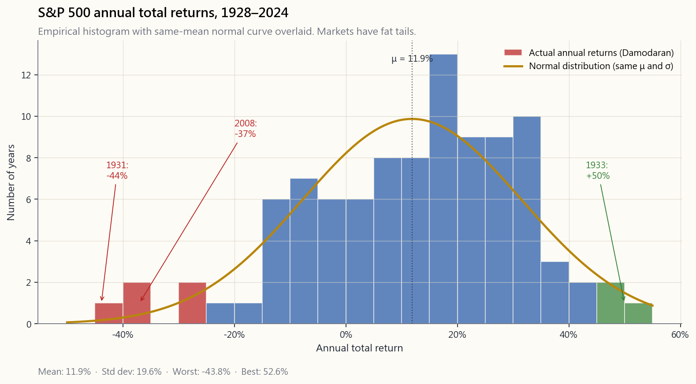
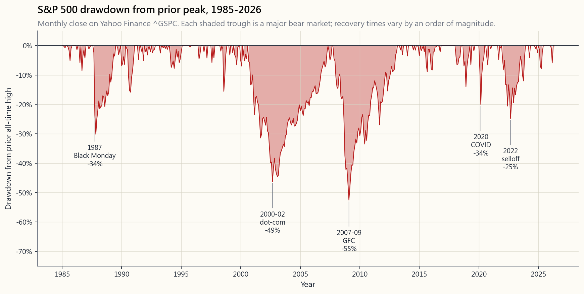
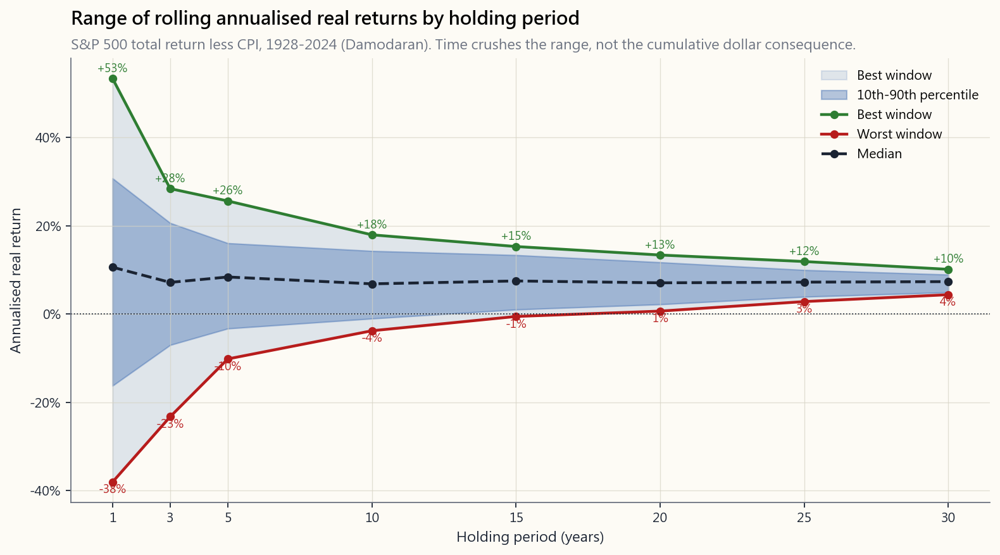
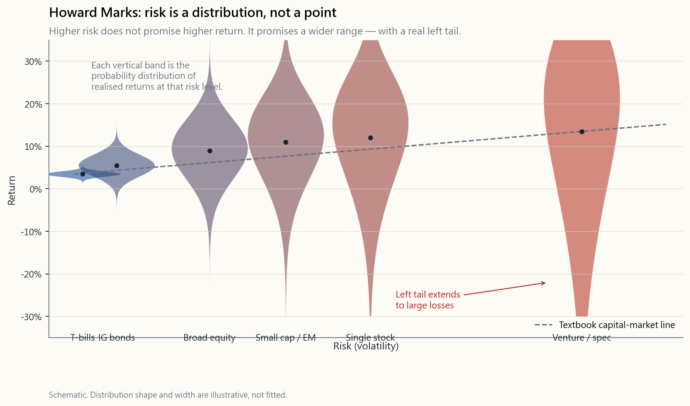

# 第三周：风险与收益——两大力量，诚实衡量

---

## 第一部分：阅读材料

---

### 1. 为什么这很重要

上周我们得出了一个简单的处方：指数交易所交易基金、每月自动转账、关掉应用程序。这个方法有效。但它也遮蔽了底层的运作机制，而正是这套机制，才能让你在下次市场给你一个40%回撤、饭局上有人告诉你"这次不一样"的时候，不会慌乱抛售。

风险与收益是驱动一切投资结果的两大力量。大多数初学者把全部注意力放在收益上——*"我能赚多少？"* 专业人士的问题恰好相反：*"我最多能亏多少、发生频率有多高、这种亏损是否能够承受？"* 如果你对第二个问题的回答是"我不知道"，那你不是在投资，而是在赌博，只是多走了几道弯路。

本课是后续所有内容的基础。我们将探讨风险究竟是什么（以及人们经常与之混淆的三件事）、如何在不欺骗自己的前提下衡量风险、为什么较高的预期收益*必然*要求承担更高的风险、为什么同样的风险数字在不同投资期限内的表现截然不同，以及为什么风险*承受能力*与风险*偏好*之间的区别，正是让退休人士遭受重创的根源。

坦诚的免责声明在前：**标准教科书对风险的处理，假设收益分布看起来像一条钟形曲线，但事实并非如此。** 市场存在厚尾效应——极端事件发生的频率远超数学模型的预测。本课的后半部分，我们将专门探讨为什么"5σ事件"这个说法只值得一笑，而不值得用来做规划。

---

### 2. 你需要了解的内容

#### 2.1 风险是结果的不确定性——而非单纯的"坏事"

在日常英语中，风险意味着*某件坏事发生的可能性*。在金融领域，风险有更精确的含义：**风险是结果的不确定性**。一种有风险的资产，不一定会让你亏钱，而是其未来收益无法预测。

三个月期美国国债收益率4.3%，之所以被视为近乎无风险，不是因为收益率高——它并不高——而是因为一个季度后可能出现的结果范围，基本上就是"4.3%，加减一个百分点的零头"。一只单一的生物科技股票之所以有风险，是因为一年后的结果范围可能从"临床试验失败，下跌90%"到"临床试验成功，上涨400%"。国债的*不确定性很低*，而生物科技股在两个方向上都存在*巨大的不确定性*。

人们经常与风险混淆的三件事：

1. **波动性**。波动性是风险的一种*衡量标准*——也是最常用的一种——但波动性≠风险。一个头寸可以平静五年，然后在一个月内崩溃（想想1998年的长期资本管理公司）。一个头寸可以每天剧烈波动，但在结构上有所约束（想想一个深度对冲的期权账簿）。*已实现的价格波动*与*风险*并不是同一回事。
2. **亏损概率**。抛硬币，赔付为−$1 / +$1，亏损概率为50%。抛硬币，赔付为−$1 / +$100，亏损概率同样是50%，但从风险调整角度来看，两者截然不同。单独的亏损概率并不能告诉你亏损发生时的*规模*。
3. **新闻里的标题数字**。"市场正在崩溃"并不是对任何事物的量化。暴跌是股票市场的常态特征——大约每十年发生一次，有时两次——一个把每次暴跌都视为紧急情况的投资者，将会一辈子都在底部卖出。

> *"风险来自于不知道自己在做什么。"* ——沃伦·巴菲特

#### 2.2 标准差——最常用的衡量工具

衡量风险最常见的指标是收益的**标准差**，通常称为**波动性**或"**vol**"。它告诉你，一项资产的实际收益偏离其均值的程度。

对于平均年收益率为$\mu$、标准差为$\sigma$的资产，*如果*收益呈正态分布（一个很大的假设；见§2.6）：

- 约**68%**的年份将落在$\mu \pm \sigma$区间内。
- 约**95%**的年份将落在$\mu \pm 2\sigma$区间内。
- 约**99.7%**的年份将落在$\mu \pm 3\sigma$区间内。

用1928年以来的标普500实际数据进行计算，得到的结果如下：

从这张图可以读出三点：

- **中心大约在每年11%。** 这是标普500长期名义总收益的平均值。扣除通胀后的"实际"数字更接近7%——而教科书上平滑的8%承诺，与圣诞老人的存在具有同等地位。
- **标准差大约为20%。** 68%的年份落在−9%到+30%之间。规划时要针对*区间*，而非均值。
- **分布在两侧尾部均比正态曲线更宽。** 1931年的−44%、2008年的−37%、1933年的+54%、1954年的+52%——这些在钟形曲线模型下都不应该发生，但它们确实发生了。市场存在**厚尾效应**。

各资产类别波动性的经验法则：

| 资产类别 | 历史年化标准差 |
|---|---:|
| 美国国债 | ~1% |
| 投资级债券 | ~6% |
| 美国大盘股 | ~16–20% |
| 美国小盘股 | ~22–28% |
| 新兴市场股票 | ~24–30% |
| 单只个股 | ~30%以上 |
| 比特币 | ~70%以上 |

从下往上读这张表。比特币的波动性大约是标普500的四倍——这意味着，钟形曲线模型认为指数"极端"的回撤，对比特币而言预计会达到四倍。这远比"比特币今年上涨了200%"这种标题所暗示的风险要大得多。

#### 2.3 股权风险溢价——承担风险的补偿

**风险溢价**是你在无风险利率之上，因接受不确定性而获得的额外收益。金融学中被引用最多的数字是**股权风险溢价（ERP）**：美国股票平均比美国国债多出多少收益。

反向视角与标题数字同样重要。教科书将国债收益率称为*无风险收益率*。但如果以购买力而非名义美元来衡量，一个更诚实的标签是**"无收益的无风险利率"**：国债保证*名义*美元会回来，但它也几乎保证你的购买力在通胀面前持续缩水——尤其是在金融压制环境下，短期利率被刻意压低至通胀水平以下。债券不是"小幅盈利"；而是*确定性地*损失购买力。股权风险溢价同样可以理解为：**波动性资产必须提供的折扣，才能在一种下行风险是确定性缓慢贬值的工具面前获得清算。**

标题数字还需要按货币制度分拆，因为"1928年以来的长期"平均了四个截然不同的货币制度，合并成了一个令人宽慰的数字：

| 货币制度 | 时间窗口 | 标普500名义复合年增长率 | 国债名义复合年增长率 |
|---|---|---:|---:|
| 布雷顿森林黄金本位 | 1928–1971 | ~9.5% | ~2.0% |
| 法定货币/去通胀化 | 1971–2008 | ~11.0% | ~5.7% |
| 零利率政策+量化宽松/金融压制 | 2009–2024 | **~14.5%** | ~0.9% |
| 完整样本 | 1928–2024 | ~10.5% | ~3.4% |

仔细阅读这张表。2008年后的货币制度——美联储基准利率从2009年到2015年以及2020年到2022年锁定在零附近，四轮量化宽松，美联储资产负债表从2008年的0.9万亿美元膨胀至2022年峰值的9万亿美元——产生了比长期平均高约35%的标普500复合年增长率，而国债收益近乎为零。大多数在世的散户投资者和大多数指数基金管理人，都是在这单一货币制度下建立起完整的思维模型的。"股票实际收益7%"是一个*跨越多个货币制度取平均*的说法，这些制度之间其实没有什么共同之处；*近期*的货币制度大幅超额奖励了股票持有者，同时金融压制了债券持有者，且没有任何保证下一个货币制度会类似于平均值或近期的表现。

完整样本的算术结果依然令人印象深刻：约7个百分点的名义差距，复利累积一个世纪，会将1美元国债变成约23美元，将1美元股票变成约11,000美元（实际数字更小；*比率*基本保持不变）。只需记住，这个比率大部分是由三个对股票有利的货币制度构建而成的；历史平均值不应与未来预期值混淆。

为什么股权风险溢价必然存在？两个均衡论据：

1. **投资者厌恶损失。** 给定两种预期收益相同的资产，几乎所有人都更偏好波动性较低的那种。为了让投资者*自愿*持有波动性较高的资产，其价格必须下跌，直到*远期*预期收益高到足以补偿为止。这个差距就是风险溢价。
2. **没有溢价，资产就无法出清。** 如果股票和国债提供相同的预期收益，理性投资者就不会持有股票；所有人都会卖出股票买入债券，股票价格下跌，远期收益上升——直到差距重新打开。风险溢价不是对"勇敢者"的道义奖励；它是波动性资产出清的机械均衡价格。

有一点教科书通常略过：股票和国债并*不是同类资产*，将它们放在单一风险轴上定价的模型，遮蔽的信息与揭示的一样多。股票是对一家企业生产性资产和现金流的永续剩余索取权——随着企业成长，其价值可以无限增长。国债是一种合同承诺，在固定日期返还固定数量的美元，对增长没有任何索取权，收益不超过票息。将这两者的"预期收益同样具有吸引力"相比较，就像是在比较苹果与苹果箱上剪下的优惠券。债券一侧远不如教科书所呈现的那样温和：

- **债券*价格*并不稳定。** 仅在2022年，30年期国债就下跌了约30%——跌幅超过股票熊市的中位数——而TLT（长期国债交易所交易基金）至今仍低于其2020年峰值。在没有明确说明*哪种债券、什么久期、什么货币制度*的情况下，称债券为"安全"是一种类别错误。
- **在5到10年的时间窗口内，蓝筹股的资本波动往往低于长久期债券。** 可口可乐、宝洁和强生，在过去20年里产生的逐市市值增长，比30年期国债更为稳健——而且还在此之上支付了持续增长的股息。
- **锁定到期的债券存在机会成本。** 在2009年至2021年的股票牛市中，持有4%收益的10年期国债，错过了约14倍的涨幅。无风险利率在*一个*维度上无风险，却在另一个维度上承担着巨大风险——那个维度就是你衡量遗憾的维度。

因此，将"风险的均衡价格"框架视为一个有用的第一视角，而非完整的答案。股权风险溢价是*市场*对这一差距的定价；债券是否真的比蓝筹股"更安全"，取决于你想规避哪种风险（逐市波动、违约、购买力损失、收益序列风险、机会成本）——而这些方向并不一致。

两点重要的注意事项：

- **溢价是*极长期限内的平均值*。** 自1928年以来，股票在约**65%至70%的自然年**中跑赢国债——更准确的说法是，*国债赢的年份是少数，几乎都是经济衰退或市场崩溃时期*（1929–32、1937、1973–74、2000–02、2008、2022）。因此，股权风险溢价与其说是"在国债占优的年份坚守股票的补偿"，不如说是*在那些集中爆发的痛苦年份吸收冲击的补偿，而在那些年份，平均值已然失去意义*。2008年的−37%，与被告知你在某个十年里跑输了7%，是完全不同的体验。
- **溢价可能收窄。** 当股票已经大幅上涨之后，*远期*预期收益就会降低；当前价格隐含的溢价，可能远小于历史平均水平。鲍勃·席勒的周期调整市盈率（CAPE）是尝试量化这一点的常用工具。2026年，CAPE约在30多的高位，隐含的远期股权风险溢价更接近3%至4%，而非7%。这并不是预测未来十年*一定*表现不佳——而是一个警告：历史平均值与当前预期值是不同的统计量。

#### 2.4 系统性风险与非系统性风险

这一区分是风险管理中最重要的概念性转变。它决定了哪些风险是市场付钱让你承担的，哪些风险是你在免费承担的。

- **非系统性（特异性）风险。** 特定于某家公司、某个行业或某个头寸。例如：CEO丑闻、产品召回、单一工厂火灾、针对某家公司的监管行动、矿难。**分散投资可以消除这种风险。** 持有500只股票而非5只，任何一家公司的CEO丑闻，对你投资组合的影响不过是零点几个百分点，而非20%。
- **系统性（市场）风险。** 影响整个经济或整个市场：经济衰退、利率变动、通胀、战争、疫情。**在股票资产类别内部，你无法通过分散投资消除这种风险。** 即使是完全分散化的股票投资组合，在1929年、1973–74年、2008年或2020年，也会亏损35%至55%。系统性股票风险，正是市场通过股权风险溢价*付钱*让你承担的。

  但"无法分散"这一说法是特许金融分析师考试的标准答案，它低估了实际可用的手段。**你可以通过持有非股票资产来分散系统性股票风险。** 长久期国债在2000–02年和2008年股票崩溃时上涨。黄金在2008年金融危机和2020年新冠疫情危机中均有上涨。做多波动率的期权结构，在股票快速下跌时明确产生收益。因此，理解"无法分散"的正确方式是：*在股票资产类别内部无法分散*——在多资产层面，系统性冲击本身是一种可以对冲或塑造的敞口。第4周（60/40）、第6周（黄金与大宗商品）、第15周（多资产构建）、第25至30周（期权作为敞口工具）以及第47周（显性尾部风险对冲），每一周都是针对本段所说的"无法分散的"股票系统性冲击的不同应对方式。这句话只有在你已经决定投资组合只能持有股票的前提下，才是成立的。

马科维茨为他赢得诺贝尔奖的洞见是：**由于非系统性风险可以通过分散投资免费消除，市场不会为承担它付钱。** 一个集中于五只股票的投资组合，总波动性远高于指数，而在所有可能的五股组合的横截面上，*预期收益相同*——但要注意，非系统性风险是双向的。在任何给定的十年内，*某些*五股组合会大幅跑赢指数（如果你的五只恰好是2014年的苹果、微软、亚马逊、英伟达）；*大多数*会大幅跑输；平均结果等于指数。你不是"注定会落后"——你是在围绕相同均值承担一种彩票式的分布，而市场不会为这种分散度付钱。

马科维茨的框架是**现代投资组合理论（MPT）**和**有效前沿**的基础——有效前沿是在给定方差下，最大化预期收益的投资组合轨迹。处于该前沿上时，所承担的唯一风险是系统性风险；低于前沿的任何组合都是在放弃免费的分散投资。完整的现代投资组合理论体系——协方差矩阵、均值方差优化、有效前沿、资本市场线——是第15周（多资产构建）和第23周（因子投资）所涵盖的工具箱，以及众所周知的实践批评（输入参数的估计误差、对厚尾的脆弱性、危机中协方差矩阵的失效）。将本段视为种子；正式处理在后续展开。

多少只股票才算"分散"？埃文斯与阿彻（1968）和斯塔特曼（1987）的研究——至今仍是教科书的标准引用——表明，非系统性风险的大部分降低来自于*最初*的15至20只股票；投资组合方差与持股数量的关系曲线，在大约20只股票之前非常陡峭，在大约30只之后几乎趋于平坦。在现代条件下（指数中超大市值股票高度集中，将重要的股票挤入前十分位），合理的研究人员将这一数字定得略高——姑且称为25至40只股票，*分布于不相关的行业*——但定性结论不变：你不需要500只股票来获取约95%的分散投资效益，你需要的是*足够多的股票，分布于足够多的行业，以确保没有单只股票能对投资组合产生实质性影响*。标普500为你提供了最后几个百分点的边际分散效益；在约30只精心挑选的股票之上的一切，都是锦上添花，而非突破性进展。

这正是对指数基金最精炼的论证：指数基金持有足够多的股票——以及足够多的行业——使得特异性风险接近于零，只留下市场实际为你付钱的系统性风险。除非你拥有真正的优势，否则集中选股就是在自愿接受围绕相同均值的更宽结果分布。某些选股者会大获全胜。成为其中之一的预期价值，与直接买入指数相同。

#### 2.5 回撤——真正考验你的风险

标准差是一个教科书指标。**最大回撤**——净值从峰值到谷底的跌幅——才是你的神经系统实际会使用的指标，不管你喜不喜欢。

以下是1950年以来标普500的实际回撤图。阴影区域是主要的熊市。每次事件中真正重要的数字，与其说是回撤的幅度，不如说是*恢复所需的时间*以及熬过来所需要的心理素质。

恢复时间（从峰值到新高），按事件划分：

| 事件 | 回撤幅度 | 触底所需月数 | 完整往返恢复时间 |
|---|---:|---:|---:|
| 1973–74年（石油危机） | −48% | 21 | 7.5年 |
| 1987年黑色星期一 | −34% | 3 | 2年 |
| 2000–02年互联网泡沫 | −49% | 30 | 7年 |
| 2007–09年金融危机 | −55% | 17 | 5.5年 |
| 2020年新冠疫情 | −34% | 1 | 5个月 |
| 2022年抛售 | −25% | 10 | 2年 |

从这张表中可以得出两个标准差数字无法捕捉的观察：

- **回撤对上涨年份的不对称性极为深刻。** 单次−48%的年份，需要+92%才能回到盈亏平衡点。对好年份和坏年份进行对称平均的钟形曲线模型，完全错过了这一点。
- **恢复时间与回撤深度同样重要。** 2020年新冠疫情崩溃与1987年崩溃的幅度相同——但1987年花了两年恢复，2020年只用了五个月。美联储的主动干预是其背后的机械原因。一位在1973–74年进行提取阶段的退休人员，必须在没有投资组合恢复的情况下熬过*七年半*，同时还在不断从中支取收入。这与2020年同等幅度的回撤却仅经历五个月反弹，是完全不同的问题。

行为层面的教训很简单。如果你的投资计划无法经受50%的回撤——也就是说，你会在这时卖出——那么你的计划已经失败了。计划必须*围绕*回撤来构建，而不是*忽视*它而建立。

#### 2.6 贝塔——斜率，而非全貌

标准差衡量的是*总体*风险，而**贝塔**衡量的仅是*系统性*风险——即随市场波动的那部分风险。

正式定义：贝塔是资产收益对市场收益回归的斜率。

$$ \beta_i = \frac{\text{Cov}(r_i, r_M)}{\text{Var}(r_M)} $$

读懂斜率，而非公式：

| 贝塔 | 含义 |
|---|---|
| 1.0 | 与市场同步波动——指数基金，由构造决定 |
| 1.5 | 波动幅度比市场大50%——典型的科技股/周期股 |
| 0.5 | 波动幅度比市场小50%——公用事业、必需消费品 |
| 0.0 | 与市场不相关——短期国债 |
| < 0 | 与市场*反向*波动——黄金有时如此，做多波动性亦然 |

**资本资产定价模型（CAPM）**利用贝塔计算预期收益：

$$ E[r_i] = r_f + \beta_i \cdot (E[r_M] - r_f) $$

用通俗语言表达：资产的预期收益等于无风险利率加上资产贝塔乘以股权风险溢价。CAPM出现在每一份CFA考试和每一本教科书中。**然而它也是一个在实践中效果不佳的描述。**预期收益的实际横截面，由其他因子（规模、价值、盈利能力、动量）解释得更好，而非仅靠贝塔——这一发现催生了整个因子投资文献，我们将在第23周加以介绍。将CAPM视为每位金融从业者都理解的正统出发点；将因子模型视为基于实证的改进。

#### 2.7 时间跨度——为何"风险"在1年与30年的维度上含义迥异

金融领域争论最多的话题之一，是股票在更长持有期内是否会变得*风险更低*。数据给出了一个细致入微的答案。

运行历史标普500数据集，计算1年、5年、10年、20年和30年滚动持有期内*最差*和*最好*的年化收益。图景十分震撼。

两个看似矛盾却都成立的事实：

- **滚动收益的区间随持有期显著收窄。** 在1年期，历史上从−38%到+52%都曾出现。在30年期，区间收缩至年化约+3%到+10%左右。到了30年之后，"股票总是赚钱的"对过去而言是一个站得住脚的表述。
- **糟糕序列的*累计*美元影响仍会复利累积。** 一个30年期年化收益"仅"为+3%实际收益的持有期，最终财富会*显著*低于年化+9%实际收益的情况。时间压缩的是*收益率*，而非*累计财富的差距*。

实际意义在于：**时间跨度扩展了你所能承受的风险上限。** 一位25岁、收入稳定、投资期限长达40年的年轻人，可以配置远高于一位65岁、投资组合需支撑未来25年生活开支的退休人员的股票仓位。25岁的人有时间等待50%回撤的恢复；65岁的人则没有。

在你过度依赖滚动收益图表之前，有一个警示值得注意。美国数据集是一个*幸存者*。有两个当代股票市场的表现并不像标普500，就摆在眼前：

- **日本，1989–2024年。** 日经225指数于1989年12月见顶于38,915点，直至**2024年2月**才重新超越这一水平——名义上整整经历了一次*35年*的原路返回。一位在1989年高点买入指数并坚持再投资股息的日本投资者，在整整一个职业生涯里资本增值为零。经通胀调整后，这次原路返回在2026年仍未完成。日本版"长期持股"教科书与美国版本面貌迥异。
- **中国A股，2007年至今。** 上证综指于2007年10月见顶于6,124点，2026年5月前后交投于约**3,300点**——*较峰值仍低46%，历时近二十年*，其间经历了两次夭折的反弹（2015年的小型泡沫、2021年新冠疫情后的反弹），均在一年内原路折返。"同期经济实现了巨大增长"是事实，*却*与股东无关，因为大部分增长归属于私人和国有股东，而非少数股权持有人。（这正是地理集中度的重要性所在——市场必须尊重少数股东，长期复利才能成立。）

更深层的教训是：**股票市场必须与长期内在实体经济保持某种真实的关联，也必须与少数股东实际获得回报的法律和政治条件相符。** 孤立地研究历史价格数据——不追问*为何*一个市场能复利百年、以及这些条件是否依然成立——是将"任何股票市场坚持持有30年"这一论断运用于全球任意市场背后的核心方法论错误。美国市场百年复利依赖于特定条件（法治、美元储备地位、生产率增长、人口扩张、货币制度）。其中一些条件在2026年正在明显弱化；导致日本失去的数十年和中国指数区间震荡的条件并非凭空捏造，只是尚未降临美国——而已。

这正是下一段将要介绍的收益序列风险。一位在退休*头两年*就遭遇1973–74年行情的退休人员将永久受损——回撤期间每一笔提款都在卖出无法再复利增长的股份。而同样的回撤，若发生在退休后15年，则几乎不受影响。**同样的回撤。同样的收益分布。不同的序列。不同的结果。**

#### 2.8 风险承受能力与风险偏好——致命的错位

最后一个区分。这是最常被忽视的，也是真正导致散户投资组合爆仓的那个。

**风险承受能力**——基于客观条件，你*能够*承担多少风险：

- 时间跨度
- 收入稳定性
- 净资产相对于生活成本的比例
- 保险及其他缓冲
- 投资组合是否支撑日常生活开支

**风险偏好**——你在心理上*愿意*承担多少风险：

- 看到账户下跌30%时你的真实反应
- 你是否能在熊市中安然入睡
- 投资组合表现不佳的日子是否影响你的人际关系、睡眠和工作

错位象限是危险所在：

| | 高承受能力 | 低承受能力 |
|---|---|---|
| **高风险偏好** | *匹配。* 承担适当风险，睡得安稳。 | **危险地带。** "我能承受波动性" + 投资组合支撑你的房租 = 糟糕的一年让你一无所有。 |
| **低风险偏好** | 认知问题——你有足够的时间跨度，但情绪驱使你在底部出逃。 | *匹配。* 保守配置是正确答案。 |

两种失败模式：

- **高风险偏好，低承受能力。** 一位67岁的退休人员，亲历了2009–2024年的大牛市，于是认定自己*信仰股票*。他目前持仓100%股票，正处于回撤第二年，每年提取4%维持生活。30%的回撤迫使他在底部卖出股份以维持生活开支；这些股份对他而言再也无法恢复。再经历三年下跌，投资组合将永久受损。这是散户退休投资者爆仓*最常见*的方式——将自己的风险偏好当成了风险承受能力。
- **低风险偏好，高承受能力。** 一位28岁的工程师，拥有20年投资期限和可观薪资，却因为"不信任市场"而将储蓄存放在高收益储蓄账户中。她完全有能力承受50%的回撤——每两周薪资照常入账，毫不受影响。她缺乏的是*经历*，即亲身坐穿一次回撤的经验。解决之道不是"更勇敢"，而是循序渐进的投入：小仓位入场，经历一次回撤，看着它恢复，加仓，循环往复。随着时间推移，逐步建立风险偏好。

在确定仓位之前，最值得问自己的一个问题是：**"如果这个仓位下个月跌50%，我会被迫卖出吗？"** 如果诚实的答案是肯定的，那么仓位过大。不断削减，直到答案变为否定，无论你的"风险偏好"告诉你什么。

对这个问题，有一个合理的反驳，因为其框架过于被动：如果你真的*知道*某个仓位下个月会跌50%，正确的应对不是"缩小仓位并硬扛"——而是*对冲下行风险、卖出仓位，或做反向交易*。这个问题是仓位管理工具，而非预测工具。而"你无法择时"这句教科书式的反射动作，需要一个更成熟的版本：**日复一日，市场近似随机游走；但十年尺度上的宏观体制断裂，是一列缓慢驶来的列车，只要你留心，就能看见。** 散户投资者曾有真实机会解读的几个近期案例：

- **2008年全球金融危机。** 贝尔斯登于2008年3月崩溃。雷曼兄弟于2008年9月破产。标普500熊市最惨烈的阶段从2008年9月延续至2009年3月——距煤矿里的金丝雀已死在众目睽睽之下，整整过去了*六个月*。
- **2020年新冠崩盘。** 武汉首批新冠肺炎病例于2019年12月至2020年1月间被报告。意大利于3月9日开始封锁。标普500于2020年2月19日见顶——彼时一种新型呼吸道病毒已在多个大洲夺命传播，距此已过去近两个月。随后发生的34%暴跌，是在全球经济即将停摆的公开新闻已持续数*周*之后才到来的。
- **2024年特朗普-伊朗战争威胁。** 美国航母打击群在市场真正因地区战争风险出现震荡的数*周*前，就已明显向中东重新部署。

这些事件没有一个是事先无从知晓的。没有一个需要内幕消息；相关数据就印在《华尔街日报》头版。"你无法择时"对主导95%交易时段的日常噪音是正确的；将其套用于*可见的、缓慢演变的体制事件*则是懒惰之举。第47周（尾部风险）和第五层级框架将正式重建这一思路：关注宏观层面的信号，在事件发生前而非发生后对冲，并接受有时入场偏早是这么做的必要代价。

> *"市场保持非理性的时间，可以比你保持偿付能力的时间更长。"*
> ——约翰·梅纳德·凯恩斯（归因）

#### 2.9 霍华德·马克斯——风险是永久亏损的概率，而非波动性

以上所有内容都是这个行业使用的标准量化工具：标准差、贝塔、回撤分布、正态曲线、股权风险溢价。**霍华德·马克斯**——橡树资本联合创始人、《最重要的事》与《掌握市场周期》作者——用四十年时间正确地指出：这整套工具箱将*一个可观测的代理指标*与真实事物本身相混淆。

他的核心主张，一句话概括：**风险是你的本金遭受损失的概率，而非价格图表途中的上下波动。** 一个仓位在年内波动±30%但每十年都能收于更高位，其风险*低于*另一个在九年间悄然稳步上涨、却在第十年归零的仓位——尽管标准差计算会得出相反的排序。

三个值得铭刻于心的马克斯思想：

1. **风险大多数时候是不可见的。** 它是*潜伏的*，而非*显现的*。2007年之所以令*几乎所有人*感到安全，是因为风险已在体系内部积聚多年，却未在波动性中显现。抵押贷款利差收窄，波动率指数低迷，所有模型都显示世界一片平静。而正是因为它不可见，风险才处于极值。等到风险体现在波动率数字上时，交易早已输掉。反之，极度*恐慌*的时刻，通常也是风险最小的时刻：强制抛售已将价格压至内在价值以下，边际卖家已悉数离场，未来预期收益处于最高点。马克斯将这一点系统化为他的**风险分布图**：

   - 教科书上的资本市场线在每个风险水平上绘制*单一*预期收益：承担更多风险，获得更多收益。平滑、单调、令人安心。
   - 马克斯的图表将该线上的每个点替换为一个*概率分布*——向右延伸时愈加宽阔。在低风险端（国债），分布是均值附近一个窄峰。在股票类资产风险水平，它是一个有真实左尾的宽阔区间。在风险投资和投机性风险水平，分布*极为宽阔*，且左尾延伸至零。
   - 诚实的解读：**在风险轴上向右移动，并不保证更高的收益。它保证的是更宽的收益分布**——包括远差于留在更安全位置时所能获得的结果。预期收益上升；但任何个体投资者的*实际*收益可能落在任何地方，且随着风险增加，这种不确定性愈演愈烈。

   

2. **投资者的首要任务不是赚钱，而是不被清零。** 马克斯将此称为*首先求生存*。亏损50%需要盈利100%才能恢复。亏损90%需要盈利900%。亏损100%则需要奇迹。亏损恢复的非对称性意味着，任何有爆仓可能的策略——哪怕年概率仅为1%——在足够长的时间轴上，终将爆仓。*"要赢得比赛，你必须坚持到最后。"* 仓位管理、杠杆纪律和尾部风险意识，不是附加在收益最大化策略之上的补充议题，而是*前提条件*——没有它们，收益最大化不过是赌博。

3. **你无法以结果来评判一个决策。** 好的决策可能有坏的结果（掷出了蛇眼），坏的决策可能有好的结果（醉驾却平安到家）。大多数散户投资者用盈亏来评价自己，这意味着他们奖励了那些碰巧成功的坏决策，惩罚了那些碰巧亏损的好决策。专业的问题是：*在当时已知的信息下，该仓位的风险调整后预期收益是否得到了恰当的仓位管理？* 这个问题可以独立于结果来回答。盈亏是嘈杂的代理指标；流程才是真正的信号。

与上述一切的联系：**标准差、贝塔和正态曲线，是对*普通*市场环境下*可见*风险的有用汇总。** 它们对马克斯所描述的风险系统性地视而不见——那种潜伏的、受体制条件约束的、非对称的、在最不可见时最为危险的风险。诚实的框架同时持有两种视角：用量化工具衡量可以衡量的，用马克斯的框架提醒自己，屏幕上的数字不是事物本身，而且*这一切的目标，是十年后你依然在局中。*

> *"风险意味着可能发生的事情比将要发生的更多。"*
> ——埃尔罗伊·迪姆森，被霍华德·马克斯引用
>
> *"最危险的事情，往往是人人都认为安全的事情。"*
> ——霍华德·马克斯
>
> *"你无法预测，但你可以准备。"* ——霍华德·马克斯

---

### 3. 常见误区

**误区一："更高的风险总是意味着更高的收益。"**

更高的风险意味着*资产类别整体*在较长时间跨度上有更高的*预期*收益。这并不意味着任何单个仓位的收益更高。一只生物科技个股风险极高，若其临床试验失败，可能颗粒无收。风险溢价适用于承担*系统性*风险的分散化投资者；集中持有单一个股承担的是巨大的*非系统性*风险，而市场并不为此付酬。风险与预期收益的正比关系，适用于*资产类别层面*，而非单一仓位层面。

更重要的是，主动散户投资者的目标*并非*承担更多风险以换取更高收益——而是寻找**非对称交易**：上行空间显著大于下行空间的回报结构，即在不需要以同等规模的下行风险为代价的前提下，为厚尾上行进行布局。哑铃结构（第47周，第五层级）是最简洁的表达：一端是高确信度的安全资产，几乎没有下行风险；另一端是下行有限（买入看涨期权、做多波动性、结构化期权仓位）、上行无限的非对称投机。"更高风险＝更高收益"是*被动投资*的通俗表述。主动投资的表述是：*寻找那些稀有的结构——下行空间的封顶让上行得以复利积累——并跳过教科书所描述的那种对称交易。* 本课程先教教科书内容，因为不了解就无从批判——但课程的长期目标是非对称交易，而非对称交易。

**误区二："只要持有足够长时间，股票总会上涨。"**

美国股票最终总是收复失地，但"最终"可能意味着七到十五年。日本股票于1989年见顶，直至2024年才重新超越——等待了35年。还存在一个**幸存者偏差**问题：我们研究美国市场，是因为它成为了20世纪最成功的股票市场。中国、俄罗斯、阿根廷、埃及在1900年都拥有繁荣的交易所，但在随后的一个世纪里，实际收益率均为−100%。"长期持股"在*所测量的样本*上是成立的。但这个样本是以美国为条件的。

**误区三："标准差涵盖了所有风险。"**

它所捕捉的是*高斯*风险，其假设是收益服从正态分布。然而收益并非如此。市场具有**厚尾**特征——极端波动发生的频率远高于正态曲线模型的预测。按高斯算法，2008年的崩盘是大约5σ事件，正态分布认为这应约每14,000年发生一次。然而它发生了。1987年也是如此（按当时盛行模型，是22σ事件）。分布*主体*的标准差无法预测*尾部*的规模或频率。这正是为何我们将在第47周专门讨论尾部风险对冲，而非依赖正态曲线来确定仓位。

**误区四："债券是安全的。"**

债券的波动性*低于*股票，但并非无风险。仅2022年一年，长期债券就损失了约30%的价值——这一回撤幅度超过了股票熊市的中位数水平。债券持有人还面临通胀风险（在实际通胀6%的环境下，4%的债券即便支付正名义收益率，也在侵蚀购买力）和信用风险（发行人违约）。1982–2020年的债券牛市，训练了整整一代投资者和顾问将"债券"与"安全"画上等号。事实并非如此，而令它们看似等同的那个时代已经逆转。

**误区五："已实现波动性低就意味着风险低。"**

有时是，有时不是。伯尼·麦道夫的基金自1992年起呈现出难以置信的低波动性和稳定收益——*因为那些收益是伪造的*。长期资本管理公司的策略多年来以极低的已实现波动性运行，却在1998年的单个季度内爆仓，并需要美联储协调救援。*已实现*波动性只是一个观察窗口；*风险*是所有可能结果的完整分布，包括那些尚未发生的。低波动性可能是一个陷阱——体制断裂前的平静。

**误区六："风险偏好是固定的性格特征。"**

它会随经验、投资组合规模和人生阶段而变化。一位从未经历过熊市的25岁投资者，往往在第一次熊市中发现，自己在券商问卷上填报的风险偏好只是理论上的。同一个人十年后，亲历两次回撤并看着市场恢复，第三次回撤来临时会毫无波澜地安然入睡。风险偏好是建立起来的，而非宣告出来的。

**误区七："分散投资就是持有很多不同的基金。"**

分散投资的本质是持有*不相关的风险敞口*。持有十家不同基金管理人管理的十只美国大盘股基金几乎毫无意义——它们持有的基本上是相同的标的，具有相同的贝塔，面对同样的宏观冲击会同步下跌。持有一只美国股票基金、一只长期国债基金、黄金和一只做多波动性的对冲工具，才能实现*真正的*分散投资，因为这些资产对相同宏观冲击的反应截然不同。基金数量是个虚荣指标，不同的独立风险因子数量才是真正的衡量标准。

---

### 4. 问答

**Q1：既然系统性风险永远无法消除，为什么还要在股票内部做分散投资？**

答：为了消除*非系统性*风险——那是你不应该承担却得不到补偿的风险。
教科书中那个经典例子——"五只股票的投资组合与指数的预期收益相同，但总风险更高"——来自 Evans & Archer（1968）和 Statman（1987）的研究，他们计算了从数千个随机抽取的五只股、十只股、二十只股投资组合中得出的*平均*投资组合方差。*平均值*是关键词。现实中，没有任何一个五只股投资组合的收益与指数相同——大多数跑输，少数大幅跑赢，只有*横截面均值*等于指数。统计论证在*期望值*层面是正确的；任何一个五只股投资组合的实际路径，都是从一个宽得多的分布中抽取的一次样本。市场不会为你坐在这个宽分布里买单。持有约25至40只分散得当的股票（或直接买入指数），你就能获得约95%的分散投资收益，而无需承受彩票式的方差。

**Q2：比特币的波动性超过70%。同样的风险溢价逻辑适用吗？**

答：理论上适用——比特币的预期收益必须足够高，才能匹配其波动性。但实际上，比特币的预期收益*无法仅凭价格历史得知*，因为这个资产太年轻，其货币体制仍在谈判之中。标准风险溢价数学需要用100年的数据来推算股权溢价——而即便如此，那也是一个比听起来更脆弱的推算。100年前、50年前与今天的股票，在实质上并不是同一种证券：1971年后美元脱离金本位，整个货币体制发生了变化；2008年后的零利率政策和量化宽松，为风险资产制造了一种在早期年代并不存在的结构性买盘；税法、市场微观结构（电子交易、交易所交易基金、0DTE期权）以及主导边际参与者（被动资金流与主动选股），在样本期内都已经翻转。将如此根本性的体制变革全部叠加平均，得到的是*不同证券的均值*，而不是同一证券的稳定估计。比特币只有15年历史，其中前8年几乎零采用率，后7年才是全部价格历史。运用这个框架，但不要假装*任何一方*的标准误差都很小。

**Q3：如何诚实地评估自己的风险承受能力？**

答：两步，按顺序进行。第一步，诚实评估自己的*风险承受能力*：时间跨度、收入稳定性、生活支出对投资组合的依赖程度。第二步，用少量资金配置一个波动性资产，*亲身感受*回撤时自己的真实反应。券商问卷中的自我申报风险承受能力，与真实熊市中的实际行为相关性很差。风险承受能力是观察得来的，不是申报出来的。

**Q4：既然债券不再是可靠的通胀对冲工具，为什么60/40还是传统的投资组合？**

答：60/40建立在一个特定的40年时间窗口（1982–2020）之上，在那段时期：（a）债券收益率高于通胀；（b）股票下跌时债券上涨。这两点在2022年同时失效——股票和债券双双下跌约20%。传统60/40是一种*旧体制下的遗留*配置。现代替代方案用现金、黄金和做多波动性对冲（第47周，第5级）取代部分或全部债券仓位。

**Q5：对零售投资者来说，最有用的单一风险指标是什么？**

答：**最大回撤**——你所运行策略的最大回撤，并以*你自己的*投资组合规模来衡量。将你的投资组合价值乘以0.5（十年一遇的股票回撤合理估计），问问自己：屏幕上显示的那个亏损金额，是否会迫使你做出糟糕的决策？如果是，你的风险配置过重。如果否，你可以继续持有。

**Q6：为什么教科书一直使用标准差，即便它并不理想？**

答：因为它有良好的数学性质（在线性组合下可加、易于从数据中估计、在模型中表现良好），而不是因为它捕捉到了真正重要的风险。标准差是分布主体部分的有用*摘要*。但它无法充分描述*尾部*——而那恰恰是你真正记得的亏损所在之处。诚实的专业人士同时使用标准差*加上*回撤*加上*尾部事件分析——从不单独使用任何一个。

**Q7：对投资者来说，波动性是好事还是坏事？**

答：对一个多年来持续*定投*的买入者而言，温和的波动性略有好处（在下跌时以折价买入）。对一个坐拥累积财富的*持有者*而言，波动性主要是做生意的成本——在预期上并非"坏事"，但它是你需要承受的情绪负担。对一个处于减仓阶段的*卖出者*而言，波动性确实代价高昂，因为存在收益顺序风险。同样的数字，在人生不同阶段意味着不同的事情。

一旦期权进入工具箱，**波动性本身就是一种资产类别**——而不仅仅是需要承担的风险。上市期权的隐含波动率可以独立于标的物进行交易和重新定价；做多波动性的头寸可以在股票回撤中复利增长，而同期的买入持有投资组合却遭受重创。第25至30周介绍期权机制，第29周涵盖希腊字母（vega是对波动性的直接敞口），第47周将做多波动性的尾部对冲仓位构建为永久配置而非战术交易——第47周引入一种受龙型投资组合启发的结构，将做多波动性作为永久配置。"波动性是好是坏？"一旦你能直接买卖它，这个问题本身就问错了；正确的问题是*当前波动性处于何种体制，我站在哪一侧*。

**Q8："肥尾"对头寸规模究竟意味着什么？**

答：无论正态分布模型说什么样的回撤是"极端情况"——都要按实际深度两倍来规划。2008年全球金融危机在当时主流风险模型下是一个5σ事件；规划能否熬过正确量级的5σ事件（即美国大盘股约50%的跌幅，而非模型预测的约25%），正是让投资者留在牌桌上的关键。简单记法：*每十年规划一次腰斩，毫无预警。*

**Q9："哑铃型"结构与标准差有何关系？**

答：哑铃型结构正是*利用*肥尾分布的特点。通过在一端持有高确信度的安全资产（短期国债、黄金、现金），在另一端持有下行有限的不对称投机（买入看涨期权、做多波动性结构），由此形成的投资组合，其*算术*标准差高于被动分散的核心组合，但回撤表现*更好*，对尾部事件的应对*也更好*。单看标准差，它显得"风险更高"；看回撤分布，实际上并非如此。这是第14周/第5级的话题，但这个框架对于如何理解本课至关重要。

**Q10：本课与课程其余部分有何关联？**

答：风险与收益是后续一切内容的基础。第4周（60/40）和第11周（再平衡作为行为纪律）是塑造多资产投资组合风险特征的练习。第13周起（多空、配对交易）是关于消除系统性风险、隔离特定押注的内容。第25至30周（期权）是*不对称地表达*风险的工具箱。第47周（尾部风险）是对本课所开启的肥尾问题的明确处理。每一个后续策略都将依据其风险特征而非仅仅是收益来评估。

网站上的互动演示将本课延伸至一个**持有期探索器**：一个滑块让你选择从1年到30年的任意滚动窗口，图表显示该窗口内年化实际收益的历史分布——最好、最差、中位数，以及最终低于零的概率。1年和20年时的分布形态本质上就是§2.7的图表，但你可以在之间滑动，观察尾部收窄的过程。

---

## 第二部分：YouTube 脚本

---

**视频标题：** 风险与收益——两股力量（以及5σ谎言）| 第3周

**目标时长：** 约22分钟

**主持人：**
- **陳馬**（讲师）
- **小魚**（学生）

---

**[开场]**

[VISUAL: 标题卡"第3周——风险与收益"]

**陳馬：** 两周过去了，我们已经确立了两件事：通胀是重力，所以你必须投资。几乎所有人的正确默认选择，都是低成本的指数交易所交易基金。今天这一课，我要告诉你持有那只交易所交易基金*实际上是什么感觉*——因为底层的运作机制，决定了你是在底部卖出，还是坚持持有。

**小魚：** 而这个运作机制就是风险与收益。

**陳馬：** 两股力量。它们形影不离。散户投资中几乎所有的错误，都来自于关注第一个、忽视第二个。

---

**[第1段：风险究竟是什么]**

**陳馬：** 先把字典定义放一放。在金融中，风险是*结果的不确定性*。一张收益4.3%的国债——你几乎清楚地知道三个月后会有多少钱。一只生物科技股——你可能涨400%，也可能跌90%。生物科技股的风险不在于它*不好*；它的风险在于未来是*无法预知的*。

**小魚：** 所以波动性就是风险？

**陳馬：** 波动性是风险的一种*度量*，而不是风险本身。一个头寸可以安静好几年，然后在一个月内爆炸。你在图表上看到的已实现价格波动，和未来结果的实际概率分布，不是同一回事。

[ANIMATION: animation/week03_definitions.mp4 — 三格画面：国债区间非常窄，标普500区间中等偏宽，单只生物科技股区间极宽。]

---

**[第2段：那条并不存在的钟形曲线]**

[VISUAL: 切换至历史分布图——image/week03_return_distribution.png]

**陳馬：** 这是标普500从1928年到去年的实际年度收益。叠加的平滑曲线，是正态分布在相同均值和标准差下所预测的收益*应该*是什么样子。

**小魚：** 实际数据的尾部比曲线厚得多。

**陳馬：** 厚得相当明显。看看1931年。看看2008年。看看1933年的上行端。这些在钟形曲线模型下都不应该发生。但它们发生了。教科书对风险的标准处理使用钟形曲线。诚实的处理方式则会指出，市场存在所谓的*肥尾*——无论模型说什么是"5σ事件"——正态曲线说这每一万四千年才发生一次——在真实市场中，大约每十年就发生一次。

**小魚：** 所以当电视上有人说"这是一个5σ的走势"——

**陳馬：** 他们是在承认自己的模型是错的。那句话应该让你发笑，而不是点头。

---

**[第3段：股权风险溢价——以及"无风险无收益率"]**

**陳馬：** 现在来看第二股力量。为什么股票的收益高于国债？因为投资者厌恶亏损。如果股票的预期收益与债券相同，没有理性投资者会持有波动性更高的资产。所以股票价格下跌，直到*远期*预期收益足以补偿波动性为止。这个差额就是股权风险溢价。长期平均数字：每年约五到七个百分点。

**小魚：** 反过来说呢？

**陳馬：** 同一个事实，换种诚实的说法。教科书把国债收益率称为*无风险收益率*。准确的标签是*无收益的无风险利率*。你能拿回本金，但你*肯定在损失购买力*。在金融压制的环境中——短期利率被压在通胀之下——债券持有者是在*确定性地*落后。风险溢价不仅仅是对承受波动性的补偿；它是波动性资产必须提供的折扣，才能对抗那个保证缓慢衰减的工具。

**小魚：** 而且长期平均值承担了太多重量。

**陳馬：** 看看体制分割。1928年至1971年——布雷顿森林黄金锚定体制——标普500名义收益率约为9.5%。1971年至2008年——法币时代，通缩——约为11%。*2009年至2024年*——零利率加四轮量化宽松——名义收益率约为**14.5%**，而国债收益率几乎为零。美联储印了十五年的钱，受益最大的资产是股票。大多数散户投资者和大多数指数基金经理，都在那单一体制中构建了他们全部的心智模型。

**小魚：** 那席勒周期性调整市盈率今天在哪里？

**陳馬：** 三十几倍。在那个估值水平下，美国股票的远期预期实际收益率约为3%至4%，而非7%。这不意味着未来十年会很糟糕。这意味着历史平均值是一个不同于*当前*预期值的统计量，而近期体制严重超额支付——不要将其外推至未来。

---

**[第3B段：债券不是安全的对立面]**

**小魚：** 那交易的另一边——债券呢？

**陳馬：** 有两个警示是教科书轻描淡写的。第一：债券和股票*不是同一类东西*。股票是对一家成长中的企业的永续索取权。国债是对固定美元金额的合同承诺。将它们的"预期收益同样具有吸引力"进行比较，是在拿苹果和苹果箱上剪下来的票息作比较。第二：债券*价格*并不稳定。30年期国债在2022年单年就亏损约*30%*——比大多数股票熊市还要深。TLT，长期国债交易所交易基金，到2026年仍低于其2020年的峰值。而可口可乐或宝洁20年来的按市值计算财富增长比长期债券更稳定——*还*在此之上支付了不断增长的股息。"债券安全"这句话需要加星注：对抗*哪种*风险而言的安全？违约风险？按市值计算的风险？购买力风险？机会成本风险？这几条并不总是指向同一个方向。

**小魚：** 那股票实际上有多少年跑赢国债，逐年来看？

**陳馬：** 1928年以来，约65%到70%的日历年。国债只在糟糕的年份获胜——1929至1932年、1937年、1973至1974年、互联网泡沫、全球金融危机、2022年。风险溢价不是"对熬过国债获胜年份的补偿"。它是对*吸收那些集中、痛苦年份*的补偿——在那些年份里，平均值毫无意义。2008年的负37%，与被告知十年里跑输了7%，是完全不同的体验。

---

**[第4段：系统性风险与非系统性风险]**

[VISUAL: animation/week03_diversification.mp4 — 五只股票→五十只股票→五百只股票；非系统性噪音逐渐消融，而系统性波动的底部依然存在。]

**陳馬：** 两种风险。*非系统性*风险特定于某一家公司——CEO丑闻、工厂火灾、药物试验失败。*系统性*风险是影响整个市场的因素——经济衰退、通胀、战争。

**小魚：** 其中一种我可以通过分散投资消除。

**陳馬：** 非系统性风险，可以。教科书给出的数字是"持有500只股票"——但Evans和Archer 1968年的研究，以及Statman 1987年的后续研究表明，分散投资收益的大部分在*前15到20只股票*时就已获得。今天持有约25到40只分散得当的股票，你已经获得了约95%的收益。标普500帮你拿到最后几个百分点。

**小魚：** 而系统性风险——你之前说教科书称之为无法分散的。

**陳馬：** 在股票仓位内部，确实如此。*但在多资产层面*，这句话是错的。长期国债在互联网泡沫破裂和2008年时都上涨了。黄金在2008年和新冠疫情中都上涨了。做多波动性的期权结构*就是*在股票快速下跌时获利的。CFA教材中"你无法分散系统性风险"这句话，只有在你已经决定投资组合中只持有股票的前提下才成立。第4周——60/40。第6周——黄金。第15周——多资产构建。第25至30周——期权作为敞口工具。第47周——明确的尾部风险对冲。这每一个，都是对今天这堂课所说"无法触碰"的股票系统性冲击的一次攻击。

**小魚：** 那如果我持有一个五只股票的投资组合……

**陳馬：** 大多数五只股票组合跑输；少数大幅跑赢；*横截面均值*等于指数。你不是注定落后——你是在相同均值附近承担了彩票式的分布，而市场不会为你承担的那个分散程度买单。这——马科维茨框架、有效前沿、现代投资组合理论——我们将在第15周和第23周正式讲解。

---

**[第5段：回撤——你的神经系统使用的数字]**

[VISUAL: 切换至 image/week03_drawdowns.png，逐一解读四次重大熊市。]

**陳馬：** 教科书使用标准差。*回撤*——从峰值到谷底——是你的神经系统使用的数字。看这张图。四次重大熊市：1973至1974年、互联网泡沫、全球金融危机、新冠疫情。

**小魚：** 新冠那次在时间轴上看起来比其他的小多了。

**陳馬：** 幅度相当——约34%——但复原只用了五个月，而不是七年半。美联储干预是机械层面的原因。同样的回撤，因为你碰巧生活在哪个年代，感受完全不同。

**小魚：** 如果我在1973年是一名退休人员呢？

**陳馬：** 你会在投资组合恢复之前熬过七年半，同时靠它维持生计。这就是收益顺序风险，也是为什么"长期持有股票"这句话，在25岁听起来和在65岁听起来完全不同。

---

**[第6段：时间跨度压缩区间——基于美国样本]**

[VISUAL: 切换至 image/week03_holding_periods.png]

**陳馬：** 现在说好消息。看这张滚动收益图。在一年期，美国股票的收益区间从负38%到正52%都有。在三十年期，最差约为正3%实际收益，最好约为正10%。

**小魚：** 时间压缩了区间。

**陳馬：** 压缩的是*年化收益率*。糟糕序列的累计美元后果仍然在复利——三十年以正3%实际收益率运行，与以正9%运行相比，财富结果截然不同。然后是加星注：这是*美国*样本。有两个显而易见却并不如此表现的市场——日本，日经指数于1989年12月在38,915点见顶，直到2024年2月才再次突破该水平。*整整三十五年。*一整个职业生涯，零资本增值。中国A股于2007年10月在上证综指6,124点见顶——截至2026年仍低于那个峰值46%，将近二十年，期间两次流产式复苏都在一年内回吐。

**小魚：** 而中国经济在那段时期大幅增长。

**陳馬：** 对。*但这个增长没有归于少数股权持有者。*增长流向了私人和国有所有者，而非公众股东。更深层的教训是：一个股票市场必须与底层实体经济保持诚实的关系，*同时*与少数股东实际获得回报的法律和政治条件相符。研究历史价格数据而不追问*为什么*这个市场能复利增长一个世纪——以及这些条件是否仍然成立——是将"任何市场买入持有30年"这一说法套用于全球任何市场背后的核心方法论错误。美国的复利建立在法治、美元储备货币地位、生产率增长、人口扩张、货币体制之上。其中一些在2026年正在弱化。

---

**[第7段：承受能力与容忍度——人们爆仓的地方]**

**陳馬：** 最后一个概念，也是最重要的。两个被混为一谈的不同概念。

*风险承受能力*——你能承受多少。时间跨度、收入、投资组合是否支撑你的房租。客观的。

*风险容忍度*——你在看着它下跌时的真实感受。主观的。

**小魚：** 危险的组合是高容忍度、低承受能力。

**陳馬：** 那个67岁的退休人员，看着2010年代的行情，决定自己相信股票，100%配置股票，每年提取4%维持生活，然后遭遇30%的回撤，被迫在底部卖股票付房租。他卖掉的那些股票*对他而言*再也没有恢复。这个人就是典型的散户爆仓案例。他有容忍度——但他没有承受亏损的能力。这两者从来就不是同一个问题。

**小魚：** 解决方案呢？

**陳馬：** 按你的*承受能力*来确定仓位，而不是按你的*容忍度*。在给任何东西定仓位之前，最好问自己的一个问题：*如果这个头寸下个月跌50%，我会被迫卖出吗？*如果是，仓位太大了。减仓，直到答案变成否。不管你自我感觉多勇敢。

**小魚：** 不过有个反驳——如果我真的*知道*一个头寸下个月会跌50%，我不会把仓位缩小。我会对冲或者做空它。

**陳馬：** 正确。这个问题是一个*定仓*工具，不是一个*预测*工具。而"你无法择时"这个教科书式的反射，需要一个成熟版本：日复一日，市场大致是随机游走。*十年尺度的宏观体制断裂*是一列慢动作的火车事故，如果你留意，是可以看见它来临的。贝尔斯登在2008年3月爆仓。雷曼在9月。标普500最惨烈的一段从2008年9月运行到2009年3月——在这只金丝雀明显死去*六个月之后*。新冠？2019年12月武汉首现病例，2020年3月9日意大利封锁——标普500在2月19日见顶，几乎是在一种新型呼吸道病毒已在多大洲夺命*两个月之后*。2024年特朗普与伊朗的对峙，航母打击群明显重新部署，在市场动摇前数周便已可见。

**小魚：** 这些都不需要内幕消息。

**陳馬：** 《华尔街日报》头版都有。"你无法择时"对填满95%交易日的日常噪音是正确的。将其套用于缓慢移动、清晰可见的体制事件，则是*懒惰的*。我们在第47周和第5级重新构建这个框架——在事件发生前对冲，接受提前行动的代价是做这件事的必要成本。

---

**[第8段：霍华德·马克斯——标准差看不到的东西]**

[VISUAL: 切换至 image/week03_marks_risk_distribution.png]

**陳馬：** 在结束之前再看一个视角。橡树资本的霍华德·马克斯，四十年职业生涯，一直在论证我们刚刚介绍的整套工具箱，把一个*可观察的代理指标*与真实事物本身混淆了。

**小魚：** 标准差不是风险？

**陳馬：** 标准差是风险在普通体制下的*可见*部分。风险本身是某件坏事发生在你资本上的概率——而那个概率在实现之前大多是*看不见的*。2007年感觉很安全。抵押贷款利差很窄，波动率指数很低，每个模型都说平静。风险在*恰恰是它看不见的时候达到最高点*。等到它出现在波动率数字里的时候，交易已经输了。

**小魚：** 所以教科书里的资本市场线——风险越高，收益越高——

**陳馬：** 马克斯把那条线上的每个点替换成一个*分布*。在国债风险水平，围绕均值的窄尖峰。在股票风险水平，带有真实左尾的宽钟形曲线。在风险投资风险水平，巨大的分布，左尾直通零。**更高的风险不承诺更高的收益。它承诺更宽的区间，包括远比安全资产糟糕得多的结果。**

**小魚：** 他关于生存的规则呢？

**陳馬：** 投资者的首要任务是*不要被清零*。亏损50%需要盈利100%才能恢复。亏损90%需要盈利900%。亏损100%需要奇迹。任何*可能*爆仓的策略，在足够长的时间线上都会爆仓。*为了赢得这场游戏，你必须坚持到最后。*

**小魚：** 他关于评判自己的看法呢？

**陳馬：** 好的决策可以有坏的结果。坏的决策可以有好的结果。问题不是"我赚钱了吗？"而是*根据当时掌握的信息，这个头寸的规模是否与其风险调整后的预期收益相匹配？*盈亏是噪音；过程才是信号。

---

**[结尾]**

**陳馬：** 下周我们构建第一个多资产投资组合——经典的60/40。我们会看到它为什么运作了四十年，为什么在2022年失效，以及人们正在用什么来取代它。今天的风险与收益概念——加上马克斯的重新框架——是我们进行比较时使用的镜头。再一个提示：当你学习第25至30周的期权内容时，记住*波动性本身就是一种资产类别*，不只是页面边上的一个数字。你可以买入它、卖出它、将其作为永久配置持有——第47周围绕这个理念构建了一个受龙型投资组合启发的结构。"波动性是好是坏？"一旦你能直接交易它，这个问题就问错了。正确的问题是*当前波动性处于何种体制，我站在哪一侧。*

**小魚：** 那主动交易者的目标——不只是承担更多风险来换取更多收益？

**陳馬：** *不对称交易。*大上行，小下行。哑铃型结构——一端是高确信度的安全资产，另一端是下行有限的投机。我们教授"更高风险等于更高收益"这个教科书框架，因为你必须了解它。课程的目的地是不对称交易。

**小魚：** 网站上的互动呢？

**陳馬：** 持有期探索器。滑动窗口，查看年化实际收益的分布。从1年滑到30年，观察尾部收窄的过程。下周前去玩一玩。

---

**结束画面：**"下期：第4周——60/40投资组合"