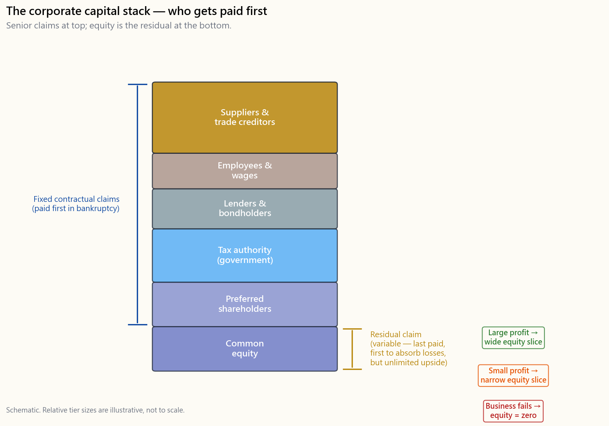
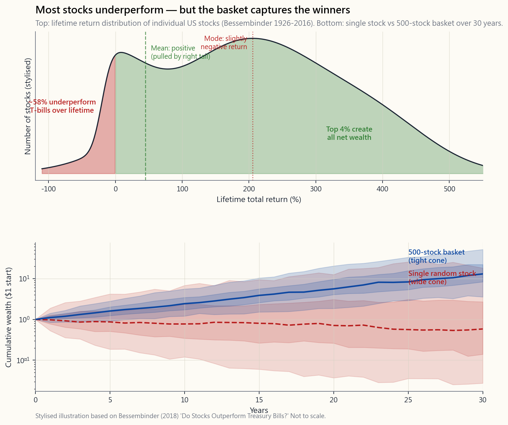

# 第七周：股票与股权——拥有一家企业的一部分

---

## 第一部分：阅读章节

---

### 1. 为什么这很重要

在本课程的前六周，我们一直在谈论"股票"，
好像每个人都已经知道它是什么。60/40投资组合持有
60%的股票。指数基金打包了数千只股票。股权风险
溢价是持有股票的长期回报。但我们从未
真正打开这个盒子，问一个基本问题：**什么是
股票，拥有一只股票意味着什么？**

诚实的答案只有两句话。**股票是对一家真实企业的部分所有权
股份——而在建立这个市场的资本主义体系中，所有权是控制
该企业、重新配置其资本、以及指挥其
员工的权利。**  **股权是在企业向所有其他人支付完毕后，剩余
部分的剩余索取权。** 这两句话包含了
股票为何上涨、为何崩盘、为何
一只股票是危险的而一千只股票表现得像一个资产
类别，以及为何屏幕上的价格有时——甚至长达数年——与企业的实际价值存在分歧的全部解释。

你需要理解股票和股权，原因有四。

1. **没有它，本课程的其余部分都只是死记硬背。** 你可以
   背诵"股票在长期内实际收益率为7%"。但你无法
   *相信*它，无法在50%的回撤中*坚守*它，
   也无法推理*为什么*7%这个数字就是它
   的样子——直到你理解这个篮子里实际上装的是什么。这个7%不是图表上的魔法数字，也不是"一家典型企业"的收益率。它是
   一个*精心筛选的幸存者*篮子的收益率——这个数字之所以存在，是因为
   指数悄悄地剔除了失败者。
2. **股权在各类资产中是独一无二的。** 债券是固定的
   合同承诺：若干票息和面值的偿还。现金
   是对中央银行的索取权。黄金是对什么都没有的索取权——
   这正是它的意义所在。股权是*剩余索取权*——在
   员工、供应商、税务机关和债券持有人
   全部获得报酬之后剩下的一切。这种剩余地位赋予股票其
   非对称收益：分布右侧的巨大上涨空间，
   以及当企业倒闭时左侧的全部损失。
3. **它是通往财务报表分析的桥梁。** 下周
   我们将打开利润表、资产负债表和现金流量表。
   除非你已经将自己持有的股份视为这些报表所描述的企业的一个切片，
   否则这一切都毫无意义。财务报表是你所购买资产的*X光片*。
4. **它是分散投资为何有效的基础。** 关于股票最
   重要的观察是，*个别*公司以令人沮丧的规律性倒闭——
   从长远来看，它们中的绝大多数要么消亡，要么变得无关紧要——
   而*指数*之所以能持续复利增长，正是因为它踢出了失败者，
   引入了幸存者。一只个股的非系统性风险并不会通过大数定律的某种魔力"分散消失"；
   它是通过*指数构建规则被剔除的*。我们在第2周用指数基金的语言触及了这一点；
   本周我们来看看指数内部实际上有什么，以及为什么这很重要。

本节课涵盖以下内容：一家公司实际上*是*什么（以及为什么这个选择很重要），
拥有它意味着什么，股权在资本堆栈中的位置，
股权将企业利润转化为股东财富的四种方式，
市值与账面价值之间的差距，为什么一只股票是彩票而一个*精心策划的*篮子是一种资产类别，
以及造成散户投资者几乎所有行为错误的价格与价值的差距。

---

### 2. 你需要了解的内容

#### 2.1 什么是公司？两种视角

在我们能够说清楚股票*拥有*什么之前，我们必须先说清楚一家
公司*是*什么。商学院教授两种观点，它们会导向不同的投资组合。

**观点（a）：公司的存在是为了获取利润。** 利润是目标；
其他一切——产品、员工、客户、使命——都是工具。
在这种观点下，管理层唯一合法的职责是
最大化股东回报。如果存在更高回报的资本用途，
现有业务就应该被清算，资本被重新配置。这是弥尔顿·弗里德曼的框架，
自1970年代以来在美国商学院占主导地位，至今仍是大多数企业董事会的
官方意识形态。

**观点（b）：公司必须盈利才能继续存在——这样它才能继续做它实际存在的事情。**
利润是*约束条件*（你不能永远亏损而继续生存），而不是*目的*。
目的是企业公开声称的事情（造汽车、设计芯片、卖咖啡），
或者它不那么公开地追求的事情（巩固创始人的遗产、资助政治议程、延续家族控制）。
在这种观点下，对企业进行终极基本面分析的问题不是"它的利润率是多少"，
而是**"它能否生存*并且*仍然做它实际存在的事情？"**

本课程从观点（b）的角度撰写。两种观点在大多数情况下是重叠的——
一家无法盈利的企业也无法做任何其他事情——但它们在每个投资者最终都会遇到的两种实际情况中出现分歧：

- *一家有利可图但已失去目的的企业。* 它仍然发布好的数字，但创始人已离开，
  企业文化已经空洞化，产品的管理是为了季度利润率而非长期相关性。
  观点（a）说持有；观点（b）说生存的倒计时已经开始，数字将随之下滑。
- *一家勉强盈利但毫无疑问正在做其存在意义之事的企业。* 观点（a）说卖出；
  观点（b）说先问生存约束条件是否得到满足。如果是，这往往是一家
  隐藏在薄利润率背后的长期复利型企业。

在本课程中，你将同时使用这两种视角。观点（a）告诉你何时减仓。
观点（b）告诉你何时在艰难岁月中坚守。没有两者兼备，
你将在下一只复利型股票上过早八年卖出，然后在下一只僵尸股上持有长达十年。

#### 2.2 股票作为部分所有权股份——以及所有权实际上意味着什么

一家上市公司有有限数量的*已发行股份*——假设是
20亿股。如果你持有一股，你就拥有该公司的二十亿分之一。
这不是隐喻，也不是营销话术。它是一种法律上可执行的财产权。

在一家*私人*企业中，那个二十亿分之一将是一个真正的运营索取权——
你在决策桌上将有一席之地，你对战略的看法将举足轻重，
你将帮助指挥公司的方向。在资本主义中，所有权最基本的权利是
*控制权*：资本所有者决定建造什么、雇用谁、解雇谁，
以及如何处理产生的现金。这就是"所有者"这个词在历史上的含义——
那个能够重新配置资本并指挥员工的人。

对于持有某家3万亿美元超大盘股100股的散户投资者来说，
那种运营权利在*技术上完整，但实际上为零*。最大的被动管理公司
（先锋、贝莱德、道富）在大多数标普500成分股中合计投出20–25%的票。
内部人持股和少数积极型基金承载了其余大部分。你的一百股
既不能重新配置资本，也不能指挥员工。它们只是参与他人对两者的决策。

那么，那个二十亿分之一在实践中赋予你什么权利呢？

- **对企业产生现金的索取权**——无论是作为
  股息和股票回购*支付给*你，还是作为留存收益再投资*于*企业，
  在这种情况下企业本身会变得更大，股份对未来现金流的索取权也随之增长。
  股票价格（最终）会反映这种不断增长的索取权。
- **对企业行动的股权式结果的索取权**——收购、合并、分拆。
  如果一家私募股权公司或更大的竞争对手以每股80美元收购公司，
  而之前的价格是50美元，你的部分股份将获得与所有其他持有人相同的每股价格。
  成为收购的接收方，在历史上是散户仓位获得突然大幅回报的更可靠方式之一。
- **对股东事务的按比例投票权**——董事会选举、
  重大收购、审计师、章程修改。权利是存在的。
  原则上行使它；对于散户规模的仓位，在实践中预期零影响。
- **清算时对净资产的剩余索取权。** 这一条在教科书中排在最后，
  在你的脑海中也应该排在最后。在真实的破产案中，优先索取权和
  律师费通常在股权层见到任何东西之前就消耗了资产价值。
  权利是存在的；将其纳入决策考量几乎毫无价值。

诚实的心理模型是：没有运营话语权的*少数股权合伙人*。
你和19.9亿其他被动合伙人雇用了一位首席执行官来运营一家企业。
首席执行官和董事会控制着企业。你收取（或不收取）企业产生的
部分收益，你可以在任何交易日的任何一秒在深度流动的市场上出售你的份额，
如果有人想收购整个公司，你可以以溢价被收购。这与和四个朋友一起拥有一家咖啡馆不同——
假装两者相同会导致一系列我们很快将纠正的心理错误。

#### 2.3 资本主义、资本，以及为什么这个资产类别会存在

值得在"资本主义"中的*资本*一词上停下来思考，因为
股票市场的全部意义在于让资本流向最能善用它的企业。

企业需要资本来建造工厂、雇用工程师、资助研究，
以及在客户支票到来之前支付营运资金。两种来源为这些资本提供融资：
**债务**（企业借款并承诺按固定时间表偿还）和
**股权**（某人给企业钱，以换取对企业最终产生的任何东西的永久剩余索取权）。
股票市场是股权索取权在发行后易手的二级市场。

这是股权存在的结构性原因。债务用固定票息约束企业；
股权*资助*企业并分享上涨。资本主义作为一种经济
体系，将现实世界的资源分配给它认为将产生最多未来现金流的企业——
而股票市场的*价格机制*是每日进行这种分配的投票机器。
当一只股票的价格上涨时，公司可以以更高的价格发行新股并筹集廉价资本。
当它下跌时，资本成本上升，公司受到资金匮乏的制约。
价格*就是*分配信号。

这对散户投资者有一个经常被忽视的结论。**你不需要成为巴菲特式的长期持有者才能在股票中赚钱。**
资本主义的价格发现机制创造了合法的较短期限赚钱方式：

- 你可以识别出价格更接近清算价值而非运营价值的企业，
  持有它直到差距缩小（深度价值投资）。
- 你可以识别出被动买盘目前正在抛售的板块，买入指数暂时放弃的东西（均值回归）。
- 你可以购买你认为会以更高价格翻转给信息较少的买家的东西
  （博傻策略、动量）。大多数通过2010年代和2020年代在市场上获胜的人
  在这里获胜，而不是在伯克希尔式的基本面持有中。

本课程将长期视野框架作为*默认*教授，因为它在最长的样本中最为可靠。
但它不假装翻转是不合法的。价格机制既奖励耐心的持有者，也奖励把握时机的翻转者。
它唯一持续惩罚的是既没有投资期限也没有投资逻辑的交易者。

#### 2.4 股权作为剩余索取权——资本堆栈

理解股权*财务*地位最清晰的方式是**资本堆栈**。假设一家公司
一年产生1,000美元的营收。现金按固定顺序流出：

| 顺序 | 索取方 | 获得什么 | 地位 |
|---|---|---|---|
| 1 | 供应商 | 销售成本 | 优先 |
| 2 | 员工 | 工资 | 优先 |
| 3 | 贷款方/债券持有人 | 利息支付 | 优先 |
| 4 | 税务机关 | 所得税 | 优先 |
| 5 | 优先股股东 | 固定优先股股息 | 夹层 |
| 6 | **普通股股东** | **剩余部分** | **剩余** |

普通股权位于堆栈底部。其他所有人首先按合同固定条款获得报酬。
第5步之后剩余的任何现金归股权持有人所有——可以留在企业内部（留存收益），
也可以分配出去（股息和股票回购）。由此产生两个结论。

**结论一：当企业经营良好时，股权获得上涨收益。**
债券持有人被限制在他们的票息——一只9%票息的债券无论这一年有多好都支付9%。
供应商按发票获得报酬。员工获得工资加上（也许）奖金。
这些当事方都不参与*增长*。如果企业的利润翻倍，
那额外利润的每一美元都流向剩余索取方——股权持有人。
那个不断增长的剩余部分要么以股息或股票回购的形式进入你的券商账户，
要么被重新投入企业并反映在股价上。

**结论二：当企业经营不佳时，股权首先承受下行风险。**
糟糕的一年意味着优先索取方仍然首先获得报酬。利润缩水。
股权持有人承受损失。在极端情况下——破产——债券持有人对于优先无抵押债券
可以获得约30–60%的回收率，从属债务通常更低；
普通股几乎总是被清零。2008年雷曼兄弟5.625% 2013年到期优先无抵押债券的持有人
在历经多年程序后最终以每美元回收约21美分；
而雷曼普通股的持有人什么都没得到。

关于债券持有人方面，有一个实际注意事项。教科书上的回收百分比
假设破产以有序的方式进行。在现实中，管理破产程序的律师、顾问和受托人
可能在任何现金到达无担保债券持有人之前就消耗了剩余资产的很大一部分。
如果你发现自己持有一家滑向违约的公司的债券，
实际的决定很少是"等待回收"；通常是"卖给为法律磨难做好准备的困境债务专家"。
律师费的消耗是教科书上的回收数字与实际散户持有人看到的回收数字
相差一半的原因。

股权的*不对称性*——巨大的上涨空间，下行风险以零为底
（在多头股票仓位中你的损失不会超过投资金额）——
是使其值得持有*尽管*任何单一个股存在全损风险的原因。
债券的收益是镜像：有限的上涨空间（票息），不对称的下行风险（扣除回收率的违约损失）。
股权风险溢价——美国股票市场在漫长历史中比国债多赚取的约4–6%的年化收益——
是市场对承担排在最后的不对称*下行风险*，以换取最先参与增长的不对称*上涨空间*的补偿。

#### 2.5 为什么"股票会复利增长"——以及幸存者偏差星号

你会在每本教科书和每封券商营销邮件中看到相同的标题数字：
美国股票在过去一百多年里每年*扣除*通胀后的收益率约为7%
（西格尔的《股市长线法宝》；等效的名义数字约为10%）。这个数字是真实的，
因为它是从数据中正确计算出来的。但大多数课程附加的*解读*是错误的，
而错误的解读会产生错误的投资组合。

**错误的故事。** "一家典型企业的资本回报率为10%，
再投资一半并派发一半，所以其盈利能力每年以5%的速度复利增长。
股东额外收取2–3%的股息和股票回购。加上一点通胀，你就得到了7–10%的长期收益率——
这是股权所有权的自然算术。"

这个故事内部逻辑一致。它也是对*幸存者*企业的描述，
而不是普通企业实际上的表现。诚实的版本是：

**正确的故事。** *指数*以7–10%的实际收益率复利增长。
*十年前指数中的平均个别公司*绝对没有做到这一点。
大多数公司，包括曾经在美国交易所交易的大多数公司，
最终都归零或变得无关紧要。许多公司根本没有增长——
它们以平淡的方式赚回资本成本，然后在收购或缓慢衰退中消失。
7%的数字来自一小部分名字，其10倍和100倍的回报承载了整个篮子，
加上*指数构建规则*，它悄悄地沿途剔除了失败者。

这是最尖锐形式的**幸存者偏差**。今天的标普500不是1990年的标普500。
大约一半的成分股已经被替换——伊士曼柯达、宝丽来、西尔斯、雷曼、贝尔斯登、
曾经的通用电气、曾经的通用汽车，以及数百家其他公司，
要么因规模缩小低于规模门槛而被踢出，要么因破产而被剔除，
而苹果、微软、英伟达、特斯拉、Meta、谷歌母公司以及一长串其他公司
在上涨途中被纳入。每年以10%复利增长的指数，实际上是一个
**积极策划的投资组合**，具有剔除失败者、添加赢家的基于规则的机制。
它不是对"普通公司"的被动押注。

这对你如何阅读本节课和本课程其余部分有三个直接影响。

1. **股权复利增长在*指数*上有效，而非在*平均股票*上有效。**
   当有人告诉你"只要持有三十年，你就能获得7%"，
   他们默默地假设你通过一种沿途剔除失败者的工具来持有。
   持有随机选择的个别股票三十年的分布*非常*不同。
2. **再投资赚取净资产收益率的故事对于*幸存者*是正确的，**
   而指数在很大程度上*就是*幸存者。故事中的平庸企业不会一直平庸——
   它通常*死亡*，然后被静静地替换进你持有的篮子里。
3. **你要么需要篮子足够宽广，使幸存者在数学上必然在其中，
   要么你需要做工作来识别幸存者。** 7%的长期数字不会通过
   被动地坐在任意选择的十只股票投资组合旁边而到来。
   它通过坐在一种构建规则为生存而筛选的工具中而到来。

这是第2周告诉你从广泛指数基金开始的最深层原因——
不是因为指数投资是"简单"或"被动"的（从营销语言所暗示的意义上来说，
标普500绝非被动），而是因为指数的构建规则*就是*生存过滤器，
免费应用，自动运行。

#### 2.6 四种（加一种）渠道——利润如何转化为股东财富

一家盈利的企业对其赚取的现金只有有限的几种处理方式。
每一种都成为你总收益的不同组成部分。

1. **留存收益并再投资于现有业务。**
   建造另一座工厂，雇用更多销售人员，资助研发，拓展到新的地理区域。
   如果再投资的回报超过资本成本，这将*增加每股盈利能力*——
   股价随之上调以反映更高的未来利润流。对于高净资产收益率的成长型企业，
   这是迄今为止最主要的渠道：股东回报完全体现在股价升值中，根本没有股息。
2. **派发股息。** 将现金直接发送给股东。
   真实的钱进入券商账户。在美国，合格股息按长期资本利得税率征税
   （目前为0/15/20%，具体取决于税级，加上高收入者的3.8%净投资收益税）；
   普通股息和大多数外国股息按普通收入征税。利润率有限的成熟企业——
   公用事业、消费必需品、综合石油、房地产投资信托——将其大部分盈利作为股息返还。

   *旁白：退休人员的股息与债券票息对比。* 许多退休人员被高股息股票所吸引，
   因为标题收益率看起来与国债相当。历史比较很复杂。
   在1928–2024年的样本中，标普500股息收益率平均约为3.5%，
   10年期国债收益率平均约为4.8%，但*关系*在不同时期发生了显著变化——
   股息总体上在1930–1950年代*超过*国债收益率，
   从1960年到2000年代初期*远低于*国债，
   此后大体上*与国债收益率持平或低于*国债收益率。
   如果两者是完全可互换的索取权，差距就会被套利消除。但事实并非如此，
   因为它们*不可*互换：股息可以被削减（在经济衰退中约5–10%的派息方会削减股息），
   底层股票在你需要收入的那一年可能下跌30%，
   而股权层承担的商业风险是国债根本不承担的。
   工作准则是将股息股票视为具有收入倾向的*股权*仓位，
   而不是债券的高收益替代品。我们将在第10讲中回到这个话题。

3. **回购股份。** 用现金在公开市场回购公司自身的股票并注销。
   已发行股份数量下降；你的二十亿分之一变成了19.5亿分之一，
   你对每一未来利润美元的索取权按比例上升。
   从数学上讲，以公允价值进行的1美元股票回购与1美元股息相同——
   只是税务处理推迟到股东最终卖出时。
   这种递延税收是美国大盘股自1990年代以来偏爱股票回购而非股息的一半原因。
   另一半是**高管薪酬**。大多数高级管理人员主要以股票期权和限制性股票获得报酬；
   他们的个人收益是股价的直接函数，而不是股息收益率。
   股票回购提升股价（股份更少，收益相同，每股收益数字更高，通常还有更高的估值倍数驱动的价格）；
   股息将现金平等地转移给所有股东，并保持股份数量不变。
   首席财务官对这两种结果很少无所谓。

4. **收购另一家企业。** 用现金（或股票）收购另一家公司。
   这是资本用途中方差最高的。做得好——当被收购的企业融入买方现有运营，
   且价格有所约束——它能使股东财富复利增长。做得糟糕——
   而长期学术证据表明*大多数*大型并购都会破坏*收购方*股东的价值——
   这是从你的那部分企业向卖方银行账户的永久性资本转移。

还有第五种渠道，它不出现在大多数教科书列表上，
因为它是*发生在*公司身上而不是被公司*选择*的：

5. **被收购。** 如果一家竞争对手或私募股权公司收购了你持有的公司，
   交易通常以比现行股价溢价20–40%的价格完成。
   你的部分股份将获得与所有其他持有人相同的每股对价。
   这是第4渠道的镜像——如果以过高价格收购公司会损害买方价值，
   那么*成为*被收购的公司则会为卖方带来意外之财。
   从长期样本来看，收购溢价不是噪音；它们是股权回报的真实、反复出现的组成部分，
   在收购活动最密集的中小盘板块尤为明显。

对于长期股东而言，股票的*总收益*可以分解为（a）每股收益的变化，
（b）收到的股息，以及（c）估值倍数（市盈率）的变化。
从数十年的时间跨度来看，（a）和（b）占主导；从数月的时间跨度来看，（c）占主导。
这是同一资产类别既能看起来是很好的长期持有，又能同时是残酷的中期盯市的结构性原因：
不同的时间视野强调不同的组成部分。

#### 2.7 为何股票是不完美的通胀对冲工具

第一周将投资定义为对抗通胀的战斗：持有现金，储蓄的购买力就会年复一年地缩水。现在正是将那个论点与我们刚刚打开的这类资产联系起来的地方。**现金是固定名义索取权。债券基本上是固定名义承诺。股票是企业的所有权，其名义现金流可能随价格水平同步增长。** 这一句话就是其机制所在——本小节的其余部分，则是说明它为何有效、又在哪里失效的细则。

从§2.4的剩余索取权图景说起。债券持有人获得的是固定数量的美元承诺：一串票息和本金偿还。如果债券存续期间总体价格水平翻倍，这些美元仍会按时到账，但每一美元的购买力只剩一半。合同是*名义*的。通胀是债券持有人无声的对手方风险。

股权在结构上截然不同。你拥有的不是收取一定数量美元的承诺。你拥有的是一家真实企业的部分所有权，该企业以*当日现行美元*为商品和服务定价。当总体价格水平上升时：

- 一家咖啡连锁店的菜单价格上涨。
- 一家日常消费品公司的货架价格上涨。
- 一家软件供应商以更高的数字续签企业合同。
- 一家工业企业提高报价以反映更高的投入成本。
- 工厂、土地、品牌和库存的重置价值随价格水平上升。

如果一家公司拥有**定价权**——能够将更高的价格转嫁给客户而不将其流失给竞争对手——名义营收便随通胀上升，名义盈利也倾向于跟随，§2.6中的四加一渠道（留存收益、股息、股票回购、收购、被收购）全都以名义上更大的金额流通。资本结构底层的剩余索取人最终持有的是一家*名义上更大*的企业。从长远来看，这正是为什么广泛的股票历史上能够以现金和大多数名义债券所不能的方式保存购买力。

这是课程一再援引的著名**7%实际收益**数字背后的视角——由杰里米·西格尔在《股票长期投资》一书中对近两百年美国股票数据的研究测算而来。*实际*意味着剔除通胀之后。剔除CPI后仍有正数留存，这是上述机制的实证印记：总体企业现金流大致*随*价格水平增长，加之真实生产率和再投资带来的额外溢价。

然而，通胀对冲属性是**不完美的**，诚实面对这种不完美，远比教科书上"股票跑赢通胀"的口号更有用。

1. **定价权并非普遍存在。** 有些企业可以自由提价（可口可乐、阿斯麦、查理·芒格最初买入时的喜诗糖果）。另一些则在全球市场中竞争同质化商品，无力提价（航空公司、大多数钢铁生产商、通用内存芯片）。在持续通胀中，指数是这两类企业的平均。
2. **成本同样会通胀。** 工资上涨。原材料上涨。能源上涨。企业究竟是将通胀*转化*为更高盈利，还是以利润率被压缩的形式*归还*出去，取决于价格-成本两侧谁重定价更快。
3. **折现率上升。** 通胀通常迫使中央银行提高短期利率，进而抬高市场用于折现未来现金流的长期折现率。即便名义盈利按计划增长，驱动股价的现值计算也会得到一个更大的分母。算术是机械的：折现率上升 → 市盈率倍数下降。
4. **高通胀环境下倍数压缩。** 这是历史规律，不是理论。大约从1966年到1982年——阿瑟·伯恩斯和保罗·沃尔克早期——美国CPI高达高个位数乃至两位数。标普500在此期间以*名义*美元实现了盈利增长，但市盈率倍数从高十几倍跌至个位数。整个区间的实际收益大致持平。即便底层企业在名义上随价格水平增长，股票在五年按市值计价的基础上并未保护投资者。
5. **这种对冲在长期有效，短期无效。** 在滚动十年以上的窗口中，美国广泛股票历史上显著跑赢CPI。在CPI意外飙升期间的滚动一年和三年窗口内，股票可能与债券*一同*下跌——2022年是最近的提醒，标普500名义上下跌约18%，美国60/40投资组合创下有史以来最糟糕的年份之一。

对于剩余索取权资产，实践结论如下：

- **长期通胀对冲：是的。** 持有多元化的高质量、具有定价权企业篮子，跨越数十年，历史上名义现金流的增长大致与价格水平持平，甚至更快，股东的索取权随之增长。
- **短期CPI对冲：不是。** 当通胀*当下*意外走高时，股票可能与债券*同步*亏钱，因为折现率效应反应快，而盈利增长效应反应慢。这正是国债通胀保值证券（TIPS）、黄金和大宗商品旨在填补的空缺——也是严肃的投资组合即便对长期股票收益坚信不疑，也不会100%配置股票的原因。

将§2.6和§2.7合在一起，你就得到了课程自第一周以来一直指向的通胀论据。企业按现行价格水平销售。其盈利、股息、股票回购和替换资产价值随时间随价格水平增长。剩余索取人——你，股东——拥有这条名义上增长的收益流的权益。现金和债券无法给你这些。这一机制是真实的。时机是不可靠的。这句话的两半必须共存于同一个头脑中，才能理解本课程此后的内容。

#### 2.8 市值、账面价值，以及为何两者不同

投资者每天都会看到的两个数字，而大多数人从未真正加以区分。

**市值**是股价乘以流通股数。这是市场目前对企业整个股权层的*估值*。200美元股价 × 150亿股 = 3万亿美元市值。这是股票投资中最重要的单一数字，原因只有一个：**指数纳入规则用它来决定哪些公司进入你的篮子，以及权重是多少。**

- 标普500从市值超过某一随市场浮动门槛（目前约为150亿至200亿美元）的美国公司中筛选，并按自由流通市值对每位成员加权。你越大，在指数中占的份额就越大。
- 罗素1000涵盖约最大的1000家美国公司；罗素2000涵盖其后的2000家。
- MSCI全球所有国家指数按自由流通市值对每个成员国加权。

结构性含义是：**指数是市值的动量机器。** 一家公司市值从50亿美元增长到500亿美元，在上涨过程中拉动指数走高，同时在指数中获得更大权重。一家公司市值从500亿美元跌至50亿美元，在下跌过程中权重缩小，最终被踢出。从这个意义上说，"被动"的标普500实际上是一个主动管理的动量投资组合，只是再平衡规则预先设定好了。

**市值分层**是行业通用术语：

| 层级 | 大致范围 | 含义 |
|---|---|---|
| 超大盘股 | > 2000亿美元 | 定义指数，决定标普500的收益 |
| 大盘股 | 100亿–2000亿美元 | 标普500的大多数成分股 |
| 中盘股 | 20亿–100亿美元 | 越过第一道门槛的幸存者；许多未来大盘股就在这里 |
| 小盘股 | 3亿–20亿美元 | 罗素2000领域；高失败率，偶有十倍股 |
| 微盘股 | < 3亿美元 | 大多是噪音，流动性差，故事驱动多于基本面驱动 |

中盘股层级值得单独说明。一家市值突破10亿美元、盈利且营收增长的公司，已经越过了第一道主要生存门槛。从统计角度看，下一个十倍涨幅更可能来自这一层级，而非更低的微盘股（大多是噪音），也非更高的超大盘股（体量已大；再涨十倍在数学上很难）。标普500的纳入规则——隐含着"必须达到超大盘/大型大盘股，且具有持续盈利能力"的过滤器——本身就是一种粗略的事前赢家识别机制。这与上文幸存者偏差部分并不矛盾；而是从另一侧看同一个观点。该指数是被精心筛选的，*恰恰是因为*应用粗略过滤器确实可以比随机做得更好。

**账面价值**（资产负债表上的"股东权益"）是会计口径的替代数字。将每项资产按会计师记录的价值相加，减去所有负债，余额即为股权的*账面*价值。账面价值是理论上若企业以记录价格出售每项资产、偿清所有债权人、将余额交还股东后所能获得的数字。

这两个数字*几乎从不相等*，差距本身传递着信息：

- 市值 >> 账面价值：市场认为企业的价值远超其账面净资产，通常是因为存在账簿无法捕捉的无形资产（品牌、软件、网络效应）或成长期权。大多数现代科技公司都在此列。
- 市值 < 账面价值：市场认为记录的资产价值被高估，或企业无法从这些资产中赚取足够的回报。这是深度价值区域——有时是真正的低价，有时是价值陷阱。
- *负*账面价值：总负债超过总记录资产。这可能由两种截然不同的原因造成，但在资产负债表的那一行上看起来一模一样。**(i) 激进的高价股票回购。** 波音、麦当劳和菲利普·莫里斯都曾在不同时期处于负账面价值，恰恰是因为它们多年来以高于账面价值的价格持续回购股票，不断拉低股权这一行。这是会计现象，不是财务困境信号——只要现金流量表仍显示正的经营性现金流，企业就是健康的。**(ii) 累计亏损。** 公司亏损时间太长，或进行了大规模减值，累计损失已蚕食了整个股权层。这是真实的偿付能力预警。两种情况仅凭资产负债表那一行*无法区分*；必须阅读现金流量表才能判断。我们将在第8周和第三级的信用分析课程中介绍诊断方法。

账面价值对*重资产*企业（银行、房地产、资本密集型工业企业）最具参考价值，因为记录的资产价值近似清算价值。对*轻资产*企业（软件、消费品牌、平台企业）参考价值最低，因为大部分价值存在于会计师无法记录的无形资产中。

#### 2.9 为何单只股票有风险，而*精选*的篮子则不然

关于个股，最重要的单一事实是：*它们会失败*。亨德里克·贝森宾德2018年对1926年至2016年间所有曾在美国交易过的股票所做的研究发现，**仅有4%的股票贡献了美国股市净财富创造的全部。** 其余96%的股票整体收益大致与持有短期国债相当。超过半数的个股在买入持有基础上*摧毁*了股东财富。中位股票的终生收益跑输现金。

这不是笔误。这并不意味着股市是糟糕的投资。它的意思是，股市的收益*集中于少数名称*，而可靠地参与这少数名称的唯一方式，要么是（a）事先做好研究将其识别出来，要么是（b）持有一种构建规则能确保这些公司最终进入你的篮子、无论你是否预测到的工具。

这对投资组合设计有两个影响。

**首先**，单股买入持有头寸承载的非系统性风险，并没有*事前*保证的额外收益加以补偿。你无法真正计算单只股票的"预期收益"——你只能在事后观察其实际收益，并推断*可能收益的分布*。实证的单股分布具有厚重的左尾（失败）、厚实的中段（平庸的幸存）和细长的右尾（超级赢家）。对于任意随机挑选的单只名称，你远比落入右尾更可能落入左侧或中段。

**其次**，篮子之所以有效，背后的数学并非某种模糊平均意义上的大数定律。而是说，分布的*右尾*——少数超级赢家——几乎必然出现在任何足够宽泛的、*有生存规则*的篮子中。标普500的市值加权和季度再平衡，正是这一规则：任何成长进入前500名的公司都会被纳入；任何跌出前500的公司都会被剔除。当你买入标普500ETF时，你买的并不真的是所有美国股票的"平均"。你买的是*精选的前500名幸存者加上冉冉上升的新星*，获得的是它们的市值加权增长，而失败的微盘股的左尾则被指数构建规则干净地移除。

这很重要，因为它改变了"被动"的真实含义。以下三种说法存在重要区别：

- *"挑选五家最喜欢的公司并买入"* —— 高方差，高度依赖于你选的五家公司是否恰好包含右尾赢家。贝森宾德分布会咀嚼这个投资组合。
- *"挑选100家合理的公司——比如纳斯达克100——并买入"* —— 完全不同的统计性质。非系统性风险低得多，而且在现代数据中，纳斯达克100在大多数多年代区间的历史收益跑赢标普500，恰恰是因为其构建规则偏向股票分布的右尾（大盘、创新密集、非金融）。罗素3000几乎涵盖所有可投资的美国股票；纳斯达克100、标普500和道琼斯工业平均指数各自对同一底层股票池应用*不同*的筛选规则，因此得到*不同*的长期收益。
- *"行业倾斜、因子倾斜，以及指数减去已知地雷"* —— 完全合理。你不必成为伯克希尔式的选股高手才能创造超越市值加权指数的价值。你可以买入标普500*减去*你认为处于结构性衰退的行业。你可以超配当前被动资金流尚未涌入的行业。你可以做空那些慢动作的败局。这些都不需要"只买指数"学派营销话术中隐含的、只要你想走得更远就必须具备的传奇选股能力。*"要想做任何超越市值加权指数的事情，你必须是出色的选股高手"*——这是指数基金卖家方便自己销售的说辞，并非严格意义上的真理。

更深层的规则很简单：**永远持有由某种规则筛选的篮子**——你的规则或别人的规则皆可。这个篮子可以是主要指数、行业交易所交易基金、指数减去已知地雷，或者是精心挑选的十几只名称、每只各有书面论据。不能是从头条新闻中随机挑选的五只最喜欢的股票组成的散乱组合，因为那正是贝森宾德分布会咀嚼掉的投资组合。

#### 2.10 股价与企业价值——诚实的版本

一股是对*企业*的索取权。任何给定时刻该股的*价格*，是买卖双方之间持续双向拍卖的结果。从长远来看，这两个数字趋于收敛——市场从长期来看是一台**真相机器**。在数月或数年的尺度上，两者可能大幅背离。差距的大小取决于市场环境和资金流动。

有三件事值得澄清，因为教科书上的*市场先生*故事将它们全部省略了。

**(i) 市场不是完全信息的清算机构。** 经典的"有效市场"框架——每一个事实一旦可知即已反映在价格中——作为一个有用的*默认假设*，能防止你基于过时信息交易。但作为对市场实际运作方式的描述，它在实证上是错误的。你所对抗的流动并非"所有投资者的集体智慧"；而是高频做市商、统计套利基金、量化趋势跟踪者、交易商对冲流、来自7万亿美元指数化资产的被动再平衡流、被批发商内部化处理的散户订单流，以及少数慢节奏的基本面投资者所形成的混合体。信息会泄露——合法的方式通过信用违约互换动向和盈利预期，不那么合法的方式则是美国证监会每年抓获若干次的内幕交易。有些买卖双方确实掌握其他人所不具备的信息。价格是这个混乱生态系统*当前清算输出*的结果。

**(ii) 股价*确实*是对企业的度量——只是一个嘈杂的、有预见性的度量。** 从实证看，股价往往在"验证"它的头条盈利公告*之前*就已经移动。这不是魔法；这说明部分资金流掌握着头条读者尚未拥有的前瞻信息。因此，正确的框架是：

> *市场价格是企业价值的实时估计，由一台庞大的分布式机器计算而来，这台机器在大多数时候拥有比你更好的信息，在极少数时候拥有比你更差的信息。你的工作是识别那极少数时候。*

**短期内市场是嘈杂的。长期内市场是真相机器。** 两半都很重要。短期噪音创造机会；长期真相将其闭合。

**(iii) 屏幕上显示的远不止"单一数据点"。** 在任何真实的交易屏幕上，你看到的是最新成交价*加上*买卖价差（已经是两个价格，不是一个），订单簿顶部的一档报价，其背后深度的二档报价，盘中成交量分布，期权市场中跨行权价和到期日的未平仓合约（一个前瞻性的隐含分布），卖空兴趣及借券成本，自由流通股与总流通股，盈利日历，分析师目标价区间，近期内部人交易记录。所有这些都以某种形式构成*价格数据*，严肃的投资者会阅读其中许多行，而不仅仅是印出的最新成交价。我们将在第25至29周回到期权隐含分布的部分。

价格-价值差距的经典表述是本杰明·格雷厄姆在《聪明的投资者》（1949年）中的*市场先生*比喻：想象你拥有一家私人企业的股份，和一个叫市场先生的合伙人，他每天早晨敲你的门，提出以报价买入你的股份或将他的股份卖给你。这个比喻只在*一个狭窄的用途*上有价值——提醒投资者他们没有义务每天与市场交易。不要再延伸了。2026年的"市场先生"不是一个情绪化的投票者；而是上文描述的算法、交易商和机构再平衡者的整合性流动，边缘地带有少量慢节奏的基本面投资者。这套机器有时会出错，但它出错很少是*因为*它"情绪低落"。它出错是因为前瞻信息本身存在真实的不确定性，且不同参与者持有不同看法。

**波动性有时是信息。** 两种在图表上看起来相同但底层不同的情况：

- 市场在宏观冲击下一周内下跌8%，没有任何公司特定新闻。企业确实未发生变化。价格更便宜了；企业还是那个企业；市场短暂地错了。这是巴菲特描述的情况。
- 某只股票在一个月内下跌30%，三个月后审计师辞职。90天前企业*确实*还是一样——腐烂早已存在——但市场先于你看到了腐烂。股价下跌是信息；企业*确实*更差，市场先知道，消息后来才跟上。这是"真相机器"的情况。

诚实的答案是**你在实时中通常不知道自己处于哪种情况。** 两个故事都是真实的。纪律在于：(a) 将单一名称的仓位规模控制在足够小，使任何一个名称30%的回撤不会损伤家庭资产负债表；(b) 在将下跌视为买入机会之前，先判断*基本面*是否真正发生了变化；(c) 接受市场有时走在你前面的事实，正确答案是止损离场，而不是在慢动作败局中"摊低成本"。

**持有或卖出，以及成本基础的无关性。** 你的成本基础与你是否应该继续持有某个头寸无关。在经济学意义上，今天持有一只股票的决定与今天买入该股票的决定是相同的——在这个价格上，你会选择向这家企业配置这么多资本吗？如果是，则持有。如果否，则卖出。你两年前的买入价格已是沉没成本。成本基础仅在税务上有意义（清洗销售规则、长期与短期资本利得税率、税务亏损收割）。它不是投资论点的输入项。

#### 2.11 本节内容为课程后续内容的铺垫

- **下周（第8周）——解读财务报表。** 现在你已将股票视为真实企业的一个切片，利润表便成了衡量盈利能力的成绩单，资产负债表衡量偿债能力，现金流量表则检验账面利润是否为真实现金。市场每季度都在集体解读这些报表；亲自研读，才能判断市场的集体解读是否正确。
- **第9周——股票指数。** 深入探讨指数编制规则——市值加权、等权重、自由流通股、行业上限——如何改变你实际购买的内容。
- **第11周——行为偏差与再平衡。** 散户跑输大盘的最大根源，在于电子表格策略与真实持仓者在经历30%回撤时的心理落差。本周的框架——价格下跌有时反映企业基本面变化，有时则不然——正是为纪律性再平衡规则奠定基础，让你在两种情形下都能存活。
- **第21周——股票估值。** 如何估算可与*价格*相互比较的*价值*数字。现金流折现法、乘数法、分部加总法——都是对本周引入的剩余索取权现金流的三角测量尝试。

下次看到股票代码时，请强迫自己思考：

1. *这家企业做什么，管理层持有哪种理念——利润优先还是使命优先？* 不同理念下，你的分析逻辑会截然不同。
2. *其市值处于哪个区间，随着规模增长或收缩，其指数权重可能如何变化？* 资金流向跟随市值走。
3. *当前价格更接近企业的长期内在价值，还是由资金流动驱动的短期错配？* 若无法判断，这本身即是有用信息——持有一篮子，而非单押某只。

---

### 3. 常见误区

**误区一："股票不过是屏幕上的数字——涨涨跌跌的一张纸。"**

股票是对真实企业具有法律效力的所有权凭证，该企业拥有真实的工厂、真实的员工、真实的客户和真实的现金流。屏幕上的价格，是持续竞价机制当下的出清结果。一切长期投资决策最好针对企业本身做出；短期价格波动应被解读为*资金流*的信号，同时诚实地考虑这一可能性——资金流也许掌握着基本面故事尚未揭示的信息。

**误区二："持有几股就能实质影响公司经营。"**

在大型市值公司中，散户持仓规模不足以做到这一点。权利确实存在；实际影响力并不存在。先锋、贝莱德与道富三家合计掌控多数标普500成分股20%至25%的投票权；内部人持股控制了其余大部分。持有一百股，是对现金流的金融索取权，而非公司治理的工具。

**误区三："股息是股价之外的'免费'收益。"**

并非如此。派发1美元股息后，股价在除息日将下跌约1美元。股息并非免费的钱；它是将1美元企业价值从公司账户*转移*至你账户的操作。股息支付的瞬间，你的总财富（股票+现金）并未改变。股息*唯一*的经济效果，是将未实现的股票价值转化为已实现现金，并由此产生相应的税务后果。

**误区四："股票回购不过是让高管中饱私囊。"**

此话不无道理——高管的期权和限制性股票薪酬，确实使管理层在个人利益上偏好回购而非股息——但这一表述并不完整。*在价格低于内在价值时*，回购是将企业价值向剩余股东（包括散户）的净转移。*在价格高于内在价值时*，回购短期内抬升股价（这正是高管期权获利的渠道），长期则侵蚀每股内在价值。作为散户，你的应对其实很简单：若不认可企业的经营方式，任何交易日的任意一秒你都可以卖出。充裕的公开市场流动性，是公众股权相较于私人合伙的真正优势之一。

**误区五："只要精选五家优质公司，就能跑赢指数。"**

Bessembinder的分布研究表明，五只太过集中。五股投资组合有相当大的概率一只右尾大赢家都未能囊括，如此则跑输现金。**一百只则是另一回事。** 纳斯达克100指数在现代数据的大多数数十年区间内，超越了标普500；标普500超越了罗素3000；两者都是比全市场"更窄"的篮子，但其编制规则选取了分布的右尾。诚实的准则是**始终持有一篮子**——五只最爱太过集中；附带淘汰机制的精选百股则不然。"除了买市值加权指数，你必须是天才选股者才能做到更好"——这是营销话术，而非事实。行业倾斜、因子倾斜，以及"指数减去已知地雷"，都是无需超凡技能即可提升收益的合理方式。

**误区六："一只股票不派股息，就没有给股东任何回报。"**

本应作为股息派发的现金被留存并再投资于企业。若管理层的再投资能赚取正的资本回报，该股票对未来现金流的索取权便以同等金额增长，股价亦随之重估。股东回报体现为价格升值而非现金分配——经济价值相同，只是换了一层税务包装，且往往额外享有税前纯复利的好处。

**误区七："一只股票已经跌了50%，必定是便宜货。"**

有时是，有时不是。诚实的框架是：价格下跌落入两类——在图表上看起来一模一样：（a）市场对基本面未变的企业短暂定价错误——此时下跌是买入机会；（b）市场在头条新闻曝光之前已率先看到恶化迹象——此时价格下跌*本身就是*信息，"越跌越买"不过是向一场慢动作灾难加仓。区分两者，需要研读企业——财务报表、竞争格局、管理层素质。价格下跌本身，永远无法告诉你身处哪种情形。

**误区八："股票和股权是不同的东西。"**

在此语境下，两者可互换使用。*股票*是金融工具；*股权*是它所代表的底层所有权索取权。金融媒体说"股权反弹"，意指股价上涨。会计师说"股东权益为400亿美元"，意指企业以全部资产减去全部负债后的账面剩余价值。同一概念，不同视角。

**误区九："我错过了在这些优质公司还小的时候买入的机会，时机已过。"**

右尾赢家现象是股票市场的永久特征，而非一次性事件。中盘股层级（20亿至100亿美元）正是下一批大盘股的后备军。其中一些名字你*事前*即可识别——资产负债表干净、利润率可持续、创始人仍在掌舵、正在开拓大型可寻址市场——这并非无法施行的筛选条件。标普500的市值纳入规则本身，就是这一筛选条件的粗糙版本，自动运行。你无法事前确定每一个赢家，但你可以做得比随机选择更好。

**误区十："持仓成本决定了我是否应该继续持有一只股票。"**

并非如此。今天是否继续持仓，与今天是否买入，是同一个决策——你愿意以当前价格，将这笔资金配置到这家企业吗？若愿意，持有。若不愿意，卖出。两年前的买入价格已是沉没成本。持仓成本只在税务管理上有意义：长期与短期资本利得的税率差异、洗售规则，以及税务亏损收割。它永远不是投资逻辑的输入变量。

---

### 4. 问答

**Q1：若股权是剩余索取权，为何长期而言其价值高于优先级更高的债券索取权？**

答：因为剩余索取权在企业经营良好时可以捕获上行收益，而优先级债券的上限仅为其票息。综观企业结果的完整分布——大多数年份温和为正，少数年份极为丰厚，偶有灾难——股权不对称的上行潜力，平均而言超过了排在最后所承担的不对称下行风险。这一超额收益即股权风险溢价，历史上约为每年高出国债4%至6%。它并非免费；你以波动性和我们接下来讲解的回撤作为代价。

**Q2：如何评估一家企业的留存盈利是否在创造价值？**

答：速算指标是**投入资本回报率**（ROIC）。以税后经营利润除以企业占用的资本（债务+股权，减去超额现金）。若ROIC明显高于资本成本（美国大盘股通常为8%至10%），则每留存一元的价值超过一元送入股东口袋——因此留存是正确选择。若ROIC低于资本成本，每留存一元的价值不足一元——股东宁可以股息或回购形式收回。我们将在第19周（公司财务）逐步完成这一计算。

**Q3：公司以2拆1进行股票拆分时，我的持股数量翻倍了吗？**

答：没有。你的股份数量翻倍，每股价格减半。你对企业的索取权不变——同一家公司同等比例，总市值不变。股票拆分是对股份数量的形式调整，不是经济事件。企业这样做，主要出于行为学考量（部分散户偏好"整数"股价）和操作层面的考量（期权合约规格、指数纳入门槛）。

**Q4：优先股与普通股有何不同？**

答：优先股在资本结构中位于债务与普通股权之间。它支付固定股息（更像债券票息），在清算中优先于普通股，但不参与固定股息以上的企业成长收益（更像债券）。对多数散户而言，优先股是一种具有信用风险的类固定收益工具——在追求收益率的场景下有其用途，但不能替代普通股，也不能替代真正的投资级债券。

**Q5：普通股、ADR与存托凭证有何区别？**

答：普通股是企业在本国发行的原生股权工具。**美国存托凭证（ADR）**是在美国交易所交易的凭证，代表一家非美国企业的一股或多股基础股份；它让美国投资者无需处理境外结算系统，即可通过普通美国券商账户持有境外股权。从经济角度看，持有丰田的ADR等同于持有丰田普通股，仅需扣除ADR托管机构的少量托管费及部分货币兑换成本。

**Q6：资产负债表上"股东权益"500亿美元究竟意味着什么？*负*账面股权又是怎么回事？**

答：这意味着，若公司按账面价值出售全部资产、偿还全部负债，剩余部分归普通股股东，将为500亿美元。这一数字是会计构建（账面价值），通常与市值（股价×流通股数）及内在价值（未来现金流的现值）相差甚远。对于一家健康企业，三个数字应存在*某种*关联；大幅背离通常意味着会计未能捕捉无形资产、表外项目或成长期权价值。

账面价值也可能为**负值**，成因有二，在资产负债表行上看起来完全相同，但含义迥异。（i）*激进的长期回购历史。* 长期以高于账面价值的价格回购股票，使会计股权持续下降；若时间足够长，股权行转为负值。波音、麦当劳和菲利普莫里斯都曾出现过负账面价值。这是会计假象，并非偿债能力预警——只要现金流量表仍显示正的经营现金流，企业便运转正常。（ii）*累计亏损。* 企业亏损时间过长，或计提大额减值，累计损失已侵蚀股权层。这是真实的偿债能力预警。区分两者需通过*现金流量表*，而非资产负债表本身；我们将在第8周及第三阶段信用分析章节讲解诊断方法。

账面价值对*重资产*企业（银行、房地产、资本密集型工业企业）最具参考意义，因其账面资产价值接近清算价值。对*轻资产*企业（软件、消费品牌、平台）参考价值最低，因其大部分价值存在于会计无法记录的无形资产中。

**Q7：股票回购是否始终优于股息？**

答：从美国*税务*角度看，通常是的——回购将股东的税单递延至最终出售时，而股息则触发即时征税。从*资本配置*角度看，只有在回购价格低于内在价值时才成立；以高于内在价值的价格回购股票，即便短期抬升股价，长期仍将侵蚀每股价值。不同股东群体也有不同偏好——依赖现金收入的退休投资者通常偏好股息；处于财富积累期的在职投资者通常偏好回购。此外还有高管薪酬的传导渠道：多数高级管理人员以股票期权和限制性股票计酬，因此在个人财务利益上偏好能提升股价的渠道（回购），而非不能的渠道（股息）。

**Q8：股权风险溢价如何与第4周构建的60/40投资组合相联系？**

答：60%的股票配置，是投资组合对股权风险溢价的敞口——即持有剩余索取权资产所赚取的超额债券收益。40%的债券配置，以放弃大部分超额收益为代价，换取大幅收窄的回撤幅度。这一比例配置，是两种收益形态之间的字面权衡——股权的不对称上行潜力，与债券的合同稳定性。理解股票作为剩余索取权的本质，才能使60/40不只是一个魔法数字，而成为*行为学*层面有意义的妥协。

**Q9：我听说"股票市场不等于经济"，这是什么意思？**

答：股票市场代表的是经济中*公开上市*的切片，按市值加权。上市公司约占美国国内生产总值的一半；另一半（私营企业、小型企业、公共部门）根本不在指数之内。在公开部分中，指数由少数几家大盘股主导，其表现并不代表普通美国企业。因此，当国内生产总值增长2%而标普500回报18%时，这种背离并不矛盾——这只意味着*纳入*指数的那部分经济表现优于其余部分。反之，1970年代，国内生产总值增长但标普500原地踏步，因为*估值*遭到压缩——提醒我们指数短期反映的是*估值*，而不仅仅是*基本面*。

**Q10：我是退休人士。应该用分红股票替代债券作为收入来源吗？**

答：两者是不同的工具，具有不同的风险特征，即便表面收益率相近。从美国长期历史数据看，标普500股息收益率平均约3.5%，10年期国债约4.8%，但两者的*关系*在不同时期有所转变——1930至1950年代股票收益率高于国债，1960至2000年代初期低于国债，此后大致与国债持平甚至更低。若两者是完全可互换的索取权，利差早已被套利消除。之所以没有，是因为风险不同：股息可能被削减（经济衰退时约有5%至10%的派息企业削减股息），30%的股价回撤可能在你需要收入的那一年降临，而股权层承担的企业风险是国债根本不具备的。合理的退休组合两者兼用——优质分红股票提供长期实际收益和抗通胀保护，国债和短久期信用债提供可预期的现金流。将全部债券替换为高股息股票，是在糟糕年份遭遇最差收益率序列风险的诱因。第10讲（股息）和第11讲（退休账户）将对此详细讲解。

**Q11：本课与下周内容如何衔接？**

答：下周我们将拆解财务报表——利润表、资产负债表、现金流量表。这些文件是企业向外部世界报告其财务现实的载体。你持有的股票，是这些报表所描述企业的一个切片。研读报表，是你判断当前市场价格更接近企业长期内在价值、还是短暂资金流动错配的方法。没有本周建立的"股票=企业切片"框架，这些报表不过是电子表格。有了它，它们便是你所持资产的X光片。
