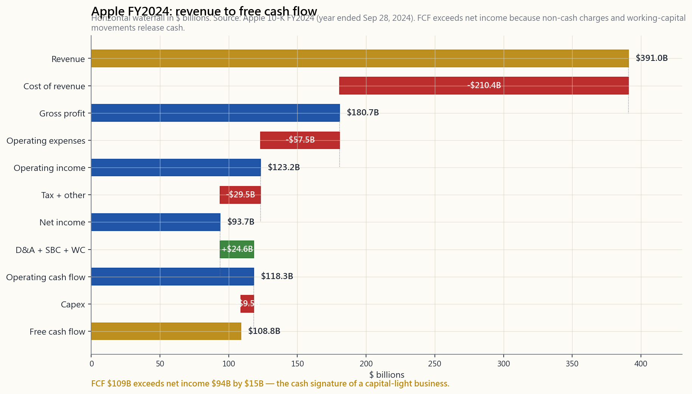
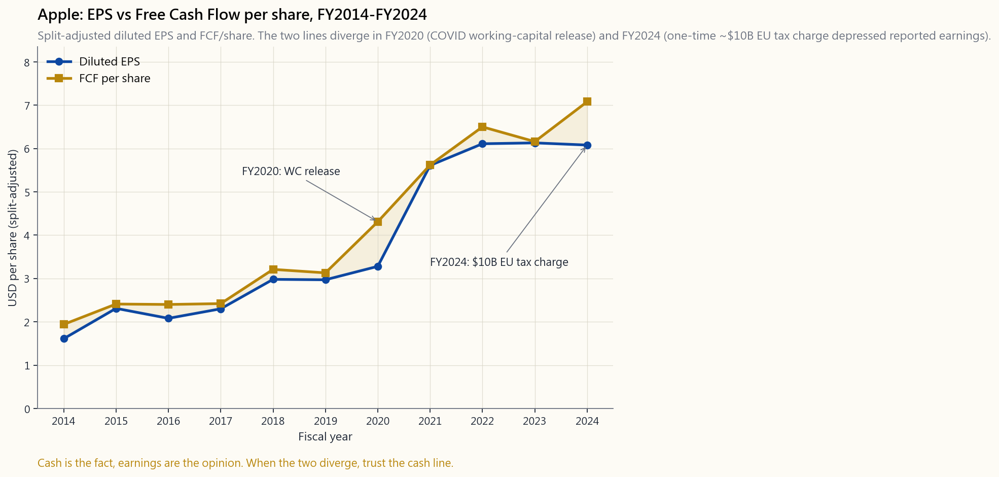

# 第八周：解读财务报表——投资者视角下的利润表、资产负债表与现金流量表

---

## 第一部分：阅读材料

---

### 1. 为什么这很重要

一家上市公司通过三份文件表达自我：利润表、资产负债表和现金流量表。其余一切——新闻稿、业绩说明会、分析师报告、股票价格——都不过是对这三份文件的注解。如果你无法直接阅读原始文件，你读到的只是译本的译本，而你只能寄望于译者没有撒谎。

对于投资者而言——而非会计师，也非审计师——目标是具体的。你不需要重新核算递延税负债。你需要在每家公司二十分钟以内，按顺序回答四个问题：

1. **企业是否在增长，增长是否有利可图？** 答案在利润表上，沿着从营收到营业利润的路径寻找。
2. **企业是否具备偿债能力和足够的资本支撑？** 答案在资产负债表上——资产与负债的对比、营运资本、债务结构。
3. **账面利润是真实现金，还是会计数字？** 答案在现金流量表上，在净利润与经营活动现金流之间的缺口里。这是三份报表中最难造假的一份。
4. **三份报表的叙事是否自洽？** 当营收增长而现金流不增长，当盈利增长而应收账款增长更快，当账面净资产增长而自由现金流不增长——要么是出了问题，要么问题即将浮现。

CFA课程在一级考试中用了大约百分之十五的篇幅讲授财务报表分析。我们将用一周时间完成这部分内容，另附一节关于10-K年报文件结构的补充课（[side02_10k_filing.md](side02_10k_filing.md)）。两者结合，足以让你胜任大多数年报的阅读工作。但这还不足以对其进行审计。那无所谓。正如陳馬所说：超额收益的来源之一就是"看现金，不看盈利"。你不需要比审计师更勤奋，才能跑赢指数。你只需要知道该先落脚在哪份报表的哪一行。

---

### 2. 你需要掌握的内容

#### 2.1 三份报表构成一个完整故事

三份报表并非三份独立文件。它们是同一底层账簿的三种视角，在数学上彼此相连。

- **利润表**覆盖一段时期（一个季度或一个财年）。它从营收出发，逐步推导至净利润。时间维度：流量视角。
- **资产负债表**是某一特定日期的快照——通常是该时期的最后一天。资产等于负债加净资产。时间维度：存量视角。
- **现金流量表**同样覆盖一段时期。它解释了资产负债表上现金余额的变动，分为三个部分：经营活动现金流（OCF）、投资活动现金流（CFI）和筹资活动现金流（CFF）。

三份报表通过两座"桥梁"相互衔接：

- **净利润流入资产负债表的留存收益。** 上年净资产加上净利润，减去股息，即为本年净资产（在股票回购及其他调整项之前）。
- **经营活动现金流从净利润出发并加以调整。** 加回非现金支出（折旧、股权激励），再根据营运资本变化进行调整（应收账款、应付账款、存货）。扣除资本性支出后的剩余部分即为**自由现金流**，这一数字用于支付股息、偿还债务和股票回购。

投资者的纪律：三份报表一起读，当三者出现分歧时，最信任现金流量表。

#### 2.2 利润表——从营收到净利润

利润表是一个瀑布式结构。营收在顶端，每一步扣减相关项目，净利润落在底部。其中有五个关键节点。

**营收。** 客户在该期间实际支付（或欠付）的商品和服务款项。这是跨多个财年最难造假的一行数字，因为审计师也最严格地将其与收款凭证和合同核对。

**毛利润 = 营收 − 营业成本。** 生产所售商品的直接成本。毛利率（毛利润/营收）反映定价能力和单位经济效益。软件公司的毛利率通常超过70%；航空公司则在10%至20%之间。应在同行业内横向比较，不宜跨行业对比。

**营业利润（EBIT）= 毛利润 − 营业费用。** 扣除研发费用、销售及管理费用、折旧和摊销。这是企业**实际经营活动**所产生的利润，不受资本结构（利息）和税务（税项）影响。营业利润率是衡量企业质量最纯粹的指标。

**税前利润 = 营业利润 − 净利息支出。** 加上利息收入，减去利息支出，并纳入任何非经营性项目（投资损益等）。这里是**资本结构**显现之处。一家高负债公司可能有优秀的营业利润率，却有难看的税前利润。

**净利润 = 税前利润 − 所得税。** 即"利润底线"。除以股份数，得到每股收益（EPS）。

下图将苹果公司2024财年（截至2024年9月）的利润表和现金流量表展示为一张从左到右的水平瀑布图——从营收一路延伸至自由现金流。

该图最重要的视觉信息在于最右侧两根柱子之间的差距：**净利润940亿美元与自由现金流1090亿美元**。苹果转化的实际现金*超过*了其账面会计利润。这是一家健康的轻资产企业的典型特征。反过来——净利润长期显著高于自由现金流——则是教科书级别的会计质量预警信号。

#### 2.3 资产负债表——资产、负债与净资产

资产负债表遵循一个恒等式：

$$ \text{资产} = \text{负债} + \text{股东权益} $$

它在会计构造上永远平衡。复式记账法决定了每一美元的资产，背后对应的要么是外部索偿权（负债），要么是所有者权益。这不是深奥的经济学，而是账簿的结构。

对投资者而言，关键在于两侧各自的**构成**。

**资产**侧从上到下按流动性排列：

- **现金及现金等价物。** 存放于货币市场基金或短期国债。今日即可动用。
- **短期投资和应收账款。** 一年内可变现——但应收账款存在坏账风险。
- **存货。** 等待出售的商品。滞留时间越长，贬值和折价风险越高。
- **固定资产（PP&E）。** 厂房、机器、数据中心。使用寿命长。以历史成本减累计折旧列报，往往大幅低估重置价值（以百年历史炼油厂为例）。
- **商誉及无形资产。** 收购价格超出被收购方可辨认净资产账面价值的溢价，以及内部拥有的品牌或专利价值。这一行会在收购失败时发生**减值**（核销）。

**负债**侧从上到下按到期时间排列：

- **应付账款。** 欠供应商的款项，通常30至60天内到期。
- **短期借款及一年内到期的长期债务。** 一年内到期。典型的偿债压力来源。
- **长期债务。** 债券和定期贷款。理解资本结构最重要的负债项目。
- **养老金及租赁负债。** 在此前的会计准则下往往低估或表外处理；在现行规则下大多已纳入，但仍值得核查。

**股东权益**是残差项——资产减负债。主要由以下部分构成：（1）普通股及资本公积（股东投入的资金）；（2）留存收益（历年净利润的累计留存）；（3）库存股（股票回购的负数项）。对于长期持续回购的成熟企业，库存股可能规模庞大；波音、星巴克等公司曾出现**负**股东权益，原因正是其累计回购金额超过了留存收益总额。负账面净资产本身并不构成问题（如果现金流健康的话）——它只是说明该公司选择了股票回购而非资产负债表扩张。

两个实用的从业者比率：

- **流动比率 = 流动资产 / 流动负债。** 大于1通常被视为健康；小于1意味着公司依赖再融资、存货周转或循环信贷额度来应付近期债务。
- **净债务 / 息税折旧摊销前利润。** 总债务减现金，除以过去十二个月的息税折旧摊销前利润。低于2倍为保守；3至4倍是多数行业的正常水平；超过5倍属于杠杆收购级别的杠杆率，在经济衰退或利率大幅上升时可能显得岌岌可危。

#### 2.4 现金流量表——最难造假的那份

这是将投资者与投机者区分开来的报表。

净利润是一种**意见**——有据可查、经审计师签署，但建立在数十个估算之上：折旧年限、坏账准备、存货减值、股权激励费用、收入确认时点。每一项都有其合理性，每一项也都是可以调节的旋钮。现金流则是一个**事实**。银行余额要么增加了，要么没有。

现金流量表分为三个部分：

- **经营活动现金流（CFO 或 OCF）。** 从净利润出发，加回非现金项目（折旧、摊销、股权激励），并根据营运资本变化进行调整（应收账款增加 = 现金流出；应付账款增加 = 现金流入；存货增加 = 现金流出）。最终结果：经营业务实际产生的现金。
- **投资活动现金流（CFI）。** 资本性支出（负值，用于业务再投资）、收购（负值）、资产出售所得（正值），以及有价证券投资组合的变动。
- **筹资活动现金流（CFF）。** 债务的借入或偿还、股份的发行或回购、已支付股息。

投资者最常用的单一指标：

$$ \text{自由现金流（FCF）} = \text{经营活动现金流（OCF）} - \text{资本性支出（Capex）} $$

自由现金流是企业在不损害经营能力的前提下，**理论上可返还给全体资本提供者**的金额。它用于支付股息、股票回购、偿还债务和收购融资。持续的自由现金流是上述一切的唯一经济基础。那些在没有产生自由现金流的情况下仍支付股息或实施股票回购的公司，实际上是在通过发债或发股来实现——从一批投资者手中借钱支付给另一批。这种做法持续一年尚可，持续十年则贻害无穷。

陳馬坚持的原则：当净利润与自由现金流之间的差距扩大，就应质疑利润表。盈利可以被操控；现金更难。下图呈现了苹果公司过去十年这一差距的演变。

2020财年，每股收益相对自由现金流出现下滑，原因是疫情期间的营运资本释放了现金（客户付款、存货去化），速度快于会计盈利的确认节奏。2024财年，一次性约100亿美元的欧盟委员会税务裁定压低了账面净利润，而客户实际支付的现金分毫未动。两个财年都是同一课题的清晰例证：现金是事实；盈利是意见。

#### 2.5 同比分析报表——跨时期与跨企业对比

原始美元数字难以比较。苹果3910亿美元营收与可口可乐460亿美元营收，在**规模**上不在同一量级，但在**质量**上或许旗鼓相当。**同比分析报表**将每一行数字重新基准化——利润表以营收为基数，资产负债表以总资产为基数，均表示为百分比。这消除了规模偏差，使企业**结构**一目了然。

以下是2024财年三家示例公司的同比分析利润表：

| 项目 | 苹果 | 可口可乐 | 摩根大通 |
|---|---:|---:|---:|
| 营收 | 100% | 100% | 100% |
| 毛利润 | 46% | 60% | 不适用 |
| 营业利润 | 32% | 30% | 41% |
| 净利润 | 24% | 23% | 32% |
| 自由现金流/营收 | 28% | 21% | 不适用 |

三家业务迥异的企业，三种截然不同的成本结构，但三者均将约四分之一的营收转化为净利润——这表明三者在各自行业中均处于高质量企业之列。银行（摩根大通）的毛利润和自由现金流行不适用，因为其利润表结构根本不同（净利息收入、信贷损失拨备，没有实质意义上的"营业成本"）。银行需要专属的分析框架，我们将在第33周讲解。

下方的互动面板允许你在苹果、可口可乐和摩根大通之间切换，分别查看营收/净利润/经营活动现金流/自由现金流，并并排呈现十年历史数据及同比分析比率。目标是建立对不同行业报表**直观的视觉感知**，以便在看到从未见过的年报时，能够快速识别异常。

#### 2.6 投资者的实际阅读顺序

面对一家新公司，实用的阅读顺序，二十分钟：

1. **营收趋势，十年。** 是否在增长？是否在放缓？是否具有周期性？同时查看现金流量表摘要——现金流是否与营收同步？
2. **营业利润率趋势，十年。** 扩张（定价能力），持平（稳定状态），收窄（竞争加剧或成本承压）？
3. **自由现金流与净利润对比，十年。** 两者是否同步？出现分歧时，偏向哪个方向？原因是什么？自由现金流长期低于净利润，是最响亮的单一预警信号。
4. **净债务/息税折旧摊销前利润，当前值及趋势。** 在利率5%的环境下，资本结构是否可持续？未来18个月内是否面临再融资压力？
5. **资本配置，过去三年。** 股票回购、股息、再投资与并购各占多少比例？资金来源是自由现金流还是新增债务？

10-K年报补充课（[side02_10k_filing.md](side02_10k_filing.md)）将介绍上述每项数字在文件中的具体位置——第7条（管理层讨论与分析）、第8条（财务报表）、第1A条（风险因素）以及财务报表附注。将**读什么**（本课）与**在年报中的位置**（补充课）结合起来，足以让你在零售投资者中跻身财务素养的前十分位。这是一个低门槛，但也是一个实实在在的门槛。

---

### 3. 常见误区

**误区一："盈利是最重要的数字。"**

盈利是会计选择所产生的意见。自由现金流是事实。当两者一致时，企业是真正盈利的。当两者长期背离时，几乎无一例外，现金流是对的，盈利是错的。

**误区二："盈利的企业不会破产。"**

盈利的企业破产时有发生——原因在于无法偿还债务。利润在利润表上；偿还债券持有人所需的现金在现金流量表上。许多历史上最著名的破产案例（玩具反斗城、杠杆收购高峰时期的赫兹）都发生在"盈利"的企业身上，直到再融资窗口突然关闭。

**误区三："负账面净资产意味着企业资不抵债。"**

在当今时代，并非如此。成熟的、大规模回购的企业（波音、星巴克、麦当劳在某些时期）出现负账面净资产，仅仅是因为它们累计回购的股票金额超过了留存收益。偿债能力取决于能否用现金流覆盖债务，而非账面净资产的正负。

**误区四："高折旧费用是坏事。"**

折旧是非现金支出。它降低账面利润，但不减少现金。资本密集型企业（公用事业、铁路、炼油厂）的折旧必然很高；它压缩了账面盈利，但不影响现金流。正确的对比是资本性支出与折旧的关系：资本性支出高于折旧，说明企业在增长或更新资产；资本性支出远低于折旧，说明企业在"收割"（消耗资产换取现金）。两种情况都可能是合理的，取决于企业战略。

**误区五："股权激励不是真实成本。"**

它是真实成本。企业（尤其是科技企业）喜欢在"调整后每股收益"中将股权激励费用加回，将其定性为非现金项目。当期确实非现金，但它稀释了现有股东的权益，对他们造成了真实的经济代价。应将股权激励视为真实成本。剔除股权激励的调整后息税折旧摊销前利润，是金融领域为数不多的几乎总是具有误导性的数字之一。

**误区六："商誉代表真实价值。"**

商誉是一个"插入项"——收购价格超过被收购方可辨认净资产的残差。它不计提折旧，每年进行减值测试。许多公司的商誉通过持续并购悄然膨胀，随后在某一季度因某笔并购失败而突然崩塌。对商誉这一行数字应保持极度审慎，尤其是对连续并购型企业。

**误区七："审计师签字了，报表就是准确的。"**

审计师测试的是是否存在重大错报，而非绝对真实。四大会计师事务所为安然、Wirecard和雷曼兄弟的签字，是审计保证远比零售投资者所想象的更为脆弱的历史明证。审计是最后的防线，而非质量保证。

**误区八："同一行业内的企业财务报表应该看起来相似。"**

行业框定的是**结构**，而非**质量**。两家软件公司都可以有70%的毛利率，但如果一家营业利润率30%，另一家仅5%，两者在任何实质意义上都不处于同一商业赛道。同比分析最有价值的地方，恰恰在于揭示行业内部这些分散程度。

---

### 4. 问答

**问题一：我从未读过10-K年报，从哪里开始？**

答：在EDGAR网站打开苹果最新的10-K年报。通读第7条（管理层讨论与分析）——这是管理层用自己的语言解读这一财年的部分。然后翻到第8条，查看三份报表，每份各花十分钟。再阅读第1A条中的前三个风险因素。这是一次大约四十分钟的有效初读。关于10-K年报文件结构的补充课（[side02_10k_filing.md](side02_10k_filing.md)）将逐节引导你阅读该文件。

**问题二：最有价值的单一比率是什么？**

答：没有单一的最优解。如果非要选一个，对于非金融类企业，我选**自由现金流/营收**。它综合反映了将销售额转化为可动用现金的能力，在一个数字中涵盖了毛利率、营运资本效率和资本密集度。超过15%属于高质量；超过20%属于卓越。对于银行，**有形普通股权益回报率（ROTCE）**是类似的单一综合指标。

**问题三：GAAP盈利与"调整后盈利"为何存在差异？**

答：企业披露非GAAP调整后数据，意在突出其认为代表持续经营盈利能力的部分，剔除一次性项目、并购相关摊销、重组费用以及（通常）股权激励。有些调整是诚实的（真正的一次性费用）；有些则不然（将经常性股权激励费用包装成非经常性项目）。两个数字都要看，对差距保持质疑。SEC法规G要求对任何非GAAP数据与其对应的GAAP数据进行调节说明——真相就藏在那张调节表里。

**问题四：如何阅读银行的财务报表？**

答：银行是特例。它们的"营收"是净利息收入加非利息收入，而非"营收减营业成本"。关键指标是净息差、信贷损失拨备、效率比率（非利息支出/营收）以及有形普通股权益回报率。资产负债表上资产侧主要是贷款，负债侧主要是存款。我们将在第33周专门讲解；那套分析框架确实截然不同。

**问题五：什么是"盈利管理"，如何识别？**

答：盈利管理是通过合法但具有自由裁量性的会计选择来平滑账面利润的做法——例如在业绩疲软的季度提前确认收入、推迟费用、建立或释放拨备准备金。识别方法：逐年对比经营活动现金流与净利润。经营活动现金流长期低于净利润，同时伴随应收账款增加或存货增加，是最典型的组合预警信号。宾尼许M评分和斯隆应计比率是投资者使用的正式工具；对于普通读者，经营活动现金流与净利润之间的差距已经足够说明问题。

**问题六：非美国上市企业的报表结构相同吗？**

答：基本相同。美国以外的企业通常依照IFRS（国际财务报告准则）而非美国公认会计原则（US GAAP）编制财务报表。三份报表的总体框架相同；部分行项名称和惯例有所不同（不允许采用后进先出法计算存货，允许资本化研发支出，租赁会计处理有差异）。本课程的**可投资**范围限于美国上市股票——但其中许多（美国存托凭证、在美上市的境外注册公司）通过20-F表格依照IFRS披露。三份报表的分析框架依然适用。

**问题七：应多久重新阅读一次企业的财务报表？**

答：每季度做简要浏览，每年做深度阅读。10-K年报（年度报告）是最重要的文件。10-Q（季度报告）是进展报告；阅读管理层讨论与分析部分，并浏览报表以确认没有出现问题。对于持有超过十二个月的任何仓位，每年完整重读一次10-K年报。

**问题八：是否应该相信财务报表之外的公司自行披露指标？（例如月活用户、年度经常性营收、"核心每股收益"）**

答：有保留地相信。GAAP之外的经营指标可以作为有用的前瞻性信号，但未经审计，且定义具有弹性。要与上年同期相比，**同时**与公司在此前期间的定义相比（公司有时会重新定义月活用户或年度经常性营收以美化趋势）。与经审计的现金流数据交叉验证。年度经常性营收持续增长而实收现金不增长，是一个值得深究的故事；实收现金增长而年度经常性营收下滑，则是真实的预警信号。

**问题九：这与估值有什么关联？**

答：从第21周起我们介绍的每一种估值方法，都以这三份报表作为输入数据。市盈率使用净利润；市净率使用股东权益；企业价值/息税折旧摊销前利润使用营业利润加折旧；现金流折现法使用自由现金流预测值。如果你无法从报表中重建输入数据，就无法对任何估值进行压力测试。这正是本课在课程序列中所处位置的原因——位于所有估值工作之前。

**问题十：这需要永远手动做，还是有工具可以自动化？**

答：工具（StockAnalysis、Macrotracts、Tikr）可以显示摘要数据。但它们不读附注，不识别股权激励游戏，不标记商誉的持续累积。筛选和浏览层面可以自动化；深度阅读层面不能，而且大概率永远如此。投资组合层面的优势仍然在于**你先看哪些行、以什么顺序看**，而这正是本课所传授的内容。

---

## 第二部分：YouTube 脚本

---

**视频标题：** 解读财务报表——投资者（而非会计师）视角下的利润表、资产负债表与现金流量表 | 第八周

**目标时长：** 约18分钟

**主持人：** 陳馬、小魚

---

**[开场]**

**陳馬：** 一家上市公司通过三份文件表达自我。利润表、资产负债表、现金流量表。其余一切——新闻稿、分析师报告、股票价格——都不过是对这三份文件的注解。

**小魚：** 我们要在十八分钟内把这三份全部读完。

**陳馬：** 但不是以会计师的方式，而是以投资者的方式。职责不同。审计师需要核验每一行。我们只需要知道哪四行数字能告诉我们是否值得继续深读。

**小魚：** 就四行？

**陳馬：** 营收趋势。营业利润率。自由现金流与净利润的对比。净债务除以息税折旧摊销前利润。这四项看对了，文件里其余九成内容只不过是在印证你早已得出的结论。

---

**[第一段：为什么要有三份报表]**

**陳馬：** 三份报表不是三份独立文件。它们是同一本账簿的三种视角。利润表覆盖一段时期——是一部电影。资产负债表是某一时刻的快照——是一张照片。现金流量表解释了在这部电影播放期间，照片发生了怎样的变化。

**小魚：** 而且它们是相互关联的。

**陳馬：** 两座桥梁。利润表上的净利润流入资产负债表的留存收益。现金流量表从净利润出发，还原为实际现金。两座桥梁都在同一份文件里。如果对不上，就说明出了问题。

---

**[第二段：利润表瀑布]**

[VISUAL: image/week08_aapl_decomposition.png]

**陳馬：** 苹果公司，2024财年。营收3910亿美元。扣除营业成本2100亿。剩下毛利润1810亿。再扣营业费用——研发、销售及管理费用——570亿。营业利润1230亿。

**小魚：** 然后是税。

**陳馬：** 税和少量非经营性项目，落到净利润940亿美元。这是利润表的最后一行。

**小魚：** 但柱子还在往右延伸。

**陳馬：** 对。因为我们现在已经进入现金流量表了。加回折旧、摊销、股权激励——全是非现金项目。再加上营运资本释放的现金。落到经营活动现金流1180亿美元。扣除资本性支出90亿，得到自由现金流1090亿。

**小魚：** 自由现金流比净利润还要多。

**陳馬：** 多出150亿。这是这张图上最重要的事实。苹果转化的实际现金*超过*了它账面上的利润。这是高质量轻资产企业的标志性特征。

---

**[第三段：资产负债表恒等式]**

**陳馬：** 资产负债表。一个等式。资产等于负债加净资产。在会计构造上永远平衡。这只是复式记账法，谈不上什么深刻的经济学。

**小魚：** 那实际上要读什么？

**陳馬：** 要读构成。资产侧从上到下按流动性排列——现金、应收账款、存货、固定资产、商誉。负债侧从上到下按到期时间排列——应付账款、短期债务、长期债务。净资产是残差项。

**小魚：** 两个比率？

**陳馬：** 流动比率大于1——流动资产能覆盖流动负债。净债务除以息税折旧摊销前利润，大多数行业低于3倍，保守的话低于2倍。初步阅读就这些。

---

**[第四段：现金流量表——最难造假的那份]**

**陳馬：** 这是将投资者与投机者区分开来的报表。净利润是意见。现金流是事实。

**小魚：** 为什么净利润是意见？

**陳馬：** 因为它嵌入了数十个估算。折旧年限。坏账准备。股权激励费用。收入确认时点。每一项都有其合理性，每一项也都是可以调节的旋钮。现金流更难造假——银行账户余额要么增加了，要么没有。

**小魚：** 自由现金流。

**陳馬：** 经营活动现金流减资本性支出。这是可用于支付股息、股票回购、偿还债务的金额。这是所有估值方法最终折现的对象。当盈利增长而自由现金流不增长——就该质疑那个盈利数字。

---

**[第五段：每股收益与每股自由现金流——苹果十年数据]**

[VISUAL: image/week08_eps_vs_fcf.png]

**陳馬：** 苹果公司经拆股调整后的摊薄每股收益与每股自由现金流，2014至2024财年。两条曲线基本同步。都从约1.6美元上升到约6美元。

**小魚：** 哪里出现了分歧？

**陳馬：** 两个地方。2020财年——疫情年。自由现金流领先于每股收益。营运资本释放现金，而存货和供应链扰动则压低了账面盈利。还有2024财年——欧盟委员会约100亿美元的一次性税务裁定打压了净利润，但对客户实际支付的现金毫无影响。

**小魚：** 两个财年，现金都讲出了真相。

**陳馬：** 每一次都是。这就是陳馬反复强调的原则——超额收益的来源包括"看现金，不看盈利"。当两条线出现分歧，现金那条线是对的。

---

**[第六段：同比分析——三家公司]**

**陳馬：** 下方的互动面板可以让你在三家公司之间切换——苹果、可口可乐、摩根大通。切换指标——营收、净利润、经营活动现金流、自由现金流。

**小魚：** 三种完全不同的业务。

**陳馬：** 三种截然不同的成本结构。苹果毛利率46%，接近软件业水平。可口可乐毛利率60%，是品牌租金型商业模式。摩根大通在任何实质意义上都没有毛利率——银行需要专属的分析框架。我们将在第33周专门讲解。

**小魚：** 同比分析视角呢？

**陳馬：** 它揭示了独立于规模之外的企业结构。苹果将28%的营收转化为自由现金流。可口可乐是21%。两者都非常出色。但放在纸面上，看起来完全不同。

---

**[第七段：二十分钟阅读顺序]**

**陳馬：** 面对一家新公司的实用阅读顺序。二十分钟。

第一，十年营收趋势。是否在增长？是否有周期性？是在加速还是放缓？

第二，十年营业利润率趋势。扩张意味着定价能力。收窄意味着竞争加剧或成本承压。

第三，十年自由现金流与净利润对比。两者是否同步？出现分歧时，偏向哪个方向，为什么？

第四，净债务除以息税折旧摊销前利润。在利率5%的环境下，资本结构是否可持续？未来一年半内是否有再融资压力？

第五，过去三年的资本配置。自由现金流流向哪里？股票回购、股息、再投资还是并购？资金来源是自由现金流还是新增债务？

**小魚：** 就这些？

**陳馬：** 这已经足以让你在零售投资者中跻身财务素养的前十分位。门槛不高，但实实在在。

---

**[结语]**

**陳馬：** 三份报表。两座桥梁。一个核心问题——现金流量表是否印证了盈利数字？当答案是肯定的，文件里其余大部分内容只是告诉你你早已知道的事。当答案是否定的，那才是超额收益所在的地方。或者是下一次暴雷的地方。同一个位置，两种不同的观察角度。

**小魚：** 还有补充课？

**陳馬：** 补充课二——解读10-K年报文件。讲的是这些数字分别藏在文件的哪个位置。第7条、第8条、第1A条。先读这节课，再去读那节。然后打开苹果的10-K年报，用那套二十分钟的阅读顺序实际操练一遍。

---

**片尾画面：** "下一讲：第九周——股票估值基础"