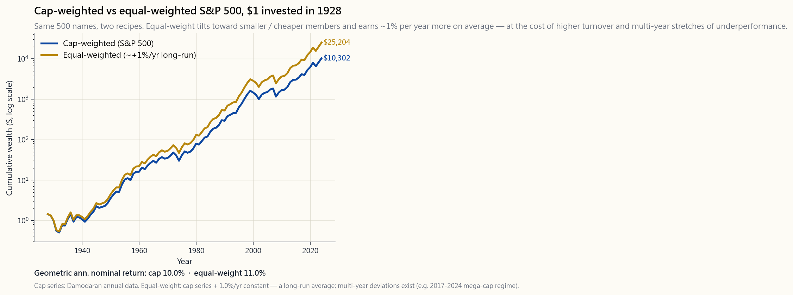
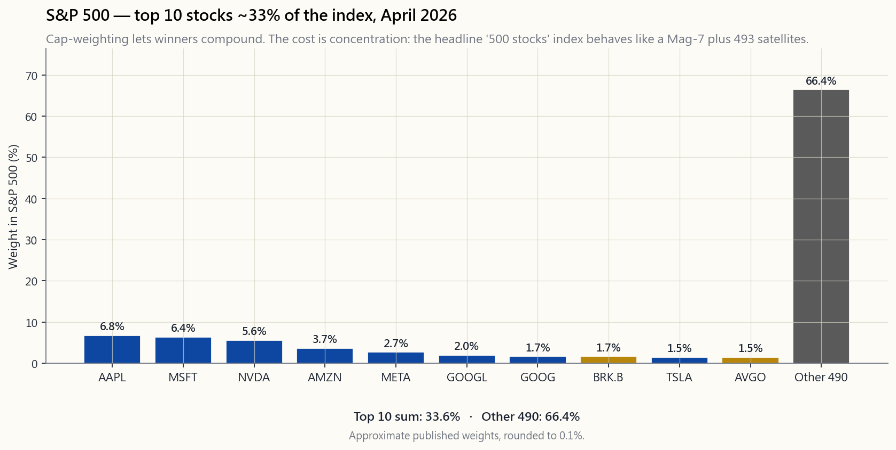

# 第九周：股票指数——记分牌是如何构建的

---

## 第一部分：阅读材料

---

### 1. 为什么这很重要

每一档财经新闻都用指数点位来概括当天的市场。"标普500指数上涨半个百分点。罗素2000指数下跌1%。纳斯达克100指数由科技股领涨。"这四五个数字告诉数百万投资者他们的投资组合"表现如何"——却没有人解释股票指数到底是什么。股票指数不是市场本身，它是一份**配方**：纳入哪些股票、每只股票的权重是多少、何时替换成分股。两份从同一食材库取料的配方，可以做出截然不同的菜肴。

每一位成年投资者都应当具备指数素养，原因有四。

1. **你几乎肯定已经持有某只指数产品。** 目前约有15万亿美元资金投入那些完全按照指数指令买入股票的产品。仅标普500指数一项，就有超过11万亿美元以其为基准或直接追踪它。你401(k)目标日期基金的费用、你券商账户里的交易所交易基金、你那只"主动管理"共同基金暗中依附的指数——全都由某个指数的规则决定存亡。持有一只指数产品却不了解其规则，犹如开了一家餐厅却从不看菜单。

2. **配方在悄然决定你的因子暴露。** 市值加权让你偏向已经大涨的股票。等权重让你偏向规模更小、估值更低的股票。价格加权（道琼斯指数的方式）让你偏向名义股价恰好较高的股票——而这不过是数十年前企业股票拆分留下的偶然结果。这些方式本身无所谓对错，但绝非可以互换。一个以错误指数为基准的六四投资组合，可能仅因机械原因就显得出类拔萃或一败涂地。

3. **指数机制会产生真实的资金流动。** 当一只股票被纳入标普500指数或罗素1000指数，所有追踪该指数的被动基金都必须在特定日期买入。当它被剔除，这些基金必须卖出。这些被迫的买卖流动会在再平衡日前后可靠地推动股价移动几个百分点——而罗素指数每年六月末的重组，是全球规模最大的有计划交易活动之一。如果你会围绕指数变动进行交易，这至关重要；即便你不做，了解再平衡日的价格波动是机械性的而非信息性的，也大有裨益。

4. **投资的诚实版本，接受指数。** 本课程的基本原则是：真正的阿尔法稀少且难以持续。扣除费用后，标普500指数在15年时间窗口内战胜了80%至90%的大盘股主动管理型基金。这并非因为指数有多高明，而是因为主动管理者的费用和换手率日积月累，形成了他们无法克服的阻力。对本课程大多数读者而言，默认策略是持有指数、坚守四个资金池（第13课），并将省下的决策精力用于优化税务结构（第15课），而非选股。要做到心中有数，你需要了解盒子里装的究竟是什么。

本周就是那个盒子。

---

### 2. 你需要了解的内容

#### 2.1 三种加权方案——同一成分，三种不同指数

任何指数最重要的设计选择，就是如何对成分股加权。同样30只股票，可以构建出三种截然不同的指数系列。

- **价格加权。** 每只股票的权重等于其股价除以所有成分股股价之和。道琼斯工业平均指数是目前仅存的以此方式构建的主要指数。一只400美元的股票权重是一只40美元股票的十倍，哪怕40美元的那只公司市值更大。股票拆分、股票回购以及名义股价的高低（这是一个营销决定，并非经济决定）都会扭曲结果。

- **市值加权。** 每只股票的权重等于其流通市值除以指数总市值。标普500指数、纳斯达克综合指数、罗素1000/2000/3000指数、MSCI ACWI指数——几乎所有运营真实基金业务的指数都采用这种方式。逻辑合理：如果英伟达市值3万亿美元，一家小型工业企业市值300亿美元，那么英伟达代表的权益经济体量是后者的一百倍，理应拥有一百倍的权重。代价是集中度。截至2026年4月，**标普500指数前10大成分股合计约占指数权重的33%**，"科技七巨头"单独就超过30%。你买入的并非真正意义上的"500只股票"，而是7只核心股票加上493颗卫星。

- **等权重。** 在再平衡日，每只成分股获得`1/N`的权重。标普500等权重指数（对应RSP交易所交易基金）是其典型代表。等权重会自动向规模较小、估值较低的股票倾斜，因为权重最大的股票被压至0.2%，权重最小的股票也被提升至0.2%。从非常长期的维度来看，其收益比市值加权版本高出约0%至2%每年，但代价是换手率更高、应税账户中的税务拖累更大，以及周期性的明显跑输阶段（尤其是2017至2024年，超大市值科技股全面碾压其他股票）。

市值加权与等权重标普500指数的财富累积对比图（1928年至2024年）见`image/week09_cap_vs_equal.png`。两条线都在攀升。等权重线最终稍高一些。没有哪条线在每个十年都占优。

#### 2.2 "科技七巨头"集中度问题

2026年4月，标普500指数前十大权重近似如下：

- 苹果约6.8%
- 微软约6.4%
- 英伟达约5.6%
- 亚马逊约3.7%
- Meta约2.7%
- Alphabet（GOOGL+GOOG）合计约3.7%
- 伯克希尔·哈撒韦约1.7%
- 特斯拉约1.5%
- 博通约1.5%

十家公司合计约占指数权重的33%，其中"科技七巨头"（苹果、微软、英伟达、亚马逊、Meta、Alphabet、特斯拉）约占30%。这是标普500指数自1960年代末"漂亮50"高峰以来所承载的最高集中度。`image/week09_top_concentration.png`中的柱状图呈现了这一格局：前10名形成一道陡峭的悬崖，随后490只股票瓜分剩余的三分之二权重。

这并非自动等同于问题。这恰恰是指数在做市值加权要求它做的事：让赢家持续复利增长。但它带来三个实际影响。

1. **你的权益仓位是对"科技七巨头"的押注。** 如果你只持有VOO或SPY，大约三分之一的权益资金集中在七家科技相关的超大市值公司。"500家公司"的分散化叙事低估了实际的因子风险。
2. **反转时集中度同样突出。** 2022年的回撤主要由驱动2020至2021年上涨的同一批头部个股主导；等权重跌幅更小。2000至2002年的互联网泡沫破裂是教科书级的前车之鉴。
3. **等权重如今是显而易见的分散化工具。** 同时持有RSP和VOO并不会大幅改变你的板块配置，但确实能将前十大集中度从约33%降至约17%。这对处于提取阶段的退休人员比年轻积累者更为重要。

#### 2.3 流通股调整——为何"市值"并非完全意义上的市值

每一个现代市值加权指数都使用**流通股调整后**市值，而非总市值。流通股是实际可供公开交易的股份数量——即总股本减去创始人、政府、母公司及其他战略持有人所持股份后的余量。

以下是2026年4月的几个估算案例：

- Meta有两类股份；A类流通比例约99%，但马克·扎克伯格持有的超级投票权B类股份处于锁定状态。标普500仅纳入A类股份。
- Alphabet的GOOGL（A类）和GOOG（C类）均公开交易；创始人持有的B类股份被排除在外。两个上市类别均被纳入指数。
- 伯克希尔·哈撒韦的流通股调整使其指数权重比总市值对应权重低出数百个基点，因为巴菲特的持股被认为不可交易。

流通股调整的原因是流动性，而非公平性：若指数要求追踪基金买入100%总股本，将迫使基金争购根本无从购得的股票。流通股加权解答的是指数基金真正需要回答的问题——"我实际上能买到什么？"

#### 2.4 罗素指数重组——真实发生的交易盛日

罗素指数系列（罗素3000/1000/2000）每年重组一次，时间定于六月最后一个周五。哪家公司归属哪个规模区间，取决于前一年5月31日的市值排名，并设有缓冲区间以限制成分股频繁更替。从缓冲区确认公告日（六月中旬）到周五收盘，两件事同步发生：

1. 对冲基金估算哪些股票将被纳入罗素2000指数、哪些将晋升至罗素1000指数，并提前买入这些标的拉抬价格。
2. 到再平衡当日，所有被动型罗素指数基金——以及所有担心偏离基准的"暗中追踪罗素指数"的主动基金——必须完成换仓。部分受影响个股单日成交量超过日均成交量的30%。

这是美国股票市场规模最大的有计划交易活动，也是"市场可以保持非理性的时间比你保持偿债能力的时间更长"这一道理最清晰的案例之一：价格波动是机械性的，但由于做空需要支付借券费用和承受盯市亏损，这种波动可能持续数周。标普500的季度再平衡和纳斯达克100的年度再平衡规模较小，但逻辑相同。

#### 2.5 幸存者偏差——指数悄然丢弃了什么

指数会悄然剔除成分股。破产、被收购或规模跌破门槛的公司将被移除，由新的名称填充空缺。历史指数序列——也就是你在图表书中看到的那条线——是一系列**幸存者加替补者**的记录。那些已经消亡的股票早已从中消失。

对于长期收益声明而言，这一点的影响远超多数人的认知：

- "股票自1928年以来每年回报9%至10%"这一说法，已经将1930年代消失的铁路公司、1970年代崩塌的综合企业集团，以及安然、世通、雷曼、昔日通用电气排除在外。它们的完整回撤记录在历史数据中有所体现，但其破产后的表现（归零）并未被并入"假设1928年买入一切"的序列。
- 实证研究表明，历史最悠久的宽基指数因幸存者偏差导致的收益高估约为每年1%至2%。第三周使用的达摩达兰数据集已在宽基市场层面对此进行了修正，这也是其"1928年以来股票"收益略低于标普500成立以来标题数字的原因。
- 对于个股选择决策而言，这一偏差严重得多。若以今日指数成分股为测试范围，回测"2000至2010年表现最佳的十只股票"策略，结果会显得极为出色——因为那个十年里你实际可能买入的失败者根本不在测试范围内。

实际结论：**每当有人向你展示回测结果，务必追问什么被剔除了**。原则再次适用——一份干净的回测比一张干净的图表罕见得多。

#### 2.6 主要指数——实用指南

- **标普500指数。** 约500家美国大盘股公司，由委员会依据盈利能力和流通股门槛筛选，流通股调整后市值加权，每季度再平衡。约占美国可投资权益市值的80%。对应追踪产品：VOO（先锋，费用率0.03%）、SPY（道富，0.0945%）、IVV（贝莱德，0.03%）。美国权益敞口的默认选择。

- **标普500等权重指数。** 同样的500只成分股，等权重，每季度再平衡。RSP（景顺，费用率0.20%）。换手率约为市值加权版本的7倍，在应税账户中会产生小但真实的税务拖累。

- **罗素2000指数。** 按美国市值排名约第1001至3000位的2000只股票。小盘股领域的标杆基准。IWM（贝莱德，0.19%）是主要追踪工具。盈利质量远低于标普500指数——罗素2000指数中有相当比例的公司净利润为负——这也是小盘股收益自2014年以来持续落后于大盘股的部分原因。

- **纳斯达克100指数。** 在纳斯达克上市的100家最大非金融类公司，采用修正市值加权方式，并设有重新权重规则，确保单只股票权重不超过约24%上限。QQQ（景顺，0.20%）。科技成分极重，但它*并非*科技指数——它是一个纳斯达克上市指数。

- **道琼斯工业平均指数。** 30只成分股，价格加权，委员会筛选。文化符号意义大于严肃基准价值。DIA（道富，0.16%）。不建议作为投资组合的构建模块。

- **MSCI ACWI指数。** 涵盖47个发达市场和新兴市场约3000只大中盘股票，流通股调整后市值加权。ACWI（贝莱德，0.32%）是主要交易所交易基金。**注意事项：** 对于本课程的香港或中国内地读者而言，ACWI中实际可投资的部分仅为约60%的美国权重加上可通过该基金持有的非美国发达市场部分。A股、内地开发商以及大多数在境内上市的股票，要么受资本管制制约，要么在操作层面存在严重障碍。本课程的默认立场是：超配美国上市敞口，如有需要则以小仓位持有ACWI作为分散化补充，不试图构建一个现实管道根本无法真正实现的"全球市值加权"投资组合。

#### 2.7 指数期货——流动性最强的真实价格

如果你想知道指数在现货市场开盘间隙"真实"处于什么水平，请查看近月期货：ES（E-mini标普500）、NQ（E-mini纳斯达克100）、RTY（E-mini罗素2000）、YM（E-mini道琼斯）。这些合约每天交易约23小时，名义交易额高达数百亿美元。交易所交易基金在市场压力期间可能短暂偏离净值；期货则不会偏离指数太远，否则套利会立即介入修正。

对长期投资者而言，了解这些内容并不是为了交易期货（你几乎肯定不应该这样做），而是为了理解：

- 财经电视上引用的盘前价格波动通常是近月期货，而非指数本身。
- 在危机期间（2020年3月、2024年8月），期货往往打出现货交易所交易基金要等到下一个开盘才能追上的价格。期货并非失真——它们只是在底层标的关闭时依然开放交易。
- 对于规模极大的配置（机构层面），持有期货加国债有时是比持有SPY更划算的标普500敞口方式，因为期货内嵌的融资利率有时低于交易所交易基金的综合持有成本。通过期权/保证金进行税务优化的操作也与此相关。

#### 2.8 自建指数——体验互动演示

本课互动演示`interactive/week09_index_builder.html`是一个沙盒工具。它为你提供30个具有代表性的标普500成分股，包含真实的股价、股份数量和近12个月回报数据。你可以在市值加权、等权重和价格加权之间切换，并观察：

- **成分饼图**的重绘（市值加权下高度集中，等权重下完全平坦，价格加权下呈现股价扭曲），以及
- **12个月指数收益**的重新计算。

这个练习的意义在于：亲手拨动旋钮，亲眼看到同样的30只底层股票因配方不同而产生三种不同的收益数字——有时相差数个百分点。这就是本课的核心启示。

---

### 3. 常见误解

1. **"道琼斯指数能告诉我今天市场表现如何。"** 道琼斯指数只有30只成分股，且采用任意名义股价造成的价格加权方式。任何一天，它都可能与标普500指数相差50个基点以上，原因纯属结构性差异。将其视为文化参考数据，而非投资组合基准。

2. **"标普500指数分散投资于500只股票。"** 它涵盖了500只股票的*名称*。截至2026年4月，"科技七巨头"约占指数权重的30%，前十大成分股约占33%。你的权益资金所实现的分散化程度，远低于标题数字所暗示的水平。

3. **"等权重始终跑赢市值加权。"** 长期来看确实小幅领先，但期间存在数年的跑输阶段——最近一次是2017至2024年——且换手率更高。这是不同的押注方式，并非免费午餐。

4. **"指数基金是被动的。"** 基金对其规则而言是被动的，但那些规则本身是委员会的主动选择。标普500委员会会主动决定谁被纳入。罗素指数的重组虽然机械执行，但其时间安排会产生可预期的交易行为。真正被动的指数并不存在——只是主动决策被提前嵌入上游罢了。

5. **"被纳入标普500只是走个程序。"** 实证数据显示，从宣布纳入到正式生效期间，被纳入的股票通常上涨3%至8%，且能维持数周。被剔除的股票则相应下跌。这是权益金融领域记录最翔实的异象之一。

6. **"纳斯达克等于科技。"** 纳斯达克是一个*上市交易所*。纳斯达克100指数之所以科技成分极重，是因为科技公司历史上倾向于在此上市，且它们已成长为足以主导市值加权指数的规模。百事可乐和Costco同样是纳斯达克100的成分股。

7. **"幸存者偏差只影响主动基金。"** 它同样影响指数本身。1928年的标普500历史序列默默以新名称替换旧名称；已消亡公司的后续轨迹（持续归零）并不出现在这条线上。

8. **"MSCI ACWI给了我真正的全球敞口。"** 它在回测中给了你全球敞口。在实际操作中，对于通过香港或新加坡券商操作的非美国居民投资者，新兴市场的大部分权重既不容易获取，成本也不低廉，税务处理同样不够高效。只有实际可投资的部分才算数。

9. **"流通股调整只是个次要技术细节。"** 对于内部人持股集中的公司（Meta、伯克希尔、众多创始人主导的公司），流通股调整可能意味着指数权重从4%降至1.5%的差距。这绝非细枝末节。

10. **"我的主动基金经理跑赢了指数。"** 某一年份确实有可能。但15年后，扣除费用，约七分之一的美国大盘股主动权益基金跑赢标普500指数。阿尔法的基础成功率很低——这正是"阿尔法稀缺"这一原则居于榜首的原因。

---

### 4. 问答环节

**Q1. 我是否应该用RSP替代VOO，以规避"科技七巨头"的集中度风险？**
A. 可能不宜将整个权益仓位都替换。常见的折中方案是70%至80%配置VOO，20%至30%配置RSP，这样可以将前十大集中度从约33%压缩至约25%，同时不放弃市值加权自然复利的优势。RSP的换手率也约为VOO的7倍，费用率高出17个基点。在税延账户中这一成本较小；在应税账户中，它会蚕食分散化带来的收益。

**Q2. 为什么主动基金经理难以跑赢标普500指数？**
A. 三个结构性原因。其一，费用：大盘股主动基金平均费用率约70个基点，而VOO仅为3个基点，基金经理每年一开始就落后67个基点。其二，市值加权指数让赢家自动复利；而基金经理倾向于削减赢家（再平衡纪律）、将资金重新配置至落后者，在趋势性市场中表现逊于指数。其三，指数无需缴纳资本利得税，而主动基金的换手率会产生税务成本。15年复利下来，差距相当可观。

**Q3. 那些"下一个苹果"但未能成功的股票去哪里了？**
A. 它们离开了指数。宝丽来、伊士曼柯达、西尔斯、雷曼兄弟、缩水版通用电气、贝尔斯登、MCI、安然、世通、太平洋燃气电力（进出反复）、AIG（2004年纳入，2008年剔除，后重新纳入）——每一家都曾是标普500指数中占比数个百分点的重要成员。它们的亏损仅体现在历史序列中直至离开指数的那一天。此后，空缺由新成员填充，已消亡公司持续归零的轨迹不再出现在曲线上。

**Q4. 我能直接投资标普500指数本身吗？**
A. 不能。指数是一个计算结果。你可以购买持有底层股票的交易所交易基金（VOO、SPY、IVV）、追踪该指数的共同基金（VFIAX），或以指数结算的期货（ES）。三者都是围绕同一配方的不同包装形式；选择哪种包装，是费用、税务和可及性的决策。

**Q5. 标普500委员会如何决定纳入哪些成分股？**
A. 资格条件——美国注册地、市值超过门槛（2026年4月约为180亿美元）、连续四个季度GAAP盈利、公众流通股比例不低于50%——使公司进入候选名单。委员会随后综合考虑板块平衡需求和替补需要（某成分股被剔除才会产生空缺）进行遴选。委员会的自由裁量权，是特斯拉被纳入比预期晚了数年的原因，也是纳斯达克综合指数（以上市交易所为规则依据）和罗素1000指数（纯市值排名）在边际情形上与标普500指数走势有所不同的原因。

**Q6. 为什么本课没有涉及恒生指数？**
A. 受可投资范围约束所限。对于本课程的香港或内地读者而言，通过2800.HK在技术上可以获得恒生指数敞口，但其底层成分以内地上市银行和开发商为主，其会计准则和政治风险与美国投资者定价的任何资产都有本质区别。本课程的立场是：若你生活在香港，可配置少量恒生指数追踪产品以对冲生活支出货币敞口，但不应将其视为美国指数的替代品。标普500是引擎；香港敞口是对油箱的对冲。

**Q7. "科技七巨头"的权重在五年后可能会是多少？**
A. 无人知晓，这是诚实的答案。历史上有两个类比：1960年代末"漂亮50"的集中度峰值与当前相近，随后在1974至1975年约被腰斩；互联网时代的超大市值股票在2000年初触顶，指数随后花了整整十年将权重向其他成分股轮换。两次转折都很痛苦。第三种可能性——也是市值加权*所押注的*——是人工智能带来的生产率提升持续支撑这些公司的盈利增长领先于指数其余部分，届时集中度将进一步提升。如果你不想押注其中任何一种结果，同时持有VOO和RSP是一个合理选择。

**Q8. 如何为六四投资组合设定基准？**
A. 最简洁的基准是60%VTI（或VOO）加40%AGG（或BND），每季度再平衡。计算该基准的收益，再与你的实际投资组合对比。如需更精细，可加入小比例国际权益配置（权益仓位的5%至15%，通过ACWX实现）以匹配实际持仓。若将六四投资组合与100%标普500指数对比，牛市年份你会显得一无是处，熊市年份又会虚假地表现出色——那是错误的基准。

**Q9. 专业交易员为什么不直接交易罗素指数重组？**
A. 他们确实在交易，而且这个交易策略已广为人知，以至于容易套利的机会早已消失。剩余的风险溢价来自于承担双向库存风险（精确哪些成分股将被纳入，要到正式公告前两周才能确定，同时做空被剔除成分股需要支付借券成本）。拥有适当基础设施的对冲基金每年仍能从这一策略中获取数百个基点的收益——但代价是散户投资者无法复制的风险承担和操作复杂性。

**Q10. 对我而言最重要的一个指数是什么？**
A. 标普500指数。它是约11万亿美元美国权益资本的基准，是每一个401(k)账户的默认配置，是每一只主动基金被衡量的参照系，也是"阿尔法稀缺"这一原则最清晰的体现：持有指数、接受市场收益，把稀缺的决策精力用在四个资金池和税务结构上，而不是选股。本课所有其他内容，都是围绕这一核心事实展开的延伸阐释。

---

## 第二部分：YouTube脚本

---

**视频标题：** 指数基金里装的究竟是什么——市值加权、等权重、价格加权全解析
**目标时长：** 约18分钟
**主持人：** 陳馬、小魚

---

**[开场白——0:00]**

陳馬：欢迎回来。今天是第九周。市场指数。标普500指数。罗素2000指数。纳斯达克100指数。道琼斯。MSCI ACWI。它们究竟是什么，如何构建，以及为什么两个从同一食材库取料的指数，端上桌的可以是截然不同的菜肴。

小魚：我想先坦白一件事，因为我觉得很多观众可能也有同感。我持有VOO两年了，才真正弄清楚里面装的是什么。我知道"标普500"，知道"美国大盘股"，但我不知道截至今年四月，前十大成分股合计约占指数三分之一的权重。搞明白这件事之后，我对它的看法完全变了。

陳馬：这个开场切入得很准。因为标题说的——五百家公司！多元分散！——悄悄掩盖了一个事实：配方比食材清单更重要。同样五百家公司，三种不同的加权配方，就是三只不同的基金。

**[第一节：三种配方——1:30]**

小魚：三种加权方案。我们逐一来说。

陳馬：价格加权。每只股票按股价占比计算权重。这就是道琼斯指数的做法。一只400美元的股票权重是40美元股票的十倍——哪怕40美元那只公司市值更大。为什么还有人在用这套方法？惯性使然。道琼斯指数创立于1896年，那时候没有电脑，市值数据也很难获取，把股价加总是用纸笔能做到的事情。

小魚：而且股价本身并不是一个真正有经济意义的数字。一家公司明天可以做一拆四。同一家公司，股价变成四分之一，它在道琼斯指数里的权重也跟着变成四分之一。但什么实质性的东西都没有改变。

陳馬：对。所以价格加权是历史遗留产物。这也是为什么道琼斯指数是一个文化参考，而非严肃的投资组合基准。把它当财经电视里的背景音乐就好。

小魚：市值加权。每只股票按市值占比计算权重——股价乘以公众实际可买入的股份数量。这就是标普500指数、纳斯达克综合指数、罗素系列指数、MSCI ACWI指数的做法。几乎所有真正运营基金业务的指数都采用市值加权。

陳馬：逻辑很合理。苹果市值三万亿美元，一家小型工业企业市值三百亿美元，苹果代表的权益经济体量是后者的一百倍。市值加权说：就给它一百倍的权重。赢家自动复利，没有人需要做主动的买卖决定。

小魚：这是它的优雅之处。现在说说代价。

陳馬：集中度。截至2026年4月，标普500指数前十大成分股约占指数权重的33%。"科技七巨头"——苹果、微软、英伟达、亚马逊、Meta、Alphabet、特斯拉——约占30%。另一方面，等权重方式规定每位成分股成员获得1/N的权重。500只股票，每只各得0.2%。标普500等权重指数，也就是RSP这只交易所交易基金，是其典型代表。同样五百家公司，配方却截然不同。

小魚：我们来看集中度图表。

**[VISUAL: image/week09_top_concentration.png]**

陳馬：这是一张柱状图。左侧是2026年4月标普500指数前十大权重：苹果6.8%、微软6.4%、英伟达5.6%、亚马逊3.7%、Meta 2.7%、Alphabet（GOOGL和GOOG合计）约3.7%、伯克希尔1.7%、特斯拉1.5%、博通1.5%。加总大约是33%。

小魚：然后右边那根柱子，"其余490只"，是剩下所有成分股的总和。大约占指数的67%，由490家公司分摊。

陳馬：当有人告诉你标普500分散化投资，说的就是这个。分散在*名称*上。但实际的资金敞口高度集中。如果"科技七巨头"遭遇糟糕的一年，你持有的VOO就会遭遇糟糕的一年——无论另外493家公司表现如何。

小魚：这是个问题吗？

陳馬：不自动等同于问题。这是指数在做市值加权让它做的事——让赢家跑起来。2020年是这种做法大获全胜的一年，2023、2024、2025年大部分时间也是。代价是非对称的回撤。当驱动上涨的同一批股票领跌时——就像2021年末到2022年——等权重跌得少。我们亲眼见到了。2022年RSP跑赢VOO约六个百分点。

小魚：长期来看呢？

**[VISUAL: image/week09_cap_vs_equal.png]**

陳馬：这是对数坐标下的财富累积图，时间跨度1928年至2024年。深蓝色是市值加权标普500，金色是等权重。两条线都在攀升，大部分时间同步上行，等权重最终略高——几何平均年化收益约高出1%。但注意哪一条线领先的时间段各不相同，有时持续多年。没有永久的赢家，只有小幅的长期倾斜和大量受市场风格主导的噪音。

**[第二节："科技七巨头"的集中度问题——6:30]**

小魚：我们深挖一下集中度这个问题。因为这是当下最现实的议题。

陳馬："科技七巨头"的权重十年来持续攀升。2014年时七家合计可能约占指数12%，2020年约22%，2026年4月约30%。这是标普500指数自1972年"漂亮50"峰值以来，单一成分股群体所承担的最高集中度。

小魚：对于不了解"漂亮50"的观众，这是指1970年代初期那一批被视为"买入即可永久持有"的成长股——IBM、宝丽来、施乐、可口可乐、麦当劳。它们在市值加权指数中曾极为强势。

陳馬：然后1973至1974年的熊市把它们大约砍了一半。可口可乐和麦当劳后来复苏了，宝丽来和施乐实际上再也没有回来。重点不是要预测"科技七巨头"会遭遇同样的命运——这些公司的基本面盈利故事确实更加扎实，人工智能是真实的，它们具备"漂亮50"的不少领军者所缺乏的真实盈利能力。重点在于：高集中度是反复出现的规律，高集中度的瓦解同样是反复出现的规律。阿尔法稀缺，不要押注永久统治地位，也不要去做空它。

小魚：那对于持有VOO的观众，实际操作上怎么做？

陳馬：三个选项。第一：什么都不做，接受这种集中度，接受你是在一只看起来分散的交易所交易基金里间接押注"科技七巨头"。第二：同时持有VOO和RSP，比例大约七三或八二。这样大概能将前十大集中度减半，同时不会大幅改变板块配置。第三：持有VOO加上单独的小盘股或国际权益仓位——这也是大多数目标日期基金的做法。

小魚：在当前这个集中度格局下，我倾向于第二种选择。如果整体集中度没这么高，我会对单纯持有VOO更满意。

**[第三节：指数如何维护自身——9:00]**

陳馬：指数不是静态的，它们需要不断增减成分股。主要有两种机制：重组和再平衡。

小魚：重组是大动作——就是增加或删除成分股名称。再平衡只是调整现有成分股的权重。

陳馬：对于罗素指数系列，重组一年一次，定于六月最后一个周五。指数方根据前一年5月31日的市值，对所有美国股票进行排名。前一千名是罗素1000指数，第1001至3000名是罗素2000指数。边界附近设有缓冲区间，避免临界股票年年换进换出，但整体上是机械执行的。

小魚：到了六月那个周五，所有追踪这些指数的被动基金都要同时完成换仓。这就产生了资金流。

陳馬：这是美国股市规模最大的有计划交易活动。部分受影响个股当天的成交量可超过日均成交量的30%。提前预判哪些股票将被纳入或在规模区间之间晋升的对冲基金，会在数周前开始买入拉抬。被纳入的股票上涨，被剔除的股票下跌。部分涨幅七月回吐，部分得以延续。

小魚：标普500是另一套节奏，对吧？

陳馬：对。标普委员会按需增减成分股——通常在现有成分股被收购或不再满足规则时触发。他们在正式生效日前大约一周宣布变动，同样产生资金流效应——被纳入的股票在宣布到生效期间通常上涨3%至8%，且能维持数周。

小魚：这是权益金融领域记录最翔实的异象之一。

陳馬：记录翔实，且持续存在。这很有意思，因为按理说记录在案的异象应该会被套利掉。这个异象没有完全消失的原因是：被迫的资金流是真实存在的——被动基金必须在特定收盘日买入。提前布局是有效的，直到参与资本足够多，让价差收窄。目前的均衡状态是：溢价仍然存在，但不是免费午餐。

**[第四节：流通股调整——11:30]**

小魚：我们来聊聊流通股调整。听起来很技术性，但很重要。

陳馬：总股本减去创始人、政府、母公司及其他战略持有人所持股份，剩下的就是流通股——指数基金实际上能买到的部分。

小魚：为什么指数要在意这个？

陳馬：因为如果不这样做，指数就会让追踪基金去买根本买不到的股票。以Meta为例，马克·扎克伯格持有的超级投票权B类股份是锁定的。流通股只有A类。如果标普500按总市值给Meta加权，每只被动基金都会被要求买入比公开市场能提供的更多的Meta股票。流通股调整让配方与实际可买到的东西相匹配。

小魚：而且这直接影响真实权重。伯克希尔的流通股调整后权重，就明显低于其总市值对应的权重，因为巴菲特的持股被排除在外。

陳馬：对。对于创始人主导的公司——Meta、伯克希尔、很多近年上市的新股——流通股调整可以将指数权重削减三分之一甚至更多。这不是注脚，这是真正的配方。

**[第五节：幸存者偏差——13:00]**

陳馬：在进入互动环节之前，最后一个概念：幸存者偏差。

小魚：这个很狡猾。

陳馬：当你看到"标普500指数自1928年以来年化收益10%"这张图，看到的是幸存者加替补者的轨迹。破产的公司在离开指数那天就退场了，空缺由新成员填补，已消亡公司后续的表现——通常归零——并不被纳入这条线里。

小魚：所以标题数字在某种程度上高估了真实情况。

陳馬：实证数据显示，历史最悠久的宽基指数每年约高估1%至2%。本课程使用的达摩达兰数据集已在宽基市场层面对此进行修正，这也是他的"1928年以来股票"数据比标普500成立以来的标题数字略低的原因。

小魚：对于个股回测，偏差会严重得多。

陳馬：严重得多。如果有人给你看一份"过去二十年表现最佳十只股票"的回测——他们是在今天仍然存活的赢家里面挑选的。那个十年里你实际可能买入的失败者，根本不在测试范围内。回测看起来总是光鲜亮丽。教训一如既往：看到别人展示回测，先问被剔除了什么。

**[第六节：互动演示——15:00]**

小魚：来看这周的互动演示。

**[VISUAL: interactive/week09_index_builder.html]**

陳馬：我们嵌入了30个具有代表性的标普500成分股，包含真实名称、大致符合2026年4月的股价、股份数量以及过去12个月的回报数据。顶部有三个按钮：市值加权、等权重、价格加权。

小魚：我先切到市值加权。左边的饼图显示我们这个30只股票的迷你指数的成分构成。苹果是最大的那块——大约占这个30只股票玩具指数的10%。英伟达、微软，还有其他超大市值股。最后15只股票加在一起，可能只占饼的四分之一左右。

陳馬：现在点击等权重，看饼图怎么变。

小魚：每一块都变成三十分之一了，各占3.3%。图看起来完全不一样，但还是**同样三十家公司**。

陳馬：右侧的指数收益也变了。在这个样本里，超大市值股的12个月回报较好，所以市值加权版本的收益更高。等权重版本纳入了更多中小市值成分股的贡献，其中部分表现欠佳。两个数字相差可达数个百分点。

小魚：现在切到价格加权，这是道琼斯指数的配方。

陳馬：现在饼图里最大的那块，变成了名义股价最高的公司。在我们这个样本里是伯克希尔，尽管它远非市值最大的。苹果的占比反而排名靠后，因为它的股价处于中等水平，尽管它的市值极为庞大。

小魚：这就是这节课的核心。同一个食材库，三种配方，三道不同的菜肴。

**[结尾——17:30]**

陳馬：本周的核心结论。指数是配方，不是市场。对本课程大多数读者而言，标普500指数是应该默认持有的那个配方——它是本课第一原则最清晰的体现：持有指数，接受市场收益，把稀缺的决策精力用在四个资金池和税务结构上，而不是选股。

小魚：如果当前的集中度格局让你不安，加入一些等权重配置。对罗素2000指数要谨慎——小盘股质量已不如二十年前。把道琼斯当电视背景音乐就好。如果你生活在香港或内地，不要试图构建一个现实管道根本无法真正实现的"全球市值加权"投资组合——只有实际可投资的部分才算数。

陳馬：下周是第十周——债券。当你买入国债、投资级公司债、高收益债券时，你实际上买的是什么。为什么在大多数情况下，久期风险比信用风险更危险。我们下周见。

小魚：下周见。