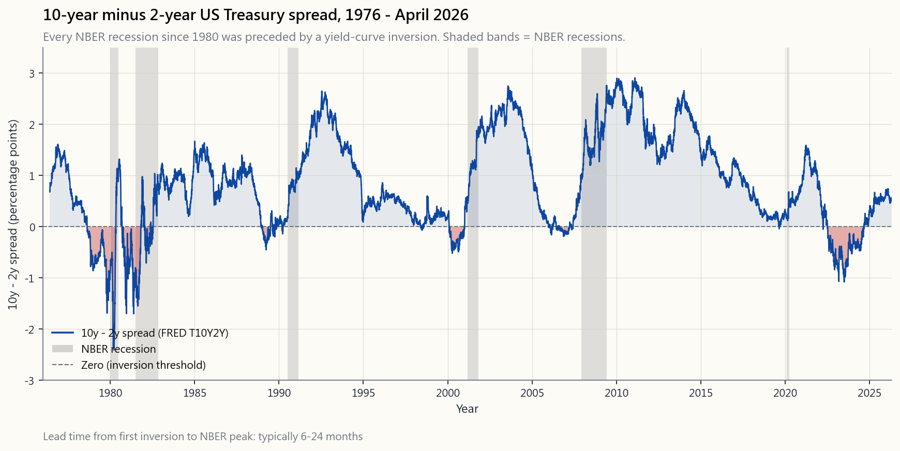
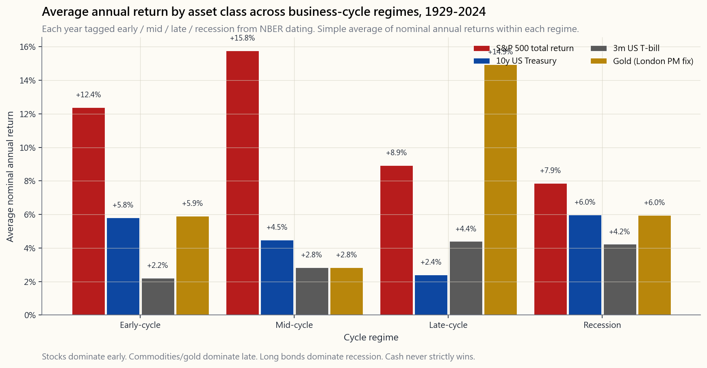

# 第十周：经济周期——扩张、峰值、收缩、谷底，以及各阶段对资产的影响

---

## 第一部分：阅读材料

---

### 1. 为什么这一课至关重要

经济不会沿直线运行，任何依赖经济产生现金流的资产亦然。它扩张、过热、收缩、复苏，然后周而复始。这个循环的四个节点——扩张、峰值、收缩、谷底——这些名称已有百年以上的历史，而这一规律本身比名称更为古老。

你需要认真对待经济周期，原因有四。

1. **周期决定哪类资产胜出。** 股票在扩张早期领涨，大宗商品在扩张晚期领涨，长期债券在衰退前后领涨，现金只在极短的顶部时期领涨。为某一阶段构建的投资组合，可能一两年内一无所获，某一年则全面失误。你无需精确择时；你必须大致判断所处阶段，因为在周期的每个节点，*某些*资产悄然便宜，*某些*资产悄然昂贵，这种差距通常比股权风险溢价本身还要大。
2. **经济衰退按规律降临，即便时机模糊。** 自1945年以来，美国经历了十三次经济衰退。平均扩张期约为五年，平均收缩期约为十一个月。凡是告诉你"商业周期已消亡"的人，都忘了同样的话在1929年、1968年、1999年和2007年也曾被说过。周期不会消失，只是改变形态。
3. **收益率曲线自1955年以来预示了每一次经济衰退，仅一次存在争议。** 对于单一指标而言，这是非凡的记录，且可免费获取。如果本课程你只忽略一个信号，请不要忽视10年期与2年期国债的利差。
4. **周期意识是理性型60/40与自满型60/40之间的分水岭。** 第四周证明了60/40的长期统计数据出色。本周揭示统计数据背后的统计数据：60/40*本质上是一种政策环境押注*，而政策环境可能改变。政策环境转变点——被动指数投资已奏效四十年，这并不意味着它会永续——的成败取决于周期。

本课涵盖NBER日期认定、短/中/长周期的叠加结构、三类指标体系、收益率曲线详解、各阶段的资产配置策略，以及2008年、2020年、2022年和2026年格局如何揭示教科书在周期失灵时的局限。

---

### 2. 核心知识点

#### 2.1 NBER日期认定——谁来裁定经济衰退的发生

"连续两个季度GDP负增长"这一通俗简写，*并非*美国官方定义。真正的裁判是**美国全国经济研究所（NBER）商业周期认定委员会**——八位学术经济学家，他们在事后确定一个峰值月份和一个谷底月份。其工作定义为：

> 经济活动大幅下滑，影响广泛，持续数月以上，通常体现在实际国内生产总值、实际收入、就业、工业产出以及批发和零售销售额上。

由此得出三点结论。

- **经济衰退以月为单位认定，而非以季度为单位。** 2020年2月为峰值，2020年4月为谷底，历时两个月——美国有史以来最短的经济衰退。"两个季度"法则将完全错失这次衰退。
- **经济衰退的认定存在滞后。** 委员会会等待数据修订稳定后才公布，通常在峰值发生*六至十八个月后*。待NBER正式宣布衰退开始之时，股票市场往往已触底并开始反弹。这是散户投资者"等待衰退被确认后再买入"策略失败的最主要原因——他们买入的时机偏晚，错失了反弹行情。
- **认定标准是多元的。** 实际国内生产总值可以连续两个季度负增长却不构成NBER认定的衰退（2022年上半年的"技术性衰退"*未被认定*，因为就业和工业产出持续上升）；而NBER也可以在其中夹杂一个正增长季度的情况下认定衰退（1980年）。

1945年后美国历次衰退完整列表，含峰值→谷底月份：

| 序号 | 峰值 | 谷底 | 时长 |
|---|---|---|---|
| 1 | 1948年11月 | 1949年10月 | 11个月 |
| 2 | 1953年7月 | 1954年5月 | 10个月 |
| 3 | 1957年8月 | 1958年4月 | 8个月 |
| 4 | 1960年4月 | 1961年2月 | 10个月 |
| 5 | 1969年12月 | 1970年11月 | 11个月 |
| 6 | 1973年11月 | 1975年3月 | 16个月 |
| 7 | 1980年1月 | 1980年7月 | 6个月 |
| 8 | 1981年7月 | 1982年11月 | 16个月 |
| 9 | 1990年7月 | 1991年3月 | 8个月 |
| 10 | 2001年3月 | 2001年11月 | 8个月 |
| 11 | 2007年12月 | 2009年6月 | 18个月 |
| 12 | 2020年2月 | 2020年4月 | 2个月 |

八十年间十二次衰退。两次衰退之间的平均扩张期：约六十三个月。有史以来最长扩张期——2009年6月至2020年2月——历时128个月，终结原因是外生冲击（新冠疫情），而非内部过热。这一事实意义重大：并非每一轮周期都由内部因素终结。

#### 2.2 周期中的周期——基钦周期、朱格拉周期、康德拉季耶夫周期

教科书通常呈现一个周期。诚实的图景是：存在多个周期，相互叠加。

- **基钦周期（约3至5年）。** 库存周期。企业过度订购→库存积压→削减订单→库存消化→重新订购。制造业采购经理人指数随之波动。月度经济数据中的大部分噪音来自基钦周期。
- **朱格拉周期（约7至11年）。** 资本支出周期。企业投资固定资本（工厂、设备、软件）。产能超过需求，资本支出收缩，随之出现经济衰退，周期重置。这就是投资者谈及"商业周期"时通常所指的衰退周期。美国战后平均扩张期正好落在朱格拉窗口之内。
- **康德拉季耶夫周期（约40至60年）。** 长波。由技术革命、人口结构和货币政策环境驱动。蒸汽、铁路、电气化、汽车、半导体、互联网——每一个都锚定了一段长波。**这正是政策环境转变点所谈论的那个周期。** 从1981年8月（沃尔克利率峰值）到2021年零利率顶点，长达四十年的反通胀牛市，是康德拉季耶夫周期的一个上升阶段。下一个上升阶段不会与之相同。

我们**不**将基钦/朱格拉/康德拉季耶夫当作命理学来交易（"下一个9.6年周期将在2027年10月见顶"）。以上数字并非确定性的。我们运用的是其*直觉*——存在短、中、长三个叠加的周期，你所处的阶段取决于你在审视哪个周期。2022年的通胀冲击是朱格拉周期峰值内的一次康德拉季耶夫周期可能的顶部信号。这与2008年的格局截然不同——彼时中长波均仍处于反通胀的上升阶段，这解释了为何同一套策略（美联储降息→债券上涨，股票上涨）在2008年奏效，而在2022年*失灵*。

增长上行/下行与通胀上行/下行交叉构成的四象限框架，是上述理论的实用版本。我们将在第2.5节中使用它。

#### 2.3 领先、同步与滞后指标

每一个经济数据系列，根据其相对于周期的时序，可归入以下三类之一。

- **领先指标**在经济转折*之前*率先变化。收益率曲线斜率、建筑许可、ISM新订单分项指数、首次申请失业救济人数、标普500指数本身，以及世界大型企业联合会的领先经济指数（LEI），均为经典代表。领先时间：通常为六至十八个月。
- **同步指标**与经济*同步*变化。工业产出、剔除转移支付的实际个人收入、实际制造业和零售销售额，尤其是**非农就业人数**。这四项大致就是NBER实际用于认定周期的变量。领先时间：零。
- **滞后指标**在经济转折*之后*才变化。失业率、核心CPI、优惠贷款利率、失业持续时长、消费信贷与个人收入之比。滞后时间：三至十二个月。

散户最常见的单一错误，是将**滞后**指标当作决策级别的指标使用。"失业率是3.8%——经济一切正常"是2007年的说法。2007年11月，也就是上一轮扩张见顶的当月，失业率为4.7%，二十三个月后失业率峰值达到10.0%。当失业率确认衰退已经开启时，股票市场早已跌去三分之一。相比之下，收益率曲线在2006年中期便已发出预警。

诚实的信号层级：**价格数据优先，软数据其次，硬数据再次，滞后数据永远不作为主要信号。** 价格数据是收益率曲线、信用利差、板块领涨特征、铜金比率。软数据是各类调查（ISM、消费者信心）。硬数据是官方公布数据（非农就业、国内生产总值、工业产出）。每一层大致比前一层慢一个季度。周期的领先端存在于市场中，而非数据发布日历中。

#### 2.4 收益率曲线——最重要的领先指标

美国经济衰退最可靠的单一领先指标，是**国债收益率曲线斜率**，通常以10年期收益率减去2年期收益率（或10年期减3个月期）来衡量。当该利差为负——长期利率*低于*短期利率——收益率曲线即为**倒挂**。

为何倒挂能预测经济衰退？

- **它压缩了银行盈利能力。** 银行借入短期资金，发放长期贷款。当短期利率超过长期利率时，每一笔新贷款的利差都被压缩。银行收紧信贷，信贷创造放缓，最具周期性的板块（房地产、资本支出、汽车、小型企业）首当其冲。
- **这是债券市场对美联储政策的裁决。** 10年期收益率低于2年期收益率，意味着长端在说：*美联储将短期利率提得太高了，增长和通胀都将下降，未来利率将会走低*。债券市场在此类宏观预测上的集体判断，出错频率低于任何其他市场。
- **倒挂→预期→行为。** 一旦企业财务总监、银行信贷官和财经媒体都盯着倒挂的收益率曲线，对衰退的*预期*本身就会引发衰退。资本支出被推迟，招聘放缓，裁员计划付诸实施。该信号在一定程度上具有自我实现的特性。

1976年后各次首次倒挂至NBER峰值的领先时间：

| 首次倒挂 | NBER峰值 | 领先时间 |
|---|---|---|
| 1978年8月 | 1980年1月 | 17个月 |
| 1980年9月 | 1981年7月 | 10个月 |
| 1988年12月 | 1990年7月 | 19个月 |
| 2000年2月 | 2001年3月 | 13个月 |
| 2006年1月 | 2007年12月 | 23个月 |
| 2019年8月 | 2020年2月 | 6个月（后遇新冠疫情） |
| 2022年7月 | 2026年待定？ | 22个月以上 |

在你将其转化为个人市场择时系统之前，有两个警告。**第一**，领先时间是可变的——你不能在倒挂当天就用它作为"立即卖出"的信号，否则将放弃两至三年的晚周期股票收益。**第二**，*解除*倒挂（收益率曲线在倒挂后重新趋陡）在历史上比倒挂本身更接近实际事件。2024年底至2025年初的重新趋陡，是这套策略在2026年值得重点关注的部分。

#### 2.5 各政策环境下的资产表现

按周期描述资产类别表现的最佳摘要框架，以实际GDP增长的*方向*和距离衰退的远近为基础，划分为四种政策环境。

- **周期早期（复苏期）。** 衰退刚刚结束，增长反弹，通胀仍在下降，利率处于低位。**股票 > 公司债 > 国债 > 现金 > 大宗商品。** 股票贝塔制胜；周期性板块领涨；小盘股和高收益债券表现突出。这是风险资产整个周期中*夏普比率最高*的阶段——标普500在NBER谷底后首个十二个月的历史平均收益约为+35%。
- **周期中期。** 增长稳定，通胀可控，利率正常化。**股票 > 公司债 > 大宗商品 > 国债 > 现金。** 股票仍然领涨，但领涨板块从周期股转向成长股和优质股。这是持续时间最长的阶段，被动做多最为轻松。
- **周期晚期。** 增长仍为正但在放缓，通胀上升，中央银行收紧政策。**黄金/大宗商品 > 现金 > 股票 > 公司债 > 国债。** 实物资产领涨；能源和材料板块表现突出；长久期债券因收益率上升而受压。这一阶段60/40开始失效，因为两条腿同时承压——2008年和2022年均属于这一类别。
- **衰退期。** 增长为负，通胀下降（滞胀除外，见第2.6节），中央银行降息。*下行过程中*：**长期国债 > 黄金 > 现金 > 股票 > 大宗商品**；但衰退年份通常也包含反弹行情（1933年、1954年、2009年），这拉高了全年股票的实际平均收益。久期制胜；防御性股票板块（必需消费品、医疗保健、公用事业）优于周期性板块；随着实际利率下降，黄金表现良好。

四种政策环境下四大资产类别1929至2024年平均年化收益静态柱状图：

阅读该图时，请记住三条心理法则：

- **政策环境差距对波动性资产而言较大。** 股票在各环境间差异约为8个百分点，黄金约为12个百分点，长期债券约为4个百分点。即便是粗略的阶段判断，其对预期收益的影响也超过整整一年的股权风险溢价。
- **衰退年份股票收益看起来出奇地正面。** 这是因为NBER认定的衰退年份往往*包含*反弹行情——1933年（+50%）、1954年（+53%）、2009年（+26%）均落在衰退年份内。熊市损失集中在*周期晚期*标签中（囊括2008年和2022年），而非衰退期本身。
- **没有任何单一资产在每种政策环境下都能胜出。** 这正是框架中包含股票与长期国债的杠铃结构加上实物资产配置的原因。*当前*周期不利于某一资产，恰恰是周期转变时该资产胜出的前兆。

下方的互动**政策环境探索器**，允许你点击1929年以来的任意年份，查看：（a）该年被标注的政策环境，（b）该年各四类资产类别的实际一年期远期收益，以及（c）所有同一政策环境年份的平均值。最能增强你直觉的练习：依次点击2007年、2008年、2009年。观察政策环境如何从周期晚期翻转至衰退期再至周期早期，并观察最优资产类别随之翻转。

#### 2.6 2008年、2020年、2022年与2026年

四个近期案例，各有不同的启示。

**2008年——反通胀策略奏效。** 晚周期失衡（住房信贷），经济衰退，美联储降息至零，通胀崩溃，长期国债剧烈反弹（2008年+20%），股市于2009年3月触底，教科书式60/40复苏几乎按时序展开于2009至2010年。这一周期遵循了教科书。

**2020年——外生冲击案例。** 全球公共卫生冲击来袭，NBER认定有史以来最短的衰退（两个月），美联储和财政部联合推出和平时期规模最大的刺激措施。长期国债、黄金与股票共同反弹，因为应对力度压倒性地强大。从朱格拉周期意义上说，这*并非*一次周期性衰退；失衡并未积累。重要的是，此次应对留下了巨大的货币超发，成为2022年的输入条件。

**2022年——教科书失效。** 通胀在2020至2021年刺激措施和供给冲击的推动下飙升至9%。美联储在九个月内加息425个基点。长期国债下跌18%，股票下跌18%。**60/40迎来历史上第二差的自然年。** 这一周期并非正常的晚期/衰退弧线，而是没有经济衰退的晚期通胀冲击，反通胀策略随之失效。政策环境转变点——*四十年并不能使被动投资永久有效*——那一年证明了其价值。

**2026年（截至撰写时的实时格局）。** 收益率曲线于2022年7月倒挂，并在2024至2025年重新趋陡。标题通胀率回落至约3%，但服务业通胀具有黏性。失业率从周期低点3.4%漂移至约4.5%。标普500在2024年底创出新高，主要由大型科技公司的人工智能资本支出驱动。领先指标——收益率曲线重新趋陡、ISM新订单低于50、失业救济申请人数温和上升——指向2026年经济放缓。能否被认定为经济衰退，目前各占五成。**教训不在于如何押注，而在于关注哪些信号：** 非农就业扩散指数、信用利差指数，以及标普500内周期股与防御股的相对表现。这些信号的转变将早于价格指数。

#### 2.7 四十年视角——政策环境问题所在之处

每个朱格拉周期约为十年，每个康德拉季耶夫周期约为四十年。从1981年8月（沃尔克利率峰值）到2021年零利率顶点，长达四十年的反通胀牛市，是康德拉季耶夫周期的一个上升阶段。*在其内部*，经历了五次朱格拉衰退（1990年、2001年、2008年、2020年）和大约十次基钦库存周期。每一次朱格拉衰退之后都出现了更强劲的上升阶段，因为康德拉季耶夫的宏观背景仍是反通胀和利率下行。

2022年的通胀冲击，是首个实质性数据点，暗示康德拉季耶夫宏观背景可能已经翻转。我们目前尚不清楚——这类事情需要十年而非一个季度才能厘清。但这种翻转的*可能性*，正是周期意识型配置在未来十年比过去四十年更加重要的原因。当宏观背景是平稳的反通胀顺风时，"买入并持有指数"在约95%的年份中是正确的。当宏观背景存在不确定性时，周期是实现8%实际收益与亏损4%实际收益之间的分水岭。

---

### 3. 常见误解

1. **"经济衰退意味着股票市场已经崩溃。"** 不然。股票市场通常在NBER峰值*之前*六至九个月见顶，在NBER谷底*之前*六至九个月触底。待衰退被确认时，市场通常已完成大部分跌幅，并正处于复苏途中。等待官方公告后才重新入场的投资者，买入的是反弹行情而非底部。

2. **"连续两个季度GDP负增长等于经济衰退。"** 这是一个有用的标题简写，但并非官方规则。NBER从多个系列的深度、扩散性和持续时间三个维度综合判断。2022年上半年实际GDP为负，但*未被认定*为经济衰退，因为就业持续上升。

3. **"收益率曲线已经失效。"** 在每次衰退前都会有人这么说（"新经济时代"），2023年也不例外——彼时人们预期倒挂后一年内出现的衰退并未如期而至。该信号的领先时间历来很宽（六至二十四个月）；二十个月的延迟属于正常，而非失效。

4. **"失业率低，说明经济状况良好。"** 失业率是滞后指标中最滞后的一个。它是当前周期位置最差的概括性统计量，却是*上一轮*周期位置最好的概括性统计量。

5. **"美联储总会出手救市。"** 当通胀低于目标时，美联储会救市。当通胀高于目标时，如2022年，美联储与市场处于对立面——这正是双重使命的全部意义所在。将格林斯潘/伯南克/耶伦/鲍威尔时代的"美联储看跌期权"预期作为条件，是近期偏差的典型体现。

6. **"周期噪音太大，无法利用——你根本无法择时。"** 这是在*精确*择时（不可能）和*宏观阶段意识*（历史记录清晰表明有价值）之间制造的伪二分法。四种政策环境下各资产表现的差距已经足够大，即便无需早于每次转折点或在每次转折点都做出正确判断，这一纪律也已物有所值。每十年做对一次阶段转变，就能证明这一纪律的价值。

7. **"60/40因2022年而失效了。"** 2022年是85年来60/40最差的一年，也是95年来第二差的一年。这是一个统计上令人不适的观察，而非结构性的观察。在95年的历史记录中，60/40在约80%的自然年内产生了正名义收益。2022年的教训是：股债相关性依赖于政策环境——这是对该策略的完善，而非否定。

8. **"大宗商品总能对冲通胀。"** 它们对冲的是流经可贸易商品（能源、金属、食品）的那种通胀。它们*无法*对冲服务业通胀（租金、工资、医疗保健）。2022年的通胀冲击属于可贸易商品通胀；2024至2025年的黏性通胀属于服务业通胀。需要不同的对冲工具。

9. **"黄金只在通胀期才有效。"** 黄金的表现主要由*实际*利率驱动。实际利率下降对黄金有利，实际利率上升对黄金不利。这恰好有时与通胀超预期同步出现，但更清晰的驱动因素是实际利率路径，这也是为何即便标题通胀在2023至2025年有所缓和，黄金仍从2023年底的1800美元涨至2025年的逾3000美元。

10. **"这次不一样。"** 在每个周期峰值前都会有人这么说。每次的技术、领涨股票和政策细节*确实*不同。但*周期结构*——信贷扩张、资本支出过剩、中央银行收紧、经济放缓、降息、复苏——并无不同。这两个方面都很重要。

---

### 4. 问答环节

**问题1：如果经济衰退只能在事后认定，这一信息在实时中有何用处？**
答：在两方面有用。第一，*历史*规律让你能够将当前读数（收益率曲线、非农就业扩散指数、ISM、高收益信用利差）放在校准曲线上，分配大致概率。第二，*应对*层面的纪律并不依赖于精确知道起始日期：当领先指标转为负面时，*逐步*削减股票贝塔、拉长债券久期。这远比等待NBER公告便宜得多，而那时容易赚取的收益早已过去。

**问题2：收益率曲线倒挂时，我是否应该立即卖出股票？**
答：不应该。从首次倒挂到衰退峰值的领先时间，历史上在六至二十四个月不等。在倒挂第一天卖出，历史上意味着放弃了六至十二个月的进一步股票收益，通常是周期中最好的那段时间。更合理的策略：在首次倒挂时停止增加股票风险敞口，拉长债券久期，然后等非农就业/失业救济申请/信用利差告诉你实际转折何时开始。

**问题3：为何现金在大多数政策环境下表现都不佳？**
答：现金赚取大约等于短期利率的收益，长期来看大约等于通胀加一点小额实际溢价。扣除税收和通胀后，现金的长期实际收益接近于零。现金严格意义上胜出的唯一政策环境，是周期顶部那段极短的时间窗口——彼时利率高而风险资产正在下跌——而这个窗口通常只有六至十二个月，远短于大多数散户"场外现金"持仓所变成的数年持有期。

**问题4：经济衰退和熊市有何区别？**
答：经济衰退是一种经济事件（产出、就业、销售、收入下降）。熊市是一种价格事件（主要指数从峰值下跌20%或以上）。两者重叠但并不等同：2018年标普500最大回撤为19.8%，但没有经济衰退；2008至2009年两者兼有。熊市通常是债券市场和股票市场对即将到来的衰退的*预期*，以及衰退到来后的反应。

**问题5：新兴市场与美国是否遵循同一周期？**
答：大致如此。美联储货币政策是引力中心——当美联储收紧时，全球美元流动性随之收紧——但由于大宗商品敞口、债务结构和资本流动的差异，新兴市场周期可能领先或滞后于美国数个季度。在本课程的可投资范围规则下，我们不直接投资非美股票；如果你希望获得新兴市场周期的敞口，可通过在美国上市的跨国公司或美国上市的新兴市场交易所交易基金来实现。

**问题6：什么是"滞胀"，它在四象限框架中处于什么位置？**
答：滞胀是对角线：增长下降*同时*通胀上升。晚周期进入衰退，而通胀拒绝回落。滞胀下的资产表现极为困难，因为60/40的两条腿同时受损：股票因增长下滑而下跌，长期债券因通胀而下跌。大宗商品、黄金、短久期通胀挂钩债券，以及具有定价权的股票板块（能源、必需消费品）是少数幸存者。1973至75年和2022年，是战后美国最典型的两个例子。

**问题7：平均扩张期到底有多长？**
答：1945年后，美国扩张期从谷底到下一个峰值平均约为六十三个月。十二次战后扩张中，有六次超过五年。最长的两次——1991至2001年和2009至2020年——均以一次性事件告终（科技泡沫破裂引发2001年衰退；新冠疫情引发2020年衰退），若非这些终结事件，两次扩张还会延续更久。扩张不会死于年老；它死于失衡加上触发因素。

**问题8：美联储资产负债表在这一框架中处于什么位置？**
答：作为周期之下的*流动性*层。教科书中的周期是关于实体经济的。量化宽松和量化紧缩改变了风险资产的价格，即便实体经济周期尚未改变。2009至2014年的量化宽松时代和2020至2021年的量化宽松脉冲，在股票指数价格上的体现都比在国内生产总值数据上更为清晰——这也是标准市盈率在没有盈利增长配合的情况下仍持续上漂的部分原因。我们将在中央银行专题周中回到这一话题。

**问题9：退休人员和财富积累者应当用同样的方式解读周期吗？**
答：不应该。有二十年复利时间的财富积累者，通过在衰退期持续买入而受益，因为他们是在较低价格上进行定投。对于只有五至十年支出规划的退休人员而言，如果收益序列在早期出现不利情况，则处于周期的错误一侧。杠铃结构（长期国债+股票）和四类别结构主要为退休人员设计；积累者若有纪律在2008年那样的行情中坚持买入，可以采用更简单的60/40策略。

**问题10：2026年的格局更像1973至75年、2008年还是2020年？**
答：三者都不够贴切。最接近的类比，或许是1960年代末至1970年代初——一个康德拉季耶夫反通胀政策环境的终结、黏性的服务业通胀、集中于少数领涨群体的资产泡沫（当时是"漂亮五十"，现在是人工智能大盘股），以及制约美联储宽松空间的财政轨迹（一旦放松便可能重燃通胀）。那个时代的教训*不是*"买黄金、撤出市场"——股票市场在1965至1982年间的实际收益大约为零，但其中每个年份以阶段意识为基础都具有可操作性。本课所传授的纪律，在那种十年环境下，比2010至2020年重要得多。

---

## 第二部分：YouTube脚本

---

**视频标题：** 经济周期，诚实讲透——扩张、峰值、收缩、谷底，以及各阶段对你的投资组合的影响（第十周）
**目标时长：** 约18分钟
**主持人：** 陳馬、小魚

---

**[开场——0:00–1:00]**

**陳馬：** 欢迎回到第十周。今天我们要讲的话题，教科书把它当作民间传说，但交易台却把它视为房间里最重要的变量：商业周期。

**小魚：** "民间传说"这个词有点重。大多数个人理财书籍至少会提到经济衰退。

**陳馬：** 它们提到了经济衰退。但几乎没有一本会告诉你，各周期阶段之间最优资产与最差资产的差距，*比股权风险溢价本身还要大*。这是一个被低调掩盖的巨大事实。如果你只了解周期的这一件事，那么在未来十年里，你就能跑赢被动型60/40——前提是你有纪律付诸行动。

**小魚：** 大话说出去了。那我们就来证明它。

---

**[第一幕——NBER日期认定——1:00–3:30]**

**陳馬：** 首先，谁来裁定经济衰退已经发生。在美国，不是英国广播公司，不是白宫，也不是连续两个季度GDP负增长。而是NBER——美国全国经济研究所——的八位学术经济学家。他们审视实际国内生产总值、实际收入、就业、工业产出以及批发和零售销售额。当这些指标中足够多的项目同时下降且持续足够长时，他们就会确定一个峰值月份和一个谷底月份。是事后认定。

**小魚：** 事后多久？

**陳馬：** 六至十八个月。通常是在衰退最严峻的时期已经过去之后，股市早已开始复苏的时候。这就是为什么"等待衰退被确认后再买回来"是一个自我击败的规则。

**小魚：** 1945年以来十二次衰退，平均扩张期约为五年。

**陳馬：** 正确。有史以来最长的扩张期是2009年至2020年——整整十一年——终结原因仅仅是新冠疫情，而非经济过热。重要说明：并非每一轮周期都由内部因素终结。

---

**[第二幕——基钦周期、朱格拉周期、康德拉季耶夫周期——3:30–6:00]**

**陳馬：** 现在看叠加图景。周期不止一个——至少有三个。

**小魚：** 告诉我它们的名字很无聊。

**陳馬：** 基钦周期、朱格拉周期、康德拉季耶夫周期。

**小魚：** 果然如此。

**陳馬：** 基钦是库存周期，三到五年。朱格拉是资本支出周期，七到十一年——这是大多数人说"商业周期"时所指的衰退周期。康德拉季耶夫是长波，四十到六十年，由技术革命和货币政策环境驱动。

**小魚：** 我们最应该关注的是——

**陳馬：** 三个都要关注，各自对应不同的决策。基钦告诉你未来一年的盈利走势。朱格拉告诉你下次衰退何时可期。康德拉季耶夫告诉你过去四十年的*策略*是否仍然适用。

**小魚：** 政策环境转变点。

**陳馬：** 正是。被动指数投资已奏效四十年，这并不意味着它会永续。当康德拉季耶夫的上升阶段翻转时，策略也必须随之翻转。保持警觉，不要假设它会一成不变。

---

**[第三幕——指标——6:00–8:30]**

**陳馬：** 三类指标。领先、同步、滞后。

**小魚：** 为观众定义一下。

**陳馬：** 领先指标在经济转折之前率先变化：收益率曲线、建筑许可、ISM新订单、失业救济申请人数、标普500指数本身。同步指标与经济同步变化：工业产出、实际收入、非农就业、制造业和零售销售——这些大致就是NBER实际用于认定周期的变量。滞后指标在经济转折之后才变化：失业率、核心CPI、优惠贷款利率。

**小魚：** 散户最常见的错误——

**陳馬：** 把滞后当领先用。"失业率3.8%，经济没问题。"这是2007年的说法。上一轮扩张结束的当月，失业率是4.7%。到失业率确认衰退已经开始时，股票市场早已跌去三分之一。

**小魚：** 信任层级。

**陳馬：** 价格数据优先——收益率曲线、信用利差、板块领涨特征。软数据其次——各类调查。硬数据再次——官方公布数据。滞后数据永远不作为主要信号。每一层大致比前一层慢一个季度。周期的领先端存在于市场中，而非数据发布日历中。

---

**[第四幕——收益率曲线详解——8:30–11:30]**

**陳馬：** [VISUAL: image/week10_yield_curve_recessions.png]
这是周期之图。10年期国债收益率减去2年期国债收益率，1976年至2026年4月。灰色竖带是NBER认定的经济衰退。

**小魚：** 每个灰色竖带之前都有一次低于零的下探。

**陳馬：** 每一次都有。1978年倒挂，1980年衰退。1980年倒挂，1981年衰退。1988年倒挂，1990年衰退。2000年倒挂，2001年衰退。2006年倒挂，2008年衰退。2019年倒挂，2020年衰退。领先时间从约十个月到约二十四个月不等。可变，但始终为正。

**小魚：** 那2022年呢？

**陳馬：** 2022年7月倒挂，是1976年以来最深的倒挂，然后在2024至2025年间重新趋陡。我们在2026年4月录制时，问题是：NBER最终是否会认定2026年出现了经济衰退，还是这将成为第二次有记录的"倒挂但未衰退"——1966年的假信号是唯一一个存疑的先例。

**小魚：** 为什么倒挂能预测经济衰退？

**陳馬：** 银行借入短期资金，发放长期贷款。当短期利率超过长期利率时，每一笔新贷款都被压缩。信贷创造放缓。最具周期性的板块——房地产、资本支出、汽车、小型企业——首当其冲。在机械传导机制之上，债券市场本身也在投票，认为美联储走得太远了。债券市场在此类宏观预测上的集体判断，出错频率低于任何其他市场。

**小魚：** 重要警告，在任何人把它当卖出信号之前。

**陳馬：** 两个警告。第一：领先时间很长，因此在倒挂当天卖出，等于放弃了六至十二个月的晚周期股票收益，通常是周期最好的那段时间。第二：*解除*倒挂是比倒挂本身更接近实际事件的信号。当倒挂结束——当收益率曲线恢复正常——那个时间点比倒挂本身更接近衰退开始。这正是这套策略在2026年值得重点关注的部分。

---

**[第五幕——各政策环境下的资产表现——11:30–14:30]**

**陳馬：** [VISUAL: image/week10_asset_class_by_regime.png]
这里就是周期给你回报的地方。股票、10年期国债、3个月期国库券和黄金在四种政策环境下的平均年化收益——周期早期、周期中期、周期晚期、衰退期。1929年至2024年。

**小魚：** 股票在周期中期最高，约为+16%。

**陳馬：** 那是漫长平静的扩张期。盈利复利增长，利率正常化，周期属于无聊的那种。周期早期是+12%——谷底后的反弹年。周期晚期降至+9%，因为这个类别包含了2008年和2022年。衰退期是+8%，听起来很奇怪，但要记住1933年和1954年*落在*衰退年份之内。

**小魚：** 黄金呢？

**陳馬：** 几乎是镜像。周期中期黄金几乎零收益，周期晚期黄金赚得+15%。周期晚期是通胀上升、实际利率收窄的政策环境，正是黄金所钟爱的情形。

**小魚：** 长期债券？

**陳馬：** 衰退期最佳，+6%——反通胀策略。周期晚期最差，+2%——因为那时美联储正在加息。国库券在四种政策环境下大致持平，约为3至4%。现金从来不会长期严格领先。

**小魚：** 实际启示是——

**陳馬：** 没有任何单一资产在每种政策环境下都能胜出。单个政策环境内最优与最差资产之间的横截面差距，通常比股权风险溢价本身还要大。即便以粗糙的方式判断阶段，阶段意识也能以真金白银的形式得到回报。

---

**[第六幕——互动操作演示——14:30–16:00]**

**陳馬：** [VISUAL: interactive/week10_regime_explorer.html]
打开政策环境探索器。点击2007年。

**小魚：** 周期晚期。标普500的一年期远期收益——负37%。债券+20%。现金+1.5%。黄金+5%。

**陳馬：** 现在点击2008年。

**小魚：** 衰退期。远期股票+26%。债券负11%。现金接近零。黄金+24%。

**陳馬：** 这就是*政策环境转变*，逐年呈现。2007年标注周期晚期——策略告诉你减少股票敞口、拉长久期。2008年标注衰退期——策略告诉你仍然偏防御，但你现在是在为下一轮周期买入底部。点击2009年。

**小魚：** 周期早期。远期股票+15%。长期债券+8%。黄金+30%。

**陳馬：** 这就是策略。每个年份面板下方的图表是*所有*同政策环境年份的平均值。逐年点击的意义在于：平均值的重要性，不及*政策环境转变*本身。即便所有其他变量看起来相似，相邻两年处于不同政策环境，其远期收益也会天差地别。

---

**[第七幕——2008年/2020年/2022年/2026年——16:00–17:30]**

**陳馬：** 四个近期案例，各有不同启示。2008年——教科书奏效。晚周期失衡，经济衰退，美联储降息，长期债券反弹，股市于2009年3月触底，60/40按时序复苏。

**小魚：** 2020年。

**陳馬：** 外生冲击。NBER认定两个月的经济衰退，和平时期规模最大的刺激措施，所有资产共同反弹，因为应对力度压倒一切。从朱格拉周期意义上说，这并非一次正常衰退。重要的是，它留下了货币超发，成为2022年的输入条件。

**小魚：** 2022年。

**陳馬：** 通胀飙升，美联储加息425个基点，长期债券和股票同时下跌，60/40迎来九十五年来第二差的自然年。反通胀策略失效，因为政策环境不同了。政策环境转变点那一年证明了自身的价值。

**小魚：** 2026年。

**陳馬：** 实时进行中。2022年倒挂，2024至2025年重新趋陡，标题通胀约3%但服务业通胀具有黏性。失业率从3.4%漂移至4.5%。领先指标正在转向。2026年是否被认定为经济衰退，各占五成。但值得关注的信号是：非农就业扩散指数、信用利差，以及标普500内周期股与防御股的相对表现。

**小魚：** 答案不是"押注经济衰退"。

**陳馬：** 答案是"清楚自己处于哪种政策环境，保持四类别结构的均衡状态，不要默认2009年后的策略仍自动有效"。周期意识型配置在未来十年比过去四十年更加重要。

---

**[结语——17:30–18:00]**

**小魚：** 总结一下？

**陳馬：** NBER事后认定经济衰退。三个叠加的周期——基钦、朱格拉、康德拉季耶夫——长波是政策环境问题所在之处。三类指标：领先、同步、滞后——信赖领先指标，永远不要以滞后指标为主要信号。收益率曲线自1955年以来预示了每一次经济衰退，仅一次存在争议，领先时间为六至二十四个月。各政策环境下的资产表现：股票在周期早期主导，大宗商品和黄金在周期晚期主导，长期债券在衰退期主导。现金从来不会长期严格领先。阶段意识的历史价值，是股权风险溢价的四倍。

**小魚：** 下周——

**陳馬：** 通胀。这是影响每一类资产的最重要宏观变量，也是决定过去四十年康德拉季耶夫反通胀上升阶段能否迎来续集的变量。

**小魚：** 我们下周见。