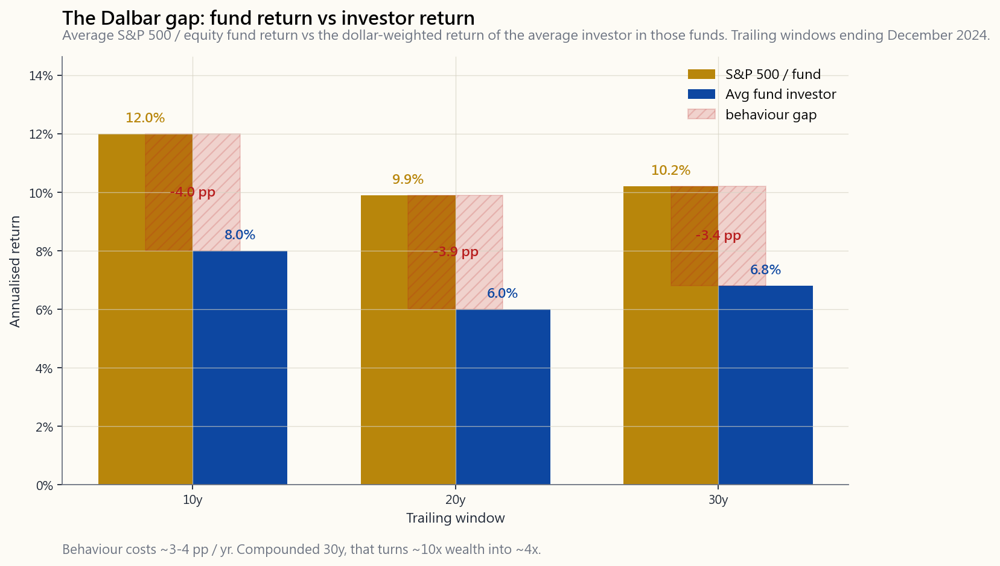
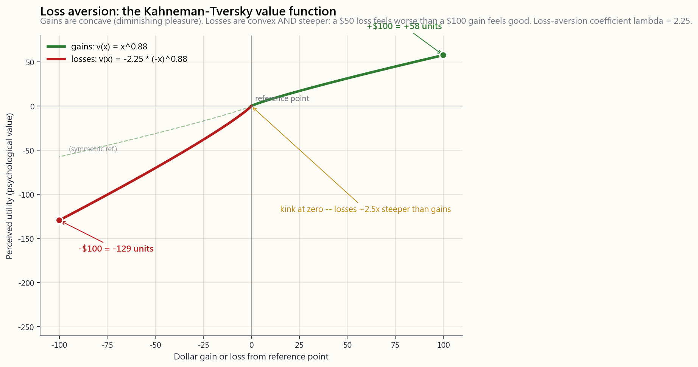

# 第十一周：行为偏差——为何你的大脑无法执行电子表格所推荐的策略

---

## 第一部分：阅读材料

---

### 1. 为何这一课至关重要

本课程中的每一个投资组合都同时包含两层含义：写在电子表格里的*策略*，以及在35%回撤、铺天盖地的新闻标题、以及连襟靠着某只迷因股三倍获利的情况下，仍需坚持持有的*那个真实的人*。投资领域中有据可查的大量跑输表现，并非来自选错了基金，而是来自电子表格所推荐的操作与真实投资者实际行为之间的鸿沟。

你需要了解行为偏差，原因有四。

1. **Dalbar差距是真实存在的，而且是用*你的*真金白银来衡量的。**
   DALBAR投资者行为量化分析（QAIB）研究追踪了三十年间美国股票型共同基金实际资金的流入与流出情况。每年重复出现的核心结论是：*普通股票型基金投资者*的年化收益率，比*基金本身*低约2至4个百分点。基金并没有跑输，跑输的是投资者——他们在市场反弹之后买入，在市场回撤之后卖出。复利作用下，这一差距在三十年间会吞噬*超过一半*的最终财富。策略本身没问题，按键盘的那只手才是问题所在。

2. **市场保持非理性的时间，往往长过散户能维持流动性的时间。**
   凯恩斯的经典警告：即便你*正确*识别出了一个错误定价，价格也可能在*更长*时间内继续朝着对你不利的方向运动，远超你所能承受的资金期限。行为偏差正是*制造*这些漫长非理性阶段的机制——是羊群效应中的损失厌恶和FOMO（错失恐惧），将泡沫推高至超出电子表格所预测终点的又两年。如果你不理解羊群行为，就无法理解为何你在第1天就做对的交易，却在第500天被市场打爆。

3. **厚尾风险惩罚的是杠杆，而杠杆正是过度自信的产物。**
   波动性的尾部在左右整个投资组合。过度自信的投资者使用的杠杆远超其判断所应匹配的水平，因为他们脑海中的正态分布模型将下一个-30%的年份定性为"百年一遇"——事实并非如此。2008年前的高杠杆，是教科书级别的"过度自信遭遇厚尾"组合，而今天的散户正在重蹈覆辙，只不过小数点后面的数字不同罢了。

4. **了解一种偏差，并不能消除它。** 这是本课最重要的一段话。阅读损失厌恶的相关内容，*并不会*让你对损失厌恶免疫。即便是命名了这一概念的卡尼曼，在访谈中也坦言他现在和二十岁时感受到的那种不对称痛苦一样强烈。这种偏差是与生俱来的。唯一持久有效的解决方案是*系统设计*——将定投自动化，将再平衡自动化，*去除主观判断的空间*，并接受这样一个事实：在你最想推翻系统的那些日子里，系统往往是最正确的，而你往往是最错误的。

本课涵盖损失厌恶、近因偏差、锚定效应、羊群效应与FOMO、处置效应、叙事谬误和过度自信——这七种行为加在一起，几乎解释了Dalbar差距的全部成因。随后，本课将展示那些之所以有效，恰恰是因为将决策从你手中移走的系统。

---

### 2. 你需要掌握的知识

#### 2.1 Dalbar差距——行为的代价有多大

DALBAR投资者行为量化分析（QAIB）研究对比了两组收益率序列：普通美国股票型共同基金的*时间加权收益率*（即基金实际创造的收益），以及这些基金的普通投资者的*资金加权收益率*（即投资者根据其申购和赎回时机实际获得的收益）。两者之间的差距，纯粹是行为造成的。

这一差距并非来自随机手续费或基金选择失误。三分之二源于*资金流入时序*：投资者在市场大幅上涨之后投入更多资金，在市场下跌之后撤出资金。其余三分之一则来自基金频繁切换（追逐年度业绩冠军）和恐慌性赎回。复利作用下，以每年3.5%的行为拖累计算，三十年职业生涯中，这一差距会将10倍财富增值压缩至约4倍。**普通散户所犯的代价最高昂的单一财务失误，并非选错了哪只基金——而是在错误的时机买入和卖出。**

#### 2.2 损失厌恶——2.5倍的不对称

这是最基础的偏差，由丹尼尔·卡尼曼和阿莫斯·特沃斯基在其1979年的前景理论论文中命名。损失100美元带来的痛苦，在心理上大约是获得100美元带来的快乐的**2至2.5倍**。他们的价值函数如下图所示：

这对投资组合行为有三个重要影响：

- **持有亏损头寸，卖出盈利头寸。** 平掉亏损头寸，意味着将账面亏损*变为确认亏损*——将纸上的痛苦转化为既成事实——而这种不对称性使这种转化令人难以承受。于是你选择继续持有。平掉盈利头寸则意味着确认盈利，感觉良好，于是你过早卖出。综合效果是：投资组合系统性地超配那些已经证明是错误选择的标的。这就是**处置效应**，是散户券商记录中有据可查的最普遍行为规律。
- **对*策略层面*回撤的厌恶。** 一个在某一年度亏损22%的60/40投资组合（如2022年）所带来的痛苦，感觉上*超过*两个连续年度各亏损11%的两倍（实际累计亏损相近）。亏损在时间上的集中放大了痛感，即便账面损失金额相同。这正是为何一个糟糕的年份所改变的长期资产配置，远比一个缓慢煎熬的十年更为深远。
- **错误的波动性检查习惯。** 损失厌恶使投资者在回撤期间比反弹期间更频繁地查看投资组合。回撤期间查看越频繁，不对称的痛苦累积就越多，在底部割肉离场的可能性就越大。券商App上的红色数字，是一把瞄准你自身财富的行为武器。

#### 2.3 近因偏差——过去一年将永远如此

近因偏差是指将最近经历的情况外推为新的永久状态的倾向。当股票已经连续两年上涨25%，你的大脑会悄悄地将预期收益率的基准重设为"股票能涨25%"。当股票横盘三年后，基准则重设为"股票赚钱的时代已经结束"。而实际的长期收益分布，两者都不符合。

这就是为什么*提高*股票仓位最糟糕的时机，恰恰是经历了一个伟大的股票十年之后——产生这些收益的市场环境已经体现在当前估值中，你未来的预期收益率其实是*更低*的，而非更高。而*削减*股票仓位最糟糕的时机，恰恰是经历了30%的回撤之后——回撤后的预期收益率*更高*，因为价格下跌的速度超过了基本面。近因偏差在这两种情况下都指向了错误的方向。每次如此，无一例外。

1999年散户对互联网股票的追捧，是近因偏差的顶点。2009年散户的大规模撤向现金，是近因偏差的顶点。2021年散户对加密货币和迷因股的追捧，是近因偏差的顶点。这一模式不断重复，因为人类的神经回路不断重复。

#### 2.4 锚定效应——你的持仓成本不应出现在你的屏幕上

锚定效应是指大脑倾向于过度依赖最初遇到的数字作为参照点。在投资中，这个锚点几乎永远是你的*成本价*——即你的买入价格。成本价与*税务*处理相关，与*是否应该继续持有*毫无关系。

一个诚实的判断框架是**继承测试**：假设你今天以*当前市价*继承了这个持仓，没有任何成本价的束缚，你会选择继续持有吗？如果会，那么锚点不过是噪音。如果不会，你持有的唯一原因就是锚点——而锚点只是一个会计记录，不是投资逻辑。

其他渗透到散户投资组合中的锚点：52周高点（"去年还高了30%，一定会涨回来"）；首次公开发行价格（"至少应该值首次公开发行的价格"）；整数关口（100、1000）；朋友的持仓成本。这些数字对于判断*当前*合理价值没有任何信息含量，却都在扭曲你的持有/卖出决策。

#### 2.5 羊群效应与FOMO——选美比赛

凯恩斯的选美比赛类比，是对羊群效应最精辟的描述：投资游戏不是选出最漂亮的面孔，而是选出*普通投票者*会选的面孔——而普通投票者反过来又在选*他们预期普通投票者*会选的面孔，如此循环往复。基础估值的*准确性*，离直接驱动价格的因素已经隔了好几层。

羊群效应有两种表现形式，且相互强化：

- **FOMO（错失恐惧）。** 眼看着邻居、同事和社交媒体账号靠着你没持有的仓位大赚一笔。这种行为压力呈不对称积累：一个你没持有的仓位上涨50%，比你持有的仓位上涨50%更令你痛苦。理性的反应是忽视他人的收益；行为上的反应是去追，而且往往是在接近顶部的时候追进，生怕自己成为唯一被落下的人。
- **恐慌性清仓。** 前者的镜像：当所有人都在卖出时，大规模赎回所形成的社会认同感，会盖过任何"卖盘已经过度"的理性分析。2008年3月低点和2020年3月低点前后，散户赎回量均创历史纪录；而这两个时间点事后都是近乎完美的底部。羊群是错的，羊群的声音是响亮的，跟随羊群的代价是错过整个反弹。

羊群行为之所以制造出那些让正确的交易者血本无归的漫长非理性阶段，正是因为选美比赛机制的存在：即便是*正确的*逆向投资者，也可能早到好几年——而第1天就做对了方向，并不能保证你撑到第500天。

#### 2.6 叙事谬误与过度自信

两种相互叠加的偏差。

**叙事谬误**——大脑偏好清晰的因果故事，而非嘈杂的统计规律。每一次市场1%的涨跌，背后都有一个被自信陈述的理由。*"股市因强劲盈利而上涨。"* *"股市因加息担忧而下跌。"* 这些叙事不过是对噪音的事后拟合。任何一天行情的真实驱动力，很少是单一清晰的原因；通常是数以百万计的独立决策混沌叠加的结果，有些基于数据，有些基于资金流动，有些基于流动性，大多数毫无来由。将当天的叙事视为具有因果信息量，只会建立起一幅关于市场运作方式的错误图景。

**过度自信**——高估自身预测精度的倾向。经典研究发现：当投资者声称对某一预测有90%的把握时，他们正确的概率约为70%。与叙事谬误相叠加，这会建立起一个充满高置信度押注的投资组合，而这些押注大多基于噪音。两种具体的表现形式：

1. **过度交易。** 巴伯和欧丁对散户券商记录的研究发现，换手率最高的五分之一投资者，比换手率最低的五分之一每年少赚约6个百分点。每一笔交易都是一次自信的表达；过度自信表现为过度交易。
2. **分散投资不足。** "我了解我持有的东西"成为只持有10只个股而非500只的借口。这10只个股与指数的预期收益率相当，但承担的非系统性风险却大得多——教科书级别的反向免费午餐投资组合。

#### 2.7 为何了解偏差并不能治愈它——系统设计胜过意志力

这是本课中最经得起时间考验的部分。行为偏差不是靠变得更聪明来解决的，而是靠*在你的判断最不可靠的时刻，将决策权从你手中拿走*来解决的。

具体的系统设计方案：

- **自动化月度定投**，绕过大脑的判断。投资的决定在你设置自动划款时已经做出了一次。在30%回撤后"不投资"的行为决策永远不会发生，因为根本没有决策可做。
- **基于固定日历的规则性再平衡**（每年或每半年一次）。漂移后回归目标权重，无需基于观点择时。再平衡交易从机制上强制买入下跌的资产、卖出上涨的资产——与你凭手感做出的近因偏差操作恰恰相反。
- **提前公开宣告的长期投资期限。** "我三十年内不会查看这个账户"是一种行为约束装置，而非投资论据。策略本身不变；由于减少了激活损失厌恶的监控行为，行为拖累随之下降。
- **仓位规模规则，而非凭借信念定仓。** 机械执行每个标的最高2%的上限规则，切断了"我真的看好这个"演变为30%集中押注并最终爆仓的过度自信通道。
- **书面投资政策声明**，对常见场景下的应对方式进行预先承诺（20%回撤、50%反弹、失业、收到遗产）。预先承诺的应对优于临场发挥的应对，因为临场发挥时启动的是卡尼曼警告过的系统一大脑。

本课底部的交互面板允许你逐一开启或关闭四种经典的行为驱动操作（"下跌20%后卖出"、"上涨20%后买入"、"连续两年亏损后切换至债券"、"追逐上一年的业绩冠军"），观察它们对1928年至2024年回测结果的影响，并与简单的买入持有策略进行比较。在所有参数组合下，结论始终如一：行为驱动的版本均跑输，差距大约等于Dalbar差距甚至更大。**行为，是投资组合中代价最高昂的那一行成本。**

---

### 3. 常见误解

**误解一："我是理性投资者，偏差只会影响散户。"**

这些偏差是与生俱来的，对诺贝尔奖得主、专业交易员和机构配置者的影响，与对散户的影响一样深刻。专业人士的不同之处不在于免疫，而在于*有约束偏差的系统设计*。如果你没有这样的系统，你就在偏差面前毫无防御。

**误解二："损失厌恶只是风险厌恶的另一种说法。"**

并非如此。风险厌恶是在给定预期收益率下对较小波动性的平滑偏好。损失厌恶则是零点处的*折点*——一个不连续性，使损失被赋予约2.5倍于等值收益的权重。这个折点产生了路径依赖行为（处置效应），而纯粹的风险厌恶无法预测这一行为。

**误解三："我越频繁地查看投资组合，就能越早发现问题。"**

恰恰相反。更频繁地查看会*放大*损失厌恶，因为你会经历更多独立的账面亏损事件（每一个红色的交易日），却几乎不会获得更多有价值的信息。对于长期投资组合而言，最优的查看频率大约是*每年一次，用于再平衡*。查看得越频繁，就是在将自己更多地暴露于行为风险之中，而非改善决策质量。

**误解四："我熬过了2008/2020/2022年，所以下次不会恐慌性卖出。"**

成功熬过历史回撤，对于预测未来行为的参考价值很有限。下一次回撤将有不同的成因、不同的叙事、不同的速度，而彼时你处于人生的不同阶段，账户规模也不同。过去的定力令人欣慰，但正确的预设是"我将再次面临同样的诱惑"。

**误解五："Dalbar差距主要来自手续费。"**

并非如此。DALBAR引用的基金层面收益率是*扣除基金费用后*的净收益率。基金收益率与投资者收益率之间的差距，纯粹来自资金流动的时序选择。降低手续费并不能缩小这一差距。

**误解六："我阅读更多新闻，就能做出更明智的决策。"**

几乎适得其反。接触更多新闻，意味着接触更多的叙事谬误、更多的近因偏差（头条新闻按定义就是"刚刚发生的事情"），以及更多的羊群信号。从长期历史样本来看，业绩最好的投资组合，往往由那些不每天追踪市场新闻的人管理。

**误解七："FOMO可以靠意志力控制。"**

FOMO是一个社会比较的循环，而这个循环现在就藏在你口袋里的手机中。意志力只能维持几分钟，这个循环却会持续好几年。结构性的解决方案是屏蔽、取消关注，并设定无需对你的社交网络动态做出反应的投资组合规则。

**误解八："只要我足够分散投资，行为偏差就无关紧要了。"**

一个充分分散的投资组合依然具有完整的股票市场波动性（约16至20%标准差），这意味着30%的回撤大约每十年发生一次。分散投资能够限制非系统性风险，但无法消除在系统性回撤期间卖出的行为诱惑。

---

### 4. 问答

**问1：过度自信真的对男性的影响比女性更大吗？**

答：是的。巴伯和欧丁的"男孩本色"（2001年）研究发现，男性的交易频率比女性高约45%，而这额外的换手率导致每年净收益率约低1.4个百分点。其机制是过度自信：男性更倾向于相信自己具有信息优势，因此更频繁地依此交易。行为成本来自交易行为本身，而非性别。

**问2：今天最值得建立的单一系统是什么？**

答：在税收优惠账户中，向宽基指数型交易所交易基金设置自动月度定投，并在日历上设置每年一次的再平衡提醒。仅这一个系统就能绕过近因偏差（你不会择时申购）、在定投层面绕过损失厌恶（回撤期间无需做任何决策），并大幅降低FOMO的暴露（你已经在场内，所以没什么可错失的）。

**问3：如何制定一份书面投资政策声明？**

答：三个部分，每部分一页。（1）配置方案：目标权重与再平衡规则。（2）触发条件：对特定事件的预先承诺应对方式（回撤X%、仓位偏离Y%、发生Z类生活事件）。（3）禁止行为：你承诺*不做*的事（例如："我不会因为单一新闻事件而调整超过5%的投资组合"）。签名，注明日期。在回撤期间，*于交易之前*重新阅读它。

**问4：处置效应如何与税务产生交互影响？**

答：两者相互叠加，使损害加倍。持有亏损头寸、卖出盈利头寸，恰好与最优税务处理策略*完全相反*。税务亏损收割策略要求实现亏损（用于抵扣资本利得）并递延盈利（让其在免税状态下继续复利增长）。处置效应则驱使你做出相反的操作，同时损失了行为阿尔法和税务阿尔法。

**问5：如果我判断泡沫正在形成，应该做空吗？**

答：不应该。市场保持非理性的时间往往长过你能维持偿付能力的时间。即便你在第一年就正确地识别了泡沫，泡沫仍可能再持续两三年。用保证金融资的空头头寸，会在基本面真正起作用之前早已被强平。正确的行为应对是*回避*泡沫（不再追加新资金），而非押注泡沫破裂。

**问6：我的连襟靠迷因股赚了三倍，我该怎么办？**

答：真诚地恭喜他。不要改变你的策略。一个样本不构成数据；你能够清晰阐述风险的策略具有正期望值，而他所执行的策略（集中持仓单一标的、无信息优势、彩票式收益分布）则不然。幸存者偏差让彩票中奖者格外显眼；那些亏损的人保持沉默。

**问7：定投只是一种行为技巧吗？**

答：在很大程度上是的。从数学角度来看，在约70%的历史入场时机中，一次性投入优于定投，因为市场长期呈上涨趋势。但从行为角度来看，定投降低了入场时机不佳带来的*遗憾感*，从而使投资者更有可能真正将资金投入市场，而不是永远放在现金里等待。一种能让资金真正入市的行为技巧，其价值超过一个在数学上最优却让资金永远闲置为现金的方案。

**问8：厚尾风险意识与过度自信之间有何关联？**

答：关联十分直接。波动性的尾部在左右整个投资组合。过度自信的仓位规模假设实际波动率分布与近期平静样本相似。厚尾意味着*下一次*极端事件将超过你据以定仓的样本所暗示的规模。基于过度自信构建的杠杆，在厚尾事件发生时将遭受毁灭性打击。解决方案是针对你*尚未经历的*尾部来确定规模，而非针对你*已经经历的*中间部分。

**问9：本课与杠铃策略有何联系？**

答：杠铃策略（第14周讲解）在一定程度上是一种*行为*设计：通过在一端持有极度安全的资产（现金、国债），在另一端持有小仓位的投机性头寸（看涨期权、非对称赌注），中间部分——损失厌恶最为喧嚣、Dalbar差距最为集中的区间——被彻底剔除。你无法恐慌性地卖出现金；你也无法恐慌性地卖出一个已经处于最大损失状态的头寸。杠铃策略釜底抽薪，让行为偏差失去了燃料。

**问10：自动化能否真正替代对投资的理解？**

答：它是*意志力*的替代品，而非*理解*的替代品。你仍然需要充分理解策略，才能正确地将其搭建起来，并识别那些极少数系统确实需要调整的真实时刻（机制转换、重大生活事件、税法变化）。自动化意味着"大多数时候相信电子表格"；理解则意味着"知道哪1%的时候电子表格是错的"。

下方的交互面板允许你逐一开启或关闭四种经典的行为驱动操作，观察由此产生的财富路径，并与1928年至2024年标普500指数的简单买入持有策略进行对比。结论每次都一样：每一种偏差规则都输给了"什么都不做"。你的电子表格所推荐的策略，几乎能击败任何一个凌驾其上的版本的你。

---

## 第二部分：YouTube脚本

---

**视频标题：** 行为偏差——为何你的大脑无法执行电子表格所推荐的策略 | 第11周

**目标时长：** 约18分钟

**主持人：** 陳馬、小魚

---

**[开场]**

**陳馬：** 这是本课程中最令人不舒服的一课。前十周我们教了你投资组合、资产配置、风险指标、分散投资的数学逻辑。今天我们要告诉你，如果你不在大脑之外建立相应的系统，这一切在遭遇你自己的大脑时都会土崩瓦解。

**小魚：** 听起来有点危言耸听。

**陳馬：** 这是有数据支撑的。DALBAR研究追踪了三十年间共同基金实际资金的流动情况。股票型基金的普通投资者，每年的收益比基金本身低三到四个百分点。每年如此。基金没问题，问题出在投资者身上。

**小魚：** 而且复利会把差距越拉越大。

**陳馬：** 三十年下来，这个差距会把10倍财富增值压缩到大约4倍。普通散户所犯的代价最高昂的单一财务失误，并非选错了哪只基金。而是在错误的时机买入和卖出。

---

**[第一节：Dalbar差距]**

[VISUAL: image/week11_dalbar_gap.png]

**陳馬：** 就是这张图。三个时间窗口，截至2024年12月。10年、20年、30年。在每一个窗口里，基金的表现都超过了基金投资者实际获得的收益。每年三到四个百分点，每个窗口，每个时期，都是如此。

**小魚：** 这个差距是从哪里来的？

**陳馬：** 三分之二来自资金流入的时序选择。人们在市场大涨之后投入更多资金，在市场下跌之后把钱撤出来。另外三分之一来自基金切换——追逐上一年的业绩冠军——以及回撤期间的恐慌性赎回。全部都是行为造成的，没有一分钱是基金质量的问题。

---

**[第二节：损失厌恶]**

[VISUAL: image/week11_loss_aversion.png]

**陳馬：** 这是一切的基础。卡尼曼和特沃斯基，1979年。横轴是金额，纵轴是心理价值——感觉有多好或有多坏。

**小魚：** 收益侧是上凸的曲线。

**陳馬：** 对。收益的边际快感递减。第二个一百块带来的快乐，不如第一个。

**小魚：** 那损失侧呢？

**陳馬：** 下凸，而且更陡峭。大约陡2.5倍。损失50块带来的痛苦，超过赚100块带来的快乐。这个2.5比1的不对称，是处置效应的驱动引擎——就是那个有详细记录的散户规律：持有亏损头寸，卖出盈利头寸——也是在市场底部割肉离场的根源。

**小魚：** 为什么会这样？

**陳馬：** 因为平掉亏损头寸，意味着将账面亏损*变为确认亏损*，而这种不对称性使这种转化令人难以承受。于是你不平仓，你继续持有，寄望于解套。直到亏损大到无法承受，你才割肉——往往就在底部。

---

**[第三节：近因偏差与锚定效应]**

**陳馬：** 再来两种偏差，它们携手驱动了大多数散户的失误。

近因偏差。你的大脑把最近两三年的经历当作新的永久状态。经历了一个股票的黄金十年之后，你会加仓。经历了30%的回撤之后，你会减仓。两者都是错的。一个伟大十年之后的预期收益率其实*更低*——估值已经贵了。30%回撤之后的预期收益率其实*更高*——价格下跌的速度超过了基本面。

**小魚：** 那锚定效应呢？

**陳馬：** 就是你的持仓成本。你的买入价格。对税务处理有意义，对持有还是卖出的决策毫无意义。一个诚实的判断框架是继承测试。假设你今天以当前市价继承了这个持仓，没有任何成本价的负担，你会选择继续持有吗？如果会，锚点只是噪音。如果不会，你持有的唯一原因就是一个会计记录。

---

**[第四节：羊群效应、FOMO与选美比赛]**

**陳馬：** 凯恩斯说得最精辟。投资游戏不是选出最漂亮的面孔，而是选出普通投票者会选的面孔——而普通投票者反过来又在选他们预期普通投票者会选的面孔。基础估值、内在价值、基本面，离直接驱动价格的力量已经隔了好几层。

**小魚：** 这就是泡沫能持续那么久的原因。

**陳馬：** 正是如此。市场保持非理性的时间，往往长过散户能维持偿付能力的时间。即便你在第一年就正确识别了泡沫，泡沫还能再持续两三年。任何用保证金做空的人，在基本面真正起作用之前早就已经被清仓了。

**小魚：** FOMO呢？

**陳馬：** 错失恐惧，是羊群效应在当代的面孔。一个你没持有的仓位上涨50%，比你持有的仓位上涨50%更令你痛苦。不对称。不断积压压力，迫使你追涨。而追进的时机，几乎总是接近顶部。

---

**[第五节：过度自信与厚尾风险]**

**陳馬：** 过度自信，是让所有其他偏差变得昂贵的那个偏差。当你说你有90%的把握时，你正确的概率大约只有70%。叠加上叙事谬误——你的大脑对清晰因果故事的偏好——过度自信会建立起一个充满高置信度押注的投资组合，而这些押注大多基于噪音。

**小魚：** 那跟杠杆有什么关系？

**陳馬：** 这和波动性尾部的问题直接相关。波动性的尾部在左右整个投资组合。过度自信的投资者使用的杠杆远超其判断所应匹配的水平，因为他们脑海中的正态分布模型把下一个30%的回撤定性为"百年一遇"。事实并非如此。"十年一遇"才是更合理的预设，而十年一遇的冲击，就足以摧毁为十年一遇规模配置的杠杆。

---

**[第六节：交互面板]**

**陳馬：** 页面底部的交互面板允许你逐一开启或关闭四种经典的行为规则。*下跌20%后卖出。* *上涨20%后买入。* *连续两年亏损后切换至债券。* *追逐上一年的业绩冠军。* 每种开关都会运行一个从1928年到2024年的回测，并与简单的买入持有标普500策略进行对比。

**小魚：** 结论是什么？

**陳馬：** 每一种组合都跑输买入持有。无一例外。你的电子表格所推荐的策略，几乎能击败任何一个凌驾其上的版本的你。

---

**[第七节：你实际应该怎么做]**

**陳馬：** 五个具体的系统设计方案。

第一，自动化月度定投。决定在你设置自动划款时已经做出了一次。此后，在回撤期间不投资的决策永远不会出现，因为根本没有决策可做。

第二，基于日历的再平衡。每年或每半年一次。漂移后回归目标权重，无需基于观点择时。再平衡交易从机制上强制你买入下跌的资产、卖出上涨的资产——与你凭感觉做出的近因偏差操作恰恰相反。

第三，书面投资政策声明。一页纸，三个部分。配置规则、触发条件的应对方式、禁止行为。签名，在回撤期间*于交易之前*重新阅读它。

第四，仓位规模上限。每个单一标的最多2%。切断"我真的看好这个"演变为30%集中押注并最终爆仓的过度自信通道。

第五，屏蔽噪音。退订每天多次更新的市场新闻。每年查看一次投资组合用于再平衡，而非每天查看。券商App上的红色数字，是一把瞄准你自身财富的行为武器。

---

**[结尾]**

**陳馬：** 阅读损失厌恶的相关内容，并不会让你对损失厌恶免疫。就连命名了这一概念的卡尼曼，在访谈中也坦言他现在和二十岁时感受到的那种不对称一样强烈。这种偏差是与生俱来的。解决方案是系统设计，不是意志力。

**小魚：** 策略胜过随机应变。

**陳馬：** 策略胜过*你自己*。这就是这堂课的核心。在你的判断最不可靠的时刻，建立将决策权从你手中拿走的系统。系统是有效的。而你，在糟糕的日子里，并不有效。

---

**片尾字幕：** "下一期：第12周——通胀与实际收益"