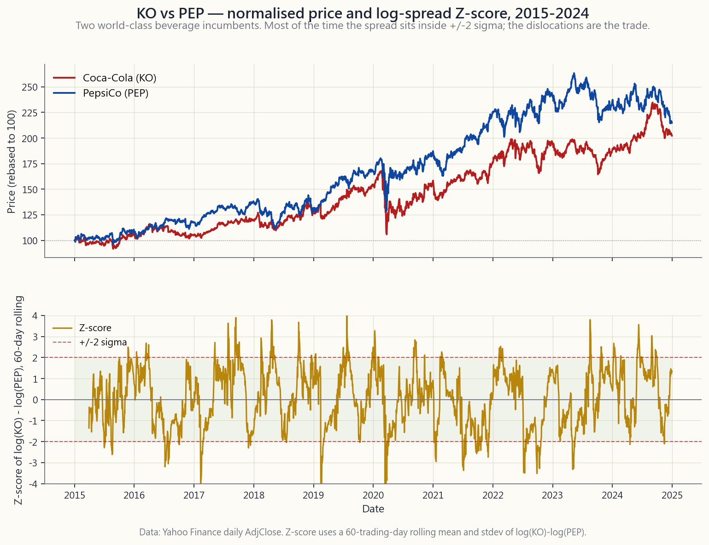
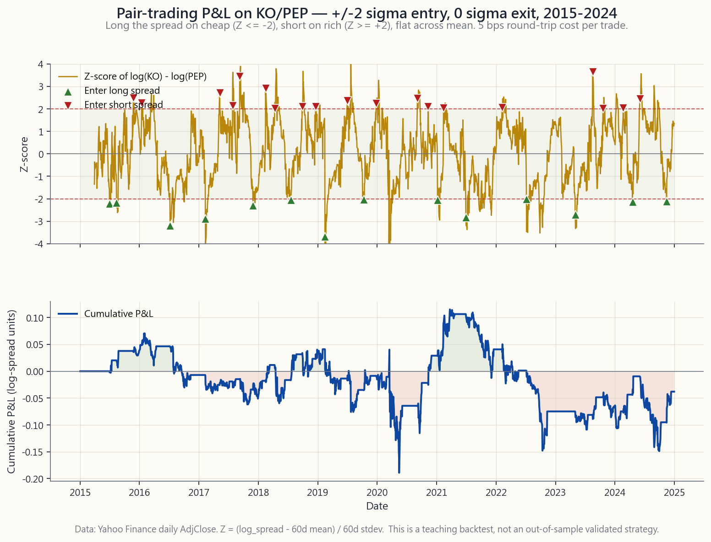

# 第14周：配对交易——相对价值、均值回归与最简单的股票对冲基金策略

---

## 第一部分：阅读材料

---

### 1. 为什么这很重要

第13周介绍了多空策略的框架结构。本周将把这一框架应用于其最精简、最易教授的形式：**两只股票，一多一空，等额美元，以二者之间的价差为调仓依据。** 这就是配对交易——本书中最简单的股票对冲基金策略，也是散户投资者在向更复杂的策略迈进之前，学习相对价值操作机制最清晰的切入点。

你需要学习这节课，原因有四。

1. **这是对你刚刚学会的多空工具箱最清晰的检验。** 以等额美元做多可口可乐、做空百事可乐，在结构上实现了美元中性，由于两只股票对消费必需品因子的敏感度几乎相同，因此也大致实现了贝塔中性，全部盈亏即为*价差阿尔法*——两只近似替代品之间的差值。这里没有任何方向性观点可以藏身。如果交易奏效，你交易的是价差；如果不奏效，你的交易也没有其他可以归因之处。配对交易是检验你是否真正具备相对价值优势的实验室。

2. **这是进入一个真实、持久阿尔法来源的切入点——不是凭空捏造的那种。** 在扣除成本后真正能够持续复利的结构性阿尔法，来自流动性、板块轮动、长期趋势，以及买入被被动化机器所抛弃的资产。配对交易属于结构性阿尔法类别，因为配对交易者正在*向暂时错位的一条腿提供流动性*。当百事可乐因一个疲软的季报大幅跳水而可口可乐纹丝不动时，买入错位的配对交易者正站在强制卖家的对立面——这些卖家包括共同基金赎回者、因子策略解仓者、指数再平衡方。价差回归其长期关系，就是为提供该流动性所获得的结构性报酬。

3. **这能让你理解为什么"看似靠谱"的配对会衰减——即制度转变问题。** 制度转变是本课程反复敲响的警钟：制度往往在毫无预警的情况下发生变化，一个奏效了十年的策略可能在一个季度内彻底失灵。配对交易是这一原则在散户可及的形式中最清晰的案例研究。两只共同运动了十五年的股票可能发生永久性脱钩——可口可乐与百事可乐就部分经历了这一过程，原因在于百事的零食业务的复利速度快于可口可乐纯饮料业务。一个无视这一基本面分歧、持续将扩大的价差向10年均值方向做反向交易的配对策略，可能连续六年都是错的。**协整是一种有条件的、随制度变化的属性，而非一成不变的永久属性。**

4. **这为2007年量化地震——因子拥挤风险的经典案例研究——提供了框架。** 当太多量化机构运行本质上相同的配对交易和统计套利策略时，这些配对本身就变成了一个因子——一个可能在恐慌性解仓中集体反转的因子。在2007年8月的短短四个交易日内，一到两家大型多策略基金的强制解仓，引发了标准配对交易因子的同步反转，而运行相同模型的大多数机构，在本应相互独立的交易上损失了两到四个标准差。这堂课——你的阿尔法只有在运行相同策略的人不被同时迫使离场时才是真正的阿尔法——是现代金融中最重要的风险管理课题之一，而配对交易正是它被首次学到的地方。

这节课在四档结构的*机会性*档位中占有一席之地，位于哑铃结构的阿尔法一端。你的大部分财富在安全端（现金、国债、黄金、深度实值的长期到期日看涨期权，标的为你无论如何都愿意持有的资产）。哑铃的阿尔法端有一个小仓位，配对交易账本就住在那里——用陈马的话说，是那根在投资组合其余部分静止不动时独自旋转的*风车*。

---

### 2. 你需要掌握的内容

#### 2.1 相对价值——核心思维重构

做多型投资问的是绝对问题："可口可乐便宜吗？"回答这个问题需要对可口可乐的盈利、估值倍数、增长、资产负债表以及更广泛的股票风险溢价持有明确观点。只要其中任何一项判断出错，即使可口可乐在你的模型中"便宜"，交易依然可能亏损。

配对交易用一个相对问题取代了这个绝对问题：**"可口可乐*相对于*百事可乐便宜吗？"** 这两家饮料巨头共享相同的客户群、相同的监管制度、相同的糖和铝等大宗商品价格周期敞口、相同的消费必需品因子敞口、相同的美元强势敞口，以及大致相同的估值倍数体制。消费必需品宏观层面的利空两者都中；含糖税风险两者都中；强势美元季度两者都中。然而，它无法*对称地*冲击公司层面的运营差异——可口可乐的装瓶商重组、百事可乐的零食业务利润率、一场仅影响其中一方的特定外汇冲击，或者落在某一品牌上的产品召回。价差将那个公司层面的特定差异从其他一切因素中剥离出来。

你消除的方向性风险是巨大的。持有2,000股可口可乐的60/40投资者，大约有五十万美元暴露于"消费必需品因子明天因避险情绪下跌10%"的风险之中。做多1,000股可口可乐、做空1,000股百事可乐的美元中性配对交易者，暴露于该因子的净美元约为*零*。配对交易者持有的是净值为零但账面总额为两百美元的仓位，暴露于**两个看似相似的故事之间的差异**。这个差异就是他们获得报酬的来源——或者在差异被证明是永久性而非均值回归性时，是他们被惩罚的根源。

这正是配对交易作为清晰教学案例的价值所在：它完全剥离了市场贝塔，让你清楚地看到，相对价值赌注是否真的存在任何信号。

#### 2.2 价差构建与Z值

选定配对之后，你需要一种方式来衡量*错位程度*。标准方法是**对数价差的滚动Z值**。

构建分三步。

1. **构建对数价差**：`s_t = log(P^A_t) - log(P^B_t)`。在对数空间中操作是行业惯例，因为它使价差不受美元归一化的影响，并赋予其乘法意义：恒定的`s_t`意味着价格的恒定*比率*，与价格水平无关。
2. **计算滚动均值和标准差**，回溯窗口通常选用60个交易日作为日频数据的起点。分别记为`mu_t`和`sigma_t`。
3. **对价差计算Z值**：`z_t = (s_t - mu_t) / sigma_t`。从构建方式来看，在一个稳定的协整关系中，`z_t`近似服从零均值、单位方差的分布，绝大多数观测值落在-2到+2之间。

下图展示了2015年至2024年可口可乐与百事可乐的实际情况——上图为归一化价格，下图为滚动60日Z值及+/-2西格玛区间。

配对交易者看着下图问道：*当线触及+2时，我是否相信它会回归零，需要多长时间？* 答案来自协整，而非相关性。

#### 2.3 相关性与协整——为何这一区别至关重要

两个随机游走可以高度相关，但仍可发散至无穷。这是吞噬天真配对交易的陷阱。

- **相关性**衡量两个收益序列是否*在短期内*同向运动。两只股票的月度相关性为0.85，仅意味着它们的月度收益趋于一致；这对*价差水平*是否均值回归毫无说明。
- **协整**更强。如果两个价格序列存在某个线性组合使其*平稳*——即价差本身具有稳定的均值和方差，偏离后会回归——则称这两个序列协整。协整是"它们共享一种长期均衡关系"的数学表述。

实践中，协整通过Engle-Granger两步法或对水平序列的Johansen检验来测试；细节是次要的。*直觉*是你必须内化的部分：**只有当价差是均值回归的时候，才能交易配对，而相关性单独并不能保证这一点。** 教科书级别的反例是处于不同长期趋势中的两项资产——两者可能共同上涨多年（高相关性），而*两者之间的差距*单调扩大（无协整）。一个做空这个扩大差距的配对交易者，可能连续十年每季度亏损。

实用法则：在交易一对配对之前，绘制5至10年窗口的价差Z值，问自己："这个序列在每次偏离后，是否有明显的回归？"如果是，协整检验基本上只是在确认你的眼睛已经看到的东西。如果不是，再多的统计工具也救不了这笔交易。

#### 2.4 经典配对及其奏效原因

四组在美国上市市场中散户可及的经典配对，以及各自协整的结构性原因：

| 配对 | 板块 | 价差均值回归的原因 |
|---|---|---|
| **可口可乐 / 百事可乐** | 消费必需品——饮料 | 两家几乎相同的全球饮料巨头；相同的客户群，相同的大宗商品成本结构，相同的防御性估值体制。价差仅在一方发生战略业务结构调整时才会断裂（百事的零食业务拓展是经典案例）。 |
| **V / MA** | 金融——支付双寡头 | Visa与万事达卡构成监管双寡头，经济特征几乎相同：卡interchange费率、网络效应、寡头定价权。价差仅在公司层面诉讼或地理业务结构（中国、俄罗斯）方面出现差异时才会断裂。 |
| **埃克森美孚 / 雪佛龙** | 能源——一体化超级大型油气公司 | 两家均运营上下游一体化账本，储量相似，地理布局相似，资本配置纪律相似。价差仅在特有运营事件上断裂——炼油厂事故、项目成本超支。 |
| **GLD / SLV** | 贵金属交易所交易基金 | 黄金与白银共享货币贬值叙事，但白银一半属工业属性，一半属货币属性；价差（即"金银比"）在50至90之间震荡，由这两种需求驱动因素的相对权重所驱动的周期性均值回归。 |

*共同*特征是：两条腿共享一个结构性驱动因素，在一个*有限的*特有维度上存在差异。交易的报酬来自有限维度（价差均值回归），对结构性维度的保护来自其相互对冲（互相抵消）。

#### 2.5 进出场规则与实测回测

教科书规则为：**+/-2西格玛入场，0西格玛离场，在+/-3至+/-4设置硬止损**。

- 当`z`降至-2以下：价差处于两个标准差的低估状态，A相对于B异常便宜。以等额美元做多A、做空B。
- 当`z`升至+2以上：价差处于两个标准差的高估状态。做空A、做多B，等额美元。
- 当`z`穿越零：价差回归滚动均值。离场。不要等待对侧尾部；再运行一个西格玛的边际预期收益很小，而制度转变风险随持仓时间增加而上升。
- 如果`z`继续向错误方向延伸至+/-3或+/-4：**平仓并重新评估协整假设**——通常情况下，这段关系已发生结构性断裂，而非随机性错位。

下图展示了该规则集在2015年至2024年可口可乐/百事可乐上的应用。上图是Z值，向上箭头标记做多价差的入场点，向下箭头标记做空价差的入场点；下图是扣除每次换仓5个基点来回成本后的累计对数价差盈亏。

此图传达的教训：**大多数配对交易是小赢，偶发的制度断裂损失往往超过数次小赢的总和。** 这正是结构性阿尔法收益流的典型形态。这也是配对交易要以*多对配对的账本*来运作而非只做一对的原因——大数定律是使每对微薄优势的模型得以成立的基础。单对散户实施更多是教育意义而非阿尔法；生产版本会同时分散至三十到五十对配对。

#### 2.6 2007年量化地震——拥挤风险是真实存在的

2007年8月第一周，标准的股票统计套利账本——大致定义为"在许多配对中同时做多低估腿、做空高估腿"——连续四个交易日损失了预期日收益的4至12个标准差。这场解仓浪潮席卷了大多数运行类似模型的主要多策略对冲基金：AQR、文艺复兴股票市场中性基金、高盛全球股票机会基金。部分基金在一周内缩水一半。

事后分析现已有充分记录。一家最大的多策略基金——大多数公开重建分析将矛头指向高盛的量化账本，但具体行为者不如机制本身重要——被迫突然去杠杆，起因很可能是一笔与此无关的次级抵押贷款账本触发的追加保证金。平仓股票账本要求同时大规模卖出统计套利多头腿（买回空头腿）。由于所有其他主要量化机构都*从相同的因子数据中运行相同的配对*，这些相同的配对同时对所有人的账本产生不利影响。随着损失加剧，更多基金被迫去杠杆，配对进一步移动，迫使更多基金去杠杆。**标准配对交易因子敞口已成为一笔拥挤交易——而拥挤交易一旦解仓，便会集体发生。**

这堂课是基础性的，是金融领域制度转变原则最清晰的案例说明。**一个阿尔法来源之所以是阿尔法，前提是运行该策略的群体规模足够小，以至于没有任何强制离场能够同时将所有交易推向对你不利的方向。** 当太多人运行相同策略的那天，该策略本身就变成了风险因子。这就是为何现代统计套利会持续运行一个"拥挤度因子"叠加层——衡量有多少其他基金可能持有相同交易——并随着拥挤度上升而下调总敞口。散户配对交易者以微缩版的形式继承了同样的纪律：不要对一个广为人知的经典配对过度下注，因为该交易中的每一美元在隐性上都与你的仓位相关联。

#### 2.7 配对交易在哑铃结构中的位置

哑铃的大部分财富在安全端，一小部分仓位在真正具有不对称优势的一端。**配对交易位于优势端。** 规模适当时，配对交易仓位占总投资组合的个位数百分比，在美元中性的配对中运行，总敞口是仓位规模的两到三倍，净值约为零。该仓位对总投资组合收益的预期贡献很小（*仓位本身*年化3%-8%，对一个10%仓位配置而言折算为总投资组合的0.3%-0.8%）；对总投资组合*夏普比率*的预期贡献则可能大得多，因为该仓位的收益与多头账本大致正交。

这才是散户投资者看待配对交易的正确方式：**不是作为复利财富的手段，而是作为降低财富路径波动性的工具。** 这是一个夏普比率策略，而非收益策略。任何向你承诺配对交易能实现两位数总收益且低回撤的人，不是过度拟合，就是加了杠杆，要么就是在卖课。

---

### 3. 常见误解

**误解一："高相关性意味着好的配对。"**

相关性衡量的是收益的共同运动；协整衡量的是水平值的均值回归。高相关性但无协整，就是经典的越走越宽、越走越远的陷阱。

**误解二："一对配对奏效了十年，就会继续奏效。"**

可口可乐与百事可乐的关系在过去二十年里因百事的零食业务建设而两度发生位移。协整取决于基础业务结构保持稳定。当业务结构改变时，价差会重新定价至*新的*均衡，而做反向交易于旧均衡的交易者将连续亏损数年。制度已经转变。

**误解三："Z值+/-2是一个硬性规则。"**

这些阈值是校准选择，不是定律。在低波动性制度下，+/-1.5西格玛触发更多交易，可能是更合适的切入点；在高波动性制度下，+/-2.5能减少误报。应根据配对、回溯窗口和已实现波动率制度进行校准——而不是套用教科书上的数字。

**误解四："我就交易一对来学习。"**

单对账本不是配对交易；那是一笔运营开销极高的单一交易。真正的配对交易策略同时运行三十对以上，以使大数定律发挥作用。单对练习是教育；不要将其与阿尔法混为一谈。

**误解五："配对交易因为是市场中性的所以没有风险。"**

配对交易有价差风险、制度断裂风险、拥挤风险（2007年）、空头腿的借券成本风险，以及保证金和股息方面的操作风险。净美元为零不等于净风险为零——长期资本管理公司是市场中性的，最终仍亏损了90%。

**误解六："如果价差持续扩大，我的仓位变大，最终回归时利润更大。"**

这是鞅谬误在配对上的体现。随着价差扩大，你的按市值计算的亏损增加，券商提高你的保证金要求，而本应在理论上使交易更有利可图的机制，实际上在回归到来之前就把你逼出了场。首先保持偿付能力——市场保持非理性的时间可能长于你维持头寸的能力——这种纪律是此处的锚点。

**误解七："借券成本小到可以忽略。"**

对于超大市值配对（可口可乐、百事可乐、Visa、万事达卡），通常确实如此——个位数基点。对于较小市值或细分领域的配对则不然，借券费率可能因一则新闻稿从1%飙升至30%。在为交易定规模之前，务必核查空头腿的借券情况。

**误解八："2007年量化地震是遥远的历史。"**

同样的机制会周期性重演。2018年2月发生了波动率目标因子解仓。2020年3月出现了多策略去杠杆周。每隔几年，因子拥挤就会引发另一次四天期的相关性解仓。量化地震是最清晰的案例研究，而非唯一的一次。

**误解九："如果我用期权来表达这对配对，就能规避借券问题。"**

你同时也规避了线性价差盈亏。基于期权的配对对波动性有非线性敞口，且固定成本的期权费会蚕食价差阿尔法。这不是免费升级——这是一笔具有不同希腊值的不同交易。

**误解十："配对交易就是阿尔法，就这么简单。"**

配对交易是*在价差协整且策略不拥挤的前提下*的阿尔法。两个条件都可能失效。这是以制度和拥挤度为条件的结构性阿尔法——不是永久的免费午餐。

**误解十一："策略奏效是因为我选对了配对。"**

策略奏效是因为*许多*配对同时发生小幅回归，微薄的单对优势在账本层面聚合成可用的收益流。单对收益大多是噪音；账本层面的收益才是阿尔法可辨识的地方。

---

### 4. 问答

**问题一：一个拥有10万美元投资组合的散户投资者，是否应该真的运营一个配对交易账本？**

回答：作为严肃的盈亏来源，可能不应该。一个配对交易账本要在统计意义上有效，最低门槛是同时运行二十到三十对配对，并对借券、保证金和股息保持运营纪律。低于这个规模，你拥有的只是一个高开销的玩具。*以小规模运行一到两对配对来接受教育*——占你投资组合的几个百分比——并将产出视为学费。如果你想要阿尔法而不想承担运营开销，购买一只市场中性共同基金或交易所交易基金，让别人来运营账本。

**问题二：Z值应该使用什么回溯窗口？**

回答：对日频数据来说，60个交易日是合理的起点；40天更灵敏但噪音更大；120天更稳定但对制度断裂的反应更慢。正确答案取决于*你的特定配对*的协整重置速度。对于超大市值配对（可口可乐/百事可乐），60至90天。对于波动性更大的配对（小盘股、生物科技），30至60天。应加以校准，而非默认采用。

**问题三：单对配对我可以建多大的仓位？**

回答：机构常见规则是每对配对占仓位的2%-5%，硬性上限为10%。对于一个10万美元投资组合中1万美元配对交易仓位的散户投资者，每对的总敞口约为200至500美元（即小端200美元多头 + 200美元空头 = 400美元总敞口）。感觉很小。确实很小。配对交易在设计上就是单对极小、多对聚合的策略。

**问题四：什么时候应该止损并承认协整已断裂？**

回答：当`z`延伸超过+/-3至+/-4且毫无回归迹象，*同时*你能识别出断裂的基本面原因时——其中一家公司发生了战略业务结构变化、一项仅影响其中一方的监管事件、一桩收购。*在没有基本面故事支撑的情况下*价差走到-3.5，比*有明确故事支撑的情况下*价差走到-2.5更可能发生回归。交易要跟随基本面，而不仅仅是Z值。

**问题五：配对交易与税务如何互动？**

回答：在美国的应税账户中，配对不友好。配对交易的平均持仓时间较短（数周至数月），因此已实现收益属于短期——按普通所得税率征税，而非长期资本利得税率。配对交易账本上的税务拖累是最大的隐性成本之一。这也是机构配对交易者在免税账户（养老金、保险独立账户）中运作的原因之一，在那里，结构性税务劣势不复存在。

**问题六：空头腿的股息如何处理？**

回答：你需要支付。如果你在除息日持有百事可乐的空头头寸，股息将在派息日从你的账户中扣除并转入借券方。没有任何抵消。对于股息丰厚的配对（公用事业股、房地产投资信托），这是一项重大拖累，必须纳入每笔交易的成本计算。

**问题七：配对交易与统计套利有什么区别？**

回答：统计套利是放大版的配对交易：相同的Z值逻辑，但同时应用于数百至数千对配对，配以多因子分解（板块中性化、因子中性化），配以优化执行（VWAP/TWAP、暗池），持仓时间更短（日内至数天）。配对交易是教学单元；统计套利是生产实施版本。

**问题八：为什么2007年量化地震专门冲击了配对交易者？**

回答：因为标准协整筛选识别出的"配对"宇宙，在不同基金之间几乎是相同的——相同的板块配对、相同的因子中性化、相同的优化。当一家大型机构必须清仓时，他们解仓的*正是所有其他人持有的相同交易*。交易数量上的分散并无助益，因为这些交易本身存在因子相关性。

**问题九：我可以用期权代替股票来做空头腿吗？**

回答：可以，而且对散户来说往往更简洁——买入高估腿的看跌期权，而非做空该股票。这样可以避免借券、定位和股息义务。你会承担时间价值衰减和依赖于波动性的期权费，线性价差盈亏也会被扭曲为更类似期权的形态。对于运营简便性优先于一切的小型散户仓位，基于期权的配对是合理选择。哑铃逻辑自然地指向这里。

**问题十：配对交易与四档结构如何契合？**

回答：配对交易属于*机会性*——它位于第三档，与特定的结构性阿尔法交易并列。它不属于基石档（波动性太高、运营要求太高），不属于核心档（它不以长期风险溢价为目标），也不属于不对称投机档（没有凸性回报）。它赢得一席之地，在于其收益与投资组合其余部分大致正交。

**问题十一：典型的配对交易仓位盈亏是什么样子的？**

回答：许多小赢（总金额各50至150个基点），偶发的制度断裂损失200至500个基点，以及横截面波动性被压缩期间的平盘阶段。仓位的年化收益通常在4%-8%（总值），已实现波动性为5%-10%。对散户来说，扣除费用和税收后，会大幅缩水。图形形态是"许多小步向上，偶尔陡然下跌"，夏普比率才是衡量的关键指标——而非绝对收益。

**问题十二：如果我真的想构建这个策略，接下来应该读什么？**

回答：三件事。（a）Gatev-Goetzmann-Rouwenhorst（2006年）关于配对交易的原始论文——学术基准。（b）Khandani-Lo（2007年），关于2007年8月量化地震的事后分析。（c）Lopez de Prado所著《金融机器学习进阶》中关于协整和三重障碍标注的章节。按此顺序阅读——学术基础、战争故事，然后是现代工具箱。

---

## 第二部分：YouTube脚本

---

**视频标题：** 配对交易——本书中最简单的股票对冲基金策略 | 第14周

**目标时长：** 约18分钟

**主持人：** 陈马、小鱼

---

**[开场]**

**陈马：** 上周我们聊了多空策略，那是框架结构。这周我们要把这个框架应用到它最精简、最容易讲清楚的形式。两只股票，一多一空，等额美元，就这么简单。这就是配对交易。

**小鱼：** 为什么选配对交易？

**陈马：** 因为它是散户可及的金融领域中，学习相对价值真正含义最清晰的地方。看完这个视频，你会明白什么是Z值，为什么相关性和协整不是一回事，为什么大多数配对交易大多数时候都奏效，但每二十笔里偶尔会有一笔爆仓，还有2007年8月，当太多人同时运行相同的配对交易模型时，究竟发生了什么。

**小鱼：** 开始吧。

---

**[第一段：思维重构]**

**陈马：** 做多型投资问的是"可口可乐便宜吗"。这是个绝对问题。回答这个问题，你需要对可口可乐的盈利、估值倍数、折现率、股票风险溢价持有明确观点。变量很多。就算你每一项都判断正确，如果消费必需品板块下个月跌15%，你依然可能亏钱。

配对交易问的是一个不同的问题："可口可乐*相对于*百事可乐便宜吗？"这是个相对问题。两家公司共享相同的客户群、相同的监管制度、相同的糖和铝价格周期敞口、相同的消费必需品因子敞口、相同的美元强势季度敞口、大致相同的估值体制。当你以等额美元做多一个、做空另一个时，所有这些驱动因素都相互抵消了。剩下的是公司层面的特有运营差异。

**小鱼：** 而这才是你交易的对象。

**陈马：** 这才是你交易的对象。你在押注两个几乎相同的故事之间的*差异*是均值回归的。有时候确实如此，有时候这个差异会被证明是永久性的制度转变，而这就是整个游戏的核心。

---

**[第二段：构建价差]**

[VISUAL: image/week14_kopep_spread.png]

**陈马：** 这就是价差。上图是可口可乐与百事可乐，日频数据，2015年至2024年，两者均以2015年初为基期重设为100。

**小鱼：** 它们的走势并不完全相同。

**陈马：** 确实不同。百事可乐因其零食业务在很长时间段内跑赢了可口可乐。但注意它们在宏观冲击上如何*共同运动*——2020年3月，2022年通胀抛售。差异远小于共同运动的幅度。这就是结构性协整在视觉上的体现。

**小鱼：** 那下图呢？

**陈马：** 下图是对数价差的滚动60日Z值。我们计算log(可口可乐)减log(百事可乐)，计算60日滚动均值和滚动标准差，减去均值，除以标准差。得到的是一个归一化序列，在稳定协整的情况下，大部分时间处于+/-2以内，当价差错位时才触及尾部。

**小鱼：** 所以当线触及+2，可口可乐相对于百事可乐高出了两个标准差。

**陈马：** 当线触及-2，可口可乐相对于百事可乐低了两个标准差。配对交易者看着这张图问的问题是：*我是否相信它会回归？需要多长时间？*

---

**[第三段：相关性与协整]**

**陈马：** 关键区别。大多数散户把这两个概念混为一谈。

相关性衡量两个收益序列在短期内是否同向运动。两只股票月度相关性0.85，仅意味着它们的月度收益趋于一致。

协整更强。两个价格*水平*协整，是指它们之间的价差是平稳的——有稳定的均值、稳定的方差，偏离后会回归。

**小鱼：** 两者可以互相独立存在？

**陈马：** 可以。这就是陷阱所在。想象两只股票都处于强势上涨趋势中。两者都在十年内每年上涨30%。它们的月度收益高度相关。但*两者之间的差距*可能在单调扩大，因为其中一个复利速度更快。高相关性，无协整。在这个扩大差距上做反向交易的配对交易者，可能连续十年每季度都亏损。

**小鱼：** 实际的检验方法是什么？

**陈马：** 看5至10年窗口的价差Z值走势图。问自己："这个序列在每次偏离之后，是否反复回归了？"如果是，数学检验基本上只是在确认你的眼睛已经看到的东西。如果不是，再多的统计工具也帮不了你。协整通常在你正式检验之前就能用眼睛看出来。

---

**[第四段：四组经典配对]**

**陈马：** 每个量化交易者都跑过的四组经典配对。

可口可乐与百事可乐。饮料。相同的客户，相同的大宗商品成本，相同的防御性估值体制。价差仅在一家公司改变业务结构时才会断裂——百事的零食业务拓展是教科书级别的案例。

Visa与万事达卡。监管双寡头，经济特征几乎相同。价差仅在公司层面诉讼或地理业务结构方面出现差异时才断裂。

埃克森美孚与雪佛龙。两家均为上下游一体化超级大型油气公司，储量相似，地理布局相似。价差仅在特有运营事件上断裂——炼油厂事故、成本超支。

GLD与SLV。黄金与白银。共享货币贬值叙事。白银一半是工业属性。金银比在50到90之间震荡。这个周期就是你的协整。

**小鱼：** 它们都有相同的形态。两个几乎相同的故事，在一个有限的维度上存在差异。

**陈马：** 正是。结构性驱动因素相互对冲抵消。*有限的*特有驱动因素才是你获得报酬的来源。

---

**[第五段：进出场规则]**

[VISUAL: image/week14_pair_pnl.png]

**陈马：** 教科书规则。+/-2西格玛入场，0离场。

Z值低于-2：做多价差。以等额美元做多可口可乐，做空百事可乐。Z值高于+2：做空价差。做空可口可乐，做多百事可乐。Z值穿越0：离场。不要等待对侧尾部。再运行一个西格玛的边际预期收益很小，制度转变风险随持仓时间增加而上升。

如果Z值在错误方向继续超过+/-3或+/-4：**止损。** 这段关系可能已经结构性断裂。不要加码。

**小鱼：** 最终的盈亏是什么样子？

**陈马：** 下图展示了十年间的累计对数价差盈亏。很多小赢，一些平盘阶段，偶尔出现陡然下跌——价差没有回归，我们止损了。这种形态——许多小赢，偶发的制度断裂损失——是结构性阿尔法收益流的*特征*。这也是为什么你要运行三十对配对的账本，而不是一对。大数定律才是使这个策略奏效的基础。

**小鱼：** 所以单对的散户操作，主要是教育意义，而非阿尔法。

**陈马：** 主要是教育。以极小规模运行一两对，学习运营机制——借券费率、股息、追加保证金。然后要么扩大规模建立真正的账本，要么购买一只市场中性基金，让别人来运营。

---

**[第六段：2007年量化地震]**

**陈马：** 配对交易中最重要的风险故事。2007年8月第一周。标准的股票统计套利账本连续四个交易日损失了预期日收益的4到12个标准差。AQR。文艺复兴的市场中性基金。高盛的量化账本。部分基金一周之内缩水一半。

**小鱼：** 发生了什么？

**陈马：** 一家最大的多策略基金——公开重建分析大多指向高盛，具体行为者不如机制本身重要——被迫突然去杠杆。起因很可能是一笔完全无关的次级抵押贷款账本触发的追加保证金。为了平仓股票账本，他们必须同时大规模卖出每对配对交易的多头腿、买回空头腿。

**小鱼：** 而所有其他量化机构持有相同的配对。

**陈马：** *正是*。因为每个量化机构都对相同的因子数据运行协整筛选，所以各基金之间"配对"的宇宙几乎是相同的。所以当高盛开始解仓时，所有其他基金的账本同时受到不利影响。损失加剧，更多基金被迫去杠杆，配对进一步移动，迫使更多强制抛售。这个过程持续了四天。

**小鱼：** 教训是什么？

**陈马：** 拥挤本身就成为了一种制度。**你的阿尔法之所以是阿尔法，前提是运行该策略的群体规模足够小，以至于没有任何强制离场能够同时将你所有的交易推向不利方向。** 当太多人运行相同的模型时，这个模型本身就成为了风险因子。现代统计套利会持续运行一个"拥挤度因子"——衡量有多少其他基金可能持有相同交易——并随着拥挤度上升而下调总敞口。散户交易者以微缩版的形式继承了同样的纪律：不要对一个著名的经典配对过度下注。

---

**[第七段：哑铃定位]**

**陈马：** 这在投资组合中处于什么位置？

哑铃结构。大部分财富在安全端——现金、国债、黄金、深度实值的长期到期日看涨期权，标的为你无论如何都愿意持有的资产。哑铃的阿尔法端有一小部分仓位。配对交易就住在阿尔法端。

**小鱼：** 规模怎么定？

**陈马：** 占总投资组合的个位数百分比。总敞口是仓位规模的两到三倍——做多X美元加做空X美元，总敞口为2X——净值在结构上约为零。

**小鱼：** 那收益贡献呢？

**陈马：** 绝对收益贡献很小。如果仓位本身运行在4%-8%，对总投资组合的贡献可能只有0.3%到0.8%。但对总投资组合*夏普比率*的贡献可能更大，因为该仓位的收益与你的多头账本大致正交。

这才是散户投资者看待配对交易的正确方式。不是作为复利财富的手段，而是作为**降低财富路径波动性的工具**。这是一个夏普比率策略，而非收益策略。

**小鱼：** 任何承诺配对交易能实现两位数收益且低回撤的人——

**陈马：** 不是过度拟合，就是加了杠杆，要么就是在卖课。很可能三样都有。

---

**[第八段：互动实验]**

**陈马：** 脚本下方有一个互动实验室。从四组预设配对中选一个：可口可乐/百事可乐、Visa/万事达卡、埃克森美孚/雪佛龙、GLD/SLV。拖动入场Z值、出场Z值、回溯窗口的滑块，实时观察累计盈亏、交易次数、胜率和夏普比率的变化。

**小鱼：** 最佳校准是什么？

**陈马：** 先从教科书的+/-2入场、0离场、60日回溯窗口开始。然后把入场阈值调紧——比如+/-1.5——注意你触发了更多交易，但每笔交易的优势更低。再调宽到+/-2.5——触发的交易更少，但质量更高。跨配对之间没有全局最优值。关键是*感受*这个策略对其参数有多敏感。如果阈值的小幅变化就能翻转盈亏的正负号，说明策略过度拟合了。如果盈亏在一个参数区间内保持稳健，那你才真的找到了什么。

---

**[结尾]**

**陈马：** 配对交易。做多低估腿，做空高估腿，在均值处离场。本书中最简单的股票对冲基金策略。

**小鱼：** 也是你上周开始学习的多空工具箱的正确下一步。

**陈马：** 三个要点。第一——**相关性不等于协整**，陷阱在于对一个实际上并非均值回归的扩大价差做反向交易。第二——**结构性阿尔法是真实的，但有条件**：真实是因为配对交易者向错位的一条腿提供流动性；有条件是因为协整可能断裂，策略也可能拥挤。第三——**把它当作仓位来运行，而非替代品**。占总投资组合的个位数百分比，以夏普比率贡献为目标定规模，而非以绝对收益为目标。

**小鱼：** 下周我们进入波动性——第15周是"波动性作为一种资产类别"。波动率指数、波动率的波动率，以及做空波动性的持久风险溢价。同样的多空架构，应用于非股票工具。

**陈马：** 下周见。

---