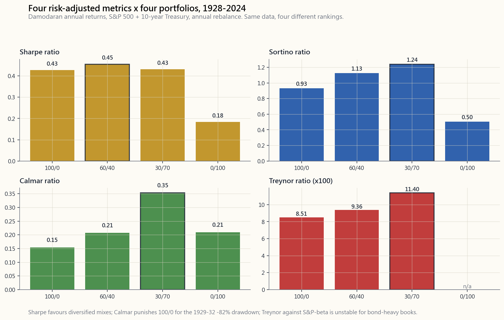
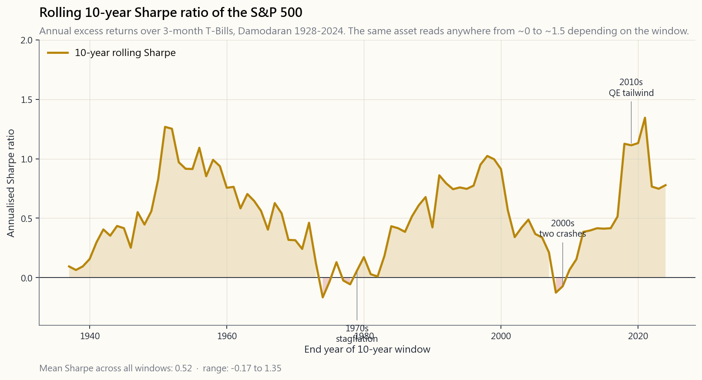

# 第十七周：业绩指标——夏普比率、索提诺比率、卡玛比率、信息比率、特雷诺比率、阿尔法与贝塔

---

## 第一部分：阅读材料

---

### 1. 为何这一内容至关重要

单独的收益数字几乎毫无意义。"我去年赚了18%"只是一句陈述，而非一个评价。它没有告诉你为了获得这一收益承担了多少风险，策略亏损的频率，或者同样的本金投入指数基金会不会表现更好。专业投资者、资产配置人、尽职调查团队，以及能够客观评估自身的个人投资者，都生活在**风险调整后收益**的世界里——即每承担一单位"痛苦"所获得的回报。

学习这一内容有四个理由。

1. **评估基金和管理人。** 全球每一份基金说明书都会引用夏普比率、最大回撤和跟踪误差。如果你看不懂这些数字，无法直观感受夏普比率0.4与1.2的实际差异——它们对客户账户报表意味着什么——你就会为平庸的管理人支付过高费用，同时错过真正优秀的人才。
2. **客观评估自己。** 只有当你承担的波动性低于30%才算赚得了30%的年收益，而且还要证明这并非单纯依靠30%的市场贝塔。没有夏普比率、索提诺比率、阿尔法和贝塔，你的年终总结不过是自说自话。
3. **针对不同问题选择正确指标。** 夏普比率是默认选项，但它对上行波动性和下行波动性一视同仁。卡玛比率聚焦于最大痛苦。信息比率衡量你的主动押注是否真正带来了回报。特雷诺比率仅关注你无法通过分散投资消除的系统性风险。每个指标回答的是不同的问题；用错指标就会得出错误答案。
4. **波动性的尾部左右全局。** 标准差假设收益服从正态分布，而实际并非如此。尾部是肥尾。因此夏普比率会系统性地*低估惩罚*那些平时看似平稳、偶尔爆仓的策略——例如做空波动性、持有流动性差的信用资产、带杠杆的套利策略。索提诺比率和卡玛比率在一定程度上弥补了这一缺陷。了解哪个指标会让哪种策略显得更好看，是尽职调查中大部分阿尔法的来源所在。

本课将梳理完整的指标体系，对四个模型投资组合在达摩达兰1928—2024年数据集上运行每个指标，并展示不同指标的排名如何颠覆你的选择偏好。

---

### 2. 你需要掌握的内容

#### 2.1 夏普比率——每单位总波动性的超额收益

夏普比率是一切的基础。比尔·夏普（1990年诺贝尔奖得主）于1966年提出这一公式，计算方法简单明了：

$$ \text{夏普比率} = \frac{R_p - R_f}{\sigma_p} $$

分子：**超额收益**——你的投资组合收益率减去无风险利率（3个月国债）。分母：你的投资组合收益率的**总标准差**。

夏普比率回答的问题是：*该投资组合每承担一单位总波动性，获得了多少收益？* 数值越高越好。以下是长期年化夏普比率的粗略参考基准：

| 夏普比率（年化） | 解读 |
|---|---|
| < 0 | 跑输无风险利率，承担风险却得到负补偿。 |
| 0.0 - 0.3 | 平庸。标普500指数过去一个世纪平均约为0.4。 |
| 0.3 - 0.6 | 尚可。大多数均衡型投资组合处于此区间。 |
| 0.6 - 1.0 | 真正优秀——若确实真实且持续。 |
| 1.0 - 2.0 | 卓越。排名前四分之一的对冲基金、运营良好的风险平价策略。 |
| > 2.0 | 存疑。要么数据窗口过短，要么隐藏尾部风险，要么存在欺诈。 |

以下两点在实践中尤为重要。

**频率换算陷阱。** 夏普比率通常以年化形式呈现。如果你从月度收益计算，必须乘以$\sqrt{12}$，而非12。从日度收益计算，则乘以$\sqrt{252}$。这基于月度收益相互独立的假设——虽然并不完全成立，但这一惯例已广泛采用。月度夏普比率为0.30的策略，年化夏普比率为$0.30 \times \sqrt{12} \approx 1.04$，而非3.6。

**肥尾问题。** 夏普比率使用$\sigma$，即假设收益大致围绕均值对称分布。而实际并非如此。1987年"黑色星期一"的-22%在正态模型下属于20个标准差的事件——意味着在宇宙的寿命内都不应该发生，然而它确实发生了。因此，夏普比率会系统性地奖励那些平时表现平稳、偶发暴雷的策略（做空波动性、流动性差的信用资产、带杠杆的套利）。波动性的尾部左右全局——切勿仅凭夏普比率来挑选管理人。

#### 2.2 索提诺比率——仅考虑下行偏差

索提诺比率是对夏普比率的第一次修正。它用**仅计算下行偏差**取代总波动性：即收益率低于目标值（通常为零或无风险利率）时的标准差。

$$ \text{索提诺比率} = \frac{R_p - R_f}{\sigma_d} \quad \text{其中} \quad \sigma_d = \sqrt{\frac{1}{N}\sum_{r_i < t}(r_i - t)^2} $$

从设计上看，上行波动性不再拉低你的得分——只有亏损才会。对于正偏态策略（大量小亏损、偶发大盈利；趋势跟踪是典型案例），索提诺比率将明显高于夏普比率。对于负偏态策略（做空波动性、在压路机前捡硬币），索提诺比率与夏普比率相近甚至更低。

一条实用经验法则：当**索提诺比率至少是夏普比率的1.4倍**时，该策略具有正偏态，管理人确实在管控下行风险。当**索提诺比率与夏普比率相差无几**时，收益分布是对称的甚至更差——左尾和右尾形态相似，管理人只是在承担风险而已。

#### 2.3 卡玛比率——每单位最大痛苦所获得的收益

卡玛比率对以下问题给出了最简洁的回答：*我的收益除以最大回撤是多少？*

$$ \text{卡玛比率} = \frac{\text{年化收益率}}{|\text{最大回撤}|} $$

如果一个策略年化收益率为12%，历史最大峰谷回撤为30%，则卡玛比率为0.40。卡玛比率高于0.5属于良好水平；在较长样本期内高于1.0则属罕见且卓越。标普500指数自1928年以来的卡玛比率约为**0.10**（约10%收益率/约86%的1929—1932年回撤）。

卡玛比率的优势在于：它聚焦于每位投资者真正关心的单一数字——他们所经历的最大亏损。其弱点在于：它取决于样本窗口。一个2010年成立、从未经历2008年危机的策略，卡玛比率会显得虚高；而恰好在危机前开始运行的策略，看起来会比实际更差。务必追问：*这个卡玛比率是否包含了最恶劣的市场环境？*

#### 2.4 信息比率——每单位跟踪误差的主动收益

对于*主动*管理人——即声称能够超越特定基准的管理人——单独使用夏普比率是不够的。正确的问题是：*每偏离基准一单位，你能产生多少额外收益？*

信息比率的计算公式为：

$$ \text{信息比率} = \frac{R_p - R_b}{\sigma(R_p - R_b)} = \frac{\text{主动收益}}{\text{跟踪误差}} $$

分子：**主动收益**（你的收益率减去基准收益率）。分母：**跟踪误差**（两者差值的标准差）。跟踪误差低、主动收益小幅为正的"隐形指数基金"可以拥有较高的信息比率；而主动收益高、跟踪误差也高的激进选股者，信息比率可能平平无奇。

行业通行标准：

- 信息比率 < 0.0：跑输基准。应解雇该管理人。
- 信息比率 = 0.5：机构主动管理人的前四分之一水平。
- 信息比率 = 1.0：前十分位，真正卓越。
- 信息比率 > 2.0：极为罕见；务必要求详细了解策略细节。

信息比率是每位养老金顾问用来评估主动管理人的核心指标。如果你支付的费率高于被动管理，就应该了解自己的信息比率。

#### 2.5 特雷诺比率——每单位贝塔的超额收益

夏普比率除以*总*风险，而特雷诺比率只除以**系统性**风险——即你无法通过分散投资消除的那部分：

$$ \text{特雷诺比率} = \frac{R_p - R_f}{\beta_p} $$

其中$\beta_p$是你的投资组合收益率对市场收益率进行回归所得到的斜率。一个$\beta = 1$、超额收益为12%的多元化股票子投资组合，特雷诺比率为0.12。$\beta \approx 0$的市场中性基金会产生近似除以零的情况——特雷诺比率无意义或趋向无穷大，这提示特雷诺比率并非适合对冲策略的指标。

当你在一个更大的投资组合内评估某个子投资组合时，应使用特雷诺比率——例如，判断你股票仓位中40%的科技股是否为其市场风险敞口赚取了足够收益，而忽略那些在母组合层面已被分散化消除的非系统性噪音。评估独立投资时，则应使用夏普比率。

#### 2.6 詹森阿尔法与贝塔——来自CAPM回归

贝塔和阿尔法均来自同一个方程：超额收益的CAPM回归：

$$ R_p - R_f = \alpha + \beta (R_m - R_f) + \varepsilon $$

对你的月度收益率与标普500指数月度收益率进行回归，可得：

- $\beta$为斜率，告诉你市场每变动一单位，你的投资组合会变动多少。$\beta = 1.2$意味着市场下跌1%会拖累你下跌约1.2%。
- $\alpha$为截距，即你在CAPM基于贝塔敞口所预测的收益之**上**额外赚取的部分。年化后的阿尔法是投资者梦寐以求的终极目标。

几点诚实的现实认知：

1. 大多数个人投资者的策略，其阿尔法在统计上与零无异。阿尔法极为稀缺。对于观测期不足60个月的任何阿尔法估计值，都应视为极高噪音。
2. 贝塔在*风险分解*方面往往比阿尔法更有价值。如果$\beta = 1.4$，你的"选股"实际上是1.4倍标普500杠杆加上一些噪音；这个杠杆倍数解释了权益曲线上发生的绝大部分变动。
3. 阿尔法可能在短期内因运气而持续存在。它也可能因未披露的因子敞口而持续存在（小盘股、价值、低波动性、动量）。现代业绩归因在宣称"阿尔法"之前，会先剥离这些已知因子。

本课末尾的互动工具允许你实时绘制CAPM散点图：投资组合月度超额收益对标普500超额收益，$\alpha$为截距，$\beta$为斜率。

#### 2.7 指标之间的分歧——有意为之

存在五种以上比率的全部原因在于，**它们强调收益分布的不同部分**。下图对四个典型投资组合使用达摩达兰1928—2024年数据，分别运行夏普比率、索提诺比率、卡玛比率和特雷诺比率：

注意：从夏普比率看，60/40组合得分最高，因为波动性上的相关性折扣（第4周）提升了分母的分母。从卡玛比率看，全债券组合胜出，因为该样本中债券系列的最大回撤浅于1929—1932年的股票损失。从特雷诺比率对股票贝塔的角度看，全股票投资组合表现尚可，因为贝塔按构造等于1——但债券投资组合的特雷诺比率是基于股票贝塔计算的，结果显得不可靠。数据相同，排名却各异。

这不是缺陷，而恰恰是关键所在。一份可信的投资组合评估报告应**至少呈现三个指标**，并解释它们在哪些地方一致、在哪些地方存在分歧。

#### 2.8 夏普比率随时间的演变——市场环境的故事

即便对于单一资产，夏普比率也不是一个常数。下图是标普500指数（超过3个月国债）自1937年以来的滚动10年夏普比率：

这条线波动剧烈。1970年代，10年窗口内超额收益约为零，夏普比率接近0.0。1980至1990年代的顺风期，夏普比率攀升至1.0以上。2000年代双重失落的十年（互联网泡沫+金融危机）将其打回接近零的位置。2010年代在量化宽松驱动的估值扩张支撑下，夏普比率又重建至约1.5。

结论：当有人引用"标普500的长期夏普比率是X"时，务必追问：*X是在哪个窗口计算的？* 1980—2020年的市场环境是异常的——它的夏普比率同样如此。

---

### 3. 常见误区

1. **"夏普比率2.0很厉害。"** 这个数字*太*厉害了。真实、长期、具有规模承载能力的夏普比率超过约1.2极为罕见。短窗口夏普比率为2.0通常可分解为以下几种情况：选择性偏差（幸存者）、数据过短（过度拟合），或隐藏尾部风险（即将爆仓）。
2. **"夏普比率越高=风险越低。"** 夏普比率越高=每单位*已测量*风险的超额收益越好。如果风险度量（标准差）遗漏了肥尾，表观夏普比率就是虚假的——波动性的尾部左右全局。
3. **"卡玛比率比夏普比率更公平，因为它使用真实回撤。"** 卡玛比率依赖样本选取。历史上未经历危机的策略，卡玛比率会人为偏高。正确的比较方式是在*包含压力时期的相同窗口*内计算卡玛比率。
4. **"索提诺比率奖励的是投资技能。"** 索提诺比率奖励的是收益形态，而非技能。任何在持续牛市中没有风险管理的带杠杆纯多头股票账户，都会拥有较高的索提诺比率。
5. **"贝塔=风险。"** 贝塔=对*你所回归的市场*的系统性风险。标普500贝塔为0.4的"低贝塔"股票，其对油价的贝塔可能高达2。你计算出的贝塔完全取决于所选择的市场指数。
6. **"阿尔法证明了投资技能。"** 阿尔法证明的是*在给定因子模型下无法解释的超额收益*。如果你的模型遗漏了小盘股、价值、动量或质量因子，你所读出的阿尔法实际上只是已知的因子溢价。学术回测中1995年以前大部分"阿尔法"，此后已被证实是遗漏因子敞口。
7. **"信息比率衡量的与夏普比率相同。"** 不对——夏普比率是总超额收益除以总波动性，信息比率是*主动*超额收益除以*跟踪误差*。信息比率低但夏普比率高的管理人，不过是在承担市场贝塔。
8. **"特雷诺比率因为使用贝塔所以优于夏普比率。"** 特雷诺比率仅在投资组合是更大多元化账户的一部分（非系统性风险确实已被分散化消除）时才有意义。对于独立的退休账户，夏普比率才是正确指标。
9. **"年化夏普比率等于月度夏普比率乘以12。"** 错误。应乘以$\sqrt{12}$。乘以12会将夏普比率虚增3.46倍，是简历造假的经典信号。
10. **"风险调整后收益是唯一重要的事。"** 风险调整后收益在*比较绝对收益相近的策略*时才有意义。但夏普比率为0.6、年化收益率12%的策略，其财富积累速度远超夏普比率为1.2、年化收益率4%的策略。真正的财富由绝对收益构建；夏普比率只是帮你在通往相同终点的两条路之间做出选择。

---

### 4. 问答环节

**Q1. 介绍基金时，我应该首先引用哪个指标？**
A1. 夏普比率仍然是默认选项，也是最易于理解的指标。搭配最大回撤以及索提诺比率或卡玛比率中的一个，使读者能够识别肥尾策略。在2026年仅引用夏普比率是一个警示信号。

**Q2. 我应该使用哪个无风险利率？**
A2. 对于以美元计价的投资组合，使用与收益率序列在时间上匹配的3个月国债收益率。达摩达兰的年度表格包含此列数据。年度序列使用年末国债利率；月度序列使用当期国债利率除以12。

**Q3. 我的月度夏普比率为0.4，年化后为1.4，为什么差距这么大？**
A3. 年化夏普比率 = 月度夏普比率 × √12 = 0.4 × 3.46 = 1.39，计算正确。

**Q4. 夏普比率有意义，需要多长的时间窗口？**
A4. 至少3年（36个月观测值）。低于此水平，夏普比率的标准误差大到数字几乎没有参考价值。机构资产配置决策通常需要5到10年的数据。

**Q5. 如果我的投资组合没有市场贝塔，特雷诺比率有用吗？**
A5. 没用。$\beta \approx 0$时特雷诺比率在数学上不稳定（近似除以零）。对于市场中性策略，应使用夏普比率和卡玛比率。特雷诺比率适用于具有明确市场方向性敞口的子投资组合。

**Q6. 索提诺比率 > 夏普比率，我是否应该总是偏好高索提诺比率的策略？**
A6. 大概率是的——但前提是要确认样本包含了真实的回撤事件。趋势跟踪策略在持续趋势行情中，索提诺比率看起来非常漂亮；真正的考验是它在震荡均值回归行情中的表现。

**Q7. 为什么对冲基金更多引用信息比率而非夏普比率？**
A7. 因为对冲基金的有限合伙人通常以某个指数作为基准（多空股票对标标普500，市场中性对标国债等）。信息比率是回答"你的主动风险是否得到了回报"的自然指标。夏普比率回答的是另一个问题："你的绝对收益是否补偿了我的绝对波动性？"

**Q8. 投资组合可能在阿尔法为正的情况下，夏普比率为负吗？**
A8. 可以，在压力时期会出现这种情况。阿尔法只衡量超出CAPM预测的部分。如果市场和你的投资组合都在亏损，但你亏损的幅度*少于CAPM根据你的贝塔所预测的损失*，阿尔法为正而原始夏普比率为负是完全可能的。2008年的国债管理人就经历过这种情况。

**Q9. 如何计算多空投资组合的贝塔？**
A9. 回归方式相同：投资组合月度超额收益对标普500月度超额收益进行回归，斜率即为**净**贝塔。总贝塔（多头贝塔加上空头贝塔绝对值之和）是用于风险归因的另一个独立敞口指标。

**Q10. 无风险利率近十年接近零，这会扭曲夏普比率吗？**
A10. 会导致夏普比率虚高。当$R_f \approx 0$时，原始收益率*等于*超额收益率，因此利率下降时夏普比率会机械性上升。为了进行跨时期比较，务必使用同期国债利率，而非固定假设值。

**Q11. 为什么标普500的滚动夏普比率波动如此剧烈？**
A11. 因为分子和分母都随市场环境变化。在低波动性牛市中（1990年代、2010年代），分子高、分母低——夏普比率急剧攀升。在滞胀时期（1970年代）或危机十年（2000年代），分子崩塌、分母上升——夏普比率暴跌。市场环境几乎决定了所有单一数字统计指标的表现。

**Q12. 陳馬会用哪个单一数字来评估自己的年度表现？**
A12. 两个数字，而非一个：实现的复合年均增长率和年内最大回撤。然后做一个理智检验：观察3年和10年滚动窗口的夏普比率，判断这一年是符合趋势还是昙花一现。"风险调整后收益"用单一比率表达，永远是片面的。
