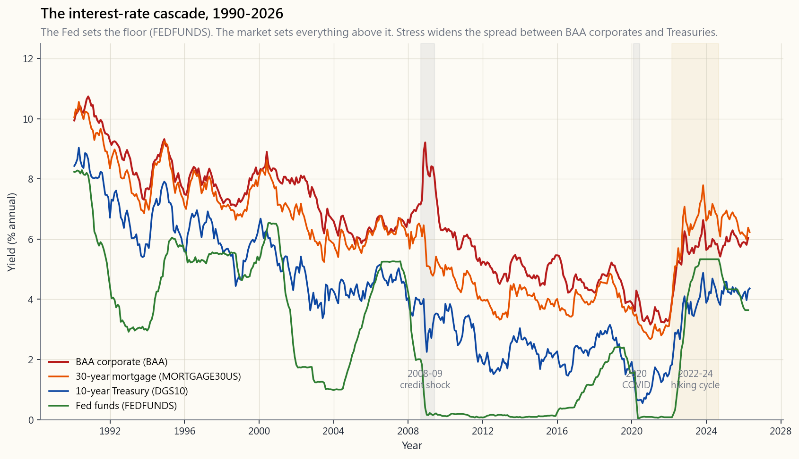
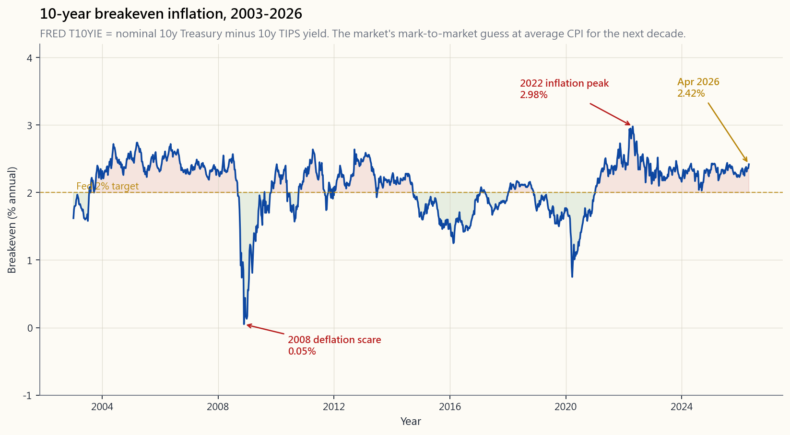

# 第十八周：利率——美联储的行动、市场的反应，以及利率如何传导至资产价格

---

## 第一部分：阅读材料

---

### 1. 为什么这很重要

金融领域有一个数字为其他所有数字定价，那就是折现率。折现率由两部分构成：无风险国债收益率，以及叠加其上的信用/股权利差。国债收益率一动，*全球每一笔未来现金流的每一美元*——你的房贷、你的股票、你私募基金的净值、你所在国家的养老金负债、隔壁仓库的租约——都会悄然重新定价。没有任何资产能游离于这个引力场之外。

美联储并不直接设定这个数字。美联储设定的是*一个*利率（隔夜联邦基金利率），且每六到七周才动一次，其余的由市场完成。房贷利率、10年期国债、BAA级公司债收益率、垃圾债券利差、美元汇率和股票估值倍数，都在无需任何授权的情况下自行调整。美联储在短端插下旗帜，市场则构建出整条曲线。

本课你需要内化四件事。

1. **利率是普遍分母。** 一只股票报价100美元，每股盈利5美元，增速3%，在4%折现率下有一个价值，在8%折现率下是截然不同的另一个价值。同一家企业，同样的盈利，价格却大相径庭。本课末尾的交互工具可以让你滑动折现率，观察典型长久期现金流的现值如何崩塌。切实操作一次——真正去拖动那个滑块——此后你再也不会问"美联储宣布决议后市场为何下跌"了。

2. **联邦基金利率是杠杆，不是结果。** 你实际支付的房贷利率、投资级企业发行债券的利率、财政部10年期国债的拍卖利率，都是*市场*利率。它们受美联储政策影响，但并非由美联储直接设定。§2.1的瀑布图展示了四个层级——联邦基金利率、10年期国债、30年期房贷、BAA级——以及它们之间的利差如何在压力时期和政策切换时期扩大。

3. **驱动估值的是实际利率，而非名义利率。** 通胀为5%时5%的名义收益率，与通胀为0%时0%的名义收益率，实际回报相同。市场通过通胀保值国债（TIPS）盈亏平衡利率将两者分开（§2.3）。2022年发生的事情是，*名义*收益率翻了三倍，但*实际*收益率从-1%升至+2%。正是这+3%的实际利率飙升压垮了长久期科技股，而非名义数字本身。

4. **45年间我们只经历了两次政策regime切换。** 第一次是1981年沃尔克时代，他将联邦基金利率加到20%，以此终结两位数通胀，引发四十年债券牛市。第二次是2022年至今，零利率时代的终结。2026年持有股债六四组合的投资者，整个职业生涯都活在同一种政策regime的庇荫下。他们需要知道另一面是什么感觉。

---

### 2. 你需要掌握的知识

#### 2.1 利率瀑布——联邦基金利率、10年期国债、房贷利率、BAA级公司债

利率的世界并非一个单一数字，而是一个分层体系，瀑布图使这一体系清晰可见。

从下往上读这张图。

- **联邦基金利率（FEDFUNDS，绿色）** 是银行间隔夜互相拆借的利率，由联邦公开市场委员会制定目标区间。这是图中*唯一*一条由美联储直接设定的线。2009年至2015年以及2020年至2022年，这条线钉在零下限。2022年3月至2024年中的加息周期将其从约0%推至约5.4%。
- **10年期国债（DGS10，蓝色）** 是10年期美国国债的市场拍卖收益率，是全球最受关注的价格信号。房贷、长期公司债以及股市折现率均以此为基准。注意它在长周期内跟随联邦基金利率，但短期内并不同步——10年期国债反映的是未来10年短期利率*路径*的预期加上期限溢价，而非当前联邦基金利率的镜像。
- **30年期房贷（MORTGAGE30US，橙色）** 位于10年期国债之上，利差在平稳市场约为150个基点，在压力时期扩大（2008-09年及2022-23年均超过250个基点）。利差反映了提前还款风险、MBS投资者需求以及银行承接能力。
- **BAA级公司债（BAA，红色）** 是投资级公司债收益率的最低档。其与10年期国债的利差，就是市场对违约风险的实时判断。2008-09年，利差从约170个基点飙至约600个基点。2026年4月，已回落至约190个基点。

你应当从中得出的结论：美联储掌握一根杠杆，另外四条利率曲线因它而动，却不与它亦步亦趋。判断哪条利差在扩大以及原因何在，正是严肃宏观分析的核心所在。

#### 2.2 折现率是普遍分母

你将来看到的每一个估值模型——股息折现模型、现金流折现法、市盈率、净值、内部收益率——都是建立在一个假设之上：折现率$r$。我们在第5周已接触过最简单的形式。戈登增长模型认为，一笔每期派发$D$、永续增长$g$的永续年金，其价值为

$$ P = \frac{D}{r - g} $$

三行代数式涵盖了股权估值的大部分精髓。注意边界情形。

- $r = 4\%，g = 0\%$ -> $P/D = 25$。典型的类债券股票。
- $r = 6\%，g = 2\%$ -> $P/D = 25$。相同倍数，完全不同的故事。更高增速抵消了更高折现。
- $r = 4\%，g = 3\%$ -> $P/D = 100$。2020-21年全球所见的"长久期成长股"倍数。
- $r = 8\%，g = 3\%$ -> $P/D = 20$。同一家企业，折现率上升400个基点，估值倍数压缩80%。

2022年长久期科技股的崩塌，*恰好*就是这最后一步。名义10年期国债收益率上升约250个基点，股权风险溢价扩大约150个基点。折现率合计抬升约4个百分点，长期现金流的现值大约腰斩。事实如此。本课末尾的交互工具可实时计算$P/(r-g)$，让你停止与图表争论，开始拖动滑块。

同一个分母也驱动着债券久期（第5周）、房地产资本化率、私募股权净值标记以及养老金负债。一切金融资产都是伪装成别的东西的现值计算。折现率*就是*资产定价的核心机制，其余皆是装饰。

#### 2.3 实际利率与TIPS盈亏平衡利率

名义收益率 = 实际收益率 + 预期通胀。这一分解至关重要，因为借贷双方真正在乎的是购买力，而非表面数字。财政部发行两类平行债务工具：名义国债（DGS10）和通胀保值国债（TIPS）。两者之间的收益率差，就是**10年期盈亏平衡通胀率**，FRED系列代码为`T10YIE`。

有三点格外突出。

1. **2008年通缩恐慌**。2008年11月，盈亏平衡利率降至*负值*——市场一度为未来十年的持续通缩定价。这一数字是美联储2009年初推出量化宽松的直接导火索；负值盈亏平衡利率就是通缩警报。
2. **2022年通胀峰值（约2.9%）**。即便headline CPI高达9%，10年期盈亏平衡利率始终未突破3%。债券市场自始至终相信美联储终将把通胀压回目标位。这一信念被验证为正确，也避免了长端利率恐慌演变为自我实现的预言。
3. **2026年4月读数**处于美联储目标区间内，这在一定程度上解释了联邦基金利率为何开始从峰值回落。

对股票投资者而言，实际利率比名义利率更重要，因为实际现金流（盈利、股息、租金）会随价格上涨而增加。当实际利率上升——如2022年的急剧上升——长久期股权的跌幅*超过*仅凭名义利率变动所能预测的幅度。

#### 2.4 1981年沃尔克峰值与2020年零下限——两次政策regime切换

如果把60年美国货币史压缩成两个事件，那就是以下这两个。

**1979年10月至1981年7月**，保罗·沃尔克走进美联储，下定决心打破两位数通胀。他做到了，方法是任由联邦基金利率升至必要水平：1981年中期峰值超过19%。10年期国债收益率峰值达到15.8%。经济陷入惨烈的双底衰退。通胀被打破。债券市场由此开启了长达四十年的牛市，直至2020年7月10年期国债收益率触及0.55%才告终。1981年买入长期债券并持有至2020年的投资者，年化总收益超过了标普500指数。

**2020年3月至2022年**，美联储将联邦基金利率降至零，18个月内将资产负债表扩张4.6万亿美元，并使实际利率深度为负。资产价格直线上涨。长久期科技股、SPAC、加密货币、住宅房地产——一切对折现率敏感的资产，其表现都如同折现率*被设为零*一般，因为从实际意义上说，确实如此。

这两个事件划定了*被动投资四十年政策regime*的边界。"被动指数投资长期必胜"的论断——这是推动博格、巴菲特以及整个交易所交易基金行业的核心理念——建立在1981年至2020年的债券牛市及其携带的通缩红利之上。这一策略有效。但它*同时*也依托于一个历史罕见的政策regime背景，而核心教训在于：政策regime的背景会发生改变。

波动率尾巴摇狗身的逻辑与此直接相连：沃尔克必须打破债券市场才能打破通胀。2022年，美联储必须冒险打破股市才能打破疫情后的通胀。当美联储猛拉利率杠杆时，*波动率*的尾巴反过来摇动政策这条狗。2023年3月的硅谷银行事件正是如此——一家久期严重错配的地区银行，在36小时内被推特协调的储户挤兑。美联储的银行定期融资计划（BTFP）在随后的周末紧急出炉。

#### 2.5 2022-2024年加息周期详解

以下数字值得记住，作为校准基准。

- **2022年3月**：联邦基金利率从0-0.25%升至0.25-0.50%。三年来首次加息。
- **2022年11月**：经过四次连续加息各75个基点，联邦基金利率达到3.75-4.00%。这是自1981年以来最快的紧缩节奏。
- **2023年7月**：联邦基金利率峰值5.25-5.50%。
- **2023年3月**：硅谷银行、签名银行、第一共和银行相继倒闭。一周之内三家银行关门。美联储推出银行定期融资计划托底，并继续加息。
- **2024年**：9月首次降息50个基点，此后25个基点逐步下调。2024年底联邦基金利率降至4.25-4.50%。
- **2026年4月**：联邦基金利率趋于稳定；盈亏平衡利率回归美联储约2%的目标附近（见§2.3）。收益率曲线从2022年中至2025年初的持续倒挂，恢复为正常的正斜率。

本轮周期带来三点教训。

1. 货币政策传导至实体经济的滞后期约为12至18个月。2022年3月开始的加息，在2023年底和2024年对住宅地产和小企业信贷的冲击最为显著。
2. 大部分资产价格损伤发生在*预期*加息周期阶段，而非加息过程中。标普500在联邦基金利率见顶的八个月*前*已触底。市场提前为折现率定价。
3. 久期比以往任何时候都更重要。30年期国债从2020年8月至2023年10月价格跌幅约46%。这超过了大多数股市熊市。债券并不"安全"。

#### 2.6 利率变动下的成长股与价值股

股权久期是真实存在的，尽管我们从不直接引用这个数字。一只盈利增速3%、大部分现金流在未来五年内兑现的股票，久期较低；折现率对其影响有限。一只盈利增速25%、大部分现金流预计在十年或二十年后兑现的股票，久期*极高*——它本质上是一张长期零息债券。

机制上，**成长股是长久期资产，价值股是短久期资产。** 当利率上升时：

- 成长股估值倍数大幅压缩。纳斯达克100指数2022年下跌33%，标普500下跌18%，罗素2000价值指数仅下跌14%。同一个财报季，不同的利率敏感度。
- 价值股（银行、公用事业、工业）现金流久期较短，且往往直接受益于收益率曲线趋陡。
- 债券当然随久期等比例损失价格：2022年单年10年期债券下跌约18%，30年期债券下跌约33%。

这正是"成长与价值"随利率周期轮动、而非随投资者情绪轮动的原因。本课末尾的交互工具包含一个侧边面板，精确显示利率上升100个基点如何影响四类代表性现金流：10年期债券、30年期债券、高成长股权（增速4%、久期10年）和价值股权（增速1%、久期5年）。

杠铃式配置的直觉在这种轮动中依然成立：持有短久期价值股多头加小仓位凸性长久期成长股，可在两种政策regime中均有所斩获，无需押注哪种regime胜出。纯长久期科技股在2022年足以断送职业生涯；纯价值股则会错过过去十年每一笔伟大的投资。杠铃取胜，因为政策regime不可预判，而利率波动幅度巨大。

---

### 3. 常见误区

1. **"美联储设定房贷利率。"** 并非如此。美联储设定的是隔夜联邦基金利率。房贷利率以10年期国债为基准，再加上MBS利差，两者均由市场决定。
2. **"利率上升必然导致股价下跌。"** 并非总是如此。在加息周期的初期，加息释放出经济健康的信号，股票可能与利率同步上涨。2004-06年周期是典型案例。关键在于实际利率的上升速度是否快于预期增长。
3. **"通胀对股票有利，因为企业可以涨价。"** 仅在温和水平下有时成立。通胀超过约4%时，股票估值倍数会急剧压缩（1970年代、2022年）。股票是实物资产，但同时也是长久期折现现金流，折现率效应在通胀约3%以上时占据主导。
4. **"通胀保值国债（TIPS）能抵御通胀。"** 是的，但TIPS也是长期债券，其*实际*收益率会随市场波动。2022年TIPS本金损失约12%，因为实际收益率分项上升，尽管它在通胀分项上做到了应有的保护。
5. **"持有至到期的国债不会亏损。"** 名义意义上成立，实际意义上不成立。2020年以1%收益率买入的30年期债券，每一分名义本金都会按时偿还，但按2026年通胀预期估算，这等于锁定了约每年-1%的实际回报，持续三十年。
6. **"现金是安全的。"** 现金名义上安全，通胀期间实际上危险。从2020年到2024年，存放在0%利率银行账户里的一美元，损失了约17%的购买力。现金是一个*头寸*，而非默认的避风港。四分仓框架明确区分了流动性和短期国债，各为其用。
7. **"量化宽松导致通胀。"** 2009至2017年八年量化宽松并未产生消费端通胀。2020-21年的量化宽松则引发了40年来最高的通胀。差别在于财政政策：2020-21年的量化宽松叠加了逾5万亿美元直接转移支付给消费者。量化宽松本身只是移动银行准备金，而非直接推高价格。
8. **"收益率曲线倒挂必然预示经济衰退。"** 自1955年以来，倒挂在每次经济衰退前均有出现，仅有一个模糊的例外——这是很高的命中率，但并非保证。2022-25年倒挂是有记录以来持续时间最长的一次，最终实现软着陆，而非典型的全美经济研究局认定的经济衰退。
9. **"外国利率与美股无关。"** 错误。美元是全球储备货币；利率差异驱动美元，美元影响跨国企业盈利（标普500约40%营收来自海外），美元同样影响大宗商品价格。日本央行2024年的政策转向，是标普500不可忽视的输入变量。
10. **"实际利率超过2%是'正常'水平。"** 1900至1980年实际利率*平均*为2-3%。2008至2022年平均接近0%。没有单一的"正常"——政策regime决定水平。政策regime切换的论点在此再次适用。

---

### 4. 问答

**问：如果只能盯一个利率，盯哪个？**
答：10年期国债收益率。它是利率市场所有信息的最佳汇总——美联储政策预期、期限溢价、实际增长预期和通胀预期。它持续报价，没有信用利差，是所有人引用的折现率基准。

**问：联邦基金利率和"折现率"有什么区别？**
答：这是容易混淆的术语。联邦基金利率是美联储设定目标的银行间隔夜拆借利率。美联储的*贴现率*是美联储向直接从贴现窗口借款的银行收取的利率（略高于联邦基金利率）。实践中，贴现窗口只是兜底工具；联邦基金利率才是头条工具。本课在不加限定语的情况下提及"折现率"，指的是现金流折现法中使用的金融经济学折现率$r$，而非美联储贴现窗口利率。

**问：如何判断实际利率的走向？**
答：用名义10年期国债收益率（FRED `DGS10`）减去10年期盈亏平衡利率（FRED `T10YIE`）。FRED也直接发布`DFII10`（10年期TIPS收益率）。实际利率 = 名义收益率 - 盈亏平衡利率。实际利率上升是长久期资产最可靠的熊市信号。

**问：现在应该选固定利率还是浮动利率负债？**
答：这是个人理财决策，并非投资建议，但框架是：如果你预期实际利率从这里继续上升，选固定；如果你预期下降，选浮动。2026年4月，10年期国债约4%，盈亏平衡利率约2%，实际利率约为2%——大致处于长期均值附近。激进锁定或激进浮动都不存在明显不对称机会。

**问：什么是"期限溢价"，为什么大家总在谈论它？**
答：期限溢价是投资者持有长期债券而非滚动持有短期债券所要求的额外收益率。数学上，它是10年期国债收益率中*无法*用预期未来短期利率解释的部分。从2014年到2021年，这一数字约为零甚至为负——债券投资者为安全资产支付溢价。2024-25年，它已悄然回升至约50个基点。期限溢价越高，意味着长久期资产被折现得越多。

**问：美联储真的能控制通胀吗？**
答：它通过利率和银行准备金控制通胀的*需求侧*。它无法控制供给冲击（石油、芯片、航运）。2021-22年通胀约60%由供给驱动、40%由需求驱动；美联储只能攻打需求的那一半。沃尔克1981年之所以成功，是因为需求是主导因素。1973-74年通胀主要由石油冲击驱动，伯恩斯的加息收效甚微。

**问：为什么坏的经济数据有时会导致债券上涨？**
答：因为坏消息会将预期未来短期利率的路径下移，从而推高债券价格。债券喜欢经济衰退。股票大多厌恶经济衰退。这种不对称相关性正是60/40组合有效的原因——多元化配置的组合因此存在。第4周已覆盖这一点；这是投资组合多元化逻辑的核心。

**问：美联储加息多快会反映在房贷利率上？**
答：30年期房贷利率随*市场对美联储行动的预期*而动，而非行动本身。一次"意外"的25个基点加息，当周大约会带动房贷利率上行10-20个基点。而*预期路径的变化*——例如偏鹰的利率点阵图——可能在一个下午内推动房贷利率50-100个基点。等美联储真正行动时，蛋糕基本上已经烤好了。

**问：通胀保值国债（TIPS）在通胀期间是无风险套利吗？**
答：不是。TIPS保护本金不受CPI侵蚀，但其*实际*收益率随市场浮动。2022年实际利率上升250个基点，TIPS价格随之下跌。它们防范的是*意外*通胀，而非实际利率的正常化。TIPS是保险，不是魔法。

**问：在自己的投资组合决策中，如何思考折现率？**
答：为自己设定一个个人基准回报率——低于这个回报就不值得投入精力的门槛。对于大多数承担完整股票风险的美国投资者，这大约是10年期国债收益率加上4-5%的股权风险溢价。所以在2026年4月，10年期国债约4%，你的门槛约为8-9%。你的每一笔配置都应当越过这道门槛，否则就不应该做。阿尔法极为稀缺：如果你无法清晰说明为何你的想法能超越门槛，那它就达不到。

**问：1981-2020年的债券牛市真的结束了吗？**
答：很可能是的，但"很可能"不等于"必然"。第二波通缩（由人工智能生产力提升、人口结构变化、全球化2.0驱动）可能将10年期国债推回2%以下。但本十年余下时间的*基准情形*是名义收益率在3-5%之间震荡，这也是历史正常水平。构建一个*必须依赖*收益率跌回1%才能奏效的投资组合——大多数激进长久期科技股押注隐含的正是这一逻辑——是一种押注特定政策regime的行为，而那个regime已经改变了。

**问：本课与整个课程的其他部分如何衔接？**
答：这是支撑第5周（债券）、第4周（60/40）、第10周（经济周期）、第11周（利率冲击中的行为偏差）、第13周（多空策略及其在不同利率环境下的表现）的宏观引擎。每一类资产都有久期。折现率移动所有资产。本周是连接一切的纽带。

---

## 第二部分：YouTube脚本

---

**视频标题：** 利率：为一切定价的那个数字（第18周）

**目标时长：** 约18分钟

**主持人：** 陳馬、小魚

---

**[开场——0:00至1:30]**

[VISUAL: 标题卡"第18周——利率"]

**陳馬**：金融领域有一个数字，藏在所有其他数字的底层，大多数普通投资者甚至没有意识到它的存在。它就是折现率。今天，我们要把它摆在明处。

**小魚**：我刚入行的时候，以为"利率"就是美联储在新闻发布会上公布的那个数字。结果发现，那大概只占整个故事的5%。

**陳馬**：美联储掌握一根杠杆，世界上其他所有利率由市场决定——包括你房贷的利率，以及隐含在你股票估值里的那个利率。两者都在无需任何人宣布的情况下自行移动。

**小魚**：今天我们将逐一讲解利率瀑布图、折现率为何是金融领域的万有引力、实际利率与名义利率的区别，以及过去45年间的两次政策regime切换——1981年的沃尔克时代和2022年零利率时代的终结。

**陳馬**：我希望每一位观众在看完这课之后，真的打开课末的交互工具，拖动折现率滑块。这种直觉光靠读是传递不了的。你必须自己去动那个滑块。

**小魚**：我们从瀑布图开始。

---

**[§2.1 利率瀑布——1:30至4:30]**

[VISUAL: image/week18_rate_cascade.png]

**陳馬**：这就是35年美国利率的四条曲线。最底下的绿线，联邦基金利率，是美联储唯一真正控制的那条。注意它2009至2015年、再次2020至2022年钉在零的位置——那就是零下限的年份。

**小魚**：它上方的蓝线是10年期国债，你可以看到它并不是单纯复制联邦基金利率的走势。2008-09年，10年期国债在2-3%左右，而联邦基金利率已经在零附近。2022年，10年期国债在美联储开始加息*之前*就已经上行，因为债券市场早就看到了通胀的来临，提前定价了。

**陳馬**：上方的橙线是30年期房贷利率。注意房贷利率与10年期国债之间的差值。在正常市场中，这个差约为150个基点。2008年金融危机时，它扩大到超过250。2022至2023年初，随着MBS投资者要求更高的提前还款风险补偿，它再次扩大。这就是为什么即便10年期国债峰值不到5%，房贷利率也突破了7%。

**小魚**：红线，BAA级公司债，是投资级公司债收益率的最低档。BAA与10年期国债之间的利差，就是公司信用压力的*核心*指标。2008-09年一目了然——公司债利差从约170个基点飙至约600个基点。2026年4月，我们回到了约190个基点。市场平静。

**陳馬**：从瀑布图得出的教训：美联储拉动一根杠杆，市场用这根杠杆加上自身对增长、通胀和风险的预期，构建出其余所有曲线。任何人告诉你"美联储设定房贷利率"——他根本没看过这张图。

---

**[§2.2 折现率作为普遍分母——4:30至8:00]**

[VISUAL: 空白，然后出现公式]

**小魚**：接下来是本课的核心思想。折现率是普遍分母。地球上每一类资产，都是按某个利率折现的未来现金流之和。利率一动，每类资产都动。

**陳馬**：让我用金融领域最简洁的公式来说明：P等于D除以r减g。价格等于下一期现金流除以折现率与增长率之差。这就是戈登增长模型，也是股权估值实际做的大部分事情。

**小魚**：代入数字。r等于4%，g等于0%，P/D等于25。慢增长股息股票的合理水平。

**陳馬**：现在r等于4%，g等于3%。P/D变成100。那就是2020-21年长久期科技股的估值倍数。

**小魚**：现在把r调到8%，g维持3%。P/D跌至20。同一家企业，同样的增长，估值倍数压缩了80%。

**陳馬**：这就是2022年发生的事。名义国债收益率上升约250个基点，股权风险溢价扩大约150个基点。折现率合计抬升约400个基点。纳斯达克100、ARKK、SPAC、加密货币——长久期资产跌幅30%至80%。那不是情绪，是算术。

**小魚**：你在财经节目里听到"市场因利率上升而下跌"时，说的在技术上没错，但隐藏了机制。机制就是分母里的*r*上去了，所以价格下来了。就这些。整个故事就是这样。

**陳馬**：同一个分母也驱动着房贷价值、房地产投资信托净值、私募股权估值标记、养老金负债，以及你自己决定是否去初创公司的个人机会成本。全部如此。

---

**[§2.3 实际利率与TIPS盈亏平衡利率——8:00至11:00]**

[VISUAL: image/week18_breakeven_inflation.png]

**小魚**：接下来是最容易被忽视的概念：实际利率与名义利率。通胀为5%时5%的名义收益率，与通胀为0%时0%的名义收益率，实际回报完全一样。借贷双方真正在乎的是购买力，而非表面数字。

**陳馬**：财政部发行两类平行债务工具——普通名义国债和通胀保值国债（TIPS）。两者之间的收益率差，就是盈亏平衡通胀率。它是市场对未来十年平均CPI的每日盯市估算。

**小魚**：这张图，FRED系列T10YIE，是从2003年开始的盈亏平衡利率走势。有三点值得注意。

**陳馬**：第一，2008年底。盈亏平衡利率跌至*负值*。市场一度为未来十年的持续通缩定价。这就是美联储2009年初推出量化宽松的原因——负值盈亏平衡利率就是通缩的警报。

**小魚**：第二，2022年。即便headline CPI高达9%，10年期盈亏平衡利率峰值仍不到3%。债券市场自始至终相信美联储最终会压制通胀。那个信念守住了长端，没有让恐慌演变成自我实现的预言。

**陳馬**：第三，2026年4月。我们回到了美联储目标区间内，这也是联邦基金利率开始从峰值回落的部分原因。

**小魚**：对股票投资者而言，结论是：实际利率比名义利率更重要。2022年实际利率急剧上升，长久期科技股的跌幅*超过*仅凭名义利率变动能预测的幅度。

**陳馬**：顺便说一下，TIPS保护的是抵御*意外*通胀，而不是实际利率上升。2022年TIPS本金损失约12%，因为实际收益率上升了，尽管TIPS在通胀分项上做到了它应该做的。

---

**[§2.4 两次政策regime切换——11:00至14:00]**

[VISUAL: 再次显示瀑布图，聚焦1981年和2020年标注]

**陳馬**：把60年美国货币史压缩成两个事件。

**小魚**：1981年，沃尔克。保罗·沃尔克走进美联储，下定决心打破两位数通胀。他做到了。联邦基金利率峰值超过19%。10年期国债收益率峰值15.8%。经济陷入惨烈的双底衰退。此后，债券市场开启了长达40年的牛市，直至2020年才告终。

**陳馬**：1981年买入长期债券持有至2020年的投资者，年化总收益超过了标普500指数。债券。跑赢了股票。持续40年。这是现代史上最伟大的一笔固定收益交易。

**小魚**：第二个事件：2020年3月。美联储降息至零，18个月内资产负债表扩张4.6万亿美元，使实际利率深度为负。资产价格直线上涨。长久期科技股、SPAC、加密货币、房地产——任何对*r*敏感的资产，其表现都如同*r*被设为零一般，因为从实际意义上说，确实如此。

**陳馬**：这两个事件划定了*被动投资四十年政策regime*的边界。"被动指数投资长期必胜"的论断——这是现代零售投资的整个精神内核——建立在1981-2020年的债券牛市和伴随而来的通缩红利之上。

**小魚**：这一策略有效。我们并不反对被动投资。但我们要说的是：这一策略有效，是建立在一个历史罕见的政策regime背景之上的。政策regime分析的核心教训就是：背景会改变。而2022年，改变开始发生了。

**陳馬**：波动率尾巴摇狗身。当美联储猛拉利率杠杆时，东西会断。沃尔克1981年打破了市场以打破通胀。2022年的加息周期在2023年3月一周之内打掉了硅谷银行、签名银行和第一共和银行，美联储不得不连夜发明银行定期融资计划（BTFP）来止血。

---

**[§2.5 2022-2024年加息周期——14:00至16:00]**

[VISUAL: 瀑布图，聚焦2020-2026年区间]

**小魚**：快速回顾时间线。2022年3月首次加息。到2022年11月，美联储连续四次加息各75个基点——自1981年以来最快的紧缩节奏。2023年7月联邦基金利率见顶5.25至5.50%。2024年9月首次降息。2026年4月，收益率曲线恢复正斜率。

**陳馬**：本轮周期带来三点教训。第一：政策传导至经济的滞后期约为12至18个月。第二：大部分资产价格损伤发生在*预期*阶段，而非加息过程中。标普500在联邦基金利率见顶前八个月就已触底。第三：久期致命。30年期国债从2020年8月至2023年10月价格跌幅约46%。这超过了大多数股市熊市。债券并不"安全"。

**小魚**：还有成长股与价值股的轮动。2022年，纳斯达克100下跌33%，标普500下跌18%，罗素2000价值指数仅下跌14%。同一个财报季，不同的利率敏感度。

**陳馬**：成长股是长久期资产，价值股是短久期资产。杠铃配置在这种轮动中依然成立。持有短久期价值股多头加小仓位凸性长久期成长股，可在两种政策regime中均有所斩获，无需押注哪种regime胜出。2022年纯长久期科技股足以断送职业生涯，纯价值股则会错过过去十年每一笔伟大的投资。杠铃取胜，因为政策regime不可预判，而利率波动幅度巨大。

---

**[§2.6 交互工具——16:00至17:30]**

[VISUAL: interactive/week18_rate_impact.html]

**小魚**：打开交互工具。有三个滑块——折现率、预期增长率、初始现金流——以及四个输出面板。

**陳馬**：第一个练习。把增长率设为3%，初始现金流设为5美元。把折现率从4%滑到8%。看着现值崩塌。那就是2022年长久期科技股的遭遇。

**小魚**：第二个练习。看侧边面板。它显示利率上升100个基点，如何影响四类不同的现金流：10年期债券、30年期债券、高成长股权和价值股权。注意排序。30年期债券和高成长股权的跌幅都在17至19%左右，几乎相同。

**陳馬**：这个观察一旦内化，会彻底改变你看待投资组合构建的方式。重仓成长股的"多元化"投资组合，对利率冲击来说根本不是多元化。它只是穿了另一套衣服的长期债券押注。

**小魚**：花三分钟在交互工具上。拉动每一个滑块，看每一个数字如何变化。这种直觉光靠读传递不了，拖动才能传递。

---

**[结尾——17:30至18:00]**

**陳馬**：三点总结。第一：折现率是普遍分母，一动，每类资产重新定价。第二：美联储设定一个利率，其余由市场决定。第三：我们活在一种政策regime里已经40年——通缩、利率下行——那个regime在2022年发生了转变。

**小魚**：下周，第19周，我们深入通胀本身——是什么导致它、什么能预测它、哪类通胀对哪类资产有利或有害。之后，宏观基础就建立完毕，我们将进入更深层的微观内容：仓位规模、因子敞口和税务优化结构。

**陳馬**：下周见。

[VISUAL: 结尾卡片]