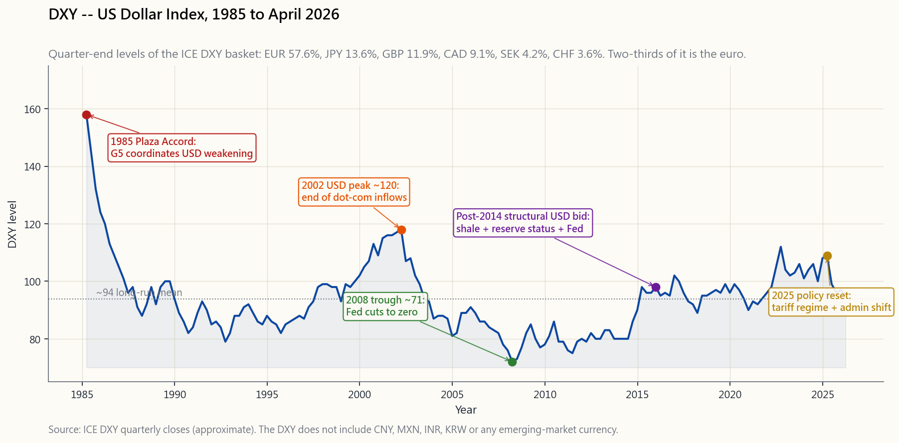
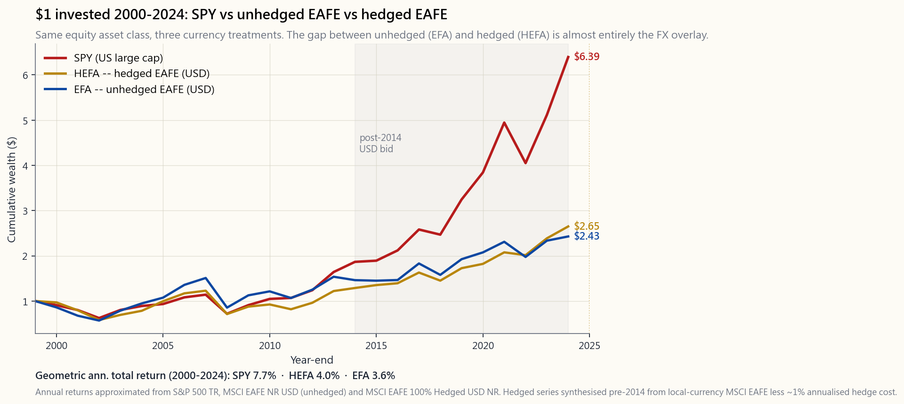

# 第二十二周：货币与国际分散投资——美元指数、外汇对冲，以及为何大多数美国投资者应坚守本土

---

## 第一部分：阅读材料

---

### 1. 为何这一话题至关重要

教科书里关于国际投资的章节读起来像一本旅游手册。更低的相关性！未被开发的增长潜力！更便宜的估值！分散投资，否则出局！所有这些说法在学术层面无懈可击，但对2026年4月身处美国的普通散户投资者而言，却有着相当大的误导性。这一课题的诚实版本——教科书不会告诉你的那个版本——是：**持有国际股票，就是把一个外汇头寸钉在一个外国股票头寸上，而在你真正在意的任何时间段内，外汇端通常都会压倒股票端**。

尽管如此，本节课仍有存在的理由，共有四点。

1. **美元指数本身就是新闻。** 美元指数的走势，牵动着你所持有的一切以美元计价、或与美元存在竞争关系的资产价格——新兴市场债券、黄金、原油、苹果公司的海外营收、国债需求。你无法阅读财经媒体而不碰到"美元走强"或"美元走弱"的标题，你应当清楚这些标题实际衡量的是什么。美元指数并不代表"美元兑全球货币"；它是一个固定权重的篮子，包含欧元（57.6%）、日元（13.6%）、英镑（11.9%）、加拿大元（9.1%）、瑞典克朗（4.2%）和瑞士法郎（3.6%）——六种发达市场货币，权重锁定于1973年，自1999年欧元诞生后的调整以来一成未变。其中三分之二是*欧洲货币*。里面没有人民币、没有墨西哥比索、没有印度卢比。了解这一点，是抵御混乱评论的第一道防线。

2. **外汇运算残酷而不对称。** 当你买入一只未对冲的国际交易所交易基金，而持有期内美元升值10%，你在外国股市表现之上，还要承受约10%的逆风。欧洲股市当年以欧元计算持平，反映在你的美元账户上，就是亏损10%。大多数散户从未明确为这个叠加层定价，这也是为什么每一轮多年期美元牛市结束后，都会涌现出同一批博文，追问"国际"投资为何令人失望。

3. **有对冲版本，但并非免费。** HEFA（iShares MSCI EAFE对冲版）和DBEF（Xtrackers MSCI EAFE对冲版）等交易所交易基金通过滚动远期合约系统性地剥离货币叠加层。对冲成本约等于美国与外国之间的**利率差**，再加上少量的运营摩擦。2026年4月，美联储基准利率为4.5%、欧洲央行为2.5%，对欧元敞口进行对冲每年大约损耗2%，而你在股票端还未赚到一个基点。几十年复利累积下来，这些对冲成本会演变成真实的财富侵蚀。

4. **这个结论与教科书背道而驰。** 全球顶尖企业——芯片设计、超大规模云计算、支付、生物科技、国防龙头——不成比例地在美国上市。标普500指数已有约40%的营收来自美国以外，也就是说，你通过美国的法律保障和美元结算，买到的正是全球盈利。在此基础上再叠加宽泛的美国以外（EXUS）敞口，不过是在你本已持有的盈利之上，再加一层货币叠加和治理折价。对大多数美国本土散户读者而言，国际敞口的合理规模是**股票组合的5%至15%**，且应为**对冲形式**，作为小型分散器，而非战略支柱。本节课将带你走通*为何*这是结论，而不仅仅是把结论塞给你。

旅游手册主张配置30%至40%的国际权重。底层逻辑则指向接近于零。本节课的落点在两者之间，但偏向于零。

---

### 2. 你需要掌握的内容

#### 2.1 美元指数篮子——六种货币，冻结的权重

美元指数（代码DXY，期货代码DX）由洲际交易所旗下ICE期货发布，可追溯至1973年3月，当时以100为基准，对应十种货币的篮子。1999年欧元吸收了德国马克、法国法郎、意大利里拉、荷兰盾和比利时法郎之后，指数缩减为六种幸存货币，权重自此未再更新：

- **欧元——57.6%。** 合并后的欧元取代了原来十种货币中的五种，并继承了它们的加总权重。美元指数的三分之二，实际上就是"欧元相对于美元"的走势。
- **日元——13.6%。** 日本在1973年是美国第二大贸易伙伴，这一权重就此沿用。
- **英镑——11.9%。** 英镑的权重反映的是欧元诞生前伦敦作为金融中心的地位，而非当前的贸易格局。
- **加拿大元——9.1%。** 如今，加拿大是美国迄今最大的货物贸易伙伴，但美元指数仅赋予其9%的权重。
- **瑞典克朗——4.2%。** 2026年的瑞典，贸易体量大约相当于新泽西州。
- **瑞士法郎——3.6%。** 避险属性的卫星货币。

`image/week22_dxy_decade.png`中的图表绘制了1985年至2026年4月的美元指数走势，并标注了五个关键节点：**1985年广场协议**，协调推动1985年后美元贬值；**2002年美元峰值**，约在120附近，位于互联网泡沫破裂之前；**2008年低点约71**，金融危机期间美联储大幅降息；**2014年后形成的美元结构性需求**，主导了过去十年的走势；以及**2025年政策驱动的重置**，新政府的关税政策迫使美元相对于篮子货币走低。

对于美元指数，诚实的健康警示是：**它不是美元的衡量标准**。它衡量的是美元兑一个1973年冻结的篮子——而该篮子由欧洲货币主导。美联储发布了一个经过适当加权、覆盖更广泛贸易伙伴的替代指标（贸易加权美元指数，FRED序列`DTWEXBGS`），包含人民币、墨西哥比索、韩元及其他真实贸易伙伴的货币。宽口径指数在任意一个季度的走势都可能与美元指数有所不同，当你针对实际美元负债衡量外汇风险时，这一差距举足轻重。然而对于大多数散户评论而言，美元指数*就是*美元——因为屏幕上显示的正是这个数字。

#### 2.2 货币叠加层——为何你的国际交易所交易基金是两个赌注

当你买入`EFA`（iShares MSCI EAFE，发达市场国际基准）时，你同时承担了两种截然不同的敞口：

1. 外国股票以其**本币**（欧元、日元、英镑、瑞士法郎等）计价的价格表现。
2. 这些货币兑**美元**的价格表现。

单年内的美元总收益近似为：

$$ R_{\text{USD}} \approx (1 + R_{\text{本币}}) \times (1 + R_{\text{外汇}}) - 1 $$

其中$R_{\text{外汇}}$是外汇相对于美元的升值幅度。两种效应是相乘而非相加关系，但对于幅度适中的波动，简单加总是合理的近似：若外国股市当年以本币计涨幅为8%，同年外汇兑美元升值5%，则美元总收益约为**+13%**。若同一市场的股票表现仍为8%，但外汇*贬值*10%，则美元总收益约为**-2%**——股市持平，因外汇端而变成亏损。

这不是副作用，而是许多年份的主线故事。从2014年到2024年，美国股票（SPY）年复合增长率约为12.5%。未对冲发达市场国际基金（EFA）约为5%。对冲发达市场国际基金（HEFA，MSCI EAFE对冲版）约为8%。这十年间EFA与HEFA之间约3个百分点的年度差距，*几乎全部*来自美元叠加层——两者在各自本币中的股票表现大体相近。持有EFA的投资者，用了十年时间，持续承担一个自己浑然不觉的结构性做空欧元/做空日元头寸。`image/week22_us_vs_intl.png`中的图表将这一图景具体呈现。

有一点值得注意，且在图表中不那么直观。在单个十年维度内，外汇叠加层可能主导全部收益故事。在极长期（30年以上）内，购买力平价*大致*会锚定主要货币，外汇叠加层的净贡献趋近于零。但投资者必须*熬过*中途多年的偏离期——这种偏离通常幅度达购买力平价的±30%，且持续长达十年。"几十年后会抹平"对于那些正好在你希望退休的年份承受30%拖累的投资者而言，无异于一句空话。

#### 2.3 外汇对冲——HEFA的运作机制与成本

货币对冲型交易所交易基金通过**滚动货币远期合约**剥离外汇叠加层。基金经理计算每个外币头寸的美元价值，随后卖出该货币的远期合约（通常以一个月为周期），并在合约到期时展期续做。远期合约的定价遵循**抛补利率平价**，即远期汇率等于即期汇率乘以两国利率差的调整系数：

$$ F = S \times \frac{1 + r_{\text{外国}}}{1 + r_{\text{美国}}} $$

当美国利率高于外国利率时（2022年后的典型情景），卖出外币远期的隐含价格*低于*即期——对冲方赚取利率差。当美国利率低于外国利率时（较少见；新兴市场往往反转这一关系），对冲*需付出*利率差。2026年4月：

- **欧元对冲成本：** 约每年2.0%（美联储4.5% vs 欧洲央行2.5%；对冲方在理论上*获取*利率差，但运营摩擦和价差基本将其抵消；净成本为小幅正值）。
- **日元对冲成本：** 约每年3.5%的有利carry，因为日本利率仍接近于零，而美联储维持在4.5%。对冲日元是发达世界中成本最低的对冲之一。
- **英镑对冲成本：** 约每年0.5%，因为英格兰银行与美联储利率已接近收敛。
- **新兴市场货币对冲：** 约每年*净成本*5%-15%，因为新兴市场利率远高于美国利率。对冲新兴市场货币几乎从不划算；对冲成本会吃掉股票收益。

实操原则：**对发达市场外汇进行对冲，对新兴市场外汇不做对冲**。HEFA和DBEF是两只规模较大的发达市场国际对冲产品。对于新兴市场，持有VWO不做对冲，将货币风险作为该资产类别的一部分接受——没有简洁的方式将其剥离。

#### 2.4 日本"失去的十年"与美国科技股——一个双向的警示

日经225指数于1989年12月29日触及38,915点的历史高位，直到2024年2月才重新突破这一水平——**34年走了个回头路**。在西方教科书作者眼中，日本是"长期持有股票"可能在单一市场失效的标准警示案例，必须从中提炼的教训是：进行国际分散投资。这一结论是合理的，但教科书承认得不够彻底——操作起来比字面上难得多。

一位在1989年高点以*日元*买入日本股票的美国投资者，35年后在本币层面基本回到原点。同一位通过未对冲美元计价工具买入的投资者，经历则要糟糕得多——同期日元兑美元大幅贬值约30%。选择对冲日元敞口的投资者略好一些，但仍在水下煎熬了25年。从1989年起将资金从日本转向美国股市，将会享受市场史上最出色的30年之一——但前提是你在*当时*就认定日本是泡沫，而当时的主流共识恰恰强烈否定这一判断。

从2026年4月向前看，镜像同样成立。标普500过去15年年复合增长率约13%，由少数几家美国科技巨头驱动。周期调整市盈率位于美国股市历史最贵的十分位之列（第二十一周）。完全有可能——不是预测，而是可能——未来15年的美国股票表现更像1990年代的日本，而非2010年代。应对这一情景的诚实防御，是小幅配置非美发达市场（对冲形式）、小幅配置新兴市场（不对冲，规模以可承受全损为限），以及四仓框架。**分散投资是保险，不是套利。** 它以少量期望收益换取可能结果的低方差。买入EXUS作为"日本曾经发生过"的合理保险交易，说得过去；买入EXUS因为"国际应该跑赢"，则是一个数据无法支撑的故事。

#### 2.5 2010年后形成的美元结构性需求

大约在2011年至2014年前后，某种变化发生了。美元指数突破了维持30年的区间，尽管美联储将利率降至零，美元仍持续走强并站稳脚跟。结构性驱动因素并不神秘：

- **美联储相对紧缩。** 即便在零利率环境下，美国实际利率也高于欧洲或日本——因为欧元区陷入了彻底通缩，而日本则始终未能逃脱。资本流向实际利率更高的地方。
- **页岩革命。** 美国页岩革命将这个国家从全球最大石油进口国变成全球最大生产国。来自能源进口的长期经常账户逆差消失，美元的一个慢性供应源从外汇市场撤除。
- **储备货币地位。** 2008年危机证明，矛盾的是，一场以美国为震央的金融危机，产生的结果仍是资金*涌入*美元而非流出。美元的储备货币角色在其发行国处于风暴中心时，不降反升。
- **大型科技公司盈利。** 美国企业在2017年税改窗口期汇回境外盈利，并持续主导全球资本开支。美元资本开支周期，在很大程度上就是美国资本开支周期。

2025年新政府的关税和美元政策转向，是十年来对这一结构性需求的首次有力挑战。从2025年初高点至2026年4月，美元指数下跌约12%。这究竟是多年期美元熊市的起点，还是长期上行趋势中的战术性回撤，单看图表无从判断。它所意味的是：**未来十年美元的方向，比广场协议以来任何时候都更加不确定。** 这种不确定性本身就是对冲的理由——外汇的双向意外都会带来损害，剔除这一变量，你就能够单纯为了股票理由持有国际资产。

#### 2.6 诚实的结论

四个制约因素层层叠加，方向一致：

1. **资本管制与治理** 使大多数新兴市场直接投资在操作层面充满敌意（中国、2022年后的俄罗斯、对大多数美国散户账户而言的印度等）。剩下的新兴市场，你主要通过VWO持有，同时接受股票和货币的双重风险。
2. **对冲成本** 在发达市场国际资产上虽小但真实存在（约每年1%-2%），复利积累数十年后，财富差距会相当显著。
3. **你的负债以美元计价。** 房租、食品、医疗、退休支出——全部以美元结算。持有未对冲的国际股票，是在结构性做空自己的本国货币，而这对于账单以美元计价的人而言，是方向错误的外汇赌注。
4. **标普500已是全球化的。** 标普成分股约40%-45%的营收来自美国以外。持有美国上市股票并不意味着错过全球盈利；你是通过美国法律保障来获取这些盈利的。

一个认真的散户投资者应当持有的发达市场股票配置，是**以美国上市公司为默认选项**，配以小规模（5%-15%）的**对冲形式**国际仓位作为分散器。新兴市场如果持有，应放入第四仓的探索性配置，规模以承受全损为限。旅游手册式的40%国际权重，在上述四个制约因素面前站不住脚。底层逻辑胜出。

交互实验室`interactive/week22_fx_lab.html`允许你拨动两个底层参数——美元年化升值幅度和外国股票本币收益——并实时观察未对冲与对冲美元总收益如何分化，同时提供一键预设，对应1985年广场协议、2002年欧元创立、2014年美元结构性需求和2025年重置四个历史情景。在决定你的国际配置比例之前，先在那里花十分钟。

---

### 3. 常见误区

1. **"美元指数衡量美元兑全球货币的走势。"** 并非如此——它衡量的是美元兑六种货币的走势，其中三分之二是欧元，权重自1973年起冻结。里面没有人民币、比索或卢比。
2. **"未对冲的国际资产给了我真正的分散投资。"** 它给了你一个外国股票赌注加上一个外国货币赌注。在不足十年的任何时间段内，货币端通常都会主导股票端。
3. **"国际便宜，美国贵，所以国际应该跑赢。"** 区域间的估值差距可以持续15至25年（1989年后的日本，2010年后的欧洲）。便宜可以长期维持便宜，而外汇叠加层可以把估值重估带来的收益全部吞掉。
4. **"外汇对冲是免费午餐——它只是消除了风险。"** 对冲需要支付利率差。在美国利率高于欧元区利率的十年间，对冲欧元只是轻微拖累；但如果对新兴市场进行对冲，十年下来会损耗掉大部分收益。
5. **"新兴市场的预期收益更高。"** 这是教科书的说法。从2008年至2024年，MSCI新兴市场指数的实际美元收益惨淡（约年化2%），远低于美国大盘股，也低于发达市场国际股票。
6. **"标普500是纯粹的美国赌注。"** 按营收计算，它有40%-45%来自全球。美元走弱本已有利于标普盈利的货币换算；美元走强则不利。持有美国大盘股，你已经暴露于汇率风险；再叠加EXUS，只是双倍押注。
7. **"我应该按全球市值权重配置组合。"** 这是经典的"全球被动"论点，但它忽略了上述四个制约因素（治理、对冲成本、美元负债、内嵌的全球敞口）。市值加权的全球组合是教科书构建，不是美国散户投资者的可执行方案。
8. **"对冲破坏了国际投资的目的。"** 它消除了一个目的（货币分散），但保留了另一个目的（跨国家、跨行业、跨央行的股票分散）。大多数分散投资收益文献写就于低成本对冲型交易所交易基金出现之前；更新的研究支持对冲形式。
9. **"购买力平价显示美元高估，所以EXUS将跑赢。"** 购买力平价充其量是5至15年的锚定，货币经常与购买力平价偏离30%以上并维持十年之久。正如凯恩斯所言，市场维持非理性状态的时间，可以长过你保持偿付能力的时间——这一点在外汇市场尤为贴切。
10. **"存托凭证等同于直接买入外国股票。"** 存托凭证以美元在美国交易所交易，但仍承载着底层货币敞口（存托凭证价格同时受母市场股价和汇率影响）。它是便捷的访问渠道，而非对冲工具。

---

### 4. 问答环节

**问：我实际上应该持有多少国际资产？**

答：对于2026年4月大多数美国本土散户读者而言，股票组合中配置5%至15%对冲型发达市场国际资产（HEFA或DBEF），0%至5%新兴市场（VWO，不做对冲），其余80%至95%配置美国上市标的。具体比例取决于年龄、负债状况，以及你能否承受相对纯美国组合的多年期跑输。零国际配置是可辩护的选择，40%国际配置则不然——第2.6节中的制约因素已经说明了原因。

**问：HEFA还是DBEF——选哪只对冲型国际交易所交易基金？**

答：功能上几乎完全相同。HEFA（iShares，费用率0.35%）规模更大、流动性更好；DBEF（Xtrackers，费用率0.36%）是更早的产品。根据你账户规模对应的流动性来选择。两者的跟踪误差差异几乎可以忽略不计。

**问：对新兴市场也做外汇对冲吗？**

答：几乎从不。新兴市场对冲成本每年高达5%-15%，因为新兴市场短期利率远高于美国短期利率。对冲成本会吃掉股票收益。持有VWO不做对冲，接受货币敞口作为该资产类别的组成部分——或者干脆不持有新兴市场。

**问：人民币什么时候会被纳入美元指数？**

答：在可预见的未来不会。ICE未表现出重新调整美元指数权重的意愿，且已有200亿美元以上的衍生品以历史沿用篮子定价。美联储的宽口径贸易加权指数（FRED`DTWEXBGS`）确实包含人民币，权重约16%——如果你需要一个含有人民币的美元衡量工具，请使用那个指数。财经媒体还是会继续引用美元指数。

**问：为什么EFA从2010年到2024年的表现远逊于SPY？**

答：大约一半的差距来自股票本身（美国科技公司的复合增速快于欧洲工业股和日本金融股），另一半来自美元叠加层（该时间窗口内美元兑欧元升值约25%，兑日元升值约50%）。HEFA将差距缩小了约一半——结果更好，但仍远落后于SPY。美元的结构性需求是主导因素，而非选股。

**问：直接持有外国股票与通过交易所交易基金持有有何不同？**

答：货币敞口机制相同，但直接持有存在额外摩擦。在东京交易所直接买入丰田，需要日元券商账户、日元资金、预扣税申报表，以及比丰田存托凭证（TM）更糟糕的买卖价差。对于散户投资者而言，存托凭证（TM、NSRGY、SHEL等）或对冲型交易所交易基金（HEFA）几乎永远是更优选择——直接的境外股票持有，不会因为额外的文件工作而获得溢价。

**问：美元指数图表显示2025年初以来下跌12%——这意味着未对冲国际资产是现在的交易方向吗？**

答：这意味着未对冲国际资产在过去十二个月内已经跑赢了对冲国际资产。这种趋势是否延续，取决于2025年的重置是多年期美元熊市的起点，还是长期上行趋势中的战术性回撤。试图判断哪种情景成立，正是那种你无法可靠赢得的宏观判断——市场维持非理性的时间可以长过你保持偿付能力的时间。诚实的答案是：持有对冲基础仓位，只有在你能够为自己的外汇判断提供具体论据时，才酌情增加少量未对冲仓位。

**问：欧洲斯托克600与MSCI EAFE——两者可以互换吗？**

答：斯托克600仅覆盖欧洲；EAFE还涵盖日本、澳大利亚和香港（附带香港治理和资本管制方面的通常警告）。对于希望持有单一发达市场国际敞口的美国投资者，基于EAFE的交易所交易基金（EFA/HEFA/IEFA）是分散程度更高的默认选项。纯欧洲交易所交易基金（FEZ、IEUR）只有在你有具体欧洲独立主题时才有意义。

**问：2008年后的量化宽松政策改变了国际分散投资的数学逻辑吗？**

答：是的，影响显著。协调的央行行动（美联储、欧洲央行、日本央行同步宽松或收紧）推动发达市场间股票相关性超过0.8——远高于教科书研究所依据的2008年前约0.6的水平。在量化宽松时代，持有EXUS所获得的分散投资收益，远低于学术文献的预测，这也是将国际仓位规模保持偏小的又一理由。

**问：应该用ACWI作为一站式全球解决方案吗？**

答：ACWI（iShares MSCI ACWI，费用率约0.32%）按市值加权持有约3000只全球标的。大致构成为：60%美国、30%发达市场国际（未对冲）、10%新兴市场。对于希望持有*单一*股票型交易所交易基金、拒绝思考地区权重的读者，ACWI是可辩护的选择。对于愿意花十分钟思考的人，更合理的形式是"VOO + 少量HEFA + 极少量VWO"，配以明确权重——实现相同敞口的同时，发达市场部分有对冲保护，费用率也更低。

**问：哪些与外汇相关的信号真正值得关注，用于组合决策？**

答：三个：（1）美国与外国之间的**利率差**（预测未来一年的对冲成本）；（2）**购买力平价偏离程度**（5至15年均值回归锚点）；（3）过去12个月**宽口径贸易加权美元指数**（DTWEXBGS，而非美元指数）的走势方向（动量信号——每个市场都有动量读数和均值回归读数，你通过判断所处情景来选择操作手册）。美元指数本身是观察新闻的工具，不是决策输入。
