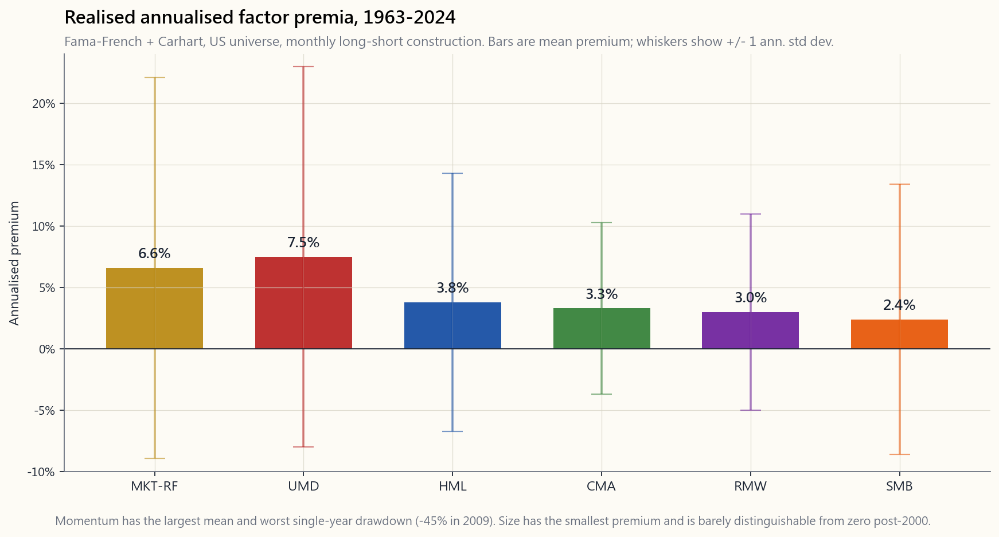
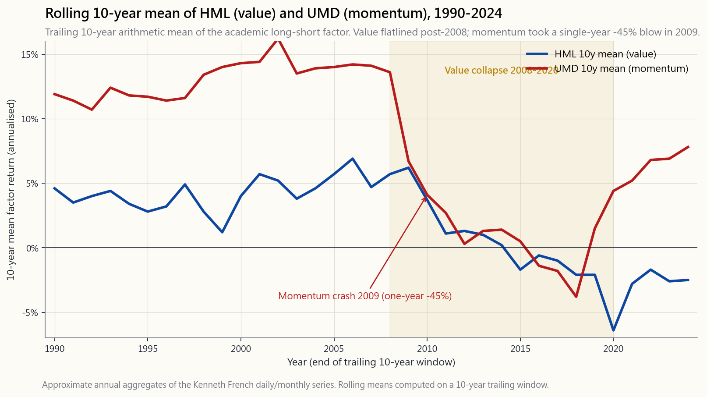

# 第二十三周：因子投资——价值、动量、质量、低波动与规模

---

## 第一部分：阅读材料

---

### 1. 为什么这一议题至关重要

半个世纪以来，资本资产定价模型（CAPM）只讲一个故事：股票跑赢债券，是因为股票承担了更多市场风险，而市场唯一奖励的，就是承担这一种风险。一个因子，一种回报，方程式到此为止。直到1990年代初，尤金·法玛与肯尼斯·弗伦奇坐下来，翻阅了CRSP数据库六十年的记录，发现这个方程式还缺了几项。小公司跑赢大公司的幅度，远超其贝塔所能解释的范围；低价（高账面市值比）股票跑赢高价股票。一旦纳入*规模*因子与*价值*因子，大多数美国共同基金残余的"阿尔法"便土崩瓦解——在数据面前，那些看起来是选股功力的东西，不过是对基金经理从未明确点名的因子的系统性敞口。到2015年，法玛与弗伦奇又加入了*盈利能力*（RMW）与*投资*（CMA）两个因子，马克·卡哈特则将*动量*（UMD）嵌入其中，共同构建出一套六因子框架，如今已能解释美国股票横截面收益约90%的变异。

这套框架之所以重要，有四个理由。

1. **它能告诉你，你的投资组合究竟是什么。** 无论你持有什么——一只共同基金、一个六四组合，还是你配偶精心挑选的"成长股"——都有因子载荷，不管你量不量它。两个贝塔相同、预期收益相同的投资组合，在下一个市场周期里的表现可能截然不同：一个重仓价值与小盘，另一个偏向质量与低波动。因子，就是你读懂底层逻辑的工具。

2. **它把结构性阿尔法与运气区分开来。** 当一位基金经理连续十年跑赢标普500指数3%，该问的不是"他们厉害吗"，而是"这3%来自哪个因子"。如果超额收益主要载荷于小盘价值，你完全可以用VBR以7个基点的费用率复制。如果载荷于动量，用MTUM即可。一旦某种所谓的"技能"能被学术因子所解释，它就不再是技能。

3. **它是为数不多的持久结构性阿尔法通道之一。** 在值得追逐的少数几个结构性错误定价机会中——流动性、板块轮动、长期趋势、买入被被动资金抛弃的资产，以及本周讨论的学术因子溢价——因子投资是最具*系统性*的，也是最*拥挤*的。这意味着它的入场门槛最低，但未来预期收益的压缩也最严重。溢价依然存在，只是比所有人都持有VLUE和MTUM之前要薄得多。

4. **它为我们在第14周讨论的2007年量化基金地震提供了框架。** 当AQR、文艺复兴，以及上百家规模较小的统计套利机构都在对同一个股票池运行相同的因子信号时，八月中旬的一次单一去杠杆事件，在四天之内蒸发了三年的收益。带杠杆的因子投资，是*拥挤交易*风险最经典的案例研究。2026年零售市场上的因子交易所交易基金没有杠杆，所以爆仓的数学逻辑温和得多——但溢价压缩的病根是一样的。

---

### 2. 你需要掌握的知识

#### 2.1 "因子"究竟是什么

因子是一个由可量化股票特征构建而成的*多空组合*。以账面市值比为例：对所有美国股票按账面市值比排名，做多最高十分位，做空最低十分位，两腿等权，每月再平衡。该多空组合的月度盈亏，就是*价值因子*（HML——高账面市值比减低账面市值比）。学术文献中每一个因子的构建方式都如出一辙：排名、做多顶端、做空底端、对冲市场。

这一构建方式至关重要，因为多空结构本身就剥离了市场因素。一只纯粹的价值共同基金，大致等于"0.9个市场敞口 + 0.4个HML敞口 + 噪音"；而学术意义上的HML，是那个单独的"0.4个HML"，市场敞口归零。因子*溢价*就是该多空组合的平均收益。现代文献中占主导地位的六个因子是：市场（MKT-RF）、规模（SMB——小市值减大市值）、价值（HML）、盈利能力（RMW——盈利稳健减盈利偏弱）、投资（CMA——保守投资减激进投资）、以及动量（UMD——上涨减下跌）。前五个构成法玛-弗伦奇五因子模型；加上UMD，便是2026年几乎所有卖方风险模型的出发点——FF5加动量框架。

#### 2.2 历史溢价一览

从1963年7月至2024年12月，美国各因子的实现年化溢价大致为：MKT-RF约6.6%、UMD约7.5%、HML约3.8%、CMA约3.3%、RMW约3.0%、SMB约2.4%。另有低波动性因子（不在法玛-弗伦奇官方体系之内，但构建方式相同：做多最低贝塔五分位、做空最高贝塔五分位），溢价约1-2%，但标准差明显更低——这正是低波动性因子在夏普比率维度上表现亮眼的原因，尽管其原始溢价看似微薄。

这份清单中有几个排名令人意外。动量是其中唯一不出自法玛-弗伦奇门下的因子，却拥有所有因子中最高的溢价，以及最惨烈的单次回撤。规模，这个开启整个文献先河的因子，溢价却是最小的，甚至在2000年之后对微盘股的非流动性做出调整后，溢价几乎无从与零区分。价值，你的财富管理顾问最先提到的那个因子，处于中游，且*过去十七年基本横盘*。

#### 2.3 2003年后的因子衰退问题

调出HML滚动10年溢价，你会看到一幅令人不安的图景：从1963年到大约2002年，该数字平均每年约+5%；此后断崖式下跌。截至2020年的滚动10年溢价为*负*。2008年至2020年间，学术意义上的价值因子——多空构建，而非价值共同基金——平均亏损。UMD的情形与之类似，只是形态不同：长期均值7-8%，被*2009年动量崩溃*打断——当市场在全球金融危机后V形触底反弹、此前跌幅惨重的垃圾股大幅拉升时，该因子在2009年全年回撤约45%（峰值至谷底约83%）。

关于溢价压缩，学界有三种竞争性解释，它们很可能都成立。第一，*发表套利*：每当一个学术因子在《金融学杂志》上发表，资金便涌入套利，买高多头腿、卖低空头腿，直至溢价收窄。同行评审论文，即是这笔交易的讣告。第二，*无形资产错量*：账面市值比是为工业经济设计的1963年式指标，它惩罚了那些账面净资产低是因为其价值体现于未资本化研发和品牌的轻资产科技公司。HML将它们识别为"贵"，而经过校正后它们未必如此。第三，*后全球金融危机时代的央行流动性*：零利率压缩了股票间的离散度，一切随大流，没有什么真正的基本面定价，也没有什么真正的便宜或昂贵。随便你选哪种理论——实证事实是溢价相对于2003年前的均值大约腰斩。

#### 2.4 2007年量化基金地震——因子拥挤的真实感受

2007年8月6日那一周，是因子拥挤的教科书式案例，我们在第14周已从配对交易的视角详细剖析过。以下是因子投资的版本。2007年，每一家量化多空机构——AQR、文艺复兴、高盛GEO，以及数十家中小型机构——运行的因子组合几乎如出一辙：做多价值、做多动量、做多质量，做空其反面，出于风险目标而施加5-8倍杠杆。8月6日，某家机构——最有可能是一家多策略基金为应对其信用账户的赎回而被迫去杠杆——开始大规模平仓标准因子组合。由于*其他所有量化基金持有同一本书*，平仓并未找到对手盘——它找到的是一百家跑着相同风险模型、在大致相同的亏损阈值下同时止损的基金。到8月10日星期五，标准因子组合已回撤约25%——三年的实现溢价，四个交易日清零。大盘涨跌不过1%，零售端的行情从未察觉。

那一周留下两条经验教训。其一，*因子敞口本身就是风险，即便因子对市场的贝塔为零*。彼时你承担的不是市场风险，而是拥挤交易风险。其二，*无杠杆的因子敞口是另一回事*。2026年的零售因子交易所交易基金没有杠杆，没有每日风险价值驱动的止损机制，可以熬过量化平仓潮，只是承受暂时的账面亏损。爆仓数学，本质上是杠杆与赎回的问题，而非因子本身的问题。

#### 2.5 2026年零售因子交易所交易基金菜单

因子文献已变得廉价且易于规模化操作。贝莱德和先锋两家，如今以8至25个基点的费用率运营着涵盖主要单因子的交易所交易基金标准菜单：

- **VLUE**（iShares MSCI美国价值因子）——价值倾斜，费用率0.08%。
- **MTUM**（iShares MSCI美国动量因子）——动量倾斜，费用率0.15%。
- **QUAL**（iShares MSCI美国质量因子）——RMW风格的质量倾斜，费用率0.15%。按规模管理资产居首。
- **USMV**（iShares MSCI美国最小波动性因子）——低波动性倾斜，费用率0.15%。
- **IWM / IJR**（iShares罗素2000 / 标普小盘600）——通过小盘敞口实现规模倾斜，费用率0.19% / 0.06%。
- **AVUV / AVDV**（Avantis美国/国际小盘价值）——规模+价值+盈利能力复合倾斜，费用率0.25%。2020年代学术因子流派的旗帜产品。

用其中四个代码，总费用率低于0.20%，你便复制了对冲基金在2003年收取2/20管理费才能提供的东西。溢价压缩了，但收割溢价的成本下降得更快——净溢价（毛溢价减费用减税务损耗）与二十年前杠杆对冲基金客户所得的净溢价大体相当。廉价的贝塔吃掉了昂贵的阿尔法。

#### 2.6 这一切在大框架中的位置

因子投资是可用阿尔法通道中最具*结构性*的，也是最缺乏*特殊性*的。它可以无限扩容（任何规模的资金都能运行），不需要特殊信息，记录它的学术文献在SSRN上免费可得。这也恰恰是溢价压缩的原因：任何人都能运行的东西，最终人人都会去运行。与之相比，"买入被被动资金流弃置的东西"（逆向板块交易）：那需要忍受不适，需要提前布局，需要在没有旁人认可的时候坚守。因子交易只需要你点击VLUE然后置之不理。市场在套利一切无需不适即可获取的溢价这件事上，效率极高。

对于你自己账户的启示：因子属于*被动核心*（基础性、主动程度最低的那一档），而非*主动部分*。适度的倾斜——将10-20%的股票配置放在QUAL或AVUV，而非市值加权的核心——即可获得大部分分散化收益，而不必承担集中因子爆仓的风险。将全部股票仓位押注于MTUM，是在承担2009年式的尾部风险；将10%放在MTUM、90%放在VTI，则能获得长期均值的80%，以及20%的尾部风险。

---

### 3. 常见误解

1. **"因子投资等同于价值投资。"** 价值只是六个因子之一。法玛-弗伦奇框架是一个*体系*：每个因子都是独立的多空组合，"因子投资者"通常持有其中多个。把因子投资称为"价值"，就像把锻炼叫做"跑步"。

2. **"规模因子溢价很高。"** SMB是主要因子中*最低*的实现溢价，年化约2.4%。大部分差距仅出现在流动性极差的微盘股最底部五分位。你常听说的"小盘效应"，其实主要是小盘*价值*效应——做工的是价值，不是规模。

3. **"动量就是1990年代流行的趋势跟踪。"** 学术意义上的UMD因子是*横截面*的：按过去12个月收益（跳过最近一个月）对股票排名，做多赢家，做空输家，每月再平衡。大宗商品领域的趋势跟踪是*时间序列*的：若资产本身上涨则做多，下跌则做空。构建方式不同，相关性不同，回撤特征也不同。

4. **"因子已死——它们不再奏效。"** 溢价已压缩，但尚未消失。即便只剩2003年前均值的一半，四因子多因子混合组合在扣除费用后，于2026年仍有正的预期超额收益。真正"死去"的是2007年的杠杆量化版本——无杠杆的零售交易所交易基金版本仍然存活，只是规模更小。

5. **"因子越多越好。"** 学术文献中已识别出超过400个"因子"，其中大多数在样本外无法复现。法玛-弗伦奇五因子加动量是审慎的共识。任何向你兜售20因子模型敞口的人，卖的都是过拟合。

6. **"低波动性之所以有效，是因为低波动性股票被错误定价。"** 或许有部分原因，但主要是因为*杠杆规避*：大多数机构投资者不能加杠杆，为了获得类似股票的收益，他们扎堆高贝塔股票，将其价格抬高、未来收益压低。低贝塔股票因此被低估。若杠杆约束消除，溢价将会收窄——这也是对冲基金"押注对抗贝塔"策略表现良好的部分原因。

7. **"质量因子与低波动性因子是同一回事。"** 两者有重叠（质量公司往往波动较低），但在压力情境下会出现分化：2008-09年，USMV风格的低波动性随整体市场一同大幅下挫，相关性趋于1；而QUAL风格的质量（高净资产收益率、低债务）则跑赢市场。定义不同，风险形态也不同。

8. **"我应该每月再平衡我的因子组合以捕捉溢价。"** 对于*单一*因子（学术构建），月度再平衡是正确的。但对于持有于零售交易所交易基金中的*多因子混合*组合，月度再平衡的税务成本往往超过再平衡本身带来的收益。对于应税账户，年度再平衡是一个合理的折衷方案。

9. **"2007年量化基金地震意味着因子投资很危险。"** 2007年那次事件的根源在于*杠杆*与*赎回驱动的去杠杆化*，而非因子本身。无杠杆的零售因子混合组合在应税账户中，并不具备相同的爆仓拓扑。风险在于*放弃收益*（因子进一步压缩），而非*灾难性损失*。

10. **"既然人人都知道因子，溢价应该归零。"** 自2003年以来溢价已腰斩，这正是"人人皆知"强形式的体现。之所以没有归零，原因有二：（a）仍有大量资本更关注基准跟踪而非因子敞口；（b）部分溢价是风险补偿，并不因风险被充分理解而消失。剩余溢价，是可套利部分被套利殆尽后的残余。

---

### 4. 问答环节

**Q1：我应该用多因子交易所交易基金取代标普500指数基金吗？**
不——保留市值加权的核心仓位，出于成本、税务和跟踪误差方面的考量，然后将10-30%的股票配置*倾斜*至因子。市值加权核心以几乎可以忽略的成本为你赚取市场溢价；因子倾斜在此之上叠加（已压缩的）因子溢价。用因子产品替换核心仓位，会承担通常并不必要的跟踪误差风险。

**Q2：哪个单一因子最好？**
从长期看，动量的毛溢价最高，波动性也最高——尾部最糟糕（2009年），均值最优。质量的夏普比率最好。价值在2026年有最充分的估值理由，因为它是跌得最惨的。按照你对哪种遗憾更能承受来选择：踏空反弹（避开动量），还是越跌越便宜（避开价值）。

**Q3：一个因子在回撤中撑多久我才应该放弃？**
久到答案应该是"我不会放弃"。HML从2007年到2020年足足回撤了*十三年*，才迎来2021-22年的价值股行情。如果你熬不过自己倾斜的因子长达十年以上的回撤，你就没有收割它的信念——你会在底部卖出，错过反弹。如果13年听起来难以忍受，就*不要倾斜*——持有市值加权指数基金。

**Q4：如果规模因子效果不明显，为什么AVUV这么受追捧？**
因为文献仍在规模与价值（以及盈利能力）的*交叉项*中发现了稳健的溢价。小盘*垃圾*股表现不佳；小盘*有盈利能力的价值*股的历史表现，明显优于单独的规模因子或价值因子。AVUV正是围绕这一交叉项构建的。

**Q5：各因子之间有相关性吗？**
有些高度相关（HML与CMA），有些负相关（历史上HML与UMD呈负相关——价值与动量互为部分对冲），有些弱相关（SMB与其他因子关系普遍较弱）。多因子混合组合之所以能获得分散化收益，正是因为各因子之间并非完全相关。HML与UMD的负相关关系，是零售混合组合中最实用的配对：一个处于回撤期时，另一个往往表现不错。

**Q6：国际因子投资有效吗？**
学术溢价在国际市场（发达市场和新兴市场）均有复现，量级相近，2003-2020年的压缩幅度也相仿。我们出于*可投资性*原因（外汇、托管、税务、信息劣势）坚持美国市场，但学术逻辑并不局限于美国，具有广泛的国际适用性。

**Q7：如何判断我的主动管理共同基金其实只是在运行因子倾斜？**
用基金月度超额收益对六个因子做回归（数据可免费从肯·弗伦奇官网下载）。若R²超过0.90且四个或以上因子载荷具有统计显著性，该基金的表现主要来自因子敞口，你应将其费用率与因子复制型交易所交易基金的成本对比。Morningstar Direct和Portfolio Visualizer均可免费进行此回归；没有理由为本质上可购买的因子混合组合向主动基金经理支付管理费。

**Q8：关于"低波动性异常"——它是免费的午餐吗？**
它是股票市场中最接近夏普比率维度免费午餐的东西，但并非真的免费。低波动性在市场狂欢阶段表现落后（参见1999年、2020-21年），且相对市值加权指数存在显著跟踪误差。该因子在完整周期内以风险调整后回报计是合算的，但在科技股主导的牛市中，相对标普500的绝对收益拖累可能在两年内达到10-15%。

**Q9：2009年动量崩溃是否彻底终结了动量因子？**
没有——2009年以后大多数年份UMD均录得正收益，2010年后的均值约为长期均值的一半（仍为正值，只是更小）。2009年的崩溃是动量收益分布的永久特征，而非一次性事件——1932年、2002年以及2020年3月均发生过类似（规模较小的）动量崩溃。持有动量，意味着接受每二十年中有一年亏损超过30%。

**Q10：我应该根据估值水平择机调整因子敞口吗？**
实证上是肯定的——克利夫·阿斯内斯的"万物价值"研究表明，因子的*估值利差*（多头腿市净率与空头腿市净率之比）能预测该因子未来5年的收益。2026年，价值因子处于其历史的便宜端（预期溢价高于长期均值），动量则接近贵端。但这是缓慢演进的覆盖层，而非交易信号——你每隔数年调整倾斜幅度的10-20%，而非每季度都动。

**Q11：因子投资与四档框架如何对应？**
因子属于第一档（被动核心）和第二档（适度主动倾斜）。它们*不*属于第三档（主动集中持仓）或第四档（凸性尾部）。因子混合组合的目标不是实现30%的复利增长——而是在适度跟踪误差下，每年为被动收益额外贡献50-100个基点。这正是第一档和第二档的职责所在。

**Q12：2026年一个合理的多因子混合组合应该是什么样的？**
一个有说服力的起点：60%的VTI（市值加权核心），10%的AVUV（小盘价值质量），10%的MTUM（动量），10%的QUAL（质量），10%的USMV（低波动性）。总费用率低于12个基点。这一配置以适中权重覆盖全部六个因子倾斜，市值加权核心占主导。年度再平衡，持有十年以上，不要因为某一倾斜出现30%回撤就卖出。能做到这一点，你便能收割学术因子溢价中剩余的大部分。
