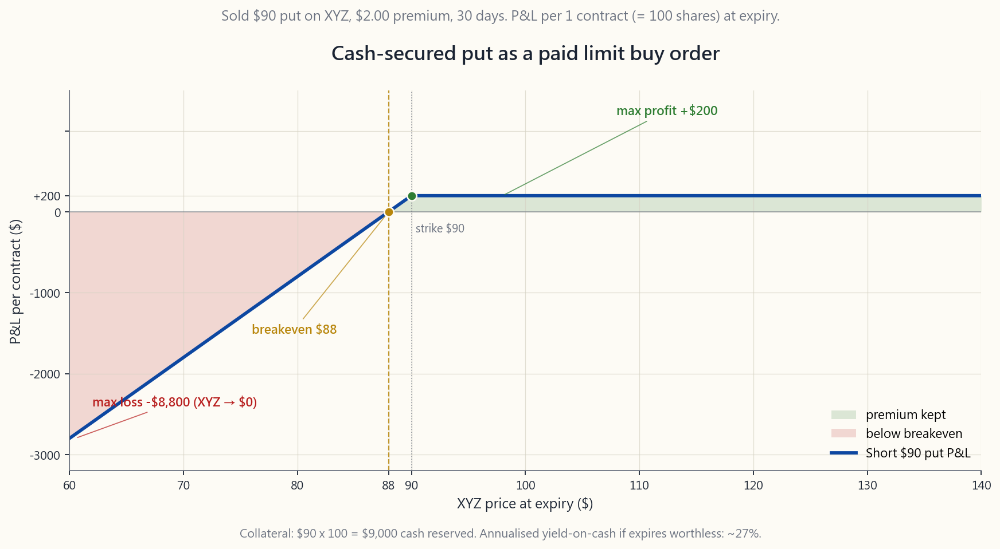
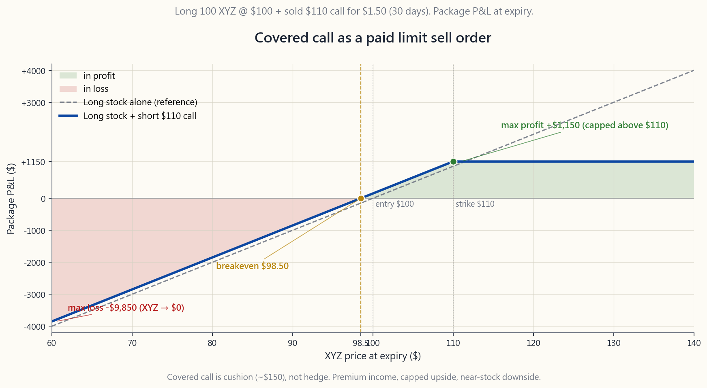

# 第26周：期权即限价单——留下指令、坐享收益

---

## 第一部分：阅读材料

---

### 1. 为何这一课至关重要

上周我们梳理了期权词汇——看涨期权、看跌期权、行权价、到期日、期权费、时间价值衰减。词汇本身是静止的。真正将期权从一种复杂工具转化为普通散户长期持有账户中得力帮手的，是正确的**心智模型**，而最正确的模型也是最简单的：**卖出一份期权，就是一张委托给市场、还附带报酬的限价单。**

在90美元行权价卖出一张现金担保看跌期权，与你本就会交给券商的指令完全相同——*"我愿意以90美元买入100股XYZ"*——区别在于，市场会在这份指令挂单等待期间额外付给你一张支票。以110美元卖出一张备兑看涨期权，就是*"我愿意以110美元卖出我持有的XYZ"*，同样附带一张支票。触发价格相同，低买高卖的纪律相同，再加上指令尚未成交期间产生的收益。

这一点在四个具体层面上都至关重要：

**(1) 闲置现金是真实的机会成本，并非免费的选择权。** 大多数散户投资者会将一笔"等待部署"的资金停放在货币市场或短期国债基金中，吃的是当前短端利率。这是**机会成本的下限**；而针对你真心希望持有的标的，以目标价卖出一张现金担保看跌期权，同样的现金就能发挥两到三倍的效用，对应同一个目标买入价格。期权费并非额外奖励——而是你的现金在等待期间**本就应该**赚取的回报。

**(2) 卖出决策情绪成本高昂；为预先承诺领取报酬则成本极低。** 每位长期持股的投资者都有过"我早该卖掉"的懊悔。备兑看涨期权在平静时刻提前锁定卖出价格，并为你坚守承诺支付报酬。期权费在制度层面，相当于你提前支付给自己的一笔顾问费——用以约束自己**不随意移动目标线**。

**(3) 这是杠铃策略中L2层的核心收益战术。**
陈马的杠铃策略一端持有高确信度的安全资产，另一端布局非对称的投机头寸；关键问题是两端**之间**的资产整日在做什么。这些资产存放于L2（"高质量纯多头、永续复利公司"）仓位，通过在持有者本就会行动的价格边界卖出备兑看涨期权和现金担保看跌期权来赚取期权费。L2仓位是杠铃的收益引擎，而这份收益是被精心设计出来的，而非寄托于运气。

**(4) 期权首先是税务工具，其次才是杠杆工具。**
卖出备兑看涨期权可以在**不卖出股份**的前提下降低持仓的实际敞口——投资组合的delta下降，但应税的税务批次不发生变动。卖出现金担保看跌期权则可以跨多个到期日，以特定目标价格分批建仓，每次到期未成交即可将期权费入账，逐步摊低未来买入的成本基础。对于一位成功的长期投资者而言，最大的隐性成本是资本利得税；将期权视为限价单的思维框架，正是管理这一成本的起点。

本周我们将逐步拆解其中的机制。第27周将深入讲解备兑看涨期权——行权价选择、时间价值捕捉、何时展期。第28周则以同样的深度剖析现金担保看跌期权与滚动策略。

---

### 2. 你需要掌握的内容

#### 2.1 参考账户——5万美元账户，持有100股XYZ，每股100美元

为使每个示例都有统一的资产负债表作为参照，请设想一个**5万美元账户**，持有**100股XYZ**——一只类SPY的交易所交易基金，当前报价为每股100美元。其中股票价值1万美元，现金4万美元。这一规模足以同时演示两种策略：有100股可供卖出备兑看涨期权，也有充足的现金在几乎任意行权价上担保看跌期权。

本课将使用两个具体的行权价：

- **90美元现金担保看跌期权**（低于当前价10%）。所需担保金：
  90美元 × 100 = **9,000美元**，来自4万美元现金仓位。
- **110美元备兑看涨期权**（高于当前价10%）。所需担保：
  已持有的100股股票本身。

XYZ的隐含波动率处于合理水平，因此近月期权看跌端约支付2.00美元，看涨端约支付1.50美元。以下所有示例均沿用这两个数字。收益结构图见
[course/image/week26_csp_payoff.py](course/image/week26_csp_payoff.py)
与 [course/image/week26_cc_payoff.py](course/image/week26_cc_payoff.py)，
交互式演练见
[interactive/week26_orders_lab.html](interactive/week26_orders_lab.html)。

#### 2.2 现金担保看跌期权：本质是一张限价买单

现金担保看跌期权（CSP）是你在普通操作中早已用过的指令。普通版本就是一张限价买单：*"以90美元或更低价格买入100股XYZ，长期有效。"* 在订单等待成交期间，预留的9,000美元将在券商现金账户中赚取活期利率。

CSP版本是同一指令，附加了到期日和一张支票：

> *"我愿意以90美元买入100股XYZ。这里有9,000美元担保金。请支付我200美元，以换取这份指令在未来30天内保持有效。"*

结果只有三种，且仅有三种：

1. **到期时XYZ收盘价高于90美元。** 看跌期权到期作废。你保留200美元期权费，9,000美元担保金释放。现金年化收益率：200 / 9,000 × (365/30) ≈ **27.0%**。你可以继续卖出下个月的看跌期权。
2. **XYZ收盘价介于88至90美元之间。** 期权被行权：你以90美元买入100股。有效成本基础 = 90 - 2 = **每股88美元**，低于股票的实际成交价。你以低于自己设定的限价的价格买到了股票。
3. **XYZ收盘价低于88美元。** 同样被行权，同样是每股88美元的有效成本基础，但此时账面出现浮亏。下行风险与在90美元挂限价单成交完全相同，*但多了2美元的缓冲*。最坏情形（XYZ归零）：亏损 -8,800美元，而限价单对应的是 -9,000美元——CSP在任何情形下都更优。

图片脚本 `week26_csp_payoff.py` 对60至140美元区间内的盈亏曲线进行了着色，并标注了盈亏平衡点、最大收益和尾部亏损。

实事求是的表达：**在盈亏角度，现金担保看跌期权在任何情形下都不劣于同一行权价的限价单**，代价是唯一一项成本——期权有到期日，限价单没有。如果你的触发价格是一条六个月后依然有意义的硬性底线，CSP就自然演变为一种滚动纪律：旧的到期后，当天卖出新的。

#### 2.3 备兑看涨期权：本质是一张限价卖单

备兑看涨期权（CC）是卖出方向上的镜像。普通版本：限价卖出100股XYZ，目标价110美元，长期有效。期权版本：

> *"我愿意以110美元卖出我持有的100股XYZ。股票本身是担保品。请支付我150美元，以换取这份指令在未来30天内保持有效。"*

三种结果：

1. **XYZ收盘价低于110美元。** 看涨期权到期作废。你保留100股和150美元期权费。150美元相对于10,000美元持仓价值，30天期间收益率为1.50%，年化约 **18.3%**。
2. **XYZ收盘价恰好为110美元。** 股票被行权（你的股票被卖出），报价110美元。总收入：110美元 + 1.50美元期权费 = **每股111.50美元**，即持仓总收入11,150美元。高于10,000美元初始成本1,150美元。
3. **XYZ收盘价高于110美元。** 同样被行权，同样获得111.50美元的每股收益。XYZ超出111.50美元的涨幅你将无缘享有——这是你接受期权费时所承担的代价。图片 `week26_cc_payoff.py` 展示了收益在股价 ≥ 110美元时封顶于 +1,150美元的结构。

下行风险与直接持股几乎相同，仅少了1.50美元的缓冲：XYZ归零时，持仓价值为 -10,000 + 150 = **-9,850美元**，而未卖出看涨期权的持有者则是 -10,000美元。备兑看涨期权不是对冲工具——期权费远不足以构成保护——但它是缓冲垫、收入来源，以及一份预先承诺的退出计划，三者合于一张交易单。

#### 2.4 逐步拆解机制

课程示例月的第0天：

1. **账户快照。** 5万美元：100股XYZ，每股100美元（= 1万美元股票）+ 4万美元现金。XYZ近月90美元看跌期权买价2.00美元，110美元看涨期权买价1.50美元，均距到期日30天。
2. **卖出开仓90美元看跌期权。** 点击"卖出开仓"；券商冻结9,000美元现金作为担保金；200美元立即入账。现金仓位变为：4万美元 - 9千美元已冻结 + 0.2千美元期权费 = 3.12万美元自由 + 9千美元锁定 + 0.2千美元已入账收益。
3. **卖出开仓110美元看涨期权。** 券商冻结100股股票作为担保品；150美元入账。这100股在看涨期权存续期间不可卖出（否则将成为裸空头），但仍可正常获得股息，价格照常波动。截至目前总收益：**350美元**——一个5万美元账户，两次点击，相当于净资产的70个基点，年化约8.4%，而两笔"交易"均锚定在你本就想要交易的价格上。
4. **等待30天。** 等待期间每周检查一次持仓，而非每天盯盘。XYZ在98美元——无需操作。在92美元——无需操作。在115美元——看涨期权已进入实值区间，到期日股票将被行权，恰如指令所设。在86美元——看跌期权进入实值区间，将以90美元被行权买入100股，同样恰如指令所设。
5. **到期日。** 券商自动结算。看涨期权被行权：股票交割，11,000美元入账。看跌期权被行权：9,000美元离账，100股XYZ到账。具体结果取决于XYZ的收盘价，可能是其中一种，也可能两者均发生，或均未发生。

无需持续监控，无需盯图，无需管理止损单。指令自动执行。唯一需要主动操作的步骤是次月再写下一对指令。

#### 2.5 现金收益率："坐等领钱"实际能领多少

真实的收益比较应基于**每笔交易实际占用的资金**所产生的收益率，而非整个账户的收益率。

90美元CSP，期权费2美元，期限30天：

- 占用资金：9,000美元担保金。
- 期权费：200美元。
- 期间收益率：200 / 9,000 = **2.22%**（30天内）。
- 年化（简单，按365天）：2.22% × (365/30) ≈ **27.0%**。

这个引人注目的年化数字是期权卖出策略营销材料最热衷引用的数字。但它在两个维度上具有误导性：

1. **27%仅在期权到期作废时实现。** 一旦被行权，"收益"不再是现金收益——它已转化为股票持仓，其回报取决于股票本身，而非期权费。更诚实的数字是**预期**年化收益率：期权费收益率 × 到期作废概率 + 被行权后持股预期收益 × 被行权概率。
2. **27%在被行权的月份并不成立。** 如果你在某月以90美元被行权，而XYZ当月收于80美元，该持仓将有1,000美元的账面亏损，而收入仅200美元——该月净结果为负，而非27%正收益。

110美元CC，期权费1.50美元，期限30天：

- 占用资金：10,000美元股票市值。
- 期权费：150美元。
- 期间收益率：150 / 10,000 = **1.50%**（30天内）。
- 年化：1.50% × (365/30) ≈ **18.3%**。

正确解读这些数字的方式：它们是期权叠加策略收益贡献的**上限**——即什么都没发生的月份里你所获取的金额——且只有在什么都没发生时才能描述完整的收益情况。在被行权的场景中，备兑看涨期权除期权费本身外不带来任何额外收益；现金担保看跌期权则直接转化为持有底层股票的收益。

#### 2.6 在杠铃策略中的定位

陈马的投资组合是一个杠铃：一端是安全资产（现金、短期国债、黄金、深度实值的长期看涨期权），另一端是结构性阿尔法投机头寸。分散化的市值加权"核心"仓位已被移除。但这并不意味着两端之间空无一物。你**愿意持有、也愿意以已知价格卖出**的高质量长期持股，存放于L2收益仓位，而L2收益仓位几乎完全依靠备兑看涨期权和现金担保看跌期权来运作。

CSP/CC组合是L2仓位的收益来源。没有这一叠加策略，L2仓位不过是一个缓慢复利、仅靠1-2%股息的持仓。加入叠加策略后，在什么都不发生的月份，L2仓位可在股息之外额外产生8-15%的期权费收益；而一旦发生行权，则恰好在持有者预先承诺会行动的价格上回归被动多头敞口。

这正是为何我们将本课视为基础课而非进阶课。杠铃的形态需要这台引擎才能在经济上成立；若没有它，安全端的拖累将淹没投机端的回报。

#### 2.7 在税务架构中的定位

备兑看涨期权还承担着第二项职能，其价值至少不亚于收益本身，却鲜少被人提及：它让你**在不卖出股份的前提下降低实际敞口**。一个持有3年浮盈的100股仓位，在其上卖出备兑看涨期权——股票未被卖出，无需确认应税收益，但整体持仓的delta已从1.0降至约0.3。你在做空波动性的同时，这批税务批次继续累积时间以待享受长期资本利得税率（或在税收优惠账户中继续免税复利）。

现金担保看跌期权则在建仓端发挥对等作用：它让你**跨多个到期日以目标价格逐步建仓**。每次到期后期权作废，就把短期收益（在应税账户中按普通所得税率征税，最好在个人退休账户中操作）装入口袋，同时降低最终买入的有效成本基础。今天入账的期权费，只有在税收庇护账户中操作，才比五年后确认的资本利得更有价值——这也正是为何本策略与个人退休账户（IRA）简直是天生绝配。

在罗斯个人退休账户中，期权费全程免税，策略可免税复利增长。在传统个人退休账户中，同样的收益享有税收递延待遇。在应税账户中，期权卖出收益按普通所得税率计征短期资本利得税，每月如此，因此在决定是否启用该叠加策略之前，必须将这一税务拖累从标题收益率中扣除。

---

### 3. 常见误解

1. **"卖出看跌期权是看空，类似于做空股票。"** 恰恰相反。做空股票在股价下跌时盈利，股价上涨时亏损；而卖空看跌期权在股价**持平或上涨**时盈利，在大幅下跌时亏损，且亏损底部锚定在行权价减去期权费。卖空看跌期权 = 中性偏多，而非看空。

2. **"看跌期权的期权费是白捡的钱——往越虚值的位置卖越好。"** 极度虚值的看跌期权相对于所占用资金几乎不产生收益。随着行权价与当前价格距离越来越远，期权费与担保金的比率急剧下降，而这些尾部看跌期权唯一"发挥作用"的时刻恰恰是被大幅打穿的时候。不要追逐期权链末端的"彩票"。

3. **"备兑看涨期权对下行有对冲效果。"** 并没有。1.50美元的期权费只是1.50美元的缓冲——有帮助，但远不足以保护你。如果XYZ从100美元跌至80美元，备兑看涨期权持有者亏损1,850美元，而非2,000美元。两者差距微乎其微。如果你想要对冲，请买入看跌期权（第29周）；如果你想要收入加预承诺退出，请卖出看涨期权。

4. **"永远不应该被行权。"** 被行权就是**限价单成交了**。如果你真心想在90美元买入或在110美元卖出，行权正是你本来要做的交易——而非失败的信号。把被行权视为需要不惜一切代价规避的事，会导致为了逃避本来要捕捉的成交而无限期展期期权。

5. **"年化收益率 = 实际收益率。"** 一张30天看跌期权27%的年化数字，并不意味着每年真的能赚27%。它只是你在**什么都没发生的月份**所收到的收益，乘以假设这种状态永续不断的倍数。全年的实际收益率始终包含你**被行权的月份**，那些月份的净效果是"持股回报加缓冲"，而非27%的期权费。

6. **"你需要全天盯盘。"** 恰恰相反。每一个需要决策的步骤都是独立的操作：卖出开仓，然后视情况提前平仓，然后等待到期。大多数CSP/CC策略的执行者每月花15到30分钟，其余全部交给券商结算。持续监控在这里是**不良操作**——它会诱使你干预一笔运行良好的交易，反而弄巧成拙。

7. **"卖出期权有无限风险。"** 裸期权才有。现金担保看跌期权和备兑看涨期权则不然——两者均有明确的亏损上限。CSP的最大亏损为`(行权价 × 100) - 期权费`；CC的最大亏损为底层股票归零所带来的亏损，*减去*已收到的期权费。两个数字在下单时均可完整计算。

8. **"期权收益让长期投资变得无关紧要。"** 期权费收益是真实的，但它是**补充**，而非替代。长期财富的主体仍来自股价升值和股息。期权叠加策略将7%的预期收益提升至9-12%；它并不能将其变成30%。

9. **"这不过是卖保险——长期肯定亏。"** 这是对保险公司的经典批评，如果你在无对冲账户上卖尾部风险，这个批评是成立的。CSP和CC并非裸露的尾部期权卖出——两者均已完全担保，且CSP的担保金锚定在**你自己选择的**、针对**你真心想持有的**股票的行权价上。非对称优势在你这边。

10. **"任何股票都可以这么做。"** 不对。你只能在满足以下条件的股票上操作：(a) 期权链流动性充足（买卖价差紧、未平仓量合理）；(b) 你真心愿意在凌晨三点穿着睡衣持有的品种和价格；(c) 隐含波动率处于合理区间（不能低到期权费不值得，也不能高到被行权风险压倒一切）。对大多数散户账户而言，这个范围约为二十个标的，主要是美国大盘股交易所交易基金和家喻户晓的龙头个股。

---

### 4. 问答环节

**问题1：现金担保看跌期权与裸看跌期权有何区别？**

答：担保金。现金担保看跌期权要求账户中预留足额现金（行权价乘以100），一旦被行权，现金直接完成购股，无需使用保证金。裸看跌期权仅需缴纳券商要求的保证金，远低于足额担保金。现金担保看跌期权在个人退休账户中是被允许的；裸看跌期权则需要保证金账户和更高级别的期权交易权限。对于学习本策略的散户投资者而言，始终选择现金担保模式。

**问题2：为什么选30天？而非7天或90天？**

答：时间价值衰减（theta）——期权时间价值的损耗在21至45天区间内最为迅速。7天期权每单位占用资金的期权费极低；90天期权每张支付的美元数量更多，但每日时间价值损耗更慢，且将担保金锁定的时间更长。30至45天的区间在过去数十年间一直是散户期权卖方的"甜蜜点"，目前没有充分理由认为这一规律会改变。

**问题3：如果我的CSP被行权，但我不再想持有这只股票，该怎么办？**

答：这是一个投资组合管理问题，而非期权问题。立即卖出被行权买入的股票，扣除期权费后计算盈亏，并停止在该标的上继续卖出看跌期权。纪律应在卖出看跌期权**之前**就已确立：只在你真心乐意以行权价持有的股票上卖出CSP。如果你的判断已经改变，请在到期前买入平仓，而不要等到被行权。

**问题4：我可以在到期前提前平仓吗？**

答：可以，通过"买入平仓"随时操作。一个常见的经验法则：如果期权在距到期还有数周时已损失了50-80%的价值，买入平仓锁定已实现收益，再写下一张。反过来——期权价格对你不利地翻倍——这时需要认真思考你是否仍然接受在该行权价被行权。如果不接受，以亏损买入平仓，重新规划。

**问题5：为什么课程一直强调"100股"而非其他数量？**

答：一张美国股票期权合约代表100股，这是合约规格——没有更小的单位。如果你想要50股的敞口，期权并非合适的工具，请使用限价单。如果你想要250股的敞口，可以卖出两张合约，再用限价单补足剩余50股。

**问题6：这个策略在牛市还是熊市中效果更好？**

答：两种市场各有不同表现。在缓慢攀升的牛市中，双边均不太会被行权：看跌期权频繁到期作废（你保留期权费），看涨期权有时在目标价被行权（你以目标价加期权费卖出）。在熊市中，看跌期权会在事后看来偏高的行权价被行权，但被行权本就是你设定的交易；看涨期权则到期作废并带来收益，缓冲回撤。**效果较差的情形**：快速垂直拉升行情——你的备兑看涨期权将你的收益封顶在行情之下——以及急剧崩跌——你的CSP在远高于市场的行权价被行权。

**问题7："5万美元账户持有100股XYZ"——这是笔误吗？**

答：刻意设计的锚点。一张期权合约控制100股；你不能对不足百股的仓位卖出备兑看涨期权。"5万美元账户"是现实的散户资产负债表——5万美元可以轻松支持一张备兑看涨期权和一张现金担保看跌期权（针对100美元股票），同时保留约3万美元的自由现金。规模较小的账户通常只卖出看涨期权**或**看跌期权，而非同时双开。

**问题8：税务方面——每个月都要缴短期资本利得税？**

答：是的，在应税账户中，每笔入账期权费均按普通所得税率计征短期资本利得税，每月如此。这正是为什么本策略更适合在税收优惠账户（传统个人退休账户、罗斯个人退休账户）中运作——期权费收益在这些账户中可免税复利增长。在应税账户中，税后收益比标题数字低30-40%。

**问题9：我的券商拒绝了我的"卖出开仓看跌期权"指令，为什么？**

答：几乎可以肯定是期权交易权限级别不够。券商对期权权限实行分级管理：一级仅允许备兑看涨期权；二级新增买入看跌/看涨期权；三级新增现金担保看跌期权和信用价差；四级新增裸期权。现金担保看跌期权至少需要二级或三级权限。申请一次，注明本策略用途，对于有一定交易经验的散户账户，审批通常是例行程序。

**问题10：滚动策略——交替操作CSP和CC——与本课讲的是同一件事吗？**

答：是的，滚动策略正是本课循环运行的策略：持续卖出CSP直至被行权，然后对被行权买入的股票卖出CC直至被行权卖出，再重新卖出CSP。我们将在第28周深入讲解滚动策略——届时两边均已单独吃透（第27周讲CC，第28周讲CSP）。本周是概念的开锁；未来两周是操作手册。

**问题11：隐含波动率刚刚飙升——我应该多卖一些期权吗？**

答：需要谨慎。高隐含波动率意味着期权费更高，这是显而易见的吸引力。但高隐含波动率同时也意味着市场正在为真实的大幅波动定价，对应的被行权概率也相应提高。一个有用的框架：高隐含波动率是市场为你承保的额外风险支付公平价格，而非免费午餐。相应调整仓位规模。

**问题12：股息会使备兑看涨期权复杂化吗？**

答：有可能。美式看涨期权可以提前行权——尤其是当股息金额超过看涨期权剩余时间价值时，往往在除息日前一天被提前行权。届时股票将被提前卖出，股息归新持有者所有。为避免这一情况，可在除息日前展期看涨期权，或只在时间价值缓冲明显超过即将到期股息的股票上卖出备兑看涨期权。大多数交易所交易基金（如SPY等）按季度分红，通常远低于典型的期权时间价值，因此这一问题在实践中极少出现。

---

## 第二部分：YouTube脚本

---

**视频标题：** 期权即限价单——留下指令、坐享收益（第26周）
**目标时长：** 约18分钟
**主持人：** 陈马、小鱼

---

[开场白 — 0:00]

[VISUAL: 片头卡片。"第26周 - 期权即限价单 - 坐等领钱。"柔和色调背景，叠加90美元看跌期权和110美元看涨期权的交易单图案。]

**小鱼：** 欢迎回来。这是第26周，期权系列的第二周。上周我们学了词汇——看涨期权、看跌期权、行权价、时间价值衰减。这周我们要打开那个真正的心智模型，让这些词汇在真实账户里用得起来。

**陈马：** 这个模型就是一句话。卖出一份期权，就是一张委托给市场、还附带报酬的限价单。现金担保看跌期权是一张附带支票的限价**买单**。备兑看涨期权是一张附带支票的限价**卖单**。触发价格相同，低买高卖的纪律相同，再加上指令挂单等待期间产生的收益。

**小鱼：** 这比"卖出期权"听起来没那么吓人多了。

**陈马：** 因为说的是同一件事，只是说得更诚实。大多数散户早就知道怎么下限价单了。我们要说明的是，期权版本在盈亏角度是严格升级的——任何情形下都不更差，有时更好——只有一项特定的代价，我们会讲清楚：期权有到期日，限价单没有。

---

[参考账户 — 1:30]

**小鱼：** 先把贯穿全程的示例搭起来。

**陈马：** 设想一个5万美元的账户。我们把数字控制得简洁一些：100股XYZ——可以把它理解成一只类SPY的交易所交易基金——每股100美元。也就是1万美元股票加4万美元现金。规模足够同时卖出一张备兑看涨期权和一张现金担保看跌期权，完全没压力。

**小鱼：** 我们选的两个行权价是？

**陈马：** 当前价格上下各10%。我们愿意以90美元买入更多XYZ，也愿意以110美元卖出这100股。这不是随机挑的数字——这是在课程开始之前，我们就已经设定好的"我愿意在这个价格交易"的目标价。

**小鱼：** 期权费呢？

**陈马：** 近月合约，距到期日30天。90美元看跌期权每股支付2.00美元，一张合约200美元。110美元看涨期权每股1.50美元，一张合约150美元。两次点击，5万美元账户进账350美元，而两笔"交易"都锚定在你本就想要交易的价格上。

[VISUAL: 账户资产负债表出现。股票1万美元，现金4万美元。两张交易单滑入："卖出90美元看跌期权 -> +200美元"和"卖出110美元看涨期权 -> +150美元"。收益计数器跳至：350美元。]

---

[现金担保看跌期权操作拆解 — 3:30]

**小鱼：** 先讲现金担保看跌期权。我点击卖出开仓之后，机制上发生了什么？

**陈马：** 三件事。第一：券商从你的4万美元现金仓位中冻结了9,000美元。这是行权价90美元乘以100股。第二：200美元期权费今天、立刻入账。第三：你现在持有一份合约义务——如果XYZ在到期日收盘价低于90美元，你必须以90美元买入100股。

**小鱼：** 用大白话说，这就是……

**陈马：** ……和你本就会免费交给券商的指令完全一样。"以90美元或更低价格买入100股XYZ。"限价单做这件事，分文不收。CSP做同一件事，还多给你200美元。

[VISUAL: image/week26_csp_payoff.png — 有阴影区分的收益结构图，横轴60至140美元，90美元以上最大收益200美元，盈亏平衡点88美元，XYZ归零时最大亏损8800美元。]

**小鱼：** 慢慢走三种结果。

**陈马：** 第一种结果，也是最常见的：XYZ收盘96美元。看跌期权到期作废，9,000美元担保金释放，你保留200美元。这笔资金实际占用期间的年化收益率：200美元 / 9,000美元 × 30天，是2.22%，乘以12，约27%。这是标题数字——我们会直接告诉你，它只描述什么都没发生的月份。

**小鱼：** 第二种结果呢？

**陈马：** XYZ收盘恰好89美元。你被行权：以90美元买入100股，9,000美元离账，100股XYZ到账。但你的**有效**成本基础是90美元减去2美元期权费——也就是88美元。你刚刚以低于股票实际印出价格的价格买到了XYZ。CSP给了你相对于同一行权价限价单的折扣。

**小鱼：** 第三种结果——坏的那种？

**陈马：** XYZ收盘80美元。同样被行权，同样是每股88美元的有效成本基础。现在你账面亏损800美元。但你看：同样在90美元挂限价买单的投资者，处境**完全一样**，只是多亏了200美元。CSP在任何情形下都不比限价单更差。最坏的情形——XYZ归零——亏损8,800美元，而限价单是9,000美元。

[VISUAL: 并排对比。"限价买单90美元 / 成交价90美元 / 最坏情形 -9,000美元" vs. "CSP 90美元行权价 / 有效价格88美元 / 最坏情形 -8,800美元"。绿色箭头从限价单指向CSP，标注"任何情形下均 +200美元"。]

---

[备兑看涨期权操作拆解 — 7:30]

**小鱼：** 现在翻转过来。备兑看涨期权。

**陈马：** 卖出方向上，概念完全对称。你持有100股XYZ，每股100美元。你愿意以110美元卖出。普通版本是一张限价卖单——不花钱，也不赚钱。期权版本是：我以110美元卖出，股票本身是担保品，请支付我每股1.50美元，换取这份指令在未来30天保持有效。

**小鱼：** 三种结果呢？

**陈马：** XYZ在105美元。看涨期权到期作废。你保留100股，保留150美元。150美元相对于1万美元股票持仓，30天收益率1.5%，年化18%——同样前提是什么都没发生，这个前提我们马上会说清楚。

[VISUAL: image/week26_cc_payoff.png — 收益结构图，行权价以上封顶于+1,150美元，盈亏平衡点98.50美元，XYZ归零时延伸至-9,850美元。]

**小鱼：** XYZ到112美元？

**陈马：** 被行权。股票以110美元交割，你保留150美元期权费。每股总收益111.50美元，持仓总收益11,150美元。相对于1万美元股票持仓，盈利1,150美元——11.5%——这是备兑看涨期权组合在这笔交易中所能赚取的**最大值**。

**小鱼：** 如果XYZ涨到130美元呢？

**陈马：** 同样是11,150美元。110美元以上的涨幅属于买入你看涨期权的对手方。这是运行这一策略的代价：你的上行空间被封顶在行权价加期权费。交换的是，你收取了封顶的报酬。

**小鱼：** 那下行呢？

**陈马：** 股票跌至80美元，持仓价值8,000美元加150美元期权费，净值8,150美元，相对于1万美元成本，亏损1,850美元。若不卖出看涨期权，亏损将是2,000美元。备兑看涨期权是**缓冲垫**，不是对冲工具。150美元在20%跌幅面前救不了你——但它是真实存在的，每月滚动叠加，积少成多。

[VISUAL: 缓冲垫vs.对冲工具图示。"缓冲垫：最差月份150美元。对冲工具：买入看跌期权——第29周。"箭头区分两者。]

---

[双开操作 — 11:00]

**小鱼：** 好，带我们走一遍**同时开两边**的交易。

**陈马：** 第0天，同样是5万美元账户。两次点击。卖出开仓90美元看跌期权——冻结9,000美元现金，进账200美元。卖出开仓110美元看涨期权——100股被冻结为担保品，进账150美元。总收益：350美元。账户的**敞口**没有变化——你仍持有100股XYZ，仍有4万美元现金——但你已经递交了两份预承诺，市场会免费替你执行。

**小鱼：** 接下来30天是什么感觉？

**陈马：** 每周检查一次持仓，不要每天盯盘。XYZ在98美元——什么都不做。在103美元——什么都不做。在115美元——看涨期权已进入实值，到期日股票将被行权；别慌，这正是你设定好的交易。在86美元——看跌期权进入实值，你将以90美元被行权买入股票；同样，这正是你设定好的交易。

**小鱼：** 到期日当天呢？

**陈马：** 券商自动在夜间结算。两张合约各自独立被行权，或未被行权，或其中一张。你醒来后，账户里的现金和股票组合反映了价格走势的结果，外加第0天就已入账的350美元。然后写下次月的一对新指令。

[VISUAL: 时间轴图示。第0天：卖出两张合约，进账350美元。第1至29天："每周检查，无需操作"。第30天：结算——四格面板，展示（被行权/未被行权）×（被行权/未被行权）的各种组合。]

---

[互动演练 — 13:00]

**小鱼：** 展示一下互动工具。

**陈马：** 这是互动文件夹里的 `week26_orders_lab.html`。顶部选择CSP或CC。拖动当前价格、行权价、期权费和距到期日天数的滑块。收益结构图实时重绘，盈亏平衡点和最大收益重新计算，"现金年化收益率"数字同步更新。

[VISUAL: 屏幕显示 interactive/week26_orders_lab.html。从CSP切换至CC；将行权价从90美元向下拖至85美元，观察期权费隐含收益率下降；将距到期日天数从30天缩短至7天，观察年化收益率上升但实际美元收益下降。]

**小鱼：** 玩这些滑块能学到什么？

**陈马：** 两点。第一：缩短到期时间，现金收益率**上升**——那是期权链中时间价值衰减最快的区间——但美元收益**下降**，所以你用更频繁的操作换来每张更少的收益。第二：把行权价移得越虚值，期权费的崩塌速度比被行权概率的下降快得多。30至45天、虚值约5-10%的区间，几十年来一直是散户期权卖方的舒适地带。这个工具让你用自己的手感受到为什么。

---

[杠铃策略与税务框架 — 15:30]

**小鱼：** 这一切在更宏观的投资哲学里处于什么位置？

**陈马：** 两个位置。第一，杠铃策略。杠铃一端是高确信度的安全资产，另一端是非对称的投机头寸；中间的L2仓位是你愿意持有、也愿意以已知价格卖出的高质量长期标的。这个仓位几乎完全靠备兑看涨期权和现金担保看跌期权来运转。CSP/CC组合是L2仓位的收益引擎。

**小鱼：** 第二个位置呢？

**陈马：** 税务。长期投资中最大的隐性成本是资本利得税。备兑看涨期权让你在**不卖出股份**的前提下降低赢家持仓的实际敞口；税务批次继续累积时间，delta同时下降。现金担保看跌期权让你跨多个到期日以目标价逐步建仓——每次到期作废，就多进账一笔期权费，摊低最终的入场成本。两者配合罗斯个人退休账户或传统个人退休账户一起用，收益免税复利增长。在应税账户中，必须先把普通所得税的影响扣掉，标题收益率才是真实的。

[VISUAL: 杠铃示意图，标注"安全端"、"L2收益（CC + CSP）"、"非对称边缘"。箭头指向L2："本课住在这里。"]

---

[结语 — 17:00]

**小鱼：** 一句话总结是什么？

**陈马：** 卖出期权就是一张附带支票的限价单。支票是收益。代价是到期日。纪律是——只在你真心想以行权价持有的标的上卖看跌期权，只在你本就会预先承诺的退出价格上卖看涨期权。如果你愿意行动，就为这份意愿收取报酬。

**小鱼：** 下周呢？

**陈马：** 第27周，备兑看涨期权深度拆解。行权价选择、何时展期、看涨期权深度进入实值时怎么办，以及如何在L2多个标的组成的投资组合中合理配置备兑看涨期权。然后第28周用同样的力度剖析现金担保看跌期权，第29周以保护性看跌期权和领口策略收尾这一期权系列。

**小鱼：** 下周见。

[VISUAL: 结束卡片。"下集预告：第27周 — 备兑看涨期权深度拆解。"]

[结束 — 17:55]