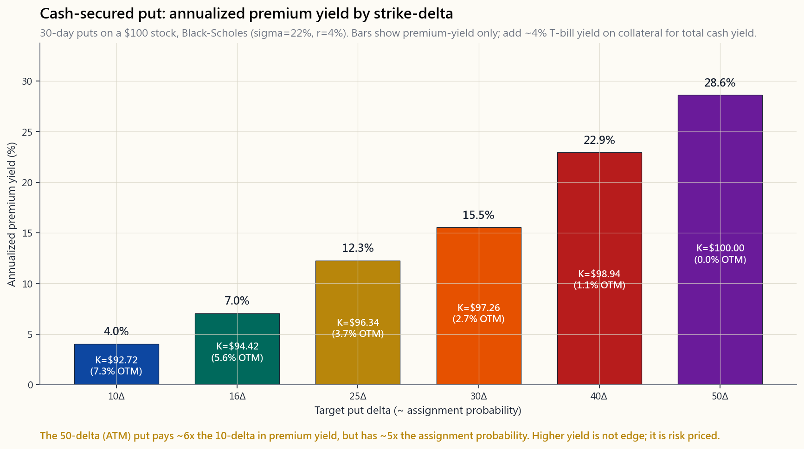

# 第二十八周：现金担保看跌期权——收钱挂出更低的买入价

---

## 第一部分：阅读材料

---

### 1. 为什么这很重要

现金担保看跌期权（CSP）是散户期权交易中最诚实的一种操作。你预留相当于100股全额购股价的现金，向市场表明"如果这只股票在未来30天内跌到X美元，我就买入"，而市场会为你挂出这笔买单而支付几百美元。如果股票跌至你的目标价，你就按那个价格买入——正是你想要的价格，再减去期权费。如果没有跌到，你保留现金，再写一份。没有杠杆，没有裸露头寸，没有复杂理论。这就是一个带租金的限价买入单。

大多数散户接触CSP，都是通过那些把它包装成"收益农场机器"的不良网红——"让你的闲置现金年化赚30%！"这种框架是错的。正确的框架，也是陈马在本课中使用的框架，是：**CSP是你对自己本就想持有的股票的出价方式。** 期权费不是你的优势。相对于你真正想买入的价格所获得的折扣，才是你的优势。如果你发现自己在卖那些根本不想接货的股票的看跌期权，你已经不再是在做CSP了——你在经营一家加了几道工序的赌场，而庄家迟早会找上门来。

这节课之所以重要，有四个原因：

**1. CSP是表达耐心最干净的方式。** 市场奖励能够等待的投资者。大多数散户做不到——他们在CNBC喧嚣时买入，在屏幕一片红时僵住。CSP将你的纪律锁定下来。行权价是你的耐心价位。30天到期是你的冷静期。期权费是你不追涨的回报。

**2. 它让闲置现金产生收益，而不承担你原本没有计划承担的股票风险。** 如果你本来就打算准备2万美元在SPY回调5%时买入，你完全可以这样做，同时每月还能额外收取200至400美元的期权费。这笔现金本身仍在国债基金里赚取约4%的收益（2026年4月）。看跌期权费是一个叠加层，而非替代物。

**3. 大多数你真正想做的CSP，其实希望被行权。** 这是区分认真CSP卖方与收益追逐者的唯一洞见。CSP在结构上是"按行权价限价买入，并附带返款"。如果被行权让你感到恐慌，说明你在错误的股票上卖出了错误的看跌期权。杠铃策略把CSP稳稳地放在安全端——这是你积累枯燥的指数/优质仓位以锚定投资组合的方式。你的目标不是*避免*被行权；而是给被行权这件事*定个好价*。

**4. 它在期权税务框架内运作清晰。** 与备兑看涨期权一样，CSP期权费收入无论合约持有多久，均视为短期资本利得。这意味着如果你在应税券商账户中大规模操作CSP，将面临沉重的税务负担；而在罗斯IRA或传统IRA账户内，短期属性便消失了，是个绝佳工具。与第27周的规则相同：期权收入放进税收优惠账户。你想持有的股票放在任何地方都行。

这是一节实操课。学完之后，你应该能看着560美元的SPY，决定自己乐于在530美元买入，找到行权价接近530美元的30-delta看跌期权，并在十秒内判断这笔期权费是否值得占用这笔资金。

---

### 2. 你需要掌握的内容

#### 2.1 心智模型：带返款的限价买入单

别再想"卖出看跌期权"。开始把它理解为**"挂在订单簿上、有人付钱让你留着的限价买入单"。**

在SPY的530美元价位挂一个普通限价买入单，对你没有任何好处。它就在那里。如果SPY跌到530美元，你的订单成交；如果没有，当天结束时订单取消，明天你再来一次。你不付任何费用，也不赚任何东西。

而行权价在530美元的30天现金担保看跌期权，本质上是相同的买入意图，只是有三点改变：

1. 订单存续30天，而非一天。
2. 你提前锁定现金——在看跌期权到期或平仓之前，这笔钱无法用于其他用途。
3. 有人为你承担这笔30天承诺而支付期权费。

就这些。期权费补偿你为市场提供的两样东西，而普通限价单不提供这两样：**时间承诺**（你不能在不买回合约的情况下取消）和**价格的坚实托底**（如果股价穿越行权价，你必须接货，哪怕股价远低于此）。

第一项承诺真实存在，但以美元计价不大。第二项才是关键：你在做空波动性。如果SPY在崩盘中跌到400美元，你仍然要在530美元买入——市场知道这一点，这也是为什么波动率指数高企的环境比平静时期支付的期权费多得多。波动率的尾巴直接摇动股票的狗：CSP的定价，本质上不是关于你的股票观点，而是关于*其他人*对未来30天有多担忧。



上图展示了30天SPY类看跌期权的年化期权费收益率与行权价delta的关系，基于sigma = 22%、r = 4%的布莱克-肖尔斯模型计算。随着行权价向平值靠拢，条形高度急剧攀升：50-delta（平值）看跌期权支付的年化收益率约是10-delta看跌期权的6倍。但50-delta看跌期权有约50%的概率到期时处于实值状态。收益率并非免费；它是被行权概率的另一种表达方式。

#### 2.2 按Delta选择行权价

在此语境下，delta近似于期权到期时处于实值状态的概率。30-delta看跌期权被行权的概率约为30%，对于30天期合约、正常波动率股票而言，其行权价大约在虚值5%处。

三种实用预设，各自对应一种风险偏好：

```
30-delta CSP（标准型）：
  - 30天、sigma=22%的合约约虚值5-7%
  - 被行权概率约30%
  - 三种预设中期权费最高
  - 适合：实际上想积累该股票的投资者

16-delta CSP（一个标准差）：
  - 约虚值9-11%，被行权概率约16%
  - 期权费约为30-delta的一半
  - 适合大多数初学者——你的出价足够低于市场价，
    被行权感觉像是真正捡到了便宜

10-delta CSP（保守型）：
  - 约虚值13-15%，被行权概率约10%
  - 期权费约为30-delta的三分之一
  - 适合：将看跌期权视为纯现金租金、只在出现明显
    回撤时才欢迎被行权的投资者
```

初学者几乎总是从30-delta开始，因为期权费最大，而追求最大收益的诱惑难以抵抗。这是散户CSP操作中最常见的单一错误。在你根本不太想持有的股票上卖出30-delta看跌期权，不是收益——而是一场有利方向支付200美元、不利方向损失5000美元的有偏硬币游戏。从16-delta开始，只有当你对某只股票和某个价格*切实渴望*成交时，才向价内靠拢。

#### 2.3 期限：为什么选30-45天

时间价值衰减（theta）是非线性的。在期权到期前最后30天，衰减会急剧加速。从60天到30天，看跌期权约损失其时间价值的30%；从30天到到期，损失剩余的70%。作为卖方，你希望待在衰减曲线最陡峭的那段。

```
期限          期权费    日theta    年化现金收益率
=========     =======   =======    =================
7天           最低      最高       很高（但不稳定）
14天          低        高         高
30天          中        中偏高     最佳区间
45天          较高      中         最佳区间
60天          较高      较低       一般
90天          最高      最低       较差
```

每周到期的期权在电子表格上看起来很诱人——每月滚动四次，theta飞速衰减——但实际盈亏往往惨烈，因为缺口风险高度集中。一次财报失误或一次美联储意外，就能在一周内吞掉整月的期权费。30-45天窗口是散户最佳的衰减/缺口风险权衡区间，恰好与自然月期权到期周期相吻合。

#### 2.4 资金成本——收益率的隐藏另一半

每份CSP都会锁定相当于（行权价 × 100）的现金。这笔现金**并非**闲置。在任何现代券商（截至2026年4月的IBKR、富达、嘉信）内，空头看跌期权的现金抵押品可获得以下收益之一：

- 国债收益率，通过货币市场账户归集（约4.0%，2026年4月SOFR）
- 保证金账户利息收益（因人而异）
- 券商允许作为抵押品的政府货币市场基金头寸

因此，CSP的**总**现金收益率为：

```
总收益率 = 国债收益率（现金抵押）+ 看跌期权费收益率（期权）
         ~= 4.0%/年 + （期权费 / 行权价）×（365 / 到期天数）
```

一份30天、16-delta、期权费收益率0.4%的SPY看跌期权，在不被行权的周期内，年化总收益约为：4.0% + 0.4% × 12 = **8.8%**。这才是你真正需要对标的数字。它不是4.8%（仅算期权费，忽略现金利息），也不是30%多（年化期权费时不扣除税务和被行权成本）。报收益率时，务必**包含**国债那一腿。

这在你所处的利率环境下尤为重要：1990年代国债收益率接近零时，CSP收益率显得相当可观。到了2026年，国债收益率在4%左右，卖出看跌期权带来的*增量*收益才是唯一值得衡量的东西，而且远比那些不了解情况的油管博主声称的要小。

#### 2.5 展期与防守——规则，而非感觉

当标的资产价格跌至（或低于）你的行权价，且合约仍有相当时间剩余时，这份看跌期权就"告急"了。此时你有四种操作选择：

1. **不动——接受被行权。** 如果你真心想以有效成本价（行权价 - 期权费）买入这只股票，这是正确答案。这是指数CSP的*默认*处理方式。

2. **获利买入平仓。** 一旦看跌期权在到期前最后7天前已损失50%-70%的期权费，就平仓。你已经捕获了大部分theta；剩余期权费不值得承受gamma风险。

3. **向下展期。** 如果被行权看起来已不可避免，但你仍不想在这个行权价持有股票，买回当前受威胁的看跌期权，同时以*更低的行权价*卖出一份*期限更远*的新看跌期权，争取少量净权利金收入。你把出价压低了，也买到了时间。最多做一到两次——无限展期会把CSP变成延迟亏损的旁氏骗局。

4. **认亏平仓。** 如果你对该股票的判断已经改变，不再希望被行权，就以市场给出的任何代价平仓。现金担保看跌期权的亏损是有上限的（最坏情况是行权价 × 100），但有上限不等于损失很小。

```
防守操作手册（机械版）：

  触发条件                              操作
  ==============================        ===============================
  看跌期权已达最大利润50%，且>7天到期    买入平仓，再次部署
  看跌期权已达最大利润80%              务必平仓
  股价在行权价，还剩14天以上           持有；让时间发挥作用
  股价跌至行权价以下5%，还剩7天        决定：接受被行权还是展期
  股价跌至行权价以下10%，任意到期期限  接受被行权，除非投资逻辑已破坏
  合约存续期内有财报发布              事前就应避免此类标的
```

注意：没有任何规则说"加倍下注"或"在亏损的看跌期权上摊平"。当第一份看跌期权已在水下时，以相同行权价再卖一份，就是在对一只市场已经不认同你判断的股票加倍暴露。市场可以在你的行权价以下持续运行，远超过你愿意承受损失的时间——尤其是如果你一直在加仓。电子表格所忽视的那个事实是：非理性比偿付能力更持久。

#### 2.6 被行权的心理——你在买入，而非亏损

对大多数散户CSP交易者而言，恐慌时刻是被行权后的清晨——账户里突然出现100股股票，而当前市价已低于行权价。此时，心理框架至关重要。

被行权**不是**亏损事件。它是你30天前下达的买入指令，正在按照设计精确执行。

如果你的16-delta SPY $530看跌期权因SPY收盘价528美元而被行权，你以530美元买入了100股SPY，还额外收了300美元期权费，你的有效成本是527美元——*优于*你写下看跌期权当日的市价，*优于*被行权当日的市价。你完美执行了你的耐心计划。唯一的亏损场景是，如果你第二天以520美元恐慌性卖出那些股票。股票本身不是亏损；恐慌才是。

被行权后正确的下一步操作，几乎总是**开始对已被行权的股票卖出备兑看涨期权**——也就是第27周的操作手册。轮转策略（CSP → 被行权 → 备兑看涨期权 → 被行权买走 → CSP）是自然的循环。你趁下跌买入，然后在回升途中收取租金。

唯一真正因被行权而受损的股票，是那些你本就不应该写CSP的标的：模因股、单一生物科技股、杠杆交易所交易基金，以及任何你不愿在行权价直接买入的标的。

#### 2.7 PUTW：以交易所交易基金形式呈现的CSP策略

WisdomTree PUTW（芝加哥期权交易所标普500看跌期权写入指数基金）是本课的机构级实践版本。它每月机械式卖出一个月期、约虚值2%的SPX看跌期权，完全现金担保。它的存在，是为了解答这个问题："系统性卖出看跌期权，能否跑赢直接持有指数？"


图表展示了2016年1月至2024年12月PUTW与SPY各投入1美元的累计增长。数据来源为2026年4月：

- PUTW：年化约7%，2020年3月最大回撤约-22%
- SPY：年化约12%，2020年3月最大回撤约-34%

PUTW持续捕获了看跌期权溢价，并在2018、2020和2022年以小于SPY的幅度承受了回撤。但在2017、2019、2021和2023年的市场快速上涨中，上行空间受结构性限制：每月期权费只有几个百分点，而SPY单月可能暴涨5%以上，PUTW只能收取期权费，无法分享底层涨幅。经历完整周期后，PUTW在总收益上落后于SPY，牛市年份落后更多，仅在震荡或温和下跌年份才跑赢。

结论：系统性CSP写入是真实存在、可以辩护的策略，但在正常经济扩张期，其总收益不及普通指数投资。明智的投资者仍然选择做CSP，原因**不是**为了在总收益上跑赢SPY，而是：（a）以特定价格建仓特定标的；（b）在IRA账户内产生收益，同等股票交易策略的税务摩擦会更高；（c）以小幅收益牺牲换取更低的投资组合波动性。

如果你倾向于认为"PUTW落后SPY → CSP没有价值"，说明你误解了这笔交易。PUTW是机械式、无差别地卖出虚值SPX看跌期权。有针对性的CSP——在你想持有的股票上、以你想买入的价格操作——是完全不同的工具，解决完全不同的问题。

#### 2.8 税务处理——与第27周规则相同

空头看跌期权的期权费，无论合约开仓时间多久，在到期归零或买入平仓时，均视为短期资本利得。没有关于长期持有期的例外规定。

```
结果                          税务处理
============================  ==============================
看跌期权到期归零              全额期权费计入短期资本利得
看跌期权盈利买入平仓          （收取 - 支付）计入短期资本利得
看跌期权亏损买入平仓          短期资本损失（可抵消短期/长期资本利得）
看跌期权被行权→获得股票       期权费降低股票的成本基础；
                              股票持有期从被行权日起算
```

在应税账户中，对于最高税率35-37%的纳税人，每年期权费收益率5%的CSP，税后净得约为3.2%。在罗斯IRA账户内，税后净得5%。整套做空波动性的工具，对于高收入人群而言，只在税收优惠账户内使用才合算。在普通券商账户里，你是在替国税局打工。

以下交互工具可对任意标的、delta和到期天数的组合进行实时数学演算。

[INTERACTIVE: interactive/week28_put_writer.html]

---

### 3. 常见误解

1. **"CSP是白捡的钱/收益农场。"** 并非如此。期权费是市场为承担特定回撤风险而标注的价格。将30天期权费年化并报出"30%年化收益！"，掩盖了一个事实：实现收益率包含了被行权结果，而被行权时结果是负面的。

2. **"绝对不能让看跌期权被行权。"** 恰恰相反。对于你想持有的股票，被行权是*预期目标*。在每一次下跌时激进地展期以逃避行权，会把一个趁跌买入的策略变成一个永续收租策略，最终会碰上一次20%的暴跌，让你完全展不出去。

3. **"30-delta是标准，所以我应该卖30-delta。"** 30-delta是标准，有其道理——期权费有意义——但前提是你真心想持有这只标的。对于你乐于在任何回调时积累的指数来说，没问题。对于你不太确定的单股，16-delta更为诚实。

4. **"卖每周期权更划算，因为每月做4次。"** 最后7天内日theta最高，但gamma也最高。每周期权被单日缺口摧毁的频率，远高于月度期权，这也是为什么系统性看跌期权卖方（包括PUTW）几乎总是卖约30天期而非7天期。

5. **"PUTW落后SPY，所以CSP没有价值。"** PUTW是机械式、无差别地卖出虚值SPX看跌期权的工具。有选择性的CSP策略，是有针对性的、机会主义的，用于在特定价格买入特定股票——而非追求最大总收益。这是两种不同的产品，解决两种不同的问题。

6. **"期权费就是我的利润。"** 期权费是你的毛收入。你的*利润*是期权费扣除：（a）抵押现金的资金成本，（b）在高于市价的行权价被行权所实现的亏损，以及（c）税款。大多数散户CSP交易者只追踪期权费，然后对两年后的账户余额感到困惑。

7. **"现金担保意味着没有风险。"** 现金担保意味着每份合约的亏损上限为（行权价 × 100）。这是*有界的*风险，而非零风险。一份530美元的SPY看跌期权，若SPY归零，最大风险敞口为53000美元。有界不等于损失小。

8. **"如果行情对我不利，我可以无限展期。"** 展期在浅幅波动时可以管用一两次。在真正的回调（2008、2020、2022年）中，行权价被穿越的速度如此之快，每次展期都不得不将行权价压得更低，却始终无法收复，最终结果是承受原始亏损，加上数月为推迟亏损而支付的额外theta成本。

9. **"卖出看跌期权与在行权价买入股票是一样的。"** 基本相同，但并不完全一致。看跌期权卖方无法享受行权价以上的上涨收益，而股票买方可以。这正是为什么在市场快速上涨时，CSP落后于持有股票——落后幅度恰好等于错失的上涨。

10. **"IV暴跌对我有利。"** 如果你已经持有空头看跌期权，确实有利。但由此推断"只要波动率指数高就该卖看跌期权"，这是危险的——波动率指数高是因为已实现波动率*也*高，你的看跌期权被行权的概率也更大。正确的框架是："期权费定价合理；卖出你真正想持有的标的的看跌期权。"

---

### 4. 问答

**问题1. 我需要多少资金才能开始做CSP？**
至少要足以覆盖你想持有的某只标的100股。以SPY在560美元计，每份合约需要56000美元。以可口可乐在70美元计，只需7000美元。初学者应从一只标的、一份合约开始，并确保账户规模足够大，使得一次被行权不至于主宰整个投资组合——一个粗略的规则是，任何单份合约所需资金不超过总投资组合现金的10%-15%。

**问题2. CSP与裸卖看跌期权有何区别？**
期权头寸本质上完全相同。区别在于抵押品。现金担保看跌期权持有行权价敞口100%的现金。裸卖看跌期权使用保证金——你可能只需缴纳名义价值的20%-25%，杠杆放大4-5倍。裸卖看跌期权将收益和被行权风险同步放大；这不是初学者的交易，也不是本课所涵盖的内容。

**问题3. 哪些标的最适合？**
流动性好的指数交易所交易基金（SPY、QQQ、IWM），你真正会持有的大盘优质股票（AAPL、MSFT、KO、JPM、BRK.B），以及最好拥有每周+每月期权链的标的。应避免：单一生物科技股、近期首次公开发行的股票、股价低于20美元的股票、杠杆/反向交易所交易基金、合约存续期内有二元催化剂的任何标的。

**问题4. 应该避开财报期吗？**
对于单股，通常应该避开。财报会推高隐含波动率并支付更多期权费，但同时也放大了缺口风险。在财报跨越期间卖出看跌期权，是对财报反应方向的定向押注——如果你确实想做这个押注，没问题；如果你以为自己只是在收"租金"，那就危险了。指数CSP没有这个问题（没有单一财报）。

**问题5. 如果股票隔夜大幅跳空低于我的行权价，怎么办？**
你以行权价接货。有效成本仍然是（行权价 - 期权费），你以30天前承诺的价格买入了100股。是的，当前市价低于此，令人不舒服，但这与你原来的计划并无不同。要么你在那个价格真心想持有这只股票，要么你原本就不该卖这份看跌期权。

**问题6. 我可以在保证金账户里卖CSP吗？**
可以，大多数现代券商会将现金抵押品归集到货币市场账户，在锁定期间赚取国债收益率。你也可以在保证金账户里卖出*裸*看跌期权，但那是另一回事——见问题2。

**问题7. CSP如何与洗售规则相互作用？**
如果你在某股票上亏损出局，并在30天内以接近原始买入价的行权价卖出同一证券的看跌期权，国税局可能将其认定为洗售交易并不允许亏损抵扣。具体界定取决于具体情况和环境。如果你在同一标的上同时进行CSP操作和税务亏损收割，请咨询税务专业人士。

**问题8. CSP有没有哪种情形能跑赢直接买入股票？**
有——在震荡或温和下跌的市场中。如果SPY在月末收平，持有股票的投资者收益为0，而CSP卖方赚取了全部期权费。如果SPY下跌1%，持有股票亏损1%，CSP卖方约盈利（期权费 - 1%）。在强劲上涨市场（涨幅超过行权价 + 期权费），持有股票占优；在大幅下跌市场，两者都亏，但CSP亏得少一点，少的幅度约等于期权费。

**问题9. 为什么30天隐含波动率对我有关系，我只关心期权费不就够了吗？**
期权费*就是*隐含波动率——布莱克-肖尔斯模型在其他条件固定时将期权费与波动率一一对应。当你跨标的比较CSP时，你实际上是在选择做空哪种隐含波动率。隐含波动率越高 = 期权费越高 = 已实现波动率越高 = 被行权概率越高。这里没有免费的收益套利机会。

**问题10. 合理的起步节奏是什么？**
每月、每只你想积累的标的一份合约，行权价选30-45天到期、16-delta。6至12个月后重新评估。重点**不在于**最大化交易次数，而在于以目标价格系统性地积累目标仓位，同时赚取增量收益。

**问题11. 我需要主动管理这些期权，还是可以让它们到期？**
如果你的判断没有改变，且看跌期权在临近到期时仍深度虚值，可以让其到期。一个不错的规则是：如果在还剩7天到期时，看跌期权已损失80%以上的初始期权费，就将其平仓——你释放了资金，也消除了最后一周的gamma风险。

**问题12. 这如何融入杠铃策略？**
在指数交易所交易基金和优质复利股票上做CSP，无疑是**安全端**操作。它以你本就想要的方式建仓，付钱让你耐心等待，且亏损有界。在波动性高的单股上、带有二元结果的标的上做CSP，是**投机端**操作。常见错误是将两者混淆——用安全端的框架来合理化在模因股上卖出30-delta看跌期权。在思想上和账户上，把它们分开。
