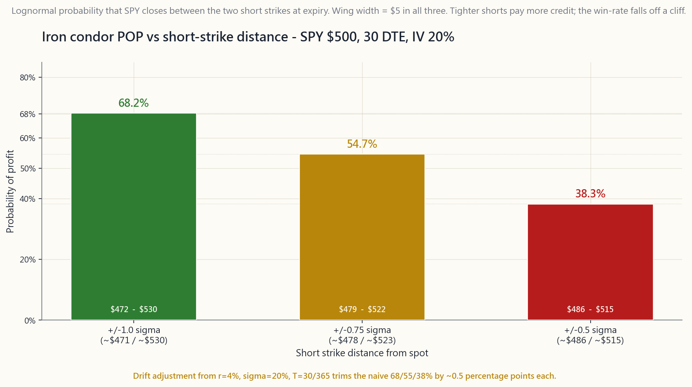

# 第30周：价差、铁鹰策略与蝶式策略——用期权构建哑铃组合

---

## 第一部分：阅读材料

---

### 1. 为什么这一章至关重要

过去四周介绍了单腿期权的基本词汇：看涨期权和看跌期权作为低成本方向性押注，备兑看涨期权作为有偿卖出通道，现金担保看跌期权作为有偿买入通道，以及希腊字母作为对整个定价机器求偏导的工具。单腿期权直接明了，但也相当粗放。在一个50,000美元的账户里，裸卖出一张SPY $500行权价的看跌期权，需要占用50,000美元的保证金，若市场归零则面临50,000美元的亏损敞口。这不是一个仓位管理决策——而是一个*占据整个账户*规模的头寸。

价差策略解决了这个问题。价差是将两条（或四条）腿缝合在同一标的上的结构，其中多头腿*封住*了空头腿的最大亏损。这样一来，建仓当天就已打印出明确的最大亏损和最大盈利，所需资本等于价差宽度减去所收权利金——通常每张合约只需一到三百美元，而非五位数的现金。同样是50,000美元的账户，可以同时运行*五十张*这样的合约，而无需将整个账户押注在单一尾部风险上。

这种方式在四个具体层面上至关重要：

**(1) 有限风险期权本身就是哑铃组合。** 哑铃组合的一端是高确定性的安全资产，另一端是风险上限明确的非对称投机头寸。长期SPY看涨期权价差、QQQ铁鹰策略、AAPL财报前的蝶式策略——每一种都具备哑铃组合所要求的*确切*结构特性：以已知的、有限的、预付的最大亏损，换取不必与标的资产线性相关的回报。L3（"非对称"）仓位不是由杠杆交易所交易基金和彩票式股票构成的，而是由价差策略构建的。

**(2) 信用价差是L2收益仓位的工程化升级版。** 第27周卖出备兑看涨期权，第28周卖出现金担保看跌期权；两者都有效，但资本占用都很重。将现金担保看跌期权替换为5点宽的牛市看跌价差，保留了相同的方向性判断（"我愿意在更低位买入这只股票"），保留了相同的正theta时间价值收益，同时将资本占用降低80-95%。*实际风险资本*上的月度毛收益率上升；美元绝对收益下降；生存能力大幅提升。大多数专业的期权费卖出者正是出于这种权衡而选择价差策略，而非裸卖期权。

**(3) 铁鹰策略将市场在约70%的时间内在实际波动区间内均值回归这一事实变现。** 铁鹰策略在SPY于到期时收盘于两个空头行权价之间时获利。在到期前30天，空头行权价设在±1个标准差时，对数正态的盈利概率约为68%；设在±0.75σ时约为55%；设在±0.5σ时约为38%。交易者在概率曲线上选择自己愿意承受的位置，并通过调整翼展来封住尾部风险。这是经过定价和对冲的均值回归交易——而非那种持有下跌中股票的散户式操作。

**(4) 蝶式策略和折翼蝶式策略是表达*精准*观点的方式。** 以100美元为中心的多头蝶式策略，在标的股票到期时恰好收盘在100美元时获得最大利润，在其他任何位置损失一个小的固定金额。这是对*价格水平*的押注，而非方向性押注。一位对某只股票财报反应或期权到期日钉住价格做过深度研究的交易者，可以用一两百美元的风险和4倍的赔率来表达这一观点，而买入正股或裸期权的方式则需要五位数的成本，且不提供这样的非对称性。

价差策略也是具有波动率意识的交易者开始真正关注的起点：借方价差做空波动率（即买入了波动率），信用价差做多theta、做空波动率（即卖出了波动率），蝶式策略则同时做空波动率*和*做空gamma。选择正确的结构不再只是"看涨还是看跌"——而是"我认为未来三十天的实际波动率相对于隐含波动率会如何变化，条件是我的方向性判断成立。"这是专业期权交易台使用的语言；这一周是你开始使用这套语言的起点。

---

### 2. 你需要掌握的内容

#### 2.1 四种垂直价差——一张幻灯片，四笔交易

垂直价差使用*同类型*（均为看涨或均为看跌）、*同一到期日*、*不同行权价*的两张期权。持有其中一张并卖出另一张，形成四种命名结构：

- **牛市看涨价差**（借方）。买入较低行权价看涨期权，卖出较高行权价看涨期权。支付净期权费。最大盈利=宽度减借方。最大亏损=借方。看涨、有上限、theta为负。
- **熊市看跌价差**（借方）。买入较高行权价看跌期权，卖出较低行权价看跌期权。支付净期权费。最大盈利=宽度减借方。最大亏损=借方。看跌、有上限、theta为负。
- **牛市看跌价差**（信用）。卖出较高行权价看跌期权，买入较低行权价看跌期权。收取净期权费。最大盈利=所收权利金。最大亏损=宽度减权利金。温和看涨至中性、theta为正。
- **熊市看涨价差**（信用）。卖出较低行权价看涨期权，买入较高行权价看涨期权。收取净期权费。最大盈利=所收权利金。最大亏损=宽度减权利金。温和看跌至中性、theta为正。

宽度是行权价之间的间距——5美元、10美元、25美元，取决于期权链的报价。宽度越大=风险资本越多、最大美元盈利越多，形状不变。两笔delta相同但宽度不同的交易，表达的是同一方向判断，只是规模不同。

四种盈亏形态——牛市看涨价差、熊市看跌价差、铁鹰策略和蝶式策略，全部在
[course/image/week30_spread_payoffs.py](course/image/week30_spread_payoffs.py)
中以到期时视角绘制于同一图表内。图表上标注了每种结构的最大盈利、最大亏损和盈亏平衡点，你可以直接从图表上验证公式，而无需逐页查阅。

#### 2.2 实战案例——AAPL $150牛市看涨价差

AAPL交易于150美元。你预期未来30天将温和上涨。期权链显示：

- $150看涨期权：中间价$5.00（delta约0.55）。
- $155看涨期权：中间价$2.50（delta约0.35）。

牛市看涨价差操作：

- **买入** 1张AAPL $150看涨期权：支付$5.00。
- **卖出** 1张AAPL $155看涨期权：收取$2.50。
- **净借方：** 每股$2.50 = **每张价差合约$250**。

三个关键数字直接从结构中得出：

- **最大盈利：** 宽度减借方 = ($155 - $150) - $2.50 = **每股$2.50 = 每张合约$250**，在AAPL到期时收盘于或高于$155时实现。
- **最大亏损：** 所付借方 = **$250**，在AAPL到期时收盘于或低于$150时发生。
- **盈亏平衡点：** 较低行权价加借方 = **$152.50**。

风险/回报比为**1比1**：以$250风险博取$250收益。同样的观点若单独买入$150看涨期权则需$500，且需AAPL涨至$155以上才能翻倍——相同目标，两倍资本，同时单腿看涨期权还会承受两倍的theta损耗。价差是同一想法在资本效率上更优的表达方式，且有精确封顶的尾部风险。

价差版本的代价是$155以上的上行空间：若AAPL大涨至$170，单腿看涨期权盈利$1,500，而价差策略只能盈利$250。这就是交易——用封顶的上限换取封底的保护。

#### 2.3 铁鹰策略——两个信用价差缝合为一笔交易

铁鹰策略是对同一标的、同一到期日同时构建牛市看跌价差*和*熊市看涨价差。四条腿，全部虚值，全部收取权利金。若标的资产在到期时收盘于两个空头行权价之间，则该头寸盈利。

实战案例：SPY报价$500，到期前30天，隐含波动率20%，利率4%。

一个月单标准差移动幅度为
$500 \times 0.20 \times \sqrt{30/365} \approx \$28.65$。取整为$30。
在±1σ处卖出空头，翼端再向外5点：

- **卖出** $470看跌期权，**买入** $465看跌期权：权利金约$0.95。
- **卖出** $530看涨期权，**买入** $535看涨期权：权利金约$0.85。
- **总权利金：** 约每股$1.80 = **每张铁鹰合约$180**。
- **每翼宽度：** $5；**最大亏损** = $5 - $1.80 = **每股$3.20 = $320**。（到期时只有一翼会亏损。）
- **所需资本：** $500减权利金，即约$320（券商以翼端宽度作为保证金）。
- **盈亏平衡点：** $470 - $1.80 = $468.20 和 $530 + $1.80 = $531.80。
- **盈利概率（POP）：** SPY到期时收盘于[$470, $530]区间的对数正态概率，约**68%**。

风险/回报比1.78比1（亏损$320博取$180收益），盈利概率68%——只要实际波动率等于或低于期权链所定价的20%，该交易就具有正期望值。最后这个条件是一切的关键：铁鹰策略本质上是一笔*空头波动率*交易。当实际波动率超过隐含波动率时，无论价格走势如何，该结构都会失去优势。波动率的变化先于一切。

SPY $500铁鹰策略在三种空头行权价距离下的盈利概率曲线，绘制于
[course/image/week30_condor_pop.py](course/image/week30_condor_pop.py)。
空头行权价越紧，从*theta*角度来看盈利区间越宽，但盈利概率大幅下降；图表展示了1σ、0.75σ和0.5σ三种情形下的权衡关系。

#### 2.4 蝶式策略——钉住价格水平

以行权价$K为中心的多头蝶式策略由三条腿构成：

- **买入** 1张$K - w看涨期权。
- **卖出** 2张$K看涨期权。
- **买入** 1张$K + w看涨期权。

两翼$w宽度相等，中间的两张空头看涨期权吸收了大部分成本。若标的资产在到期时恰好收盘于$K，该头寸获得最大盈利；否则在任何其他价位损失一个小的固定金额。

实战案例：AAPL报价$150，到期前30天，隐含波动率25%：

- **买入** $140看涨期权：支付$11.00。
- **卖出2张** $150看涨期权：收取$5.00 × 2 = $10.00。
- **买入** $160看涨期权：支付$1.20。
- **净借方：** $11.00 - $10.00 + $1.20 = **每股$2.20 = $220**。
- **最大盈利：** 宽度减借方 = $10 - $2.20 = **每股$7.80 = $780**，仅在AAPL到期时恰好收盘于$150时实现。
- **最大亏损：** 借方 = **$220**，在$140以下或$160以上发生。
- **盈亏平衡点：** $142.20和$157.80。

风险/回报比**3.5比1**，但盈利区间远比铁鹰策略窄。到期时的盈利概率较低（*峰值*是单一价格点），但该头寸具有正的波动率-隐含波动率等级时间价值收益：随着到期日临近，若股价维持在中间行权价附近，蝶式策略的逐日盯市盈亏会非线性增长，因为空头中间行权价的时间价值损耗速度快于多头翼端。专业术语称此为"蝶式策略的gamma对冲"——这是一个押注于*时间流逝而股价钉住*的方向性交易。

蝶式策略最适合以下场景：在期权到期日前押注整数行权价附近的最大痛点钉住；对一只过度偏离价值的股票表达"向合理价值漂移"的判断；在隐含波动率被压缩*后*押注平静的财报反应；或在已知催化剂前以封顶尾部风险的方式布局。

#### 2.5 选择宽度、距离和到期天数——三个调节旋钮

每种有限风险结构都有相同的三个旋钮，这也是唯一重要的三个旋钮：

- **宽度**（翼端或腿之间的行权价间距）：风险美元和权利金美元翻倍，*形态*不变。宽度是*规模*旋钮。
- **距现价的距离**（空头行权价离现价的偏移程度）：盈利概率旋钮。越靠近现价=权利金越多、盈利概率越低、delta越高。距现价越远=权利金越少、盈利概率越高、delta越低。空头腿的delta是一个简洁的代理指标：30delta的空头约等于30%的实值概率，约等于每腿70%的盈利概率。
- **到期天数（DTE）**：30-45天是信用价差的甜蜜区（第27周已涵盖）。Theta在21个到期天数以内加速衰减；vega收缩。到期天数短=衰减更快、gamma风险更高；到期天数长=时间价值收益更稳定、资本占用时间更长。

运营稳定账户的散户交易者通常固定三个旋钮中的两个（例如30delta空头、30天到期），通过调整宽度来控制仓位规模。专业交易者则根据波动率曲面同时调整三个旋钮。

交互式工具 [interactive/week30_spread_builder.html](interactive/week30_spread_builder.html)
允许你实时切换结构类型（垂直价差/铁鹰策略/蝶式策略）并拨动所有三个旋钮，同时观察净期权费、最大盈利、最大亏损、盈亏平衡点、盈利概率和盈亏图的联动更新。

#### 2.6 资本效率——证明本章价值的对比表格

相同的SPY判断（"市场将在30天内收盘于$470至$530之间"），五种表达方式：

| 结构 | 所需资本 | 最大盈利 | 最大亏损 | 盈利概率 | 资本收益率 |
|---|---|---|---|---|---|
| 买入正股（持平） | $50,000 | ~$1,000持有收益 | ~$50,000 | ~50% | ~2% / 30天 |
| 卖出跨式策略，1σ | ~$15,000 | ~$3,200 | 无限 | ~68% | ~21% / 30天 |
| 铁鹰策略，1σ空头，5点宽 | ~$320 | $180 | $320 | ~68% | ~56% / 30天 |
| 铁鹰策略，0.75σ空头，5点宽 | ~$280 | $220 | $280 | ~55% | ~78% / 30天 |
| 以$500为中心的多头蝶式策略 | ~$220 | $780 | $220 | ~25% | ~355% / 30天（峰值） |

资本收益率这一列是最关键的结论。与正股或卖出跨式策略表达的同一观点相比，有限风险结构的资本效率*高出一到两个数量级*。铁鹰策略和蝶式策略并非晦涩难懂的衍生品——它们是在哑铃组合框架内表达非方向性观点的*正确*规模化方式。

你所付出的代价是精准度。每一笔有限风险交易都有其特定的盈利窗口；在窗口之外就会损失最大亏损。这种结构强加于交易者的纪律性，也正是本章作为L3入门的意义所在。

#### 2.7 税务、提前行权与实操注意事项

垂直价差作为整体被提前行权的情况几乎不会发生——若空头被行权，多头腿始终能覆盖空头腿。真正的风险在于信用看涨价差的空头看涨期权，在除息日附近可能遭遇*单腿*提前行权；若发生，你会发现自己持有空头股份而多头看涨期权仍然有效，这在技术上没有问题，但需要当日采取行动。铁鹰策略和蝶式策略在翼端层面具有相同的特性。

从税务角度看：对宽基指数（SPX、NDX、RUT，*不含*SPY/QQQ/IWM等交易所交易基金）的有限风险期权价差属于1256合约，无论持有期长短，均按60%长期资本利得/40%短期资本利得的混合税率征税。对于每月运营铁鹰策略的高税率美国交易者而言，这是一项结构性优势，税后收益率约高出10个百分点。代价是与对应交易所交易基金的期权相比，指数期权的买卖价差更宽。对大多数散户账户而言，SPY/QQQ/IWM铁鹰策略是正确的起点，当年度期权收益达到六位数时，税务差异才值得承担较大的滑点成本。

在个人退休账户（IRA）中，有限风险价差通常在3级期权权限下获得许可；裸空期权则不被允许。这是散户交易者升级到价差策略的一个被低估的重要原因——它解锁了在税收优惠账户内合法运营期权收益账户的唯一方式。第31周将涵盖隐含波动率等级、波动率机制，以及如何根据实际波动率环境对上述策略进行规模化管理。

---

### 3. 常见误区

**误区一："信用价差比借方价差'更安全'。"** 信用价差的盈利概率更高，但风险/回报比更差。一张以$1.80卖出的5点宽信用价差，盈利概率约70%，但亏损是可获盈利的1.78倍。经过多次交易后，期望值取决于隐含波动率是否高于实际波动率；*两种*结构都不存在自动意义上的更安全。

**误区二："1σ空头的铁鹰策略是免费的68%胜率交易。"** 这68%是基于定价隐含波动率下的对数正态收益假设。当隐含波动率低估实际波动率（波动率扩张、跳空开盘、财报日），真实盈利概率会大幅下降。1σ铁鹰策略是一笔风险/回报比为1.78比1的空头波动率交易，而非带有额外手续费的抛硬币游戏。

**误区三："蝶式策略窗口太窄，没什么用。"** 它在*价格*上的窗口窄，但在*时间*上的窗口宽。对于已知会钉价的标的，提前21个到期天数布局的蝶式策略，经常在距到期还有7天时逐日盯市盈利100-200%，而标的资产并不需要恰好收盘于中间行权价。"最大盈利仅在$K处"的规则适用于*到期时*；价格路径同样重要。

**误区四："有限风险价差没有追加保证金的风险。"** 它没有*行权*导致的追加保证金风险（多头腿覆盖空头腿）。但若券商在交易存续期间重新为价差定价，则*确实*存在盘中变动保证金的扣押；在快速行情下，直到券商重新标价前，保证金要求可能短暂超过最大亏损额。

**误区五："更宽的翼端始终更安全。"** 更宽的翼端使权利金美元和风险美元按相同比例增加。概率形态不变；只有仓位规模改变。翼端宽度是规模旋钮，而非安全旋钮。

**误区六："我应该卖出期权链上权利金最高的价差。"** 权利金最高的价差就是空头行权价最靠近现价的那张，即盈利概率最低的那张。最大化权利金就是最小化胜率。应先确定目标盈利概率，再让权利金从中自然得出。

**误区七："在隐含波动率90%的炒作概念股上做铁鹰策略是绝佳机会。"** 那90%的隐含波动率是市场在告诉你实际行情将大幅波动。在波动率扩张之前卖出期权费，是在空头波动率结构上亏损的教科书式操作。应在隐含波动率等级高*且*催化剂已过之后卖出。

**误区八："牛市看涨价差是看涨交易。"** 大体上是。它是带有vega削减的看涨交易。若标的资产上涨但隐含波动率崩塌（财报后、美联储决议后），价差的盈利可能不如预期，因为两条腿在方向上对vega的影响相互抵消，而在仍为虚值时多头腿占主导。方向性判断是必要条件；波动率才是其中的变量。

**误区九："我应该总在盈利50%时平仓。"** 50%最大盈利的平仓规则是信用价差卖出者的经验法则，能够捕捉早期衰减的甜蜜区。对*借方*价差而言，这个规则意义不大；正确的出场时机是多头腿的delta达到0.85以上，或距到期还有7天，以先到者为准。

**误区十："有限风险意味着无风险。"** 有限风险意味着亏损在建仓时即被*封顶*。这并不意味着亏损金额小。一张10点宽的熊市看涨价差，若标的股票一夜间跳空上涨30%，则在单个上午就会损失全部$1,000的最大亏损。封顶不能替代合理的仓位规模管理。

---

### 4. 问答环节

**问题一：对于给定的观点，选择结构最简洁的方式是什么？**
从两个问题入手：我是否有方向性判断？我是做多还是做空波动率？有方向性+做多波动率=借方看涨/看跌价差。方向中性+做空波动率=铁鹰策略。强烈的价格水平判断+做空波动率=多头蝶式策略。有方向性+做空波动率=信用看跌/看涨价差。这四个框架涵盖约80%的实际操作场景。

**问题二：是否存在最优宽度？** 不存在。宽度控制仓位规模，而非优势。选择使每笔交易的美元最大亏损等于账户总值1-2%的宽度；这成为你的默认设置。仅在券商佣金占比显著时（低价标的的紧窄价差）才调整宽度。

**问题三：盈利概率实际上如何计算？** 对数正态封闭解：铁鹰策略的盈利概率 = $\Phi(d^{\text{up}}_2) - \Phi(d^{\text{down}}_2)$，其中d值为标准BSM项，使用期权链所用的相同$r$、$\sigma$、$T$。交互式工具会用JavaScript为你完成这个计算。

**问题四：保证金账户中的购买力占用是多少？** 对于信用价差，购买力占用=翼端宽度−权利金；对于铁鹰策略，取看涨或看跌两侧中较宽的一侧（到期时只有一侧会亏损，因此券商不会双边计算）。对于借方价差，购买力占用=借方。对于蝶式策略，购买力占用=借方。

**问题五：借方价差何时优于单腿看涨期权？** 当你不需要超出空头行权价的上行空间时。若你的目标是"AAPL在30天内涨至$155"且你认为不会涨至$170，借方价差成本减半、theta损耗也减半。若你认为能涨至$200，就买看涨期权。

**问题六：如何滚动一个被测试的信用价差？** 标准规则：向*外*滚（更晚的到期日）同时向*下/上*滚（远离当前现价），收取少量额外权利金。切勿在未移动行权价的情况下支付借方将亏损价差滚入下一个月；那是在将亏损叠加到新的月份。若可供滚动的唯一选项需支付借方，则接受亏损，重新建立新仓位。

**问题七：铁鹰策略和铁蝶策略一样吗？** 不一样。铁鹰策略的看涨和看跌各有*不同*的空头行权价。铁蝶策略的看涨和看跌使用*相同*的空头行权价，均卖出平值期权。铁蝶策略更接近带翼端的卖出跨式策略——权利金更多、盈利区间更窄、盈利概率更低、最大盈利更高。大多数散户交易台将铁蝶策略视为独立结构。

**问题八："折翼"是什么意思？** 折翼蝶式策略的两翼宽度不等。买入1张$140C、卖出2张$150C、买入1张$165C，构成上翼更宽的折翼蝶式策略。这种不对称性使盈亏形态发生偏移：最大盈利位置移动，一侧的最大亏损减少，另一侧增加。用于在单一仓位中表达"价格水平+方向性偏差"的综合判断。

**问题九：如果我只是L1指数化投资者，为什么需要了解这些？** 今天确实不需要。但当你在平静的一周手握闲置资金和方向性判断时，或当高隐含波动率等级的财报事件诱使你建立过大的裸空看跌期权时，你就会需要。一张5行的牛市看跌价差能将这种诱惑转化为规模合理、风险封顶的专业交易。这些结构本身就是一种纪律。

**问题十：对于美国纳税人，SPY铁鹰和SPX铁鹰在税务上有何区别？** SPY（以及QQQ、IWM）铁鹰按普通短期资本利得征税（持有不足1年）。SPX（以及NDX、RUT）铁鹰属于1256合约：无论持有期长短，均按60%长期/40%短期的混合税率征税。对于年均期权收益5万美元、税率35%的交易者而言，SPX每年可节省约5,000至7,000美元的联邦税——这是L2阿尔法中一项纯粹因税法而存在的有意义的贡献。

**问题十一：我应该交易每周期权还是每月期权？** 每月期权（30-45个到期天数）。每周期权的theta更陡，但gamma和买卖价差噪声也更高。对于学习阶段和稳健的散户收益账户而言，每月周期是正确的节奏。等账户运营稳健后，每周期权是进阶的延伸。

**问题十二：如何判断我的盈利概率估计是否现实？** 将期权链的隐含波动率与标的资产的20日和60日实际波动率进行比较。若隐含波动率等于或低于实际波动率，你的盈利概率被高估——市场在告诉你它预期的实际移动幅度将大于对数正态模型所暗示的。若隐含波动率显著高于实际波动率（高隐含波动率等级），则盈利概率是诚实的，该交易具有正的结构性时间价值收益。第31周会将此分析变成常规操作。

---

## 第二部分：YouTube脚本

---

**视频标题：** 价差、铁鹰与蝶式——专业人士真正卖出期权费的方式

**目标时长：** 约18分钟

**主持人：** 陳馬、小魚

---

**[开场——0:00]**

**小魚：** 上周我们画出了四个希腊字母。再之前一周，你带我们讲了备兑看涨期权和现金担保看跌期权。课上听起来都很好——然后我实际去给SPY $500的现金担保看跌期权报价时，系统显示需要*五万美元*的保证金。

**陳馬：** 对。这是每个散户交易者都会遇到的那个时刻，也正是把那些只用过一次期权的人，和把期权当成谋生工具的人区分开来的时刻。

**小魚：** 因为你没办法运营一个每笔交易都要占用整个账户的收益账户。

**陳馬：** 对。所以今天我们来解决这个问题。我们把同样的判断——同样的"我愿意在更低位买入SPY"，或者"我愿意在更高位卖出AAPL"，或者"这东西三十天内哪也不去"——用两条或四条腿来表达，而不是一条。最大亏损在下单时就打印在票据上。每张合约所需资本不到五百美元。优势相同。

**小魚：** 而且这些就是专业人士实际运营的策略。

**陳馬：** 价差策略。铁鹰策略。蝶式策略。学完这一期，你应该能够看着任何一张期权链，为你真正的判断选出合适的结构。

---

**[第一板块——垂直价差，1:10]**

**小魚：** 用一句话告诉我什么是"垂直价差"。

**陳馬：** 两张期权，同类型，同到期日，不同行权价。买一张，卖一张。你卖出的那张封住了你的盈利上限；你买入的那张封住了你的亏损下限。就这些。

**小魚：** 有四种形态，对吧？

**陳馬：** 四种形态。牛市看涨价差是两张看涨期权——买低行权价，卖高行权价，净支出。熊市看跌价差是两张看跌期权——买高行权价，卖低行权价，净支出。这两种是*借方*价差。然后是牛市看跌——卖高行权价看跌，买低行权价看跌，收取现金。以及熊市看涨——卖低行权价看涨，买高行权价看涨，收取现金。这两种是*信用*价差。

**小魚：** 关键是多头腿覆盖空头腿。

**陳馬：** 完全正确。一张5点宽价差的最差情况是亏损五百美元，减去你收取的任何权利金。而不是单腿空头所需的五千美元保证金。

**[VISUAL: image/week30_spread_payoffs.png — 2×2四格图]**

**小魚：** 这张图让我一下子就理解了。左上，AAPL $150的牛市看涨价差。买入$150看涨期权花五美元，卖出$155看涨期权收两块五，净借方每股两块五，即每张价差合约两百五十美元。折线在$155以上变平——那是上限。在$150以下变平，停在负二百五十——那是底部。

**陳馬：** 盈亏平衡点是$152.50。较低行权价加上借方。风险/回报比恰好是一比一——风险二百五十，博取二百五十。

**小魚：** 右上，熊市看跌价差。

**陳馬：** 镜像图形。买高行权价看跌，卖低行权价看跌。支付借方，在下跌中盈利。同样的一比一形态。

---

**[第二板块——铁鹰策略，4:00]**

**小魚：** 这张图的左下——铁鹰策略。

**陳馬：** 左下是我最希望散户投资者爱上的策略。它是两个信用价差缝合在一起。一个牛市看跌价差在市场下方，一个熊市看涨价差在市场上方，同一标的，同一到期日。两个空头行权价都是虚值。两份权利金都收进来。若标的资产在到期时收盘于两个空头行权价之间，你就盈利。

**小魚：** 带我过一遍SPY的例子。

**陳馬：** SPY报价五百美元。到期前三十天。隐含波动率二十。一个月单标准差移动幅度约为二十八美元——取整三十。卖出$470看跌期权，买入$465看跌期权作为保护。这是看跌那侧。卖出$530看涨期权，买入$535看涨期权作为保护。这是看涨那侧。

**小魚：** 总权利金？

**陳馬：** 大约每股一块八。每张铁鹰合约一百八十美元。最大亏损是翼端宽度减权利金，五减一块八等于三块二。所需资本大约三百二十美元。若SPY收盘于$470和$530之间，你赚一百八十；若收盘于某一翼端以外，你亏三百二十。

**小魚：** 盈利概率是——

**陳馬：** 在1σ空头行权价下，大约六十八。那只是SPY在一个标准差内收盘的对数正态概率，加上微小的漂移调整。

**[VISUAL: image/week30_condor_pop.png — 盈利概率柱状图]**

**小魚：** 第二张图把这个权衡关系一图展示清楚了。三根柱。1σ空头——六十八。四分之三σ——五十五。二分之一σ——三十八。

**陳馬：** 空头行权价越紧，收取的权利金越多，但胜率急剧下降。那个五十五看起来很诱人，因为权利金几乎翻倍，但这笔交易现在是以1.3比1亏损比的抛硬币游戏。二分之一σ的版本基本上是带翼端的卖出跨式策略——回报高，胜率糟糕。

**小魚：** 而1σ版本是大多数散户交易台的默认选择。

**陳馬：** 六十八盈利概率，1.78比1风险，三百二十美元资本。每个月在SPY、QQQ、IWM以及几只大盘股上各做十张，你就拥有了一个建立在真实账户上的真正收益账户。

---

**[第三板块——蝶式策略，8:30]**

**小魚：** 盈亏图的右下。那个尖尖的。

**陳馬：** 多头蝶式策略。三条腿。买入一张$140看涨期权，卖出两张$150看涨期权——那是中轴——再买入一张$160看涨期权。中间的两张空头看涨期权支付了大部分成本。

**小魚：** 而且只有在股票到期时恰好收盘于$150时才会实现最大盈利。

**陳馬：** 完全正确。净借方是每张合约两百二十美元。若AAPL到期时钉住$150，最大盈利是七百八十。最大亏损是借方，两百二十，在任一翼端以外发生。风险/回报比是三点五比一。

**小魚：** 听起来太完美了。为什么不是人人都这么做？

**陳馬：** 因为*到期时*的盈利概率很低。峰值是单一价格点。只有当AAPL在周五下午确实收盘于$150附近几美元以内，你才能拿到那七百八十。但是——这是没有人告诉你的部分——这笔交易很少需要一直撑到到期日。若AAPL在还有一周到期时漂向$150，蝶式策略的逐日盯市价值已经上涨了两三百美元，因为两张空头看涨期权的时间价值损耗速度快于多头翼端。

**小魚：** 所以你可以提前平仓。

**陳馬：** 几乎总是这样。蝶式策略通常在借方的50-100%处平仓，往往在到期前几周，而绝不在最后24小时内持仓，除非股价*已经*钉住了。它是一个方向性押注于价格水平、时间价值加速衰减、风险封顶的交易。最佳适用场景：财报后的漂移、期权到期日钉住整数行权价、整数价格磁力位的均值回归。

---

**[第四板块——价差构建器，11:30]**

**小魚：** 我们来打开实验工具。

**[VISUAL: interactive/week30_spread_builder.html]**

**陳馬：** 顶部有药丸形状的切换按钮——垂直价差、铁鹰策略、蝶式策略。先选结构。然后是四个滑块——行权价宽度、距现价的距离、到期天数、隐含波动率。

**小魚：** 我先从铁鹰策略的默认设置开始。SPY $500，1σ空头，5点宽翼端，30天到期，20隐含波动率。四个大数字——净权利金约一百八，最大盈利约一百八，最大亏损三百二，盈利概率六十八。和你推演的数字一致。

**陳馬：** 现在把"距现价距离"滑块往里拖。看看会发生什么。

**小魚：** 净权利金上升——三美元、五美元、七美元。盈利概率崩塌——六十八、五十五、四十。

**陳馬：** 这就是这整节课的唯一权衡关系。权利金购买盈利概率，盈利概率购买权利金。这个工具让你对此有直观感受。

**小魚：** 把宽度拖大。5点宽变成10点宽。

**陳馬：** 最大盈利和最大亏损都翻倍。盈利概率不变。所需资本翻倍。形态相同，规模加倍。

**小魚：** 切换到垂直价差呢？

**陳馬：** 单侧。一个空头，一个多头。只有一个盈亏平衡点。下方的盈亏图实时重绘。切换到蝶式策略，图形就变成帐篷形状。

---

**[第五板块——何时选用哪种结构，14:00]**

**小魚：** 给我一个快速决策树。

**陳馬：** 两个问题。第一：我是有方向性判断，还是方向中性？第二：我是做多还是做空波动率？

**小魚：** 有方向性+做多波动率？

**陳馬：** 借方看涨或看跌价差。你在为行情的发生付费，并押注实际波动幅度将大于期权链的预期。

**小魚：** 有方向性+做空波动率？

**陳馬：** 看涨信用看跌价差，看跌信用看涨价差。你在押注你期望的方向*并且*期权链对相反情形给出了过高定价。

**小魚：** 方向中性+做空波动率？

**陳馬：** 铁鹰策略。面包黄油式的每月收益交易。

**小魚：** 钉住价位+做空波动率？

**陳馬：** 在磁力行权价处布局多头蝶式策略。

**小魚：** 这就是整个框架。

**陳馬：** 这涵盖了期权收益账户实际上大部分的操作内容。财报策略、日历价差、比率对角价差——这些都是在这四种结构之上的延伸。把这四种结构做对，你晚上就能睡着觉。

---

**[第六板块——税务与账户类型，15:30]**

**小魚：** 期权首先是一种税务工具。这在哪里体现出来？

**陳馬：** 两个层面。第一——SPX、NDX或RUT上的铁鹰策略属于1256合约：无论持有多久，均按60%长期/40%短期资本利得混合税率征税。SPY、QQQ、IWM铁鹰策略则按普通短期资本利得征税。对于每月稳定运营铁鹰策略的高税率美国交易者来说，SPX能节省大约十个百分点的税后收益率。

**小魚：** 还有IRA账户的角度？

**陳馬：** 大多数个人退休账户不允许裸空期权。有限风险价差则允许。因此，在税收优惠账户内运营信用期权收益账户的*唯一*合法方式，就是通过这些结构。光凭这一点，就值得把它们学好。

---

**[结尾——17:00]**

**小魚：** 总结一下。

**陳馬：** 价差策略将单腿期权转化为以五十到一百美元资本打印出最大亏损的结构。铁鹰策略以六十以上的胜率将均值回归变现。蝶式策略以三点五比一的赔率钉住价格水平。它们是哑铃组合中的L3仓位——风险封顶、非对称、专业化。

**小魚：** 下周——隐含波动率等级、波动率机制，以及如何根据实际波动率对上述策略进行规模化管理，使这些结构真正发挥作用。

**陳馬：** 第三十一周见。

**[结束]**