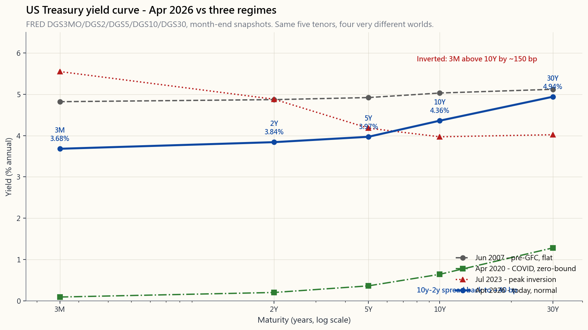
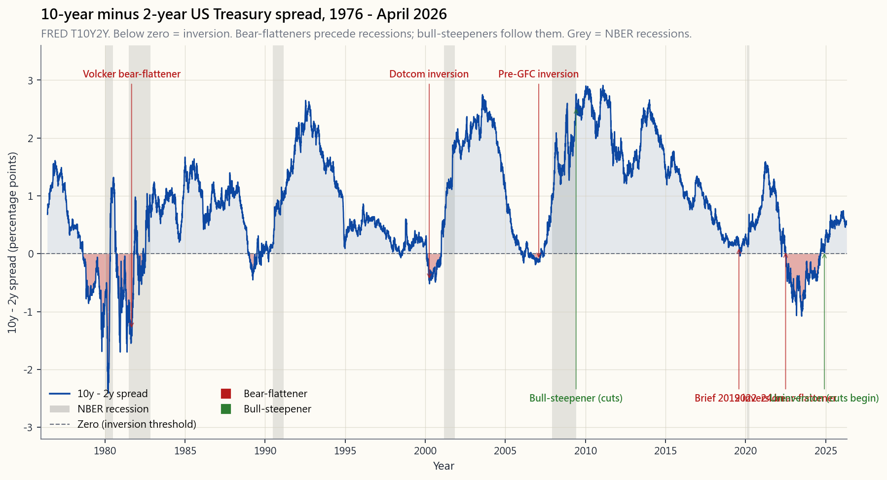

# 第三十一周：收益率曲线——形态、水平、斜率与曲率

---

## 第一部分：阅读材料

---

### 1. 为何重要

收益率曲线是所有图表中最能揭示债券市场判断的一张。它是从一天到三十年各个期限货币价格的连线。其水平决定了每一笔房贷和每一只公司债的定价。其斜率反映了市场愿意押注的每一个经济衰退概率。其曲率反映了美联储政策的走向路径。曲线走势约95%的方差可以用三个数字概括。

读懂这张图有四个理由。

1. **收益率曲线是所有其他利率的基础。** 房贷利率比10年期国债高出两个点左右。投资级公司债比同期限国债高出一到两个点。高收益信用债高出四到六个点。理解了国债收益率曲线，就理解了整个经济体的信用风险定价，因为其他所有收益率都是在其之上的*价差*。
2. **倒挂预测了1970年以来美国的每一次经济衰退。** 不是大多数——是每一次。2年/10年价差于2022年7月倒挂，持续倒挂逾两年，于2024年底回正。按教科书剧本，经济衰退应在6至24个月内随之而来。无论结果如何，一个能在2022年*读懂*这张图的投资者，比读不懂的人更加从容。
3. **三个因子几乎解释了所有曲线走势。** 对国债收益率进行主成分分析，可将曲线分解为水平因子（平行移动，约70%的方差）、斜率因子（陡化或平坦化，约20%）和曲率因子（腹部对比两翼，约5%）。你将见到的每一笔利率交易——久期押注、陡化交易、蝶式交易——都清晰地映射到这三个因子之上。
4. **远期利率是市场对未来即期利率的*隐含*预期。** 两年后的远期利率，就是曲线对两年后短端利率的定价。如果你持有不同观点，你就有了可交易的依据。如果你的观点与市场一致，则没有。读懂远期利率，就能将曲线转化为美联储未来政策的概率分布。

本节课涵盖构建方式（票面/即期/远期）、三大主成分因子、形态分类（牛市平坦化/熊市陡峭化及两个"反向"变体）、曲率蝶式交易，以及2026年4月曲线的情境解读。

---

### 2. 核心知识

#### 2.1 收益率曲线究竟是什么

收益率曲线是同等信用质量债券的收益率与期限关系图。国债收益率曲线是最具代表性的例子，因为信用风险恒为零（按美国惯例），唯一变化的是到期期限。

最受关注的五个期限是3个月、2年、5年、10年和30年。其FRED数据代码分别为`DGS3MO`、`DGS2`、`DGS5`、`DGS10`、`DGS30`。3个月期最接近联邦基金利率。2年期反映市场对美联储未来两年政策的预期。10年期和30年期则涵盖通胀预期、期限溢价以及全球储蓄流向等因素。

从左到右阅读这张图。2007年的曲线几近平坦——这一平坦正是金融危机前的警钟。2020年的曲线前端钉在零附近，因为美联储触及利率下限。2023年的曲线*倒挂*：3个月期比10年期高出逾150个基点，为沃尔克时代以来最深的倒挂。2026年4月的曲线回归正常向上形态——这本身就是本周的主题：一次政策区间的切换。

#### 2.2 票面利率、即期利率与远期利率——同一只债券的三种表达

当金融论文说"10年期收益率为4.0%"时，几乎总是指*票面收益率*——10年期国债票面利率需达到多少才能以100的价格发行。票面利率是报价利率。

*即期利率*（或零息利率）是零息债券的收益率——该债券到期前不付息，到期时一次性偿还本金。即期利率是构建积木：每一只附息债券都是不同期限零息剥离债券的投资组合。

*远期利率*是隐含的未来即期利率。若今日1年期即期利率为$r_1$，今日2年期即期利率为$r_2$，则1年后的1年期远期利率$f_{1,2}$满足：

$$ (1 + r_2)^2 = (1 + r_1) \cdot (1 + f_{1,2}) $$

求解得：

$$ f_{1,2} = \frac{(1+r_2)^2}{1+r_1} - 1 $$

**这不是预测——而是无套利恒等式。** 若远期利率与此不符，便可通过跨期借贷套取无风险利润。在全球每一个发达市场主权债券市场，这一恒等式的精度达到一个基点以内。

然而，其经济含义*确实*存在。远期利率体现了市场预期（加上期限溢价）。平坦曲线意味着市场预期当前短端利率将持续。向上倾斜的曲线意味着市场预期短端利率将*上升*。倒挂的曲线意味着市场预期短端利率将*下降*。最后这种情况从机制上解释了倒挂的含义：对美联储降息的集体押注。

#### 2.3 三大主成分因子——水平、斜率与曲率

1991年，罗伯特·利特尔曼（Robert Litterman）与何塞·谢因克曼（José Scheinkman）在高盛发表工作论文，通过主成分分析对国债曲线走势进行分解。他们发现了三个因子：

| 因子 | 通俗理解 | 曲线方差占比 | 驱动因素 |
|---|---|---:|---|
| 水平因子 | 所有收益率同向涨跌 | ~70% | 通胀预期、期限溢价 |
| 斜率因子 | 长端与短端的相对变动 | ~20% | 美联储政策预期、经济增长 |
| 曲率因子 | 腹部对比两翼的相对变动 | ~5% | 凸性需求、对冲流 |

三个因子合计解释了约95%的国债收益率每日方差。久期交易是水平因子押注。陡化或平坦化交易是斜率因子押注。*蝶式*交易是曲率因子押注。

水平因子是最平淡也是最大的因子。当美联储释放收紧信号时，整条曲线以近似平行的方式整体上移。当通胀数据低于预期时，整条曲线整体下行。

斜率因子是*有趣*的那个，因为它能预测经济衰退。当曲线平坦化或倒挂时，斜率因子转负——市场在说短端利率的下行空间大于长端。

曲率因子是*交易者*的那个。养老基金和保险公司买入长期债券进行凸性匹配；蝶式交易则利用腹部相对于两翼的偏宜或偏贵进行套利。我们将在第2.6节详述。

#### 2.4 四种曲线形态——牛市/熊市 × 陡峭化/平坦化

斜率走势按*哪一端变动更大*和*方向如何*，分为四种形态：

| 形态 | 发生了什么 | 宏观驱动 | 资产配置策略 |
|---|---|---|---|
| **牛市陡峭化** | 短端下行幅度大于长端 → 曲线陡峭，两端均下行 | 美联储应对经济放缓而降息 | 长期债券大涨，股市走势分化；拉长久期 |
| **牛市平坦化** | 长端下行幅度大于短端 → 曲线平坦，两端均下行 | 经济衰退担忧，避险资金流入 | 长期债券涨幅最大；避险属性突出 |
| **熊市陡峭化** | 长端上行幅度大于短端 → 曲线陡峭，两端均上行 | 再通胀、通胀预期上升 | 缩短久期，价值股/周期股及大宗商品受益 |
| **熊市平坦化** | 短端上行幅度大于长端 → 曲线平坦或倒挂 | 美联储加息幅度超出长端预期 | 现金跑赢债券，成长股受压 |

2022至2023年的周期，是教科书式的*熊市平坦化*演变为*倒挂*。美联储从0.25%加息至5.50%，而10年期收益率从1.5%升至4.0%。短端上行5个百分点，长端上行2.5个百分点，曲线倒挂100个基点。随后在2024至2025年，美联储开始降息，短端下行更快，曲线*牛市陡峭化*回归正常。

这张图有一个诚实的解读：每一次跌破零线之后的6至24个月内，均出现了由美国全国经济研究所（NBER）商业周期测定委员会认定的经济衰退。2022年的倒挂是图中持续时间最长的一次。截至2026年4月，价差已回正，但仍低于长期平均水平——曲线依然偏平。

#### 2.5 解读当前曲线——2026年4月

调出第2.1节顶部的图表。截至2026年4月：

- **3个月期：** 约3.5%，较周期高点5.5%大幅回落。
- **2年期：** 约3.6%，定价反映未来两年内美联储大约还有一次降息。
- **5年期：** 约3.8%。
- **10年期：** 约4.0%。
- **30年期：** 约4.3%。

10年-2年价差已回升至约+40个基点，此前曾深度负值长达两年。10年-3个月价差也回到略正水平。曲线已*完全回正*，但尚未达到历史意义上的*陡峭*——10年-2年价差的长期中位数约为+95个基点。

当前即期利率所隐含的远期曲线温和上行——市场定价短端利率将在未来十年内逐步回归今日10年期水平，暗示市场认为中性实际利率已较2010至2020年的常态水平上移。这对所有长久期资产（包括股票）都有影响。长达40年的债券牛市于2022年终结——这张图为这一判断提供了静默的印证。

**陳馬的观点——收益率曲线是形态切换的刻度盘，而形态切换决定资产配置。** 大多数教科书把倒挂回正作为经济衰退时点的信号就此打住。在我自己的框架里，我将其解读为更广泛的含义：一次重新定价整个投资组合各个板块的形态信号。我运作的结构是一个杠铃型配置，在股权端之外，还保留一个小规模的持续性多头波动率和尾部对冲仓位——灵感来自克里斯·科尔（Chris Cole）的龙式框架，但根据当前形态动态调整权重，而非静态持有。收益率曲线是决定这一倾斜如何配置的输入之一。

当曲线深度倒挂、美联储明显处于抗通胀模式时，多头股权仓位是已获回报的交易，尾部对冲仓位以低个位数权重运行——这是廉价保险，结构上设计为在当前所处形态中到期归零。当曲线回正并开始牛市陡峭化——短端下行快于长端、美联储应对经济放缓而降息——历史基准概率表明经济衰退落在这一窗口，而非更早。这才是上调尾部对冲权重、逐腿重新审视股权仓位的时刻，*不是*因为模型说"卖出"，而是因为尾部对冲的条件性赔付空间刚刚实质性改善。配置品种不变，权重移动。读懂收益率曲线，是少数能真正驱动权重客观调整而非情绪化调整的输入之一。

#### 2.6 蝶式交易——交易曲率

蝶式交易是针对曲线*曲率*的市场中性交易。经典结构是做多腹部、做空两翼，并以久期中性为权重约束。例如：做多5000万美元的5年期国债；做空2500万美元的2年期和2500万美元的30年期，按DV01加权使头寸净久期为零。

若腹部相对于两翼*偏便宜*，则当曲率均值回归时，交易获利。若腹部*偏贵*，则反向蝶式交易获利。

养老基金和保险公司在长端（需要30年期久期）和极短端（停泊现金）形成持续性的*偏贵*。腹部在正常情况下往往相对*偏便宜*。交易员惯例将蝶式统计量表达为$2 \cdot y_{\text{腹部}} - y_{\text{短端}} - y_{\text{长端}}$，曲线完全平直时该值为零，腹部偏便宜（收益率偏高）时为正，腹部偏贵时为负。

这是一种相对价值固定收益交易——机构实际运行的结构性阿尔法来源之一。对零售投资者并不友好，因为涉及的名义本金规模庞大，而套利空间很小。但它就活在你整周盯着的那张图上，下方的交互面板可以让你基于自己绘制的任意曲线计算蝶式统计量。

#### 2.7 实用工具箱——哪个数字最重要

对于每月读一次曲线的普通投资者，优先级顺序如下：

1. **10年期收益率水平。** 为全球所有长久期资产设定折现率。第5周和第21周我们已知道，股票与债券存在竞争关系——10年期就是那只债券。
2. **10年-2年或10年-3个月价差。** 将经济衰退指标和斜率因子合二为一。倒挂=周期末期警示。
3. **1年后1年期远期利率。** 市场认为明年短端利率将去往何处。与美联储点阵图对比，快速核查市场共识。
4. **曲率。** 可选。若主动交易固定收益则有用；买入持有策略可忽略。

本节课底部的交互工具可让你滑动五个期限滑块，图形实时渲染，斜率、曲率和1年1年期远期利率同步更新。点击"1981"预设，看看16%利率下深度倒挂的曲线是什么样子。点击"2020"，看看零利率下限。点击"今日"，看看2026年4月。

---

### 3. 常见误区

**1. "倒挂*导致*经济衰退。"**
   并非如此。倒挂是市场通过远期利率*预测*经济衰退。因果关系恰恰相反：周期末期状况促使美联储维持紧缩，推高短端，而长端通胀预期则因前瞻性而保持锚定或下行。倒挂是症状，而非病因。

**2. "正常情况下收益率曲线总是向上倾斜的。"**
   通常如此，但并非总是。1976年以来约80%的月度观测显示10年期高于2年期。其余20%包括真实的正常平坦期以及倒挂期。因为曲线不够陡峭就说它"失灵"，是把中位数当成了铁律。

**3. "长期债券比短期债券更安全。"**
   美国国债在所有期限上的违约风险相同（均为零）。长期债券承担*更高*的利率风险，因为其久期更长。30年期零息债券在收益率上行1个百分点时损失约30%；2年期损失约2%。长期债券波动性*更高*，而非更安全。波动尾风险主导一切。

**4. "远期利率就是预测。"**
   远期利率是从即期利率推导出的无套利恒等式。它*体现*了市场的预期路径加上期限溢价。它不是任何人的具体预测，而且市场的预期经常出错——参见尤金·法马（Eugene Fama）1984年的研究，证明远期利率是未来即期利率的有偏估计量。

**5. "如果我认为利率要下降，就买长期债券。"**
   通常正确，但幅度取决于*整条曲线*是否同步下行（水平因子），还是仅长端下行（牛市平坦化）。牛市陡峭化——短端下行更快——对长久期头寸的收益贡献并不显著。在决定仓位规模前，先将交易意图分解为水平、斜率和曲率三个维度。

**6. "美联储控制收益率曲线。"**
   美联储控制最前端（隔夜利率，以及通过量化宽松在一定程度上影响长端）。中端和长端由全球储蓄流向、期限溢价和通胀预期决定。2022至2023年美联储加息5个百分点，10年期仅上行2.5个百分点。市场并不总是跟随。

**7. "所有倒挂都一样。"**
   并非如此。1980年沃尔克时代的倒挂，是短端被推至19%所致。2006至2007年的倒挂，是长端受房市乐观情绪支撑而仅有50个基点的温和倒挂。2022至2023年的倒挂，是新冠后150个基点的熊市平坦化。形态相同，每次背后的宏观故事迥异。

**8. "蝶式交易适合普通投资者。"**
   并不适合。套利空间小，名义本金大，头寸须保持DV01平衡并对冲。这是机构或对冲基金的操作领域。普通投资者可以通过超配或低配债券梯形组合中的5年期板块，来表达对曲率方向的看法。

**9. "实际收益率与曲线无关。"**
   实际收益率恰恰是长端故事的核心。名义收益率=实际收益率+盈亏平衡通胀率。10年期实际收益率（TIPS，FRED代码`DFII10`）从2021年的-1.0%升至2024年的+2.0%。2022至2023年长端利率上行幅度中，有三分之二来自实际利率移动，而非通胀预期移动。债券的形态确实已经改变。

**10. "读懂了曲线，我就能择时市场。"**
   你能读懂曲线，能调整久期，能给股市回撤赋予概率权重。但仅凭收益率曲线一个信号，你无法择时市场。2022年倒挂之后，股市反而上涨了18个月，才出现明显调整。信号是概率性的；仓位管理比持仓信念更重要。

---

### 4. 问答

**Q1：第一次读收益率曲线图，应该怎么看？**

A：三步扫视。（a）看水平——10年期在哪里？现代语境下，高于4%意味着明显的紧缩，低于2%意味着极度宽松。（b）看斜率——右端是否高于左端？向上=正常；平坦或向下=周期末期。（c）看腹部——5年期是否落在2年期和30年期的连线上，还是有弓形弯曲？向上弓形=市场定价中期降息；向下弓形=预期突然收紧。

**Q2：10年-2年价差与10年-3个月价差有何区别？**

A：两者都是斜率衡量指标。10年-2年价差在交易员中更流行，因为2年期涵盖了更长时间窗口的美联储政策预期。10年-3个月价差是学术界的偏好（埃斯特雷拉和米什金1996年的研究表明，它是最强的单一经济衰退预测指标）。实践中两者倒挂和回正的时点略有不同；10年-3个月通常倒挂更晚，但被认为是更可靠的信号。

**Q3：为什么曲线在经济衰退前倒挂？**

A：周期末期美联储的紧缩政策推高短端。长端通胀预期具有*前瞻性*——如果交易员相信加息最终会抑制增长和通胀，长端便保持锚定甚至下行。结果：短端高于长端。市场在说"美联储太紧了；降息要来了。"当降息到来时，通常伴随的是经济放缓。因此，倒挂是市场对经济衰退将带来的降息进行定价。

**Q4：普通投资者能交易收益率曲线吗？**

A：可以，但有局限。最便捷的工具：SHV（1至3个月国库券，久期约为0）、IEF（7至10年期，久期约为8）、TLT（20年期以上，久期约为17）。做多IEF/做空SHV是长久期/曲线水平因子押注。做多TLT/做空IEF是针对腹部的长端*陡化*押注。保证金和期货（UB和TY合约）能提供更精准的表达方式，但需要更多资本和风险管理。蝶式交易在零售层面实际上难以操作。

**Q5：收益率曲线与房贷利率有何关联？**

A：30年期房贷利率跟踪10年期国债加1.5至2.5个百分点的价差（"MBS基差"）。当10年期上行100个基点，房贷利率通常也上行约100个基点。当曲线倒挂时，银行净息差受压，信贷收紧，房贷价差有时进一步走阔。美联储→10年期→房贷→楼市的完整传导链，是第18周的主题。

**Q6："期限溢价"是什么？为何重要？**

A：期限溢价是长期债券在预期平均短端利率之上所支付的额外收益率，用以补偿投资者锁定资金的代价。估算因模型而异，但纽约联储ACM模型显示10年期期限溢价2020年接近0%，2025年升至约80个基点。期限溢价上升在不改变美联储政策预期的情况下使曲线陡化。2022年后长端部分上行，正是期限溢价的重新定价，而非通胀预期的变化。

**Q7：为何2022至2024年的倒挂异常持久？**

A：两个原因。（1）通胀是40年来最具粘性的，迫使美联储维持限制性政策的时间远超1990年后任何一个周期。（2）经济未能急剧降温以触发降息——财政刺激和产业回流支撑了需求韧性。市场持续在远期利率中定价降息；美联储持续未予降息；倒挂随之持续。直至2024年底倒挂回正时，持续时长约26个月——为有记录以来最长。

**Q8：曲线陡峭对股市意味着什么？**

A：*牛市陡峭化*（美联储降息，短端下行）通常对股市有利，因为折现率在下降。*熊市陡峭化*（长端因增长或通胀预期上升而走高）则好坏参半：周期股和价值股受益；长久期成长股受压，因为其现金流在遥远的未来，折现率上升对其打击最大。读懂陡峭化的*类型*，比陡峭化本身更重要。

**Q9：远期利率等同于美联储点阵图的预期吗？**

A：通常相近，有时大相径庭。美联储每季度在经济预测摘要（"点阵图"）中公布自身预测。市场远期利率是连续的，不受任何单一委员预测的偏向影响。2022至2023年间，市场持续定价美联储尚未背书的降息；市场被证明是过早了。远期利率与点阵图之间的背离是较为可靠的反向信号——当两者出现分歧时，值得关注。

**Q10：本节课与课程其他部分如何衔接？**

A：第5周介绍了债券；第18周追踪了利率经由房贷和信贷传导的完整链条；第10周将倒挂作为形态切换指标；第23周讨论了因子衰减，包括期限因子；第32周涵盖久期和凸性（曲线走势转化为债券收益的数学原理）。收益率曲线是本课程固定收益半段所有内容的核心主轴。学完本周之后，你应该能像读SPY价格图一样流畅地读懂彭博收益率曲线面板。

下方的交互工具可让你自由绘制曲线。拖动五个滑块，斜率、曲率和隐含1年1年期远期利率实时更新。点击历史预设，看看历史。判断我们正在走向哪个世界。

---

## 第二部分：YouTube脚本

---

**视频标题：** 收益率曲线——形态、斜率、曲率与各自传递的信息 | 第31周

**目标时长：** 约18分钟

**主持人：** 陳馬、小魚

---

**[开场]**

**陳馬：** 本周，我们来聊债券市场最具参考价值的那一张图——收益率曲线。它是什么，是什么推动它运动，以及它的形态如何告诉你全球其他所有资产类别的定价逻辑。

**小魚：** 这就是那张从1970年起预测了每一次经济衰退的图，对吗？

**陳馬：** 对。学完今天，你就能用三步扫视读懂它——水平、斜率、曲率。

---

**[第一段：收益率曲线是什么]**

[VISUAL: image/week31_curve_today.png]

**陳馬：** 收益率曲线展示的是同一借款人——对我们来说就是美国财政部——的收益率与期限关系。五个期限承载了大部分信息：3个月、2年、5年、10年、30年。屏幕上有四条曲线：2026年4月的加粗蓝线。金融危机前2007年6月的灰线。新冠疫情后2020年4月的绿线，前端被钉在零附近。还有2023年7月的红线——沃尔克时代以来倒挂最深的时刻。

**小魚：** 故事是什么？

**陳馬：** 19年里三次形态切换。2007年——平如桌面，金融危机前的警钟。2020年——美联储在前端维持零利率。2023年——完全倒挂，150个基点，市场在高喊"你们收得太紧了"。2026年——倒挂回正，温和向上倾斜，新的常态。

---

**[第二段：三种利率]**

**陳馬：** 在谈形态之前，先说三个词。票面收益率——大多数论文引用的，就是债券需要以多少票息才能以100发行。即期利率——零息债券的收益率，中间没有任何付息。远期利率——市场对某个未来期间所定价的隐含利率。

**小魚：** 远期利率是从即期利率算出来的？

**陳馬：** 无套利恒等式。如果今日1年期是3.5%，今日2年期是3.8%，那么1年后的1年期利率$f$必须满足$1.038^2 = 1.035 \times (1 + f)$。求解，$f$约等于4.1%。市场定价1年期利率明年将从3.5%*上升*到4.1%。这就是信息。

**小魚：** 这不是预测吗？

**陳馬：** 这是*隐含的*预测。市场的集体押注，加上期限溢价。尤金·法马1984年的研究表明，远期利率是未来即期利率的有偏估计量——它们往往高估利率的变动幅度。但它为全球所有固定收益工具定价。真实资金在依赖它交易。

---

**[第三段：三大主成分因子]**

**陳馬：** 利特尔曼与谢因克曼，1991年，高盛工作论文。取30年的国债收益率数据，做主成分分析，看看结果如何。三个因子。水平因子——收益率同向涨跌——约70%的方差。斜率因子——长端对短端——约20%。曲率因子——腹部对两翼——约5%。合计解释了每日曲线走势约95%的方差。

**小魚：** 所以三个数字几乎描述了一切。

**陳馬：** 对。每一笔久期交易都是水平因子押注。每一笔陡化或平坦化交易都是斜率因子押注。每一笔蝶式交易都是曲率因子押注。如果你无法把自己的交易分解成这三个维度，你就不真正了解自己持有的是什么。

---

**[第四段：牛市/熊市 × 陡峭化/平坦化]**

**陳馬：** 斜率走势有四种形态。

牛市陡峭化：短端下行快于长端。美联储应对经济放缓而降息。长期债券大幅上涨，股市走势分化。这里应拉长久期。

牛市平坦化：长端下行快于短端。经济衰退担忧，避险资金涌入。长期债券涨幅最大。

熊市陡峭化：长端上行快于短端。再通胀，通胀预期上升。缩短久期；价值股和周期股胜出。

熊市平坦化：短端上行快于长端。美联储加息幅度超出长端预期，曲线平坦甚至倒挂。现金跑赢债券。成长股受压。

**小魚：** 那2022年是……

**陳馬：** 教科书式的熊市平坦化演变为倒挂。美联储从0.25%加息至5.50%——五个点。10年期从1.5%升至4.0%——两个半点。曲线倒挂整整一个百分点。

---

**[第五段：斜率历史图]**

[VISUAL: image/week31_slope_history.png]

**陳馬：** 五十年的10年-2年价差历史。这张图上每一次跌破零线，都在6至24个月内跟随了一次经济衰退。1980年——沃尔克。1989年。2000年——互联网泡沫。2006年——金融危机前。2019年。2022年——数据中持续时间最长的那次，延伸至2024年底。

**小魚：** 2026年4月呢？

**陳馬：** 价差已回到约+40个基点。倒挂已回正，但比10年-2年长期中位数+95个基点仍然偏平。我们正处于倒挂回正后的阶段，而历史上这个阶段恰恰也是经济衰退容易落地的窗口。

---

**[第六段：今日曲线]**

**陳馬：** 2026年4月的数据，大致如此。3个月期3.5%。2年期3.6%。5年期3.8%。10年期4.0%。30年期4.3%。1年后的1年期远期利率约3.7%——市场定价未来两年内大约还有一次降息，之后路径趋平。

**小魚：** 期限溢价呢？

**陳馬：** 纽约联储ACM模型显示，10年期期限溢价截至2025年底约为80个基点，2020年时约为零。这一重新定价是真实的，是故事的一部分。长达40年的债券牛市于2022年终结——这是静默的印证。实际收益率+2%是新常态。

**小魚：** 这次形态切换对你*其他*投资组合意味着什么？

**陳馬：** 这才是大多数人忽略的部分。收益率曲线不只是衰退时点的信号——它是形态切换的刻度盘。我自己运作的是杠铃型配置，在股权端之外，保留一个小规模的持续性多头波动率和尾部对冲仓位，根据当前形态动态调整权重而非静态持有。当曲线深度倒挂、美联储明显处于抗通胀模式时，尾部对冲仓位以低个位数权重运行——这是廉价保险，设计上就是在当前形态中到期归零。当曲线回正并开始牛市陡峭化，历史基准概率说经济衰退落在*那个*窗口。这才是上调尾部对冲权重、逐腿重审股权仓位的时刻，因为对冲的条件性赔付空间刚刚实质性改善。配置品种不变，权重移动。

---

**[第七段：曲率与蝶式交易]**

**陳馬：** 曲率因子。做多腹部、做空两翼，保持久期中性。若5年期相对于2年期和30年期*偏便宜*，当曲率均值回归时，交易获利。养老基金和保险公司在两翼形成持续性偏贵——它们需要30年期久期，现金停泊在短端——腹部在正常情况下因此相对偏便宜。

**小魚：** 普通投资者能做吗？

**陳馬：** 并不适合。名义本金规模大，套利空间小，DV01平衡繁琐。这是机构的结构性阿尔法来源——大多数普通投资者永远不会自己去运作这类策略。普通投资者可以通过在债券梯形组合中向5年期板块倾斜或远离，来表达对曲率方向的看法。

---

**[第八段：交互工具]**

**陳馬：** 课程下方的交互面板可以让你拖动五个滑块——3个月、2年、5年、10年、30年。图形实时渲染。三个数字同步更新：斜率（10年减2年）、曲率（2倍5年减2年减30年）以及隐含1年1年期远期利率。点击"1981"预设，看看沃尔克16%利率下深度倒挂的曲线。点击"2020"，看看零利率下限。点击"今日"，看看2026年4月。

**小魚：** 本周作业是什么？

**陳馬：** 滑动今日的曲线。然后把10年期往上拖100个基点，模拟1970年代式的通胀冲击。看看斜率如何平坦化，曲率如何转负。那就是你希望站对一边的交易，而读懂这张图，就是你判断方向的方式。

---

**[结尾]**

**陳馬：** 收益率曲线。三个数字几乎告诉你一切——水平、斜率、曲率。倒挂不会导致经济衰退，它预测经济衰退。远期利率不是预测，它是无套利恒等式，只是恰好体现了市场的预期路径。收益率曲线是固定收益的核心主轴。下周我们把这些走势映射到债券*收益*上——久期与凸性。

**小魚：** 结尾画面？

**陳馬：** 去滑交互工具。我们下周见。

---

**结尾画面：** "下一期：第32周——久期与凸性"