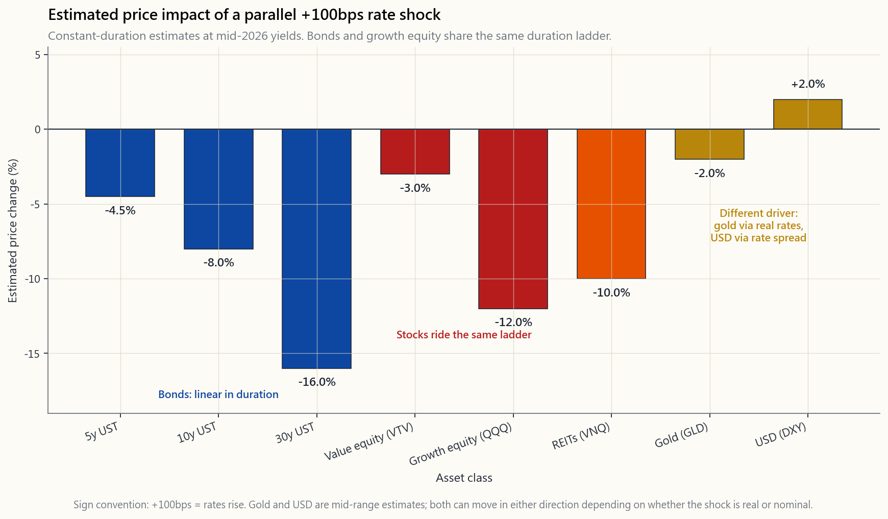
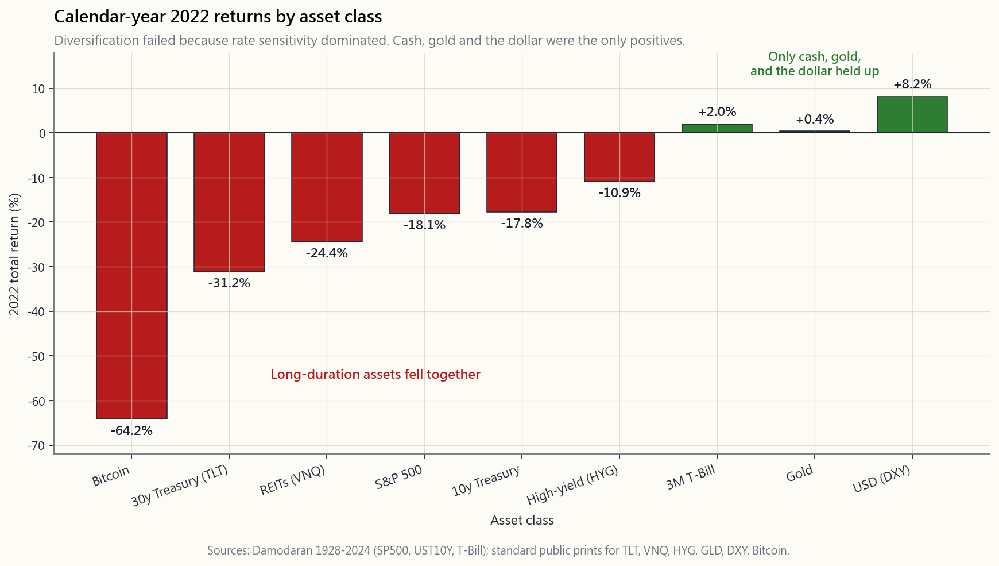

# 第34周：利率敏感性跨资产类别分析

---

## 第一部分：阅读材料

---

### 1. 为什么这很重要

地球上每一种资产的定价，都是将其未来现金流折现至今天。折现率建立在无风险利率之上——即美国国债的收益率。国债收益率一动，全球所有资产的价格都会随之波动。这不是比喻，而是算术。

1. **分散投资是有条件的，而非无条件的。** 六四组合的成立，依赖一个核心假设：股票与债券走势相反。但2022年并非如此。标普500下跌18%，10年期国债下跌18%，房地产投资信托下跌24%，黄金几乎纹丝不动，美元上涨8%。一个"均衡"的投资组合跌了16至17%。原因很简单：同一个+400个基点的冲击同时打击了两条腿，利率敏感性压倒了相关性。

2. **长达40年的顺风已经逆转。** 从1981年到2020年，10年期国债收益率从15%跌至0.5%。利率下行托举了所有对久期敏感的资产：债券、成长股、房地产投资信托、私人信贷、风险投资、杠杆收购。这股顺风让整整一代"买什么都涨"的投资组合看起来似乎充满智慧。2022年顺风逆转时，同样的投资组合显得手足无措。不知道哪些资产对久期敏感的投资者，正是被打了个措手不及的那群人。

3. **利率冲击并非罕见事件。** 自1980年以来，美国经历了沃尔克时代（利率+1000个基点）、2008年（利率-400个基点）、2020年（利率-150个基点）和2022年（利率+525个基点）。大约每十年就有一次改变周期的利率波动。设计一个无视利率冲击的投资组合，就是在为一个并不存在的世界做准备。

4. **仓位大小取决于此。** 一旦你知道30年期债券在+100个基点时约下跌16%，而像ARKK这样的长久期成长型交易所交易基金在同等冲击下下跌12至15%，你就可以停止把它们视为两种不同资产。它们是穿着不同外衣的同一笔交易。利率敏感性是一个统一的分析视角——尾部风险共享同一根源，而波动性尾部正是驱动全局的力量。

本课将为你提供应对下一次+100个基点和-100个基点的跨资产操作手册。第47周将用它来确定尾部风险对冲的规模。

---

### 2. 你需要掌握的知识

#### 2.1 核心公式

每种资产的价格等于其现金流的现值：

$$P = \sum_{t=1}^{\infty} \frac{CF_t}{(1+r)^t}$$

修正久期 $D$ 是利率变动1%时价格的百分比变化：

$$\frac{\Delta P}{P} \approx -D \cdot \Delta r$$

这就是全部的逻辑。现金流时间线越长，$D$ 越大，价格对利率波动的反应就越剧烈。30年期零息债券的 $D \approx 30$。短久期的价值股 $D \approx 5$。长久期的未盈利成长股 $D \approx 30$——这正是为什么ARKK和TLT在2022年同步下跌。

#### 2.2 利率冲击速查表

以下为收益率曲线长端平行+100个基点冲击下各资产的估算价格影响（以2026年中期起始收益率为基准，具有广泛代表性）：

| 资产类别 | 约 $D$ | +100个基点时的价格变动 |
|:--|:--:|--:|
| 3个月短期国债 | 0.25 | -0.25% |
| 5年期国债 | 4.5 | -4.5% |
| 10年期国债 | 8 | -8% |
| 30年期国债 | 16 | -16% |
| 投资级公司债（LQD） | 9 | -10% |
| 高收益公司债（HYG） | 4 | -6% |
| 标普500大盘股 | 18 | -7% |
| 价值股（VTV） | 10 | -3% |
| 成长股（VUG / QQQ） | 22 | -12% |
| 房地产投资信托（VNQ） | 18 | -10% |
| 黄金（GLD） | -- | -2% 至 +5% |
| 长久期加密货币 / 未盈利科技股 | 30+ | -20% 或更差 |
| 美元（DXY） | -- | +1% 至 +3% |

有两类资产不适用久期公式。黄金没有现金流，因此无法直接计算久期——其利率敏感性通过通胀预期体现。美元是相对价格，而非折现现金流，因此其走势取决于美国与外国利率之间的*利差*。我们分别在§2.5和§2.6中单独处理这两类资产。

#### 2.3 债券：与久期成线性关系

债券是教科书级的案例。30年期国债的利率敏感性约为10年期的两倍，约为5年期的四倍。短期国债+30年期零息债券组成的哑铃型组合，其平均久期与10年期子弹型组合相同，但凸性差异显著。对大多数投资组合而言，合适的锚定配置是5至10年期中期国债（IEF、IEI）。30年期国债（TLT、EDV）是一笔*投机性*的利率交易——+100个基点亏损16%，-100个基点获利16%。它属于阿尔法仓位，而非债券仓位。

#### 2.4 股票：隐形的久期

成长股本质上是长久期资产，只是名称上看不出来。2022年的案例是迄今为止最清晰的证据：

- 10年期国债收益率从1.5%升至4.0%（+250个基点）。
- ARKK（长久期未盈利科技股）下跌约67%。
- QQQ（大盘盈利科技股）下跌约33%。
- VTV（价值股，短久期）下跌约5%。
- 这一排名与久期阶梯完全吻合。

规律如下：公司现金流到账时间每延长一倍，其利率敏感性也翻一倍。一家今年盈利5美元、明年盈利5.2美元的银行，久期极小。一家今年亏损1美元、预计2035年盈利50美元的SaaS公司，久期极大。成长溢价就是久期溢价。

#### 2.5 房地产：杠杆放大的久期

房地产投资信托的利率敏感性*极高*，原因在于两重因素叠加。第一，租金流期限较长（资本化率随10年期国债压缩和扩张）。第二，底层物业的杠杆率约为50%，再融资风险放大了利率冲击。2022至2024年间，写字楼房地产投资信托的股权价值损失高达40至50%，同等租金下资本化率从5%上升至7至8%。住宅和工业地产表现相对较好，但VNQ整体在2022年回撤超过30%。经验法则：房地产投资信托的交易特性类似于一只杠杆化的15年期债券。

抵押贷款利率是第二层传导渠道：30年期固定利率从2022年至2023年间由3%升至7.8%，导致住房交易量大幅萎缩。持有浮动利率建设贷款的开发商被迫以更高利率再融资——许多人未能熬过去。

#### 2.6 黄金：取决于*实际*利率，而非名义利率

黄金没有现金流、没有收益率、也没有盈利。其价格是对法定货币信心的反向指标。驱动变量是*实际*利率——10年期名义收益率减去预期通胀（即TIPS盈亏平衡通胀率）。实际利率上升时，黄金下跌（持有零收益黄金的机会成本上升）。实际利率下降时，黄金上涨。

这就是为什么2022年如此特殊：名义利率大幅上升，但通胀同样大幅上升，实际利率仅小幅走高。黄金当年以+0.4%收尾。1980年的情况则恰恰相反：沃尔克将名义利率推高至超过通胀的水平，实际利率大幅转正，黄金从850美元暴跌至300美元。黄金之所以是价值储藏手段，是因为足够多的人*相信*它是，而实际利率正是这种信念的传导机制。

#### 2.7 美元：价差，而非水平

DXY衡量美元兑一篮子贸易伙伴货币的汇率。其走势取决于美国与外国利率之间的*利差*，以及风险偏好溢价。当美联储加息速度快于欧洲央行和日本央行时（2022年），美元升值。当加息速度较慢时（2002至2004年、2017至2018年），美元贬值。若美国利率+100个基点的冲击被外国同等加息所抵消，DXY基本不动。若+100个基点纯属美国单边行动——正如2022年的情形——DXY则上涨5至10%。

强势美元的二阶效应不容忽视：新兴市场走弱，美国跨国公司的海外营收换算受损（标普500约50%的营收来自海外），黄金也面临阻力。我们在多头方面坚持美国本土配置，正是因为美元提供了这层保护。

#### 2.8 2022年案例研究：为何分散投资失效

2022年各资产类别全年收益率（达摩达兰数据库及标准数据来源）：

- 标普500：-18%。
- 10年期国债：-18%。
- 30年期国债（TLT）：-31%。
- 高收益公司债（HYG）：-11%。
- 房地产投资信托（VNQ）：-24%。
- 黄金（GLD）：+0.4%。
- 美元（DXY）：+8%。
- 比特币：-65%。

教科书式的六四组合亏损16至17%。风险平价策略基金（因对债券加杠杆）亏损更多。原因只有一个：美联储+425个基点的冲击同时打击了所有长久期资产。相关性并未"失灵"——相关性始终是有条件的，而这个条件就是温和的利率环境。当利率环境变得恶劣时，相关性便露出了真实面目。

投资者从中得到的启示不是"分散投资已死"，而是"分散投资是针对*驱动变量*而言的"。如果你持有的六类资产都对利率敏感，你拥有的不是六种资产，而是用六个包装持有的同一笔交易。要在利率主导的世界中实现真正分散，你需要对*不同*驱动因素有所敞口：现金、黄金（实际利率对冲）、做空波动性（波动性尾部才是驱动全局的力量），或真正的阿尔法。

---

### 3. 常见误区

1. **"股票始终对冲债券。"** 仅在增长冲击主导利率冲击时成立。在通胀驱动的周期中，两者同步下跌。1970年代和2022年已给出明证。

2. **"成长股是股票，不是债券。"** 在数学上完全不成立。一只定价基于15年后现金流的股票，其久期高于一只15年期债券。标签改变不了数学事实。

3. **"黄金是通胀对冲工具。"** 黄金是*实际利率*的对冲工具。如果通胀上升但名义利率涨得更快（1980年），黄金下跌。如果通胀上升但名义利率滞后（2020至2024年），黄金上涨。

4. **"房地产投资信托是实物资产，所以能对冲利率风险。"** 不对。房地产投资信托是杠杆化的长久期现金流载体。它们对利率的敏感性比股市*更高*，而非更低。

5. **"美元在危机中总会升值。"** 对于流动性危机（2008年、2020年）成立，对于美元自身信心危机（2002至2003年、1970年代末）则不成立。驱动因素是利率利差，而非恐慌程度。

6. **"+100个基点是罕见事件。"** 自1970年以来，美联储大约每十年就会在单一年度移动+100个基点。将投资组合定价为0个基点波动，是认知偏差，而非合理校准。

7. **"债券久期就是到期期限。"** 修正久期考虑了票息因素。30年期零息债券 $D \approx 30$，30年期付息债券 $D \approx 16$，差异显著。

8. **"分散投资就是持有很多种东西。"** 分散投资是持有很多*不相关*的东西。持有十只长久期资产，等于将同一笔交易做了十遍。

9. **"加密货币是对冲工具。"** 比特币在2022年是全球久期最高的资产：在+425个基点的冲击下下跌65%。它做的恰恰与对冲相反。

10. **"房地产因为流动性差所以波动不大。"** 它的波动幅度相同，只是有所滞后。公开上市的房地产投资信托实时揭示真相；私募房地产的估值调整滞后12至18个月。

---

### 4. 问答环节

**问题1：如何快速估算我持有的某只股票所受到的利率影响？**
答：查看其预期市盈率。市盈率为30意味着大部分价值来自遥远的未来现金流，久期约为市盈率×0.7。市盈率30的股票 $D \approx 21$，因此+100个基点约使其下跌21%。市盈率12的股票 $D \approx 8$，同等冲击约使其下跌8%。这是一个粗略估算法则，但准确度出人意料。

**问题2：我应该完全回避长期债券吗？**
答：不——你应该有意地持有它们。30年期国债（TLT、EDV）是少数几类在经济衰退驱动的降息中能*正向获益*的资产之一。在经济衰退情景下，股票下跌而TLT上涨20至30%。关键在于将其规模控制在足够小，使得+100个基点时16%的亏损在可承受范围内。将TLT视为尾部风险对冲工具，而非债券配置。

**问题3：TIPS呢？**
答：通胀保值国债由于部分现金流来自CPI累计调整，其久期*低于*名义国债。10年期TIPS的 $D \approx 7$，且仅对*实际*利率有所反应。若你特别担忧滞胀，TIPS是最直接的利率对冲工具。

**问题4：为什么我的"均衡"六四组合在2022年亏损了17%？**
答：两条腿共享同一驱动因素（长久期折现）。当折现率跳升250个基点时，两条腿同步下调。同一只基金在2008年却赚了钱，因为那是*增长*冲击，而非*利率*冲击——债券上涨而股票下跌。驱动因素不同，结果自然不同。

**问题5：如何在不抛售一切的情况下对冲利率风险？**
答：三种方法：（1）缩短债券久期，将TLT替换为IEI甚至SHV；（2）买入TLT或QQQ的看跌期权（在已实现波动性较低时成本便宜，且期权结构是在美国应税账户中使用杠杆最节税的方式）；（3）持有现金等价物（BIL、SGOV），久期为零且能赚取短端利率。第47周将介绍看跌期权价差尾部对冲策略。

**问题6：这适用于国际市场吗？**
答：适用，但需叠加美元因素。外国债券在本地利率+100个基点时，以本地货币计算按其本地久期下跌。若美元同时升值，换算成美元后的亏损会进一步扩大。这也是我们将多头仓位保持在美国本土的原因之一。

**问题7：为什么公用事业和必需消费品股票被称为"债券替代品"？**
答：它们的股息稳定且增速缓慢，因此大部分价值来自遥远的未来现金流，久期与15年期债券相近。2022年公用事业股仅下跌1%（表现坚韧）；2008年则下跌30%（信用冲击主导）。它们在利率渠道是唯一触发因素时表现得像债券。

**问题8：我的应急资金的"利率敏感性"是多少？**
答：按设计为零。短期国债（BIL、SGOV）、货币市场基金和储蓄账户的 $D < 0.25$。这正是重点所在：现金仓位是唯一不随利率波动的仓位，因此它是利率主导世界中唯一真正的分散化工具。哑铃型构建方式中，现金就在一端，原因正在于此。

**问题9：+100个基点的冲击实际上能有多大？**
答：历史上，美联储在单次紧缩周期中曾移动+400至+525个基点（1981年、1994年、2004至2006年、2022至2023年）。将投资组合定价为"+100个基点"是*温和*情景。交互实验室允许你将冲击调至±300个基点，以观察尾部形态。

**问题10：这在四仓位框架中处于什么位置？**
答：现金仓位：利率敏感性为零。贝塔仓位：持有股票指数不可避免的利率敞口（$D \approx 18$）。因子仓位：向久期较短的价值股（较低 $D$）倾斜，实现部分对冲。阿尔法仓位：主动运用TLT、TLT期权和黄金来表达对利率的主动判断。了解每个仓位的久期，是判断自身实际承担多少利率风险的第一步。

---

## 第二部分：YouTube脚本

---

**视频标题：** 利率敏感性跨资产类别解析——撬动一切的隐藏变量（第34周）
**目标时长：** 约18分钟
**主持人：** 陳馬、小魚

---

### 开场（00:00-01:30）

**小魚：** 欢迎回来。我是小魚，和我一起的是陳馬。今天是第34周，这个话题听起来枯燥，但当你意识到它暗地里解释了过去五十年几乎每一次市场危机之后，你的感觉会完全不一样。

**陳馬：** 利率敏感性。这个隐藏变量，将债券、股票、房地产、黄金乃至美元串联在一起。

**小魚：** 为什么这么重要？

**陳馬：** 因为2022年，很多人亲身体会到了分散投资并非免费的午餐。六四组合亏了17%。风险平价基金亏得更多。以为自己分散持有了不相关资产的人，才发现*同一个*变量——折现率——在驱动他们所有的持仓。

**小魚：** 这正是我们今天要拆解的内容。看完这期视频，你将能够在脑子里估算出：美联储每加息100个基点，各资产类别大概会跌多少。

**陳馬：** 我们先从核心公式说起。

[VISUAL: image/week34_rate_shock_grid.png]

---

### 第一节——核心公式（01:30-03:30）

**陳馬：** 地球上每种资产的定价方式，都是将未来现金流折现到今天。小魚，还记得那个公式吗？

**小魚：** 价格等于第t期现金流除以1加折现率的t次方，然后对所有t求和。

**陳馬：** 对。而修正久期就是折现率每变动1%时价格的百分比变化。现金流时间线越长，久期越大，资产价格对利率冲击的反应就越剧烈。

**小魚：** 所以久期不只是债券的概念。

**陳馬：** 对，它适用于所有有未来现金流的东西。股票、房地产、基础设施、私募股权都一样。问题在于，大多数人学完债券那章就不再讲久期了，所以他们意识不到QQQ的久期相当于一只22年期债券。

**小魚：** 好，那我们逐一过一下各资产类别。

---

### 第二节——条形图解读（03:30-07:00）

[VISUAL: image/week34_rate_shock_grid.png]

**陳馬：** 这张条形图展示了各主要资产类别在+100个基点平行冲击下的估算价格影响。

**小魚：** 从左到右带我过一遍。

**陳馬：** 5年期国债：下跌4.5%。10年期：下跌8%。30年期：下跌16%。这就是债券阶梯，与久期的关系大致成线性。

**小魚：** 然后是股票。

**陳馬：** 成长股，也就是QQQ风格的篮子：下跌12%。价值股，VTV风格的篮子：仅下跌3%。为什么差距这么大？

**小魚：** 久期不同。

**陳馬：** 对。成长型公司的价值存在于15至20年后。价值型公司的价值存在于3至5年内。同样的冲击，对成长股的影响是价值股的四倍。

**小魚：** 然后是房地产投资信托。

**陳馬：** 下跌10%。房地产投资信托本质上是一只杠杆化的15年期债券——期限较长的租金流，叠加约50%的债务杠杆。它对利率的敏感性*高于*大盘。

**小魚：** 黄金和美元呢？

**陳馬：** 黄金的变动范围比较宽，从-2%到+5%都有可能，取决于利率变动反映的是实际利率还是名义利率。这个我们之后再讲。美元通常在鹰派意外时上涨1至3%。

**小魚：** 所以如果我持有一个"分散化"投资组合，里面有成长股、房地产投资信托和30年期国债，我其实并没有实现分散。

**陳馬：** 你把同一笔交易做了三遍。

---

### 第三节——债券与股票：同一条久期阶梯（07:00-09:30）

**陳馬：** 这是一个能纠正大多数人投资组合错误的关键跳跃。股票和债券处在*同一条*久期阶梯上。

**小魚：** 给我看证据。

**陳馬：** 2022年是我们有史以来最清晰的自然实验。10年期国债收益率从1.5%升至4%。ARKK下跌67%。QQQ下跌33%。VTV下跌5%。这个排名就是一条完美的久期阶梯。它们的标签写着"科技交易所交易基金"和"价值交易所交易基金"，但数学告诉你的是"长久期现金流"和"短久期现金流"。

**小魚：** 债券阶梯也同步运行。

**陳馬：** TLT下跌31%。10年期下跌18%。5年期下跌9%。股票和债券既没有"脱钩"也没有"失灵"——它们的表现完全符合久期公式的预测。

---

### 第四节——房地产与杠杆放大效应（09:30-11:30）

**陳馬：** 房地产值得单独拿出来讲，因为它有杠杆放大效应。

**小魚：** 什么意思？

**陳馬：** 大多数商业地产的融资结构约为50%债务。所以当利率上升时，两件事同时发生。第一，资本化率上升，意味着未来租金以更高利率折现。第二，偿还现有债务的成本上升，再融资变得更贵。两种效应共同压低股权价值。

**小魚：** 写字楼板块受冲击最大。

**陳馬：** 2022至2024年间，部分写字楼的股权价值损失了40至50%。同样的租金，资本化率从5%升至7至8%。这是久期加杠杆的双重打击——非常惨烈。

**小魚：** 那如果我想持有房地产敞口但降低利率风险呢？

**陳馬：** 选择低杠杆率的房地产投资信托，偏向租约期限较短的板块，比如工业地产或自助仓储，并且把仓位控制得比大盘更小。或者直接持有VNQ，但把它当成杠杆化15年期债券来看待。

---

### 第五节——黄金与实际利率视角（11:30-13:30）

**陳馬：** 黄金打破了久期公式，因为它没有现金流。

**小魚：** 那我们怎么给它定价？

**陳馬：** 将其视为*实际*利率的函数。即10年期名义收益率减去盈亏平衡通胀率。实际利率上升，黄金下跌——持有零收益黄金的机会成本升高了。实际利率下降，黄金上涨。

**小魚：** 那2022年呢？利率大幅上升，但黄金基本没动。

**陳馬：** 因为名义利率大幅上升的同时，通胀也大幅上升。实际利率只是小幅走高。所以黄金当年以+0.4%收尾。这个案例完美验证了实际利率框架。再对比1980年：沃尔克将名义利率推高至超过通胀的水平，实际利率大幅转正，黄金从850美元崩跌至300美元。

**小魚：** 黄金是价值储藏手段，是因为足够多的人相信它是。

**陳馬：** 实际利率是这种信念的传导机制。当实际利率为正且稳定时，黄金的叙事就会减弱。当实际利率为负时，叙事就会增强。

---

### 第六节——美元是利差，而非水平（13:30-14:30）

**陳馬：** 美元是最后一块拼图。DXY不是一个水平值，而是一个相对价格——美国利率对比外国利率。

**小魚：** 所以全球同步+100个基点不会撼动DXY。

**陳馬：** 对。纯属美国单边行动的+100个基点冲击，在欧洲央行和日本央行按兵不动的情况下，会推动DXY上涨5至10%。2022年正是这种情况。我们在多头方面坚持美国本土配置，美元正是这么做的原因——当美元升值时，我们以强势货币计算收益，而外国市场则同时承受自身的利率冲击和汇率换算损失。

---

### 第七节——2022年案例研究（14:30-16:30）

[VISUAL: image/week34_2022_case.png]

**陳馬：** 这是2022年各资产类别全年收益的条形图。标普500：-18%。10年期国债：-18%。TLT：-31%。房地产投资信托：-24%。黄金：+0.4%。美元：+8%。比特币：-65%。

**小魚：** 看这张图，分散投资好像死了。

**陳馬：** 分散投资始终是有条件的，条件就是*驱动变量*不能是共享的。在利率主导的年份，所有长久期资产同向运动。2022年唯一奏效的，是那些低利率敏感性或负利率敏感性的资产：现金、黄金、美元，以及部分大宗商品。

**小魚：** 所以教训是……

**陳馬：** 对驱动因素做分散，而不是对标签做分散。持有十只长久期交易所交易基金，等于将同一笔交易做了十遍。

---

### 第八节——交互实验室（16:30-17:30）

[VISUAL: interactive/week34_shock_lab.html]

**陳馬：** 本周的交互内容是一个压力测试实验室。三个滑块：利率冲击从-300到+300个基点，通胀冲击从-3%到+3%，美元冲击从-10%到+10%。拖动滑块，八类资产的条形图会实时更新。

**小魚：** 还有历史情景预设。

**陳馬：** 对，包括1981年沃尔克、2008年全球金融危机、2020年新冠疫情、2022年通胀冲击，以及2026年温和情景。点击每一个，就能看到每段历史时期对均衡投资组合造成了什么影响。

**小魚：** 沃尔克那个预设真的很震撼。

**陳馬：** 那是我们大多数观众的父母经历的周期。在经历了40年的降息顺风之后，这个周期是我们必须认真对待的。

---

### 结语（17:30-18:00）

**陳馬：** 三个核心要点。第一：每种资产的久期就是它的利率敏感性，不只是债券。第二：在利率主导的年份，所有长久期资产的相关性趋向于1。第三：唯一真正的分散化工具是现金、基于实际利率的黄金，以及具有完全不同驱动因素的资产。

**小魚：** 下周是第35周——通胀保值国债：最直接的利率对冲工具。

**陳馬：** 第47周，我们将用今天这套框架，来确定应对下一次2022年式冲击的尾部风险对冲规模。

**小魚：** 下周见。