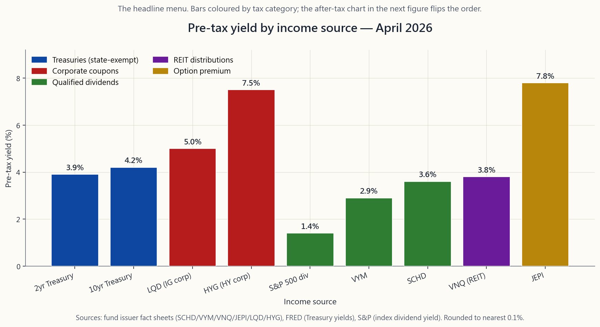
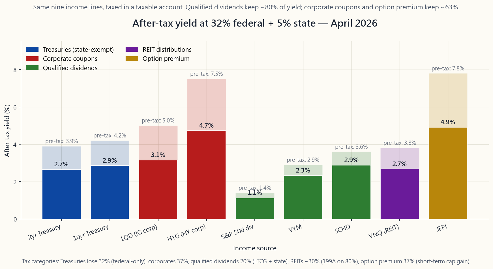

# 第三十六周：构建收入型投资组合——L3模块收官篇

---

## 第一部分：阅读材料

---

### 1. 为什么这很重要

本教程此前每一周都假设你处于积累阶段——工作、储蓄、复利增长。本周假设恰恰相反。你已经积累了财富。现在你需要让它*为你创造收入*。无论这笔财富是用于65岁退休，是为退出职场的伴侣提供生活保障，还是仅仅用来支付每年九月到期的学费账单，一旦你从积累阶段翻转到分配阶段，优化问题的形态就会彻底改变。你不再是在优化最终财富，而是开始优化*按时、税后、以最小概率耗尽的可落入支票账户的现金*。

以下四个原因说明这一主题为何是L3收入模块的重要收官篇。

1. **收入在机制上比增长更难。** 成长型投资组合只需要复利增长。收入型投资组合则必须在复利增长的同时，产生稳定的现金，并且在头十年表现不佳的情况下依然存活——即"收益序列风险"，著名的4%法则正是为解答这一问题而诞生的。我们将在2026年详细解释为什么4%法则在精神上是正确的，而在细节上却有误导性。
2. **收益率来源并非可互换的。** 5%的国债票息、5%的合格股息、5%的房地产投资信托分配，以及5%的备兑看涨期权权利金，在券商账单上看起来完全相同，实质上却是截然不同的产品。它们具有不同的违约风险、不同的通胀敏感性、不同的回撤特征，以及——最为昂贵的——不同的税务处理方式。一个忽视这些差异的投资组合，可能在毫无必要的情况下将30%的*可支配*收益率拱手让给税务机关。
3. **税后收益率的排序是你能掌控的最大杠杆。** 税务效率是本文明确的核心支柱。在32%的联邦税率档次下，每一美元合格股息可保留约80美分。债券票息只能保留约63美分。短期期权费也只能保留同样的63美分——视所在州情况，有时更低。你将应税账户、个人退休账户（IRA）和罗斯账户中的各类收入来源进行合理排列组合，其价值远超挑选更好的个股。
4. **四档框架和杠铃策略需要在分配阶段重新诠释。** 在积累阶段，四档结构指导的是*如何配置资产*。在分配阶段，它指导的是*本季度从哪个账户提取资金*。这一收入模块收官篇，正是将第4-5周（60/40与债券）、第14-15周（配对交易与杠铃策略）以及第26-28周（期权作为订单工具）的内容，缝合成一台统一的现金生产机器。

本课将阐述四类真实收入来源、税后收益率阶梯、标准产品菜单（股息股票方面：SCHD / VYM / DVY / SPYI；固定收益方面：BND / VTEB / PFF；房地产投资信托方面：VNQ；期权费策略方面：JEPI / JEPQ），以及4%法则及其2026年的修正批评，并以两个模型投资组合收尾——一个应税账户版本，一个税优账户版本——均以产生4-5%的可持续收益率为目标，同时保持类债券的波动性。

---

### 2. 你需要掌握的内容

#### 2.1 投资组合收入的四大真实来源

剥去所有产品包装，美国投资组合实际上只有四种方式能产生现金。请记住这份清单。市面上发行的每一只收益类交易所交易基金，都是这四种成分的某种组合包装。

1. **国债票息。** 美国政府承诺偿付。违约风险约等于零。不适用州和地方所得税。联邦税以普通税率征收。2年期国债是安全仓位无法合理低于的底线；10年期国债是均衡投资组合的久期锚。
2. **投资级和高收益公司债票息。** 公司向你借款并支付利息。投资级（LQD、AGG的公司债部分、BND的公司债部分）收益率比国债高80-150个基点。高收益（HYG、JNK）比国债高250-450个基点。两者均在联邦*和*州层面缴纳普通所得税，这在计算税后收益时至关重要。
3. **合格股息。** 满足美国国税局持有期要求的长期持有普通股股息，按长期资本利得税率征税：联邦税率为0/15/20%，具体取决于所在税率档次，另加州税。截至2026年4月，标准普尔500指数的收益率约为1.4%。精选股息交易所交易基金（SCHD、VYM、DVY）的收益率为2.5-3.7%。高于指数的溢价是倾向于"无聊"板块——必需消费品、医疗保健、金融、工业——并远离推动2020年后反弹的轻资产成长股——所付出的代价。
4. **期权费。** 出售看涨期权或看跌期权（第26-28周）可创造短期收入。几乎没有例外，股票期权费在联邦*和*州层面均按短期资本利得税率征税。JEPI（约7-8%）、QYLD、PUTW、SPYI以及整个买入-卖出备兑期权基金系列的标题分配收益率之所以高企，正是因为税务机关会先咬下一大口。

你在营销材料中会看到的第五个类别——房地产投资信托分配——部分属于第2类（房地产投资信托通过其收取的利息和租金进行分配），部分属于第3类（来自任何股权持仓的合格股息）。自2018年起，作为包装结构的房地产投资信托在投资者层面可享受20%的第199A条扣除，这使其在税务上略优于原始债券票息，但仍明显劣于合格股息。

收益率层次图展示了截至2026年4月的*标题*（税前）数字，请将其视为税前的产品菜单。

#### 2.2 税后层次结构，以及它为何颠覆产品菜单

税前来看，JEPI的7.8%看起来是明显的赢家。但在应税账户中，以32%联邦税率加5%州税计算，情况就会逆转。下一张图表对每个项目适用了正确的税率：

- 国债票息：32%联邦税，0%州税⇒有效税率32%。
- 投资级/高收益公司债票息：32% + 5% = 有效税率37%。
- 合格股息（标普500、SCHD、VYM、DVY）：15%联邦长期资本利得税 + 5%州税 = 有效税率20%。
- 房地产投资信托分配（VNQ）：37%综合税率，但第199A条扣除将*应税*部分降至80%，有效税率约为29.6%。
- 期权费类交易所交易基金（JEPI/QYLD/SPYI）：32% + 5% = 有效税率37%。

税后，SCHD的3.6%变为2.9%。JEPI的7.8%变为4.9%。纵轴上的11个基点差距，远比标题数字看起来要小得多。而且，当你将期权费类交易所交易基金相对于其底层指数的历史表现不足纳入考量（第27周，QYLD对比QQQ；第28周，PUTW对比SPY），那个表面上的收益率溢价大多数是你*白白付给自己*的税收漏损。

由此得出的操作规则：

- **在应税账户持有合格股息股票**——优惠税率正是其价值所在。
- **在IRA/401(k)中持有期权费和高收益公司债仓位**——税收损耗被递延（传统IRA）或消除（罗斯IRA）。
- **如果你居住在高州税州**（加州/纽约/夏威夷），在应税账户持有国债——州税豁免是免费的5%。
- **如果你的税率档次足够高，以至于第199A条扣除无法完全抵消州税率，则在IRA中持有房地产投资信托。**

这是账户位置配置，而非资产配置。这是美国税法给予你的为数不多的免费午餐之一。

#### 2.3 标准产品菜单

理论只有在你能用三四个代码在先锋、富达或嘉信账户中实际操作时才有意义。以下是截至2026年4月按仓位划分的产品菜单。

**股息股票（合格收益，收入增长型）。**
- `SCHD` — 嘉信美国股息股票基金。约100只持仓，设有10年股息增长筛选标准，在工业、必需消费品、医疗保健板块均衡配置。收益率约3.6%，费用率6个基点。
- `VYM` — 先锋高股息率基金。约440只持仓，在高收益率半段指数内按市值加权。收益率约2.9%，费用率6个基点。
- `DVY` — 安硕精选股息基金。约100只持仓，价值倾向比SCHD更重。收益率约3.4%，费用率38个基点。
- `SPYI` — NEOS标普500高收益基金。在指数跟踪基础上叠加部分看涨期权卖出策略；定位为股息股票与期权费的混合型产品。标题收益率约12%，但期权费部分继承了期权费的税务问题。

这个收益率阶梯是真实存在的。SCHD由设计决定处于阶梯中段——股息增长筛选标准过滤掉了那些因陷入困境而收益率最高的标的。这是一个*特性*，而非缺陷，也正是我们在第2.6节模型投资组合中将SCHD作为默认股息仓位的原因。

**固定收益。**
- `BND` — 先锋美国总债券市场基金。国债 + 投资级公司债 + 机构抵押贷款证券，中等久期约6年。核心债券的默认选择。
- `VTEB` — 先锋免税债券基金。投资级市政债券。对应税账户中税率较高的投资者而言，税后等效收益率会大幅提升；对于联邦税率在32%或以上的应税账户投资者，这是债券仓位的正确工具。
- `PFF` — 安硕优先股及收益证券基金。优先股，收益率6-7%，但大多数优先股由金融公司发行，因此该仓位实质上是对银行信用风险的押注，而非纯粹的债券。
- `TLT` / `IEF` — 长期和中期国债久期工具，用于在需要将利率敞口与信用敞口分离时使用。

**实物资产/通胀对冲。**
- `VNQ` — 先锋房地产基金。房地产投资信托仓位。收益率约3.8%，通胀敏感性来自租金上调条款和房地产的重置成本股权。
- `SCHH` — 更低成本的房地产投资信托替代品，特征相似。

**期权费策略（第26-28周）。**
- `JEPI` — 摩根大通股票溢价收益基金。约80%防御性低波动性股票 + 约20%合成看涨期权卖出权利金的股权挂钩票据。收益率约7-8%，费用率35个基点。该类别规模最大的基金。
- `JEPQ` — JEPI的纳斯达克版本。波动性更高，收益率更高，收益特征更接近QYLD，但在股票仓位上有主动选股。
- `QYLD` / `XYLD` / `RYLD` — 分别对QQQ / SPY / IWM进行被动式月度平值买入-卖出备兑期权的基金。纯看涨期权卖出敞口；上行封顶十分严重（第27周）。
- `PUTW` / `WTPI` — 系统化看跌期权卖出交易所交易基金。与买入-卖出备兑期权镜像相反；以下行缓冲替代上行封顶（第28周）。

#### 2.4 4%法则及其在2026年需要更新的理由

本根（1994年）和三一研究（1998年）为退休人员提供了金融领域被引用最多的经验法则：持有一个60/40投资组合，你可以安全地提取*初始余额*的4%，每年按通胀上调该金额，并在30年退休期内有超过95%的概率不会耗尽资金。该法则基于1926-1995年美国数据的滚动30年窗口。

三件事发生了变化。

1. **债券收益率在本根的研究窗口开始时超过7%，典型的退休窗口开始时超过5%。** 2010-2021年的零利率时代严重削弱了债券对4%法则可持续性的贡献。普法等人的更新研究表明，对于*始于*2010-2020年的退休投资组合，安全提款率低至2.8%。2022-2024年的收益率重置已将其拉升至约3.5-3.8%。2026年4月是自2008年以来，相关数学逻辑首次接近原始数字的时刻，但仍不是4%。
2. **收益序列风险占主导地位。** 一位在1973-1974年（60/40实际下跌约30%）持续提款4%的退休人员，在约第22年便耗尽了资金。一位在1995-1999年（60/40实际上涨约140%）持续提款4%的退休人员，在退休期结束时拥有约起始余额十倍的财富。相同的法则、相同的数字序列、相同的资产组合——却是截然不同的亲历体验。
3. **可变支出规则优于固定实际支出。** 古顿-克林格护栏法则、博格尔头的"提取当前余额的固定百分比"法，以及先锋的"动态支出"策略，在蒙特卡洛模拟中均以50-100个基点的安全提款率超越固定4%法则，而行为成本几乎为零。本周的互动工具使用了简化版本：目标为*当前余额*的4-5%，设有硬性上下限。

2026年4月，对于没有可支出灵活性的60/40投资组合退休人员，诚实的数字约为3.7%。对于愿意在糟糕的年份削减10-15%支出的人，则为4.5%。第2.6节的模型收入投资组合正是围绕4-5%的目标设计的。

#### 2.5 分配阶段的四档框架

积累阶段的四档结构可以清晰地转化为分配阶段。相同的账户仓位依然存在；*现金流动的方向*发生了逆转。

| 档位 | 积累阶段用途 | 分配阶段用途 |
|---|---|---|
| 1. 现金/短期国库券 | 应急资金 | 1-2年支出，"免卖区" |
| 2. 债券 | 波动性缓冲 | 5-7年支出；在好年份从第3档补充 |
| 3. 多元化股票 | 复利增长引擎 | 财富机器；为第2档补充 |
| 4. 集中押注 | 非对称上行 | 可选收益叠加（JEPI、期权费策略） |

杠铃策略是其横截面：一端是短久期安全收入（短期国库券、2年期国债、应税账户中的VTEB），另一端是长久期实物资产（VNQ、股息增长股票、可选期权费叠加）。中间部分——长久期中期国债——是分配型投资组合中*最没用*的仓位，因为与两端相比，它既没有长期国债提供的名义利率敏感性，也没有股票和房地产提供的通胀传导性。

第2.7节的互动工具是其实时版本。你设定五个仓位的组合比例，系统将给出综合收益率、税后收益率（含税率档次切换功能）、预期波动性和预期回撤。

#### 2.6 两个模型投资组合

两个参考基准。两者均以产生4-5%税前分配收益率、实现类债券波动性（年化标准差8-10%）为目标。两者今天均可在任何主要美国券商以低于12个基点的加权费用率建立。

**模型A——应税账户，32%联邦税率档次。**

| 仓位 | 代码 | 权重 | 收益率 | 理由 |
|---|---|---:|---:|---|
| 股息股票 | SCHD | 35% | 3.6% | 合格股息，低费用率，行业多元化 |
| 股息股票 | VYM | 10% | 2.9% | 增加广度，市值加权 |
| 免税债券 | VTEB | 25% | 3.4%（≈5.0%税后等效收益率） | 联邦免税；大幅提升税后收益率 |
| 房地产投资信托 | VNQ | 10% | 3.8% | 通胀传导；第199A条部分减免 |
| 国债 | IEF（7-10年期） | 15% | 4.2% | 州税豁免锚点 |
| 短期国库券 | SGOV | 5% | 4.5% | 支出缓冲 |
| **加权合计** | | **100%** | **3.7%** | 税后≈3.0% |

年化波动性约9%；最大回撤估计为-22%（1973年式通胀冲击或2022年式双重下跌）。税后分配收益率3.0%；采用余额比例可变支出规则，可维持4.0-4.5%的实际支出。

**模型B——税优账户（IRA/401(k)），32%税率档次。**

| 仓位 | 代码 | 权重 | 收益率 | 理由 |
|---|---|---:|---:|---|
| 股息股票 | SCHD | 30% | 3.6% | 合格股息优势在此浪费；此处保留是为了股息增长 |
| 期权费策略 | JEPI | 15% | 7.8% | 税前收益率最高；IRA内税务无关紧要 |
| 总债券 | BND | 25% | 4.6% | 投资级+国债混合 |
| 高收益公司债 | HYG | 10% | 7.5% | 信用溢价；高收益在应税账户受到惩罚性征税 |
| 房地产投资信托 | VNQ | 10% | 3.8% | IRA内第199A条无关紧要 |
| 现金 | SGOV | 10% | 4.5% | 缓冲 |
| **加权合计** | | **100%** | **5.1%** | 税后 = 5.1%（账户内免税） |

年化波动性约10%；最大回撤估计-25%。IRA投资组合税前收益率更高，因为每种收入来源的税务处理完全相同——因此，受惩罚性征税的仓位恰好集中于此，因为在这里，惩罚不再适用。

互动工具允许你构建任一模型，税率档次切换功能可并排显示模型A和模型B的税后数字。

#### 2.7 实时构建工具

互动工具是一个五仓位配置器：国债、投资级公司债、合格股息、房地产投资信托、期权费。它计算税前收益率（加权平均）、税后收益率（按所选税率档次对各税务类别加权）、预期波动性（加权协方差的平方根）以及预期最大回撤（启发式方法：每个仓位历史最大损失的0.6倍，按权重混合）。税率档次切换涵盖12% / 22% / 32% / 37%，即实际资产配置决策所在的四个档次。使用它来验证第2.6节的模型投资组合；也用它来测试你自己的组合。

---

### 3. 常见误解

1. **"高收益率总是更好。"** 不。税前收益率在没有税后转换和违约风险调整的情况下，只是营销级别的算术。JEPI在37%税率档次的应税账户中，7.8%变为4.9%。SCHD在同一账户中，3.6%变为2.9%。差距仅为标题数字的三分之一。
2. **"国债是免税的。"** 国债是免*州*税的。它们在联邦层面是完全应税的。在德克萨斯、佛罗里达或田纳西，这一区别无关紧要；但在加利福尼亚或纽约，这个差异约占票息的5%。
3. **"市政债券总是优于国债。"** 只有当你的联邦税率 × （1 - 州税率调整）使税后等效收益率更高时才成立。在12%联邦税率档次，市政债券几乎永远不会胜出；在32%联邦税率档次，它们几乎总是胜出。
4. **"备兑看涨期权交易所交易基金提供免费收益。"** 不。收益率是预先出售上行空间的代价（第27周）。在完整的市场周期中，JEPI和QYLD的表现比其无对冲底层资产落后300-500个基点（年化）。
5. **"房地产投资信托股息是合格股息。"** 大部分情况下不是。大多数房地产投资信托的分配是非合格普通收入，部分受20%第199A条扣除的庇护。
6. **"股息股票比指数更安全。"** 有时如此。标普500指数中的派息股票半段，贝塔值低于整体指数，但在信用/金融危机（2008年）中，主导股息类交易所交易基金的银行股和房地产投资信托，跌幅反而超过指数。
7. **"退休后应该将股息再投资。"** 如果你确实需要现金，则不应该——这样做相当于一手买入、一手卖出，并在应税账户中产生可避免的税务负担。
8. **"4%提款率在任何市场环境下都有效。"** 它对1926-1995年的美国数据样本有效。在对非美国样本的回测中以及在零利率时期*屡屡失效*。2026年4月的数学逻辑接近再次成立；对于缺乏灵活性的退休人员，请按3.5-4.0%规划。
9. **"债券与股票总是负相关的。"** 第4周详细讨论了这个问题。1970年代和2022年的案例足以证明情况恰恰相反。
10. **"应该先选收益率最高的仓位，再补充其他仓位。"** 这是本末倒置。应该先选每单位回撤贡献所对应的*税后预期收益*最高的仓位。

---

### 4. 问答环节

**Q1：我的券商显示JEPI的"30日美国证监会收益率"为8.4%，而"分配收益率"为7.6%。哪个才是正确的？**

分配收益率是过去12个月落入你账户的实际金额除以当前价格。美国证监会收益率是监管机构定义的前瞻性估算，基于最近一个月的现金流年化得出。对于持仓稳定的基金，两者应在50个基点以内。对于期权费收入随波动率指数变化的期权溢价收益基金，美国证监会收益率可能在任何方向产生误导。使用分配收益率做预算；使用美国证监会收益率做跨基金比较。

**Q2：我应该购买个券还是BND？**

对于低于约10万美元的债券敞口，选BND。该基金持有约10,000只债券，你无法在零售规模下复制这种分散投资。超过这一规模，在拍卖市场购买个人国债颇具吸引力——你可以控制到期日、进行梯形配置，并省去3个基点的费用率。在零售端购买个别公司债则是个陷阱：价差宽、流动性差，一旦发生信用事件，持仓将遭受重创。

**Q3：构建一个"60/40收益率组合"——一半合格股息，一半债券票息——怎么样？**

这基本上就是第2.6节的模型A。分配收益率税前约为3.7%，在32%税率档次下税后约为3.0%。波动性类似债券（约9%）。对于基准型退休投资组合而言，这是正确的方向——但如果你的账户是应税的，应将债券倾向VTEB，并优先选择SCHD而非VYM，以获取股息增长倾向。

**Q4："持仓成本收益率"这个指标有用吗？**

作为激励自己的参考，有用。用于决策，没用。持仓成本收益率上升是因为你支付的价格固定而股息在增长。它无法告诉你，你的*当前资本*相对于其他替代选择是否正在产生足够的收益率。始终比较当前分配收益率，而非成本基础收益率。

**Q5：如何判断高收益率是否可持续？**

三个快速筛选指标。（a）派息率：工业和必需消费品行业股息/盈利低于70%，公用事业低于90%，房地产投资信托低于95%。（b）自由现金流覆盖率：股息加股票回购低于自由现金流。（c）基金的分配历史：它在2008、2020、2022年是否进行过削减？买入-卖出备兑期权基金在2022年削减是正常的；股息股票基金削减则是一个信号。

**Q6：优先股怎么样？**

PFF收益率约6.5%，感觉像债券，但它不是。优先股的清偿顺序在债券之后、普通股之前，且几乎完全由银行和保险公司发行。2008年金融危机几乎将银行优先股彻底摧毁。将其配置于债券仓位的5-10%是很好的收益率增强工具；若配置至30%以上，则形成高度集中的银行信用押注。

**Q7：应该在债券上使用杠杆（NTSX、RPAR等）吗？**

杠杆式"股债合一"产品会放大相关性假设。在1995-2021年效果极佳，并在2022年股债双杀时崩溃。它们是积累阶段的工具，而非分配阶段的工具。请勿将其用于收入仓位。

**Q8：应该多频繁地对收入型投资组合进行再平衡？**

每年一次，加上按日历驱动的支出缓冲仓位补充。"智慧"规则是：在股票仓位大幅上涨的年份，将18个月的支出补充到现金和债券中；在持平或下跌的年份，不要卖出股票——从现金和债券中提取。这正是四档框架的逆向运作。

**Q9：国际股息交易所交易基金（VYMI、IDV）怎么样？**

我们的默认范围是美国本土可投资标的。国际股息交易所交易基金在金融和能源板块的集中度较高，并引入预扣税漏损，蚕食合格股息税率。如果你想要非美国敞口，请通过投资组合的*总收益*端（即股票增长仓位）来实现，而非通过收入仓位。

**Q10：有没有一只基金中的基金能为我解决所有这些问题？**

最接近的是`VTINX`（先锋目标退休收入基金）、`AOK`（安硕保守配置基金），或`JAAA` + `JBBB`（Janus Henderson AAA/BBB级CLO基金，用于信用倾斜的收入仓位）。它们都能解决部分问题，却没有一个能解决第2.2节中的账户位置配置问题——而那正是你所能获得的最大税后收益率提升来源。请逐仓位构建。

**Q11：我应该持有多少现金？**

对于退休人员，持有1-2年的支出。对于在职积累者，持有3-6个月。不对称的原因在于尾部风险。一位被迫在30%回撤时卖出股票来支付当月生活费的退休人员，对复利的破坏远超任何1%的现金拖累所带来的损失。现金仓位是对抗糟糕序列尾部风险的保险。

**Q12：年金怎么样？**

在75-80岁时购买一次性即时年金（SPIA），对于你确实需要保底的那部分投资组合而言，往往比4%法则更优。正确的思考框架不是"要不要年金"，而是"社会保障覆盖了多少基础支出，以及我是否需要用SPIA补足余下部分？"这更多是一个财务规划问题，而非投资问题——也是在合适年龄咨询收费制受托人的充分理由。

---

## 第二部分：YouTube 脚本

---

**视频标题：** 构建真正为你创造收入的投资组合——L3模块收官篇（第36周）

**目标时长：** 约18分钟

**主持人：** 陳馬、小魚

---

### 开场

**[VISUAL: title card "Week 36 — Building an Income Portfolio"]**

**小魚：** 陳馬，这是收入模块的收官篇。第4、5周我们讲了60/40和债券。第26、27、28周我们讲了期权作为限价单工具。现在我们把所有内容整合在一起。用一句话概括是什么？

**陳馬：** 税前收益率是拿来做广告的。税后收益率才是*真正能花的钱*。而两者之间的差距，比几乎所有人意识到的都要大。

**小魚：** 而我们是在2026年4月来讲这个话题的，现在的收益率环境终于让这套数学逻辑再次成立了。

**陳馬：** 对。2年期国债3.9，10年期4.2，投资级公司债5，高收益7.5，标普500股息率1.4，SCHD 3.6，JEPI 7.8。这份菜单在将近十年里*根本拿不到*。我们短期内不会回到零利率时代了。所以这节课就是我们停止优化最终财富，开始优化按时到账、税后可用的现金的地方。

**小魚：** 先带我看看四大真实收入来源，然后我们再做税后换算——正是那个换算会把整个菜单翻转过来。

---

### 第一部分——四大收入来源

**[VISUAL: image/week36_yield_hierarchy.png]**

**陳馬：** 剥去所有产品包装，美国投资组合产生现金的方式恰好只有四种。国债票息。公司债票息——投资级或高收益，信用风险阶梯。普通股的合格股息。以及期权费。这就是整份菜单。其他一切都只是包装。

**小魚：** 房地产投资信托呢？

**陳馬：** 房地产投资信托是混合体。大部分分配是非合格普通收入，因为它来自租金，但有一部分是来自房地产投资信托以控股公司形式运营的任何股票的真实合格股息。国税局在普通收入部分给予20%的第199A条折扣，这就是为什么它在税后图表上处于公司债票息和合格股息之间。

**小魚：** 屏幕上的这张图——那是税前菜单。

**陳馬：** 对。看这些柱子。JEPI 7.8，看起来是冠军。HYG 7.5，看起来很棒。SCHD 3.6，看起来平平无奇。标普500股息率1.4，看起来毫无意义。

**小魚：** 现在来算税。

---

### 第二部分——税后大翻转

**[VISUAL: image/week36_tax_adjusted.png]**

**陳馬：** 这是同一张图，在32%联邦税率加5%州税之后的样子。国债损失32%的收益率，因为它们免州税。公司债损失37%，因为不免。合格股息——SCHD、VYM、标普500——只损失20%，因为享受长期资本利得税率。房地产投资信托在第199A条折扣后损失约30%。期权费基金——JEPI、QYLD、SPYI——损失完整的37%，因为短期期权费就是短期资本利得。

**小魚：** 所以JEPI 7.8变成……

**陳馬：** 4.9%。

**小魚：** SCHD 3.6变成……

**陳馬：** 2.9%。税前差距是4.2个百分点。在应税账户税后，差距是2.0个百分点。你刚刚为*制造*这个表面优势，每一美元收益率付了2.2美分给税务机关。

**小魚：** 而我们还没算上JEPI比标普500每年总收益落后300到500个基点的问题。

**陳馬：** 对，那是第27周的话题——上行封顶问题。税后收益率*加上*总收益拖累，JEPI在应税账户中的优势实际上是负数。

**小魚：** 由此得出的操作规则是什么？

**陳馬：** 账户位置配置。合格股息股票放应税账户，因为优惠税率正是其价值所在。期权费和高收益公司债仓位放IRA，在那里税收损耗被递延或消除。如果你住在高州税的州，国债放应税账户。高税率档次下，房地产投资信托放IRA。这不是关于*挑选*更好的基金，而是关于*放置*它们的位置。

---

### 第三部分——产品菜单

**陳馬：** 快速浏览一下标准产品菜单。整个组合用八个代码就能构建。

**小魚：** 股息股票仓位。

**陳馬：** SCHD是默认选择。嘉信美国股息股票基金。约100只持仓，10年股息增长筛选，费用率6个基点，收益率3.6%。VYM是广度替代方案——440只持仓，市值加权，收益率2.9%。DVY价值倾向更重。SPYI是一个叠加了部分期权卖出的混合产品；我将其视为一半股息股票、一半期权费策略——而期权费那部分继承了期权费的税务问题。

**小魚：** 固定收益。

**陳馬：** BND作为核心债券——国债加投资级公司债加机构抵押贷款证券。VTEB是应税账户中的市政债券等价物。PFF用于优先股，但将其上限控制在债券仓位的5到10%以内，因为优先股大多是包装在债券外壳中的银行信用风险押注。TLT和IEF是纯久期工具。

**小魚：** 实物资产。

**陳馬：** VNQ用于房地产投资信托。SCHH是更低成本的替代品。这是你的通胀传导仓位。

**小魚：** 期权费策略。

**陳馬：** JEPI是巨头。80%低波动性股票，20%合成看涨期权卖出权利金的股权挂钩票据。费用率35个基点。JEPQ是纳斯达克版本。QYLD、XYLD、RYLD是第27周讲的被动买入-卖出备兑期权基金。PUTW是第28周的看跌期权卖出等价物。

---

### 第四部分——2026年的4%法则

**陳馬：** 小魚，你记得4%法则。

**小魚：** 本根1994年，三一研究1998年。持有60/40退休，提取*初始余额*的4%，对金额做通胀调整，持续30年，成功率超过95%。

**陳馬：** 三件事发生了变化。第一——该法则是在1926-1995年的美国数据上校准的，而典型的30年窗口开始时，债券收益率超过5%。2010-2021年的零利率时代将其彻底击垮。普法等人重新计算了数据；对于*起始于*那个窗口的退休投资组合，安全提款率降至约2.8%。

**小魚：** 现在呢？

**陳馬：** 2022-2024年的收益率重置已将其拉升至约3.5-3.8%。2026年4月是自2008年以来，数学逻辑首次接近原始数字的时刻。但仍然不是4——如果你对通胀调整金额态度强硬，那是3.7。

**小魚：** 第二点？

**陳馬：** 收益序列。相同的数字序列，相同的资产组合，但时间顺序颠倒——亲历体验截然不同。1973年退休的人在第22年耗尽了资金。1995年退休的人结束时拥有起始余额十倍的财富。

**小魚：** 第三点？

**陳馬：** 可变支出策略优于固定支出策略。古顿-克林格护栏法则、提取当前余额固定百分比，以及先锋的动态支出策略——在蒙特卡洛模拟中，它们的安全提款率均比固定4%法则高出50到100个基点，行为成本几乎为零。对于愿意在糟糕年份削减10-15%的退休人员，4.5%这个数字是可以实现的。

---

### 第五部分——互动工具：自建组合

**[VISUAL: interactive/week36_income_builder.html]**

**小魚：** 带我看看这个构建工具。

**陳馬：** 五个滑块，每个仓位一个。国债、投资级公司债、合格股息、房地产投资信托、期权费。合计为100。有一个税率档次切换——12、22、32、37。顶部的四个数字分别是税前收益率、税后收益率、预期波动性和预期最大回撤。

**小魚：** 我们来载入模型A——应税账户投资组合。

**陳馬：** 国债20，投资级公司债25——把这个算作包含市政债券代理的债券仓位——合格股息45，房地产投资信托10，期权费0。在32%税率档次下，税后收益率约为3.0%。波动性约9%。回撤估计22%。这是一个类债券波动性的投资组合，提供3%的可支配收益率，你再用可变支出规则补充至4-4.5%。

**小魚：** 现在来看模型B——IRA投资组合。

**陳馬：** 国债10，投资级25，合格股息30，房地产投资信托10，期权费25。IRA内税率档次切换无关紧要，所以税后等于税前——约5.1%。波动性10%。回撤25%。IRA投资组合收益率更高，因为受惩罚性征税的仓位在此处不再受到惩罚。

**小魚：** 如果切换到12%税率档次会发生什么？

**陳馬：** 拨动税率切换。图表右侧整体抬升——税后收益率上升。合格股息在12%税率档次下联邦层面免税！在12%联邦税加5%州税下，合格股息股票的有效税率是5%。这是你能买到的最便宜的收入。

**小魚：** 把它和框架联系起来。

**陳馬：** 四档框架直接对应过来。现金仓位是1到2年的支出，你的免卖区。债券是5到7年的支出，在好年份从股票补充。股票是财富机器。可选的第四仓位是你的期权费叠加或集中收益覆盖。而杠铃策略是其横截面。一端是短久期安全收入，另一端是长久期实物资产。中间部分在分配阶段是*最没用*的仓位，与大多数目标日期基金所提供的恰恰相反。

---

### 结语

**小魚：** 三个要点。

**陳馬：** 第一，税前收益率是营销数字。税后收益率才是能花的钱。决策前先做转换。第二，账户位置配置——哪个仓位放哪个账户——比挑选更好的代码更有价值。税法奖励的是位置，而非配置。第三，截至2026年，4%法则在可变支出的前提下再次成立；如果你需要刚性通胀调整支出，请按3.5-3.8%而非4%规划。

**小魚：** 下周——第37周——我们将详细讲解动态提款机制：古顿-克林格护栏法则、当前余额4%提款规则，以及如何在真实的券商账户中操作。

**陳馬：** 此后，L3模块收官，我们将进入最后的冲刺阶段。

**[END]**