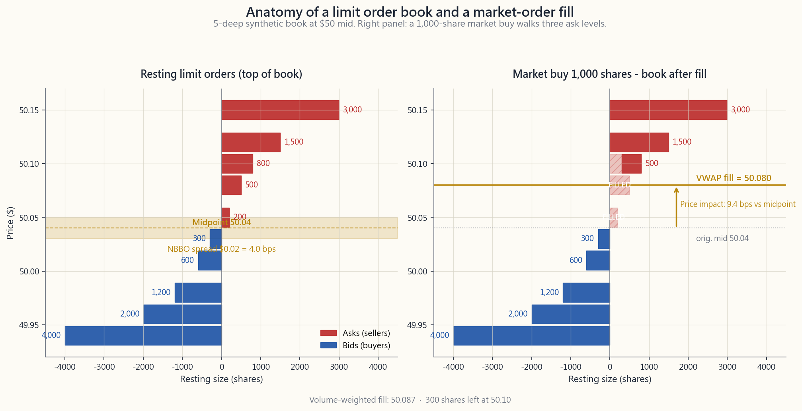
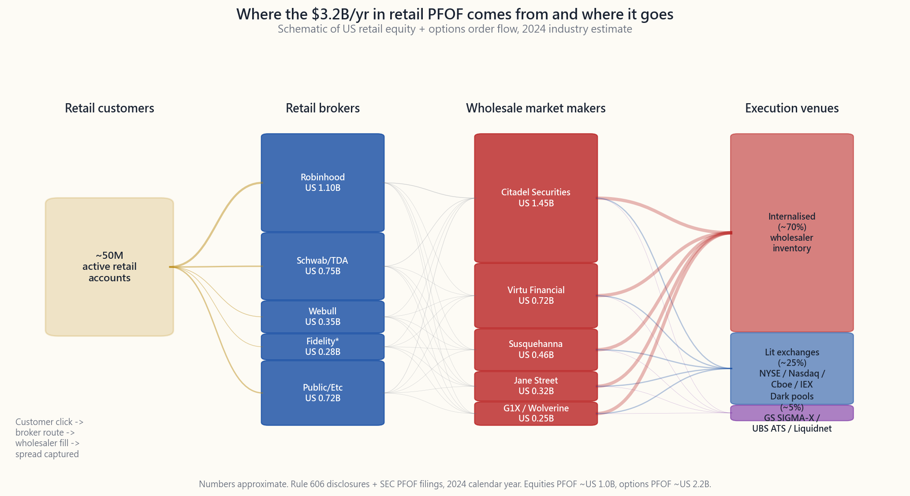

# 第四十四周：市场微观结构——订单类型、全国最优买卖报价、暗池与支付订单流

---

## 第一部分：阅读材料

---

### 1. 为什么这很重要

每一次在券商App上点击"买入"，都会启动一套路由机器，其实际成本远超零佣金所暗示的水平。美国股票市场的底层架构——交易所、暗池、批发商、智能路由器、新泽西与芝加哥之间的微波链路——经2007年《全国市场系统条例》（Reg NMS）重塑后，已悄然从每一笔零售与机构成交中抽取数个基点，长达二十年。绝大多数投资者对此浑然不觉，而这种无知本身正是问题所在。

1. **隐性成本对收益的侵蚀比费用更稳定可靠。** 明示佣金为零，但买卖价差、大单的价格冲击、批发商截留的半个跳动、以及TWAP算法全天分批执行所带来的时机风险——这些叠加起来，对零售股票双向交易的成本通常为5至30个基点，对100万美元机构订单则高达30至80个基点。在30年复利积累的职业生涯中，持续20个基点的拖累将使终值财富损失约6%。你看不到账单，但账单一直在累积。
2. **订单类型的选择是零售投资者实际掌握的为数不多的免费杠杆之一。** 下午3:59的苹果市价单与NBBO处的可成交限价单截然不同，与暗池中中间价挂单的效果也大相径庭。结构性阿尔法确实存在，但极为罕见，且基本已被高频交易公司套利殆尽——留给零售的，是微观结构素养的*防御性*版本：不要再成为愚蠢的交易流。
3. **流动性在最糟糕的时刻消失。** 2010年闪崩、2015年8月交易所交易基金错位、2020年3月新冠缺口、2024年日元套利平仓——每一次极端行情的复盘都揭示同一个事实：当已实现波动性急剧攀升时，做市商要么大幅拓宽报价，要么彻底撤单。在这里，波动率的尾部驱动全局。如果你的止损是一张在波动事件中挂在非流动性标的上的市价单，那你将成为底部的成交记录。
4. **零售与机构的路由差距是真实存在的，规则只在小单层面偏袒你。** 支付订单流的批发商（城堡证券、Virtu、苏士克汉那、Jane Street）对1,000股以下的零售订单实际上会给出零点几美分的价格改善，因为零售交易流属于非知情交易，内化处理有利可图。一旦订单规模增大到看起来像知情交易，同样的机器就会向你征税——大约在5,000至10,000股时，价格改善消失，滑点随之出现。了解这个拐点，可以避免你不知不觉地逐层扫清订单簿。

本周的目标不是把你培养成一名交易员，而是帮你理解点击之后究竟发生了什么，从而让你的成交价格不再成为一种储蓄税。

---

### 2. 核心知识点

#### 2.1 Reg NMS、NBBO，以及市场碎片化的成因

《全国市场系统条例》（Reg NMS），自2007年起生效，是维系现代美国股票市场的规则手册。你必须掌握其中两个要点：**订单保护规则（第611条）**——任何交易所均不得以劣于其他任何交易所最优显示报价的价格执行交易——以及**全国最优买卖报价（NBBO）**，即全部16家有照交易所顶层订单的综合最优价。

强制每个交易场所遵守其他所有场所报价的意外后果，是催生了更多交易场所的经济动机。截至2026年4月，美国拥有16家注册证券交易所（纽约证券交易所、纳斯达克、BATS/Cboe BZX/EDGX/BYX/EDGA、IEX、MEMX、MIAX、长期股票交易所等），以及约30家替代交易系统（ATS，即暗池）。每家交易所收取不同的报价方/接受方返佣，券商的智能订单路由器依据返佣经济性、延迟与成交概率将你的订单切分至各场所。你看到的是一个价格的单笔成交；而这笔订单可能在200微秒内触达了五个交易场所。Reg NMS保证你的成交价不会*劣于*NBBO，但对于你是否获得了*中间价*——价差成本所在——则毫无保证。

#### 2.2 订单类型：市价单、限价单、止损单、止损限价单、IOC、FOK及算法交易

零售菜单包含六种常规订单类型和约四种机构算法。一次性掌握其利弊权衡，你将终身不会再用错。

- **市价单。** "以任何能成交的价格立即成交。"保证成交，不保证价格。适用于上午11点买入100股标普500指数ETF。对5,000股30美元小盘股或200美元非流动性期权合约而言，则是灾难。
- **限价单。** "以X美元或更优价格成交，否则不成交。"任何超过200股或价差超过一美分的零售交易的默认选择。*可成交限价单*（按卖价挂买入限价单）兼具市价单的确定性与硬性价格上限。
- **止损单/止损单。** "当最新成交价触及X美元时，触发市价单。"切勿用于非流动性标的。若某股以-10%跳空低开，设置在-5%的止损单将以-10%成交，而非-5%。
- **止损限价单。** 在相同触发条件下触发限价单而非市价单。可防止糟糕的成交价格，但在跳空行情中可能根本无法成交。
- **IOC（即时成交或撤销单）。** 以限价立即成交可成交部分，其余撤销。智能订单路由器用此方式同时探测多个交易场所，而不留下剩余敞口。
- **FOK（全额成交或撤销单）。** 以限价立即全量成交，否则全部撤销。零售场景罕见；用于大宗成交和须同步执行的套利腿。

常规订单之上，是机构**执行算法**：TWAP（时间加权均价——在一段时间窗口内等量分批）、VWAP（成交量加权均价——在成交量集中的开盘和收盘附近加重配置）、实施差额算法（以紧迫性为权重前置下单）、以及POV（成交量百分比——追踪目标参与率）。这些算法存在的原因是：若直接点击50万股的市价单，成交价格将比全天VWAP差50至200个基点，且会向Secaucus的每一家高频交易公司发出有人在大手建仓的信号。

#### 2.3 暗池与15%至45%的场外成交占比

**暗池**是一种接受订单但不在交易前显示报价的替代交易系统。成交后才将结果报入综合行情，此前池外任何人均不知晓某位买家以X美元挂单。截至2025年，约15%的美国股票成交量在正式暗池内执行（高盛SIGMA-X、瑞银ATS、瑞士信贷Crossfinder、IEX、Liquidnet），另有约30%通过批发商和单一做市商平台场外执行——合计来看，"场外"成交量在多数交易日占综合行情的40%至45%。

暗池存在的原因：若一个5,000万美元的机构买盘计划公开显示在有照交易所，将招致高频交易算法的抢先交易。而在池内与另一位自然卖家以NBBO中间价对敲相同规模，则双方均可节省价差并规避冲击。争议所在：历史上，池运营商曾将客户订单路由至自营交易台对手方，且成交后行情的报送延迟意味着暗池成交记录可被用于在零售投资者反应之前更新有照交易所的报价。SEC已至少对每家主要暗池运营商处罚一次，原因均是虚假陈述池的实际运作机制。

零售实操要点：当你的券商表示"已按中间价成交"或"收到PFOF返佣"时，你的订单触达了批发商的内部池，而非交易所。这未必是坏事——对1,000股以下的零售交易流而言，中间价内化往往比在有照交易所跨越买卖价差更为经济。

#### 2.4 支付订单流（PFOF）

支付订单流是指零售券商（Robinhood、嘉信理财、Webull、Public、富达期权业务）将客户订单路由给批发做市商（城堡证券、Virtu、苏士克汉那、Jane Street、G1X），以换取按股计费报酬的机制。2024年全行业股票与期权的PFOF收入约为**30亿至35亿美元**，期权PFOF约为股票的10倍（以每合约计），原因在于期权价差更宽，批发商每笔成交的利润空间更大。

支持者的经济逻辑是：零售交易流属于*非知情交易*——当Robinhood用户买入25股英伟达时，这笔交易对做市商不构成逆向选择。城堡证券可在NBBO+0.0002（零点几美分的价格改善）处内化该订单，向Robinhood支付每股半美分的路由费，且由于该交易与短期价格走势无关，仍可从价差中盈利。这套逻辑之所以成立，是因为零售是技术意义上的"愚蠢交易流"——此处无任何贬义。

批评方的观点是：路由决策以*券商收益*为最优化目标，而非客户执行质量。SEC第605/606条规则的信息披露显示，各批发商的执行质量存在可测量的差异。2021年游戏驿站事件（Robinhood因做市商保证金违约风险被迫限制交易）揭示了这套管道的高度集中性——单一批发商处理一家券商40%以上的成交量，造成结构性脆弱。

#### 2.5 延迟套利与微秒经济

Reg NMS保证成交时刻的NBBO，但NBBO是一个持续变动的目标，由证券信息处理器（SIP）整合更新。截至2026年，SIP的整合延迟约为**350至500微秒**。各交易所向高频交易公司出售的专有直接行情（Direct Feed）更新同一数据仅需**约50微秒**。SIP与直接行情之间约300微秒的差距，正是延迟套利的生存空间。

具体模式：某高频交易公司通过纳斯达克直接行情看到一笔50.05美元的买入成交。SIP综合NBBO仍显示50.04/50.06，因为SIP尚未传播更新。高频交易公司在其他所有交易所的直接行情更新之前，跨越SIP报价的卖价，扫走那些已滞后200微秒的订单。IEX（由《闪光男孩》主人公创立的"速度减震器"交易所）以一段350微秒的物理光纤线圈延迟入站订单，从而消弭这一差距。截至2026年，约3%至4%的美国股票成交量路由至IEX；其余市场仍运行在"速度越快越有利"的模型上。

微观结构阿尔法属于"结构性"类别——确实存在，但几乎全部被托管于交易所机房的最快速公司所截获。作为零售或中等规模的机构交易者，你无法赢得这场竞赛；你能做到的，是通过使用限价单、避开SIP延迟最宽的开盘和收盘时段、以及优先使用路由至IEX和暗池的券商，来减少对其的被动失血。

#### 2.6 大单的滑点：百万美元交易的现实

对流动性名称中低于约1万美元的交易而言，微观结构成本大约等于半个买卖价差（1至3个基点），加上可能来自PFOF的零点几美分的*负向*冲击（即价格改善）。超过这一门槛后，滑点大致与**订单规模相对于ADV（日均成交量）之比的平方根**成正比，即所谓的Almgren-Chriss平方根冲击模型。

以2026年4月美国流动性股票的粗略校准为例：预期总滑点（基点）≈ 10 × √(订单规模 / ADV的1%)。1%ADV的订单约产生10个基点冲击；4%ADV约20个基点；25%ADV约50个基点。标普500指数ETF日均成交量8,000万股，可轻松消化4,000万美元以上的订单而几乎不留痕迹；而一张100万美元的订单，若挂在市值2亿美元、日均成交量20万股的小盘股上，则占当日成交量的50%以上，将使成交价格偏移100至300个基点。

机构的应对方式是将大单拆分为数小时乃至数日的TWAP/VWAP分批执行。零售的等价做法是：若订单规模超过该标的ADV的0.1%，则跨多个交易日分批建仓。交互模块可让你直观感受这种分批效果。

#### 2.7 2010年闪崩及其对市场架构的启示

2010年5月6日，美东时间下午2:32：道指在数分钟内下跌约9%（约1,000点），并于下午3:08前收复大部分失地。事后复盘确认，导火索是堪萨斯州一家共同基金通过参数设置失误（缺乏价格下限）的算法，在E-mini标普500期货上执行的一笔41亿美元的卖出程序。该程序抽干了期货市场的流动性，触发跨资产高频交易套利卖盘蔓延至股票市场，随着已实现波动性急剧攀升，股票做市商为规避逆向选择，同步撤出报价。无挂单买盘的情况下，一薄层存根报价卖单（占位用的0.0001美元买价）成为实际成交记录——埃森哲以0.01美元成交，苏富比以99,999.99美元成交——仅持续数秒。

监管回应：单只股票熔断机制（LULD涨跌停机制——当股价偏离5分钟均价超过5%/10%/20%时暂停交易）、全市场熔断机制（较前收盘价下跌-7%/-13%/-20%触发），以及用于事后溯源的综合审计追踪系统（CAT）。这些措施阻止了历史的字面重演，但*根本性*脆弱性——做市商在尾部波动中集体撤出——依然存在。肥尾就是驱动整个系统的力量。

---

### 3. 常见误区

1. **"零佣金等于零成本。"** 错误。对零售股票双向交易而言，PFOF+价差+滑点通常合计3至15个基点，以不可见的方式支付。
2. **"市价单总能以显示价格成交。"** 错误。市价单以该微秒清除订单簿的任何价格成交；若顶层仅有100股深度而委托量为500股，成交将逐层下移。
3. **"暗池是用来做肮脏交易的。"** 误导性。暗池存在的首要目的是让机构在不向高频交易公司暴露意图的情况下穿越大额委托。有问题的是部分运营商的*运作方式*，而非暗池本身的概念。
4. **"PFOF券商的执行质量更差。"** 对1,000股以下的零售股票订单而言，基本上是错误的。批发商实际上对小额零售订单给予价格改善。PFOF的经济损害仅在订单规模较大或涉及期权时才会显现。
5. **"高频交易者是纯粹的寄生虫，不提供流动性。"** 平均而言，实证结论是错误的。高频交易提供的流动性已将股票买卖价差从2007年前的约5美分压缩至流动性标的的约1美分。它们在市场承压时撤出，这才是有据可查的批评。
6. **"我的止损单能保护我免受跳空的冲击。"** 错误。止损单触发后变为市价单；跳空低开时，你将以跳空后的价格成交。应使用止损限价单（代价是可能无法成交）。
7. **"SIP的NBBO是实时价格。"** 错误。SIP比直接行情落后约300微秒。"真实"市场价格是直接行情NBBO，仅供付费购买直接连接的公司获取。
8. **"大型机构比零售投资者获得更好的价格。"** 小单上是错误的，大单上是正确的。100股零售订单获得中间价；10万股机构订单需承担20至50个基点的冲击。
9. **"VWAP执行没有风险。"** 错误。VWAP在整个执行窗口期间承受*全部*日内市场波动；若股价在6小时VWAP执行期间上涨2%，你的平均买入价较开盘高出约1%，而非以开盘价买入。
10. **"微观结构阿尔法对零售开放。"** 基本上是错误的——结构性阿尔法来源已被托管于交易所机房的高频交易公司套利殆尽。留给零售的是*防御性*的——不要成为愚蠢的对手方。

---

### 4. 问答环节

**问题1：我是否应该始终使用限价单而非市价单？**
答：对于超过100股或价差超过一美分的任何标的，几乎始终如此。例外是在交易日中段，高流动性标的（标普500指数ETF/纳指ETF/苹果股票类）价差仅为一个跳动，此时可能无法成交的成本高于半跳动的价差成本。即便如此，可成交限价单（按卖价挂买入限价单）在严格意义上仍更为安全。

**问题2：支付订单流作为零售投资者实际要付出多少代价？**
答：对流动性名称中1,000股以下的股票订单，大约为零——甚至可能略有负成本（即价格改善）。期权方面，相比最优替代方案，约为每合约5至15美分。对规模较大的股票订单（5,000股以上），批发商停止价格改善，价差成本真实存在。结论：小单+流动性强=问题不大；大单或期权=需仔细审视。

**问题3：我能通过路由至IEX来规避延迟套利吗？**
答：可以——大多数主要券商允许你将IEX指定为路由目标，通常通过"速度减震器"或"长期投资者"路由预设实现。IEX约占美国股票成交量的3%至4%，其350微秒延迟可消弭SIP与直接行情之间的差距。代价是偶尔成交速度较慢。

**问题4：多头持仓中止损单与止损限价单的实际区别是什么？**
答：止损单在触发时变为市价卖单——你的订单会成交，但在跳空行情中可能以远低于预期的价格成交。止损限价单变为限价卖单——若价格跳空穿越限价，则可能根本无法成交。止损单适用于"我无论如何都要出场"；止损限价单适用于"我希望以确定价格出场，否则宁愿继续持有"。

**问题5：如何为零售设置TWAP订单规模？**
答：粗略原则是，将超过该标的ADV 0.5%的委托拆分为4至8个子订单，分散至全天执行，并在价差最宽的开盘和收盘时段减少委托量。多数零售券商不提供真正的TWAP功能，但你可以手动近似模拟。对标普500成份股而言，这一做法通常在单笔委托规模超过100万美元后才变得必要。

**问题6：为什么我的成交价与点击时屏幕上显示的价格不同？**
答：三个来源：（1）你的屏幕显示的是有约300微秒延迟的SIP NBBO；（2）你的订单花费50至500毫秒到达券商，券商再将其路由至多个交易场所；（3）在这段延迟期间NBBO已发生变动。对流动性名称的100股订单而言，偏差通常不足一美分。对流动性较差的标的，偏差可能达5至50美分。

**问题7：零售投资者能使用暗池吗？**
答：间接可以——你的券商智能订单路由器很可能在路由至有照交易所之前代你探测数个暗池，寻找中间价对敲机会。你无法选择具体的池，但成交可能已经在那里发生。直接访问暗池仅限机构客户。

**问题8：使用收盘市价单（MOC）有什么风险？**
答：MOC订单以官方收盘集合竞价价格成交，对流动性名称而言定价明确，但可能在最后5分钟内受到指数再平衡资金流的显著影响。日常零售使用没有问题；但在财报发布前后或再平衡敏感时期进行关键建仓时，建议在集合竞价前使用可成交限价单。

**问题9：支付订单流与期权的交互机制如何？**
答：影响显著。期权PFOF约为股票PFOF每股当量的10倍，原因在于期权价差更宽、零售期权交易流知情程度更低，且做市商数量更少。第606条规则报告显示，约80%的零售期权交易流流向约5家批发商。成本表现为你的成交价与期权NBBO中间价之间的差距，通常为每合约5至15美分。

**问题10：2010年闪崩是否真的给零售投资者造成了损失？**
答：对持仓中的投资者而言，大多数情况下没有——30分钟内的价格恢复意味着买入并持有的持仓几乎未受波及。受损的是持有活跃止损单、并在荒诞成交价上触发止损的投资者；许多此类交易依据"明显错误"规则被交易所撤销，但撤销执行不一致，部分零售投资者仍被锁定在亏损中。教训具有两极性：永远不要让止损单成为偿付能力与破产之间的唯一防线。

**问题11：什么是"内化"？**
答：当你的券商批发商以自有库存直接执行你的订单，而非将其路由至交易所时，即为内化。批发商赚取价差；你获得NBBO或略优于NBBO的价格；交易记录报入行情，但从未触及公开订单簿。2026年，约30%的美国股票成交量通过内化完成。

**问题12：对于买入并持有的投资者，微观结构是需要关注的问题吗？**
答：对于持有多年、持仓规模低于5万美元的美国主流股票，答案是否定的——相对于总收益，成本可以忽略不计。对于每月买入5,000美元某小盘股的资产积累阶段，答案是肯定的——以低于NBBO 30个基点的价格挂限价单，而非以市价买入。对于退休后需要出售大额持仓的资产变现阶段，答案是绝对肯定的——将订单拆分为多日TWAP执行。
