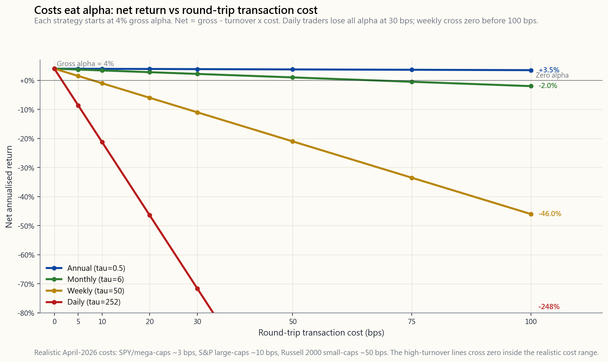
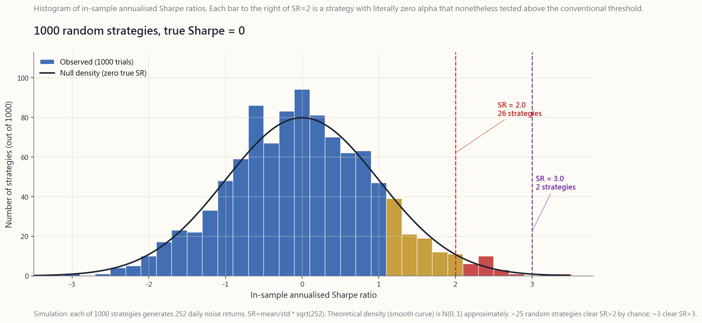

# 第四十六周：回测——幸存者偏差、前瞻偏差、交易成本与缩水夏普比率

---

## 第一部分：阅读材料

---

### 1. 为什么这一内容至关重要

回测是你讲给自己听的一个关于策略的故事。它是金融世界中最具说服力的文件：一条平滑的权益曲线、一个整洁的夏普比率数字、一张年度收益表格，全部由你昨天写好的程序在几秒内生成。问题在于，几乎每一个回测都是错的，而且几乎每一个回测都以同样的方向出错——过于乐观。Lopez de Prado、Bailey等人的实证研究表明，已发表量化策略的样本内夏普比率中位数在样本外大约*减半*。看起来像1.5夏普机器的策略，在实盘中能交付0.6就算不错，甚至毫无建树。网上出售的大多数零售"系统"，在扣除实际摩擦后超额收益为零甚至为负。

你需要掌握这部分内容，原因有四。

1. **在你投资生涯的余下时间里，你都会接触、构建或购买回测。** 每一份交易所交易基金招募说明书、每一份智能投顾的宣传材料、每一位YouTube量化网红，开口必谈回测。如果你不能下意识地识别幸存者偏差、前瞻偏差和多重检验陷阱，你就会错误配置资本。阿尔法很稀缺；几乎每一个回测都在向你兜售阿尔法。好好想清楚。
2. **缩水夏普比率如今已是机构标准。** Bailey与Lopez de Prado于2014年发表的论文，将怀疑论从业者一贯知晓的事实正式化：如果你尝试了一千种策略，表现最好的那个看起来出色，纯属偶然。他们的公式将原始样本内夏普比率转化为一个明确惩罚试验次数的指标。现代配置机构会要求提供这一数字，你也应当将其用于评估自己的想法。
3. **交易成本通常会吞噬所有阿尔法。** 一个回测显示年化毛阿尔法4%的策略，若以每周换仓频率运行，双边交易成本30个基点、每年约50次换手，结果将彻底蒸发：50×0.30%=15%的年化成本拖累，是阿尔法的三倍。大多数零售系统的"发现"都在成本建模上生死存亡——这正是那些精美PPT悄悄略去这一项的原因。
4. **回测与四个持久的核心理念紧密相连。** 阿尔法很稀缺。波动性的尾部主导全局——一个没有经历过危机的五年回测毫无意义。市场在回归均值之前，可以保持非理性的时间足够长，长到将你止损出局。对于持怀疑态度的回测者而言，流动性充足的美国股票市场是唯一可以在不被幸存者噪声淹没的前提下验证时点数据的地方。

本课将逐一梳理七大经典回测缺陷、缩水夏普的数学原理，并提供一个实用计算器——输入你的样本内数字，告诉你样本外实际应该期待什么。

---

### 2. 你需要掌握的内容

#### 2.1 幸存者偏差——你看不见的那个市场

最简单、也最有害的偏差。打开任意数据终端，查询"1990年以来标普500全部股票、等权重、按月再平衡"。终端返回的是**当前**的标普500成分股。雷曼兄弟不在里面。贝尔斯登不在里面。世通公司不在里面。西尔斯、柯达、宝丽来、美联银行、华盛顿互惠银行、全国金融公司——全都不在。你回测的，是幸存者组成的市场。

幸存者偏差在美国大盘股市场中每年虚增约1-3%的收益，在小盘股中更多，在新兴市场以及只收录仍在报告业绩的基金的对冲基金数据库中则高得多。用1990年幸存下来的股票回测"纯多头高质量"策略，结果看起来十分亮眼。但用同一策略回测1990年的实际市场——包括后来破产的名字——结果不过平平无奇。

解决方法是使用**时点指数成分数据**。CRSP、Norgate、标普旗下的IHS-Markit以及Compustat-CapIQ均出售历史成分文件，记录哪些代码在哪个日期属于该指数。免费数据源鲜有这类数据；如果你用免费数据回测，可以默认你的顶线收益被高估了100-300个基点。

#### 2.2 前瞻偏差——用明天的数据做今天的决策

前瞻偏差是指你的交易规则在*t*日使用了*t*日实际上并不可得的信息。其产生机制往往十分隐蔽。

- **经重述的基本面数据。** Compustat向你展示的是苹果公司FY2024营收的当前重述版本。而2025年1月实际可得的版本——在2025年11月提交的10-K于2026年3月修订之前——与之不同。使用当前版次基本面数据进行回测，即是在使用未来数据。
- **指数成分调整在生效前已公告。** 标普通常在调整生效前约5个交易日公告新增成分股。使用当前版次数据进行回测时，若以"在*t*日属于该指数"作为判断标准，就会提前获知明天才会生效的新增信息。
- **以收盘价作为成交价。** 你的信号在下午4点触发，以下午4点的收盘价成交。而现实中你是在第二天早上才完成成交，对于动量策略来说通常价格更差，对于均值回归策略来说有时反而更好。成交时机上的前瞻偏差会高估动量策略的表现，并低估均值回归策略的表现。
- **财报日期问题。** 使用基于"EPS超预期"信号的回测，若引用Compustat当前的财报日期字段，可能会在公告发布前*一天*就获取到部分公司的信息，因为该字段已被追溯性地标准化处理。

解决方法是使用**时点数据配合原始申报时间戳**，并遵循T+1规则：*t*日计算出的信号，在*t*+1日开盘时执行。若不遵守此规则，可预期每年存在2-5%的虚假阿尔法。

#### 2.3 交易成本建模——大多数优势在此消亡

对于美国上市的流动性股票（SPY、QQQ、大盘股），截至2026年4月，现实可行的全口径双边交易成本如下：

| 市场范围 | 双边成本（基点） | 备注 |
|---|---|---|
| SPY、QQQ、市值前50名超大盘股 | 1-3个基点 | 买卖价差极小，市场冲击可忽略 |
| 标普500大盘股 | 5-15个基点 | 平均价差约3个基点，加市场冲击 |
| 罗素1000中盘股 | 15-30个基点 | 价差较宽，加滑点 |
| 罗素2000小盘股 | 30-80个基点 | 价差加市场冲击，有时受日均成交量限制 |
| 微型股、场外交易、流动性差的股票 | 100-300个基点 | 且未必能按目标规模成交 |

以上为**全口径**成本：买卖价差、市场冲击、交易所及SEC费用，加上券商佣金（美国零售端目前基本已免佣）。对于交易规模较大的机构而言，市场冲击是主要成本，大致随（委托量/日均成交量）的平方根增长。

这套算术相当残酷。一个年化毛阿尔法为$\alpha$、换手率为$\tau$（每年双边换手次数）、双边成本为$c$的策略，其净阿尔法为：

$$ \alpha_{\text{净}} = \alpha_{\text{毛}} - \tau \cdot c $$

4%的毛阿尔法，在以下不同情景下：

- $\tau = 0.5$（年度再平衡），$c = 10$个基点 → 净值 = 3.95% — 成本可忽略不计。
- $\tau = 6$（月度换仓），$c = 10$个基点 → 净值 = 3.40% — 小幅拖累。
- $\tau = 50$（周度换仓），$c = 30$个基点 → 净值 = -11% — 阿尔法全部蒸发，且有余。
- $\tau = 252$（日度换仓），$c = 30$个基点 → 净值 = -71.6% — 策略俨然一台熔炉。

这正是日频和日内策略在流动性不足的市场中难以为继的原因：哪怕毛优势再微薄，也会被换手率乘以成本彻底消耗殆尽。第2.5节的图表将此直观呈现。

这些斜线均从左侧的同一起点发散。当双边成本达到30个基点时——这对美国小盘股来说是常态——日度换仓策略的阿尔法已荡然无存，甚至深陷亏损。这也正是大多数公开发布的"高频"零售系统不过是纸上谈兵的原因：零成本模拟下看起来光鲜亮丽，引入真实摩擦后一败涂地。

#### 2.4 多重检验问题——1000个随机策略

以下是零售量化领域最被低估的事实：**如果你尝试的策略足够多，总有几个看起来不错，纯属偶然**。这不是假说，而是算术。

假设你模拟了1000个策略，每个策略**真实优势为零**——纯噪声。每个策略都会生成一个样本内年化夏普比率估计值。由于夏普比率是一个有噪声的估计量（在有限样本下），这1000个估计值的*分布*相当宽泛。对于一年期的日度收益，年化夏普比率估计值的标准误差约为1.0。因此，在1000个随机策略中，你应该纯粹凭概率期待：

- 约25个夏普比率 > 2.0（单尾概率约2.5%）。
- 约160个夏普比率 > 1.0（约16%）。
- 约3个夏普比率 > 3.0（约0.3%）。

以上全部是纯噪声。然而，一个进行了1000轮网格搜索、*只汇报最优结果*的研究者，会满怀骄傲地发表一个"夏普比率3、t统计量3"的"策略"，而不对试验次数加以修正的评审人则会信以为真。

图中竖线分别位于夏普比率=2和夏普比率=3处。竖线右侧的每一个柱体，都是**真实阿尔法为零**、却依然超过常规阈值的策略。

#### 2.5 缩水夏普比率——Bailey与Lopez de Prado的贡献

Bailey、Borwein、Lopez de Prado与Zhu（2014年）给出了正式的修正公式。**缩水夏普比率**（DSR）从观测到的样本内夏普$\widehat{SR}$出发，减去零假设下最大夏普的期望值，再除以夏普估计量的分布感知标准误差：

$$ \widehat{SR}_0 \approx \sqrt{\frac{2 \ln N}{T}} \quad \text{（零假设下期望最大值，大N近似）} $$

其中$N$为策略变体的尝试次数，$T$为以期数表示的样本长度。

$$ \text{DSR} = \Phi\!\left(\frac{(\widehat{SR} - \widehat{SR}_0)\sqrt{T-1}}{\sqrt{1 - \gamma_3 \widehat{SR} + \frac{\gamma_4 - 1}{4}\widehat{SR}^2}}\right) $$

其中$\gamma_3$为收益的偏度，$\gamma_4$为峰度；$\Phi$为标准正态分布的累积分布函数。其输出值应理解为概率：DSR是该策略真实夏普高于经多重检验修正后零假设值的概率。DSR为0.95意味着95%的置信度认为策略真实存在；0.50意味着不确定；0.30则意味着"很可能是噪声"。

即使公式复杂，其直觉十分简明：**汇报N次尝试中的最优结果，相当于以显著性水平1/N进行单尾检验**。要超越这一门槛，你的原始夏普必须高于$\sqrt{2 \ln N / T}$——对于N=1000次试验、T=5年日度数据而言，这一惩罚约为日频夏普0.10，折合年化约为1.66。因此，一个在1000轮策略搜索中汇报夏普2.0的研究者，经修正后的有效夏普约为0.34——仅比债券市场略好一点点。

#### 2.6 滚动向前验证——黄金标准

验证策略最诚实的方式是**滚动向前验证**：在滚动窗口上拟合参数，在紧随其后的样本外窗口上检验，然后向前滚动。例如：在2010-2014年拟合，在2015年检验；在2011-2015年拟合，在2016年检验；如此循环。将各检验期收益拼接起来，就是你真实的样本外业绩记录。

滚动向前验证能解决三个问题：

- **前瞻偏差。** 从构造上就保证了拟合只能使用早于检验窗口的数据。
- **过拟合。** 若你的策略需要12个参数才能在样本内表现优异，每次滚动重新拟合都会产生截然不同的参数集——这恰恰说明这些参数并未捕捉到真实信号。
- **结构性变化。** 一个在1995-2005年有效、2015-2025年失效的策略，在滚动向前验证的权益曲线上会呈现清晰的断裂。而简单的全样本回测会将这一断裂淹没在平均值中。

若一个策略的滚动向前验证夏普比率*低于*其全样本内夏普的一半，则属于过拟合，应予淘汰。大多数公开发布的零售系统在检验时都会栽在这一关。

#### 2.7 结构性变化稳健性

即便经过缩水修正、滚动向前验证和合理成本处理，最后仍有一个核心问题悬而未决：*该策略在不同市场环境下是否有效？* 一个在2010-2021年（一轮由量化宽松驱动的长期上涨行情）回测表现亮眼的动量策略，与一个跨越1929-32年、1973-74年、2000-02年、2008年和2020年多段压力时期验证过的策略，根本不是同一回事。

一个有用的纪律性做法：将样本拆分为第10周框架所定义的典型市场环境区间（牛市平静期、牛市波动期、熊市、复苏期），并分别汇报**每个环境下**的夏普比率、回撤和胜率。一个在四种环境中三种有效、一种失效的策略，结合环境叠加策略或许可以部署。一个仅在单一环境下有效的策略，本质是被包装成阿尔法的贝塔暴露。1980-2020年的市场环境具有特殊性；不要让你的样本窗口继承那段历史虚假的慷慨。

本课末尾的互动工具允许你拖动五个滑块——样本内夏普、回测年限、尝试策略数量、双边成本和每年交易次数——并实时更新四个数字：缩水夏普（多重检验惩罚后）、样本外夏普估计、扣除成本后的夏普，以及策略真实存在的概率。大多数"出色"的回测，在真实参数下会瞬间崩塌。

---

### 3. 常见误解

1. **"我的回测看起来很好，所以策略是有效的。"** 你的回测是在你对数据、成本和时机所做的特定选择下得出的*最优情景*模拟。实盘表现几乎总是更差——而且阿尔法很稀缺，因此任何回测的先验假设都应是其结果被高估。
2. **"幸存者偏差只是小盘股的问题。"** 它无处不在。雷曼兄弟、贝尔斯登、世通、安然、从道指成分中剔除的通用电气——全都是大盘股。这一偏差普遍存在，只是在噪声更大的市场中更为显著。
3. **"我用了复权价格，所以没问题。"** 经拆股与股息调整的价格确实修正了一个问题（公司行为导致的价格失真），但与该代码在特定历史日期是否属于相关市场毫无关系。
4. **"佣金已经免了，所以零售端的交易成本可以忽略不计。"** 零佣金 ≠ 零成本。买卖价差加市场冲击，在大多数美国股票上仍然意味着5-30个基点的双边成本，小盘股则更高。所谓"免佣金"，不过是一句营销口号。
5. **"我做了样本内外分析，所以没问题。"** 如果你是在看完数据之后才选定分割点，那么单次样本内外分割和完全不分割相比，改进微乎其微。滚动向前验证才是标准做法。
6. **"p值低于0.05就说明策略是真实的。"** 如果你尝试了20种以上的变体，这个结论就不成立。多重检验修正（Bonferroni校正、错误发现率控制或缩水夏普）是必要步骤。
7. **"缩水夏普太保守了，会把好策略也杀掉。"** 它确实会淘汰*大多数*策略，而这恰恰是正确的。阿尔法很稀缺——缩水不过是将这一事实以公式的形式呈现出来。
8. **"样本内夏普越高越好。"** 在样本长度和换手率固定的前提下，样本内夏普越高确实越好。但若高夏普来自更大的搜索空间，则*越差*——因为你尝试的次数越多。
9. **"滚动向前验证消除了过拟合。"** 它能减轻过拟合，但无法消除。如果底层策略框架本身就存在过拟合（例如含有12个参数），每次滚动拟合出的参数依然会大幅波动，样本外表现仍然会下滑，只是没那么灾难性而已。
10. **"只有在所有市场环境下均有效的策略才值得部署。"** 并非如此。有些完全合理的策略只在特定环境下有效（趋势市场中的趋势跟踪策略、均值回归市场中的价值策略）。诚实的做法是*承认*特定的市场环境，并据此调整仓位规模，而非假装策略能应对所有天气。

---

### 4. 问答环节

**Q1. 我需要申报多少种策略变体？**
A1. 所有尝试过的变体——涵盖资产市场范围、参数网格、信号定义和再平衡频率。如果你运行了5×5×4的网格搜索，则$N=100$。关键在于：那些"因为看起来不好"而被放弃的变体同样必须纳入计算；将它们排除在外，正是p-hacking的核心所在。

**Q2. 样本内夏普打多少折，才是合理的样本外预期？**
A2. 学术文献发现，已发表量化策略的样本外夏普中位数约为样本内夏普的50%，最差的四分之一则带来零收益甚至负收益。一个合理的工作假设是：$\widehat{SR}_{\text{样本外}} \approx 0.5 \times \widehat{SR}_{\text{样本内}}$（扣除成本前）。

**Q3. 对于罗素2000策略，应假设多高的双边交易成本？**
A3. 机构规模下流动性尚可的小盘股，约为30-50个基点。小盘股中流动性最差的后十分位，可高达80-100个基点。零售投资者交易小额名义金额有时可控制在15-25个基点，但无法规模化。

**Q4. 我的样本内夏普为1.5，回测期5年，尝试了200种变体，是否值得部署？**
A4. 请运行缩水夏普。在$T \approx 1260$个交易日、$N=200$的条件下，$\widehat{SR}_0 \approx \sqrt{2 \ln 200 / 1260} \approx 0.092$（日频），折合年化约为1.46。因此你的1.5样本内夏普本质上等于多重检验的零假设水平——DSR将接近50%。这是掷硬币，不是一个策略。

**Q5. 为什么日频策略是零售量化的坟场？**
A5. 日度换仓意味着每年252次双边交易，乘以哪怕仅10个基点的成本，就是年化25.2%的拖累。你需要超过25%的毛优势才能有任何净收益。结合阿尔法的稀缺性，这样的优势在零售层面实际上并不存在。

**Q6. 如何在不付费使用Compustat的情况下获取时点基本面数据？**
A6. 只能以不完美的方式替代。免费抓取EDGAR可以获取含正确时间戳的原始申报财务数据，但重建完整的市场范围颇为繁琐。Quandl（现为纳斯达克数据链接）以零售价格出售部分时点切片数据。对大多数零售用途而言，将基本面数据滞后90天是一种粗略的替代修正。

**Q7. 滚动向前验证能保留交易成本的真实性吗？**
A7. 可以——而且应当如此。成本模型在每个滚动向前步骤中的应用方式，与实盘交易中完全一致。事实上，滚动向前验证比全样本回测更能揭示成本敏感性，因为它会在参数重新拟合过程中暴露换手率的变化。

**Q8. 我的策略在牛市中有效、熊市中失效，是否可以部署？**
A8. 也许可以——配合市场环境叠加策略。识别触发机制（例如200日均线、波动率指数阈值）来控制策略的开启与关闭，并将该开关机制纳入回测。如果策略仅在叠加环境判断后才盈利，那么你的"阿尔法"部分来自该叠加机制本身的阿尔法。请如实归因。

**Q9. 估计夏普比率置信区间时，应使用自助法还是块自助法？**
A9. 块自助法（块长度与策略收益序列的自相关匹配）适用于大多数具有序列相关性的策略。简单的i.i.d.自助法会低估方差。

**Q10. 最简洁且有据可查的回测工作流程是什么？**
A10. 五个步骤。（1）在查看数据之前，用一段话定义策略。（2）使用时点数据，信号与执行之间保持一天的滞后。（3）根据所在市场范围应用合理成本。（4）按季度或年度周期进行滚动向前重新拟合。（5）以诚实的$N$计算缩水夏普比率。若缩水夏普低于约0.7，不要部署。

**Q11. 幸存者偏差有没有可能反而低估策略表现？**
A11. 极少见，仅在策略本身针对幸存者做多的高度困境时期（例如2008年做多高质量股票）偶有出现。即便如此，偏差通常仍倾向于高估回测结果。默认假设：幸存者偏差每年虚增100-300个基点。

**Q12. 通过所有这些检验后，陳馬如何对策略进行仓位规模管理？**
A12. 采用哑铃式配置，置于L4机会性配置层。一个经缩水修正后样本外夏普约为1、成本合理、样本跨越多个市场环境的策略，在*机会性配置*部分占据小额仓位——通常为总资产的1-3%。若奏效，自然理想；若不奏效，90%以上的核心组合不受影响。回测不是重仓的许可；它只是小额试水的许可。

---

## 第二部分：YouTube脚本

---

**视频标题：** 为什么大多数回测在说谎：幸存者偏差、前瞻偏差、交易成本与缩水夏普比率

**目标时长：** 约18分钟

**主持人：** 陳馬、小魚

---

**[开场 - 0:00至1:30]**

[VISUAL: title card, cream + gold, "Week 46: Backtesting"]

陳馬：欢迎回来。这里是chanmainvest课程的第46周。今天的话题是我等了整整一年、认真想说清楚的一个主题：回测。金融领域里最有说服力的文件是回测，最被高估的文件也是回测。

小魚：我已经听你说"回测在撒谎"说了大约一百遍了。今天我们来解释清楚为什么。

陳馬：今天我们解释为什么，同时给你一个计算器，把那个好看的样本内夏普转化成你实际应该期待的样本外数字。剧透一下：一旦你用真实的试验次数和交易成本加以修正，大多数亮眼的回测会立刻崩塌为零。

小魚：阿尔法很稀缺——又一次。

陳馬：阿尔法很稀缺。回测则常常制造出阿尔法存在的假象。这一期我们要逐一拆解四大幻觉：幸存者偏差、前瞻偏差、交易成本，以及多重检验问题。然后我们一起推导修正最后一个问题的缩水夏普比率。

[VISUAL: chapter list overlay]

---

**[第一节 - 1:30至4:30] - 幸存者偏差与前瞻偏差**

陳馬：从幸存者偏差说起。你查询的每一个数据终端，返回的都是*当前*的市场。今天的标普500不包含雷曼兄弟，不包含贝尔斯登、世通、安然、西尔斯、柯达、宝丽来、美联银行、华盛顿互惠银行，也不包含全国金融公司。

小魚：所有爆雷的名字。

陳馬：所有爆雷的名字都不在你的回测里。所以当你模拟"1990年以来纯多头大盘高质量股票"，你的模拟是基于幸存者名单的。那些破产的公司被悄悄删掉了。仅仅这一点，就会带来每年100到300个基点的虚假收益。

小魚：这个影响太大了。

陳馬：这就是12%策略和9%策略之间的差距。解决方法是使用时点指数成分数据——CRSP、Norgate、Compustat-CapIQ——而免费数据库基本上都没有。所以只要你用免费数据跑回测，顶线收益就是被高估的，每一次都是。

小魚：那前瞻偏差呢？

陳馬：前瞻偏差是指你的交易规则在*t*日使用了*t*日实际上无法获取的数据。最经典的情形是经重述的基本面数据。Compustat向你展示的是苹果公司2024财年的营收，但是是*当前重述后*的版本。而2025年1月实际可得的数据，在那份10-K被修订之前，和这个版本是不同的。用当前版次基本面数据做回测，就是在使用未来信息。

小魚：那怎么避免？

陳馬：所有数据统一滞后处理。*t*日计算出的信号，在第二天早上执行。基本面数据滞后90天。指数成分以截止日期为准。如果不遵守这些规则，每年就会多出200到500个基点的虚假阿尔法。

---

**[第二节 - 4:30至7:30] - 交易成本**

[VISUAL: image/week46_cost_drag.png]

陳馬：这张图终结了大多数零售"高频"系统。四条线。每条线的起点都是同样的4%毛阿尔法，分别代表四种再平衡频率：年度、月度、周度、日度。横轴是双边交易成本（单位：基点）。

小魚：日度那条线直接跌落悬崖。

陳馬：日度那条线就是一台熔炉。在零成本时，四个策略持平于4%。当双边成本达到10个基点——这对SPY来说是现实数字——日度换仓策略每年已经损失了25个百分点的收益。到了30个基点——小盘股的正常水平——日度换仓策略年化亏损达71%，周度换仓亏损11%。两者都是灾难性的。

小魚：所以阿尔法没有消失，只是被吃掉了。

陳馬：对。换手率乘以成本就是阿尔法税。年度再平衡缴的税几乎为零。月度缴一点。周度缴很多。日度是一台自我毁灭机器，除非你的毛优势超过25%——而这对流动性充足的美国股票来说实际上并不存在。

小魚：这就是为什么每一个零售量化网红的"日度算法"都是骗局。

陳馬：或者是出于真诚的无知。不管哪种情况，数学不在乎。如果你拿不出真实的成本模型和换手率，这个系统就不是真正的系统。

---

**[第三节 - 7:30至11:00] - 多重检验**

[VISUAL: image/week46_deflated_sharpe.png]

陳馬：这张图是大多数零售量化从未见过的。我模拟了1000个随机策略，每个策略的真实夏普比率都是零——纯噪声。每个策略生成252天的日度收益，然后我计算它们的样本内夏普比率并画出直方图。

小魚：是一条以零为中心的钟形曲线。

陳馬：以零为中心、标准差约为1的钟形曲线。所以每四十个随机策略中就有一个的夏普比率超过2。每一千个中约有三个超过3。

小魚：你是说，如果我随机生成1000个策略，会有25个夏普比率高于2？

陳馬：我说的就是这个意思。而那个只发布最好结果的研究者——这样的研究者*永远*存在——就发表出了一个"夏普2、t统计量3的策略"，而不对试验次数进行修正的评审人会信以为真。

小魚：这太可怕了。

陳馬：这就是多重检验问题。每个回测都嵌套在一个隐式的搜索空间里。如果你只汇报获胜者，就必须用隐含的试验次数对获胜者的夏普比率进行折减。Bailey和Lopez de Prado在2014年写下了这个公式，我们称之为缩水夏普比率。

小魚：具体是什么公式？

陳馬：零假设下期望最大夏普，随N的对数的两倍除以T的平方根增长。对于5年日度数据上的1000次试验，纯粹由偶然产生的零假设最大夏普，年化约为1.66。你的原始夏普必须超过1.66，我们才开始讨论样本外的事。

小魚：所以在1000轮策略搜索中报告的夏普2.0，基本上什么都不是。

陳馬：基本上什么都不是。经缩水修正后的有效夏普约为0.34，比债券市场还差。

---

**[第四节 - 11:00至13:30] - 互动实验室**

陳馬：我们为你搭建了一个计算器，帮你完成这些计算。五个滑块：样本内夏普——你观测到的数值；回测年限——样本有多长；尝试变体数量——你的$N$；双边成本（基点）；每年交易次数——你的换手率。

小魚：输出什么？

陳馬：四个大数字。缩水夏普——经多重检验惩罚后的夏普比率；样本外夏普估计——我们预期你实际能实现的值；扣除成本后的夏普——扣除摩擦后的实际值；以及策略真实存在的概率——真实夏普高于零的概率。

小魚：带我们走一遍最糟糕的情景。

陳馬：好。样本内夏普2。数据两年。尝试了500种变体。30个基点双边成本。每年50笔交易。点击重新计算。策略真实存在的概率：约25%。也就是说，这相当于一枚略偏向反面的硬币。

小魚：那好的情景呢？

陳馬：样本内夏普1.2。二十年数据。只尝试了5种变体。5个基点双边成本——大盘股。每年12笔交易——月度换仓。策略真实存在的概率：约90%。这是一个可以部署的信号。

小魚：差别主要在于试验次数和数据长度。

陳馬：几乎完全是这两个因素。阿尔法很稀缺——这一事实会在数学中体现出来。数据越长、试验次数越少，样本内数字才越有意义。

---

**[第五节 - 13:30至15:30] - 滚动向前验证与市场环境稳健性**

陳馬：在部署之前还有两项检验：滚动向前验证和市场环境稳健性。

小魚：先说滚动向前验证。

陳馬：滚动向前验证是黄金标准。在滚动窗口上拟合参数，在紧随其后的窗口上检验，然后向前滚动。将各检验期的收益拼接起来，就是你诚实的样本外业绩记录。如果你的滚动向前验证夏普比率低于全样本内夏普的一半，策略属于过拟合，应当放弃。

小魚：再说市场环境稳健性。

陳馬：市场环境：将样本拆分为第10周定义的典型区间——牛市平静期、牛市波动期、熊市、复苏期——并分别汇报每种环境下的夏普比率和回撤。一个在四种环境中三种有效的策略，结合环境叠加策略或许可以部署。一个只在单一环境下有效的策略，本质是被包装成阿尔法的贝塔暴露。不要让你的样本窗口继承某个单一市场环境所带来的虚假回报。

---

**[第六节 - 15:30至17:00] - 诚实的工作流程**

陳馬：以下是最简洁且有据可查的工作流程，共五步。

小魚：开始数。

陳馬：第一，在查看数据之前，用一段话定义策略。第二，使用时点数据，信号与执行之间保持一天的滞后。第三，根据所在市场范围应用合理成本。第四，按季度或年度周期进行滚动向前重新拟合。第五，以诚实的试验次数计算缩水夏普比率。

小魚：部署的门槛是什么？

陳馬：样本外扣除成本后的缩水夏普超过0.7。低于这个门槛——不要部署，毫无例外。

小魚：通过所有这些检验的策略，你会配置多少仓位？

陳馬：哑铃式配置。策略进入L4机会性配置层——通常是总资产的1-3%，上限。如果奏效，理想。如果不奏效，90%以上的核心组合完全不受影响。回测不是重仓的许可，而是小额试水的许可。

---

**[结尾 - 17:00至18:00]**

陳馬：带走三条规则。第一：每个回测都或多或少地说了谎，问题在于说了多少。第二：缩水夏普是你评估自己想法时能计算的最重要的单一数字。第三：换手率乘以成本是阿尔法税——对于日度策略而言，这笔税通常超过阿尔法本身。

小魚：下周——第47周——我们深入尾部风险：如何对冲左尾，同时不损失太多右侧的上行空间。在此之前，去玩玩这个工具，试着让一个策略"活下来"。

陳馬：大多数活不下来，这才是重点所在。下周见。

[VISUAL: end card]