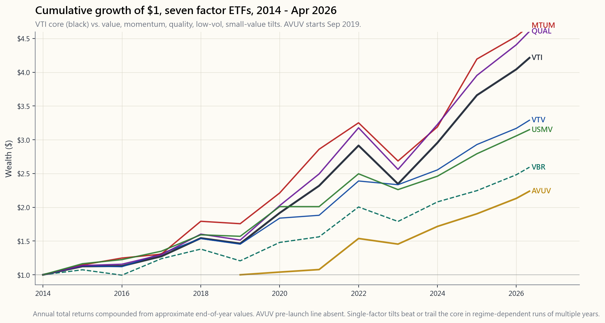
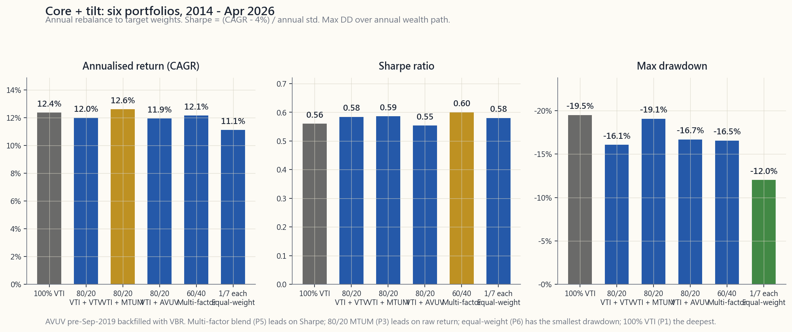

# 第五十周：因子倾斜的实践——价值、动量、质量与低波动性

---

## 第一部分：阅读材料

---

### 1. 为什么这一课很重要

第23周介绍了学术界的因子动物园：HML、SMB、UMD、RMW、CMA、BAB。那些数字看起来很整洁——Fama-French多空溢价在1963年至2024年间年化收益为3%至7%，图表上排列着整齐的条形，正是那种让博士论文大放异彩的素材。然后你尝试在Schwab上买入其中任何一种，才发现学术界的因子和零售市场上贴着同一标签的交易所交易基金，根本不是同一个产品。**第50周是实施周。** 这节课将让教科书上的因子与只做多的交易所交易基金、年度再平衡、0.15%的费用率，以及一个自2015年Fama-French五因子论文发表以来几乎吃掉一半已发布溢价的市场正面交锋。

以下四点说明了这对第四级投资组合的重要性。

**第一——论文发表后的衰减是真实存在的。** McLean和Pontiff（2016年，《金融学期刊》）研究了97个已发布的异常现象，发现样本外发表后的收益比样本内回测**大约下降50%**。这不是四舍五入的误差。4%的学术溢价变成了2%的实盘溢价，而2%是一个完全可能被成本和税收抹平的数字。你在2026年构建的任何因子倾斜，都必须假设学术阿尔法大约只有论文所声称的一半，以此为基础来确定规模。

**第二——只做多的零售交易所交易基金不等于学术因子。** HML是做多最便宜的30%、做空最贵的30%。VTV是做多大盘股中较便宜的50%，没有空头端。两者的相关性约为0.55至0.70。你无法在Vanguard买到HML。你能买到的是经过只做多约束、市值加权选择和指数方法论稀释后的价值*敞口*。美国境内可投资规则同样适用：可投资的因子敞口是学术因子敞口的子集。

**第三——实施成本优先吞噬较小的溢价。** 在7%的毛溢价上叠加24个基点的费用率和30个基点的年周转成本，意味着25%的折损。而在2%的衰减后溢价上，同样54个基点的成本占比高达27%。底层溢价越小，固定实施成本的比例咬口就越大。

**第四——单因子纯粹性的隐性代价是集中度风险。** 在错误的周期时机（2017年至2020年）持有纯价值因子倾斜，累计落后VTI超过30个百分点。多因子组合能够平滑这一波动，代价是稀释任何单一信号。对大多数零售账户而言，正确答案是**核心+倾斜**投资组合——以被动持有VTI为核心，可靠捕获市场溢价，再辅以小幅因子倾斜，规模依据发表后衰减的溢价来定，而非样本内回测。阿尔法极为稀缺，零售市场上销售的大多数"因子阿尔法"不过是重新包装的贝塔。

---

### 2. 你需要掌握的内容

#### 2.1 2003年后的衰减及其原因

因子动物园并未崩溃，但幅度缩小了。最清晰的证据来自McLean-Pontiff（2016年）：在97个已发布的异常现象中，平均溢价从样本内到发表后下降约26%，从样本内到发表后样本外期间下降约58%。Hou、Xue、Zhang（2020年，《金融研究评论》）复制了452个异常现象，发现一旦剔除微盘股和等权重处理手法，**65%的异常现象无法通过t=3的门槛**。存活下来的因子——价值（HML）、动量（UMD）、盈利能力（RMW）、投资（CMA）、低波动性（BAB）——都具有深厚的先期文献积累、合理的经济学逻辑，以及在国际数据上的样本外复现。

2003年至2010年前后发生了什么变化？三件事同时发生。第一，因子交易所交易基金大规模推出（iShares MTUM于2013年、USMV于2011年、Vanguard因子交易所交易基金套系于2018年），吸引的资金拥挤了这些交易。第二，交易成本大幅下降（2001年十进制化、交易所访问费降低，以及2019年免佣金交易普及），使得对冲基金得以以远低于Fama和French在80年代所承受的摩擦成本来收割溢价。第三，追逐相同信号的多空资金规模爆炸式增长。仅AQR一家，截至2024年管理的因子策略资产就约达1400亿美元，其中大量持仓与一名可免费访问沃顿-CRSP数据库的伯克利研究生所能找到的标的高度重叠。

结果是：**2003年后大约只剩下一半的头条数字**，而这一比例本身也是波动的。价值溢价（HML）从2007年至2019年每年为-4.7%——长达12年的干旱摧毁了无数职业生涯——随后仅在2022年一年便强势反弹至+27.7%。任何以1963年至2003年幅度配置价值因子倾斜的人，到2018年早已痛不欲生；而任何在2020年清仓的人，则错过了这场绝地反弹。

图表展示了2014年1月至2026年4月间七只零售因子交易所交易基金的走势。VTI（核心美国全市场）为参考基准线。注意三点：MTUM和QUAL累计收益超越VTI，但在2022年回撤更深。AVUV（Avantis小盘价值股）于2019年9月成立，上市后表现最为突出，但时间序列较短。USMV在2018年和2020年完成了其使命（回撤更小），但在2021年至2024年的牛市中落后于VTI——这正是这笔交易的代价。VBR和VTV——纯价值因子倾斜——尽管经历了2022年的价值反弹，在整个观察窗口内仍明显落后VTI。单因子倾斜在某些市场环境下有效，在其他环境下则失效；图表即为直观证明。

#### 2.2 七只零售因子交易所交易基金——你实际能买到什么

| 代码   | 因子       | 发行商    | 费用率  | 规模（2026年4月） | 方法论摘要 |
|--------|------------|-----------|---------|-------------------|------------|
| VTI    | 市场核心   | Vanguard  | 0.03%   | 约1.7万亿美元      | CRSP美国全市场，约3700只股票，完全市值加权 |
| VTV    | 价值       | Vanguard  | 0.04%   | 约1400亿美元       | CRSP美国大盘价值股，约340只股票，市净率+市盈率+股息收益率+盈利收益率 |
| VBR    | 小盘价值   | Vanguard  | 0.07%   | 约300亿美元        | CRSP美国小盘价值股，约840只股票，对小盘股施加类似价值筛选 |
| MTUM   | 动量       | iShares   | 0.15%   | 约150亿美元        | MSCI美国动量指数，约125只股票，6至12个月风险调整后收益率排名，半年度再平衡 |
| QUAL   | 质量       | iShares   | 0.15%   | 约450亿美元        | MSCI美国质量指数，约125只股票，净资产收益率+低债务权益比+低盈利波动性 |
| USMV   | 低波动性   | iShares   | 0.15%   | 约300亿美元        | MSCI美国最小波动率指数，约165只股票，在约束条件下通过优化最小化投资组合波动性 |
| AVUV   | 小盘价值   | Avantis   | 0.25%   | 约150亿美元        | 主动型小盘价值股，在价值筛选之上叠加盈利能力筛选，2019年9月成立 |

以下几点供精明的买家参考。

**VTV与VBR** ——同一发行商，同一因子（价值），但VBR是小盘股，VTV是大盘股。历史上小盘价值股的溢价大于大盘价值股（SMB与HML的交互效应），但小盘股溢价本身自2003年后近乎归零。两者选其一——同时持有大多是多余的。

**AVUV** ——Avantis是2019年DFA的分拆产物。该基金在小盘价值指数化之上叠加了主动筛选（盈利能力），2019年至2024年间每年比VBR多获约2%。费用率是VBR的4倍，但方法论的改进（对小盘价值施加盈利能力过滤器，这正是Asness等人2018年的研究所证明的——该筛选可剔除SMB溢价中"垃圾小盘股"这一子集）在历史上所创造的价值远超成本。AVUV是此列表中唯一具有可信*主动*改进主张的交易所交易基金。

**MTUM** ——动量类交易所交易基金存在一个结构性问题：等指数再构成时，过去12个月的赢家信号已经过时。MTUM半年度再平衡，相对于动量信号约6个月的衰减而言速度太慢。结果：MTUM在扣除实施成本后，大约只能捕获学术动量溢价的40%至60%。在趋势性牛市（2017年、2021年、2024年）中它仍能跑赢VTI，在趋势反转时（2009年、2016年、2019年）则大幅落败。配置规模需相应谨慎。

**USMV** ——在2018年完成了其使命（-1.4%对比VTI的-5.2%），在2020年的使命直到新冠疫情爆发都算完成（2020年3月峰谷回撤实际上比VTI更深——低波动性策略无法抵御波动率的波动冲击，只能对抗持续性股票波动性），在2021年至2024年间落后VTI。该因子在长期视角下有所回报；在任何1至3年的窗口内，结果都取决于市场环境。

#### 2.3 实施缺口——论文与交易所交易基金之间缺失了什么

| 摩擦层面           | 学术HML          | VTV（只做多）              | 投资者的代价       |
|--------------------|-----------------|----------------------------|--------------------|
| 多空比例           | 100/100         | 100/0                      | 损失空头端阿尔法   |
| 股票池             | 纽交所+美交所+纳斯达克 | 罗素1000/MSCI美国       | 排除微盘股         |
| 再平衡频率         | 每月             | 每季度或每年               | 信号滞后           |
| 方法论叠加         | 无               | 市值加权+缓冲规则          | 敞口被稀释         |
| 费用               | 0%              | 0.04%                      | 直接拖累           |
| 周转成本           | 学术研究中为零  | 约每年30至50个基点         | 直接拖累           |

综合来看：实际的只做多因子敞口大约是**学术多空因子的0.5至0.7倍**。因此，若HML在1963年至2024年的溢价为3.8%，则VTV相对VTI的只做多溢价预期约为2.0%至2.6%，再经过2003年后50%衰减折扣，实际预期约为每年**1.0%至1.5%**。这才是真正需要以此为基础来确定配置规模的数字。

#### 2.4 核心+倾斜构建——实用框架

从实施演算得出的实证结论是：纯单因子投资组合在不利的市场环境中波动性过大、尾部风险过重，不适合零售投资者。正确的构建方式是**核心+倾斜**：

- **核心（60%至90%）：** VTI或VOO。以近乎零的实施拖累捕获市场溢价。这是你的股票贝塔。
- **倾斜（10%至40%）：** 一至四个因子子组合，按衰减后的溢价确定规模，混合配置以分散跨因子环境风险。

一个典型的零售核心+倾斜方案如下：

| 子组合       | 权重 | 备注 |
|--------------|------|------|
| VTI（核心）  | 70%  | 市场贝塔 |
| AVUV         | 10%  | 带盈利能力筛选的小盘价值股 |
| MTUM         | 8%   | 动量 |
| QUAL         | 6%   | 质量 |
| USMV         | 6%   | 低波动性 |

为何采用这种结构？30%的因子子组合，按衰减后的预期阿尔法（每个因子约每年1.0%至1.5%，应用于约7%的投资组合权重），产生相对100% VTI约0.3%至0.5%的年化预期超额收益。听起来很保守。确实如此。**对因子投资在2026年的诚实描述是：一个实施良好的因子倾斜，每年可为你带来约30至50个基点的预期超额收益，相对VTI的跟踪误差约为每年3%至4%。** 信息比率约为0.10至0.15。这是真实、可靠的改善，而非因子交易所交易基金营销材料所宣称的每年2%至3%。

上方网格展示了2014年至2026年4月间六种候选构建方案：100% VTI；分别与VTV、MTUM或AVUV搭配的80/20方案；60/40多因子方案；以及七只交易所交易基金等权重混合方案。在此观察窗口内，80/20-MTUM年化收益最高——动量在样本内经历了两个强劲年份，2017年（+37%）和2024年（+32%）。60/40多因子实现了最佳夏普比率（0.60对比100% VTI的0.56）——这是教科书式的分散投资结论，通俗版本："分散你的因子敞口，以更低的单因子方差收获平均溢价。"100% VTI基准的夏普比率接近垫底，最大回撤深度*垫底*（-19.5%，而等权重混合方案仅为-12%）。**如果你无法在完整一个周期内将夏普比率超越100% VTI至少10%，那么这个因子倾斜的复杂度不值得。**

#### 2.5 规模确定规则与再平衡纪律

三条规则。

**（a）将倾斜规模设为学术溢价的0.5倍。** 若HML的学术数字为每年3.8%，则预期VTV相对VTI的只做多子组合贡献约1.9%，并据此确定规模。永远不要按照发行商营销PDF中的样本内回测来确定规模。

**（b）每年再平衡一次，而非每季度，更不要"感觉对了就再平衡"。** 因子倾斜在多年期视角上均值回归，在多月期视角上具有趋势性。年度再平衡是经验上的最优点——它捕获多年均值回归，同时避免为趋势性子周期支付额外交易成本。在应税账户中税务感知再平衡：优先用新增投入资金和股息再投资来完成再平衡，每年只在必要时出售持仓进行再平衡，并优先卖出资本利得最小的税务批次（HIFO）。

**（c）对任何因子倾斜设定5年止损线。** 因子衰减是真实的。若某因子倾斜相对VTI的滚动5年信息比率低于零，且你无法阐明除"该溢价以前有效，将来也会有效"之外的结构性原因，则将倾斜规模减半。价值投资者在2010年至2020年间拒绝执行这一操作，结果失去了整整十年。市场保持非理性状态的时间，可能比你保持偿付能力的时间更长。

#### 2.6 哑铃策略视角

纯因子投资组合是哑铃策略的对立面——它在中间部分承担主动风险。陳馬的哑铃策略删除了中间部分：国库券+不对称上行敞口，没有准主动的中间子组合。因子倾斜在哑铃视角下处于什么位置？两种解读。

- **对于第一至三级投资组合**（第8周至第36周），因子倾斜是错误的工具。边际预期超额收益（每年30至50个基点）不足以抵偿所需的操作复杂度、跟踪误差带来的心理压力，以及再平衡纪律的要求。使用100% VTI/VOO核心，将认知带宽节省下来。
- **对于第四级投资组合**（第37周以后），10%至30%的因子子组合是少数几个能够通过"默认被动"过滤器的"主动"交易之一，*因为*衰减后的溢价在预期上仍为正，有经济理论支撑，且可通过低成本只做多交易所交易基金实施。即便如此，正确的规模也应保持偏小——因子倾斜是对阿尔法子组合（长波动性、期权叠加策略、趋势跟踪）的补充，而非替代。

2026年因子投资的诚实总结是：真实存在，但规模有限。大到足以支撑第四级零售投资组合中20%至30%的子组合。小到使得再平衡纪律和承受5年干旱的意愿，比因子组合的选择更为重要。以下互动工具允许你自由混搭七只交易所交易基金，查看2014年至2024年月度粒度的历史回测——先试试全仓VTI的基准线，感受一下要将夏普比率超越它0.10以上有多难。

---

### 3. 常见误解

1. **"因子交易所交易基金能实现学术溢价。"** 它们实现的约为学术溢价的一半，在2003年后的衰减和只做多/费用实施缺口之后。规模需相应调整。
2. **"因子越多=分散投资越充分=总是更好。"** 超过三至四个因子之后，边际分散收益接近于零，而操作复杂度（再平衡、跟踪误差归因、税务批次管理）开始耗费超过边际溢价的成本。
3. **"VTV和VBR是可互换的价值敞口。"** 并非如此。VTV是大盘价值股，VBR是小盘价值股，历史溢价和行为表现存在实质性差异。
4. **"AVUV不过是贵版VBR。"** AVUV的盈利能力筛选是对纯小盘价值指数化方法的有据可查的改进（Asness、Frazzini、Israel、Moskowitz、Pedersen，2018年）。自2019年以来，18个基点的费用率差距已多次被收回，尽管样本期较短。
5. **"动量交易所交易基金能捕获学术动量溢价。"** MTUM大约只能捕获40%至60%，因为半年度再平衡相对于信号约6个月的衰减而言速度太慢。扣除实施成本后的实际溢价更接近每年2%至3%，而非Carhart所记录的6%至7%。
6. **"低波动性交易所交易基金能抵御回撤。"** 它们能抵御持续性股票波动性（例如2018年第四季度、2022年）。它们无法抵御波动率的波动冲击（2020年3月——USMV的峰谷回撤实际上比VTI更深）。不同风险，不同工具。
7. **"我会择机进行因子轮动。"** 30年来没有人能可靠地做到这一点。Arnott、AQR、Research Affiliates均已就此发表过研究；实盘结果充其量平庸。因子择时比市场择时更难。
8. **"因子倾斜取代了主动管理。"** 它们处于被动投资和主动投资之间。它们保留了指数化的低成本/低周转纪律，同时增加了小幅、持续的预期溢价。它们不能替代第四级投资组合中的阿尔法子组合。
9. **"因子动物园意味着存在许多阿尔法来源。"** 因子动物园意味着存在许多*已发布的*异常现象；只有5至7个通过了严格的样本外检验，而即便是这些，发表后也衰减了约50%。阿尔法来源稀少且来之不易。
10. **"当某因子表现不佳时，我应该进行再平衡。"** 那恰恰是*不该*再平衡的时机——在五年低点卖出，正好在均值回归蓄势之时锁定了亏损。正确的再平衡是基于日历（每年一次）且无论哪一方处于领先都保持纪律的。

---

### 4. 问答环节

**Q1：我的投资组合应有多大比例用于因子倾斜？**
答：对于第四级零售投资组合，在70%至80%的VTI/VOO核心之上，配置20%至30%于一至四个因子子组合。低于第四级则为零——操作和心理成本超过30至50个基点预期超额收益所带来的价值。

**Q2：VTV还是AVUV——我应该使用哪只价值类交易所交易基金？**
答：若你有个人退休账户空间，使用AVUV（较高周转率在应税账户中税务效率较低）。若你希望以7个基点费用率持有纯被动Vanguard小盘价值股，使用VBR。若你想要大盘价值股敞口（不同因子敞口——更大市值的股票，小盘股配置更少），使用VTV。它们各有侧重。

**Q3：为什么MTUM的跟踪误差如此之高？**
答：动量类交易所交易基金持有的是过去12个月赢家的集中篮子。当市场反转时（2009年第一季度、2016年第一季度、2018年第四季度、2020年3月），整个篮子都会遭受损失。MTUM结构性的再平衡滞后——半年度，带有1个月信号回溯空缺——意味着它捕捉趋势滞后3至9个月，并在反转时完全被动挨打。因子本身有效；实施上存在不可避免的时机摩擦。

**Q4：如果2003年后小盘股溢价接近于零，我是否应该倾斜小盘价值股？**
答：也许。小盘股*独立*溢价（SMB）在2003年后大致为零。但小盘*价值*溢价——AVUV所捕获的交互项——更为持久，尤其是在叠加剔除垃圾小盘股的盈利能力筛选之后。Asness等人（2018年）是最权威的参考文献。若你倾斜小盘价值股，请通过AVUV或类似的经盈利能力筛选的基金操作，而非纯粹的VBR。

**Q5：在应税账户中，因子倾斜的税务成本是多少？**
答：因子交易所交易基金的周转率高于VTI（5%至30%对比3%至5%），会产生更多的资本利得分配。此外，股息收益率也有所不同（VTV约2.5%对比VTI的1.4%），影响税务拖累。对于32%税率档位的应税账户，30%因子子组合每年估计会额外产生20至40个基点的税务拖累。最佳实践：因子子组合放入个人退休账户——这是资产位置而非资产配置的问题。

**Q6：我需要等多久因子倾斜才会"奏效"？**
答：各因子跑输期间的中位数为3至7年。最差情况下的干旱期已持续10至12年（价值因子，2007年至2019年）。若你无法在心理上承诺持有10年，并在相对VTI深度回撤期间坚守，那就不要倾斜。跟踪误差正是溢价补偿你所承受摩擦的代价。

**Q7：为什么多因子交易所交易基金（如LRGF或USMF）不能自动胜出？**
答：它们分散了因子风险，降低了波动性，但同时也稀释了每个因子敞口。实际信息比率与自己动手混合的方案相似（或略好），而费用率通常更高（0.20%对比加权平均约0.10%）。多因子交易所交易基金对于需要单一代码简洁性的账户是合理选择；在个人退休账户中自行混合则更便宜、更透明。

**Q8：因子投资在美国以外有效吗？**
答：有效，但有前提。Asness等人（2013年）和Fama-French（2017年）证明价值、动量和质量因子在国际发达市场和新兴市场同样有效，溢价幅度相近。但就美国上市的可投资产品而言，针对国际市场的因子类交易所交易基金（DLS、IEFA因子子组合、国际小盘价值股的AVDV）历史记录较短，流动性较差。大多数美国零售账户通过美国境内基金即可获得充分的因子敞口。

**Q9：正确的再平衡门槛是什么？**
答：基于日历，每年一次，以目标权重的正负5个百分点为容忍区间。低于年度的再平衡频率会增加税务拖累，而不会改善预期收益。仅在触及区间边界时再平衡也完全可行，但会产生不均匀的日历敞口。选定一条规则，坚持10年以上。

**Q10：反对在零售投资组合中进行因子倾斜，最有力的论点是什么？**
答：复杂度带来的机会成本。每一分钟用于追踪因子表现、归因跟踪误差、管理再平衡，就是一分钟没有花在真正重要的事情上——储蓄率、资产位置、税务亏损收割、偿还高成本债务。对大多数零售投资者而言，在税收优惠账户中持有100% VTI，胜过70% VTI + 30%因子子组合，因为因子子组合带来的认知负担所造成的行为错误，比因子溢价产生的阿尔法更多。零售投资者最大的敌人是自己，而非市场。

---

## 第二部分：YouTube视频脚本

---

**视频标题：** 因子倾斜的实践——Vanguard、iShares与Avantis究竟能带来什么
**目标时长：** 约18分钟
**主持人：** 陳馬、小魚

---

**[开场——0:00-1:00]**

**小魚：** 大家好，欢迎来到第50周。今天我们要结束因子投资这一章。第23周讲的是学术版本——Fama-French、Carhart，以及多空溢价。今天我们来到的是Vanguard的交易所交易基金货架。

**陳馬：** 没错。第23周是数学。第50周是账单。两者之间存在差距，而大多数零售投资者根本没意识到这个差距有多大。所以今天我们要做三件事。第一，论文发表后的衰减——一个因子溢价在论文发表后会发生什么。第二，人们实际买入的七只零售交易所交易基金——VTI、VTV、VBR、MTUM、QUAL、USMV、AVUV。第三，如何将它们组合成核心+倾斜结构。

**小魚：** 最后我们会给出关于因子倾斜在2026年实际能带来多少阿尔法的诚实答案。剧透一下——比营销材料说的要小。但它是真实存在的。

**陳馬：** 嗯。比他们说的小，比零大。这就是金融的大半部分。

---

**[第一节——论文发表后的衰减——1:00-4:00]**

**小魚：** 先从McLean-Pontiff 2016年的研究结论说起。

**陳馬：** 好。McLean和Pontiff研究了97个已发布的异常现象，查看了样本内表现，然后看了这些异常现象在论文发表后的表现。下降幅度十分显著。从样本内到发表后，平均溢价下降了约26%。样本外且发表后，下降了约58%。

**小魚：** 也就是说，大约一半的头条数字消失了。

**陳馬：** 大约一半。2020年的Hou-Xue-Zhang研究——他们复制了452个异常现象——发现一旦剔除微盘股和等权重处理手法，其中65%甚至无法通过t统计量为3的门槛。

**小魚：** 为什么会出现这种衰减？

**陳馬：** 三件事同时发生。第一，因子交易所交易基金大规模推出。iShares MTUM在2013年，USMV在2011年，Vanguard套系在2018年。这把零售资金带入了交易。第二，交易成本大幅下降——2001年十进制化，然后是2019年的免佣金交易。对冲基金可以用远低于Fama和French当年所承受的摩擦成本来收割相同溢价。第三，追逐因子信号的多空资金规模爆炸式增长。仅AQR一家就在因子策略上管理着约1400亿美元。

**小魚：** 所以这些交易变得拥挤了。

**陳馬：** 拥挤、进入成本更低、竞争更激烈。结果是，任何在2003年论文中发布的因子溢价——到2026年你应该预期大约一半能够持续存在。

**小魚：** 这意味着如果你按样本内回测来确定因子倾斜的规模，最终会很失望。

**陳馬：** 代价惨重。看看2010年至2020年间的价值投资者。HML溢价在那段时间每年为-4.7%。十二年的跑输期。任何按1963年至2003年幅度配置的人，到第七年就已经失去信心了，并因此错过了2022年的反弹。

---

**[第二节——七只零售交易所交易基金——4:00-9:00]**

**[VISUAL: image/week50_factor_etfs_perf.png]**

**小魚：** 好，说说你实际能买到什么。展示图表。

**陳馬：** 这是2014年1月至2026年4月七只交易所交易基金各一美元的累计增长图。VTI是参考基准——这是核心美国全市场指数，约3700只股票，三个基点的费用率。那条黑线。

**小魚：** 然后还有六只因子倾斜产品。

**陳馬：** 对。VTV是Vanguard大盘价值股，四个基点。VBR是Vanguard小盘价值股，七个基点。MTUM是iShares动量，十五个基点。QUAL是iShares质量，十五个基点。USMV是iShares最小波动率，十五个基点。AVUV是Avantis小盘价值股，二十五个基点——那只于2019年9月才成立。

**小魚：** 看看这个差距。AVUV在后期遥遥领先。MTUM和QUAL超越了VTI。USMV落后。VTV和VBR——纯价值因子——尽管经历了2022年的反弹，在整个观察窗口内仍明显落后VTI。

**陳馬：** 从这张图里有三个观察结论。第一，单因子倾斜取决于市场环境。USMV在2018年完成了它的使命——跌幅少于VTI。在2022年也完成了使命——同样情况。然后在2021年落后了很多，因为那一年高波动性反而赢了。这就是这笔交易的本质。你接受跟踪误差来换取回撤保护。

**小魚：** 第二个观察呢？

**陳馬：** 在这个窗口内，动量和质量跑赢了市场。这不是运气——两个因子都有多年顺风。但MTUM在2022年表现糟糕，下跌17%而VTI下跌19%——几乎没有提供保护——在2016年价值轮动时也经历了深度相对回撤。

**小魚：** 第三点？

**陳馬：** AVUV。看看2020年以后的斜率。Avantis在小盘价值指数化之上叠加了盈利能力筛选。Asness-Frazzini-Israel的2018年论文证明，经盈利能力过滤的小盘价值股实质上优于纯小盘价值股。AVUV自成立以来每年比VBR多获约2个百分点。18个基点的费用率差距已被多次收回。

**小魚：** 但样本期很短。

**陳馬：** 六年半。所以把那2个百分点的优势当作证据，而非定论。

**小魚：** 好的。我们来谈谈实施缺口。为什么VTV给你的比学术HML少？

**陳馬：** 六层摩擦。学术因子是做多最便宜的30%，做空最贵的30%。VTV是做多大盘股中较便宜的50%，没有空头端。所以单单去掉空头端，只做多的交易所交易基金就只能捕获多空溢价的大约0.5至0.7倍。

**小魚：** 还有什么？

**陳馬：** 股票池更窄——罗素1000对比学术因子中的全部纽交所-美交所-纳斯达克。这排除了微盘股，而早期SMB溢价正是在微盘股中形成的。再平衡是每季度或每年，而学术研究中是每月。此外，方法论中还有市值加权叠加和缓冲规则来控制周转率。这一切都稀释了因子敞口。

**小魚：** 那么扣除这些之后，实际溢价预期是多少？

**陳馬：** 若HML在1963年至2024年为每年3.8%，经发表后衰减折扣，毛溢价约剩1.9%。经只做多转换后，VTV相对VTI的倾斜大约每年有1.0%至1.5%的预期收益。这才是真实数字。

**小魚：** 比宣传册上的数字小太多了。

**陳馬：** 小太多了。但预期上仍为正。按适当规模配置，仍值得保留一个子组合。

---

**[第三节——核心+倾斜构建——9:00-13:00]**

**[VISUAL: image/week50_core_tilt_grid.png]**

**小魚：** 好，那我们实际上怎么把它放进投资组合里。展示网格。

**陳馬：** 2014年至2026年4月间六种候选构建方案。100% VTI作为基准。三个80/20单因子倾斜方案——价值用VTV，动量用MTUM，小盘价值用AVUV。60/40多因子方案，VTI加四个等权重子组合。还有七只交易所交易基金等权重混合。

**小魚：** 最突出的是什么？

**陳馬：** 三点。第一，80/20-MTUM在年化收益上领先——动量在样本内有两个强劲年份，2017年上涨37%，2024年上涨32%。第二，60/40多因子实现了最佳夏普比率——0.60对比100% VTI的0.56。这是教科书式的分散投资结论——持有一篮子因子，以更低的单因子方差收获平均溢价。第三，100% VTI的夏普比率接近垫底，最大回撤深度*垫底*。

**小魚：** 最大回撤深度垫底，意思是回撤最深。

**陳馬：** 对。VTI在2022年回撤约20%。因子混合方案将其控制在12%至17%之间。等权重混合方案几乎减少了一半。幅度不大，但真实存在。

**小魚：** 坦率地看，没有哪种混合方案碾压了VTI。

**陳馬：** 没有一个碾压了它。最佳混合方案的夏普比率约比VTI高出10至15个基点。这就是衰减后的现实。**如果你无法在一个完整周期内将夏普比率超越100% VTI至少10%，那么这个倾斜的复杂度不值得。**

**小魚：** 那么典型的第四级零售核心+倾斜是什么样的？

**陳馬：** 大致是这样——70% VTI核心，然后10% AVUV，8% MTUM，6% QUAL，6% USMV。因子子组合总计30%。

**小魚：** 为什么是这些权重？

**陳馬：** AVUV获得最大的倾斜，因为盈利能力筛选具有最可信的边际优势。动量获得相当份额，因为它与价值因子实现分散——动量与价值是经典的负相关对。质量和低波动性的配置较小，因为它们衰减后的实际溢价在每年1%至2%的范围内。

**小魚：** 预期超额收益呢？

**陳馬：** 相对100% VTI每年30至50个基点。年化跟踪误差约3%至4%。信息比率约0.10至0.15。

**小魚：** 这很小。

**陳馬：** 这是实情。任何将因子倾斜作为每年2%至3%超额收益来销售的，都是在卖样本内回测，而非衰减后的预期值。

---

**[第四节——规模确定与纪律——13:00-15:30]**

**小魚：** 说说规模确定规则。你提到了三条。

**陳馬：** 规则一——将倾斜规模设为学术溢价的一半。若论文说4%，预期2%。将其应用于子组合权重，得到预期的投资组合超额收益。

**小魚：** 规则二？

**陳馬：** 年度再平衡。不是每季度，不是感觉对了就再平衡。基于日历，每年一月，以目标权重正负5个百分点为容忍区间。年度频率是最优点——捕获多年均值回归，同时避免为多月趋势支付额外交易成本。

**小魚：** 规则三。

**陳馬：** 五年止损线。若某因子倾斜相对VTI的滚动5年信息比率低于零，且你无法阐明*结构性*原因——即因子收益来源发生了某种变化——则将倾斜规模减半。不是全部清仓。减半。因子衰减具有路径依赖性。刚经历五年干旱的因子，同时也是最可能出现均值回归的因子。

**小魚：** 这个规则很难遵守。在低点卖出在心理上非常煎熬。

**陳馬：** 这不是在低点卖出。这是在论据被半十年的证据削弱后降低风险敞口。如果因子始终没有回归，你降低了损失。如果它均值回归，你还持有一半仓位。

**小魚：** 资产位置呢？

**陳馬：** 因子子组合尽量放入个人退休账户。它们的周转率高于VTI——5%至30%对比3%至5%。在应税账户中，这部分资本利得分配对于32%税率档位的30%子组合，每年会产生20至40个基点的税务拖累。移入个人退休账户，拖累归零。这是位置问题，不是配置问题。

**小魚：** 说一下互动工具——我来介绍。

**陳馬：** 好的。在课程页面的视频下方，有一个倾斜构建器。七个滑块，每只交易所交易基金一个。总和为100%。它运行2014年至2024年月度粒度的历史回测，显示年化收益、波动性、夏普比率和最大回撤。先试试100% VTI的基准线——那是你的参考点。然后试试你喜欢的任何因子组合搭配70/30方案。看看要在夏普比率上明显超越基准有多难。

---

**[第五节——哑铃策略视角与结语——15:30-18:00]**

**小魚：** 因子倾斜在哑铃策略视角下处于什么位置？

**陳馬：** 两种解读。对于第一至三级投资组合——第8周至第36周——因子倾斜是错误的工具。30至50个基点的边际超额收益，不足以抵偿操作复杂度、再平衡纪律和跟踪误差带来的心理压力。使用100% VTI或VOO核心。将认知带宽节省下来，用于真正重要的事情——储蓄率、资产位置、偿还债务。

**小魚：** 第四级呢？

**陳馬：** 20%至30%的因子子组合是少数几个能够通过"默认被动"过滤器的"主动"交易之一。*因为*衰减后的溢价在预期上仍为正，有经济理论支撑，且可通过低成本只做多交易所交易基金实施。即便如此，正确的规模也应保持偏小。因子倾斜是对阿尔法子组合——长波动性、期权叠加策略、趋势跟踪——的补充，而非替代。

**小魚：** 诚实的总结。

**陳馬：** 真实存在，但规模有限。大到足以支撑第四级投资组合中20%至30%的子组合。小到使得再平衡纪律和承受五年干旱的意愿，比因子组合的选择更为重要。

**小魚：** 好。三个要点。

**陳馬：** 第一——论文发表后的衰减是真实的。大约一半的样本内溢价持续存在。规模需相应调整。

**小魚：** 第二——只做多零售交易所交易基金大约能实现学术因子敞口的0.5至0.7倍。因此，经衰减折扣和只做多转换后，每个因子的实际溢价预期约为每年1.0%至1.5%。

**陳馬：** 第三——核心+倾斜是正确的结构。70% VTI核心，30%因子子组合分散配置于两至四个因子，年度再平衡，放置于个人退休账户，设有5年信息比率止损线。预期超额收益为每年30至50个基点。信息比率为0.10至0.15。

**小魚：** 还有那个元层面的教训。

**陳馬：** 阿尔法极为稀缺，来之不易。零售市场上销售的大多数"因子阿尔法"不过是重新包装的贝塔。真实的衰减后溢价是存在的，它很小，且只能靠在糟糕年份坚守的纪律才能赚到。和这门课其他部分的教训一样。

**小魚：** 下一周——第51周是管理期货，这节课是因子主题的收尾。第51周复习环节再见！

**陳馬：** 再见。

---