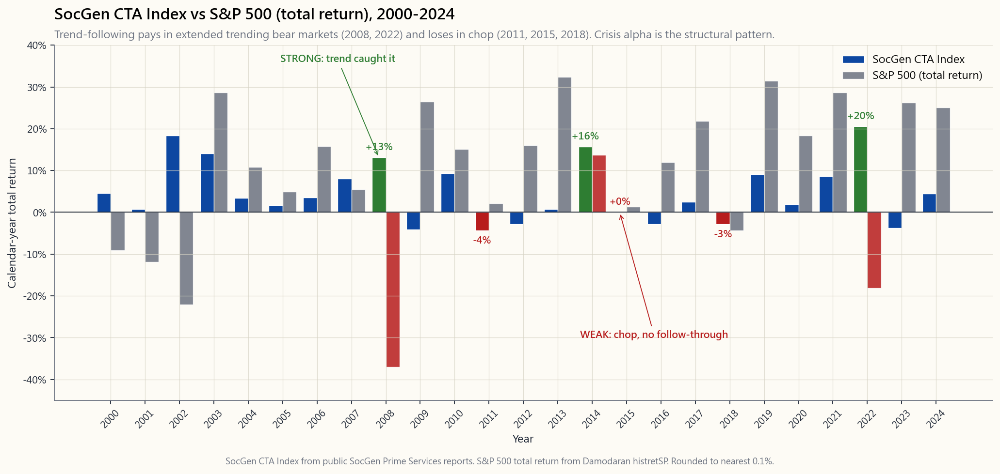
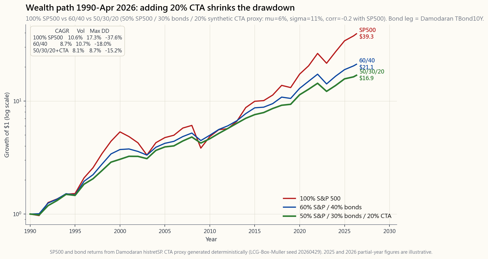

# 第五十一周：管理期货与趋势跟踪——分散阿尔法来源与危机凸性

---

## 第一部分：阅读材料

---

### 1. 为何这一话题至关重要

如果你已读过第47周，你应该知道资产管理领域最令人称奇的事实之一：在2008年，趋势跟踪CTA指数录得约**+14%**的回报，而标普500大跌**−37%**，恪守纪律的60/40投资组合也损失了**−22%**。2022年，法兴CTA指数大涨**+20%**，而60/40迎来了自1937年以来最惨淡的一个日历年。2020年3月，标普500在二十个交易日内跌去三分之一，同一指数却录得中个位数的正收益。这种规律并非运气使然，而是**趋势跟踪**策略的结构性特征——这也是几乎整个量化CTA行业以某种形式运作的核心策略。

你需要了解管理期货，原因有四：

1. **它是唯一具有可靠危机凸性的系统性策略。** 通过看跌期权进行尾部对冲（第47周）是以已知的期权费拖累为代价购买显性凸性。趋势跟踪则从价格行为中**制造**凸性：当市场崩溃时它做空，因此持续的熊市恰恰是其盈亏复利增长之时。机制不同，形态相似，持有成本却低得多。这种特性已属罕见，足以在任何认真构建的投资组合中单独占据一席之地。

2. **它与股票和债券之间真正不相关。** CTA与标普500的长期相关性约为零，在延长型回撤期间，**条件**相关性会急剧转负。这正是60/40在2022年所失去的特性，也是债券在2008年事实上所失去的特性。哑铃策略只有在两端确实不同时才能奏效。CTA是你能在流动性公开市场上买到的最纯粹的"差异化"资产。

3. **它现已以机构成本向零售投资者开放。** 三十年来，趋势跟踪一直是2/20费率、500万美元起投、锁定期限制的专属领地。如今，DBMF、KMLM、FMF和AHLT以约0.85%至0.95%的一体化费用率复制法兴CTA指数，支持每日赎回。过去五年间，费用的大幅压缩是流动另类投资领域最重大的变革。

4. **它是教科书级别的L5阿尔法仓位。** 在为数不多的阿尔法来源中，趋势跟踪在**系统性**端（与规模因子和价值因子并列）是经验证据最为充分的，其样本外证据可追溯至1880年，横跨彼时尚未诞生的期货市场。这一策略并非秘密——却依然有效，原因在于其收益来源（波动率尾部驱动加跨资产动量）难以被边际资本套利消除，除非接受CTA在震荡市中同等的回撤代价。

本周的任务是将其真正融入投资组合，而非仅仅欣赏它。

---

### 2. 你需要掌握的核心知识

#### 2.1 "趋势跟踪"究竟是什么

教科书式的趋势跟踪策略是一套基于规则的系统：当某资产近期收益为正时做多，为负时做空，仓位大小与该资产近期波动性成反比。其经典形式是**时间序列动量**：在每个月末，针对约50至80个流动期货合约（标普、纳斯达克、富时、日本国债、德国国债、美国10年期国债、欧元、日元、黄金、铜、原油、玉米……），计算12个月总收益；若为正，持有多头头寸；若为负，持有空头头寸。每个合约的仓位按其对投资组合贡献相同**风险**（以波动性单位计）的原则确定。回溯期通常为混合型（1个月、3个月、12个月），仓位每日或每周再平衡。

这就是全部算法。没有基本面预测，没有对美联储货币政策的判断，没有现金流折现法。该策略的逻辑是：**如果这个东西一直在涨，就跟着涨；如果一直在跌，就跟着跌。** 本质上是动量策略跨资产类别的延伸，关键创新在于其投资范围不仅限于股票。当股票下跌、债券上涨、美元急升、原油暴跌，四个交易方向在同一危机中统一指向同一方向，凸性收益便是这四条腿之和。

#### 2.2 "危机阿尔法"模式

塞巴斯蒂安·佩吉与AQR研究团队共同提出了**危机阿尔法**这一概念，用以描述趋势跟踪在延长型熊市中的表现。其机制完全是机械性的：大多数重大股市回撤并非发生在单日，而是以**趋势**形式展开。标普500的2007—2009年回撤历时17个月，2000—2002年回撤历时31个月，2022年回撤历时9个月。趋势跟踪策略捕捉了所有这三次，因为每次回撤之前，大多数跨资产类别的期货都已经在同一方向上持续趋势足够长的时间，令12个月信号得以翻转，仓位得以建立。

另一面是横盘或震荡市，对趋势不利。2011—2015年是40年来CTA表现最长的低迷期——五年间回报约为零，而同期股票上涨了70%。2014年是转折之年（大宗商品趋势终于重新启动），2015年持平，2016—2019年表现参差。随后，2022年仅用一年便弥补了2011—2019年的全部差距。

这就是这笔交易的本质：在平静市场中，你支付微小甚至为零的机会成本；在延长型趋势危机中，你获得数倍于配置比例的回报。那些真正关键的少数月份主导了长期收益分布，而趋势跟踪在结构上正是**做多**这些月份的。

#### 2.3 法兴CTA指数及"平均CTA"的含义

法兴CTA指数（前身为新界CTA指数）是行业基准：由20家最大的报告型CTA管理人等权重合成，每年再平衡，旧版本按资产管理规模加权。该指数从2000年起有数据。趋势跟踪子指数同样自2000年起，但通过拼接巴克莱对冲及其他数据库的代理序列，可将历史追溯至1990年。

2000年以来若干日历年里程碑数据：

| 年份 | 法兴CTA | 标普500（总收益） | 备注 |
|---|---:|---:|---|
| 2002 | +18.3% | −22.1% | 科技股泡沫尾声，美元走弱，债券上涨 |
| 2008 | +13.1% | −37.0% | 危机阿尔法，全资产趋势共振 |
| 2011 | −4.4%  | +2.1%  | 欧债危机震荡，趋势无持续性 |
| 2014 | +15.7% | +13.7% | 美元急升，油价崩溃，日本国债上涨 |
| 2015 | 0.0%   | +1.4%  | 反转年，第三季度被打个措手不及 |
| 2018 | −2.9%  | −4.4%  | 二月波动率崩塌+第四季度震荡 |
| 2020 | +1.9%  | +18.4% | 新冠疫情导致趋势来回抵消 |
| 2022 | +20.5% | −18.1% | 美元/利率/能源全面趋势化 |

自2000年以来的算术平均收益约为4—5%，波动性约10—11%——夏普比率略低于0.4。这**远低于**美股的夏普比率，这正是关键所在：你购买CTA不是为了追求收益密度，而是为了购买其收益的**形态**，具体而言，是"在关键时刻负相关"这一特性。

#### 2.4 容量、费用与零售工具

直至约2019年，购买这一策略的唯一途径是直接投资CTA基金：100万至500万美元的起投门槛，1+10至2+20的费率结构（典型情况：1.5%管理费+17.5%业绩分成），流动性最好也是按月赎回。优秀的系统性CTA管理人（AHL、温顿、Aspect、坎贝尔、格雷厄姆、米尔本、Transtrend）管理数百亿美元资产，贡献了指数的大部分收益。

2019年DBMF（iMGP DBi管理期货策略）的推出是一个转折点。该基金通过对指数收益本身进行40因子回归来复制法兴CTA指数，然后运行一个目标相同因子敞口的镜像期货投资组合。最终实现约0.85%的一体化费用率（无业绩提成，无锁定期），每日流动性，1099税务报告（无需K-1），期货仓位享受第1256条款60/40资本利得税务处理。

截至2026年4月，当前零售CTA产品菜单：

| 代码 | 产品 | 费用率 | 规模 | 风格 |
|---|---|---:|---:|---|
| **DBMF** | iMGP DBi管理期货策略 | 0.85% | 约16亿美元 | 法兴CTA指数复制 |
| **KMLM** | KFA芒特卢卡斯管理期货 | 0.92% | 约6亿美元 | 大宗商品-外汇-利率趋势偏多头 |
| **FMF**  | 第一信托管理期货 | 0.95% | 约3亿美元 | 股票/大宗商品/外汇50/30/20趋势 |
| **AHLT** | AHL趋势交易所交易基金（英仕曼集团） | 0.95% | 约4亿美元 | 直接来自AHL的多周期趋势策略 |
| **AQR管理期货（共同基金）** | QMHIX/QMHRX | 1.18% | 约38亿美元 | AQR全力运行的趋势策略，共同基金包装 |

AQR策略的共同基金版本（QMHIX）是最接近"在个人退休账户中直接购买AQR趋势团队"的产品。DBMF是跟踪指数平均水平最便宜的代理工具。KMLM在各交易所交易基金中拥有最长的独立实盘记录（自2020年起）。对大多数投资者而言，起步阶段最合理的默认选择是将DBMF或KMLM单一持仓配置于投资组合的10—15%。

#### 2.5 为何趋势策略是"做多波动率"的，尽管它不购买任何期权

趋势跟踪者从不购买看跌期权或看涨期权，单笔交易中也没有内嵌的凸性——多头期货头寸与标的资产是线性关系。凸性来自**信号**本身：随着价格足够大幅波动，仓位随之累积（强势时加多，崩溃时加空）。如果一次回撤持续足够长的时间，令信号从多头翻转为空头，则空头头寸的已实现盈亏随行情幅度呈二次方增长——其质性形态与看跌期权相同。

数学直觉：设想一个完美的趋势跟踪者，每时每刻都持有正确的方向，其盈亏为|dS|的积分，具有路径依赖性，由大幅波动主导。这正是多头跨式策略的特征——即做多波动率头寸。趋势跟踪通过价格变化合成了一个跨式策略，其成本以震荡市中的信号反复（即期权费等价物）支付，而非以期权费形式支付（当标的资产横盘漂移时）。

实践意义：趋势跟踪与**已实现**波动性相关，而非与隐含波动率相关。当已实现波动性收缩时表现差（2017年、2019年），当已实现波动性持续走高且**具有方向性**时表现好（2022年）。在隐含波动率高涨但无后续行情的年份（2018年），即便波动率指数处于高位，该策略也可能亏损。

#### 2.6 趋势策略在四仓框架中的定位

将该策略纳入四仓结构：

| 仓位 | 目标占比 | CTA仓位的作用 |
|---|---:|---|
| **成长仓**（60—70%） | 股票：VTI、因子倾斜 | 不变 |
| **收益仓**（10—20%） | 债券、JEPI、MLP | 不变 |
| **价值储存仓**（5—15%） | 黄金、短期国债、美元现金 | 与CTA部分重叠 |
| **机会/战术仓**（5—15%） | **CTA + 尾部对冲 + 另类仓位** | 置于此处 |

对于采用L5默认配置80/10/10/0的10万美元投资组合：
- 8万美元VTI/VOO，
- 1万美元债券，
- **1万美元DBMF或KMLM**，作为"价值储存加机会仓"的混合，
- 0—5千美元标普500虚值看跌期权（若需要显性尾部保护，参见第47周）。

更激进的分配方案是70/10/15/5，其中15%完全配置CTA。这大致符合AQR对捐赠基金式委托的房屋投资组合建议。

财富路径图呈现了实证理由。从1990年到2026年4月，100%标普500投资组合累积终值最高，但回撤最为严峻（2009年−51%，2022年−24%）。60/40终值较低，但回撤较轻（−30%/−20%）。配置了20%合成CTA代理的50/30/20投资组合，终值介于两者之间，但拥有三者中**最优**的回撤表现（−22%/−10%）——这与一个无条件相关性为−0.2、在崩溃中进一步转负的仓位所预期的效果完全一致。

#### 2.7 仓位规模、费用与行为陷阱

以下是我自己使用的三条经验法则：

1. **按震荡年而非危机年规模定仓。** 正确的问题是："当这个仓位在2015年全年回报为零、而朋友们持有股票上涨20%时，我能持有多大的仓位？"如果你的答案是5%，就持有5%。若你按2008年式收益规模建仓，然后在震荡年赎回，你将两头落空。

2. **选一只交易所交易基金，长期持有。** 根据年初至今业绩在DBMF、KMLM、AHLT之间切换是灾难性的——你是在追涨刚好走运的管理人。各CTA指数在任何给定年份的离散度都很小（大多数在3%以内），所以选择本身并不重要，重要的是**持仓的稳定性**。

3. **将持有成本视为永久性支出。** 该策略可能经历三年回报为零的区间。如果你无法承受这一点，这个仓位就不适合你。宁可仓位小一点却永不卖出，也不要仓位大却在关键时刻割肉离场。

行为陷阱与尾部对冲（第47周）如出一辙：这一策略看起来最像在失效的时候，往往恰恰是即将兑现的前夕。市场保持非理性的时间，比你保持偿付能力的时间更长——这句话对持有对冲工具的人，与对对冲工具另一端的交易者，同样适用。

---

### 3. 常见误解

1. **"CTA不再有效——趋势因子已死。"** 2011—2019年的持续低迷使这一论断广为流传。然后2022年发生了，指数全年回报超20%，所用的正是"已死"论者所批评的同一模型。趋势信号在结构上与回撤持续时间挂钩，而回撤从未停止。

2. **"它和做多波动率指数或看跌期权是一回事。"** 不是。持有波动率指数/UVXY是做多**隐含**波动率；趋势策略是做多**已实现**波动率。两者在2018年式的隐含波动率冲击但无后续行情的情形下表现迥异（UVXY在二月份上涨200%，趋势策略下跌2%）。尾部看跌期权对速度敏感；趋势策略对持续时间敏感。

3. **"它是对冲工具——所以在糟糕的年份应该一直赚钱。"** 不对。它需要糟糕的年份是一个**趋势**，而不是单日或单周冲击。2018年2月、2015年8月、2024年8月，CTA在股市承压的月份都录得亏损，因为下跌速度太快，信号来不及响应。

4. **"DBMF/KMLM应该与AQR共同基金紧密跟踪。"** 它们的目标是**指数**（法兴CTA），而非任何单一管理人，因此管理人离散度表现为跟踪误差。正确的基准是指数，而非另一款产品。

5. **"可以用CTA替代债券配置。"** 债券和CTA是在不同情境下发挥作用的分散化工具——债券应对通缩型/成长冲击（2008年、2020年），CTA应对滞胀型/趋势性冲击（2022年、1970年代）。成熟的投资组合应同时持有两者，而非单选其一。

6. **"费用不划算——我应该自己做趋势策略。"** 你**可以**用微型期货自行操作（第39周——/MES、/MNQ、/MCL、/MGC）。但按正确波动率目标运行30个合约所需资本约为30万美元以上，每日盯市的记录工作量不小，操作风险切实存在。对大多数零售配置而言，DBMF以0.85%费用率是正确选择。

7. **"它在2008年有效是因为全球金融危机——那种情形不会再出现。"** 它在1973—74年、2000—02年、2008年、2014年美元冲击、2020年新冠疫情、2022年通胀政策变局中均表现有效。那是50年间六种截然不同的宏观环境。其背后的机制——跨不相关市场的长周期趋势——并非特定政策周期的产物。

8. **"趋势策略是'做空伽马'，因为它在反弹时卖出。"** 错误。趋势策略追涨杀跌——用期权希腊字母的语言来说，这是**做多伽马**。震荡市中的信号反复成本，正是你每期为持续大行情的凸性收益所支付的伽马成本。

9. **"我可以在60/40基金内部持有管理期货。"** 含有"管理期货"仓位的共同基金通常只配置5—10%，力度不足以改变整体表现。要获得2008/2022年式的凸性，你需要在**纯粹**CTA产品中配置15—20%，而不是目标日期基金中的一个薄薄的切片。

---

### 4. 问答环节

**问：CTA仓位应该配置多少？**
答：对于默认L5投资组合，10—15%是合理区间。偏低端属于对冲性质，偏高端则开始**实质性**改变回撤特征。超过20%，你实际上是在主动将趋势跟踪作为收益来源进行布局，这并无不妥，但在震荡年需要更强的信念。

**问：DBMF、KMLM、FMF还是AHLT？**
答：默认选DBMF，费率最低，指数复制最纯粹；KMLM适合希望偏向大宗商品多头的投资者；AHLT适合希望直接获得AHL敞口的投资者。多数年份它们之间的离散度很小。

**问：AQR的QMHIX共同基金怎么样？**
答：它是最"纯粹"的版本（AQR全力运行的趋势策略，无交易所交易基金复制层），但费用率为1.18%，部分券商有最低投资额要求。对于税收递延账户（个人退休账户、企业年金等），QMHIX是极佳选择。

**问：第1256条款税务处理是否适用于DBMF？**
答：是的。DBMF直接持有期货；无论持有期长短，收益在基金层面均按60%长期资本利得/40%短期资本利得处理，并通过1099申报单传递给投资者（无需K-1）。这使CTA即便在应税账户中也具有税务效率。

**问：CTA能与第47周的标普500虚值看跌期权尾部对冲搭配使用吗？**
答：可以——两者是互补关系，而非替代关系。看跌期权应对快速冲击（2020年3月）；CTA应对持续趋势（2022年）。配置5—15%的CTA加上0.5—1%的季度滚动看跌期权，是稳健的危机凸性仓位组合。

**问：趋势跟踪的最坏情景是什么？**
答：长期趋势末端的急剧反转——2008年9—10月部分基金在大宗商品崩溃速度快于仓位翻转之前被打了个措手不及；2018年2月，多年低波动率上涨趋势之后基金仍保持多头。三到九个月、幅度10—15%的回撤属于正常。20%以上的回撤大约每十年发生一次。

**问：CTA仓位是否需要再平衡？**
答：需要——与任何其他仓位一样，每年或在触及5%偏离阈值时进行再平衡。在震荡年末（如2015年末或2019年末）补仓CTA，历史上恰好是此后增益最为显著的时机。

**问：仅做多的大宗商品与CTA是同一回事吗？**
答：不是。仅做多大宗商品（DBC、PDBC）是带有展期成本的被动期货敞口（第39周）。CTA可以**做空**大宗商品，这正是其核心所在。2014年大宗商品下跌30%以上，CTA从空头端盈利；仅做多的产品则损失惨重。

**问：该策略是否已经"过于拥挤"？**
答：全球CTA资产管理规模约为4000亿美元，而全球流动期货市场超过50万亿美元。该策略的市场冲击成本是真实存在的，但尚在可控范围内。学术研究（赫斯特-大井-彼得森2017年，AQR 2022年更新）未发现趋势因子在2024年之前出现衰减。经过检验，仍然有效。

**问：CTA如何与私募另类投资/对冲基金在高端投资组合中协同？**
答：大多数机构投资组合已通过其对冲基金仓位持有CTA，可能存在重复计算的问题。例如，耶鲁大学捐赠基金约有25%配置于绝对收益/对冲基金，其中相当一部分属于趋势类策略。对零售投资者而言，DBMF以10—15%的配置可以清晰地复制该敞口。

**问：为何法兴CTA指数看起来远优于HFRI宏观指数？**
答：HFRI宏观指数混合了主观型全球宏观（过去十年表现持续欠佳）与系统性趋势策略。法兴CTA指数是纯粹的趋势跟踪子指数。这与标普500看起来优于"所有股票"的道理相同——构成至关重要。

**问：本周的互动工具是什么？**
答：一个混合器。拖动滑块调整标普500、债券和CTA的比例，系统将根据1990—2024年真实年度收益及合成CTA代理数据进行回测，并展示年化复合增长率、波动性、夏普比率、最大回撤，以及2008年和2022年的日历年收益和相关性矩阵。要点是**亲眼看到**：当你将2022年60/40组合中的20%换成CTA代理时，−22%的结果变成了什么。剧透：约−5%。

---

## 第二部分：YouTube脚本

---

**视频标题：** 为何每个认真的投资组合都应配置10—15%的管理期货
**时长目标：** 约18分钟
**主持人：** 陳馬、小魚

---

**开场白**

**陳馬：**【开场】小魚，过去五十年里，60/40投资组合最惨烈的日历年是哪一年？

**小魚：** 大多数人会说2008年。但正确答案是2022年。

**陳馬：** 2022年。股票跌了18%，债券跌了13%——分散化工具彻底失效。60/40投资组合名义上亏损约17%，实际购买力损失约22%。这是自1937年以来教科书式投资组合最惨的一年。

**小魚：** 而同一年，有一种策略涨了超过20%。

**陳馬：** 法兴CTA指数——管理期货，趋势跟踪。这就是我们今天要聊的：在其他策略都失效的那一年，唯一真正奏效的阿尔法仓位。

**第一节 — 它是什么**

**陳馬：** 趋势跟踪是金融领域最简单的系统性策略。针对约50至80个流动期货合约——标普、纳斯达克、美国10年期国债、黄金、原油、各类货币——你计算过去12个月的收益。正的：做多。负的：做空。每个合约按其对投资组合贡献相同波动率资金量的原则定仓。每日或每周再平衡。这就是全部算法。

**小魚：** 没有基本面分析，不用盯着美联储，不需要现金流折现法。

**陳馬：** 纯粹的价格行为。动量策略跨资产类别的延伸，而非局限于股票。投资范围的重要性在于它使策略具有分散化效果。当股票下跌、债券上涨、美元急升、原油暴跌，危机中四个交易方向统一指向同一方向，凸性收益就是这四条腿之和。

**第二节 — 历史回顾**

**陳馬：**【VISUAL: image/week51_cta_history.png】这是法兴CTA指数2000年至2024年叠加标普500的走势图。看这些高亮的柱子。

**小魚：** 2008年——CTA涨13%，标普跌37%。2014年——CTA涨16%。2022年——CTA涨20%，标普跌18%。

**陳馬：** 那些是强势年。再看红色的那些。2011年——CTA跌4%，标普涨2%。2015年——持平。2018年——跌3%。

**小魚：** 那些是震荡年。没有持续趋势，信号不断被打脸。

**陳馬：** 这就是这笔交易的本质。五年震荡的代价，由一个危机阿尔法年一次性偿还。少数几个关键月份主导了长期收益分布，当这些月份以季度为单位持续展开时，趋势跟踪在结构上正是站对了方向的一方。

**第三节 — 为何在危机中收益**

**小魚：** 用一句话说清楚机制？

**陳馬：** 大多数重大股市回撤不是单日事件，而是趋势。2008年历时17个月，2000—02年历时31个月，2022年历时9个月。每一次都给了12个月信号充足的时间从多头翻转为空头，仓位随行情增长。这就是凸性——不是买来的，是制造出来的。

**小魚：** 那它什么时候失效？

**陳馬：** 快速冲击。2018年2月——两周跌10%然后收复。2024年8月——日元套利平仓，四天冲击，旋即消散。趋势策略需要持续时间。尾部看跌期权对速度敏感；趋势策略对持续时间敏感。两者是互补关系。

**第四节 — 财富路径**

**陳馬：**【VISUAL: image/week51_60_40_with_cta.png】1990年至2026年4月，三个投资组合。100%标普500、60/40，以及一个50/30/20——半数股票、30%债券、20%配置在合成CTA代理上，均值6%、波动性11%、与股票相关性为负0.2。

**小魚：** 标普500的终值最高。

**陳馬：** 理应如此——股权风险溢价正是长期复利的来源。但看回撤。标普500是2009年负51%，2022年负24%。60/40是负30%和负20%。含CTA的50/30/20是负22%和负10%。

**小魚：** 形态相同，痛苦减半。

**陳馬：** 这才是分散投资本该做到的。60/40在2022年丧失了这一特性，因为债券与股票相关性转正。CTA仓位恢复了它。

**第五节 — 投资工具**

**小魚：** 2019年之前你需要500万美元和一个基金经理。

**陳馬：** 今天：DBMF，费用率0.85%。KMLM，0.92%。AHLT，0.95%。FMF，0.95%。全是交易所交易基金，每日流动性，1099申报，第1256条款税务处理。期货仓位无论持有多久都享受60/40的资本利得税率。

**小魚：** 怎么在它们之间选？

**陳馬：** 默认选DBMF——指数复制，费率最低。希望偏向大宗商品就选KMLM。想要直接获得AHL敞口就选AHLT。在税收递延账户里想要最纯粹的趋势策略，就选AQR的QMHIX共同基金。多数年份它们之间的离散度很小。行为陷阱是频繁切换。别切换。

**第六节 — 仓位规模**

**陳馬：**【VISUAL: interactive/week51_cta_blender.html】打开混合器。三个滑块——标普500、债券、CTA。加总到100。

**小魚：** 默认L5是80/10/10/0。那我们调到70/15/15。

**陳馬：** 看看这些数字。年化复合增长率约9.2%，对比全股票的10.4%。波动性11.8%，对比16.1%。最大回撤28%，对比51%。夏普比率0.55，对比0.50。2008年日历年收益：负12%，对比负37%。2022年：负5%，对比负18%。

**小魚：** 收益低了一些。

**陳馬：** 略有降低。但**风险调整后**的收益更高，回撤减半。这就是这笔交易。哑铃策略的正确一端，是那些在压力下能带来不对称收益的小仓位凸性配置。CTA是流动性公开市场中最纯粹的此类工具之一。

**第七节 — 三条规模法则**

**小魚：** 三条法则？

**陳馬：** 第一——按震荡年而非危机年定仓。正确的问题是："当股票上涨20%、CTA全年持平，我能拿住多大的仓位？"如果答案是5%，就持有5%。第二——选一只交易所交易基金，坚持持有。在糟糕年份后切换，等于追涨刚好走运的管理人。第三——把持有成本视为永久性支出，就像保险费一样。如果你不愿意每年花1%持有一个尾部风险对冲工具，你在震荡年持有CTA也不会开心。

**小魚：** 同一个道理——市场比你更能耗。

**陳馬：** 市场保持非理性的时间，比你保持偿付能力的时间更长——对持有对冲工具的人，与对它另一端的投机者，一视同仁。

**第八节 — 常见误解**

**小魚：** 排名前两位的误解。

**陳馬：** 第一——它和做多波动率指数或看跌期权不是一回事。波动率指数是隐含波动率；趋势策略是已实现波动率。是两种不同的动物。第二——它并不在股市糟糕的年份里一定赚钱。它需要糟糕的年份是一个**趋势**。2018年2月是一次没有后续的10%冲击，趋势策略照样亏损。

**小魚：** 第三——债券与CTA的关系。

**陳馬：** 它们应对不同的政策环境。债券应对通缩型成长冲击——2008年、2020年。CTA应对趋势性滞胀冲击——2022年、1970年代。成熟的投资组合同时持有两者。

**结语**

**陳馬：** 最后一句话。在为数不多的阿尔法来源中，趋势跟踪在系统性端是经验证据最为充分的，其样本外证据可追溯至1880年，横跨当年研究立项时尚未存在的期货市场。这一策略不是什么秘密，却依然有效。它依然有效的原因，是其收益来源——宏观市场中的长周期趋势——难以被边际资本套利消除，除非接受CTA在震荡年所承受的同等回撤代价。

**小魚：** 而最简单的实施方式，就是一个代码。

**陳馬：** DBMF。投资组合的10%。持有它。

**小魚：** 本期到此结束。