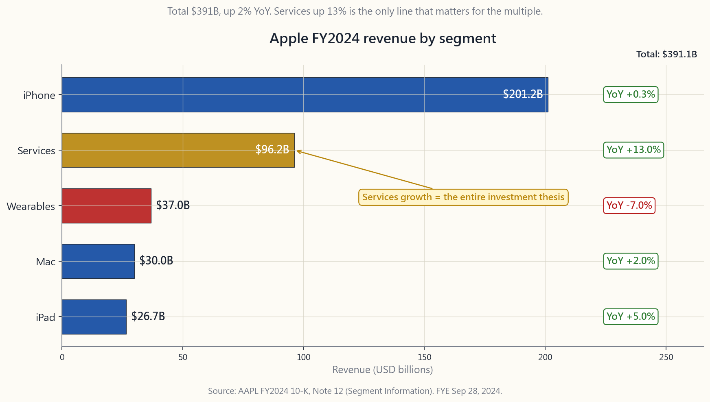

# 番外課 02：如何閱讀 10-K 年度報告

---

## 第一部分：閱讀材料

---

### 1. 為何這一課至關重要

10-K 是美國證券交易委員會（SEC）要求上市公司以書面形式如實披露的唯一文件，須由行政總裁及財務總監親筆簽署，並承擔個人刑事責任。它是資本市場中最接近宣誓證詞的存在——不同於郵寄給股東的精美年報，10-K 的每一個字都經過律師、審計師以及準備發起集體訴訟的原告律師反覆審閱。

散戶投資者必須學會閱讀 10-K 的四大理由：

1. **對沖基金所獲得的資訊，與你完全相同。** 月費四百美元席位的彭博分析師與零成本的散戶，讀的是同一份 PDF。專業人士的優勢在於*詮釋*，而非資訊獲取渠道。第八週已教授三張財務報表；本課教授的是包裹這些報表的外層架構——那些散戶最常略過、專業人士卻最先閱讀的部分。
2. **壞消息只在這裡出現。** 新聞稿精心篩選，業績發佈電話會議刻意美化。10-K 的「風險因素」及「法律訴訟」章節由律師撰寫，其職責是披露*足夠*的資訊，令日後的原告無法指稱公司有所隱瞞。若有什麼事情即將爆發——監管調查、專利到期、客戶集中風險——它必然最先在這裡出現。
3. **它可以全文搜尋。** SEC EDGAR 全文搜尋讓你能在所有曾提交的 10-K 中查詢任何詞語。找出上季所有提及「持續經營疑慮」的公司，找出所有披露內部控制「重大缺陷」的申報者——這是機構級別的篩選工具，完全免費，卻幾乎無散戶使用。
4. **它考驗的是技能，而非速度。** 一份 10-K 長達一百至三百頁。逐字閱讀需要整個週末。以專業方式閱讀只需四十五分鐘——因為你知道哪八個項目最重要，你用 `Ctrl-F` 搜尋四個預警詞語，並跳過那佔八成五的樣板內容。本課正是這套四十五分鐘的閱讀紀律。

更深層的意義在於：阿爾法極為罕見——散戶投資者所能擁有的那一點點阿爾法，大多藏於*閱讀別人不讀的申報文件*之中。不在於精密的模型，不在於更快的數據，而在於打開 EDGAR、使用 `Ctrl-F` 這種毫不光鮮的紀律。

---

### 2. 你需要掌握的知識

#### 2.1 10-K、10-Q、8-K——三份最重要的申報文件

SEC 要求上市公司提交三種核心定期披露文件。10-K 為年度報告，10-Q 為季度報告（每年提交三次——第四季併入 10-K），8-K 為事件驅動型報告，在定期申報之間發生任何*重大*事項時，須於四個工作日內提交。

10-Q 是 10-K 的輕量版：未經審計的財務報表、簡化的管理層討論及分析，以及僅在有變化時才更新的風險因素。你閱讀 10-Q 以追蹤季度環比趨勢；你閱讀 10-K 以*深入了解業務本質*。10-Q 是心率監測儀；10-K 是年度體格檢查。

8-K 代表意外事件。第 1.01 條（重大合約）、第 2.02 條（經營業績——業績發佈新聞稿在此披露）、第 4.01/4.02 條（審計師變更、不再依賴此前財務報表）、第 5.02 條（高管離任）以及第 8.01 條（其他重大事件）是具有交易影響的條款。第 4.02 條 8-K——「此前發佈的財務報表不應再被依賴」——是公司可提交的最糟糕申報。它幾乎總是預示着股價崩潰，並往往導致除牌。

申報期限按公司規模分級。大型加速申報者（公眾持股市值逾七億美元）須於財政年度結束後六十天內提交 10-K，並於四十天內提交 10-Q。加速申報者（七千五百萬至七億美元）分別為七十五天及四十天。非加速申報者則為九十天及四十五天。未能按時申報的公司須提交 NT 表格（延遲申報通知），申請十五天延期。*延遲申報本身就是一個信號。* 一家公司若無法按時完成結賬，問題不是出在賬目上，就是出在負責結賬的人身上，或兩者皆有。

關於財政年度：並非所有公司均以一月至十二月為財政年度。蘋果公司 2024 財年於 2024 年 9 月 28 日結束，微軟財年於 6 月 30 日結束，沃爾瑪財年於一月下旬結束（假日退貨周期後）。務必先閱讀封面——財政年度結束日期標示於右上角，直接影響你對季節性因素的解讀。

#### 2.2 標準四部分結構

每份 10-K 均遵循同一套法規強制規定的框架。一旦掌握這張地圖，查閱便成為機械式操作。

**第一部分——業務。** 第 1 條（業務）描述公司的業務內容、分部、客戶及競爭對手。第 1A 條（風險因素）是律師的坦白書——按嚴重程度遞減排列的所有潛在問題。第 1B 條（未解決的員工意見）標示 SEC 審查人員仍有待解決的問題；通常為空白，但若有內容，則意味着 SEC 仍在與管理層就披露事宜進行磋商。第 2 條（物業）、第 3 條（法律訴訟）及第 4 條（礦山安全）構成描述性章節的其餘部分。

**第二部分——財務報表。** 第 5 條（普通股市場）涵蓋股份回購及股息歷史。第 7 條（管理層討論及分析）是管理層對財務業績的敘述性解釋，包括非公認會計準則的調節說明。第 7A 條（市場風險的定量及定性披露）涵蓋利率、外匯及商品風險敞口。第 8 條（財務報表及補充數據）包含經審計的損益表、資產負債表、現金流量表及附註——即第八週所教授的核心內容。第 9A 條（內部控制及程序）包含內部控制聲明；若你看到「重大缺陷」字眼，請立即停下來仔細閱讀。

**第三部分——企業管治。** 第 10 至 14 條涵蓋董事、高管薪酬、股權結構、關聯方交易及審計師費用。大部分內容以引用方式納入，參照 10-K 提交約一個月後單獨提交的 DEF 14A（委託書）。薪酬表及關聯方交易披露是本部分最具參考價值的項目。

**第四部分——附件。** 第 15 條列出所有合約、債務協議及認證文件。附件索引看似枯燥，卻極具實用價值：在這裡你可以找到實際的貸款契約、已達到重要性閾值而須申報的客戶合約，以及行政總裁和財務總監依據第 302 條所作的認證。

#### 2.3 真正值得閱讀的八個項目

逐字閱讀整份 10-K 是新任分析師和律師的工作。對於投資而言，聚焦於以下八個項目：

1. **業務分部（第 1 條）。** 收入結構如何，又如何演變？一家「製造手機」但實際上靠「附帶服務的手機」盈利的公司，與純粹的硬件業務是截然不同的投資邏輯。蘋果服務分部佔收入比例從 2015 財年的 12% 升至 2024 財年的 25%，是任何蘋果分析師報告中最重要的一句話——而它就在第 1 條中。
2. **風險因素（第 1A 條）。** 只讀*前三條*。它們按嚴重程度排列。逐年新增的風險因素最為重要——將本年與上年的 10-K 作比對，差異之處正是管理層最新憂慮所在。
3. **法律訴訟（第 3 條）。** 閱讀每一宗具名訴訟。留意已披露的「或有損失」——當損失被認定為很可能發生且可合理估算時，公司須披露具體金額範圍。第 3 條中出現數字範圍代表真實財務影響；措辭含糊通常只是例行性披露。
4. **管理層討論及分析中的非公認會計準則調節（第 7 條）。** 每一個調整後每股盈利、調整後息稅折舊攤銷前盈利或有機增長數字，均須與公認會計準則數字進行調節。仔細閱讀哪些項目被加回。若「以股份為基礎的薪酬」被加回至調整後每股盈利，這是一個危險信號——這是一項以股份支付的真實持續性開支。
5. **損益表（第 8 條）。** 收入、銷售成本、經營開支、經營溢利、純利。須提供兩至三年的對比數據，令你可即時看出趨勢。
6. **現金流量表（第 8 條）。** 經營、投資、融資活動。第二十週的課程要點：純利可以被人為調整；來自經營活動的現金流則更難造假。經營活動現金流減去資本開支即為自由現金流——用以支付股份回購、股息及債務的數字。
7. **債務附註（第 8 條附註）。** 債務附註列出每一批次的到期日、利率及契約條款。債務到期牆就在這份附註中，「如發生違約，貸款人可加速還款」的條款亦在其中。務必查閱。
8. **期後事項（第 8 條附註，最後一條）。** 財政年度結束與申報日期之間發生的所有重大事項：收購、訴訟、債務發行、高管離任。這是公司在審計窗口期間發生事項的披露之所。

#### 2.4 進階工具：EDGAR 全文搜尋及四個 `Ctrl-F` 關鍵詞

兩個免費工具徹底改變你閱讀申報文件的方式。

第一個是 EDGAR 全文搜尋，網址為 `efts.sec.gov/LATEST/search-index?q=...`。你可以在任意時間窗口內搜尋每一家美國上市公司的每一份申報文件中的任何詞語。試試搜尋過去九十天內出現 `"going concern"`（持續經營疑慮）的申報——你將找到所有被審計師質疑能否在未來十二個月繼續經營的公司。這是任何零售工具都不會提供的篩選功能，因為它過於實用——而 SEC 已經免費提供給所有人。

第二個工具是 `Ctrl-F`。打開一份 10-K，在閱讀任何內容之前，先搜尋以下四個詞語：

- **"going concern"**（持續經營疑慮）——審計師已標示償付能力風險
- **"material weakness"**（重大缺陷）——內部控制已失效
- **"restate"** / **"restatement"**（重述）——此前財務報表存在錯誤
- **"subpoena"** / **"investigation"**（傳票/調查）——監管機構已介入

若出現上述任何詞語，請仔細閱讀相關段落。若均未出現，你已在三十秒內完成了原本需要三小時閱讀才能得出的初步判斷。

以一個實際案例說明：蘋果公司 2024 財年 10-K（財政年度截至 2024 年 9 月 28 日）。總收入 3,910 億美元，按年增長 2%。五個可報告分部分別為：iPhone 2,012 億美元（增長 0.3%）、服務 962 億美元（增長 13%）、Mac 300 億美元（增長 2%）、穿戴式裝置/家居/配件 370 億美元（下降 7%）、iPad 267 億美元（增長 5%）。上述數據中最重要的數字是*變化幅度*：服務錄得雙位數增長，而 iPhone 增長停滯，這正是 2024 年蘋果作為投資標的的完整故事。這句話出自第 1 條，分部數據表格來自附註十二（分部資料）。合共兩頁 10-K，閱讀時間五分鐘，而你已掌握了投資論點。

---

### 3. 常見誤解

1. **「10-K 太長，根本沒辦法讀。」** 若逐字閱讀，確實如此。上述八個項目的篩讀方式，對於熟悉的公司只需四十五分鐘，對新公司也只需兩小時。
2. **「年報和 10-K 是同一回事。」** 並非如此。年報是宣傳材料，10-K 是依法宣誓的法律披露文件。請務必閱讀 10-K 版本。
3. **「風險因素都是樣板文字，可以跳過。」** 前三條通常是針對該公司的具體內容，並每年更新。本年與上年相比的*差異*是整份文件中最具參考價值的閱讀材料。
4. **「調整後盈利才是正確的數字。」** 調整後數字僅在你完全了解管理層所排除的項目時，才對趨勢分析有用。公認會計準則才是合約依據。
5. **「審計師已簽署，財務報表就是正確的。」** 審計師提供的是*合理保證*意見。重大錯誤陳述曾在四大會計師行的眼皮底下溜走。「內部控制重大缺陷」就是審計師承認其信心不足。
6. **「期後事項只是無關緊要的腳註。」** 有時確實如此。但最重大的併購公告、債務契約修訂及監管和解，恰恰出現在期後事項附註中——因為它們發生於財政年度結束後，卻必須予以披露。
7. **「EDGAR 很難用。」** EDGAR 的介面確實過時，但 efts.sec.gov 的全文搜尋功能運作完善，且完全免費。
8. **「外國申報文件同等可用。」** 並非如此。外國私人發行人提交的是 20-F，雖然同為年度報告，但詳細程度不及 10-K，且申報時效性較差。選擇在美國上市的公司，部分原因正是其所適用的信息披露制度。

---

### 4. 問答環節

**問題一：10-K 須在財政年度結束後多久提交？**
大型加速申報者（公眾持股市值逾七億美元）為六十天，加速申報者為七十五天，非加速申報者為九十天。未能按時申報的公司須提交 NT 10-K 表格，申請延期十五天。

**問題二：10-K 與年報有何分別？**
年報是郵寄給股東的宣傳文件。10-K 是具法律約束力的 SEC 申報文件。越來越多大型公司直接以 10-K 作為年報（如巴郡、摩根大通），但規模較小的公司仍會另行發行精美版本。請務必閱讀 10-K。

**問題三：10-K 是否經過審計？** 是的。財務報表（第 8 條）由獨立的已登記公共會計師事務所審計。10-K 的其餘部分由審計師就與財務報表的一致性進行*複核*，但並非單獨審計。

**問題四：「重大缺陷」的實際含義是什麼？** 這意味着公司的內部財務控制存在嚴重缺失，嚴重程度足以導致財務報表出現重大錯誤陳述而未被察覺。這是審計師在拒絕簽署以外最強烈的公開負面信號。

**問題五：分部數據確切在哪裡找到？** 第 1 條（業務）提供定性的分部描述。定量的分部收入及經營溢利表格則位於財務報表附註中，通常標題為「分部資料」——視公司而定，一般為附註十一、十二或十三。

**問題六：「持續經營疑慮」是什麼意思？** 根據公眾公司會計監督委員會審計準則 AS 2415，若審計師對被審計實體在未來十二個月內持續經營的能力存在*重大疑問*，須在報告中加入強調段落。這是審計師向市場發出的警告：該公司可能在一年內無法繼續運營。幾乎每一份包含這兩個詞語的 10-K，都在十八個月內出現破產、攤薄性股權融資或困境債務重組。

**問題七：如何將本年 10-K 與上年進行比對？** SEC EDGAR Online Inline XBRL 查看器（sec.gov）提供自動並排比較功能。免費第三方工具如 Last10K 或 DiffWords（付費）亦可處理其餘工作。如需免費方法，可將兩份風險因素章節複製貼上至文字比對工具。

**問題八：XBRL 附件是什麼？** 自 2009 年起提交的每份 10-K 均須以可延伸商業報告語言標記——這是一種機器可讀的標記格式，允許任何工具以程式方式提取任意財務數據。這正是每個「股票數據」服務的數據基礎。

**問題九：我需要閱讀第 1A 條的所有風險因素嗎？** 不需要。只讀前三條（依 SEC 慣例按嚴重程度排列）以及*自上年以來新增的條款*。其餘三十至五十條風險因素大多是從同類公司申報文件及 Latham & Watkins 範本複製而來的樣板文字。

**問題十：在美上市的外國公司的 10-K 情況如何？** 外國私人發行人提交的是 20-F 而非 10-K。20-F 同樣為年度報告，包含類似資訊，但申報時效性較低（財政年度結束後四個月，相較於六十天），且採用國際財務報告準則或本國公認會計準則，而非美國公認會計準則。台積電、阿斯麥、豐田、諾和諾德的美國預託憑證均提交 20-F。

**問題十一：如何找到某公司最新的 10-K？** 前往 sec.gov/edgar，在搜尋框輸入股票代號，點擊「Filings」，按表格類型「10-K」篩選。最新申報顯示於頂部。或使用以下直接網址格式：`sec.gov/cgi-bin/browse-edgar?action=getcompany&CIK=<股票代號>&type=10-K&dateb=&owner=include&count=40`。

**問題十二：我是否還需要閱讀委託書（DEF 14A）？** 若你計劃持有逾一年——是的。委託書是高管薪酬、關聯方交易及實際表決事項的所在地。行政總裁薪酬與員工中位數薪酬之比、審計師費用表以及控制權變更的黃金降落傘披露，均在委託書中，幾乎別無他處。

---

## 第二部分：YouTube 影片腳本

---

**影片標題：** 45 分鐘讀懂 10-K——真正值得閱讀的八個項目
**目標片長：** 約 11 分鐘
**主持人：** 陳馬、小魚

---

**[片頭 — 0:00]**

**陳馬：** 歡迎回來。今天是番外課——我們將深入了解一份包含美國上市公司所有重要資訊的文件：10-K 年度申報。

**小魚：** 今天有一個非常具體的目標：看完這條影片，你應該能夠下載蘋果公司的 10-K，並在一小時內提煉出投資論點。

**陳馬：** 熟練之後四十五分鐘，第一次需要兩小時。但完全值得，因為這份文件，對沖基金分析師和週日早晨坐在家裡的散戶，讀的是*完全相同的來源*。

**小魚：** 資訊獲取毫無優勢可言。優勢在於詮釋能力。

**[第一節 — 什麼是 10-K — 0:55]**

**陳馬：** 10-K 是美國上市公司向 SEC 提交的年度報告，依據《交易所法》第 13 條規定提交，由行政總裁及財務總監在個人刑事責任下親筆簽署。最後這一點至關重要。

**小魚：** 所以這與郵寄到家的那份精美年報完全不同。

**陳馬：** 截然不同。年報是宣傳材料，10-K 是宣誓披露文件。兩者看似相似，但 10-K 的每一個字都被擔心惹上官司的律師反覆審閱過。

**小魚：** 還有兩份相關文件——10-Q 和 8-K。

**陳馬：** 對。10-Q 是季度報告，內容較輕，未經審計，每年提交三次。第四季度的內容直接納入 10-K，所以不存在第四季 10-Q。然後是 8-K——這是突發性申報。發生重大事件，公司有四個工作日完成披露。

**小魚：** 四個工作日。業績發佈新聞稿就在這裡——8-K 的第 2.02 條。

**陳馬：** 而且，資本市場中最糟糕的申報也在這裡——第 4.02 條：「此前發佈的財務報表不應再被依賴。」一旦看到這份申報，就意味着公司在告訴市場，舊數字是錯的。這份申報幾乎必然預示着股價崩潰。

**[第二節 — 四部分框架 — 2:20]**

**小魚：** 好，讓我們打開一份來看看。帶我了解一下文件結構。

**陳馬：** 每份 10-K 都有四個部分，由 SEC 的 10-K 表格強制規定。第一部分是*業務*，第二部分是*財務報表*，第三部分是*企業管治*，第四部分是*附件*。

[VISUAL: image/side02_10k_anatomy.png]

**小魚：** 每個部分下面還有編號條款。

**陳馬：** 是的。第一部分包含第 1 至 4 條，第二部分包含第 5 至 9 條，第三部分包含第 10 至 14 條，第四部分包含第 15 條。每家公司、每年的 10-K 編號方式完全相同。所以一旦你知道第 1A 條在哪裡，你就知道它在所有 10-K 中的位置。

**小魚：** 這正是 SEC 強制統一格式的用意——可比性。

**陳馬：** 現在看這張圖——那八個標成金色的條款，就是我第一個打開的。第 1、1A、3、7 和 8 條。加上第 8 條內部的損益表、現金流量表、債務附註以及期後事項附註。

**小魚：** 十五個條款中的八個。

**陳馬：** 這就是訣竅所在。你不是在讀兩百五十頁，你讀的大概只有四十頁。

**[第三節 — 你需要閱讀的八個項目 — 3:55]**

**小魚：** 一條一條說。每個項目我應該找什麼？

**陳馬：** 第 1 條，業務——分部結構及其演變。第 1A 條，風險因素——只讀前三條，加上自上年以來的新增內容。第 3 條，法律訴訟——所有具名訴訟，尤其是附有數字損失範圍的。第 7 條，管理層討論及分析——閱讀非公認會計準則調節說明。管理層在「調整後每股盈利」中加回了什麼？若他們把以股份為基礎的薪酬加回去，那是在掩蓋一項真實的開支。

**小魚：** 然後是財務報表。

**陳馬：** 第 8 條包含損益表、資產負債表、現金流量表及附註。附註中要重點看兩個——債務附註，列出每一批次的到期日、利率及契約條款；以及期後事項附註，披露財政年度結束至申報日期之間發生的所有重大事項。

**小魚：** 期後事項。很多人會跳過這部分。

**陳馬：** 不應該跳過。收購公告在這裡出現，債務契約修訂在這裡出現，有時訴訟也在這裡。期後事項附註是一份以結束數月前的財政年度為主體的文件中，承載*最新消息*的地方。

**[第四節 — 蘋果 2024 財年實操案例 — 5:50]**

**小魚：** 我們來做一個真實案例。蘋果 2024 財年。

**陳馬：** 財政年度截至 2024 年 9 月 28 日，於 2024 年 11 月 1 日申報。總收入 3,910 億美元，按年增長 2%。

[VISUAL: image/side02_aapl_segments.png]

**小魚：** 分部結構就在這張圖上。

**陳馬：** 五個分部。iPhone 2,012 億美元，增長 0.3%。服務 962 億美元，增長 13%。Mac 300 億美元，增長 2%。穿戴式裝置、家居及配件——即 AirPods、Apple Watch、HomePod——370 億美元，*下降* 7%。iPad 267 億美元，增長 5%。

**小魚：** 其中最重要的數字是哪個？

**陳馬：** 服務分部的增長率。蘋果正在從一家硬件公司重新定位為一家軟件與服務公司。服務的毛利率超過六成，而 iPhone 大約是三成五。服務收入每增加一美元，流入盈利的速度幾乎是 iPhone 的兩倍。

**小魚：** 而這整個句子——整個投資論點——都來自一張分部數據表。

**陳馬：** 來自蘋果 10-K 的附註十二。兩頁。若你知道準確位置，五分鐘即可閱讀完畢，投資論點已在手中。

**[第五節 — 進階工具 — 7:30]**

**陳馬：** 兩個免費工具，鮮有人提及，卻能徹底改變你閱讀這些文件的方式。

**小魚：** 第一個。

**陳馬：** EDGAR 全文搜尋。SEC 已為每份申報的每個字建立索引。你可以前往 efts.sec.gov，輸入任何詞語，找到所有曾使用該詞語的公司。

**小魚：** 給我一個實用的搜尋示例。

**陳馬：** 搜尋過去九十天提交的包含「going concern」（持續經營疑慮）的申報。你將得到一份清單，列出所有被審計師質疑能否在十二個月內繼續經營的美國上市公司。對沖基金每月為這份清單支付數千美元的篩選服務費，而 SEC 免費提供給所有人。

**小魚：** 第二個工具。

**陳馬：** Ctrl-F。打開 10-K 後，在讀任何內容之前，先搜尋四個詞語。「Going concern」（持續經營疑慮）。「Material weakness」（重大缺陷）。「Restatement」（重述）。「Subpoena」或「investigation」（傳票或調查）。這四個詞語中任何一個出現在 10-K 中，都是立即暫停的信號。若全部未出現，你已在三十秒內排除了九成的問題個案。

**小魚：** 這就是一份核查清單。

**陳馬：** 正是。大多數散戶沒有這份清單。單是這一點，就已經是一種優勢。

**[第六節 — 互動工具 — 8:50]**

**小魚：** 我們在網站上有一個實習工具。

**陳馬：** 對，就是 10-K 導航器。你選擇一個股票代號——蘋果、微軟、可口可樂、摩根大通、福特、Meta、英偉達。它會直接從 EDGAR 提取最新的 10-K，在頁面上即時顯示分部圖表，並摘要列出前三大風險因素——也就是你打開實際文件後會首先閱讀的那幾條。

[VISUAL: interactive — interactive/side02_10k_navigator.html]

**小魚：** 所以在閱讀實際文件之前，可以先用它做初步篩選。

**陳馬：** 或者用來比較。選擇福特和蘋果，看看各自的首要風險因素。福特的第一條風險因素提到週期性及供應鏈中斷，蘋果的第一條提到競爭激烈及對少數幾款產品的依賴。並排閱讀這兩段，你就能在一段話的篇幅內，了解這兩家公司各自身處什麼樣的行業。

**[結尾 — 9:55]**

**小魚：** 總結一下。

**陳馬：** 三點。第一，10-K 才是那份最重要的文件。不是年報，不是新聞稿，不是分析師報告。10-K 是宣誓披露，真相在這裡。

**小魚：** 第二。

**陳馬：** 八個項目。第 1、1A、3、7、8 條——以及第 8 條內的損益表、現金流量表、債務附註、期後事項附註。這就是你的閱讀清單。熟悉的公司四十五分鐘，新公司兩小時。

**小魚：** 第三。

**陳馬：** 四個詞語。持續經營疑慮。重大缺陷。重述。調查。先用 Ctrl-F 搜尋，再開始閱讀。任何一個命中，放慢腳步。全部未中，你已在不到一分鐘內排除了最糟糕的情況。

**小魚：** 阿爾法極為罕見。低調版本的阿爾法，是在週日早晨坐下來，讀一份別人都沒讀過的申報文件。

**陳馬：** 這就是這一課的精髓。申報文件是免費的，閱讀是一種技能。下一堂番外課見。

**[結束]**